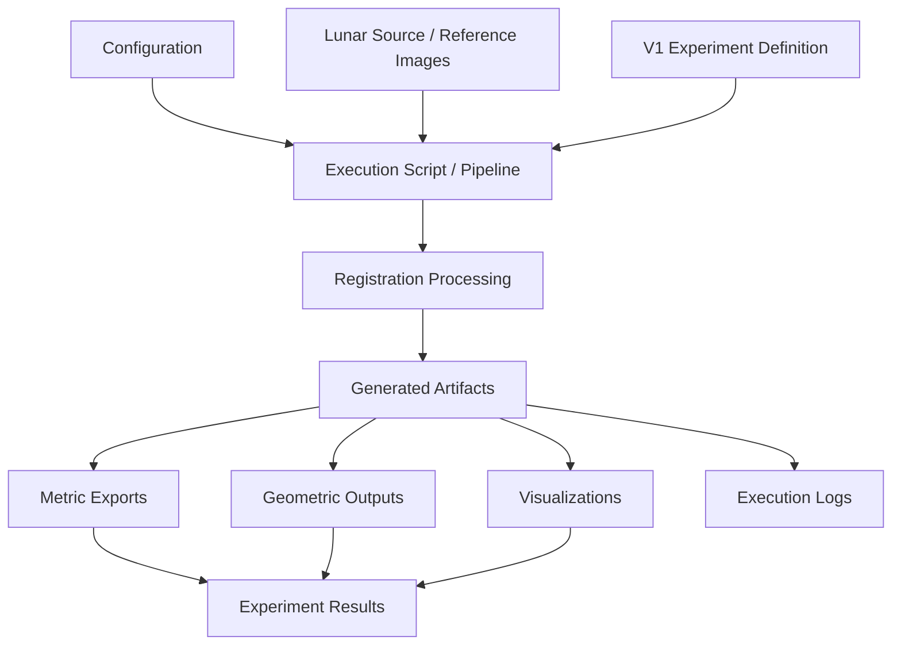
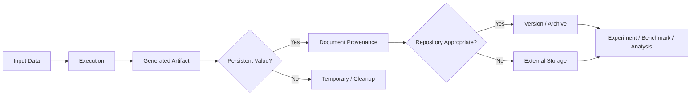

# Artifacts

## Overview

The `artifacts/` directory contains generated and derived outputs produced by the ChandraMap software, experimentation, evaluation, benchmarking, and research workflows.

An **artifact** is a file or object created as a consequence of executing part of the project workflow.

Artifacts are not the primary source code, experiment definitions, datasets, or research documentation. They are the **produced outputs and supporting execution objects** that allow a workflow to be inspected, reproduced, debugged, evaluated, or communicated.

For ChandraMap, artifacts are particularly useful because lunar image registration is an image-processing and scientific workflow rather than a single deterministic software operation. Intermediate representations, correspondence visualizations, geometric outputs, evaluation exports, logs, and reproducibility metadata can all help establish what a pipeline actually produced.

The exact current contents of `artifacts/` are **[To be verified]**. This document therefore distinguishes between:

- **Existing project behavior** — behavior explicitly established by the repository documentation.
- **Recommended artifact policy** — a proposed organization or practice that should only be treated as implemented after it is added to the repository.

---

## Why `artifacts/` Exists

ChandraMap workflows can generate files that are useful after an execution has completed.

For example:

```text
Configuration
     │
     ▼
Script / Pipeline
     │
     ▼
Input Lunar Images
     │
     ▼
Processing
     │
     ├── Preprocessed Images
     ├── Feature Outputs
     ├── Correspondence Outputs
     ├── Geometric Outputs
     ├── Visualizations
     ├── Evaluation Data
     └── Execution Metadata
     │
     ▼
Artifacts
     │
     ├── Inspection
     ├── Debugging
     ├── Reproducibility
     ├── Benchmarking
     └── Scientific Analysis
```

Without a clear distinction between generated outputs and source material, repositories can become difficult to reproduce and maintain.

The `artifacts/` directory provides a conceptual home for generated outputs that are useful beyond the immediate execution that produced them.

---

# What Is an Artifact?

In ChandraMap, an artifact is:

> **A generated, derived, serialized, exported, cached, or otherwise produced file/object created by executing part of the project's software, research, experimentation, evaluation, or benchmarking workflow.**

An artifact normally has an origin.

That origin should ideally be traceable to:

- an experiment,
- a benchmark,
- a script,
- a notebook,
- a configuration,
- a source dataset,
- a processing method,
- or another documented workflow.

A useful mental model is:

```text
Source Inputs
      │
      ▼
Configuration
      │
      ▼
Code / Script / Notebook
      │
      ▼
Execution
      │
      ▼
Generated Artifact
      │
      ▼
Analysis / Evaluation / Communication
```

---

# Artifact Categories

Potential ChandraMap artifact categories include:

| Category                    | Example                                           | Status                           |
| --------------------------- | ------------------------------------------------- | -------------------------------- |
| Registration visualization  | Source/reference overlay                          | `[Recommended / To be verified]` |
| Matching visualization      | Correspondence or inlier visualization            | `[Recommended / To be verified]` |
| Geometric output            | Estimated transformation or projected coordinates | `[Recommended / To be verified]` |
| Residual visualization      | Registration error/residual plot                  | `[Recommended / To be verified]` |
| Metric export               | Serialized evaluation metrics                     | `[Recommended / To be verified]` |
| Transformed image           | Registered or warped image                        | `[Recommended / To be verified]` |
| Intermediate representation | Gradient/structural representation                | `[Recommended / To be verified]` |
| Execution log               | Pipeline execution information                    | `[Recommended / To be verified]` |
| Benchmark export            | Generated benchmark summary                       | `[Recommended / To be verified]` |
| Report                      | Generated experiment report                       | `[Recommended / To be verified]` |
| Model output                | Output produced by an implemented model           | `[Recommended / To be verified]` |
| Cache                       | Reusable computational output                     | `[Recommended / To be verified]` |
| Reproducibility metadata    | Configuration/version/environment metadata        | `[Recommended / To be verified]` |

These categories describe an artifact policy. They do not imply that every category currently exists in the repository.

---

# Artifacts vs Other Repository Components

The most important artifact-management rule is to keep generated outputs conceptually separate from the files that define or explain the work.

```text
Artifacts
    │
    ├── Generated outputs
    ├── Intermediate outputs
    ├── Serialized objects
    ├── Visualizations
    └── Execution metadata

Results
    │
    ├── Measured findings
    ├── Evaluated metrics
    └── Communicated experiment outcomes

Experiments
    │
    ├── Research questions
    ├── Experimental conditions
    ├── Methods
    └── Evaluation protocols

Research
    │
    ├── Scientific context
    ├── Literature
    ├── Research notes
    └── Future directions

Scripts
    │
    ├── Execution logic
    ├── Automation
    └── Reusable processing commands

Notebooks
    │
    ├── Exploration
    ├── Visualization
    └── Interactive analysis

Datasets
    │
    ├── Source imagery
    ├── Reference data
    └── Ground-truth/input data
```

---

# Artifacts vs Results

This distinction is especially important for ChandraMap.

## Artifacts

Artifacts are **produced files or objects**.

Examples:

```text
registration_overlay.png
matches.json
transform.npy
residual_plot.png
execution.log
metrics.json
```

## Results

Results are **evaluated outputs or findings that communicate what an experiment measured**.

For example:

```text
Experiment:
    SIFT baseline

Measured:
    inlier count
    inlier ratio
    independent RMSE
    spatial coverage
    runtime

Result:
    documented evaluation of the experiment
```

An artifact may support a result without itself being the result.

For example:

```text
Generated residual plot
        │
        ▼
Artifact
        │
        ▼
Used to inspect residual behavior
        │
        ▼
Experiment interpretation
        │
        ▼
Documented result
```

The exact organization of result files is defined by `results/` documentation and should not be duplicated unnecessarily inside `artifacts/`.

---

# Artifacts vs Experiments

An experiment defines **what is being tested**.

An artifact is something **produced when that experiment is executed**.

```text
Experiment Definition
        │
        ├── Research question
        ├── Dataset/input
        ├── Configuration
        ├── Method
        ├── Metrics
        └── Evaluation protocol
        │
        ▼
Experiment Execution
        │
        ▼
Artifacts
```

For example, an experiment may specify a comparison involving:

- SIFT,
- scale variation,
- gradient representations,
- affine transformation,
- homography,
- residual analysis,
- or subpixel refinement.

The experiment documentation defines the protocol.

The execution may produce overlays, intermediate images, correspondence files, transformation parameters, logs, and metric exports.

Those generated files are artifacts.

---

# Artifacts vs Source Code

Source code defines how ChandraMap operates.

Artifacts are outputs produced by executing that code.

```text
Source Code
     │
     ▼
Execution
     │
     ▼
Artifact
```

Source code should therefore not be copied into `artifacts/`.

Examples of source code that should remain in their appropriate source directories include:

- registration implementations,
- feature-processing implementations,
- evaluation functions,
- backend logic,
- frontend logic,
- scripts,
- reusable utilities.

An exported copy of source code should not be treated as an artifact unless there is a specific documented reproducibility or release purpose.

---

# Artifacts vs Datasets

Datasets are inputs or source/reference data used by ChandraMap.

Artifacts are generally outputs derived from those inputs.

```text
Dataset
   │
   ▼
Processing
   │
   ▼
Artifact
```

For example:

```text
Lunar Image
    │
    ▼
Registration Pipeline
    │
    ├── Registered Image
    ├── Feature Visualization
    └── Transformation Output
```

The original lunar image is not an artifact merely because it was used by a workflow.

Similarly, a generated registered image is not automatically a new authoritative dataset.

Dataset ownership, provenance, licensing, storage, and distribution should remain governed by the project's data-management documentation.

---

# Artifacts vs Experiments, Results, and Research

The distinction can be summarized as follows:

| Repository area | Primary question                                                                |
| --------------- | ------------------------------------------------------------------------------- |
| `experiments/`  | **What are we testing?**                                                        |
| `scripts/`      | **How do we execute or automate it?**                                           |
| `notebooks/`    | **How do we explore and inspect it?**                                           |
| `artifacts/`    | **What files/objects did the workflow produce?**                                |
| `results/`      | **What did the evaluation measure or demonstrate?**                             |
| `research/`     | **What scientific context, interpretation, and future direction surrounds it?** |
| `data/`         | **What source/reference inputs are being used?**                                |
| `configs/`      | **Which parameters and settings define the execution?**                         |
| `tests/`        | **Does the implementation behave correctly?**                                   |

These boundaries should remain explicit.

---

# Relationship to Experiments

Artifacts should be traceable to the experiment that generated them whenever the artifact is experiment-specific.

A recommended relationship is:

```text
experiments/
    │
    │ defines
    ▼
Experiment Protocol
    │
    │ executed by
    ▼
scripts/ / pipeline
    │
    │ produces
    ▼
artifacts/
    │
    │ analyzed into
    ▼
results/
```

For ChandraMap V1, this is particularly important because multiple experiments investigate different aspects of the registration problem.

An artifact should not be ambiguous about which experiment produced it.

---

# Relationship to Benchmarks

Benchmarks establish standardized evaluation conditions.

Artifacts can support benchmark execution by preserving generated information such as:

- intermediate outputs,
- correspondence visualizations,
- transformation outputs,
- evaluation exports,
- execution metadata,
- benchmark-specific reports.

However:

> An artifact is not automatically a benchmark result.

A benchmark result should be produced according to the benchmark's documented evaluation protocol.

Conceptually:

```text
Benchmark Definition
       │
       ▼
Benchmark Execution
       │
       ├── Artifacts
       │     ├── Visualizations
       │     ├── Logs
       │     └── Intermediate Outputs
       │
       └── Evaluation
             │
             ▼
          Results
```

This distinction prevents generated files from being mistaken for validated benchmark evidence.

---

# Relationship to Notebooks

Notebooks are useful for:

- exploration,
- visualization,
- debugging,
- hypothesis investigation,
- result inspection,
- interactive analysis.

A notebook may generate artifacts.

For example:

```text
Notebook
   │
   ├── Load registration output
   ├── Plot correspondences
   ├── Inspect residuals
   └── Generate visualization
             │
             ▼
          Artifact
```

The notebook itself belongs under `notebooks/`.

Its generated files may belong under `artifacts/` when they have a documented purpose and are intended to persist.

Temporary notebook outputs should not automatically be committed.

---

# Relationship to Scripts

Scripts provide reusable execution and automation logic.

A script may generate artifacts:

```text
scripts/
   │
   ▼
Execution
   │
   ▼
artifacts/
```

For example, a script may:

1. load source/reference imagery,
2. apply configured preprocessing,
3. execute feature matching,
4. estimate geometry,
5. calculate evaluation metrics,
6. export visualizations.

The script remains source code.

The generated files are artifacts.

---

# Relationship to Research Documentation

Research documentation explains:

- scientific context,
- assumptions,
- methodology,
- literature,
- hypotheses,
- interpretation,
- future directions.

Artifacts provide evidence or intermediate computational outputs associated with that work.

```text
Research Documentation
        │
        ▼
Research Question
        │
        ▼
Experiment
        │
        ▼
Generated Artifacts
        │
        ▼
Evaluation
        │
        ▼
Research Interpretation
```

An artifact should not silently become a scientific conclusion.

Its scientific meaning must be established through the relevant experiment and evaluation protocol.

---

# Recommended Artifact Organization

If the repository does not already define a concrete artifact structure, a recommended structure is:

```text
artifacts/
├── README.md
├── experiments/                 # [Recommended]
│   ├── v1/                      # [Recommended]
│   │   ├── EXP-001/             # [Recommended]
│   │   ├── EXP-002/             # [Recommended]
│   │   └── ...
│   └── ...
├── benchmarks/                  # [Recommended]
├── visualizations/              # [Recommended]
├── intermediate/                # [Recommended]
├── logs/                        # [Recommended]
├── metadata/                    # [Recommended]
└── reports/                     # [Recommended]
```

This is a **recommended organization**, not a declaration that these directories currently exist.

The actual structure should be updated here once the repository establishes the corresponding directories.

---

# V1 Artifact Organization

The V1 workflow is experiment-driven.

The recommended relationship is:

```text
artifacts/
└── experiments/
    └── v1/
        ├── EXP-001-sift-baseline/
        ├── EXP-002-scale-pyramid/
        ├── EXP-003-gradient-representation/
        ├── EXP-004-affine-vs-homography/
        ├── EXP-005-residual-analysis/
        └── EXP-006-subpixel-refinement/
```

These names correspond to the established V1 experiment sequence in the project documentation.

The artifact directories themselves should only be created when the corresponding workflow produces persistent artifacts.

---

# V1 Artifact Flow

The intended V1 relationship can be represented as:



The important principle is that artifacts support the experiment and its evaluation; they do not replace the experiment definition or result documentation.

---

# Artifact Naming

Artifact names should make provenance understandable.

A recommended naming pattern is:

```text
<experiment>-<stage>-<artifact-type>-<identifier>.<extension>
```

For example:

```text
EXP-001-sift-baseline-matches-case-001.json
EXP-001-sift-baseline-overlay-case-001.png
EXP-004-affine-vs-homography-transform-case-001.json
```

These are naming examples, not existing repository filenames.

Where useful, names may encode:

- experiment ID,
- method,
- processing stage,
- case identifier,
- representation,
- artifact type,
- version.

Avoid ambiguous names such as:

```text
final.png
output.png
result2.png
new_final.png
test_latest.png
```

Generated filenames should not depend solely on human memory.

---

# Artifact Provenance

Every important artifact should have an identifiable origin.

A useful provenance chain is:

```text
Dataset
   +
Configuration
   +
Code Version
   +
Experiment
   +
Execution
   │
   ▼
Artifact
```

Where practical, artifact metadata should identify:

- experiment ID,
- benchmark ID,
- input identifiers,
- configuration identifier,
- code/repository version,
- method,
- processing stage,
- generation timestamp,
- software/dependency information where relevant,
- random seed where relevant.

The exact metadata format is `[Not provided]`.

---

# Reproducibility Metadata

Artifacts should support reproducibility rather than becoming unexplained binary files.

A recommended metadata record may conceptually contain:

```yaml
artifact:
  id: "[artifact-id]"
  type: "[artifact-type]"
  experiment: "[experiment-id]"

inputs:
  source: "[input-id]"
  reference: "[reference-id]"

configuration:
  id: "[config-id]"

method:
  name: "[method]"
  version: "[version]"

execution:
  seed: "[seed or null]"
  timestamp: "[timestamp]"

provenance:
  repository_revision: "[revision]"
```

This is a **recommended schema**, not a declaration of the current repository implementation.

---

# Artifact Lineage

Artifact lineage should answer:

> Where did this file come from?

For example:

```text
Dataset
  │
  ▼
EXP-003
  │
  ▼
Configuration
  │
  ▼
Gradient Representation
  │
  ▼
Registration Pipeline
  │
  ▼
Matching
  │
  ▼
Geometric Verification
  │
  ▼
Visualization Artifact
```

Without lineage, generated files can become scientifically ambiguous.

A visual overlay without knowing:

- which images were used,
- which method produced it,
- which configuration was active,
- and which experiment generated it,

has limited reproducibility value.

---

# Intermediate Artifacts

Intermediate artifacts are outputs created between major processing stages.

Examples may include:

- normalized images,
- image-pyramid levels,
- gradient representations,
- feature sets,
- descriptors,
- candidate correspondences,
- verified inliers,
- transformation parameters.

These can be valuable for debugging and research analysis.

However, intermediate artifacts can also become large and numerous.

They should therefore be persisted selectively.

Recommended policy:

```text
Intermediate output
       │
       ├── Needed for reproducibility?
       │        └── Preserve
       │
       ├── Needed for debugging?
       │        └── Preserve temporarily or selectively
       │
       ├── Required by benchmark?
       │        └── Preserve according to benchmark policy
       │
       └── No persistent purpose?
                └── Do not commit
```

---

# Temporary Artifacts

Temporary files should not automatically be committed to Git.

Examples include:

- temporary image conversions,
- cache files,
- debugging plots,
- local execution logs,
- incomplete outputs,
- failed experimental intermediates,
- temporary notebook exports.

A temporary artifact becomes persistent only when there is a clear reason to preserve it.

---

# Generated Artifacts and Git

Not every generated artifact belongs in Git.

Before committing an artifact, ask:

1. Is it required to understand the experiment?
2. Is it required to reproduce an important result?
3. Is it small enough for repository storage?
4. Is it stable?
5. Is its provenance documented?
6. Is it legally distributable?
7. Is it useful to future contributors?
8. Can it be regenerated reliably?

If the answer is no to most of these questions, the artifact should generally remain outside the Git repository.

---

# Large Artifacts

Large files require special handling.

Examples may include:

- large raster images,
- high-resolution registration outputs,
- extensive feature databases,
- model checkpoints,
- large serialized arrays,
- benchmark archives,
- large collections of visualizations.

Do not commit large files merely because a workflow generated them.

Possible future storage mechanisms may include:

- Git LFS,
- external object storage,
- benchmark storage,
- release assets,
- research-data repositories.

The project's currently selected large-file storage mechanism is `[Not provided]`.

---

# Binary Artifacts

Binary artifacts can be difficult to inspect and review.

Before committing a binary artifact, consider whether a smaller or more portable representation is sufficient.

For example:

```text
Large binary intermediate
        │
        ▼
Can it be regenerated?
        │
   ┌────┴────┐
   │         │
  Yes        No
   │         │
   ▼         ▼
Avoid      Preserve
commit     with provenance
```

If a binary artifact is retained, its origin and expected use should be documented.

---

# Artifact Formats

Artifact formats should be selected according to their purpose.

Possible formats include:

| Format           | Typical use                                |
| ---------------- | ------------------------------------------ |
| `.json`          | Structured metadata or metric exports      |
| `.csv`           | Tabular measurements                       |
| `.yaml` / `.yml` | Configuration or metadata                  |
| `.png` / `.jpg`  | Visualization or image output              |
| `.tif` / `.tiff` | Raster/geospatial output where appropriate |
| `.npy`           | Numerical arrays                           |
| `.npz`           | Compressed numerical arrays                |
| `.log` / `.txt`  | Execution logs                             |
| `.pdf`           | Generated reports                          |
| `[TBD]`          | Project-specific serialized formats        |

These are possible formats, not claims about currently implemented artifacts.

Artifact formats should be documented when they become part of the repository workflow.

---

# Artifact Safety

Contributors should not commit unsafe or sensitive generated files.

Do not commit:

- API keys,
- passwords,
- access tokens,
- authentication cookies,
- private credentials,
- private user data,
- confidential datasets,
- local machine secrets,
- environment files containing secrets.

Generated logs should be inspected before being committed because logs can accidentally contain sensitive configuration or environment information.

---

# Data Licensing and Provenance

An artifact derived from an external dataset does not automatically become freely redistributable.

Before committing an artifact derived from external lunar imagery or other source material, verify:

- source provenance,
- applicable license,
- redistribution rights,
- attribution requirements,
- repository policy.

Artifacts should not obscure the provenance of their source data.

---

# Artifact Retention Policy

Artifacts should have a reason for being retained.

A recommended classification is:

### Persistent

Important artifacts that should remain available for:

- reproducibility,
- benchmark auditing,
- scientific inspection,
- release documentation.

### Regenerable

Artifacts that can be reproduced reliably from:

- source data,
- code,
- configuration,
- experiment definition.

These may not need to be committed.

### Temporary

Artifacts created for:

- debugging,
- local development,
- intermediate processing.

These should normally be excluded from version control.

### External

Large artifacts that are stored outside the Git repository.

Their metadata and retrieval instructions should be documented where appropriate.

---

# Artifact Cleanup

Generated directories should be cleaned regularly.

Cleanup should remove artifacts that are:

- obsolete,
- duplicated,
- incomplete,
- temporary,
- untraceable,
- superseded,
- or accidentally generated.

However, cleanup must not remove artifacts that are required to reproduce a documented result without first preserving an appropriate regeneration path or archival copy.

---

# Artifact Integrity

Important artifacts should be protected from accidental modification.

Where appropriate, provenance metadata may include:

- checksum,
- file size,
- generation timestamp,
- repository revision,
- configuration identifier.

The exact integrity mechanism is `[Not provided]`.

For benchmark-critical artifacts, integrity metadata becomes especially useful because silent modifications can compromise reproducibility.

---

# Artifact Lifecycle

A useful artifact lifecycle is:



This lifecycle helps prevent uncontrolled accumulation of generated files.

---

# Artifacts and Configuration

An artifact without its relevant configuration can be difficult to reproduce.

For ChandraMap, configuration may determine:

- preprocessing,
- feature extraction,
- matching,
- geometric verification,
- thresholds,
- scale settings,
- evaluation behavior.

Therefore, important artifacts should be traceable to the configuration used to generate them.

Conceptually:

```text
Artifact
   │
   ├── Input
   ├── Configuration
   ├── Code revision
   ├── Experiment
   └── Method
```

The exact configuration identifier mechanism is `[Not provided]`.

---

# Artifacts and Determinism

Artifacts generated by deterministic workflows should ideally be reproducible from the same:

- inputs,
- configuration,
- code,
- environment.

Randomized workflows may additionally require:

- random seeds,
- deterministic execution settings,
- model/checkpoint identifiers,
- relevant dependency versions.

A regenerated artifact should not automatically be expected to be byte-for-byte identical unless the workflow explicitly guarantees that property.

---

# Artifacts and Scientific Interpretation

Artifacts are evidence-supporting objects, not scientific conclusions.

For example:

```text
matches.png
```

shows a visualization.

It does not by itself establish that:

- the correspondences are correct,
- the transformation is globally valid,
- the registration is accurate,
- or the method generalizes.

Those claims require the documented evaluation procedure.

This is particularly important for ChandraMap because visually convincing registrations can still contain:

- incorrect correspondences,
- spatially clustered matches,
- geometric degeneracy,
- extrapolation errors,
- or insufficient independent validation.

---

# Artifact Validation

Before treating an artifact as trustworthy, verify:

- it was generated by the intended workflow,
- its inputs are known,
- its configuration is known,
- its method is known,
- its experiment association is known,
- it is not corrupted,
- its coordinate conventions are understood,
- its units are documented,
- and its provenance is traceable.

For scientific artifacts, also verify that they are consistent with the experiment's evaluation protocol.

---

# Benchmark Artifact Policy

Benchmark artifacts should be treated more strictly than casual debugging outputs.

A benchmark artifact should ideally have:

```text
Benchmark ID
     │
     ├── Dataset / Case ID
     ├── Method
     ├── Configuration
     ├── Code revision
     ├── Execution metadata
     ├── Generated artifact
     └── Evaluation result
```

This allows a benchmark output to be traced back to the exact computational conditions under which it was generated.

---

# V1 Benchmark Workflow

The V1 benchmark workflow should preserve the separation between:

```text
Benchmark / Experiment Definition
              │
              ▼
          Execution
              │
              ▼
          Artifacts
              │
       ┌──────┼──────┐
       ▼      ▼      ▼
    Visuals  Logs  Metrics
       │      │      │
       └──────┼──────┘
              ▼
           Results
              │
              ▼
     Scientific Interpretation
```

For V1, the relevant research progression includes:

```text
SIFT Baseline
     │
     ▼
Reference-Image Scale Pyramid
     │
     ▼
Gradient / Structural Representation
     │
     ▼
Affine vs Homography
     │
     ▼
Residual Analysis
     │
     ▼
Subpixel Refinement
```

Artifacts generated by these experiments should preserve enough provenance to identify the experiment and execution conditions.

---

# Example V1 Artifact Set

The following is an illustrative example of what an experiment's generated outputs could look like:

```text
artifacts/
└── experiments/
    └── v1/
        └── EXP-001-sift-baseline/
            ├── metadata.json
            ├── matches-case-001.json
            ├── inliers-case-001.json
            ├── transform-case-001.json
            ├── overlay-case-001.png
            └── residuals-case-001.png
```

These filenames are **examples only**.

They should not be interpreted as existing files unless they are actually implemented in the repository.

---

# Artifact Metadata

For important generated outputs, a companion metadata record can make provenance explicit.

Conceptually:

```json
{
  "artifact_id": "[artifact-id]",
  "experiment_id": "[experiment-id]",
  "benchmark_id": "[benchmark-id-or-null]",
  "input_ids": ["[source-id]", "[reference-id]"],
  "method": "[method]",
  "configuration": "[configuration-id]",
  "repository_revision": "[revision]",
  "artifact_type": "[type]",
  "generated_at": "[timestamp]"
}
```

This is a recommended conceptual structure, not an existing ChandraMap schema.

---

# Coordinate and Geospatial Metadata

Artifacts involving lunar image registration may contain spatial information.

Examples include:

- image coordinates,
- projected coordinates,
- geographic coordinates,
- ground error,
- transformation parameters,
- control/check-point coordinates.

Such artifacts should document coordinate conventions where relevant.

Important metadata may include:

- coordinate reference information,
- image coordinate convention,
- pixel origin convention,
- units,
- image dimensions,
- GSD where applicable,
- projection information where applicable.

Do not infer missing geospatial metadata.

Use `[Not provided]` or `[To be verified]` when the workflow does not define it.

---

# Artifact Units

Scientific artifacts should not contain unexplained numerical values.

For example, an error value should make clear whether it represents:

- pixels,
- projected distance,
- physical ground distance,
- or another quantity.

For ChandraMap, source-image pixel error is often the primary image-space quantity.

Physical ground error should only be used when the required GSD, projection, reference, and coordinate assumptions make the conversion meaningful.

---

# Artifact Reproducibility Checklist

Before preserving an important artifact, verify:

- [ ] Artifact purpose is documented.
- [ ] Artifact type is identified.
- [ ] Source/reference inputs are identifiable.
- [ ] Experiment or benchmark association is recorded.
- [ ] Configuration is identifiable.
- [ ] Processing method is identified.
- [ ] Code revision can be identified.
- [ ] Relevant random seed is recorded where applicable.
- [ ] Units are documented.
- [ ] Coordinate conventions are documented where applicable.
- [ ] File format is understood.
- [ ] Provenance is preserved.
- [ ] Licensing/redistribution status is understood.
- [ ] Artifact is not an unnecessary duplicate.
- [ ] Artifact is not temporary unless explicitly marked as such.

---

# Contributor Workflow

When generating a new artifact:

### Step 1 — Identify the workflow

Determine whether the output comes from:

- an experiment,
- benchmark,
- script,
- notebook,
- backend pipeline,
- research prototype,
- or another supported workflow.

### Step 2 — Identify the artifact type

For example:

- visualization,
- intermediate representation,
- metric export,
- transformation output,
- log,
- report,
- metadata.

### Step 3 — Determine retention

Ask whether the artifact is:

- persistent,
- regenerable,
- temporary,
- or externally stored.

### Step 4 — Add provenance

Record the relevant:

- experiment,
- inputs,
- configuration,
- method,
- code revision.

### Step 5 — Check repository suitability

Before committing:

- check file size,
- inspect contents,
- check licensing,
- check for secrets,
- check whether it is reproducible,
- check whether it belongs elsewhere.

### Step 6 — Update documentation when necessary

If the artifact represents a new persistent workflow, update the relevant experiment, benchmark, or artifact documentation.

---

# What Should Not Be Committed

Avoid committing:

- temporary files,
- cache directories,
- duplicate outputs,
- local debug files,
- personal notebook exports,
- machine-specific logs,
- secrets,
- credentials,
- private datasets,
- unlicensed imagery,
- large generated files without an approved storage strategy,
- unexplained binary files,
- outputs with no provenance,
- files that can be trivially regenerated and have no archival purpose.

---

# Anti-Patterns

## `final.png`

Avoid ambiguous filenames.

Use an experiment- and case-specific name instead.

## Untraceable artifacts

```text
output_17.json
```

is not useful if nobody knows:

- what generated it,
- which input was used,
- which configuration was active,
- or what it represents.

## Artifact-as-result confusion

A plot is not automatically a scientific result.

## Artifact-as-dataset confusion

A generated registered image is not automatically an authoritative dataset.

## Artifact-as-source confusion

Generated files should not become substitutes for source code.

## Permanent cache accumulation

Caches should not grow indefinitely inside the repository.

## Committing secrets

Generated logs and configuration exports must be checked for credentials.

---

# Recommended Directory Policy

The following policy is recommended for the directory:

```text
artifacts/
│
├── README.md
│
├── experiments/
│   └── <experiment-id>/
│       ├── metadata/
│       ├── visualizations/
│       ├── intermediate/
│       └── exports/
│
├── benchmarks/
│   └── <benchmark-id>/
│
├── reports/
│
└── temporary/
```

This is a **recommended policy**, not the current repository structure unless those directories are actually present.

Temporary outputs should normally be ignored by version control.

---

# Relationship to `results/`

A useful rule is:

> **Artifacts preserve what the workflow produced; results preserve what the evaluation means.**

For example:

```text
Registration execution
        │
        ├── overlay.png
        ├── matches.json
        ├── transform.json
        └── metrics.json
                │
                ▼
             Artifacts
                │
                ▼
        Evaluation / Analysis
                │
                ▼
             Results
```

Results may reference or summarize artifacts without duplicating every generated file.

---

# Relationship to `configs/`

Configurations define execution parameters.

Artifacts should preserve a traceable relationship to the configuration that generated them.

```text
configs/
    │
    ▼
Experiment / Script
    │
    ▼
Execution
    │
    ▼
artifacts/
```

The configuration itself should remain in `configs/` unless a generated configuration snapshot is intentionally preserved as an artifact for reproducibility.

---

# Relationship to `tests/`

Tests validate implementation behavior.

Tests may generate temporary artifacts during execution, but temporary test outputs should not automatically become persistent project artifacts.

```text
tests/
   │
   ▼
Validation Execution
   │
   ├── Pass
   ├── Fail
   └── Temporary Diagnostic Artifact
```

Diagnostic artifacts should be retained only when they provide a meaningful debugging or regression value.

---

# Relationship to `data/`

The `data/` directory represents project data according to its own data-management policy.

Artifacts should not silently become a second dataset repository.

If a generated product is intentionally promoted to a reusable dataset, that transition should be explicit and documented.

---

# Relationship to Releases

Release artifacts may include packaged outputs, reports, or other files intentionally distributed with a project version.

Such artifacts should be distinguishable from routine experiment outputs.

The repository's current release-artifact policy is `[Not provided]`.

---

# Recommended Artifact Review Checklist

Before committing an artifact, ask:

### Purpose

- [ ] Why is this artifact being preserved?
- [ ] Who needs it?

### Provenance

- [ ] What generated it?
- [ ] Which experiment or benchmark produced it?
- [ ] Which inputs were used?
- [ ] Which configuration was used?

### Scientific meaning

- [ ] What does the artifact represent?
- [ ] What does it **not** prove?
- [ ] Are units and coordinate conventions clear?

### Reproducibility

- [ ] Can it be regenerated?
- [ ] Is the required code/configuration identifiable?
- [ ] Is randomness controlled or recorded?

### Repository hygiene

- [ ] Is the file reasonably sized?
- [ ] Is it necessary to commit?
- [ ] Does it contain secrets?
- [ ] Is redistribution permitted?
- [ ] Is it duplicated elsewhere?

---

# Artifact Governance

Artifacts should be managed according to their scientific and engineering value.

A useful priority is:

```text
High-value artifact
      │
      ├── Reproducibility-critical
      ├── Benchmark-auditable
      ├── Difficult to regenerate
      └── Scientifically informative
             │
             ▼
         Preserve
```

Conversely:

```text
Low-value artifact
      │
      ├── Temporary
      ├── Easily regenerated
      ├── Duplicate
      ├── Untraceable
      └── Machine-specific
             │
             ▼
        Do not commit
```

This policy helps keep the repository useful to contributors and evaluators without allowing generated files to overwhelm the source tree.

---

# Artifact Policy Summary

For ChandraMap:

| Question                                                       | Policy                                 |
| -------------------------------------------------------------- | -------------------------------------- |
| What is an artifact?                                           | A generated or derived workflow output |
| Should source code be stored here?                             | No                                     |
| Should source datasets be stored here?                         | No                                     |
| Should experiment definitions be stored here?                  | No                                     |
| Should research notes be stored here?                          | No                                     |
| Should generated visualizations be stored here?                | Yes, when persistent and appropriate   |
| Should temporary files be stored permanently?                  | No                                     |
| Should benchmark artifacts have provenance?                    | Yes                                    |
| Should large artifacts automatically be committed?             | No                                     |
| Should artifacts be traceable to their origin?                 | Yes                                    |
| Should artifacts automatically be called results?              | No                                     |
| Should generated outputs contain secrets?                      | Never                                  |
| Should every generated output be preserved?                    | No                                     |
| Should reproducibility metadata accompany important artifacts? | Recommended                            |
| Should the exact artifact structure be assumed?                | No; verify repository implementation   |

---

# V1 Artifact Policy Summary

The V1 workflow should maintain a clear chain:

```text
V1 Experiment Definition
        │
        ▼
Configuration
        │
        ▼
Execution
        │
        ▼
Generated Artifacts
        │
        ├── Correspondence outputs
        ├── Geometric outputs
        ├── Visualizations
        ├── Residual/error outputs
        ├── Metric exports
        └── Execution metadata
        │
        ▼
Evaluation
        │
        ▼
V1 Results
        │
        ▼
Scientific Interpretation
```

The exact artifact types generated by each V1 experiment should be documented as those workflows are implemented.

---

# Current Status

| Area                               | Status                                              |
| ---------------------------------- | --------------------------------------------------- |
| `artifacts/` purpose               | **Documented**                                      |
| Artifact definition                | **Documented**                                      |
| Artifact/result distinction        | **Documented**                                      |
| Artifact/experiment relationship   | **Documented**                                      |
| Artifact/benchmark relationship    | **Documented**                                      |
| Artifact/reproducibility policy    | **Documented**                                      |
| V1 artifact workflow               | **Documented conceptually**                         |
| Exact current artifact inventory   | **[To be verified]**                                |
| Exact artifact directory structure | **[To be verified]**                                |
| Artifact metadata schema           | **[Recommended / Not implemented unless provided]** |
| Large-file storage mechanism       | **[Not provided]**                                  |
| Artifact retention automation      | **[Not provided]**                                  |
| Artifact CI validation             | **[Not provided]**                                  |
| Artifact archival system           | **[Not provided]**                                  |

---

# Maintenance Rules

This README should be updated whenever the repository introduces or changes:

- artifact categories,
- artifact directory structure,
- artifact naming conventions,
- provenance metadata,
- benchmark artifact policy,
- storage mechanisms,
- retention policies,
- generated-output workflows,
- V1 artifact generation,
- release artifact handling.

Do not document generated artifacts as existing merely because they are recommended.

The repository should always distinguish between:

```text
Implemented
    ↓
Verified repository behavior

Planned
    ↓
Future architecture or workflow

Recommended
    ↓
Proposed repository policy
```

---

# Final Principle

The purpose of `artifacts/` is not to become a dumping ground for generated files.

It should provide a controlled boundary between **computation and evidence**.

```text
                    CHANDRAMAP WORKFLOW

Inputs
  │
  ▼
Configuration
  │
  ▼
Code / Scripts / Notebooks
  │
  ▼
Experiments / Benchmarks
  │
  ▼
Execution
  │
  ▼
┌───────────────────────────┐
│         ARTIFACTS         │
│                           │
│ Generated outputs         │
│ Intermediate data         │
│ Visualizations            │
│ Logs                      │
│ Geometric outputs         │
│ Metadata                  │
└─────────────┬─────────────┘
              │
              ▼
        Evaluation
              │
              ▼
┌───────────────────────────┐
│          RESULTS          │
│                           │
│ Measurements              │
│ Evaluated performance     │
│ Benchmark outcomes        │
└─────────────┬─────────────┘
              │
              ▼
┌───────────────────────────┐
│         RESEARCH          │
│                           │
│ Interpretation            │
│ Conclusions               │
│ Future directions         │
└───────────────────────────┘
```

A well-managed artifact system allows ChandraMap contributors and evaluators to answer three essential questions:

1. **What was generated?**
2. **How was it generated?**
3. **Can its origin and scientific context be traced?**

That traceability is essential for a research repository whose goal is not only to execute lunar image registration, but also to make its experiments, benchmarks, failures, and findings reproducible and auditable.
