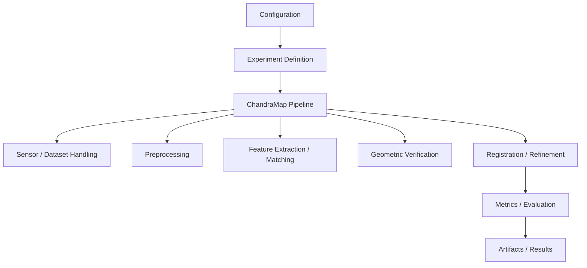
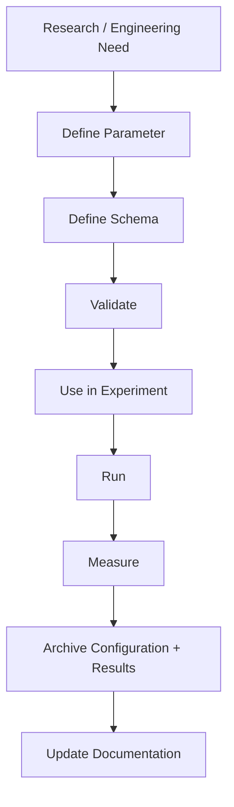

# Configurations

## Overview

The `configs/` directory is the configuration layer of ChandraMap.

It provides a controlled place for execution and experiment parameters that should remain separate from implementation code. Configuration can describe how a registration workflow is executed without requiring contributors to repeatedly modify pipeline source code.

For ChandraMap, configuration is particularly important because registration quality depends on multiple interacting choices, including:

- Dataset and image-pair selection
- Sensor-specific processing
- Image representation
- Multi-scale processing
- Feature extraction
- Feature matching
- Geometric verification
- RANSAC settings
- Transformation model selection
- Sub-pixel refinement
- Evaluation metrics
- Runtime behavior
- Output and artifact handling

The exact configuration files, formats, schemas, and implemented configuration loader are repository-specific. Where these have not yet been defined in the repository, they remain `[TBD]` or `[Planned]`.

> **Important:** Configuration does not by itself guarantee reproducibility. Reproducible results also depend on the dataset identity, software and dependency versions, algorithm implementation, random seeds where applicable, hardware/runtime context where relevant, configuration, and stored artifacts/results.

---

## Role in ChandraMap

Configuration sits between experiment definition and executable implementation.



The intended separation is:

| Layer               | Responsibility                                                                        |
| ------------------- | ------------------------------------------------------------------------------------- |
| `configs/`          | Defines controlled execution and experiment parameters                                |
| `experiments/`      | Defines the scientific question, hypothesis, procedure, comparison, and evidence      |
| `research/`         | Documents scientific background, research directions, assumptions, and future methods |
| Backend             | Implements executable services and pipeline behavior                                  |
| Frontend            | Presents inputs, outputs, metrics, previews, and system state                         |
| `data/`             | Stores or documents datasets, processed data, ground truth, and related artifacts     |
| Results / artifacts | Record what actually happened during execution                                        |

The configuration layer should not replace the experiment documentation layer.

An experiment should explain **why** a configuration exists and what is being tested. Configuration should define **how** that experiment is executed.

---

## Configuration Philosophy

ChandraMap should keep research parameters explicit rather than embedding them throughout implementation code.

A useful conceptual separation is:

```text
Code
  ↓
Configuration
  ↓
Experiment
  ↓
Execution
  ↓
Metrics
  ↓
Artifacts / Results
```

This separation supports:

- **Reproducibility** — the parameters used for an execution can be recorded.
- **Traceability** — results can be associated with a specific configuration.
- **Comparability** — different configurations can be evaluated on the same benchmark.
- **Controlled experimentation** — one parameter can be changed while other conditions remain fixed.
- **Consistent execution** — repeated runs can use the same declared settings.
- **Parameter sweeps** — controlled alternatives can be evaluated without modifying implementation code.
- **Reduced accidental changes** — experiment settings are visible rather than hidden in source code.
- **Research/software separation** — implementation and scientific parameters remain distinct.

Configuration should therefore answer questions such as:

> Which processing path was used?

> Which transformation model was evaluated?

> Which refinement stage was enabled?

> Which evaluation settings were active?

> Which dataset or image pair was selected?

> Which runtime behavior was requested?

The exact answers must come from the repository's actual configuration schema rather than assumptions.

---

## What Belongs in `configs/`

Configuration belongs in `configs/` when it represents a controlled parameter that affects execution, experimentation, evaluation, or reproducible system behavior.

Potential configuration categories include the following.

### Dataset configuration

Dataset-related configuration may define which data should be used by an experiment or execution.

Examples of concepts that may eventually be configured include:

- Dataset identity
- Image-pair selection
- Reference/source selection
- Sensor selection
- Dataset split
- Benchmark subset
- Ground-truth association
- Metadata selection

Exact dataset configuration fields are `[TBD]` unless defined elsewhere in the repository.

Configuration should identify data rather than silently embedding assumptions about where external data came from.

---

### Sensor configuration

ChandraMap works with imagery from different instruments and should not assume that all sensors can follow an identical processing path.

Relevant sensor-aware concepts include:

- OHRC
- TMC-2
- IIRS
- Reference imagery
- Sensor-specific preprocessing
- Pixel-scale/GSD metadata where available
- Footprint metadata where available
- Viewing geometry metadata where available
- Illumination metadata where available

The repository feedback explicitly recommends keeping sensor routing and metadata handling explicit rather than treating OHRC, TMC-2, and IIRS as identical images.

The exact sensor configuration schema is `[TBD]`.

---

### Preprocessing configuration

Preprocessing configuration may control documented preprocessing alternatives.

Potential categories include:

- Image normalization
- Contrast handling
- Gradient representation
- Edge/structural representation
- Denoising
- Multi-scale processing
- Reference pyramids
- Effective-scale matching
- Sensor-specific representations

These settings should remain explicit because preprocessing can materially change the correspondence problem.

For example, the project feedback distinguishes meaningful scale handling from simply resizing an image. Upsampling does not recover spatial information that was not present in the source sensor.

---

### Feature configuration

Where supported by the implementation, configuration may control the feature extraction path.

Possible research paths include:

- SIFT baseline
- Other local feature extractors
- Future learned feature extractors such as ALIKED

However, configuration should not imply that a research method is implemented merely because it appears in research documentation.

For every method, its status should be clear:

| Status        | Meaning                                                               |
| ------------- | --------------------------------------------------------------------- |
| Implemented   | Available in the current repository implementation                    |
| Experimental  | Implemented for a documented experiment                               |
| Planned       | Intended future capability                                            |
| Research-only | Documented for investigation but not implemented                      |
| `[TBD]`       | Configuration or implementation details have not yet been established |

---

### Matching configuration

Matching configuration should describe the selected correspondence strategy where such configuration is implemented.

The project distinguishes feature extraction from matching.

For example:

```text
SIFT
  ↓
Descriptors
  ↓
Descriptor matching
```

is conceptually different from:

```text
ALIKED
  ↓
LightGlue
```

and from detector-free approaches such as:

```text
LoFTR
```

The configuration architecture should preserve this distinction rather than placing every method into a single generic "feature extractor" setting.

The exact matching configuration schema is `[TBD]`.

---

### Geometric verification configuration

Geometric verification is a critical part of ChandraMap.

Configuration may eventually control:

- RANSAC behavior
- Initial geometric model
- Candidate correspondence filtering
- Inlier criteria
- Transformation model
- Spatial-coverage evaluation
- Residual analysis

The project feedback emphasizes that matcher confidence does not establish geometric correctness.

The conceptual execution order is:

```text
Candidate Matches
        ↓
RANSAC + Initial Model
        ↓
Verified Inliers
        ↓
Sub-Pixel Refinement
        ↓
Refit Final Transform
        ↓
Independent Evaluation
```

Configuration should preserve this distinction.

---

### Transformation configuration

ChandraMap may evaluate different geometric models depending on the image products and experiment.

Relevant models include:

- Affine transformation
- Homography
- Other future/local/piecewise models where justified

The choice of model should be treated as an experimental parameter rather than silently changed inside implementation code.

The appropriate model depends on image geometry.

A simple affine or homography model can be appropriate for a local, already map-projected image pair, but raw imagery, terrain relief, viewing geometry, or spatially varying residuals may require more careful treatment.

The exact supported model list is `[TBD]`.

---

### Refinement configuration

The project distinguishes geometric verification from local refinement.

Where implemented, refinement configuration may describe:

- Whether refinement is enabled
- Which verified points are refined
- Local refinement parameters
- Refinement method
- Final transformation refitting

The intended conceptual sequence is:

```text
Initial Matches
      ↓
RANSAC
      ↓
Verified Inliers
      ↓
Sub-Pixel Tie-Point Refinement
      ↓
Final Transform Refit
```

Sub-pixel numerical precision should not be interpreted automatically as proof of physical sub-pixel accuracy.

The exact refinement configuration is `[TBD]` unless implemented elsewhere in the repository.

---

### Evaluation configuration

Evaluation settings should be explicit because changing the evaluation procedure can change the meaning of a result.

Relevant ChandraMap metrics include:

- Inlier count
- Inlier ratio
- Spatial coverage
- Check-point RMSE
- Reprojection error
- Ground error where meaningful
- Runtime
- Registration success/failure
- Retrieval Recall@1 / Recall@5 where global retrieval is used

The project feedback specifically recommends evaluating transformations on independent check points rather than fitting and judging the transformation using exactly the same points.

Therefore, configuration should not silently redefine the evaluation population.

---

### Runtime configuration

Runtime configuration may eventually contain execution-level settings such as:

- Execution mode
- Hardware-related options
- Parallelism
- Logging behavior
- Runtime limits
- Cache behavior
- Artifact handling

The exact supported runtime settings are `[TBD]`.

Runtime configuration should not contain secrets.

---

### Output and artifact configuration

Configuration may eventually describe where or how execution artifacts are produced.

Relevant artifacts can include:

- Candidate matches
- Verified inliers
- Transformations
- Residuals
- Registered previews
- Evaluation metrics
- Runtime measurements
- Experiment outputs

The exact artifact configuration is `[TBD]`.

---

## What Does Not Belong in `configs/`

The `configs/` directory should not become a general-purpose storage location.

### Implementation code

Python, JavaScript, TypeScript, or other executable implementation should remain in the appropriate source directories.

Do not put application logic into configuration files.

---

### Research explanations

Scientific explanations, literature reviews, hypotheses, and research conclusions belong in `research/`.

For example, the reasoning behind testing LightGlue belongs in research documentation. A configuration may select a supported matcher for an experiment, but it should not become the research paper describing why the method matters.

---

### Experiment methodology

Experiment objectives, hypotheses, procedures, interpretation, and conclusions belong in `experiments/`.

Configuration supports an experiment; it does not replace the experiment record.

---

### Raw datasets

Images, cubes, reference products, and other raw scientific data do not belong in `configs/`.

Dataset documentation and storage conventions belong under the project's data structure.

---

### Ground-truth data

Actual control points or ground-truth artifacts should not be embedded directly into general configuration files unless the repository explicitly defines such a mechanism.

Ground-truth definitions and protocols are documented separately.

---

### Secrets

Do not commit:

- API keys
- Access tokens
- Passwords
- Private credentials
- Authentication secrets
- Personal access information

If secret management is required, the repository-specific mechanism is `[TBD]`.

---

### Large generated artifacts

Generated images, model weights, experiment outputs, logs, and benchmark results should not be placed in configuration files.

Configuration should describe execution, not become an artifact dump.

---

## Configuration and Experiments

Configuration and experiments have different responsibilities.

### Experiment documentation answers

- What question is being tested?
- Why is the experiment necessary?
- What is the hypothesis?
- What variables are controlled?
- What variables are changed?
- What dataset is used?
- What metrics are measured?
- What constitutes success?
- What happened?
- What limitations were observed?

### Configuration answers

- Which parameter values should be used for this execution?
- Which processing path is selected?
- Which model is selected?
- Which evaluation behavior is requested?
- Which runtime settings are active?

The relationship should therefore be:

```text
Experiment Specification
        │
        ├── Scientific question
        ├── Dataset
        ├── Metrics
        ├── Procedure
        │
        └── Configuration
                 │
                 ├── Algorithm parameters
                 ├── Preprocessing
                 ├── Geometry
                 ├── Refinement
                 └── Runtime
```

A configuration file should never be treated as the complete scientific record of an experiment.

---

## Configuration and the Registration Pipeline

ChandraMap's registration workflow contains several logically distinct stages.

A configuration system should allow those stages to be controlled without mixing their responsibilities.

```mermaid
flowchart LR
    D[Dataset / Image Pair] --> P[Preprocessing]
    P --> F[Feature / Matching Path]
    F --> C[Candidate Correspondences]
    C --> G[RANSAC / Geometric Verification]
    G --> I[Verified Inliers]
    I --> R[Sub-Pixel Refinement]
    R --> T[Final Transformation]
    T --> E[Independent Evaluation]
    E --> O[Artifacts / Results]
```



Configuration can describe the selected settings at each stage.

It should not change the conceptual meaning of the stages.

For example:

- A matcher configuration should not silently redefine geometric verification.
- A preprocessing configuration should not silently alter evaluation.
- A transformation configuration should not silently change the ground-truth definition.
- A refinement configuration should not cause evaluation points to become fitting points.
- Runtime configuration should not change scientific thresholds without being recorded.

---

## Configuration and Backend

The backend is responsible for implementing executable behavior.

The configuration layer should provide explicit inputs to that implementation where supported.

Conceptually:

```text
Configuration
     ↓
Validation
     ↓
Backend
     ↓
Registration Pipeline
     ↓
Metrics
     ↓
Artifacts
```

The exact backend configuration interface is `[Not provided]`.

The backend should not require contributors to edit implementation source code simply to change a documented experiment parameter.

At the same time, configuration should not expose every internal implementation detail.

A parameter belongs in configuration when it is intentionally part of the system's controllable behavior.

---

## Configuration and Frontend

The frontend may expose configuration-controlled behavior to users when the backend supports it.

Examples could include:

- Selecting an experiment
- Selecting an image pair
- Selecting a supported processing path
- Requesting a registration run
- Displaying active configuration
- Displaying resulting metrics

The exact frontend configuration interface is `[Not provided]`.

The frontend should not independently invent scientific configuration values that differ from backend validation.

A configuration selected through a user interface should remain traceable to the execution that produced the result.

---

## Configuration and Reproducibility

Configuration is one part of the reproducibility chain.

A reproducible ChandraMap execution should conceptually preserve:

```text
Dataset Identity
        +
Software Version
        +
Dependency Versions
        +
Algorithm Implementation
        +
Configuration
        +
Random Seeds, Where Applicable
        +
Hardware / Runtime Context, Where Relevant
        +
Generated Artifacts
        +
Evaluation Procedure
```

Configuration should therefore be treated as part of experiment provenance.

### Configuration provenance should answer

- Which configuration was used?
- Which experiment invoked it?
- Which dataset was selected?
- Which implementation version produced the result?
- Were parameters changed from the documented baseline?
- Which output artifacts correspond to the execution?

The exact provenance mechanism is `[TBD]`.

---

## Version Control

Configuration files should be version-controlled together with the code and experiment documentation that depend on them.

A configuration change can alter scientific results even when no implementation code changes.

Examples include changes to:

- Transformation model
- Matching thresholds
- Preprocessing options
- Scale settings
- Refinement behavior
- Evaluation settings
- Dataset selection

Therefore, configuration changes should be reviewed with the same care as implementation changes when they affect experiment outcomes.

### Recommended change discipline

When modifying an existing configuration:

1. Identify the experiment or workflow affected.
2. Determine whether the change is scientific, operational, or both.
3. Confirm that the parameter is supported by the implementation.
4. Validate the configuration.
5. Run the relevant experiment or test.
6. Record the resulting configuration and outputs where the repository workflow requires it.
7. Update documentation when the configuration contract changes.

Do not modify configuration simply to make a result look better.

---

## Configuration Naming

Configuration names should communicate their purpose rather than being ambiguous.

The exact naming convention for ChandraMap configuration files is `[TBD]`.

Until a repository-specific convention is formally established, contributors should follow the naming conventions already present in the repository rather than introducing a competing scheme.

Avoid names that hide experimental meaning, such as:

```text
new.yaml
test2.yaml
final.yaml
final_final.yaml
best.yaml
latest.yaml
```

when the repository does not define these as formal conventions.

Prefer names that communicate the configuration's documented role once the project's naming scheme is established.

---

## Configuration Formats

The supported configuration format for ChandraMap is `[TBD]`.

Do not introduce a new format solely because it is common in another ML project.

Once a format is selected, the repository should document:

- Syntax
- Schema
- Required fields
- Optional fields
- Default behavior
- Type constraints
- Allowed values
- Validation behavior
- Versioning policy
- Compatibility rules

Until those are established, these details remain `[TBD]`.

---

## Configuration Schema and Validation

Configuration should be validated before execution.

Validation should distinguish between:

### Syntax validity

Is the configuration structurally readable?

### Type validity

Are values of the expected type?

### Domain validity

Are values within the supported domain?

### Cross-field validity

Are combinations of parameters logically compatible?

### Implementation validity

Does the current software actually support the selected configuration?

### Dataset validity

Does the selected configuration make sense for the specified dataset or sensor?

A configuration can be syntactically valid while still being scientifically inappropriate.

For example:

```text
valid syntax
      ≠
valid experiment
      ≠
scientifically justified result
```

The exact validation implementation is `[TBD]`.

---

## Defaults

Defaults require special care in research software.

A hidden default can silently change an experiment.

Where defaults exist, they should be:

- Explicit
- Documented
- Stable
- Validated
- Traceable

If a parameter has no established repository default, document it as `[TBD]` rather than inventing one.

For benchmark experiments, the effective configuration should be recoverable from the experiment record or execution artifacts.

---

## Configuration Precedence

If ChandraMap eventually supports multiple configuration sources, precedence must be explicitly documented.

Potential sources could include:

```text
Repository Configuration
        ↓
Experiment Configuration
        ↓
Runtime Override
        ↓
Execution
```

However, this is only a conceptual model.

The actual precedence rules are `[TBD]`.

Do not assume that command-line arguments, environment variables, configuration files, or frontend values override one another unless the repository explicitly defines that behavior.

---

## Parameter Categories

A configuration schema should keep parameter responsibilities separated.

A useful conceptual classification is:

| Category      | Purpose                                         |
| ------------- | ----------------------------------------------- |
| Dataset       | Selects or identifies input data                |
| Sensor        | Selects sensor-aware behavior                   |
| Preprocessing | Controls image preparation                      |
| Scale         | Controls meaningful multi-scale processing      |
| Features      | Selects feature representation/extraction       |
| Matching      | Selects correspondence matching behavior        |
| Geometry      | Controls geometric verification/model selection |
| Refinement    | Controls local/sub-pixel refinement             |
| Evaluation    | Defines evaluation behavior                     |
| Runtime       | Controls execution behavior                     |
| Output        | Controls generated artifacts where supported    |

This classification is architectural guidance. The exact schema remains `[TBD]`.

---

## Configuration for Sensor-Aware Processing

Sensor configuration must not erase important differences between instruments.

The project documentation identifies distinct characteristics and processing concerns for:

- OHRC
- TMC-2
- IIRS

The repository feedback recommends separate sensor-aware paths rather than forcing all instruments through one identical pipeline.

This means configuration should be capable of expressing sensor-specific behavior where required.

For example, IIRS may require a documented 2D representation before conventional image matching.

A configuration should not imply that a hyperspectral cube can automatically be treated as an ordinary grayscale image.

Likewise, configuration should not imply that nominally different spatial resolutions become equivalent merely because images have been resized.

---

## Configuration for Scale

Scale configuration should describe meaningful physical/image processing rather than merely changing pixel dimensions.

The project feedback emphasizes:

> Upsampling changes pixel count, not physical information.

Therefore, configuration should distinguish concepts such as:

- Image resizing
- Reference pyramids
- Effective ground-scale comparison
- Multi-scale search
- Fine refinement

The exact scale parameters are `[TBD]`.

A configuration should not encode an unsupported claim of recovered spatial detail.

---

## Configuration for Illumination

Illumination-related parameters should remain separate from geometric parameters.

Lunar Sun-angle changes can alter shadows and apparent terrain appearance.

Configuration may eventually control documented alternatives such as:

- Raw intensity
- Contrast normalization
- Gradient/edge representation
- Structure-focused representation
- Other validated illumination-handling methods

The exact supported options are `[TBD]`.

Configuration should not imply that photometric normalization solves geometric differences caused by changing illumination.

---

## Configuration for Geometry

Geometry configuration is particularly important because a visually good registration can still be geometrically incorrect.

The project guidance recommends:

1. Fit an initial model with RANSAC.
2. Inspect residual vectors.
3. Evaluate whether residuals vary systematically across the image.
4. Use the simplest model that explains the observed geometry.
5. Consider local/piecewise models or sensor/DEM information only when evidence justifies them.

Potential geometry configuration areas include:

- Affine
- Homography
- Future local/piecewise models
- RANSAC parameters
- Residual evaluation
- Terrain-aware geometry `[Planned]`
- Sensor-model-based registration `[Planned]`

These should not be presented as implemented unless the repository confirms implementation.

---

## Configuration for Evaluation

Evaluation configuration should protect the distinction between fitting and evaluation.

The project requires independent evaluation where possible.

Conceptually:

```text
Correspondences
      ↓
Fit transformation
      ↓
Independent check points
      ↓
Check-point error
```

Do not configure a workflow that silently uses the same points for both transformation fitting and final accuracy reporting unless that behavior is explicitly intended and labeled.

### Core evaluation concepts

| Metric           | Purpose                                                                |
| ---------------- | ---------------------------------------------------------------------- |
| Inlier count     | Number of correspondences surviving geometric verification             |
| Inlier ratio     | Fraction of candidate correspondences accepted as inliers              |
| Spatial coverage | Whether reliable points are distributed across the overlap             |
| Check-point RMSE | Accuracy on points not used to fit the transformation                  |
| Ground error     | Physical error when projection/GSD/reference truth makes it meaningful |
| Runtime          | Computational cost                                                     |
| Failure rate     | Reliability across the evaluated cases                                 |

Source-image pixels should remain the primary unit for sub-pixel registration accuracy where applicable.

---

## Configuration for Stress Testing

The benchmark design includes multiple stress conditions.

Configuration should make controlled stress testing possible where the implementation supports it.

Relevant categories include:

- Easy pair
- Sun-angle stress
- Scale stress
- Modality stress
- Geometry stress
- Low-feature terrain

The purpose is not to make a configuration "hard" arbitrarily.

Each stress configuration should correspond to a documented experimental question.

For example:

```text
Baseline
   ↓
Change one controlled condition
   ↓
Run same evaluation
   ↓
Measure degradation / improvement
```

This makes configuration changes scientifically interpretable.

---

## Configuration and Baselines

The project uses a baseline-first research strategy.

A useful comparison can involve:

```text
SIFT Baseline
      ↓
Stronger Matcher
      ↓
Full Sensor-Aware / Multi-Scale Pipeline
```

The exact implementation and experiment configurations for these comparisons are repository-dependent.

Configuration should make it possible to hold the benchmark conditions constant while changing the method under evaluation.

This is important because changing the dataset, preprocessing, matcher, geometry, and evaluation procedure simultaneously makes it difficult to determine what caused a measured change.

---

## Configuration and Future Research

The `configs/` directory may eventually support future research methods documented elsewhere.

Examples include:

- ALIKED
- LightGlue
- LoFTR
- RIFT/CFOG-inspired approaches
- Global retrieval
- FAISS-backed retrieval infrastructure
- DEM-aware registration
- Lunar mosaicking

These should remain clearly separated by status.

A research document describing a method does not mean that a corresponding configuration is already supported.

For example:

```text
research/future/
        ↓
Research specification
        ↓
Experiment
        ↓
Implementation
        ↓
Configuration
        ↓
Benchmark evidence
```

A future method should only become a normal supported configuration after its implementation and configuration contract have been established.

---

## Configuration Lifecycle

Configuration should follow a controlled lifecycle.



### 1. Identify the need

Determine why a new configuration parameter is required.

### 2. Define the parameter

Specify:

- Purpose
- Type
- Allowed values
- Default, if any
- Dependencies
- Scientific meaning

### 3. Define validation

Determine what makes the value valid.

### 4. Connect it to implementation

The implementation must actually consume the parameter.

### 5. Use it in an experiment

Document the scientific reason for using it.

### 6. Measure the result

Do not treat configuration changes as improvements without measured evidence.

### 7. Preserve provenance

Record the effective configuration with the relevant experiment/results where required.

### 8. Update documentation

If the configuration contract changes, update the corresponding documentation.

---

## Adding a New Configuration

Before adding a new configuration file or parameter, ask:

### Scientific questions

- What experiment requires this configuration?
- What hypothesis does it support?
- Which variable is being changed?
- Which variables should remain fixed?
- How will the effect be measured?

### Engineering questions

- Is the parameter already supported?
- Does the backend consume it?
- Does validation exist?
- Does the frontend need to expose it?
- Does it affect existing configurations?
- Is backward compatibility relevant?

### Reproducibility questions

- Can the effective value be recorded?
- Is the dataset identity known?
- Is the software version known?
- Are required dependencies documented?
- Are relevant artifacts preserved?

If these questions cannot be answered, the configuration should remain `[TBD]` rather than being added speculatively.

---

## Modifying an Existing Configuration

Treat configuration changes as potentially behavior-changing changes.

Before modification:

1. Identify all experiments using the configuration.
2. Check whether the parameter affects benchmark comparability.
3. Confirm the implementation supports the new value.
4. Validate the modified configuration.
5. Run the relevant tests or experiments.
6. Compare the resulting metrics.
7. Update experiment documentation if the scientific conditions changed.
8. Preserve historical configurations where required for reproducibility.

Do not overwrite historical experiment settings merely to make them match a newer preferred configuration.

---

## Configuration Validation Checklist

Before committing a configuration change, verify:

- [ ] The configuration belongs in `configs/`.
- [ ] The configuration is associated with a documented workflow or experiment.
- [ ] All fields are supported by the implementation.
- [ ] No secrets are present.
- [ ] Dataset references are valid.
- [ ] Sensor assumptions are explicit.
- [ ] Scale assumptions are physically meaningful.
- [ ] Geometry settings are documented.
- [ ] Refinement settings are documented.
- [ ] Evaluation behavior is explicit.
- [ ] Defaults are not silently changed.
- [ ] The configuration can be validated.
- [ ] Relevant experiments are updated if required.
- [ ] Existing benchmark comparability is preserved.
- [ ] Generated artifacts are not accidentally committed as configuration.
- [ ] Documentation reflects any changed configuration contract.

---

## Configuration Review Checklist

Maintainers reviewing a configuration change should ask:

### Scope

- Does the parameter belong in configuration rather than code or experiment documentation?

### Correctness

- Does the implementation actually consume it?

### Reproducibility

- Can someone determine which value was used for a result?

### Scientific validity

- Does the configuration preserve the intended experimental comparison?

### Sensor awareness

- Does it avoid treating different lunar sensors as identical?

### Geometry

- Does it preserve the distinction between candidate matches, verified inliers, refinement, and final transformation?

### Evaluation

- Does it preserve independent evaluation?

### Maintainability

- Is the configuration understandable to another contributor?

---

## Configuration Anti-Patterns

Avoid the following patterns.

### Hidden experiment parameters

Do not bury benchmark-critical values inside implementation code.

### Configuration that is never consumed

A documented parameter that the backend ignores creates false reproducibility.

### Configuration that silently changes meaning

A field should not have one meaning in one experiment and another meaning elsewhere.

### Configuration as a research notebook

Do not store scientific conclusions, observations, or long experimental explanations inside configuration files.

### Configuration as a data store

Do not embed large datasets or generated artifacts.

### Untracked manual changes

Do not rely on undocumented local configuration modifications for benchmark results.

### Ambiguous defaults

Do not depend on undocumented defaults for scientific comparisons.

### Method-name configuration without implementation

Do not add a configuration option for an algorithm merely because it appears in `research/future/`.

### Decorative confidence settings

Do not introduce unmeasured confidence values or percentage claims that look like experimental results.

The project feedback specifically recommends reporting actual measurements such as RMSE, inlier ratio, coverage, and runtime instead of decorative confidence scores.

---

## Configuration and Research Integrity

Configuration should make experiments easier to audit, not easier to manipulate.

A configuration should never be changed simply because it produces a more favorable metric.

When a parameter change improves a result, the improvement should be attributed to the documented experimental change and supported by the corresponding evaluation.

For ChandraMap, this is especially important because registration quality is multi-dimensional.

A configuration that increases the number of matches but produces incorrect or spatially clustered correspondences is not automatically an improvement.

Likewise, a configuration that produces a visually attractive overlay is not sufficient evidence of accurate registration.

---

## Configuration and Artifact Traceability

A successful execution should ideally allow the following relationship to be reconstructed:

```text
Configuration
      ↓
Experiment
      ↓
Dataset / Image Pair
      ↓
Pipeline Execution
      ↓
Correspondences
      ↓
Transformation
      ↓
Evaluation
      ↓
Artifacts / Results
```

The exact artifact-storage and metadata mechanism is `[TBD]`.

Where the repository provides such functionality, the effective configuration should be stored alongside the result or otherwise referenced by it.

---

## Configuration and Reproducible Benchmarks

Benchmark comparisons require stable conditions.

When comparing two methods, configuration should help keep constant:

- Image pairs
- Ground-truth definition
- Evaluation points
- Evaluation metrics
- Dataset split
- Relevant preprocessing conditions
- Runtime measurement methodology

Only the intended experimental variable should change unless the experiment explicitly tests multiple variables.

For example:

```text
Same image pairs
Same ground truth
Same evaluation protocol
Same reporting metrics
        │
        ├── Configuration A
        │
        └── Configuration B
```

This creates a more interpretable comparison than changing the entire pipeline at once.

---

## Configuration Status

The exact current implementation state of the `configs/` directory should be determined from the repository.

| Area                                             | Status            |
| ------------------------------------------------ | ----------------- |
| `configs/` directory documentation               | Current document  |
| Configuration schema                             | `[TBD]`           |
| Configuration file format                        | `[TBD]`           |
| Configuration validation contract                | `[TBD]`           |
| Dataset configuration schema                     | `[TBD]`           |
| Sensor configuration schema                      | `[TBD]`           |
| Preprocessing configuration schema               | `[TBD]`           |
| Feature configuration schema                     | `[TBD]`           |
| Matching configuration schema                    | `[TBD]`           |
| Geometric verification configuration schema      | `[TBD]`           |
| Refinement configuration schema                  | `[TBD]`           |
| Evaluation configuration schema                  | `[TBD]`           |
| Runtime configuration schema                     | `[TBD]`           |
| Artifact configuration schema                    | `[TBD]`           |
| Configuration-to-experiment provenance mechanism | `[TBD]`           |
| Frontend configuration interface                 | `[Not provided]`  |
| Backend configuration interface                  | `[Not provided]`  |
| DEM-aware configuration                          | `[Planned]`       |
| Global retrieval configuration                   | `[Planned / TBD]` |
| Learned matcher configuration                    | `[Planned / TBD]` |

This table intentionally avoids claiming implementation that has not been established by the supplied repository information.

---

## Recommended Repository Relationship

The configuration directory should remain conceptually connected to the rest of the repository:

```text
configs/
    ↓
experiments/
    ↓
research/
    ↓
backend/
    ↓
data/
    ↓
results / artifacts
```

The exact child structure of `configs/` is `[TBD]`.

Do not create speculative subdirectories merely to make the directory appear more complete.

A configuration hierarchy should be introduced only when there is a real need for separation.

---

## Example Conceptual Configuration Model

The following is an architectural model, **not an implemented ChandraMap schema**.

```text
Configuration
├── Dataset
├── Sensor
├── Preprocessing
├── Scale
├── Feature / Representation
├── Matching
├── Geometry
├── Refinement
├── Evaluation
├── Runtime
└── Output / Artifacts
```

Each section should only contain parameters that are actually supported by the corresponding implementation.

The exact file syntax, field names, defaults, and validation rules are `[TBD]`.

---

## Relationship to V1

The V1 benchmark architecture emphasizes a measurable registration pipeline.

Configuration should support the same separation of concerns:

```text
Input Pair
   ↓
Preprocessing
   ↓
Candidate Correspondences
   ↓
RANSAC / Initial Model
   ↓
Verified Inliers
   ↓
Sub-Pixel Refinement
   ↓
Final Transformation
   ↓
Independent Check-Point Evaluation
   ↓
Metrics
```

Configuration should not change this scientific logic implicitly.

V1 experiments should identify which configuration was used so that baseline and experimental results remain comparable.

Relevant V1 experiment areas include:

- SIFT baseline
- Scale pyramid
- Gradient representation
- Affine versus homography
- Residual analysis
- Sub-pixel refinement

The exact configuration files associated with those experiments are `[TBD]` unless explicitly defined elsewhere in the repository.

---

## Relationship to Future Capabilities

Future research may introduce configuration requirements for:

### Learned local matching

ALIKED, LightGlue, and LoFTR are documented as research directions. Their configuration should be introduced only when corresponding implementations and experiment contracts exist.

### Multimodal matching

RIFT/CFOG-inspired approaches may require sensor- and representation-specific configuration.

### Global retrieval

Global retrieval may require configuration for candidate selection and retrieval evaluation.

FAISS should be treated as retrieval/indexing infrastructure rather than as a complete registration configuration.

### DEM-aware registration

Terrain-aware registration may require DEM identity, geometry metadata, sensor-model parameters, and terrain-related settings.

These should remain `[Planned]` until formally implemented.

### Lunar mosaicking

Mosaicking is a downstream capability and should not be confused with the core correspondence/evaluation configuration.

---

## Backward Compatibility

Configuration changes can break old experiments even when application code remains compatible.

When configuration schemas evolve, maintainers should consider:

- Existing experiment configurations
- Existing benchmark results
- Configuration interpretation
- Default changes
- Renamed fields
- Removed fields
- New required fields
- Migration requirements

The repository's formal configuration versioning policy is `[TBD]`.

Until such a policy exists, contributors should avoid unnecessary breaking changes to established experiment configurations.

---

## Security and Sensitive Values

Configuration files are version-controlled repository artifacts.

Do not place secrets or private credentials in them.

This includes:

- API keys
- Authentication tokens
- Passwords
- Private service credentials
- Sensitive access information

If a workflow requires secrets, use the repository's documented secret-management mechanism when one exists.

If no mechanism is documented, the approach is `[TBD]`.

---

## Contributor Workflow

A contributor adding configuration should follow this general process:

```text
Identify Need
     ↓
Check Existing Configuration
     ↓
Check Experiment Documentation
     ↓
Define / Modify Parameter
     ↓
Validate
     ↓
Run Relevant Experiment / Test
     ↓
Measure Results
     ↓
Record Provenance
     ↓
Update Documentation
     ↓
Commit Configuration Change
```

Before creating a new parameter, first check whether an existing parameter already expresses the same concept.

Configuration duplication makes experiments harder to understand and maintain.

---

## Maintainer Principles

The `configs/` directory should remain:

### Explicit

Important experimental parameters should be visible.

### Minimal

Do not expose unnecessary implementation internals.

### Validated

Invalid configurations should be detected before expensive execution.

### Reproducible

Configuration used for meaningful results should be recoverable.

### Version-controlled

Configuration changes should be reviewable.

### Experiment-aware

Configuration should correspond to documented scientific workflows.

### Sensor-aware

Configuration should preserve differences between lunar instruments.

### Evaluation-aware

Configuration should not silently compromise independent evaluation.

### Honest

Configuration should never imply that an unimplemented or unvalidated method is available.

---

## Frequently Asked Questions

### Why not put all parameters directly in the code?

Hard-coding experimental parameters makes controlled comparison and provenance more difficult. Configuration provides a separate, reviewable representation of execution settings.

However, not every constant belongs in configuration. Implementation constants that are not intended to be experimentally controlled can remain in code.

---

### Does a configuration file make an experiment reproducible?

No.

Configuration is only one component of reproducibility. Dataset identity, implementation version, dependency versions, runtime context, random seeds where applicable, evaluation protocol, and artifacts also matter.

---

### Should every research idea have a configuration file?

No.

A research idea should first be documented as research or an experiment. Configuration should be introduced when there is an actual executable workflow that requires controlled parameters.

---

### Should future algorithms immediately receive configuration options?

No.

A future method documented under `research/future/` should not be represented as an implemented configuration option until the implementation and configuration contract exist.

---

### Should dataset paths be hard-coded?

The repository's exact dataset-reference mechanism is `[TBD]`.

Dataset identity should be explicit and reproducible, but the specific path mechanism should follow the repository's established data architecture.

---

### Should configuration contain results?

No.

Configuration defines execution conditions. Results and measurements should be stored and documented through the appropriate experiment/result workflow.

---

### Can configuration change the evaluation metrics?

Only when the experiment explicitly defines such a comparison and the evaluation change is recorded.

Benchmark comparisons should use a consistent evaluation protocol unless the evaluation protocol itself is the research variable.

---

### Can configuration select different geometric models?

Where supported, yes.

Affine and homography are relevant ChandraMap geometric models, but the exact supported configuration options are `[TBD]`.

The selected model should be recorded because it affects the resulting registration.

---

## Final Configuration Checklist

Before merging a configuration change:

- [ ] The configuration has a clear purpose.
- [ ] It belongs in `configs/`.
- [ ] It is connected to an actual workflow or documented experiment.
- [ ] The implementation supports the selected behavior.
- [ ] The configuration format is valid.
- [ ] Schema requirements are satisfied.
- [ ] No secrets are committed.
- [ ] Dataset identity is explicit.
- [ ] Sensor assumptions are explicit.
- [ ] Scale assumptions are physically meaningful.
- [ ] Preprocessing choices are documented.
- [ ] Matching choices are documented.
- [ ] Geometric verification behavior is documented.
- [ ] Refinement behavior is documented.
- [ ] Evaluation behavior is documented.
- [ ] Independent check-point evaluation is preserved where required.
- [ ] Runtime behavior is reproducible where relevant.
- [ ] Configuration changes are version-controlled.
- [ ] Relevant experiments are updated.
- [ ] Relevant results/artifacts can be associated with the configuration.
- [ ] No unimplemented research method is presented as implemented.
- [ ] No unsupported defaults or values have been invented.

---

## Summary

`configs/` is the controlled configuration layer for ChandraMap.

Its purpose is to make executable behavior explicit while keeping implementation code, scientific experiment definitions, research documentation, datasets, and results in their appropriate locations.

A healthy ChandraMap configuration architecture should make it possible to answer:

> **What was run, with which parameters, on which data, using which implementation, and under which evaluation protocol?**

The directory should therefore prioritize:

**explicit configuration → validated execution → controlled experiment → measurable evaluation → traceable results**

The exact configuration files, schema, format, validation implementation, and backend/frontend integration remain `[TBD]` wherever they have not been established by the repository.
