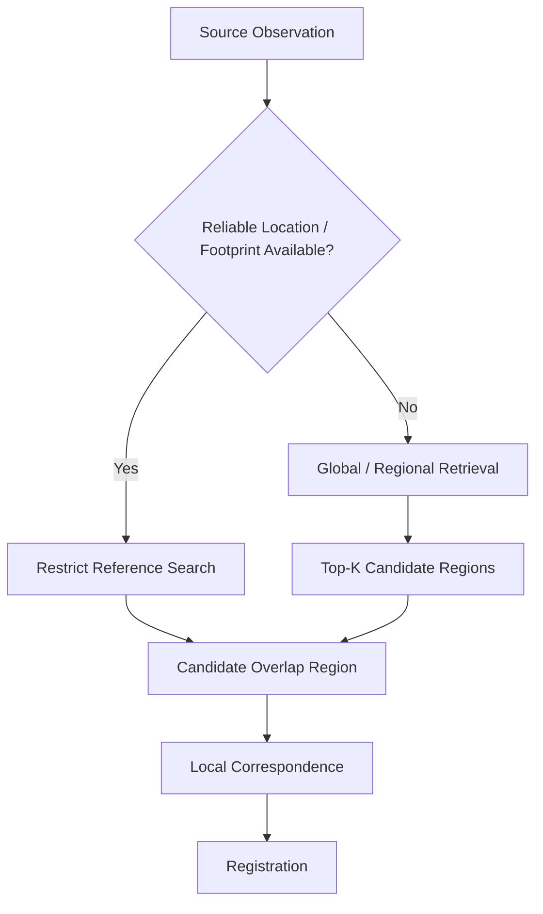
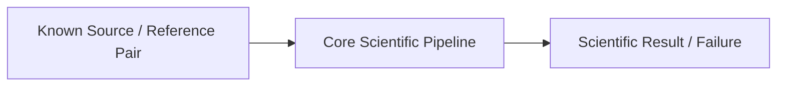
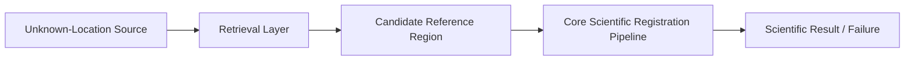

# ADR-0001: V1 Known-Overlap First

- **ADR:** ADR-0001
- **Title:** V1 Known-Overlap First
- **Status:** Accepted
- **Decision Scope:** ChandraMap V1
- **Decision Type:** Architecture / Research Scope / Benchmarking
- **Supersedes:** N/A
- **Superseded By:** N/A
- **Related Implementation Status:** V1 development
- **Experimental Evidence:** TBD — this decision defines the initial architecture and validation order; it does not claim benchmark superiority.

---

## 1. Decision

> **ChandraMap V1 will begin with known-overlap source/reference image pairs rather than attempting whole-Moon or unknown-location global retrieval.**

For V1, the system receives:

1. a source image or source product, and
2. a reference image, tile, crop, or region already known or reasonably constrained to overlap the same lunar surface area.

The first scientific objective is therefore:

```text
Known Overlapping Pair
        ↓
Input Validation
        ↓
Sensor-Aware Preparation
        ↓
Physical Scale Handling
        ↓
Local Correspondence Generation
        ↓
Candidate Matches
        ↓
Geometric Verification
        ↓
Verified Inliers
        ↓
Transformation Estimation
        ↓
Optional Tie-Point Refinement
        ↓
Final Transform Refit
        ↓
Registration
        ↓
Evaluation
        ↓
Result / Scientific Failure
```

V1 will **not require** the pipeline to discover an unknown lunar region by searching an entire global reference corpus.

Whole-Moon or unknown-location retrieval is intentionally deferred until local correspondence and registration can be demonstrated and evaluated reliably.

---

## 2. Status

**Accepted**

This decision establishes the architectural and research scope for ChandraMap V1.

Acceptance of this ADR means:

- known-overlap local registration is the primary V1 problem
- global retrieval is not part of the mandatory V1 path
- global retrieval may be researched separately without changing V1's core contract
- future versions may add retrieval while preserving V1 as the local-registration baseline

This ADR does **not** claim that known-overlap registration has already achieved any particular accuracy, runtime, success rate, or robustness level.

Those claims require benchmark evidence.

---

## 3. Context

ChandraMap addresses lunar image correspondence and registration across observations that may differ in:

- sensor
- spatial resolution
- physical ground scale
- Sun angle
- shadow geometry
- viewing geometry
- modality
- radiometric characteristics
- projection
- terrain relief
- metadata availability

Relevant Chandrayaan-2 sources include:

- **OHRC** — Orbiter High Resolution Camera
- **TMC-2** — Terrain Mapping Camera-2
- **IIRS** — Imaging Infrared Spectrometer

Potential lunar references include:

- **LRO NAC**
- **LRO WAC**

Approximate instrument-level context includes:

| Instrument | Approximate Context                                   | Architectural Implication                               |
| ---------- | ----------------------------------------------------- | ------------------------------------------------------- |
| OHRC       | ~0.25–0.32 m/pixel depending on product/documentation | Fine-detail correspondence may be possible              |
| TMC-2      | ~5 m/pixel                                            | Useful terrain-structure correspondence                 |
| IIRS       | ~80 m/pixel; hyperspectral/infrared                   | Requires dedicated representation/preprocessing         |
| LRO NAC    | High-resolution lunar imagery; product scale varies   | Useful detailed reference                               |
| LRO WAC    | Broader lunar-scale context                           | Useful for regional/global context and future retrieval |

These values are not substitutes for actual product metadata.

OHRC, TMC-2, IIRS, NAC, and WAC must not be treated as equivalent grayscale cameras.

---

## 4. Architectural Problem

The larger ChandraMap problem contains at least two distinct scientific and engineering problems.

### Problem A — Local Correspondence and Registration

Given source and reference imagery that already overlap:

> determine reliable correspondences and estimate a transformation that aligns them sufficiently for measurable registration.

This problem includes:

- sensor-aware preparation
- physical scale handling
- feature/correspondence generation
- match filtering
- geometric verification
- transform estimation
- refinement
- registration
- evaluation

### Problem B — Global Localization / Retrieval

Given a source observation whose location may be unknown:

> search a large lunar reference corpus and identify the correct region before local registration.

This problem may include:

- reference tiling
- multi-scale reference preparation
- global descriptor generation
- vector indexing
- similarity search
- Top-K candidate ranking
- candidate-region verification
- local registration

Problem B depends on Problem A downstream.

A retrieved candidate is not useful unless ChandraMap can reliably determine whether it actually matches and then register it.

---

## 5. Why These Problems Must Be Separated

If both problems are introduced simultaneously, a failed end-to-end result could originate from many independent sources:

- incorrect reference tiling
- unsuitable global descriptor
- invalid descriptor normalization
- retrieval index error
- correct region absent from Top-K
- scale mismatch
- sensor-preprocessing error
- poor feature extraction
- correspondence failure
- illumination mismatch
- RANSAC failure
- inappropriate transformation model
- weak spatial coverage
- sub-pixel refinement error
- coordinate-mapping error
- registration error
- evaluation error

This creates a poor research environment because failure attribution becomes difficult.

V1 therefore deliberately removes the retrieval variable.

The question becomes:

> **Given the correct overlapping lunar region, can ChandraMap establish reliable, geometrically verified, measurable correspondence?**

Only after that question can be answered should global retrieval become part of the end-to-end task.

---

## 6. Decision Drivers

This decision is driven by the following requirements.

### 6.1 Scientific measurability

V1 needs a task whose output can be evaluated quantitatively.

Known-overlap pairs allow research to focus directly on:

- correspondence quality
- inlier quality
- geometric model quality
- residuals
- spatial coverage
- registration error

---

### 6.2 Failure isolation

A known reference removes retrieval failure from the local-registration experiment.

This makes it easier to determine whether a problem originates in:

- preprocessing
- scale handling
- feature generation
- matching
- geometric verification
- transform estimation
- refinement
- evaluation

---

### 6.3 Lower implementation risk

Global Moon-scale retrieval adds substantial infrastructure:

- reference corpus preparation
- tiling
- descriptor extraction
- indexing
- storage
- candidate ranking
- corpus versioning
- retrieval metrics
- geographic correctness definitions

None of this is required to prove whether local registration works.

---

### 6.4 Benchmark clarity

Known-overlap benchmarking separates:

- registration performance

from:

- retrieval performance

This prevents unrelated metrics such as Recall@K and registration RMSE from being conflated.

---

### 6.5 Reproducibility

A fixed source/reference pair is easier to reproduce because the scientific input population is explicitly defined.

---

### 6.6 Baseline preservation

V1 should remain useful after later versions add more complex capabilities.

A narrow local-registration baseline provides a stable historical comparison point.

---

## 7. V1 Philosophy

> **Build the smallest scientifically measurable end-to-end registration system first.**

V1 should not begin by attempting to solve the entire Moon.

The first meaningful milestone is:

```text
Real Source Product
+
Known Overlapping Reference Product
        ↓
Candidate Correspondences
        ↓
Verified Inliers
        ↓
Final Transformation
        ↓
Registered Result
        ↓
Quantitative Evaluation
```

A successful implementation is not defined merely by a visually convincing overlay.

It must expose enough information to evaluate what occurred.

---

## 8. Representative V1 Flow

The conceptual V1 pipeline is:

```text
Known Overlapping Pair
        │
        ▼
Input Validation + Metadata Inspection
        │
        ▼
Sensor-Aware Preprocessing
        │
        ▼
Comparable Physical Scale Preparation
        │
        ▼
Local Feature / Correspondence Generation
        │
        ▼
Candidate Matches
        │
        ▼
Match Filtering
        │
        ▼
Geometric Verification
        │
        ▼
Verified Inliers
        │
        ▼
Initial Transformation
        │
        ▼
Optional Tie-Point / Sub-Pixel Refinement
        │
        ▼
Final Transformation Refit
        │
        ▼
Registered Image / Overlay
        │
        ▼
Evaluation
        │
        ├── Success Result
        │
        └── Scientific Failure
```

Exact V1 implementation details belong to the V1 specification and pipeline documentation.

This ADR establishes **where the pipeline begins**, not every algorithm used inside it.

---

## 9. V1 Input Contract

Conceptually, V1 assumes that an experiment can identify:

- source observation
- overlapping reference observation or region
- sensor identities
- enough metadata to interpret the products
- coordinate/projection information where required
- product-specific scale information where available

The overlap may be established through:

- benchmark preparation
- product metadata
- footprint intersection
- manual research-pair preparation
- another externally validated method

V1 does not require the core registration engine to discover that overlap globally.

---

## 10. Known Overlap Does Not Mean Perfect Alignment

Known overlap means the two inputs are known to observe at least part of the same lunar region.

It does **not** mean that they:

- have identical dimensions
- have identical scale
- have identical projection
- have identical illumination
- have identical orientation
- have identical sensor modality
- are already pixel aligned
- have known transformation parameters

The registration problem remains scientifically difficult.

---

## 11. Sensor-Aware Processing Remains Required

The known-overlap decision does not remove sensor differences.

V1 still needs to respect the physical differences between:

- OHRC
- TMC-2
- IIRS
- LRO NAC
- LRO WAC

For example:

- OHRC and TMC-2 are panchromatic imaging instruments at very different scales.
- IIRS is hyperspectral/infrared data and may require generation of a registration-friendly 2D representation.
- NAC and WAC serve different resolution/context roles.

This ADR does not define one universal preprocessing path.

---

## 12. Scale Handling Remains Required

Known overlap does not solve cross-resolution correspondence.

V1 still needs physically meaningful scale handling.

> **Upsampling changes pixel count; it does not create missing lunar surface information.**

Appropriate strategies may include:

- reference pyramids
- image pyramids
- downsampling the finer observation
- matching at comparable effective ground scale
- coarse-to-fine local matching

Exact strategies belong to algorithm and V1 pipeline documentation.

---

## 13. Illumination Remains a V1 Research Problem

Known overlap does not remove illumination variation.

Different Sun geometry can change:

- shadow direction
- shadow length
- crater appearance
- ridge visibility
- gradient structure

The known-overlap design is useful precisely because illumination robustness can then be studied without confusion from retrieval failure.

---

## 14. Geometric Verification Remains Mandatory

Matcher output should first be treated as candidate correspondence.

A representative progression is:

```text
Candidate Matches
        ↓
Robust Geometric Verification
        ↓
Verified Inliers
        ↓
Initial Transform
        ↓
Optional Refinement
        ↓
Final Transform
```

High matcher confidence alone is not sufficient evidence that a correspondence is geometrically correct.

---

## 15. Transformation Models

For local, appropriately prepared image pairs, V1 may investigate geometric models such as:

- affine transformation
- homography

This ADR does not state that either model is universally correct.

Possible causes of model inadequacy include:

- terrain relief
- sensor geometry
- viewpoint difference
- wide spatial extent
- raw image geometry
- local distortion

Residual behavior should be evaluated rather than hidden by increasingly flexible warping.

---

## 16. Refinement Order

Where sub-pixel or local tie-point refinement is used, the preferred conceptual order is:

```text
Candidate Matches
→ Geometric Verification
→ Verified Inliers
→ Sub-Pixel Tie-Point Refinement
→ Final Transform Refit
→ Registration
→ Evaluation
```

The refined coordinates should not merely update visualization while leaving the final transformation fitted to the original lower-precision coordinates.

---

## 17. V1 Outputs

A V1 run should conceptually produce enough information to understand the scientific outcome.

Potential outputs include:

- candidate correspondence count
- filtered candidate count
- verified inlier count
- inlier ratio
- verified source points
- verified reference points
- initial transformation
- refined tie points where applicable
- final transformation
- fit residuals
- registered image or preview
- spatial coverage information
- independent evaluation metrics where available
- runtime information
- scientific success/failure state
- diagnostic artifacts
- provenance

The exact result schema belongs to the relevant contract/specification.

---

## 18. Evaluation Requirement

Known-overlap V1 exists to create a measurable registration baseline.

Useful evaluation dimensions may include:

- verified inlier count
- inlier ratio
- spatial coverage
- fit residual
- independent check-point RMSE
- source-image pixel error
- ground-space error when scientifically valid
- runtime
- success/failure

This ADR defines no numerical threshold.

Thresholds must come from benchmark/evaluation documentation and measured evidence.

---

## 19. Fit Points vs Check Points

Where independent evaluation data exist:

> **Points used to fit the transformation should not also be the only points used to claim independent registration accuracy.**

Conceptually:

```text
Fit / Control Points
        ↓
Estimate Transformation

Held-Out Check Points
        ↓
Evaluate Final Transformation
```

If independent check points are unavailable, that limitation must remain explicit.

---

## 20. Error Units

Registration error should first be reported in a clearly defined image coordinate system.

For example:

```text
source-image pixels
```

Conversion to physical ground distance should occur only when:

- valid GSD is known
- projection/geometry supports the conversion
- reference truth is suitable

Sub-pixel does not automatically mean sub-metre.

---

## 21. Spatial Coverage

A transform supported by correspondences concentrated in one small area may be weak outside that region.

Therefore "well-distributed correspondences" should eventually be measurable through a defined metric such as:

- grid coverage
- convex-hull coverage
- another benchmark-defined spatial-support measure

This ADR defines no coverage formula or threshold.

---

# Global Retrieval

## 22. Deferred, Not Rejected

Global lunar retrieval is **deferred**, not rejected.

A future retrieval architecture may conceptually use:

```text
Reference Imagery
        ↓
Reference Tiling
        ↓
Multiple Scales
        ↓
Global Descriptor Extraction
        ↓
Vector Index
        ↓
Top-K Candidate Regions
        ↓
Local Registration
```

This is outside mandatory V1 scope.

---

## 23. Conditional Retrieval

Global retrieval should not automatically run when reliable geospatial metadata has already constrained the search region.

Possible routing:



This preserves retrieval as a conditional capability rather than an unnecessary mandatory cost.

---

## 24. Retrieval and Registration Metrics Must Remain Separate

Retrieval may eventually be evaluated using metrics such as:

- Recall@1
- Recall@K

Registration may use:

- inlier statistics
- coverage
- residuals
- check-point RMSE

A retrieval similarity score is not registration accuracy.

A registration RMSE is not a retrieval-ranking metric.

---

## 25. FAISS Role

If FAISS is used in future retrieval work:

> **FAISS indexes and searches vectors; it does not extract lunar image features and it does not perform registration.**

A future retrieval system would therefore require a separately defined global descriptor or embedding.

No particular global descriptor is selected by this ADR.

---

# Alternatives Considered

## 26. Alternative A — Start With Whole-Moon Retrieval

### Description

Build the complete architecture immediately:

```text
Unknown Source Location
→ Global Descriptor
→ Whole-Moon Vector Search
→ Top-K Candidates
→ Local Matching
→ Registration
```

### Advantages

- closer to a fully autonomous localization system
- demonstrates end-to-end search
- useful when metadata is unavailable

### Disadvantages

- introduces many independent failure sources
- greatly increases debugging complexity
- requires a prepared reference corpus
- requires retrieval-specific benchmark design
- requires descriptor/index selection
- makes local matching failures difficult to isolate
- risks optimizing retrieval before local registration is scientifically reliable

### Decision

**Rejected for V1.**

Potentially appropriate for a later version.

---

## 27. Alternative B — Build Retrieval and Local Registration Simultaneously

### Description

Develop global retrieval and local registration in parallel as one architecture.

### Advantages

- exposes full-system integration earlier
- may accelerate later end-to-end demonstrations

### Disadvantages

- unclear attribution of failures
- moving baseline
- substantially larger implementation scope
- makes benchmark design harder
- encourages mixing retrieval and registration metrics

### Decision

**Not selected for V1.**

Research prototypes may exist independently, but V1's required scientific path remains known-overlap registration.

---

## 28. Alternative C — Metadata-Only Registration

### Description

Use available geospatial metadata to align imagery without a substantial image-correspondence stage.

### Advantages

- potentially simpler for well-georeferenced products
- useful for search restriction and initialization

### Disadvantages

- does not solve the core visual correspondence problem
- metadata quality may vary
- cannot replace measured image-to-image alignment when correspondence is the scientific target

### Decision

**Not selected as the V1 core method.**

Metadata remains useful for:

- candidate restriction
- initialization
- scale interpretation
- validation

---

## 29. Alternative D — Mosaic/UI First

### Description

Prioritize lunar mosaic generation or interactive map visualization before correspondence benchmarking.

### Advantages

- visually demonstrable
- useful downstream interface

### Disadvantages

- can hide poor correspondence
- can hide transform errors
- does not establish measurable registration quality
- shifts effort away from the scientific core

### Decision

**Rejected as the V1 architectural priority.**

Mosaics and map interfaces remain downstream demonstrations.

---

# Consequences

## 30. Positive Consequences

### Clear scientific baseline

V1 evaluates a defined local-registration problem.

### Easier debugging

Retrieval failure is removed from the first scientific pipeline.

### Better benchmark design

The benchmark can focus directly on local correspondence and geometry.

### Stronger reproducibility

Known pairs can be versioned, repeated, and compared.

### Smaller implementation scope

The team can focus on:

- sensors
- scale
- illumination
- correspondence
- geometry
- refinement
- evaluation

### Better version comparison

Later methods can continue to run on the same known-overlap V1 benchmark.

### Retrieval can be evaluated independently

When introduced, retrieval can receive its own data, metrics, and failure analysis.

---

## 31. Negative Consequences

### V1 is not a complete unknown-location system

Users must already know or constrain the reference region.

### Benchmark preparation requires known pair association

Someone or some trusted process must define valid source/reference overlap.

### Retrieval architecture is delayed

Whole-Moon indexing and candidate discovery are not demonstrated by V1 alone.

### Metadata-free use cases remain incomplete

A source observation with no known location cannot necessarily be handled end-to-end by V1.

These consequences are deliberate trade-offs rather than accidental omissions.

---

# Risks

## 32. Risk — V1 Becomes Too Narrow

A known-overlap benchmark could become overly easy or fail to represent real operating conditions.

### Mitigation

Include scientifically challenging known-overlap pairs spanning relevant:

- sensors
- scale gaps
- illumination differences
- terrain conditions
- geometry

without introducing retrieval into the local-registration metric.

---

## 33. Risk — Known Overlap Is Mistaken for Known Transform

Known overlap does not mean that the registration is already solved.

### Mitigation

Keep the actual transformation unknown to the correspondence pipeline and evaluate it independently where possible.

---

## 34. Risk — Retrieval Is Permanently Deferred

A narrow baseline can become permanent if future work never revisits retrieval.

### Mitigation

Keep retrieval explicitly documented as deferred research and introduce it through a later scientific version or dedicated benchmark when local registration is stable enough to support it.

---

## 35. Risk — Pair Selection Bias

Researchers could choose only pairs where the current method succeeds.

### Mitigation

Formal benchmark pair selection must be governed independently of the desired result.

Valid failures remain benchmark evidence.

---

# Non-Goals of This ADR

ADR-0001 does not decide:

- the final V1 matcher implementation
- exact SIFT parameters
- whether RootSIFT is used
- whether ORB is used
- whether LightGlue is used
- whether LoFTR is used
- whether RIFT is used
- whether CFOG is used
- the final IIRS representation
- exact RANSAC parameters
- affine vs homography thresholds
- sub-pixel refinement algorithm
- benchmark pair count
- benchmark thresholds
- ground-truth creation method
- runtime targets
- hardware requirements
- global descriptor architecture
- FAISS index type
- retrieval corpus size
- Top-K value
- frontend behavior
- mosaic-generation architecture

These require separate specifications, experiments, or ADRs.

---

# Deferred Work

## 36. Global / Regional Retrieval

Deferred capabilities may include:

- reference tiling
- reference pyramids
- global image descriptors
- vector indexing
- candidate ranking
- Top-K retrieval
- geographic candidate validation
- retrieval benchmarks

---

## 37. Whole-Moon Indexing

Whole-Moon indexing introduces additional concerns such as:

- reference corpus definition
- projection
- tile boundaries
- overlapping tiles
- pyramid levels
- storage
- descriptor versioning
- index regeneration
- metadata linkage
- candidate geographic tolerance

These are intentionally outside ADR-0001's V1 requirement.

---

## 38. Retrieval Benchmarking

A future retrieval benchmark should define independently:

- query set
- searchable corpus
- correct-region definition
- geographic tolerance where applicable
- Recall@K
- failure semantics
- corpus/index version
- descriptor version

Registration metrics should remain separate.

---

# Future Validation

## 39. What Must Be Demonstrated

This architectural decision should eventually be validated by showing that the known-overlap V1 architecture can produce meaningful scientific outputs on real lunar data.

Future validation should answer questions such as:

- Can candidate correspondences be generated reliably?
- Can geometric verification reject meaningful outliers?
- Are verified inliers sufficiently distributed?
- Can a defensible transformation be estimated?
- Does refinement improve independent error where applicable?
- Are failures detected and preserved?
- Can results be reproduced from recorded inputs/configuration?
- Can later methods be compared against the same baseline?

No result is asserted by this ADR.

---

## 40. Validation Evidence

Suitable future evidence may include:

- real source/reference pairs
- candidate-match visualizations
- RANSAC inlier visualizations
- residual plots
- registered previews
- independent check-point metrics
- coverage metrics
- failure records
- runtime records
- benchmark comparisons
- reproducibility metadata

Decorative confidence percentages are not validation evidence.

---

# Implementation Guidance

## 41. Core Engine Boundary

The core scientific registration engine should accept already selected source/reference inputs.

Conceptually:



Future retrieval should sit upstream:



This keeps the core registration engine reusable.

---

## 42. Retrieval Must Not Leak Into V1 Core Semantics

The V1 registration engine should not require:

- global descriptor
- global index
- Top-K candidate rank
- whole-Moon search state

to perform a known-overlap run.

Future orchestration layers may supply a retrieved candidate to the same registration core.

---

## 43. Failure Semantics

Every valid V1 pair should yield:

- a scientific result

or:

- an explicit scientific failure

Pairs should not disappear silently because:

- too few matches were found
- RANSAC failed
- transformation estimation failed
- refinement failed
- evaluation could not proceed

Failure is part of the scientific behavior.

---

# Benchmark Implications

## 44. V1 Registration Benchmark

A formal V1 benchmark should evaluate local registration on known-overlap pairs according to the authoritative V1 benchmark specification.

This ADR does not define:

- pair count
- categories
- thresholds
- exact metrics
- truth source
- success criteria

Those belong to the benchmark/evaluation documentation.

---

## 45. Future Retrieval Benchmark

Retrieval should have a separate benchmark when implemented.

Conceptually:

| Task                 | Example Metric Family                |
| -------------------- | ------------------------------------ |
| Global retrieval     | Recall@K                             |
| Local correspondence | Candidate/inlier statistics          |
| Registration         | Residuals / check-point RMSE         |
| Distribution         | Spatial coverage                     |
| System               | Runtime / scientific success/failure |

One metric should not be substituted for another.

---

# Scientific-Version Implications

## 46. V1

V1 remains the known-overlap classical baseline.

Its scientific purpose is to answer:

> Can ChandraMap register a known correct overlapping lunar pair reliably and measurably?

---

## 47. Later Versions

Later versions may introduce:

- stronger local matchers
- more advanced illumination handling
- improved cross-modal methods
- global retrieval
- learned descriptors
- terrain-aware geometry
- uncertainty
- multi-mission support

These additions should not silently rewrite what V1 means.

---

## 48. Backward Comparability

> **Later scientific versions should continue to run the known-overlap benchmark where scientifically compatible.**

This preserves:

- historical comparison
- regression visibility
- methodological attribution
- research reproducibility

---

# Decision Boundaries

## 49. What This Decision Establishes

ADR-0001 establishes that:

- V1 begins with known-overlap pairs
- local correspondence is evaluated before whole-Moon retrieval
- global retrieval is deferred
- retrieval and registration remain separate architectural concerns
- V1 must produce measurable scientific output
- failures remain valid scientific outcomes
- future retrieval should reuse, not replace, the registration core where practical

---

## 50. What This Decision Does Not Establish

ADR-0001 does not establish that:

- global retrieval is unnecessary
- metadata will always be available
- every pair can be registered
- SIFT will succeed on every sensor
- a homography is always sufficient
- sub-pixel accuracy has been achieved
- IIRS matching has been solved
- whole-Moon localization has been implemented
- any algorithm is superior to another
- V1 has achieved a particular benchmark score

---

# Reversibility

This decision is intentionally reversible at the system level.

A later architecture can prepend retrieval:

```text
Unknown Source
→ Retrieval
→ Known Candidate Region
→ V1-Compatible Registration Core
```

without invalidating the original V1 research question.

Therefore ADR-0001 does not block global localization.

It establishes the dependency order:

```text
Reliable Local Registration
        ↓
Then
        ↓
Reliable Global Retrieval + Local Registration
```

---

# Decision Validation Checklist

Before considering the V1 known-overlap objective scientifically demonstrated:

- [ ] Real source/reference overlap is known independently of the matcher
- [ ] Sensor/product identities are recorded
- [ ] Product-specific scale metadata is preserved where available
- [ ] Input preparation is reproducible
- [ ] Candidate correspondences are preserved
- [ ] Candidate matches are geometrically verified
- [ ] Verified inliers are distinguished from matcher output
- [ ] Transformation direction is explicit
- [ ] Refinement, if used, occurs after reliable inlier selection
- [ ] Final transform is refit after refined tie points where appropriate
- [ ] Registered preview is generated
- [ ] Quantitative metrics are produced
- [ ] Metric units and coordinate spaces are explicit
- [ ] Spatial coverage is evaluated where defined
- [ ] Independent check points are used where available
- [ ] Valid failures remain recorded
- [ ] Runtime context is preserved
- [ ] Configuration and code revision are traceable
- [ ] Results are reproducible
- [ ] No global-retrieval success is implied by a local-registration result

---

# Consequence Summary

| Area                | Consequence                                                        |
| ------------------- | ------------------------------------------------------------------ |
| V1 scope            | Local known-overlap registration                                   |
| Retrieval           | Deferred / conditional                                             |
| Scientific baseline | Easier to isolate and measure                                      |
| Benchmarking        | Registration benchmark can remain independent from retrieval       |
| Debugging           | Fewer simultaneous failure sources                                 |
| Architecture        | Retrieval can later sit upstream of registration                   |
| Data                | Valid overlapping pairs must be prepared                           |
| Evaluation          | Correspondence and registration metrics become primary             |
| UI / Mosaic         | Downstream demonstration, not V1 scientific proof                  |
| Future versions     | May extend toward unknown-location retrieval without redefining V1 |

---

# Related Documentation

## Project

- [Project Goals](../project/goals.md)
- [Project Non-Goals](../project/non-goals.md)
- [V1 Scope](../project/v1-scope.md)
- [Project Terminology](../project/terminology.md)
- [Project Assumptions](../project/assumptions.md)
- [Project Limitations](../project/limitations.md)

## Architecture

- [System Overview](../architecture/system-overview.md)
- [V1 Pipeline](../architecture/v1-pipeline.md)
- [Core Engine Architecture](../architecture/core-engine-architecture.md)
- [Data Flow](../architecture/data-flow.md)
- [Output Flow](../architecture/output-flow.md)

## Research

- [Research Overview](../research/README.md)
- [Baseline](../research/baseline.md)
- [Research Questions](../research/research-questions.md)
- [Research Assumptions](../research/assumptions.md)
- [Experiment Methodology](../research/experiment-methodology.md)
- [References](../research/references.md)

## Development and Benchmarking

- [Benchmarking](../development/benchmarking.md)
- [Naming Conventions](../development/naming-conventions.md)
- [Testing](../development/testing.md)

---

# Final Decision Statement

> **ChandraMap V1 will solve and benchmark known-overlap lunar image correspondence and registration before global lunar retrieval is introduced as a required pipeline stage.**

The architectural sequence is therefore:

```text
First:
Known Pair
→ Reliable Correspondence
→ Geometric Verification
→ Registration
→ Measurable Evaluation

Then:
Unknown Query
→ Global / Regional Retrieval
→ Candidate Region
→ Reliable Correspondence
→ Registration
→ End-to-End Evaluation
```

This keeps V1 small enough to diagnose, rigorous enough to benchmark, and stable enough to remain the scientific baseline for later ChandraMap versions.
