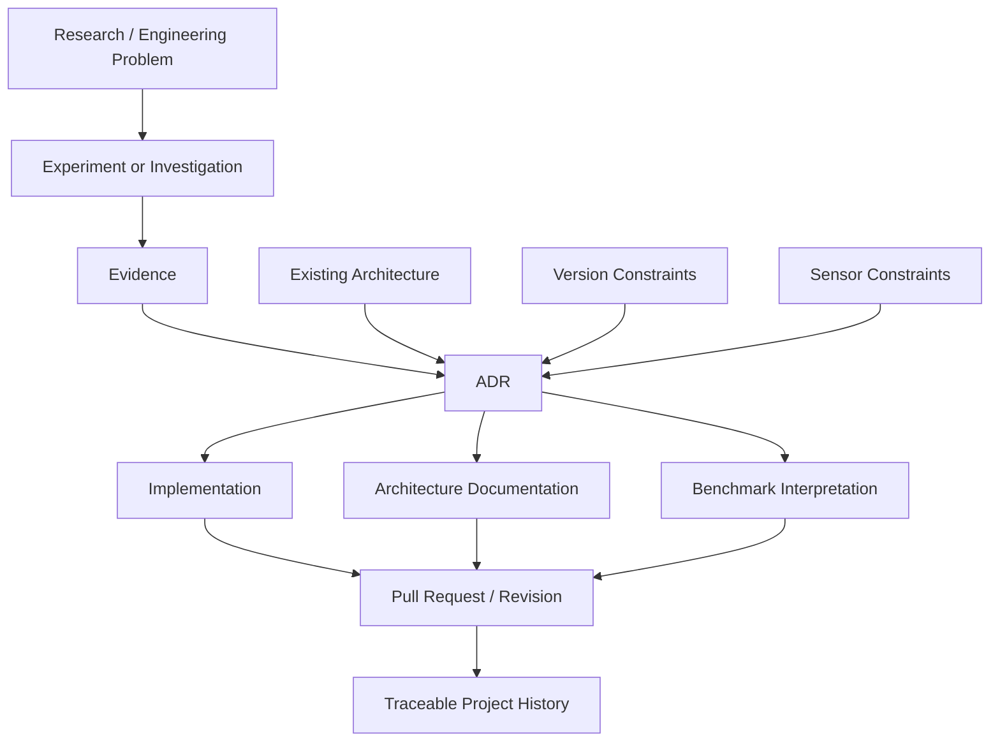

# Architecture Decision Records

This directory contains the Architecture Decision Records (ADRs) for ChandraMap.

ADRs preserve the context, alternatives, evidence, trade-offs, and consequences behind significant architectural choices so future contributors can understand **why** the system evolved—not only what the current code happens to do.

ChandraMap is a scientific software project for lunar image correspondence, registration, multi-sensor processing, benchmarking, and reproducible experimentation. Architectural choices can directly affect:

- scientific validity;
- sensor handling;
- benchmark comparability;
- reproducibility;
- version stability;
- API and data contracts;
- runtime and dependency requirements;
- future research directions.

For that reason, important decisions should remain traceable even after their implementation changes.

> **An ADR records why a significant architectural choice was made, which alternatives were considered, what evidence supported it, and what consequences follow from it.**

ADRs are not intended to document every implementation detail. They are reserved for decisions whose rationale will matter to future development, benchmarking, research interpretation, or system evolution.

Related documentation includes:

- [`../architecture/`](../architecture/) — current system architecture
- [`../development/`](../development/) — development workflow and engineering standards
- [`../research/`](../research/) — research methodology, assumptions, experiments, and baselines
- [`../evaluation/`](../evaluation/) — evaluation and benchmark methodology
- [`../versions/`](../versions/) — scientific version definitions
- [`../datasets/`](../datasets/) — dataset and pair definitions
- [`../algorithms/`](../algorithms/) — algorithm-specific documentation

---

## What Is an Architecture Decision Record?

An **Architecture Decision Record** is a short, durable document describing a significant technical decision.

A useful ADR normally records several distinct elements.

### Architecture Decision

The technical or structural choice being made.

Examples might include:

- where sensor-specific preprocessing belongs;
- how scientific versions share common code;
- which transform family a registration path supports;
- whether retrieval is part of a specific architecture.

### Context

The conditions that make the decision necessary.

Context may include:

- scientific requirements;
- current architectural constraints;
- sensor characteristics;
- benchmark evidence;
- reproducibility requirements;
- maintenance concerns;
- data-size limitations;
- version compatibility.

### Decision

The selected architectural direction.

The decision should be concrete enough that contributors can determine what behavior or structure follows from it.

### Alternatives

Reasonable options that were considered.

Alternatives should be described fairly rather than written as obviously inferior straw-man choices.

### Consequences

What becomes easier, harder, possible, restricted, or more expensive because of the decision.

Consequences may include:

- scientific implications;
- implementation complexity;
- dependency requirements;
- maintenance burden;
- benchmark implications;
- migration work.

### Status

The current lifecycle state of the decision, such as `Proposed`, `Accepted`, or `Superseded`.

### Evidence

Research or engineering evidence supporting the decision.

Evidence may include:

- experiments;
- benchmark results;
- failure-case analysis;
- runtime measurements;
- scientific literature;
- implementation prototypes;
- external technical documentation.

An ADR should therefore answer a question such as:

> Why does ChandraMap use this architectural approach, and what evidence or constraints led to that choice?

It should not merely restate the current implementation.

---

## Why ChandraMap Uses ADRs

ADRs are particularly useful for ChandraMap because the project combines research and production-quality engineering concerns.

### Experimental computer-vision architecture

ChandraMap may evaluate different correspondence, verification, refinement, retrieval, and preprocessing approaches.

A technique may be:

- experimental today;
- rejected tomorrow;
- adopted in a later version;
- replaced when benchmark evidence improves.

Without ADRs, it becomes difficult to determine why one approach entered the architecture while another remained experimental.

### Multiple sensors

OHRC, TMC-2, and IIRS are not interchangeable image sources.

Architectural choices may differ because of:

- spatial resolution;
- spectral characteristics;
- product type;
- sensor modality;
- registration representation;
- available metadata.

ADRs help make sensor assumptions explicit.

### Baseline preservation

ChandraMap maintains benchmarkable scientific baselines.

A later improvement should not silently redefine earlier behavior.

ADRs help distinguish:

- baseline behavior;
- bug fixes;
- architectural evolution;
- later-version methodology.

### Benchmark-driven development

A new method should not become the default architecture merely because it is newer or more complex.

ADRs can record why a technique was adopted based on:

- measured registration behavior;
- robustness;
- spatial coverage;
- runtime;
- failure patterns;
- reproducibility;
- sensor applicability.

### Reproducibility

Scientific results depend on more than code alone.

Architectural decisions can affect:

- input representations;
- transformations;
- benchmark definitions;
- data flow;
- result schemas;
- failure semantics.

Recording those choices improves long-term reproducibility.

### Avoiding repeated architectural debates

A future contributor should not need to rediscover why a major choice was made.

An ADR provides the historical answer while still allowing later decisions to supersede it.

### Distinguishing deliberate design from temporary implementation

Not everything in the repository is a permanent architectural commitment.

An ADR helps distinguish:

```text
temporary experiment
```

from:

```text
accepted architectural direction
```

---

## What Should Become an ADR?

Create an ADR when a decision is significant enough that future contributors are likely to ask:

> Why was the system designed this way?

A decision is a strong ADR candidate when it:

- affects multiple modules;
- changes scientific behavior;
- affects benchmark comparability;
- introduces or removes a major dependency;
- changes data or result contracts;
- changes version architecture;
- creates a long-term maintenance constraint;
- changes a major system boundary;
- resolves an architectural disagreement;
- is expensive to reverse;
- has important rejected alternatives.

### Illustrative ADR topics

The following are examples only. Listing them here does **not** mean these decisions have already been accepted.

Possible ADR topics include:

- choosing the maintained classical baseline matching architecture;
- separating sensor-specific preprocessing paths;
- defining an IIRS registration-compatible 2D representation strategy;
- deciding whether global retrieval is optional or mandatory;
- defining metadata-first search behavior;
- choosing a global descriptor/indexing architecture;
- defining a reference-image pyramid strategy;
- selecting supported geometric transform models;
- deciding where sub-pixel refinement occurs;
- requiring final transform refitting after refined tie points;
- defining independent check-point evaluation architecture;
- establishing benchmark result contracts;
- defining how V1 and later versions share common code;
- choosing scientific result and artifact schemas;
- defining backend/core boundaries;
- selecting persistent indexing or storage architecture;
- adopting a major new research matcher as a supported pipeline path;
- changing a dependency that materially affects core architecture.

---

## What Should Not Become an ADR?

Not every repository change needs an architectural record.

An ADR is generally unnecessary for:

- typo fixes;
- formatting changes;
- local variable renaming;
- small code cleanup;
- ordinary refactoring that preserves architecture and behavior;
- routine patch-level dependency updates;
- normal bug fixes;
- temporary debug logic;
- one-off exploratory notebooks;
- benchmark runs whose only purpose is to collect measurements;
- implementation details already governed by coding standards;
- ordinary documentation edits;
- isolated test additions.

### Record-type distinction

A useful rule is:

```text
ADR
= significant architectural decision

Experiment
= scientific investigation or evidence

Benchmark
= controlled performance measurement

Issue
= tracked work or problem

Pull Request
= reviewed implementation/documentation change

Architecture Documentation
= description of the current system
```

An experiment may provide evidence for an ADR without itself becoming an ADR.

---

## ADR Lifecycle

ChandraMap ADRs should use a small, understandable set of statuses.

The primary lifecycle is:

```text
Proposed
   ↓
Accepted
   ↓
Implemented
   ↓
Superseded / Deprecated
```

Not every ADR must pass through every state.

### `Proposed`

The decision is under consideration.

Use `Proposed` when:

- the problem is understood;
- options are being evaluated;
- implementation may not yet exist;
- review or evidence is still pending.

A proposed ADR must not be treated as established architecture.

### `Accepted`

The architectural decision has been approved as the intended direction.

Acceptance means:

- the decision is considered authoritative;
- implementation may begin or may already be partially complete;
- future changes should respect the decision unless it is superseded.

### `Implemented`

The accepted decision has been materially implemented.

This status is optional where `Accepted` is sufficient for project governance.

The presence of `Implemented` should not be inferred automatically from an accepted design.

### `Rejected`

The proposal was considered but not adopted.

Rejected ADRs should normally remain in history because they preserve:

- alternatives considered;
- evidence;
- reasoning;
- lessons learned.

### `Deprecated`

The decision is still historically valid but is no longer recommended for new development.

Use this only when deprecation is meaningfully different from direct supersession.

### `Superseded`

A later ADR replaces the decision.

The old ADR should remain available and link to the newer decision.

Use:

```text
Superseded By: ADR-XXXX
```

The new ADR should correspondingly identify:

```text
Supersedes: ADR-YYYY
```

---

## ADR Numbering and File Naming

Use a simple sequential naming convention:

```text
0001-short-decision-title.md
0002-another-decision.md
0003-example.md
```

Requirements:

- four-digit sequential number;
- lowercase filename;
- kebab-case title;
- concise descriptive wording;
- ADR number never reused;
- number remains stable after merge.

Example only:

```text
0007-sensor-specific-preprocessing-boundaries.md
```

This filename is illustrative and does not imply that ADR `0007` exists.

### Number allocation

Before creating an ADR:

1. inspect the directory;
2. find the highest existing ADR number;
3. choose the next available sequential number.

If two contributors create ADRs concurrently, numbering can be adjusted during review before merge.

### Never reuse an ADR number

If ADR `0012` was rejected, deprecated, or superseded, `0012` remains part of the architectural history.

Do not reuse its number for a different decision.

### Avoid deleting merged ADRs

A merged ADR should normally remain available even if the decision is later abandoned.

Prefer:

```text
Status: Rejected
```

or:

```text
Status: Superseded
```

over deleting the historical record.

---

## Recommended ADR Template

The following template can be copied when creating a new ADR.

Fields marked **Required** should normally be completed.

Fields marked **Optional** should be included when they add useful information rather than boilerplate.

```markdown
# ADR-XXXX: Decision Title

- **Status:** Proposed
- **Date:** YYYY-MM-DD
- **Decision Owners:** Optional
- **Related Issues:** Optional
- **Related PRs:** Optional
- **Supersedes:** None
- **Superseded By:** None

## Context

Describe the technical, scientific, architectural, or operational context that
makes this decision necessary.

Include relevant constraints such as:

- scientific requirements;
- sensor characteristics;
- benchmark requirements;
- version compatibility;
- data size;
- reproducibility;
- dependency limitations;
- existing architecture.

## Problem

State the specific architectural problem that must be resolved.

Avoid describing only the preferred implementation.

## Decision Drivers

List the major criteria affecting the choice.

Examples may include:

- scientific correctness;
- benchmark performance;
- reproducibility;
- implementation complexity;
- runtime;
- memory use;
- sensor coverage;
- maintainability;
- version compatibility;
- dependency cost.

## Considered Options

### Option 1: <Name>

Describe the option fairly.

**Advantages**

- ...

**Disadvantages**

- ...

### Option 2: <Name>

Describe the option fairly.

**Advantages**

- ...

**Disadvantages**

- ...

### Option 3: <Name>

Include only when relevant.

## Decision

State the selected architectural choice precisely.

Clarify:

- what is being adopted;
- where it applies;
- which sensors or versions it affects;
- what is explicitly outside its scope.

## Rationale

Explain why this option was selected over the alternatives.

Connect the reasoning to the decision drivers.

## Consequences

### Positive

- ...

### Negative / Trade-offs

- ...

## Risks

Document important technical, scientific, maintenance, compatibility, security,
or reproducibility risks.

## Validation / Evidence

Reference evidence supporting the decision where applicable.

Examples:

- experiment records;
- benchmark tables;
- failure-case analysis;
- runtime measurements;
- notebooks;
- scientific papers;
- external technical documentation.

Do not include invented or unverified evidence.

## Benchmark Impact

Describe whether the decision affects:

- benchmark comparability;
- metrics;
- pair populations;
- truth data;
- scientific version behavior;
- runtime;
- failure interpretation.

If there is no benchmark impact, state that briefly.

## Implementation Notes

Optional implementation guidance needed to apply the decision consistently.

Do not turn this section into a complete implementation specification unless
necessary.

## Compatibility / Migration

Describe migration requirements when the decision changes existing behavior,
schemas, stored results, configuration, or version boundaries.

## Alternatives Rejected

Summarize why non-selected alternatives were not chosen.

This may reference the detailed option analysis above.

## Follow-up Work

List significant follow-up actions, experiments, documentation, or migrations.

## References

Link to relevant:

- architecture documentation;
- research experiments;
- benchmark results;
- issues;
- pull requests;
- papers;
- standards;
- external documentation.
```

---

## Required and Optional ADR Fields

Not every template section must contain text if it adds no value.

### Normally required

The following should normally be present:

- title;
- status;
- date;
- context;
- problem;
- decision drivers;
- considered options;
- decision;
- rationale;
- consequences.

For scientific or algorithmic architectural decisions, also include:

- validation/evidence;
- benchmark impact.

### Optional where relevant

These may be omitted when unnecessary:

- decision owners;
- related issues;
- related pull requests;
- supersedes;
- superseded by;
- migration details;
- risks;
- implementation notes;
- follow-up work.

Do not fill optional sections with meaningless text merely to satisfy a template.

---

## Research Evidence and ADRs

Architectural decisions involving scientific methods should be evidence-aware.

ChandraMap should not adopt algorithms merely because they are:

- newer;
- more complex;
- popular;
- learned;
- widely cited;
- visually impressive.

A method should address a defined problem.

Where practical, architectural algorithm decisions should reference measurable evidence.

### Possible comparison examples

Examples only:

- SIFT vs ALIKED + LightGlue;
- SIFT vs LoFTR;
- different IIRS 2D representations;
- different reference-pyramid strategies;
- affine vs homography;
- different global retrieval embeddings;
- different refinement approaches.

### Evidence sources

Useful evidence may include:

- experiment records;
- benchmark tables;
- per-pair metrics;
- stress-test results;
- runtime measurements;
- memory measurements;
- failure-case analysis;
- notebooks;
- literature;
- external mission or algorithm documentation.

An ADR should summarize the architectural conclusion.

The detailed experiment should remain in the appropriate research, experiment, benchmark, or results location.

Conceptually:

```text
Research Question
        ↓
Experiment
        ↓
Benchmark Evidence
        ↓
Architectural Interpretation
        ↓
ADR
```

---

## Benchmark-Driven Decisions

> **A more complex technique should not become part of the default architecture merely because it is newer.**

An architectural method should earn its place by solving an identified problem and demonstrating meaningful value.

Relevant comparison dimensions may include:

- registration accuracy;
- verified-inlier quality;
- inlier ratio;
- spatial distribution;
- failure rate;
- robustness across stress categories;
- retrieval Recall@K where retrieval applies;
- runtime;
- memory usage;
- reproducibility;
- sensor coverage;
- dependency complexity;
- failure modes.

No universal threshold is defined here.

Thresholds belong to the relevant benchmark, version, or acceptance criteria.

### Avoid benchmark cherry-picking

Do not justify an architectural choice from:

- one favorable pair;
- one visually attractive overlay;
- only successful examples;
- a changed benchmark definition;
- an undocumented subset.

Evidence should reflect the controlled research methodology.

See:

- [`../research/experiment-methodology.md`](../research/experiment-methodology.md)
- [`../research/baseline.md`](../research/baseline.md)
- [`../evaluation/benchmark-protocol.md`](../evaluation/benchmark-protocol.md)
- [`../evaluation/metrics.md`](../evaluation/metrics.md)

---

## Sensor-Aware ADR Considerations

Architecture decisions involving image processing should identify their sensor scope.

Possible scopes include:

- OHRC only;
- TMC-2 only;
- IIRS only;
- OHRC + TMC-2;
- all source sensors;
- reference-side processing;
- retrieval-only;
- sensor-independent infrastructure.

Do not write:

> This preprocessing applies to all source imagery.

unless the decision has actually established that behavior.

### OHRC and TMC-2

Both can often be represented as conventional panchromatic imagery, but they differ strongly in spatial resolution and product characteristics.

A shared architecture must not erase those differences.

### IIRS

IIRS requires particular care because it is hyperspectral/infrared data rather than simply another ordinary grayscale camera input.

An ADR involving IIRS should make clear:

- what representation is being processed;
- whether the decision applies to the full hyperspectral product or a derived 2D representation;
- how representation lineage is preserved;
- what scientific limitations remain.

### Reference sensors

LRO NAC and WAC should remain distinguishable where reference scale or product role matters.

---

## Physical Scale and Resolution

Architecture decisions involving image scale should preserve physical meaning.

> **Upsampling does not recover missing spatial information.**

A decision that introduces image resizing should distinguish:

- pixel-array dimensions;
- effective ground scale;
- original sensor information content.

Reference-pyramid and scale-selection strategies should be justified in terms of comparable physical information rather than merely making arrays similar in size.

---

## Retrieval vs Local Correspondence

Global retrieval and local registration are separate architectural responsibilities.

### Global retrieval

Answers:

> Which reference candidate region should be examined?

Possible architecture may involve:

```text
reference imagery
→ tiles / regions
→ global descriptors
→ vector index
→ Top-K candidates
```

### Local correspondence

Answers:

> How do this source image and this candidate reference align geometrically?

Possible architecture may involve:

```text
candidate pair
→ local features / matcher
→ candidate correspondences
→ geometric verification
→ transform
```

If FAISS is used, it should be described according to its actual architectural role:

> FAISS indexes and searches vectors. It does not itself extract image features or establish geometric correspondences.

An ADR must not conflate retrieval candidates with verified registration.

---

## Candidate Matches and Geometric Verification

Algorithm ADRs should preserve the scientific distinction:

```text
candidate correspondences
        ↓
geometric verification
        ↓
verified inliers
```

Matcher confidence alone is not proof of geometric correctness.

If an architecture includes refinement, a defensible sequence is:

```text
candidate correspondences
        ↓
RANSAC / initial model
        ↓
verified inliers
        ↓
sub-pixel refinement
        ↓
final transform refit
```

An ADR changing this ordering should explain why.

---

## Evaluation Considerations

Architectural decisions that affect evaluation should preserve the distinction between:

- fit points;
- verified inliers;
- independent check points;
- reference imagery;
- ground truth.

Where independent check points are available, final registration quality should not be inferred only from points used to fit the transformation.

Any ADR affecting:

- metric meaning;
- fit/check separation;
- truth definitions;
- failure semantics;
- benchmark aggregation;

should identify its benchmark implications explicitly.

---

## Relationship to ChandraMap Versions

ChandraMap versions represent benchmarkable scientific methodologies.

ADRs should make clear whether a decision applies to:

- V1 only;
- a later version;
- multiple versions;
- shared infrastructure;
- future research only.

### Preserve baseline behavior

> **Later architectural improvements must not silently rewrite historical V1 behavior.**

If an architectural change modifies V1 methodology, the ADR should explain:

- why;
- whether it is a bug correction or methodology change;
- whether benchmark comparability changes;
- whether results should be rerun.

### Shared vs version-specific decisions

Some decisions may belong to shared infrastructure, such as:

- result serialization;
- provenance;
- common coordinate models.

Others may be version-specific, such as:

- matching method;
- retrieval behavior;
- refinement policy.

The ADR should identify the boundary.

### Superseding decisions

Use a new ADR when architectural policy changes substantially.

Do not rewrite the old ADR to make the new architecture appear as though it had always been intended.

---

## ADR Directory Structure

Illustrative structure:

```text
docs/
└── adr/
    ├── README.md
    ├── 0001-example-decision.md
    ├── 0002-example-decision.md
    └── ...
```

The filenames above are examples only.

They do not indicate that those ADRs currently exist.

A dedicated template file may be introduced later if the repository benefits from one, for example:

```text
docs/adr/template.md
```

This README remains sufficient to define the template until such a file is intentionally created.

---

## Creating a New ADR

Use the following workflow.

### 1. Search existing ADRs

Before writing a new record:

- inspect this directory;
- check whether the same decision already exists;
- determine whether a previous decision would be superseded.

### 2. Confirm the topic is architectural

Ask:

> Will future contributors need to know why this choice was made?

If the answer concerns only a local implementation detail, an ADR may not be appropriate.

### 3. Choose the next available number

Use the next sequential four-digit number.

Do not reuse historical numbers.

### 4. Copy the template

Start from the template in this README.

Remove optional sections that genuinely do not apply.

### 5. Write context before the decision

Explain the problem and constraints first.

This reduces the risk of writing an ADR solely to justify a preferred implementation.

### 6. Document realistic alternatives

Include the major credible options.

Represent each option fairly.

### 7. Record trade-offs

Every meaningful architectural decision has consequences.

Document both advantages and costs.

### 8. Attach evidence

For research-driven decisions, reference relevant:

- experiments;
- benchmarks;
- failures;
- literature;
- prototypes.

### 9. Identify scope

State whether the ADR affects:

- specific sensors;
- V1;
- later versions;
- shared infrastructure;
- benchmark interpretation;
- APIs;
- datasets.

### 10. Open a pull request

Use the repository's normal Git workflow.

See:

- [`../development/git-workflow.md`](../development/git-workflow.md)

### 11. Review the decision

Review both technical and scientific consequences.

### 12. Set the resulting status

Typical outcomes include:

- `Accepted`;
- `Rejected`;
- remaining `Proposed` pending more evidence.

### 13. Implement appropriately

Implementation may occur:

- in the same pull request;
- in a subsequent pull request;
- incrementally.

The ADR should not falsely claim completion before implementation exists.

---

## Reviewing an ADR

A reviewer should ask:

- Is the actual problem clearly defined?
- Is this architectural rather than trivial?
- Is enough historical and scientific context recorded?
- Are the decision drivers explicit?
- Are realistic alternatives represented fairly?
- Are trade-offs documented?
- Are sensor assumptions correct?
- Is IIRS being treated appropriately if involved?
- Does the decision preserve physical scale meaning?
- Does it affect retrieval, registration, or both?
- Are candidate correspondences distinguished from verified inliers?
- Does transform/evaluation semantics change?
- Does benchmark comparability change?
- Is supporting evidence provided where available?
- Are negative results or failure modes omitted?
- Is the decision reproducible?
- Does the ADR duplicate an existing decision?
- Should another ADR be superseded?
- Are compatibility and migration consequences understood?
- Are data-licensing implications relevant?
- Are security implications relevant?
- Are major new dependencies justified?
- Is the decision specific enough to guide implementation?

---

## Updating an Existing ADR

Accepted ADRs should normally remain historical records.

### Minor corrections

Small non-semantic edits may be appropriate, such as:

- fixing spelling;
- correcting a broken documentation link;
- clarifying wording without changing the decision.

Do not use "clarification" to rewrite the substance of an accepted decision.

### Substantial change

If the architecture changes materially:

1. create a new ADR;
2. reference the previous ADR;
3. explain why the old decision is changing;
4. mark the previous ADR as superseded;
5. connect both records.

Example:

Old ADR:

```text
- **Status:** Superseded
- **Superseded By:** ADR-0018
```

New ADR:

```text
- **Status:** Accepted
- **Supersedes:** ADR-0009
```

The identifiers above are examples only.

---

## ADR vs Experiment vs Benchmark vs Issue

| Record Type      | Purpose                                                   | ChandraMap Example                                                 |
| ---------------- | --------------------------------------------------------- | ------------------------------------------------------------------ |
| ADR              | Record a significant architectural decision and rationale | Choose sensor-specific preprocessing boundaries                    |
| Experiment       | Test a scientific or engineering hypothesis               | Compare SIFT and LoFTR on illumination-stress pairs                |
| Benchmark        | Measure methods under a controlled evaluation protocol    | Compare V1 and a later version using the same pair set and metrics |
| Issue            | Track a task, bug, question, or problem                   | Implement reference-pyramid support                                |
| Pull Request     | Review concrete code or documentation changes             | Add reference-pyramid implementation                               |
| Architecture Doc | Describe the current system structure                     | Explain the V1 processing pipeline                                 |
| Research Doc     | Explain hypotheses, assumptions, or methodology           | Define experiment methodology                                      |

The same architectural change may involve several record types.

For example:

```text
Research Question
      ↓
Experiment
      ↓
Benchmark Evidence
      ↓
ADR
      ↓
Implementation Issue / PR
      ↓
Updated Architecture Documentation
```

---

## Example ADR Topics for ChandraMap

> **The following list is non-authoritative. These are possible ADR topics, not accepted decisions.**

Potential ADR subjects include:

- baseline local-matching architecture;
- sensor-specific preprocessing boundaries;
- IIRS 2D structural representation strategy;
- optional metadata-first geospatial search;
- global retrieval index architecture;
- global descriptor strategy;
- reference-image pyramid architecture;
- geometric verification model;
- transform-model policy;
- sub-pixel refinement placement;
- final-refit requirement;
- check-point evaluation architecture;
- benchmark result contract;
- scientific failure representation;
- multi-version code-sharing strategy;
- scientific result schema;
- artifact-output schema;
- experiment provenance strategy;
- backend/core-engine boundary;
- persistent retrieval-index storage;
- optional learned matcher integration.

Listing a topic does not mean the repository has adopted any particular solution.

---

## ADR Quality Standard

A strong ChandraMap ADR should be:

### Concise enough to read

Avoid turning the ADR into an implementation manual.

### Detailed enough to remain useful years later

A future reader should understand why the decision existed.

### Evidence-aware

Scientific method choices should reference controlled evidence where available.

### Technically precise

Use terms such as:

- candidate correspondence;
- verified inlier;
- transform;
- source/reference;
- retrieval;
- registration;
- check point;

according to their actual meanings.

### Explicit about trade-offs

Every serious architectural choice has costs.

### Clear about sensor scope

Do not silently generalize OHRC behavior to IIRS.

### Version-aware

Identify whether the decision affects:

- V1;
- future versions;
- shared infrastructure.

### Reproducible

Where experiments justify the decision, enough evidence should exist to reproduce or audit the conclusion.

### Linked to related work

Reference implementation, experiments, benchmarks, and supporting documentation.

### Fair to rejected alternatives

Explain why they were rejected without distorting them.

### Honest about uncertainty

A decision may be accepted despite incomplete evidence.

If so, state the uncertainty.

---

## ADR Anti-Patterns

Avoid the following.

### Writing the ADR only after implementation to justify a choice

An ADR should capture genuine reasoning, not retroactively manufacture rationale.

### Presenting only one option

If there was no meaningful alternative, explain why.

Otherwise document credible options.

### Treating novelty as evidence

Do not claim that a learned matcher is appropriate simply because it is modern.

### Assuming terrestrial models are lunar-robust

Robustness should be measured.

### Using benchmark numbers without provenance

Metrics without:

- pair identity;
- configuration;
- benchmark version;
- code state;

are weak architectural evidence.

### Hiding negative experiments

Rejected approaches and failures may explain why the accepted decision exists.

### Rewriting accepted ADRs silently

Use superseding ADRs for major changes.

### Recording temporary implementation details

An ADR should survive refactors where the architecture remains unchanged.

### Confusing global retrieval and local correspondence

They solve different problems.

### Treating image resizing as information recovery

Upsampling does not create missing spatial detail.

### Treating matcher confidence as geometric correctness

Candidate correspondences require geometric verification.

### Treating RANSAC inliers as independent truth

Geometric consistency is not the same as independent ground truth.

### Using decorative confidence percentages

Only report measured quantities with defined semantics.

### Using an ADR as a benchmark report

Summarize the evidence and link to the full evaluation.

### Using an ADR as a research notebook

Experimental details belong in the research workflow.

---

## Traceability

An ADR should link to related evidence and implementation wherever possible.

Useful references may include:

- GitHub issues;
- pull requests;
- experiments;
- benchmark results;
- architecture documents;
- research notes;
- scientific papers;
- mission documentation;
- dependency documentation.

Do not invent issue or PR identifiers.

Use real links only when the referenced item exists.

Example placeholders in an ADR may be written as:

```markdown
- Related Issue: `<issue link>`
- Related PR: `<pull request link>`
- Experiment: `<experiment record>`
- Benchmark Result: `<result record>`
```

Replace placeholders before accepting the ADR where appropriate.

---

## ADR Traceability Model



---

## Relationship to Research Experiments

Research experiments answer questions such as:

> Does method A perform differently from method B under controlled conditions?

An ADR answers:

> Given the available evidence and architectural constraints, which approach should ChandraMap adopt, and why?

An experiment may fail to produce enough evidence for an ADR.

Likewise, not every architecture decision requires a benchmark experiment.

For example, a data-schema boundary may be decided primarily from:

- compatibility;
- maintainability;
- provenance requirements.

---

## Relationship to Benchmark Evidence

Benchmark evidence should support architectural method selection when performance is part of the decision.

The benchmark should remain separate from the ADR itself.

The ADR should summarize:

- which benchmark was relevant;
- which dimensions mattered;
- what limitations were observed;
- why the evidence supports the architectural choice.

The detailed benchmark remains governed by:

- [`../evaluation/benchmark-protocol.md`](../evaluation/benchmark-protocol.md)
- [`../evaluation/metrics.md`](../evaluation/metrics.md)
- [`../research/experiment-methodology.md`](../research/experiment-methodology.md)

---

## Relationship to Implementation

An ADR describes the intended architecture.

Implementation should conform to accepted ADRs unless:

- the ADR is superseded;
- a documented exception exists;
- implementation reveals a previously unknown constraint requiring the decision to be revisited.

Do not silently diverge from an accepted ADR.

If implementation demonstrates that the decision is invalid, update the architectural history explicitly rather than leaving documentation and code inconsistent.

---

## Relationship to Architecture Documentation

ADRs answer:

> Why did we choose this architecture?

Architecture documents answer:

> What architecture exists now?

These are complementary.

For example:

```text
ADR
→ explains why sensor-specific preprocessing was chosen

Architecture document
→ explains how current sensor preprocessing is structured
```

Architecture documentation should describe the present system without erasing previous decisions.

---

## Relationship to Scientific Versions

Version documentation defines the behavior expected from a scientific version.

ADRs explain major architectural choices supporting or changing that behavior.

A version-specific ADR should state its scope explicitly.

Examples:

```text
Scope: V1 only
```

or:

```text
Scope: Shared infrastructure used by V1 and later versions
```

or:

```text
Scope: Proposed later-version research architecture
```

Avoid ambiguous claims that make it unclear whether historical benchmarks remain comparable.

---

## Relationship to Pull Requests

A significant architectural pull request should reference the relevant ADR when one exists.

Possible workflow:

```text
Proposed ADR
      ↓
ADR Review
      ↓
Accepted Decision
      ↓
Implementation PR
```

For smaller changes, the ADR and implementation may reasonably be reviewed together.

The repository does not need process ceremony for its own sake.

---

## Relationship to Issues

Issues are useful for:

- tracking work;
- discussing problems;
- requesting changes;
- collecting implementation tasks.

An issue is not automatically a durable architectural decision record.

When an issue discussion reaches a significant architectural conclusion, the reasoning should be preserved in an ADR where appropriate.

---

## Relationship to Code Comments

Code comments explain local implementation reasoning.

ADRs explain repository-level or subsystem-level architectural decisions.

Do not place a multi-year architectural decision exclusively in a code comment.

---

## Rejected Alternatives

Rejected alternatives are useful engineering evidence.

Record them when they help explain:

- why the chosen solution exists;
- what problems were encountered;
- what benchmark evidence failed to support an approach;
- what future work might revisit.

A rejected alternative should not be mocked or misrepresented.

The technical environment may change enough that a previously rejected idea becomes viable later.

In that case, create a new decision rather than rewriting history.

---

## Negative Research Results

Negative experimental results are particularly valuable when selecting scientific architecture.

Examples might include:

- a learned matcher increases candidate count but reduces geometric-verification reliability;
- a more flexible transform lowers fit residual but worsens independent check-point error;
- an IIRS representation produces visually strong contrast but poor correspondence;
- a retrieval embedding performs poorly on illumination-stress cases.

Such results may justify rejecting an architectural path.

They should remain traceable.

---

## Benchmark Comparability

An ADR must identify benchmark implications when the decision changes:

- algorithm behavior;
- preprocessing;
- representation;
- transform model;
- refinement;
- truth;
- metrics;
- pair definitions;
- failure semantics.

If benchmark comparability changes, state it explicitly.

Do not claim a method improvement when both:

```text
algorithm
```

and:

```text
evaluation contract
```

changed simultaneously without separating the effects.

---

## Version Migration Considerations

An ADR changing established behavior should consider whether migration is needed for:

- configuration;
- result schemas;
- stored results;
- APIs;
- benchmark definitions;
- version-selection behavior;
- experiment reproducibility.

Historical results should remain interpretable where practical.

---

## Dependencies

A major dependency may justify an ADR when it materially affects:

- architecture;
- deployment;
- runtime;
- reproducibility;
- licensing;
- model availability;
- optional vs required installation;
- scientific-version isolation.

Do not adopt research dependencies into shared core infrastructure merely because an experiment uses them.

For example, if a learned matcher is only part of a later experimental path, its dependency implications should remain scoped appropriately.

---

## Data and Licensing Considerations

Architectural decisions involving datasets should consider:

- redistribution rights;
- storage;
- derived product lineage;
- metadata retention;
- benchmark reproducibility.

See:

- [`../data-licenses.md`](../data-licenses.md)
- [`../datasets/`](../datasets/)

An ADR should not normalize an architecture that depends on improperly redistributed mission data.

---

## Security Considerations

Security is not the primary purpose of every ADR, but relevant decisions should consider:

- secret handling;
- untrusted input;
- file access;
- service boundaries;
- model/data download behavior;
- external services.

See:

- [`../../SECURITY.md`](../../SECURITY.md)

---

## Contribution Expectations

Contributors proposing a significant architectural change should:

1. inspect this directory for related decisions;
2. determine whether the change conflicts with an accepted ADR;
3. create a new ADR when the change is architecturally significant;
4. identify affected sensors and scientific versions;
5. preserve benchmark comparability where relevant;
6. include research evidence for algorithmic decisions where available;
7. document rejected alternatives;
8. update current architecture documentation after implementation;
9. preserve historical ADRs rather than rewriting them;
10. keep proposed behavior clearly distinct from implemented behavior.

AI coding agents must follow the same expectations.

An AI-generated architecture change should not receive weaker:

- evidence requirements;
- testing;
- benchmark review;
- documentation;
- provenance;
- human review.

---

## Quick Reference

### Create an ADR when

- a significant architectural boundary changes;
- scientific methodology enters the supported architecture;
- a major sensor-processing strategy is chosen;
- benchmark interpretation is affected;
- version architecture changes;
- a major dependency creates long-term constraints;
- data/output contracts change materially;
- the rationale will matter to future contributors.

### Do not create an ADR when

- fixing a typo;
- making a small implementation change;
- performing routine refactoring;
- adding a normal test;
- running a benchmark;
- performing a temporary research experiment;
- fixing an ordinary bug that does not change architectural policy.

### Naming

```text
NNNN-short-decision-title.md
```

Example only:

```text
0014-example-architecture-decision.md
```

### Numbering

- four digits;
- sequential;
- never reused.

### Primary statuses

```text
Proposed
Accepted
Rejected
Deprecated
Superseded
```

`Implemented` may also be used when distinguishing accepted intent from completed implementation is useful.

### Primary lifecycle

```text
Proposed
   ↓
Accepted
   ↓
Implemented
   ↓
Superseded / Deprecated
```

or:

```text
Proposed
   ↓
Rejected
```

### Core principle

> **Record why the architecture changed, not merely what code changed.**

### Scientific principle

> **Advanced methods should enter the supported architecture because they solve an identified problem and are supported by appropriate evidence—not because they are newer or more complex.**

### Historical principle

> **Do not rewrite architectural history to make the current system appear inevitable. Preserve accepted, rejected, deprecated, and superseded decisions so ChandraMap's scientific and engineering evolution remains understandable.**
