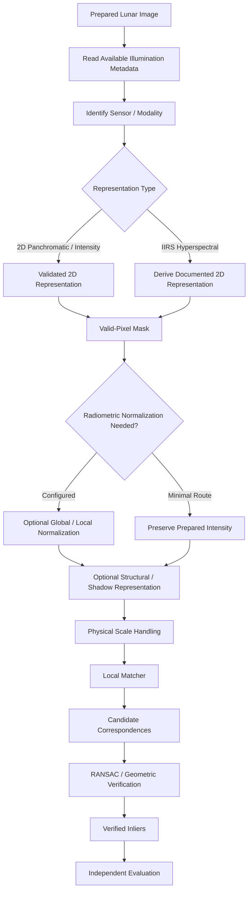
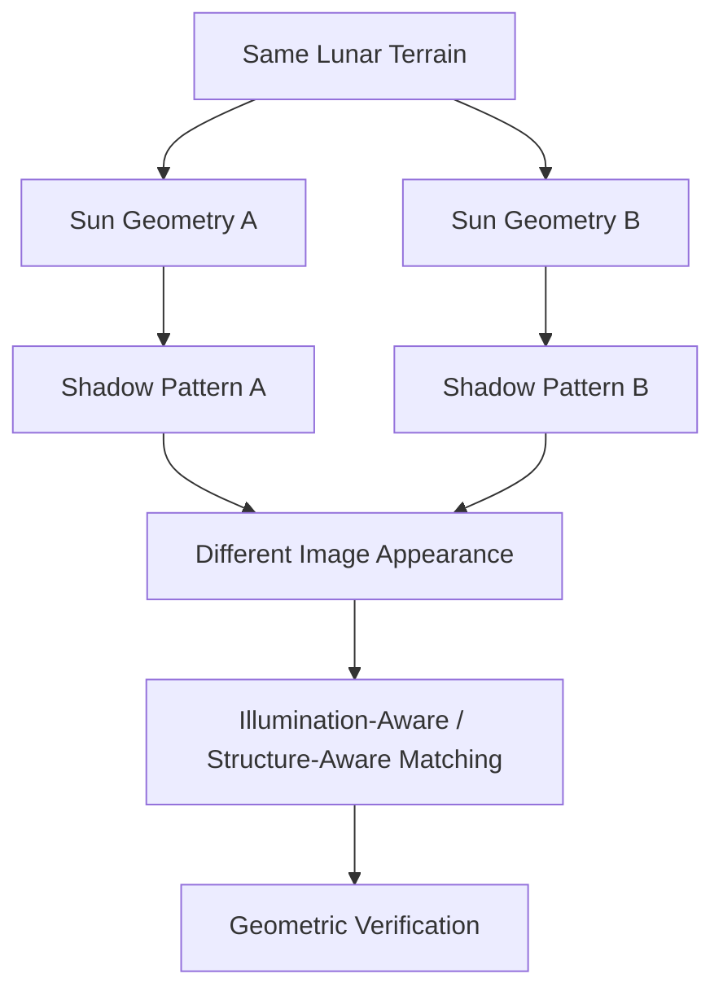

# Illumination Handling

ChandraMap treats lunar illumination as a major correspondence and registration challenge rather than as a simple image-brightness problem.

The same lunar terrain can appear substantially different when observed under different solar geometry. Crater walls that are illuminated in one observation may be shadowed in another. Ridge visibility can change. Shadow boundaries can move. Fine terrain texture can disappear or become visible depending on lighting.

> **A change in lunar Sun angle changes shadow geometry, not merely image brightness.**

Therefore operations such as:

- brightness scaling;
- contrast normalization;
- histogram equalization;
- histogram matching;
- CLAHE;

may reduce some radiometric differences, but they cannot:

- move a shadow back to its previous location;
- reconstruct terrain hidden by shadow;
- recover detail that was never visible in a particular observation;
- guarantee correspondence under different Sun angles;
- make two observations physically illumination-equivalent.

ChandraMap therefore treats illumination robustness as a measurable research problem.

> **ChandraMap does not assume illumination invariance. It measures how correspondence methods behave as illumination changes.**

A second guiding principle is:

> **Illumination handling should reduce avoidable appearance differences while preserving physically meaningful lunar structure.**

The objective is not to force every lunar image to look identical. The objective is to expose terrain information that remains useful for:

- retrieval;
- local correspondence;
- geometric verification;
- registration;
- independent evaluation.

---

## 1. Why Illumination Matters on the Moon

Lunar terrain contains strong three-dimensional relief, including:

- craters;
- crater rims;
- ridges;
- slopes;
- depressions;
- local terrain discontinuities;
- large topographic structures.

Changes in solar geometry can change the visible appearance of all of these structures.

Depending on the observation, illumination differences may alter:

- local brightness;
- shadow direction;
- shadow length;
- illuminated crater walls;
- ridge visibility;
- apparent edge orientation;
- local texture;
- terrain contrast;
- observable detail.

A terrain structure itself does not need to move for its image appearance to change substantially.

This makes illumination one of the central reasons why cross-observation lunar correspondence is harder than ordinary same-image or same-condition matching.

---

## 2. Illumination Is Not Just Brightness

It is useful to distinguish two different problems.

### Brightness Difference

Conceptually:

```text
same visible structure
+
different numeric intensity
```

For example, both images may show the same crater structure but use different overall intensity ranges.

This type of difference may sometimes be reduced through:

- intensity scaling;
- contrast normalization;
- histogram operations;
- numeric-range conversion.

### Shadow Geometry Difference

Conceptually:

```text
same lunar terrain
+
different Sun geometry
        ↓
different illuminated / shadowed surface regions
```

This is fundamentally harder.

The pixels representing a shadow boundary in one observation may correspond to illuminated terrain in another observation.

Therefore:

```text
radiometric normalization
≠
physical illumination correction
```

---

## 3. Conceptual Crater Example

Consider the same crater observed under two different lighting conditions.

Under one observation:

```text
eastern rim  → strongly illuminated
western wall → shadowed
interior     → partly dark
```

Under another observation:

```text
western rim  → strongly illuminated
eastern wall → shadowed
interior     → differently illuminated
```

The crater has not moved.

Its geographic structure remains the same.

However, its image representation may now contain:

- different bright rims;
- different dark regions;
- different strongest edges;
- different apparent texture;
- different local feature locations.

A matcher based only on raw local intensity may therefore find the two appearances difficult to associate.

---

## 4. What Illumination Handling Tries to Achieve

ChandraMap illumination handling aims to:

- reduce avoidable numeric intensity differences;
- reduce some contrast-range differences;
- preserve stable terrain information;
- reduce the influence of unreliable illumination artifacts where justified;
- expose structural information useful for matching;
- document illumination conditions;
- benchmark robustness across real illumination changes;
- identify conditions where correspondence fails.

It does not attempt to transform every observation into one artificial common illumination state unless a future research method explicitly models that process.

---

## 5. What Illumination Handling Cannot Guarantee

Illumination handling cannot guarantee:

- invariant appearance;
- identical crater texture;
- identical ridge appearance;
- recovered terrain hidden in shadow;
- recovered high-frequency detail;
- perfect local correspondence;
- correct global retrieval;
- correct geometric verification;
- sub-pixel registration;
- universal robustness across all Sun angles.

A preprocessing operation should therefore be described as:

- illumination-aware;
- reduced-sensitivity;
- candidate preprocessing;
- stress-tested;
- benchmarked;

rather than automatically:

- illumination invariant;
- Sun-angle invariant;
- shadow invariant.

---

# Illumination, Radiometry, and Viewing Geometry

## 6. Radiometric Difference

Radiometric differences include changes in:

- overall image brightness;
- contrast;
- dynamic range;
- numeric intensity distribution;
- sensor spectral response;
- processing state.

These can affect descriptor or matcher behavior even when terrain visibility is otherwise similar.

Radiometric normalization primarily addresses this class of difference.

---

## 7. Illumination Geometry Difference

Illumination geometry concerns how sunlight interacts with lunar terrain.

Relevant causes may include:

- Sun direction;
- solar elevation;
- local incidence geometry;
- terrain orientation;
- surface relief.

These determine which terrain elements are:

- illuminated;
- partially illuminated;
- shadowed.

Illumination geometry therefore changes the spatial arrangement of visible intensity patterns.

---

## 8. Illumination Geometry vs Viewing Geometry

Illumination geometry and viewing geometry are related but distinct.

### Illumination Geometry

Concerns:

- Sun direction;
- lighting;
- shadow formation;
- illuminated terrain.

### Viewing Geometry

Concerns:

- spacecraft/sensor position;
- look direction;
- observation angle;
- perspective;
- terrain displacement relative to the sensor.

Both may occur simultaneously.

For example:

```text
different Sun direction
+
different spacecraft view direction
```

can change both:

- illumination appearance;
- image geometry.

Do not attribute every registration residual to illumination when viewing geometry may also contribute.

---

# Illumination Metadata

## 9. Using Illumination Metadata

Where available, illumination-related metadata can support:

- benchmark categorization;
- pair analysis;
- failure diagnosis;
- experiment grouping;
- interpretation of residuals;
- illumination-stress selection;
- research preprocessing decisions.

Potentially relevant metadata may include:

- acquisition time;
- incidence angle;
- phase angle;
- emission angle;
- Sun direction;
- solar azimuth;
- solar elevation;
- viewing geometry;
- geographic footprint.

Not every mission product provides every field.

Actual product metadata and authoritative product documentation remain the source of truth.

---

## 10. Incidence Angle

At a high level, incidence angle describes the relationship between incoming sunlight and the local surface orientation.

It can influence:

- illumination strength;
- terrain shading;
- shadow formation;
- visibility of slopes.

Its exact local interpretation depends on the geometric definition and available surface-normal or terrain information.

ChandraMap should therefore avoid pretending that a single image-level value completely describes local lunar illumination across a large relief-rich scene.

---

## 11. Phase Angle

Phase angle describes a component of the source-Sun-observer geometric relationship.

It may provide useful context when comparing observations.

Potential uses include:

- grouping acquisition conditions;
- interpreting brightness differences;
- documenting pair geometry.

Do not assume that every product supplies a phase-angle field.

---

## 12. Solar Azimuth and Sun Direction

Where available, Sun-direction information can help explain:

- shadow orientation;
- which crater wall appears bright;
- which ridges are illuminated;
- why edge patterns differ.

For example:

```text
Sun direction changes
        ↓
shadow orientation changes
        ↓
local feature appearance changes
```

This can be useful for analysis even if the matcher itself does not directly consume Sun-direction metadata.

---

## 13. Solar Elevation

Where available, solar elevation may provide useful illumination context.

Lower or higher illumination geometry can influence:

- shadow extent;
- visibility of local relief;
- contrast of topographic features.

Do not invent solar-elevation values when the product does not provide or support them.

---

## 14. Acquisition Time

Acquisition time is important for:

- observation identity;
- provenance;
- distinguishing repeated observations;
- connecting products to associated geometric metadata.

Acquisition time alone does not fully determine local illumination.

It should therefore not be used as a substitute for explicit illumination geometry.

---

## 15. Missing Illumination Metadata

If illumination metadata is unavailable:

> **Do not infer precise Sun geometry from image appearance and store it as fact.**

Instead:

- mark the field unknown;
- continue using only supported information;
- use independently verified benchmark categories where available;
- restrict analysis that requires unavailable metadata;
- document the limitation.

Unknown illumination geometry is preferable to fabricated metadata.

---

# Radiometric Normalization

## 16. Role of Radiometric Normalization

Radiometric preprocessing attempts to reduce avoidable differences in numerical image appearance.

It may address:

- intensity range;
- contrast range;
- numeric-scale mismatch;
- some global brightness differences.

Conceptually:

```text
Source Image
      ↓
Radiometric Normalization

Reference Image
      ↓
Compatible Radiometric Normalization
```

The goal is to make useful terrain information easier for an algorithm to compare.

---

## 17. Global Intensity Scaling

Candidate strategies may include:

- minimum/maximum scaling;
- robust range scaling;
- percentile-based scaling;
- standard-range conversion.

Potential benefit:

> Make the working numeric distributions more compatible.

Potential limitation:

> Does not alter the physical location of shadows.

No universal scaling parameters are defined here.

They should remain configuration-driven and benchmarked.

---

## 18. Histogram Equalization

Histogram equalization can increase contrast by redistributing image intensities.

Potential advantages include:

- increasing visibility of weak intensity differences;
- expanding a compressed working range.

Potential disadvantages include:

- modifying intensity statistics strongly;
- emphasizing noise;
- exaggerating shadow boundaries;
- making one image locally appear very different from another.

Histogram equalization is an optional preprocessing method.

It is not a complete illumination solution.

---

## 19. Histogram Matching

Histogram matching attempts to make one image's intensity distribution more similar to another image or target distribution.

This may reduce some radiometric mismatch.

However:

```text
similar intensity histogram
≠
similar shadow geometry
```

Two images may have nearly comparable intensity distributions while their shadows occur at completely different locations.

---

## 20. Local Contrast Enhancement

Local contrast methods can make:

- crater rims;
- ridge transitions;
- small terrain boundaries;

more visible in some images.

Potential benefits include:

- stronger local feature responses;
- improved visibility in low-contrast regions.

Potential risks include:

- noise amplification;
- shadow-edge amplification;
- inconsistent local contrast;
- exaggerated interpolation artifacts.

---

## 21. CLAHE and Similar Methods

CLAHE or related local histogram approaches may be tested as optional preprocessing.

They may improve local contrast without applying one global transformation to the entire image.

However, they should not be assumed to:

- restore hidden terrain;
- undo shadows;
- create Sun-angle invariance.

Exact parameters should remain experimental/configurable.

---

## 22. Normalization Risks

| Operation                    | Potential Benefit                  | Potential Risk                                |
| ---------------------------- | ---------------------------------- | --------------------------------------------- |
| Global intensity scaling     | Comparable numeric range           | Limited effect on physical shadow differences |
| Robust scaling               | Reduce influence of extreme values | May suppress meaningful extremes              |
| Histogram equalization       | Increase contrast                  | Alters intensity distribution strongly        |
| Histogram matching           | Similar global distributions       | Does not align shadow geometry                |
| Local equalization           | Improve local feature visibility   | Amplifies noise or shadow edges               |
| Local contrast normalization | Emphasize terrain transitions      | May alter gradients or textures               |

No operation in this table should be interpreted as a guaranteed improvement.

---

# Structural Representations

## 23. Why Structural Information May Help

Raw intensity values can vary significantly across sensors and illumination conditions.

Some terrain structure may remain more stable than absolute brightness.

Potential useful structures include:

- large crater boundaries;
- ridge systems;
- terrain junctions;
- major morphological transitions;
- coarse slope-related structure.

Structural preprocessing attempts to expose these patterns.

It should remain benchmark-driven.

---

## 24. Gradient Representation

Gradients describe local intensity change rather than absolute intensity.

Potential benefits include:

- emphasizing crater rims;
- emphasizing ridges;
- reducing dependence on global brightness.

Potential limitations include:

- shadow boundaries also create strong gradients;
- gradient direction can change with illumination;
- fine shadows may dominate high-resolution imagery.

Therefore:

> **Gradient representations may reduce some radiometric sensitivity, but they are not automatically illumination invariant.**

---

## 25. Edge Representation

Edge maps may emphasize:

- crater boundaries;
- ridge lines;
- structural transitions.

However, they may also emphasize:

- moving shadow boundaries;
- NoData borders;
- projection boundaries;
- noise;
- interpolation artifacts.

An edge-based representation therefore requires:

- valid masks;
- careful preprocessing;
- controlled evaluation.

---

## 26. Phase or Structure-Oriented Representations

Phase-oriented or other structure-focused representations may be investigated as research directions.

Possible goals include:

- reducing dependence on absolute intensity;
- emphasizing spatial structure;
- improving cross-radiometric correspondence.

No such representation should be described as universally effective without lunar benchmark evidence.

---

## 27. Crater-Rim Cues

Crater rims are potentially useful because crater geometry can remain geographically stable.

However, a bright or dark boundary seen around a crater is not always the physical rim itself.

An observed edge may correspond to:

- the actual rim;
- a shadow boundary;
- an illuminated slope transition.

Therefore ChandraMap should distinguish:

```text
topographic structure
```

from:

```text
illumination-induced image boundary
```

where possible.

---

## 28. Ridge and Terrain Geometry Cues

Larger terrain structures may remain more useful than fine texture under strong illumination variation.

This may be particularly relevant to:

- TMC-2;
- IIRS-derived representations;
- coarse WAC contexts;
- large GSD differences.

Possible useful cues include:

- ridge arrangement;
- broad crater morphology;
- terrain intersections;
- large-scale gradients.

This remains a hypothesis to benchmark.

---

# Shadow Handling

## 29. Shadows Are Both Signal and Problem

Shadows are not ordinary random noise.

They encode information about:

- terrain relief;
- illumination direction.

At the same time, they may produce large appearance changes between observations.

Therefore both extremes are risky:

```text
trust every shadow edge
```

and:

```text
remove every shadow region
```

The appropriate treatment depends on the experiment.

---

## 30. Shadow Detection

A future or optional preprocessing stage may attempt to identify strongly shadowed regions.

Possible uses include:

- mask unreliable texture;
- reduce descriptor weight;
- estimate usable matching area;
- characterize illumination stress.

This document does not define:

- a universal shadow threshold;
- a specific detector;
- an implemented shadow-segmentation model.

Shadow detection remains optional/research-oriented unless implementation documentation states otherwise.

---

## 31. Shadow Masking

Shadow masking could potentially reduce false correspondences in areas with little usable terrain information.

Potential benefit:

- exclude regions dominated by missing visible surface information.

Potential downside:

- remove useful crater geometry;
- reduce image coverage;
- remove stable shadow-related context;
- create additional mask boundaries.

Therefore shadow masking should be:

- configurable;
- optional;
- reproducible;
- benchmarked.

---

## 32. The Shadow-Boundary Problem

A shadow edge is often a strong image gradient.

A feature detector may interpret it as:

- a corner;
- an edge;
- a stable local structure.

But if the Sun direction changes:

```text
Shadow Boundary A
        ↓
different Sun geometry
        ↓
Shadow Boundary B
```

the boundary may move substantially.

A correspondence based mainly on that edge may therefore be geometrically incorrect even when both local appearances seem strong.

---

## 33. Fully Shadowed Regions

Some areas may contain very little visible terrain information.

In such cases, a valid system response may be:

- reduce their contribution;
- mask them for a specific matcher;
- report low usable coverage;
- report insufficient information.

The system should not invent terrain that is not visible.

---

# Sensor-Specific Illumination Handling

## 34. OHRC Illumination Context

OHRC is the Chandrayaan-2 **Orbiter High Resolution Camera**.

Current project documentation commonly treats OHRC at approximately:

> **~0.25–0.32 m/pixel**

depending on product/documentation.

Actual product metadata remains authoritative.

Because OHRC is very fine resolution, it may reveal:

- small crater rims;
- fine ridge structure;
- small shadows;
- high-frequency terrain texture.

This high detail can be useful.

It can also increase illumination sensitivity because many small shadows and fine brightness transitions may differ between observations.

---

## 35. OHRC Illumination Strategy

Potential OHRC strategies include:

- preserve the prepared intensity image;
- apply only minimal normalization initially;
- test controlled contrast normalization;
- test structural representations;
- use valid/shadow masking when justified;
- preserve fine terrain information.

Avoid aggressive smoothing or enhancement by default.

High resolution does not make illumination differences automatically easier.

---

## 36. TMC-2 Illumination Context

TMC-2 is the Chandrayaan-2 **Terrain Mapping Camera-2**.

Current project planning uses approximately:

> **~5 m/pixel**

with product metadata remaining authoritative.

TMC-2 may emphasize:

- broad crater morphology;
- ridge patterns;
- medium-scale terrain transitions.

Fine OHRC-scale shadows may not be present in the same way.

---

## 37. TMC-2 Illumination Strategy

Potential strategies include:

- modest radiometric normalization;
- medium-scale gradients;
- structural representations;
- physically compatible reference scaling.

Large terrain morphology may sometimes be more useful than fine raw intensity texture.

This should be measured rather than assumed.

---

## 38. IIRS Illumination Context

IIRS is the Chandrayaan-2 **Imaging Infrared Spectrometer**.

Current project-level approximations include:

- ~80 m/pixel spatial scale;
- ~0.8–5.0 µm spectral range;
- roughly ~250–256 bands depending on product/documentation.

Actual product metadata remains authoritative.

IIRS presents multiple challenges simultaneously:

- coarse spatial scale;
- hyperspectral modality;
- wavelength-dependent response;
- illumination differences;
- possible strong mismatch with panchromatic references.

IIRS should not be treated as an ordinary grayscale camera.

---

## 39. IIRS Illumination Strategy

The conceptual sequence should normally be:

```text
IIRS Scientific Product
        ↓
Validate Spectral / Spatial Structure
        ↓
Derive Documented 2D Registration Representation
        ↓
Apply Illumination / Radiometric Preprocessing if Justified
        ↓
Physical Scale Preparation
        ↓
Matcher Input
```

Illumination handling should therefore operate on a clearly defined IIRS representation.

Do not blindly normalize the full cube and assume the cross-modal problem is solved.

---

## 40. IIRS Representation and Illumination

Candidate IIRS registration representations may include:

- selected spectral band;
- PCA component;
- spectral composite;
- structural representation.

Different representations may respond differently to illumination.

A valid experiment should preserve:

- parent IIRS product;
- selected representation;
- bands/components;
- illumination preprocessing;
- scale strategy.

---

## 41. LRO NAC Illumination Context

LRO NAC commonly provides fine local reference imagery.

Current ChandraMap planning often treats NAC as approximately:

> **~0.5–2 m/pixel**

depending on product/acquisition geometry.

Actual metadata remains authoritative.

NAC may contain:

- fine crater-rim detail;
- small shadows;
- high-frequency terrain texture;

that is absent from TMC-2 or IIRS.

Therefore NAC reference illumination handling must interact with scale handling.

---

## 42. LRO WAC Illumination Context

LRO WAC provides broad/global/contextual imagery.

Its GSD and processing characteristics are product/mode dependent.

WAC may support:

- broad illumination context;
- coarse localization;
- large terrain structures;
- regional retrieval.

Do not assume:

- one universal WAC GSD;
- WAC illumination matches NAC;
- WAC illumination matches Chandrayaan-2 observations.

---

# Scale and Illumination Interaction

## 43. Why Scale Matters to Illumination

Illumination appearance depends partly on spatial resolution.

A very fine reference can show:

- narrow shadow boundaries;
- small crater-wall illumination;
- small-scale relief;
- sharp ridge lighting.

A coarse source may contain none of that detail.

Therefore some apparent:

```text
illumination mismatch
```

may actually be:

```text
illumination mismatch
+
scale mismatch
```

These effects should be studied together but not conflated.

---

## 44. Reference Downsampling

When matching a coarser source against NAC, downsampling the reference can remove fine structure that the source could never observe.

This can be especially relevant for:

```text
TMC-2 ↔ NAC
```

and:

```text
IIRS ↔ NAC
```

Conceptually:

```text
Fine NAC
   ↓
Physically Appropriate Downsampling
   ↓
Coarser NAC Representation
   ↓
Reduced Fine-Shadow Mismatch
```

This does not solve illumination.

It makes the comparison more physically reasonable.

---

## 45. Why Source Upsampling Does Not Solve the Problem

Upsampling a coarse source may make its array larger.

It cannot recover:

- fine terrain relief;
- small crater shadows;
- fine ridge illumination;
- hidden high-frequency information.

For example:

```text
IIRS coarse observation
        ↓
upsample
        ↓
large array
```

still represents the same original coarse observation.

---

## 46. Illumination Stress Must Be Scale-Aware

Illumination experiments should control:

- source GSD;
- reference effective GSD;
- reference pyramid level.

Otherwise a supposed illumination improvement may actually come from better physical scale matching.

---

# Illumination and Matching Algorithms

## 47. SIFT

SIFT provides a useful classical baseline.

It can offer some robustness to certain local intensity changes.

However:

> **SIFT should not be described as Sun-angle invariant.**

Large illumination changes may alter:

- detected keypoints;
- local gradient orientations;
- descriptor similarity;
- feature visibility.

SIFT performance should therefore be measured on illumination-stress pairs.

---

## 48. ALIKED + LightGlue

ALIKED can provide learned sparse features, while LightGlue can match compatible local features.

Potential illumination robustness must be evaluated empirically.

Do not assume:

- lunar-specific training;
- shadow invariance;
- Sun-angle invariance;
- universal cross-mission robustness.

Conceptually:

```text
illumination-aware prepared images
        ↓
ALIKED
        ↓
LightGlue
        ↓
Candidate Correspondences
        ↓
Geometric Verification
```

---

## 49. LoFTR

LoFTR may be tested on lunar image pairs with illumination variation.

Its detector-free architecture does not remove the need to evaluate:

- scale compatibility;
- illumination robustness;
- geometry;
- independent error.

Its confidence values are algorithm outputs.

They are not independent evidence that illumination differences have been solved.

---

## 50. RIFT and CFOG-Style Methods

Remote-sensing-oriented methods such as RIFT and CFOG-style approaches are relevant research candidates because ChandraMap includes:

- multimodal imagery;
- radiometric differences;
- cross-sensor comparisons.

They may be worth testing on difficult illumination cases.

However, ChandraMap should not claim they are superior until measured on controlled lunar benchmarks.

---

## 51. RANSAC Still Matters

Illumination preprocessing does not eliminate false matches.

A matcher may still produce:

- shadow-edge matches;
- repetitive crater matches;
- geographically incorrect correspondences.

Therefore the normal sequence remains:

```text
Candidate Correspondences
        ↓
Geometric Verification / RANSAC
        ↓
Verified Inliers
```

Illumination handling is not a substitute for geometric verification.

---

## 52. Matcher Robustness vs Preprocessing Robustness

Keep the contributions separate.

An improvement may come from:

- better radiometric preprocessing;
- better structural representation;
- better scale selection;
- better matcher;
- better geometric verification.

A controlled experiment should isolate these factors where practical.

---

# Illumination Stress Benchmarks

## 53. Illumination Stress Pair

An illumination-stress pair should represent:

> the same or overlapping lunar region observed under meaningfully different illumination conditions.

Such a pair should preserve where available:

- source product ID;
- reference product ID;
- acquisition times;
- illumination metadata;
- viewing metadata;
- source/reference GSD;
- pair version;
- truth version.

---

## 54. Pair Selection

Where possible, illumination-stress pairs should have:

- confirmed real overlap;
- valid source/reference identity;
- reproducible preparation;
- comparable physical scales;
- useful independent truth;
- available illumination metadata.

Do not define a pair as an illumination stress case merely because one image looks darker than the other.

A dark appearance could also result from:

- sensor response;
- processing;
- exposure;
- dynamic range;
- modality.

---

## 55. Similar-Illumination Control Pair

A useful benchmark may include:

```text
similar-illumination control
```

and:

```text
different-illumination stress case
```

using otherwise comparable experiment conditions.

This helps determine whether failures are specifically associated with illumination variation.

---

## 56. Illumination Difficulty Is Multidimensional

Avoid a universal:

```text
illumination difficulty = one number
```

unless a future benchmark defines a defensible metric.

Difficulty may depend on:

- incidence geometry;
- Sun direction;
- shadow extent;
- terrain type;
- modality;
- GSD;
- view geometry;
- reference scale.

One metadata field alone may not describe the full problem.

---

# Controlled Illumination Ablations

## 57. Ablation Principle

To test illumination preprocessing, keep other major variables fixed.

For example:

```text
same pair
same physical scale
same matcher
same matcher configuration
same RANSAC
same transformation model
same truth
```

then vary:

```text
illumination preprocessing
```

---

## 58. Example Preprocessing Ablation

Conceptual variants:

```text
A. prepared/raw intensity
B. global normalized intensity
C. local contrast normalized
D. gradient representation
E. optional shadow-aware representation
```

Do not assume an ordering of quality.

The benchmark determines the outcome.

---

## 59. Same-Pair Requirement

Do not compare:

```text
Method A on easy pair
```

against:

```text
Method B on difficult pair
```

and interpret the difference as an illumination-preprocessing improvement.

The pair should remain constant.

---

## 60. Same-Scale Requirement

Physical scale should remain constant during an illumination preprocessing ablation.

Otherwise:

```text
better pyramid level
```

may be mistakenly credited to:

```text
better illumination preprocessing
```

---

## 61. Same-Matcher Requirement

If the research question is:

> Does preprocessing help?

then the matcher should remain fixed.

If the research question is:

> Which matcher is more robust?

then preprocessing should remain fixed.

This allows results to remain interpretable.

---

# Evaluation Metrics

## 62. Evaluate Numerically

Illumination preprocessing should not be evaluated only through statements such as:

> "The image looks clearer."

Use downstream metrics.

Relevant measures include:

- candidate match count;
- inlier count;
- inlier ratio;
- spatial coverage;
- independent check-point RMSE;
- source-image pixel error;
- runtime;
- success/failure rate.

Retrieval experiments may additionally use:

- Recall@1;
- Recall@5;
- Recall@K.

---

## 63. Candidate Match Count

A preprocessing operation may increase feature contrast and therefore produce more candidate matches.

That is not sufficient evidence of improvement.

For example:

```text
more keypoints
+
more false shadow matches
```

can produce a worse registration result.

Candidate count should be interpreted alongside geometric and independent evaluation.

---

## 64. Inlier Count

Inlier count describes how many candidate correspondences are consistent with the selected geometric model.

It can help measure whether illumination preprocessing improves geometric support.

Interpret together with:

- inlier ratio;
- coverage;
- RMSE.

---

## 65. Inlier Ratio

Inlier ratio can reveal whether candidate matches became more geometrically consistent.

However:

> **A high inlier ratio does not independently prove accurate registration.**

Incorrect correspondences may still support a wrong model in repetitive terrain.

Independent check points remain important.

---

## 66. Spatial Coverage

Illumination preprocessing may produce correspondences primarily in:

- bright areas;
- high-contrast rims;
- unshadowed regions.

A result can therefore have many inliers but poor coverage.

Coverage metrics may include:

- grid occupancy;
- convex-hull coverage;
- another documented measure.

No universal coverage threshold is defined here.

---

## 67. Independent Check-Point RMSE

Independent RMSE is a preferred registration metric when reliable held-out truth exists.

Report:

- coordinate system;
- units;
- source sensor;
- check-point set;
- truth version.

For example:

```text
RMSE
unit = source-image pixels
point set = held-out check points
```

is scientifically clearer than an unlabeled error number.

---

## 68. Runtime

Illumination handling can increase runtime through:

- local normalization;
- structural transformation;
- shadow processing;
- multiple representations;
- multi-scale processing.

Runtime should therefore be included when comparing expensive alternatives.

---

## 69. Failure Rate

An illumination method should be evaluated across:

- successful cases;
- partially successful cases;
- complete failures.

Do not silently remove difficult illumination pairs from benchmark summaries.

Failure is scientific evidence.

---

# Residual Analysis

## 70. Residual Patterns

After a model is estimated, residual vectors may help reveal problematic correspondences or geometry.

Possible patterns include:

- localized clusters of large error;
- directionally biased errors;
- edge-region errors;
- poor coverage in shadowed regions.

These can provide clues about whether a result is affected by:

- illumination;
- scale mismatch;
- projection;
- geometry model limitations.

---

## 71. Do Not Attribute Every Residual to Lighting

Large residuals may arise from:

- wrong correspondences;
- wrong transform model;
- terrain relief;
- viewing geometry;
- projection mismatch;
- scale mismatch;
- incorrect reference selection.

Diagnosis should remain evidence-based.

---

# Illumination-Handling Pipeline

## 72. Generic Illumination Path

A conceptual illumination-aware path is:

```text
Prepared Sensor Asset
        ↓
Read Available Illumination Metadata
        ↓
Sensor-Specific Representation
        ↓
Valid-Pixel Mask
        ↓
Optional Radiometric Normalization
        ↓
Optional Structural / Shadow Handling
        ↓
Physical Scale Preparation
        ↓
Local Matcher
        ↓
Candidate Correspondences
        ↓
RANSAC / Geometric Verification
        ↓
Verified Inliers
        ↓
Registration
        ↓
Independent Evaluation
```

Not every preprocessing operation is required for every pair.

---

## 73. Illumination Metadata Is Diagnostic, Not Magic

Illumination metadata may help determine:

- benchmark category;
- experiment grouping;
- diagnostic context;
- which research representation to test.

It should not automatically declare:

```text
this matcher will work
```

or:

```text
this pair cannot be matched
```

unless a future benchmark explicitly validates such a rule.

---

# Illumination-Handling Diagrams

## 74. Main Illumination-Handling Flow



---

## 75. Shadow Geometry Concept



The terrain is unchanged while its illumination-dependent image appearance changes.

---

# Configuration

## 76. Configuration-Driven Illumination Handling

Illumination behavior should be configurable where practical.

Conceptual configuration categories may include:

- global normalization mode;
- local contrast mode;
- structural representation;
- shadow masking;
- sensor-specific illumination options;
- illumination benchmark mode;
- physical scale strategy.

This document intentionally does not define exact configuration keys or filenames.

---

## 77. Conservative Defaults

Default illumination handling should be:

- minimally destructive;
- reproducible;
- easy to compare against a baseline;
- scientifically interpretable.

Avoid enabling an opaque chain such as:

```text
histogram equalization
→ CLAHE
→ sharpening
→ shadow mask
→ gradient transform
→ learned enhancement
```

without evidence that each stage improves correspondence.

---

## 78. Sensor-Specific Configuration

A future configuration could conceptually separate sensor behavior.

Illustrative only:

```yaml
illumination:
  ohrc:
    normalization: "PLACEHOLDER"
    structural_representation: "PLACEHOLDER"

  tmc2:
    normalization: "PLACEHOLDER"
    structural_representation: "PLACEHOLDER"

  iirs:
    representation: "PLACEHOLDER"
    normalization: "PLACEHOLDER"
```

This is not an implemented schema.

---

# Provenance

## 79. Illumination-Preprocessing Provenance

A reproducible run should preserve where relevant:

- source asset ID;
- reference asset ID;
- sensor;
- available illumination metadata;
- preprocessing operations;
- operation order;
- preprocessing parameters/configuration;
- representation;
- scale strategy;
- preprocessing version.

This prevents an undocumented preprocessing change from being mistaken for an algorithm improvement.

---

## 80. Operation Order Matters

For example:

```text
normalize
→ gradient
```

may differ from:

```text
gradient
→ normalize
```

Likewise:

```text
shadow mask
→ local contrast
```

may differ from:

```text
local contrast
→ shadow mask
```

Record the sequence when it affects output.

---

# Quality Control

## 81. Illumination-Handling QC Checklist

| Check                                          | Expected        |
| ---------------------------------------------- | --------------- |
| Source asset identity valid                    | Yes             |
| Reference asset identity valid                 | Yes             |
| Sensor identity known                          | Yes             |
| Illumination metadata preserved                | Where available |
| Missing illumination metadata remains explicit | Yes             |
| NoData excluded from normalization             | Yes             |
| Valid mask aligned                             | Yes             |
| Severe clipping absent or documented           | Yes             |
| Output not blank/uniform                       | Yes             |
| Physical scale preserved                       | Yes             |
| Reference effective GSD known                  | When applicable |
| Structural representation documented           | When used       |
| Shadow handling documented                     | When used       |
| IIRS representation identity known             | For IIRS        |
| Operation order recorded                       | Yes             |
| Preprocessing configuration/version recorded   | Yes             |

---

## 82. Visual QC

Visual inspection can help detect:

- severe clipping;
- excessive brightness amplification;
- destroyed crater structure;
- exaggerated shadows;
- invalid shadow masks;
- wrong IIRS representation;
- mask edges interpreted as structure;
- unexpected image inversion.

Visual QC is useful for debugging.

It is not benchmark evidence.

---

## 83. Numeric QC

Possible checks include:

- valid-pixel fraction;
- intensity range;
- clipped-pixel fraction;
- NaN/Inf count;
- representation dimensions;
- gradient distribution;
- mask dimensions.

No universal thresholds are defined here.

---

# Failure Modes

## 84. Illumination-Handling Failure Table

| Failure                                           | Possible Cause                                       | Diagnostic / Response                                       |
| ------------------------------------------------- | ---------------------------------------------------- | ----------------------------------------------------------- |
| Many strong but false edges                       | Moving shadow boundaries                             | Compare raw/structural representations and inspect geometry |
| Few matches after normalization                   | Useful terrain contrast removed                      | Compare with minimally processed input                      |
| Matches occur only in bright area                 | Shadowed terrain contributes little usable structure | Inspect spatial coverage                                    |
| NAC produces unmatched fine features              | Scale + illumination mismatch                        | Use physically coarser NAC level                            |
| IIRS correspondence fails                         | Modality + scale + illumination interaction          | Re-evaluate IIRS representation and reference scale         |
| Local contrast creates many unstable keypoints    | Noise/shadow amplification                           | Reduce or disable local enhancement                         |
| Shadow mask removes most usable terrain           | Mask too aggressive                                  | Relax/disable and re-evaluate                               |
| Gradient representation dominated by shadow edges | Structural representation too illumination-sensitive | Test alternate representation                               |
| Good inlier ratio but poor check RMSE             | Geometry/model issue or biased inliers               | Inspect residuals and transform model                       |
| Illumination metadata appears inconsistent        | Product/metadata interpretation problem              | Return to metadata validation                               |
| Nearly uniform normalized image                   | Incorrect range handling                             | Reject preprocessing output                                 |
| Border edges dominate                             | Invalid mask/boundary handling                       | Fix mask propagation                                        |

---

## 85. Fail Clearly

If illumination preprocessing generates:

- empty valid area;
- almost uniform output;
- severe clipping;
- invalid mask alignment;
- invalid IIRS representation;
- unsupported numeric values;

the pipeline should not silently continue to local matching.

Record a preprocessing failure.

---

# Versioned Illumination Handling

## 86. V1 Illumination Handling

V1 should remain simple and measurable.

A suitable conceptual approach is:

```text
Known-Overlap Real Pair
        ↓
Prepared Intensity Representation
        ↓
Valid Mask
        ↓
Minimal Numeric Normalization if Required
        ↓
Physical Scale Preparation
        ↓
SIFT Baseline
        ↓
RANSAC
        ↓
Independent Evaluation
```

V1 should:

- preserve real illumination differences;
- record available illumination metadata;
- measure where the baseline succeeds or fails;
- avoid claiming illumination invariance.

Advanced shadow or photometric modeling should not be mandatory.

---

## 87. V2 Illumination Handling

Possible V2 additions include:

- global-normalization ablations;
- local-normalization ablations;
- gradient representations;
- edge representations;
- illumination stress pairs;
- scale + illumination experiments;
- spatial-coverage analysis;
- initial IIRS illumination experiments.

These remain measured extensions to the baseline.

---

## 88. V3 Illumination Handling

Possible V3 additions include:

- ALIKED + LightGlue illumination comparisons;
- LoFTR illumination comparisons;
- stronger structural representations;
- shadow-aware preprocessing experiments;
- global retrieval under illumination variation;
- WAC-to-NAC illumination analysis;
- more advanced IIRS representation studies.

---

## 89. V4 Illumination Handling

Possible research-grade directions include:

- lunar-specific illumination-robust learned representations;
- multi-illumination training;
- photometric terrain reasoning;
- DEM-aware illumination modeling;
- shadow-aware learned matching;
- physically based synthetic lunar rendering;
- uncertainty-aware registration;
- sensor-geometry-aware photometric models.

These are research directions, not implementation-status claims.

Existing version specifications remain authoritative.

---

# Advanced and Future Research

## 90. DEM-Aware Illumination Modeling

If terrain/elevation information and reliable Sun geometry are available, future research may investigate modeling expected illumination.

Conceptually:

```text
DEM / Terrain
+
Sun Geometry
        ↓
Expected Illumination / Shadow Model
```

Potential uses could include:

- illumination diagnostics;
- synthetic views;
- terrain-aware feature weighting.

This is significantly more complex than ordinary contrast normalization.

It should not be treated as a V1 requirement.

---

## 91. Photometric Normalization

Advanced photometric methods may attempt to account for:

- surface orientation;
- observation geometry;
- illumination geometry;
- sensor response.

Such approaches may become useful research directions.

This document does not assume one universal lunar photometric correction works across:

- OHRC;
- TMC-2;
- IIRS;
- NAC;
- WAC.

---

## 92. Synthetic Illumination

Synthetic augmentation may help test controlled radiometric changes.

However:

```text
brightness augmentation
```

is not equivalent to:

```text
physically modeled change in Sun geometry
```

Simple brightness changes do not reproduce:

- moving shadows;
- hidden terrain;
- relief-dependent illumination;
- physically correct crater-wall lighting.

---

## 93. Physically Based Lunar Rendering

Future research could investigate physically based synthetic scenes using:

- terrain/elevation;
- illumination geometry;
- sensor/view geometry.

Such simulations may support:

- controlled stress testing;
- augmentation;
- robustness analysis.

They remain synthetic and must not replace real cross-observation validation.

---

## 94. Multi-Illumination Training

If lunar-specific learned methods are later trained or fine-tuned, training data may include:

- multiple Sun angles;
- multiple missions;
- multiple sensors;
- multiple scales;
- multiple terrain types.

The objective could be reduced sensitivity to illumination-dependent appearance.

Such methods should still be independently evaluated on held-out real observations.

---

## 95. Illumination-Invariant Claims

Use the word **invariant** only with strong evidence.

Preferred wording includes:

- illumination-aware;
- illumination-robust candidate;
- reduced sensitivity to illumination;
- evaluated across illumination changes;
- stress-tested under illumination variation.

Avoid implying mathematical or universal invariance from a limited benchmark.

---

# Recommended Ablation Table

## 96. Conceptual Experiment Table

A benchmark table may use:

| Pair      | Illumination Preprocessing | Matcher   | Inliers | Inlier Ratio | Check RMSE | Coverage | Runtime | Status |
| --------- | -------------------------- | --------- | ------: | -----------: | ---------: | -------: | ------: | ------ |
| `PAIR_ID` | `PREPROCESSING_VARIANT`    | `MATCHER` |       — |            — |          — |        — |       — | —      |

Populate this table only with measured benchmark results.

The same pair should be used across preprocessing variants whenever the goal is to measure illumination handling.

---

# Relationship to Algorithm Overview

## 97. [`overview.md`](overview.md)

[`overview.md`](overview.md) describes the complete ChandraMap algorithm system:

```text
representation
→ scale handling
→ retrieval
→ local matching
→ geometric verification
→ refinement
→ registration
→ evaluation
```

This file focuses on one major robustness problem inside that stack:

> **how illumination differences affect representation and correspondence.**

---

# Relationship to Sensor Routing

## 98. [`sensor-routing.md`](sensor-routing.md)

[`sensor-routing.md`](sensor-routing.md) decides which processing path an asset should enter based on:

- sensor;
- modality;
- scale;
- reference role;
- location state.

Illumination handling operates **within** that path.

For example:

```text
sensor routing
→ choose IIRS representation route

illumination handling
→ determine optional radiometric/structural treatment
```

Illumination handling does not replace sensor routing.

---

# Relationship to General Preprocessing

## 99. [`preprocessing.md`](preprocessing.md)

[`preprocessing.md`](preprocessing.md) defines general algorithm preprocessing, including:

- valid masks;
- NoData handling;
- numeric conversion;
- scale preparation;
- IIRS representation;
- matcher-input adaptation.

This file focuses specifically on:

- radiometric differences;
- Sun-angle variation;
- shadow geometry;
- illumination-sensitive representations;
- illumination benchmarks.

The two documents should remain consistent without duplicating every preprocessing detail.

---

# Relationship to Dataset Documentation

## 100. Dataset Documentation

Relevant dataset documentation includes:

- [`../datasets/README.md`](../datasets/README.md)
- [`../datasets/metadata.md`](../datasets/metadata.md)
- [`../datasets/dataset-preparation.md`](../datasets/dataset-preparation.md)
- [`../datasets/pair-definition.md`](../datasets/pair-definition.md)
- [`../datasets/ground-truth-preparation.md`](../datasets/ground-truth-preparation.md)

Their responsibilities include:

```text
metadata.md
→ illumination/view metadata semantics

dataset-preparation.md
→ validated scientific input assets

pair-definition.md
→ defines source/reference stress pairs

ground-truth-preparation.md
→ supplies independent evaluation truth

illumination-handling.md
→ defines algorithmic handling of lighting differences
```

---

# Relationship to Sensor Documentation

## 101. Sensor Documentation

Relevant sensor pages include:

- [`../sensors/overview.md`](../sensors/overview.md)
- [`../sensors/ohrc.md`](../sensors/ohrc.md)
- [`../sensors/tmc2.md`](../sensors/tmc2.md)
- [`../sensors/iirs.md`](../sensors/iirs.md)
- [`../sensors/lro-nac.md`](../sensors/lro-nac.md)
- [`../sensors/lro-wac.md`](../sensors/lro-wac.md)

The distinction is:

```text
Sensor documentation
→ what the instrument measures

Illumination-handling documentation
→ how ChandraMap handles appearance differences caused by lighting
```

Sensor physics should constrain illumination-processing assumptions.

---

# Relationship to Architecture

## 102. Architecture Documentation

Related architecture paths to consult when present include:

- `../architecture/system-overview.md`
- `../architecture/v1-pipeline.md`
- `../architecture/core-engine-architecture.md`
- `../architecture/module-map.md`
- `../architecture/data-flow.md`
- `../architecture/output-flow.md`

Architecture documentation determines:

- where illumination/preprocessing modules live;
- how their configurations are supplied;
- how their outputs reach matching modules;
- how provenance is recorded.

This file defines their scientific responsibility.

---

# Relationship to Project Scope

## 103. Project Documentation

Related project paths to consult when present include:

- `../project/goals.md`
- `../project/non-goals.md`
- `../project/v1-scope.md`
- `../project/terminology.md`
- `../project/assumptions.md`
- `../project/limitations.md`

The actual version/scope documentation remains authoritative.

> **Advanced illumination modeling described here as future research must not become a V1 requirement unless the authoritative V1 scope explicitly requires it.**

---

# Relationship to Benchmarks

## 104. Benchmark Metadata

An illumination benchmark should identify where applicable:

- pair ID;
- pair version;
- illumination category;
- acquisition metadata;
- available Sun metadata;
- view metadata;
- source/reference GSD;
- preprocessing configuration/version;
- matcher;
- truth version;
- benchmark version.

This makes cross-method comparisons reproducible.

---

# Relationship to Experiments

## 105. Experiment Configuration

An illumination experiment should record:

- raw vs normalized representation;
- global/local normalization;
- structural representation;
- shadow handling;
- scale strategy;
- matcher;
- matcher configuration;
- geometric model;
- benchmark pair.

Avoid hidden manual enhancement outside the experiment configuration.

---

# Relationship to Results

## 106. Result Provenance

Results should ideally preserve:

- pair ID/version;
- available illumination metadata;
- illumination preprocessing strategy;
- preprocessing version;
- source/reference scale strategy;
- matcher/version;
- geometry model;
- benchmark/truth version;
- metrics;
- failure reason.

This makes it possible to distinguish:

```text
better matcher
```

from:

```text
better illumination preprocessing
```

or:

```text
better scale handling
```

---

# Claims ChandraMap Should Avoid

## 107. Unsupported Illumination Claims

Do not claim without appropriate evidence:

- "illumination invariant";
- "Sun-angle invariant";
- "shadow invariant";
- "CLAHE solves lunar illumination";
- "histogram matching removes Sun-angle differences";
- "histogram equalization restores hidden terrain";
- "gradient images are illumination invariant";
- "edge maps eliminate shadow effects";
- "SIFT is Sun-angle invariant";
- "LightGlue handles every lunar illumination";
- "LoFTR is illumination invariant";
- "RIFT automatically solves lunar illumination";
- "CFOG guarantees illumination robustness";
- "AI removes shadows";
- "shadow masking always improves registration";
- "more contrast means better correspondence";
- "matching histograms means lighting is equivalent";
- "reference downsampling solves illumination";
- "sub-pixel accuracy is preserved across all lighting conditions";
- unsupported percentages such as "95% illumination robustness."

Measured robustness should always be tied to:

- specific pairs;
- defined preprocessing;
- defined matcher;
- defined metrics.

---

# Common Illumination-Handling Mistakes

## 108. Mistakes to Avoid

Do not:

- treat Sun-angle difference as brightness difference only;
- ignore moving shadows;
- assume global normalization restores terrain visibility;
- normalize NoData as real terrain;
- over-enhance local contrast;
- trust every edge as topographic structure;
- assume shadow boundaries are stable physical features;
- remove all shadows without evaluating the effect;
- apply one illumination preprocessing chain to every sensor;
- treat IIRS intensities as ordinary panchromatic imagery;
- compare preprocessing methods on different pairs;
- change physical scale during an illumination-only ablation;
- change matcher during a preprocessing-only ablation without documenting it;
- evaluate preprocessing only visually;
- report only successful illumination cases;
- confuse viewing geometry with illumination geometry;
- invent incidence or phase values;
- infer exact Sun geometry from an image without authoritative support;
- claim robustness based only on brightness augmentation;
- treat one successful pair as proof of invariance;
- bypass geometric verification because the preprocessing looks strong;
- ignore spatial coverage;
- hide illumination-related failures.

---

# Limitations

## 109. Shadows Can Hide Information Completely

Some terrain may simply be invisible under one illumination condition.

No normalization method can recover details that were not observed.

---

## 110. Terrain Relief Controls Illumination Effects

Shadow behavior depends on surface geometry.

A preprocessing method that works well on relatively smooth terrain may behave differently around:

- steep crater walls;
- ridges;
- large relief.

---

## 111. Fine-Scale Shadows Differ Across Resolution

High-resolution references may contain shadow features that coarse source sensors cannot resolve.

Illumination handling and physical scale handling must therefore be coordinated.

---

## 112. IIRS Combines Multiple Difficulties

IIRS may combine:

- spectral modality difference;
- coarse GSD;
- illumination variation.

Separating the effects of each factor requires careful ablations.

---

## 113. Illumination Metadata May Be Incomplete

Not every product provides all useful Sun/view parameters.

Missing data can limit:

- pair categorization;
- diagnostics;
- advanced photometric modeling.

Do not fill those gaps with guesses.

---

## 114. DEM Information May Be Unavailable

Advanced terrain-aware illumination modeling may require elevation or surface geometry that is not available or not suitable for every pair.

Such methods should remain optional.

---

## 115. Learned Models May Not Generalize

Pretrained learned matchers may not have been trained for:

- lunar terrain;
- lunar shadow geometry;
- cross-mission imagery;
- hyperspectral-derived imagery.

Real lunar benchmark evidence remains necessary.

---

## 116. Structural Representations Remain Shadow-Sensitive

Edges and gradients can reduce sensitivity to global brightness.

They can simultaneously increase sensitivity to moving shadow boundaries.

No structural transformation should be assumed universally robust.

---

## 117. Shadow Masks Can Remove Useful Information

A shadow region may still contain:

- large-scale shape;
- boundary information;
- contextual geometry.

Aggressive masking can reduce useful coverage.

---

## 118. Viewing Geometry Interacts with Illumination

A pair may differ in both:

- lighting;
- observation geometry.

A method may therefore fail for several reasons at once.

Residual and geometry analysis should avoid blaming illumination automatically.

---

## 119. Real Lunar Evaluation Is Required

Synthetic brightness adjustments are useful for limited testing.

They do not reproduce the full physical problem.

Claims about illumination robustness should ultimately be supported by real overlapping lunar observations under different acquisition conditions.

---

# Reference Categories

## 120. Chandrayaan-2 and Sensor Context

Relevant authoritative resource categories include:

- ISRO Chandrayaan-2 documentation;
- ISRO / ISSDC / PRADAN;
- official OHRC documentation;
- official TMC-2 documentation;
- official IIRS documentation;
- official Chandrayaan-2 product metadata documentation.

These sources should be preferred for sensor and illumination-context claims.

---

## 121. Lunar Reconnaissance Orbiter

Relevant authoritative resource categories include:

- NASA Lunar Reconnaissance Orbiter documentation;
- LROC / Arizona State University;
- NASA Planetary Data System;
- official LROC NAC documentation;
- official LROC WAC documentation.

These resources should guide interpretation of reference products and observation geometry.

---

## 122. Computer Vision and Image Processing

Relevant resource categories include:

- OpenCV documentation;
- primary literature for any normalization or image-processing technique actually adopted;
- implementation documentation for feature extractors and matchers used by ChandraMap.

Do not infer lunar robustness from generic image-processing documentation.

---

## 123. Learned Matching

Relevant primary resources include:

- official LightGlue repository/documentation;
- ALIKED publication/repository;
- LoFTR publication/repository.

Implementation and model-input requirements should be checked against the version actually used.

---

## 124. Remote-Sensing Matching

Relevant research categories include:

- RIFT research literature;
- CFOG-related literature;
- multimodal remote-sensing matching research.

These provide useful research directions for radiometric and modality differences.

They do not constitute evidence of lunar superiority without benchmark evaluation.

---

## 125. Planetary Processing and Photometry

Relevant resource categories include:

- USGS ISIS;
- lunar cartographic documentation;
- lunar photometric resources;
- planetary image coregistration documentation;
- terrain/DEM-related planetary processing literature.

These become especially relevant for advanced illumination modeling.

---

# Illumination-Handling Principles

## 126. Sun Angle Changes Shadow Geometry

This is the central rule.

```text
different Sun geometry
→ different illuminated terrain
→ different shadow geometry
→ different image structure
```

---

## 127. Brightness Normalization Is Limited

Brightness and contrast processing can reduce radiometric mismatch.

It cannot physically relocate shadows.

---

## 128. Illumination and Viewing Geometry Are Different

Sun geometry describes lighting.

Viewing geometry describes observation.

Both may affect one pair simultaneously.

---

## 129. Preserve Available Illumination Metadata

Use actual product values where available.

Do not invent missing fields.

---

## 130. Structural Representations Are Candidates

Gradients, edges, and phase-oriented representations require measurement.

They are not guaranteed solutions.

---

## 131. Shadow Edges Can Become False Features

A strong local edge is not automatically a stable terrain boundary.

---

## 132. Shadows Are Not Ordinary Noise

They are a physical interaction between illumination and relief.

---

## 133. Scale and Illumination Interact

Fine references can contain shadow structures absent from coarse sources.

Use physically meaningful reference scales.

---

## 134. Upsampling Does Not Recover Hidden Detail

Interpolation cannot recreate shadowed or unresolved lunar terrain.

---

## 135. IIRS Requires Representation First

Illumination handling should operate on a documented IIRS registration representation rather than an undefined hyperspectral-to-grayscale conversion.

---

## 136. Matcher Robustness Must Be Measured

Do not assume pretrained methods provide lunar illumination invariance.

---

## 137. RANSAC Still Matters

Illumination preprocessing does not remove false correspondences.

---

## 138. Use the Same Pair for Ablations

Changing the pair changes the scientific difficulty.

---

## 139. Keep Physical Scale Constant

Do not confuse better scale matching with better illumination handling.

---

## 140. Keep Matcher Constant When Testing Preprocessing

Isolate the factor being measured.

---

## 141. Evaluate Numerically

Visual improvement alone is insufficient.

---

## 142. Spatial Coverage Matters

A registration dominated by one brightly illuminated region may not constrain the complete overlap.

---

## 143. Record Failures

Illumination-induced failures are part of the benchmark.

---

## 144. Do Not Claim Invariance Without Evidence

Prefer measured robustness language.

---

## 145. Keep V1 Simple

Advanced photometric, DEM-aware, shadow-aware, or learned illumination handling belongs in later research stages unless the authoritative V1 scope says otherwise.

> **ChandraMap's goal is not to make every lunar observation look identical. Its goal is to preserve and expose the terrain information that remains physically meaningful across different illumination conditions, then measure whether correspondence and registration actually improve.**

<!-- ChandraMap illumination-handling documentation specification and supplied project context: :contentReference[oaicite:0]{index=0} -->
