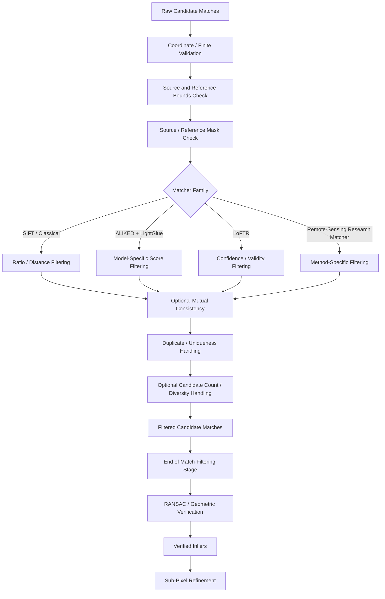
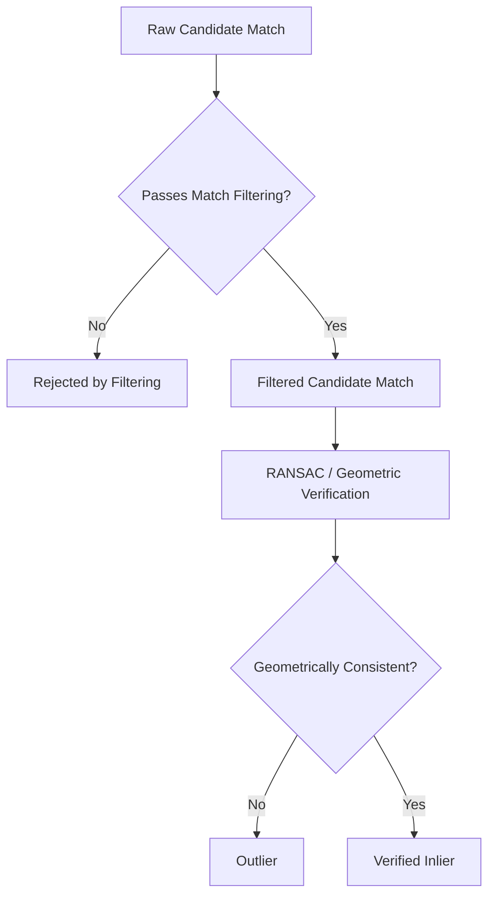

# Match Filtering

ChandraMap uses match filtering to reduce raw matcher output into a cleaner, reproducible set of candidate correspondences before geometric verification.

Local matchers can produce correspondences that are:

- ambiguous;
- duplicated;
- outside valid image regions;
- associated with NoData or masked pixels;
- weak under a matcher-specific score;
- inconsistent under forward/reverse matching;
- concentrated in only one small image region;
- driven by repetitive crater patterns;
- influenced by moving shadow boundaries;
- affected by physical scale mismatch or cross-modality differences.

The filtering stage attempts to remove obvious problems before those candidates reach robust geometric estimation.

> **Match filtering improves the quality of the candidate set; it does not prove that a correspondence is geometrically or scientifically correct.**

After filtering, surviving correspondences are still:

> **filtered candidate matches**

They become **verified inliers** only after geometric verification such as RANSAC accepts them as consistent with the selected geometric model.

A second principle is central to filter design:

> **Filtering is a precision-recall trade-off.**

Loose filtering may preserve:

- more valid correspondences;
- more difficult correspondences;
- better spatial coverage;

but also retain:

- more false associations;
- more repetitive-terrain ambiguity;
- more burden for RANSAC.

Aggressive filtering may remove many false matches, but it may also remove:

- valid correspondences;
- difficult cross-sensor evidence;
- useful spatial coverage;
- enough points to estimate a stable transformation.

Therefore filter strength must be measured rather than guessed.

A third principle applies whenever multiple matcher families are supported:

> **Matcher-specific scores must retain their original meaning.**

For example:

```text
SIFT descriptor distance
≠
LightGlue match score
≠
LoFTR confidence
```

These values arise from different models and mathematical semantics. ChandraMap must not silently convert them into one universal "confidence" scale unless a validated calibration procedure explicitly defines such a mapping.

The recommended conceptual pipeline is:

```text
Prepared Source / Reference
        ↓
      Matcher
        ↓
Raw Candidate Matches
        ↓
 Match Filtering
        ↓
Filtered Candidate Matches
        │
        └── END OF MATCH-FILTERING STAGE
                ↓
     Geometric Verification / RANSAC
                ↓
         Verified Inliers
                ↓
       Sub-Pixel Refinement
                ↓
        Final Transform Refit
                ↓
      Independent Evaluation
```

> **Filtering should remove obvious ambiguity and invalid correspondences before geometry, while preserving enough correct and spatially distributed candidates for robust verification.**

---

## 1. Position in the ChandraMap Pipeline

Match filtering sits between candidate generation and geometric verification.

The broader sequence is:

```text
Dataset / Sensor Preparation
        ↓
Sensor Routing
        ↓
Algorithm Preprocessing
        ↓
Physical Scale Handling
        ↓
Matching
        ↓
Raw Candidate Matches
        ↓
Match Filtering
        ↓
Filtered Candidate Matches
        ↓
RANSAC / Geometric Verification
        ↓
Verified Inliers
        ↓
Sub-Pixel Refinement
        ↓
Transform Refit
        ↓
Independent Evaluation
```

Each stage has a different responsibility.

### Matching

Produces possible source/reference correspondences.

### Match Filtering

Removes or rejects candidates according to:

- structural validity;
- matcher-specific ambiguity;
- matcher-specific score quality;
- optional mutual consistency;
- optional duplicate/uniqueness policies.

### Geometric Verification

Determines whether the remaining candidates agree with a coherent spatial transformation.

### Evaluation

Determines whether the resulting registration is accurate using independent evidence where available.

These stages should remain conceptually distinct even if an implementation combines some operations behind a common software interface.

---

## 2. Match-Filtering Responsibilities

| Operation                                       |                      Match Filtering? |
| ----------------------------------------------- | ------------------------------------: |
| Remove non-finite coordinates                   |                                   Yes |
| Remove coordinates outside image bounds         |                                   Yes |
| Reject NoData/masked-region candidates          |                                   Yes |
| Apply SIFT ratio filtering                      |                  Yes, when configured |
| Apply descriptor-distance threshold             |                              Optional |
| Apply matcher-score threshold                   |                              Optional |
| Apply mutual/cross-check consistency            |                              Optional |
| Resolve exact duplicates                        | Optional / recommended where relevant |
| Apply one-to-one consistency                    |                              Optional |
| Apply candidate-count limits                    |                              Optional |
| Preserve/inspect candidate spatial distribution |                   Yes, diagnostically |
| Detect image features                           |                                    No |
| Compute SIFT descriptors                        |                                    No |
| Run LightGlue or LoFTR inference                |                                    No |
| Estimate affine/homography model                |                                    No |
| Run RANSAC                                      |                                    No |
| Label geometric inliers                         |                                    No |
| Create independent ground truth                 |                                    No |
| Compute final check-point RMSE                  |                      Evaluation stage |

The filtering stage should answer:

> **Which matcher-generated candidates are sufficiently valid and sufficiently unambiguous to justify passing into geometry?**

It should not answer:

> **Which matches are finally correct?**

---

# Terminology

## 3. Raw Candidate Match

A **raw candidate match** is a correspondence emitted directly by a matcher before optional pre-geometric filtering.

Conceptually:

```text
source point
(x_s, y_s)
        ↔
reference point
(x_r, y_r)
```

A raw candidate may also contain:

- source feature ID;
- reference feature ID;
- descriptor distance;
- learned match score;
- confidence-like value;
- feature quality values.

It is not yet geometrically verified.

---

## 4. Filtered Candidate Match

A **filtered candidate match** is a candidate that survives the configured match-filtering rules.

It remains a candidate.

Correct terminology:

```text
raw candidate
→ filtering
→ filtered candidate
```

Incorrect terminology:

```text
raw candidate
→ filtering
→ verified match
```

Verification occurs later.

---

## 5. Verified Inlier

A **verified inlier** is a candidate accepted by geometric verification under the selected model and verification policy.

Conceptually:

```text
filtered candidate
→ RANSAC / geometry
→ verified inlier
```

A verified inlier is still not automatically independent ground truth.

---

## 6. Outlier

An **outlier** is a candidate rejected by geometric verification or otherwise determined to be incompatible with the geometric model.

Filtering may reject candidates before RANSAC, but those pre-geometric rejections should preferably be described by their filtering reason rather than automatically calling all of them geometric outliers.

---

## 7. Descriptor Distance

A **descriptor distance** measures dissimilarity between descriptor vectors under a matcher-specific metric.

For a distance-style metric:

```text
smaller distance
→ descriptors are more similar under that metric
```

Descriptor distance is not:

- geographic distance;
- registration residual;
- probability of correctness.

---

## 8. Similarity Score

A **similarity score** is a method-specific measure of correspondence agreement.

Depending on the matcher:

- larger may be better;
- smaller may be better.

The score direction must therefore remain explicit.

---

## 9. Match Confidence

A **match confidence** is a matcher/model-specific confidence-like quantity.

It may be useful for:

- ordering;
- filtering;
- diagnostics.

Do not assume every confidence is:

- calibrated;
- probabilistic;
- comparable between methods.

---

## 10. Ratio Test

A **ratio test** compares the best descriptor candidate with another nearby descriptor candidate in descriptor space.

Its purpose is to reject cases where the best candidate is insufficiently distinctive relative to an alternative.

---

## 11. Mutual / Cross-Check

A **mutual** or **cross-check** condition requires correspondence agreement in both matching directions.

Conceptually:

```text
source feature A
→ reference feature B

reference feature B
→ source feature A
```

Mutual agreement is stronger descriptor-association evidence.

It is not geometric verification.

---

## 12. One-to-One Matching

A **one-to-one constraint** attempts to ensure:

```text
one source feature
↔
at most one reference feature
```

and conversely for the reference feature.

This may reduce conflicting associations, but it is not appropriate for every matcher architecture.

---

## 13. Spatial Coverage

**Spatial coverage** describes how broadly correspondences are distributed across the usable overlap.

Coverage is distinct from match count.

---

## 14. Ground Truth

**Ground truth** is independently prepared evaluation evidence.

Filtered candidates must never be described as ground truth merely because they pass a strong filter.

---

# Why Raw Matches Need Filtering

## 15. Descriptor Ambiguity

Different lunar regions may contain locally similar structures.

Examples include:

- similar small craters;
- repeated crater rims;
- ridge fragments;
- rough-texture patches;
- repetitive shadow structures.

A local descriptor may therefore have multiple plausible reference candidates.

---

## 16. Repetitive Crater Terrain

Lunar crater fields can create especially strong ambiguity.

Conceptually:

```text
source crater-like feature
        ↓
similar descriptor
        ↓
reference crater A
reference crater B
reference crater C
...
```

The locally nearest descriptor may not correspond to the same physical crater.

Filtering can reduce ambiguity.

Only geometry can test whether candidates form a coherent spatial relationship.

---

## 17. Shadow-Induced Features

Different Sun angles can create:

- strong crater-wall edges;
- moving shadow boundaries;
- high-contrast ridge boundaries.

Such structures can produce high-quality local features while remaining physically unstable between observations.

Appearance-only filtering cannot guarantee their correctness.

---

## 18. Scale Mismatch

A coarse source may be matched against a reference containing much finer detail.

The matcher may then produce:

- weak candidates;
- ambiguous candidates;
- fine-reference features with no source equivalent.

Filtering can reject some bad candidates.

It cannot recover information that is absent from the source.

Physical scale preparation must happen upstream.

---

## 19. Cross-Modality Differences

IIRS-derived imagery may differ substantially from visible/panchromatic reference imagery.

These differences can alter:

- descriptor distributions;
- learned scores;
- feature repeatability.

A threshold useful for OHRC or TMC-2 should not automatically be reused for IIRS.

---

## 20. Invalid Coordinates

Matcher output may occasionally contain:

- malformed coordinates;
- NaN;
- infinity;
- points outside image bounds;
- points referring to a different coordinate grid than expected.

These should be rejected before geometry.

---

## 21. Invalid Image Regions

A feature may lie in:

- NoData;
- projected borders;
- padded areas;
- masked detector regions;
- invalid crop regions.

Such candidates should not be allowed to influence geometric verification as if they were lunar terrain.

---

## 22. Duplicate Associations

Matcher output may include:

- exact duplicate pairs;
- duplicate feature indices;
- many-to-one associations;
- near-identical coordinate pairs.

These can inflate candidate counts and weaken interpretation.

---

# Filtering Layers

## 23. Layer 1 — Validity Filtering

Validity filtering removes structurally invalid candidates.

Examples:

- non-finite coordinates;
- out-of-bounds coordinates;
- invalid feature indices;
- masked source locations;
- masked reference locations;
- malformed score values.

This should normally happen early.

---

## 24. Layer 2 — Matcher-Specific Filtering

Matcher-specific filtering uses the semantics of the selected correspondence method.

Examples include:

- SIFT ratio filtering;
- descriptor-distance thresholding;
- LightGlue score filtering;
- LoFTR confidence filtering;
- future RIFT/CFOG-specific similarity criteria.

---

## 25. Layer 3 — Consistency Filtering

Consistency filtering may impose constraints such as:

- mutual matching;
- uniqueness;
- one-to-one associations;
- duplicate suppression.

These remain pre-geometric rules.

---

## 26. Layer 4 — Candidate-Set Management

Optional candidate-set management may address:

- excessive candidate count;
- spatial concentration;
- computational limits;
- spatial diversity.

These operations require care because reducing the set too aggressively can damage downstream geometry.

---

## 27. Geometry Comes After Filtering

None of these layers replaces:

```text
RANSAC / geometric verification
```

Filtered candidates are still local/matcher evidence.

---

# Validity Filtering

## 28. Coordinate Validation

Every candidate should contain valid finite coordinates.

Conceptually:

```text
isfinite(source_x)
isfinite(source_y)
isfinite(reference_x)
isfinite(reference_y)
```

must hold before geometry.

Candidates containing:

- `NaN`;
- positive infinity;
- negative infinity;
- malformed coordinates;

should not silently continue.

---

## 29. Source Bounds

A source candidate should lie within the valid source image domain under the repository's coordinate convention.

Conceptually:

```text
0 ≤ x_source < source_width
0 ≤ y_source < source_height
```

for a zero-based pixel-space convention.

The repository's actual coordinate convention remains authoritative.

---

## 30. Reference Bounds

The same principle applies to the reference coordinate domain.

A candidate generated in:

- NAC pyramid-level coordinates;

must be validated against:

- that pyramid level's dimensions;

not against:

- native NAC dimensions.

---

## 31. Coordinate-Space Identity

Bounds validation is meaningful only if the coordinate space is known.

For example:

```text
reference point = (x, y)
```

is incomplete without knowing whether `(x, y)` belongs to:

- NAC full product;
- NAC tile;
- NAC pyramid level;
- WAC tile;
- model-resized reference.

---

# Mask Validation

## 32. Valid Masks

Where valid masks exist, the filtering stage should determine whether the candidate lies in a valid scientific region.

Potential invalid regions include:

- NoData;
- map-projection borders;
- masked calibration regions;
- padded model-input areas;
- invalid mosaic edges.

---

## 33. Source-Mask Check

The source coordinate should be tested against the source mask corresponding to the same coordinate grid.

Conceptually:

```text
source candidate
        ↓
source mask lookup
        ↓
valid / invalid
```

---

## 34. Reference-Mask Check

Likewise:

```text
reference candidate
        ↓
reference mask lookup
        ↓
valid / invalid
```

A candidate should not survive simply because one side is valid.

---

## 35. Mask Coordinate Alignment

If matching occurs on:

- a crop;
- a resized image;
- a pyramid level;
- a model-specific representation;

the mask must represent that same geometry.

Incorrect:

```text
matcher coordinates at level 3
+
mask from level 0
```

Correct:

```text
matcher coordinates at level 3
+
level-3 aligned mask
```

---

## 36. NoData Boundaries

NoData edges can become strong visual features if they are rendered into matcher input.

Filtering should not treat a candidate located on such an artificial boundary as trustworthy merely because it has a strong descriptor or learned score.

---

# Score Validity

## 37. Non-Finite Scores

If a matcher emits a score expected to be finite, candidates containing:

- NaN;
- infinity;
- malformed values;

should be rejected or flagged according to the matcher contract.

---

## 38. Missing Scores

Some matcher outputs may not provide a useful score.

Filtering should not fabricate one.

A candidate can still continue if:

- the matcher legitimately provides coordinate pairs without score-based filtering;
- the configured route permits that behavior.

---

# Classical Descriptor Filtering

## 39. Nearest-Neighbor Candidates

A simple descriptor matcher may associate each source descriptor with the nearest descriptor in the reference descriptor set.

Conceptually:

```text
source descriptor
        ↓
search reference descriptors
        ↓
nearest reference descriptor
        ↓
raw candidate match
```

This is simple but vulnerable to descriptor ambiguity.

---

## 40. Why Nearest Alone Can Be Weak

Suppose the nearest and second-nearest descriptor candidates are almost equally similar.

The best candidate may be:

> best only by a very small margin.

This often indicates ambiguity.

---

# k-Nearest-Neighbor Information

## 41. Why Multiple Candidates Help

Retrieving multiple nearest descriptor candidates allows the pipeline to compare:

- best candidate;
- alternative candidate.

This provides a measure of how distinctive the nearest association is.

The concept matters more than the exact API used.

---

# Ratio Filtering

## 42. Ratio-Test Concept

Let:

- \(d_1\) be the descriptor distance to the best candidate;
- \(d_2\) be the distance to the next-best candidate.

A common ratio statistic is:

$$
r = \frac{d_1}{d_2}
$$

A candidate may be retained when \(r\) satisfies a configured ambiguity rule.

For distance-style descriptors, a smaller ratio generally means:

> the nearest candidate is more clearly separated from the next alternative.

---

## 43. Why Ratio Filtering Helps

In repetitive terrain:

```text
best descriptor distance
≈
second-best descriptor distance
```

suggests that the descriptor does not strongly distinguish between two reference locations.

A ratio filter can reject some such ambiguous associations.

---

## 44. No Universal Ratio Threshold

ChandraMap should not invent one universal ratio threshold.

An appropriate setting may depend on:

- descriptor implementation;
- preprocessing;
- sensor pair;
- terrain;
- scale;
- benchmark objective.

Thresholds should therefore be:

- explicit;
- configurable;
- versioned;
- tuned on development/validation data;
- measured on held-out benchmarks.

---

## 45. Passing the Ratio Test Is Not Verification

A correspondence can pass ratio filtering and still be:

- geographically wrong;
- inconsistent with neighboring matches;
- associated with a repeated crater;
- driven by a shadow structure.

Therefore:

```text
ratio passed
≠
verified inlier
```

---

## 46. Ratio-Test Limitations

Potential difficult cases include:

- repeated crater fields;
- too few valid descriptor alternatives;
- severe illumination difference;
- cross-modality descriptors;
- extreme scale mismatch;
- low-texture terrain.

A ratio test only reasons about descriptor ambiguity.

It does not reason about global image geometry.

---

# Descriptor-Distance Filtering

## 47. Absolute Distance Criterion

A classical pipeline may optionally reject candidates whose descriptor distance is too poor under the configured matcher metric.

Conceptually:

```text
descriptor distance
        ↓
configured distance rule
        ↓
retain / reject
```

---

## 48. Distance Semantics Depend on Descriptor Type

Descriptor-distance ranges depend on:

- descriptor representation;
- normalization;
- distance metric;
- library implementation.

Do not reuse one distance threshold across unrelated descriptor types.

---

## 49. Distance Is Not Registration Error

A descriptor distance describes:

> local appearance-vector dissimilarity.

It does not describe:

> geometric pixel displacement.

Keep those quantities distinct.

---

# Combining Distance and Ratio Filters

## 50. Combined Filtering

A classical matcher may conceptually apply:

```text
ratio rule
+
absolute distance rule
```

to reject:

- ambiguous candidates;
- candidates that are individually poor even if distinctive.

This combination should remain configurable.

---

## 51. More Filters Are Not Automatically Better

Adding filters can increase candidate purity while reducing:

- candidate count;
- spatial coverage;
- robustness to difficult cross-sensor matches.

Any combination should be benchmarked.

---

# Mutual / Cross-Check Filtering

## 52. Forward Matching

Forward matching conceptually asks:

```text
for source feature A
→ which reference feature is preferred?
```

Suppose:

```text
A → B
```

---

## 53. Reverse Matching

Reverse matching asks:

```text
for reference feature B
→ which source feature is preferred?
```

Suppose:

```text
B → A
```

---

## 54. Mutual Consistency

A mutual correspondence satisfies both directions:

```text
A → B
B → A
```

This can reduce asymmetric ambiguity.

---

## 55. Mutual Matching Is Not Geometry

A mutual match can still connect:

- the wrong crater;
- the wrong ridge;
- the wrong repetitive terrain patch.

Therefore:

> **Mutual descriptor agreement is not geometric verification.**

RANSAC remains required.

---

## 56. Cross-Check Trade-Off

Mutual filtering may:

- reduce ambiguous associations;
- increase candidate purity.

It may also:

- reduce valid candidate count;
- reject difficult asymmetric but correct matches;
- reduce spatial coverage.

Its value must therefore be measured.

---

# Duplicate and Uniqueness Filtering

## 57. Exact Duplicate Candidates

Exact duplicate pairs can arise from:

- matcher output construction;
- repeated processing;
- candidate aggregation;
- multi-stage matching.

Duplicates can inflate:

- candidate count;
- apparent support;
- runtime.

Removing exact duplicates is often useful.

---

## 58. Exact Duplicate Definition

Conceptually, two candidates may be exact duplicates if they refer to identical:

- source coordinates or feature ID;
- reference coordinates or feature ID.

The precise definition belongs to the matcher contract.

---

## 59. Near-Duplicate Coordinates

Near-duplicate matches require more caution.

Two coordinates that are numerically close may represent:

- the same repeated candidate;
- two genuine nearby features.

Do not invent one universal pixel radius for deduplication.

---

## 60. Feature-ID-Based Deduplication

When stable feature indices exist, duplicate handling may be easier to define using:

- source feature ID;
- reference feature ID.

Detector-free matchers may require coordinate-based logic instead.

---

# One-to-One Constraints

## 61. One Source to One Reference

An optional one-to-one rule may prevent:

```text
source feature A
→ reference B

source feature A
→ reference C
```

from both surviving.

---

## 62. Reference Uniqueness

Similarly, a rule may prevent many source features from all claiming the same reference feature.

Potential benefit:

- reduce conflicting associations.

Potential drawback:

- oversimplify some matcher behavior;
- remove useful evidence.

---

## 63. One-to-One Is Not Universal

Some learned or detector-free matcher architectures may already encode their own assignment behavior.

Do not apply a generic uniqueness rule blindly.

---

# Many-to-One Matches

## 64. Why They Matter

Many source features mapping to one reference location may suggest:

- repeated source terrain;
- weak descriptor distinctiveness;
- duplicate output;
- matcher-specific assignment behavior.

This pattern should be:

- inspected;
- optionally filtered according to the matcher design;
- recorded diagnostically when useful.

---

# Feature-Quality Filtering

## 65. Detector Scores

Some feature detectors provide feature-quality measures such as:

- saliency;
- response strength;
- detection confidence.

These values may help identify very weak features.

---

## 66. Feature Score Is Not Match Correctness

A strong source feature can still match the wrong reference feature.

Therefore:

```text
high feature score
≠
correct correspondence
```

---

## 67. Source and Reference Feature Scores

A future strategy might consider:

- source feature quality;
- reference feature quality;
- match score.

The interaction between these should be experimentally justified.

---

# Combining Feature and Match Scores

## 68. Multi-Signal Filtering

A future filtering strategy may combine:

```text
source feature score
+
reference feature score
+
match score
```

This could provide richer candidate quality information.

However, ChandraMap should not invent a universal formula without:

- method-specific semantics;
- calibration;
- benchmark evidence.

---

# Learned Matcher Filtering

## 69. Learned Matcher Scores

Learned correspondence methods may provide scores intended to reflect:

- match quality;
- model confidence;
- assignment strength.

These values can support:

- filtering;
- ranking;
- diagnostics.

They remain model outputs rather than independent truth.

---

## 70. Domain Shift

A learned confidence may behave differently on lunar imagery if the model was not trained specifically for:

- lunar terrain;
- lunar shadow geometry;
- cross-mission imagery;
- hyperspectral-derived imagery.

Therefore score thresholds must be validated on ChandraMap data.

---

# ALIKED + LightGlue

## 71. ALIKED's Role

ALIKED provides learned sparse local features.

Conceptually:

```text
Prepared Image
        ↓
ALIKED
        ↓
Keypoints + Descriptors + Feature Information
```

---

## 72. LightGlue's Role

LightGlue matches compatible local features.

Conceptually:

```text
Source ALIKED Features
        +
Reference ALIKED Features
        ↓
LightGlue
        ↓
Raw Candidate Matches
```

LightGlue is the matcher in this route.

---

## 73. LightGlue Filtering Path

Conceptually:

```text
ALIKED Features
        ↓
LightGlue
        ↓
Matcher-Provided Candidate Validity / Scores
        ↓
Optional Model-Specific Score Filtering
        ↓
Coordinate / Duplicate Validation
        ↓
Filtered Candidate Matches
        ↓
RANSAC
```

---

## 74. LightGlue Score Threshold

If an additional score threshold is used, it should be:

- configurable;
- tied to the specific model/version;
- documented;
- benchmarked on lunar pairs.

No default value is prescribed here.

---

## 75. Filtered LightGlue Output Is Still Candidate Data

Correct:

```text
LightGlue candidate
→ confidence filter
→ filtered candidate
→ RANSAC
→ verified inlier
```

Incorrect:

```text
LightGlue candidate
→ confidence filter
→ verified match
```

---

# LoFTR Filtering

## 76. LoFTR Role

LoFTR is a detector-free correspondence method.

Conceptually:

```text
Prepared Source
        +
Prepared Reference
        ↓
LoFTR
        ↓
Direct Candidate Coordinates
+
Model-Specific Confidence
```

---

## 77. LoFTR Filtering Path

Conceptually:

```text
LoFTR Output
        ↓
Coordinate Validity
        ↓
Mask Validity
        ↓
Optional Confidence Filtering
        ↓
Duplicate / Coordinate Consistency
        ↓
Filtered Candidate Matches
        ↓
RANSAC
```

---

## 78. LoFTR Confidence Caution

A high LoFTR confidence should not be interpreted as:

- guaranteed lunar correspondence;
- geometric proof;
- ground truth.

Domain shift and repetitive terrain remain possible.

---

# Remote-Sensing Matcher Filtering

## 79. RIFT / CFOG-Style Methods

Remote-sensing-oriented methods may expose their own:

- similarity scores;
- response values;
- consistency measures;
- ambiguity rules.

These should be interpreted using the method's own documented semantics.

---

## 80. Do Not Import SIFT Rules Blindly

A SIFT-style ratio rule should not automatically be applied to:

- RIFT;
- CFOG-style methods;
- other remote-sensing matchers;

unless their matching formulation explicitly supports an equivalent interpretation.

---

# Matcher-Specific Scores

## 81. Different Score Families

Examples include:

```text
descriptor distance
similarity score
network confidence
feature saliency
```

These quantities are not interchangeable.

---

## 82. Score Direction

A candidate score should retain whether:

```text
lower = better
```

or:

```text
higher = better
```

Without this metadata, filtering logic can be interpreted incorrectly.

---

## 83. Score Metadata

Where useful, a candidate record may preserve:

- matcher name;
- matcher version;
- score name/type;
- score value;
- score direction;
- threshold configuration.

---

## 84. No Universal Confidence Percentage

Do not automatically transform arbitrary matcher scores into:

```text
85% confidence
```

or another probability-like percentage.

Such values require validated calibration.

---

# Top-K / Best-N Candidate Filtering

## 85. Candidate Caps

Some experiments may limit candidates for:

- memory;
- runtime;
- downstream RANSAC cost.

Possible approaches include retaining:

- top-scoring candidates;
- a configured maximum number.

This is optional.

---

## 86. Best-N Risk

Score-only selection can produce:

```text
many strongest matches
→ same distinctive crater
→ poor scene-wide coverage
```

A high-scoring but spatially clustered set may be weak for transformation estimation.

---

## 87. No Universal Candidate Count

Do not define one global:

- top 50;
- top 100;
- top 500;

policy for every:

- image size;
- sensor;
- matcher;
- benchmark.

Candidate caps should be configured and benchmarked.

---

# Spatial Diversity

## 88. Why Candidate Distribution Matters

A robust geometric model usually benefits from correspondences distributed across the usable overlap.

Filtering can accidentally remove this diversity.

For example:

```text
raw candidates
→ broad image coverage

strict score filter
→ only one crater region survives
```

This may improve candidate purity while weakening transform geometry.

---

## 89. Candidate Coverage

Candidate coverage describes where filtered candidates exist before RANSAC.

It is useful diagnostically.

It does not guarantee those points are correct.

---

## 90. Verified Inlier Coverage

After RANSAC, verified-inlier coverage is more relevant to final registration support.

Therefore:

```text
candidate coverage
≠
verified coverage
```

---

# Grid-Based Diversity

## 91. Possible Advanced Strategy

A future filtering approach may divide the image into coarse spatial regions and attempt to avoid selecting all candidates from one region.

Conceptually:

```text
candidate matches
        ↓
coarse image cells
        ↓
retain useful candidates across regions
```

---

## 92. Diversity Is Not a Substitute for Quality

Do not retain weak candidates merely to fill empty cells.

Spatial diversity should support candidate management, not override correspondence quality.

---

# Sensor-Specific Filtering

## 93. Why Sensor Pair Matters

Candidate distributions depend on:

- source GSD;
- reference GSD;
- modality;
- feature density;
- illumination;
- terrain detail.

Therefore one filtering configuration may not behave equally across all sensor pairs.

---

# OHRC Filtering

## 94. OHRC Context

OHRC is the Chandrayaan-2 **Orbiter High Resolution Camera**.

Project documentation commonly uses approximately:

> **~0.25–0.32 m/pixel**

depending on product/documentation.

Actual product metadata remains authoritative.

---

## 95. OHRC Filtering Characteristics

OHRC may produce:

- many fine features;
- many candidate correspondences;
- dense small-crater structure;
- high-frequency shadow features.

Potential concerns include:

- repetitive descriptor ambiguity;
- duplicate candidate volume;
- strong local clustering.

Do not keep only one strong crater region if it destroys broader support.

---

# TMC-2 Filtering

## 96. TMC-2 Context

TMC-2 is the Chandrayaan-2 **Terrain Mapping Camera-2**.

Current project planning commonly uses approximately:

> **~5 m/pixel**

with actual product metadata remaining authoritative.

---

## 97. TMC-2 Filtering Characteristics

TMC-2 may provide:

- fewer fine local features;
- more medium-scale terrain structure;
- lower candidate density.

An aggressive filter tuned for dense OHRC correspondence may remove too many valid TMC-2 candidates.

---

## 98. TMC-2 and Scale Preparation

TMC-2 often benefits from a physically appropriate reference-pyramid level.

Filtering should not be expected to repair:

```text
TMC-2
↔
unnecessarily fine NAC
```

scale mismatch.

---

# IIRS Filtering

## 99. IIRS Context

IIRS is the Chandrayaan-2 **Imaging Infrared Spectrometer**.

Project-level approximations include:

- ~80 m/pixel;
- ~0.8–5.0 µm;
- roughly ~250–256 bands depending on product/documentation.

Actual metadata remains authoritative.

---

## 100. IIRS Requires a 2D Representation First

Filtering operates only after IIRS has been transformed into a documented registration-friendly 2D representation.

Conceptually:

```text
IIRS Scientific Product
        ↓
2D Registration Representation
        ↓
Scale Preparation
        ↓
Matcher
        ↓
Raw Candidates
        ↓
Match Filtering
```

---

## 101. IIRS Filtering Characteristics

IIRS may naturally provide:

- fewer useful correspondences;
- lower spatial precision;
- stronger cross-modality score variation.

An overly aggressive generic threshold may collapse the candidate set completely.

---

## 102. Do Not Reuse OHRC Thresholds Automatically

A threshold validated for:

```text
OHRC ↔ NAC
```

should not automatically become the threshold for:

```text
IIRS ↔ NAC
```

or:

```text
IIRS ↔ WAC
```

Sensor-specific differences require benchmark evidence.

---

# NAC Reference Filtering

## 103. NAC Context

LRO NAC is ChandraMap's fine/local reference family.

Current project planning often treats NAC as approximately:

> **~0.5–2 m/pixel**

depending on product/acquisition geometry.

Actual metadata remains authoritative.

---

## 104. Too-Fine NAC Can Create Unnecessary Ambiguity

A fine NAC reference may contain:

- many small craters;
- narrow ridges;
- fine shadows;

that a coarse source does not contain.

This can produce numerous poor or ambiguous candidates.

The correct solution begins with:

> physical reference-scale preparation,

not increasingly aggressive filtering.

---

# WAC Reference Filtering

## 105. WAC Context

LRO WAC provides broad/coarse lunar reference imagery.

Its GSD and product properties are product/mode/processing dependent.

---

## 106. WAC Candidate Behavior

WAC may produce:

- fewer fine local features;
- more broad terrain structures.

Filtering assumptions developed for high-resolution NAC should not automatically be reused.

---

# Scale and Match Filtering

## 107. Filtering Cannot Fix Wrong Physical Scale

This principle is fundamental:

> **Filtering cannot create common terrain information when source and reference are physically mismatched in scale.**

For example:

```text
coarse IIRS representation
        ↔
native fine NAC
```

may have little shared fine-scale information.

No ratio threshold or confidence threshold can create those missing source measurements.

See [`scale-pyramid.md`](scale-pyramid.md).

---

## 108. Scale Comes First

The stronger conceptual order is:

```text
source/reference metadata
        ↓
physical scale preparation
        ↓
matcher
        ↓
match filtering
```

not:

```text
extreme scale mismatch
        ↓
matcher
        ↓
very strict filtering
        ↓
hope geometry succeeds
```

---

## 109. Scale-Controlled Filtering Experiments

When comparing filter configurations, keep reference scale constant.

Otherwise:

```text
better scale selection
```

may be mistaken for:

```text
better filtering
```

---

# Illumination and Filtering

## 110. Shadow-Driven Candidates

Different Sun geometry can produce high-contrast shadow boundaries that local matchers may consider highly distinctive.

A candidate can therefore have:

- good descriptor distance;
- high learned confidence;

while still connecting unstable illumination structures.

---

## 111. Appearance Filters Cannot Verify Terrain Identity

A filter based only on:

- descriptor distance;
- score;
- confidence;
- mutual consistency;

still lacks whole-image geometric context.

This is why RANSAC follows filtering.

---

## 112. Illumination Stress Ablations

When studying filtering under illumination changes, hold constant:

- pair;
- representation;
- physical scale;
- matcher;
- geometry model;
- RANSAC settings;
- truth.

Change only the filter configuration being tested.

See [`illumination-handling.md`](illumination-handling.md).

---

# Generic Filter Order

## 113. Conceptual Sequence

A reasonable generic sequence may be:

```text
Raw Candidate Matches
        ↓
Coordinate / Numeric Validation
        ↓
Bounds Validation
        ↓
Source / Reference Mask Validation
        ↓
Matcher-Specific Score / Distance Filtering
        ↓
Ratio Filtering Where Applicable
        ↓
Optional Mutual Consistency
        ↓
Duplicate / Uniqueness Handling
        ↓
Optional Candidate-Count / Diversity Handling
        ↓
Filtered Candidate Matches
        ↓
RANSAC
```

This is conceptual.

The exact sequence may vary by matcher family.

---

## 114. Filter Order Matters

Filtering operations are not always equivalent when reordered.

For example:

```text
ratio filter
→ mutual check
```

may produce a different final set than:

```text
mutual candidate generation
→ ratio filter
```

depending on implementation.

The order should therefore be part of experiment provenance.

---

# Matcher-Specific Filter Pipelines

## 115. SIFT Route

Conceptually:

```text
SIFT Descriptors
        ↓
k-Nearest Descriptor Associations
        ↓
Ratio Filter
        ↓
Optional Distance Filter
        ↓
Optional Mutual Check
        ↓
Duplicate / Validity Handling
        ↓
Filtered Candidate Matches
```

---

## 116. ALIKED + LightGlue Route

Conceptually:

```text
ALIKED Features
        ↓
LightGlue
        ↓
Matcher-Provided Candidate Set
        ↓
Optional Model-Specific Score Filter
        ↓
Validity / Duplicate Handling
        ↓
Filtered Candidate Matches
```

---

## 117. LoFTR Route

Conceptually:

```text
LoFTR Correspondences
        ↓
Coordinate / Mask Validation
        ↓
Optional Confidence Filter
        ↓
Duplicate / Candidate Management
        ↓
Filtered Candidate Matches
```

---

## 118. Remote-Sensing Matcher Route

A future RIFT/CFOG-style route should use filtering appropriate to that method's:

- response semantics;
- similarity definition;
- ambiguity behavior.

Do not force the SIFT route onto every method.

---

# RANSAC Handoff

## 119. Where Match Filtering Ends

The final output of this document's stage is:

> **filtered candidate matches**

The next stage is:

> **geometric verification**

Conceptually:

```text
filtered candidate matches
        │
        └── END MATCH FILTERING
                ↓
RANSAC
        ↓
verified inliers
```

---

## 120. Enough Candidates Must Remain

If filtering leaves too few candidates for the configured geometric model, the pipeline should:

- report insufficient candidates;
- preserve diagnostics;
- avoid silently continuing with invalid geometry.

The exact model-specific minimum belongs to the geometric-estimation implementation/configuration.

---

## 121. Do Not Loosen Filters Silently

If the candidate set collapses, do not automatically:

- weaken ratio filtering;
- lower confidence requirements;
- disable cross-check;
- increase candidate caps;

without recording the fallback.

Any fallback should be:

- explicit;
- configurable;
- reproducible.

---

# Precision-Recall Trade-Off

## 122. Loose Filtering

Loose filtering may preserve:

- more difficult correct correspondences;
- greater spatial coverage;
- more candidate evidence for RANSAC.

It may also increase:

- false matches;
- RANSAC runtime;
- robust-estimation difficulty.

---

## 123. Aggressive Filtering

Aggressive filtering may provide:

- fewer obviously weak candidates;
- higher apparent candidate purity;
- lower RANSAC cost.

It may also cause:

- insufficient candidates;
- poor coverage;
- removal of difficult true matches;
- increased failure rate.

---

## 124. No Universal Optimum

The correct balance may vary with:

- matcher;
- sensor pair;
- terrain;
- scale;
- illumination;
- benchmark objective.

Therefore filter strength must be benchmarked.

---

# Fixed vs Adaptive Filtering

## 125. Fixed Threshold

A fixed threshold applies one configured value across a defined experiment category.

Advantages:

- easy to reproduce;
- easy to interpret.

Potential limitation:

- may not generalize equally across very different score distributions.

---

## 126. Adaptive Threshold

An adaptive strategy may derive the decision rule from:

- score distribution;
- candidate count;
- sensor pair;
- image characteristics.

This may be investigated in later versions.

It should not be assumed superior.

---

# Score Distribution Diagnostics

## 127. Useful Statistics

Possible diagnostics include:

- minimum;
- maximum;
- median;
- percentiles;
- histogram;
- candidate count.

These help characterize matcher output.

They do not define an optimal threshold automatically.

---

## 128. Distribution Shift

A score distribution may change because of:

- illumination;
- scale;
- modality;
- terrain;
- matcher version.

This is one reason hidden fixed thresholds can be misleading.

---

# Sensor-Specific Threshold Policies

## 129. Potential Need

Different sensor pairs may eventually justify different evaluated policies.

Examples include:

```text
OHRC ↔ NAC
TMC-2 ↔ NAC
IIRS ↔ coarse NAC
IIRS ↔ WAC
```

---

## 130. Avoid Per-Test-Pair Hand Tuning

A scientifically stronger process is:

```text
development data
→ tune/configure filter

validation data
→ select policy

held-out benchmark
→ evaluate unchanged policy
```

rather than:

```text
test pair
→ manually adjust threshold until it succeeds
```

---

# Benchmark Leakage and Overfitting

## 131. Threshold Tuning

Filter thresholds should normally be selected using:

- development cases;
- validation cases.

The final benchmark should then measure generalization.

---

## 132. Check-Point Leakage

Do not repeatedly adjust filtering thresholds by looking at:

- held-out final-test check-point RMSE;

and then describe that same check set as untouched independent evaluation.

---

## 133. Ground Truth Must Not Filter Test Candidates

Benchmark ground truth should not normally be used to directly remove test-set matcher candidates.

Doing so would leak evaluation information into the algorithm.

Only use truth during candidate filtering if the benchmark protocol explicitly defines such a diagnostic experiment and labels it accordingly.

---

## 134. Per-Pair Manual Tuning

Manual tuning may be useful for:

- debugging;
- exploratory research;
- failure diagnosis.

It should not be presented as a general automated benchmark method unless the protocol explicitly permits it.

---

# Filtering Metrics

## 135. Raw Candidate Count

Record:

$$
N_{\text{raw}}
$$

the number of matcher candidates before the configured filtering stage.

This measures matcher output volume.

---

## 136. Filtered Candidate Count

Record:

$$
N_{\text{filtered}}
$$

the number of candidates remaining after match filtering.

---

## 137. Retention Rate

A useful diagnostic is:

$$
\text{retention rate}
=
\frac{N_{\text{filtered}}}
{N_{\text{raw}}}
$$

when \(N\_{\text{raw}} > 0\).

This describes filter aggressiveness.

It does not measure correctness.

---

## 138. Verified Inlier Count

After RANSAC, record:

$$
N_{\text{inlier}}
$$

This measures how many filtered candidates support the selected geometric model.

---

## 139. Inlier Ratio

A clearly defined downstream ratio is:

$$
\text{inlier ratio}
=
\frac{N_{\text{inlier}}}
{N_{\text{filtered}}}
$$

when filtered candidates are the RANSAC input.

The denominator must be stated.

Do not silently compare:

```text
inliers / raw candidates
```

with:

```text
inliers / filtered candidates
```

as though they were identical metrics.

---

## 140. Spatial Coverage

Measure whether verified inliers remain distributed across the usable overlap.

Filtering that increases inlier ratio while collapsing all support into one region may not improve registration.

---

## 141. Independent Check-Point RMSE

Ultimately, a filtering strategy should be judged by its effect on downstream registration.

Independent check-point RMSE provides stronger evidence than:

- raw candidate count;
- filtered candidate count;
- retention rate;
- inlier ratio alone.

---

## 142. Runtime

Filtering may affect:

- post-processing time;
- RANSAC runtime;
- total registration runtime.

Record runtime where relevant.

---

## 143. Failure Rate

Track cases where filtering leaves:

- zero candidates;
- insufficient candidates;
- invalid candidate geometry.

An aggressive filter that performs well only on successful cases may still be a poor overall strategy.

---

# Filtering Benchmark Design

## 144. Same-Pair Rule

Compare filtering strategies on the same source/reference pairs.

Do not compare:

```text
filter A
→ easy pair
```

against:

```text
filter B
→ difficult pair
```

and infer a filtering improvement.

---

## 145. Same-Matcher Rule

When evaluating filtering behavior, hold the matcher constant.

Example:

```text
same SIFT candidate generator
        ↓
different ratio / mutual policies
```

---

## 146. Same-Preprocessing Rule

Keep constant:

- image representation;
- illumination preprocessing;
- masks;
- source/reference scale.

Otherwise the filter comparison becomes confounded.

---

## 147. Same-Geometric-Verification Rule

Use the same:

- RANSAC configuration;
- geometric model;
- residual policy;

when evaluating pre-geometric filtering changes.

---

## 148. Same-Truth Rule

Use the same:

- ground-truth version;
- held-out check points;
- evaluation metric definition.

---

# Controlled Filtering Ablation

## 149. Example Experiment

A conceptual SIFT filtering ablation may compare:

```text
A. nearest-neighbor candidates only

B. ratio filtering

C. ratio + mutual consistency

D. ratio + mutual consistency + duplicate removal
```

Keep constant:

- pair;
- preprocessing;
- reference level;
- SIFT configuration;
- RANSAC;
- transform model;
- truth.

The outcome should be measured, not assumed.

---

# Filtering Benchmark Table

## 150. Conceptual Results Template

| Pair      | Matcher   | Filter Strategy | Raw Candidates | Filtered Candidates | Inliers | Inlier Ratio | Coverage | Check RMSE | Runtime | Status |
| --------- | --------- | --------------- | -------------: | ------------------: | ------: | -----------: | -------: | ---------: | ------: | ------ |
| `PAIR_ID` | `MATCHER` | `FILTER_CONFIG` |              — |                   — |       — |            — |        — |          — |       — | —      |

Only measured benchmark values should populate this table.

---

# Failure Modes

## 151. Match-Filtering Failure Table

| Failure                                              | Likely Cause                                        | Diagnostic / Response                                    |
| ---------------------------------------------------- | --------------------------------------------------- | -------------------------------------------------------- |
| Nearly all candidates removed                        | Filter too strict                                   | Re-evaluate configuration on development/validation data |
| Too many false candidates remain                     | Filter too loose or matcher unsuitable              | Strengthen filtering or inspect matcher/representation   |
| Candidates remain concentrated around one crater     | Score-only selection or local feature dominance     | Inspect spatial distribution                             |
| Valid TMC-2 matches disappear                        | Threshold tuned for denser/finer imagery            | Re-evaluate sensor-pair policy                           |
| IIRS candidate set collapses                         | Generic threshold too aggressive                    | Use representation- and matcher-specific validation      |
| High-score false matches survive                     | Repetitive terrain or moving shadows                | Rely on geometric verification next                      |
| Many candidates are out of bounds                    | Coordinate mapping problem                          | Fix crop/resize/pyramid coordinate lineage               |
| Masked-region matches survive                        | Mask and matcher coordinates misaligned             | Correct mask geometry                                    |
| Candidate count is inflated                          | Exact/near duplicates                               | Apply appropriate duplicate handling                     |
| Many-to-one associations dominate                    | Descriptor ambiguity or matcher assignment behavior | Inspect uniqueness policy                                |
| High inlier ratio but poor check RMSE                | Wrong geometry/reference or clustered support       | Inspect residuals and independent truth                  |
| RANSAC receives too few points                       | Over-filtering                                      | Revisit filter strength without hidden fallback          |
| Different runs use different filters unintentionally | Hidden configuration                                | Version and record filter policy                         |

---

# Match-Filtering Quality Control

## 152. QC Checklist

Before passing filtered candidates to geometry, verify:

- [ ] Raw candidate count is recorded.
- [ ] Source coordinates are finite.
- [ ] Reference coordinates are finite.
- [ ] Source coordinate domain is known.
- [ ] Reference coordinate domain is known.
- [ ] Source points are inside valid bounds.
- [ ] Reference points are inside valid bounds.
- [ ] Source mask is checked where applicable.
- [ ] Reference mask is checked where applicable.
- [ ] Mask geometry matches matcher geometry.
- [ ] Matcher identity is known.
- [ ] Score semantics are known.
- [ ] Score direction is known.
- [ ] Score threshold is recorded where used.
- [ ] Ratio configuration is recorded where used.
- [ ] Mutual/cross-check state is recorded where used.
- [ ] Duplicate/uniqueness policy is recorded.
- [ ] Candidate cap/diversity policy is recorded where used.
- [ ] Filter order is recorded.
- [ ] Filtered candidate count is recorded.
- [ ] Enough candidates remain for configured geometry.
- [ ] RANSAC follows filtering.
- [ ] Failure/warning state is explicit.
- [ ] Filter configuration/version is recorded.

---

# Visual Quality Control

## 153. Raw Candidate Visualization

Plotting raw candidates can reveal:

- severe matcher ambiguity;
- border artifacts;
- obvious duplicate patterns;
- one-region concentration;
- incorrect scale behavior.

---

## 154. Filtered Candidate Visualization

Comparing raw and filtered candidate plots can reveal whether filtering:

- removed obvious weak associations;
- destroyed spatial coverage;
- retained suspicious shadow-based matches.

---

## 155. Verified Inlier Visualization

A third plot showing RANSAC inliers helps distinguish:

```text
filtering effect
```

from:

```text
geometric verification effect
```

---

## 156. Visual Inspection Is Diagnostic

A filtered match plot can look convincing while still containing:

- wrong geography;
- clustered support;
- incorrect transformation.

Quantitative downstream evaluation remains necessary.

---

# Configuration

## 157. Classical Matcher Configuration Categories

Potential conceptual configuration may include:

- nearest-neighbor strategy;
- number of nearest candidates;
- ratio filtering enabled/disabled;
- ratio threshold;
- descriptor-distance rule;
- cross-check enabled/disabled;
- uniqueness policy;
- duplicate policy.

Exact repository keys are intentionally not defined here.

---

## 158. Learned Sparse Configuration Categories

Possible categories include:

- matcher score threshold;
- candidate validity rules;
- duplicate handling;
- maximum candidate count;
- spatial-diversity policy.

---

## 159. Detector-Free Configuration Categories

Possible categories include:

- confidence threshold;
- candidate validity;
- duplicate suppression;
- candidate cap;
- mask policy.

---

## 160. No Hidden Thresholds

Research-sensitive values should not be buried as unexplained constants.

They should be:

- visible;
- configurable;
- versioned;
- benchmarked.

---

# Configuration Versioning

## 161. Why Version Filtering Configuration

Changing any of the following may alter results:

- ratio threshold;
- descriptor-distance threshold;
- confidence threshold;
- filter sequence;
- mutual check;
- uniqueness policy;
- duplicate policy;
- candidate cap.

These changes should be traceable to a distinct experiment configuration.

---

# Reproducibility

## 162. Filtering Run Record

A reproducible filtering run should conceptually preserve:

- pair ID/version;
- matcher name/version;
- raw candidate count;
- source/reference coordinate spaces;
- filter sequence;
- matcher-specific thresholds;
- mutual-check configuration;
- duplicate/uniqueness policy;
- filtered candidate count;
- warning/failure state;
- runtime where relevant;
- filtering configuration/version.

---

## 163. Deterministic Filtering

Given:

```text
same raw candidate set
+
same filter configuration
```

filtering should normally produce the same filtered set.

If a future filtering algorithm includes randomness:

- record the seed;
- document the stochastic stage.

---

# Conceptual Filtering Record

## 164. Illustrative Structure

The following is an **illustrative conceptual structure — not an implemented schema**:

```yaml
filtering:
  matcher: "PLACEHOLDER_MATCHER"
  steps:
    - "validity_check"
    - "matcher_specific_score_filter"
    - "mutual_consistency"
    - "duplicate_removal"
  config_version: "PLACEHOLDER_VERSION"

raw_candidate_count: "PLACEHOLDER_COUNT"
filtered_candidate_count: "PLACEHOLDER_COUNT"
```

No real repository field names, thresholds, or benchmark counts are implied.

---

# Candidate Rejection Reasons

## 165. Optional Rejection Tracking

A future or advanced result format may record why a candidate was removed.

Conceptual reasons may include:

- `out_of_bounds`;
- `non_finite_coordinate`;
- `masked_source`;
- `masked_reference`;
- `invalid_score`;
- `ratio_failed`;
- `distance_failed`;
- `confidence_failed`;
- `non_mutual`;
- `duplicate`;
- `uniqueness_conflict`;
- `candidate_cap`.

These names are conceptual unless an authoritative schema defines them.

---

## 166. Why Rejection Reasons Help

They can support:

- debugging;
- threshold tuning;
- sensor-pair analysis;
- matcher comparison;
- benchmark failure diagnosis.

V1 does not need to store excessive per-candidate diagnostics if the complexity is not justified.

---

# Versioned Filtering Strategy

## 167. V1 — Simple Classical Filtering

V1 should remain transparent and reproducible.

A suitable conceptual route is:

```text
SIFT Descriptors
        ↓
Nearest / k-Nearest Descriptor Matching
        ↓
Ratio Filtering
        ↓
Optional Mutual / Cross-Check
        ↓
Validity / Duplicate Handling
        ↓
Filtered Candidate Matches
        ↓
RANSAC
```

Primary goals:

- interpretable filtering;
- explicit thresholds;
- reproducible candidate sets;
- controlled baseline measurement.

Advanced adaptive filtering should not be required.

---

## 168. V2 — Stronger Candidate Diagnostics

Possible V2 additions include:

- improved duplicate handling;
- sensor-specific filtering studies;
- spatial-coverage diagnostics;
- filtering ablations;
- threshold tuning on development/validation data;
- clearer rejection reasons.

---

## 169. V3 — Learned-Matcher Filtering

Possible V3 additions include:

- LightGlue score handling;
- LoFTR confidence handling;
- matcher-specific candidate caps;
- common candidate-record normalization;
- learned-vs-classical filtering comparisons;
- Top-K retrieval-candidate match filtering.

---

## 170. V4 — Research Filtering

Potential V4 directions include:

- adaptive thresholding;
- calibrated correspondence confidence;
- learned match-quality prediction;
- uncertainty-aware filtering;
- multimodal score calibration;
- spatial-diversity-aware candidate selection;
- multi-matcher fusion;
- confidence + geometry co-design.

These are research directions, not implementation-status claims.

Existing version specifications remain authoritative.

---

# Main Match-Filtering Flow

## 171. Filtering Pipeline



The specific filter path depends on the matcher.

---

# Candidate Status Flow

## 172. Terminology Diagram



This distinction should be preserved in documentation, logs, results, and visualizations.

---

# Relationship to Matching

## 173. [`matching.md`](matching.md)

[`matching.md`](matching.md) explains how ChandraMap generates candidate correspondences using:

- classical sparse matching;
- learned sparse matching;
- detector-free matching;
- future remote-sensing matchers.

This file begins with that raw candidate output and defines:

> **how invalid, ambiguous, or weak candidates may be removed before geometry.**

---

# Relationship to SIFT

## 174. [`sift.md`](sift.md)

[`sift.md`](sift.md) documents:

- SIFT keypoints;
- descriptors;
- classical baseline candidate generation.

This file focuses on downstream SIFT match filtering such as:

- ratio testing;
- descriptor-distance filtering;
- mutual consistency;
- duplicate handling.

It does not duplicate the complete SIFT algorithm.

---

# Relationship to Algorithm Overview

## 175. [`overview.md`](overview.md)

[`overview.md`](overview.md) describes the full ChandraMap algorithm architecture.

Match filtering is one narrow stage inside the larger pipeline:

```text
representation
→ scale handling
→ matching
→ match filtering
→ geometry
→ refinement
→ registration
→ evaluation
```

---

# Relationship to Sensor Routing

## 176. [`sensor-routing.md`](sensor-routing.md)

[`sensor-routing.md`](sensor-routing.md) determines:

- sensor-specific path;
- source representation;
- reference strategy;
- matcher family.

Filtering must respect the matcher and sensor path selected by routing.

---

# Relationship to Preprocessing

## 177. [`preprocessing.md`](preprocessing.md)

[`preprocessing.md`](preprocessing.md) influences:

- feature distributions;
- descriptor behavior;
- learned matcher input;
- mask geometry.

Filtering experiments should not silently change preprocessing.

---

# Relationship to Illumination Handling

## 178. [`illumination-handling.md`](illumination-handling.md)

Illumination differences can produce:

- strong moving shadow edges;
- unstable crater-wall features;
- altered gradient structures.

Filtering may remove some weak appearance candidates.

It cannot prove that surviving matches represent the same physical terrain.

Geometric verification remains required.

---

# Relationship to Scale Pyramid

## 179. [`scale-pyramid.md`](scale-pyramid.md)

[`scale-pyramid.md`](scale-pyramid.md) handles physical source/reference scale compatibility.

Filtering must not be used to compensate for a fundamentally inappropriate reference level.

---

# Relationship to RANSAC

## 180. [`ransac.md`](ransac.md)

[`ransac.md`](ransac.md) begins after this stage.

The distinction is:

```text
match-filtering.md
→ appearance / score / validity filtering
→ filtered candidates

ransac.md
→ geometric consistency verification
→ verified inliers
```

This boundary is central to ChandraMap terminology.

---

# Relationship to Transforms

## 181. [`transforms.md`](transforms.md)

[`transforms.md`](transforms.md) describes the transformation estimated after geometric verification.

Filtering affects which candidates reach geometry, but it does not directly define the final transform.

---

# Relationship to Dataset Documentation

## 182. Dataset Documentation

Relevant known files include:

- [`../datasets/README.md`](../datasets/README.md)
- [`../datasets/metadata.md`](../datasets/metadata.md)
- [`../datasets/dataset-preparation.md`](../datasets/dataset-preparation.md)
- [`../datasets/pair-definition.md`](../datasets/pair-definition.md)
- [`../datasets/ground-truth-preparation.md`](../datasets/ground-truth-preparation.md)

The relationship is:

```text
pair-definition.md
→ defines the scientific source/reference case

ground-truth-preparation.md
→ defines independent evaluation truth

match-filtering.md
→ filters only algorithm-generated candidate matches
```

Independent truth must not be silently used to filter held-out test candidates.

---

# Relationship to Sensor Documentation

## 183. Sensor Documentation

Relevant known files include:

- [`../sensors/overview.md`](../sensors/overview.md)
- [`../sensors/ohrc.md`](../sensors/ohrc.md)
- [`../sensors/tmc2.md`](../sensors/tmc2.md)
- [`../sensors/iirs.md`](../sensors/iirs.md)
- [`../sensors/lro-nac.md`](../sensors/lro-nac.md)
- [`../sensors/lro-wac.md`](../sensors/lro-wac.md)

Sensor characteristics influence:

- feature density;
- ambiguity;
- score distributions;
- expected candidate volume;
- appropriate scale;
- threshold generalization.

---

# Relationship to Architecture

## 184. Architecture Documentation

Related architecture paths to consult when present include:

- `../architecture/system-overview.md`
- `../architecture/v1-pipeline.md`
- `../architecture/core-engine-architecture.md`
- `../architecture/module-map.md`
- `../architecture/data-flow.md`
- `../architecture/output-flow.md`

Architecture documentation determines:

- where filtering modules live;
- how matcher output reaches them;
- how filtered candidates are serialized;
- how geometry consumes the filtered set.

This file defines the filtering stage's scientific and algorithmic responsibility.

---

# Relationship to Project Scope

## 185. Project Documentation

Related project paths to consult when present include:

- `../project/goals.md`
- `../project/non-goals.md`
- `../project/v1-scope.md`
- `../project/terminology.md`
- `../project/assumptions.md`
- `../project/limitations.md`

Actual version/scope documentation remains authoritative.

Advanced adaptive or learned filtering should not become mandatory V1 behavior unless the authoritative scope explicitly requires it.

---

# Relationship to Benchmarks

## 186. Benchmark Infrastructure

A filtering benchmark should identify:

- pair ID/version;
- matcher;
- matcher/model version;
- representation;
- reference level;
- filtering strategy;
- filtering thresholds;
- RANSAC configuration;
- transform model;
- truth version;
- benchmark version.

This permits reproducible comparisons.

---

# Relationship to Experiments

## 187. Controlled Experiment Design

Filtering experiments should vary:

> **filtering strategy**

while keeping other important variables constant where possible.

This makes it possible to determine whether filtering itself produced the observed difference.

---

# Relationship to Results

## 188. Filtering Result Records

Results should ideally preserve:

- raw candidate count;
- filtered candidate count;
- retention rate;
- inlier count;
- inlier ratio;
- verified spatial coverage;
- independent check-point RMSE;
- runtime;
- filter configuration;
- failure status.

This allows researchers to determine whether a cleaner candidate set actually improved registration.

---

# Claims ChandraMap Should Avoid

## 189. Unsupported Match-Filtering Claims

Do not claim without appropriate evidence:

- "Ratio-test matches are correct."
- "Cross-checked matches are verified."
- "Mutual matches are ground truth."
- "Low SIFT descriptor distance proves lunar correspondence."
- "High LightGlue confidence means correct."
- "High LoFTR confidence means correct."
- "Stricter filtering always improves accuracy."
- "Fewer matches are always better."
- "More retained matches are always better."
- "One confidence threshold works for all matchers."
- "SIFT distance and LightGlue confidence are directly comparable."
- "LoFTR and LightGlue confidence have identical meaning."
- "Filtering removes the need for RANSAC."
- "Filtering fixes wrong physical scale."
- "Filtering solves lunar illumination."
- "Filtering solves cross-modality differences."
- "Top-scoring candidates are always spatially useful."
- "Filtered candidates are final matches."
- "High retention rate means high correspondence quality."
- "High inlier ratio guarantees low registration error."

---

# Common Match-Filtering Mistakes

## 190. Mistakes to Avoid

Do not:

- call filtered candidates inliers;
- call filtered candidates ground truth;
- skip RANSAC after filtering;
- use one threshold for all matcher families;
- tune thresholds independently on every final test pair;
- use held-out ground truth to directly filter final test candidates;
- ignore matcher score direction;
- compare descriptor distances with learned confidence directly;
- apply SIFT ratio-test logic blindly to LoFTR;
- apply OHRC-specific thresholds blindly to TMC-2 or IIRS;
- keep all high-scoring matches without checking duplicate behavior;
- select only the strongest candidates from one small region;
- ignore candidate spatial coverage;
- allow masked or NoData candidates through;
- test pyramid-level coordinates against a mask from another scale;
- ignore crop or resize coordinate mappings;
- use filtering to compensate for a wrong reference scale;
- apply adaptive fallback behavior silently;
- loosen thresholds repeatedly until RANSAC succeeds without recording changes;
- tune filters against final independent check points and still call them independent;
- hide insufficient-candidate failures;
- report only post-filter candidate counts;
- interpret retention rate as correspondence accuracy;
- claim a higher inlier ratio automatically means lower RMSE;
- treat model confidence as geometric proof.

---

# Limitations

## 191. Descriptor Filters Cannot Prove Physical Correspondence

Descriptor distance and ratio filtering operate in appearance-feature space.

They do not establish geographic identity.

---

## 192. Repetitive Lunar Terrain Remains Ambiguous

Crater fields can produce many highly similar local structures.

Some false candidates may survive every pre-geometric appearance filter.

---

## 193. Shadow Features Can Survive Filtering

Moving shadow boundaries may produce:

- strong descriptors;
- strong learned scores;
- mutual associations.

Geometry and independent evaluation are still required.

---

## 194. Thresholds May Not Generalize Across Sensors

OHRC, TMC-2, and IIRS differ substantially in:

- GSD;
- modality;
- feature density;
- score behavior.

One threshold policy may not transfer cleanly.

---

## 195. Learned Scores May Be Poorly Calibrated Under Domain Shift

A model's confidence behavior on terrestrial training data may not translate directly to lunar imagery.

---

## 196. Aggressive Filtering Can Remove Valid Matches

This can reduce:

- candidate count;
- image coverage;
- transform stability.

---

## 197. Loose Filtering Increases RANSAC Burden

Keeping many weak candidates may increase:

- outlier rate;
- runtime;
- robust-estimation difficulty.

---

## 198. Spatial-Diversity Rules Can Preserve Weak Candidates

Coverage-aware selection should not override fundamental match quality.

---

## 199. Filtering Cannot Fix Scale Problems

If source and reference do not share physical information at the selected scale, filtering cannot create that information.

---

## 200. Filtering Cannot Solve Modality Differences

IIRS-to-panchromatic matching remains a cross-modality problem even after candidate filtering.

---

## 201. Filtering Cannot Replace Geometry

A candidate must still be verified against a spatial model.

---

## 202. Filtering Cannot Replace Independent Evaluation

RANSAC inliers and filtered candidates are algorithm outputs.

Independent benchmark truth remains necessary.

---

## 203. Filter Tuning Can Overfit

Repeatedly adjusting thresholds for the final benchmark can produce optimistic results that do not generalize.

---

## 204. Real Lunar Pairs Are Required

Synthetic candidate sets are useful for testing filtering logic.

They do not replace evaluation on real:

- cross-sensor;
- cross-scale;
- cross-illumination;
- cross-modality;

lunar image pairs.

---

# Authoritative and Primary Reference Categories

## 205. Classical Matching

Relevant authoritative/primary resources include:

- OpenCV SIFT documentation;
- OpenCV feature-matching documentation;
- OpenCV descriptor-matching documentation.

Implementation behavior should be checked against the actual library version used by ChandraMap.

---

## 206. Learned Sparse Matching

Relevant primary resources include:

- official LightGlue repository/documentation;
- ALIKED publication/repository.

These sources should be used to interpret:

- feature output;
- matcher output;
- model-specific scores.

They do not establish lunar-domain performance by themselves.

---

## 207. Detector-Free Matching

Relevant primary resources include:

- LoFTR publication;
- authoritative LoFTR implementation resources.

---

## 208. Remote-Sensing Matching

Relevant primary research categories include:

- RIFT research publications;
- CFOG-related primary literature;
- multimodal remote-sensing correspondence research.

---

## 209. Geometric Verification

Relevant resource categories include:

- OpenCV robust-estimation documentation;
- OpenCV homography/geometric-transformation documentation;
- primary RANSAC literature;
- planetary image-coregistration resources where appropriate.

These govern downstream verification rather than pre-geometric filtering itself.

---

## 210. Chandrayaan-2 Context

Relevant authoritative resource categories include:

- ISRO Chandrayaan-2 documentation;
- ISRO / ISSDC / PRADAN;
- official OHRC documentation;
- official TMC-2 documentation;
- official IIRS documentation.

---

## 211. Lunar Reconnaissance Orbiter Context

Relevant authoritative resource categories include:

- NASA Lunar Reconnaissance Orbiter documentation;
- LROC / Arizona State University;
- NASA Planetary Data System;
- official NAC/WAC product documentation.

Actual product metadata remains authoritative for real source/reference scale decisions.

---

# Match-Filtering Principles

## 212. Filtered Matches Are Still Candidates

This is the central terminology rule.

```text
raw candidate
→ filtering
→ filtered candidate
→ geometry
→ verified inlier
```

---

## 213. Filtering Is Not RANSAC

Filtering reasons about:

- validity;
- appearance ambiguity;
- matcher scores;
- optional association consistency.

RANSAC reasons about:

- spatial geometric consistency.

---

## 214. Filtering Is Not Ground Truth

Filtered candidates remain algorithm-generated evidence.

---

## 215. Validate Coordinates First

Malformed or out-of-domain coordinates should not enter geometry.

---

## 216. Respect Valid Masks

NoData and invalid projection borders are not lunar terrain.

---

## 217. Ratio Testing Is Descriptor-Specific

Use ratio filtering only where its descriptor-neighbor semantics are appropriate.

---

## 218. Passing a Ratio Test Does Not Prove Correctness

A distinctive false crater match can still pass.

---

## 219. Mutual Matching Does Not Prove Correctness

Forward/reverse agreement remains appearance-level consistency.

---

## 220. Matcher Scores Are Not Universal

Preserve method-specific semantics.

---

## 221. Learned Confidence Is Not Geometric Proof

LightGlue and LoFTR candidate scores still require geometry.

---

## 222. Thresholds Must Be Configurable

Avoid hidden magic constants.

---

## 223. Thresholds Must Be Benchmarked

Use development/validation evidence rather than intuition alone.

---

## 224. Do Not Overfit Final Test Pairs

A final benchmark should evaluate a previously established filtering policy.

---

## 225. Preserve Spatial Coverage

Candidate quality matters, but so does distribution.

---

## 226. Filtering Cannot Fix Wrong Scale

Physical scale preparation belongs upstream.

---

## 227. Sensor Pair Matters

OHRC, TMC-2, and IIRS can produce different candidate and score behavior.

---

## 228. Record Raw and Filtered Counts

Both are useful diagnostics.

---

## 229. RANSAC Follows Filtering

Only geometric verification can classify verified inliers.

---

## 230. Failures Are Results

An insufficient-candidate outcome is scientifically meaningful.

---

## 231. Keep V1 Simple

Establish a transparent ratio/cross-check-style classical baseline before introducing advanced adaptive filtering.

> **The goal of ChandraMap match filtering is not to make candidate matches look perfect before geometry. It is to remove clearly invalid or ambiguous evidence while preserving enough correct, diverse, and reproducible candidates for robust geometric verification to determine what is actually consistent.**

<!-- ChandraMap match-filtering documentation specification and supplied project context: :contentReference[oaicite:0]{index=0} -->
