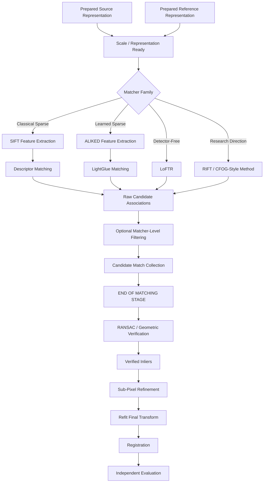
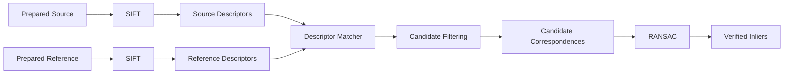

# Image Matching

ChandraMap uses image matching to generate local point-to-point correspondence candidates between a prepared lunar source image and a prepared reference image.

Matching is deliberately treated as a separate stage from geometric verification, transformation estimation, registration, and evaluation.

> **A matcher proposes correspondences; geometry determines which proposals are mutually consistent.**

The central terminology rule is:

```text
feature extraction / correspondence model
        ↓
candidate matches
        ↓
geometric verification
        ↓
verified inliers
        ↓
transformation estimation
        ↓
registration
        ↓
independent evaluation
```

Raw matcher output must therefore be described as **candidate matches**.

It must not automatically be described as:

- verified matches;
- correct matches;
- final matches;
- inliers;
- ground truth;
- guaranteed correspondences.

A second principle is equally important:

> **Matching and registration are different stages.**

Matching answers:

> **Which source and reference locations might correspond?**

Geometric verification asks:

> **Which of those candidates agree with a coherent spatial model?**

Transformation estimation determines the geometric relationship, registration applies that relationship, and evaluation measures whether the result is actually accurate.

A third principle guides matcher benchmarking:

> **More candidate matches do not automatically mean better registration.**

Useful candidate correspondences should eventually support:

- geometric consistency;
- sufficient correspondence count;
- useful spatial distribution;
- low independent registration error;
- reproducible behavior.

ChandraMap therefore supports multiple matcher families without assuming that one method is universally superior across all lunar sensors, scales, illumination conditions, and modalities.

---

## 1. Matching in the ChandraMap Pipeline

Matching sits after the scientific input has already been identified, prepared, and routed appropriately.

Conceptually:

```text
Dataset Preparation
        ↓
Sensor Routing
        ↓
Algorithm Preprocessing
        ↓
Physical Scale Handling
        ↓
Local Matching
        ↓
Candidate Matches
        ↓
Geometric Verification
        ↓
Verified Inliers
        ↓
Sub-Pixel Refinement
        ↓
Transformation / Registration
        ↓
Independent Evaluation
```

The matching stage is responsible for:

- consuming matcher-ready source and reference representations;
- extracting local features where required;
- comparing features or image regions;
- generating source/reference coordinate pairs;
- applying optional matcher-level filtering;
- recording matcher-specific scores or diagnostics;
- reporting failure when usable correspondences cannot be generated.

The matching stage is **not** responsible for declaring final geometric correctness.

---

## 2. Matching Stage Boundary

The conceptual boundary is:

```text
Prepared Source Representation
+
Prepared Reference Representation
        ↓
Feature Extraction / Correspondence Model
        ↓
Candidate Match Generation
        ↓
Optional Matcher-Level Filtering
        ↓
Candidate Matches
        │
        └── END OF MATCHING STAGE
                ↓
Geometric Verification / RANSAC
```

RANSAC should remain conceptually separate from the matcher.

An implementation may wrap several stages behind one software interface, but scientific reporting should still distinguish:

- matcher output;
- geometric-verification output.

This distinction allows ChandraMap to compare different correspondence methods using the same downstream geometry and evaluation pipeline.

---

# Matching Terminology

## 3. Key Terms

| Term               | Meaning in ChandraMap                                                                     |
| ------------------ | ----------------------------------------------------------------------------------------- |
| Keypoint           | Localized image position selected by a detector or learned feature extractor              |
| Descriptor         | Numeric representation associated with a local image region or keypoint                   |
| Feature detector   | Finds candidate feature locations                                                         |
| Feature descriptor | Encodes local image appearance or structure                                               |
| Feature extractor  | May perform detection, description, or both depending on the method                       |
| Matcher            | Associates features or image locations between source and reference                       |
| Candidate match    | Matcher-proposed source/reference correspondence before geometric verification            |
| Match score        | Matcher-specific distance, similarity, confidence, or quality value                       |
| Inlier             | Candidate match accepted as geometrically consistent by the selected verification process |
| Outlier            | Candidate match rejected by geometric verification                                        |
| Verified inlier    | Preferred wording for a geometrically accepted candidate                                  |
| Ground truth       | Independently prepared evaluation truth                                                   |
| Registration       | Geometric alignment based on an estimated transformation                                  |
| Retrieval          | Selection of likely reference regions from a larger database                              |

Never use:

```text
ground truth
```

as a synonym for:

```text
RANSAC inlier
```

They represent different evidence.

---

# Matching Inputs

## 4. Matcher Inputs

A local matcher conceptually receives:

- prepared source representation;
- prepared reference representation;
- source dimensions;
- reference dimensions;
- valid masks where supported;
- optional scale/effective-GSD context;
- matcher configuration;
- model-specific input metadata where needed.

The matching stage should not need to rediscover:

- mission identity;
- authoritative product provenance;
- dataset source;
- benchmark truth;
- whether an IIRS cube is hyperspectral;
- which physical reference scale should have been selected.

Those responsibilities belong to earlier layers.

---

## 5. Source Representation

The source representation must already be appropriate for the selected matcher.

Examples may include:

- prepared OHRC intensity image;
- prepared TMC-2 image;
- documented IIRS-derived 2D image;
- normalized representation;
- structural representation;
- cropped/tiled source representation.

The representation should remain traceable to its scientific parent asset.

---

## 6. Reference Representation

The reference may be:

- prepared LRO NAC imagery;
- a selected NAC pyramid level;
- an LRO WAC product;
- a WAC/NAC tile;
- another documented reference representation.

The selected reference must retain:

- reference identity;
- coordinate domain;
- scale information;
- parent-product provenance.

---

## 7. Valid Masks

Where supported, masks may prevent correspondence algorithms from using:

- NoData regions;
- invalid map-projection borders;
- padded regions;
- corrupt pixels;
- explicitly excluded areas.

Masks must align exactly with the matcher input representation.

A shifted or stale mask can invalidate matching results.

---

# Matching Outputs

## 8. Candidate Correspondence Output

The primary matching output is a collection of candidate coordinate pairs.

Conceptually:

```text
source point
(x_s, y_s)
        ↕
reference point
(x_r, y_r)
```

A candidate may additionally contain:

- matcher-specific score;
- source feature ID;
- reference feature ID;
- detector response;
- local feature scale;
- local feature orientation;
- model-specific confidence;
- filtering state.

At this point, the correspondence remains a **candidate**.

---

## 9. Matching Diagnostics

A matching-stage result may also report:

- source feature count;
- reference feature count;
- raw association count;
- filtered candidate count;
- matcher runtime;
- matcher warnings;
- failure status;
- model/version information.

These diagnostics are useful for explaining downstream success or failure.

---

# Candidate Match Representation

## 10. Conceptual Candidate Record

A logical candidate record may contain:

- `match_id`;
- source coordinate;
- reference coordinate;
- matcher identity;
- matcher score;
- score semantics;
- source feature ID where relevant;
- reference feature ID where relevant;
- candidate status.

This is a conceptual contract rather than a claim about an implemented schema.

Example:

```yaml
match_id: "PLACEHOLDER_MATCH_ID"

source:
  x: "PLACEHOLDER_X"
  y: "PLACEHOLDER_Y"

reference:
  x: "PLACEHOLDER_X"
  y: "PLACEHOLDER_Y"

matcher: "PLACEHOLDER_MATCHER"

score:
  value: "PLACEHOLDER_VALUE"
  meaning: "PLACEHOLDER_SCORE_SEMANTICS"

status: "candidate"
```

No scientific coordinates or performance values are implied.

---

# Coordinate Conventions

## 11. Coordinate Meaning Must Be Explicit

Candidate coordinates are meaningful only when their image domains are known.

Matching output should remain compatible with ChandraMap's coordinate conventions for:

- source image space;
- reference image space;
- cropped/tiled coordinates;
- pyramid coordinates;
- parent-image coordinates.

See:

- [`../datasets/metadata.md`](../datasets/metadata.md)
- [`../datasets/data-format.md`](../datasets/data-format.md)

for broader dataset and representation conventions.

---

## 12. `x/y` vs `row/column`

A common image convention is conceptually:

```text
x → horizontal image coordinate
y → vertical image coordinate
```

while arrays may be accessed as:

```text
array[row, column]
```

The exact project convention must remain explicit.

Do not silently interchange:

```text
(x, y)
```

with:

```text
(row, column)
```

---

## 13. Index Origin

Coordinate records should clearly establish whether image coordinates are:

- zero-based;
- one-based;

according to the repository's actual contract.

Do not mix conventions between:

- feature extraction;
- geometric verification;
- ground truth;
- visualization.

---

## 14. Pixel-Center Convention

High-accuracy registration requires consistent interpretation of whether coordinates refer to:

- pixel centers;
- pixel corners;
- another defined geometric convention.

This becomes especially important when:

- scaling coordinates;
- mapping between pyramid levels;
- converting image coordinates to geospatial coordinates;
- evaluating sub-pixel errors.

---

# Classical Sparse Matching

## 15. Classical Feature Pipeline

A classical sparse correspondence pipeline separates:

```text
Image
  ↓
Feature Detection
  ↓
Descriptor Computation
  ↓
Descriptor Comparison
  ↓
Candidate Correspondences
```

ChandraMap's primary classical baseline is SIFT.

See [`sift.md`](sift.md) for the detailed baseline behavior.

---

# SIFT Baseline

## 16. SIFT's Role

The baseline flow is:

```text
Source
→ SIFT keypoints + descriptors

Reference
→ SIFT keypoints + descriptors

Descriptors
→ descriptor matching
→ candidate filtering
→ candidate matches
```

After the matching stage:

```text
candidate matches
→ RANSAC / geometric verification
→ verified inliers
```

SIFT does not by itself complete registration.

---

## 17. Why SIFT Is Useful

SIFT provides:

- an established classical method;
- sparse interpretable features;
- inspectable descriptors;
- relatively straightforward debugging;
- reproducible experiments when configuration is fixed;
- a useful comparison point for learned methods.

It should not be described as:

- lunar-specific;
- Sun-angle invariant;
- universally multimodal;
- guaranteed across arbitrary scale gaps;
- guaranteed to succeed.

---

## 18. SIFT Scale-Space vs Physical Scale

SIFT internally searches for features across algorithmic image scales.

ChandraMap's reference pyramid addresses a different problem:

> **physical source/reference sampling compatibility.**

Therefore:

```text
SIFT scale-space
≠
ChandraMap physical reference pyramid
```

A matcher cannot recover terrain structure that does not exist in a coarse sensor observation.

See [`scale-pyramid.md`](scale-pyramid.md).

---

# Descriptor Matching

## 19. Descriptor Distance

Classical descriptors are compared using a distance or similarity measure appropriate to that descriptor representation.

For SIFT-like floating-point descriptors, a suitable numeric distance can be used to identify nearby descriptors.

The exact backend belongs to configuration and implementation.

Do not interpret descriptor distance as:

- geographic distance;
- registration error;
- probability of correctness.

---

## 20. Nearest-Neighbor Matching

Conceptually:

```text
Source Descriptor
        ↓
Search Reference Descriptors
        ↓
Nearest Reference Descriptor
        ↓
Candidate Association
```

Nearest-neighbor matching answers:

> Which reference descriptor looks most similar under the chosen descriptor metric?

It does not answer:

> Is this the same lunar location?

---

## 21. k-Nearest-Neighbor Matching

Instead of retrieving only one candidate, a descriptor search may retrieve several nearest candidates.

Conceptually:

```text
Source Descriptor
        ↓
Nearest Candidate 1
Nearest Candidate 2
...
```

This supports ambiguity analysis such as ratio filtering.

---

# Ratio Filtering

## 22. Ratio-Filter Concept

A ratio-style filter compares the best descriptor candidate with a competing alternative.

The intuition is:

> If the best match is only marginally better than another candidate, the feature may be ambiguous.

This can be especially useful in repetitive lunar terrain.

---

## 23. Ratio Filtering Does Not Verify a Match

Passing a ratio filter means only that the descriptor association met a configured ambiguity criterion.

It does **not** prove:

- correct geography;
- correct geometry;
- correct registration.

The output remains:

> **candidate match**

---

## 24. Ratio Threshold

The threshold should be:

- explicit;
- configured;
- versioned;
- benchmarked;
- consistent within a controlled experiment.

ChandraMap should not document one arbitrary universal ratio threshold.

---

# Mutual / Cross-Check Filtering

## 25. Mutual-Consistency Concept

A mutual check asks whether the association is consistent in both directions.

For example:

```text
source feature A
→ reference feature B

reference feature B
→ source feature A
```

Such an association may be less ambiguous than a one-way match.

---

## 26. Mutual Consistency Is Still Not Geometry

A mutually consistent descriptor association may still connect two unrelated lunar structures.

Therefore:

```text
mutual match
≠
verified inlier
```

Geometric verification remains required.

---

# Distance / Score Filtering

## 27. Descriptor-Distance Filtering

A classical pipeline may optionally reject associations with poor descriptor similarity.

The threshold should be:

- descriptor-specific;
- configuration-driven;
- experimentally justified.

Do not use one universal numeric threshold for all descriptors or sensors.

---

## 28. Learned Confidence Filtering

Learned matchers may output:

- confidence-like values;
- matching scores;
- quality measures.

Thresholds applied to these scores must also be:

- method-specific;
- explicit;
- benchmarked.

---

# Filtering Order

## 29. Conceptual Filtering Sequence

One possible classical sequence is:

```text
Raw Descriptor Associations
        ↓
Ratio Filtering
        ↓
Optional Mutual Consistency
        ↓
Optional Distance Filtering
        ↓
Candidate Matches
```

This is not the only valid sequence.

Alternative pipelines may:

- apply fewer filters;
- reverse some filter order;
- use one filter only;
- leave more candidates for robust geometry.

Any chosen order should be documented.

---

# Filtering Trade-Off

## 30. Candidate Purity vs Candidate Coverage

Aggressive filtering may reduce obvious false correspondences.

It may also remove:

- difficult but correct matches;
- features from low-texture areas;
- spatially useful correspondences.

Conceptually:

```text
stricter filtering
→ potentially cleaner candidates
→ potentially fewer candidates
→ potentially weaker spatial coverage
```

Filtering should therefore be evaluated through downstream geometry rather than candidate count alone.

---

## 31. Matching Filter Comparison

| Filter                       | Purpose                                         | Potential Benefit                       | Limitation                       |
| ---------------------------- | ----------------------------------------------- | --------------------------------------- | -------------------------------- |
| Nearest-neighbor association | Select locally similar descriptor               | Simple candidate generation             | Can be highly ambiguous          |
| Ratio filtering              | Reject ambiguous nearest-neighbor relationships | May remove repetitive-feature ambiguity | Still appearance-only            |
| Mutual/cross-check           | Require bidirectional consistency               | Rejects some asymmetric matches         | Still not geometric verification |
| Distance/score filtering     | Reject low-quality associations                 | Can remove weak candidates              | Threshold is method-specific     |
| Minimal filtering            | Preserve many candidates                        | Gives robust estimator more evidence    | May contain many outliers        |

---

# Matcher Backends

## 32. Brute-Force Matching

A brute-force matcher conceptually compares query descriptors directly against reference descriptors.

Potential benefits include:

- simple behavior;
- straightforward interpretation;
- useful baseline implementation.

Potential limitations include:

- computational cost grows with descriptor count;
- very large feature sets may become expensive.

This document does not prescribe an OpenCV API or backend.

---

## 33. Approximate Nearest-Neighbor Search

Approximate nearest-neighbor methods may accelerate descriptor search by using an index rather than comparing every possible pair directly.

Potential trade-offs include:

- improved speed;
- additional index/configuration complexity;
- approximate rather than exhaustive search behavior.

The exact backend should be benchmarked if it affects results.

---

# Local Descriptor Search vs Global Retrieval

## 34. These Are Different Problems

Local descriptor search operates within a specific source/reference pair:

```text
source local features
        ↓
reference local features
        ↓
candidate point correspondences
```

Global retrieval operates across a larger reference database:

```text
query image / global descriptor
        ↓
reference database
        ↓
Top-K candidate regions
```

Do not conflate the two.

---

## 35. FAISS Role

In ChandraMap, FAISS is primarily relevant to:

> **global vector similarity search / retrieval**

rather than the conceptual local-correspondence stage.

FAISS does not automatically:

- generate local keypoints;
- create local point matches;
- estimate an affine transform;
- estimate a homography;
- run RANSAC;
- register images.

---

# Learned Sparse Matching

## 36. Learned Local Features

Learned sparse-feature methods may replace classical hand-designed feature extraction with learned representations.

A learned feature pipeline may still follow:

```text
detect / describe
→ match
→ candidate correspondences
```

The learned nature of the features does not eliminate the need for geometry.

---

# ALIKED

## 37. ALIKED's Role

ALIKED is relevant to ChandraMap as a learned sparse local feature detector/descriptor.

Conceptually it produces:

- sparse keypoint locations;
- local descriptors;
- feature scores where provided by the implementation.

ALIKED belongs to the **feature extraction** stage.

It should not be described as LightGlue.

---

# LightGlue

## 38. LightGlue's Role

LightGlue performs local feature matching using compatible local features.

Conceptually:

```text
Source Local Features
        +
Reference Local Features
        ↓
LightGlue
        ↓
Candidate Correspondences
```

LightGlue is the matcher in this route.

Do not describe it as the feature detector when ALIKED performs detection/description.

---

## 39. ALIKED + LightGlue Flow

```text
Prepared Source
      ↓
ALIKED
      ↓
Source Sparse Features

Prepared Reference
      ↓
ALIKED
      ↓
Reference Sparse Features

Source + Reference Features
      ↓
LightGlue
      ↓
Candidate Matches
      ↓
Geometric Verification
```

The output before geometry remains a candidate set.

---

## 40. Learned Match Scores

A learned matcher may provide confidence or quality values.

These may be useful for:

- filtering;
- ordering;
- diagnostics;
- threshold ablations.

They must not automatically be interpreted as:

- probability of geographic correctness;
- geometric proof;
- ground truth.

---

## 41. Domain Shift

A pretrained local-feature or matching model may have been trained largely on terrestrial imagery.

Lunar imagery may differ in:

- terrain appearance;
- shadows;
- contrast;
- scale;
- repeated crater structure;
- sensor modality;
- spectral response.

Therefore ChandraMap should treat learned matcher performance as an empirical benchmark question.

---

# Detector-Free Matching

## 42. LoFTR

LoFTR belongs to a detector-free correspondence category.

It differs from the conventional:

```text
detect keypoints
→ compute descriptors
→ nearest-neighbor matching
```

pipeline.

Conceptually:

```text
Prepared Source
        +
Prepared Reference
        ↓
LoFTR
        ↓
Candidate Correspondences
```

---

## 43. LoFTR Output

LoFTR may produce:

- source coordinates;
- reference coordinates;
- model-specific scores/confidences.

Those correspondences are still candidates.

They should normally continue to:

```text
geometric verification
```

before being described as verified inliers.

---

## 44. LoFTR Research Motivations

Potential reasons to investigate detector-free matching include:

- reduced dependence on traditional detector repeatability;
- broader image-context reasoning;
- possible usefulness in lower-feature regions.

These are research motivations.

They are not established ChandraMap performance claims.

---

## 45. LoFTR Limitations to Measure

Potential benchmark concerns include:

- domain shift;
- computational cost;
- memory use;
- extreme physical-scale gaps;
- lunar illumination;
- repetitive terrain;
- model-input resizing;
- cross-modal behavior.

Results should determine practical suitability.

---

# Remote-Sensing / Multimodal Matching

## 46. Why Remote-Sensing Methods Matter

ChandraMap includes harder conditions than ordinary same-camera matching:

- cross-sensor data;
- cross-mission data;
- large GSD differences;
- radiometric differences;
- hyperspectral-derived imagery;
- strong illumination changes.

Therefore remote-sensing-oriented matching methods are relevant research directions.

---

# RIFT

## 47. RIFT as a Research Direction

RIFT is relevant as a multimodal remote-sensing image-matching research direction.

Potential ChandraMap use cases include:

- cross-modal experiments;
- difficult radiometric differences;
- IIRS-derived representation experiments.

Its inclusion in documentation does not imply:

- implementation;
- superiority;
- guaranteed lunar robustness.

Benchmark evidence is required.

---

# CFOG-Style Matching

## 48. CFOG-Style Research

CFOG-style approaches are another remote-sensing-oriented matching direction that may be useful under radiometric or modality differences.

They should be treated as:

- research candidates;
- controlled comparison methods.

They should not be described as a guaranteed lunar solution.

---

# Sensor-Specific Matching

## 49. Why Sensor Context Matters

Matching behavior depends on what information the source and reference actually contain.

A matcher cannot make:

- OHRC;
- TMC-2;
- IIRS;

scientifically interchangeable.

Sensor-aware representation and scale preparation should happen before matching.

---

# OHRC Matching

## 50. OHRC Context

OHRC is the Chandrayaan-2 **Orbiter High Resolution Camera**.

Current project documentation commonly uses approximately:

> **~0.25–0.32 m/pixel**

depending on product/documentation.

Actual product metadata remains authoritative.

---

## 51. OHRC Matching Implications

Potential advantages include:

- abundant fine terrain structure;
- many possible local features;
- detailed crater/ridge morphology.

Potential difficulties include:

- repetitive fine crater fields;
- high feature count;
- moving shadow structure;
- projection/view differences;
- large images.

High resolution does not automatically imply easy correspondence.

---

## 52. OHRC Matcher Experiments

Potential controlled methods include:

- SIFT;
- ALIKED + LightGlue;
- LoFTR.

The repository should compare them on identical scientific cases rather than ranking them in advance.

---

# TMC-2 Matching

## 53. TMC-2 Context

TMC-2 is the Chandrayaan-2 **Terrain Mapping Camera-2**.

Current project planning commonly uses approximately:

> **~5 m/pixel**

with product metadata remaining authoritative.

---

## 54. TMC-2 Matching Implications

Matching may depend more strongly on:

- larger crater morphology;
- ridge systems;
- medium-scale terrain organization.

A native fine NAC image may contain substantial detail absent from TMC-2.

Therefore reference-scale choice can be as important as matcher choice.

---

## 55. TMC-2 Reference Path

Conceptually:

```text
TMC-2
    ↓
read source GSD
    ↓
select appropriate NAC/WAC reference scale
    ↓
local matcher
```

Do not assume:

```text
TMC-2
→ native full-resolution NAC
```

is always the strongest comparison.

---

# IIRS Matching

## 56. IIRS Context

IIRS is the Chandrayaan-2 **Imaging Infrared Spectrometer**.

Project-level approximations include:

- ~80 m/pixel spatial scale;
- ~0.8–5.0 µm spectral coverage;
- roughly ~250–256 bands depending on product/documentation.

Actual product metadata remains authoritative.

---

## 57. IIRS Requires a Defined 2D Representation

The full hyperspectral cube should not be passed blindly into ordinary 2D:

- SIFT;
- ALIKED + LightGlue;
- LoFTR;

as though it were a grayscale image.

Correct conceptual order:

```text
IIRS Scientific Product
        ↓
Validate Spectral + Spatial Structure
        ↓
Derive Documented 2D Registration Representation
        ↓
Physical Scale Preparation
        ↓
Local Matcher
        ↓
Candidate Correspondences
        ↓
Geometric Verification
```

---

## 58. Candidate IIRS Representations

Possible representations may include:

- selected valid band;
- PCA-derived component;
- spectral composite;
- structural representation.

No one representation should be declared universally best without controlled evidence.

---

## 59. IIRS Matcher Experiments

Potential experiments may include:

- SIFT baseline;
- ALIKED + LightGlue;
- LoFTR;
- RIFT;
- CFOG-style matching.

IIRS remains a challenging cross-modal case because:

- spatial scale is coarse;
- modality differs;
- gradients may differ;
- illumination remains relevant.

---

# LRO NAC Matching Role

## 60. NAC Context

LRO NAC is generally ChandraMap's fine/local reference family.

Current project planning often treats NAC imagery as approximately:

> **~0.5–2 m/pixel**

depending on actual product/acquisition geometry.

Actual metadata remains authoritative.

---

## 61. NAC Reference Scale

NAC may be used as:

- base prepared reference;
- downsampled reference-pyramid level;
- fine refinement reference.

The appropriate level depends on source information.

A dense NAC feature set is not automatically useful when the source is coarse.

---

# LRO WAC Matching Role

## 62. WAC Context

LRO WAC provides broad/global/coarse lunar reference imagery.

Its scale is product/mode/processing dependent.

Do not assign a universal WAC GSD.

---

## 63. WAC Matching Uses

WAC may support:

- coarse structural matching;
- regional correspondence;
- retrieval verification;
- coarse localization.

It should not automatically be expected to support NAC-level fine registration.

---

# Scale-Aware Matching

## 64. Scale Preparation Comes Before Matching

Matching should normally consume representations that have already been made physically reasonable for comparison.

Conceptually:

```text
source GSD
        +
reference pyramid
        ↓
select suitable reference level
        ↓
local matching
```

See [`scale-pyramid.md`](scale-pyramid.md).

---

## 65. Equal Dimensions Are Not Equal Scale

Two images resized to:

```text
1024 × 1024
```

may still represent dramatically different lunar ground extents.

Therefore:

```text
same image dimensions
≠
same physical information
```

Matcher input preparation should preserve GSD-aware reasoning.

---

## 66. TMC-2 ↔ NAC

A coarser NAC pyramid level may produce a more physically meaningful comparison than native NAC.

This should be measured.

---

## 67. IIRS ↔ NAC

IIRS may require strong NAC coarsening before local matching becomes scientifically meaningful.

Upsampling IIRS does not recover missing lunar detail.

---

# Multi-Level Matching

## 68. Searching Several Reference Levels

An experiment may run the same matcher against multiple neighboring reference scales.

Conceptually:

```text
Reference Level A
Reference Level B
Reference Level C
        ↓
same local matcher
        ↓
candidate sets
        ↓
downstream geometry
```

Level quality should not be decided solely by raw candidate count.

---

## 69. Scale Evaluation

Useful downstream evidence includes:

- verified inlier count;
- inlier ratio;
- spatial coverage;
- independent check-point RMSE;
- runtime;
- failure status.

---

# Illumination-Aware Matching

## 70. Illumination Changes Feature Appearance

Different lunar Sun geometry can change:

- keypoint repeatability;
- descriptor appearance;
- gradient orientation;
- visible crater rims;
- shadow boundaries;
- terrain texture.

No matcher documented here should be described as universally Sun-angle invariant.

---

## 71. Preprocessing Alternatives

Candidate matcher inputs may include:

- prepared intensity;
- normalized intensity;
- gradient representation;
- structural representation.

See:

- [`preprocessing.md`](preprocessing.md)
- [`illumination-handling.md`](illumination-handling.md)

These transformations should be benchmarked on identical pairs.

---

## 72. Shadow-Driven False Matches

Shadow boundaries may appear highly distinctive.

A matcher can therefore associate:

```text
shadow edge in source
↔
similar-looking shadow edge in reference
```

even when they belong to different physical terrain structures.

Because shadows move with Sun geometry:

> **strong appearance similarity does not guarantee terrain correspondence.**

Geometric verification remains essential.

---

# Match Spatial Distribution

## 73. Why Distribution Matters

Consider:

```text
100 candidate matches
all near one crater
```

versus:

```text
fewer but well-distributed candidates
across the overlap
```

The second set may provide stronger geometric support depending on correspondence quality.

Raw quantity is therefore insufficient.

---

## 74. Candidate Coverage vs Verified Coverage

Distinguish:

### Candidate Coverage

Where matcher-proposed points are distributed.

### Verified Coverage

Where geometrically accepted inliers are distributed.

Final registration quality should place greater emphasis on verified-inlier distribution.

---

## 75. Coverage Metrics

Possible downstream measures include:

- grid occupancy;
- convex-hull coverage.

The exact definition should be documented before comparison.

No universal coverage threshold is defined here.

---

# Match Duplication

## 76. One-to-One Associations

Some matcher/filter designs may prefer or enforce approximately one-to-one feature correspondences:

```text
one source feature
↔
one reference feature
```

This can reduce duplicate ambiguity.

It should not be assumed to apply to every matcher family.

---

## 77. Duplicate Reference Associations

If many source features map to the same reference feature, possible causes include:

- repetitive texture;
- descriptor ambiguity;
- matcher behavior;
- insufficient filtering.

Such duplication can be recorded as a diagnostic rather than silently ignored.

---

# Match Scores

## 78. Score Semantics Are Method-Specific

Different methods may report:

- descriptor distance;
- similarity;
- confidence;
- probability-like values;
- feature quality;
- correspondence score.

These quantities are not automatically comparable.

---

## 79. SIFT Distance vs Learned Confidence

For example:

```text
SIFT descriptor distance
```

and:

```text
LightGlue / LoFTR confidence
```

do not have the same semantics.

Do not place them on one universal numerical scale without a documented calibration method.

---

## 80. High Confidence Is Not Ground Truth

A high matcher score may be useful for prioritization.

It does not prove:

- geometric consistency;
- geographic correctness;
- registration accuracy.

---

## 81. Score Calibration

Future research may investigate calibrated correspondence confidence.

Even with calibration:

- geometry;
- independent evaluation;

remain necessary.

---

# Geometric Verification Handoff

## 82. Where Matching Ends

Matching ends when ChandraMap has produced a candidate correspondence collection.

Conceptually:

```text
Candidate Match Collection
        │
        └── END MATCHING
                ↓
RANSAC / Geometric Verification
```

---

## 83. Why RANSAC Comes Next

Lunar correspondence candidates can be incorrect because of:

- repeated craters;
- similar terrain;
- moving shadow edges;
- descriptor ambiguity;
- modality differences;
- wrong reference region;
- scale mismatch.

RANSAC tests whether candidates collectively agree with a selected geometric model.

---

## 84. Candidate Count vs Inlier Count

These are separate metrics.

Conceptually:

```text
many candidate matches
        ↓
RANSAC
        ↓
smaller verified inlier set
```

A high candidate count with few inliers often indicates an ambiguous or poor matcher result.

---

## 85. Do Not Pre-Label Candidates

Before geometry:

```text
status = candidate
```

After geometry:

```text
status = verified inlier
```

or:

```text
status = outlier
```

This distinction should be preserved in:

- machine-readable output;
- logs;
- visualizations;
- documentation.

---

# RANSAC Is Not Ground Truth

## 86. Inliers Still Require Evaluation

A geometrically self-consistent set can still be wrong.

Possible cases include:

- wrong but internally coherent reference region;
- repetitive terrain;
- biased inlier cluster;
- inadequate transformation model.

Therefore:

```text
RANSAC inlier
≠
independent truth
```

See [`../datasets/ground-truth-preparation.md`](../datasets/ground-truth-preparation.md).

---

# Matching and Sub-Pixel Refinement

## 87. Candidate Coordinates Are Initial Evidence

Matcher coordinates should generally be treated as initial correspondence estimates.

A later stage may refine verified correspondences to sub-pixel precision where scientifically justified.

---

## 88. Correct Order

The intended order is:

```text
Candidate Matches
        ↓
RANSAC / Geometric Verification
        ↓
Verified Inliers
        ↓
Sub-Pixel Refinement
        ↓
Refit Final Transform
        ↓
Independent Evaluation
```

---

## 89. Why Not Refine Raw Candidates?

Refining an incorrect candidate produces:

> a more precise incorrect point.

Therefore verification should precede precision refinement.

---

# Matching and Retrieval

## 90. Retrieval Precedes Local Matching When Needed

When the source location is unknown:

```text
Query
  ↓
Global / Regional Retrieval
  ↓
Top-K Reference Candidates
  ↓
Local Matching
  ↓
Point Correspondences
```

Retrieval and local matching solve different problems.

---

## 91. Retrieval Candidate Is Not a Point Match

A retrieved tile or product is:

> a candidate reference region.

It is not:

> a source/reference point correspondence.

---

## 92. Top-K Local Verification

Local matching may run on multiple retrieved candidates.

Conceptually:

```text
Top-K Reference Tiles
        ↓
local matcher per tile
        ↓
candidate correspondence sets
        ↓
geometric verification
```

This provides a mechanism for rejecting plausible but geographically incorrect retrieval candidates.

---

# Matching Failure Handling

## 93. Failure Types

Valid matching outcomes include:

- no detectable features;
- insufficient descriptors;
- zero candidate matches;
- too few useful candidates for the configured geometry;
- incompatible representation;
- model inference failure;
- invalid output;
- numerical failure;
- memory/resource failure;
- all candidates rejected by downstream geometry.

Failures are part of scientific benchmarking.

---

## 94. Minimum Correspondence Requirements

Different geometric models require different minimum correspondence support.

The exact requirement depends on:

- transform model;
- robust-estimation implementation;
- benchmark rules.

Do not define one universal ChandraMap minimum candidate count in this overview.

---

## 95. Matcher Failure Record

A failure record may conceptually preserve:

- pair ID;
- matcher identity;
- matcher/model version;
- source representation;
- reference representation;
- reference level;
- matcher configuration;
- candidate count;
- failure reason;
- warnings;
- runtime.

Do not hide failure as an empty successful result.

---

# Matching Quality Control

## 96. QC Checklist

| Check                                       | Expected |
| ------------------------------------------- | -------- |
| Source representation valid                 | Yes      |
| Reference representation valid              | Yes      |
| Source coordinate domain known              | Yes      |
| Reference coordinate domain known           | Yes      |
| Scale path documented                       | Yes      |
| Matcher compatible with representation      | Yes      |
| Masks aligned where used                    | Yes      |
| Output coordinates finite                   | Yes      |
| Source coordinates within bounds            | Yes      |
| Reference coordinates within bounds         | Yes      |
| Match scores valid where provided           | Yes      |
| Candidate count recorded                    | Yes      |
| Matcher identity/version recorded           | Yes      |
| Configuration recorded                      | Yes      |
| Duplicate behavior understood               | Yes      |
| Downstream geometric verification performed | Yes      |
| Failure status preserved                    | Yes      |

---

## 97. Coordinate Bounds

Every candidate should satisfy its image-domain bounds.

Conceptually:

```text
0 ≤ source_x < source_width
0 ≤ source_y < source_height
```

and equivalently for the reference under the repository's coordinate convention.

Out-of-bounds candidates should not silently continue downstream.

---

## 98. Invalid Numeric Outputs

Matcher output containing:

- `NaN`;
- infinity;
- malformed coordinates;
- invalid feature indices;

should trigger validation or failure handling.

Do not allow invalid numeric data to contaminate RANSAC or evaluation.

---

# Match Visualization

## 99. Match-Line Visualization

A useful diagnostic can display:

```text
Source Image | Reference Image
```

with lines connecting candidate correspondences.

Separate visualizations may show:

- raw candidate matches;
- filtered candidate matches;
- verified inliers;
- rejected outliers.

---

## 100. Visualization Is Diagnostic

A visually convincing match plot can still contain:

- clustered points;
- wrong geometry;
- poor independent accuracy.

Therefore:

> **A pretty correspondence figure is not evidence of registration correctness.**

Machine-readable metrics remain authoritative.

---

## 101. Accurate Labels

Do not title a plot containing raw matcher output:

> **Correct Matches**

Prefer:

- Candidate Matches;
- Matcher Candidates;
- Verified Inliers — only after geometric verification.

---

# Matcher Benchmarking

## 102. Same-Pair Rule

Matcher comparison should use the same scientific pair.

A controlled experiment should keep constant:

```text
source asset
reference asset
source representation
reference representation
physical scale
truth
```

and vary:

```text
matcher
```

where technically possible.

---

## 103. Same-Preprocessing Rule

Hidden preprocessing differences confound matcher comparisons.

For example:

```text
SIFT
→ minimally prepared intensity
```

versus:

```text
Learned Matcher
→ heavily tuned structural representation
```

does not isolate matcher performance.

Where matcher-specific input adaptation is unavoidable, document it explicitly.

---

## 104. Same-Scale Rule

Do not compare one matcher using:

```text
native NAC
```

against another using:

```text
better GSD-aware NAC pyramid level
```

and attribute all improvement to the matcher.

---

## 105. Same-Verification Rule

When evaluating matcher quality through downstream registration, use the same:

- geometric-verification method;
- transform model;
- verification policy;

unless geometry itself is part of the experiment.

---

## 106. Same-Truth Rule

Use the same:

- ground-truth version;
- held-out check points;
- coordinate conventions;
- error definitions.

---

# Matcher Ablation

## 107. Conceptual Comparison

Potential methods include:

- SIFT + classical descriptor matching;
- ALIKED + LightGlue;
- LoFTR;
- RIFT research candidate;
- CFOG-style research candidate.

No arbitrary star ratings or rankings should be used.

Measured results decide performance.

---

# Matching Metrics

## 108. Candidate Match Count

Measures how many correspondences the matcher proposed after the defined matcher-level filtering stage.

It is useful for:

- diagnostics;
- algorithm behavior;
- runtime interpretation.

It is not registration accuracy.

---

## 109. Verified Inlier Count

Measures how many candidate matches survive geometric verification.

This is a downstream metric influenced by both:

- matcher quality;
- geometric model/verification.

---

## 110. Inlier Ratio

Conceptually:

$$
\text{inlier ratio}
=
\frac{\text{verified inliers}}
{\text{candidate matches}}
$$

It can indicate candidate-set cleanliness.

Do not label it generically as:

> matching accuracy

without a precise definition.

---

## 111. Verified Spatial Coverage

Coverage measures whether geometrically accepted correspondences are spatially distributed through the valid overlap.

Potential measures include:

- grid occupancy;
- convex-hull coverage.

No universal threshold is defined here.

---

## 112. Independent Check-Point RMSE

When independent truth exists, registration accuracy should be measured using held-out check points.

This is downstream of matching but essential when judging whether matcher candidates ultimately support accurate registration.

---

## 113. Runtime

Possible measurements include:

- feature-extraction time;
- matching time;
- total local-correspondence time.

Runtime comparisons should record relevant software/hardware context when needed for interpretation.

---

## 114. Memory

Some learned methods may have substantially different memory requirements.

Memory usage may be useful when it materially affects:

- reproducibility;
- maximum image size;
- deployment feasibility.

Do not invent hardware measurements.

---

## 115. Correspondence Precision / Recall

Point-level precision or recall should only be reported when reliable correspondence truth exists.

Such metrics require an explicit:

- ground-truth definition;
- spatial tolerance;
- coordinate domain;
- evaluation protocol.

Do not introduce unsupported correspondence precision/recall claims.

---

# Matcher Comparison Table

## 116. Conceptual Results Template

| Pair      | Matcher   | Candidates | Inliers | Inlier Ratio | Coverage | Check RMSE | Match Time | Status |
| --------- | --------- | ---------: | ------: | -----------: | -------: | ---------: | ---------: | ------ |
| `PAIR_ID` | `MATCHER` |          — |       — |            — |        — |          — |          — | —      |

Populate this table only with measured benchmark results.

---

# Matching Configuration

## 117. Classical Configuration Categories

Potential configuration includes:

- feature extractor;
- descriptor matcher backend;
- nearest-neighbor count;
- ratio filtering;
- cross-check behavior;
- distance filtering;
- feature-count limits where applicable.

Do not invent repository defaults.

---

## 118. Learned Sparse Configuration Categories

Potential configuration includes:

- local feature model;
- feature-extraction options;
- matcher model;
- score filtering;
- input adaptation;
- model version/checkpoint.

The actual repository configuration remains authoritative.

---

## 119. Detector-Free Configuration Categories

Potential configuration includes:

- model/checkpoint;
- input representation;
- input resizing;
- confidence filtering;
- memory-related constraints.

Do not invent model versions or thresholds.

---

## 120. Thresholds Must Be Explicit

Research-sensitive thresholds should not be buried in undocumented source code.

Examples include:

- ratio threshold;
- maximum descriptor distance;
- learned confidence threshold;
- feature-count limit.

When used, record them with the experiment.

---

# Reproducibility

## 121. Reproducible Matching Run

A benchmark run should identify:

- pair ID/version;
- source asset;
- reference asset;
- source representation;
- reference representation;
- selected reference scale;
- preprocessing version;
- matcher family;
- matcher/model version;
- matcher configuration;
- candidate-filter configuration;
- geometric-verification configuration;
- benchmark version;
- truth version.

---

## 122. Configuration Changes Matter

Changing any of these can change matcher behavior:

- representation;
- scale level;
- feature extractor;
- descriptor backend;
- ratio threshold;
- cross-check;
- learned model;
- score threshold.

Such changes should create a distinct experimental configuration.

---

# Matcher Interface Concept

## 123. Logical Interface

Without prescribing implementation code, the matcher boundary can be represented as:

### Input

- source representation;
- reference representation;
- optional masks;
- matcher configuration.

### Output

- candidate source/reference coordinate pairs;
- optional feature identifiers;
- optional matcher-specific scores;
- diagnostics;
- status/failure information.

This contract keeps downstream geometry independent of matcher internals.

---

# Common Candidate Representation

## 124. Why Normalization Helps

Different matchers expose different internal structures.

For example:

### SIFT

May expose:

- source feature index;
- reference feature index;
- descriptor distance.

### LightGlue

May expose:

- matched local-feature indices;
- matcher-specific scores.

### LoFTR

May expose:

- direct source/reference coordinates;
- confidence-like values.

Downstream modules benefit if these are converted into a common logical representation:

```text
source coordinate
reference coordinate
matcher identity
method-specific score metadata
candidate status
```

---

## 125. Preserve Method-Specific Diagnostics

Normalization should not erase useful information.

Method-specific fields may remain available for:

- debugging;
- research analysis;
- threshold studies.

The common representation should provide interoperability, not information loss.

---

# Matcher Pluggability

## 126. Modular Matching Architecture

ChandraMap should conceptually allow:

```text
SIFT route
```

to be replaced by:

```text
ALIKED + LightGlue
```

or:

```text
LoFTR
```

or a future research matcher without rewriting the entire downstream system.

Where technically possible, downstream modules should continue to consume:

> candidate coordinate pairs.

---

## 127. Avoid Tight Coupling

Avoid designing:

- RANSAC;
- visualization;
- metrics;
- result serialization;

around one matcher's private internal structures.

Instead:

```text
matcher-specific output
        ↓
common candidate representation
        ↓
generic downstream geometry
```

This improves:

- benchmarking;
- maintainability;
- experimentation.

---

# Versioned Matching Strategy

## 128. V1 — Classical Baseline

V1 should remain simple and measurable.

Conceptually:

```text
Prepared Known-Overlap Pair
        ↓
GSD-Aware Reference Selection
        ↓
SIFT
        ↓
Descriptor Matching
        ↓
Configured Ratio / Consistency Filtering
        ↓
Candidate Matches
        ↓
RANSAC
        ↓
Transformation
        ↓
Independent Evaluation
```

Purpose:

> **establish a reproducible classical correspondence baseline.**

Advanced learned matching should not be required merely because it is documented here.

---

## 129. V2 — Stronger Matching Conditions

Possible V2 work includes:

- stronger scale-aware matching;
- improved matcher-level filtering experiments;
- illumination preprocessing;
- structural representations;
- coverage diagnostics;
- difficult sensor-pair benchmarks;
- initial controlled learned-matcher comparisons.

SIFT should remain available as the reference baseline.

---

## 130. V3 — Learned Matching and Retrieval Handoff

Possible V3 capabilities include:

- ALIKED + LightGlue;
- LoFTR;
- global retrieval handoff;
- Top-K reference verification;
- stronger learned matcher benchmarking;
- richer failure diagnostics.

Retrieval and matching should remain distinct.

---

## 131. V4 — Multimodal Research

Possible research directions include:

- RIFT;
- CFOG-style matching;
- lunar-specific learned local features;
- IIRS-focused multimodal matching;
- multi-matcher ensembles;
- calibrated uncertainty;
- geometry-aware correspondence models;
- cross-mission learned representations.

These are research directions, not implementation-status claims.

Existing version specifications remain authoritative.

---

# Full Matching Flow

## 132. Main Matching Diagram



The diagram intentionally places RANSAC after the matching boundary.

---

## 133. Classical Matching Diagram



---

# Conceptual Matching Result

## 134. Matching-Stage Result

Illustrative conceptual structure — not an implemented schema:

```yaml
pair_id: "PLACEHOLDER_PAIR_ID"

matcher:
  name: "PLACEHOLDER_MATCHER"
  version: "PLACEHOLDER_VERSION"

candidate_count: "PLACEHOLDER_COUNT"
matching_status: "PLACEHOLDER_STATUS"
runtime: "PLACEHOLDER_RUNTIME"
```

No real benchmark values are implied.

---

# Conceptual Failure Structure

## 135. Matching Failure Record

Illustrative only:

```yaml
pair_id: "PLACEHOLDER_PAIR_ID"
matcher: "PLACEHOLDER_MATCHER"

source_representation_id: "PLACEHOLDER_SOURCE_REPRESENTATION"
reference_representation_id: "PLACEHOLDER_REFERENCE_REPRESENTATION"

candidate_count: "PLACEHOLDER_COUNT"

failure:
  reason: "PLACEHOLDER_REASON"
  warnings:
    - "PLACEHOLDER_WARNING"

runtime: "PLACEHOLDER_RUNTIME"
```

The actual repository contract should define final field names and enums.

---

# Relationship to Algorithm Overview

## 136. [`overview.md`](overview.md)

[`overview.md`](overview.md) describes the complete ChandraMap algorithm stack.

This file focuses only on:

> **candidate local correspondence generation and matcher-level filtering.**

Geometry, registration, and evaluation remain downstream responsibilities.

---

# Relationship to SIFT Documentation

## 137. [`sift.md`](sift.md)

[`sift.md`](sift.md) documents:

- SIFT feature detection;
- SIFT descriptors;
- classical descriptor matching concepts;
- SIFT baseline behavior;
- SIFT-specific failure analysis.

This file is broader.

It defines how ChandraMap handles candidate correspondence generation across:

- classical;
- learned sparse;
- detector-free;
- remote-sensing-oriented;

matcher families.

---

# Relationship to Sensor Routing

## 138. [`sensor-routing.md`](sensor-routing.md)

[`sensor-routing.md`](sensor-routing.md) determines:

- sensor identity;
- representation path;
- reference role;
- scale strategy;
- available matcher families.

This file executes the selected conceptual correspondence strategy.

---

# Relationship to Preprocessing

## 139. [`preprocessing.md`](preprocessing.md)

[`preprocessing.md`](preprocessing.md) produces matcher-ready representations through:

- valid-mask handling;
- numeric conversion;
- sensor-specific representation;
- optional normalization;
- matcher-input adaptation.

Matcher comparisons should not hide different preprocessing pipelines.

---

# Relationship to Illumination Handling

## 140. [`illumination-handling.md`](illumination-handling.md)

Illumination handling may produce alternative representations such as:

- normalized intensity;
- gradients;
- structural imagery.

The matcher then determines whether those representations produce useful candidate correspondences.

Illumination improvements should ultimately be judged using downstream geometric and independent metrics.

---

# Relationship to Scale Pyramid

## 141. [`scale-pyramid.md`](scale-pyramid.md)

[`scale-pyramid.md`](scale-pyramid.md) defines ChandraMap's physical reference-scale hierarchy.

Matching should operate on the selected physically meaningful level rather than relying on equal pixel dimensions.

The distinction is:

```text
scale preparation
→ decides what physical information to compare

matching
→ proposes where that information corresponds
```

---

# Relationship to Dataset Documentation

## 142. Dataset Documentation

Relevant dataset files include:

- [`../datasets/README.md`](../datasets/README.md)
- [`../datasets/metadata.md`](../datasets/metadata.md)
- [`../datasets/data-format.md`](../datasets/data-format.md)
- [`../datasets/dataset-preparation.md`](../datasets/dataset-preparation.md)
- [`../datasets/pair-definition.md`](../datasets/pair-definition.md)
- [`../datasets/ground-truth-preparation.md`](../datasets/ground-truth-preparation.md)

The relationship is:

```text
pair-definition.md
→ defines the controlled source/reference case

ground-truth-preparation.md
→ defines independent evaluation evidence

matching.md
→ generates candidate correspondences for the pair
```

Ground truth must not be derived merely from matcher confidence or RANSAC inliers.

---

# Relationship to Sensor Documentation

## 143. Sensor Documentation

Relevant sensor documentation includes:

- [`../sensors/overview.md`](../sensors/overview.md)
- [`../sensors/ohrc.md`](../sensors/ohrc.md)
- [`../sensors/tmc2.md`](../sensors/tmc2.md)
- [`../sensors/iirs.md`](../sensors/iirs.md)
- [`../sensors/lro-nac.md`](../sensors/lro-nac.md)
- [`../sensors/lro-wac.md`](../sensors/lro-wac.md)

Sensor documentation answers:

> What did the instrument physically measure?

Matching documentation answers:

> How does ChandraMap propose local correspondences between prepared representations of those measurements?

---

# Relationship to Architecture

## 144. Architecture Documentation

Related architecture paths to consult when present include:

- `../architecture/system-overview.md`
- `../architecture/v1-pipeline.md`
- `../architecture/core-engine-architecture.md`
- `../architecture/module-map.md`
- `../architecture/data-flow.md`
- `../architecture/output-flow.md`

Architecture documentation determines:

- where matcher modules live;
- how matcher configuration is supplied;
- how candidate matches are serialized;
- how geometry consumes matcher output.

This document defines the matching stage's algorithmic responsibility.

---

# Relationship to Project Scope

## 145. Project Documentation

Related project paths to consult when present include:

- `../project/goals.md`
- `../project/non-goals.md`
- `../project/v1-scope.md`
- `../project/terminology.md`
- `../project/assumptions.md`
- `../project/limitations.md`

The actual version specification remains authoritative.

Advanced learned or multimodal methods should not become mandatory V1 dependencies unless the V1 scope explicitly requires them.

---

# Relationship to Benchmarks

## 146. Benchmark Infrastructure

Where a dedicated benchmark system exists, frozen benchmark definitions should control:

- pair;
- source representation;
- reference representation;
- reference scale;
- matcher;
- matcher configuration;
- verification configuration;
- truth/check points.

The matcher should not construct convenient private benchmark cases internally.

---

# Relationship to Experiments

## 147. Experiment Infrastructure

Experiments should make matcher selection explicit.

A reproducible experiment should not require someone to infer the method from:

- a script filename;
- a local notebook;
- undocumented source-code edits.

Matcher family and configuration belong in experiment metadata/configuration.

---

# Relationship to Results

## 148. Result Provenance

Matching results should preserve where relevant:

- matcher identity;
- matcher/model version;
- configuration;
- candidate count;
- runtime;
- downstream inlier count;
- inlier ratio;
- coverage;
- independent error;
- failure status.

This enables reproducible comparisons across methods and versions.

---

# Claims ChandraMap Should Avoid

## 149. Unsupported Matching Claims

Do not claim without benchmark evidence:

- "SIFT produces correct matches."
- "SIFT is lunar invariant."
- "LightGlue guarantees correct correspondence."
- "ALIKED is the matcher" when LightGlue performs the matching stage.
- "LoFTR does not need RANSAC."
- "LoFTR confidence proves correctness."
- "AI matching removes illumination problems."
- "LightGlue is Sun-angle invariant."
- "RIFT is the best lunar matcher."
- "CFOG guarantees multimodal correspondence."
- "More matches means higher accuracy."
- "Mutual matches are verified matches."
- "Ratio-test matches are inliers."
- "High confidence means ground truth."
- "Candidate matches are final correspondences."
- "The matcher performs registration."
- "Same-sized images solve the scale problem."
- undefined claims such as "95% matching accuracy."

---

# Common Matching Mistakes

## 150. Mistakes to Avoid

Do not:

- call raw matcher output inliers;
- call candidate matches ground truth;
- use "high-confidence matches" as a synonym for verified inliers;
- confuse feature extraction with matching;
- describe LightGlue as a detector;
- describe LoFTR as a conventional keypoint detector;
- treat ALIKED and LoFTR as the same algorithm category;
- feed a raw IIRS cube directly to ordinary 2D matchers;
- ignore scale-pyramid selection;
- compare matchers using hidden preprocessing differences;
- compare matchers on different cherry-picked pairs;
- select a matcher using candidate count alone;
- compare raw scores across matcher families;
- use one universal score threshold across all methods;
- skip geometric verification because matcher confidence is high;
- run sub-pixel refinement on all unverified candidates;
- call retrieved tiles point correspondences;
- discard failed pairs;
- report only match-line visualizations;
- assume many clustered matches provide strong global registration;
- use matcher output as independent evaluation truth;
- change matcher configuration without recording it.

---

# Limitations

## 151. Repetitive Lunar Terrain

Crater-rich regions can contain many locally similar structures.

This can produce descriptor or learned correspondence ambiguity.

Geometry and spatial context remain essential.

---

## 152. Low-Feature Regions

Smooth lunar terrain may provide:

- few keypoints;
- weak descriptors;
- insufficient correspondence evidence.

Some pairs may legitimately fail.

---

## 153. Illumination Changes

Strong Sun-angle differences can alter:

- gradients;
- keypoint repeatability;
- shadow geometry;
- local texture.

No matcher family should be assumed universally illumination invariant.

---

## 154. Shadow Instability

Shadow boundaries can produce strong features while moving substantially between observations.

This can generate plausible-looking but physically incorrect matches.

---

## 155. Extreme GSD Differences

When one sensor does not resolve the same terrain detail as the other, correspondence becomes intrinsically limited.

Matching cannot create shared information that was never observed.

---

## 156. IIRS Modality Difference

IIRS introduces:

- hyperspectral modality;
- coarse spatial scale;
- wavelength-dependent appearance.

Even a valid 2D IIRS representation may remain difficult to match against panchromatic references.

---

## 157. Learned Model Domain Shift

Pretrained learned models may not generalize perfectly from their training imagery to:

- lunar terrain;
- lunar shadows;
- cross-mission imagery;
- hyperspectral-derived representations.

Real lunar benchmarks are required.

---

## 158. Matcher Performance Is Pair-Dependent

A matcher may perform strongly on one pair and poorly on another because of:

- terrain;
- scale;
- illumination;
- modality;
- reference selection.

Avoid universal conclusions from a small number of examples.

---

## 159. Scores Are Method-Specific

A numeric confidence from one model cannot automatically be interpreted like another model's score.

Cross-model score comparisons require calibration or method-specific interpretation.

---

## 160. Matching Depends on Preprocessing

A matcher receives whatever representation the preprocessing stage produces.

Poor:

- scale preparation;
- masking;
- numeric conversion;
- IIRS representation;

can degrade even a strong matcher.

---

## 161. Geometric Verification Can Still Fail

A large candidate set may still contain too little coherent geometry to estimate a stable transform.

Candidate count alone is insufficient.

---

## 162. Spatial Coverage Can Be Weak

Many inliers concentrated in one area may provide weak whole-image registration constraints.

Coverage must be evaluated.

---

## 163. Local Matching Depends on Reference Selection

A strong matcher cannot recover correct correspondence if it is given the wrong lunar reference region.

Retrieval/reference selection remains an upstream dependency.

---

## 164. Real Benchmark Evidence Is Required

Matching claims should ultimately be supported by:

- controlled lunar pairs;
- frozen benchmark definitions;
- independent truth;
- measured metrics;
- recorded failures.

---

# Authoritative and Primary Reference Categories

## 165. Classical Computer Vision

Relevant primary/authoritative resources include:

- OpenCV SIFT documentation;
- OpenCV descriptor-matching documentation;
- OpenCV feature-matching documentation.

Implementation behavior should be checked against the actual library version used by ChandraMap.

---

## 166. Learned Sparse Matching

Relevant primary resources include:

- official LightGlue repository/documentation;
- ALIKED publication/repository.

These should be used to verify:

- supported local feature types;
- model interfaces;
- matcher semantics.

They should not be treated as proof of lunar-domain performance.

---

## 167. Detector-Free Matching

Relevant primary resources include:

- LoFTR publication;
- official/authoritative LoFTR implementation resources.

---

## 168. Remote-Sensing Matching

Relevant primary research categories include:

- RIFT research publications;
- CFOG-related primary remote-sensing matching literature;
- multimodal remote-sensing correspondence literature.

---

## 169. Geometry

Relevant resources include:

- OpenCV robust-estimation documentation;
- OpenCV homography/geometric-transformation documentation;
- primary RANSAC literature;
- USGS planetary coregistration resources where applicable.

---

## 170. Sensor and Dataset Context

Relevant authoritative resource categories include:

### Chandrayaan-2

- ISRO Chandrayaan-2 documentation;
- ISRO / ISSDC / PRADAN;
- official OHRC documentation;
- official TMC-2 documentation;
- official IIRS documentation.

### Lunar Reconnaissance Orbiter

- NASA Lunar Reconnaissance Orbiter documentation;
- LROC / Arizona State University;
- NASA Planetary Data System;
- official NAC/WAC product documentation.

Actual product metadata remains authoritative for real sensor-scale decisions.

---

# Matching Principles

## 171. Matcher Output Is Candidate Evidence

A matcher proposes correspondences.

It does not certify them.

---

## 172. Candidate Matches Are Not Inliers

Only geometric verification assigns inlier status.

---

## 173. Inliers Are Not Ground Truth

Independent evaluation remains separate.

---

## 174. Matching Is Not Registration

Point association and image alignment are distinct algorithmic responsibilities.

---

## 175. SIFT Is the Classical Baseline

It provides an interpretable reference method for controlled comparison.

---

## 176. ALIKED Detects and Describes

It belongs to learned sparse feature extraction.

---

## 177. LightGlue Matches Local Features

It should not be described as the detector when ALIKED supplies the features.

---

## 178. LoFTR Is Detector-Free

It belongs to a different correspondence architecture from SIFT or ALIKED + LightGlue.

---

## 179. IIRS Requires a Defined 2D Representation

A hyperspectral cube is not automatically ordinary 2D matcher input.

---

## 180. Scale Preparation Comes Before Matching

Equal array dimensions are not a substitute for physical GSD compatibility.

---

## 181. Matcher Scores Are Method-Specific

Do not compare raw confidence or distance values across algorithms without a documented interpretation.

---

## 182. Ratio Filtering Does Not Prove Correctness

Ratio-filtered correspondences remain candidates.

---

## 183. Mutual Matching Does Not Prove Correctness

Bidirectional descriptor consistency is not geometric consistency.

---

## 184. Matcher Confidence Does Not Replace Geometry

High learned confidence remains matcher evidence, not geometric proof.

---

## 185. Match Count Alone Is Not Quality

Use:

- verified inliers;
- inlier ratio;
- spatial coverage;
- independent error;
- failures.

---

## 186. Compare Matchers on the Same Pair

Avoid cherry-picked cross-method comparisons.

---

## 187. Control Preprocessing During Comparisons

Otherwise the experiment measures multiple variables at once.

---

## 188. Failures Are Results

Do not remove difficult or failed cases from benchmark reporting.

---

## 189. Normalize Matcher Output Conceptually

Downstream geometry should consume common coordinate-pair semantics where practical.

---

## 190. Keep V1 Simple

Establish the SIFT baseline first.

Advanced learned and multimodal methods should be introduced only through explicit version scope and controlled benchmarking.

> **Matching answers which image locations might correspond. Geometry determines which proposals form a coherent transformation, and independent evaluation determines whether that transformation accurately registers the lunar observations.**

<!-- ChandraMap matching documentation specification and supplied project context: :contentReference[oaicite:0]{index=0} -->
