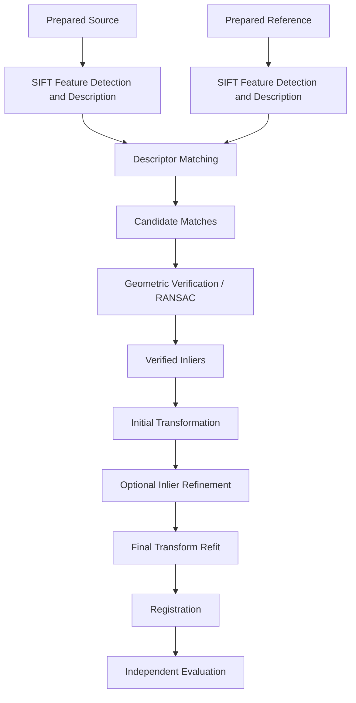
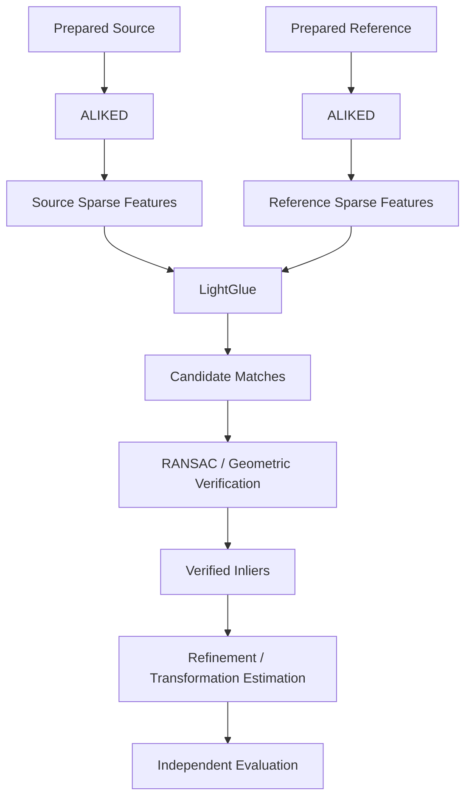
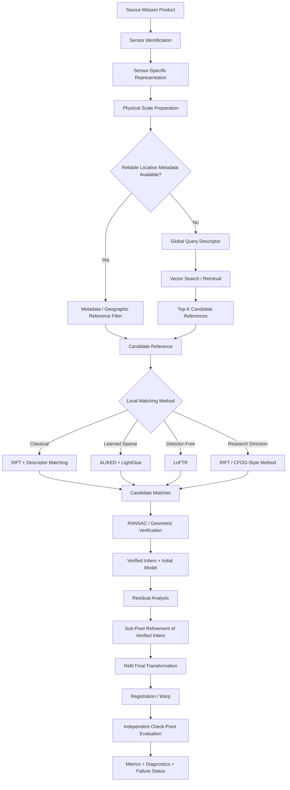

# Algorithms Overview

ChandraMap is not built around one "magic" image matcher. Reliable lunar image correspondence is a multi-stage scientific problem involving sensor-aware representation, physical-scale handling, optional retrieval, local correspondence, geometric verification, transformation estimation, refinement, registration, and independent evaluation.

Different algorithms solve different parts of that problem.

> **Retrieval finds where to look; local matching proposes correspondences; geometry determines which correspondences agree; refinement improves their precision; evaluation determines whether the final result is actually accurate.**

ChandraMap therefore separates:

```text
representation
→ scale preparation
→ retrieval when required
→ local correspondence
→ geometric verification
→ transformation estimation
→ correspondence refinement
→ final transform refit
→ registration
→ independent evaluation
```

This separation matters because an algorithm that performs well at one stage does not automatically solve the others.

For example:

- FAISS can search descriptor vectors but does not register images.
- LightGlue can match compatible local features but does not independently prove geometric correctness.
- RANSAC can identify geometrically consistent correspondences but does not create ground truth.
- A homography can model some projective relationships but is not universally sufficient for lunar terrain.
- A visually convincing registered overlay does not establish quantitative accuracy.

Algorithm choices must therefore be evaluated stage by stage and on controlled, reproducible benchmark pairs.

---

## 1. Algorithm Stack at a Glance

| Stage                          | Purpose                                                                        | Example Algorithms / Methods                                                     | Primary Output                           |
| ------------------------------ | ------------------------------------------------------------------------------ | -------------------------------------------------------------------------------- | ---------------------------------------- |
| Sensor-specific representation | Convert sensor data into a scientifically meaningful comparison representation | Validated panchromatic image, IIRS selected band, PCA, structural representation | Prepared source/reference representation |
| Scale preparation              | Compare imagery at physically meaningful scales                                | GSD-based scaling, reference pyramids, coarse-to-fine selection                  | Scale-compatible representations         |
| Retrieval                      | Find likely reference regions when location is unknown                         | Global descriptors, vector similarity search, FAISS                              | Top-K reference candidates               |
| Sparse feature extraction      | Detect and describe local structures                                           | SIFT, ALIKED                                                                     | Keypoints and local descriptors          |
| Sparse feature matching        | Associate local features between images                                        | Descriptor matching, LightGlue                                                   | Candidate matches                        |
| Detector-free matching         | Estimate local correspondences without a separate traditional detector         | LoFTR                                                                            | Candidate correspondences                |
| Remote-sensing matching        | Investigate modality/radiometric robustness                                    | RIFT, CFOG-style approaches                                                      | Candidate correspondences                |
| Geometric verification         | Reject correspondences inconsistent with the selected geometry                 | RANSAC-family verification                                                       | Inliers, outliers, initial model         |
| Transformation estimation      | Model source-to-reference geometry                                             | Affine, homography, future local/piecewise models                                | Transformation model                     |
| Sub-pixel refinement           | Improve coordinates of already verified correspondences                        | Local refinement method selected by implementation/benchmark                     | Refined inlier coordinates               |
| Registration / warping         | Map the source into the reference frame                                        | Geometric warp using final model                                                 | Registered raster/preview                |
| Evaluation                     | Measure scientific quality                                                     | Check-point RMSE, coverage, inlier statistics, Recall@K, runtime                 | Metrics and diagnostics                  |

Not every method runs in every ChandraMap version or experiment.

The authoritative version and experiment configuration determine which stages and methods are active.

---

## 2. Why ChandraMap Uses a Multi-Stage Pipeline

One matcher cannot independently solve all of the problems ChandraMap faces.

Lunar registration may simultaneously involve:

- large GSD differences;
- different sensor modalities;
- unknown location;
- different illumination;
- repeated crater patterns;
- incorrect feature correspondences;
- projection differences;
- terrain relief;
- transform-model selection;
- sub-pixel localization;
- independent accuracy measurement.

These are different problems.

For example:

```text
unknown location
→ retrieval problem

corresponding local structures
→ matching problem

false correspondence rejection
→ geometric-verification problem

image alignment
→ transformation problem

coordinate precision
→ refinement problem

scientific correctness
→ evaluation problem
```

Collapsing all of these stages into the word **matching** makes the architecture harder to reason about and makes benchmark claims less precise.

---

## 3. Core Algorithm Terminology

| Term                  | Meaning                                                                                           |
| --------------------- | ------------------------------------------------------------------------------------------------- |
| Feature detector      | Finds local keypoint locations                                                                    |
| Feature descriptor    | Produces a numeric representation around a local feature                                          |
| Feature matcher       | Associates candidate features between two images                                                  |
| Detector-free matcher | Estimates correspondences without requiring a separate traditional keypoint detector              |
| Candidate match       | Matcher-proposed correspondence not yet geometrically verified                                    |
| Inlier                | Candidate correspondence consistent with the selected geometric model under the verification rule |
| Outlier               | Candidate correspondence rejected by geometric verification                                       |
| Global descriptor     | Representation of an entire image/tile used for retrieval                                         |
| Local descriptor      | Representation attached to a local feature/keypoint                                               |
| Retrieval             | Finds likely reference regions or tiles                                                           |
| Registration          | Estimates the geometric relationship needed to align source and reference                         |
| Sub-pixel refinement  | Improves the coordinate precision of already verified correspondences                             |
| Residual              | Difference between predicted and observed correspondence location after applying a transform      |

A matcher output should be called:

> **candidate matches**

until geometric verification has occurred.

Avoid describing all matcher outputs as:

> high-confidence matches

because an appearance-based or neural confidence score is not the same as geometric verification.

---

# Algorithm Categories

## 4. Preprocessing and Representation

This stage converts each sensor product into an algorithm-ready representation without discarding the scientific meaning needed downstream.

Typical responsibilities include:

- valid-pixel handling;
- radiometric normalization where justified;
- hyperspectral reduction for IIRS;
- structural representation generation;
- sensor-specific preprocessing;
- preservation of scale and provenance.

The objective is not to make every sensor look identical.

The objective is to expose information that can be compared meaningfully.

---

## 5. Retrieval

Retrieval selects likely reference regions from a larger reference database.

It is required when:

- source location is unknown;
- footprint metadata is missing or unreliable;
- global localization itself is being benchmarked.

Retrieval produces:

```text
query
→ Top-K reference candidates
```

It does **not** produce final registration.

---

## 6. Sparse Feature Detection and Description

Sparse feature methods identify distinctive local structures and describe them numerically.

Examples include:

- SIFT;
- ALIKED.

The detector/descriptor stage typically outputs:

- keypoint coordinates;
- local descriptors;
- optional keypoint scores.

These outputs are then passed to a compatible matcher.

---

## 7. Sparse Feature Matching

Sparse feature matching associates local features between source and reference.

Examples include:

- descriptor-distance matching for SIFT;
- LightGlue for compatible learned local features.

Output:

```text
source feature
↔
reference feature
```

These are still **candidate correspondences**.

---

## 8. Detector-Free Matching

Detector-free methods estimate correspondences without the traditional:

```text
detect
→ describe
→ match
```

sequence.

LoFTR is the primary conceptual detector-free method considered by ChandraMap.

Its correspondences still require:

- geometric verification;
- residual inspection;
- independent evaluation.

---

## 9. Remote-Sensing / Multimodal Matching

Remote-sensing-oriented approaches are relevant because ChandraMap includes:

- cross-sensor imagery;
- cross-modality imagery;
- strong radiometric differences;
- large resolution differences.

Research directions include:

- RIFT;
- CFOG-style matching.

These methods should be treated as candidate research approaches.

They must not be assumed superior to SIFT, ALIKED + LightGlue, or LoFTR without ChandraMap benchmark evidence.

---

## 10. Geometric Verification

Geometric verification tests whether candidate matches agree with a plausible geometric relationship.

A typical verification stage:

```text
candidate matches
        ↓
RANSAC
        ↓
verified inliers
+
rejected outliers
+
initial model
```

This stage is critical in lunar imagery because repeated crater patterns can produce appearance-similar but geographically incorrect matches.

---

## 11. Transformation Estimation

The transformation model maps points from one coordinate domain to another.

Possible simple models include:

- affine transformation;
- homography.

More advanced research directions may include:

- local/piecewise transforms;
- displacement fields;
- DEM-aware transformations;
- sensor-model geometry.

No single transformation should be assumed universally correct.

---

## 12. Refinement

Refinement improves already validated correspondence coordinates.

Correct conceptual order:

```text
candidate matches
→ geometric verification
→ verified inliers
→ sub-pixel refinement
→ final transform refit
```

Refining all candidates before rejecting outliers wastes computation and can produce precisely localized incorrect correspondences.

---

## 13. Evaluation

Evaluation determines whether the final result is scientifically useful.

Important metrics may include:

- candidate match count;
- inlier count;
- inlier ratio;
- independent check-point RMSE;
- source-image pixel error;
- spatial/grid coverage;
- convex-hull coverage;
- justified ground error;
- Recall@1;
- Recall@5;
- Recall@K;
- runtime;
- failure rate.

Retrieval metrics and registration metrics should remain separate.

---

# Sensor-Specific Representation

## 14. Why Sensor Routing Comes First

OHRC, TMC-2, and IIRS measure lunar terrain differently.

They should therefore not blindly enter one identical preprocessing path.

Conceptually:

```text
Mission Product
      ↓
Identify Sensor
      ↓
Sensor-Specific Preparation
      ↓
Comparison Representation
      ↓
Common Matching Architecture
```

Sensor-specific preparation is part of the algorithm system.

---

## 15. OHRC Representation

OHRC is a Chandrayaan-2 visible/panchromatic high-resolution instrument.

Current project documentation commonly treats OHRC as approximately:

> **~0.25–0.32 m/pixel**

depending on product and authoritative documentation.

Actual product metadata remains authoritative.

Possible OHRC algorithm inputs include:

- validated/calibrated panchromatic imagery;
- controlled normalized-intensity representations;
- gradient or structural representations when benchmarked.

Preparation should preserve useful high-resolution terrain detail.

Strong smoothing may remove:

- small crater rims;
- fine ridges;
- local morphological structure.

Denoising should therefore be treated as an experimental preprocessing choice rather than a default assumption.

---

## 16. TMC-2 Representation

TMC-2 is Chandrayaan-2 panchromatic terrain imagery at approximately:

> **~5 m/pixel**

in current project planning.

Actual product metadata remains authoritative.

TMC-2 algorithm design should emphasize structures such as:

- crater morphology;
- ridge systems;
- medium-scale terrain boundaries;
- larger structural patterns.

TMC-2 should not be treated simply as:

> OHRC resized to a lower resolution.

It is a distinct instrument with its own product characteristics.

---

## 17. IIRS Representation

IIRS is fundamentally different from ordinary panchromatic imagery.

It is a Chandrayaan-2 imaging infrared spectrometer with project-level characteristics approximately:

- ~80 m/pixel spatial scale;
- ~0.8–5.0 µm spectral coverage;
- roughly 250–256 bands depending on product/documentation.

Actual product metadata controls processing.

A conventional 2D matcher should not blindly receive the entire hyperspectral cube as though it were one grayscale image.

Conceptually:

```text
IIRS scientific product
        ↓
validate spatial + spectral structure
        ↓
select valid spectral information
        ↓
derive registration representation
        ↓
2D matcher-compatible image
```

Candidate representations may include:

- selected valid spectral band;
- PCA-derived component;
- multi-band composite;
- gradient/structural representation;
- future learned spectral-spatial representation.

No representation should be declared universally superior without controlled experiments.

---

## 18. IIRS Representation Ablation

Representation quality should be benchmarked independently from matcher quality.

A controlled experiment should keep constant:

```text
same IIRS parent product
same reference
same reference scale
same matcher
same geometric verification
same evaluation points
```

and vary only:

```text
selected band
vs.
PCA representation
vs.
spectral composite
vs.
structural representation
```

This isolates the effect of the IIRS representation.

Without this control, it becomes difficult to know whether an improvement came from:

- the matcher;
- preprocessing;
- spectral selection;
- reference-scale selection.

---

# Physical Scale Handling

## 19. Compare Information, Not Pixel Count

> **Compare physical information, not pixel count.**

Image dimensions do not define lunar ground scale.

For example:

```text
1024 × 1024 source
```

and:

```text
1024 × 1024 reference
```

may represent dramatically different lunar extents.

Scale-aware processing should use where available:

- source GSD;
- reference GSD;
- effective GSD;
- pyramid level;
- projection/product metadata.

---

## 20. Approximate Sensor Scale Context

| Sensor  |                  Project-Level Approximate Scale |
| ------- | -----------------------------------------------: |
| OHRC    |                                  ~0.25–0.32 m/px |
| TMC-2   |                                          ~5 m/px |
| IIRS    |                                         ~80 m/px |
| LRO NAC | Often ~0.5–2 m/px, product/acquisition dependent |
| LRO WAC |                Product/mode/processing dependent |

These values support architecture-level reasoning.

They do not replace product-specific metadata.

---

## 21. Why Upsampling Is Not Resolution Recovery

Upsampling changes the number of digital samples.

It does not create new measurements.

Conceptually:

```text
IIRS source
~80 m/px
      ↓
enlarge image
      ↓
more pixels
      ↓
same original spatial information
```

Upsampling cannot recover:

- smaller craters never resolved by the sensor;
- fine NAC-scale terrain detail;
- missing spatial frequencies;
- new physical surface measurements.

Therefore:

> **More pixels after interpolation do not mean more lunar information.**

---

## 22. Reference Pyramid

A multi-resolution reference pyramid makes the reference available at several effective physical scales.

Conceptually:

```text
Fine LRO Reference
       ↓
Level 0
       ↓
Level 1
       ↓
Level 2
       ↓
Level 3
       ↓
...
```

Each level should preserve:

- parent reference identity;
- pyramid level;
- effective GSD;
- dimensions;
- resampling provenance.

The objective is not simply faster computation.

The pyramid also helps compare the source against reference structure that exists at a compatible physical scale.

---

## 23. TMC-2 and NAC Scale Handling

LRO NAC is commonly finer than TMC-2.

A possible strategy is:

```text
NAC
 ↓
reference pyramid
 ↓
select TMC-2-compatible scale
 ↓
local correspondence
```

This can suppress fine NAC structures that TMC-2 never measured.

---

## 24. IIRS and NAC Scale Handling

IIRS ↔ NAC may contain a very large GSD difference.

A physically meaningful strategy may require:

```text
IIRS
 ↓
documented 2D representation

NAC
 ↓
strongly reduced reference level

        ↓

coarse structural comparison
```

Matching IIRS directly against native fine NAC imagery can cause the matcher to compare incompatible information.

---

## 25. Coarse-to-Fine Scale Strategy

A general scale strategy is:

```text
coarse compatible scale
        ↓
initial correspondence
        ↓
geometric verification
        ↓
stable candidate geometry
        ↓
finer scale when supported
        ↓
refinement
```

The pipeline should not automatically refine all the way to the finest available reference scale.

Refinement should stop when the source sensor no longer contains corresponding physical information.

---

# Classical Feature Baseline

## 26. Why a Classical Baseline Matters

ChandraMap should establish a simple, reproducible baseline before introducing more complex models.

A classical baseline provides:

- interpretability;
- lower implementation complexity;
- easy debugging;
- reproducible comparison;
- failure diagnosis;
- a reference point for learned approaches.

A stronger model is scientifically meaningful only when it improves measurable outcomes over a controlled baseline.

---

## 27. SIFT

SIFT is the primary conceptual classical feature baseline.

It provides:

- local keypoint detection;
- local descriptor generation.

A typical source/reference flow is:

```text
Source
→ SIFT keypoints + descriptors

Reference
→ SIFT keypoints + descriptors
```

SIFT should not be described as inherently:

- lunar-specific;
- Sun-angle invariant;
- cross-modality invariant;
- guaranteed across extreme scale differences.

Its real behavior must be measured.

---

## 28. Descriptor Matching

SIFT descriptors can be associated through descriptor-distance matching.

Possible high-level filtering concepts include:

- nearest-neighbor matching;
- ratio-style filtering;
- mutual consistency;
- cross-checking.

The exact strategy and threshold belong in experiment configuration.

This overview should not prescribe one universal ratio or distance threshold.

---

## 29. Candidate Matches

Descriptor matching produces:

> **candidate matches**

A candidate match means:

> the appearance/descriptor stage believes two local features may correspond.

It does not yet mean:

- geometrically consistent;
- geographically correct;
- scientifically verified;
- ground truth.

This distinction is fundamental throughout ChandraMap.

---

## 30. Classical Baseline Flow



This is a conceptual baseline architecture rather than a claim about one fixed implementation.

---

# Learned Sparse Matching

## 31. ALIKED

ALIKED is a learned sparse local feature detector/descriptor.

Its conceptual role is to produce:

- sparse keypoints;
- local descriptors.

ALIKED belongs to the **feature extraction** stage.

It is not LightGlue.

A typical conceptual flow is:

```text
image
→ ALIKED
→ sparse keypoints + descriptors
```

---

## 32. LightGlue

LightGlue is a learned local-feature matcher.

Its role is to associate compatible local features produced by a supported extractor.

Conceptually:

```text
Source features
        +
Reference features
        ↓
LightGlue
        ↓
Candidate correspondences
```

LightGlue should not be described as the feature detector when the feature extraction stage is performed by ALIKED or another extractor.

---

## 33. ALIKED + LightGlue Pipeline



The learned matcher output still requires geometric and independent evaluation.

---

## 34. Learned Matcher Caution

A pretrained learned matcher may have been trained primarily on imagery that differs significantly from lunar data.

Therefore pretrained performance does not automatically establish:

- lunar invariance;
- Sun-angle invariance;
- sensor invariance;
- cross-modality robustness;
- reliable IIRS behavior.

ChandraMap should treat lunar performance as an empirical benchmark question.

---

# Detector-Free Matching

## 35. LoFTR

LoFTR represents a different algorithm category from SIFT or ALIKED + LightGlue.

Traditional sparse pipeline:

```text
detect keypoints
→ compute descriptors
→ match descriptors
```

LoFTR conceptually performs:

```text
source image
+
reference image
→ detector-free correspondence estimation
```

It should therefore be described as:

> **detector-free local feature matching / correspondence estimation**

rather than as a traditional keypoint detector.

---

## 36. LoFTR Output

LoFTR produces candidate correspondences.

Those correspondences should still undergo:

- geometric verification;
- residual inspection;
- transform estimation;
- independent evaluation.

A neural confidence score is not the same as geometric proof.

---

# Remote-Sensing-Oriented Matching

## 37. Why Remote-Sensing Methods Matter

ChandraMap is not a conventional same-camera terrestrial matching problem.

It includes:

- cross-resolution imagery;
- cross-sensor imagery;
- hyperspectral-to-visible comparisons;
- strong radiometric differences;
- illumination differences;
- planetary terrain.

This makes remote-sensing-oriented matching methods scientifically relevant research directions.

---

## 38. RIFT

RIFT is a remote-sensing multimodal image-matching research direction relevant to cases where radiometric or modality differences reduce the effectiveness of ordinary intensity/descriptor assumptions.

Potential ChandraMap use cases may include:

- cross-modal experiments;
- IIRS-derived representation matching;
- difficult remote-sensing stress pairs.

Its inclusion here does not imply:

- current implementation;
- superiority to SIFT;
- superiority to LightGlue;
- superiority to LoFTR;
- guaranteed lunar robustness.

It should be evaluated on controlled ChandraMap benchmark pairs.

---

## 39. CFOG-Style Methods

CFOG-style methods are another remote-sensing-oriented research direction.

They may be useful when investigating:

- structural matching;
- radiometric differences;
- multimodal correspondence.

Like RIFT, they should be benchmarked rather than assumed to be better.

---

## 40. Algorithm Comparison Principle

ChandraMap should not rank:

- SIFT;
- ALIKED + LightGlue;
- LoFTR;
- RIFT;
- CFOG-style approaches;

using arbitrary:

- stars;
- tiers;
- scores;
- subjective difficulty labels.

Correct comparison requires:

```text
same pair
+
same preparation assumptions
+
same evaluation protocol
+
measured metrics
```

---

# Global Retrieval

## 41. When Retrieval Is Needed

Global or regional retrieval becomes useful when:

- the source location is genuinely unknown;
- useful footprint metadata is unavailable;
- geolocation metadata is considered unreliable;
- a benchmark intentionally hides the source location.

Global retrieval should not automatically run for every source image.

---

## 42. Metadata-Constrained Search

If authoritative source metadata provides:

- footprint;
- latitude/longitude;
- projection;
- approximate lunar location;

that information should normally restrict the reference search.

Conceptually:

```text
Source footprint
      ↓
Reference spatial query
      ↓
Relevant LRO products / tiles
      ↓
Local registration
```

Using valid mission metadata is correct engineering.

It is not cheating unless a benchmark explicitly defines location as hidden information.

---

## 43. Offline Retrieval Preparation

The reference database should generally be prepared before query time.

Conceptually:

```text
Reference imagery
      ↓
geographic tiling
      ↓
scale preparation
      ↓
global descriptor extraction
      ↓
vector index
      +
tile/product/geographic metadata
```

This work can be reused across many source queries.

---

## 44. Online Retrieval

At query time:

```text
Source / Query
      ↓
compatible query representation
      ↓
global descriptor
      ↓
vector search
      ↓
Top-K candidate reference tiles
```

The candidates are then passed to local matching.

---

## 45. FAISS

FAISS is relevant to ChandraMap as a vector-similarity-search system.

It can support operations such as:

```text
query descriptor
      ↓
nearest-neighbor search
      ↓
Top-K reference descriptors
```

FAISS is **not**:

- an image feature detector;
- a local image matcher;
- a geometric verifier;
- a lunar-coordinate engine;
- a RANSAC implementation;
- a homography estimator;
- a registration algorithm;
- an image warper;
- an evaluation system.

Its role is vector retrieval.

---

## 46. Descriptor-to-Geography Mapping

A retrieval index is incomplete unless vector entries map back to scientific reference assets.

Conceptually:

```text
FAISS/vector index entry
        ↓
global descriptor
        ↓
reference tile ID
        ↓
parent LRO product
        ↓
geographic region
```

Without this mapping, a nearest-neighbor result cannot reliably become a lunar candidate region.

---

## 47. Retrieval Metrics

Retrieval should use retrieval-oriented metrics such as:

- Recall@1;
- Recall@5;
- Recall@K;
- retrieval runtime.

These metrics answer:

> Did the retrieval system place a correct reference region in its Top-K candidates?

They do not measure local registration accuracy.

---

## 48. Multiple Correct Retrieval Tiles

Reference tiles may overlap.

Therefore:

```text
Query
```

may legitimately correspond to:

```text
Tile A
OR
Tile B
```

if both contain the correct lunar region.

Retrieval ground truth should therefore support multiple acceptable reference IDs.

---

# Local Matching

## 49. Retrieval Handoff

A Top-K retrieval result is only a candidate.

Correct conceptual sequence:

```text
Top-K candidate tile
        ↓
local matcher
        ↓
candidate correspondences
        ↓
geometric verification
        ↓
registered candidate
```

Retrieval confidence should not automatically be treated as registration correctness.

---

## 50. Local Matcher Interface Concept

A local matching stage conceptually receives:

- prepared source representation;
- prepared reference representation;
- valid-data information where applicable.

It conceptually returns:

- source coordinates;
- reference coordinates;
- optional matcher scores;
- optional feature metadata.

The returned coordinate pairs remain candidate matches until verification.

---

## 51. Matcher Confidence

A matcher confidence/score may be useful for:

- ranking;
- filtering;
- debugging;
- threshold studies.

It should not be interpreted as:

> independent probability that the match is physically correct

unless the algorithm explicitly defines and calibrates such a quantity and ChandraMap validates it.

Even high-scoring matches can be geographically wrong in repetitive lunar terrain.

---

# Geometric Verification

## 52. Why Geometry Is Required

Appearance alone can produce false correspondence.

Lunar terrain frequently contains:

- repeated crater shapes;
- repeated rim structures;
- low-texture plains;
- shadow-induced edges;
- similar ridge patterns.

Geometric verification asks:

> Do the candidate matches collectively agree with one plausible geometric model?

---

## 53. RANSAC

RANSAC conceptually operates as:

```text
candidate correspondences
      ↓
sample a minimal model hypothesis
      ↓
measure candidate consistency
      ↓
identify inliers/outliers
      ↓
repeat / optimize model selection
      ↓
initial transform + inlier set
```

The exact implementation and thresholds belong in configuration and implementation documentation.

---

## 54. Inliers

An **inlier** is a candidate match that is consistent with the selected model under the geometric-verification rule.

An inlier is not automatically:

- independently verified truth;
- guaranteed physically correct;
- perfectly localized.

A set of incorrect correspondences can occasionally agree with an incorrect model.

That is why independent evaluation remains necessary.

---

## 55. Outliers

An **outlier** is a candidate correspondence rejected by the geometric verification stage.

Possible reasons include:

- appearance ambiguity;
- repeated crater terrain;
- incorrect retrieval candidate;
- descriptor mismatch;
- illumination-induced structure;
- incompatible geometry.

Outliers should normally be excluded before final refinement.

---

## 56. Inlier Ratio

The inlier ratio is conceptually:

```text
number of verified inliers
--------------------------
number of candidate matches
```

It is a useful diagnostic.

However:

- a high ratio with very few correspondences may still be weak;
- a high ratio with clustered correspondences may still provide poor global registration;
- an incorrect model can sometimes generate a misleadingly consistent set.

Always interpret inlier ratio together with:

- inlier count;
- spatial coverage;
- residuals;
- independent check-point error.

---

# Transformation Estimation

## 57. Affine Transformation

An affine transformation can represent combinations of:

- translation;
- rotation;
- scale;
- shear.

It may be a useful approximation for local source/reference relationships.

Conceptually:

```text
source coordinates
       ↓
affine transform
       ↓
reference coordinates
```

An affine model should not be assumed sufficient for every lunar pair.

---

## 58. Homography

A homography is a planar projective transformation commonly represented by a 3 × 3 matrix.

It can model perspective-like projective relationships for suitable local conditions.

However:

> **The Moon is not a flat poster.**

A single global homography may be insufficient when:

- terrain relief matters;
- the field of view is large;
- source/reference projections differ strongly;
- viewing geometry differs;
- sensor geometry creates spatially varying displacement.

Homography quality must therefore be evaluated rather than assumed.

---

## 59. Model Selection

Model selection should consider:

- overlap size;
- expected geometry;
- source/reference projection;
- terrain relief;
- number/distribution of inliers;
- residual patterns;
- independent check-point performance.

The most flexible model is not automatically the best model.

A more complex model can overfit limited or noisy correspondences.

---

## 60. Transform Direction

Every stored transformation should state its direction.

For example:

```text
source → reference
```

is not equivalent to:

```text
reference → source
```

A matrix stored without:

- source domain;
- destination domain;
- model type;

is scientifically ambiguous.

---

# Residual Analysis

## 61. Residual Definition

A residual measures the difference between:

- where the transformation predicts a correspondence should lie;
- where the observed correspondence actually lies.

Conceptually:

```text
observed reference point
-
transformed source point
=
residual vector
```

Residual analysis can inspect:

- magnitude;
- direction;
- spatial pattern.

---

## 62. Residual Patterns

Systematic residual structures may reveal problems that one average error number hides.

Possible patterns include:

### Constant Direction

May indicate translation bias.

### Increasing Residual Toward Edges

May indicate:

- projection mismatch;
- wrong global model;
- scale/geometric distortion.

### Region-Specific Residuals

May indicate:

- terrain relief;
- local deformation;
- incorrect correspondence cluster.

### Chaotic Large Residuals

May indicate:

- wrong reference candidate;
- false correspondences;
- failed geometry estimation.

---

## 63. When a Global Model Is Not Enough

If residual error varies strongly across the image, future/research approaches may investigate:

- local transforms;
- piecewise registration;
- displacement fields;
- DEM-aware alignment;
- camera/sensor-model geometry.

These approaches increase complexity significantly.

They should not be introduced into V1 unless required by the authoritative V1 specification.

---

# Sub-Pixel Refinement

## 64. Why Verification Comes First

Refining a false correspondence produces:

> a more precisely located false correspondence.

Therefore ChandraMap should use:

```text
verification first
refinement second
```

rather than refining every raw matcher proposal.

---

## 65. Correct Refinement Order

The intended conceptual order is:

1. Local matcher produces candidate matches.
2. RANSAC estimates an initial geometric model.
3. RANSAC identifies a geometrically consistent inlier set.
4. Refine the verified inlier coordinates to sub-pixel precision where justified.
5. Refit the final transformation using the refined inliers.
6. Evaluate the final model using independent check points.

In compact form:

```text
Candidate Matches
      ↓
RANSAC
      ↓
Verified Inliers
      ↓
Sub-Pixel Refinement
      ↓
Refit Final Transform
      ↓
Independent Evaluation
```

---

## 66. Sub-Pixel Accuracy Caution

Sub-pixel refinement is an algorithmic operation.

It does not guarantee:

> sub-pixel registration accuracy.

Final accuracy still depends on:

- source information content;
- reference information content;
- sensor GSD;
- feature ambiguity;
- projection;
- geometry;
- refinement quality;
- ground-truth precision.

Sub-pixel performance must be measured.

---

## 67. Source Information Limits

Different sensors support different physical levels of precision.

For example:

```text
0.2 OHRC pixels
```

and:

```text
0.2 IIRS pixels
```

represent very different physical scales.

The algorithm should not claim fine physical precision unsupported by the source sensor's measured information.

---

# Registration and Warping

## 68. Registration

Once a final transformation is estimated, ChandraMap can map source pixels into the reference coordinate frame.

Possible outputs include:

- transformation parameters;
- transformation type;
- transformation direction;
- registered/warped source;
- overlay;
- residual diagnostics.

The transformation and measured accuracy are the important scientific outputs.

---

## 69. Registered Preview

A registered preview is useful for:

- visual debugging;
- presentations;
- documentation;
- qualitative inspection.

It does not independently prove quantitative correctness.

A convincing overlay may hide:

- local errors;
- clustered matches;
- large edge residuals;
- overfitted control points.

Numeric metrics should accompany visual output.

---

## 70. Mosaic Role

A lunar mosaic can be a valuable downstream demonstration.

However, mosaicing should not hide the core correspondence problem.

The central scientific questions remain:

- Were the matched points reliable?
- Were they geometrically verified?
- Were they spatially distributed?
- Was the transformation justified?
- Was accuracy independently measured?

A smooth-looking mosaic is not a substitute for these checks.

---

# Independent Evaluation

## 71. Why Independent Evaluation Matters

A transformation fitted using a set of correspondences will naturally tend to fit those same correspondences.

Therefore:

```text
fit points
→ fit transform
→ evaluate only same fit points
```

does not provide fully independent evidence of registration accuracy.

Preferred:

```text
fit/control points
        ↓
estimate transformation

held-out check points
        ↓
independent evaluation
```

---

## 72. Check Points

Check points are correspondences reserved for evaluation and excluded from transform estimation.

They help answer:

> How well does the final transformation generalize beyond the points used to fit it?

Ground-truth preparation and check-point governance are documented in [`../datasets/ground-truth-preparation.md`](../datasets/ground-truth-preparation.md).

---

## 73. Source-Image Pixel Error

ChandraMap should normally report image-domain error in the source coordinate system first.

Examples:

```text
OHRC source
→ OHRC-pixel error
```

```text
TMC-2 source
→ TMC-2-pixel error
```

```text
IIRS source representation
→ IIRS source-grid pixel error
```

This preserves the relationship between numerical error and source information content.

---

## 74. Ground Error

Pixel error may be converted into physical ground distance only when the conversion is scientifically justified.

Relevant information may include:

- valid source GSD;
- source coordinate domain;
- projection;
- geographic mapping;
- independent truth;
- local geometric interpretation.

Do not simply multiply error by an approximate generic sensor GSD and report false precision.

---

## 75. Candidate Match Count

Candidate match count measures how many correspondences the local matcher proposed.

It is useful for:

- diagnostics;
- algorithm behavior comparison;
- filtering studies.

It is not a final quality metric.

An algorithm can produce many incorrect candidate matches.

---

## 76. Inlier Count

Inlier count measures how many candidate correspondences survive geometric verification.

It can indicate whether sufficient model-consistent support exists.

Interpret it together with:

- candidate count;
- inlier ratio;
- spatial coverage;
- residuals.

---

## 77. Inlier Ratio

A higher inlier ratio may indicate cleaner correspondence proposals.

However:

```text
10 inliers / 10 candidates
```

and:

```text
500 inliers / 1000 candidates
```

describe very different evidence.

The ratio should therefore never be interpreted alone.

---

## 78. Spatial Coverage

A strong registration should ideally use inliers distributed throughout the valid overlap.

A large number of correspondences concentrated around one crater may not constrain the rest of the image well.

Possible coverage measures include:

- grid occupancy;
- convex-hull coverage;
- another explicitly defined spatial measure.

No universal coverage threshold is defined here.

---

## 79. Check-Point RMSE

Independent check-point RMSE is a preferred registration metric when trustworthy held-out correspondences are available.

A reported RMSE should identify:

- coordinate system;
- unit;
- check-point set;
- number of evaluated points;
- benchmark/truth version.

For example:

```text
RMSE = value
unit = source-image pixels
evaluation points = held-out check points
```

is more meaningful than an unlabeled number.

---

## 80. Runtime

Runtime helps characterize engineering cost.

Possible stage timings include:

- representation preparation;
- retrieval;
- feature extraction;
- matching;
- geometric verification;
- refinement;
- warping;
- total runtime.

Runtime comparisons should record relevant hardware/software context where it materially affects interpretation.

---

## 81. Failure Rate

A scientific benchmark should include failed cases.

Possible failures include:

- insufficient valid image area;
- too few detected features;
- insufficient candidate matches;
- geometric-verification failure;
- wrong retrieval candidate;
- unstable transformation;
- missing required metadata;
- incompatible source/reference scale.

Failure is a benchmark result.

It should not be silently removed from evaluation summaries.

---

# Algorithm Selection by Sensor

## 82. OHRC Considerations

OHRC provides fine terrain detail.

Potential advantages include:

- many local terrain structures;
- fine crater morphology;
- potentially dense feature evidence.

Potential challenges include:

- large image size;
- strong illumination differences;
- repetitive terrain;
- projection differences;
- terrain-relief effects.

Candidate experiments may include:

- SIFT baseline;
- ALIKED + LightGlue;
- LoFTR;
- structural preprocessing.

No method should be ranked in advance.

---

## 83. TMC-2 Considerations

TMC-2 emphasizes medium-scale terrain structure.

Important algorithm considerations include:

- reference GSD;
- reference pyramid level;
- crater/ridge morphology;
- broad structural features.

A poor reference-scale choice can cause failure even when the local matcher itself is strong.

Therefore scale preparation is part of the algorithm design.

---

## 84. IIRS Considerations

IIRS combines two major difficulties:

- modality difference;
- large scale difference.

The algorithm sequence should normally resemble:

```text
IIRS product
      ↓
registration representation
      ↓
physical scale preparation
      ↓
local matcher
      ↓
geometric verification
      ↓
registration
```

The complete hyperspectral cube should not be blindly passed into ordinary 2D SIFT, LightGlue, or LoFTR processing as though it were one grayscale image.

---

## 85. LRO NAC Role

NAC primarily acts as a fine/local reference family.

Algorithm decisions may include:

- candidate product selection;
- geographic tile selection;
- pyramid level;
- local representation;
- local matcher;
- transform model.

NAC's fine detail does not automatically make a source/reference pair easy.

---

## 86. LRO WAC Role

WAC may support:

- broad lunar context;
- coarse localization;
- global retrieval;
- regional candidate generation.

Its characteristics depend on the actual product, mode, mosaic, and processing.

WAC should not be expected to contain all of the fine terrain information needed for final OHRC-level registration.

A possible hierarchy is:

```text
WAC
→ coarse region

NAC
→ finer local reference
```

---

# Illumination Robustness

## 87. Illumination Is Not Just Brightness

Different lunar Sun geometry changes more than pixel intensity.

It can alter:

- shadow direction;
- shadow length;
- illuminated crater rims;
- visible slopes;
- ridge boundaries;
- local texture.

Therefore:

```text
brightness normalization
≠
Sun-angle correction
```

A histogram operation cannot physically move a shadow caused by different illumination geometry.

---

## 88. Radiometric Normalization

Possible preprocessing experiments include:

- robust contrast scaling;
- local normalization;
- intensity normalization.

These methods may reduce radiometric-scale differences.

They should not be described as solving:

- shadow displacement;
- view geometry;
- relief.

Their contribution should be tested through ablation.

---

## 89. Structural Representations

Potential research directions include:

- gradient magnitude;
- edge maps;
- phase/structural cues;
- crater/ridge geometry;
- shadow-aware masks.

These may reduce dependence on raw intensity in some experiments.

They should remain candidate methods until ChandraMap benchmark results justify their use.

---

# Algorithm Benchmarking

## 90. Same-Pair Comparison Rule

Algorithms should be compared on the **same scientific input pairs**.

For example:

```text
Pair A
├── SIFT baseline
├── ALIKED + LightGlue
├── LoFTR
└── RIFT candidate
```

should use, where scientifically possible:

- the same source product;
- the same reference product;
- the same overlap;
- the same benchmark truth;
- the same evaluation protocol.

Avoid comparing algorithms using different cherry-picked cases.

---

## 91. Controlled Ablations

Ablations should change one important factor at a time.

Examples:

### Preprocessing Ablation

```text
same pair
same matcher

raw/prepared intensity
vs.
normalized representation
vs.
gradient representation
```

### Matcher Ablation

```text
same pair
same source/reference preparation

SIFT
vs.
ALIKED + LightGlue
vs.
LoFTR
```

### Scale Ablation

```text
same pair
same matcher

NAC pyramid level A
vs.
level B
vs.
level C
```

This isolates which component actually causes the observed change.

---

## 92. Benchmark Table Design

A useful benchmark table may use columns such as:

| Method | Pair | Candidates | Inliers | Inlier Ratio | Check RMSE | Coverage | Runtime | Status |
| ------ | ---- | ---------: | ------: | -----------: | ---------: | -------: | ------: | ------ |

The repository should populate such tables only with measured values.

Do not insert invented benchmark numbers into documentation.

---

## 93. No Star Ratings

Avoid unsupported ranking tables such as:

```text
SIFT       ★★★
LoFTR      ★★★★★
LightGlue  ★★★★★
```

These ratings hide:

- pair selection;
- metric definition;
- sensor combination;
- scale stress;
- runtime;
- failures.

Use reproducible measurements instead.

---

## 94. No Undefined Accuracy Percentages

Claims such as:

```text
92% accuracy
```

are meaningless unless the metric is defined.

ChandraMap should report explicit quantities such as:

- Recall@5;
- inlier ratio;
- check-point RMSE;
- success rate under a defined benchmark.

---

# Failure Analysis

## 95. Common Algorithm Failure Modes

| Failure                                            | Possible Cause                                  | Useful Diagnostic                    |
| -------------------------------------------------- | ----------------------------------------------- | ------------------------------------ |
| Very few features                                  | Smooth/low-feature terrain, weak representation | Keypoint count and image validity    |
| Many false candidate matches                       | Repetitive crater terrain                       | Inlier ratio and match visualization |
| RANSAC failure                                     | Wrong candidate region or insufficient geometry | Verify overlap/retrieval result      |
| High residuals                                     | Inadequate transform model                      | Residual-vector map                  |
| IIRS correspondence failure                        | Representation or modality mismatch             | IIRS representation ablation         |
| Dense match cluster but poor registration          | Weak spatial distribution                       | Coverage metric                      |
| Strong matcher fails                               | Reference scale incompatible with source        | Pyramid-level experiment             |
| Retrieval succeeds but registration fails          | Candidate is too coarse or locally ambiguous    | Local matching diagnostics           |
| High fit quality, poor check RMSE                  | Model overfit or biased control points          | Held-out check-point residuals       |
| Strong central fit, edge errors                    | Projection/relief/global-model limitation       | Spatial residual pattern             |
| High matcher confidence, low geometric consistency | Appearance ambiguity                            | RANSAC/inlier statistics             |
| WAC localization succeeds, NAC refinement fails    | Fine reference-selection problem                | WAC-to-NAC handoff review            |

---

## 96. Failure Is a Result

A failed benchmark case should record:

- pair ID;
- method;
- method/config version;
- failure stage;
- reason;
- dataset/benchmark version.

Do not remove failures merely to improve summary metrics.

Failure analysis is essential for understanding:

- algorithm limits;
- sensor-specific weaknesses;
- representation failures;
- retrieval failures.

---

# Algorithm Modularity

## 97. Why Stages Should Be Modular

Each algorithm stage should be independently replaceable.

Conceptually:

```text
representation
      ↓
retrieval
      ↓
local matcher
      ↓
geometric verifier
      ↓
transform estimator
      ↓
refiner
      ↓
evaluator
```

This allows one component to be changed without rewriting the complete pipeline.

---

## 98. Avoid Hard-Coded Algorithm Chains

The repository should avoid architectures where:

```text
SIFT
```

is permanently inseparable from one exact RANSAC configuration, or:

```text
ALIKED
```

is permanently tied to every downstream implementation detail.

Modularity enables:

- controlled experiments;
- benchmarking;
- regression testing;
- future algorithms.

---

## 99. Algorithm Configuration

Research-sensitive parameters should live in versioned configuration where practical.

Examples include:

- representation choice;
- descriptor matcher configuration;
- matcher thresholds;
- RANSAC configuration;
- transformation model;
- pyramid level policy;
- refinement settings.

Avoid scattering scientific parameters across undocumented source files.

---

## 100. Reproducibility

Every benchmark result should retain enough information to identify:

- pair ID/version;
- source representation;
- reference representation;
- algorithm/method;
- algorithm/model version where applicable;
- configuration;
- preparation version;
- dataset version;
- benchmark version;
- evaluation truth version.

A result without its algorithmic context is difficult to reproduce.

---

# Versioned Algorithm Evolution

## 101. V1 — Classical Baseline

V1 should remain simple and measurable.

Conceptual V1 pipeline:

```text
Known source/reference pair
        ↓
minimal sensor-aware preparation
        ↓
physical scale preparation
        ↓
SIFT
        ↓
descriptor matching
        ↓
candidate filtering
        ↓
RANSAC
        ↓
affine / homography where appropriate
        ↓
verified inliers
        ↓
optional refinement
        ↓
final transformation
        ↓
independent metrics
```

Primary purpose:

> **Establish a reproducible registration baseline.**

V1 does not need to require:

- whole-Moon retrieval;
- learned local matchers;
- DEM-aware geometry;
- local deformation fields;
- large-scale vector indexes;

unless the authoritative V1 specification says otherwise.

---

## 102. V2 — Scale and Illumination-Aware Improvements

Possible V2 directions include:

- improved reference pyramids;
- sensor-specific representations;
- radiometric normalization experiments;
- structural representations;
- stronger coverage metrics;
- initial learned matcher comparisons;
- more stress-pair categories.

These are candidate improvements.

They should not be described as successful until measured.

---

## 103. V3 — Retrieval and Advanced Local Matching

Possible V3 capabilities include:

- reference tiling;
- global descriptors;
- vector retrieval;
- FAISS or another compatible vector-search system;
- Top-K reference candidates;
- WAC/global context;
- NAC fine-reference selection;
- ALIKED + LightGlue;
- LoFTR;
- stronger coarse-to-fine pipelines.

Retrieval and registration metrics should remain separate.

---

## 104. V4 — Research-Grade Geometry and Multimodal Matching

Possible V4 research directions include:

- RIFT/CFOG-oriented studies;
- lunar-specific learned representations;
- advanced IIRS handling;
- DEM-aware registration;
- sensor-model geometry;
- local/piecewise transformations;
- displacement fields;
- additional lunar missions;
- larger global reference databases;
- uncertainty modeling.

These are research directions, not implementation-status claims.

Existing authoritative version specifications take precedence.

---

# Main Algorithm Flow

## 105. End-to-End ChandraMap Algorithm



The diagram shows algorithmic responsibilities.

It does not imply that every branch is implemented or active in every version.

---

## 106. Retrieval vs Registration


The outputs answer different questions:

| Stage                  | Question                                     |
| ---------------------- | -------------------------------------------- |
| Retrieval              | Where should ChandraMap look?                |
| Local matching         | Which local structures might correspond?     |
| Geometric verification | Which candidate matches agree geometrically? |
| Registration           | What transformation aligns the pair?         |
| Evaluation             | How accurate is the result?                  |

---

# Algorithm Output Contracts

## 107. Representation Stage Output

Conceptually:

- prepared image/representation;
- valid-data mask;
- sensor identity;
- GSD/effective scale;
- representation provenance.

For IIRS, output should additionally identify the representation method and parent spectral product.

---

## 108. Retrieval Stage Output

Conceptually:

- candidate reference IDs;
- ranks;
- similarity/distance values;
- Top-K list;
- tile/product mappings;
- geographic metadata;
- retrieval runtime.

These remain candidate regions.

---

## 109. Matching Stage Output

Conceptually:

- source coordinates;
- reference coordinates;
- matcher scores where available;
- optional feature IDs.

Status:

> **candidate matches**

not final inliers.

---

## 110. Geometric Verification Output

Conceptually:

- inlier mask/set;
- outlier mask/set;
- initial transformation model;
- residuals;
- verification status.

RANSAC inliers should not be labeled independent ground truth.

---

## 111. Refinement Output

Conceptually:

- refined source/reference coordinates;
- refinement status;
- retained/rejected refined points;
- final inlier set for transform refit.

---

## 112. Final Registration Output

Conceptually:

- final transformation;
- transform type;
- transform direction;
- source/reference domains;
- registered raster or preview;
- residual diagnostics.

The transform itself should remain machine-readable.

---

## 113. Evaluation Output

Conceptually:

- independent check-point RMSE;
- source-pixel error;
- justified ground error;
- candidate count;
- inlier count;
- inlier ratio;
- coverage;
- runtime;
- retrieval metrics where applicable;
- success/failure status;
- failure stage/reason.

---

# Algorithm Documentation Index

## 114. This File's Role

`docs/algorithms/overview.md` is the top-level conceptual algorithm index.

More focused algorithm documentation may later cover topics such as:

```text
classical feature matching
SIFT
learned sparse matching
ALIKED
LightGlue
LoFTR
RANSAC
transformation models
sub-pixel refinement
global retrieval
FAISS
multimodal matching
evaluation metrics
```

These are **documentation topics**, not proof that corresponding pages or implementations currently exist.

Do not create links to planned files until those files actually exist in the repository.

---

# Relationship to Sensor Documentation

## 115. Sensor Documentation

Relevant sensor pages include:

- [`../sensors/overview.md`](../sensors/overview.md)
- [`../sensors/ohrc.md`](../sensors/ohrc.md)
- [`../sensors/tmc2.md`](../sensors/tmc2.md)
- [`../sensors/iirs.md`](../sensors/iirs.md)
- [`../sensors/lro-nac.md`](../sensors/lro-nac.md)
- [`../sensors/lro-wac.md`](../sensors/lro-wac.md)

The distinction is:

```text
Sensor documentation
→ What information did the instrument capture?

Algorithm documentation
→ How should ChandraMap compare and register that information?
```

Sensor physics should inform algorithm selection rather than being ignored by the matching pipeline.

---

# Relationship to Dataset Documentation

## 116. Dataset Documentation

Relevant dataset documentation includes:

- [`../datasets/README.md`](../datasets/README.md)
- [`../datasets/chandrayaan-2.md`](../datasets/chandrayaan-2.md)
- [`../datasets/lro.md`](../datasets/lro.md)
- [`../datasets/metadata.md`](../datasets/metadata.md)
- [`../datasets/data-format.md`](../datasets/data-format.md)
- [`../datasets/dataset-structure.md`](../datasets/dataset-structure.md)
- [`../datasets/dataset-preparation.md`](../datasets/dataset-preparation.md)
- [`../datasets/pair-definition.md`](../datasets/pair-definition.md)
- [`../datasets/ground-truth-preparation.md`](../datasets/ground-truth-preparation.md)

Key relationships are:

```text
dataset-preparation.md
→ produces algorithm-ready inputs

pair-definition.md
→ defines the scientific source/reference case

ground-truth-preparation.md
→ defines independent evaluation evidence

algorithms/overview.md
→ defines how algorithms process and evaluate the pair
```

---

# Relationship to Architecture

## 117. Architecture Documentation

Related architecture paths to consult when present include:

- `../architecture/system-overview.md`
- `../architecture/v1-pipeline.md`
- `../architecture/core-engine-architecture.md`
- `../architecture/backend-architecture.md`
- `../architecture/frontend-architecture.md`
- `../architecture/module-map.md`
- `../architecture/data-flow.md`
- `../architecture/output-flow.md`

Architecture documentation answers:

> Where do algorithm modules live, how do they communicate, and what system contracts connect them?

This file answers:

> What scientific responsibility does each algorithmic stage have?

The two documentation layers should remain consistent.

---

# Relationship to Project Scope

## 118. Project Documentation

Related project paths to consult when present include:

- `../project/goals.md`
- `../project/non-goals.md`
- `../project/v1-scope.md`
- `../project/terminology.md`
- `../project/assumptions.md`
- `../project/limitations.md`

The actual version/scope documentation remains authoritative.

Advanced methods documented here should not be added to V1 merely because they appear in this overview.

---

# Relationship to Benchmarks

## 119. Benchmark Infrastructure

If ChandraMap's root-level:

```text
benchmarks/
```

is the canonical benchmark system, algorithm experiments should consume its pair and truth definitions.

Algorithms should not quietly construct private test pairs inside implementation code.

Benchmark-controlled inputs improve:

- fairness;
- repeatability;
- comparison across versions.

---

# Relationship to Experiments

## 120. Experiment Infrastructure

If the repository uses:

```text
experiments/
```

an experiment should identify at least the relevant:

- dataset/pair;
- source/reference representation;
- algorithm;
- configuration;
- benchmark/evaluation protocol.

The experiment layer should select algorithms rather than hide untracked algorithm choices in source code.

---

# Relationship to Results

## 121. Results Infrastructure

Scientific results should record where relevant:

- algorithm/method;
- algorithm or model version;
- configuration;
- pair ID/version;
- dataset version;
- preparation version;
- benchmark version;
- truth version;
- metrics;
- failure state.

This makes cross-version comparisons reproducible.

---

# Claims ChandraMap Should Avoid

## 122. Unsupported Algorithm Claims

ChandraMap should not claim, without appropriate benchmark evidence:

- "SIFT is lunar-invariant."
- "LightGlue solves lunar matching."
- "LoFTR is always better."
- "AI removes illumination problems."
- "RIFT is the best method for lunar multimodal imagery."
- "CFOG guarantees modality invariance."
- "RANSAC proves the matches are correct."
- "FAISS registers lunar images."
- "High matcher confidence means the match is verified."
- "A homography always aligns lunar terrain."
- "Sub-pixel accuracy is guaranteed."
- "Upsampling improves physical resolution."
- "More matches always mean better registration."
- "A good overlay proves accuracy."
- "The method has 92% accuracy" without a defined measured metric.
- arbitrary star ratings or algorithm rankings.

Scientific claims should be tied to:

- a named benchmark;
- a defined metric;
- measured results;
- a documented method/version.

---

# Common Algorithm Mistakes

## 123. Mistakes to Avoid

Do not:

- call candidate matches inliers before geometric verification;
- call matcher confidence geometric proof;
- confuse retrieval with matching;
- confuse matching with registration;
- treat the IIRS hyperspectral cube as an ordinary grayscale image;
- resize source/reference images to equal dimensions and call the scale problem solved;
- upsample coarse imagery and claim new terrain detail;
- ignore source/reference GSD;
- ignore useful product geolocation;
- run whole-Moon retrieval unnecessarily;
- describe FAISS as an image-registration system;
- perform expensive sub-pixel refinement on all unverified candidates;
- fit a transform and evaluate only on the same fitting points;
- report metre error using an unsupported generic GSD;
- assume one global homography is universally valid;
- ignore residual-vector patterns;
- ignore match spatial distribution;
- compare algorithms on different cherry-picked pairs;
- discard failed benchmark cases;
- compare learned and classical methods using different truth or evaluation protocols;
- claim a pretrained model is lunar-specific without evidence;
- label RANSAC inliers ground truth;
- use retrieval Recall@K as a registration-accuracy metric;
- use local RMSE as a global-retrieval metric.

---

# Algorithm Limitations

## 124. Current Scientific Limitations

### No Matcher Guarantees Universal Success

Different lunar regions provide very different amounts of distinctive structure.

### Illumination Changes Geometry of Appearance

Shadow direction and extent can change substantially with Sun angle.

### Large Scale Gaps Remove Shared Detail

A coarse sensor may never have observed structures visible in a fine reference.

### IIRS Is Especially Difficult

IIRS combines a strong modality gap with a large spatial-scale gap.

### Repetitive Crater Terrain Is Ambiguous

Different regions may contain locally similar crater patterns.

### Low-Feature Terrain Can Produce Too Few Correspondences

Some areas simply lack sufficient local structure.

### Global Models Can Be Inadequate

Relief, projection, and view differences can produce spatially varying geometry.

### Pretrained Learned Models May Not Generalize Perfectly

Terrestrial training does not automatically guarantee lunar robustness.

### Ground Truth May Be Limited

Independent high-quality correspondence truth can be expensive to create.

### Accuracy Is Limited by Source Information

Fine reference imagery cannot create information absent from the source sensor.

### Retrieval Errors Propagate

An incorrect global candidate can cause every downstream local-registration stage to fail.

### Advanced Geometry Increases Complexity

DEM-aware and local/piecewise registration require more data, implementation effort, and validation.

### Real Lunar Evaluation Is Essential

Synthetic tests are useful but cannot replace real cross-mission evaluation.

---

# Reference Categories

## 125. Classical Computer Vision

Useful primary/authoritative resource categories include:

- OpenCV SIFT documentation;
- OpenCV feature-matching documentation;
- OpenCV geometric-transformation documentation;
- OpenCV homography and robust-estimation documentation.

These resources are useful for implementation behavior and API-level interpretation.

---

## 126. Learned Matching

Relevant primary resource categories include:

- official LightGlue repository/documentation;
- ALIKED publication/repository;
- LoFTR publication/repository.

Implementation claims should be checked against the actual version used by ChandraMap.

---

## 127. Remote-Sensing Matching

Relevant research categories include:

- RIFT research publications;
- CFOG-related remote-sensing matching publications;
- multimodal remote-sensing correspondence literature.

These are research inputs rather than evidence that a method is automatically appropriate for lunar imagery.

---

## 128. Retrieval

Relevant resources include:

- official FAISS documentation/repository;
- image-retrieval literature;
- global-descriptor research appropriate to the chosen implementation.

FAISS documentation should be used to understand vector search rather than image registration.

---

## 129. Planetary Registration

Relevant resource categories include:

- USGS ISIS documentation;
- USGS planetary image-registration resources;
- control-network documentation;
- planetary photogrammetry literature;
- lunar cartographic guidance.

These resources become increasingly important when ChandraMap moves beyond simple local 2D transform models.

---

## 130. Mission and Sensor Context

Relevant authoritative mission resources include:

### Chandrayaan-2

- ISRO Chandrayaan-2 documentation;
- ISRO payload documentation;
- ISRO / ISSDC;
- PRADAN;
- official product documentation.

### Lunar Reconnaissance Orbiter

- NASA LRO documentation;
- LROC / Arizona State University;
- NASA Planetary Data System;
- official LROC NAC/WAC documentation.

Actual product metadata remains authoritative for product-specific processing.

---

# Algorithm Principles

## 131. Retrieval Is Not Registration

Retrieval identifies candidate regions.

Registration estimates geometric alignment.

---

## 132. Candidate Matches Are Not Verified Matches

Matcher output must pass geometric verification.

---

## 133. FAISS Is Vector Search

It does not detect local features, estimate transformations, or warp images.

---

## 134. SIFT Is the Classical Baseline

Its purpose is to provide a clear, reproducible reference method.

It should not be presented as a perfect lunar solution.

---

## 135. ALIKED and LightGlue Have Different Roles

```text
ALIKED
→ sparse feature detection / description

LightGlue
→ local feature matching
```

---

## 136. LoFTR Is Detector-Free

It belongs to a different local-matching category from SIFT or ALIKED + LightGlue.

---

## 137. RANSAC Verifies Geometric Consistency

It does not create independent ground truth.

---

## 138. Refinement Follows Verification

The intended order is:

```text
candidate matches
→ RANSAC
→ verified inliers
→ sub-pixel refinement
→ final transform refit
→ independent evaluation
```

---

## 139. Physical Scale Comes Before Pixel Count

Use GSD and effective scale when available.

---

## 140. Upsampling Does Not Create Detail

Interpolation cannot reconstruct information never measured by the source sensor.

---

## 141. IIRS Requires a Defined 2D Registration Representation

Hyperspectral processing must precede ordinary 2D local matching.

---

## 142. Illumination Is Geometric

Brightness normalization cannot reverse physically different shadow geometry.

---

## 143. A Global Homography Is Not Universally Sufficient

Residual patterns must be inspected.

---

## 144. Source-Pixel Error Comes First

Ground-distance conversion is conditional on valid geometry and metadata.

---

## 145. Independent Check Points Matter

Do not judge the final transformation only on points used to estimate it.

---

## 146. Spatial Coverage Matters

A large cluster of inliers in one area may still produce a weak whole-image registration.

---

## 147. Same Pair, Same Truth, Same Protocol

Algorithm comparisons should control the scientific inputs.

---

## 148. No Ranking Without Evidence

Algorithm superiority is a benchmark result, not a documentation assumption.

---

## 149. Failures Are Scientific Results

Record and analyze them.

---

## 150. Version Scope Remains Authoritative

Documenting an advanced method here does not make it part of V1 or imply that it is currently implemented.

> **ChandraMap should become more sophisticated by adding independently measurable improvements to a reproducible baseline—not by combining many algorithms into one opaque pipeline whose contribution cannot be isolated.**

<!-- Documentation request and supplied algorithm-overview specification: :contentReference[oaicite:0]{index=0} -->
