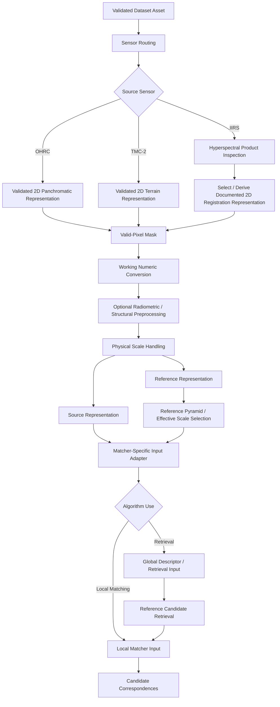
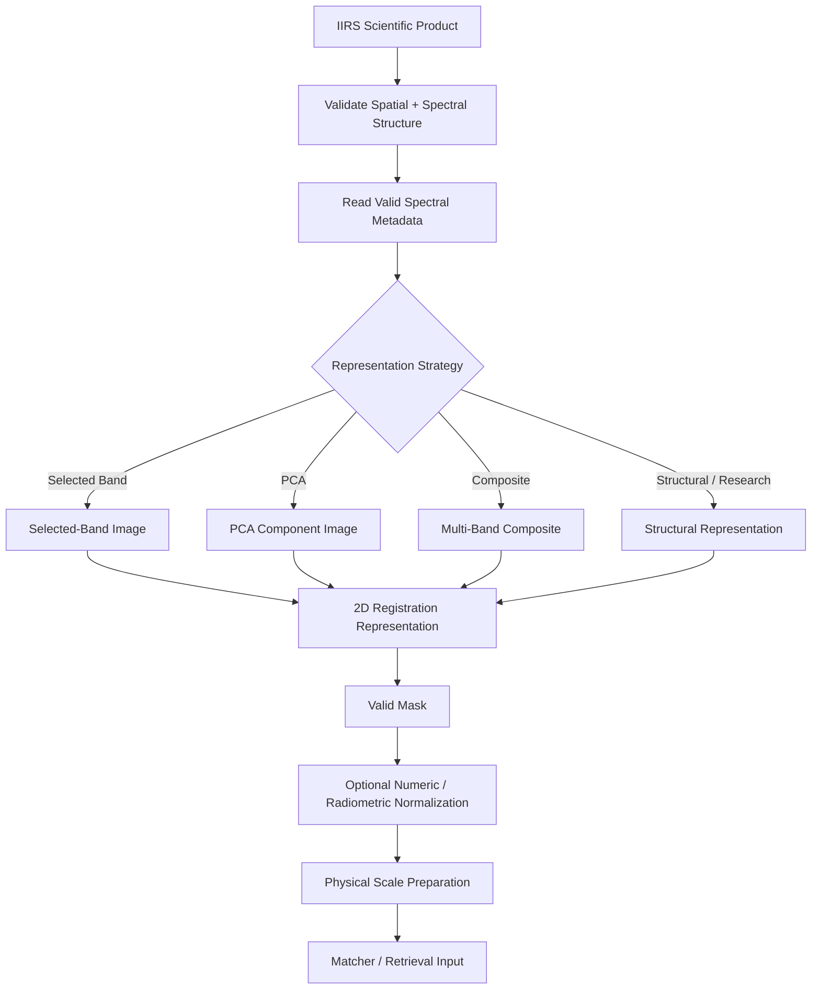

# Algorithm Preprocessing

ChandraMap performs algorithmic preprocessing after a scientific asset has already been identified, validated, associated with its sensor and metadata, and made available to the algorithm pipeline.

Preprocessing exists because OHRC, TMC-2, IIRS, LRO NAC, and LRO WAC do not provide directly interchangeable algorithm inputs. They differ in spatial sampling, modality, spectral response, dynamic range, illumination, valid-data regions, physical scale, and representation.

The purpose of preprocessing is therefore not to make every sensor look artificially identical. Its purpose is to expose the information actually measured by each sensor in a form that retrieval and correspondence algorithms can compare responsibly.

> **Preprocessing should improve comparability while preserving the information actually measured by each sensor.**

A second principle is equally important:

> **Compare information, not pixel count.**

Two images with identical width and height may still represent completely different:

- lunar ground extents;
- GSDs;
- spatial-frequency content;
- terrain detail;
- modalities;
- physical information.

Algorithm preprocessing must therefore reason about the scientific meaning of the input rather than only its array dimensions.

At a high level:

```text
Validated Dataset Asset
        ↓
Sensor Routing
        ↓
Algorithm Preprocessing
        ↓
Retrieval and/or Local Matching
        ↓
Geometric Verification
        ↓
Transformation / Registration
        ↓
Independent Evaluation
```

Preprocessing may produce:

- a matcher-ready 2D image;
- a normalized working array;
- an IIRS-derived registration representation;
- a structural representation;
- a valid-pixel mask;
- effective-scale information;
- preprocessing provenance;
- model-specific numeric input.

It does **not** determine whether a candidate correspondence is correct.

> **Preprocessing is successful only when it makes valid information easier to compare without inventing new information.**

---

## 1. Role of Preprocessing in ChandraMap

Preprocessing sits between sensor-aware routing and the algorithms that perform retrieval or local correspondence.

Conceptually:

```text
Prepared Scientific Asset
        ↓
Sensor Routing
        ↓
Algorithm Preprocessing
        ↓
┌──────────────────────────────┐
│ Global / Regional Retrieval │
│              or              │
│ Local Image Matching         │
└──────────────────────────────┘
        ↓
Candidate Correspondences
```

The preprocessing stage receives an asset whose scientific identity is already known.

That means preprocessing should already know, directly or through associated metadata:

- parent asset;
- mission;
- sensor;
- product/representation type;
- GSD where available;
- valid-data information;
- projection status where relevant;
- representation provenance.

The stage then performs only the algorithm-facing transformations required by the selected route.

---

## 2. Dataset Preparation vs Algorithm Preprocessing

This distinction is fundamental.

[`../datasets/dataset-preparation.md`](../datasets/dataset-preparation.md) concerns scientific product preparation and dataset reproducibility.

This file concerns runtime or experiment-level preparation for correspondence algorithms.

| Task                                             |                      Dataset Preparation |             Algorithm Preprocessing |
| ------------------------------------------------ | ---------------------------------------: | ----------------------------------: |
| Obtain mission product                           |                                      Yes |                                  No |
| Preserve original product                        |                                      Yes |                                  No |
| Verify provider product identity                 |                                      Yes |                                  No |
| Validate downloaded files                        |                                      Yes |                                  No |
| Extract authoritative metadata                   |                                      Yes |                                  No |
| Perform product-level calibration where required |                                      Yes |                                  No |
| Map-project scientific products where required   |                                      Yes |                                  No |
| Freeze benchmark assets                          |                                      Yes |                                  No |
| Apply valid-region mask to matcher input         |                       No / prepares mask |                                 Yes |
| Convert working numeric type                     |         No / may prepare canonical asset |                                 Yes |
| Normalize matcher input                          |                                       No |                            Optional |
| Apply optional denoising                         |                                       No |                            Optional |
| Generate runtime structural representation       | No / may persist reusable representation |                                 Yes |
| Generate IIRS 2D matcher representation          |          May prepare reusable derivative | Yes when required by selected route |
| Select effective reference scale                 |                                       No |                                 Yes |
| Prepare matcher/model-specific tensor or image   |                                       No |                                 Yes |
| Detect features                                  |                                       No |                                  No |
| Match features                                   |                                       No |                                  No |
| Run RANSAC                                       |                                       No |                                  No |
| Compute final RMSE                               |                                       No |                                  No |

The same conceptual operation can sometimes appear at both layers for different reasons.

For example, an IIRS PCA representation could be prepared offline as a reusable dataset derivative or produced on demand by an experiment. The important distinction is whether the operation is creating a persistent benchmark asset or adapting a validated asset for a specific algorithm run.

---

## 3. Preprocessing Responsibilities

The preprocessing layer should primarily answer:

1. Which pixels are valid for algorithm use?
2. Which numeric representation does the matcher require?
3. Is radiometric normalization useful for this configured experiment?
4. Is optional denoising enabled?
5. Does the sensor require a derived representation?
6. Is a structural representation being tested?
7. Which physical reference scale should be compared?
8. Does the selected model require resizing, padding, or channel conversion?
9. Which preprocessing operations occurred, and in what order?
10. Can the resulting representation be reproduced?

It should not answer:

- which correspondence is correct;
- which RANSAC inliers are true;
- which transformation is final;
- whether the registration meets benchmark accuracy.

Those questions belong to later stages.

---

## 4. Preprocessing Philosophy

ChandraMap preprocessing should be:

### Minimal

Avoid transformations that are not required by the selected algorithm or justified by controlled experiments.

### Sensor-Aware

OHRC, TMC-2, and IIRS should not automatically receive the same transformations.

### Physically Meaningful

Preprocessing must preserve the distinction between:

- physical spatial resolution;
- resampled array resolution.

### Reproducible

The same input and preprocessing configuration should produce the same logical output where practical.

### Measurable

A transformation should be retained because it improves measured downstream performance, not merely because the image appears visually cleaner.

### Provenance-Preserving

Every derived representation should remain linked to its parent scientific asset.

### Configuration-Driven

Scientific choices should not be hidden in ad-hoc manual editing or undocumented code paths.

### Conservative

Destructive transformations should be avoided unless there is evidence that they improve the target task.

A useful default philosophy is:

```text
start with minimal processing
        ↓
establish baseline
        ↓
add one transformation
        ↓
measure downstream effect
        ↓
keep only if justified
```

---

# Valid Data Handling

## 5. Valid-Pixel Mask

A valid-pixel mask distinguishes usable lunar measurements from pixels that should not influence preprocessing or matching.

Possible invalid regions include:

- NoData values;
- missing detector data;
- projected image borders;
- masked calibration regions;
- invalid mosaic boundaries;
- pixels excluded by product-specific quality information.

The mask should normally be applied before operations that depend on image statistics.

Examples include:

- intensity normalization;
- histogram calculation;
- feature detection;
- structural representation generation;
- descriptor extraction;
- correspondence generation.

---

## 6. Why Masks Matter

Without masking, invalid regions may produce artificial evidence.

For example:

```text
valid lunar image
│
├── terrain
├── terrain
└── hard NoData boundary
```

A feature detector may interpret the NoData boundary as:

- a strong edge;
- a corner;
- a stable feature.

That can create false keypoints and false correspondences.

Masking reduces this failure mode.

---

## 7. NoData Is Not Lunar Terrain

NoData pixels are not measurements of the lunar surface.

Therefore they should not automatically participate in:

- min/max statistics;
- mean/std statistics;
- histogram equalization;
- contrast estimation;
- feature extraction;
- descriptor computation.

For example:

```text
NoData value = 0
```

does not imply:

```text
lunar intensity = physically black terrain
```

unless the product definition explicitly establishes that interpretation.

---

## 8. Mask Semantics

The meaning of mask values should be explicit.

A repository might choose a convention such as:

```text
1 = valid
0 = invalid
```

but preprocessing must follow the actual project/data contract rather than assuming one.

A mask should remain associated with:

- the image asset;
- image dimensions;
- representation;
- coordinate grid;
- preprocessing version where relevant.

---

## 9. Mask Propagation

If preprocessing changes image geometry, the mask must change in exactly the corresponding way.

Operations that may require mask propagation include:

- cropping;
- resizing;
- padding;
- pyramid generation;
- warping;
- model-input transformation.

Correct:

```text
image
+
mask
   ↓ same geometry operation
processed image
+
processed mask
```

Incorrect:

```text
image → resize
mask  → unchanged
```

A mask that no longer aligns with the image can invalidate all later feature and evaluation logic.

---

## 10. Mask Resampling

Masks often represent categorical validity rather than continuous intensity.

Their resampling policy should therefore preserve semantics.

Do not automatically apply the same interpolation used for imagery.

The exact mask-resampling strategy belongs in implementation/configuration documentation.

The important principle is:

> **A mask transformation must preserve validity meaning, not create fractional scientific validity accidentally.**

---

## 11. Border Artifacts

Algorithmic preprocessing can introduce artificial borders through:

- cropping;
- padding;
- reprojection;
- interpolation;
- resampling;
- masked regions;
- image mosaics.

These borders can become strong detector responses.

Potential handling includes:

- mask propagation;
- excluding invalid padded regions;
- excluding known interpolation borders;
- preserving valid-region metadata.

Do not invent one universal fixed border width.

---

# Numeric Representation

## 12. Numeric Type Conversion

Scientific rasters may use different numeric representations.

Possible examples include:

- integer digital numbers;
- calibrated integer values;
- floating-point values;
- high-bit-depth scientific rasters.

A matcher may instead require:

- floating-point arrays;
- normalized values;
- 8-bit imagery;
- model-specific tensors.

A conceptual conversion may be:

```text
scientific raster
        ↓
working floating-point representation
        ↓
matcher-specific normalized input
```

Any conversion that can affect information should be explicit and reproducible.

---

## 13. Preserve Scientific Dynamic Range

Do not silently convert all scientific data into a low-dynamic-range image simply because common computer-vision examples use 8-bit imagery.

Destructive conversion can:

- clip subtle contrast;
- compress useful terrain information;
- alter descriptor behavior;
- affect gradients;
- affect cross-sensor comparison.

The canonical scientific asset should remain available independently of matcher input.

---

## 14. 8-Bit Conversion

Some classical or third-party computer-vision paths may use 8-bit input.

An 8-bit derivative may therefore be legitimate.

Potential purposes include:

- SIFT-compatible working images;
- visualization;
- specific software interfaces.

However, the conversion should record where relevant:

- source numeric type;
- scaling method;
- clipping behavior;
- output range;
- preprocessing version.

Do not replace the scientific parent raster with the 8-bit derivative.

---

## 15. Dynamic-Range Differences

Different sensors and processing products may have different numeric scales.

Preprocessing may need to create a comparable working range.

Candidate approaches include:

- min/max normalization;
- robust scaling;
- percentile-based scaling;
- standardization;
- another configured transform.

No universal normalization range or percentile is prescribed here.

The correct choice should be:

- configuration-driven;
- validated;
- benchmarked.

---

## 16. Clipping

Numeric normalization may clip extreme values.

Clipping can be useful when a small number of outliers dominate the dynamic range, but it can also remove scientifically meaningful bright or dark structure.

If clipping is used, preserve:

- method;
- thresholds or configuration;
- source representation;
- output representation.

Do not hide clipping inside an undocumented conversion.

---

# Radiometric Preprocessing

## 17. Intensity Normalization

Intensity normalization can reduce differences in:

- numerical range;
- mean brightness;
- global contrast.

It may help an algorithm compare images whose radiometric scales differ even when they contain corresponding structure.

However:

> **Intensity normalization changes numerical appearance; it does not recreate missing physical illumination.**

---

## 18. Global Contrast Normalization

Candidate global operations may include:

- linear scaling;
- robust range scaling;
- histogram-based normalization.

Potential benefits:

- reduce global brightness-range mismatch;
- improve usable descriptor contrast;
- standardize matcher input.

Potential drawbacks:

- emphasize noise;
- clip terrain extremes;
- distort meaningful radiometric differences.

These operations should remain optional until measured.

---

## 19. Local Contrast Normalization

Local contrast methods can enhance small-scale transitions such as:

- crater rims;
- ridges;
- local terrain boundaries.

They may also:

- amplify noise;
- amplify interpolation artifacts;
- alter gradient distributions;
- exaggerate shadow edges.

Therefore local normalization should be evaluated as an algorithmic hypothesis rather than treated as a universal preprocessing rule.

---

## 20. Histogram Equalization

Histogram equalization may increase contrast in some images.

Possible benefits include:

- making weak local intensity differences easier for some feature detectors to use;
- expanding a compressed numeric range.

Possible risks include:

- excessive contrast amplification;
- changing feature response distributions;
- emphasizing shadow boundaries;
- reducing comparability with the reference.

Histogram equalization should be optional and benchmarked.

It should never be described as a general solution to lunar Sun-angle differences.

---

## 21. CLAHE and Related Local Histogram Methods

Local histogram methods such as CLAHE may be investigated as candidate preprocessing operations.

Potential motivations include:

- improving local terrain contrast;
- limiting some forms of global over-amplification.

However, parameter choices can materially change the output.

This document intentionally does not prescribe:

- tile dimensions;
- clip limits;
- histogram parameters.

Any such settings should live in reproducible experiment configuration.

---

# Illumination and Sun-Angle Differences

## 22. Sun-Angle Variation Is Geometric

Lunar illumination changes are not merely changes in brightness.

Different Sun geometry can change:

- shadow direction;
- shadow length;
- which crater wall is illuminated;
- which crater wall is dark;
- ridge appearance;
- slope visibility;
- terrain texture;
- local occlusion.

For example:

```text
Observation A
Sun from left
→ right-facing terrain may be shadowed

Observation B
Sun from right
→ left-facing terrain may be shadowed
```

A histogram operation cannot physically move those shadows.

> **Brightness normalization is not Sun-angle correction.**

---

## 23. What Radiometric Normalization Can Do

Radiometric preprocessing may reduce:

- global brightness differences;
- contrast-range differences;
- numeric-scale differences;
- some sensor-dependent intensity-range mismatch.

This can help a matcher focus more on structure.

---

## 24. What Radiometric Normalization Cannot Do

It cannot:

- move shadows;
- reconstruct terrain hidden by shadow;
- reproduce a missing illuminated slope;
- reverse viewing geometry;
- create terrain information missing from the source;
- guarantee correspondence.

This limitation should remain explicit in algorithm documentation and benchmark interpretation.

---

## 25. Structural Routes for Illumination Differences

Possible research representations include:

- gradients;
- edge maps;
- phase/structural representations;
- crater-rim emphasis;
- ridge-oriented structure;
- shadow-aware masks.

These may reduce dependence on raw absolute intensity.

They do not automatically provide illumination invariance.

Each should be tested experimentally.

---

# Denoising

## 26. Denoising Is Optional

Noise can interfere with:

- gradient estimation;
- keypoint detection;
- descriptor computation;
- learned matcher inputs.

However, lunar terrain itself contains real high-frequency structure.

Denoising can therefore remove useful information while reducing noise.

> **Do not assume denoising improves registration. Measure it.**

---

## 27. Denoising Ablation

A simple controlled experiment is:

```text
same source/reference pair
same matcher
same geometry
same truth

A. no denoising
B. configured light denoising
```

Compare:

- candidate matches;
- inliers;
- inlier ratio;
- coverage;
- check-point RMSE;
- runtime.

This is stronger evidence than judging which image looks smoother.

---

## 28. OHRC Denoising Caution

OHRC contains fine lunar detail.

Aggressive smoothing can erase:

- small crater rims;
- fine ridges;
- local terrain corners;
- high-frequency morphology.

OHRC defaults should therefore remain conservative.

If denoising is studied, compare it against an unfiltered baseline.

---

## 29. TMC-2 Denoising Caution

TMC-2 preprocessing should preserve medium-scale terrain structure.

Important structures may include:

- crater boundaries;
- ridge systems;
- morphological transitions.

Excessive smoothing can reduce the very structural information required for registration.

---

## 30. IIRS Denoising Caution

IIRS may contain both spatial and spectral noise considerations.

Potential denoising could theoretically be:

- spatial;
- spectral;
- combined.

No specific hyperspectral denoising method is mandated here.

If denoising is used, record:

- whether it is spatial or spectral;
- operation order;
- configuration;
- representation produced.

The full scientific IIRS product must remain preserved separately.

---

# Sensor-Specific Preprocessing

## 31. Why One Generic Pipeline Is Wrong

The following design is scientifically weak:

```text
Any Lunar Input
      ↓
Convert to Grayscale
      ↓
Resize
      ↓
Normalize
      ↓
Same Matcher
```

It assumes all sensor differences can be reduced to ordinary image-format differences.

That is not true.

OHRC, TMC-2, and IIRS differ in:

- spatial sampling;
- modality;
- physical information content;
- spectral structure;
- likely matcher representation.

Sensor-specific preprocessing should happen before generic matcher adaptation.

---

# OHRC Preprocessing

## 32. OHRC Context

OHRC is the Chandrayaan-2 **Orbiter High Resolution Camera**.

Current project documentation commonly uses approximately:

> **~0.25–0.32 m/pixel**

depending on product/documentation.

Actual product metadata remains authoritative.

Typical preprocessing priority:

> **Preserve fine lunar terrain information.**

---

## 33. OHRC Preprocessing Goals

OHRC preprocessing should aim to:

- preserve fine terrain morphology;
- exclude invalid regions;
- preserve dynamic range until matcher conversion;
- apply radiometric normalization only when justified;
- avoid unnecessary interpolation;
- prepare a stable 2D matcher representation;
- compare against a physically meaningful reference scale.

---

## 34. OHRC Conceptual Flow

```text
Prepared OHRC Raster
        ↓
Valid-Pixel Mask
        ↓
Working Numeric Conversion
        ↓
Optional Intensity / Contrast Normalization
        ↓
Optional Structural Representation
        ↓
Physical Reference-Scale Selection
        ↓
Matcher-Specific Input Conversion
```

Not every branch is required in every experiment.

---

## 35. OHRC Operations to Avoid by Default

Avoid unnecessary:

- strong blur;
- repeated resizing;
- destructive quantization;
- aggressive contrast enhancement;
- repeated image-format conversion.

These may reduce useful fine-detail information.

If an operation is included, it should have a measurable reason.

---

# TMC-2 Preprocessing

## 36. TMC-2 Context

TMC-2 is the Chandrayaan-2 **Terrain Mapping Camera-2**.

Current project planning commonly uses approximately:

> **~5 m/pixel**

with actual product metadata taking priority.

TMC-2 often provides medium-scale terrain structure rather than OHRC-level fine morphology.

---

## 37. TMC-2 Preprocessing Goals

TMC-2 preprocessing should prioritize:

- crater morphology;
- ridge structure;
- terrain transitions;
- medium-scale structural information;
- physical compatibility with the chosen reference level.

---

## 38. TMC-2 Conceptual Flow

```text
Prepared TMC-2 Raster
        ↓
Valid-Pixel Mask
        ↓
Working Numeric Conversion
        ↓
Optional Intensity / Structural Normalization
        ↓
GSD-Aware Reference Selection
        ↓
Optional NAC Pyramid Level
        ↓
Matcher-Specific Input
```

---

## 39. TMC-2 Is Not Resized OHRC

Although both are panchromatic instruments, TMC-2 should not be modeled as simply:

```text
OHRC
→ downsample
→ TMC-2
```

Their actual:

- instrument characteristics;
- product formation;
- acquisition conditions;
- available terrain information;

are distinct.

Therefore one sensor's optimal preprocessing should not be assumed to transfer directly to the other.

---

# IIRS Preprocessing

## 40. IIRS Requires Representation Preprocessing

IIRS is fundamentally different from the ordinary 2D panchromatic paths.

IIRS is the Chandrayaan-2 **Imaging Infrared Spectrometer**.

Current project-level approximations include:

- ~80 m/pixel spatial scale;
- ~0.8–5.0 µm spectral range;
- roughly ~250–256 bands depending on product/documentation.

Actual product metadata controls interpretation.

> **A full IIRS hyperspectral product should not be passed blindly into an ordinary 2D matcher.**

---

## 41. IIRS Conceptual Flow

```text
IIRS Hyperspectral Product
        ↓
Validate Spatial / Spectral Structure
        ↓
Identify Valid Spectral Information
        ↓
Select Representation Strategy
        ↓
Generate 2D Registration Representation
        ↓
Valid-Pixel Mask
        ↓
Optional Numeric / Radiometric Normalization
        ↓
Physical Scale Preparation
        ↓
Matcher-Specific Input
```

---

## 42. Preserve the Full IIRS Product

Never replace the scientific IIRS product with:

- one band;
- PCA image;
- composite;
- gradient image;
- PNG preview;
- matcher-specific tensor.

Correct:

```text
IIRS Cube
   ├── preserved scientific source
   ├── selected-band derivative
   ├── PCA derivative
   └── structural derivative
```

Incorrect:

```text
IIRS Cube
   ↓
PCA Image
   ↓
delete original
```

Derived representations are algorithmic assets.

They are not substitutes for the complete hyperspectral product.

---

## 43. Selected-Band Representation

A single valid band provides one simple 2D registration representation.

Conceptually:

```text
IIRS Cube
    ↓
Selected Documented Band
    ↓
2D Registration Image
```

Advantages:

- straightforward;
- easy to reproduce;
- retains an actually observed spectral band.

Limitations:

- one band may not contain the most useful terrain structure;
- radiometric appearance may differ strongly from panchromatic references;
- optimal band choice may depend on product and experiment.

Do not prescribe one universal band without evidence.

---

## 44. PCA Representation

PCA can reduce the spectral dimension into component images.

Conceptually:

```text
Validated Spectral Bands
        ↓
Optional Spectral Normalization
        ↓
PCA
        ↓
Component Images
        ↓
Selected Registration Component
```

PCA may expose variance patterns useful for structural comparison.

However:

> **The first PCA component is not automatically the best registration representation.**

A component that explains the most spectral variance is not necessarily the component that provides the most stable cross-modal lunar correspondence.

This must be benchmarked.

---

## 45. Multi-Band Composite

A registration representation may combine multiple bands.

Conceptually:

```text
Bands B1 + B2 + B3 + ...
        ↓
Configured Combination
        ↓
2D Composite
```

If used, record:

- selected bands;
- weighting/combination method;
- normalization;
- output representation ID;
- preprocessing version.

Do not invent one universal composite.

---

## 46. Structural IIRS Representation

Research routes may derive structural information such as:

- spatial gradients;
- edges;
- morphology-focused maps;
- other spatial features;
- future learned spectral-spatial representations.

These may reduce dependence on direct spectral intensity.

They should remain experimental until validated.

---

## 47. IIRS Representation Provenance

Every IIRS-derived representation should remain traceable to:

- parent product;
- representation ID;
- representation type;
- selected bands/components;
- operation sequence;
- configuration;
- output dimensions;
- spatial grid;
- effective scale;
- preprocessing version.

A file called:

```text
iirs_final.png
```

with no representation provenance is not suitable for a reproducible benchmark.

---

## 48. IIRS Representation Ablation

A controlled representation study should hold constant:

- parent IIRS product;
- reference asset;
- reference scale;
- matcher;
- matcher configuration;
- geometric verification;
- truth/check points.

Then vary only:

```text
selected band
vs.
PCA component
vs.
composite
vs.
structural representation
```

This isolates the representation's contribution.

---

# Reference-Side Preprocessing

## 49. Reference Images Also Require Preprocessing

Preprocessing does not apply only to Chandrayaan source imagery.

LRO reference data may require:

- valid-pixel handling;
- numeric conversion;
- reference-scale selection;
- normalization;
- structural representation;
- model input adaptation.

The canonical scientific reference remains separate from algorithm-specific derivatives.

---

## 50. LRO NAC Preprocessing

LRO NAC serves primarily as a fine/local reference family.

Current project planning often treats NAC imagery as approximately:

> **~0.5–2 m/pixel**

depending on product/acquisition geometry.

Do not hard-code one value.

Conceptual NAC preprocessing:

```text
Prepared NAC Reference
        ↓
Valid Mask
        ↓
Reference Pyramid / Scale Selection
        ↓
Optional Numeric / Radiometric Normalization
        ↓
Matcher-Specific Representation
```

---

## 51. LRO WAC Preprocessing

LRO WAC commonly serves broad/global/coarse roles.

Its GSD and product properties are product/mode/processing dependent.

Conceptual WAC preprocessing:

```text
Prepared WAC Product / Mosaic
        ↓
Valid Mask
        ↓
Context / Scale Selection
        ↓
Optional Normalization
        ↓
Retrieval or Coarse-Matching Representation
```

WAC should not be interpreted simply as:

> blurred NAC.

---

# Physical Scale Preprocessing

## 52. Physical Scale Is a Core Preprocessing Concern

The preprocessing pipeline should compare:

```text
source GSD
+
reference effective GSD
```

rather than:

```text
source image dimensions
+
reference image dimensions
```

because physical sampling determines what terrain structure each sensor could actually observe.

---

## 53. Compare Information, Not Pixel Count

Suppose two arrays are both:

```text
1024 × 1024
```

One may represent:

- a small high-resolution lunar region;

while the other represents:

- a much larger coarse-resolution region.

Equal dimensions do not imply:

- equal GSD;
- equal ground area;
- equal feature scale;
- equal information.

> **Pixel count is a software property. GSD is a physical observation property.**

---

## 54. Wrong Scale Strategy

A scientifically weak approach is:

```text
source width = reference width
        ↓
therefore scales match
```

A stronger approach is:

```text
source GSD
        +
reference GSD / pyramid levels
        ↓
choose physically useful comparison scale
```

---

## 55. Reference Downsampling

When the reference contains much finer information than the source, downsampling the reference can improve physical comparability.

This is especially important for:

```text
TMC-2 ↔ NAC
```

and:

```text
IIRS ↔ NAC
```

Conceptually:

```text
Native Fine NAC
      ↓
Downsample / Pyramid
      ↓
Reference structures observable by source
```

This can reduce distracting fine detail that the source sensor never measured.

---

## 56. Why Not Just Upsample the Source?

Upsampling may increase array dimensions.

It does not increase:

- spatial resolution;
- physical surface information;
- terrain detail;
- measured spatial frequencies.

For example:

```text
IIRS ~80 m/px
      ↓
resize 16× larger
      ↓
still contains ~80 m/px source information
```

The new pixels are interpolated samples.

They are not new lunar measurements.

---

## 57. Reference Pyramid

A reference pyramid stores or produces multiple effective scales of the same reference.

Conceptually:

```text
Level 0
fine/original reference
      ↓
Level 1
coarser
      ↓
Level 2
coarser
      ↓
...
```

Each level should retain:

- parent reference;
- level identity;
- scale factor;
- effective GSD;
- dimensions;
- resampling provenance.

---

## 58. Pyramid-Level Selection

Possible strategies include:

- metadata-driven nearest scale;
- configured scale range;
- benchmark-selected level;
- multi-level search;
- coarse-to-fine processing.

No universal formula is defined here.

The correct policy is an empirical research question.

---

## 59. Scale Compatibility Is Not Exact Equality

A source and reference do not require identical GSD to be matchable.

The objective is to avoid comparing:

```text
very coarse source
```

against:

```text
extremely fine reference
```

without acknowledging the information gap.

The matcher may tolerate some scale difference.

How much depends on:

- sensor pair;
- matcher;
- representation;
- terrain;
- illumination.

---

## 60. Coarse-to-Fine Matching

A multi-scale preprocessing route may be:

```text
coarse compatible reference level
        ↓
initial correspondence
        ↓
geometric verification
        ↓
finer compatible reference level
        ↓
local refinement
```

Do not automatically continue to the finest reference level.

Refinement should stop when the source no longer contains corresponding physical detail.

---

# Resampling

## 61. Resampling Is Not Resolution Enhancement

Resampling changes:

- grid spacing;
- array dimensions;
- interpolation locations.

It does not create new sensor measurements.

> **Resampling can make arrays computationally compatible; it cannot increase the physical information recorded by the sensor.**

---

## 62. Interpolation

Possible interpolation families include standard:

- nearest;
- linear;
- cubic;
- area-based;
- other documented resampling methods.

This document does not prescribe one universal method.

The chosen method should be recorded when it materially affects benchmark inputs.

---

## 63. Repeated Resampling

Repeated interpolation can accumulate artifacts.

Avoid unnecessarily doing:

```text
original
→ resize A
→ resize B
→ resize C
```

when:

```text
original
→ target representation
```

can be derived directly.

Prefer stable parent assets where practical.

---

## 64. Resampling and Masks

If an image is resampled:

```text
image
→ new geometry
```

its mask must be transformed to exactly the same geometry.

Do not allow:

- dimension mismatch;
- shifted masks;
- stale crop bounds.

---

# Cropping

## 65. Crop Preprocessing

Cropping may support:

- known-overlap experiments;
- reference-candidate extraction;
- memory management;
- neural matcher limits;
- visualization.

Cropping should retain:

- parent asset ID;
- crop bounds;
- original coordinate relationship;
- geographic relationship where available.

---

## 66. Crop Coordinate Mapping

A local coordinate:

```text
(x_crop, y_crop)
```

must remain convertible to its parent coordinate system.

For a simple non-resampled crop:

```text
x_parent = x_crop + x_offset
y_parent = y_crop + y_offset
```

If additional transformations occur, preserve the actual mapping.

Do not assume a simple offset after:

- scaling;
- warping;
- reprojection;
- rotation.

---

## 67. Ground Truth and Crops

If ground-truth points are defined in parent coordinates while matching occurs on crops, preprocessing must preserve the mapping.

Otherwise:

- fit points;
- check points;
- RMSE;

can become invalid even when the matcher itself is correct.

---

# Structural Representations

## 68. Edge Representation

Edge maps emphasize local boundaries rather than raw absolute intensity.

Potential benefit:

- reduce dependence on some global radiometric differences.

Potential problems:

- shadow boundaries may dominate;
- noise may produce false edges;
- fine-scale differences may be exaggerated.

Edges should therefore be treated as an experimental representation.

---

## 69. Gradient Representation

Gradients represent local intensity change.

They may highlight:

- crater rims;
- ridges;
- terrain transitions.

However, gradient direction and magnitude can also change significantly with:

- Sun angle;
- shadows;
- modality.

A gradient representation is not automatically illumination invariant.

---

## 70. Phase / Structure Representations

Phase-oriented or other structure-focused representations may be relevant to future remote-sensing experiments.

They should be introduced only with:

- clear mathematical definition;
- reproducible configuration;
- benchmark evaluation.

Do not treat them as implemented or superior unless repository evidence supports that claim.

---

## 71. Crater and Ridge Structural Cues

Large-scale lunar structures may sometimes remain more stable across:

- resolution changes;
- sensor modality;
- radiometric differences.

Potential cues include:

- crater-rim geometry;
- ridge orientation;
- terrain junctions.

However, preprocessing does not need to perform full crater detection unless a specific research path explicitly requires it.

---

# Shadow Handling

## 72. Shadow Regions

Shadows can:

- remove visible terrain texture;
- create strong high-contrast boundaries;
- hide crater interiors;
- alter ridge appearance;
- change position with illumination geometry.

Therefore shadow-related features can be both:

- useful structural evidence;
- a source of false correspondence.

---

## 73. Shadow Masking

A future or experimental route may attempt to detect heavily shadowed regions and reduce their influence.

Potential benefits:

- prevent descriptors from focusing on unstable shadow interiors;
- reduce extreme brightness differences.

Potential drawbacks:

- remove useful crater geometry;
- reduce matchable area;
- introduce masking boundaries.

Shadow masking should be benchmarked.

---

## 74. Shadows Are Not Noise

Do not treat shadows simply as random noise to be blurred away.

They are physical effects caused by:

- illumination;
- terrain orientation;
- relief.

A shadow may encode useful shape information even though its location and geometry change between observations.

---

# Matcher-Specific Preprocessing

## 75. Matcher Input Adaptation

Different algorithms may require different numerical interfaces.

Examples include:

- grayscale input;
- floating-point range;
- fixed number of channels;
- maximum dimensions;
- padding;
- model-specific normalization.

These requirements should be handled in a controlled matcher-input adapter.

They should remain distinct from sensor/scientific preprocessing.

---

## 76. Classical Matcher Input

Classical methods such as SIFT typically require a suitable 2D image representation.

Conceptually:

```text
scientific representation
        ↓
valid mask
        ↓
working numeric conversion
        ↓
SIFT-compatible input
```

The conversion should preserve as much useful terrain information as practical.

---

## 77. Learned Matcher Input

Learned feature extractors or matchers may require:

- floating-point values;
- specific channel count;
- resized inputs;
- padding;
- model-specific normalization.

These are computational interface constraints.

They do not automatically correspond to physical-scale preparation.

---

## 78. Model Input Resize vs Physical Scale Matching

This distinction is critical.

### Model Input Resize

Purpose:

> Make an image satisfy a neural network or software interface.

Examples:

- maximum image dimension;
- required shape;
- computational-memory constraint.

### Physical Scale Matching

Purpose:

> Make source/reference terrain information comparable in terms of GSD and observable structure.

Conceptually:

```text
Physical Scale Preparation
→ scientific comparability
```

while:

```text
Model Input Resize
→ computational compatibility
```

These are not interchangeable.

A neural model seeing two similarly sized tensors does **not** prove the underlying lunar GSDs are comparable.

---

## 79. ALIKED + LightGlue Input

Conceptually:

```text
Prepared 2D Source / Reference
        ↓
Model-Compatible Numeric Conversion
        ↓
ALIKED
        ↓
Sparse Features
        ↓
LightGlue
        ↓
Candidate Correspondences
```

ALIKED and LightGlue do not automatically remove:

- sensor differences;
- illumination differences;
- physical-scale differences.

Their performance must be measured on lunar data.

---

## 80. LoFTR Input

Conceptually:

```text
Prepared Source
        +
Prepared Reference
        ↓
Model-Compatible LoFTR Input
        ↓
LoFTR
        ↓
Candidate Correspondences
        ↓
Geometric Verification
```

Any resizing required by LoFTR or another implementation should not be confused with GSD matching.

---

## 81. Remote-Sensing Matcher Input

Remote-sensing-oriented methods such as RIFT or CFOG-style approaches may require their own representations or preprocessing assumptions.

If such methods are implemented, those requirements should be documented separately.

They should not be forced into the default SIFT baseline preprocessing route.

---

# Retrieval Preprocessing

## 82. Retrieval and Local Matching May Use Different Representations

Global retrieval and local registration solve different problems.

Therefore preprocessing may branch.

Conceptually:

```text
Prepared Source
      ↓
┌──────────────────────────┐
│ Retrieval Representation │
└──────────────────────────┘
      ↓
Global Descriptor
```

while:

```text
Prepared Source
      ↓
┌────────────────────────────┐
│ Local Matcher Representation│
└────────────────────────────┘
      ↓
Local Correspondence
```

These representations may be identical or different depending on architecture.

---

## 83. Retrieval Scale

Global retrieval may use:

- one reference scale;
- multiple reference scales;
- broad WAC references;
- NAC tiles;
- another configured representation.

The retrieval scale does not need to be identical to the final local-registration scale.

A coarse stage may identify a region before a finer representation is selected.

---

## 84. Global Descriptor Input

A global descriptor model may require:

- resizing;
- normalization;
- channel conversion;
- model-specific tensor construction.

Record these operations separately from:

- GSD-aware reference scaling;
- local matcher preprocessing.

This helps avoid confusing model constraints with scientific scale preparation.

---

# Preprocessing Order

## 85. Generic Preprocessing Order

A useful conceptual order is:

```text
Validated Scientific Asset
        ↓
Confirm Working Representation
        ↓
Load / Apply Valid Mask
        ↓
Sensor-Specific Representation
        ↓
Working Numeric Conversion
        ↓
Optional Radiometric / Structural Operations
        ↓
Physical Scale Preparation
        ↓
Matcher / Retrieval Model Input Adaptation
```

The exact order may differ by sensor and experiment.

Operation order must therefore be recorded when it changes the result.

---

## 86. OHRC Example Order

Conceptually:

```text
OHRC
  ↓
Valid Mask
  ↓
Working Numeric Conversion
  ↓
Optional Minimal Normalization
  ↓
Reference GSD / Scale Selection
  ↓
Matcher Input Adapter
```

OHRC should generally preserve fine structure.

---

## 87. TMC-2 Example Order

Conceptually:

```text
TMC-2
  ↓
Valid Mask
  ↓
Working Numeric Conversion
  ↓
Optional Structural / Contrast Preprocessing
  ↓
NAC/WAC Reference Scale Selection
  ↓
Matcher Input Adapter
```

---

## 88. IIRS Example Order

Conceptually:

```text
IIRS Scientific Product
      ↓
Validate Spectral Representation
      ↓
Select / Derive 2D Registration Representation
      ↓
Valid Mask
      ↓
Working Numeric Conversion
      ↓
Optional Normalization
      ↓
Physical Scale Preparation
      ↓
Matcher / Retrieval Input Adapter
```

---

# Preprocessing Configuration

## 89. Configuration-Driven Preprocessing

Scientific preprocessing choices should be controlled through reproducible configuration where practical.

Conceptual configuration categories include:

- normalization mode;
- denoising mode;
- structural representation;
- IIRS representation;
- scale strategy;
- pyramid-level strategy;
- model-input resizing;
- mask behavior;
- numeric-conversion policy.

This document intentionally does not define exact configuration filenames or keys.

---

## 90. Conservative Defaults

Default preprocessing should generally be:

- minimally destructive;
- understandable;
- reproducible;
- easy to benchmark.

A weak default is:

```text
denoise
→ equalize
→ sharpen
→ resize
→ gradients
→ more normalization
```

without evidence that each step helps.

A stronger baseline is:

```text
valid mask
→ minimal numeric adaptation
→ physical scale preparation
→ matcher
```

and then add operations through controlled experiments.

---

## 91. Per-Sensor Configuration

A future configuration may conceptually separate sensor policies.

Illustrative only:

```yaml
preprocessing:
  ohrc:
    normalization: "PLACEHOLDER"
    denoising: "PLACEHOLDER"

  tmc2:
    normalization: "PLACEHOLDER"
    scale_strategy: "PLACEHOLDER"

  iirs:
    representation: "PLACEHOLDER"
    normalization: "PLACEHOLDER"
```

This is a conceptual structure, not an implemented schema.

---

# Preprocessing Provenance

## 92. Preprocessing Record

A matcher-ready representation should ideally be able to answer:

- What parent asset produced it?
- Which sensor produced the parent?
- Which representation was used?
- Which operations were applied?
- In what order?
- Which parameters/configuration were used?
- Which physical-scale strategy was selected?
- Which preprocessing version generated it?

Without this context, two visually similar inputs may be scientifically different.

---

## 93. Operation Ordering Matters

Operations are not always commutative.

For example:

```text
denoise
→ gradient
```

can differ substantially from:

```text
gradient
→ denoise
```

Likewise:

```text
normalize
→ resize
```

may differ from:

```text
resize
→ normalize
```

when normalization statistics change.

Where operation order can affect scientific results, provenance should preserve it.

---

## 94. Preprocessing Identity

A future reproducibility system may identify a preprocessing configuration through:

- version;
- configuration ID;
- content hash;
- another deterministic identity.

This can help determine whether cached outputs are still valid.

No particular implementation is required by this document.

---

# Preprocessing Ablations

## 95. Why Ablations Matter

Preprocessing is one of the easiest places to introduce hidden algorithmic advantages.

For example, if:

```text
Method A
→ raw input
```

and:

```text
Method B
→ heavily tuned normalized input
```

then a comparison may measure both:

- matcher differences;
- preprocessing differences.

Ablations separate these effects.

---

## 96. Controlled Preprocessing Ablation

Example:

```text
same pair
same source/reference scale
same matcher
same RANSAC
same transform model
same truth
```

compare:

```text
A. minimally prepared intensity
B. normalized intensity
C. gradient representation
D. normalized + gradient representation
```

This isolates preprocessing impact.

---

## 97. IIRS Representation Ablation

Keep constant:

- IIRS parent product;
- reference;
- scale;
- matcher;
- geometry;
- evaluation.

Compare:

- selected band;
- PCA component;
- composite;
- structural representation.

This prevents matcher changes from being confused with spectral representation changes.

---

## 98. Scale Ablation

On the same pair, compare:

- native fine reference;
- one GSD-aware pyramid level;
- multi-scale strategy.

Then evaluate:

- match quality;
- inlier quality;
- coverage;
- independent error;
- runtime.

---

## 99. Illumination Preprocessing Ablation

Possible controlled comparison:

```text
raw intensity
vs.
global normalization
vs.
local normalization
vs.
structural representation
```

Use real illumination-stress pairs where possible.

Synthetic brightness changes should not be treated as full Sun-angle validation.

---

# Preprocessing Metrics

## 100. Evaluate Preprocessing Through Downstream Performance

Preprocessing should not be selected because:

> "the image looks better."

Use measurable downstream evidence.

Relevant metrics include:

- candidate match count;
- inlier count;
- inlier ratio;
- spatial coverage;
- independent check-point RMSE;
- source-pixel error;
- runtime;
- success/failure rate;
- retrieval Recall@K where preprocessing affects retrieval.

---

## 101. Candidate Match Count Is Not Enough

An operation may increase:

```text
candidate matches
```

while also increasing:

```text
false matches
```

For example:

```text
before preprocessing
100 candidate matches
```

versus:

```text
after preprocessing
500 candidate matches
```

does not prove improvement.

Geometric verification and independent evaluation are required.

---

## 102. Inlier Ratio

Inlier ratio may reveal whether preprocessing helps produce more geometrically consistent candidate correspondences.

However, interpret it alongside:

- inlier count;
- spatial coverage;
- check-point error.

A small cluster of consistent points can still produce weak image-wide registration.

---

## 103. Spatial Coverage

A useful preprocessing method should ideally preserve or improve correspondences across the usable overlap.

For example:

```text
100 inliers around one crater
```

may be less useful for a global transform than:

```text
60 inliers distributed across the scene
```

depending on geometry and point quality.

Coverage therefore matters alongside count.

---

## 104. Check-Point RMSE

Independent check-point RMSE is particularly important when comparing preprocessing strategies.

If one representation produces:

- more candidate matches;
- better fit residuals;

but worse independent check-point error, it may not actually improve registration.

---

## 105. Runtime Cost

Preprocessing itself may be computationally significant.

Possible timing categories include:

- IIRS representation generation;
- normalization;
- scale conversion;
- structural representation;
- matcher-input conversion.

Record runtime when comparing expensive preprocessing alternatives.

---

# Failure Modes

## 106. Common Preprocessing Failures

| Failure                                            | Possible Cause                                    | Recommended Response                                 |
| -------------------------------------------------- | ------------------------------------------------- | ---------------------------------------------------- |
| Image becomes almost uniform                       | Incorrect normalization/range                     | Reject output and inspect configuration              |
| Fine OHRC structures disappear                     | Excessive smoothing/downsampling                  | Reduce destructive preprocessing                     |
| False features appear along borders                | NoData/mask/projection boundary                   | Correct mask handling                                |
| IIRS representation is blank or invalid            | Wrong band/component or invalid spectral handling | Validate representation policy                       |
| Source/reference still show extreme scale mismatch | Incorrect reference level                         | Re-evaluate GSD-aware scale path                     |
| Neural matcher runs but geometry fails badly       | Model resize mistaken for physical-scale matching | Separate model adaptation from scale preparation     |
| Gradient image dominated by shadows                | Illumination effects amplified                    | Test alternative representation                      |
| Values heavily clipped                             | Incorrect numeric conversion                      | Preserve wider dynamic range or adjust configuration |
| Mask and image no longer align                     | Mask not propagated through resize/crop           | Recreate aligned mask                                |
| Crop points are shifted                            | Parent crop offset lost                           | Restore coordinate mapping                           |
| Repeated interpolation creates artifacts           | Multiple resampling stages                        | Regenerate from stable parent                        |
| IIRS representation cannot be reproduced           | Missing representation provenance                 | Reject from controlled benchmark                     |
| Reference level lacks physical metadata            | Broken pyramid provenance                         | Recover effective GSD/parent relationship            |

---

## 107. Fail Clearly

Preprocessing should stop or mark failure when it creates scientifically unusable output.

Examples include:

- invalid dimensions;
- empty image;
- empty valid region;
- unsupported NaN/Inf values;
- broken mask alignment;
- missing required parent provenance;
- invalid IIRS representation metadata;
- incompatible representation;
- missing required scale metadata for a scale-dependent route.

Do not silently continue into matching merely because an array exists.

---

# Preprocessing Quality Control

## 108. QC Checklist

| Check                                          | Expected                   |
| ---------------------------------------------- | -------------------------- |
| Parent asset resolves                          | Yes                        |
| Sensor identity known                          | Yes                        |
| Representation type known                      | Yes                        |
| Dimensions valid                               | Yes                        |
| Numeric type supported                         | Yes                        |
| NaN/Inf handled                                | Yes                        |
| Mask dimensions match image                    | Yes                        |
| NoData excluded from statistics where required | Yes                        |
| Dynamic range usable                           | Yes                        |
| Excessive clipping absent or documented        | Yes                        |
| Physical GSD preserved                         | Where available            |
| Effective reference scale known                | When scale routing is used |
| Crop mapping preserved                         | When cropped               |
| IIRS representation provenance complete        | For IIRS                   |
| Parent spectral product retained               | For IIRS                   |
| Matcher-specific requirements satisfied        | Yes                        |
| Preprocessing operation order recorded         | For reproducible runs      |
| Configuration/version recorded                 | Yes                        |

---

## 109. Visual QC

Visual inspection is useful for identifying:

- clipping;
- inversion;
- blank output;
- unexpected smoothing;
- excessive noise amplification;
- mask misalignment;
- incorrect IIRS band/component;
- wrong crop;
- border artifacts;
- unexpected resizing.

Visual inspection is a diagnostic.

It is not sufficient evidence that preprocessing improves registration.

---

## 110. Numeric QC

Possible numeric checks include:

- dimensions;
- numeric data type;
- minimum/maximum;
- mean/std where meaningful;
- percentile summary;
- valid-pixel count/fraction;
- NaN count;
- infinity count;
- band/component count;
- mask dimensions.

No universal numeric thresholds are prescribed here.

---

## 111. Scale QC

For scale preprocessing, verify:

- source GSD;
- reference native GSD;
- selected pyramid level;
- effective reference GSD;
- resampling provenance;
- output dimensions.

A mislabeled pyramid level can invalidate the entire comparison.

---

## 112. IIRS QC

For IIRS-derived representations, verify:

- parent product identity;
- spatial dimensions;
- spectral interpretation;
- representation type;
- selected bands/components;
- valid spectral data;
- output dimensions;
- output mask;
- GSD;
- representation version.

---

# Preprocessing Caching

## 113. Cacheable Outputs

Some computationally reusable preprocessing outputs may be cached.

Examples include:

- normalized working images;
- structural representations;
- matcher-ready images;
- IIRS 2D representations;
- model-input tensors where useful.

Caching can improve repeated benchmark runtime.

---

## 114. Cache Identity

A cache should depend on enough information to prevent reuse across incompatible configurations.

Conceptually:

```text
parent asset
+
preprocessing config
+
preprocessing version
=
cache identity
```

If any relevant input changes, stale output should not silently be reused.

---

## 115. Cache Is Not Source Truth

Cached preprocessing output is:

- derived;
- reproducible;
- potentially disposable.

It is not:

- a raw mission product;
- authoritative scientific truth;
- permanent benchmark truth by default.

A cache can be regenerated from the canonical asset and configuration.

---

# Versioned Preprocessing

## 116. V1 Preprocessing

V1 should remain minimal and interpretable.

A reasonable conceptual V1 path is:

```text
Validated Known-Overlap Pair
        ↓
Sensor-Specific Minimal Representation
        ↓
Valid-Pixel Handling
        ↓
Simple Matcher-Compatible Numeric Conversion
        ↓
GSD-Aware Reference Scale Selection
        ↓
SIFT Baseline Input
```

Optional simple normalization may be included when justified by the V1 specification.

V1 should avoid unnecessarily complex preprocessing chains.

---

## 117. V2 Preprocessing

Possible V2 additions include:

- stronger reference-pyramid use;
- controlled contrast normalization;
- structural representation experiments;
- illumination-preprocessing ablations;
- per-sensor policies;
- initial IIRS representation comparisons.

These should extend the V1 baseline rather than replace it with an opaque chain.

---

## 118. V3 Preprocessing

Possible V3 additions include:

- ALIKED + LightGlue model adapters;
- LoFTR input adapters;
- global-retrieval preprocessing;
- global-descriptor model inputs;
- WAC/NAC coarse-to-fine preprocessing;
- richer IIRS representation routing;
- configurable retrieval/local-matcher representations.

---

## 119. V4 Preprocessing

Possible research directions include:

- lunar-specific learned representations;
- spectral-spatial IIRS embeddings;
- shadow-aware preprocessing;
- multimodal remote-sensing representations;
- DEM-aware preprocessing;
- sensor-geometry-aware processing;
- advanced structural representations.

These are research directions.

Existing version/scope documentation remains authoritative.

---

# Full Preprocessing Flow

## 120. End-to-End Preprocessing Diagram



The diagram is conceptual.

Not every operation is required for every sensor, algorithm, or ChandraMap version.

---

## 121. IIRS Preprocessing Diagram



---

# Conceptual Preprocessing Record

## 122. Illustrative Metadata Example

The following is an **illustrative conceptual structure — not an implemented schema**:

```yaml
asset_id: "PLACEHOLDER_ASSET_ID"
parent_asset_id: "PLACEHOLDER_PARENT_ASSET_ID"

sensor: "TMC-2"

representation:
  type: "normalized_2d"

operations:
  - "valid_mask"
  - "intensity_normalization"

scale:
  strategy: "gsd_aware"

preprocessing:
  version: "PLACEHOLDER_VERSION"
```

A more complex IIRS representation may additionally need to identify:

- parent spectral product;
- representation method;
- bands/components;
- output grid.

The final repository schema should be defined by implementation/contracts documentation.

---

# Relationship to Sensor Routing

## 123. [`sensor-routing.md`](sensor-routing.md)

[`sensor-routing.md`](sensor-routing.md) decides:

> **Which path should this asset take?**

This file describes:

> **Which algorithm-facing transformations happen on that selected path?**

Conceptually:

```text
sensor routing
→ choose IIRS representation route

preprocessing
→ actually produce the configured IIRS representation
```

or:

```text
sensor routing
→ choose TMC-2 → NAC GSD-aware path

preprocessing
→ prepare the selected effective source/reference scale
```

---

# Relationship to Algorithm Overview

## 124. [`overview.md`](overview.md)

[`overview.md`](overview.md) describes the complete algorithm stack:

```text
representation
→ scale handling
→ retrieval
→ local matching
→ geometric verification
→ refinement
→ registration
→ evaluation
```

This file focuses only on the preprocessing/representation portion.

It should not duplicate complete matcher or evaluation documentation.

---

# Relationship to Dataset Preparation

## 125. [`../datasets/dataset-preparation.md`](../datasets/dataset-preparation.md)

The relationship is:

```text
Mission Product
      ↓
Dataset Preparation
      ↓
Validated / Reproducible Asset
      ↓
Algorithm Preprocessing
      ↓
Matcher-Ready Representation
```

Dataset preparation concerns:

- acquisition;
- scientific validation;
- product identity;
- raw preservation;
- calibration where required;
- projection where required;
- benchmark-ready asset creation.

Algorithm preprocessing concerns:

- masks;
- numeric working representation;
- optional normalization;
- optional denoising;
- IIRS algorithm representation;
- runtime scale adaptation;
- matcher/model input conversion.

---

# Relationship to Metadata

## 126. [`../datasets/metadata.md`](../datasets/metadata.md)

Preprocessing relies on metadata including:

- mission;
- sensor;
- parent asset;
- GSD;
- projection status;
- NoData;
- valid masks;
- band information;
- IIRS representation provenance.

Metadata semantics remain defined in the dataset documentation.

Preprocessing should consume those semantics rather than redefine them independently.

---

# Relationship to Data Format

## 127. [`../datasets/data-format.md`](../datasets/data-format.md)

Preprocessing may change:

- working numeric representation;
- channels;
- array dimensions;
- model-specific tensor layout.

These changes must remain consistent with ChandraMap's data-format conventions.

Algorithm-specific conversion should not erase the identity of the canonical scientific data format.

---

# Relationship to Pair Definition

## 128. [`../datasets/pair-definition.md`](../datasets/pair-definition.md)

A benchmark pair defines the scientific source/reference case.

Preprocessing should not silently change the scientific meaning of that pair.

If a benchmark specifies:

- a particular IIRS representation;
- a particular NAC pyramid level;
- a preprocessing version;

those choices should remain traceable.

---

# Relationship to Ground Truth

## 129. [`../datasets/ground-truth-preparation.md`](../datasets/ground-truth-preparation.md)

Preprocessing can modify coordinate domains through:

- cropping;
- resizing;
- pyramid selection;
- resampling.

Ground-truth coordinates must therefore remain mappable to the processed representation.

Conceptually:

```text
ground-truth source coordinate
        ↓
documented preprocessing mapping
        ↓
matcher coordinate
```

Do not lose:

- crop offsets;
- scale factors;
- pyramid levels;
- parent grids.

---

# Relationship to Sensor Documentation

## 130. Sensor Documentation

Relevant sensor documentation includes:

- [`../sensors/overview.md`](../sensors/overview.md)
- [`../sensors/ohrc.md`](../sensors/ohrc.md)
- [`../sensors/tmc2.md`](../sensors/tmc2.md)
- [`../sensors/iirs.md`](../sensors/iirs.md)
- [`../sensors/lro-nac.md`](../sensors/lro-nac.md)
- [`../sensors/lro-wac.md`](../sensors/lro-wac.md)

The distinction is:

```text
Sensor Documentation
→ what the sensor physically measured

Algorithm Preprocessing
→ how that measured information is adapted for comparison
```

Preprocessing should never contradict the physical limitations documented for the sensor.

---

# Relationship to Architecture

## 131. Architecture Documentation

Related architecture paths to consult when present include:

- `../architecture/system-overview.md`
- `../architecture/v1-pipeline.md`
- `../architecture/core-engine-architecture.md`
- `../architecture/module-map.md`
- `../architecture/data-flow.md`
- `../architecture/output-flow.md`

Architecture documentation determines:

- module boundaries;
- runtime interfaces;
- storage/cache integration;
- configuration flow.

This file defines what preprocessing modules are scientifically responsible for.

---

# Relationship to Project Scope

## 132. Project Documentation

Related project paths to consult when present include:

- `../project/goals.md`
- `../project/non-goals.md`
- `../project/v1-scope.md`
- `../project/terminology.md`
- `../project/assumptions.md`
- `../project/limitations.md`

The actual version/scope documentation remains authoritative.

> **V4-level preprocessing complexity must not be introduced into V1 simply because it appears as a future research direction here.**

---

# Relationship to Benchmarks

## 133. Benchmark Configuration

A benchmark should identify the preprocessing configuration used for each controlled experiment.

Comparisons should avoid silently giving different methods different preprocessing advantages unless preprocessing itself is the experimental variable.

A fair matcher comparison may hold constant:

```text
pair
+
representation
+
scale
+
preprocessing
+
truth
```

and vary only:

```text
matcher
```

---

# Relationship to Experiments

## 134. Experiment Configuration

Experiment definitions may choose:

- normalization;
- denoising;
- structural representation;
- IIRS representation;
- scale strategy;
- pyramid level;
- matcher input adapter.

These choices should be explicit and reproducible.

Avoid undocumented manual image editing before a benchmark run.

---

# Relationship to Results

## 135. Result Provenance

Scientific results should ideally identify:

- pair ID/version;
- preprocessing configuration/version;
- source representation;
- reference representation;
- physical-scale strategy;
- matcher;
- matcher configuration;
- benchmark/truth version.

This allows an observed improvement to be attributed correctly.

For example:

```text
same matcher
different preprocessing
→ preprocessing experiment
```

is different from:

```text
different matcher
different preprocessing
→ mixed experiment
```

---

# Preprocessing Claims to Avoid

## 136. Unsupported Claims

Do not claim without controlled benchmark evidence:

- "CLAHE solves lunar illumination."
- "Histogram equalization makes sensors comparable."
- "Denoising always improves registration."
- "OHRC should always be smoothed."
- "PCA is the best IIRS representation."
- "The first PCA component is always optimal."
- "Gradient images are Sun-angle invariant."
- "Edge maps remove modality differences."
- "Upsampling increases lunar spatial resolution."
- "Resizing solves cross-resolution matching."
- "8-bit conversion has no effect."
- "All sensors should use one preprocessing chain."
- "Neural input resizing solves physical-scale mismatch."
- "Shadow masking always improves correspondence."
- "Structural preprocessing guarantees multimodal matching."
- "Preprocessing guarantees sub-pixel registration."

Every improvement should be connected to a defined benchmark and measured metric.

---

# Common Preprocessing Mistakes

## 137. Mistakes to Avoid

Do not:

- overwrite raw scientific products;
- perform mission-data acquisition inside algorithm preprocessing;
- attempt to repair unknown product identity silently;
- ignore valid masks;
- include NoData in statistics without explicit intent;
- allow NoData boundaries to become features;
- reduce every scientific product to 8-bit without recording the conversion;
- normalize every sensor identically by default;
- aggressively denoise OHRC;
- treat TMC-2 as resized OHRC;
- feed a full IIRS cube directly into ordinary 2D local matchers;
- discard the original IIRS cube after deriving a registration image;
- lose IIRS band/component provenance;
- assume one PCA component is always best;
- select a reference scale from image dimensions alone;
- resize source and reference to equal width and call them scale-matched;
- upsample coarse imagery and claim new terrain detail;
- confuse model-input resize with GSD matching;
- use full-resolution NAC against every source by default;
- repeatedly resample the same representation;
- lose crop offsets;
- lose mask alignment during resizing;
- describe brightness normalization as Sun-angle correction;
- treat shadow boundaries as random noise automatically;
- keep preprocessing because the visualization looks attractive;
- compare algorithms with undocumented preprocessing differences;
- silently change preprocessing for an already frozen benchmark;
- reuse cached output after preprocessing configuration changes;
- report improvements without independent registration metrics.

---

# Preprocessing Limitations

## 138. Missing Spatial Information Cannot Be Recovered

If the source sensor did not resolve a terrain feature, preprocessing cannot recreate that physical measurement.

No combination of:

- interpolation;
- sharpening;
- contrast enhancement;
- learned resizing;

can turn a coarse observation into independently measured fine-resolution lunar data.

---

## 139. Normalization Cannot Reverse Shadow Geometry

Radiometric transforms can alter brightness statistics.

They cannot reconstruct:

- hidden terrain;
- moved shadows;
- a differently illuminated crater wall.

Illumination remains a fundamental registration challenge.

---

## 140. IIRS Representation Compresses Spectral Information

Any 2D IIRS registration representation reduces or transforms the original hyperspectral information.

Different representation strategies may preserve different aspects of the data.

There is no assumption that one 2D reduction is universally optimal.

---

## 141. Denoising Can Remove Terrain Features

Noise reduction and information preservation are competing goals.

A filter that improves one pair may damage another.

Denoising therefore remains optional and benchmark-driven.

---

## 142. Structural Representations Can Amplify Artifacts

Gradient/edge representations can emphasize:

- useful crater rims;
- useful ridges;

but also:

- noise;
- mask borders;
- interpolation edges;
- shadow boundaries.

Structural preprocessing is not automatically safer than intensity imagery.

---

## 143. Resampling Introduces Interpolation Effects

Resampling can:

- smooth features;
- create intermediate values;
- shift extrema;
- change gradient responses.

These effects should be recognized when interpreting matcher performance.

---

## 144. Learned Models May Impose Input Constraints

A pretrained matcher may require resizing or normalization that was designed for a different image domain.

Meeting those computational requirements does not ensure optimal lunar preprocessing.

---

## 145. Scale Compatibility Does Not Guarantee Matching

Even correctly scale-matched images can remain difficult because of:

- modality differences;
- illumination;
- viewing geometry;
- projection;
- relief;
- repetitive terrain;
- weak texture.

Scale handling solves only one part of the correspondence problem.

---

## 146. Preprocessing Requires Empirical Evidence

An operation that sounds theoretically useful may not improve:

- inlier quality;
- coverage;
- check-point error.

Benchmark evidence is required before promoting a transformation into a default pipeline.

---

# Reference Categories

## 147. Mission and Sensor Context

Relevant authoritative resource categories include:

### Chandrayaan-2

- ISRO Chandrayaan-2 mission documentation;
- ISRO payload documentation;
- ISRO / ISSDC;
- PRADAN;
- official OHRC/TMC-2/IIRS product documentation.

### Lunar Reconnaissance Orbiter

- NASA Lunar Reconnaissance Orbiter documentation;
- LROC / Arizona State University;
- NASA Planetary Data System;
- official LROC NAC/WAC product documentation.

These sources should be preferred for:

- sensor characteristics;
- product scale;
- spectral interpretation;
- projection/product metadata.

---

## 148. Computer Vision and Image Processing

Relevant primary resource categories include:

- OpenCV documentation;
- official scientific documentation for the actual numeric/image-processing methods selected by implementation;
- feature-extraction documentation for the chosen baseline algorithms.

Implementation-specific details should be checked against the software version actually used by ChandraMap.

---

## 149. Learned Matching

Relevant sources include:

- official LightGlue repository/documentation;
- ALIKED publication/repository;
- LoFTR publication/repository.

These resources should be used for model input and implementation requirements.

They should not be interpreted as proof of lunar-domain performance.

---

## 150. Remote-Sensing Matching

Relevant research categories include:

- RIFT research literature;
- CFOG-related literature;
- multimodal remote-sensing correspondence research.

These methods can inform experimental preprocessing and representation design.

---

## 151. Planetary Processing

Relevant resources include:

- USGS ISIS documentation;
- planetary image-processing documentation;
- lunar cartographic resources;
- planetary image coregistration literature.

These resources become particularly important when preprocessing interacts with:

- projection;
- map geometry;
- sensor models;
- terrain-aware registration.

---

# Preprocessing Principles

## 152. Dataset Preparation and Algorithm Preprocessing Are Different

Dataset preparation creates validated scientific assets.

Algorithm preprocessing adapts those assets for retrieval and matching.

---

## 153. Preserve Scientific Information

Do not destroy useful measured information without a measured reason.

---

## 154. Sensor-Specific Processing Comes First

OHRC, TMC-2, and IIRS are not interchangeable.

---

## 155. IIRS Requires a Defined 2D Registration Representation

The hyperspectral cube should not be blindly treated as one grayscale image.

---

## 156. Preserve IIRS Representation Provenance

Every derived representation must remain traceable to:

- parent product;
- bands/components;
- method;
- configuration.

---

## 157. Valid Masks Matter

NoData and invalid regions must not become correspondence features.

---

## 158. Numeric Conversion Must Be Explicit

Scientific raster conversion can change matcher behavior.

Record it.

---

## 159. Illumination Is More Than Brightness

Normalization cannot move physical shadows.

---

## 160. Denoising Is Optional

Test it rather than assume it improves registration.

---

## 161. Compare Physical Scale

Use GSD and effective scale rather than equal image dimensions.

---

## 162. Upsampling Does Not Recover Detail

More pixels after interpolation do not mean more measured lunar information.

---

## 163. Downsample Fine References When Appropriate

Especially for coarse sources such as TMC-2 and IIRS against fine NAC data.

---

## 164. Model Resize Is Not Physical Scale Matching

One solves a software interface constraint.

The other addresses scientific comparability.

---

## 165. Cropping Must Preserve Coordinates

Crop offsets and transformations must remain recoverable.

---

## 166. Structural Representations Are Experimental

Gradients, edges, and related methods require benchmark evidence.

---

## 167. Preprocessing Must Be Configurable

Avoid hidden manual image edits.

---

## 168. Preprocessing Must Be Reproducible

Preserve:

- operation sequence;
- configuration;
- version;
- parent asset.

---

## 169. Ablate Preprocessing Changes

Change one important factor at a time where practical.

---

## 170. Evaluate Downstream Registration

A prettier image is not sufficient evidence.

Use:

- verified inliers;
- spatial coverage;
- independent RMSE;
- runtime;
- failure behavior.

---

## 171. Keep V1 Minimal

Advanced V2/V3/V4 preprocessing should not be introduced into V1 unless the authoritative scope requires it.

> **The goal of preprocessing is not to maximize the number of image transformations. The goal is to produce the simplest scientifically valid representation that allows ChandraMap to compare the information actually available in both lunar observations.**

<!-- ChandraMap algorithm-preprocessing documentation specification and supplied project context: :contentReference[oaicite:0]{index=0} -->
