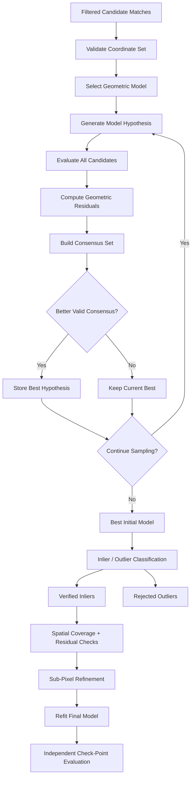
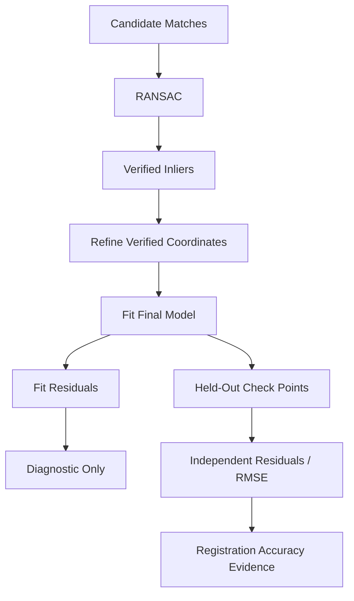

# RANSAC and Geometric Verification

RANSAC — **Random Sample Consensus** — is ChandraMap's primary conceptual robust-estimation stage for separating geometrically consistent correspondences from the false or inconsistent candidates produced by local image matching.

A matcher can determine that two local image regions appear similar. It cannot, by appearance alone, prove that those regions represent the same physical lunar location.

RANSAC introduces geometric reasoning.

> **RANSAC determines which candidate correspondences agree with a geometric model; it does not prove that those correspondences are independent ground truth.**

In ChandraMap, RANSAC sits between local matching and later registration refinement:

```text
Prepared Source + Reference
        ↓
Local Matching
        ↓
Candidate Matches
        ↓
Matcher-Level Filtering
        ↓
RANSAC / Robust Geometric Verification
        ↓
Initial Geometric Model
+
Verified Inliers
+
Rejected Outliers
        ↓
Sub-Pixel Refinement
        ↓
Final Model Refit
        ↓
Registration
        ↓
Independent Evaluation
```

A second principle defines the intended processing order:

> **Matching proposes candidates; RANSAC verifies geometric consistency; refinement improves verified coordinates; independent check points measure final registration accuracy.**

The preferred conceptual sequence is:

```text
candidate matches
→ match filtering
→ RANSAC
→ initial model
→ verified inliers
→ sub-pixel refinement
→ final model refit
→ independent evaluation
```

A third principle concerns spatial support:

> **A good RANSAC result requires both geometric consistency and useful spatial support.**

A transformation supported by many correspondences concentrated around one crater may provide weaker scene-wide registration evidence than a smaller but well-distributed set of reliable correspondences.

RANSAC is therefore an important geometric consistency gate, but it is not the final scientific judge of registration quality.

---

## 1. Position in the ChandraMap Pipeline

The broader algorithm sequence is:

```text
Dataset Preparation
        ↓
Sensor Routing
        ↓
Preprocessing
        ↓
Physical Scale Handling
        ↓
Local Matching
        ↓
Matcher-Level Filtering
        ↓
RANSAC / Geometric Verification
        ↓
Verified Inliers
        ↓
Sub-Pixel Refinement
        ↓
Final Transform Refit
        ↓
Registration
        ↓
Independent Evaluation
```

Each neighboring stage has a different responsibility.

### Matching

Produces possible source/reference point correspondences.

### Match Filtering

May reject candidates based on:

- descriptor ambiguity;
- mutual consistency;
- method-specific confidence;
- invalid coordinates;
- duplicate behavior.

### RANSAC

Tests whether the remaining candidates agree with a selected geometric model.

### Refinement

Improves the localization precision of already verified correspondences where scientifically justified.

### Final Model Refit

Re-estimates the transformation using the refined verified correspondences.

### Evaluation

Measures final accuracy using independent evidence where available.

These stages should remain conceptually distinct even when an implementation combines them behind one higher-level API.

---

## 2. RANSAC Responsibilities

| Responsibility                                        | RANSAC Stage? |
| ----------------------------------------------------- | ------------: |
| Receive candidate correspondences                     |           Yes |
| Estimate robust initial geometric model               |           Yes |
| Separate model-consistent and inconsistent candidates |           Yes |
| Produce inlier/outlier status                         |           Yes |
| Compute geometric residuals                           |           Yes |
| Produce an initial consensus set                      |           Yes |
| Detect local image features                           |            No |
| Generate local descriptors                            |            No |
| Perform local descriptor matching                     |            No |
| Retrieve a global reference region                    |            No |
| Choose an IIRS registration representation            |            No |
| Fix incorrect physical scale preparation              |            No |
| Produce independent ground truth                      |            No |
| Perform final sub-pixel refinement                    |            No |
| Compute held-out benchmark accuracy                   |            No |
| Prove geographic correctness by itself                |            No |

RANSAC should solve one problem well:

> **Which candidate correspondences are mutually compatible with the selected geometric model?**

---

# Core Terminology

## 3. Candidate Match

A **candidate match** is a source/reference correspondence proposed by a matcher and optionally filtered before geometric verification.

Conceptually:

```text
source point
(x_s, y_s)
        ↔
reference point
(x_r, y_r)
```

Candidate status means:

> appearance or model evidence suggests a possible correspondence.

It does not mean the correspondence is geometrically or geographically correct.

---

## 4. Model

A **model** describes the geometric relationship RANSAC is asked to estimate.

Possible model families include:

- translation;
- similarity;
- affine transformation;
- homography.

More advanced ChandraMap research may later investigate:

- local transforms;
- piecewise models;
- displacement fields;
- DEM-aware geometry;
- sensor-model constraints.

RANSAC does not choose the correct physical model automatically simply because it is robust to outliers.

---

## 5. Minimal Sample

A **minimal sample** is the smallest model-specific subset of correspondences that can support estimation of one model hypothesis under the assumptions of that model.

The required number and geometric arrangement depend on the selected transformation.

Therefore:

> **There is no single universal ChandraMap minimum sample size.**

A model may also fail even when enough points exist numerically if those points form a degenerate geometric configuration.

---

## 6. Inlier

An **inlier** is a candidate correspondence whose residual under a selected model satisfies the configured geometric acceptance rule.

Preferred wording after robust verification is:

> **verified inlier**

This means:

> geometrically consistent candidate.

It does not mean:

- manually verified truth;
- official benchmark truth;
- independent check point;
- guaranteed physically correct correspondence.

---

## 7. Outlier

An **outlier** is a candidate correspondence rejected as geometrically inconsistent with the selected model under the configured residual criterion.

Possible causes include:

- descriptor ambiguity;
- repeated crater structures;
- wrong retrieval candidate;
- illumination-driven false feature;
- scale mismatch;
- modality mismatch;
- incorrect local association.

---

## 8. Inlier Mask

An **inlier mask** records which original candidates were classified as:

- accepted;
- rejected.

Conceptually:

```text
candidate_0 → inlier
candidate_1 → outlier
candidate_2 → inlier
...
```

Preserving this mapping is valuable for:

- diagnostics;
- visualization;
- refinement;
- benchmark metrics;
- failure analysis.

---

## 9. Residual

A **residual** measures disagreement between:

- the observed correspondence location;
- the location predicted by the estimated transformation.

Residuals provide geometric evidence about how well the model explains its candidate correspondences.

---

## 10. Reprojection Error

In ChandraMap documentation, **reprojection error** should identify the coordinate system in which the geometric discrepancy is measured.

For example:

```text
reference pyramid-level pixels
```

is more informative than:

```text
pixel error
```

without coordinate context.

---

## 11. Consensus Set

A **consensus set** is the subset of candidate correspondences classified as consistent with one model hypothesis.

RANSAC searches for a strong valid consensus.

However:

> **The largest consensus is not automatically the scientifically best registration.**

A large consensus may still suffer from:

- poor spatial distribution;
- wrong reference region;
- inappropriate model;
- overly loose threshold;
- repeated-terrain ambiguity.

---

## 12. Initial Model

The **initial model** is the robust transformation obtained from the RANSAC/geometric-verification stage before later coordinate refinement.

It is suitable for:

- identifying inliers;
- initializing downstream refinement;
- preliminary registration diagnostics.

It need not be the final scientific transformation.

---

## 13. Final Model

The **final model** is the transformation retained after downstream processing such as:

```text
verified inliers
→ sub-pixel refinement
→ final model refit
```

when that sequence is enabled.

The initial and final transformations should not be conflated in result provenance.

---

## 14. Ground Truth

**Ground truth** is independently prepared evaluation evidence.

Ground truth may include:

- held-out manually/independently verified correspondences;
- independently established geographic control;
- other benchmark-approved truth sources.

RANSAC inliers are not ground truth.

---

# RANSAC Stage Boundary

## 15. Where Robust Verification Starts and Ends

Conceptually:

```text
Prepared Source + Reference
        ↓
Matching
        ↓
Candidate Matches
        ↓
Match Filtering
        ↓
Filtered Candidate Matches
        ↓
RANSAC
        ├───────────────┐
        ↓               ↓
Initial Model     Inlier / Outlier Mask
        └───────┬───────┘
                ↓
        Verified Inliers
                │
                └── END ROBUST VERIFICATION
                        ↓
                Sub-Pixel Refinement
                        ↓
                Final Model Refit
                        ↓
                Independent Evaluation
```

This boundary is important for reproducibility.

A benchmark should be able to distinguish:

- candidate quality;
- robust-verification behavior;
- refinement effect;
- independent accuracy.

---

# Why Matcher Output Needs Geometry

## 16. Appearance Similarity Is Not Geographic Identity

Two image regions can look similar without representing the same lunar location.

Common sources of ambiguity include:

- similar craters;
- repeated crater chains;
- similar ridge fragments;
- broad low-texture plains;
- shadow boundaries;
- recurring local terrain patterns.

A local matcher may therefore produce plausible but incorrect candidates.

---

## 17. Coherent Correspondences Should Agree Spatially

If several candidate matches genuinely describe the same local registration, they should generally support a coherent spatial relationship.

Conceptually:

```text
source points
      ↓
one geometric transformation
      ↓
corresponding reference points
```

Incorrect matches will often disagree with that common model.

RANSAC exploits this distinction.

---

# RANSAC Concept

## 18. RANSAC at a High Level

A conceptual RANSAC process is:

1. Select a model-specific minimal subset of candidate correspondences.
2. Estimate a candidate geometric model.
3. Apply the model to the full candidate set.
4. Compute geometric residuals.
5. Determine which candidates satisfy the configured residual rule.
6. Form a consensus set.
7. Repeat with additional hypotheses according to the robust-estimation configuration.
8. Retain the strongest valid hypothesis under the selected scoring rule.
9. Re-estimate the initial model from its consensus set where appropriate.

In compact form:

```text
candidate matches
        ↓
sample model hypothesis
        ↓
estimate transform
        ↓
evaluate all candidates
        ↓
compute residuals
        ↓
build consensus set
        ↓
repeat
        ↓
best valid consensus
        ↓
initial model + verified inliers
```

---

## 19. Why Robust Estimation Is Needed

A conventional fit that treats every candidate as correct can be severely affected by outliers.

Suppose the candidate set contains:

```text
correct correspondences
+
false crater matches
+
shadow-edge matches
+
wrong descriptor associations
```

A non-robust fit may be pulled toward the false associations.

RANSAC attempts to recover a model supported by a geometrically coherent subset instead.

---

## 20. Robust Does Not Mean Infallible

RANSAC can still fail when:

- the outlier rate is too high;
- correct candidates are too few;
- correct candidates are poorly distributed;
- the chosen model is inappropriate;
- the threshold is unsuitable;
- a wrong reference region forms a misleading consensus.

Robust estimation reduces sensitivity to outliers.

It does not make geometric reasoning infallible.

---

# Minimal Sample and Model Requirements

## 21. Model-Specific Requirements

Different models have different estimation requirements.

Conceptually:

```text
translation
similarity
affine
homography
```

do not require identical:

- point counts;
- point arrangements;
- degrees of freedom.

The selected implementation and mathematical model determine the actual requirements.

---

## 22. Count Alone Is Not Enough

Even if enough correspondences exist numerically, they may not contain sufficient geometric diversity.

Examples include:

- nearly collinear points;
- duplicate points;
- extremely clustered points;
- numerically unstable arrangements.

Therefore model validation should consider both:

```text
quantity
+
geometry
```

---

# RANSAC Inputs

## 23. Conceptual Inputs

A RANSAC stage conceptually receives:

- source candidate coordinates;
- reference candidate coordinates;
- model type;
- residual/reprojection threshold;
- robust-estimation configuration;
- source coordinate-space identity;
- reference coordinate-space identity.

Optional context may include:

- matcher score;
- candidate IDs;
- masks;
- source dimensions;
- reference dimensions;
- pyramid-level identity.

No specific software API is defined by this document.

---

## 24. Candidate Coordinate Validation

Before model estimation, candidates should be checked for:

- finite coordinates;
- valid source bounds;
- valid reference bounds;
- compatible array lengths;
- malformed duplicates;
- missing coordinate components.

RANSAC should not be asked to repair malformed data structures.

---

# Coordinate Spaces

## 25. Source and Reference Spaces

A RANSAC model may operate between:

```text
source prepared-image pixels
→ reference prepared-image pixels
```

or:

```text
source crop pixels
→ reference tile pixels
```

or:

```text
source pixels
→ reference pyramid-level pixels
```

The exact domains must be recorded.

---

## 26. Threshold Belongs to the Evaluation Space

If residuals are evaluated in reference pixels, the threshold is interpreted in that reference coordinate space.

Therefore:

```text
threshold = N pixels
```

is scientifically incomplete unless the documentation also identifies:

- which image;
- which pyramid level;
- which coordinate representation.

---

# Crop Coordinates

## 27. Local Crop Geometry

If candidates are produced from a source crop or reference tile, RANSAC may estimate geometry in local coordinates.

Conceptually:

```text
source crop coordinates
→ reference tile coordinates
```

The repository should preserve mappings back to:

- parent source coordinates;
- parent reference coordinates;
- geographic coordinates where available.

---

## 28. Crop Offsets Matter

For a simple crop:

```text
x_parent = x_crop + x_offset
y_parent = y_crop + y_offset
```

but this simple relationship may no longer hold after:

- resizing;
- reprojection;
- rotation;
- pyramid generation.

The actual coordinate lineage should remain recoverable.

---

# Pyramid-Level Coordinates

## 29. Models Belong to a Specific Level

If the reference is a selected pyramid level, then:

```text
reference coordinate
```

means:

> coordinate in that specific level's pixel grid.

The initial model is therefore level-specific.

It must not silently be treated as a native-resolution reference model.

See [`scale-pyramid.md`](scale-pyramid.md).

---

## 30. Coordinate Mapping Across Levels

Moving a transformation between pyramid levels requires explicit coordinate conversion.

Do not blindly reuse:

- translation components;
- affine matrices;
- homographies;

across different image grids.

A safer coarse-to-fine strategy is usually to use the coarse model to initialize a finer search and then estimate geometry again from finer correspondences.

---

# RANSAC Outputs

## 31. Conceptual Outputs

A successful robust-verification stage may produce:

- initial transformation;
- model type;
- transform direction;
- source coordinate-space identity;
- reference coordinate-space identity;
- inlier mask;
- verified inlier coordinates;
- rejected candidate/outlier set;
- geometric residuals;
- inlier count;
- inlier ratio;
- model-estimation status;
- diagnostic information;
- runtime.

The exact data structure belongs to repository contracts/implementation documentation.

---

# Transform Direction

## 32. Direction Must Be Explicit

A transformation that maps:

```text
source → reference
```

is not equivalent to one mapping:

```text
reference → source
```

Every stored transform should therefore identify its direction.

A matrix without direction metadata is ambiguous.

---

## 33. Coordinate Domains Must Accompany Direction

A stronger model record identifies:

```text
source domain:
prepared source image

destination domain:
NAC pyramid level L
```

rather than storing only:

```text
source_to_reference
```

when multiple representations exist.

---

# Inlier Mask

## 34. Preserve Candidate Identity

An inlier mask should correspond directly to the candidate collection that entered geometric verification.

Conceptually:

```text
candidate 0 → accepted
candidate 1 → rejected
candidate 2 → accepted
```

This makes it possible to reconstruct:

- visualizations;
- matcher-to-RANSAC lineage;
- outlier statistics;
- refinement inputs.

---

## 35. Candidate Ordering

If the implementation uses an ordered mask, changing candidate order after RANSAC can make the mask meaningless.

Candidate IDs or equivalent stable correspondence identity are therefore useful.

---

# Geometric Model Choice

## 36. RANSAC Estimates the Requested Model

RANSAC is not itself:

- affine;
- homography;
- similarity transform.

RANSAC is the robust-estimation strategy wrapped around a chosen model.

Conceptually:

```text
candidate correspondences
        +
selected model family
        ↓
RANSAC
        ↓
robust estimate of that model
```

A poor model choice can therefore produce a misleading result even when RANSAC executes correctly.

---

# Translation Model

## 37. Translation

A translation model represents displacement without:

- rotation;
- scaling;
- shear;
- projective effects.

It can be useful under restrictive assumptions or diagnostic experiments.

It should not be treated as a universal ChandraMap default.

---

# Similarity Transform

## 38. Similarity Geometry

A similarity transform can conceptually represent combinations of:

- translation;
- rotation;
- uniform scaling.

It may be useful for restricted local conditions.

Its inclusion here does not imply current implementation.

---

# Affine Transformation

## 39. Affine Capability

An affine model can represent combinations of:

- translation;
- rotation;
- scale;
- shear.

It preserves straight lines and parallel-line relationships.

A local source/reference pair may sometimes be approximated effectively by an affine model.

---

## 40. Affine Limitations

An affine transform does not model the full class of planar projective relationships.

It may be insufficient when:

- perspective-like differences matter;
- projection effects are stronger;
- view geometry produces more complex image deformation.

---

# Homography

## 41. Homography Capability

A homography is a planar projective transformation.

It can model a wider family of 2D projective relationships than an affine transform.

For suitable local image regions, it may be a useful registration approximation.

---

## 42. Homography Is Not a Universal Lunar Model

> **The Moon is not a flat poster.**

Lunar terrain contains relief.

A single global planar transformation may be insufficient when:

- terrain relief is significant;
- the region is large;
- viewing geometry differs substantially;
- projections differ;
- unprojected sensor geometry matters;
- image displacement varies spatially.

Therefore homography support should be treated as:

> a model hypothesis to evaluate,

not:

> the physically correct model for every lunar pair.

---

# Affine vs Homography

## 43. Model Comparison

| Property                         | Affine                    | Homography                                    |
| -------------------------------- | ------------------------- | --------------------------------------------- |
| Relative flexibility             | Lower                     | Higher                                        |
| Translation                      | Supported                 | Supported                                     |
| Rotation                         | Supported                 | Supported                                     |
| Scale                            | Supported                 | Supported                                     |
| Shear                            | Supported                 | Supported                                     |
| General planar projective effect | Limited                   | Supported                                     |
| Parameter flexibility            | Lower                     | Higher                                        |
| Potential overfitting risk       | Lower relative complexity | Greater flexibility can fit noise more easily |
| Possible local lunar use         | Yes                       | Yes                                           |
| Universal lunar solution         | No                        | No                                            |

The correct model should be determined through:

- pair geometry;
- residual behavior;
- independent benchmark evidence.

---

## 44. More Flexible Is Not Automatically Better

A more flexible transformation can fit:

- correct geometry;
- noise;
- poorly distributed correspondences;
- some local distortions.

A model that produces a larger consensus is not necessarily more physically appropriate.

Model comparison should inspect:

- inlier support;
- spatial coverage;
- fit residuals;
- independent check-point error;
- stability;
- failure behavior.

---

# Lunar Geometry Limitations

## 45. Local Planar Approximation

A planar model can be a useful approximation when:

- the region is sufficiently local;
- the imagery is appropriately prepared;
- projection differences are limited;
- relief-induced displacement is small enough for the required accuracy.

This is an engineering approximation.

Its validity should be measured.

---

## 46. Terrain Relief

Lunar craters, ridges, slopes, and elevated terrain can create spatially varying displacement between observations.

One global matrix may therefore fit one area well and another area poorly.

This often appears as:

```text
structured residual field
```

rather than random residual noise.

---

## 47. Wide-Area Registration

As the image footprint grows, a single local planar approximation may become less appropriate.

Large-area problems may require:

- geospatial reprojection;
- piecewise geometry;
- terrain-aware processing;
- sensor models.

These are advanced considerations.

---

# Projection Mismatch

## 48. Projection Effects

Two map-projected lunar images can use different:

- projections;
- pixel scales;
- longitude conventions;
- map grids.

If those differences are not handled correctly upstream, RANSAC may see systematic geometric discrepancies.

---

## 49. RANSAC Should Not Repair Broken Geospatial Preparation

Do not respond to projection mismatch by simply making the RANSAC threshold very large.

A large threshold may hide the symptom while producing a scientifically weak transformation.

Upstream geospatial assumptions should be corrected instead.

---

# Advanced Geometry

## 50. Future / Research Directions

Later ChandraMap versions may investigate:

- piecewise affine models;
- local homographies;
- mesh-based warps;
- displacement fields;
- DEM-aware geometry;
- camera/sensor-model constraints;
- photogrammetric registration.

These should remain optional research directions unless repository scope explicitly adopts them.

V1 should remain understandable and benchmarkable.

---

# Geometric Residuals

## 51. Residual Definition

Let:

- \(p_s\) be a source candidate point;
- \(T\) be the estimated source-to-reference transformation;
- \(p_r\) be the observed reference candidate point.

The model predicts:

$$
\hat{p}_r = T(p_s)
$$

The residual vector is:

$$
e = p_r - \hat{p}_r
$$

Its magnitude is:

$$
\lVert e \rVert
$$

The exact residual definition used by implementation should be documented when it differs from this conceptual form.

---

## 52. Residual Vector

Residual vectors preserve:

- magnitude;
- direction.

This is useful because two models with similar average error can have very different spatial error patterns.

---

## 53. Fit Residual

A residual computed on the correspondences used to estimate the model is a **fit residual**.

It measures:

> how well the model explains the correspondences that supported it.

It is useful.

It is not fully independent registration accuracy.

---

# Residual Coordinate Units

## 54. State the Coordinate Domain

A residual may be expressed in:

- reference image pixels;
- source image pixels after inverse mapping;
- map coordinates;
- another explicitly defined domain.

Reports should say which.

Avoid:

```text
RMSE = value pixels
```

without identifying which pixel grid.

---

## 55. Pyramid-Level Pixels

If RANSAC operates against a coarse NAC level, then:

```text
1 reference-level pixel
```

may represent a very different lunar ground distance from:

```text
1 native NAC pixel
```

Therefore residual values cannot be compared across levels without accounting for coordinate scale.

---

# Reprojection Threshold

## 56. Threshold Concept

RANSAC needs a geometric acceptance rule for distinguishing:

- candidate inliers;
- candidate outliers.

A common conceptual rule is:

```text
residual magnitude
≤
configured threshold
```

Candidates satisfying the rule support the current model.

---

## 57. No Universal Threshold

The threshold depends on factors such as:

- coordinate system;
- source/reference scale;
- pyramid level;
- matcher localization precision;
- expected preprocessing error;
- sensor pair;
- benchmark objective.

ChandraMap should therefore not define one arbitrary universal pixel threshold.

---

## 58. Threshold Units Must Be Recorded

A robust-estimation record should identify both:

```text
threshold value
```

and:

```text
threshold coordinate space
```

For example, conceptually:

```text
threshold unit:
reference_level_pixels
```

is stronger metadata than simply storing:

```text
threshold_px
```

without context.

---

# Threshold and Scale Pyramid

## 59. Same Number, Different Physical Meaning

Conceptually:

```text
N pixels at coarse NAC level
```

is not physically equivalent to:

```text
N pixels at native NAC level
```

because their effective GSDs differ.

Threshold policy must therefore be scale-aware or at least scale-documented.

---

## 60. Do Not Reuse Thresholds Blindly

When moving through a pyramid:

```text
coarse level
→ finer level
```

the coordinate system changes.

The threshold may need reinterpretation or conversion according to the experiment's defined policy.

---

# Threshold Trade-Off

## 61. Threshold Too Tight

An overly strict threshold may:

- reject legitimate correspondences;
- reduce the consensus set;
- leave insufficient support;
- cause model-estimation failure.

This is especially relevant when:

- matcher localization is noisy;
- source imagery is coarse;
- preprocessing introduces small coordinate uncertainty.

---

## 62. Threshold Too Loose

An overly permissive threshold may:

- admit false correspondences;
- inflate inlier count;
- bias the model;
- hide scale or projection problems;
- produce misleadingly strong consensus.

---

## 63. Do Not Inflate the Threshold to Force Success

If the system only succeeds after a dramatic threshold increase, investigate upstream causes such as:

- wrong reference scale;
- incorrect retrieved tile;
- poor preprocessing;
- inappropriate model;
- weak matcher output;
- coordinate mismatch.

Forcing consensus is not robust validation.

---

## 64. Threshold Benchmarking

Thresholds should be:

- configurable;
- recorded;
- versioned;
- tuned on development/validation data;
- evaluated on held-out benchmark data.

Avoid repeatedly tuning thresholds against final test check points.

---

# Iteration and Robust-Estimation Configuration

## 65. Iteration Budget

RANSAC evaluates multiple model hypotheses.

A larger iteration budget may increase:

- computational cost;
- opportunity to sample a useful consensus;

depending on candidate quality and outlier rate.

No universal ChandraMap iteration count is defined here.

---

## 66. Confidence Configuration

Some robust-estimation implementations expose a confidence/probability parameter that influences stopping or iteration behavior.

This setting is:

- implementation-dependent;
- configurable;
- part of experimental provenance.

No default value is prescribed here.

---

## 67. Early Termination

Some implementations may stop before the maximum iteration budget when their termination criteria are satisfied.

Whether that occurs depends on:

- library;
- estimator;
- configuration.

Do not assume a particular early-stopping behavior without checking the implementation.

---

# Randomness and Reproducibility

## 68. RANSAC Can Be Stochastic

Traditional RANSAC relies on sampling candidate subsets.

Different random sequences may produce different hypotheses when evidence is weak.

---

## 69. Random Seed

Where the selected implementation exposes deterministic seeding, record the seed for reproducible experiments.

If the implementation does not provide controllable randomness, document that limitation.

---

## 70. Determinism Caveat

Do not promise perfect bit-for-bit reproducibility across:

- library versions;
- operating systems;
- hardware;
- parallel implementations;

unless explicitly verified.

Scientific reproducibility primarily requires sufficient provenance to repeat the experimental procedure and understand variation.

---

# Degenerate Configurations

## 71. What Degeneracy Means

A candidate set is **degenerate** for a model when its geometric arrangement does not support stable estimation even though some points exist.

Conceptual examples include:

- nearly collinear support;
- duplicate correspondences;
- extremely clustered points;
- insufficient distinct geometry.

---

## 72. Nearly Collinear Points

A group of points concentrated along one line may provide poor constraints for some transformation models.

The result can be:

- unstable coefficients;
- large extrapolation error;
- misleading local fit.

---

## 73. Duplicate Correspondences

Duplicate or near-duplicate correspondences can:

- artificially inflate candidate/support counts;
- reduce effective geometric diversity;
- create numerical problems.

Candidate validation or matcher-level filtering should address these where appropriate.

If a dedicated `match-filtering.md` document is added to the repository, duplicate-handling policy should be documented there rather than duplicated here.

---

## 74. Extremely Clustered Matches

Even mathematically valid inliers can be weak for image-wide registration if concentrated in a small region.

For example:

```text
many verified inliers
→ one crater only
```

may provide poor constraints outside that crater.

This motivates explicit spatial-coverage evaluation.

---

## 75. Insufficient Candidates

If there are not enough suitable correspondences to estimate the selected model:

> **fail clearly.**

Do not fabricate:

- a transform;
- missing correspondences;
- synthetic support.

---

# Inlier Count

## 76. Definition

The **inlier count** is the number of filtered candidate correspondences accepted by geometric verification.

Conceptually:

```text
candidate input
→ RANSAC
→ verified inliers
```

---

## 77. Count Interpretation

A larger inlier count may provide stronger model support.

However, it must be interpreted together with:

- total candidate count;
- inlier ratio;
- spatial coverage;
- residual distribution;
- independent check-point error.

---

# Inlier Ratio

## 78. Definition

Unless a benchmark defines otherwise, the conceptual ratio should be documented as:

$$
\text{inlier ratio}
=
\frac{\text{verified inlier count}}
{\text{filtered candidate count}}
$$

The denominator must be stated.

---

## 79. Do Not Mix Denominators

Possible candidate-count stages include:

- raw matcher associations;
- ratio-filtered matches;
- final filtered candidates entering RANSAC.

If an experiment reports inlier ratio using different denominators, those values are not directly equivalent.

---

## 80. High Ratio, Few Points

Conceptually:

```text
few candidates
→ most accepted
→ high ratio
```

may still provide weak registration support.

A high ratio should not hide a tiny consensus set.

---

## 81. Many Inliers, Poor Coverage

Likewise:

```text
many inliers
→ one localized crater group
```

can still provide weak global support.

Count and distribution are separate properties.

---

# Spatial Coverage

## 82. Why Coverage Matters

Verified correspondences should ideally span the usable overlap.

Broad support helps:

- constrain global transforms;
- reveal local model inadequacy;
- reduce dependence on one terrain feature;
- improve confidence in image-wide alignment.

---

## 83. Candidate Coverage vs Inlier Coverage

Candidate coverage measures where matcher proposals occur.

Inlier coverage measures where geometrically accepted evidence occurs.

For registration quality, verified-inlier coverage is generally more informative.

---

## 84. Coverage Metrics

Possible measures include:

- grid occupancy;
- convex-hull coverage;
- quadrant/region occupancy;
- another explicitly documented metric.

No universal ChandraMap coverage threshold is defined here.

---

## 85. Coverage Is Not RANSAC's Only Optimization Goal

Classical RANSAC primarily reasons about model consensus.

A separate downstream quality check may therefore be necessary to determine whether the consensus is spatially useful.

---

# Model Scoring

## 86. Consensus Size

A traditional robust-estimation process often uses consensus size as an important selection signal.

A larger valid consensus can be valuable.

It should not be interpreted alone.

---

## 87. Residual Distribution

Two model hypotheses may have similar inlier counts while differing in:

- residual magnitude;
- residual spread;
- residual direction;
- spatial coverage.

Residual diagnostics therefore add information beyond count.

---

## 88. Independent Accuracy

The strongest model under internal RANSAC scoring may not produce the best held-out registration accuracy.

Independent check points remain the appropriate place to measure final model performance.

---

# Advanced Robust Scoring

## 89. Future Estimator Variants

Later research may investigate:

- improved RANSAC sampling strategies;
- local optimization;
- USAC-family approaches;
- MAGSAC-style robust estimation;
- other robust-estimation methods.

These are optional research directions.

Their mention does not imply current implementation.

---

## 90. Why Advanced Variants Need Benchmarks

A more sophisticated estimator may change:

- robustness;
- runtime;
- sensitivity to outlier rate;
- model stability.

Only controlled ChandraMap benchmarks should determine whether a more advanced estimator provides meaningful value.

---

# Retrieval and RANSAC

## 91. Retrieved Reference Is Still a Candidate

For unknown-location workflows:

```text
query
→ global retrieval
→ Top-K reference candidates
→ local matching
→ RANSAC
```

A retrieved tile is a candidate geographic region.

It is not point-level proof of location.

---

## 92. RANSAC as a Retrieval Validation Signal

A correct candidate region may produce:

- more coherent correspondences;
- stronger spatial support;
- more stable geometry.

An incorrect candidate may produce:

- few inliers;
- unstable models;
- poor coverage.

This makes geometric consistency useful for candidate validation.

---

## 93. RANSAC Score Is Not Geographic Truth

Repetitive lunar regions may occasionally produce wrong but locally self-consistent correspondences.

Therefore:

```text
strong RANSAC consensus
≠
guaranteed correct lunar region
```

Use independent geographic truth or benchmark labels when required.

---

# Scale Pyramid and RANSAC

## 94. Coarse-Level Verification

At a coarse reference level:

- reference coordinates belong to that level;
- residuals are measured in that level's coordinate units;
- candidate features represent larger-scale terrain structure.

The resulting model is therefore a **coarse-level model**.

---

## 95. Moving to a Finer Level

A preferred conceptual sequence is:

```text
coarse-level candidates
        ↓
coarse RANSAC
        ↓
coarse model
        ↓
predict finer search region
        ↓
generate finer correspondences
        ↓
run geometric verification again
        ↓
refit finer model
```

Do not assume one coarse consensus should remain unchanged across all finer levels.

---

## 96. Thresholds Across Pyramid Levels

The same numeric threshold may correspond to different physical error at different levels.

Therefore threshold interpretation must remain level-aware.

See [`scale-pyramid.md`](scale-pyramid.md).

---

## 97. Fine-Level Failure Can Be Correct Behavior

If a coarse source lacks fine-scale information, a coarser reference level may produce valid geometry while a finer level fails.

This does not necessarily indicate a RANSAC defect.

The correct action may be:

> stop refinement at the physically supported scale.

---

# Illumination and RANSAC

## 98. Shadow-Driven Candidate Errors

Different lunar Sun geometry can create strong but unstable:

- shadow edges;
- bright crater rims;
- ridge boundaries.

Local matchers may associate these incorrectly.

---

## 99. RANSAC Can Reject Many Such Matches

If illumination-driven false correspondences do not follow the same spatial transformation as the true terrain matches, geometric verification may reject them.

This is one reason RANSAC is essential downstream of appearance-based matching.

---

## 100. RANSAC Cannot Solve Illumination

RANSAC does not:

- move shadows;
- recover hidden terrain;
- reconstruct missing image information;
- make descriptors illumination invariant.

It only tests geometric consistency among the candidates it receives.

---

## 101. Geometrically Consistent Shadow Errors

Some wrong correspondences may still form a misleading consensus, especially in:

- repeated crater fields;
- locally regular terrain;
- small clustered regions.

This is another reason RANSAC inliers are not ground truth.

---

## 102. Illumination Failure Diagnosis

If strong illumination differences produce:

- very few inliers;
- clustered support;
- unstable models;
- large structured residuals;

inspect:

- preprocessing;
- reference scale;
- shadow-heavy features;
- matcher behavior;
- model choice.

Do not automatically blame the robust estimator.

See [`illumination-handling.md`](illumination-handling.md).

---

# Sensor-Specific Considerations

## 103. OHRC

OHRC is the Chandrayaan-2 **Orbiter High Resolution Camera**.

Project documentation commonly treats its sampling as approximately:

> **~0.25–0.32 m/pixel**

depending on product/documentation.

Actual product metadata remains authoritative.

OHRC may produce:

- many candidate features;
- fine coordinate localization;
- repeated small-crater structures;
- illumination-sensitive shadow features.

A high inlier count should therefore be interpreted with spatial coverage and independent error.

---

## 104. TMC-2

TMC-2 is the Chandrayaan-2 **Terrain Mapping Camera-2**.

Current project planning commonly uses approximately:

> **~5 m/pixel**

with actual metadata remaining authoritative.

TMC-2 may rely more on:

- larger crater structure;
- ridge systems;
- medium-scale terrain organization.

Reference-pyramid selection can strongly influence the candidate set reaching RANSAC.

---

## 105. IIRS

IIRS is the Chandrayaan-2 **Imaging Infrared Spectrometer**.

Project-level approximations include:

- ~80 m/pixel spatial sampling;
- ~0.8–5.0 µm spectral range;
- roughly ~250–256 bands depending on product/documentation.

Actual product metadata remains authoritative.

IIRS may produce:

- fewer reliable point correspondences;
- coarser localization;
- stronger cross-modality ambiguity.

It must first become a documented 2D registration representation before ordinary 2D local matching and geometric verification.

---

## 106. Do Not Copy OHRC RANSAC Assumptions to IIRS

A configuration suitable for fine panchromatic OHRC correspondences may not be appropriate for coarse hyperspectral-derived IIRS representations.

However:

> **Do not invent separate IIRS thresholds without benchmark evidence.**

Sensor-specific configuration should come from controlled development/validation experiments.

---

## 107. LRO NAC

LRO NAC commonly serves as a fine/local reference.

Current project planning often treats NAC imagery as approximately:

> **~0.5–2 m/pixel**

depending on product/acquisition geometry.

If a coarse source is matched directly against an unnecessarily fine NAC representation, RANSAC failure may reflect:

> wrong physical scale preparation.

Increasing the threshold is not an appropriate substitute for fixing the scale relationship.

---

## 108. LRO WAC

LRO WAC commonly serves broad/coarse reference roles.

Its scale is product/mode/processing dependent.

A WAC-level geometric verification result may support:

- coarse localization;
- broad alignment;

but should not automatically be interpreted as NAC-level fine registration accuracy.

---

# Sub-Pixel Refinement Order

## 109. RANSAC Comes Before Refinement

The preferred order is:

```text
candidate matches
        ↓
RANSAC
        ↓
verified inliers
        ↓
sub-pixel refinement
```

Refining all unverified candidates first can:

- waste computation;
- improve the numerical precision of false matches;
- contaminate later fitting.

---

## 110. Verified-Inlier Refinement

Sub-pixel refinement should operate on the geometrically accepted set when the selected sensor pair and representation support meaningful finer localization.

A refined point record should preserve:

- original coordinates;
- refined coordinates;
- inlier identity;
- refinement status.

---

## 111. Refit After Refinement

This step is critical.

Preferred:

```text
RANSAC
→ initial model
→ verified inliers
→ refine inlier coordinates
→ refit transformation
→ final model
```

The final transform should generally reflect the refined correspondence coordinates when refinement is part of the pipeline.

---

## 112. Initial vs Final Model

Do not silently treat:

```text
RANSAC initial model
```

and:

```text
post-refinement final model
```

as the same scientific result.

Both may be useful to record for diagnostics.

---

## 113. Refinement Failure

Some verified correspondences may not support stable refinement.

Possible policies include:

- retain original coordinate;
- exclude the point from final refit;
- mark the point as refinement failure.

This document does not mandate one policy.

The configured behavior should be explicit.

---

# Evaluation After RANSAC

## 114. Do Not Evaluate Only on Fitting Inliers

A weak evaluation pattern is:

```text
candidate matches
→ RANSAC
→ fit transform
→ compute RMSE only on the same inliers
→ call this final registration accuracy
```

This primarily measures how well the fitted model explains its fitting data.

It is not fully independent evidence.

---

## 115. Independent Check Points

Preferred evaluation:

```text
verified/refined fit points
        ↓
fit final model

held-out independent check points
        ↓
evaluate final model
```

See [`../datasets/ground-truth-preparation.md`](../datasets/ground-truth-preparation.md).

---

## 116. Fit Points and Check Points Must Remain Distinct

### Fit / Control Points

Used to estimate the transformation.

### Check Points

Held out from fitting and used for evaluation.

If check points are included in RANSAC/model fitting, they are no longer independent evaluation points.

---

# Fit Residual vs Check Residual

## 117. Fit Residual

A fit residual measures the discrepancy on correspondences used to estimate or refit the model.

Useful for:

- diagnostics;
- model comparison;
- residual-pattern analysis.

It should be labeled:

> fit residual

rather than independent accuracy.

---

## 118. Check-Point Residual

A check-point residual measures model error on independent held-out truth.

This provides stronger evidence of registration generalization.

---

## 119. Good Fit, Poor Check Error

A model may show:

```text
small fit residual
```

but:

```text
large independent check error
```

because of:

- overfitting;
- clustered control points;
- inappropriate model;
- local terrain effects.

This is precisely why independent truth is important.

---

# Source-Image Pixel Error

## 120. Report Source-Space Error First

Where practical, ChandraMap should report registration error in the source coordinate system first.

Examples:

```text
OHRC source
→ OHRC-pixel error
```

```text
TMC-2 source
→ TMC-2-pixel error
```

```text
IIRS representation
→ IIRS source-grid pixel error
```

Do not report:

```text
0.X pixels
```

without identifying the coordinate domain.

---

# Ground Error

## 121. Conversion to Metres Is Conditional

Pixel error may be converted to physical ground distance only when justified by:

- valid source GSD;
- appropriate projection/geospatial mapping;
- coordinate-domain interpretation;
- independent truth;
- local scale assumptions.

Do not simply multiply by an approximate sensor-level GSD and report false precision.

---

# RANSAC Failure Modes

## 122. Valid Failure Outcomes

RANSAC may legitimately fail because of:

- insufficient candidates;
- degenerate point geometry;
- no valid model;
- too few inliers;
- unstable transform;
- singular/invalid matrix;
- poor spatial coverage;
- excessive residuals;
- wrong retrieved region;
- inappropriate model family;
- severe upstream scale mismatch.

Failure is preferable to an unsupported transformation.

---

## 123. Failure Is a Benchmark Result

Record failures rather than removing them from evaluation.

A useful failure record may preserve:

- pair ID/version;
- matcher;
- matcher/filter configuration;
- model type;
- robust-estimation configuration;
- candidate count;
- inlier count where available;
- failure reason;
- runtime.

---

# Failure Diagnosis

## 124. Common RANSAC Symptoms

| Symptom                                          | Possible Cause                               | Diagnostic / Response                            |
| ------------------------------------------------ | -------------------------------------------- | ------------------------------------------------ |
| No model                                         | Too few usable candidates                    | Inspect matching and filtering                   |
| Very few inliers                                 | Wrong region, scale, matcher, or threshold   | Inspect upstream pipeline                        |
| Many inliers with large residuals                | Threshold too permissive or model unsuitable | Inspect residual distribution                    |
| Inliers concentrated around one crater           | Poor spatial coverage                        | Review candidate/inlier distribution             |
| Unstable homography                              | Degenerate geometry or poor support          | Inspect geometry/model choice                    |
| Coarse level succeeds, fine level fails          | Source lacks fine detail                     | Stop or reduce refinement                        |
| Wrong reference candidate gives strong consensus | Repetitive terrain                           | Use retrieval truth/geographic evidence          |
| Very large threshold required                    | Scale/model/coordinate problem               | Fix upstream assumptions                         |
| Low fit residual, high check RMSE                | Overfit or inadequate global model           | Inspect independent residuals                    |
| Results vary strongly across runs                | Weak candidate set or stochastic sensitivity | Improve candidate quality and record seed/config |
| Matrix contains invalid values                   | Numerical/model failure                      | Reject model                                     |
| Many duplicate inliers                           | Duplicate matcher output                     | Improve validation/filtering                     |

No fixed thresholds are implied by this table.

---

# RANSAC Quality Control

## 125. QC Checklist

Before treating a geometric-verification result as benchmark-ready, verify:

- [ ] Candidate coordinates are finite.
- [ ] Candidate source coordinates are within source bounds.
- [ ] Candidate reference coordinates are within reference bounds.
- [ ] Source coordinate space is identified.
- [ ] Reference coordinate space is identified.
- [ ] Reference pyramid level is recorded where applicable.
- [ ] Model type is recorded.
- [ ] Transform direction is recorded.
- [ ] RANSAC threshold is recorded.
- [ ] Threshold coordinate system/units are known.
- [ ] Iteration/confidence configuration is recorded where applicable.
- [ ] Random seed is recorded where supported and relevant.
- [ ] Inlier mask length matches candidate count.
- [ ] Inlier count is recorded.
- [ ] Inlier ratio definition is explicit.
- [ ] Residuals are finite.
- [ ] Transformation coefficients are finite.
- [ ] Degenerate/invalid models are rejected.
- [ ] Spatial coverage is measured or inspected.
- [ ] Failure state is explicit.
- [ ] Refinement status is recorded where enabled.
- [ ] Independent evaluation follows where truth exists.

---

# Matrix Validation

## 126. Validate Returned Transformations

If a matrix is returned, verify at minimum:

- expected dimensions for the selected model;
- finite coefficients;
- valid model-estimation status;
- transform direction;
- associated source/reference coordinate domains.

A matrix should not be stored as a valid scientific result simply because a numerical array was returned.

---

## 127. Numerical Plausibility

Implementation-level checks may also examine:

- singularity;
- instability;
- impossible scaling;
- numerical overflow;
- invalid projection behavior.

Exact validation rules should be model- and implementation-specific.

---

# Visual Verification

## 128. Useful Diagnostics

Visual diagnostics may include:

- all candidate matches;
- verified inliers;
- rejected outliers;
- residual vectors;
- transformed source points;
- registered overlay.

These visualizations can reveal:

- wrong reference region;
- clustered support;
- large directional residuals;
- suspicious shadow-based correspondences.

---

## 129. Visualization Is Not Independent Validation

A visually convincing overlay does not prove:

- correct geography;
- low independent RMSE;
- physically appropriate model.

Quantitative independent evaluation remains necessary.

---

# Residual Visualization

## 130. Residual Vector Plot

A useful residual visualization may connect:

```text
predicted point
→ observed point
```

for each evaluated correspondence.

Consistent vector direction may indicate:

- systematic bias;
- model mismatch;
- scale/projection issue.

---

## 131. Spatial Residual Patterns

Potential patterns include:

### Uniform Directional Bias

May indicate a remaining translation-like error.

### Residuals Growing Toward Image Edges

May indicate:

- scale mismatch;
- projection effects;
- inadequate global model.

### Local Residual Clusters

May indicate:

- terrain relief;
- local deformation;
- bad correspondence groups.

### Irregular Large Residuals

May indicate:

- poor candidate quality;
- wrong reference;
- failed model.

These are diagnostic hypotheses, not automatic diagnoses.

---

## 132. Residual Heat/Spatial Maps

Future analysis may visualize residual magnitude spatially across the overlap.

This can help identify areas where:

> a single global model is insufficient.

---

# Configuration

## 133. Conceptual RANSAC Configuration

Relevant configuration categories may include:

- model type;
- residual threshold;
- threshold coordinate space;
- iteration budget;
- confidence setting;
- robust-estimator variant;
- seed/determinism control;
- minimum accepted consensus policy;
- spatial-coverage quality policy.

No repository-specific keys or defaults are defined here.

---

## 134. No Hidden Thresholds

Research-sensitive values should not exist as undocumented magic numbers.

Configurations affecting geometric verification should be:

- explicit;
- reviewable;
- versioned;
- attached to experiment results.

---

## 135. Sensor-Aware Configuration

Different sensor pairs may eventually justify different settings.

For example:

- OHRC ↔ NAC;
- TMC-2 ↔ NAC;
- IIRS ↔ coarse NAC/WAC;

may produce different localization behavior.

However:

> **Do not tune each final test pair individually.**

Use development/validation experiments to establish policies.

---

# Reproducibility

## 136. RANSAC Run Record

A reproducible geometric-verification result should ideally preserve:

- pair ID/version;
- source representation;
- reference representation;
- reference pyramid level;
- matcher identity/version;
- match-filter configuration;
- filtered candidate count;
- model type;
- transform direction;
- robust estimator;
- threshold;
- threshold coordinate system;
- iteration/confidence configuration where applicable;
- seed where supported;
- inlier count;
- inlier ratio;
- spatial coverage;
- model status;
- runtime;
- software/library version where relevant.

---

## 137. Version Configuration Changes

Changing any of the following may change results:

- model family;
- threshold;
- robust estimator;
- iteration policy;
- candidate-filtering strategy;
- matcher;
- reference scale.

Such changes should be visible in experimental provenance.

---

# Conceptual RANSAC Record

## 138. Illustrative Structure

The following is an **illustrative conceptual structure — not an implemented schema**:

```yaml
pair_id: "PLACEHOLDER_PAIR_ID"

model:
  type: "PLACEHOLDER_MODEL"
  direction: "source_to_reference"

ransac:
  threshold: "PLACEHOLDER_THRESHOLD"
  coordinate_space: "PLACEHOLDER_SPACE"
  max_iterations: "PLACEHOLDER_VALUE"
  confidence: "PLACEHOLDER_VALUE"

input:
  candidate_count: "PLACEHOLDER_COUNT"

output:
  inlier_count: "PLACEHOLDER_COUNT"
  inlier_ratio: "PLACEHOLDER_VALUE"
  status: "PLACEHOLDER_STATUS"
```

No actual project thresholds, iteration counts, or confidence settings are implied.

---

# Transform Metadata

## 139. Model Record

A transformation record should conceptually preserve more than the matrix itself.

Relevant information includes:

- model type;
- transform direction;
- source coordinate space;
- destination coordinate space;
- source crop/tile identity where applicable;
- reference crop/tile identity where applicable;
- pyramid levels;
- coordinate units;
- model-estimation configuration;
- model stage — initial vs final.

---

## 140. Matrix Alone Is Insufficient

This:

```text
3 × 3 matrix
```

does not tell a future contributor:

- whether it is a homography;
- which direction it maps;
- which pyramid level it uses;
- whether coordinates are local crop coordinates;
- whether it is initial or post-refinement.

Scientific provenance must accompany the numeric model.

---

# RANSAC Benchmarking

## 141. Research Questions

Useful benchmark questions include:

- How sensitive is registration to the residual threshold?
- How does affine compare with homography on the same candidate set?
- When does a global homography become inadequate?
- Does stronger match filtering improve robust-estimation stability?
- Does improved inlier coverage correspond to lower independent error?
- How does pyramid level affect consensus?
- When does finer-level RANSAC stop improving registration?
- How often does RANSAC reject incorrect retrieval candidates?
- How stable are results across stochastic runs?

These questions require measurement.

---

# Same-Pair Rule

## 142. Control the Scientific Case

Robust-estimation strategies should be compared on the same:

- source asset;
- reference asset;
- prepared representations;
- physical scale;
- benchmark truth.

Do not compare different RANSAC configurations on different cherry-picked cases.

---

# Same-Matcher Rule

## 143. Isolating RANSAC Configuration

If the experiment is intended to test RANSAC:

keep fixed:

- matcher;
- preprocessing;
- scale;
- candidate filtering.

Change only the robust-estimation factor under study.

---

# Same-Truth Rule

## 144. Independent Evaluation Must Stay Fixed

Use the same:

- check points;
- truth version;
- error definition;
- coordinate convention;

when comparing geometric models or thresholds.

---

# Controlled Model Ablation

## 145. Affine vs Homography Example

Conceptually:

```text
same pair
same prepared representations
same candidate matches
same RANSAC policy
same independent truth
```

compare:

```text
Affine + RANSAC
```

with:

```text
Homography + RANSAC
```

Possible comparison metrics include:

- inlier count;
- inlier ratio;
- coverage;
- fit residual;
- independent check RMSE;
- stability;
- runtime;
- failure rate.

No outcome should be assumed in advance.

---

# RANSAC Benchmark Table

## 146. Conceptual Results Template

| Pair      | Matcher   | Model   | Candidates | Inliers | Inlier Ratio | Coverage | Fit Residual | Check RMSE | Runtime | Status |
| --------- | --------- | ------- | ---------: | ------: | -----------: | -------: | -----------: | ---------: | ------: | ------ |
| `PAIR_ID` | `MATCHER` | `MODEL` |          — |       — |            — |        — |            — |          — |       — | —      |

Only measured benchmark values should populate this table.

---

# Robust Estimator Variants

## 147. Classical RANSAC Baseline

Ordinary RANSAC provides an understandable robust-estimation baseline.

This simplicity is valuable for:

- V1 reproducibility;
- debugging;
- comparison against later robust estimators.

---

## 148. Advanced Variants

Later experiments may investigate:

- advanced sampling strategies;
- locally optimized RANSAC variants;
- USAC-family approaches;
- MAGSAC-style estimation;
- other robust estimators.

These are future/research options unless repository implementation explicitly adopts them.

---

## 149. No Automatic Ranking

Do not assume:

```text
more modern robust estimator
=
better ChandraMap result
```

Performance must be evaluated under:

- lunar candidate distributions;
- different sensor pairs;
- different outlier rates;
- runtime constraints.

---

# Versioned RANSAC Strategy

## 150. V1 — Simple Robust Geometry

V1 should remain interpretable and reproducible.

Conceptually:

```text
Known-Overlap Pair
        ↓
SIFT
        ↓
Descriptor Matching
        ↓
Candidate Filtering
        ↓
RANSAC
        ↓
Affine or Homography According to V1 Configuration
        ↓
Verified Inliers
        ↓
Optional Refinement
        ↓
Final Transform
        ↓
Independent Evaluation
```

Primary goals:

- reproducibility;
- transparent geometry;
- measurable baseline behavior.

The authoritative V1 specification determines the actual model configuration.

---

## 151. V2 — Better Diagnostics and Scale Handling

Possible V2 additions include:

- threshold ablations;
- affine vs homography comparison;
- stronger residual diagnostics;
- spatial-coverage checks;
- coarse-to-fine verification;
- improved failure categorization.

These additions should remain measurable extensions to V1.

---

## 152. V3 — Learned Candidates and Retrieval Validation

Possible V3 capabilities include:

- ALIKED + LightGlue candidate sets;
- LoFTR candidate sets;
- retrieval-candidate geometric verification;
- multi-scale RANSAC;
- stronger candidate-quality diagnostics;
- controlled robust-estimator comparisons.

---

## 153. V4 — Research-Grade Geometry

Possible V4 directions include:

- USAC/MAGSAC-style methods;
- local/piecewise robust estimation;
- DEM-aware geometry;
- sensor-model constraints;
- uncertainty-aware fitting;
- multimodal confidence + geometry fusion;
- terrain-dependent models.

These are research directions, not implementation-status claims.

Existing version specifications remain authoritative.

---

# Main RANSAC Flow

## 154. Geometric Verification Diagram



The exact sampling and termination policy is implementation-dependent.

---

# Evaluation Separation

## 155. Fit vs Independent Evaluation



This distinction is central to ChandraMap evaluation.

---

# Relationship to Matching Documentation

## 156. [`matching.md`](matching.md)

[`matching.md`](matching.md) defines how ChandraMap generates:

> **candidate correspondences.**

This file defines what happens immediately afterward:

> **geometric consistency verification.**

Conceptually:

```text
matching
→ candidate matches

RANSAC
→ verified inliers + outliers + initial model
```

---

# Relationship to Match Filtering

## 157. Match Filtering

If a dedicated `match-filtering.md` document is present or added, it should define matcher-level filtering such as:

- ambiguity filtering;
- mutual consistency;
- score filtering;
- invalid/duplicate candidate handling.

RANSAC then applies:

> global geometric consistency.

These responsibilities should not be conflated.

---

# Relationship to SIFT

## 158. [`sift.md`](sift.md)

[`sift.md`](sift.md) documents the classical sparse-feature baseline.

SIFT generates:

- keypoints;
- descriptors;
- candidate associations.

RANSAC is downstream and detector-independent.

The same geometric-verification concept can be applied to candidates from:

- SIFT;
- ALIKED + LightGlue;
- LoFTR;
- future remote-sensing matchers.

---

# Relationship to Scale Pyramid

## 159. [`scale-pyramid.md`](scale-pyramid.md)

[`scale-pyramid.md`](scale-pyramid.md) determines the physically meaningful reference level.

RANSAC must respect that level's:

- coordinate system;
- effective GSD;
- pixel units.

Do not use a level-independent interpretation of residual thresholds.

---

# Relationship to Preprocessing

## 160. [`preprocessing.md`](preprocessing.md)

[`preprocessing.md`](preprocessing.md) creates matcher-ready sensor representations.

RANSAC should not be expected to repair:

- invalid NoData handling;
- incorrect IIRS representation;
- wrong numeric conversion;
- broken crop mapping;
- severe scale mismatch.

Poor candidate geometry can originate upstream.

---

# Relationship to Illumination Handling

## 161. [`illumination-handling.md`](illumination-handling.md)

Illumination changes can produce appearance-based false candidates.

RANSAC may reject many candidates that are geometrically inconsistent.

It cannot:

- reconstruct hidden terrain;
- move shadows;
- guarantee illumination invariance.

---

# Relationship to Sensor Routing

## 162. [`sensor-routing.md`](sensor-routing.md)

[`sensor-routing.md`](sensor-routing.md) determines which sensor-specific processing path creates the candidate set.

RANSAC remains a downstream geometry stage.

It should be able to operate on a common logical candidate representation regardless of whether the candidates came from:

- classical matching;
- learned sparse matching;
- detector-free matching;
- future multimodal matchers.

---

# Relationship to Dataset Documentation

## 163. Dataset Documentation

Relevant known documentation includes:

- [`../datasets/README.md`](../datasets/README.md)
- [`../datasets/metadata.md`](../datasets/metadata.md)
- [`../datasets/dataset-preparation.md`](../datasets/dataset-preparation.md)
- [`../datasets/pair-definition.md`](../datasets/pair-definition.md)
- [`../datasets/ground-truth-preparation.md`](../datasets/ground-truth-preparation.md)

The relationship is:

```text
pair-definition.md
→ defines the scientific source/reference case

ground-truth-preparation.md
→ defines independent evaluation truth

ransac.md
→ verifies geometric consistency of matcher candidates
```

RANSAC inliers must never replace independent benchmark truth.

---

# Relationship to Sensor Documentation

## 164. Sensor Documentation

Relevant sensor documentation includes:

- [`../sensors/overview.md`](../sensors/overview.md)
- [`../sensors/ohrc.md`](../sensors/ohrc.md)
- [`../sensors/tmc2.md`](../sensors/tmc2.md)
- [`../sensors/iirs.md`](../sensors/iirs.md)
- [`../sensors/lro-nac.md`](../sensors/lro-nac.md)
- [`../sensors/lro-wac.md`](../sensors/lro-wac.md)

Sensor characteristics influence:

- candidate density;
- expected coordinate precision;
- physical scale;
- modality;
- illumination sensitivity;
- geometric model quality.

RANSAC configuration should therefore be interpreted in sensor context.

---

# Relationship to Architecture

## 165. Architecture Documentation

Related architecture paths to consult when present include:

- `../architecture/system-overview.md`
- `../architecture/v1-pipeline.md`
- `../architecture/core-engine-architecture.md`
- `../architecture/module-map.md`
- `../architecture/data-flow.md`
- `../architecture/output-flow.md`

Architecture documentation determines:

- where robust-estimation modules live;
- how candidate matches enter geometry;
- how models are serialized;
- how refinement consumes inliers.

This file defines the scientific/algorithmic responsibility of that stage.

---

# Relationship to Project Scope

## 166. Project Documentation

Related project paths to consult when present include:

- `../project/goals.md`
- `../project/non-goals.md`
- `../project/v1-scope.md`
- `../project/terminology.md`
- `../project/assumptions.md`
- `../project/limitations.md`

The authoritative version specification takes precedence.

Advanced robust-estimator variants should not become mandatory V1 dependencies merely because they are mentioned as research directions here.

---

# Relationship to Benchmarks

## 167. Benchmark Infrastructure

A controlled benchmark should record where relevant:

- pair ID/version;
- matcher;
- candidate filtering;
- selected reference scale;
- model type;
- robust estimator;
- threshold;
- threshold coordinate system;
- independent truth/check points;
- benchmark version.

This prevents hidden geometry changes between methods.

---

# Relationship to Experiments

## 168. Experiment Design

RANSAC experiments should vary only the intended factor.

For example, a threshold experiment should keep constant:

- pair;
- preprocessing;
- reference level;
- matcher;
- match filtering;
- model family;
- truth.

Likewise, an affine-vs-homography experiment should use the same candidate set where practical.

---

# Relationship to Results

## 169. Result Provenance

Results should preserve:

- candidate count;
- inlier count;
- inlier ratio;
- model type;
- transform direction;
- threshold/configuration;
- coordinate space;
- spatial coverage;
- fit residual;
- independent check RMSE;
- runtime;
- success/failure status.

This makes robust-estimation comparisons reproducible.

---

# Claims ChandraMap Should Avoid

## 170. Unsupported RANSAC Claims

Do not claim without appropriate evidence:

- "RANSAC proves the matches are correct."
- "RANSAC produces ground truth."
- "Every RANSAC inlier is correct."
- "A high inlier ratio guarantees accurate registration."
- "More inliers always means better alignment."
- "A homography always models lunar terrain."
- "RANSAC fixes wrong scale."
- "RANSAC fixes illumination."
- "RANSAC fixes incorrect reference retrieval."
- "One threshold works for every sensor."
- "One threshold works at every pyramid level."
- "Fit residual is independent accuracy."
- "RANSAC guarantees sub-pixel precision."
- "The most flexible model is always best."
- "RANSAC success proves the reference tile is geographically correct."
- "A visually good inlier set proves low registration error."

---

# Common RANSAC Mistakes

## 171. Mistakes to Avoid

Do not:

- run robust estimation on malformed coordinates;
- call candidate matches inliers before verification;
- call RANSAC inliers ground truth;
- hide transformation direction;
- hide threshold coordinate units;
- apply one threshold blindly across pyramid levels;
- inflate thresholds until a model succeeds;
- use RANSAC to compensate for wrong GSD selection;
- choose homography automatically for every pair;
- trust clustered inliers without coverage analysis;
- count duplicates as independent geometric support;
- ignore degenerate point geometry;
- ignore residual-vector patterns;
- refine all raw candidates before outlier rejection;
- forget to refit after verified-point refinement;
- evaluate accuracy only on fitting inliers;
- tune thresholds repeatedly on final test check points;
- discard failed pairs;
- report only inlier count;
- claim many inliers imply low independent error;
- silently switch robust-estimation algorithms between benchmark runs;
- reuse a coarse-level model in another coordinate system without conversion.

---

# Limitations

## 172. Candidate Quality Limits RANSAC

RANSAC cannot recover a meaningful transformation if the candidate set contains too little correct geometric evidence.

Strong upstream matching remains necessary.

---

## 173. High Outlier Rates Can Be Difficult

As the proportion of false candidates increases, robust estimation can require more hypotheses and may fail to find a stable model.

---

## 174. Repetitive Terrain Can Produce False Consensus

Repeated crater structures may occasionally create geometrically plausible but geographically incorrect support.

RANSAC therefore cannot independently prove lunar location.

---

## 175. Clustered Support Is Weak Support

A mathematically successful model can still generalize poorly if inliers occupy only a small area.

Spatial coverage should therefore be evaluated separately.

---

## 176. Threshold Selection Affects Results

Different acceptance tolerances can materially change:

- consensus size;
- estimated model;
- failure rate.

Threshold configuration belongs in experimental provenance.

---

## 177. Stochastic Sampling Can Introduce Variation

When candidate evidence is weak, different random samples may yield different hypotheses.

Reproducibility controls should be used where supported.

---

## 178. Global Models Have Physical Limits

Affine transforms and homographies are approximations.

Terrain relief, view geometry, projection, and sensor geometry may require more advanced models.

---

## 179. Projection Problems Can Look Like RANSAC Problems

A systematic geospatial-preparation error may create residual patterns that cannot be solved by changing robust-estimation parameters.

Upstream geometry must remain correct.

---

## 180. Physical Scale Still Matters

RANSAC cannot create correspondence between features that do not exist at a common information scale.

Reference-pyramid selection remains an upstream responsibility.

---

## 181. Illumination and Modality Can Remove Good Candidates

Strong illumination or modality differences may leave too few useful correspondences for robust geometry.

RANSAC cannot reconstruct missing image information.

---

## 182. RANSAC Cannot Create Independent Truth

Its inlier classifications depend on:

- candidate set;
- chosen model;
- chosen threshold.

Independent check points are still required for strong scientific evaluation.

---

## 183. RANSAC Does Not Prove Geolocation Alone

A geometrically consistent local pattern can occur in an incorrect repetitive region.

Retrieval truth, geographic metadata, or independent validation may still be required.

---

## 184. Difficult Regions May Need Advanced Geometry

Some lunar pairs may require:

- piecewise models;
- terrain-aware models;
- sensor geometry;
- DEM-assisted registration.

Those extensions increase complexity and validation requirements.

---

## 185. Real Lunar Benchmarks Are Required

Synthetic correspondence/outlier tests are useful for validating robust-estimation logic.

They do not replace real:

- cross-mission;
- cross-scale;
- cross-illumination;
- cross-modality;

lunar evaluation.

---

# Reference Categories

## 186. Robust Estimation and Computer Vision

Relevant authoritative/primary resource categories include:

- original RANSAC research;
- OpenCV robust-estimation documentation;
- OpenCV affine-transformation estimation documentation;
- OpenCV homography estimation documentation.

Exact behavior should be checked against the actual library version used by ChandraMap.

---

## 187. Feature Matching

Relevant resources include:

- OpenCV SIFT documentation;
- OpenCV feature-matching documentation;
- official LightGlue repository/documentation;
- ALIKED publication/repository;
- LoFTR publication/repository.

These define candidate-generation behavior.

They do not replace geometric verification.

---

## 188. Planetary and Geospatial Registration

Relevant resource categories include:

- USGS ISIS;
- planetary image-coregistration resources;
- planetary control-network resources;
- planetary photogrammetry literature;
- lunar cartographic guidance.

These become increasingly important when simple image-domain models are insufficient.

---

## 189. Sensor and Dataset Context

Relevant authoritative categories include:

### Chandrayaan-2

- ISRO Chandrayaan-2 documentation;
- ISRO / ISSDC / PRADAN;
- official OHRC documentation;
- official TMC-2 documentation;
- official IIRS documentation.

### Lunar Reconnaissance Orbiter

- NASA Lunar Reconnaissance Orbiter documentation;
- LROC / Arizona State University;
- NASA Planetary Data System;
- official LROC NAC/WAC documentation.

Actual product metadata remains authoritative for product-specific scale and geometry interpretation.

---

# RANSAC Principles

## 190. RANSAC Receives Candidate Matches

It does not generate local correspondences.

---

## 191. Inliers Are Geometrically Consistent Candidates

They are not automatically independent truth.

---

## 192. Ground Truth Remains Separate

RANSAC classifications must not replace benchmark truth.

---

## 193. Model Choice Must Be Explicit

Affine, homography, and other model families are not interchangeable.

---

## 194. Transform Direction Must Be Recorded

Always identify:

```text
source → reference
```

or the intended alternative.

---

## 195. Coordinate Spaces Must Be Recorded

A transformation without source/reference domain identity is ambiguous.

---

## 196. Threshold Units Must Be Known

A pixel tolerance without image/level context is not sufficiently defined.

---

## 197. Pyramid Level Matters

Residuals and transforms belong to a specific coordinate grid.

---

## 198. Do Not Inflate Thresholds to Force Success

Investigate upstream problems instead.

---

## 199. More Inliers Is Not Automatically Better

Spatial coverage, residuals, and independent accuracy matter.

---

## 200. High Inlier Ratio Is Not Enough

A small or highly clustered set can be misleading.

---

## 201. Homography Is Not Universal

Lunar terrain is not a single perfectly planar surface.

---

## 202. Inspect Residual Structure

Spatially systematic residuals may reveal model limitations.

---

## 203. RANSAC Cannot Fix Wrong Physical Scale

Scale preparation belongs upstream.

---

## 204. RANSAC Cannot Recover Missing Information

It cannot reconstruct:

- unresolved terrain;
- hidden shadowed terrain;
- missing modality information.

---

## 205. Verification Comes Before Refinement

Use:

```text
candidate matches
→ RANSAC
→ verified inliers
→ refinement
```

---

## 206. Refit After Refinement

The final scientific transformation should use the refined verified coordinates when refinement is enabled.

---

## 207. Fit Residual Is Not Independent Accuracy

Use held-out check points where possible.

---

## 208. Source-Pixel Error Comes First

Ground-distance conversion requires valid product-specific context.

---

## 209. Failure Is a Result

Do not force a model or remove failed cases from benchmark reports.

---

## 210. Configuration Must Be Reproducible

Record:

- model;
- threshold;
- coordinate domain;
- robust-estimator version/configuration;
- seed where applicable.

---

## 211. Keep V1 Geometry Simple

Establish a robust, interpretable baseline before introducing advanced estimators or terrain-aware models.

> **RANSAC is ChandraMap's geometric consistency gate: it turns matcher-proposed candidate correspondences into a model-supported inlier set, but independent evaluation is still required to determine whether the resulting lunar registration is truly accurate.**

<!-- ChandraMap RANSAC documentation specification and supplied project context: :contentReference[oaicite:0]{index=0} -->
