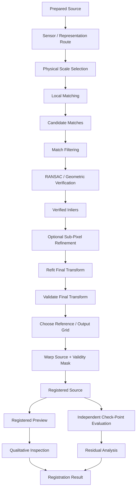
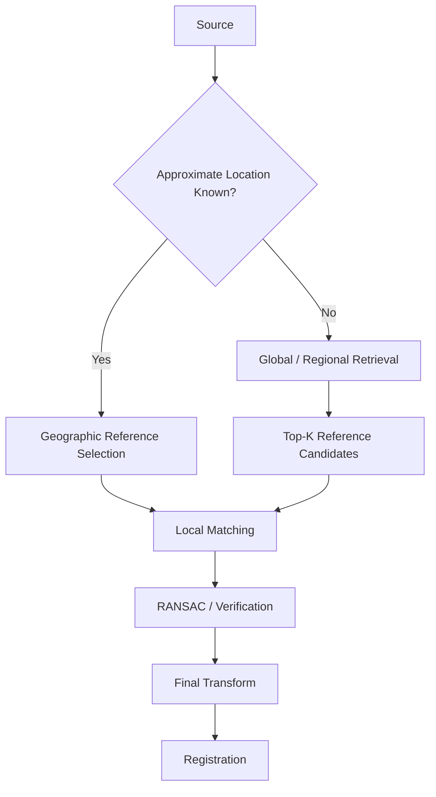
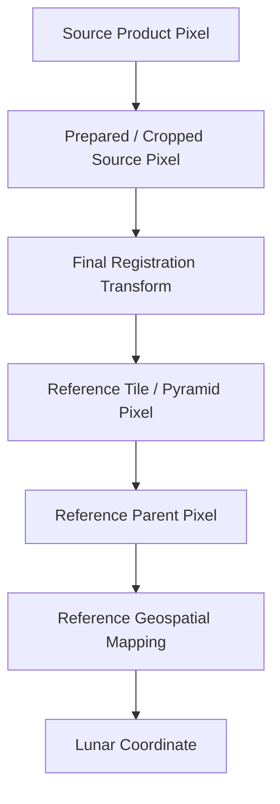

# Image Registration

Image registration is the stage in ChandraMap that converts a verified geometric relationship between lunar images into a traceable, spatially aligned result.

Registration begins only after ChandraMap has already established reliable geometric evidence through:

- sensor-aware preprocessing;
- physical scale preparation;
- local correspondence generation;
- match filtering;
- geometric verification;
- optional sub-pixel refinement;
- final transformation refitting.

The central principle is:

> **Registration aligns image coordinate systems using verified geometry; it does not prove correctness merely because two images can be visually overlaid.**

ChandraMap separates several operations that are often incorrectly treated as interchangeable:

> **Correspondence, transform estimation, warping, and evaluation are separate stages.**

Conceptually:

```text
Correspondence
→ identifies potentially related locations

Geometric Verification
→ rejects spatially inconsistent candidates

Transform Estimation
→ models the spatial relationship

Registration
→ applies and interprets the final geometric relationship

Evaluation
→ determines whether the alignment is actually accurate
```

Registration also follows a strict provenance rule:

> **Registration must preserve coordinate provenance.**

A registered result should remain traceable to:

- source asset;
- reference asset;
- source representation;
- reference representation;
- source coordinate space;
- reference coordinate space;
- crop and tile offsets;
- pyramid level;
- final transformation;
- transformation direction;
- output grid;
- interpolation policy;
- validity mask;
- registration configuration and version.

A fourth principle is fundamental for cross-resolution lunar registration:

> **Warping changes the sampling grid; it does not create new physical information.**

For example, warping TMC-2 or IIRS onto a fine LRO NAC grid may create a raster with many fine output pixels, but the source still contains only the spatial information originally measured by TMC-2 or IIRS.

Finally:

> **Registration quality must be demonstrated numerically, not only visually.**

Useful evidence includes:

- independent check-point RMSE;
- source-image pixel error;
- verified inlier count;
- inlier ratio;
- spatial coverage;
- residual patterns;
- runtime;
- success/failure status.

ChandraMap considers registration scientifically meaningful only when the source has a well-defined geometric relationship to the reference and that relationship can be evaluated reproducibly.

---

## 1. Registration in the ChandraMap Pipeline

The broader processing sequence is:

```text
Dataset Preparation
        ↓
Sensor Routing
        ↓
Preprocessing
        ↓
Physical Scale Handling
        ↓
Matching
        ↓
Match Filtering
        ↓
RANSAC / Geometric Verification
        ↓
Sub-Pixel Refinement
        ↓
Final Transform Refit
        ↓
Registration
        ↓
Residual Analysis
        ↓
Independent Evaluation
```

This document begins conceptually when a final transformation is available and ends when ChandraMap has produced a registered source representation and the information required to evaluate it.

The registration stage may include:

- final transform validation;
- output-grid definition;
- source raster warping;
- validity-mask propagation;
- registered-raster creation;
- diagnostic preview generation;
- registration provenance;
- result status.

Residual analysis and benchmark evaluation follow registration.

---

## 2. Registration Stage Boundary

The intended stage boundary is:

```text
Prepared Source / Reference
          ↓
       Matching
          ↓
   Match Filtering
          ↓
        RANSAC
          ↓
   Verified Inliers
          ↓
 Sub-Pixel Refinement
          ↓
  Final Transform Refit
          │
          ├── START REGISTRATION
          ↓
  Validate Final Transform
          ↓
 Choose Output / Reference Grid
          ↓
   Apply Geometric Warp
          ↓
 Propagate Validity / NoData
          ↓
  Registered Source Raster
          │
          └── END RASTER REGISTRATION
                 │
        ┌────────┴─────────┐
        ↓                  ↓
Registered Preview   Independent Evaluation
                           ↓
                  Registration Result
```

Not every registration run must generate every artifact.

For some workflows, the transformation itself may be the primary registration output and raster warping may be optional.

---

## 3. Registration Responsibilities

| Responsibility                                  | Registration Stage? |
| ----------------------------------------------- | ------------------: |
| Receive the final validated transform           |                 Yes |
| Validate transform metadata                     |                 Yes |
| Preserve source/reference coordinate provenance |                 Yes |
| Choose an output/reference grid                 |                 Yes |
| Warp source imagery where required              |                 Yes |
| Propagate validity masks and NoData             |                 Yes |
| Generate registered scientific raster           | Yes, when requested |
| Generate registered preview                     | Yes, when requested |
| Record registration configuration/version       |                 Yes |
| Detect image features                           |                  No |
| Generate descriptors                            |                  No |
| Generate candidate correspondences              |                  No |
| Decide RANSAC inliers                           |                  No |
| Perform global retrieval                        |                  No |
| Create independent truth                        |                  No |
| Build final lunar mosaic                        |          Downstream |
| Determine final benchmark accuracy              |    Evaluation stage |

---

# Core Terminology

## 4. Correspondence

A **correspondence** is a relationship between a location in the source image and a location in the reference image.

---

## 5. Candidate Correspondence

A **candidate correspondence** is a matcher-proposed point pair that has not yet passed geometric verification.

It must not be treated as a final registration control point merely because the matcher assigned it a strong score.

---

## 6. Verified Inlier

A **verified inlier** is a candidate correspondence accepted as geometrically consistent with the selected model during robust verification.

Verified inliers provide geometric evidence used to estimate or refine a transformation.

They are not automatically independent ground truth.

---

## 7. Transform

A **transform** is a mathematical mapping between explicitly defined coordinate spaces.

For example:

```text
prepared TMC-2 source pixels
        ↓
final affine transform
        ↓
NAC pyramid-level pixels
```

A transformation without direction and coordinate-space metadata is incomplete.

---

## 8. Registration

**Registration** is the process and resulting geometric relationship that brings source and reference imagery into a common alignment.

Registration may produce:

- a transformation record;
- transformed coordinates;
- a registered raster;
- a registered preview;
- related provenance and quality metrics.

---

## 9. Co-Registration

**Co-registration** refers broadly to aligning two or more datasets into a shared spatial frame.

In this document, **registration** is used as the primary term for source-to-reference alignment.

---

## 10. Warp

A **warp** is the raster-resampling operation used to map source image values into another grid using a geometric transformation.

Warping is one operation within registration.

---

## 11. Reprojection

**Reprojection** converts data between known geospatial coordinate systems.

It is not the same as estimating residual image misalignment from image correspondence.

---

## 12. Reference Grid

The **reference grid** is the pixel or geospatial grid onto which the source is registered.

It defines properties such as:

- dimensions;
- pixel spacing;
- origin;
- extent;
- projection where applicable.

---

## 13. Registered Source

The **registered source** is the source image or representation after it has been mapped into the chosen output/reference frame.

---

## 14. Registered Preview

A **registered preview** is a visualization-oriented registration output intended for inspection, documentation, or debugging.

It is not by itself scientific accuracy evidence.

---

## 15. Scientific Registered Raster

A **scientific registered raster** preserves appropriate:

- numeric precision;
- mask/NoData semantics;
- source provenance;
- transformation provenance;
- output-grid metadata;
- geospatial metadata where scientifically valid.

---

## 16. Overlap Region

The **overlap region** is the area where:

- registered source data are valid; and
- reference data are valid.

This is the primary region in which image-to-image comparison is meaningful.

---

## 17. Validity Mask

A **validity mask** identifies pixels that originate from valid source measurements after registration.

It helps distinguish:

```text
valid lunar data
```

from:

```text
empty / invalid output area
```

---

## 18. NoData

**NoData** indicates the absence of a valid measurement.

NoData pixels must not be interpreted as lunar intensity values.

---

## 19. Geolocation

**Geolocation** associates image coordinates with lunar geographic coordinates.

Image-to-image registration alone does not automatically provide trusted geolocation.

---

## 20. Mosaic

A **mosaic** combines multiple aligned images into a larger composite.

Mosaicking is downstream of validated registration.

It must not be used as the primary proof that correspondence accuracy is correct.

---

# Registration Input Assumptions

## 21. Required Inputs

Registration should assume that the pipeline already has, where applicable:

- source asset identity;
- reference asset identity;
- source representation;
- reference representation;
- source coordinate space;
- reference coordinate space;
- final accepted correspondence set;
- final transform;
- transform direction;
- source dimensions;
- reference dimensions;
- source validity mask;
- reference validity mask;
- crop offsets;
- tile offsets;
- pyramid-level metadata;
- projection/geospatial metadata where available.

---

## 22. What Registration Does Not Recompute

Registration should not normally be responsible for:

- downloading mission data;
- identifying the sensor from scratch;
- deciding the IIRS representation;
- creating raw candidate matches;
- performing match filtering;
- deciding RANSAC inliers;
- creating ground truth.

Those responsibilities belong upstream.

---

# Registration vs Correspondence

## 23. Correspondence Is Not Registration

Matching asks:

> **Which source and reference locations might correspond?**

Registration asks:

> **How should the source coordinate system be aligned with the reference coordinate system?**

A collection of point pairs alone is not yet a registered raster.

---

## 24. Verified Correspondence Is the Foundation

Registration should be based on:

- verified inliers;
- final fitted geometry;

rather than:

- raw matcher output;
- unverified candidate correspondences.

---

# Registration vs Geometric Verification

## 25. RANSAC Is Not Registration

RANSAC determines:

- which candidates are geometrically consistent;
- an initial robust transformation.

Registration uses the resulting final geometry to establish the aligned result.

Conceptually:

```text
RANSAC
→ verifies geometric consistency

Registration
→ applies the final geometry
```

See [`ransac.md`](ransac.md).

---

# Registration vs Transform Estimation

## 26. Transform Estimation

Transform estimation produces:

> **the mathematical mapping between coordinate spaces.**

Registration then uses that mapping for:

- coordinate conversion;
- raster alignment;
- output-grid mapping;
- preview generation;
- geospatial propagation where valid.

See [`transforms.md`](transforms.md).

---

## 27. Final Transform Should Be Used

The preferred final sequence is:

```text
RANSAC
→ Verified Inliers
→ Optional Sub-Pixel Refinement
→ Final Transform Refit
→ Registration
```

If correspondence coordinates were refined, do not blindly register with an outdated pre-refinement transform.

---

# Registration vs Warping

## 28. Warping Is One Registration Operation

Warping performs:

```text
source raster
+
transform
+
output grid
+
interpolation
        ↓
registered raster
```

Registration additionally requires:

- coordinate semantics;
- provenance;
- validity handling;
- transform identity;
- output interpretation;
- evaluation.

---

## 29. Registration Without Raster Warping

A transformation may itself be sufficient for some workflows.

Examples include:

- coordinate conversion;
- benchmark geometry;
- geolocation of selected points;
- downstream processing that applies the transform later.

A full raster warp should not be mandatory when it adds no scientific value.

---

# Registration vs Reprojection

## 30. Geospatial Reprojection

Reprojection uses known coordinate-reference information to convert:

```text
known map coordinate system A
→
known map coordinate system B
```

It does not infer unknown image misalignment from image features.

---

## 31. Image Registration

Registration estimates or refines spatial alignment using:

- image correspondences;
- robust geometry;
- known geometric constraints where applicable.

A dataset can be:

> correctly reprojected but still misregistered.

---

## 32. Reprojection Before Registration

Some workflows may first place products into compatible map projections and then use image registration to correct remaining alignment differences.

This can be scientifically useful.

It is not mandatory for every raw or sensor-model workflow.

---

# Registration vs Geolocation

## 33. Image-to-Image Registration

Registration may provide:

```text
source pixel
→ reference pixel
```

---

## 34. Geolocation Requires More

Geolocation additionally requires a valid mapping from:

```text
reference pixel
→ lunar geographic coordinate
```

Therefore:

```text
image registration
+
trusted reference geospatial metadata
→ possible geolocation
```

Registration alone is insufficient.

---

## 35. Geographic Accuracy Depends on the Reference

Even a geometrically precise image-to-image alignment can inherit uncertainty from:

- reference geolocation;
- projection metadata;
- reference processing;
- terrain model;
- planetary coordinate conventions.

---

# Registration vs Mosaicking

## 36. Mosaic Is Downstream

The correct conceptual sequence is:

```text
Correspondence
→ Geometry
→ Registration
→ Evaluation
→ Optional Mosaic
```

A visually smooth mosaic does not establish that:

- individual correspondences are correct;
- independent registration error is low.

---

# Coordinate Spaces

## 37. Registration Must Name Both Spaces

Examples include:

```text
prepared OHRC pixels
→ NAC pyramid-level pixels
```

or:

```text
TMC-2 crop pixels
→ map-projected NAC tile pixels
```

Coordinate-space identity is part of registration identity.

---

## 38. Source Coordinate Space

Possible source spaces include:

- full source product;
- prepared source raster;
- cropped source raster;
- model-resized source input;
- IIRS-derived 2D registration representation.

Do not confuse:

```text
model input coordinates
```

with:

```text
scientific source-product coordinates
```

unless the mapping between them is preserved.

---

## 39. Reference Coordinate Space

Possible reference spaces include:

- full NAC product;
- NAC tile;
- NAC pyramid level;
- WAC product;
- WAC mosaic tile;
- map-projected reference raster.

---

## 40. Coordinate Convention

Registration provenance should inherit or record the relevant convention for:

- `x/y`;
- row/column;
- origin;
- indexing;
- pixel-center interpretation.

Relevant dataset documentation includes:

- [`../datasets/metadata.md`](../datasets/metadata.md)
- [`../datasets/data-format.md`](../datasets/data-format.md)

---

# Transform Direction

## 41. Scientific Direction

A common ChandraMap registration direction is:

```text
source → reference
```

This answers:

> where does a source coordinate map in the chosen reference frame?

---

## 42. Reference-to-Source Direction

Some operations require:

```text
reference/output → source
```

especially raster resampling.

This does not mean the scientifically stored transform direction should become ambiguous.

---

## 43. Preserve `from_space` and `to_space`

A transform record should conceptually preserve:

```text
from_space = prepared_source_pixels
to_space   = nac_pyramid_level_pixels
```

A bare matrix file is insufficient.

---

# Output Grid

## 44. What the Output Grid Defines

The output grid determines the registered raster's:

- dimensions;
- pixel spacing;
- coordinate frame;
- origin;
- spatial extent;
- projection where applicable;
- reference level.

---

## 45. Reference-Grid Registration

A common strategy is:

> use the selected reference grid as the registered output grid.

Then the source is resampled into reference coordinates.

This simplifies:

- overlay;
- comparison;
- downstream reference-aligned processing.

---

## 46. Full Reference Grid

Using the full reference grid can be useful for:

- direct geospatial compatibility;
- whole-product visualization;
- downstream maps.

Potential drawback:

- large output regions may contain only NoData.

---

## 47. Local Overlap Grid

A compact local grid can be useful for:

- controlled benchmarks;
- debugging;
- local registration;
- smaller outputs.

No universal choice is required.

---

## 48. Output-Grid Provenance

Where applicable, preserve:

- reference asset;
- reference pyramid level;
- dimensions;
- pixel spacing;
- projection;
- geotransform;
- extent;
- output resolution.

---

# Image Warping

## 49. Forward Warping

Forward warping conceptually maps every source pixel into the output frame.

Potential issues include:

- output holes;
- multiple source pixels mapping to nearby output locations.

---

## 50. Inverse Warping

Inverse sampling conceptually asks:

> For each output pixel, where should its value be sampled from in the source?

This commonly avoids holes and supports standard interpolation.

---

## 51. Scientific Direction vs Sampling Direction

Suppose the stored scientific transform is:

```text
source → reference
```

A raster library may internally need:

```text
reference/output → source
```

for inverse sampling.

The implementation may therefore use an inverse matrix during raster resampling while preserving the original scientific transform direction.

---

# Interpolation

## 52. Why Interpolation Is Required

When a transformed sampling location lies between source pixel centers, the output value must be determined from nearby source samples.

This is the role of interpolation.

---

## 53. Candidate Interpolation Families

Possible methods include:

- nearest-neighbor;
- bilinear;
- bicubic;
- higher-order interpolation.

No one method is prescribed universally.

---

## 54. Interpolation Policy Depends on Data Use

Selection may depend on:

- scientific raster vs preview;
- source data type;
- band semantics;
- mask behavior;
- downstream quantitative requirements.

---

## 55. Document Interpolation

A registered scientific raster should preserve which interpolation method was used where that choice can affect the result.

---

# Warping Does Not Increase Resolution

## 56. Core Physical Rule

> **Warping changes the output sampling grid; it does not increase the source sensor's physical information content.**

---

## 57. TMC-2 Example

If TMC-2 is warped onto a fine NAC grid:

```text
coarse TMC-2 source
        ↓
fine NAC output grid
        ↓
many output pixels
```

the new raster still contains information limited by TMC-2.

It does not recover fine terrain structures that TMC-2 never measured.

---

## 58. IIRS Example

The same rule is even more important for IIRS.

Warping an IIRS-derived registration representation onto a fine NAC grid does not turn IIRS into fine-resolution panchromatic imagery.

---

## 59. Fine Output Grid Is Not Fine Source Accuracy

A fine destination grid provides:

- convenient coordinate alignment;
- dense output sampling.

It does not prove:

- fine physical source resolution;
- equivalent fine ground accuracy.

---

# Repeated Resampling

## 60. Avoid Unnecessary Rewarping

Repeatedly warping already warped images can introduce:

- blur;
- ringing;
- interpolation artifacts;
- numeric changes;
- mask degradation.

---

## 61. Prefer a Stable Parent Source

Where practical:

```text
final composed transform
+
stable parent source
→ final registered raster
```

is preferable to:

```text
source
→ intermediate warp
→ another warp
→ another warp
```

---

# Scientific Raster vs Preview

## 62. Different Purposes

| Property               | Scientific Registered Raster             | Registered Preview      |
| ---------------------- | ---------------------------------------- | ----------------------- |
| Primary purpose        | Scientific processing / analysis         | Visualization           |
| Numeric precision      | Preserve as appropriate                  | Display-oriented        |
| Dynamic range          | Preserve scientific values where needed  | May be stretched        |
| Compression            | Prefer scientifically appropriate format | Lossy may be acceptable |
| Geospatial metadata    | Preserve where valid                     | Optional                |
| Validity mask          | Important                                | May be simplified       |
| Provenance             | Required                                 | Should remain traceable |
| Benchmark truth source | Can support downstream analysis          | No                      |

---

## 63. Preview Is Not the Scientific Product

A PNG or JPEG overlay may be useful for documentation.

It should not replace:

- scientific raster;
- transform record;
- validity mask;
- independent metrics.

---

# Scientific Image Values

## 64. Preserve Numeric Meaning

Scientific registration should avoid unnecessary conversion that alters:

- dynamic range;
- quantitative radiometry;
- band semantics.

The exact data-type policy belongs to data-format and implementation documentation.

---

## 65. Visualization Conversion Is Separate

A display preview may use:

- scaling;
- normalization;
- 8-bit conversion.

Such changes should be treated as visualization-only processing.

---

# IIRS Registration Output

## 66. Registration Representation vs Full Cube

IIRS must first use a documented registration-friendly 2D representation.

Examples may include:

- selected band;
- PCA-derived representation;
- structural representation.

If this representation is registered, the result is:

> a registered IIRS registration representation.

It is not automatically:

> a registered full hyperspectral cube.

---

## 67. Full-Cube Propagation Is Separate

A future or advanced workflow may apply a valid spatial mapping to the full IIRS cube.

Such processing requires careful handling of:

- spatial dimensions;
- spectral bands;
- wavelength metadata;
- NoData;
- interpolation;
- storage;
- spectral integrity.

This should not be assumed implemented unless confirmed by authoritative repository documentation.

---

## 68. Output Type Must Be Explicit

Clearly distinguish:

- registered 2D matcher representation;
- registered source band;
- registered full cube;
- visualization preview.

---

# Masks and NoData

## 69. Propagate Source Validity

When source imagery is warped, its validity mask should be transformed consistently.

Conceptually:

```text
source image
+
source validity mask
        ↓
registration warp
        ↓
registered source
+
registered validity mask
```

---

## 70. NoData Is Not Terrain

Do not interpolate NoData as though it were:

- zero-reflectance terrain;
- black lunar surface;
- a valid intensity sample.

---

## 71. Mask-Aware Interpolation

Where interpolation uses several neighboring source pixels, invalid neighbors may need special handling.

The exact policy is implementation-dependent and should be documented.

---

## 72. Boundary Effects

Warped edges may contain:

- partial interpolation support;
- invalid map-projection borders;
- source coverage limits.

These should be represented through:

- NoData;
- validity mask;
- output metadata.

---

# Overlap Region

## 73. Valid Registered Overlap

The valid overlap is where:

```text
registered source valid
AND
reference valid
```

Both conditions matter.

---

## 74. Overlap Mask

A conceptual overlap mask may support:

- diagnostic visualization;
- valid comparison region;
- residual maps;
- downstream statistics.

---

## 75. Do Not Evaluate Empty Regions

Do not calculate image-comparison statistics over output areas where:

- source is NoData; or
- reference is invalid.

---

# Scale Pyramid and Registration

## 76. Registration Belongs to a Reference Level

If the final geometry is defined against:

```text
NAC pyramid level L
```

then the immediate registration frame is that level.

The transform should not silently be interpreted as mapping directly into native NAC coordinates.

---

## 77. Level-to-Base Mapping

Moving registration to another reference level may require:

- scale conversion;
- crop/tile offsets;
- pixel-center convention;
- parent-level lineage.

See [`scale-pyramid.md`](scale-pyramid.md).

---

## 78. Do Not Blindly Reuse a Matrix Across Levels

Transform coefficients are coordinate-system dependent.

A transformation estimated for:

```text
source → NAC level 3
```

cannot automatically be treated as:

```text
source → NAC level 0
```

without proper coordinate conversion or refitting.

---

# Coarse-to-Fine Registration

## 79. Coarse Stage

Coarse registration aims to:

- establish broad alignment;
- reduce uncertainty;
- use terrain structures visible in both datasets.

---

## 80. Finer Stage

A finer stage may:

- move to a compatible finer reference representation;
- rematch or locally refine correspondences;
- estimate updated geometry.

---

## 81. Coarse-to-Fine Concept

```text
coarse reference level
        ↓
coarse correspondences
        ↓
coarse geometric verification
        ↓
coarse transform
        ↓
predict finer search region
        ↓
finer compatible matching
        ↓
refit geometry
        ↓
registered output
```

---

## 82. Refinement Must Stop at a Meaningful Scale

Do not continue automatically to the finest available reference.

Stop when:

- source information no longer supports finer detail;
- finer matching becomes unstable;
- independent error stops improving;
- spatial coverage degrades;
- finer registration becomes physically meaningless.

No universal stopping threshold is defined here.

---

# Sensor-Specific Registration

## 83. OHRC Context

OHRC is the Chandrayaan-2 **Orbiter High Resolution Camera**.

Current project documentation commonly treats its GSD as approximately:

> **~0.25–0.32 m/pixel**

depending on product/documentation.

Actual product metadata remains authoritative.

---

## 84. OHRC → NAC

A common conceptual role is fine local registration.

Important considerations include:

- actual OHRC GSD;
- actual NAC GSD;
- reference pyramid level;
- illumination differences;
- fine shadow structure;
- terrain relief;
- spatial coverage.

Fine resolution does not guarantee perfect alignment.

---

## 85. OHRC → WAC

WAC may be more useful for:

- broad context;
- coarse alignment;
- retrieval support.

Do not assume WAC provides sufficient spatial detail for the final fine OHRC registration stage.

---

# TMC-2 Registration

## 86. TMC-2 Context

TMC-2 is the Chandrayaan-2 **Terrain Mapping Camera-2**.

Current project planning commonly uses approximately:

> **~5 m/pixel**

with actual metadata remaining authoritative.

---

## 87. TMC-2 → NAC

A conceptually appropriate route may be:

```text
TMC-2
        ↓
GSD-aware NAC pyramid level
        ↓
local matching
        ↓
verified geometry
        ↓
registration
```

Using native fine NAC by default may expose terrain detail that is absent from TMC-2.

---

## 88. TMC-2 on Fine Output Grid

A TMC-2 source can be expressed on a fine NAC output grid for:

- overlay;
- map integration;
- visualization.

The resulting raster still contains TMC-2-scale information.

---

## 89. TMC-2 → WAC

WAC may support coarse or structural registration depending on actual product scale and overlap.

Its suitability should be determined by product metadata and benchmarks.

---

# IIRS Registration

## 90. IIRS Context

IIRS is the Chandrayaan-2 **Imaging Infrared Spectrometer**.

Project-level approximations include:

- approximately ~80 m/pixel;
- approximately ~0.8–5.0 µm spectral coverage;
- roughly ~250–256 bands depending on product/documentation.

Actual mission-product metadata remains authoritative.

---

## 91. IIRS Requires a 2D Registration Representation

The correct conceptual order is:

```text
IIRS Scientific Product
        ↓
Documented 2D Registration Representation
        ↓
Physical Scale Preparation
        ↓
Matching / Geometry
        ↓
Registration
```

Do not treat the full hyperspectral cube as an ordinary grayscale matcher input.

---

## 92. IIRS → NAC

A likely research path is:

```text
IIRS-derived representation
        ↓
strongly scale-compatible NAC level
        ↓
multimodal correspondence
        ↓
verified geometry
        ↓
registered representation
```

A fine NAC output grid must not be interpreted as fine-resolution IIRS measurement.

---

## 93. IIRS → WAC

WAC may support:

- broad localization;
- coarse structural registration;
- multimodal contextual comparison.

Actual suitability is product-dependent.

---

## 94. IIRS Physical Interpretation

The most important rule is:

> **Fine output coordinates do not override IIRS's coarse source information.**

A registered IIRS representation may have fractional output coordinates or a dense fine grid while still representing coarse underlying measurements.

---

# LRO NAC Reference Role

## 95. NAC Context

LRO NAC is ChandraMap's fine/local reference family.

Current project planning often treats NAC imagery as approximately:

> **~0.5–2 m/pixel**

depending on product/acquisition geometry.

Actual product metadata remains authoritative.

---

## 96. NAC as Reference Grid

NAC may provide:

- final local reference;
- pyramid levels;
- map-projected reference grid;
- fine coordinate frame.

The selected level must remain explicit.

---

# LRO WAC Reference Role

## 97. WAC Context

LRO WAC provides broad/global/coarse lunar imagery.

Its effective scale depends on:

- product;
- mode;
- processing.

Do not assign one universal WAC GSD.

---

## 98. WAC Roles

WAC may support:

- coarse registration;
- context;
- retrieval;
- regional localization;
- WAC-to-NAC handoff.

It should not automatically be treated as the final fine-registration reference.

---

# Known-Location Registration

## 99. Known Geographic Region

If reliable metadata already identifies the approximate lunar region:

```text
source metadata
        ↓
reference-region selection
        ↓
local matching
        ↓
geometry
        ↓
registration
```

Global retrieval is unnecessary unless the benchmark deliberately hides location information.

---

## 100. Metadata Constraints Are Valid Engineering

Useful metadata may include:

- footprint;
- latitude/longitude;
- projection;
- product geometry;
- acquisition metadata.

Using valid metadata to reduce search is not inherently improper.

---

# Unknown-Location Registration

## 101. Retrieval Before Registration

When the source region is not known:

```text
source query
        ↓
global/reference retrieval
        ↓
Top-K candidate regions
        ↓
local matching
        ↓
RANSAC
        ↓
final transform
        ↓
registration
```

---

## 102. Retrieval and Registration Are Different

Retrieval answers:

> **Where should ChandraMap look?**

Registration answers:

> **How should the source be geometrically aligned with that candidate reference?**

---

## 103. Retrieval Success Is Not Registration Success

A highly ranked candidate reference must still pass:

- local matching;
- geometric verification;
- transformation validation;
- registration evaluation.

---

## 104. Multiple Candidate Registrations

Top-K reference candidates may each produce:

- successful local geometry;
- insufficient correspondence;
- RANSAC failure;
- unstable transformation.

Local geometric evidence is therefore an important candidate-validation signal.

---

# Transform Validation Before Warping

## 105. Validate the Final Model

Before creating a registered raster, verify conceptually that:

- transform exists;
- model type is known;
- coefficients are finite;
- transform direction is known;
- source coordinate space is known;
- reference coordinate space is known;
- pyramid level is known;
- crop/tile offsets are known;
- inversion is possible if required;
- model is not obviously degenerate.

---

## 106. Invalid Transform Means No Valid Warp

If the transformation is:

- missing;
- non-finite;
- singular where inversion is required;
- associated with unknown coordinate spaces;

the pipeline should fail explicitly.

Do not create a misleading registered image.

---

# Registered Preview

## 107. Purpose of a Preview

A registered preview can help detect:

- flips;
- large offsets;
- wrong crop;
- wrong transform direction;
- obvious scale errors;
- visually poor alignment.

---

## 108. Visualization Methods

Possible diagnostic presentations include:

- alpha blend;
- checkerboard;
- blink comparison;
- side-by-side view;
- edge overlay.

No one method is scientifically superior for every pair.

---

## 109. Visual Overlay Is Diagnostic Only

> **A visually convincing overlay is not proof of accurate registration.**

Visual inspection may miss:

- small systematic shifts;
- edge-region errors;
- topographic residuals;
- overfitting;
- clustered control.

Use quantitative evaluation.

---

# Registration Evaluation

## 110. Independent Evaluation Principle

Where independent truth exists, evaluate the final transform using held-out check points.

Relevant documentation includes:

- [`residual-analysis.md`](residual-analysis.md)
- [`../datasets/ground-truth-preparation.md`](../datasets/ground-truth-preparation.md)

---

## 111. Fit Residual vs Registration Error

A **fit residual** measures consistency with points used to estimate the transformation.

A **check-point residual** evaluates held-out correspondences.

These should not be merged into one unlabeled error number.

---

## 112. Source-Image Pixel Error

Where mathematically valid, report error first in source-image pixel space.

For example:

```text
OHRC source
→ OHRC-space error
```

```text
TMC-2 source
→ TMC-2-space error
```

```text
IIRS source representation
→ IIRS-grid error
```

---

## 113. Reference-Space Error

Reference-space error may also be useful.

Always identify:

- reference product;
- reference level;
- pixel grid;
- units.

---

## 114. Ground-Distance Error

Ground-distance conversion is appropriate only when supported by:

- valid source/reference geospatial mapping;
- correct coordinate interpretation;
- product-specific scale information;
- valid truth.

Do not blindly compute:

```text
pixel RMSE × generic approximate GSD
```

and present it as precise ground error.

---

# Registration Quality Metrics

## 115. Core Metrics

Useful registration metrics include:

- candidate count;
- filtered candidate count;
- verified inlier count;
- inlier ratio;
- verified spatial coverage;
- fit residual;
- independent check-point RMSE;
- median check residual;
- source-image pixel error;
- ground error where scientifically valid;
- runtime;
- success/failure status.

---

## 116. Candidate Count Is Diagnostic

Many candidate correspondences can still produce:

- few verified inliers;
- weak geometry;
- poor independent accuracy.

Candidate count is not registration accuracy.

---

## 117. Inlier Count Is Not Enough

Many inliers concentrated in one small region can provide weak whole-image support.

---

## 118. Inlier Ratio Is Not Enough

A high inlier ratio may occur with:

- very few candidates;
- spatially clustered support.

It should be interpreted with:

- count;
- coverage;
- independent error.

---

## 119. Spatial Coverage Matters

Verified correspondences should ideally cover the usable overlap.

Potential coverage measures include:

- grid occupancy;
- convex-hull coverage.

Exact definitions belong to the benchmark specification.

---

# Runtime

## 120. Registration Runtime Components

Runtime may be reported separately for:

- matching;
- geometric verification;
- sub-pixel refinement;
- transform fitting;
- raster warping.

If retrieval is also used, retrieval runtime should remain distinguishable from local registration time where practical.

---

# Registration Success and Failure

## 121. No Universal Success Threshold

ChandraMap should not define:

```text
RMSE < X
→ success
```

for every sensor and benchmark unless an authoritative benchmark specification establishes that criterion.

Acceptable error depends on:

- source GSD;
- truth quality;
- benchmark category;
- intended downstream use.

---

## 122. Registration Success Requires More Than a Matrix

A useful successful result generally requires:

- valid transform;
- sufficient geometric support;
- meaningful spatial coverage;
- valid coordinate provenance;
- valid output generation where requested;
- evaluation evidence where truth exists.

---

## 123. Failure Is a Valid Scientific Result

Possible failure states include:

- reference unavailable;
- retrieval failure;
- no candidates;
- insufficient filtered matches;
- RANSAC failure;
- unstable transformation;
- refinement failure;
- warp failure;
- independent truth unavailable.

Do not hide failed cases.

---

# Registration Failure Modes

## 124. Diagnostic Table

| Symptom                                       | Possible Cause                                      | Diagnostic / Response                                            |
| --------------------------------------------- | --------------------------------------------------- | ---------------------------------------------------------------- |
| No registered output                          | Upstream matching or RANSAC failure                 | Record the actual failure stage                                  |
| Image appears flipped                         | Transform direction error                           | Verify source/reference mapping                                  |
| Constant shift remains                        | Crop/tile offset lost                               | Repair coordinate lineage                                        |
| Center aligns but edges do not                | Model, projection, or relief limitation             | Inspect residual field                                           |
| TMC-2 appears blurry on NAC grid              | Coarse source sampling                              | Do not treat expected resolution difference as automatic failure |
| IIRS appears pixelated on fine grid           | Source is much coarser                              | Preserve physical interpretation                                 |
| Output mostly NoData                          | Wrong grid, inverse mapping, or transform direction | Validate output grid and warp                                    |
| Strong border artifacts                       | NoData or mask interpolation issue                  | Fix validity handling                                            |
| Good overlay but poor check RMSE              | Visual inspection misleading or model inadequate    | Prefer independent metrics                                       |
| Coarse level works but fine level fails       | Source lacks fine detail or level is unsuitable     | Stop at meaningful scale                                         |
| Geometry succeeds but raster output fails     | Warp/output-generation problem                      | Separate geometry success from output failure                    |
| Geolocation inconsistent despite good overlay | Reference geospatial chain may be wrong             | Validate reference metadata and coordinate mapping               |

---

# Residual Analysis

## 125. Residuals Complete the Registration Story

After registration, inspect:

- fit residuals;
- independent check residuals;
- vector direction;
- spatial error patterns.

See [`residual-analysis.md`](residual-analysis.md).

---

## 126. Structured Residuals

Residual patterns may indicate:

- projection mismatch;
- scale mismatch;
- inappropriate transform;
- terrain relief;
- crop/tile offset error;
- incorrect coordinate convention.

Do not automatically attribute every residual pattern to the matcher.

---

# Lunar Relief and Viewing Geometry

## 127. Lunar Terrain Is Non-Planar

The lunar surface contains:

- crater depth;
- rims;
- ridges;
- slopes;
- mountains.

A single planar affine or homography model may provide a useful local approximation but cannot represent every possible three-dimensional viewing effect.

---

## 128. Relief-Limited Registration

Possible symptoms include:

- different residual behavior on crater walls and plains;
- alignment quality changing spatially;
- increasing edge residuals;
- systematic local deformation.

---

## 129. Advanced Geometry

Future versions may explore:

- piecewise transforms;
- local homographies;
- mesh warps;
- displacement fields;
- DEM-aware registration;
- physical sensor models.

These are advanced research directions and should not be mandatory V1 components unless the authoritative version scope says otherwise.

---

# Registered Image vs Georeferenced Image

## 130. Registered Image

A registered image is aligned geometrically to a reference coordinate frame.

It may still lack trusted geographic coordinates.

---

## 131. Georeferenced Registered Image

A georeferenced registered output additionally has a scientifically valid mapping to lunar geographic coordinates.

This requires valid:

- reference CRS;
- projection;
- geotransform;
- parent reference geometry.

---

## 132. Geospatial Reference Inheritance

If the source is warped directly into a trusted map-projected reference grid, the registered output may use that grid's geospatial framework provided that:

- the transformation is valid;
- the output really uses that reference grid;
- the reference geospatial metadata are valid.

This inheritance should be explicit rather than assumed.

---

## 133. Geolocation Chain

Conceptually:

```text
Source Product Pixel
        ↓
Prepared Source Coordinate
        ↓
Final Registration Transform
        ↓
Reference Pixel
        ↓
Reference Geospatial Mapping
        ↓
Lunar Coordinate
```

Not every registration run reaches the final geographic stage.

---

# Multi-Band Registration

## 134. Multi-Band Source Data

A common spatial transformation may be applied across several bands only when the bands share a valid spatial grid/alignment relationship.

Do not assume perfect inter-band alignment without product documentation.

---

## 135. IIRS Full-Cube Registration

If a future workflow warps a full IIRS cube, preserve:

- band count;
- wavelength metadata;
- spatial dimensions;
- NoData;
- mask;
- spatial transform provenance.

This remains a distinct operation from registering the 2D representation used for correspondence.

---

# Registered Output Provenance

## 136. Registration Result Must Be Traceable

A registration result should identify where applicable:

- registration ID;
- pair ID;
- source asset;
- reference asset;
- source representation;
- reference representation;
- final transform ID;
- model type;
- transform direction;
- source coordinate space;
- reference coordinate space;
- reference pyramid level;
- output grid;
- interpolation method;
- NoData policy;
- mask policy;
- registration version.

---

# Conceptual Registration Record

## 137. Illustrative Structure

The following is an **illustrative conceptual structure — not an implemented schema**:

```yaml
registration_id: "PLACEHOLDER_REGISTRATION_ID"
pair_id: "PLACEHOLDER_PAIR_ID"

source:
  asset_id: "PLACEHOLDER_SOURCE"
  representation_id: "PLACEHOLDER_REPRESENTATION"
  coordinate_space: "PLACEHOLDER_SOURCE_SPACE"

reference:
  asset_id: "PLACEHOLDER_REFERENCE"
  coordinate_space: "PLACEHOLDER_REFERENCE_SPACE"
  pyramid_level: "PLACEHOLDER_LEVEL"

transform:
  id: "PLACEHOLDER_TRANSFORM"
  direction: "source_to_reference"
  model: "PLACEHOLDER_MODEL"

output:
  grid: "PLACEHOLDER_REFERENCE_GRID"
  interpolation: "PLACEHOLDER_METHOD"
  nodata_policy: "PLACEHOLDER_POLICY"

status: "PLACEHOLDER_STATUS"
registration_version: "PLACEHOLDER_VERSION"
```

No real product IDs, benchmark values, repository field names, or implementation defaults are implied.

---

# Registered Raster Metadata

## 138. Scientific Raster Record

A registered raster may conceptually preserve:

- source asset identity;
- reference-grid identity;
- output dimensions;
- data type;
- band structure;
- NoData value/policy;
- validity-mask identity;
- projection/geotransform where valid;
- transform ID;
- checksum;
- processing/version metadata.

The exact schema belongs to repository contracts.

---

# Reproducibility

## 139. Reproducible Registration Run

A benchmark registration should be reproducible from:

- exact pair/version;
- dataset/preparation version;
- source representation;
- reference representation;
- scale-pyramid configuration;
- matcher/version;
- match-filter configuration;
- RANSAC configuration;
- refinement configuration;
- final transform;
- output-grid definition;
- interpolation policy;
- mask/NoData policy;
- code/software version;
- benchmark version;
- truth version.

---

## 140. Manual Unrecorded Alignment Is Not Reproducible

Do not:

- drag;
- rotate;
- scale;
- shift;

a registered result manually and then present it as algorithmic output.

Manual adjustments must be:

- absent; or
- explicitly documented as manual/debug operations.

---

# Registration Artifacts

## 141. Possible Outputs

Depending on the workflow, registration may produce:

- final transformation record;
- registered scientific raster;
- registered validity mask;
- registered preview;
- residual report;
- benchmark metrics/result record.

Not every V1 run needs every artifact.

---

## 142. Derived Output Policy

Registered rasters are usually derived from:

```text
source
+
reference
+
transform
+
warp configuration
```

Where practical, they should be regenerable.

Large derived mission-data artifacts should follow repository storage and licensing policies rather than being committed blindly.

---

# Cache and Staleness

## 143. Registered Output Can Become Stale

A registered raster may need regeneration if any of the following changes:

- source representation;
- reference representation;
- final transform;
- refinement result;
- output grid;
- interpolation method;
- mask policy;
- registration configuration.

---

## 144. Preserve Cache Provenance

If caching is used, cache identity should depend on relevant inputs/configuration so that an old registered raster is not reused after geometry changes.

---

# Registration Result Contract

## 145. Conceptual Requirement

A successful ChandraMap registration should provide enough information to determine:

- what was registered;
- to which reference;
- using which transform;
- in which coordinate systems;
- at which scale;
- with which output grid;
- with which interpolation/validity policy;
- with what measured quality;
- under which configuration/version.

This is a conceptual scientific requirement rather than a mandatory software API.

---

# Benchmarking Registration

## 146. Same-Pair Rule

Compare registration methods using the same:

- source asset;
- reference asset;
- pair version.

---

## 147. Same-Truth Rule

Use the same:

- ground-truth/check points;
- truth version;
- error definitions.

---

## 148. Same-Scale Rule

If testing transform or refinement behavior, keep the reference scale constant.

If testing scale strategy, hold other major algorithmic settings constant where practical.

---

## 149. Same-Warp Rule

If the experiment is intended to compare transformation accuracy, keep:

- output grid;
- interpolation;
- mask policy;

fixed unless those are the variables under study.

---

# Registration Ablations

## 150. Transform Model

A controlled experiment may compare:

```text
Affine
vs.
Homography
```

while holding correspondence evidence and truth constant.

---

## 151. Sub-Pixel Refinement

Compare:

```text
no explicit refinement
```

with:

```text
verified-inlier refinement + final refit
```

using the same independent check points.

---

## 152. Scale Strategy

Compare:

```text
native/full-resolution reference
```

with:

```text
GSD-aware reference level
```

while keeping other factors controlled.

---

## 153. Matcher

Possible matcher comparisons include:

- SIFT;
- ALIKED + LightGlue;
- LoFTR.

Downstream verification/evaluation should remain comparable.

---

## 154. Illumination Representation

Possible controlled input comparisons include:

- prepared intensity;
- normalized representation;
- structural representation.

Do not change multiple unrelated factors and attribute all improvement to one stage.

---

# Registration Benchmark Table

## 155. Conceptual Results Template

| Pair      | Source   | Reference   | Matcher   | Transform   | Inliers | Coverage | Check RMSE | Source-Pixel Error | Ground Error | Runtime | Status |
| --------- | -------- | ----------- | --------- | ----------- | ------: | -------: | ---------: | -----------------: | -----------: | ------: | ------ |
| `PAIR_ID` | `SOURCE` | `REFERENCE` | `MATCHER` | `TRANSFORM` |       — |        — |          — |                  — |          N/A |       — | —      |

Only measured values should populate the table.

Use `N/A` when ground-distance error is not scientifically justified.

---

# Diagnostic Artifact Roles

## 156. Artifact Interpretation

| Artifact                      | Scientific Role                     |
| ----------------------------- | ----------------------------------- |
| Candidate-match visualization | Correspondence debugging            |
| Inlier visualization          | Geometric-verification debugging    |
| Registered overlay            | Qualitative registration inspection |
| Residual-vector plot          | Error diagnosis                     |
| Scientific registered raster  | Downstream quantitative use         |
| Mosaic                        | Downstream demonstration            |

---

# Versioned Registration Strategy

## 157. V1 — Simple and Measurable

V1 should prioritize:

- known-overlap pairs;
- sensor-specific minimal preparation;
- physically reasonable reference scale;
- SIFT baseline;
- match filtering;
- RANSAC;
- configured affine/homography model according to authoritative V1 scope;
- optional verified-inlier refinement;
- final transform;
- registered preview;
- independent numerical evaluation.

V1 should emphasize:

- reproducibility;
- transparent coordinate handling;
- clear metrics;
- explicit failure reporting.

It does not need:

- global retrieval;
- automatic WAC-to-NAC hierarchy;
- DEM-aware geometry;
- advanced local warping;

unless the V1 specification explicitly requires them.

---

## 158. V2 — Stronger Registration Diagnostics

Possible V2 additions include:

- stronger scale-pyramid handling;
- controlled illumination representations;
- improved sub-pixel refinement;
- affine-vs-homography benchmarks;
- residual-vector diagnostics;
- IIRS registration experiments;
- more difficult sensor-pair stress tests.

---

## 159. V3 — Retrieval and Learned Registration

Possible V3 additions include:

- global reference retrieval;
- WAC/NAC coarse-to-fine routing;
- ALIKED + LightGlue;
- LoFTR;
- multi-scale registration;
- Top-K local verification;
- improved registration artifact management.

---

## 160. V4 — Advanced Research Registration

Possible V4 research directions include:

- RIFT/CFOG-style multimodal matching;
- lunar-specific learned representations;
- local or piecewise transformations;
- DEM-aware geometry;
- sensor-model registration;
- uncertainty-aware registration;
- multi-mission registration;
- advanced IIRS spatial/spectral registration.

These are research directions, not implementation-status claims.

Authoritative version specifications remain definitive.

---

# Main Registration Flow

## 161. Registration Pipeline



---

# Known vs Unknown Location

## 162. Routing Difference



Retrieval determines where to search.

Registration determines how to align the selected source/reference pair.

---

# Coordinate Registration Chain

## 163. End-to-End Mapping



Not every run necessarily reaches the final geographic coordinate stage.

---

# Quality Control

## 164. Registration QC Checklist

Before accepting a registration result, verify:

- [ ] Source asset is known.
- [ ] Reference asset is known.
- [ ] Source representation is known.
- [ ] Reference representation is known.
- [ ] Final transform exists.
- [ ] Transform model is known.
- [ ] Transform direction is explicit.
- [ ] Source coordinate space is known.
- [ ] Reference coordinate space is known.
- [ ] Pyramid level is recorded.
- [ ] Crop/tile offsets are preserved.
- [ ] Transform coefficients are finite.
- [ ] Transform inversion is valid where required.
- [ ] Output grid is defined.
- [ ] Interpolation method is documented.
- [ ] Source validity mask is handled where applicable.
- [ ] NoData policy is documented.
- [ ] Registered raster dimensions are valid.
- [ ] Registered mask aligns with output raster.
- [ ] Geospatial metadata are valid where claimed.
- [ ] Transform ID is recorded.
- [ ] Registration version/configuration is recorded.
- [ ] Independent evaluation is performed where truth exists.
- [ ] Failure state is explicit.

---

# Registered Output Validation

## 165. Shape and Bounds

Before saving the result, verify:

- output dimensions;
- expected array shape;
- band structure;
- mask dimensions.

---

## 166. Numeric Validation

Where appropriate, inspect:

- finite values;
- data type;
- expected dynamic range;
- NoData behavior;
- unexpected clipping.

No universal numeric thresholds are defined here.

---

## 167. Geospatial Validation

If the output claims georeferencing, verify:

- CRS/lunar coordinate system;
- map projection;
- geotransform;
- extent;
- reference-grid consistency.

---

# Registration Failure Handling

## 168. No Silent Identity Fallback

Do not silently return:

```text
identity transform
```

when registration fails.

That can create a false-looking aligned output.

If identity alignment is intentionally used for:

- debugging;
- baseline comparison;

label it explicitly.

---

## 169. Geometry Success Without Evaluation

If the final transform exists but independent truth does not, report:

> registration geometry available; independent accuracy not verified.

Do not fabricate check-point error.

---

## 170. Geometry Success but Warp Failure

Separate:

```text
geometric registration success
```

from:

```text
registered-raster generation failure
```

This distinction is useful for debugging.

---

# Stable Artifact Naming

## 171. Naming Principle

Registration artifacts should preferably include or be traceable through:

- source identity;
- reference identity;
- registration/run identity.

Avoid ambiguous names such as:

- `final.png`;
- `output2.tif`;
- `best_registration.tif`.

Exact naming syntax belongs to repository conventions.

---

# Relationship to Algorithm Overview

## 172. [`overview.md`](overview.md)

[`overview.md`](overview.md) describes the complete algorithmic stack.

This file focuses on the stage that turns final validated geometry into an aligned registration result.

---

# Relationship to Sensor Routing

## 173. [`sensor-routing.md`](sensor-routing.md)

[`sensor-routing.md`](sensor-routing.md) determines:

- source sensor path;
- representation path;
- reference family;
- known-location vs retrieval route;
- matcher family.

Registration consumes the final geometry produced by that routed path.

---

# Relationship to Preprocessing

## 174. [`preprocessing.md`](preprocessing.md)

[`preprocessing.md`](preprocessing.md) prepares the scientific imagery for matching.

Registration should not silently repeat or redefine those representation changes.

---

# Relationship to Illumination Handling

## 175. [`illumination-handling.md`](illumination-handling.md)

Illumination handling attempts to improve correspondence robustness.

Registration geometry cannot recover:

- terrain hidden by shadows;
- information never observed by the source.

---

# Relationship to Scale Pyramid

## 176. [`scale-pyramid.md`](scale-pyramid.md)

[`scale-pyramid.md`](scale-pyramid.md) defines the physical reference-scale hierarchy.

Registration must preserve the exact pyramid level used during geometry or correctly map the transformation into another grid.

---

# Relationship to Matching

## 177. [`matching.md`](matching.md)

[`matching.md`](matching.md) proposes local correspondences.

Matching alone does not produce the final registered source raster.

---

# Relationship to Match Filtering

## 178. [`match-filtering.md`](match-filtering.md)

[`match-filtering.md`](match-filtering.md) removes obvious invalid or ambiguous matcher candidates.

Registration occurs only after geometric verification and final transform estimation.

---

# Relationship to RANSAC

## 179. [`ransac.md`](ransac.md)

[`ransac.md`](ransac.md) identifies geometrically consistent correspondences and estimates robust initial geometry.

Registration should use the final validated/refit transformation rather than raw RANSAC candidates alone.

---

# Relationship to Sub-Pixel Refinement

## 180. [`subpixel-refinement.md`](subpixel-refinement.md)

Verified inliers may be locally refined after RANSAC.

If their coordinates change:

> refit the transform before producing the final registration.

---

# Relationship to Transforms

## 181. [`transforms.md`](transforms.md)

The distinction is:

```text
transforms.md
→ defines geometric model meaning
→ direction
→ coordinate spaces
→ composition
→ inversion

registration.md
→ validates and applies the final model
→ defines output grid
→ produces aligned result
```

---

# Relationship to Residual Analysis

## 182. [`residual-analysis.md`](residual-analysis.md)

Residual analysis determines:

- how well the final transform fits;
- how well it generalizes to held-out truth;
- whether spatial error patterns indicate model problems.

It is essential for registration validation.

---

# Relationship to Dataset Documentation

## 183. Dataset Docs

Relevant files include:

- [`../datasets/README.md`](../datasets/README.md)
- [`../datasets/metadata.md`](../datasets/metadata.md)
- [`../datasets/data-format.md`](../datasets/data-format.md)
- [`../datasets/dataset-structure.md`](../datasets/dataset-structure.md)
- [`../datasets/dataset-preparation.md`](../datasets/dataset-preparation.md)
- [`../datasets/pair-definition.md`](../datasets/pair-definition.md)
- [`../datasets/ground-truth-preparation.md`](../datasets/ground-truth-preparation.md)

Key relationships include:

```text
metadata.md
→ sensor, scale, projection, and geospatial context

data-format.md
→ raster and representation conventions

pair-definition.md
→ scientific source/reference pair

ground-truth-preparation.md
→ independent evaluation evidence

registration.md
→ final aligned source/reference result
```

---

# Relationship to Sensor Documentation

## 184. Sensor Docs

Relevant known documentation includes:

- [`../sensors/overview.md`](../sensors/overview.md)
- [`../sensors/ohrc.md`](../sensors/ohrc.md)
- [`../sensors/tmc2.md`](../sensors/tmc2.md)
- [`../sensors/iirs.md`](../sensors/iirs.md)
- [`../sensors/lro-nac.md`](../sensors/lro-nac.md)
- [`../sensors/lro-wac.md`](../sensors/lro-wac.md)

Sensor characteristics determine:

- information content;
- physical scale;
- meaningful registration precision;
- appropriate reference level;
- cross-modality interpretation.

---

# Relationship to Architecture

## 185. Architecture Documentation

Related architecture paths to consult when present include:

- `../architecture/system-overview.md`
- `../architecture/v1-pipeline.md`
- `../architecture/core-engine-architecture.md`
- `../architecture/backend-architecture.md`
- `../architecture/module-map.md`
- `../architecture/data-flow.md`
- `../architecture/output-flow.md`

Architecture documentation determines:

- where registration modules run;
- how transforms are passed;
- how output artifacts are serialized;
- how previews and metrics are exposed.

This file defines the scientific and algorithmic meaning of those operations.

---

# Relationship to Project Scope

## 186. Project Documentation

Related project paths to consult when present include:

- `../project/goals.md`
- `../project/non-goals.md`
- `../project/v1-scope.md`
- `../project/terminology.md`
- `../project/assumptions.md`
- `../project/limitations.md`

Authoritative version/scope documentation takes precedence.

Do not force V3/V4 capabilities such as:

- global retrieval;
- DEM-aware registration;
- local warping;

into V1 unless the defined scope requires them.

---

# Relationship to Benchmarks

## 187. Benchmark Provenance

A benchmark registration should identify:

- pair ID/version;
- source/reference assets;
- preparation version;
- matcher/version;
- match-filter configuration;
- RANSAC configuration;
- transform model;
- refinement state;
- output grid;
- interpolation policy;
- truth version;
- metric definitions;
- benchmark version.

---

# Relationship to Experiments

## 188. Controlled Experiment Design

Registration experiments should vary one intended factor where practical.

Do not simultaneously change:

- matcher;
- reference scale;
- transformation model;
- refinement method;
- truth;

and then attribute all improvement to one component.

---

# Relationship to Results

## 189. Registration Result Records

Results should preserve where applicable:

- success/failure;
- final transform;
- source/reference IDs;
- registered artifact references;
- candidate count;
- inlier count;
- inlier ratio;
- spatial coverage;
- residual metrics;
- runtime;
- registration version/configuration.

---

# Claims ChandraMap Should Avoid

## 190. Unsupported Registration Claims

Do not claim without evidence:

- "A warped image means registration succeeded."
- "Visual overlap proves accuracy."
- "Mosaic quality proves correspondence quality."
- "Homography solves all lunar geometry."
- "Registration automatically provides geolocation."
- "Reprojection is the same as registration."
- "Warping increases sensor resolution."
- "IIRS becomes high resolution after registration."
- "TMC-2 gains NAC detail after warping."
- "High inlier count guarantees accurate registration."
- "High inlier ratio guarantees low RMSE."
- "RANSAC success proves the reference region is geographically correct."
- "Sub-pixel coordinates guarantee sub-pixel ground accuracy."
- "A registered raster can inherit geographic coordinates from an unrelated grid."
- "One registration configuration works for every sensor."
- unsupported claims such as "99% registration accuracy."

---

# Common Registration Mistakes

## 191. Mistakes to Avoid

Do not:

- confuse matching with registration;
- confuse RANSAC with registration;
- confuse transform estimation with raster warping;
- confuse reprojection with registration;
- confuse registration with geolocation;
- use mosaicking as the main correctness metric;
- warp with unknown transform direction;
- lose source/reference coordinate-space metadata;
- lose crop/tile offsets;
- lose pyramid-level identity;
- warp only a resized model-input image and treat it as the original scientific source;
- choose an anonymous or incorrect output grid;
- treat NoData as lunar terrain;
- repeatedly resample without scientific need;
- save only a lossy preview as the scientific output;
- treat a visually good overlay as quantitative proof;
- refine to full NAC resolution regardless of source information content;
- use native NAC automatically for every coarse source;
- hide failed pairs;
- silently return an identity transform after failure;
- evaluate only on fitting inliers;
- multiply pixel RMSE by approximate generic GSD without validating the coordinate space;
- inherit geospatial metadata from the wrong reference grid;
- manually adjust a registered result without recording the change;
- write algorithm-generated registration output into benchmark ground truth;
- silently change registration configuration between runs.

---

# Limitations

## 192. Registration Depends on Correspondence Quality

A strong warping implementation cannot rescue incorrect or insufficient correspondence evidence.

---

## 193. Wrong Reference Retrieval Invalidates Registration

If an unknown-location workflow selects the wrong geographic region, local registration may:

- fail;
- or occasionally find a misleading local consensus.

Independent geographic validation remains important.

---

## 194. Scale Mismatch Reduces Shared Information

When source and reference differ dramatically in physical sampling, they may not share the same local terrain details.

---

## 195. Illumination Changes Visible Structure

Different Sun geometry can:

- move shadows;
- reveal/hide terrain;
- change crater-rim appearance.

Registration cannot reconstruct information hidden by illumination.

---

## 196. IIRS Is a Difficult Cross-Modality Case

IIRS introduces:

- coarse spatial sampling;
- hyperspectral modality;
- different radiometric behavior.

A fine output grid does not remove these limitations.

---

## 197. Planar Models Have Limits

Affine transformations and homographies cannot perfectly represent all:

- terrain relief;
- large-area lunar curvature;
- projection effects;
- viewing geometry.

---

## 198. Projection Can Introduce Systematic Error

Different map products may exhibit residual differences related to:

- projection;
- grid;
- scale;
- geolocation.

---

## 199. Source Sensor Limits Meaningful Precision

Final interpretation should remain consistent with the source sensor's information content.

---

## 200. Interpolation Changes Samples

Resampling can introduce:

- smoothing;
- ringing;
- numeric differences.

The output should not be treated as unchanged raw source data.

---

## 201. Fine Output Grid Does Not Mean Fine Measurement

This limitation is especially important for:

- TMC-2;
- IIRS.

---

## 202. Independent Truth May Be Missing

Some registration pairs may not have reliable held-out control/check information.

Such runs should clearly state:

> independent registration accuracy unavailable.

---

## 203. Geolocation Depends on Reference Quality

Even strong image registration does not guarantee absolute lunar-coordinate accuracy if the reference geospatial mapping itself is uncertain.

---

## 204. Visual Preview Cannot Prove Accuracy

Human inspection is useful for diagnosis but cannot replace numerical validation.

---

## 205. Advanced Geometry Adds Complexity

DEM-aware or sensor-model registration requires:

- additional data;
- additional coordinate models;
- more validation;
- stronger provenance.

---

## 206. Real Lunar Benchmarks Are Required

Synthetic transformations can validate registration software.

They do not replace real:

- cross-sensor;
- cross-scale;
- cross-illumination;
- cross-modality;
- cross-mission;

lunar evaluation.

---

# Authoritative and Primary Reference Categories

## 207. Computer Vision and Registration

Relevant authoritative or primary resource categories include:

- OpenCV geometric-transformation documentation;
- OpenCV feature-matching documentation;
- OpenCV robust-estimation / RANSAC documentation;
- primary image-registration literature.

Implementation details should be checked against the dependency version actually used by ChandraMap.

---

## 208. Geospatial and Remote-Sensing Processing

Relevant resources include:

- GDAL documentation where relevant;
- USGS ISIS;
- planetary image-coregistration documentation;
- planetary cartography references;
- planetary photogrammetry literature;
- remote-sensing image-registration literature.

---

## 209. Learned Matching

Relevant primary resources include:

- official LightGlue repository/documentation;
- ALIKED publication/repository;
- LoFTR publication/repository.

These define matcher behavior but do not establish lunar registration performance by themselves.

---

## 210. Remote-Sensing Matching

Relevant research categories include:

- RIFT primary literature;
- CFOG-related primary literature;
- multimodal remote-sensing matching research.

---

## 211. Chandrayaan-2 Context

Relevant authoritative resource categories include:

- ISRO Chandrayaan-2 documentation;
- ISRO / ISSDC / PRADAN;
- official OHRC documentation;
- official TMC-2 documentation;
- official IIRS documentation.

Actual product metadata remains authoritative for product-specific GSD and geometry.

---

## 212. Lunar Reconnaissance Orbiter Context

Relevant authoritative resource categories include:

- NASA Lunar Reconnaissance Orbiter documentation;
- LROC / Arizona State University;
- NASA Planetary Data System;
- official LROC NAC/WAC documentation.

---

# Registration Principles

## 213. Registration Is Not Matching

Matching proposes correspondences.

Registration applies validated geometry.

---

## 214. Registration Uses Verified Geometry

Do not warp from raw candidate matches.

---

## 215. Use the Final Transform

After refinement/refit where applicable, use the latest validated model.

---

## 216. Transform Direction Must Be Explicit

Always distinguish:

```text
source → reference
```

from:

```text
reference → source
```

---

## 217. Coordinate Spaces Are Part of Registration

Do not lose:

- crop;
- tile;
- pyramid;
- parent-image;

context.

---

## 218. Output Grid Must Be Defined

A registered image without grid identity is scientifically ambiguous.

---

## 219. Warping Does Not Increase Resolution

Changing the destination grid does not create new source information.

---

## 220. Interpolation Must Be Documented

Interpolation changes sampled values.

---

## 221. NoData and Masks Must Propagate Correctly

Invalid pixels are not lunar terrain.

---

## 222. Scale Limits Matter

Do not refine coarse sources endlessly toward the finest available reference.

---

## 223. IIRS Requires Special Interpretation

A fine registered grid does not make IIRS a fine-resolution instrument.

---

## 224. Reprojection and Registration Are Different

One uses known geospatial coordinate transformations.

The other estimates image alignment.

---

## 225. Registration Is Not Automatically Geolocation

Trusted reference geospatial information is required.

---

## 226. Mosaic Is Downstream

Mosaic appearance should not replace registration metrics.

---

## 227. Visual Overlay Is Diagnostic Only

Use independent numerical evidence where available.

---

## 228. Independent Check Points Are Preferred

Do not judge final accuracy only on fitting correspondences.

---

## 229. Source-Pixel Error Comes First

Ground-distance conversion is conditional.

---

## 230. Failures Are Results

Do not silently hide failure or substitute identity geometry.

---

## 231. Registration Results Require Provenance

Preserve enough information to reproduce:

- input pair;
- geometry;
- warp;
- output grid;
- metrics.

---

## 232. Keep V1 Simple and Measurable

Advanced retrieval, local warps, DEM geometry, and physical sensor models belong in later research unless the authoritative V1 scope explicitly requires them.

> **ChandraMap registration converts final verified lunar correspondence geometry into a traceable aligned result, preserves the coordinate and sensor context needed to interpret that result, and relies on independent numerical evaluation—not visual overlap alone—to determine whether the registration is actually accurate.**

<!-- ChandraMap registration documentation specification and supplied project context: :contentReference[oaicite:0]{index=0} -->
