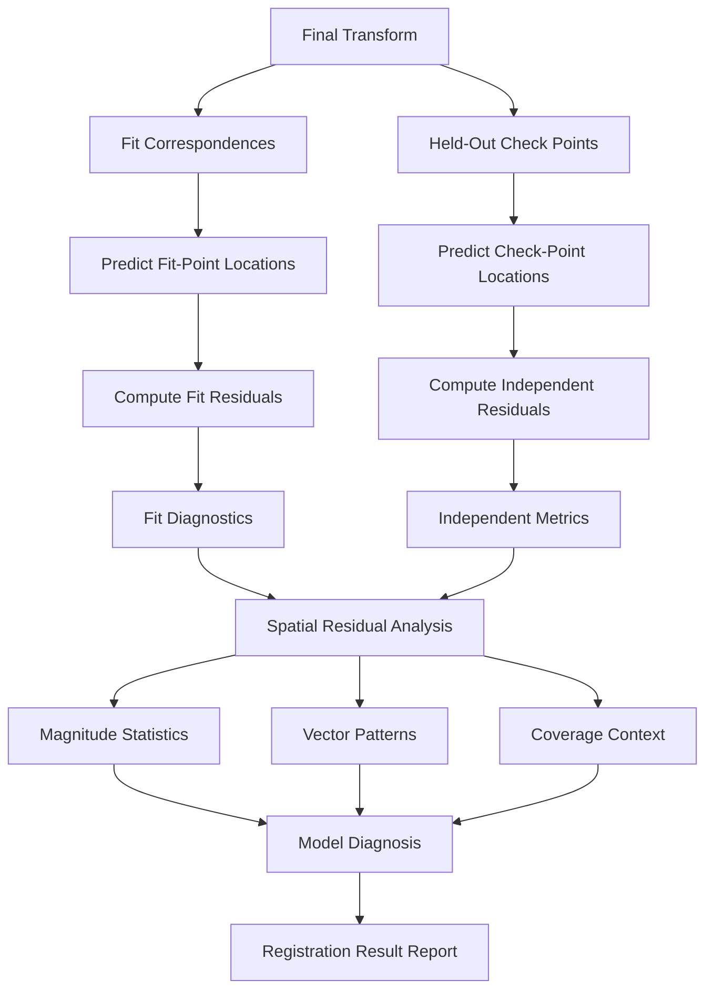
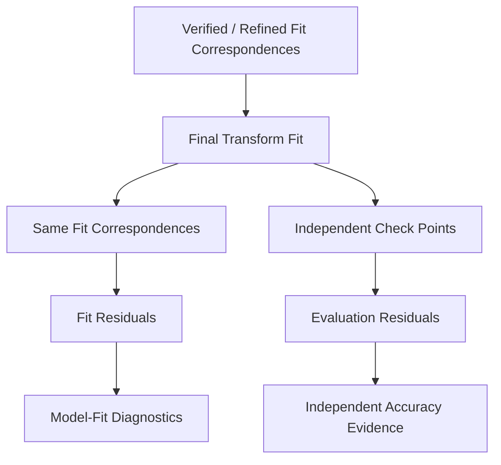

# Residual Analysis

ChandraMap uses residual analysis to measure and diagnose the geometric disagreement that remains after correspondence verification, transformation estimation, optional sub-pixel refinement, and final model refitting.

A residual compares:

- where a correspondence is **observed**; and
- where the estimated geometric model **predicts** that correspondence should appear.

Residuals provide two different kinds of evidence:

1. **Model-fit evidence** — how well the estimated transformation explains the correspondences used to fit it.
2. **Independent evaluation evidence** — how well the final transformation predicts held-out check points that did not influence fitting.

These must not be confused.

> **Residuals describe how well observed correspondences agree with an estimated geometric model; they do not automatically describe independent registration accuracy.**

A second core rule is:

> **Fit residual and evaluation residual are different quantities.**

A fit residual is measured on correspondences that influenced transformation estimation. A check-point residual is measured on held-out correspondences that did not influence the final model.

Independent check-point residuals provide stronger evidence of registration accuracy.

A third principle is:

> **A single RMSE value cannot explain where or why registration is failing.**

Residual analysis should therefore consider:

- magnitude;
- direction;
- spatial distribution;
- point coverage;
- fit/check role;
- model type;
- coordinate space;
- scale-pyramid level;
- sensor information content;
- outliers;
- residual distribution.

Finally:

> **Report source-image pixel error first; convert to physical ground error only when valid geospatial information supports the conversion.**

A reference-space residual cannot simply be relabeled as source-space error, and a generic approximate sensor GSD should not be used to manufacture metre-level accuracy.

A good registration result should therefore not only have low residual error; its residuals should also be spatially reasonable, independently evaluated, reproducibly defined, and consistent with the source sensor's information content.

---

## 1. Why Residual Analysis Matters

Residual analysis helps ChandraMap answer questions that cannot be answered by candidate counts, inlier counts, or overlays alone.

It supports:

- transformation-quality assessment;
- independent registration evaluation;
- affine-versus-homography comparison;
- sub-pixel refinement evaluation;
- detection of model overfitting;
- projection-mismatch diagnosis;
- scale-mismatch diagnosis;
- terrain-relief diagnosis;
- crop/tile coordinate-error diagnosis;
- correspondence-quality diagnosis;
- match-filtering evaluation;
- retrieval-candidate validation;
- spatial-coverage assessment;
- cross-sensor benchmark comparison;
- reproducible failure analysis.

A visually convincing registered preview can still contain systematic geometric error.

Likewise:

```text
many verified inliers
```

does not necessarily imply:

```text
low independent registration error
```

Residual analysis provides the geometric evidence needed to distinguish those cases.

---

## 2. Position in the Pipeline

Residual analysis uses outputs produced by earlier ChandraMap stages.

The conceptual sequence is:

```text
Preprocessing
    ↓
Scale Handling
    ↓
Matching
    ↓
Match Filtering
    ↓
RANSAC / Geometric Verification
    ↓
Verified Inliers
    ↓
Initial Transform
    ↓
Sub-Pixel Refinement
    ↓
Final Transform Refit
    ↓
Residual Analysis
    ↓
Independent Evaluation + Diagnostics
```

Residual analysis does **not**:

- detect features;
- generate descriptors;
- propose candidate matches;
- determine RANSAC inliers;
- create independent ground truth.

It evaluates and diagnoses the geometry produced by those earlier stages.

---

## 3. Residual-Analysis Responsibilities

| Responsibility                                         | Residual Analysis? |
| ------------------------------------------------------ | -----------------: |
| Apply an estimated transform to evaluation coordinates |                Yes |
| Compute predicted point locations                      |                Yes |
| Compute residual vectors                               |                Yes |
| Compute residual magnitudes                            |                Yes |
| Compute fit residual statistics                        |                Yes |
| Compute independent check-point statistics             |                Yes |
| Analyze spatial residual patterns                      |                Yes |
| Analyze residual distributions                         |                Yes |
| Identify systematic diagnostic patterns                |    Yes, cautiously |
| Compare model behavior                                 |                Yes |
| Compare refinement before/after effects                |                Yes |
| Detect SIFT features                                   |                 No |
| Match descriptors                                      |                 No |
| Filter raw candidates                                  |                 No |
| Decide RANSAC inliers                                  |                 No |
| Estimate the original matcher correspondences          |                 No |
| Create ground truth                                    |                 No |

The stage should answer:

> **How well does this geometric model explain the observations, and what does the remaining error reveal about registration quality or failure?**

---

# Residual Terminology

## 4. Observed Correspondence

An **observed correspondence** is a measured or independently annotated relationship between a source location and a reference location.

For a source point:

$$
p_s
$$

the corresponding observed reference location may be written:

$$
p_r
$$

Depending on the role of the point, the observation may belong to:

- a model-fitting correspondence set;
- an independent check-point set.

---

## 5. Predicted Point

Given an estimated source-to-reference transformation:

$$
T
$$

the predicted reference location of source point \(p_s\) is:

$$
\hat{p}_r = T(p_s)
$$

The predicted point is generated by the geometric model.

It is not an independently observed measurement.

---

## 6. Residual Vector

This document uses the following sign convention:

> **Residual = observed − predicted**

Therefore:

$$
r = p_r - \hat{p}_r
$$

The residual vector describes both:

- error magnitude;
- error direction.

This sign convention should remain consistent in:

- stored residual records;
- plots;
- tables;
- benchmark metrics.

If an implementation uses the opposite convention, that implementation must document it explicitly.

---

## 7. Residual Components

For two-dimensional image coordinates:

$$
p_r = (x_r, y_r)
$$

and:

$$
\hat{p}_r = (\hat{x}_r, \hat{y}_r)
$$

the residual components are:

$$
r_x = x_r - \hat{x}_r
$$

$$
r_y = y_r - \hat{y}_r
$$

These components are useful because directional bias can be hidden by magnitude-only statistics.

---

## 8. Residual Magnitude

The two-dimensional residual magnitude is:

$$
e = \sqrt{r_x^2 + r_y^2}
$$

or equivalently:

$$
e = \lVert r \rVert_2
$$

Residual magnitude answers:

> **How far is the prediction from the observation in the stated coordinate space?**

It does not explain the direction of that error.

---

## 9. Reprojection Error

**Reprojection error** describes the geometric discrepancy between:

- an observed coordinate;
- a coordinate predicted by applying the estimated transformation.

Its coordinate space must always be stated.

For example:

```text
reprojection error
coordinate space = NAC pyramid-level pixels
```

is scientifically more meaningful than:

```text
reprojection error = pixels
```

without identifying the grid.

---

## 10. Fit Residual

A **fit residual** is a residual measured on a correspondence that contributed to estimating or finalizing the transformation.

Fit residuals are useful for:

- model diagnostics;
- checking fitting behavior;
- detecting remaining bad fit correspondences;
- comparing residual structure.

They are not fully independent accuracy evidence.

---

## 11. Check-Point Residual

A **check-point residual** is measured on an independently verified point that did not influence:

- RANSAC fitting;
- final transformation fitting;
- model parameter estimation;
- final-test threshold tuning.

It provides stronger evidence of how the transformation generalizes beyond its fitting correspondences.

---

## 12. Forward Residual

If the transform direction is:

```text
source → reference
```

then a forward residual naturally compares:

```text
predicted reference point
vs.
observed reference point
```

and is therefore expressed in the selected reference coordinate system.

---

## 13. Inverse Residual

If a valid inverse transformation is available, a reference point can be mapped into source coordinates and compared with its observed source location.

This produces an error expressed in source coordinates.

An inverse-space residual should only be used when:

- inversion is mathematically valid;
- the transformation is numerically stable;
- coordinate conventions are preserved.

---

## 14. Source-Space Error

**Source-space error** is residual error expressed in the source image's coordinate system.

Examples include:

- OHRC pixels;
- TMC-2 pixels;
- IIRS-derived source-grid pixels.

For ChandraMap's primary registration reporting, source-space pixel error is generally the preferred first metric where it can be computed correctly.

---

## 15. Reference-Space Error

**Reference-space error** is expressed in the reference image's pixel coordinate system.

Examples may include:

- NAC base pixels;
- NAC pyramid-level pixels;
- WAC tile pixels.

Reference-space error is valid and useful when clearly labeled.

It must not simply be renamed as source-space error.

---

## 16. Ground Error

**Ground error** is a residual represented as physical lunar-surface distance.

Possible units include:

- metres;
- kilometres.

Such conversion is only meaningful when the image/geospatial geometry supports it.

---

# Coordinate-Space Awareness

## 17. Residuals Always Belong to a Coordinate Space

A statement such as:

```text
registration error = 1 pixel
```

is incomplete.

One pixel can represent very different physical distances in:

- OHRC;
- TMC-2;
- IIRS;
- native NAC;
- downsampled NAC;
- WAC.

Therefore every residual metric should identify its coordinate system.

---

## 18. Source-Space Reporting

Where scientifically valid, report source-image pixel error first.

Conceptually:

```text
OHRC source
→ OHRC-pixel evaluation error
```

```text
TMC-2 source
→ TMC-2-pixel evaluation error
```

```text
IIRS registration representation
→ IIRS source-grid pixel error
```

This anchors the metric to the information actually measured by the source sensor.

---

## 19. Forward-Transform Caveat

If the stored model maps:

```text
source → reference
```

then directly applying it produces reference-space predictions.

Therefore the resulting forward residual is naturally:

> **reference-space error**

To report source-space error correctly, use:

- a valid inverse evaluation;
- another explicitly defined source-space formulation;
- a justified coordinate conversion.

Do not merely change the unit label.

---

## 20. Pyramid-Level Residuals

A residual measured on:

```text
NAC pyramid level L
```

belongs to:

> the pixel grid of level \(L\).

It is not directly equivalent to:

```text
NAC base-level pixels
```

because the effective GSD differs.

See [`scale-pyramid.md`](scale-pyramid.md).

---

## 21. Crop and Tile Residuals

Residual computation in crop or tile coordinates is valid when:

- observed point;
- predicted point;

are expressed in exactly the same crop/tile coordinate system.

The result should preserve mapping to:

- parent image;
- tile offset;
- pyramid level;
- geographic context where applicable.

---

## 22. Pixel-Center Convention

High-accuracy residual analysis may depend on whether coordinate values refer to:

- pixel centers;
- pixel corners;
- another defined convention.

A half-pixel coordinate-convention mismatch can create systematic residuals.

ChandraMap should follow the conventions defined by its authoritative metadata/data-format documentation rather than inventing a new convention here.

Relevant files include:

- [`../datasets/metadata.md`](../datasets/metadata.md)
- [`../datasets/data-format.md`](../datasets/data-format.md)

---

# Fit Residuals

## 23. What Fit Residuals Measure

A fit residual measures how well the model explains one of the correspondences that contributed to model estimation.

Conceptually:

```text
fit correspondence
        ↓
used to estimate final transform
        ↓
transform predicts same correspondence
        ↓
fit residual
```

A small fit residual means:

> the model fits its fitting data well.

---

## 24. What Fit Residuals Do Not Prove

Low fit residual does not by itself prove:

- independent registration accuracy;
- correct geolocation;
- accurate prediction elsewhere in the image;
- correct reference retrieval;
- physically appropriate model choice;
- low terrain-dependent error.

---

## 25. Why Fit Error Can Be Optimistic

The transformation was explicitly estimated to explain the fitting correspondences.

Therefore fit-point residuals are not independent of the optimization process.

A more flexible model may produce very low fitting error while generalizing poorly.

---

# Independent Check Points

## 26. Check-Point Definition

A check point is an independently verified correspondence held out from transformation estimation for the run in which it is evaluated.

It should not contribute to:

- RANSAC model fitting;
- final transform refitting;
- final model selection through direct optimization;
- final-test threshold tuning.

See [`../datasets/ground-truth-preparation.md`](../datasets/ground-truth-preparation.md).

---

## 27. Preferred Evaluation Pattern

```text
Fit / Control Correspondences
        ↓
Estimate Final Transform

Independent Check Points
        ↓
Apply Final Transform
        ↓
Compute Evaluation Residuals
```

This provides stronger evidence of registration generalization.

---

## 28. Fit vs Check Residuals

| Property                               | Fit Residual  | Check-Point Residual     |
| -------------------------------------- | ------------- | ------------------------ |
| Point contributes to transform fitting | Yes           | No                       |
| Measures fitting behavior              | Yes           | Yes, indirectly          |
| Independent accuracy evidence          | No            | Stronger                 |
| Useful for diagnostics                 | Yes           | Yes                      |
| Useful for overfitting detection       | Limited alone | Yes                      |
| Preferred benchmark RMSE by itself     | No            | Yes, when truth is valid |

---

## 29. Never Reuse Check Points as Fit Points

If a point contributes to the final transformation:

> it is no longer an untouched independent check point for that run.

A project may maintain separate roles such as:

- control/fit points;
- check/evaluation points.

Those roles must be preserved.

---

## 30. No Independent Check Points

If no independent check-point set exists, ChandraMap should report:

- fit residual diagnostics;
- absence of independent evaluation.

Do not relabel fit RMSE as:

> independent registration accuracy.

---

## 31. Very Small Check Sets

A small check-point set may provide only weak evidence of image-wide performance.

Reports should include:

- check-point count;
- spatial distribution;
- limitations.

A very precise-looking RMSE from a tiny localized check set should not be overinterpreted.

---

# Root Mean Square Error

## 32. RMSE Definition

For residual magnitudes:

$$
e_1, e_2, \ldots, e_N
$$

a conceptual residual-magnitude RMSE is:

$$
\mathrm{RMSE}
=
\sqrt{
\frac{1}{N}
\sum_{i=1}^{N} e_i^2
}
$$

However, a report must identify exactly what \(e_i\) represents.

Possible definitions include:

- 2D residual magnitude;
- source-space magnitude;
- reference-space magnitude;
- component-specific error.

---

## 33. Label RMSE Completely

A useful metric description may include:

```text
metric: check-point RMSE
quantity: 2D residual magnitude
space: source-image pixels
source sensor: TMC-2
```

rather than:

```text
RMSE: X pixels
```

without context.

---

## 34. Why RMSE Is Useful

RMSE:

- provides a compact overall error summary;
- penalizes large residuals more strongly;
- supports controlled comparisons;
- is widely understood in registration evaluation.

---

## 35. RMSE Limitations

RMSE can hide:

- directional bias;
- image-region-specific failures;
- clustered check points;
- multimodal error distributions;
- isolated extreme failures;
- systematic model inadequacy.

Therefore:

> **RMSE should be interpreted together with residual vectors, distribution statistics, and spatial coverage.**

---

# Complementary Error Statistics

## 36. Median Residual

The median residual magnitude can complement RMSE because it is less influenced by extreme residual values.

It is useful for describing the central tendency of the error distribution.

It should not replace RMSE automatically.

---

## 37. Mean Error

The phrase **mean error** is ambiguous unless the quantity is stated.

Possible examples include:

- mean residual magnitude;
- mean \(r_x\);
- mean \(r_y\).

Document the definition explicitly.

---

## 38. Mean Absolute Error

Where an MAE-like statistic is used, specify which scalar quantity is being averaged.

For example:

- absolute x-coordinate error;
- absolute y-coordinate error;
- another clearly defined scalar residual.

Avoid using `MAE` without defining its residual quantity.

---

## 39. Percentile Error

Optional error summaries may include distribution percentiles.

They can help characterize:

- typical error;
- upper-tail behavior;
- difficult cases.

Do not prescribe one mandatory percentile set unless an authoritative benchmark specification defines it.

---

## 40. Maximum Residual

The maximum residual can expose the worst observed evaluation case.

It is useful diagnostically but can be highly sensitive to:

- annotation errors;
- isolated wrong correspondences;
- local model failures.

It should not be the sole registration-quality metric.

---

## 41. Component Bias

Mean or median values of:

$$
r_x
$$

and:

$$
r_y
$$

can reveal directional bias.

Persistent non-zero components may indicate:

- residual translation;
- crop-offset problems;
- coordinate-convention mismatch;
- other systematic geometry.

---

# Residual Distributions

## 42. Why Distribution Matters

Two methods can have similar RMSE while producing very different residual behavior.

Conceptually:

```text
Method A
→ many very small errors
→ a few very large failures
```

and:

```text
Method B
→ moderate errors more consistently
```

may produce similar scalar summaries.

One number cannot communicate the full distribution.

---

## 43. Residual Histogram

A residual-magnitude histogram may reveal:

- heavy tails;
- multiple error modes;
- unusual extreme cases;
- compact vs broad distributions.

The plot should identify:

- point role;
- coordinate space;
- units.

---

## 44. Cumulative Error Distribution

An optional cumulative error distribution can show how much of the evaluated set lies below increasing residual values.

This can be useful for comparing error distributions without choosing one arbitrary threshold.

It should remain optional unless a benchmark explicitly requires it.

---

# Residual Vectors

## 45. Why Direction Matters

Residual magnitude answers:

> **How far is the model wrong?**

Residual direction helps answer:

> **In what direction is the model wrong?**

Directional information can expose systematic geometry that is invisible in RMSE.

---

## 46. Residual Vector Visualization

With the convention:

$$
r = p_{\text{observed}} - p_{\text{predicted}}
$$

a vector may be drawn:

```text
predicted point
→
observed point
```

for visualization.

The plot should explicitly state its sign convention.

---

## 47. Uniform Directional Bias

If many residual vectors point in approximately the same direction, possible causes include:

- remaining translation error;
- crop/tile offset error;
- coordinate-origin mismatch;
- transform-composition error.

This is diagnostic evidence rather than automatic proof of one specific cause.

---

## 48. Rotational Pattern

A residual field with a broadly rotational pattern may suggest:

- rotation mismatch;
- incorrect center of transformation;
- unsuitable geometric model.

Further evidence should be checked before concluding the cause.

---

## 49. Radial Pattern

Residuals that grow outward or inward from a region may be associated with:

- scale error;
- projection distortion;
- projective/model mismatch.

Again, the pattern suggests hypotheses rather than proving them.

---

## 50. Spatially Varying Directions

Different image regions showing different residual orientations may indicate:

- terrain relief;
- projection mismatch;
- local geometry;
- wrong correspondence groups;
- inadequacy of one global transform.

---

# Spatial Residual Analysis

## 51. Why Spatial Position Matters

Residual error should be interpreted together with where the evaluated points occur.

A registration can look strong around one crater and weak elsewhere.

Therefore:

```text
low error
+
small localized coverage
```

is not equivalent to:

```text
low error
+
broad overlap coverage
```

---

## 52. Spatial Regions

Possible diagnostic partitions include:

- coarse grid cells;
- image quadrants;
- documented terrain regions.

No universal ChandraMap grid size is defined here.

---

## 53. Local Residual Statistics

Where enough observations exist, a spatial region may summarize:

- evaluation-point count;
- RMSE;
- median magnitude;
- mean residual vector.

Do not overinterpret a region supported by very few points.

---

## 54. Residual Heatmaps

A heatmap may visualize high- and low-error regions.

If values between sparse check points are interpolated, the visualization should say so clearly.

Do not present interpolated residual surfaces as though dense ground truth were directly measured everywhere.

---

# Coverage and Error

## 55. Coverage Context

Residual metrics require coverage context.

A check-point RMSE calculated from a small cluster does not establish whole-image registration quality.

---

## 56. Coverage Measures

Possible supporting measures include:

- grid occupancy;
- convex-hull coverage;
- regional occupancy.

The exact metric should be defined by the evaluation protocol.

---

## 57. Coverage and Error Should Stay Separate

Do not collapse:

- RMSE;
- coverage;

into an arbitrary composite score unless a benchmark formally defines and justifies such a metric.

Both quantities provide distinct information.

---

# Model Diagnosis from Residuals

## 58. Translation Model

If translation is too simple, residual vectors may show:

- rotation-like trends;
- scaling trends;
- position-dependent error.

Such patterns indicate that a pure shift may not adequately describe the relationship.

---

## 59. Affine Transform

If an affine model leaves structured residuals, possible explanations include:

- projective effects;
- projection mismatch;
- relief;
- viewing-geometry differences;
- remaining correspondence problems.

---

## 60. Homography

If a homography still produces spatially structured residuals, possible explanations include:

- non-planar lunar terrain;
- large viewing-geometry differences;
- projection effects;
- poor correspondences;
- inadequate global model.

A homography is planar/projective and does not model arbitrary three-dimensional lunar relief.

---

## 61. Smaller Fit Error Does Not Automatically Mean Better Model

A more flexible model may reduce fit residual simply because it has greater freedom.

For example:

```text
homography
→ lower fit error
```

does not automatically imply:

```text
homography
→ better independent registration
```

Use held-out check residuals to determine whether additional flexibility improves generalization.

See [`transforms.md`](transforms.md).

---

# Terrain-Relief Diagnosis

## 62. Relief Effects

Lunar topography includes:

- crater walls;
- crater floors;
- ridges;
- slopes;
- elevated terrain.

Different viewing geometries can cause these structures to exhibit spatially varying displacement.

One global affine transform or homography may therefore be insufficient.

---

## 63. Possible Relief Signature

Residuals that vary systematically around:

- crater walls;
- elevated ridges;
- strongly varying terrain;

may suggest relief-related geometry.

This should remain a diagnostic hypothesis.

Do not claim terrain relief as the cause without supporting:

- viewing geometry;
- elevation data;
- spatial evidence.

---

## 64. Future DEM-Linked Analysis

Later ChandraMap research may compare residuals against:

- elevation;
- slope;
- terrain class;
- local relief.

This requires valid DEM and coordinate alignment.

It is not a V1 requirement.

---

# Projection Diagnosis

## 65. Projection Mismatch

Projection inconsistencies may produce smooth spatial residual patterns.

Possible clues include:

- residuals growing toward image edges;
- gradually rotating residual directions;
- systematic spatial deformation.

---

## 66. Reprojection vs Matching Error

A systematic projection problem should not automatically be labeled:

> matcher failure.

The diagnostic chain should inspect:

- CRS/lunar coordinate system;
- projection;
- grid;
- crop offsets;
- image scale;
- transform model.

---

# Scale Diagnosis

## 67. Wrong Physical Scale

Poor reference-level selection can affect:

- feature repeatability;
- correspondence quality;
- RANSAC stability;
- transform quality.

Residual patterns may reveal the downstream consequence of that mismatch.

---

## 68. Scale-Related Residual Patterns

Potential symptoms include:

- broadly radial errors;
- increasing displacement away from an anchor region;
- unstable refinement;
- unusually large robust-estimation tolerances.

These are diagnostic clues rather than definitive proof.

---

## 69. Residuals Across Pyramid Levels

A scale experiment may compare several reference levels.

However:

> **Raw pixel RMSE from different pyramid levels is not directly comparable unless coordinate spaces are normalized or converted appropriately.**

For each level preserve:

- level ID;
- effective GSD;
- coordinate space;
- residual units.

See [`scale-pyramid.md`](scale-pyramid.md).

---

## 70. Coarse-Level Error

A numerically small residual measured in a coarse reference pixel grid may correspond to a comparatively large lunar-surface displacement.

Therefore:

```text
small coarse-level pixel RMSE
```

does not automatically mean:

```text
fine physical accuracy
```

---

# Illumination Diagnosis

## 71. Illumination Influences Residuals Indirectly

Changing Sun angle primarily changes:

- feature appearance;
- shadow geometry;
- feature visibility.

These changes can cause incorrect or unstable correspondences.

Residual analysis measures the geometric consequence.

---

## 72. Shadow-Driven Matches

Incorrect shadow-related correspondences may appear as:

- isolated large residuals;
- local residual clusters;
- candidates rejected by RANSAC;
- unstable transformation support.

---

## 73. Do Not Blame Illumination Automatically

Large residuals may also result from:

- wrong reference scale;
- incorrect transformation model;
- projection mismatch;
- annotation error;
- wrong retrieval candidate;
- crop/coordinate errors.

Diagnosis should remain evidence-based.

See [`illumination-handling.md`](illumination-handling.md).

---

# Retrieval Diagnosis

## 74. Incorrect Retrieved Region

An incorrect retrieval candidate may produce:

- very few verified inliers;
- unstable transformations;
- large check residuals;
- failure to estimate a model.

---

## 75. False Local Consensus

Repetitive lunar terrain can occasionally produce a locally coherent but geographically incorrect alignment.

Therefore:

> **Low fit residual does not prove that a retrieved lunar region is geographically correct.**

Independent retrieval truth, metadata, or geographic evidence remains important.

---

# Matcher Diagnosis

## 76. Residuals as Downstream Matcher Evidence

Different matcher families may produce different candidate sets.

Possible methods include:

- SIFT;
- ALIKED + LightGlue;
- LoFTR;
- RIFT/CFOG-style research candidates.

Residual analysis helps determine whether those correspondences ultimately support accurate geometry.

---

## 77. More Inliers vs Better Accuracy

A matcher may produce:

```text
more verified inliers
```

while also producing:

```text
higher independent check error
```

because its inliers may be:

- clustered;
- biased;
- associated with an inadequate global model.

Match statistics and residual statistics should therefore be read together.

---

# Match-Filtering Diagnosis

## 78. Filtering Too Loose

Loose filtering may send many incorrect candidates into robust estimation.

Possible downstream effects include:

- high outlier rate;
- unstable RANSAC;
- model failure;
- poor residual behavior.

---

## 79. Filtering Too Strict

Overly strict filtering may leave:

- very few fit points;
- clustered fit points;
- weak geometric constraints.

A model may then show:

- deceptively small local fit residual;
- poor check-point performance elsewhere.

See [`match-filtering.md`](match-filtering.md).

---

# RANSAC Residual vs Final Residual

## 80. RANSAC Residual

During RANSAC, residuals are used to decide whether candidate correspondences are sufficiently consistent with a model hypothesis.

Those residuals are tied to:

- the initial candidate coordinates;
- the selected model;
- the RANSAC threshold;
- the coordinate grid used during robust estimation.

---

## 81. Final Fit Residual

After:

```text
RANSAC
→ verified inliers
→ sub-pixel refinement
→ final transform refit
```

fit residuals should be recomputed using:

> the final refined transformation.

Do not report only stale initial-RANSAC residuals as the final fit diagnostics.

---

## 82. Independent Evaluation Residual

After the final model exists, apply it to held-out check points and compute:

> **independent evaluation residuals**

These should provide the strongest quantitative accuracy evidence when reliable truth exists.

See [`ransac.md`](ransac.md).

---

# Sub-Pixel Refinement

## 83. Before-Refinement Analysis

Initial residuals can help identify:

- gross geometry failure;
- poor correspondence sets;
- unsuitable model behavior.

---

## 84. After-Refinement Analysis

If verified inliers are refined:

1. refit the transformation;
2. recompute fit residuals;
3. recompute independent check residuals.

The final evaluation should correspond to the final model, not the initial model.

---

## 85. Refinement Must Be Evaluated Independently

Do not claim:

> sub-pixel refinement improved registration

only because:

```text
fit residual decreased
```

A stronger comparison is:

```text
same independent check points
        ↓
before refinement
vs.
after refinement + refit
```

A fit improvement that does not improve independent error may indicate overfitting or limited source information.

---

# Source-Image Pixel Error

## 86. Why Source Pixels Are Important

The source sensor determines the original sampling of the observation being registered.

Source-pixel error therefore provides a useful interpretation relative to the source information content.

---

## 87. OHRC Source Error

For an OHRC source, a correctly computed source-space error should be expressed in:

> OHRC source pixels.

Current project documentation commonly treats OHRC at approximately:

> **~0.25–0.32 m/pixel**

depending on product/documentation.

Actual product metadata remains authoritative.

---

## 88. TMC-2 Source Error

For a TMC-2 source, source-space error should use:

> TMC-2 pixels.

Current project planning commonly treats TMC-2 at approximately:

> **~5 m/pixel**

with actual product metadata remaining authoritative.

---

## 89. IIRS Source Error

For IIRS, source-space error should be tied to the documented 2D registration representation.

Current project-level context includes:

- approximately ~80 m/pixel;
- approximately ~0.8–5.0 µm;
- roughly ~250–256 bands depending on product/documentation.

Actual metadata remains authoritative.

A tiny residual measured in fine NAC pixels must not be used to imply that IIRS contains NAC-scale physical information.

---

# Reference-Space Error

## 90. NAC Residuals

LRO NAC commonly provides fine/local reference imagery.

Current project planning often treats NAC as approximately:

> **~0.5–2 m/pixel**

depending on product/acquisition geometry.

If residuals are measured in NAC coordinates, report:

- NAC product/reference identity;
- pyramid level where applicable;
- effective GSD where known;
- units as reference pixels.

---

## 91. WAC Residuals

LRO WAC provides broader/coarser reference imagery.

Its effective scale is product/mode/processing dependent.

A WAC-pixel residual must not be interpreted as equivalent to a NAC-pixel residual.

---

# Ground-Distance Error

## 92. When Physical Error Is Meaningful

Metre-level or kilometre-level ground error may be reported only when the calculation is supported by valid:

- map geometry;
- lunar coordinate system;
- projection;
- geotransform;
- source/reference GSD or map scale;
- independent truth.

---

## 93. Do Not Multiply Blindly by Approximate GSD

This shortcut:

```text
pixel RMSE × generic approximate GSD
```

may be misleading when:

- residual space is the wrong image;
- a pyramid level is involved;
- GSD varies;
- projection scale varies;
- the product is unprojected;
- the provided sensor number is only an approximate planning value.

---

## 94. Preferred Physical-Distance Evaluation

Where scientifically justified, derive physical error from valid:

- map coordinates;
- lunar surface coordinates;
- geospatial transforms.

This is preferable to attaching false precision through a generic sensor-scale multiplication.

---

# Geographic Residuals

## 95. Lunar Coordinate Error

Future or advanced evaluation may compare:

```text
predicted lunar coordinate
vs.
trusted lunar coordinate
```

When doing so, preserve:

- lunar CRS/reference system;
- longitude convention;
- latitude definition;
- angular/linear units;
- reference-product provenance.

---

## 96. Angular vs Linear Error

An error expressed in:

```text
degrees
```

is not directly equivalent to:

```text
metres
```

without a valid planetary/geospatial conversion.

Do not mix these units in benchmark comparisons.

---

# Outlier Analysis

## 97. Large Check Residuals

An unusually large residual may indicate:

- incorrect truth annotation;
- ambiguous feature identity;
- local transform failure;
- terrain-relief effects;
- wrong transformation;
- coordinate conversion error;
- wrong reference region.

Investigate the point before deciding how to treat it.

---

## 98. Do Not Delete Bad Check Points Silently

A difficult check point must not be removed merely because it increases RMSE.

A truth point should be excluded only for an independently justified reason such as:

- annotation invalidation;
- metadata error;
- demonstrated ambiguity;
- corrupted source/reference data.

The truth-set change should be:

- documented;
- versioned.

---

## 99. Robust Statistics Do Not Hide Failures

Median and percentile statistics can reduce the influence of extreme residuals.

They should complement, not conceal:

- maximum error;
- failed cases;
- difficult check points.

---

# Residual Visualization

## 100. Residual-Vector Overlay

A useful visualization may show:

- observed evaluation points;
- predicted locations;
- arrows connecting predicted to observed points.

With this document's sign convention:

```text
predicted
→
observed
```

matches:

$$
r = p_{\text{observed}} - p_{\text{predicted}}
$$

---

## 101. Vector Amplification

Small residual vectors may need to be visually enlarged.

If arrows are multiplied by a display factor, the figure should state that clearly.

For example:

```text
Residual arrows visually amplified for readability.
```

Do not imply that the displayed arrow length is literal.

---

## 102. Magnitude Encoding

Residual magnitude may optionally be represented through:

- symbols;
- labels;
- color mapping.

Numeric summaries should accompany visual encoding.

Do not rely on color alone for scientific interpretation.

---

## 103. Residual Histogram

A magnitude histogram can reveal:

- compact error distributions;
- heavy tails;
- multiple modes;
- extreme failures.

---

## 104. Error vs Image Position

Diagnostic plots may compare error with:

- source x-coordinate;
- source y-coordinate;
- reference x-coordinate;
- reference y-coordinate;
- radial distance from image center.

Correlations should be interpreted cautiously.

---

## 105. Error vs Terrain or Metadata

Future research may compare residuals against:

- elevation;
- slope;
- illumination geometry;
- scale ratio.

Such analysis requires valid metadata and does not establish causality by itself.

---

# Residual Reporting

## 106. Minimum Residual Report

A useful residual-analysis result should identify:

| Field                      | Purpose                                       |
| -------------------------- | --------------------------------------------- |
| Pair ID/version            | Identify scientific source/reference case     |
| Transform ID               | Identify evaluated geometric model            |
| Transform model            | Affine, homography, or other configured model |
| Transform direction        | Identify mapping direction                    |
| Source coordinate space    | Interpret source-space errors                 |
| Reference coordinate space | Interpret forward/reference errors            |
| Reference pyramid level    | Required where applicable                     |
| Fit-point count            | Describe model support                        |
| Check-point count          | Describe independent evidence                 |
| Fit residual statistics    | Diagnose model fitting                        |
| Check residual statistics  | Evaluate generalization                       |
| Residual units             | Prevent ambiguous pixel metrics               |
| Spatial coverage           | Interpret geographic/image support            |
| Status/warnings            | Preserve evaluation limitations               |

---

## 107. Keep Fit and Evaluation Metrics Separate

Avoid a result containing only:

```text
registration RMSE
```

when it is unclear whether it refers to:

- fitting points;
- independent check points.

Prefer explicit fields such as:

```text
fit RMSE
check-point RMSE
```

with coordinate space and units.

---

# Point-Level Residual Record

## 108. Conceptual Fields

A point-level residual record may conceptually preserve:

- point ID;
- point role — fit or check;
- observed coordinate;
- predicted coordinate;
- residual x-component;
- residual y-component;
- residual magnitude;
- coordinate space;
- units;
- validity/status.

This is a conceptual contract rather than an implemented schema.

---

# Summary Residual Record

## 109. Conceptual Summary Fields

A summary may include:

- evaluated-point count;
- RMSE;
- median residual;
- maximum residual;
- mean component bias;
- coverage metric;
- coordinate space;
- units;
- status.

Metric definitions should remain stable across a benchmark version.

---

# Conceptual Residual Summary

## 110. Illustrative Structure

The following is an **illustrative conceptual structure — not an implemented schema**:

```yaml
pair_id: "PLACEHOLDER_PAIR_ID"
transform_id: "PLACEHOLDER_TRANSFORM_ID"

coordinate_space:
  name: "PLACEHOLDER_SOURCE_OR_REFERENCE_SPACE"
  units: "pixels"

fit_residuals:
  count: "PLACEHOLDER_COUNT"
  rmse: "PLACEHOLDER_VALUE"
  median: "PLACEHOLDER_VALUE"

check_residuals:
  count: "PLACEHOLDER_COUNT"
  rmse: "PLACEHOLDER_VALUE"
  median: "PLACEHOLDER_VALUE"

coverage:
  metric: "PLACEHOLDER_METRIC"
  value: "PLACEHOLDER_VALUE"

status: "PLACEHOLDER_STATUS"
```

No real ChandraMap measurements, schema fields, or thresholds are implied.

---

# Quality Control

## 111. Residual-Analysis QC Checklist

Before treating a residual analysis as benchmark-ready, verify:

- [ ] Transform direction is known.
- [ ] Transform model is known.
- [ ] Observed and predicted coordinates use the same evaluation space.
- [ ] Residual-vector sign convention is documented.
- [ ] Source coordinate space is identified.
- [ ] Reference coordinate space is identified.
- [ ] Pyramid level is recorded where applicable.
- [ ] Crop/tile offsets are handled correctly.
- [ ] Pixel-center/corner convention is known or inherited from project metadata.
- [ ] Residual components are finite.
- [ ] Residual magnitudes are finite.
- [ ] Fit/check roles are explicit.
- [ ] Check points did not participate in fitting.
- [ ] Fit and check metrics are reported separately.
- [ ] RMSE quantity is defined.
- [ ] Residual units are stated.
- [ ] Point count is stated.
- [ ] Spatial coverage is recorded or described.
- [ ] Outlier/truth-point exclusions are documented.
- [ ] Source-space conversion is mathematically valid.
- [ ] Ground-distance conversion is geospatially justified.
- [ ] Residuals correspond to the final refitted transformation.
- [ ] Residual-analysis configuration/version is preserved.
- [ ] Missing evaluation is reported explicitly.

---

# Failure Modes

## 112. Residual-Analysis Failure Table

| Symptom                                           | Possible Cause                                      | Diagnostic / Response                                         |
| ------------------------------------------------- | --------------------------------------------------- | ------------------------------------------------------------- |
| Low fit RMSE, high check RMSE                     | Overfitting, clustered fit points, inadequate model | Prefer independent evaluation and inspect spatial support     |
| Residuals point in a similar direction            | Translation/offset/composition issue                | Inspect transform direction and crop/tile offsets             |
| Error increases toward image edges                | Projection or model limitation                      | Inspect coordinate geometry and model family                  |
| Residual direction varies by terrain region       | Relief/local geometry                               | Investigate terrain only with supporting data                 |
| Coarse-level pixel RMSE looks numerically smaller | Different pixel scale                               | Convert/normalize coordinate interpretation before comparison |
| Source-space error becomes implausibly large      | Incorrect inverse or coordinate conversion          | Audit coordinate chain                                        |
| One check point dominates RMSE                    | Ambiguity, truth error, or local failure            | Inspect point; do not delete silently                         |
| All check points occupy one region                | Poor evaluation coverage                            | Report limitation and improve truth distribution              |
| Finer-level error worsens                         | Source may not support finer detail                 | Consider stopping refinement at coarser scale                 |
| Metre-level error is unrealistic                  | Invalid GSD/projection conversion                   | Report pixel-domain error only                                |
| Fit and check results are identical unexpectedly  | Possible data leakage                               | Verify point-set roles                                        |
| Residuals contain NaN/Inf                         | Invalid transform or coordinates                    | Mark evaluation failure and investigate upstream geometry     |

---

# Benchmarking Residual Analysis

## 113. Same-Pair Rule

Compare methods using the same:

- scientific pair;
- pair version;
- truth version.

---

## 114. Same-Truth Rule

Do not silently change:

- check-point set;
- annotations;
- coordinate convention;

between compared methods.

If truth changes, treat it as a new benchmark/truth version.

---

## 115. Same-Metric Rule

A comparison is only meaningful when RMSE or other residual statistics use the same:

- residual definition;
- coordinate space;
- units;
- point role.

---

## 116. Same-Unit Rule

Do not compare:

```text
NAC base-level pixels
```

with:

```text
IIRS source pixels
```

as though those values represent the same physical quantity.

Label the coordinate space.

---

## 117. Controlled Transform Comparison

For affine-versus-homography experiments, keep constant where possible:

- pair;
- matcher;
- preprocessing;
- scale level;
- verified/refined fit correspondences;
- check points.

Change:

> transformation model.

This helps isolate model behavior.

---

## 118. Controlled Refinement Comparison

To test sub-pixel refinement:

```text
same pair
same fit/check split
same model family
same check points
```

compare:

```text
before refinement
```

with:

```text
after refinement + final transform refit
```

using independent check residuals.

---

# Benchmark Table

## 119. Conceptual Results Template

| Pair      | Method   | Transform   | Fit Points | Check Points | Fit RMSE | Check RMSE | Median Check Error | Coverage | Units | Status |
| --------- | -------- | ----------- | ---------: | -----------: | -------: | ---------: | -----------------: | -------: | ----- | ------ |
| `PAIR_ID` | `METHOD` | `TRANSFORM` |          — |            — |        — |          — |                  — |        — | —     | —      |

Only measured benchmark results should populate this table.

---

# Success and Failure Interpretation

## 120. No Universal Accuracy Threshold

ChandraMap should not define a universal rule such as:

```text
RMSE < X
→ success
```

unless an authoritative benchmark/version specification explicitly defines that criterion.

Acceptable registration error may depend on:

- source sensor;
- source GSD;
- benchmark category;
- downstream application;
- truth uncertainty;
- reference geometry.

---

## 121. Evaluation Status

A result may conceptually need to distinguish conditions such as:

- successful evaluation;
- geometric failure;
- insufficient check points;
- evaluation unavailable;
- unstable transform.

Exact enum names belong to the implementation/schema layer.

---

# Ground-Truth Uncertainty

## 122. Truth Is Not Infinitely Precise

Independent check points may contain uncertainty from:

- manual annotation;
- image resolution;
- reference geolocation;
- terrain ambiguity;
- projection;
- source/reference modality.

A measured residual therefore combines:

- algorithmic error;
- truth uncertainty.

---

## 123. IIRS Precision Caution

IIRS is particularly important in this context.

A fine reference may allow a geometric model to produce very small reference-grid residuals.

That does not mean the original coarse IIRS observation contains equally fine physical localization information.

Interpret results relative to:

- IIRS source sampling;
- IIRS registration representation;
- truth uncertainty.

---

## 124. Future Uncertainty Modeling

Later research may distinguish:

- model residual;
- annotation uncertainty;
- sensor/geolocation uncertainty;
- reference uncertainty.

A formal uncertainty model should not be invented unless the project implements and validates one.

---

# Sensor-Specific Residual Interpretation

## 125. OHRC

OHRC is the Chandrayaan-2 **Orbiter High Resolution Camera**.

Project documentation commonly uses approximately:

> **~0.25–0.32 m/pixel**

depending on product/documentation.

Its fine sampling means that a fractional source-pixel residual may correspond to a relatively small physical displacement.

Physical conversion still requires valid product-specific metadata.

---

## 126. TMC-2

TMC-2 is the Chandrayaan-2 **Terrain Mapping Camera-2**.

Current project planning commonly uses approximately:

> **~5 m/pixel**

with actual metadata remaining authoritative.

A TMC-2 source-space error should be interpreted using the TMC-2 source grid.

Do not compare its pixel value directly with OHRC pixel error without context.

---

## 127. IIRS

IIRS is the Chandrayaan-2 **Imaging Infrared Spectrometer**.

Current project-level approximations include:

- ~80 m/pixel;
- ~0.8–5.0 µm;
- roughly ~250–256 bands depending on product/documentation.

Actual metadata remains authoritative.

The important rule is:

> **Fine reference residuals do not override the coarse information content of the IIRS source.**

---

## 128. LRO NAC

LRO NAC is a fine lunar reference family.

Current project planning often treats it as approximately:

> **~0.5–2 m/pixel**

depending on product/acquisition geometry.

Reference-space residual reports should identify:

- actual NAC product;
- pyramid level;
- effective GSD where appropriate.

---

## 129. LRO WAC

LRO WAC provides broad/coarse lunar reference imagery.

Its spatial scale is product/mode/processing dependent.

A WAC-pixel residual should be interpreted in that specific reference grid rather than through a fixed universal WAC GSD assumption.

---

# Versioned Residual-Analysis Strategy

## 130. V1 — Minimal Rigorous Evaluation

V1 should keep residual analysis simple and scientifically strong.

Recommended conceptual scope:

- final transformation;
- fit residual diagnostics;
- independent check points where available;
- source-image pixel error where valid;
- independent check-point RMSE;
- inlier count;
- inlier ratio;
- spatial coverage;
- basic residual-vector plot;
- explicit evaluation failure status.

V1 does not require sophisticated uncertainty propagation or DEM-linked diagnostics.

---

## 131. V2 — Stronger Diagnostics

Possible V2 additions include:

- median/percentile statistics;
- spatial residual-vector maps;
- affine-versus-homography diagnostics;
- scale-level comparison;
- stronger coverage analysis;
- before/after refinement evaluation;
- richer failure categories.

---

## 132. V3 — Retrieval and Multi-Scale Diagnostics

Possible V3 additions include:

- residual comparison across retrieval candidates;
- multi-scale residual tracking;
- learned matcher comparison;
- automated spatial pattern diagnostics;
- stronger cross-sensor reporting.

---

## 133. V4 — Research-Grade Residual Modeling

Possible future research directions include:

- DEM-linked residual analysis;
- terrain-dependent error models;
- uncertainty propagation;
- local deformation fields;
- geospatial residual maps;
- multi-mission error comparison;
- sensor-model residuals;
- statistically justified confidence intervals.

These are research directions, not implementation-status claims.

Existing version/scope documents remain authoritative.

---

# Main Residual-Analysis Flow

## 134. Residual Evaluation Pipeline



---

# Fit vs Check Flow

## 135. Evaluation Separation



The two branches must not be silently merged.

---

# Relationship to Algorithm Overview

## 136. [`overview.md`](overview.md)

[`overview.md`](overview.md) defines the complete ChandraMap algorithm stack.

Residual analysis belongs near the end of that stack:

```text
matching
→ filtering
→ geometry
→ refinement
→ transform
→ residual analysis
→ evaluation
```

This file focuses specifically on error interpretation and diagnosis.

---

# Relationship to Matching

## 137. [`matching.md`](matching.md)

Poor candidate correspondences can eventually appear as:

- RANSAC failure;
- unstable geometry;
- large residuals;
- poor independent RMSE.

Residual analysis can help diagnose matching behavior.

It does not replace matcher-specific metrics.

---

# Relationship to Match Filtering

## 138. [`match-filtering.md`](match-filtering.md)

Match filtering changes which candidates enter geometric verification.

Residual analysis measures the downstream consequences of that filtered candidate set.

A stronger inlier ratio after filtering does not automatically mean lower independent residual error.

---

# Relationship to RANSAC

## 139. [`ransac.md`](ransac.md)

[`ransac.md`](ransac.md) uses residual thresholds during robust estimation to determine model-consistent candidates.

This file examines:

- final-model fit residuals;
- independent check residuals;
- residual distributions;
- spatial residual patterns.

The initial RANSAC threshold should not be confused with final independent accuracy.

---

# Relationship to Transforms

## 140. [`transforms.md`](transforms.md)

Transforms define the prediction:

$$
\hat{p} = T(p)
$$

Residual analysis compares that prediction with the corresponding observation.

Transformation-model limitations often become visible as structured residual patterns.

---

# Relationship to Scale Pyramid

## 141. [`scale-pyramid.md`](scale-pyramid.md)

Residual pixel values depend on the selected reference level.

A metric should preserve:

- level identity;
- effective GSD;
- coordinate-space definition.

Do not compare raw level-pixel errors without scale context.

---

# Relationship to Preprocessing

## 142. [`preprocessing.md`](preprocessing.md)

Preprocessing can affect:

- feature repeatability;
- candidate quality;
- geometry;
- final residuals.

Residual benchmarks can determine whether a preprocessing change actually improves final registration rather than merely improving visual appearance.

---

# Relationship to Illumination Handling

## 143. [`illumination-handling.md`](illumination-handling.md)

Illumination changes may alter:

- feature visibility;
- shadow geometry;
- candidate correspondence quality.

Residual analysis measures the resulting geometric error.

It cannot independently prove that illumination caused that error.

---

# Relationship to Sensor Routing

## 144. [`sensor-routing.md`](sensor-routing.md)

Residual-analysis results should retain enough provenance to identify the routed:

- source sensor;
- source representation;
- reference family;
- scale strategy;
- matcher.

This supports reproducible diagnosis.

---

# Relationship to Dataset Documentation

## 145. Dataset Documentation

Relevant known files include:

- [`../datasets/README.md`](../datasets/README.md)
- [`../datasets/metadata.md`](../datasets/metadata.md)
- [`../datasets/data-format.md`](../datasets/data-format.md)
- [`../datasets/dataset-preparation.md`](../datasets/dataset-preparation.md)
- [`../datasets/pair-definition.md`](../datasets/pair-definition.md)
- [`../datasets/ground-truth-preparation.md`](../datasets/ground-truth-preparation.md)

The most important relationship is:

```text
ground-truth-preparation.md
→ defines independent truth and fit/check separation

residual-analysis.md
→ measures transform error against that truth
```

---

# Relationship to Sensor Documentation

## 146. Sensor Documentation

Relevant known files include:

- [`../sensors/overview.md`](../sensors/overview.md)
- [`../sensors/ohrc.md`](../sensors/ohrc.md)
- [`../sensors/tmc2.md`](../sensors/tmc2.md)
- [`../sensors/iirs.md`](../sensors/iirs.md)
- [`../sensors/lro-nac.md`](../sensors/lro-nac.md)
- [`../sensors/lro-wac.md`](../sensors/lro-wac.md)

Sensor:

- GSD;
- modality;
- reference role;
- information content;

all affect the interpretation of residual metrics.

---

# Relationship to Architecture

## 147. Architecture Documentation

Related architecture paths to consult when present include:

- `../architecture/system-overview.md`
- `../architecture/v1-pipeline.md`
- `../architecture/core-engine-architecture.md`
- `../architecture/module-map.md`
- `../architecture/data-flow.md`
- `../architecture/output-flow.md`

Architecture documentation determines:

- where residual computation executes;
- where point-level diagnostics are stored;
- how residual results reach evaluation/reporting modules.

This document defines their scientific meaning.

---

# Relationship to Project Scope

## 148. Project Documentation

Related project paths to consult when present include:

- `../project/goals.md`
- `../project/non-goals.md`
- `../project/v1-scope.md`
- `../project/terminology.md`
- `../project/assumptions.md`
- `../project/limitations.md`

Actual version/scope documentation remains authoritative.

Advanced uncertainty modeling, DEM-linked diagnostics, and physical sensor-model residuals should not become mandatory V1 requirements unless explicitly adopted by the authoritative scope.

---

# Relationship to Benchmarks

## 149. Benchmark Provenance

A residual benchmark should preserve where applicable:

- pair ID/version;
- source/reference assets;
- truth version;
- fit/check split;
- transform ID;
- transform model;
- transform direction;
- coordinate space;
- pyramid level;
- metric definition;
- residual units;
- coverage definition;
- benchmark version;
- residual-analysis version/configuration.

---

# Relationship to Experiments

## 150. Experiment Consistency

Experiments should define:

- which variable changes;
- which residual metric remains fixed;
- which truth set is used;
- which coordinate system is used.

Do not silently redefine RMSE between experiment runs.

---

# Relationship to Results

## 151. Result Records

Residual-related result records should ideally preserve:

- fit-point count;
- check-point count;
- fit residual statistics;
- check residual statistics;
- residual units;
- coordinate space;
- coverage;
- transform ID;
- evaluation status;
- failure/warning information;
- residual artifact references where useful.

---

# Claims ChandraMap Should Avoid

## 152. Unsupported Residual Claims

Do not claim without appropriate evidence:

- "Low fit RMSE proves accurate registration."
- "RANSAC residual is independent error."
- "All inlier residuals are ground-truth error."
- "One RMSE fully describes registration quality."
- "Smaller fit error always means a better transform."
- "Homography is better because its fit RMSE is smaller."
- "One pixel means the same physical error for all sensors."
- "One pixel means the same thing at every pyramid level."
- "Reference-pixel error is automatically source-pixel error."
- "Pixel error multiplied by approximate GSD always equals ground error."
- "Sub-pixel fit residual proves sub-pixel physical accuracy."
- "A visually good overlay proves low residual everywhere."
- "Large residuals are always matcher failures."
- "Large residuals are always caused by illumination."
- "Removing difficult check points until RMSE improves is valid evaluation."
- "A fine reference guarantees fine physical accuracy for IIRS."

---

# Common Residual-Analysis Mistakes

## 153. Mistakes to Avoid

Do not:

- compute only fit residuals;
- label fit RMSE as independent registration accuracy;
- use check points during final fitting;
- omit residual coordinate space;
- omit reference pyramid level;
- omit units;
- compare pixel errors across sensors without context;
- relabel reference-space error as source-space error;
- convert to metres using generic GSD without justification;
- ignore residual-vector direction;
- ignore spatial residual distribution;
- report only RMSE;
- hide extreme-error behavior;
- delete difficult check points silently;
- compare algorithms using different truth sets without disclosure;
- compare methods using different residual definitions;
- compare pyramid-level pixel RMSE directly;
- infer terrain relief from residual patterns alone;
- infer illumination as the cause from residuals alone;
- ignore spatial coverage;
- treat sparse localized truth as image-wide validation;
- hide pairs where independent evaluation is unavailable;
- continue reporting stale pre-refinement RANSAC residuals after final refit;
- change metric definitions silently between benchmark versions.

---

# Limitations

## 154. Truth Quality Limits Residual Quality

Residual evaluation is only as reliable as the observed correspondence or control information used as truth.

---

## 155. Manual Annotation Has Uncertainty

Manually identified lunar landmarks may be ambiguous at:

- low resolution;
- severe illumination difference;
- cross-modality pairs.

Their uncertainty should be acknowledged.

---

## 156. Small Check Sets Are Weak Evidence

A small number of held-out points may not represent:

- complete overlap;
- terrain diversity;
- edge-region behavior.

---

## 157. Residuals Diagnose Symptoms, Not Always Causes

A systematic error field may suggest:

- projection;
- scale;
- terrain;
- model;
- coordinate issues.

Additional evidence is required to determine the actual cause.

---

## 158. Coordinate Systems Complicate Comparison

Source, reference, tile, and pyramid-level pixels have different meanings.

Residual values should not be compared without coordinate context.

---

## 159. GSD Can Vary

Actual product scale may differ from project-level approximate sensor values.

Physical error conversion must use appropriate product metadata.

---

## 160. Projection Can Complicate Ground Error

Map scale can vary with:

- projection;
- location;
- product geometry.

Simple scalar conversions may be approximate.

---

## 161. Terrain Relief Produces Non-Planar Error

Affine transformations and homographies may not explain all relief-dependent displacement.

---

## 162. IIRS Information Content Is Coarse

A fine reference cannot create spatial information absent from IIRS.

Residual interpretation must respect the source sensor's information limit.

---

## 163. RMSE Is Sensitive to Large Errors

This is useful when large failures matter, but it can make the metric strongly influenced by a small number of points.

---

## 164. Median Can Hide Rare Failures

Median error is robust to extremes but may underemphasize severe isolated errors.

Use complementary statistics.

---

## 165. Interpolated Residual Surfaces Can Mislead

Sparse check points do not justify claiming dense image-wide error measurements.

Heatmaps derived from interpolation must be labeled accordingly.

---

## 166. Independent Truth May Be Unavailable

Some pairs may support only:

- fit residual diagnostics;
- visual inspection;
- limited external validation.

Such cases should be reported honestly rather than assigned fabricated independent metrics.

---

## 167. Real Lunar Evaluation Remains Necessary

Synthetic coordinate perturbations are useful for testing residual-analysis code.

They do not replace real cross-sensor and cross-mission lunar registration evaluation.

---

# Authoritative and Primary Reference Categories

## 168. Geometric Computer Vision

Relevant authoritative or primary resource categories include:

- OpenCV geometric-transformation documentation;
- OpenCV robust-estimation / RANSAC documentation;
- OpenCV affine-transformation documentation;
- OpenCV homography documentation;
- primary geometric-computer-vision references.

Implementation-specific behavior should be checked against the actual dependency version used by ChandraMap.

---

## 169. Statistical Error Analysis

Relevant resources include:

- standard scientific/statistical references for RMSE;
- standard residual-analysis references where formally cited.

The exact quantity summarized by RMSE should always remain explicit.

---

## 170. Planetary and Geospatial Processing

Relevant authoritative resource categories include:

- USGS ISIS;
- planetary image-coregistration documentation;
- planetary control-network documentation;
- planetary cartography resources;
- planetary photogrammetry references;
- GDAL documentation where relevant to coordinate conversion.

---

## 171. Chandrayaan-2 Context

Relevant authoritative resource categories include:

- ISRO Chandrayaan-2 documentation;
- ISRO / ISSDC / PRADAN;
- official OHRC documentation;
- official TMC-2 documentation;
- official IIRS documentation.

---

## 172. Lunar Reconnaissance Orbiter Context

Relevant authoritative resource categories include:

- NASA Lunar Reconnaissance Orbiter documentation;
- LROC / Arizona State University;
- NASA Planetary Data System;
- official LROC NAC/WAC documentation.

Actual mission-product metadata remains authoritative for product-specific scale and coordinate interpretation.

---

# Residual-Analysis Principles

## 173. Residuals Have a Coordinate Space

Never report ambiguous:

```text
pixel error
```

without saying which pixel grid is used.

---

## 174. Residual Direction Must Be Defined

This document uses:

$$
\text{observed} - \text{predicted}
$$

for residual vectors.

---

## 175. Fit Residual Is Not Independent Accuracy

A model is fitted to its fit points.

Use held-out check points for stronger evaluation.

---

## 176. Check Points Must Stay Held Out

If they influence fitting, they are no longer independent evaluation points for that run.

---

## 177. Source-Pixel Error Comes First

Where correctly computable, source-space error provides an interpretable metric relative to the source sensor.

---

## 178. Reference Error Must Not Be Relabeled

Reference-space pixels and source-space pixels are different coordinate quantities.

---

## 179. Physical Conversion Is Conditional

Metre-level error requires valid geospatial support.

---

## 180. RMSE Is Not Enough

Inspect:

- distribution;
- direction;
- spatial pattern;
- point coverage.

---

## 181. Residual Vectors Matter

Direction can reveal systematic geometry hidden by scalar metrics.

---

## 182. Coverage Matters

Low residuals in one localized cluster do not establish image-wide registration quality.

---

## 183. Pyramid Level Matters

A pixel at one level does not have the same physical meaning as a pixel at another.

---

## 184. Model Complexity Must Be Evaluated Independently

Do not choose homography solely because it reduces fitting residual.

---

## 185. Recompute Residuals After Final Refit

The residuals reported as final should correspond to the final transformation.

---

## 186. Evaluate Refinement Independently

A reduction in fit residual alone is insufficient evidence that refinement improved registration.

---

## 187. Do Not Delete Difficult Truth Silently

Truth changes must have independent justification and versioning.

---

## 188. Residual Patterns Suggest Causes

They do not automatically prove:

- illumination failure;
- relief;
- projection mismatch;
- matcher failure.

---

## 189. Respect Sensor Information Content

This is especially important for coarse IIRS imagery matched against fine NAC references.

---

## 190. Keep Metric Definitions Stable

Benchmark comparisons require consistent:

- residual definition;
- coordinate space;
- units;
- truth set.

---

## 191. Missing Evaluation Is a Valid Result

If independent truth does not exist, report that limitation.

Do not fabricate check-point accuracy.

---

## 192. Keep V1 Simple

A strong V1 residual-analysis baseline needs:

- explicit coordinate spaces;
- fit diagnostics;
- independent check RMSE where available;
- source-space pixel error where valid;
- coverage;
- residual-vector inspection;
- honest failure reporting.

> **Residual analysis is not only a way to produce one error number. It is the geometric diagnostic layer that shows where a ChandraMap transformation agrees with observed lunar correspondences, where it fails, whether that failure generalizes beyond the fitting points, and whether the reported accuracy is meaningful in the coordinate system and sensor context being evaluated.**

<!-- ChandraMap residual-analysis documentation specification and supplied project context: :contentReference[oaicite:0]{index=0} -->
