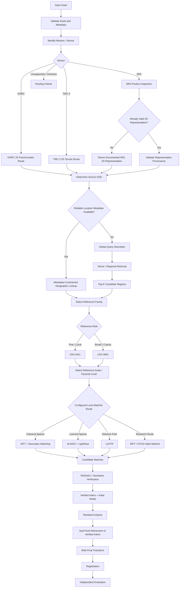
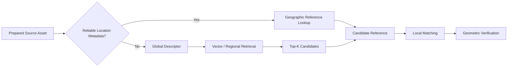

# Sensor Routing

ChandraMap processes lunar imagery from sensors that differ substantially in spatial resolution, modality, spectral response, acquisition geometry, projection, and intended reference role. A single hard-coded preprocessing and matching chain is therefore not scientifically appropriate for every input.

The sensor-routing layer determines **which processing path an asset should enter before correspondence estimation begins**.

> **Identify the sensor and product characteristics first; only then choose a scientifically valid representation, scale, reference, and matching path.**

Sensor routing is responsible for decisions such as:

```text
input asset
→ identify mission / sensor
→ inspect modality and product state
→ validate metadata
→ choose sensor-specific representation
→ determine physical scale strategy
→ determine known-location or retrieval mode
→ select reference role
→ select compatible algorithm family
→ continue into correspondence pipeline
```

Sensor routing does **not** determine whether individual correspondences are correct.

That responsibility belongs to:

```text
local matching
→ geometric verification
→ transformation estimation
→ refinement
→ independent evaluation
```

> **Sensor routing does not solve correspondence; it ensures that each input reaches a correspondence pipeline that is physically and algorithmically appropriate for that sensor.**

Routing decisions should be:

- metadata-aware;
- sensor-aware;
- physically meaningful;
- configuration-driven where appropriate;
- reproducible;
- benchmarkable;
- explicit when capabilities are reduced by missing metadata.

---

## 1. Why Sensor Routing Exists

Without sensor-aware routing, a lunar correspondence system can make scientifically invalid decisions before the matcher even runs.

Examples include:

- passing an IIRS hyperspectral cube directly into an ordinary grayscale matcher;
- matching TMC-2 directly against unnecessarily fine NAC imagery;
- aggressively downsampling OHRC before preserving useful fine structure;
- ignoring reliable source geolocation;
- performing whole-Moon retrieval when a known footprint already restricts the region;
- assuming every reference image uses the same projection;
- treating WAC and NAC as interchangeable references;
- interpreting resized imagery as higher-resolution data;
- applying one matcher policy to every modality without evidence.

Sensor routing prevents these mistakes by making the pipeline ask first:

1. What produced this asset?
2. What does the asset physically contain?
3. What information is available in its metadata?
4. What representation should downstream algorithms compare?
5. At what physical scale should the comparison occur?
6. Which reference family is appropriate?
7. Is retrieval actually required?

Only after these questions are resolved should ChandraMap enter local correspondence estimation.

---

## 2. Routing vs Processing

Sensor routing coordinates the algorithm path but does not perform every downstream operation.

| Responsibility                                           | Sensor Router? |
| -------------------------------------------------------- | -------------- |
| Identify mission and sensor                              | Yes            |
| Validate sensor identity                                 | Yes            |
| Inspect required metadata                                | Yes            |
| Classify modality                                        | Yes            |
| Identify current representation                          | Yes            |
| Select sensor-specific preparation path                  | Yes            |
| Select representation policy                             | Yes            |
| Select physical scale strategy                           | Yes            |
| Select reference family                                  | Yes            |
| Select known-location vs retrieval mode                  | Yes            |
| Select compatible matcher family/configuration           | Yes            |
| Record routing warnings                                  | Yes            |
| Detect local keypoints                                   | No             |
| Compute local descriptors                                | No             |
| Match local features                                     | No             |
| Decide which candidate matches are geometrically correct | No             |
| Run RANSAC                                               | No             |
| Estimate final registration transform                    | No             |
| Perform final sub-pixel refinement                       | No             |
| Compute final independent RMSE                           | No             |

The router should decide **where processing goes**, not duplicate the processing algorithms themselves.

---

## 3. Routing Inputs

A routing decision may conceptually consume metadata such as:

- asset ID;
- parent asset ID;
- provider product ID;
- mission;
- instrument;
- sensor;
- product type;
- processing state;
- representation type;
- raster width/height;
- band count;
- spectral information;
- numeric data type;
- Ground Sampling Distance (GSD);
- footprint;
- map projection;
- lunar CRS/reference system;
- acquisition metadata;
- illumination metadata;
- viewing geometry;
- valid-data information;
- benchmark configuration;
- requested operating mode;
- pipeline/version configuration.

Not every field is available for every product.

Missing values should remain explicit rather than being silently fabricated.

This document defines conceptual routing responsibilities, not a fixed software API.

---

## 4. Routing Outputs

A routing decision may conceptually describe:

- identified mission;
- identified sensor;
- modality;
- input representation;
- preparation branch;
- selected registration representation;
- location mode;
- reference family;
- reference scale strategy;
- retrieval mode;
- candidate matcher family;
- geometric-model policy;
- required/disabled capabilities;
- warnings;
- routing configuration/version.

These are conceptual responsibilities.

They should not be interpreted as evidence that these exact fields or names already exist in implementation code.

---

# Sensor Identification

## 5. Identify the Sensor Before Matching

Sensor identification should occur before generic local matching.

A useful high-level sequence is:

```text
Input Asset
    ↓
Product / Asset Validation
    ↓
Mission Identification
    ↓
Sensor Identification
    ↓
Modality Classification
    ↓
Sensor-Specific Routing
```

Downstream processing should not need to guess whether an image originated from:

- OHRC;
- TMC-2;
- IIRS;
- LRO NAC;
- LRO WAC.

---

## 6. Sensor Identification Sources

Reliable identification may come from:

1. authoritative product metadata;
2. provider labels or product headers;
3. ChandraMap manifest information derived from authoritative metadata;
4. explicit configuration for controlled fixtures or derived assets.

Directory and filename information can support organization, but they should not be the scientific source of truth.

---

## 7. Do Not Route by Filename Alone

A filename such as:

```text
ohrc_image.tif
```

does not prove:

- the product is actually OHRC;
- the GSD is valid;
- the raster is raw vs processed;
- the projection is correct;
- the image has not been replaced with a derived representation.

Likewise:

```text
iirs.png
```

does not indicate whether the file is:

- a browse image;
- a selected spectral band;
- a PCA representation;
- a structural derivative.

Routing should inspect metadata and asset provenance.

---

## 8. Do Not Route by Directory Name Alone

A file stored under:

```text
data/raw/chandrayaan2/ohrc/
```

is expected to contain OHRC data, but directory placement alone should not override conflicting product metadata.

If:

```text
manifest says TMC-2
```

while:

```text
directory says OHRC
```

the system should flag a validation inconsistency.

It should not silently choose one interpretation.

---

## 9. Canonical Sensor Names

Scientific documentation should consistently use these display names:

| Canonical Name | Mission / System | General Role                      |
| -------------- | ---------------- | --------------------------------- |
| OHRC           | Chandrayaan-2    | Fine source imagery               |
| TMC-2          | Chandrayaan-2    | Medium-scale structural source    |
| IIRS           | Chandrayaan-2    | Hyperspectral / imaging-IR source |
| LRO NAC        | LRO / LROC       | Fine/local reference              |
| LRO WAC        | LRO / LROC       | Broad/coarse reference            |

Filesystem or configuration identifiers may use slugs such as:

```text
ohrc
tmc2
iirs
nac
wac
```

while documentation retains the scientific display names.

Avoid uncontrolled aliases such as:

```text
TMC
TMC_2
TerrainCam
NarrowCamera
WideCamera
```

unless a compatibility layer explicitly maps them to canonical identifiers.

---

## 10. Unknown Sensor Handling

If ChandraMap cannot establish the sensor identity reliably:

> **Do not guess.**

Safe conceptual outcomes include:

- reject the input;
- require explicit configuration;
- place the asset in a validation-error state;
- enter a restricted generic-image mode only when such a mode is intentionally supported.

Do not silently classify unknown imagery as:

- OHRC because it is high-resolution;
- TMC-2 because it looks panchromatic;
- IIRS because it has multiple bands.

Scientific identity should come from provenance and metadata.

---

# Routing by Modality

## 11. Modality Matters

Sensor identity and modality are related but distinct.

The router should understand whether an asset contains:

- ordinary 2D panchromatic/intensity imagery;
- hyperspectral imagery;
- derived 2D representation;
- structural representation;
- reference tile;
- pyramid level;
- synthetic/augmented image.

A valid algorithm path depends on both:

```text
parent sensor
+
current representation
```

---

## 12. Panchromatic / Intensity Imagery

Typical panchromatic/intensity sources include:

- OHRC;
- TMC-2;
- relevant LRO NAC products;
- relevant LRO WAC products.

After validation, these can commonly proceed through a 2D-image path.

However, they still require separate reasoning about:

- physical scale;
- projection;
- geolocation;
- source/reference role;
- reference-family selection.

A shared 2D representation does not make the sensors physically interchangeable.

---

## 13. Hyperspectral / Imaging-IR Imagery

IIRS requires a distinct route.

Conceptually:

```text
IIRS Product
      ↓
Inspect Product Structure
      ↓
Validate Spatial + Spectral Dimensions
      ↓
Read Spectral Metadata
      ↓
Choose Representation Policy
      ↓
Derive 2D Registration Representation
      ↓
Continue into Scale / Reference Routing
```

The full spectral product should remain preserved.

The derived 2D image is an algorithm representation, not a replacement for the scientific source.

---

## 14. Derived Representation Routing

The router may receive an asset that has already been prepared.

Examples include:

- processed OHRC raster;
- normalized TMC-2 raster;
- IIRS PCA component;
- IIRS selected-band image;
- gradient representation;
- NAC tile;
- NAC pyramid level;
- WAC mosaic tile.

Routing should identify both:

```text
parent sensor
```

and:

```text
current asset representation
```

For example:

```text
parent_sensor = IIRS
representation = PCA-derived 2D image
```

is fundamentally different from:

```text
parent_sensor = IIRS
representation = original hyperspectral cube
```

even though both originate from IIRS.

---

# OHRC Routing

## 15. OHRC Sensor Context

OHRC is the **Orbiter High Resolution Camera** aboard Chandrayaan-2.

General characteristics relevant to ChandraMap include:

- visible/panchromatic imagery;
- very fine lunar spatial detail;
- approximately ~0.25–0.32 m/pixel in current project documentation, depending on product/documentation.

Actual product metadata remains authoritative.

Typical roles include:

- high-detail source image;
- fine correspondence;
- fine local registration.

---

## 16. OHRC Input Path

A conceptual OHRC route is:

```text
OHRC Asset
    ↓
Validate Product / Representation
    ↓
Read GSD
    ↓
Inspect Projection + Footprint
    ↓
Preserve Fine Spatial Detail
    ↓
Determine Location Mode
    ↓
Select Reference Family
    ↓
Select Compatible Reference Scale
    ↓
Select Configured Matcher Family
```

OHRC routing should avoid unnecessary operations that destroy fine terrain structure before the experiment has established that they help.

---

## 17. OHRC Known-Location Path

If reliable OHRC metadata provides:

- geographic footprint;
- lunar coordinates;
- projection;
- approximate source region;

a preferred conceptual path is:

```text
OHRC
  ↓
Metadata-Constrained Geographic Lookup
  ↓
Relevant LRO Reference Product / Tile
  ↓
Physical Scale Validation
  ↓
Local Matching
```

This avoids unnecessary whole-Moon retrieval.

---

## 18. OHRC Unknown-Location Path

If the location is unavailable, intentionally hidden, or unsuitable for geographic lookup, routing may use:

```text
OHRC Query
    ↓
Global Query Representation
    ↓
Global / Regional Retrieval
    ↓
Candidate Region
    ↓
Fine Reference Selection
    ↓
Local Matching
```

Depending on the reference architecture, WAC may support broad localization before NAC fine registration.

This should be configuration- and benchmark-dependent.

---

## 19. OHRC Reference Selection

The typical fine reference family is:

> **LRO NAC**

where suitable coverage exists.

LRO WAC may instead participate in:

- global search;
- broad localization;
- contextual reference;
- WAC-to-NAC handoff.

WAC should not be inserted into every OHRC route if metadata can directly identify a suitable NAC reference.

---

## 20. OHRC Scale Routing

Do not assume:

```text
OHRC is always finer than NAC
```

or:

```text
NAC is always finer than OHRC
```

Both families contain product-dependent sampling.

The router should inspect actual:

- OHRC GSD;
- NAC GSD;
- effective reference scale.

Scale preparation should be based on physical information rather than mission-name assumptions.

---

## 21. OHRC Matcher Routes

Potential local matcher families may include:

- SIFT baseline;
- ALIKED + LightGlue;
- LoFTR;
- future remote-sensing or lunar-specific methods.

Sensor routing should determine compatibility and available routes.

It should not declare one method universally superior.

Selection belongs to:

- benchmark configuration;
- experiment configuration;
- measured evidence.

---

# TMC-2 Routing

## 22. TMC-2 Sensor Context

TMC-2 is the **Terrain Mapping Camera-2** aboard Chandrayaan-2.

Relevant characteristics include:

- panchromatic terrain imagery;
- approximately ~5 m/pixel in current project planning;
- medium-scale structural information.

Typical ChandraMap roles include:

- terrain-structure correspondence;
- medium-scale registration;
- scale-stress benchmarks.

TMC-2 should not be treated as merely a lower-resolution OHRC image.

---

## 23. TMC-2 Input Path

Conceptually:

```text
TMC-2 Asset
    ↓
Validate Product
    ↓
Read GSD + Projection
    ↓
Preserve Terrain Morphology
    ↓
Determine Location Mode
    ↓
Select Reference Family
    ↓
Select Physically Appropriate Reference Level
    ↓
Configured Local Matcher
```

Scale routing is particularly important for TMC-2.

---

## 24. TMC-2 Known-Location Path

If geographic metadata is trustworthy:

```text
TMC-2
   ↓
Geographic Reference Lookup
   ↓
Candidate NAC / WAC Reference
   ↓
Reference Scale Selection
   ↓
Local Correspondence
```

The reference family and pyramid level depend on the actual source/reference products.

---

## 25. TMC-2 Reference Pyramid Path

Full-resolution NAC may contain much finer detail than TMC-2 can observe.

A more meaningful conceptual path is:

```text
TMC-2 Source GSD
        ↓
Inspect Available NAC Pyramid Levels
        ↓
Choose Comparable Effective Scale
        ↓
Local Structural Matching
```

The goal is not exact equality.

The goal is to avoid an extreme information mismatch.

---

## 26. TMC-2 WAC Path

WAC may be useful for:

- broad localization;
- retrieval;
- coarse structural matching;
- contextual candidate-region selection.

Whether WAC is appropriate depends on:

- actual WAC product scale;
- geographic coverage;
- source location state;
- benchmark objective;
- available reference products.

Do not route TMC-2 to WAC solely because both are coarser than OHRC/NAC.

---

## 27. TMC-2 Matcher Routes

Potential matcher families include:

- SIFT baseline;
- ALIKED + LightGlue;
- LoFTR;
- remote-sensing-oriented research methods.

The router may expose these choices.

Benchmark evidence should decide which route is useful for which experimental condition.

---

# IIRS Routing

## 28. IIRS Requires a Dedicated Route

IIRS is the **Imaging Infrared Spectrometer** aboard Chandrayaan-2.

Project-level characteristics include approximately:

- ~80 m/pixel spatial scale;
- ~0.8–5.0 µm spectral range;
- roughly ~250–256 bands depending on product/documentation.

Actual product metadata remains authoritative.

IIRS should **not** be routed as though it were an ordinary grayscale camera.

Incorrect:

```text
IIRS hyperspectral cube
→ ordinary 2D matcher
```

Correct conceptual architecture:

```text
IIRS scientific product
→ validate spectral structure
→ derive documented 2D registration representation
→ physical scale preparation
→ reference selection
→ local/retrieval matcher
```

---

## 29. IIRS Product Inspection

Before routing, determine what the asset actually represents.

Possible product states include:

- full hyperspectral cube;
- individual spectral band;
- calibrated spectral product;
- projected spectral product;
- browse image;
- selected-band derivative;
- PCA derivative;
- another documented 2D representation.

Do not infer product structure from the filename or dimensions alone.

---

## 30. IIRS Cube Route

A full-cube route may conceptually be:

```text
IIRS Cube
    ↓
Validate Spatial Axes
    ↓
Validate Spectral Axis
    ↓
Read Band / Wavelength Metadata
    ↓
Identify Valid Spectral Information
    ↓
Select Representation Policy
    ↓
Create 2D Registration Representation
    ↓
Record Parent + Representation Provenance
    ↓
Continue Routing
```

Only after this stage should ordinary 2D local matching be considered.

---

## 31. IIRS Representation Options

Candidate representation routes may include:

- selected valid band;
- PCA component;
- multi-band composite;
- gradient representation;
- edge/structural representation;
- future learned spectral-spatial embedding.

These are algorithmic choices.

No one representation should be called the default scientific winner without benchmark evidence.

---

## 32. IIRS Representation Identity

Routing should preserve enough information to reproduce the representation.

Conceptually:

- parent IIRS product;
- representation ID;
- representation type;
- selected bands/components where applicable;
- normalization;
- preparation version.

Without this information:

```text
IIRS → matcher
```

is not scientifically reproducible.

---

## 33. IIRS Scale Routing

IIRS and native fine NAC may differ dramatically in physical sampling.

Therefore:

```text
IIRS 2D Representation
        ↓
Read Source GSD
        ↓
Select Strongly Reduced NAC Level
```

may be more physically meaningful than:

```text
IIRS
→ Native Fine NAC
```

Another possible route is:

```text
IIRS
→ suitable WAC product / contextual reference
```

when the scientific objective is broad/coarse matching.

The actual choice should depend on product metadata and benchmark configuration.

---

## 34. IIRS Known-Location Path

If reliable IIRS footprint/geolocation exists:

```text
IIRS
  ↓
2D Registration Representation
  ↓
Metadata-Constrained Reference Area
  ↓
Scale-Compatible Reference
  ↓
Multimodal Local Matching
```

Global retrieval should not be required merely because IIRS is multimodal.

---

## 35. IIRS Unknown-Location Path

If location is unavailable or intentionally hidden:

```text
IIRS
  ↓
2D Retrieval-Compatible Representation
  ↓
Global Descriptor
  ↓
Vector / Regional Retrieval
  ↓
Candidate Reference Region
  ↓
Local Multimodal Verification
```

This is a difficult research path.

The router should not assume global retrieval from IIRS will always produce a reliable candidate.

---

## 36. IIRS Matcher Routes

Potential experimental routes include:

- SIFT where the representation makes a classical baseline meaningful;
- ALIKED + LightGlue experiments;
- LoFTR experiments;
- RIFT;
- CFOG-style multimodal matching.

These are candidate methods.

Do not claim that terrestrial pretrained matchers are automatically robust to IIRS.

---

# Reference-Side Routing

## 37. LRO NAC Routing Role

LRO NAC is generally a **fine/local reference family**.

Conceptually:

```text
NAC Product
    ↓
Validate Product
    ↓
Projection / Geospatial Preparation
    ↓
Valid-Data Handling
    ↓
Optional Tiling
    ↓
Optional Pyramid Level Selection
    ↓
Local Registration Reference
```

NAC may serve:

- known-overlap registration;
- fine candidate refinement;
- local reference tiles;
- final local alignment.

---

## 38. LRO WAC Routing Role

LRO WAC is generally a **broad/coarse/contextual reference family**.

Potential uses include:

- global reference context;
- regional retrieval;
- coarse localization;
- WAC-to-NAC handoff;
- broad-scale matching.

WAC should not be described as merely:

> lower-quality NAC.

Its observing role, coverage, scale, and products differ.

---

## 39. NAC vs WAC Decision

| Requirement                                  | Typical Reference Route                        |
| -------------------------------------------- | ---------------------------------------------- |
| Fine local registration                      | NAC where suitable                             |
| Fine known-overlap pair                      | NAC                                            |
| Broad lunar localization                     | WAC or broader reference database              |
| Unknown-location search                      | WAC/NAC tiles depending retrieval design       |
| Metadata-known local region                  | Direct NAC selection where suitable            |
| Medium-scale TMC-2 source                    | Coarser NAC pyramid or suitable WAC product    |
| Coarse IIRS source                           | Strongly reduced NAC or suitable WAC reference |
| WAC-derived coarse region needing refinement | Handoff to relevant NAC                        |

These are routing tendencies, not universal rules.

Actual product availability and metadata determine the usable path.

---

# Known Location vs Unknown Location

## 40. Location-Aware Routing

One of the most important routing decisions is:

> Does the source already contain reliable geographic information?

Conceptually:

```text
Source
   ↓
Reliable Location Metadata?
   ├── Yes → Geographic Reference Selection
   └── No  → Retrieval Path
```

This distinction prevents unnecessary global-search complexity.

---

## 41. Known-Location Mode

Known-location mode may use:

- footprint;
- geographic bounds;
- source coordinates;
- projection;
- mission product geometry.

Conceptually:

```text
Source Footprint
      ↓
Intersect Reference Coverage
      ↓
Candidate LRO Product / Tile
      ↓
Scale Selection
      ↓
Local Matching
```

This route should be preferred when the metadata is trustworthy and the benchmark allows its use.

---

## 42. Using Metadata Is Not Cheating

If the mission product already provides approximate location information, using it is correct scientific engineering.

The purpose of ChandraMap is not to deliberately ignore valid mission knowledge unless the research task specifically asks:

> Can the system locate this image without geographic metadata?

Known-location and unknown-location modes are different experimental tasks.

---

## 43. Unknown-Location Mode

Unknown-location routing may be necessary when:

- source footprint is unavailable;
- metadata is unreliable;
- the scientific task is global localization;
- benchmark configuration deliberately hides the location.

Conceptually:

```text
Query Representation
      ↓
Global Descriptor
      ↓
Reference Search
      ↓
Top-K Candidate Regions
      ↓
Local Matching
```

---

## 44. Retrieval Benchmark Override

A benchmark may deliberately define:

```text
location_mode = unknown
```

even when the original mission product contains location metadata.

This is valid when the benchmark explicitly tests retrieval.

The override should be:

- explicit;
- versioned;
- reproducible.

Do not silently remove metadata during one run and use it during another while claiming the same benchmark configuration.

---

# Scale-Aware Routing

## 45. GSD Drives Scale Routing

Scale routing should use physical metadata where available.

Preferred inputs include:

- source GSD;
- reference native GSD;
- effective pyramid-level GSD.

Avoid routing based solely on:

```text
source width
reference width
```

because equal dimensions do not imply equal physical scale.

---

## 46. Effective Scale Selection

A conceptual target is:

```text
source physical scale
≈
reference effective physical scale
```

where practical.

Actual strategies may include:

- nearest available pyramid level;
- configured acceptable scale range;
- experimentally selected level;
- coarse-to-fine multi-level search.

No universal level-selection formula is defined here.

---

## 47. Scale Compatibility Does Not Require Equality

Two images do not need identical GSD to be matchable.

Scale routing attempts to reduce **extreme information mismatch**.

A modest difference may be acceptable.

The appropriate range depends on:

- sensor pair;
- matcher;
- representation;
- terrain;
- benchmark evidence.

---

## 48. Upsampling Route

Upsampling may sometimes be required for:

- neural-network input dimensions;
- software compatibility;
- visualization;
- interpolation between coordinate grids.

However:

> **Upsampling must never be interpreted as recovering physical resolution.**

Routing should preserve:

- original GSD;
- derived sampling;
- resampling provenance.

An enlarged IIRS image remains an IIRS-resolution observation.

---

## 49. Downsampling Route

Downsampling a fine reference can be scientifically appropriate.

This is especially relevant to:

```text
TMC-2 ↔ NAC
```

and:

```text
IIRS ↔ NAC
```

because native NAC may contain structure unavailable to the coarser source.

The route can therefore be:

```text
Fine Reference
      ↓
Downsample / Pyramid
      ↓
Comparable Structural Scale
```

rather than forcing the coarse source to imitate fine imagery.

---

# Projection-Aware Routing

## 50. Map-Projected Input

If an input is map-projected, routing should validate rather than merely assume:

- projection;
- lunar coordinate system;
- geotransform;
- pixel scale;
- footprint;
- valid-data region.

Two projected products may still use different:

- projections;
- longitude conventions;
- map grids.

---

## 51. Compatible Map-Projected Inputs

If source and reference use compatible geographic systems:

```text
source footprint
∩
reference footprint
```

can directly constrain reference selection.

This can substantially reduce search complexity.

Geospatial compatibility should still be verified.

---

## 52. Unprojected Input

An unprojected product may require:

- sensor-geometry preparation;
- map projection;
- restricted image-domain processing;
- manually defined known-overlap pairs.

Do not fabricate map coordinates merely because downstream software expects geographic metadata.

If valid geography cannot be established, the router should explicitly disable capabilities that depend on it.

---

## 53. Projection Mismatch

If source and reference use different projections:

```text
source pixel coordinates
```

cannot automatically be compared with:

```text
reference pixel coordinates
```

as though they share one grid.

Depending on system architecture, routing may choose:

- common geospatial preparation;
- local image-registration processing that explicitly handles the difference;
- restricted image-domain operation.

The decision should be documented.

---

# Illumination-Aware Routing

## 54. Illumination Metadata

Available metadata may include:

- incidence angle;
- phase angle;
- acquisition time;
- solar geometry;
- other product-specific illumination information.

Routing may use such information for:

- benchmark categorization;
- diagnostic logging;
- selecting an experimental representation;
- identifying difficult illumination pairs.

Missing values should not be invented.

---

## 55. Illumination Does Not Select a Guaranteed Matcher

Avoid rules such as:

```text
large Sun-angle difference
→ always LoFTR
```

or:

```text
shadow difference
→ always RIFT
```

unless future benchmark evidence and explicit configuration justify such a policy.

Illumination conditions are useful routing context, but no matcher should be treated as universally optimal from one metadata value alone.

---

## 56. Structural Representation Route

For difficult illumination conditions, experiments may route through:

- gradients;
- edges;
- local structural descriptors;
- shadow-aware masking;
- other benchmarked representations.

These should be treated as experimental routes.

Brightness normalization alone does not reverse physical shadow geometry.

---

# Retrieval Routing

## 57. Retrieval Is Conditional

Global retrieval should normally be used only when:

- source location is unknown;
- useful geographic metadata is unavailable;
- metadata is intentionally hidden;
- the reference area remains too large after available geographic filtering.

It should not automatically appear in every ChandraMap pipeline.

---

## 58. Offline Reference Preparation

Reference-side preparation happens separately from query routing.

Conceptually:

```text
Reference Products
      ↓
Validate + Georeference
      ↓
Tiles
      ↓
Scale Levels
      ↓
Global Descriptors
      ↓
Vector Index
      ↓
Tile / Product / Geography Mapping
```

This is reference-database preparation.

It is not local source matching.

---

## 59. Online Query Retrieval

Query-time routing may be:

```text
Prepared Query
      ↓
Compatible Global Descriptor
      ↓
Vector Search
      ↓
Top-K Reference Candidates
      ↓
Local Matching
```

The retrieval result is a candidate-region set.

---

## 60. FAISS Routing Role

If FAISS is used:

```text
global query descriptor
        ↓
FAISS
        ↓
nearest reference vectors
```

FAISS may support:

- nearest-neighbor search;
- Top-K vector retrieval.

It does **not**:

- detect local features;
- create local correspondences;
- estimate geometry;
- run RANSAC;
- determine verified registration;
- generate lunar coordinates by itself;
- warp images.

---

## 61. Retrieval Failure Route

If retrieval cannot produce a credible candidate:

```text
retrieval
→ failure
```

should be a valid outcome.

Possible next actions depend on explicit configuration:

- terminate;
- report failure;
- expand the search space;
- try another configured retrieval representation.

Do not silently invent a fallback route.

---

# Local Matcher Routing

## 62. Matcher Family Selection

After source/reference representations are prepared, routing may expose one of several local matcher families.

Conceptual families include:

- classical sparse;
- learned sparse;
- detector-free;
- remote-sensing / multimodal research methods.

Selection should be:

- configured;
- benchmark-driven;
- reproducible.

It should not rely on unsupported statements such as:

> "LoFTR is always best for lunar imagery."

---

## 63. Classical Sparse Route

Baseline route:

```text
Prepared Source
      ↓
SIFT

Prepared Reference
      ↓
SIFT

Descriptors
      ↓
Descriptor Matching
      ↓
Candidate Correspondences
```

This is the principal classical baseline concept.

---

## 64. Learned Sparse Route

Conceptual route:

```text
Prepared Source
      ↓
ALIKED
      ↓
Source Sparse Features

Prepared Reference
      ↓
ALIKED
      ↓
Reference Sparse Features

Features
      ↓
LightGlue
      ↓
Candidate Correspondences
```

The roles are distinct:

```text
ALIKED
→ detection / description

LightGlue
→ matching
```

---

## 65. Detector-Free Route

Conceptual route:

```text
Prepared Source
      +
Prepared Reference
      ↓
LoFTR
      ↓
Candidate Correspondences
```

LoFTR does not remove the need for geometric verification.

---

## 66. Remote-Sensing Route

An experimental multimodal route may be:

```text
Prepared Multimodal Pair
      ↓
RIFT / CFOG-Style Method
      ↓
Candidate Correspondences
      ↓
Geometric Verification
```

These methods are research directions.

This document does not claim that they are currently implemented.

---

## 67. Matcher Routing Must Not Skip Geometry

Every normal matcher route should conceptually produce:

```text
candidate matches
```

that continue to:

```text
geometric verification
```

Matcher confidence alone should not bypass geometric consistency checking without a specifically documented alternative validation strategy.

---

# Geometry Routing

## 68. Initial Geometric Model

An experiment may route verified candidates toward models such as:

- affine transformation;
- homography.

Model choice may depend on:

- benchmark scope;
- overlap size;
- projection state;
- expected geometry;
- number/distribution of correspondences.

The router should not automatically select a homography simply because it is more flexible.

---

## 69. Affine Route

An affine model may be suitable as a local approximation where the relationship can be reasonably described through:

- translation;
- rotation;
- scale;
- shear.

Its adequacy should be tested through residuals and independent evaluation.

---

## 70. Homography Route

A homography can model planar projective effects in suitable local cases.

However:

> **Lunar terrain is not globally planar.**

A single homography may become inadequate when:

- relief is significant;
- the field is wide;
- projections differ;
- viewing geometry changes;
- residuals vary spatially.

---

## 71. Residual-Based Escalation

An advanced conceptual routing policy may be:

```text
simple global model
        ↓
residual analysis
        ↓
spatially structured residuals?
   ├── No  → retain simple model
   └── Yes → investigate advanced geometry
```

This should be treated as an advanced/future route rather than a mandatory V1 behavior.

---

## 72. Advanced Geometry Routes

Possible future directions include:

- local/piecewise transforms;
- displacement fields;
- DEM-aware registration;
- camera/sensor-model geometry;
- terrain-aware geometric modeling.

These require additional data, implementation complexity, and validation.

---

# Sub-Pixel Routing

## 73. Refinement Entry Condition

Sub-pixel refinement should receive:

> **verified inliers**

rather than all raw matcher proposals.

Incorrect:

```text
candidate matches
→ refine all
→ RANSAC
```

Preferred:

```text
candidate matches
→ RANSAC
→ verified inliers
→ refine
```

---

## 74. Correct Refinement Route

The intended conceptual sequence is:

1. local matcher produces candidate matches;
2. RANSAC estimates an initial model;
3. RANSAC identifies verified inliers;
4. verified inlier coordinates are refined;
5. the final transform is refit;
6. independent check points evaluate the final model.

In compact form:

```text
Candidate Matches
      ↓
RANSAC
      ↓
Verified Inliers
      ↓
Sub-Pixel Refinement
      ↓
Refit Final Transform
      ↓
Independent Evaluation
```

---

## 75. Refinement Failure

Refinement may fail for some points or sensor pairs.

The system should not silently replace stable integer/sub-pixel estimates with unstable refined coordinates.

A reproducible implementation should record where applicable:

- refinement success/failure;
- affected points;
- configured fallback behavior.

The exact fallback policy belongs in implementation/configuration documentation.

---

# Sensor-Pair Routing Matrix

## 76. Core Pair Matrix

| Source | Reference | Representation Need                                  | Scale Strategy                                     | Typical Role                         |
| ------ | --------- | ---------------------------------------------------- | -------------------------------------------------- | ------------------------------------ |
| OHRC   | LRO NAC   | Validated 2D panchromatic representation             | Product-GSD-aware fine/local comparison            | Fine registration                    |
| OHRC   | LRO WAC   | 2D source, possibly coarser retrieval representation | Coarse/context-compatible scale                    | Broad localization / retrieval       |
| TMC-2  | LRO NAC   | Validated 2D structural terrain image                | Select coarser NAC pyramid level where appropriate | Medium-scale structural registration |
| TMC-2  | LRO WAC   | Validated 2D terrain image                           | Product-dependent coarse scale                     | Coarse localization / context        |
| IIRS   | LRO NAC   | Documented IIRS-derived 2D representation            | Strong reference downsampling / coarse NAC level   | Cross-modal coarse registration      |
| IIRS   | LRO WAC   | Documented IIRS-derived 2D representation            | Product-dependent broad/coarse comparison          | Cross-modal localization / context   |

This table describes routing roles, not relative difficulty or expected performance.

---

## 77. OHRC → NAC

Typical route:

```text
OHRC
→ validated high-detail representation
→ actual GSD inspection
→ suitable NAC reference
→ physical scale compatibility check
→ local matcher
→ geometry
→ optional refinement
```

This is a common fine-registration relationship.

---

## 78. OHRC → WAC

Typical role:

```text
OHRC
→ coarser/global representation if required
→ WAC context / retrieval
→ candidate region
```

This route is more naturally associated with:

- coarse localization;
- global search;
- context.

It should not imply WAC can always support final OHRC-level registration precision.

---

## 79. TMC-2 → NAC

Typical route:

```text
TMC-2
→ structural 2D representation
→ source GSD
→ NAC pyramid selection
→ scale-compatible reference
→ local matching
```

This route emphasizes physical scale compatibility.

---

## 80. TMC-2 → WAC

Potential route:

```text
TMC-2
→ broad structural representation
→ suitable WAC product
→ coarse matching / retrieval
```

Its usefulness depends on the actual WAC product and benchmark objective.

---

## 81. IIRS → NAC

Typical conceptual route:

```text
IIRS Scientific Product
      ↓
2D Registration Representation
      ↓
IIRS Source GSD
      ↓
Strongly Reduced NAC Reference
      ↓
Multimodal / Structural Matcher
      ↓
Geometry
```

Do not imply that fine NAC detail becomes observable in IIRS merely because the reference is high resolution.

---

## 82. IIRS → WAC

Potential route:

```text
IIRS Representation
      ↓
Broad / Coarse WAC Reference
      ↓
Cross-Modal Coarse Matching
```

This may support:

- broad localization;
- regional candidate selection;
- modality-stress research.

The exact suitability is product-dependent.

---

# WAC-to-NAC Handoff

## 83. Coarse-to-Fine Reference Routing

A possible unknown-location architecture is:

```text
Source
  ↓
Broad Retrieval
  ↓
WAC / Coarse Geographic Region
  ↓
Candidate Lunar Area
  ↓
Relevant NAC Product / Tile Selection
  ↓
Fine Local Registration
```

WAC and NAC solve different reference problems in this route.

---

## 84. Why the Handoff Exists

A global high-resolution NAC database can be expensive to search directly.

A broad/coarse stage may reduce the search region before fine local processing.

The value of this architecture must be measured through:

- retrieval accuracy;
- runtime;
- handoff success;
- final registration success.

It should not be assumed automatically beneficial.

---

## 85. When WAC Can Be Skipped

If reliable metadata already identifies a small geographic region and suitable NAC data can be selected directly:

```text
source metadata
→ NAC lookup
→ local registration
```

may be preferable to:

```text
source
→ WAC retrieval
→ region
→ NAC
```

The router should avoid unnecessary stages.

---

## 86. Handoff Information

A WAC-to-NAC handoff may conceptually carry:

- candidate region;
- geographic bounds;
- coarse reference ID;
- approximate center;
- retrieval rank/score;
- candidate NAC products/tiles.

This is conceptual information.

No final software schema is defined here.

---

# Routing Failure Modes

## 87. Unsupported Sensor

If an asset belongs to an unsupported sensor:

```text
Unsupported Sensor
→ Routing Failure
```

should be a valid result.

Do not silently route it through OHRC/TMC-2 behavior.

---

## 88. Missing GSD

Without a reliable GSD, the router may be unable to perform confident physical-scale selection.

Potential restricted behavior includes:

- use a validated derived effective scale;
- require explicit experiment configuration;
- run an image-domain benchmark that does not claim physical-scale interpretation.

Do not invent a GSD.

---

## 89. Missing Projection

Missing or invalid projection information may prevent:

- geographic lookup;
- footprint intersection;
- defensible map-coordinate output.

It may still allow:

- manually known-overlap image-domain registration.

The route should record the reduced capability.

---

## 90. Missing Geographic Footprint

A missing footprint may disable metadata-constrained reference selection.

Possible alternatives include:

- manually specified reference pair;
- configured known region;
- global retrieval.

Do not silently claim the product location is known.

---

## 91. Missing IIRS Spectral Metadata

If the spectral structure cannot be interpreted reliably:

> Do not automatically derive an IIRS registration image.

Possible outcomes include:

- fail validation;
- require explicit representation metadata;
- require manual configuration.

The system should not guess wavelength or band meaning.

---

## 92. Missing Reference

If a suitable reference product cannot be found:

```text
reference selection
→ failure
```

should be recorded.

Do not force registration against an unrelated reference merely to complete the pipeline.

---

## 93. Ambiguous Sensor Metadata

If:

```text
provider metadata
```

and:

```text
local manifest
```

disagree on sensor identity or product interpretation, treat it as a validation problem.

Resolve the provenance before algorithm routing.

---

## 94. Invalid Derived-Asset Provenance

A derived asset without a valid parent may not be scientifically routable.

For example:

```text
unknown_pca_image.png
```

with no connection to:

- an IIRS product;
- selected bands;
- representation version;

should not be accepted as a scientifically reproducible IIRS representation.

---

# Routing Quality Control

## 95. Routing Validation Checklist

| Check                                   | Expected               |
| --------------------------------------- | ---------------------- |
| Asset ID known                          | Yes                    |
| Parent asset known for derived data     | Yes                    |
| Mission identified                      | Yes                    |
| Sensor identified                       | Yes                    |
| Modality identified                     | Yes                    |
| Product state known                     | Yes                    |
| Representation type known               | Yes                    |
| GSD available or explicitly unavailable | Yes                    |
| Projection status known                 | Yes                    |
| Geographic metadata handled             | Yes                    |
| Location mode explicit                  | Yes                    |
| Reference family selected               | Yes                    |
| Scale strategy selected                 | Yes                    |
| Retrieval mode selected                 | Yes                    |
| Matcher family/configuration selected   | Yes                    |
| IIRS representation identified          | For IIRS-derived input |
| Unsupported capabilities reported       | Yes                    |
| Routing warnings recorded               | Where applicable       |
| Routing configuration/version recorded  | For reproducible runs  |

---

## 96. Routing Decision Logging

For reproducibility, a benchmark result should ideally be able to explain:

```text
which input
→ was identified as which sensor
→ entered which representation route
→ used which reference family
→ used which scale strategy
→ used which retrieval mode
→ entered which local matcher route
```

Useful recorded context may include:

- asset ID;
- sensor;
- representation;
- location mode;
- reference role;
- scale policy;
- matcher family;
- routing version/configuration.

V1 does not require an elaborate event-logging platform.

A compact machine-readable decision record is sufficient.

---

## 97. Deterministic Routing

Given:

```text
same asset metadata
+
same routing configuration
+
same supported reference catalog
```

the router should normally make the same decision.

Avoid hidden behavior based on:

- uncontrolled directory state;
- undocumented thresholds;
- implicit fallback order;
- machine-specific paths.

Deterministic routing improves benchmark reproducibility.

---

## 98. Configuration Overrides

Research experiments may intentionally override automatic routing.

Examples include:

- force SIFT baseline;
- force one IIRS representation;
- disable retrieval;
- force unknown-location mode;
- force a particular reference product;
- force a particular pyramid level;
- select one geometry model.

Such overrides should be:

- explicit;
- recorded;
- versionable.

They should never be hidden as one-off source-code edits.

---

# Routing Rules vs Heuristics

## 99. Hard Validation Rules

Some conditions should behave as scientific validation rules rather than preferences.

Examples include:

- unsupported sensor identity must not be guessed;
- a full IIRS cube must not be silently interpreted as one ordinary 2D grayscale image;
- derived assets should have valid parent provenance;
- missing geographic information must not be replaced with fabricated coordinates;
- candidate matcher outputs must not be labeled verified inliers;
- sub-pixel refinement should not receive unfiltered candidate matches in the standard route.

These protect scientific correctness.

---

## 100. Configurable Heuristics

Other decisions are experimental heuristics.

Examples include:

- preferred NAC pyramid level;
- preferred matcher family;
- preference for WAC-before-NAC retrieval;
- preferred IIRS representation;
- preferred scale-search range;
- preferred structural preprocessing.

Heuristics should be:

- configurable;
- benchmarked;
- versioned.

They should not be presented as universal scientific laws.

---

# Benchmarking Sensor Routing

## 101. Routing Is Benchmarkable

Sensor routing itself can be studied experimentally.

Possible questions include:

- Does GSD-aware reference selection reduce registration error?
- Does metadata-constrained search reduce runtime?
- Does a WAC-to-NAC handoff improve retrieval efficiency?
- Which IIRS representation yields stronger downstream registration?
- Does direct NAC lookup outperform global retrieval when metadata is available?
- Does automatic scale routing select similar levels to controlled manual experiments?

No answer should be assumed before measurement.

---

## 102. Metadata vs Retrieval Ablation

Controlled comparison:

```text
same query
same reference database
same matcher
same evaluation

Route A:
use valid geolocation

Route B:
hide geolocation and use retrieval
```

Possible metrics include:

- total runtime;
- retrieval Recall@K;
- final registration success;
- final check-point error.

This measures the cost and value of retrieval rather than mixing it with matcher changes.

---

## 103. Full NAC vs Scale-Aware NAC

Controlled comparison:

```text
same TMC-2 source
same NAC parent product
same matcher
same ground truth
```

Compare:

```text
native/fine NAC
```

against:

```text
GSD-aware NAC pyramid level
```

This isolates the effect of scale routing.

---

## 104. IIRS Representation Route Ablation

Keep fixed:

- IIRS parent product;
- reference;
- scale strategy;
- matcher;
- geometry;
- truth.

Compare:

- selected band;
- PCA component;
- structural representation.

This measures representation routing independently.

---

## 105. Direct NAC vs WAC-to-NAC

For unknown-location research, compare:

```text
global/direct NAC retrieval
```

with:

```text
WAC coarse retrieval
→ NAC fine handoff
```

on the same query set.

Measure retrieval and registration separately.

---

## 106. Same-Pair Rule

Routing strategies should be compared on identical scientific cases whenever practical.

Do not compare:

```text
Route A
→ distinctive easy crater
```

against:

```text
Route B
→ low-feature difficult terrain
```

and interpret the difference as routing quality.

---

# Versioned Sensor Routing

## 107. V1 Routing

V1 should remain intentionally simple.

Conceptual V1 behavior:

```text
Known Source / Reference Pair
        ↓
Identify Source Sensor
        ↓
Minimal Sensor-Specific Preparation
        ↓
Physical Scale Selection
        ↓
SIFT Baseline
        ↓
RANSAC
        ↓
Transformation
        ↓
Independent Evaluation
```

V1 does not need to require:

- global retrieval;
- automatic WAC-to-NAC handoff;
- complex learned routing;
- DEM-aware route selection;
- advanced residual-based geometry escalation;

unless the authoritative V1 scope explicitly requires them.

---

## 108. V2 Routing

Possible V2 extensions include:

- stronger GSD-aware reference selection;
- richer sensor-specific representations;
- illumination-related experimental representations;
- initial IIRS representation routing;
- configurable matcher comparisons;
- improved routing diagnostics.

These are conceptual extensions, not implementation claims.

---

## 109. V3 Routing

Possible V3 additions include:

- known-location vs unknown-location branching;
- global descriptors;
- WAC/NAC reference tiles;
- FAISS/vector retrieval;
- Top-K candidate handoff;
- ALIKED + LightGlue;
- LoFTR;
- WAC-to-NAC coarse-to-fine retrieval.

Retrieval metrics and registration metrics remain separate.

---

## 110. V4 Routing

Possible V4 research directions include:

- RIFT/CFOG-style multimodal routes;
- learned lunar-specific representations;
- advanced IIRS spectral-spatial routes;
- DEM-aware geometry selection;
- sensor-model geometry;
- residual-driven local-model escalation;
- multi-mission routing;
- Kaguya / SELENE integration;
- richer uncertainty-aware routing.

Existing version specifications remain authoritative.

---

# Full Sensor Routing Flow

## 111. Main Routing Diagram



This diagram describes conceptual routing responsibilities.

It does not imply that every branch is implemented in every ChandraMap version.

---

## 112. Known vs Unknown Location



Both modes converge before local correspondence verification.

---

# Routing Output Contract

## 113. Conceptual Routing Decision Record

The following is an **illustrative conceptual structure**, not a claim about the implemented schema:

```yaml
asset_id: "PLACEHOLDER_ASSET_ID"

sensor:
  mission: "Chandrayaan-2"
  instrument: "TMC-2"
  modality: "panchromatic"

representation:
  type: "processed_2d"

location:
  mode: "known"

reference:
  role: "fine_local"
  sensor: "LRO_NAC"

scale:
  strategy: "gsd_aware"

algorithm:
  matcher_route: "baseline_sift"

routing:
  version: "PLACEHOLDER_ROUTING_VERSION"
```

A real schema should be defined in implementation/contracts documentation.

---

## 114. Conceptual IIRS Routing Record

Illustrative only:

```yaml
asset_id: "PLACEHOLDER_IIRS_ASSET_ID"

sensor:
  mission: "Chandrayaan-2"
  instrument: "IIRS"
  modality: "hyperspectral"

representation:
  parent_product: "PLACEHOLDER_PRODUCT_ID"
  representation_id: "PLACEHOLDER_REPRESENTATION_ID"
  type: "PLACEHOLDER_REPRESENTATION_TYPE"

location:
  mode: "known_or_unknown"

reference:
  sensor: "PLACEHOLDER_REFERENCE_SENSOR"

scale:
  strategy: "physical_scale_aware"

routing:
  version: "PLACEHOLDER_ROUTING_VERSION"
```

The record should identify the representation rather than simply saying:

```text
sensor = IIRS
```

---

## 115. Conceptual Routing Error Record

Illustrative only:

```yaml
asset_id: "PLACEHOLDER_ASSET_ID"

failure:
  stage: "sensor_identification"
  reason: "PLACEHOLDER_REASON"
  missing_or_invalid_metadata:
    - "PLACEHOLDER_FIELD"

routing_version: "PLACEHOLDER_ROUTING_VERSION"
```

Final error enums and software contracts belong in implementation documentation.

---

# Sensor Routing and Reproducibility

## 116. Routing Configuration

Routing should preferably be controlled through versioned configuration where practical.

Possible configuration categories include:

- allowed sensor families;
- supported representations;
- default experiment route;
- reference-family preference;
- scale-selection policy;
- retrieval mode;
- matcher-family policy;
- geometry-model policy;
- fallback behavior.

This document intentionally does not invent configuration filenames.

---

## 117. Route Versioning

If routing behavior changes, benchmark results should record which routing configuration/version was used.

For example, changing:

```text
TMC-2 → native NAC
```

to:

```text
TMC-2 → GSD-aware NAC pyramid
```

changes the scientific algorithm path even if the matcher remains identical.

That change should be reproducible.

---

## 118. Routing Version vs Algorithm Version

Keep these concepts distinct.

### Routing Version

Defines:

> How the system chose the processing path.

### Algorithm Version

Defines:

> Which matcher/verifier/refiner implementation ran.

### Dataset Version

Defines:

> Which scientific assets were available.

### Preparation Version

Defines:

> How those assets were processed or represented.

### Benchmark Version

Defines:

> Which pairs, truth, splits, and evaluation protocol were frozen.

A reproducible result may need several of these identifiers.

---

# Common Sensor-Routing Mistakes

## 119. Mistakes to Avoid

Do not:

- route by filename alone;
- route by directory name alone;
- assume all 2D images have the same modality;
- feed an IIRS cube directly into SIFT as though it were grayscale;
- feed an IIRS cube directly into ALIKED + LightGlue as though it were one ordinary image;
- feed an IIRS cube directly into LoFTR as though it were one ordinary image;
- assume IIRS has one universal 2D representation;
- treat TMC-2 as resized OHRC;
- assume native full-resolution NAC is always the correct reference scale;
- select physical scale from image width alone;
- upsample coarse imagery and claim the scale problem is solved;
- lose original GSD after resampling;
- ignore reliable source geolocation;
- run global retrieval for every input;
- assume WAC must always precede NAC;
- assume NAC always has the more compatible scale;
- invent a universal WAC GSD;
- hard-code one matcher as the best method for a sensor;
- bypass geometric verification because matcher confidence is high;
- route raw candidates directly into sub-pixel refinement;
- guess an unsupported sensor;
- fabricate missing projection information;
- treat missing metadata as numeric zero;
- hide routing overrides;
- silently change routing rules between benchmark runs;
- force V3/V4 complexity into V1.

---

# Sensor-Routing Limitations

## 120. Metadata May Be Incomplete

Mission products may not expose every field needed for ideal automatic routing.

Missing:

- GSD;
- footprint;
- projection;
- illumination information;

may restrict some routing capabilities.

---

## 121. Processing States May Differ

Products from the same instrument may be:

- raw;
- calibrated;
- geometrically corrected;
- projected;
- derived.

Sensor identity alone is therefore insufficient.

The current product state also matters.

---

## 122. GSD May Vary

The project uses approximate sensor-scale values for conceptual planning, but actual product sampling can differ.

Routing should use actual product metadata where available.

---

## 123. IIRS Representation Selection Is Experimental

No single IIRS-derived representation has been established here as universally optimal.

Representation policy must be benchmarked.

---

## 124. NAC and WAC Availability Varies

Reference coverage, product suitability, scale, and processing state may differ across lunar regions.

A theoretically preferred reference family may not always provide a suitable product for a specific source.

---

## 125. Retrieval Can Be Ambiguous

Repeated crater patterns can produce visually plausible but geographically incorrect retrieval candidates.

Top-K retrieval should therefore lead to local verification rather than being treated as final geolocation.

---

## 126. Pretrained Matchers May Generalize Differently

SIFT, ALIKED + LightGlue, LoFTR, and remote-sensing methods may behave differently across:

- sensors;
- terrain;
- scale;
- illumination;
- modality.

Sensor identity alone does not determine which matcher will perform best.

---

## 127. Scale Compatibility Does Not Guarantee Correspondence

Even after GSD-aware routing, two images may differ because of:

- Sun angle;
- projection;
- view geometry;
- modality;
- terrain relief;
- noise.

Scale preparation removes only one class of mismatch.

---

## 128. Illumination Remains Difficult

Routing can identify challenging illumination conditions or select experimental representations.

It cannot make physically different shadows identical.

---

## 129. Projection and View Geometry Can Require Advanced Models

Simple affine/homography routes may become inadequate when spatially varying terrain/view effects dominate.

Advanced geometry may require:

- DEMs;
- sensor models;
- local transforms.

---

## 130. Heuristics Require Benchmark Evidence

Automatic route selection should not become a collection of undocumented assumptions.

Policies such as:

```text
sensor X → matcher Y
```

should be treated as hypotheses until benchmark evidence supports them.

---

## 131. Automatic Routing Does Not Replace Scientific Judgment

Ambiguous products, uncertain metadata, and unusual mission datasets may require explicit human review.

A safe failure is preferable to an undocumented scientific guess.

---

# Relationship to Algorithm Overview

## 132. [`overview.md`](overview.md)

[`overview.md`](overview.md) describes ChandraMap's complete algorithm stack:

```text
representation
→ scale handling
→ retrieval
→ local matching
→ geometry
→ refinement
→ registration
→ evaluation
```

This document focuses on:

> **How an input is assigned to the appropriate path through that stack.**

Sensor routing should not duplicate the complete implementation details of each downstream algorithm.

---

# Relationship to Sensor Documentation

## 133. Sensor Documentation

Relevant sensor documentation includes:

- [`../sensors/overview.md`](../sensors/overview.md)
- [`../sensors/ohrc.md`](../sensors/ohrc.md)
- [`../sensors/tmc2.md`](../sensors/tmc2.md)
- [`../sensors/iirs.md`](../sensors/iirs.md)
- [`../sensors/lro-nac.md`](../sensors/lro-nac.md)
- [`../sensors/lro-wac.md`](../sensors/lro-wac.md)

The distinction is:

```text
Sensor Documentation
→ What did the instrument measure?

Sensor Routing
→ Which algorithmic path should process that measurement?
```

Routing logic should remain consistent with the physical constraints documented for each instrument.

---

# Relationship to Dataset Documentation

## 134. Dataset Documentation

Relevant dataset documentation includes:

- [`../datasets/README.md`](../datasets/README.md)
- [`../datasets/chandrayaan-2.md`](../datasets/chandrayaan-2.md)
- [`../datasets/lro.md`](../datasets/lro.md)
- [`../datasets/metadata.md`](../datasets/metadata.md)
- [`../datasets/data-format.md`](../datasets/data-format.md)
- [`../datasets/dataset-structure.md`](../datasets/dataset-structure.md)
- [`../datasets/dataset-preparation.md`](../datasets/dataset-preparation.md)
- [`../datasets/pair-definition.md`](../datasets/pair-definition.md)
- [`../datasets/ground-truth-preparation.md`](../datasets/ground-truth-preparation.md)

Their responsibilities are complementary:

```text
metadata.md
→ defines sensor/GSD/projection metadata meaning

dataset-preparation.md
→ produces validated algorithm-ready assets

pair-definition.md
→ defines the source/reference scientific case

ground-truth-preparation.md
→ defines independent evaluation truth

sensor-routing.md
→ selects the algorithmic path
```

---

# Relationship to Architecture

## 135. Architecture Documentation

Related architecture paths to consult when present include:

- `../architecture/system-overview.md`
- `../architecture/v1-pipeline.md`
- `../architecture/core-engine-architecture.md`
- `../architecture/backend-architecture.md`
- `../architecture/module-map.md`
- `../architecture/data-flow.md`
- `../architecture/output-flow.md`

Architecture documentation determines:

- where routing modules live;
- how they receive metadata;
- how routes are represented;
- how downstream modules communicate.

This document defines their conceptual scientific responsibilities.

---

# Relationship to Project Scope

## 136. Project Documentation

Related project paths to consult when present include:

- `../project/goals.md`
- `../project/non-goals.md`
- `../project/v1-scope.md`
- `../project/terminology.md`
- `../project/assumptions.md`
- `../project/limitations.md`

The authoritative version/scope documentation takes precedence.

In particular:

> **Advanced automatic routing described as a future capability here should not become a V1 requirement merely because it is documented.**

---

# Relationship to Benchmarks

## 137. Benchmark Infrastructure

If ChandraMap uses a root-level:

```text
benchmarks/
```

benchmark definitions should determine where applicable:

- source/reference pair;
- location-known vs unknown condition;
- allowed routing mode;
- IIRS representation;
- reference level;
- evaluation protocol.

Routing should consume benchmark definitions.

It should not silently redefine the benchmark during execution.

---

# Relationship to Experiments

## 138. Experiment Infrastructure

If ChandraMap uses:

```text
experiments/
```

experiment configuration may intentionally control or override:

- representation;
- reference family;
- pyramid level;
- matcher family;
- retrieval mode;
- geometry model.

Overrides should remain visible in experiment configuration and result metadata.

---

# Relationship to Results

## 139. Results Infrastructure

Results should ideally preserve enough routing context to explain how the run was produced.

Useful information includes:

- detected sensor;
- source representation;
- selected reference;
- location mode;
- retrieval route;
- scale strategy;
- matcher route;
- routing configuration/version.

This helps diagnose differences such as:

```text
same matcher
+
different reference scale
=
different result
```

without incorrectly attributing the change solely to the matcher.

---

# Claims ChandraMap Should Avoid

## 140. Unsupported Routing Claims

Do not claim without measured evidence:

- "OHRC always uses LightGlue."
- "TMC-2 always uses SIFT."
- "IIRS always works best with PCA."
- "WAC must always be the first retrieval stage."
- "NAC is always the final reference."
- "LoFTR is best for illumination differences."
- "RIFT is best for IIRS."
- "CFOG is guaranteed for cross-modality registration."
- "AI automatically detects the ideal route."
- "Sensor routing guarantees registration success."
- "Metadata always contains correct geolocation."
- "A known sensor automatically determines the correct matcher."
- "Automatic routing eliminates the need for benchmark experiments."
- "Upsampling solves the scale mismatch."
- "Full-resolution NAC is always the strongest reference."
- "A retrieval candidate is already a registered result."

---

# Authoritative Reference Categories

## 141. Chandrayaan-2

Relevant authoritative resource categories include:

- ISRO Chandrayaan-2 mission documentation;
- ISRO Chandrayaan-2 payload documentation;
- ISRO / ISSDC;
- PRADAN;
- official Chandrayaan-2 product and metadata documentation.

These resources should be used for:

- sensor identity;
- product structure;
- product scale;
- projection/geolocation information;
- spectral interpretation.

---

## 142. Lunar Reconnaissance Orbiter

Relevant authoritative resources include:

- NASA Lunar Reconnaissance Orbiter documentation;
- LROC / Arizona State University;
- NASA Planetary Data System;
- official LROC NAC/WAC product documentation.

These resources should guide:

- reference-product identity;
- GSD interpretation;
- projection;
- reference coverage;
- NAC/WAC product characteristics.

---

## 143. Computer Vision

Relevant resource categories include:

- OpenCV documentation;
- official LightGlue repository/documentation;
- ALIKED publication/repository;
- LoFTR publication/repository.

Implementation-specific behavior should be verified against the actual dependency/model version used by ChandraMap.

---

## 144. Remote-Sensing Matching

Relevant research categories include:

- RIFT research publications;
- CFOG-related literature;
- multimodal remote-sensing correspondence research.

These should inform experimental routes rather than establish unsupported algorithm rankings.

---

## 145. Retrieval

Relevant authoritative resources include:

- official FAISS documentation/repository;
- appropriate global-image-retrieval literature;
- documentation for the chosen descriptor model if one is introduced.

FAISS documentation should be interpreted in its correct role:

> vector similarity search.

---

## 146. Planetary Processing

Relevant resource categories include:

- USGS ISIS documentation;
- lunar cartographic guidance;
- planetary image coregistration resources;
- control-network and planetary photogrammetry literature.

These become especially important for:

- projection-aware routing;
- geometry-aware routing;
- DEM/sensor-model extensions.

---

# Sensor-Routing Principles

## 147. Identify the Sensor First

Do not route scientifically unknown data blindly.

---

## 148. Product Metadata Is Authoritative

Filename and directory organization are not substitutes for product metadata.

---

## 149. IIRS Has a Dedicated Representation Stage

A full hyperspectral cube must not be silently treated as one ordinary grayscale matcher input.

---

## 150. Source and Reference Roles Are Explicit

Sensor identity does not permanently define experiment role.

---

## 151. GSD Drives Scale Routing

Physical sampling matters more than equal image dimensions.

---

## 152. Upsampling Does Not Recover Detail

Interpolation changes sampling density, not sensor information.

---

## 153. NAC and WAC Have Different Reference Roles

```text
NAC
→ fine / local reference

WAC
→ broad / coarse / contextual reference
```

---

## 154. Known Geolocation Should Be Used

Do not perform expensive global retrieval unnecessarily.

---

## 155. Retrieval Is Conditional

Global retrieval is a separate operating mode, not a mandatory stage.

---

## 156. FAISS Is Vector Search

It does not perform local registration.

---

## 157. Matcher Selection Is Configurable

Sensor routing should expose compatible algorithm families rather than declare unsupported winners.

---

## 158. Candidate Matches Still Require Geometry

Local matcher confidence is not geometric verification.

---

## 159. RANSAC Comes Before Sub-Pixel Refinement

Refinement should operate on verified inliers.

---

## 160. Projection Status Changes Available Routes

A map-projected product and an unprojected product do not offer the same geographic capabilities.

---

## 161. Missing Metadata Must Remain Explicit

Do not replace scientific unknowns with guesses.

---

## 162. Unsupported Inputs Should Fail Clearly

A reproducible failure is preferable to an undocumented route.

---

## 163. Routing Decisions Must Be Reproducible

Record configuration and route version when routing affects benchmark behavior.

---

## 164. Benchmarks May Override Routing Intentionally

Known-location vs unknown-location conditions and algorithm routes can be controlled by benchmark/experiment definitions.

---

## 165. Hard Rules and Heuristics Are Different

Scientific validation constraints should not be confused with experimental matcher preferences.

---

## 166. Version Scope Is Authoritative

V1 should remain simple unless the V1 specification explicitly requires more complex routing.

> **The purpose of sensor routing is not to predict a universally optimal algorithm. Its purpose is to prevent physically invalid processing paths and make every algorithmic choice explicit, reproducible, and benchmarkable.**

<!-- ChandraMap sensor-routing documentation specification and supplied project context: :contentReference[oaicite:0]{index=0} -->
