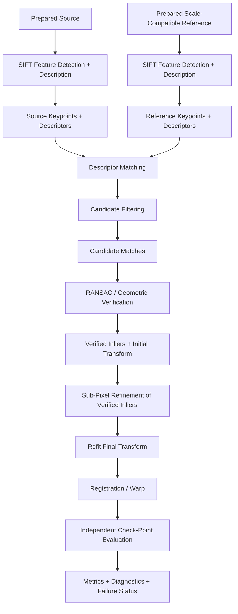
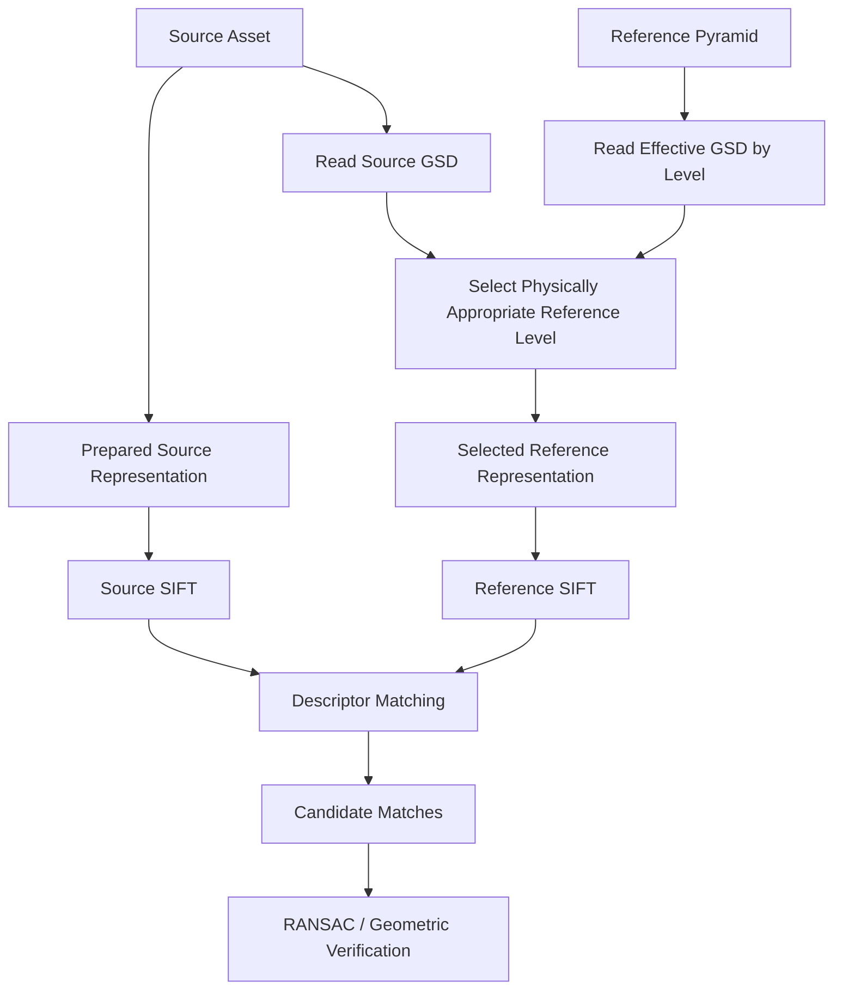

# SIFT Baseline

SIFT — **Scale-Invariant Feature Transform** — is ChandraMap's primary classical sparse-feature baseline for local lunar image correspondence.

It provides a well-established and interpretable way to:

- detect distinctive local image locations;
- describe local gradient structure around those locations;
- compare local features between a source and a reference image;
- produce candidate correspondences for later geometric verification.

SIFT is deliberately treated as a **baseline**, not as the complete ChandraMap registration system.

> **In ChandraMap, SIFT is a reproducible baseline for proposing sparse local correspondences; geometric verification and independent evaluation determine whether those correspondences are actually useful for lunar registration.**

The intended responsibility chain is:

```text
SIFT detection / description
        ↓
local features
        ↓
descriptor matching
        ↓
candidate matches
        ↓
RANSAC / geometric verification
        ↓
verified inliers
        ↓
transformation estimation
        ↓
registration model
        ↓
independent check points
        ↓
registration accuracy
```

Do not collapse these stages into:

> "SIFT matched the images, therefore registration is correct."

A descriptor match is only local appearance evidence. Lunar correspondence becomes scientifically meaningful only after:

- physical scale preparation;
- candidate filtering;
- geometric verification;
- transformation estimation;
- residual analysis;
- independent evaluation.

---

## 1. Why ChandraMap Uses SIFT

SIFT is useful to ChandraMap because it provides a strong classical reference point before more complex learned or multimodal methods are introduced.

Important reasons include:

- established computer-vision methodology;
- sparse and inspectable keypoints;
- interpretable local descriptors;
- configurable matching behavior;
- comparatively straightforward debugging;
- useful failure visualization;
- reproducible benchmarking when configuration is fixed;
- a meaningful baseline for stronger methods.

The purpose of the SIFT baseline is not to prove that SIFT is the best lunar matcher.

Its purpose is to establish:

> **a simple, measurable, explainable correspondence pipeline that later methods must improve upon on the same scientific cases.**

Possible later comparisons include:

- SIFT vs ALIKED + LightGlue;
- SIFT vs LoFTR;
- SIFT vs RIFT;
- SIFT vs CFOG-style approaches;
- SIFT with minimal preprocessing vs SIFT with improved scale handling;
- SIFT with different IIRS representations.

---

## 2. Why a Baseline Matters

Without a controlled baseline, it becomes difficult to determine what actually improved the system.

Suppose a later pipeline simultaneously adds:

- learned features;
- illumination normalization;
- reference pyramids;
- new geometry;
- sub-pixel refinement.

If performance improves, the project cannot tell which change produced the improvement.

A baseline allows controlled progression:

```text
Baseline
SIFT + geometry
        ↓
Scale-aware SIFT
        ↓
Illumination-aware SIFT
        ↓
Learned matcher comparison
        ↓
Advanced multimodal methods
```

This supports meaningful ablation and reproducible research.

---

# SIFT Terminology

## 3. Key Terms

| Term                 | Meaning in ChandraMap                                                                                                           |
| -------------------- | ------------------------------------------------------------------------------------------------------------------------------- |
| Keypoint             | Local image location detected as potentially distinctive                                                                        |
| Keypoint scale       | Local image scale associated with the detected feature                                                                          |
| Keypoint orientation | Characteristic local orientation assigned to the feature                                                                        |
| Descriptor           | Fixed-length numeric representation of local image structure around a keypoint                                                  |
| Descriptor match     | Proposed association between one source descriptor and one reference descriptor                                                 |
| Candidate match      | Descriptor-level correspondence not yet geometrically verified                                                                  |
| Inlier               | Candidate match consistent with the selected geometric model under the verification rule                                        |
| Outlier              | Candidate match rejected by geometric verification                                                                              |
| RANSAC               | Robust geometric estimation procedure used to identify model-consistent correspondences while rejecting inconsistent candidates |
| Scale-space          | SIFT's internal multi-scale representation used for local feature detection                                                     |
| Reference pyramid    | ChandraMap's physically motivated hierarchy of reference images at different effective GSDs                                     |
| Residual             | Difference between an observed correspondence and the point predicted by a fitted transformation                                |
| Check point          | Independently verified correspondence excluded from transformation fitting and used for evaluation                              |

Two concepts must remain separate:

```text
SIFT scale-space
```

and:

```text
ChandraMap physical reference pyramid
```

They operate at different levels of the problem.

---

# What SIFT Does

## 4. High-Level SIFT Process

Conceptually, SIFT performs four main tasks:

1. Search for potentially distinctive local structures across internal image scales.
2. Localize stable keypoints.
3. Assign a characteristic orientation to each retained feature.
4. Build a local descriptor from nearby gradient structure.

The resulting data are:

```text
keypoint location
+
keypoint scale
+
keypoint orientation
+
local descriptor
```

These features can then be compared with features from another image.

---

## 5. What SIFT Does Not Do

SIFT alone does **not**:

- know lunar latitude or longitude;
- search the entire Moon;
- choose the correct LRO product;
- determine source/reference GSD;
- generate ChandraMap's physical reference pyramid;
- convert an IIRS cube into a valid 2D registration representation;
- prove that descriptor matches are physically correct;
- perform independent ground-truth validation;
- determine whether a homography is physically adequate;
- guarantee illumination robustness;
- guarantee cross-modality robustness;
- guarantee registration accuracy;
- create ground truth;
- guarantee sub-pixel registration.

These responsibilities belong to other ChandraMap stages.

---

# SIFT Feature Detection

## 6. Scale-Space Concept

SIFT searches for local structures across several **algorithmic image scales**.

Instead of examining only one version of the image, it conceptually examines progressively smoothed versions.

This helps detect features whose useful local size differs.

Conceptually:

```text
Input Image
    ↓
Fine Internal Scale
    ↓
Moderately Smoothed Scale
    ↓
Coarser Internal Scale
    ↓
Local Extrema Search
```

This gives SIFT some robustness to moderate changes in how large a feature appears in pixel coordinates.

It does **not** remove the need for ChandraMap's physical GSD-aware scale handling.

---

## 7. Gaussian Scale Space

SIFT constructs an internal representation of the image at progressively smoothed scales.

The purpose is to make local structures detectable at different characteristic sizes.

For example, a crater-related feature may be:

- too detailed at one internal scale;
- stable at another;
- smoothed away at a much coarser scale.

SIFT's internal scale selection attempts to identify a suitable local scale for the feature.

Exact octave counts, smoothing constants, and other implementation parameters should come from the configured SIFT implementation rather than being invented in documentation.

---

## 8. Difference-of-Gaussians Concept

SIFT uses differences between nearby Gaussian-smoothed image representations to identify candidate structures that behave like local extrema in scale space.

Conceptually:

```text
Gaussian Scale A
        -
Gaussian Scale B
        ↓
Difference Representation
        ↓
Local Extrema Search
```

Candidate extrema may correspond to potentially distinctive image structures.

This stage generates feature candidates rather than final keypoints automatically.

---

## 9. Candidate Extrema

Candidate extrema are potential feature locations detected across:

- image position;
- internal scale.

Some candidates are unstable or poorly localized.

SIFT therefore applies additional localization and stability checks before retaining them as usable keypoints.

---

## 10. Keypoint Localization

Keypoint localization attempts to retain features whose location and scale can be estimated reliably enough for local description.

Potentially unstable detections may be removed.

This matters for lunar imagery because strong structures can arise from:

- crater rims;
- ridge boundaries;
- shadow edges;
- interpolation artifacts;
- NoData boundaries.

A strong response is not automatically a useful correspondence feature.

---

## 11. Edge-Like Responses

Strong edges can produce feature responses that are poorly constrained perpendicular or parallel to the edge.

Examples in lunar imagery include:

- long crater-rim segments;
- shadow boundaries;
- ridge lines;
- mask borders.

SIFT attempts to reject unsuitable edge-like feature candidates.

This does not mean all crater-rim or ridge features are undesirable.

It means a local detection should be sufficiently localized to support a useful descriptor.

---

# Orientation Assignment

## 12. Keypoint Orientation

SIFT associates retained keypoints with a characteristic orientation derived from local gradient structure.

Conceptually:

```text
local image gradients
        ↓
dominant local orientation
        ↓
orientation-normalized descriptor
```

This supports robustness when the same local terrain structure appears rotated in image coordinates.

---

## 13. What Orientation Handling Helps With

Orientation normalization can help when source/reference imagery differs because of:

- image rotation;
- map orientation;
- acquisition orientation;
- local rotational appearance.

It does not solve arbitrary differences caused by:

- moving shadows;
- spectral response;
- terrain hidden by illumination;
- strong projection differences.

---

## 14. Orientation Is Not Illumination Invariance

A crater observed under different Sun geometry may have different dominant gradient structure.

Therefore:

```text
orientation normalization
≠
Sun-angle normalization
```

The descriptor may still change substantially when illumination changes.

---

# SIFT Descriptors

## 15. Descriptor Concept

A SIFT descriptor is a fixed-length numeric vector representing the local gradient structure surrounding a keypoint.

Its purpose is to make local image regions numerically comparable.

Conceptually:

```text
Keypoint
   ↓
local neighborhood
   ↓
gradient structure
   ↓
orientation-aware aggregation
   ↓
descriptor vector
```

ChandraMap compares these vectors between source and reference images.

---

## 16. Gradient-Based Representation

SIFT relies heavily on local gradients rather than raw absolute intensity alone.

This can provide useful robustness to some changes in:

- brightness;
- contrast;
- local intensity scale.

However, lunar illumination changes can alter the gradients themselves.

For example:

```text
Sun geometry A
→ bright eastern crater rim
→ gradient pattern A

Sun geometry B
→ bright western crater rim
→ gradient pattern B
```

Therefore gradient-based description is helpful but not equivalent to illumination invariance.

---

## 17. Descriptor Normalization

SIFT descriptor construction includes normalization intended to reduce sensitivity to some local intensity and contrast changes.

This can help when two corresponding regions differ numerically but retain similar local structure.

It does **not** remove:

- physical shadow displacement;
- hidden terrain;
- spectral differences;
- missing fine-scale information.

---

# Descriptor Matching

## 18. Matching Source and Reference Features

After SIFT has extracted features independently from both images:

```text
Source
→ keypoints + descriptors

Reference
→ keypoints + descriptors
```

the descriptors can be compared.

Conceptually:

```text
Source Descriptors
        +
Reference Descriptors
        ↓
Descriptor Similarity Search
        ↓
Potential Associations
```

These associations are not yet geometrically verified.

---

## 19. Descriptor Distance

SIFT descriptors are compared using a suitable vector-distance measure supported by the selected implementation.

Smaller descriptor distance generally represents greater descriptor similarity under that measure.

However:

> **Descriptor similarity is evidence of local appearance similarity, not proof of geographic identity.**

Two different lunar craters may produce similar local descriptors.

---

## 20. Nearest-Neighbor Matching

A common conceptual strategy is:

1. take one source descriptor;
2. find the most similar reference descriptor or descriptors;
3. treat the result as a possible correspondence.

Conceptually:

```text
Source Descriptor
      ↓
Search Reference Descriptors
      ↓
Best Candidate
+
Alternative Candidate(s)
```

The output is still a candidate.

---

# Ratio Filtering

## 21. Ratio-Test Concept

A ratio-style filter compares:

- similarity to the best descriptor candidate;
- similarity to the next-best alternative.

The intuition is:

> A reliable local descriptor should ideally prefer one candidate noticeably more strongly than competing candidates.

If the best and second-best alternatives are too similar, the feature may be ambiguous.

---

## 22. Why Ratio Filtering Helps on Lunar Terrain

The lunar surface can contain repetitive patterns such as:

- similar small craters;
- repeated crater rims;
- similar ridge fragments;
- repetitive rough terrain.

A source descriptor may therefore find several similar-looking reference locations.

Ratio filtering can remove some cases where the best candidate is not sufficiently distinctive.

---

## 23. Ratio Threshold Is Configurable

ChandraMap should not hard-code one undocumented ratio threshold as a scientific universal.

The threshold should be:

- explicit;
- configuration-driven;
- recorded with benchmark results;
- tuned using appropriate development/validation methodology.

Avoid optimizing it repeatedly against the final test set.

---

## 24. Ratio Filtering Is Not Verification

A candidate that passes the ratio test can still be geographically wrong.

Therefore:

```text
ratio filter passed
≠
verified match
```

Geometric verification remains required.

---

# Mutual / Cross-Check Filtering

## 25. Mutual-Consistency Concept

A mutual or cross-check strategy can ask whether a correspondence is consistent in both matching directions.

Conceptually:

```text
Source Feature A
→ best Reference Feature B

Reference Feature B
→ best Source Feature A
```

If both agree, the candidate may be less ambiguous than a one-directional association.

---

## 26. Ratio Test vs Cross-Check

| Filter             | Core Idea                                                        | Potential Benefit                         | Limitation                                               |
| ------------------ | ---------------------------------------------------------------- | ----------------------------------------- | -------------------------------------------------------- |
| Ratio filtering    | Best candidate should be clearly better than an alternative      | Removes some ambiguous descriptors        | Still based on appearance only                           |
| Mutual/cross-check | Source-to-reference and reference-to-source choices should agree | Rejects some asymmetric associations      | Can discard useful candidates and does not test geometry |
| Combined filtering | Apply more than one descriptor-level constraint                  | Potentially cleaner candidate set         | Can become too restrictive                               |
| Minimal filtering  | Preserve many candidates for robust geometry                     | Higher recall of possible correspondences | More outliers reach RANSAC                               |

These strategies may be:

- alternatives;
- combined;
- studied through ablation.

No one filtering strategy is universally required.

---

## 27. Descriptor Filtering vs Geometry

This distinction is essential.

### Descriptor Filtering

Asks:

> Do these local feature vectors look sufficiently similar?

### Geometric Verification

Asks:

> Do the proposed correspondences agree with a plausible spatial transformation?

Therefore:

```text
appearance consistency
≠
geometric consistency
```

Both matter.

---

# Candidate Matches

## 28. Correct Terminology

After descriptor matching and optional filtering, ChandraMap should call the surviving correspondences:

> **candidate matches**

Do not call them:

- verified correspondences;
- ground truth;
- final matches;
- guaranteed matches;
- inliers.

---

## 29. Conceptual Candidate-Match Record

A candidate match may conceptually preserve:

- source feature ID/index;
- reference feature ID/index;
- source coordinates;
- reference coordinates;
- source keypoint scale;
- reference keypoint scale;
- descriptor distance;
- filtering status.

This is conceptual.

The exact software contract belongs in implementation documentation.

---

# Why Geometric Verification Is Required

## 30. Appearance Ambiguity on Lunar Terrain

Lunar imagery can contain many locally similar structures.

Examples include:

- repeated crater fields;
- similarly shaped crater rims;
- repeated ridge fragments;
- low-texture plains;
- repeated shadow patterns.

A descriptor can therefore produce a plausible local match in the wrong geographic location.

---

## 31. Candidate Matches Can Be Wrong Collectively

Suppose SIFT returns:

```text
candidate 1
candidate 2
candidate 3
...
```

Each candidate may look locally plausible.

Geometric verification asks whether they collectively support one coherent spatial relationship.

---

# RANSAC and Geometric Verification

## 32. Why RANSAC Follows SIFT

The conceptual flow is:

```text
SIFT
→ descriptors
→ candidate matches
→ RANSAC
→ model-consistent inliers
```

RANSAC helps reject descriptor matches inconsistent with the selected geometric model.

---

## 33. RANSAC Concept

At a high level, RANSAC repeatedly:

1. selects a small subset of candidate correspondences;
2. estimates a geometric-model hypothesis;
3. measures which candidates agree with that model;
4. compares hypotheses;
5. identifies a model-supported inlier set.

Conceptually:

```text
Candidate Matches
        ↓
Model Hypotheses
        ↓
Geometric Consistency
        ↓
Inliers + Outliers
        ↓
Initial Model
```

---

## 34. Verified Inliers

After geometric verification, a candidate may be labeled an **inlier** if it is sufficiently consistent with the selected model under the configured verification conditions.

This does not mean:

> RANSAC proved the point is ground truth.

An incorrect set of correspondences can occasionally support an incorrect but internally consistent model.

Independent evaluation remains necessary.

---

## 35. Outliers

Outliers are candidate matches rejected by geometric verification.

Possible causes include:

- repeated crater ambiguity;
- descriptor error;
- wrong reference region;
- scale mismatch;
- shadow mismatch;
- modality difference;
- inadequate geometric model.

Outlier statistics are useful diagnostics.

---

## 36. RANSAC Tolerance

The geometric tolerance used during robust estimation should be:

- documented;
- configuration-driven;
- expressed in known coordinate units;
- interpreted relative to the working image scales;
- benchmarked.

Do not invent one universal pixel threshold for:

- OHRC;
- TMC-2;
- IIRS;
- every pyramid level.

---

## 37. RANSAC Failure

A valid RANSAC outcome may be failure.

Possible causes include:

- too few candidate matches;
- too many outliers;
- wrong reference region;
- incorrect reference scale;
- repetitive terrain;
- severe illumination differences;
- modality mismatch;
- inappropriate transform model.

Do not force a transformation from insufficient evidence.

---

# Transformation Models

## 38. Affine Transformation

An affine model can represent combinations of:

- translation;
- rotation;
- scale;
- shear.

It may be a useful approximation for some local lunar registration cases.

Conceptually:

```text
source coordinates
        ↓
affine transformation
        ↓
reference coordinates
```

Its adequacy must be measured.

---

## 39. Homography

A homography models a planar projective relationship.

It can be useful for local image registration under suitable conditions.

However:

> **The Moon is not a flat poster.**

A single global homography may become inadequate when:

- terrain relief is significant;
- the field is large;
- source/reference projections differ;
- viewing geometry differs;
- displacement varies across the scene.

---

## 40. Affine vs Homography

Model choice should depend on evidence such as:

- benchmark definition;
- expected pair geometry;
- overlap;
- projection;
- number and distribution of correspondences;
- residual pattern;
- independent check-point error.

The more flexible model is not automatically better.

---

## 41. Transform Direction

Every transformation should state its coordinate direction.

For example:

```text
source → reference
```

is different from:

```text
reference → source
```

Store enough metadata to identify:

- source coordinate domain;
- destination coordinate domain;
- model type.

---

# Residual Analysis

## 42. Residual Definition

For one correspondence, a residual represents the difference between:

- the observed matched/reference location;
- the location predicted by the fitted transformation.

Conceptually:

```text
observed reference point
-
transformed source point
=
residual vector
```

---

## 43. Residual Magnitude

Residual magnitude helps measure how strongly an inlier agrees with the fitted model.

It is useful for:

- debugging;
- outlier inspection;
- model comparison.

It is not automatically independent registration accuracy if the same point was used to fit the model.

---

## 44. Residual Direction

Residual direction can reveal systematic effects.

For example:

- common directional bias;
- edge-dependent displacement;
- local terrain effects.

Residual vectors should therefore be inspected spatially rather than reduced immediately to one scalar average.

---

## 45. Spatial Residual Patterns

Patterns may suggest:

- projection mismatch;
- incorrect scale;
- insufficient transform flexibility;
- viewing-geometry effects;
- terrain relief;
- false correspondence groups.

Do not attribute every residual pattern to SIFT itself.

---

# Inlier Spatial Coverage

## 46. Why Coverage Matters

A set of many inliers can still provide weak whole-image registration if they all occupy one small area.

For example:

```text
many inliers
all around one crater
```

may constrain that local crater well while poorly constraining the rest of the overlap.

Therefore ChandraMap should consider:

- inlier count;
- inlier ratio;
- spatial distribution.

---

## 47. Coverage Metrics

Possible coverage measures include:

- grid occupancy;
- convex-hull coverage;
- another documented spatial-distribution measure.

No universal threshold is defined here.

Coverage metrics must be defined explicitly before benchmark interpretation.

---

# Sub-Pixel Refinement

## 48. Correct SIFT-to-Refinement Order

The intended ChandraMap order is:

```text
SIFT Keypoints + Descriptors
        ↓
Descriptor Matching
        ↓
Candidate Filtering
        ↓
Candidate Matches
        ↓
RANSAC / Initial Model
        ↓
Verified Inliers
        ↓
Sub-Pixel Refinement
        ↓
Refit Final Transform
        ↓
Independent Evaluation
```

This ordering is important.

---

## 49. Why Verification Comes Before Refinement

Refinement attempts to improve coordinate precision.

If a candidate correspondence is wrong:

> refining it produces a more precisely localized wrong correspondence.

Therefore:

```text
verification first
refinement second
```

is the preferred order.

---

## 50. SIFT Localization vs Final Registration Precision

SIFT can estimate feature locations and characteristic scales with more nuance than integer-pixel corner detection alone.

However:

> **SIFT feature localization is not the same as guaranteed final sub-pixel registration accuracy.**

Final accuracy depends on:

- source information;
- reference information;
- geometry;
- refinement method;
- projection;
- ground truth;
- sensor GSD.

---

# SIFT Scale-Space vs ChandraMap Reference Pyramid

## 51. Two Different Scale Problems

One of the most important distinctions in this file is:

### SIFT Scale-Space

Addresses:

> At what local image scale should a feature be detected and described?

### ChandraMap Reference Pyramid

Addresses:

> At what physical reference sampling should two sensors be compared?

These concepts are related but not interchangeable.

---

## 52. Why SIFT Scale-Space Does Not Replace GSD Handling

Suppose a source is extremely coarse and the reference is extremely fine.

The fine reference may contain:

- small craters;
- small ridges;
- narrow shadow edges;

that were never captured by the source sensor.

SIFT cannot create corresponding source features for information that does not exist.

Therefore:

> **Internal SIFT scale invariance does not eliminate extreme physical-information mismatch.**

---

## 53. Physical Scale Comes First

A stronger ChandraMap route is:

```text
Source Asset
        ↓
Read Source GSD

Reference Asset
        ↓
Read Reference / Pyramid GSD
        ↓
Choose Physically Appropriate Level
        ↓
SIFT
```

not:

```text
Source
+
native reference at arbitrary GSD
        ↓
assume SIFT will solve everything
```

See [`scale-pyramid.md`](scale-pyramid.md).

---

# OHRC + SIFT

## 54. OHRC Context

OHRC is the Chandrayaan-2 **Orbiter High Resolution Camera**.

Current project documentation commonly uses approximately:

> **~0.25–0.32 m/pixel**

depending on product/documentation.

Actual product metadata remains authoritative.

---

## 55. Potential OHRC Strengths

OHRC may provide:

- fine crater structure;
- small ridges;
- detailed terrain transitions;
- many potentially distinctive local features.

This may allow SIFT to detect many keypoints.

However:

> **high feature density does not automatically mean reliable matching.**

---

## 56. OHRC Failure Sources

Possible difficulties include:

- repetitive high-resolution crater texture;
- large image dimensions;
- strong Sun-angle differences;
- small shadow structures;
- projection differences;
- terrain-relief effects.

Fine detail can increase both:

- useful evidence;
- ambiguity.

---

## 57. OHRC Reference Scale

OHRC and LRO NAC may sometimes have similar physical sampling.

In other cases:

- NAC may be finer;
- OHRC may be finer.

Use actual GSD rather than assuming one universal ordering.

---

# TMC-2 + SIFT

## 58. TMC-2 Context

TMC-2 is the Chandrayaan-2 **Terrain Mapping Camera-2**.

Current project planning commonly uses approximately:

> **~5 m/pixel**

with actual product metadata remaining authoritative.

---

## 59. TMC-2 Feature Character

TMC-2 may emphasize broader structures such as:

- larger crater morphology;
- ridge systems;
- terrain boundaries;
- medium-scale organization.

It may contain fewer useful fine local features than OHRC.

---

## 60. TMC-2 vs Fine NAC

Native high-resolution NAC may contain too much local detail relative to TMC-2.

A stronger baseline may therefore use:

```text
TMC-2
      ↓
read source GSD
      ↓
select compatible NAC pyramid level
      ↓
SIFT
```

rather than native NAC by default.

---

## 61. TMC-2 Scale Ablation

A useful experiment is:

```text
same TMC-2 source
same NAC parent reference
same SIFT configuration
same truth

native NAC
vs.
GSD-aware NAC level
```

This measures the effect of physical-scale preparation independently from the matcher.

---

# IIRS + SIFT

## 62. IIRS Context

IIRS is the Chandrayaan-2 **Imaging Infrared Spectrometer**.

Project-level approximations include:

- ~80 m/pixel spatial scale;
- ~0.8–5.0 µm spectral coverage;
- roughly ~250–256 bands depending on product/documentation.

Actual product metadata remains authoritative.

---

## 63. Raw IIRS Cube Is Not Ordinary SIFT Input

Do not use:

```text
IIRS hyperspectral cube
→ ordinary grayscale SIFT
```

without defining how the spectral dimension becomes a meaningful 2D registration representation.

SIFT expects a 2D image representation appropriate for local gradient analysis.

---

## 64. IIRS Baseline Path

Conceptually:

```text
IIRS Scientific Product
        ↓
Validate Spectral + Spatial Structure
        ↓
Derive Documented 2D Registration Representation
        ↓
Physical Scale Preparation
        ↓
SIFT Baseline
```

Potential 2D representations include:

- selected valid band;
- PCA component;
- spectral composite;
- structural representation.

No one representation should be declared universally best without measurement.

---

## 65. IIRS Modality Challenge

Even after a 2D representation is produced:

- spectral response differs;
- local gradients may differ;
- illumination response may differ;
- spatial scale remains coarse.

Therefore SIFT should be treated as:

> **a useful baseline experiment for IIRS, not a guaranteed strong solution.**

---

## 66. IIRS vs NAC Scale

Fine NAC imagery may contain substantial terrain detail absent from IIRS.

The preferred conceptual route is:

```text
IIRS 2D Representation
        ↓
Strongly Coarsened NAC
        ↓
SIFT Experiment
```

rather than:

```text
IIRS
→ full-resolution NAC
→ assume SIFT handles the gap
```

---

# LRO NAC + SIFT

## 67. NAC Context

LRO NAC is ChandraMap's primary fine/local reference family.

Current planning often treats NAC as approximately:

> **~0.5–2 m/pixel**

depending on product and acquisition geometry.

Do not hard-code one universal NAC scale.

---

## 68. Dense NAC Feature Detection

NAC may yield many fine SIFT features.

This can be useful for:

- OHRC-like fine registration;
- finer refinement stages.

It can also be problematic when the source is much coarser.

A reference containing more features is not automatically a better reference.

---

# LRO WAC + SIFT

## 69. WAC Context

LRO WAC provides broad/coarse/contextual lunar imagery.

Its effective scale is product/mode/processing dependent.

Do not assign one universal WAC GSD.

---

## 70. Potential WAC SIFT Uses

SIFT may be tested on suitable WAC products for:

- coarse structural matching;
- regional registration;
- selected localization experiments.

Its effectiveness depends on:

- product resolution;
- terrain;
- source sensor;
- modality;
- illumination.

---

# Illumination Handling

## 71. SIFT and Brightness Differences

Because SIFT descriptors rely on normalized local gradient structure rather than raw intensity alone, they may tolerate some changes in:

- brightness;
- local contrast.

This is useful but limited.

---

## 72. SIFT and Sun-Angle Differences

Changing lunar Sun geometry can alter:

- gradient direction;
- crater-rim brightness;
- ridge visibility;
- shadow position;
- visible terrain.

Therefore:

> **SIFT should not be described as Sun-angle invariant.**

---

## 73. Shadow-Boundary Features

Shadow boundaries often produce strong gradients.

SIFT may therefore detect keypoints around:

- crater shadows;
- ridge shadows;
- illumination transitions.

These can be unstable across observations because the shadow boundary may move even when the terrain itself does not.

---

## 74. Illumination Preprocessing

Candidate experiments may include:

- minimally processed intensity;
- global normalization;
- local contrast normalization;
- gradients;
- structural representations.

The correct comparison is:

```text
same pair
same SIFT configuration
same scale
different illumination preprocessing
```

See [`illumination-handling.md`](illumination-handling.md).

---

# Low-Feature Lunar Terrain

## 75. Low-Feature Cases

Some lunar regions may contain:

- smooth terrain;
- weak local gradients;
- few distinctive structures.

SIFT may therefore produce:

- few keypoints;
- unstable descriptors;
- insufficient candidate matches.

This is a legitimate failure condition.

---

## 76. Handling Too Few Keypoints

Possible configured responses include:

- record the feature shortage;
- inspect valid-data coverage;
- try an appropriate adjacent reference scale;
- try a benchmarked preprocessing variant;
- compare a different matcher in later versions.

Do not keep weakening filtering or geometry constraints until an apparently successful result appears.

---

# Repetitive Terrain

## 77. Repeated Crater Patterns

Lunar crater fields can contain many locally similar shapes.

A SIFT descriptor may find several visually similar reference candidates.

Therefore:

```text
locally similar
≠
same physical crater
```

---

## 78. Geometry Resolves Some Ambiguity

Repeated local structures may still be rejected if they do not agree with the same global/local geometric model.

This is a major reason RANSAC belongs after descriptor matching.

---

## 79. Spatial Context Matters

A reliable set of correspondences should ideally contain mutually consistent evidence spread throughout the overlap.

A cluster of matches confined to one repetitive crater group is weaker evidence than similarly accurate correspondences distributed across the image.

---

# Masks

## 80. Valid-Data Masks

When the selected implementation supports appropriate masking, SIFT feature detection should avoid scientifically invalid regions such as:

- NoData;
- projection borders;
- invalid raster areas;
- corrupted data;
- explicitly excluded regions.

Do not assume masking support or exact behavior without checking the implementation used by ChandraMap.

---

## 81. Mask Boundaries

A mask boundary can produce a strong artificial image edge.

If invalid borders are rendered into the image before feature detection, SIFT may detect:

- corners;
- gradient extrema;

that belong to preprocessing rather than lunar terrain.

Mask handling should therefore be coordinated with [`preprocessing.md`](preprocessing.md).

---

# Keypoint Density

## 82. Keypoint Count

Keypoint count is a useful diagnostic.

It can help identify:

- low-feature terrain;
- excessive smoothing;
- overly detailed reference imagery;
- preprocessing effects.

However:

> **More keypoints do not automatically mean better registration.**

---

## 83. Spatial Distribution of Keypoints

Useful diagnostics include whether features occur:

- throughout the overlap;
- only along bright crater rims;
- only in one corner;
- only near shadow boundaries;
- only near mask borders.

Keypoint distribution helps explain downstream candidate-match behavior.

---

## 84. Feature Density Across Reference Levels

Different pyramid levels can produce very different keypoint densities.

A very fine level may generate:

- many small-scale features.

A coarser level may generate:

- fewer but broader structural features.

This can be useful when diagnosing scale mismatch.

---

# SIFT Configuration

## 85. Configuration Categories

Potential SIFT configuration categories include:

- maximum/target feature count;
- scale-space configuration;
- contrast-related detection controls;
- edge-response filtering controls;
- descriptor configuration;
- mask use.

Exact defaults should come from:

- repository configuration;
- actual OpenCV/library behavior;
- benchmark specification.

Do not invent ChandraMap defaults.

---

## 86. Parameter Sensitivity

Changing SIFT parameters can affect:

- detected keypoint count;
- feature distribution;
- descriptor stability;
- runtime;
- candidate matches;
- RANSAC behavior.

Parameter changes therefore constitute experiment changes.

---

## 87. Parameter Tuning

Parameter selection should use:

- development cases;
- validation cases;
- controlled benchmark methodology.

Do not repeatedly tune SIFT parameters against final held-out test results and then report those test results as untouched evaluation.

---

# Matching Configuration

## 88. Descriptor Search Strategy

Candidate matching may conceptually use:

- direct/brute-force nearest-neighbor comparison;
- indexed nearest-neighbor search;
- another compatible descriptor-search implementation.

This document does not mandate one implementation.

The selected matcher configuration should be recorded.

---

## 89. Ratio-Filter Configuration

Where ratio filtering is used, preserve:

- whether it is enabled;
- its configured threshold;
- implementation/version;
- experiment identity.

Do not silently modify it between benchmark methods.

---

## 90. Cross-Check Configuration

Where mutual/cross-check filtering is used, preserve:

- enabled/disabled state;
- filtering order;
- interaction with ratio filtering.

This allows controlled filtering ablations.

---

# Canonical SIFT Baseline

## 91. End-to-End Baseline

The core ChandraMap SIFT path is:

```text
Prepared Source
        ↓
Source SIFT Keypoints + Descriptors

Prepared Reference at Appropriate Physical Scale
        ↓
Reference SIFT Keypoints + Descriptors

Source + Reference Descriptors
        ↓
Descriptor Matching
        ↓
Candidate Filtering
        ↓
Candidate Matches
        ↓
RANSAC / Geometric Verification
        ↓
Verified Inliers + Initial Model
        ↓
Sub-Pixel Refinement of Verified Inliers
        ↓
Refit Final Transform
        ↓
Registration
        ↓
Independent Check-Point Evaluation
        ↓
Metrics + Diagnostics
```

---

# SIFT Baseline Diagram

## 92. Main SIFT Flow



The diagram deliberately separates descriptor matching from geometric verification.

---

## 93. Scale-Aware SIFT Flow



> **SIFT's internal scale-space does not replace this physical GSD-aware reference-selection stage.**

---

# SIFT Output Contracts

## 94. Feature Output

A feature record may conceptually include:

- feature/keypoint index;
- image coordinates;
- keypoint scale;
- keypoint orientation;
- detector response where available;
- descriptor;
- asset ID;
- preprocessing version;
- reference pyramid level where applicable.

This is conceptual rather than a fixed implementation schema.

---

## 95. Candidate-Match Output

Conceptually:

- source feature ID;
- reference feature ID;
- source coordinates;
- reference coordinates;
- descriptor distance;
- descriptor-filter status.

Status:

> **candidate**

not verified.

---

## 96. Geometrically Verified Output

After RANSAC/geometric verification, a match record may additionally include:

- inlier/outlier status;
- geometric residual;
- model identity/version;
- verification configuration.

The verifier, not SIFT alone, determines geometric inlier status.

---

# Evaluation

## 97. SIFT Benchmark Metrics

Useful metrics include:

- source keypoint count;
- reference keypoint count;
- candidate match count;
- verified inlier count;
- inlier ratio;
- spatial coverage;
- independent check-point RMSE;
- source-image pixel error;
- runtime;
- failure status.

No single metric should be interpreted alone.

---

## 98. Keypoint Count Is Diagnostic

A higher keypoint count may mean:

- more useful structure;
- more fine texture;
- more noise;
- more unstable shadow features.

It is not an accuracy metric.

---

## 99. Candidate Match Count Is Diagnostic

Many candidate matches can still contain many false associations.

Therefore:

```text
many descriptor matches
≠
accurate registration
```

---

## 100. Inlier Count

Verified inlier count tells how many candidate correspondences are consistent with the selected model.

Interpret it together with:

- candidate count;
- inlier ratio;
- spatial coverage;
- independent error.

---

## 101. Inlier Ratio

Conceptually:

$$
\text{inlier ratio}
=
\frac{\text{verified inliers}}
{\text{candidate matches}}
$$

It is useful for diagnosing matcher cleanliness.

It should not be reported simply as:

> "SIFT accuracy."

---

## 102. Spatial Coverage

A useful registration should generally obtain geometrically valid correspondences across the usable overlap.

Possible coverage measures include:

- grid occupancy;
- convex-hull coverage.

Coverage helps distinguish:

```text
many clustered inliers
```

from:

```text
well-distributed geometric support
```

---

## 103. Independent Check-Point RMSE

Where independent truth exists, check-point RMSE is a preferred registration metric.

A reported value should identify:

- coordinate domain;
- source sensor;
- units;
- number/set of check points;
- truth version;
- benchmark version.

---

## 104. Source-Pixel Error First

ChandraMap should normally report registration error in the source coordinate system first.

Examples:

```text
OHRC source
→ error in OHRC pixels
```

```text
TMC-2 source
→ error in TMC-2 pixels
```

```text
IIRS 2D source representation
→ error in IIRS source-grid pixels
```

Convert to ground distance only when:

- product-specific scale;
- projection;
- geographic mapping;
- reference truth;

justify the conversion.

---

## 105. Runtime

Useful timing categories include:

- feature detection/description;
- descriptor matching;
- candidate filtering;
- RANSAC;
- refinement;
- total local-registration runtime.

Comparisons should preserve relevant hardware/software context when it materially affects interpretation.

---

# Baseline Benchmarking

## 106. Why Baseline Results Matter

SIFT provides the reference against which stronger methods can be tested.

The comparison should answer:

> Does a more complex method measurably improve correspondence or registration on the same lunar cases?

Possible comparisons include:

- SIFT vs ALIKED + LightGlue;
- SIFT vs LoFTR;
- SIFT vs RIFT;
- SIFT vs CFOG-style method.

No method should be ranked before measurement.

---

## 107. Same-Pair Rule

Incorrect:

```text
SIFT
→ difficult IIRS pair

Learned matcher
→ easy OHRC pair
```

Correct:

```text
same pair
same source/reference assets
same truth
        ↓
compare methods
```

---

## 108. Same-Preprocessing Rule

Where technically reasonable, matcher comparisons should keep preprocessing constant.

If different matchers require different:

- numeric ranges;
- image dimensions;
- channel layouts;

those matcher-specific adaptations should be documented separately.

---

## 109. Same-Scale Rule

A SIFT vs learned-matcher experiment should not silently give one method:

```text
full-resolution reference
```

and another:

```text
better GSD-aware reference
```

unless scale preparation itself is part of the experimental comparison.

---

## 110. Same-Evaluation Rule

Use the same:

- pair;
- truth;
- check points;
- metric definitions;
- success/failure policy.

This is required for meaningful benchmarking.

---

# SIFT Ablations

## 111. Descriptor-Filter Ablation

Conceptually compare:

- minimal descriptor filtering;
- ratio filtering;
- mutual/cross-check filtering;
- ratio + mutual filtering.

Keep the scientific pair and geometry pipeline fixed.

---

## 112. Scale-Pyramid Ablation

With the same SIFT configuration, compare:

- native reference;
- GSD-aware level;
- neighboring-level search;
- coarse-to-fine strategy.

This measures scale handling rather than matcher changes.

---

## 113. Illumination-Preprocessing Ablation

With the same pair, scale, and SIFT configuration, compare:

- prepared intensity;
- normalized intensity;
- local contrast preprocessing;
- gradient/structural representation.

---

## 114. IIRS Representation Ablation

Keep the SIFT baseline fixed and compare:

- selected band;
- PCA-derived representation;
- composite;
- structural representation.

This helps determine whether representation choice affects SIFT before introducing a stronger matcher.

---

# SIFT Benchmark Table

## 115. Conceptual Results Template

| Pair      | Source Sensor | Reference      | Preprocessing | Pyramid Level | Keypoints | Candidates | Inliers | Inlier Ratio | Check RMSE | Coverage | Runtime | Status |
| --------- | ------------- | -------------- | ------------- | ------------- | --------: | ---------: | ------: | -----------: | ---------: | -------: | ------: | ------ |
| `PAIR_ID` | `SENSOR`      | `REFERENCE_ID` | `CONFIG_ID`   | `LEVEL`       |         — |          — |       — |            — |          — |        — |       — | —      |

Only measured results should populate this table.

Do not insert decorative or placeholder performance scores as though they were experiments.

---

# Failure Modes

## 116. Common SIFT Failure Modes

| Failure                                         | Possible Cause                             | Diagnostic / Response                            |
| ----------------------------------------------- | ------------------------------------------ | ------------------------------------------------ |
| Few source keypoints                            | Low-feature terrain                        | Record keypoint count and inspect representation |
| Few reference keypoints                         | Over-smoothed or low-feature reference     | Inspect reference level                          |
| Many candidates, few inliers                    | Repetitive terrain or descriptor ambiguity | Inspect geometry and candidate plot              |
| RANSAC cannot estimate stable model             | Too few valid candidates or wrong region   | Check overlap/reference selection                |
| TMC-2 ↔ NAC performs poorly                     | Reference may be too fine                  | Test GSD-aware NAC level                         |
| IIRS ↔ NAC performs poorly                      | Scale + modality mismatch                  | Revisit IIRS representation and reference scale  |
| Matches cluster around one crater               | Poor spatial support                       | Inspect coverage                                 |
| Fine shadow edges dominate                      | Illumination mismatch                      | Run illumination ablation                        |
| Features appear along invalid borders           | Mask/NoData problem                        | Fix preprocessing                                |
| High inlier ratio but poor check RMSE           | Wrong model or clustered inliers           | Inspect residual field                           |
| Good fit residual but poor independent error    | Overfitting to fit points                  | Use held-out check points                        |
| Native reference works worse than coarser level | Fine detail unsupported by source          | Keep physically meaningful level                 |
| Runtime unexpectedly high                       | Excessive image/reference feature density  | Profile detection and matching stages            |

---

## 117. Failure Is a Benchmark Result

Do not hide:

- zero-keypoint cases;
- zero-candidate cases;
- insufficient-match cases;
- RANSAC failure;
- unstable transformations;
- poor coverage;
- failed independent evaluation.

A failure record should preserve enough information to identify:

- pair;
- sensor;
- representation;
- reference level;
- SIFT configuration;
- matching configuration;
- failure stage.

---

# Quality Control

## 118. SIFT QC Checklist

Before treating a SIFT result as benchmark-ready, verify:

- [ ] Source asset is valid.
- [ ] Reference asset is valid.
- [ ] Source representation is known.
- [ ] Reference representation is known.
- [ ] Source GSD is known or explicitly unavailable.
- [ ] Reference level/effective GSD is known.
- [ ] Preprocessing version is recorded.
- [ ] Valid masks are handled where required.
- [ ] Source keypoints are present.
- [ ] Reference keypoints are present.
- [ ] Descriptor arrays are valid and finite.
- [ ] Candidate-match count is recorded.
- [ ] Descriptor-filter configuration is recorded.
- [ ] RANSAC/geometric-verification configuration is recorded.
- [ ] Inlier count is recorded.
- [ ] Inlier spatial distribution is inspected/measured.
- [ ] Transform model is identified.
- [ ] Transform direction is explicit.
- [ ] Residuals are available where practical.
- [ ] Check points are independent from transform fitting where intended.
- [ ] Truth/benchmark version is recorded.
- [ ] Failure status is preserved.

---

## 119. Visual QC

Useful visualizations include:

- source keypoints;
- reference keypoints;
- raw candidate-match lines;
- rejected outliers;
- verified inliers;
- residual vectors;
- registered overlay.

These are valuable for diagnosing failure.

They do not replace quantitative evaluation.

---

# Reproducibility

## 120. Reproducible SIFT Run

A reproducible run should identify:

- source asset ID/version;
- reference asset ID/version;
- source representation;
- reference representation;
- reference pyramid level;
- effective reference GSD;
- preprocessing version;
- SIFT configuration;
- descriptor-search configuration;
- ratio/cross-check configuration;
- RANSAC configuration;
- geometric model;
- refinement configuration;
- benchmark version;
- truth version;
- software/dependency version where relevant.

---

## 121. Configuration Versioning

Do not silently change between experiments:

- SIFT detection parameters;
- descriptor filtering;
- ratio threshold;
- cross-check policy;
- geometric tolerance;
- transform model;
- reference level.

Any such change can affect benchmark results.

---

## 122. Determinism

SIFT feature extraction itself may be reproducible for fixed inputs and implementation conditions, but the complete pipeline may include stochastic robust estimation.

Where applicable, record random seeds for procedures such as RANSAC if:

- the implementation exposes them;
- reproducibility policy requires them.

Do not promise perfect bit-for-bit reproducibility across all libraries, hardware, and platforms unless verified.

---

# Versioned Role of SIFT

## 123. V1 — Primary Classical Baseline

SIFT should play a central role in V1.

Conceptually:

```text
Known-Overlap Pair
        ↓
Sensor-Aware Preparation
        ↓
Physical Reference Scale
        ↓
SIFT
        ↓
Descriptor Matching
        ↓
Candidate Filtering
        ↓
RANSAC
        ↓
Affine / Homography Where Appropriate
        ↓
Optional Verified-Inlier Refinement
        ↓
Final Transform
        ↓
Independent Check-Point Evaluation
```

The purpose is to establish a measurable end-to-end baseline.

---

## 124. V2 — Controlled Pipeline Improvements

SIFT should remain the matcher baseline while testing:

- stronger GSD-aware reference selection;
- reference pyramids;
- illumination preprocessing;
- structural representations;
- more difficult sensor pairs;
- initial IIRS experiments.

This isolates pipeline improvements from matcher replacement.

---

## 125. V3 — Baseline Alongside Retrieval and Learned Matching

If V3 adds:

- global retrieval;
- ALIKED + LightGlue;
- LoFTR;
- WAC/NAC reference hierarchy;

SIFT remains useful as a local baseline on the same candidate pairs where scientifically meaningful.

---

## 126. V4 — Historical and Research Baseline

Even if future ChandraMap versions introduce:

- lunar-specific learned models;
- multimodal remote-sensing methods;
- DEM-aware geometry;
- local deformation models;

SIFT can remain a stable historical baseline.

A classical baseline should not disappear merely because newer methods are available.

---

# Comparison with Other Matcher Families

## 127. SIFT vs ALIKED + LightGlue

| Aspect                                | SIFT                                   | ALIKED + LightGlue            |
| ------------------------------------- | -------------------------------------- | ----------------------------- |
| Feature extraction                    | Classical sparse detector + descriptor | Learned sparse local features |
| Matching                              | Descriptor-based matching              | Learned feature matching      |
| Output before geometry                | Candidate correspondences              | Candidate correspondences     |
| Geometric verification still required | Yes                                    | Yes                           |
| Lunar performance                     | Must be measured                       | Must be measured              |

ALIKED and LightGlue have separate responsibilities:

```text
ALIKED
→ sparse detection / description

LightGlue
→ matching
```

---

## 128. SIFT vs LoFTR

SIFT follows:

```text
detect
→ describe
→ match
```

LoFTR is detector-free and estimates correspondences directly from image pairs.

Both still require downstream evaluation.

LoFTR's different architecture does not make geometric verification or lunar benchmarking unnecessary.

---

## 129. SIFT vs RIFT / CFOG-Style Methods

SIFT is a classical general-purpose local-feature baseline.

RIFT and CFOG-style approaches are relevant research directions for multimodal remote-sensing correspondence.

Their lunar performance should be established using:

- the same scientific pairs;
- controlled scale preparation;
- the same evaluation protocol.

Do not rank them in advance.

---

# Claims ChandraMap Should Avoid

## 130. Unsupported SIFT Claims

Do not claim:

- "SIFT is lunar invariant."
- "SIFT is Sun-angle invariant."
- "SIFT is illumination invariant."
- "SIFT automatically handles OHRC, TMC-2, and IIRS."
- "SIFT solves hyperspectral matching."
- "SIFT scale-space eliminates GSD mismatch."
- "SIFT matches are ground truth."
- "Ratio-test matches are verified correspondences."
- "RANSAC makes every inlier correct."
- "More SIFT keypoints mean better registration."
- "More SIFT matches mean better registration."
- "SIFT guarantees homography estimation."
- "SIFT guarantees sub-pixel accuracy."
- "SIFT always works on crater terrain."
- "SIFT is always inferior to learned methods."
- "SIFT is always superior because it is classical."
- undefined statements such as "90% SIFT accuracy."

Claims should be supported through named benchmarks and defined metrics.

---

# Common SIFT Mistakes

## 131. Mistakes to Avoid

Do not:

- call keypoints matches;
- call descriptors keypoints;
- call descriptor matches inliers before geometry;
- call RANSAC inliers ground truth;
- ignore source/reference physical scale;
- use native NAC blindly for every source;
- enlarge IIRS and claim the scale problem is solved;
- feed the raw IIRS cube directly into ordinary 2D SIFT;
- ignore valid masks;
- detect features in NoData borders;
- use one undocumented ratio threshold everywhere;
- tune thresholds against the final test set;
- skip RANSAC because descriptor distance is low;
- refine all candidate matches before geometric verification;
- fit and evaluate a transform using only the same points;
- judge quality only from match-count visualizations;
- ignore spatial coverage;
- ignore residual patterns;
- hide failed pairs;
- compare SIFT and learned matchers on different scientific cases;
- claim a visually good overlay proves accuracy;
- report pixel RMSE without coordinate-system context.

---

# Limitations

## 132. SIFT Depends on Local Gradient Structure

SIFT requires sufficiently distinctive local image structure.

Low-gradient or highly uniform terrain may produce too few useful keypoints.

---

## 133. Repetitive Lunar Terrain Is Ambiguous

Similar crater structures can generate descriptors that appear locally compatible at multiple locations.

Descriptor filtering cannot completely remove this ambiguity.

---

## 134. Large Illumination Changes Alter Gradients

Different Sun angles can change:

- gradient orientation;
- shadow boundaries;
- feature visibility.

SIFT's gradient representation does not make it physically illumination invariant.

---

## 135. Shadow Features Can Be Unstable

A feature detected on a shadow boundary may move or disappear between observations.

This can reduce repeatability even when the underlying terrain is unchanged.

---

## 136. Extreme GSD Differences Remove Common Detail

SIFT cannot match terrain structures that one sensor did not resolve.

Physical reference-scale handling remains necessary.

---

## 137. IIRS Is a Strong Modality Challenge

Even after conversion to a valid 2D representation, IIRS may exhibit substantial differences from visible/panchromatic references.

SIFT should therefore be treated as a baseline rather than an assumed production solution for IIRS.

---

## 138. Geometry Can Exceed a Global Model

SIFT can provide local correspondences even when:

- affine;
- homography;

is insufficient to describe the complete scene.

Terrain relief, projection, and viewing geometry may produce spatially varying residuals.

---

## 139. Descriptor Filtering Is Not Geometry

Ratio tests and mutual checks operate on descriptor relationships.

They cannot replace geometric consistency analysis.

---

## 140. Fine Reference Detail May Be Counterproductive

A very fine reference can contain many keypoints corresponding to information absent from the source sensor.

Reference pyramid selection may therefore matter as much as SIFT configuration.

---

## 141. Parameters Affect Results

Detection thresholds, scale-space settings, filtering configuration, and geometry thresholds can materially alter results.

Configuration must therefore be part of benchmark provenance.

---

## 142. SIFT Is a Baseline

SIFT should not be presented as the predetermined winner of ChandraMap's algorithm research.

Its role is:

> **to provide a stable, interpretable classical reference against which stronger methods can prove measurable value.**

---

# Authoritative and Primary References

## 143. SIFT References

Primary references should include:

- David G. Lowe's SIFT research publications, especially the standard work describing distinctive scale-invariant image features;
- OpenCV SIFT documentation for the implementation/API behavior actually used by ChandraMap.

Where formal bibliography is added to repository documentation, verify exact:

- title;
- venue;
- year;
- publication identifiers;

against the authoritative publication record rather than copying uncertain secondary references.

---

## 144. Supporting Computer-Vision References

Relevant authoritative categories include:

- OpenCV feature-matching documentation;
- OpenCV geometric-transformation and homography documentation;
- primary robust-estimation / RANSAC literature;
- implementation documentation for the exact library versions used by ChandraMap.

---

## 145. Chandrayaan-2 Context

Relevant authoritative resource categories include:

- ISRO Chandrayaan-2 documentation;
- ISRO / ISSDC / PRADAN;
- official OHRC documentation;
- official TMC-2 documentation;
- official IIRS documentation;
- actual mission-product metadata.

These sources should remain authoritative for product-specific sensor properties.

---

## 146. LRO Context

Relevant authoritative resource categories include:

- NASA Lunar Reconnaissance Orbiter documentation;
- LROC / Arizona State University;
- NASA Planetary Data System;
- official LROC NAC/WAC documentation;
- actual product metadata.

---

# Relationship to Algorithm Overview

## 147. [`overview.md`](overview.md)

[`overview.md`](overview.md) describes the complete ChandraMap algorithm stack:

```text
representation
→ scale handling
→ retrieval
→ local matching
→ geometry
→ refinement
→ registration
→ evaluation
```

This file describes the **classical SIFT local-matching branch** in detail.

---

# Relationship to Sensor Routing

## 148. [`sensor-routing.md`](sensor-routing.md)

[`sensor-routing.md`](sensor-routing.md) determines:

- sensor identity;
- current representation;
- reference role;
- physical-scale strategy;
- whether the SIFT baseline route is selected.

SIFT itself should not infer mission or sensor identity from image appearance.

---

# Relationship to Preprocessing

## 149. [`preprocessing.md`](preprocessing.md)

[`preprocessing.md`](preprocessing.md) prepares matcher-compatible inputs through operations such as:

- valid-mask handling;
- numeric conversion;
- optional normalization;
- IIRS representation generation;
- physical scale preparation.

SIFT consumes those prepared 2D representations.

---

# Relationship to Illumination Handling

## 150. [`illumination-handling.md`](illumination-handling.md)

SIFT has some tolerance to ordinary brightness/contrast variation because its descriptors rely on local normalized gradient structure.

It does not guarantee robustness to lunar Sun-angle differences.

`illumination-handling.md` documents:

- shadow geometry;
- radiometric normalization;
- structural representations;
- illumination-stress benchmarking.

SIFT illumination claims should remain consistent with that document.

---

# Relationship to Scale Pyramid

## 151. [`scale-pyramid.md`](scale-pyramid.md)

[`scale-pyramid.md`](scale-pyramid.md) defines ChandraMap's physical cross-resolution strategy.

The key distinction is:

```text
SIFT internal scale-space
→ local algorithmic feature scale

ChandraMap reference pyramid
→ physical source/reference scale comparability
```

SIFT should operate after an appropriate reference scale has been selected.

---

# Relationship to Dataset Documentation

## 152. Dataset Documentation

Relevant dataset documentation includes:

- [`../datasets/README.md`](../datasets/README.md)
- [`../datasets/metadata.md`](../datasets/metadata.md)
- [`../datasets/data-format.md`](../datasets/data-format.md)
- [`../datasets/dataset-preparation.md`](../datasets/dataset-preparation.md)
- [`../datasets/pair-definition.md`](../datasets/pair-definition.md)
- [`../datasets/ground-truth-preparation.md`](../datasets/ground-truth-preparation.md)

The relationship is:

```text
metadata.md
→ source/reference scale and sensor context

dataset-preparation.md
→ validated scientific assets

pair-definition.md
→ controlled source/reference case

ground-truth-preparation.md
→ independent evaluation evidence

sift.md
→ classical correspondence baseline
```

---

# Relationship to Sensor Documentation

## 153. Sensor Documentation

Relevant known sensor documentation includes:

- [`../sensors/overview.md`](../sensors/overview.md)
- [`../sensors/ohrc.md`](../sensors/ohrc.md)
- [`../sensors/tmc2.md`](../sensors/tmc2.md)
- [`../sensors/iirs.md`](../sensors/iirs.md)
- [`../sensors/lro-nac.md`](../sensors/lro-nac.md)
- [`../sensors/lro-wac.md`](../sensors/lro-wac.md)

Sensor documentation defines what each instrument physically observes.

SIFT documentation defines how a classical local-feature baseline operates on appropriately prepared representations of those observations.

---

# Relationship to Architecture

## 154. Architecture Documentation

Related architecture paths to consult when present include:

- `../architecture/system-overview.md`
- `../architecture/v1-pipeline.md`
- `../architecture/core-engine-architecture.md`
- `../architecture/module-map.md`
- `../architecture/data-flow.md`
- `../architecture/output-flow.md`

Architecture documentation determines:

- where SIFT modules live;
- how feature data moves through the system;
- how geometry modules consume candidate matches;
- where outputs/results are stored.

This document defines the scientific and algorithmic responsibilities of the SIFT baseline.

---

# Relationship to Project Scope

## 155. Project Documentation

Related project paths to consult when present include:

- `../project/goals.md`
- `../project/non-goals.md`
- `../project/v1-scope.md`
- `../project/terminology.md`
- `../project/assumptions.md`
- `../project/limitations.md`

The actual version/scope documentation remains authoritative.

Advanced V2/V3/V4 experiments should not be forced into V1 simply because they are described here.

---

# Relationship to Benchmarks

## 156. Benchmark Definitions

A SIFT benchmark should preserve where applicable:

- pair ID/version;
- source asset;
- reference asset;
- source/reference representation;
- reference scale;
- preprocessing configuration;
- SIFT configuration;
- matching/filtering configuration;
- geometry configuration;
- truth/check-point version.

The benchmark should define the scientific case rather than allowing the SIFT implementation to select convenient pairs privately.

---

# Relationship to Experiments

## 157. Experiments

SIFT experiments may vary:

- feature configuration;
- candidate filtering;
- reference level;
- preprocessing;
- illumination representation;
- IIRS representation.

Each change should be explicit.

Avoid ad-hoc code edits whose effect is not represented in experiment metadata.

---

# Relationship to Results

## 158. Result Provenance

SIFT result records should ideally identify:

- source/reference pair;
- SIFT configuration;
- feature counts;
- descriptor-filter configuration;
- candidate count;
- inlier count;
- inlier ratio;
- reference level;
- transform model;
- check-point RMSE;
- spatial coverage;
- runtime;
- failure status;
- benchmark/truth version.

This makes later comparisons interpretable.

---

# SIFT Principles

## 159. SIFT Is a Baseline, Not the Complete System

Its primary responsibility is sparse local feature detection and description.

---

## 160. Keypoints Are Not Matches

A keypoint exists within one image.

A correspondence requires association between source and reference.

---

## 161. Descriptors Are Not Keypoints

The descriptor represents local appearance around a detected keypoint.

---

## 162. Descriptor Matches Are Candidates

Appearance similarity is not geometric proof.

---

## 163. RANSAC Produces Geometric Inliers

It does not create independent ground truth.

---

## 164. Physical GSD Matters Before SIFT

SIFT scale-space cannot recover features absent from the coarse sensor.

---

## 165. Reference Downsampling Can Be Scientifically Useful

Especially for:

- TMC-2 ↔ fine NAC;
- IIRS ↔ fine NAC.

---

## 166. Upsampling Does Not Create Lunar Detail

Enlarging a source image changes sampling density, not measured sensor information.

---

## 167. IIRS Requires a 2D Representation First

Do not pass the raw hyperspectral cube into ordinary 2D SIFT without a defined representation strategy.

---

## 168. Illumination Robustness Is Limited

SIFT may tolerate some brightness differences but can fail when shadow geometry changes.

---

## 169. Repetitive Crater Terrain Requires Geometry

Descriptor similarity alone is insufficient.

---

## 170. Verification Comes Before Refinement

The intended order is:

```text
candidate matches
→ RANSAC
→ verified inliers
→ sub-pixel refinement
→ final transform refit
```

---

## 171. Fit Points and Check Points Are Different

Do not evaluate independent accuracy only on points used to estimate the transform.

---

## 172. Source-Pixel Error Comes First

Ground-distance conversion requires valid product-specific spatial/geospatial context.

---

## 173. Spatial Coverage Matters

Many inliers clustered in one small region may still provide weak whole-image registration.

---

## 174. Failed Cases Must Remain Visible

Failures are part of scientific benchmarking.

---

## 175. Compare SIFT Fairly

Use the same:

- scientific pairs;
- truth;
- metric definitions;
- scale assumptions;

when comparing against stronger methods.

---

## 176. Keep the Baseline Reproducible

Configuration changes must be explicit and versioned.

> **SIFT proposes local evidence; geometry determines which proposals are mutually consistent, and independent evaluation determines whether the resulting lunar registration is actually accurate.**

<!-- ChandraMap SIFT documentation specification and supplied project context: :contentReference[oaicite:0]{index=0} -->
