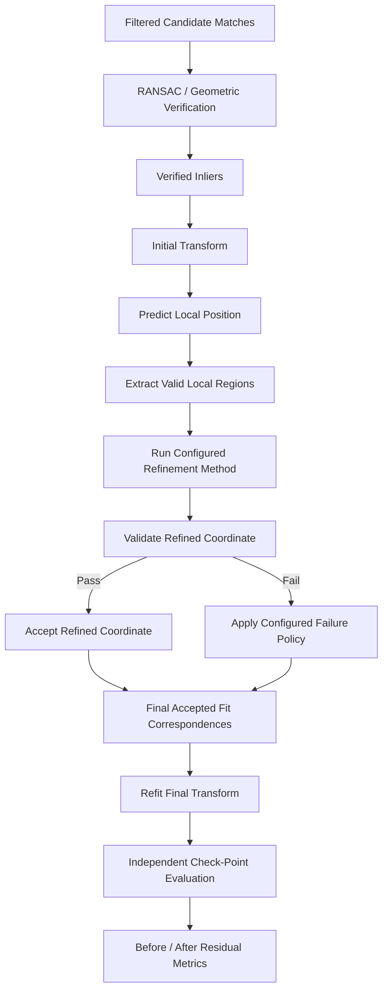
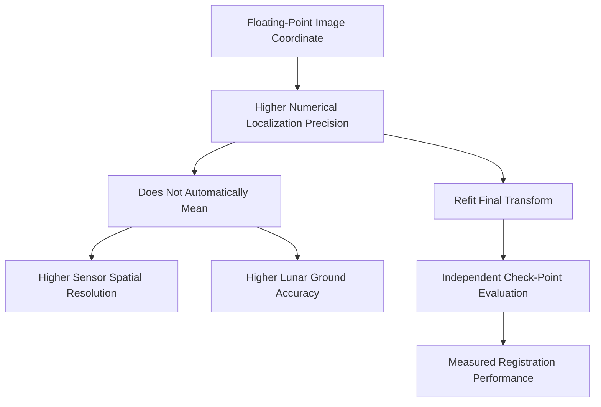

# Sub-Pixel Refinement

Sub-pixel refinement is ChandraMap's local correspondence-precision stage for improving the image-coordinate locations of **already geometrically verified correspondences**.

The stage begins only after:

- source/reference representations have been prepared;
- physical scale has been considered;
- candidate correspondences have been generated;
- matcher-level filtering has been applied;
- RANSAC or equivalent geometric verification has identified a valid inlier set.

Its purpose is not to discover new geographic correspondences. Its purpose is to improve the local coordinate estimates of correspondences that already have geometric support.

> **Sub-pixel refinement estimates correspondence locations between pixel centers; it does not increase the physical resolution of the source sensor.**

For example, a refined coordinate such as:

```text
x = 123.42
y = 81.67
```

means that the estimated image location lies between discrete pixel centers.

It does **not** mean that:

- the sensor captured new lunar detail;
- the source GSD became smaller;
- a coarse source became equivalent to a fine reference;
- physical ground accuracy is automatically fractional-pixel.

The most important ChandraMap ordering rule is:

> **Verify first, refine second.**

The intended sequence is:

```text
Candidate Matches
    ↓
Match Filtering
    ↓
RANSAC / Geometric Verification
    ↓
Verified Inliers
    ↓
Sub-Pixel Refinement
    ↓
Final Transform Refit
    ↓
Independent Evaluation
```

A second rule follows directly:

> **A more precise coordinate estimate of the wrong correspondence is still wrong.**

Refinement should therefore operate only on correspondences that have already passed geometric verification and whose local image regions contain enough valid information to support finer localization.

A third principle concerns evaluation:

> **Sub-pixel fit improvement is not proof of sub-pixel registration accuracy.**

The meaningful test is whether refinement improves the final transformation on **independent held-out check points**, not merely whether the same refined fit points have smaller residuals after refitting.

Finally:

> **Refinement is limited by the information content of the sensor.**

OHRC, TMC-2, and IIRS observe the Moon at dramatically different spatial scales and modalities. Floating-point coordinates do not remove those physical limits.

ChandraMap therefore treats sub-pixel refinement as:

- optional;
- sensor-aware;
- scale-aware;
- locally validated;
- benchmark-driven.

---

## 1. Why Sub-Pixel Refinement Exists

Local matchers may produce coordinates that are:

- integer-like;
- floating-point but approximate;
- tied to a detector's own localization process;
- quantized by pyramid level;
- optimized primarily for correspondence discovery rather than final registration.

For a correspondence that has already been geometrically verified, local refinement may improve the estimate of where the corresponding image structure lies.

Potential benefits include:

- more precise local coordinate estimates;
- improved transformation stability;
- reduced fit residual;
- reduced independent check-point error;
- better coarse-to-fine registration.

These are potential benefits rather than guarantees.

A refinement method should remain enabled only when benchmark evidence shows that it is useful for the relevant:

- sensor pair;
- representation;
- physical scale;
- terrain category;
- illumination condition.

---

## 2. What Sub-Pixel Refinement Does Not Do

Sub-pixel refinement does **not**:

- create new spatial resolution;
- recover terrain detail absent from the source sensor;
- convert IIRS imagery into NAC-resolution imagery;
- convert TMC-2 into OHRC-like imagery;
- prove that a correspondence is geographically correct;
- replace match filtering;
- replace RANSAC;
- replace transformation estimation;
- replace independent check-point evaluation;
- repair an incorrect retrieved lunar region;
- repair a fundamentally wrong source/reference scale;
- automatically correct map-projection errors;
- eliminate terrain-relief effects;
- guarantee sub-pixel ground accuracy;
- guarantee improved benchmark performance.

Its role is narrower:

> **Improve the image-coordinate precision of already verified correspondences when local image evidence supports doing so.**

---

## 3. Responsibilities

| Responsibility                             |        Sub-Pixel Refinement? |
| ------------------------------------------ | ---------------------------: |
| Receive verified inliers                   |                          Yes |
| Preserve initial coordinates               |                          Yes |
| Refine source and/or reference coordinates |                          Yes |
| Compute refinement offsets                 |                          Yes |
| Validate refined coordinates               |                          Yes |
| Record refinement status                   |                          Yes |
| Reject or flag unstable local refinement   |                          Yes |
| Detect original features                   |                           No |
| Generate raw candidate matches             |                           No |
| Decide RANSAC inliers                      |                           No |
| Retrieve reference tiles                   |                           No |
| Repair wrong scale selection               |                           No |
| Create independent ground truth            |                           No |
| Prove final registration accuracy          |                           No |
| Refit final transform                      | Downstream / closely coupled |
| Evaluate held-out check points             |                   Downstream |

---

# Core Terminology

## 4. Integer-Pixel Coordinate

An **integer-pixel coordinate** is associated with the discrete image sampling grid.

For example:

```text
(123, 82)
```

identifies a location on that grid under the repository's defined pixel-coordinate convention.

Integer coordinates do not imply that all image features physically occur exactly at pixel centers.

---

## 5. Sub-Pixel Coordinate

A **sub-pixel coordinate** is a floating-point image coordinate representing a location between discrete pixel centers.

For example:

```text
(123.42, 81.67)
```

represents a more precise numerical image-coordinate estimate.

It does not imply:

- increased sensor resolution;
- new physical terrain information;
- guaranteed ground accuracy.

---

## 6. Initial Correspondence

An **initial correspondence** is the source/reference coordinate pair produced before explicit ChandraMap local refinement.

It may come from:

- SIFT;
- ALIKED + LightGlue;
- LoFTR;
- another matcher.

The initial coordinate may already be floating-point.

The term **initial** refers to pipeline stage, not necessarily integer precision.

---

## 7. Verified Inlier

A **verified inlier** is a candidate correspondence accepted by geometric verification as consistent with the selected transformation model under the configured verification policy.

A verified inlier is the normal input to explicit sub-pixel refinement.

It is not automatically ground truth.

---

## 8. Refined Correspondence

A **refined correspondence** is a verified inlier whose source and/or reference location has been locally adjusted by a refinement procedure.

Conceptually:

```text
Initial verified correspondence
        ↓
Local refinement
        ↓
Refined correspondence
```

---

## 9. Refinement Window

A **refinement window** is the local region around an initial/predicted correspondence within which a refinement method is allowed to search or optimize.

The window should remain:

- local;
- scale-aware;
- configurable.

No universal ChandraMap window size is defined here.

---

## 10. Local Patch

A **local patch** is a small image neighborhood around a correspondence.

Patch-based refinement may compare:

- source patch;
- reference patch;

or alternative structural representations derived from those neighborhoods.

---

## 11. Similarity or Correlation Score

A **similarity** or **correlation score** is a local comparison value used by some refinement methods.

It may indicate how well two local neighborhoods agree under that method.

It is not automatically:

- geometric proof;
- probability of correctness;
- ground truth.

---

## 12. Refinement Offset

The **refinement offset** is the displacement between the initial and refined coordinate.

For a point:

$$
p_{\text{initial}}
$$

and refined point:

$$
p_{\text{refined}}
$$

the refinement offset is:

$$
\Delta p
=
p_{\text{refined}}
-
p_{\text{initial}}
$$

In two dimensions:

$$
\Delta x = x_{\text{refined}} - x_{\text{initial}}
$$

$$
\Delta y = y_{\text{refined}} - y_{\text{initial}}
$$

and the offset magnitude is:

$$
\lVert \Delta p \rVert
=
\sqrt{
(\Delta x)^2 + (\Delta y)^2
}
$$

Large offsets may indicate instability, but no universal acceptable threshold is defined here.

---

## 13. Initial Transform

The **initial transform** is the geometric model available before explicit sub-pixel refinement.

It commonly comes from robust geometric estimation using verified inliers.

It may be used to:

- predict a local correspondence location;
- constrain the refinement search.

---

## 14. Final Transform

The **final transform** is the transformation refit from the final accepted fit correspondences after refinement has been applied.

If refinement changes fit coordinates, the old transformation should not automatically remain the final scientific model.

---

## 15. Refinement Failure

A **refinement failure** occurs when a correspondence cannot be refined reliably.

Possible reasons include:

- insufficient texture;
- ambiguous local optimum;
- invalid patch;
- image boundary;
- NoData;
- unstable optimization;
- modality mismatch;
- excessive offset;
- numerical failure.

---

## 16. Refinement Status

A point-level refinement record may conceptually distinguish states such as:

- refined;
- unchanged;
- failed;
- rejected.

Exact implementation enums belong to repository contracts rather than this conceptual document.

---

# Stage Boundary

## 17. Where Refinement Starts and Ends

The conceptual stage boundary is:

```text
Prepared Source / Reference
        ↓
Matching
        ↓
Candidate Correspondences
        ↓
Match Filtering
        ↓
RANSAC / Geometric Verification
        ↓
Verified Inliers
        ↓
Initial Transform
        │
        ├── START SUB-PIXEL REFINEMENT
        ↓
Local Coordinate Refinement
        ↓
Refined-Point Validation
        ↓
Accepted Refined Inliers
        │
        └── END SUB-PIXEL REFINEMENT
                ↓
Final Transform Refit
                ↓
Independent Check-Point Evaluation
```

The refinement stage assumes that:

- the scientific pair is already known;
- the selected reference region is plausible;
- coordinate systems are known;
- verified inliers exist.

---

# Verify First, Refine Second

## 18. Incorrect Default Order

The following should **not** be ChandraMap's normal scientific pipeline:

```text
Raw Candidate Matches
        ↓
Refine Every Candidate
        ↓
RANSAC
```

This approach has several problems.

It can:

- waste computation on obvious outliers;
- locally optimize incorrect matches;
- move false matches toward nearby repeated structures;
- make wrong correspondences appear numerically precise;
- increase ambiguity in crater-rich terrain.

---

## 19. Correct Order

The preferred sequence is:

1. matcher proposes candidate correspondences;
2. matcher-level filtering removes obvious invalid or ambiguous candidates;
3. RANSAC estimates an initial geometric model;
4. RANSAC identifies verified inliers;
5. only those verified inliers enter refinement;
6. refined coordinates are validated;
7. accepted refined correspondences are used to refit the final transformation;
8. the final transformation is evaluated on independent check points.

In compact form:

```text
Candidates
→ Filtering
→ RANSAC
→ Verified Inliers
→ Refinement
→ Validation
→ Transform Refit
→ Independent Evaluation
```

> **A more precise coordinate estimate of the wrong correspondence is still wrong.**

---

# Refinement Input Assumptions

## 20. Required Upstream State

Before refinement begins, ChandraMap should know where applicable:

- source asset identity;
- reference asset identity;
- source representation;
- reference representation;
- source coordinate space;
- reference coordinate space;
- reference pyramid level;
- crop/tile offsets;
- valid masks;
- verified inlier set;
- initial transform;
- transform direction.

---

## 21. What Refinement Should Not Repair

Sub-pixel refinement should not be responsible for repairing:

- wrong sensor routing;
- wrong IIRS representation;
- wrong retrieval candidate;
- severe physical scale mismatch;
- broken crop offsets;
- incorrect projection metadata;
- unverified matcher outliers;
- unknown coordinate domains.

Those problems belong to upstream stages.

---

# Initial and Refined Coordinates

## 22. Initial Coordinates

A verified correspondence may begin as:

$$
p_s = (x_s, y_s)
$$

in source coordinates and:

$$
p_r = (x_r, y_r)
$$

in reference coordinates.

Both may already be floating-point.

---

## 23. Refined Coordinates

After refinement, the coordinates may become:

$$
p'_s =
(x_s + \Delta x_s,\ y_s + \Delta y_s)
$$

and:

$$
p'_r =
(x_r + \Delta x_r,\ y_r + \Delta y_r)
$$

depending on whether:

- source only;
- reference only;
- both sides;

are refined.

---

## 24. Preserve Original Coordinates

The original verified coordinate should be retained where practical.

This enables:

- before/after comparison;
- rollback;
- debugging;
- failure diagnosis;
- reproducibility.

Do not overwrite the initial coordinate without preserving its provenance.

---

# Which Side Should Be Refined?

## 25. Reference-Only Refinement

One possible strategy is:

```text
source coordinate fixed
        ↓
refine reference coordinate locally
```

Potential advantages include:

- simple source-coordinate interpretation;
- easy use of an initial source-to-reference prediction.

Possible limitation:

- the source localization may also contain uncertainty.

This is a configurable strategy rather than a universal requirement.

---

## 26. Source-Only Refinement

Another strategy is:

```text
reference coordinate fixed
        ↓
refine source coordinate
```

This may be useful in some workflows.

It should not be documented as universally superior.

---

## 27. Both-Side Refinement

A symmetric strategy may refine both:

- source coordinate;
- reference coordinate.

Potential benefits include reduced asymmetry.

Potential complications include:

- more parameters;
- more complex provenance;
- more difficult interpretation of before/after error.

Treat this as a candidate or advanced strategy unless implementation explicitly defines it.

---

# Refinement Method Families

## 28. Conceptual Method Categories

Possible sub-pixel refinement families include:

- local correlation / patch matching;
- normalized local similarity;
- transform-guided local optimization;
- gradient/corner-based localization;
- phase/frequency-based local alignment;
- learned local refinement;
- matcher-native fine coordinate estimates.

This document does not claim that all of these are implemented.

No method is ranked in advance.

---

# Local Patch Refinement

## 29. Patch-Based Concept

A patch-based method may conceptually:

1. start from a verified source/reference correspondence;
2. extract a local source patch;
3. predict or identify a nearby reference region;
4. compare nearby local displacements;
5. estimate the best supported local alignment;
6. convert that local displacement into a refined coordinate.

Conceptually:

```text
Verified Source Point
        ↓
Source Patch

Initial / Predicted Reference Point
        ↓
Nearby Reference Search Region

Source Patch + Reference Search Region
        ↓
Local Similarity Optimization
        ↓
Refined Correspondence
```

---

## 30. Transform-Guided Search

The initial transform can provide a local prediction.

For a source point:

$$
p_s
$$

the initial model predicts:

$$
\hat{p}_r = T_{\text{initial}}(p_s)
$$

A local refinement method can then search near:

$$
\hat{p}_r
$$

rather than across the entire reference image.

---

## 31. Why Transform Guidance Helps

A local geometric prior may:

- reduce search area;
- reduce repeated-crater ambiguity;
- reduce runtime;
- improve optimization stability.

However:

> **If the initial transformation is wrong, its local prediction may also be wrong.**

Refinement still requires local image evidence.

---

## 32. Do Not Force the Refined Point to the Prediction

A transform-guided refinement should not merely return:

```text
predicted transform coordinate
```

without using local evidence.

Otherwise it is not truly refining the correspondence.

The transform provides a prior or search center, not independent local proof.

---

# Refinement Window

## 33. Window Purpose

The search window defines how far a refinement procedure may move from the initial/predicted location.

It should be:

- large enough to accommodate realistic initialization error;
- small enough to remain a local problem.

---

## 34. No Universal Window Size

Appropriate window size may depend on:

- sensor;
- source/reference GSD;
- pyramid level;
- matcher precision;
- initial residual;
- local terrain;
- representation.

Do not prescribe one universal number.

---

## 35. Scale-Aware Interpretation

A search window measured in:

```text
NAC base-level pixels
```

represents a different physical distance from the same numeric window measured in:

```text
coarse NAC pyramid pixels
```

Window configuration must therefore retain its coordinate-space context.

---

# Patch Size

## 36. Patch-Size Trade-Off

A small patch may:

- be computationally cheap;
- capture highly local structure;
- lack enough distinctive terrain.

A larger patch may:

- contain more terrain context;
- become sensitive to local deformation;
- contain more shadows;
- cross invalid boundaries.

Patch size should therefore be configurable and benchmarked.

---

## 37. No Universal Patch Size

Patch size can depend on:

- scale;
- sensor pair;
- terrain;
- modality;
- refinement method.

This file defines no default numeric patch dimensions.

---

# Correlation-Based Refinement

## 38. Local Correlation Concept

A correlation-based method can evaluate local similarity over small candidate displacements.

Conceptually:

```text
candidate local displacement
        ↓
local similarity score
        ↓
response surface
        ↓
best supported local displacement
```

The selected location may then be refined to fractional-pixel precision.

---

## 39. Normalized Similarity

Normalized correlation-style measures can reduce sensitivity to some differences in:

- brightness offset;
- contrast scale.

They do **not** solve:

- moving shadows;
- hidden terrain;
- spectral differences;
- missing spatial detail.

---

## 40. Correlation Surface

The local search produces a response over candidate displacements.

Conceptually:

```text
sharp isolated peak
→ potentially stable local optimum

broad flat response
→ weak localization

several similar peaks
→ ambiguity
```

This interpretation should remain diagnostic rather than absolute.

---

## 41. Peak Interpolation

Some refinement methods may estimate a fractional-pixel peak by fitting or interpolating the local response near its discrete maximum.

Possible conceptual approaches include:

- local polynomial fitting;
- local analytic interpolation;
- method-specific peak fitting.

No exact interpolation model is prescribed here.

---

## 42. Correlation Peak Is Not Ground Truth

A strong local response can still correspond to:

- the wrong small crater;
- the wrong ridge edge;
- a moving shadow boundary.

Geometric verification has already reduced this risk, but local ambiguity can remain.

---

# Gradient and Corner Refinement

## 43. Gradient-Based Localization

Some methods refine local coordinates from image gradients.

Such methods may be useful when the local feature contains:

- stable corner-like structure;
- reliable gradients;
- well-localized intensity transitions.

---

## 44. Lunar Caution

Many lunar features are not ideal generic corner-refinement targets.

Examples include:

- broad crater rims;
- elongated ridge structures;
- shadow boundaries;
- weak-gradient plains.

Therefore generic gradient/corner refinement should not be assumed valid for every lunar correspondence.

---

## 45. OpenCV-Style Sub-Pixel Corner Methods

Sub-pixel corner-localization operations available in computer-vision libraries may be useful candidates when:

- the original correspondence is corner-like;
- the local representation satisfies the method's assumptions;
- the resulting coordinates are validated.

They should not be treated as an automatic ChandraMap solution for every matcher or sensor.

---

# Phase and Frequency-Based Refinement

## 46. Phase-Based Alignment

Local phase/frequency approaches may estimate small relative displacements between patches.

Potential motivations include:

- local translation estimation;
- precise alignment under compatible image structure.

These should be considered optional/research methods unless explicitly implemented.

---

## 47. Cross-Modality Caution

Phase/frequency behavior can still be affected by:

- cross-modality appearance;
- shadows;
- scale;
- local deformation.

No universal cross-sensor suitability should be assumed.

---

# Learned Refinement

## 48. Future Learned Refinement

Future ChandraMap research may explore learned local refinement models.

Possible motivations include:

- richer local context;
- non-linear appearance changes;
- improved matching under difficult terrain.

However:

- lunar domain shift;
- model training provenance;
- uncertainty;
- cross-modality behavior;

must be evaluated carefully.

Do not describe learned refinement as implemented unless authoritative repository documentation confirms it.

---

# Matcher-Native Floating Coordinates

## 49. Matchers May Already Return Fractional Coordinates

Some feature detectors and learned matchers may already return floating-point coordinates.

Examples can include:

- SIFT keypoints;
- learned sparse features;
- detector-free correspondence methods.

Therefore:

> **Sub-pixel refinement is not synonymous with converting integer coordinates into floats.**

---

## 50. Floating Matcher Output Is Not Accuracy Proof

A coordinate such as:

```text
(123.418, 81.672)
```

may contain more decimal digits than:

```text
(123, 82)
```

but the number of digits does not establish physical accuracy.

Accuracy depends on:

- sensor information;
- matcher behavior;
- geometry;
- truth;
- projection;
- terrain.

---

## 51. Explicit Refinement May Still Be Compared

For floating-coordinate matchers, ChandraMap may compare:

```text
matcher-native coordinate
```

with:

```text
explicitly refined coordinate
```

using the same independent evaluation protocol.

Do not assume the explicit second stage always helps.

---

# SIFT and Refinement

## 52. SIFT Localization

SIFT keypoints may already include floating-point image locations.

An additional refinement method may still be investigated for:

- verified inliers;
- final registration precision.

However:

```text
SIFT floating keypoint
```

does not imply:

```text
independently verified sub-pixel registration accuracy
```

See [`sift.md`](sift.md).

---

# ALIKED + LightGlue and Refinement

## 53. Learned Sparse Coordinates

ALIKED + LightGlue may provide fine local feature/correspondence estimates depending on the actual implementation and model configuration.

Any explicit additional refinement stage should be evaluated rather than assumed useful.

---

# LoFTR and Refinement

## 54. Detector-Free Coordinates

LoFTR can produce direct source/reference correspondence coordinates with model-dependent precision.

Again:

> **floating coordinates are not equivalent to verified physical accuracy.**

An additional refinement step should be benchmark-driven.

---

# Remote-Sensing Matcher Refinement

## 55. RIFT / CFOG-Style Methods

Remote-sensing-oriented methods may use localization mechanisms different from SIFT or learned feature matchers.

Do not assume one local refinement method applies uniformly to:

- SIFT;
- ALIKED + LightGlue;
- LoFTR;
- RIFT;
- CFOG-style methods.

---

# Scale-Pyramid Interaction

## 56. Coordinates Belong to a Level

If refinement occurs on:

```text
NAC pyramid level L
```

the refined coordinate belongs to:

> **that exact level's pixel grid.**

It must not silently be interpreted as a base-level NAC coordinate.

See [`scale-pyramid.md`](scale-pyramid.md).

---

## 57. Offsets Are Level-Specific

A refinement offset:

```text
Δx = fraction of a pixel
```

has meaning only relative to the pixel grid on which it was measured.

The same numeric offset at two pyramid levels may correspond to different physical displacements.

---

## 58. Coarse-to-Fine Refinement

A conceptual coarse-to-fine path is:

```text
Coarse Verified Inliers
        ↓
Coarse Transform
        ↓
Predict Finer Search Region
        ↓
Generate / Refine Finer Correspondences
        ↓
Geometric Validation
        ↓
Refit Finer Transform
```

This can be useful when both source and reference contain enough compatible fine-scale information.

---

## 59. Do Not Refine Indefinitely

A finer reference does not imply that the source contains matching fine detail.

For example:

- TMC-2 may not support the finest NAC structures;
- IIRS is much more strongly limited.

A valid final registration may stop at a coarser reference level.

---

## 60. Source Information Limit

A strong project rule is:

> **Refinement should not continue beyond the scale supported by both source and reference information.**

Upsampling or finer-grid localization cannot create missing source measurements.

---

# Crop and Tile Coordinates

## 61. Local Refinement Coordinates

Refinement may occur inside:

- source crop;
- reference tile;
- reference pyramid tile.

This is valid as long as coordinate lineage is preserved.

---

## 62. Preserve Offsets

If a crop begins at a parent-image offset:

```text
(x_offset, y_offset)
```

then refined local coordinates must remain convertible to parent coordinates.

For a simple untranslated crop:

$$
x_{\text{parent}}
=
x_{\text{local}}
+
x_{\text{offset}}
$$

$$
y_{\text{parent}}
=
y_{\text{local}}
+
y_{\text{offset}}
$$

Additional transforms may be needed after:

- resizing;
- reprojection;
- rotation;
- pyramid generation.

---

## 63. Do Not Lose Tile Identity

A locally accurate refined point can become geographically wrong if its:

- tile identity;
- parent product;
- level;
- offset;

is lost.

Coordinate provenance is part of refinement correctness.

---

# Masks and Valid Data

## 64. Valid-Pixel Requirement

Local refinement should not blindly optimize through:

- NoData;
- invalid projection borders;
- padded pixels;
- missing raster regions;
- masked areas.

---

## 65. Mask Alignment

The mask must correspond to the same coordinate grid as the refinement patch.

Incorrect:

```text
refinement on level L
+
mask from level 0
```

Correct:

```text
refinement on level L
+
mask aligned to level L
```

---

## 66. Patch Validity

If a local patch contains too much invalid data, possible configured behaviors include:

- leave the point unchanged;
- mark refinement failure;
- reject the refined point.

No universal validity percentage is defined here.

---

## 67. Boundary Points

A point near an image or crop boundary may not provide enough local support for the configured patch/search window.

Such cases should be handled explicitly rather than allowing out-of-bounds access or silently clipping the window without provenance.

---

# Illumination Effects

## 68. Why Illumination Matters Locally

Lunar illumination changes can strongly alter the local patch around the same physical terrain feature.

Changes may include:

- different shadow direction;
- different shadow length;
- bright/dark crater-rim reversal;
- features appearing or disappearing.

This can make raw intensity refinement unstable.

---

## 69. Normalization Is Limited

Brightness or contrast normalization can help with some radiometric differences.

It cannot:

- move a physically displaced shadow;
- expose terrain hidden in darkness;
- make two different modalities identical.

See [`illumination-handling.md`](illumination-handling.md).

---

## 70. Structural Refinement

Optional experiments may refine using:

- gradients;
- edges;
- structural representations;

instead of raw intensity.

These strategies should be benchmarked and should not be assumed universally superior.

---

## 71. Shadow-Boundary Risk

A local optimizer may be attracted to a nearby strong shadow edge.

That edge may move substantially between observations even when the underlying crater or ridge is unchanged.

Therefore:

> **The strongest nearby local edge is not automatically the correct physical correspondence.**

---

# Cross-Modality Refinement

## 72. Sensor Pair Matters

Patch similarity may behave very differently for:

```text
OHRC ↔ NAC
```

than for:

```text
IIRS-derived representation ↔ NAC
```

because the latter includes strong:

- spectral;
- modality;
- scale;

differences.

---

## 73. Raw Intensity May Be Inappropriate

A raw intensity correlation method should not automatically be applied to every cross-modality pair.

Potential alternatives may include:

- structural representations;
- gradients;
- multimodal descriptors;
- future learned similarity.

These require controlled evaluation.

---

# IIRS Refinement

## 74. IIRS Requires Special Caution

IIRS is the Chandrayaan-2 **Imaging Infrared Spectrometer**.

Project-level approximations include:

- approximately ~80 m/pixel;
- approximately ~0.8–5.0 µm;
- roughly ~250–256 bands depending on product/documentation.

Actual product metadata remains authoritative.

IIRS must first be represented as a documented 2D registration image before ordinary 2D local refinement is attempted.

---

## 75. IIRS Information Content

A fractional IIRS coordinate such as:

```text
x = 100.35
y = 50.62
```

means that the estimated image location is between discrete source-grid pixel centers.

It does **not** mean that IIRS has measured lunar terrain at NAC-like resolution.

---

## 76. Fine NAC Does Not Create Fine IIRS Detail

If IIRS is matched to a strongly downsampled NAC representation, that may provide physically sensible common structure.

Moving refinement all the way to fine native NAC detail may become unsupported by the IIRS source.

---

## 77. IIRS Local Similarity

Local raw-intensity similarity may be unreliable because:

- spectral response differs;
- spatial scale is coarse;
- fine visible structures may be absent;
- illumination response differs.

IIRS refinement therefore requires especially conservative benchmarking.

---

# OHRC Refinement

## 78. OHRC Context

OHRC is the Chandrayaan-2 **Orbiter High Resolution Camera**.

Current project documentation commonly uses approximately:

> **~0.25–0.32 m/pixel**

depending on product/documentation.

Actual product metadata remains authoritative.

---

## 79. Potential OHRC Benefits

OHRC may provide:

- fine terrain structure;
- sharp crater rims;
- detailed ridges;
- sufficient local texture.

These can support useful local coordinate refinement under suitable conditions.

---

## 80. OHRC Risks

Fine imagery can also contain:

- repeated small craters;
- narrow moving shadows;
- many competing edges.

Therefore high spatial resolution does not guarantee stable local refinement.

---

# TMC-2 Refinement

## 81. TMC-2 Context

TMC-2 is the Chandrayaan-2 **Terrain Mapping Camera-2**.

Current project planning commonly uses approximately:

> **~5 m/pixel**

with actual metadata remaining authoritative.

---

## 82. TMC-2 Interpretation

A fraction of one TMC-2 pixel represents a very different physical scale from the same fraction of one OHRC pixel.

Do not compare fractional-pixel refinement between sensors as though the physical precision were equivalent.

---

## 83. TMC-2 Risks

A fine NAC reference may contain local structures absent from TMC-2.

Local refinement should not chase tiny reference features that the TMC-2 source never measured.

---

# LRO NAC Refinement

## 84. NAC Context

LRO NAC provides fine lunar reference imagery.

Current ChandraMap planning often treats its GSD as approximately:

> **~0.5–2 m/pixel**

depending on product/acquisition geometry.

Actual product metadata remains authoritative.

---

## 85. NAC Level Matters

Refinement may occur on:

- NAC base representation;
- downsampled NAC pyramid level.

The resulting coordinates and offsets belong to whichever level was actually used.

---

# LRO WAC Refinement

## 86. WAC Context

LRO WAC provides broad/coarse lunar imagery.

Its effective spatial scale is product/mode/processing dependent.

A fractional WAC coordinate should therefore be interpreted relative to:

- actual WAC product;
- current processing grid.

---

# Refinement Validation

## 87. Every Refined Point Requires Validation

A local optimizer returning a coordinate is not sufficient evidence by itself.

Potential validation checks include:

- finite refined coordinate;
- source/reference bounds;
- valid-data mask;
- available local patch;
- reasonable offset;
- local similarity behavior;
- peak ambiguity;
- consistency with expected local geometry.

Exact thresholds remain configurable and benchmark-driven.

---

## 88. Coordinate Validity

Refined coordinates should be checked for:

- NaN;
- infinity;
- out-of-bounds position;
- invalid coordinate conversion.

Invalid coordinates should not enter final transformation refitting.

---

## 89. Offset Validation

A large refinement offset may indicate:

- incorrect local optimum;
- repeated terrain;
- poor initial prediction;
- weak matcher localization;
- coordinate bug.

Large movement should therefore be treated cautiously.

No universal maximum displacement is defined here.

---

## 90. Similarity Improvement

For a similarity-based method, the pipeline may compare:

```text
initial local similarity
```

with:

```text
refined local similarity
```

An improved local score is useful diagnostic evidence.

It is not independent proof of correctness.

---

## 91. Peak Ambiguity

A local response surface may contain several comparable peaks.

Possible configured responses include:

- keep the original coordinate;
- mark refinement failure;
- reject the point;
- attach an uncertainty/ambiguity flag.

No one policy is mandated here.

---

## 92. Boundary Validation

If the refined location crosses:

- image boundary;
- crop boundary;
- invalid mask;

the point should not silently remain accepted.

---

# Refinement Status and Provenance

## 93. Per-Point Status

A refined correspondence may conceptually preserve:

- refinement attempted;
- refinement succeeded;
- refinement failed;
- unchanged;
- rejected.

Exact repository status values should be defined by implementation contracts.

---

## 94. Preserve Original and Final Coordinates

A useful point record keeps:

- original source coordinate;
- original reference coordinate;
- refined source coordinate where applicable;
- refined reference coordinate where applicable.

This allows direct before/after analysis.

---

## 95. Preserve Offsets

Where useful, record:

- source \(\Delta x\);
- source \(\Delta y\);
- reference \(\Delta x\);
- reference \(\Delta y\);
- offset magnitude.

---

# Final Transform Refit

## 96. Why Refit Is Required

This is a central ChandraMap rule.

The initial transformation was fitted using the original verified coordinates.

If refinement changes those coordinates, the old transform is now associated with outdated measurements.

Therefore:

> **Refined coordinates require a final transform refit.**

Correct:

```text
Verified Inliers
    ↓
Refinement
    ↓
Accepted Refined Correspondences
    ↓
Refit Transform
    ↓
Final Transform
```

Incorrect:

```text
Verified Inliers
    ↓
Refinement
    ↓
Keep Old Transform Unchanged
```

when the correspondence coordinates materially changed.

---

## 97. Keep Coordinate Pairs Consistent

Do not accidentally pair:

```text
pre-refinement source coordinate
```

with:

```text
post-refinement reference coordinate
```

unless that exact asymmetric strategy is intentional and recorded.

Coordinate-version pairing must remain explicit.

---

## 98. Preserve Model Type

A refinement ablation should normally retain the same transform family where the experiment is intended to isolate the effect of refinement.

For example:

```text
before:
affine

after:
affine
```

rather than changing both:

- refinement;
- transform model;

at the same time.

---

## 99. Robust Final Fit

A robust final fitting step may be considered if refinement reveals unstable points.

This is a configurable or future option unless current implementation defines it.

Do not silently change the fitting procedure.

---

# Before and After Analysis

## 100. Fit Residual Before Refinement

The initial fit residual measures how well the pre-refinement model explains its verified fit correspondences.

This is useful baseline information.

---

## 101. Fit Residual After Refinement

After:

- coordinate refinement;
- final transformation refit;

fit residuals should be recomputed.

This measures the final model's fit to the accepted refined points.

---

## 102. Fit Improvement Is Not Enough

A reduced fit RMSE may simply mean that:

- the points were optimized locally;
- the model was refit to those same points.

It does not establish independent improvement.

---

## 103. Check Error Before Refinement

The initial transform can be evaluated against the same held-out independent check points.

This gives a pre-refinement generalization baseline.

---

## 104. Check Error After Refinement

The final refined/refit model should then be evaluated using exactly the same independent check points.

This is the stronger comparison.

See [`residual-analysis.md`](residual-analysis.md).

---

## 105. Refinement May Not Help

A scientifically valid result may show:

- no meaningful change;
- worse check-point error;
- lower fit error but worse independent error.

Do not force refinement into the default pipeline merely because it sounds more precise.

Benchmark evidence should decide.

---

# Refinement Metrics

## 106. Attempt Count

Record how many verified inliers were submitted to the refinement process.

Conceptually:

$$
N_{\text{attempted}}
$$

---

## 107. Success Count

Record how many points completed the configured refinement successfully.

Conceptually:

$$
N_{\text{success}}
$$

---

## 108. Success Rate

Where useful:

$$
\text{refinement success rate}
=
\frac{N_{\text{success}}}
{N_{\text{attempted}}}
$$

when \(N\_{\text{attempted}} > 0\).

This is an operational diagnostic.

It is not an accuracy metric.

---

## 109. Offset Statistics

Possible diagnostics include:

- mean offset magnitude;
- median offset magnitude;
- maximum offset;
- mean source \(\Delta x\);
- mean source \(\Delta y\);
- mean reference \(\Delta x\);
- mean reference \(\Delta y\).

No universal acceptance threshold is defined here.

---

## 110. Fit RMSE Before / After

Record where relevant:

- pre-refinement fit RMSE;
- post-refinement fit RMSE.

Keep them clearly labeled as fitting diagnostics.

---

## 111. Check RMSE Before / After

The strongest refinement evidence is generally:

- pre-refinement independent check RMSE;
- post-refinement independent check RMSE;

computed on the same held-out check points under the same metric definition.

---

## 112. Coverage

Track whether accepted refined points remain spatially distributed.

Refinement should not improve local scores while reducing support to one small high-contrast image region.

---

## 113. Runtime

Local patch optimization can add significant runtime.

Where relevant, record:

- refinement runtime;
- total pipeline runtime.

---

# Source-Pixel Accuracy

## 114. Coordinate Precision vs Registration Accuracy

A refined source coordinate may be represented with fractional pixels.

That is **numerical localization precision**.

Final registration accuracy depends on additional factors including:

- independent truth;
- source resolution;
- reference accuracy;
- transformation model;
- terrain;
- projection;
- viewing geometry.

---

## 115. Source-Space Reporting

Where valid, final registration error should be reported first in the source image's pixel coordinates.

See [`residual-analysis.md`](residual-analysis.md).

---

## 116. Fractional Pixel Does Not Mean Fractional-GSD Ground Accuracy

For example:

```text
0.x source pixels
```

does not automatically translate into:

```text
0.x × generic source GSD metres
```

with guaranteed physical correctness.

Physical conversion requires valid geospatial context.

---

# Refinement Failure Modes

## 117. Failure Table

| Symptom                                                     | Possible Cause                                     | Diagnostic / Response                                |
| ----------------------------------------------------------- | -------------------------------------------------- | ---------------------------------------------------- |
| Large refinement offset                                     | Wrong local optimum or poor initial correspondence | Flag/reject according to policy                      |
| No clear similarity peak                                    | Low texture or modality mismatch                   | Retain original or mark failure                      |
| Point moves toward a shadow edge                            | Illumination-driven ambiguity                      | Inspect local representation                         |
| Refined point exits valid image                             | Boundary/search issue                              | Reject refined result                                |
| Patch contains substantial NoData                           | Invalid local support                              | Skip or mark failure                                 |
| Fit RMSE improves but check RMSE worsens                    | Overfitting                                        | Prefer independent evaluation                        |
| Fine NAC refinement unstable for IIRS                       | Source lacks fine information                      | Stop at coarser scale                                |
| Many failures near image borders                            | Window or crop handling issue                      | Review geometry/configuration                        |
| Offsets share a systematic direction                        | Initial transform bias or coordinate issue         | Inspect transform/residual field                     |
| Different runs return different coordinates                 | Ambiguous or stochastic optimizer                  | Record configuration/seed and diagnose               |
| Refinement succeeds numerically but final model is unstable | Poor spatial distribution or bad points            | Validate final geometry                              |
| Most points remain unchanged                                | Initial localization may already be sufficient     | Compare independent metrics before adding complexity |

---

# Quality Control

## 118. Refinement QC Checklist

Before accepting a refinement run, verify:

- [ ] Only verified inliers entered the normal refinement stage.
- [ ] Original coordinates were preserved.
- [ ] Source coordinate space is known.
- [ ] Reference coordinate space is known.
- [ ] Transform direction is known.
- [ ] Pyramid level is recorded.
- [ ] Crop/tile offsets are preserved.
- [ ] Masks correspond to the refinement grid.
- [ ] Local patches contain valid data.
- [ ] Boundary conditions are handled explicitly.
- [ ] Refined coordinates are finite.
- [ ] Refined coordinates are within valid bounds.
- [ ] Refinement offsets are recorded where useful.
- [ ] Ambiguous local optima are handled explicitly.
- [ ] Per-point refinement status is preserved.
- [ ] Accepted refined correspondences are identifiable.
- [ ] Final transformation was refit.
- [ ] Independent check points remained held out.
- [ ] Before/after independent evaluation was performed where truth exists.
- [ ] Refinement method/configuration/version is recorded.
- [ ] Failures were not hidden.

---

# Visual Diagnostics

## 119. Initial vs Refined Point Plot

A useful visualization may show:

- initial coordinate;
- refined coordinate;
- connecting offset vector.

This helps reveal:

- large movements;
- systematic bias;
- unstable regions.

---

## 120. Offset Vector Plot

Plotting refinement offsets across the overlap may reveal:

- consistent initial-transform bias;
- local ambiguity;
- coordinate-conversion problems;
- terrain-specific behavior.

These are diagnostic patterns rather than automatic causal conclusions.

---

## 121. Visual Amplification

Sub-pixel offsets may be too small to see directly.

If arrows are visually enlarged, the visualization must state that the vectors have been scaled for readability.

---

## 122. Local Patch Visualization

For debugging, a refinement report may show:

- source patch;
- reference patch;
- initial location;
- predicted location;
- refined location.

A visually convincing patch match is not a substitute for independent benchmark metrics.

---

# Refinement Distribution

## 123. Offset Histogram

A histogram of refinement-offset magnitude can help reveal:

- typical local adjustments;
- heavy tails;
- unusually large moves;
- multimodal behavior.

---

## 124. Offset Direction

Systematic \(\Delta x\) or \(\Delta y\) bias may suggest:

- residual transform bias;
- crop offset problems;
- scale/model issues.

Additional evidence should be checked before assigning a cause.

---

# Configuration

## 125. Conceptual Configuration Categories

Potential refinement configuration may include:

- enabled/disabled state;
- method;
- source-only/reference-only/both-side strategy;
- local patch size;
- search window;
- iteration budget;
- convergence tolerance;
- validity policy;
- ambiguity policy;
- accepted-offset policy;
- representation used.

This file does not define exact repository keys or default values.

---

## 126. No Hidden Parameters

Refinement-sensitive parameters should be:

- explicit;
- configurable;
- versioned;
- attached to experiment provenance.

Avoid unexplained constants buried in implementation code.

---

## 127. Sensor-Specific Policies

Different sensor pairs may eventually justify different validated strategies.

Examples include:

- OHRC ↔ NAC;
- TMC-2 ↔ NAC;
- IIRS ↔ coarse NAC;
- IIRS ↔ WAC.

Do not manually tune every held-out test pair until it succeeds.

Use development and validation data.

---

# Convergence

## 128. Iterative Refinement

Some local optimizers may iterate until:

- convergence;
- update tolerance;
- iteration limit.

This file does not prescribe an exact stopping rule.

---

## 129. Non-Convergence

If the selected method fails to converge:

- record failure;
- apply the configured fallback;
- do not silently label the last unstable coordinate as successful.

---

# Determinism and Reproducibility

## 130. Deterministic Methods

For deterministic refinement:

```text
same inputs
+
same configuration
```

should normally produce:

```text
same refined coordinates
```

subject to implementation/platform behavior.

---

## 131. Stochastic Methods

If a future refinement approach includes randomness, record where applicable:

- seed;
- model version;
- software environment.

---

## 132. Run Provenance

A refinement result should be traceable to:

- pair ID/version;
- source asset;
- reference asset;
- source representation;
- reference representation;
- matcher;
- matcher/model version;
- verified inlier set;
- initial transform;
- source/reference pyramid levels;
- refinement method;
- refinement configuration;
- algorithm version;
- final transform;
- benchmark version;
- truth version.

---

# Conceptual Refined-Correspondence Record

## 133. Illustrative Structure

The following is an **illustrative conceptual structure — not an implemented schema**:

```yaml
correspondence_id: "PLACEHOLDER_ID"
status: "refined"

source:
  initial:
    x: "PLACEHOLDER"
    y: "PLACEHOLDER"
  refined:
    x: "PLACEHOLDER"
    y: "PLACEHOLDER"

reference:
  initial:
    x: "PLACEHOLDER"
    y: "PLACEHOLDER"
  refined:
    x: "PLACEHOLDER"
    y: "PLACEHOLDER"

offset:
  source_dx: "PLACEHOLDER"
  source_dy: "PLACEHOLDER"
  reference_dx: "PLACEHOLDER"
  reference_dy: "PLACEHOLDER"

refinement:
  method: "PLACEHOLDER_METHOD"
  version: "PLACEHOLDER_VERSION"
```

No real scientific values or final implementation field names are implied.

---

# Conceptual Refinement Summary

## 134. Illustrative Run Summary

The following is also conceptual:

```yaml
pair_id: "PLACEHOLDER_PAIR"

verified_inliers: "PLACEHOLDER_COUNT"
refinement_attempted: "PLACEHOLDER_COUNT"
refinement_succeeded: "PLACEHOLDER_COUNT"
final_fit_points: "PLACEHOLDER_COUNT"

fit_rmse_before: "PLACEHOLDER_VALUE"
fit_rmse_after: "PLACEHOLDER_VALUE"

check_rmse_before: "PLACEHOLDER_VALUE"
check_rmse_after: "PLACEHOLDER_VALUE"

status: "PLACEHOLDER_STATUS"
```

These placeholders are not benchmark results.

---

# Benchmarking Sub-Pixel Refinement

## 135. Primary Research Question

The key question is not:

> Did fitting residual decrease?

The stronger question is:

> **Did refinement improve independent registration accuracy without introducing instability or reducing useful spatial support?**

---

## 136. Same-Pair Rule

Compare refinement strategies using the same:

- source/reference pair;
- pair version.

---

## 137. Same-Matcher Rule

When testing refinement, keep the matcher fixed where possible.

Otherwise the experiment changes both:

- initial correspondence generation;
- refinement.

---

## 138. Same-Inlier Rule

Where technically practical, begin refinement comparisons from the same verified inlier set.

If that is not possible, document the difference explicitly.

---

## 139. Same-Transform-Model Rule

Do not compare:

```text
no refinement + affine
```

against:

```text
refinement + homography
```

and attribute the entire result difference to refinement.

Keep transformation model constant when refinement itself is the tested variable.

---

## 140. Same-Truth Rule

Use the same independent check points before and after refinement.

---

## 141. Same-Scale Rule

Keep:

- source representation;
- reference representation;
- pyramid level;

constant when evaluating the refinement method itself.

---

# Refinement Ablation

## 142. Controlled Comparison

Possible conceptual ablations include:

```text
A. Matcher-native coordinates only

B. Local correlation refinement

C. Structural/local refinement

D. Another documented refinement method
```

where each method exists and is appropriate.

Keep other pipeline variables controlled.

---

# Benchmark Table

## 143. Conceptual Results Template

| Pair      | Matcher   | Refinement          | Verified Inliers | Refined Points | Fit RMSE Before | Fit RMSE After | Check RMSE Before | Check RMSE After | Coverage | Runtime | Status |
| --------- | --------- | ------------------- | ---------------: | -------------: | --------------: | -------------: | ----------------: | ---------------: | -------: | ------: | ------ |
| `PAIR_ID` | `MATCHER` | `REFINEMENT_METHOD` |                — |              — |               — |              — |                 — |                — |        — |       — | —      |

Only measured benchmark values should populate this table.

---

# Refinement Acceptance

## 144. Per-Point Acceptance

A refined point should be accepted only when its configured quality checks pass.

Possible outcomes include:

- accept refined coordinate;
- retain original coordinate;
- reject point;
- flag refinement failure.

No universal policy is mandated.

---

## 145. Pipeline-Level Acceptance

The refinement stage should not be considered beneficial merely because points moved.

Inspect:

- accepted point count;
- spatial coverage;
- final-transform stability;
- independent check error;
- runtime;
- failure behavior.

---

# Overfitting

## 146. Local Overfitting

A patch optimizer can move a verified correspondence toward a nearby but incorrect local structure.

This is especially possible in:

- repetitive crater fields;
- low-texture regions;
- shadow boundaries.

---

## 147. Global Overfitting

The final transformation may fit the refined points extremely closely while predicting independent locations poorly.

This is why:

> **Fit RMSE improvement is not enough.**

---

# Truth and Check-Point Separation

## 148. Do Not Fit on Check Points

Held-out check points must remain outside:

- local refinement used to create fit data;
- final transform estimation.

If they enter fitting, they lose independent status for that run.

---

## 149. Truth Annotation Refinement Is Different

Ground-truth points may themselves sometimes be annotated at sub-pixel precision.

That is a separate truth-preparation process.

See [`../datasets/ground-truth-preparation.md`](../datasets/ground-truth-preparation.md).

Do not confuse:

```text
algorithmic correspondence refinement
```

with:

```text
ground-truth annotation refinement
```

---

# Reporting Refinement Results

## 150. Report Before and After

Where independent truth exists, a useful report may include:

- initial fit RMSE;
- final fit RMSE;
- initial check RMSE;
- final check RMSE;
- attempted refinement count;
- successful refinement count;
- accepted final-fit count;
- coverage;
- runtime;
- failure status.

---

## 151. Report Negative Results

If refinement:

- worsens some pairs;
- fails on IIRS;
- reduces coverage;
- provides no measurable benefit;

report those outcomes.

Negative or neutral results are scientifically useful.

---

# Versioned Refinement Strategy

## 152. V1 — Conservative Baseline

V1 should remain simple and measurable.

A suitable conceptual route is:

```text
Known-Overlap Pair
        ↓
SIFT
        ↓
Match Filtering
        ↓
RANSAC
        ↓
Verified Inliers
        ↓
Optional Simple Refinement Experiment
        ↓
Refit Same Transform Model
        ↓
Compare Independent Check Error
```

If no robust refinement method is implemented yet, V1 may legitimately use:

> **no explicit sub-pixel refinement**

as the baseline.

Do not fabricate implementation status.

---

## 153. V2 — Controlled Local Refinement

Possible V2 additions include:

- local patch refinement;
- stronger offset diagnostics;
- before/after residual reporting;
- sensor-pair refinement ablations;
- scale-aware window configuration;
- better validation policies.

---

## 154. V3 — Learned and Coarse-to-Fine Refinement

Possible V3 additions include:

- matcher-native precision comparisons;
- ALIKED + LightGlue refinement studies;
- LoFTR refinement studies;
- coarse-to-fine local refinement;
- retrieval-candidate final refinement;
- stronger automated validation.

---

## 155. V4 — Research-Grade Refinement

Possible V4 research directions include:

- multimodal local refinement;
- lunar-specific learned refinement;
- uncertainty estimation;
- DEM-aware refinement;
- local geometric optimization;
- joint correspondence/transform optimization;
- sensor-model-constrained fine registration.

These are research directions, not implementation claims.

Authoritative version/scope documentation remains definitive.

---

# Main Sub-Pixel Refinement Flow

## 156. Refinement Pipeline



The exact refinement method and failure policy are configuration-dependent.

---

# Precision vs Accuracy

## 157. Numerical Precision Is Not Physical Accuracy



Independent evaluation determines whether numerical refinement produced a real registration improvement.

---

# Relationship to Algorithm Overview

## 158. [`overview.md`](overview.md)

[`overview.md`](overview.md) defines the full ChandraMap algorithm stack.

This file focuses specifically on:

> **local correspondence precision after geometric verification and before final transformation evaluation.**

---

# Relationship to Matching

## 159. [`matching.md`](matching.md)

[`matching.md`](matching.md) generates initial candidate coordinates.

Sub-pixel refinement does not replace matching.

The responsibilities are:

```text
matching
→ find likely correspondence

refinement
→ improve verified local coordinate precision
```

---

# Relationship to Match Filtering

## 160. [`match-filtering.md`](match-filtering.md)

Match filtering removes:

- invalid;
- ambiguous;
- weak;

matcher candidates.

Refinement should not normally begin immediately after match filtering.

Geometric verification still comes first.

---

# Relationship to RANSAC

## 161. [`ransac.md`](ransac.md)

This relationship is fundamental.

RANSAC:

- estimates initial robust geometry;
- classifies verified inliers.

Sub-pixel refinement:

- improves the image-coordinate localization of those verified inliers.

Correct:

```text
RANSAC
→ Refinement
```

not:

```text
Refine Raw Candidates
→ RANSAC
```

as the default ChandraMap scientific sequence.

---

# Relationship to Transforms

## 162. [`transforms.md`](transforms.md)

After refinement, the transformation should be refit from the final accepted fitting correspondences.

Do not blindly keep the pre-refinement model.

The transform record should preserve whether it represents:

- initial robust model;
- final post-refinement model.

---

# Relationship to Residual Analysis

## 163. [`residual-analysis.md`](residual-analysis.md)

Residual analysis determines whether refinement:

- reduced fit error;
- reduced independent check error;
- introduced spatial bias;
- reduced usable coverage;
- created model instability.

Independent residual improvement is stronger evidence than fit-only improvement.

---

# Relationship to Scale Pyramid

## 164. [`scale-pyramid.md`](scale-pyramid.md)

Refinement:

- coordinates;
- windows;
- offsets;

belong to a specific image grid and pyramid level.

Fractional-pixel adjustments should not be compared across levels without scale context.

---

# Relationship to Preprocessing

## 165. [`preprocessing.md`](preprocessing.md)

Refinement consumes prepared image representations.

Preprocessing affects:

- local gradients;
- local contrast;
- masks;
- interpolation;
- patch similarity.

Poor preprocessing can degrade local refinement.

---

# Relationship to Illumination Handling

## 166. [`illumination-handling.md`](illumination-handling.md)

Illumination changes may make raw local-intensity refinement unreliable.

Structural or illumination-aware representations may be investigated as alternatives.

Normalization does not remove physical shadow displacement.

---

# Relationship to Sensor Routing

## 167. [`sensor-routing.md`](sensor-routing.md)

Sensor routing determines:

- source representation;
- reference family;
- scale path;
- matcher route.

Refinement must respect that routed sensor context rather than treating all image pairs identically.

---

# Relationship to Dataset Documentation

## 168. Dataset Documentation

Relevant known files include:

- [`../datasets/README.md`](../datasets/README.md)
- [`../datasets/metadata.md`](../datasets/metadata.md)
- [`../datasets/data-format.md`](../datasets/data-format.md)
- [`../datasets/dataset-preparation.md`](../datasets/dataset-preparation.md)
- [`../datasets/pair-definition.md`](../datasets/pair-definition.md)
- [`../datasets/ground-truth-preparation.md`](../datasets/ground-truth-preparation.md)

The key separation is:

```text
algorithmic refinement
→ modifies algorithm-generated correspondence estimates

ground-truth preparation
→ creates independent evaluation evidence
```

The former must not silently modify the latter.

---

# Relationship to Sensor Documentation

## 169. Sensor Documentation

Relevant known files include:

- [`../sensors/overview.md`](../sensors/overview.md)
- [`../sensors/ohrc.md`](../sensors/ohrc.md)
- [`../sensors/tmc2.md`](../sensors/tmc2.md)
- [`../sensors/iirs.md`](../sensors/iirs.md)
- [`../sensors/lro-nac.md`](../sensors/lro-nac.md)
- [`../sensors/lro-wac.md`](../sensors/lro-wac.md)

Sensor:

- GSD;
- modality;
- spatial information;
- spectral behavior;

limits the interpretation of sub-pixel results.

---

# Relationship to Architecture

## 170. Architecture Documentation

Related architecture paths to consult when present include:

- `../architecture/system-overview.md`
- `../architecture/v1-pipeline.md`
- `../architecture/core-engine-architecture.md`
- `../architecture/module-map.md`
- `../architecture/data-flow.md`
- `../architecture/output-flow.md`

Architecture documentation determines:

- where refinement modules live;
- how verified inliers reach them;
- how refined points are serialized;
- how the final transformation is refit.

This document defines the scientific responsibility of the stage.

---

# Relationship to Project Scope

## 171. Project Documentation

Related project paths to consult when present include:

- `../project/goals.md`
- `../project/non-goals.md`
- `../project/v1-scope.md`
- `../project/terminology.md`
- `../project/assumptions.md`
- `../project/limitations.md`

Actual version/scope documentation remains authoritative.

Advanced learned, DEM-aware, or sensor-model-constrained refinement should not become mandatory V1 functionality merely because it is documented as future research here.

---

# Relationship to Benchmarks

## 172. Benchmark Provenance

Where sub-pixel refinement is used, benchmark records should preserve:

- refinement enabled/disabled;
- method;
- configuration;
- source/reference representation;
- pyramid level;
- number attempted;
- number successful;
- final fit-point count;
- final transform ID;
- before/after independent metrics;
- benchmark version;
- truth version.

---

# Relationship to Experiments

## 173. Controlled Experiments

A refinement experiment should keep fixed where practical:

- pair;
- preprocessing;
- matcher;
- match filtering;
- RANSAC;
- verified inlier set;
- transformation model;
- reference scale;
- truth.

Change only:

> **refinement strategy**

when refinement itself is the variable under study.

---

# Relationship to Results

## 174. Result Records

Results should ideally preserve:

- verified-inlier count;
- refinement-attempt count;
- refinement-success count;
- per-point status where useful;
- offset statistics;
- final fit-point count;
- fit RMSE before/after;
- check RMSE before/after;
- spatial coverage;
- runtime;
- refinement configuration/version;
- failure status.

---

# Claims ChandraMap Should Avoid

## 175. Unsupported Sub-Pixel Claims

Do not claim without evidence:

- "Sub-pixel refinement guarantees sub-pixel accuracy."
- "Floating-point coordinates mean higher sensor resolution."
- "Sub-pixel coordinates create new lunar detail."
- "IIRS can achieve NAC-level detail after refinement."
- "Lower fit RMSE proves better registration."
- "Refining every candidate improves RANSAC."
- "More refinement iterations always improve accuracy."
- "The strongest correlation peak always identifies the correct lunar feature."
- "Corner refinement works for every crater."
- "Learned matcher coordinates are automatically ground truth."
- "Fine reference imagery guarantees fine source localization."
- "Sub-pixel image coordinates automatically imply sub-metre ground accuracy."
- "Refinement is always beneficial."
- unsupported statements such as "guaranteed 0.x-pixel accuracy."

---

# Common Sub-Pixel Refinement Mistakes

## 176. Mistakes to Avoid

Do not:

- refine raw candidate matches before RANSAC by default;
- refine known geometric outliers;
- discard original coordinates;
- lose source/reference coordinate-space metadata;
- lose pyramid-level information;
- ignore crop/tile offsets;
- refine patches dominated by NoData;
- use a search window without scale context;
- automatically choose the strongest shadow edge;
- assume normalized correlation solves Sun-angle differences;
- force IIRS correspondences onto tiny NAC features;
- refine indefinitely toward full NAC resolution;
- accept every optimizer result;
- ignore large or ambiguous offsets;
- hide failed refinements;
- mix pre- and post-refinement coordinate versions accidentally;
- forget to refit the final transform;
- include held-out check points in final fitting;
- report only fit-residual improvement;
- omit independent before/after evaluation;
- confuse numerical coordinate precision with physical accuracy;
- convert fractional-pixel residuals to metres using generic approximate GSD only;
- use one refinement configuration for every sensor without testing;
- tune refinement repeatedly on the final test set;
- claim that more decimal places imply better science.

---

# Limitations

## 177. Correct Initial Correspondence Is Required

Refinement cannot reliably rescue a fundamentally incorrect correspondence.

It may instead optimize that wrong correspondence locally.

---

## 178. Local Texture May Be Insufficient

Smooth terrain can produce:

- weak gradients;
- flat correlation surfaces;
- unstable localization.

---

## 179. Repeated Craters Create Ambiguity

Several nearby crater structures may produce similar local responses.

Geometric verification reduces but does not eliminate this difficulty.

---

## 180. Shadows Change Local Structure

Different lunar Sun geometry can move or alter:

- shadow boundaries;
- bright crater rims;
- visible terrain structure.

Local intensity refinement can therefore fail even for a true geographic correspondence.

---

## 181. Cross-Modality Appearance Can Be Weak

IIRS-derived imagery may not have the same local radiometric structure as panchromatic NAC or WAC imagery.

Raw patch similarity may therefore be unreliable.

---

## 182. Coarse Sensors Limit Physical Interpretation

Fractional-pixel coordinate estimates do not remove the original sensor's GSD and optical/instrument limitations.

This is particularly important for:

- TMC-2;
- IIRS.

---

## 183. Pyramid-Level Choice Limits Available Structure

A refinement method can only use the information present in the selected image representations.

---

## 184. Local Interpolation Adds Assumptions

Sub-pixel peak interpolation estimates positions between sampled values using a mathematical model.

The result is still an estimate.

---

## 185. Lower Fit Error May Not Improve Generalization

A refinement method can optimize the points used for fitting without improving held-out check points.

---

## 186. Truth Has Uncertainty

Independent check points can contain:

- annotation uncertainty;
- reference uncertainty;
- sensor-resolution uncertainty.

Sub-pixel evaluation should not imply infinite ground-truth precision.

---

## 187. Projection and Relief May Dominate

Once local feature localization becomes precise, remaining registration error may be dominated by:

- projection;
- terrain relief;
- viewing geometry;
- global model inadequacy.

Further local coordinate refinement may no longer help.

---

## 188. Additional Computation May Not Be Worthwhile

A more expensive refinement method may provide:

- little accuracy improvement;
- no accuracy improvement;
- worse stability.

Runtime and complexity therefore belong in the benchmark.

---

## 189. Real Lunar Benchmarks Are Required

Synthetic translated patches can validate implementation logic.

They do not establish performance on real:

- cross-sensor;
- cross-scale;
- cross-illumination;
- cross-modality;

lunar imagery.

---

# Authoritative and Primary Reference Categories

## 190. Computer Vision and Sub-Pixel Localization

Relevant authoritative or primary resource categories include:

- OpenCV documentation for applicable sub-pixel feature-localization operations;
- primary image-registration literature;
- primary local-correlation and sub-pixel-registration literature where formally cited.

Implementation behavior should be checked against the actual library/version used by ChandraMap.

---

## 191. Geometric Registration

Relevant authoritative categories include:

- OpenCV geometric-transformation documentation;
- OpenCV robust-estimation / RANSAC documentation;
- primary geometric-registration literature.

---

## 192. Learned Matching

Relevant primary resources include:

- official LightGlue repository/documentation;
- ALIKED publication/repository;
- LoFTR publication/repository.

These resources define model behavior.

They do not establish lunar-domain sub-pixel accuracy.

---

## 193. Remote-Sensing and Planetary Registration

Relevant resource categories include:

- USGS ISIS;
- planetary image-coregistration literature;
- remote-sensing image-registration literature;
- RIFT research literature;
- CFOG-related literature where relevant.

---

## 194. Chandrayaan-2 Context

Relevant authoritative resource categories include:

- ISRO Chandrayaan-2 documentation;
- ISRO / ISSDC / PRADAN;
- official OHRC documentation;
- official TMC-2 documentation;
- official IIRS documentation.

Actual product metadata remains authoritative.

---

## 195. Lunar Reconnaissance Orbiter Context

Relevant authoritative resource categories include:

- NASA Lunar Reconnaissance Orbiter documentation;
- LROC / Arizona State University;
- NASA Planetary Data System;
- official NAC/WAC documentation.

---

# Sub-Pixel Refinement Principles

## 196. Verify First, Refine Second

The default scientific order is:

```text
candidate matches
→ filtering
→ RANSAC
→ verified inliers
→ refinement
```

---

## 197. Refine Verified Inliers

Do not spend local optimization effort blindly on unverified candidate matches.

---

## 198. Preserve Original Coordinates

Before/after analysis requires both initial and refined locations.

---

## 199. Floating Coordinates Do Not Increase Sensor Resolution

Numerical precision and physical resolution are different concepts.

---

## 200. Sub-Pixel Precision Does Not Guarantee Ground Accuracy

Independent evaluation is required.

---

## 201. Source Information Content Limits Refinement

A coarse sensor remains coarse even when coordinates are represented with many decimal places.

---

## 202. Scale Level Must Be Known

Refinement coordinates and offsets belong to a specific image grid.

---

## 203. Crop and Tile Offsets Must Be Preserved

Local refinement must remain traceable to parent imagery.

---

## 204. Masks Matter

NoData and invalid borders should not be treated as valid local terrain.

---

## 205. Illumination Affects Local Refinement

Moving lunar shadows can create unstable local optima.

---

## 206. Cross-Modality Refinement Requires Caution

Raw intensity similarity may not be scientifically appropriate for every sensor pair.

---

## 207. Validate Every Refined Point

A local optimizer's output is not automatically trusted.

---

## 208. Preserve Refinement Status

Successful, unchanged, failed, and rejected cases should remain distinguishable.

---

## 209. Refit the Transform After Refinement

The final model should represent the final accepted correspondence coordinates.

---

## 210. Keep Check Points Out of Fitting

Independent evaluation must remain independent.

---

## 211. Compare Before and After on the Same Check Points

This is the strongest way to determine whether refinement actually improved registration.

---

## 212. Fit RMSE Improvement Is Not Enough

Lower fitting error may simply reflect fitting the same refined correspondences more closely.

---

## 213. Refinement May Legitimately Fail to Help

No improvement is a valid experimental outcome.

---

## 214. Parameters Must Be Reproducible

Record the refinement method, configuration, version, and scale context.

---

## 215. Keep V1 Conservative

A simple, reproducible baseline is preferable to unsupported claims of sub-pixel precision.

> **ChandraMap refines only geometrically verified correspondences, preserves their original coordinate evidence, validates each local update, refits the transformation from the accepted refined points, and then relies on independent check-point evaluation to determine whether the added numerical precision produced a real registration improvement.**

<!-- ChandraMap sub-pixel-refinement documentation specification and supplied project context: :contentReference[oaicite:0]{index=0} -->
