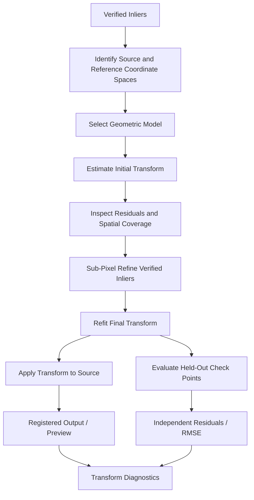
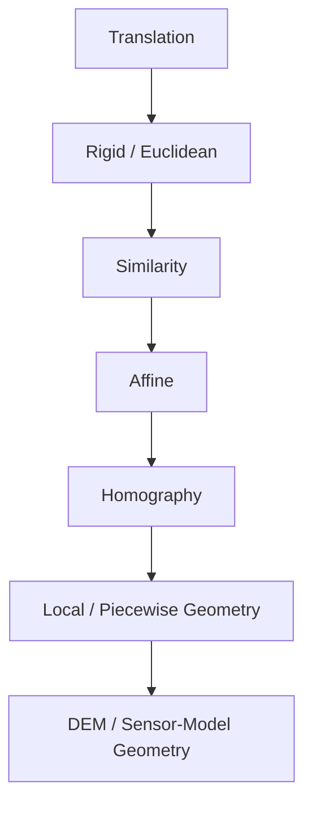
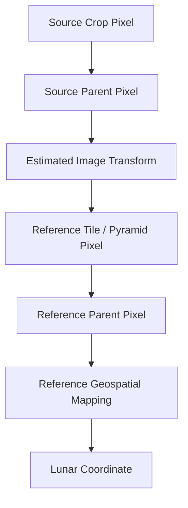

# Geometric Transforms

ChandraMap uses geometric transforms to represent the spatial relationship between a lunar source image and a reference image after reliable correspondence evidence has been established.

A transform answers a geometric question:

> **Where should a point measured in the source coordinate system appear in the reference coordinate system?**

Conceptually:

```text
source coordinate
(x_s, y_s)
        ↓
geometric transform
        ↓
predicted reference coordinate
(x_r, y_r)
```

Transforms are estimated from geometrically verified correspondences and are later used for:

- coordinate mapping;
- residual calculation;
- image registration;
- registered previews;
- geospatial localization when reference metadata supports it;
- downstream mosaic or map demonstrations.

A transform is not itself a feature detector, matcher, robust verifier, ground-truth source, or accuracy metric.

> **A transformation is a mathematical model of the spatial relationship supported by verified correspondences; it is not proof that the underlying lunar geometry is perfectly described by that model.**

A second principle is fundamental to every ChandraMap transformation:

> **Transform direction and coordinate systems are part of the transform.**

A matrix without knowing:

- source coordinate space;
- destination/reference coordinate space;
- source crop or pyramid state;
- reference tile or pyramid state;
- coordinate convention;
- mapping direction;

is incomplete.

A third principle governs model selection:

> **Use the simplest geometric model that adequately explains the verified correspondence geometry.**

A more flexible model is not automatically more scientifically correct. Additional flexibility can increase:

- instability;
- overfitting;
- sensitivity to noise;
- unrealistic deformation.

Finally:

> **The Moon is not a flat poster.**

Affine transformations and homographies can be useful local approximations, particularly for prepared or map-projected image pairs, but they are not universal physical models of lunar topography, sensor geometry, or wide-area planetary imaging.

The intended high-level processing order is:

```text
Prepared Images
      ↓
Matching
      ↓
Candidate Matches
      ↓
Match Filtering
      ↓
RANSAC / Geometric Verification
      ↓
Verified Inliers
      ↓
Initial Transform
      ↓
Sub-Pixel Refinement
      ↓
Refit Final Transform
      ├───────────────┐
      ↓               ↓
Registered Output   Independent Evaluation
```

> **ChandraMap estimates a transform only after correspondence geometry has been verified, then evaluates that transform independently.**

---

## 1. Role of a Transform in ChandraMap

A transform represents a mapping between two explicitly identified coordinate spaces.

The most common conceptual direction is:

```text
source image coordinates
        ↓
transform
        ↓
reference image coordinates
```

Given a source coordinate:

$$
p_s = (x_s, y_s)
$$

the transformation predicts a reference coordinate:

$$
\hat{p}_r = T(p_s)
$$

where \(T\) is the selected geometric model.

This mapping can support:

- transforming verified feature coordinates;
- comparing predicted and observed reference positions;
- computing residuals;
- warping source imagery into a reference grid;
- generating registered overlays;
- propagating a source point toward lunar coordinates through a georeferenced reference product;
- preparing registered imagery for downstream mosaic demonstrations.

A transform does **not** discover correspondences by itself.

The correspondence evidence comes from earlier stages.

---

## 2. Transform Responsibilities

| Responsibility                                    |                       Transform Stage? |
| ------------------------------------------------- | -------------------------------------: |
| Map source coordinates into reference coordinates |                                    Yes |
| Represent image-registration geometry             |                                    Yes |
| Transform verified feature coordinates            |                                    Yes |
| Support residual calculation                      |                                    Yes |
| Support source-image warping                      |                                    Yes |
| Support downstream registered outputs             |                                    Yes |
| Generate SIFT descriptors                         |                                     No |
| Detect keypoints                                  |                                     No |
| Produce matcher candidates                        |                                     No |
| Select RANSAC inliers                             | Primarily geometric-verification stage |
| Create independent ground truth                   |                                     No |
| Prove geolocation independently                   |                                     No |
| Compute held-out benchmark accuracy               |                       Evaluation stage |
| Create a lunar mosaic                             |                       Downstream stage |

The transform layer should remain focused on:

> **representing, estimating, refining, validating, and applying geometry.**

---

# Core Terminology

## 3. Source Image

The **source image** is the image or representation being mapped.

Examples may include:

- prepared OHRC image;
- prepared TMC-2 image;
- IIRS-derived 2D registration representation;
- cropped source region;
- resized/model-prepared source representation.

The exact coordinate space must be recorded.

---

## 4. Reference Image

The **reference image** defines the target coordinate system for the transform.

Examples may include:

- LRO NAC product;
- NAC tile;
- NAC pyramid level;
- WAC tile;
- map-projected lunar reference raster.

A reference image is not automatically ground truth merely because it is used as the registration target.

---

## 5. Transform

A **transform** is a mathematical function mapping coordinates from one explicitly defined space to another.

For example:

```text
prepared TMC-2 source pixels
        ↓
affine transform
        ↓
selected NAC pyramid-level pixels
```

---

## 6. Transform Direction

**Transform direction** identifies which space is mapped into which other space.

Examples:

```text
source → reference
```

or:

```text
reference → source
```

These directions must never be assumed silently.

---

## 7. Forward Transform

The **forward transform** follows the primary scientific mapping direction declared by the transform record.

For example:

```text
source → reference
```

may be the declared forward direction.

---

## 8. Inverse Transform

The **inverse transform** maps in the opposite direction when:

- the transformation is mathematically invertible;
- the estimated matrix is numerically stable enough to invert.

An inverse should not be assumed valid merely because software can attempt to compute one.

---

## 9. Translation

A **translation** shifts coordinates without changing:

- orientation;
- scale;
- shape.

---

## 10. Rigid / Euclidean Transform

A **rigid** or **Euclidean** transformation conceptually supports:

- rotation;
- translation;

while preserving distances and scale.

Its mention here does not imply that it is currently an implemented ChandraMap model.

---

## 11. Similarity Transform

A **similarity transform** conceptually supports:

- translation;
- rotation;
- uniform scale.

It preserves shape up to uniform scaling.

---

## 12. Affine Transform

An **affine transform** can represent combinations of:

- translation;
- rotation;
- scale;
- shear.

It preserves:

- straight lines;
- parallelism.

---

## 13. Homography

A **homography** is a planar projective transformation represented using homogeneous coordinates.

It supports a broader class of projective image-plane relationships than an affine transform.

---

## 14. Local Transform

A **local transform** is intended to be valid only over part of an image or terrain region.

Examples include future:

- local affine models;
- piecewise homographies;
- mesh-based mappings.

---

## 15. Global Transform

A **global transform** applies one geometric model across the full considered overlap.

Examples include:

- one affine transform;
- one homography.

Global models are simple and interpretable but may not capture spatially varying lunar geometry.

---

## 16. Residual

A **residual** is the difference between:

- the observed reference location;
- the location predicted by the transform.

---

## 17. Fit Residual

A **fit residual** is measured on correspondences that participated in model estimation.

It is a useful model-fitting diagnostic.

It is not independent accuracy.

---

## 18. Check-Point Residual

A **check-point residual** is measured using an independent held-out correspondence not used to estimate the transform.

This provides stronger evidence of registration performance.

---

## 19. Warp

A **warp** is the image-resampling operation that applies a geometric transform to pixel values.

Transform estimation and image warping are different operations.

---

## 20. Registration

**Registration** is the broader process of aligning source and reference data using the estimated geometric relationship.

Do not treat these terms as interchangeable:

```text
transform
warp
registration
geolocation
```

Each has a different meaning.

---

# Transform Stage Boundary

## 21. Where Transform Estimation Fits

The intended processing sequence is:

```text
Prepared Source + Reference
        ↓
Matching
        ↓
Candidate Matches
        ↓
Match Filtering
        ↓
RANSAC / Geometric Verification
        ↓
Verified Inliers
        ↓
Initial Transform
        ↓
Sub-Pixel Refinement
        ↓
Final Transform Refit
        ├───────────────┐
        ↓               ↓
Registered Output   Independent Evaluation
```

RANSAC may provide:

- initial inlier classification;
- an initial robust transformation.

After verified inlier coordinates are refined, the geometric model should generally be estimated again from the updated coordinates.

---

# Coordinate Spaces

## 22. Why Coordinate Spaces Matter

The numerical point:

```text
(250.5, 400.5)
```

has no complete scientific meaning without knowing which coordinate grid it belongs to.

It could represent:

- full-resolution OHRC pixels;
- an OHRC crop;
- model-resized OHRC input;
- full NAC pixels;
- a NAC tile;
- a NAC pyramid level;
- a WAC mosaic;
- an IIRS-derived registration representation.

Therefore:

> **Coordinate-space identity is part of transform identity.**

---

## 23. Source Coordinate Space

Possible source spaces include:

- full mission-product pixel coordinates;
- prepared source raster coordinates;
- cropped source coordinates;
- resampled source coordinates;
- model-input source coordinates;
- IIRS-derived 2D representation coordinates.

These should not be assumed interchangeable.

---

## 24. Reference Coordinate Space

Possible reference spaces include:

- full NAC product coordinates;
- NAC crop coordinates;
- NAC tile coordinates;
- NAC pyramid-level coordinates;
- WAC mosaic coordinates;
- WAC tile coordinates;
- projected reference raster coordinates.

---

## 25. Coordinate Convention

Transform metadata should ultimately establish:

- `x/y` meaning;
- relationship to row/column indexing;
- image origin;
- zero-based or one-based indexing;
- pixel-center or pixel-corner convention.

Relevant dataset documentation includes:

- [`../datasets/metadata.md`](../datasets/metadata.md)
- [`../datasets/data-format.md`](../datasets/data-format.md)

---

## 26. `x/y` vs Row/Column

A common image-coordinate convention is:

```text
x → horizontal coordinate
y → vertical coordinate
```

while array indexing often uses:

```text
array[row, column]
```

Conceptually:

```text
column ↔ x
row    ↔ y
```

The repository's actual convention should be documented explicitly rather than assumed.

---

## 27. Pixel Center vs Pixel Corner

High-accuracy registration may depend on whether integer image coordinates represent:

- pixel centers;
- pixel corners.

A half-pixel convention difference can become important when:

- mapping between pyramid levels;
- converting image coordinates to map coordinates;
- evaluating sub-pixel residuals;
- composing transformations.

Do not invent the project convention if it has not yet been established.

Require it to be explicit.

---

# Transform Direction

## 28. Preferred Scientific Direction

A common ChandraMap registration direction is:

```text
source → reference
```

This means:

> given a source pixel coordinate, predict where the same location should appear in the reference coordinate system.

---

## 29. Reference-to-Source Direction

Some workflows may require:

```text
reference → source
```

For example:

- inverse-coordinate queries;
- inverse-map image sampling.

The direction must still be recorded explicitly.

---

## 30. Direction vs Warping API

Many image-warping implementations internally perform inverse sampling:

```text
output/reference pixel
        ↓
inverse mapping
        ↓
source sampling location
```

This implementation detail must not make the scientifically stored transform direction ambiguous.

---

## 31. Store `from_space` and `to_space`

A robust transform record should conceptually identify:

```text
from_space = prepared_source_pixels
to_space   = nac_pyramid_level_pixels
```

rather than storing only:

```text
transform.npy
```

A matrix filename is not sufficient metadata.

---

# Transform Model Hierarchy

## 32. Increasing Flexibility

A conceptual progression is:

```text
Translation
    ↓
Rigid / Euclidean
    ↓
Similarity
    ↓
Affine
    ↓
Homography
    ↓
Local / Piecewise / Terrain-Aware Geometry
```

This progression represents increasing geometric flexibility.

It is **not** a performance ranking.

As flexibility increases:

- more geometric variation can be represented;
- more independent geometric support may be required;
- numerical instability may increase;
- overfitting can become easier;
- interpretation can become more difficult.

---

# Translation

## 33. Translation Model

A 2D translation conceptually maps:

$$
x' = x + t_x
$$

$$
y' = y + t_y
$$

where:

- \(t_x\) is horizontal shift;
- \(t_y\) is vertical shift.

---

## 34. Translation Assumptions

Translation assumes there is no meaningful:

- rotation;
- scale change;
- shear;
- perspective/projective effect.

This is highly restrictive.

---

## 35. Potential ChandraMap Uses

Translation can be useful for:

- synthetic sanity tests;
- debugging coordinate conventions;
- tightly controlled test cases;
- validating transform/warp infrastructure.

It should not be assumed to be a general lunar registration model.

---

# Rigid / Euclidean Transform

## 36. Rigid Transform

A rigid transform conceptually allows:

- rotation;
- translation.

It does not allow:

- scaling;
- shear.

It preserves:

- distances;
- angles;
- shape.

This model may be useful under constrained conditions but is not assumed to be a current default.

---

# Similarity Transform

## 37. Similarity Model

A similarity transformation adds uniform scale to rigid geometry.

It conceptually represents:

- translation;
- rotation;
- one uniform scale factor.

---

## 38. Similarity Use

Similarity geometry may be appropriate when:

- source/reference structure is shape-preserving;
- the dominant difference includes a uniform image scale change.

This remains case-dependent.

---

## 39. Similarity Limitations

A similarity model cannot represent:

- independent horizontal and vertical scaling;
- shear;
- general projective perspective effects;
- terrain-dependent local displacement.

---

# Affine Transform

## 40. Affine Model

An affine transformation can be represented conceptually in homogeneous form as:

$$
\begin{bmatrix}
x' \\
y' \\
1
\end{bmatrix}
=
A
\begin{bmatrix}
x \\
y \\
1
\end{bmatrix}
$$

where the affine mapping represents combinations of:

- translation;
- rotation;
- scaling;
- shear.

A common 2D affine representation contains two coordinate equations:

$$
x' = a_{11}x + a_{12}y + t_x
$$

$$
y' = a_{21}x + a_{22}y + t_y
$$

The exact implementation representation belongs to the code/contracts layer.

---

## 41. Affine Geometry Properties

Affine transforms preserve:

- straight lines;
- parallel lines;
- ratios along the same line.

They do not necessarily preserve:

- lengths;
- angles;
- absolute shape.

---

## 42. Why Affine Can Be Useful

An affine model may provide a useful local approximation for:

- map-projected image pairs;
- moderate rotation differences;
- moderate scale differences;
- shear-like residual image geometry;
- baseline lunar registration experiments.

Its suitability should be measured.

---

## 43. Affine Limitations

Affine geometry may become inadequate when the relationship contains stronger:

- perspective/projective effects;
- spatially varying distortion;
- terrain-relief displacement;
- projection differences;
- raw sensor-geometry effects.

---

# Homography

## 44. Homography Model

A homography represents a 2D planar projective transformation.

Using homogeneous coordinates:

$$
p' \sim H p
$$

where:

- \(p\) is the source homogeneous point;
- \(p'\) is the mapped reference point;
- \(H\) is a \(3 \times 3\) matrix;
- `~` indicates equality up to a nonzero homogeneous scale.

---

## 45. What a Homography Can Represent

A homography can represent combinations of:

- translation;
- rotation;
- scale;
- shear;
- planar perspective/projective effects.

It is more geometrically flexible than an affine transformation.

---

## 46. Homography Assumption

A homography exactly describes certain planar/projective relationships and some special camera-motion cases.

A real lunar surface patch containing:

- crater depth;
- crater rims;
- ridges;
- mountains;
- slopes;

is not literally one plane.

Therefore in ChandraMap, a homography should generally be interpreted as:

> **a local or approximate image-registration model unless stronger physical assumptions are justified.**

---

# The Moon Is Not a Flat Poster

## 47. Why Non-Planarity Matters

Lunar terrain has three-dimensional relief.

Two observations acquired under different viewing conditions can exhibit spatially varying displacement caused by:

- crater depth;
- ridge elevation;
- mountain relief;
- different sensor viewpoints;
- map-projection behavior.

One global homography may visually align much of an image while leaving systematic residuals elsewhere.

---

## 48. Example Failure Pattern

A global model might produce:

```text
central region
→ visually strong alignment

image edge / high-relief region
→ systematic displacement
```

This can indicate that the chosen model does not fully explain the physical geometry.

---

## 49. Homography Failure Symptoms

Potential symptoms include:

- good central alignment but poor edges;
- residual magnitude increasing with image position;
- residual direction varying by terrain region;
- very low fit residual but poor held-out check accuracy;
- unstable projective terms;
- unrealistic warp shape.

These symptoms require diagnosis rather than automatic model escalation.

---

# Affine vs Homography

## 50. Comparison

| Property                              | Affine                     | Homography                  |
| ------------------------------------- | -------------------------- | --------------------------- |
| Relative flexibility                  | Moderate                   | Higher                      |
| Translation                           | Yes                        | Yes                         |
| Rotation                              | Yes                        | Yes                         |
| Scale                                 | Yes                        | Yes                         |
| Shear                                 | Yes                        | Yes                         |
| General planar projective effects     | Limited                    | Yes                         |
| Relative parameter complexity         | Lower                      | Higher                      |
| Sensitivity to weak/clustered support | Typically lower            | Can be greater              |
| Overfitting risk                      | Lower relative flexibility | Higher relative flexibility |
| Possible local lunar approximation    | Yes                        | Yes                         |
| Universal lunar-surface model         | No                         | No                          |

Neither model is automatically the better choice.

---

# Model Selection

## 51. Simplest Adequate Model

The preferred principle is:

> **Use the simplest geometric model that adequately explains the verified correspondence geometry.**

If an affine transform already provides:

- stable geometry;
- acceptable independent residuals;
- appropriate spatial behavior;

a homography may provide unnecessary flexibility.

If affine residuals show systematic projective behavior, homography may be worth testing.

---

## 52. Do Not Choose by Fit Residual Alone

A more flexible model will often have greater ability to reduce error on fitting points.

That does not guarantee lower error on independent check points.

Model selection should consider:

- independent RMSE;
- residual distribution;
- spatial coverage;
- numerical stability;
- failure rate;
- physical/geometric plausibility.

---

## 53. Geographic Extent Matters

A simple planar approximation is more likely to be useful over:

- a relatively local overlap;

than over:

- a very wide geographic region.

The appropriate model can therefore depend on the spatial extent of the pair.

---

## 54. Projection State Matters

Model selection may differ between:

- well-prepared map-projected source/reference rasters;
- differently projected products;
- unprojected sensor imagery.

A transform should not be selected without considering the coordinate geometry of the inputs.

---

# Model Complexity and Overfitting

## 55. More Flexibility Can Fit Noise

A flexible transformation may accommodate:

- real geometry;
- localization noise;
- poorly distributed correspondences;
- some incorrect inliers.

This can reduce fit error while weakening generalization.

---

## 56. Independent Evaluation Detects Overfitting

A common pattern is:

```text
complex model
→ excellent fit-point residual
→ poor held-out check residual
```

This suggests the model may be fitting its training/control correspondence geometry without representing the broader registration accurately.

---

# Initial Transform from RANSAC

## 57. RANSAC Relationship

[`ransac.md`](ransac.md) documents robust geometric verification.

Conceptually:

```text
filtered candidate matches
        ↓
RANSAC
        ↓
consensus / verified inliers
        ↓
initial transform
```

The initial transformation is useful for:

- identifying geometric consensus;
- initializing refinement;
- preliminary registered overlays.

---

## 58. Initial Transform Is Not Necessarily Final

The RANSAC model may have been estimated using:

- matcher coordinates;
- limited initial localization precision;
- robust model-fitting approximations.

Later correspondence refinement can change the coordinate values.

The final scientific model should therefore reflect the final fitting coordinates.

---

# Sub-Pixel Refinement Handoff

## 59. Correct Processing Order

The intended sequence is:

1. matcher proposes candidate correspondences;
2. matcher-level filtering removes obvious weak/invalid candidates;
3. RANSAC determines geometric inliers;
4. RANSAC produces an initial model;
5. verified inlier coordinates are refined where justified;
6. the transformation is refit using the refined fit correspondences;
7. independent check points evaluate the final model.

In compact form:

```text
candidates
→ filtering
→ RANSAC
→ verified inliers
→ refine
→ refit
→ evaluate
```

---

## 60. Why Refinement Follows Verification

Refinement improves coordinate precision.

If applied to a false candidate, it merely creates:

> a more precisely localized wrong correspondence.

Therefore geometric rejection should happen first.

---

# Refit After Refinement

## 61. Why Refit Is Required Conceptually

Suppose RANSAC estimated a transformation using coordinates:

$$
p_1, p_2, \ldots, p_n
$$

Sub-pixel refinement changes those measurements to:

$$
p'_1, p'_2, \ldots, p'_n
$$

The old transformation was optimized for the old coordinates.

Therefore:

> **Refined coordinates require an updated geometric fit.**

---

## 62. Preferred Sequence

```text
RANSAC
→ initial transform
→ verified inliers
→ refined verified coordinates
→ final model refit
```

Do not silently retain the pre-refinement model as the final transform when refinement materially changes the fitting coordinates.

---

## 63. Keep Check Points Out of Refit

The final model should be fit only from correspondences designated for fitting/control.

Held-out check points should remain independent.

See [`../datasets/ground-truth-preparation.md`](../datasets/ground-truth-preparation.md).

---

# Model Refit

## 64. Refit Concept

After geometric verification, a transformation may be estimated again from the complete accepted fit set rather than only from a minimal robust hypothesis.

Conceptually:

```text
verified/refined fit correspondences
        ↓
model estimation
        ↓
final transform
```

This can produce a model representing the full accepted fit-point set.

---

## 65. Robust Final Fitting

Future or advanced pipelines may investigate:

- robust weighting;
- residual rechecking;
- iterative refinement;
- uncertainty weighting.

These should be treated as optional/research directions unless implemented.

---

# Transform Validation

## 66. Basic Validation

A transform should be validated before being treated as usable.

Checks should include where applicable:

- expected matrix dimensions;
- finite coefficients;
- valid transform direction;
- valid source coordinate space;
- valid reference coordinate space;
- model-estimation success;
- invertibility where inverse mapping is required;
- reasonable transformed coordinates;
- associated pair/version information.

---

## 67. Numerical Degeneracy

A transformation can become unstable when:

- fit points are nearly collinear;
- point coverage is very small;
- duplicate correspondences exist;
- coordinates are poorly conditioned;
- the selected model is too flexible;
- the correspondence geometry is degenerate.

A numerical matrix should not be accepted simply because an estimator returned it.

---

## 68. Plausibility Checks

Potential conceptual checks can inspect:

- scaling behavior;
- orientation change;
- shear;
- projective deformation;
- transformed footprint;
- determinant or conditioning where meaningful.

No universal numerical thresholds should be invented.

Plausibility rules should be:

- model-aware;
- sensor-aware;
- benchmark-driven.

---

# Transform Residuals

## 69. Residual Definition

Given:

- source point \(p_s\);
- transformation \(T\);
- observed reference point \(p_r\);

the predicted reference coordinate is:

$$
\hat{p}_r = T(p_s)
$$

and the residual vector is:

$$
r = p_r - \hat{p}_r
$$

with magnitude:

$$
\lVert r \rVert
$$

---

## 70. Residual Units

Residuals must be associated with an explicit coordinate domain.

Possible units include:

- source pixels;
- reference pixels;
- reference pyramid-level pixels;
- map coordinates.

Avoid reporting generic:

```text
pixel error
```

without identifying the pixel grid.

---

# Fit Residual

## 71. What Fit Residual Measures

Fit residual measures how well the transformation explains the correspondences used to estimate it.

Useful applications include:

- model diagnostics;
- detecting outliers;
- comparing candidate model behavior;
- inspecting spatial residual patterns.

---

## 72. What Fit Residual Does Not Measure

It is not independent registration accuracy when computed on the same points used to fit the model.

A low fit residual can coexist with poor generalization.

---

# Independent Residual

## 73. Check-Point Evaluation

For an independent check point:

$$
p_{s,\text{check}}
$$

the transform predicts:

$$
\hat{p}_{r,\text{check}} = T(p_{s,\text{check}})
$$

which can be compared with independently established:

$$
p_{r,\text{check}}
$$

The resulting discrepancy is independent of fitting if the check point was not used to estimate the transformation.

---

## 74. Fit vs Check Residual

| Property                                      | Fit Residual | Check-Point Residual         |
| --------------------------------------------- | ------------ | ---------------------------- |
| Uses model-fitting points                     | Yes          | No                           |
| Measures model fit                            | Yes          | Indirectly                   |
| Independent evaluation                        | No           | Yes, when held out correctly |
| Useful for diagnostics                        | Yes          | Yes                          |
| Suitable as final accuracy evidence by itself | No           | Stronger evidence            |

---

# Residual Vector Fields

## 75. Why Direction Matters

A scalar RMSE compresses residual information.

A residual vector field preserves:

- magnitude;
- direction;
- spatial position.

This can reveal model limitations hidden by one aggregate metric.

---

## 76. Possible Residual Patterns

### Similar Direction Everywhere

May suggest remaining translational bias.

### Residual Magnitude Increasing Across the Image

May suggest:

- scale error;
- rotation error;
- projection mismatch;
- inadequate model flexibility.

### Different Directions in Different Terrain Zones

May suggest:

- topographic relief;
- local geometry;
- non-planar deformation.

### Large Random Residuals

May suggest:

- weak correspondences;
- wrong reference;
- failed model estimation.

These are diagnostic interpretations, not automatic conclusions.

---

## 77. Residual Magnitude Alone Is Not Enough

Two transformations can have similar average error while one contains:

- systematic directional bias;

and the other:

- more randomly distributed residuals.

Inspect spatial behavior where practical.

---

# Transform Quality

## 78. Useful Diagnostics

Possible transform-level diagnostics include:

- fit residual statistics;
- independent check-point RMSE;
- median check-point error;
- maximum residual where useful;
- verified inlier count;
- inlier ratio;
- spatial coverage;
- model stability;
- runtime;
- failure status.

Metric definitions should remain consistent with ChandraMap's evaluation documentation.

---

# Source-Image Pixel Error

## 79. Source Space First

ChandraMap should generally report registration error in source-image pixels first.

Examples:

```text
OHRC source
→ OHRC-pixel error
```

```text
TMC-2 source
→ TMC-2-pixel error
```

```text
IIRS registration representation
→ IIRS source-grid pixel error
```

This avoids false physical precision.

---

# Ground Error

## 80. Conversion to Physical Distance

Pixel-domain error may be converted to ground distance only when the conversion is scientifically justified using:

- product-specific GSD or map scale;
- correct coordinate space;
- valid projection/geospatial metadata;
- appropriate reference truth.

Do not simply multiply an arbitrary reference-level residual by a generic sensor GSD.

---

# Pyramid-Level Transforms

## 81. A Transform Belongs to Its Level

Suppose a model was estimated between:

```text
TMC-2 source pixels
```

and:

```text
NAC pyramid level L
```

That transform predicts:

> NAC level-\(L\) pixel coordinates.

It does not automatically predict:

> NAC native/base-level coordinates.

---

## 82. Why This Matters

A translation of:

```text
10 pixels
```

at a coarse pyramid level does not represent the same physical displacement as:

```text
10 pixels
```

at the native reference level.

The matrix parameters are coordinate-system dependent.

---

## 83. Level-to-Base Conversion

Converting a transformation to another reference level may require knowledge of:

- pyramid scale factor;
- resampling alignment;
- pixel-center convention;
- tile/crop offsets;
- source-level scaling where applicable.

See [`scale-pyramid.md`](scale-pyramid.md).

---

# Coarse-to-Fine Transform Refinement

## 84. Preferred Strategy

Rather than relying indefinitely on algebraically scaling one coarse transformation:

```text
coarse transform
        ↓
predict finer search region
        ↓
generate finer correspondences
        ↓
geometric verification
        ↓
refit finer transform
```

This introduces actual finer-level correspondence evidence.

---

## 85. Do Not Always Continue to Native Resolution

A coarse source may not contain information supporting native NAC-level refinement.

This is particularly important for:

- TMC-2;
- IIRS.

A scientifically valid final model may remain associated with a coarser reference representation.

---

# Crop and Tile Transforms

## 86. Local Coordinates

A transform may operate between:

```text
source crop
→ reference tile
```

rather than full parent images.

This is valid as long as coordinate provenance is preserved.

---

## 87. Parent Coordinate Mapping

For a simple crop:

$$
x_{\text{parent}} = x_{\text{crop}} + x_{\text{offset}}
$$

$$
y_{\text{parent}} = y_{\text{crop}} + y_{\text{offset}}
$$

Additional transformations may be required when the crop was also:

- resized;
- rotated;
- reprojected;
- converted into a pyramid level.

---

## 88. Tile Offset Loss

A transform can look visually correct within a local tile while mapping to the wrong parent location if:

- tile offsets;
- parent IDs;
- level mappings;

are lost.

This is a serious geospatial provenance error.

---

# Transform Composition

## 89. Why Composition Is Needed

A complete mapping may consist of several coordinate conversions.

For example:

```text
source crop pixels
        ↓
source parent pixels
        ↓
image-to-image transform
        ↓
reference tile pixels
        ↓
reference parent pixels
        ↓
reference map coordinates
```

The complete coordinate relationship may therefore require composition.

---

## 90. Composition Order Matters

Transformation composition is generally non-commutative.

Conceptually:

```text
apply A
then B
```

is not generally equivalent to:

```text
apply B
then A
```

Therefore any composed transform chain must identify the application order.

---

# Homogeneous Coordinates

## 91. Why They Are Useful

Homogeneous coordinates provide a convenient representation for composing many 2D transformations such as:

- translation;
- affine transformations;
- homographies.

For example, a sequence of compatible transformations may be represented through matrix multiplication in a consistent homogeneous framework.

This documentation intentionally does not turn transform composition into a full linear-algebra tutorial.

---

# Inverse Transform

## 92. Why an Inverse Is Needed

A scientifically stored transform may map:

```text
source → reference
```

while an image-resampling algorithm needs:

```text
output/reference pixel
→ source sampling location
```

That operation may require the inverse transform.

---

## 93. Invertibility

Before inversion, validate where applicable:

- the model mathematically supports inversion;
- the matrix is nonsingular;
- coefficients are finite;
- numerical conditioning is acceptable.

Do not blindly invert unstable matrices.

---

## 94. Preserve Scientific Direction

If an inverse matrix is generated for warping:

> do not replace or forget the original declared transform direction.

The record should make clear whether a matrix is:

- primary/forward;
- derived inverse.

---

# Transform Estimation vs Image Warping

## 95. Transform Estimation

Transform estimation determines:

> the mathematical mapping between coordinate systems.

Its output is geometric.

---

## 96. Image Warping

Image warping applies that mapping to image samples.

Its output is a resampled raster.

Conceptually:

```text
estimated transform
        +
source image
        +
target grid
        +
interpolation
        ↓
warped image
```

---

## 97. Why the Distinction Matters

Two pipelines can use the same geometric transform but different:

- interpolation;
- output grid;
- mask policy.

Those pipelines have identical transformation geometry but different warped raster products.

---

# Image Interpolation

## 98. Warping Requires Resampling

Possible interpolation families include:

- nearest-neighbor;
- bilinear;
- bicubic;
- higher-order methods.

No one method is prescribed universally.

The appropriate method depends on:

- data semantics;
- quantitative vs visualization use;
- numeric type;
- mask handling;
- scientific requirements.

---

## 99. Do Not Hide Interpolation

A registered scientific raster should preserve where relevant:

- interpolation method;
- output grid;
- source asset;
- transform ID;
- NoData policy.

---

# Warping Does Not Recover Resolution

## 100. Critical Scale Rule

Warping a coarse source onto a fine reference grid does not create new physical information.

For example:

```text
IIRS source
        ↓
warp onto fine NAC grid
        ↓
many output pixels
```

does **not** mean:

```text
IIRS now has NAC spatial resolution
```

The warped image still contains information limited by the original source observation.

---

## 101. TMC-2 Example

Likewise:

```text
TMC-2
→ warp to high-resolution NAC-sized grid
```

does not recover:

- small crater detail;
- fine ridges;
- high-resolution shadow structure;

that TMC-2 never measured.

---

# Masks and NoData During Warping

## 102. Warp the Validity Information

If a source image has a valid-data mask, the registered output should preserve equivalent validity information.

Conceptually:

```text
source image + source mask
        ↓
warp consistently
        ↓
registered image + aligned output mask
```

---

## 103. Invalid Borders

Warping may create output regions with no corresponding source sample.

These should remain:

- invalid;
- NoData;
- masked;

rather than being interpreted as lunar measurements.

---

# Registered Preview

## 104. Purpose

A registered preview is useful for visual inspection.

Possible visualizations include:

- alpha overlay;
- blink comparison;
- checkerboard;
- source/reference side-by-side;
- difference visualization where meaningful.

---

## 105. Preview Is Not Accuracy

A visually convincing overlay can hide:

- localized errors;
- edge-region drift;
- overfitting;
- projection mismatch;
- wrong terrain correspondence.

> **A registered preview is a diagnostic, not independent registration evidence.**

---

# Scientific Registered Raster

## 106. Preview vs Scientific Output

A visualization may use:

- PNG;
- JPEG;
- reduced dynamic range.

A scientific registered raster may instead need to preserve:

- higher numeric precision;
- geospatial metadata;
- masks;
- NoData;
- transform provenance.

Do not treat visualization output as an equivalent scientific raster.

---

# Transform vs Geolocation

## 107. Image Transform Does Not Automatically Give Lunar Coordinates

An image-domain model provides:

```text
source pixel
→ reference pixel
```

Geolocation additionally requires:

- trusted reference geospatial metadata;
- projection/CRS information;
- pixel-to-map coordinate conversion;
- correctly geolocated reference data.

---

## 108. Pixel-to-Lunar Coordinate Chain

Conceptually:

```text
Source Pixel
      ↓
Image Transform
      ↓
Reference Pixel
      ↓
Reference Geospatial Mapping
      ↓
Lunar Map Coordinate
```

Every stage must be scientifically valid.

---

## 109. Geolocation Limitations

Do not claim geolocation when:

- reference map geometry is unavailable;
- coordinate convention is unknown;
- transform exists only between arbitrary image grids;
- reference placement is uncertain;
- projection/body conventions are missing.

---

# Map-Projected Data

## 110. Projected Products

Map-projected lunar products provide an explicit mapping between:

- raster coordinates;
- map coordinates.

This can simplify geometric interpretation.

However, two map-projected products can still differ in:

- map projection;
- resolution;
- map-grid alignment;
- processing;
- geolocation quality.

Image registration may still be necessary.

---

# Reprojection vs Image Registration

## 111. Different Operations

### Geospatial Reprojection

Uses known coordinate-reference information to transform between map coordinate systems.

### Image Registration

Uses observed image correspondence to estimate residual spatial alignment.

Conceptually:

```text
reprojection
→ coordinate-system conversion based on known map geometry
```

while:

```text
registration
→ estimated alignment based on image evidence
```

They should not be used as synonyms.

---

# Unprojected / Raw Geometry

## 112. Raw Products

For unprojected or weakly corrected imagery, the relationship between images may depend on:

- camera geometry;
- spacecraft pose;
- viewing direction;
- planetary shape;
- terrain elevation.

A simple 2D affine transform or homography may then be only an approximation.

---

## 113. Future Physical Geometry

Future high-precision work may require:

- mission sensor models;
- spacecraft geometry;
- camera models;
- ray/line-of-sight geometry;
- lunar body reference models;
- DEM-supported intersection.

These are advanced research directions unless repository implementation explicitly adopts them.

---

# Terrain Relief

## 114. Relief-Induced Displacement

A crater wall or elevated ridge can project differently from nearby lower terrain when viewing geometry changes.

Therefore:

```text
one global matrix
```

may not perfectly represent:

```text
all terrain elevations
```

---

## 115. Structured Relief Residuals

Residual vectors that correlate with terrain regions may indicate:

- relief-driven displacement;
- local projection behavior;
- inadequacy of one global planar model.

This should be investigated before simply increasing model complexity.

---

# Local and Piecewise Transforms

## 116. When Local Geometry May Be Needed

Possible signs include:

- center aligns but image edges do not;
- different terrain regions show distinct residual biases;
- global residuals are strongly spatially structured;
- one global transform fails independent check points despite good local fit.

---

## 117. Candidate Future Approaches

Possible future models include:

- local affine transformations;
- piecewise homographies;
- mesh deformation;
- displacement fields;
- spline-like deformation models.

These increase model flexibility substantially.

---

## 118. Local Models Can Overfit

A local warp can reduce fitting residuals by following:

- true terrain geometry;
- localization noise;
- incorrect correspondences.

Therefore local models require:

- stronger spatial control;
- regularization;
- independent validation;
- careful complexity management.

---

# DEM-Aware Geometry

## 119. Why a DEM Can Help

A lunar Digital Elevation Model may help represent:

- terrain height;
- relief;
- topography-dependent projection;
- parallax-like displacement.

This may support more physically meaningful geometry than a single planar transform.

---

## 120. DEM-Aware Processing Is Advanced

DEM-aware transformation should remain a later research direction unless version scope explicitly adopts it.

V1 should not require DEM availability.

---

## 121. DEM Quality Matters

A DEM has its own:

- spatial resolution;
- uncertainty;
- projection;
- coverage;
- processing history.

A DEM should not be treated as perfect truth automatically.

---

# Sensor-Model Geometry

## 122. Sensor Models

Future physical registration may incorporate:

- camera models;
- spacecraft pose;
- sensor orientation;
- line-of-sight models;
- lunar reference body geometry.

These can provide a stronger physical foundation than a purely image-domain homography.

---

## 123. Sensor Models Do Not Eliminate Image Registration

Even with physical geometry, residual discrepancies may remain because of:

- orbit/attitude uncertainty;
- map-product errors;
- timing uncertainty;
- terrain-model limitations;
- image-processing effects.

Image correspondences may still provide useful residual correction.

---

# Sensor-Specific Transform Considerations

## 124. OHRC

OHRC is the Chandrayaan-2 **Orbiter High Resolution Camera**.

Current project documentation commonly treats it as approximately:

> **~0.25–0.32 m/pixel**

depending on product/documentation.

Actual product metadata remains authoritative.

Its fine sampling means:

- small residuals can be visible in pixel space;
- fine terrain relief may become apparent;
- high-resolution correspondence distribution matters.

A fine source does not guarantee that one planar model is physically exact.

---

## 125. TMC-2

TMC-2 is the Chandrayaan-2 **Terrain Mapping Camera-2**.

Current project planning commonly uses approximately:

> **~5 m/pixel**

with actual metadata remaining authoritative.

TMC-2 may commonly operate against:

- a downsampled NAC representation;
- another scale-compatible reference.

The transform must therefore record the exact reference level used.

---

## 126. IIRS

IIRS is the Chandrayaan-2 **Imaging Infrared Spectrometer**.

Project-level approximations include:

- ~80 m/pixel;
- ~0.8–5.0 µm;
- roughly ~250–256 bands depending on product/documentation.

Actual product metadata remains authoritative.

IIRS requires a documented 2D registration representation before ordinary 2D transform estimation.

A flexible transform cannot create fine spatial information absent from the coarse source.

---

## 127. LRO NAC

LRO NAC commonly provides fine/local reference imagery.

Current project planning often treats its sampling as approximately:

> **~0.5–2 m/pixel**

depending on product/acquisition geometry.

Actual metadata remains authoritative.

When a coarser source is matched against a NAC pyramid level, the transformation belongs to that level.

---

## 128. LRO WAC

LRO WAC supports broad/coarse lunar reference roles.

Its scale is product/mode/processing dependent.

A transformation against WAC may support:

- broad localization;
- coarse image alignment.

It should not automatically be interpreted as fine NAC-scale geometric accuracy.

---

# Transform Selection Workflow

## 129. Recommended Conceptual Process

1. Start with geometrically verified inliers.
2. Identify source coordinate space.
3. Identify reference coordinate space.
4. Record transform direction.
5. Inspect crop/tile/pyramid context.
6. Inspect overlap size.
7. Inspect projected vs unprojected state.
8. Fit the configured baseline model.
9. Inspect residual magnitude and spatial structure.
10. Inspect correspondence spatial coverage.
11. Evaluate using held-out check points.
12. Test a more or less flexible model only when justified.
13. Select the model using benchmark evidence.
14. Record configuration and version.

Do not select geometry based only on which overlay looks best.

---

# Comparing Transform Models

## 130. Same-Correspondence Rule

Where possible, affine and homography comparisons should use the same:

- pair;
- representation;
- verified/refined correspondence set.

This isolates model behavior.

---

## 131. Same-Truth Rule

Use the same independent check-point set when comparing models.

Otherwise differences may reflect evaluation data rather than transform quality.

---

## 132. Same-Coordinate Rule

Ensure both models are compared in the same:

- source coordinate space;
- reference coordinate space;
- pyramid level.

---

## 133. Fit Error Alone Is Not Enough

A homography may reduce fit residual simply because it is more flexible.

Independent check-point performance and spatial residual behavior matter more for generalization.

---

# Transform Metrics

## 134. Candidate Diagnostics

Possible transform-level metrics include:

- fit residual;
- independent check-point RMSE;
- median check residual;
- maximum check residual where meaningful;
- inlier count;
- inlier ratio;
- spatial coverage;
- model failure rate;
- transform runtime;
- stability diagnostics.

No mandatory threshold is defined here.

---

# Transform Stability

## 135. Stability Concept

A transformation may be considered unstable when small changes in:

- point subset;
- point localization;
- configuration;

produce disproportionately large changes in the estimated geometry.

Potential causes include:

- poor point distribution;
- degenerate geometry;
- excessive model flexibility;
- insufficient data.

---

## 136. Stability Experiments

Future benchmarks may test sensitivity by:

- repeated robust fits;
- bootstrap-like point perturbation;
- held-out fit-point subsets;
- controlled coordinate noise.

No one stability metric is mandated.

---

# Transform Failure Modes

## 137. Failure Diagnosis Table

| Symptom                                                | Possible Cause                                              | Diagnostic / Response                                   |
| ------------------------------------------------------ | ----------------------------------------------------------- | ------------------------------------------------------- |
| Matrix cannot be estimated                             | Too few or degenerate fit points                            | Improve geometric support                               |
| Extreme shear                                          | Incorrect correspondences or unsuitable model               | Inspect matches and residuals                           |
| Homography unstable                                    | Poor point distribution                                     | Improve spatial coverage or simplify model              |
| Center aligns but edges do not                         | Model too simple, projection mismatch, or terrain relief    | Inspect residual field                                  |
| Fit residual low but check RMSE high                   | Overfitting                                                 | Prefer independent evaluation                           |
| Model works on pyramid level but not base              | Coordinate-conversion error                                 | Correct level mapping                                   |
| Registered image shifted by constant tile amount       | Crop/tile offset lost                                       | Restore parent-coordinate mapping                       |
| Warped result mostly empty                             | Wrong transform direction or output grid                    | Verify forward/inverse use                              |
| Inverse cannot be computed reliably                    | Singular/unstable geometry                                  | Reject inversion/model                                  |
| Fine reference alignment looks convincing for IIRS     | Source lacks comparable fine information                    | Respect source resolution                               |
| Different runs give very different matrices            | Weak geometry or unstable model                             | Inspect fit distribution and robust-estimation behavior |
| Geolocation is inconsistent despite good image overlay | Reference geospatial metadata or coordinate chain incorrect | Validate projection and parent mapping                  |

No fixed numeric criteria are implied.

---

# Transform Quality Control

## 138. QC Checklist

Before accepting a transform as a valid result, verify:

- [ ] Model type is known.
- [ ] Source asset is known.
- [ ] Reference asset is known.
- [ ] Source coordinate space is known.
- [ ] Reference coordinate space is known.
- [ ] Transform direction is explicit.
- [ ] Matrix/parameter dimensions match the model.
- [ ] Coefficients are finite.
- [ ] Inversion is validated where required.
- [ ] Source pyramid/crop state is recorded.
- [ ] Reference pyramid/tile state is recorded.
- [ ] Crop/tile offsets are preserved.
- [ ] Pixel-coordinate convention is known.
- [ ] Projection/geospatial context is recorded where relevant.
- [ ] Fit-point set is identified.
- [ ] Check-point set remains separate.
- [ ] Residuals are computed.
- [ ] Residual coordinate units are known.
- [ ] Spatial support is inspected.
- [ ] Model is not obviously degenerate.
- [ ] Final refit follows sub-pixel refinement where enabled.
- [ ] Model/configuration version is recorded.
- [ ] Failure state is explicit.

---

# Transform Serialization

## 139. A Matrix Is Not Enough

A stored transform should conceptually preserve:

- transform ID;
- pair ID;
- model type;
- model parameters/matrix;
- transform direction;
- source coordinate-space identity;
- reference coordinate-space identity;
- source representation;
- reference representation;
- pyramid level(s);
- crop/tile offsets;
- fitting point-set identity/version;
- transform-estimation configuration;
- model stage;
- transform version.

---

## 140. Possible Storage Forms

Depending on repository architecture, a transform may be stored using:

- structured JSON;
- YAML metadata;
- NumPy array plus companion metadata;
- benchmark/result record;
- another open machine-readable representation.

This file does not prescribe one exact implementation format.

---

## 141. Numeric Precision

Do not unnecessarily round transformation coefficients.

Store sufficient numerical precision for:

- reproducibility;
- subsequent coordinate mapping.

However:

> **stored coefficient precision does not imply equivalent physical registration accuracy.**

---

# Conceptual Transform Record

## 142. Illustrative Structure

The following is an **illustrative conceptual structure — not an implemented schema**:

```yaml
transform_id: "PLACEHOLDER_TRANSFORM_ID"
pair_id: "PLACEHOLDER_PAIR_ID"

model:
  type: "PLACEHOLDER_MODEL_TYPE"
  direction: "source_to_reference"
  matrix:
    - ["PLACEHOLDER", "PLACEHOLDER", "PLACEHOLDER"]
    - ["PLACEHOLDER", "PLACEHOLDER", "PLACEHOLDER"]

source_space:
  asset_id: "PLACEHOLDER_SOURCE_ASSET"
  coordinate_space: "prepared_source_pixels"

reference_space:
  asset_id: "PLACEHOLDER_REFERENCE_ASSET"
  coordinate_space: "PLACEHOLDER_REFERENCE_LEVEL"

fit:
  point_set_id: "PLACEHOLDER_POINT_SET_ID"
  refinement: "PLACEHOLDER_STATUS"

transform_version: "PLACEHOLDER_VERSION"
```

No real transformation coefficients or implementation field names are implied.

---

# Transform Composition Provenance

## 143. Ordered Transform Components

If a mapping is composed from multiple components, record:

- each component;
- each component direction;
- each input/output coordinate space;
- composition order.

Conceptually:

```text
crop offset
→ pyramid scaling
→ image transform
→ reference parent offset
```

---

## 144. Preserve Intermediate Meaning

Reducing an entire chain to one final matrix may be computationally convenient.

For reproducibility, it may still be useful to preserve:

- component identities;
- parent relationships;
- original coordinate meanings.

---

# Transform Versioning

## 145. Why a Transform Can Change

An estimated transform may change when any of the following changes:

- pair version;
- preprocessing;
- source representation;
- reference representation;
- pyramid level;
- matcher;
- match filtering;
- RANSAC configuration;
- verified inlier set;
- sub-pixel refinement;
- model type;
- fitting implementation.

Transform results therefore require provenance.

---

## 146. Algorithm Output Is Not Dataset Truth

Estimated transformations are algorithm outputs.

Do not silently write them into canonical:

- ground-truth files;
- mission metadata;
- authoritative geospatial truth.

Algorithm-generated models and independent truth must remain separate.

---

# Reproducibility

## 147. Minimum Provenance

A transform result should ideally be traceable to:

- pair version;
- source/reference asset versions;
- preprocessing configuration;
- source/reference representation;
- scale-pyramid level;
- matcher and version;
- match-filter configuration;
- RANSAC configuration;
- verified/refined fit-point set;
- transform model;
- transform-estimation configuration;
- algorithm/software version;
- benchmark version;
- truth/check-point version used for evaluation.

---

# Transform Benchmarking

## 148. Research Questions

Useful experiments include:

- Does affine or homography generalize better on a particular benchmark category?
- How does model choice affect independent RMSE?
- Does sub-pixel refitting improve held-out error?
- When does a coarse-level transform stop improving at finer scales?
- How stable is a model to changes in fit-point subsets?
- Do structured residuals indicate a need for local geometry?
- Does a more flexible model reduce failure rate without overfitting?
- How much runtime does each geometry strategy add?

These are empirical questions.

---

# Transform Benchmark Table

## 149. Conceptual Results Template

| Pair      | Matcher   | Transform   | Inliers | Coverage | Fit Residual | Check RMSE | Runtime | Status |
| --------- | --------- | ----------- | ------: | -------: | -----------: | ---------: | ------: | ------ |
| `PAIR_ID` | `MATCHER` | `TRANSFORM` |       — |        — |            — |          — |       — | —      |

Only measured benchmark results should populate this table.

---

# Registered Outputs

## 150. Registered Raster

A final transform can be applied to produce a registered source raster in a selected reference grid.

A registered scientific result should preserve where applicable:

- source asset ID;
- transform ID;
- output grid;
- interpolation method;
- mask/NoData policy;
- output dimensions;
- geospatial metadata where justified.

---

## 151. Registered Preview

A lightweight preview may be generated for:

- documentation;
- debugging;
- comparison;
- visualization.

Possible preview formats may use reduced dynamic range or compressed image formats.

These should be labeled as visualization products.

---

## 152. Scientific Raster vs Preview

| Property                      | Registered Preview   | Scientific Registered Raster            |
| ----------------------------- | -------------------- | --------------------------------------- |
| Main purpose                  | Visualization        | Scientific processing/output            |
| Numeric precision             | May be reduced       | Should preserve required precision      |
| Compression                   | May be lossy         | Depends on scientific format/policy     |
| Mask/NoData                   | May be simplified    | Should be preserved                     |
| Geospatial metadata           | Optional for preview | Important when scientifically justified |
| Suitable as accuracy evidence | No                   | Still requires independent metrics      |

---

# Transform and Mosaics

## 153. Mosaic Is Downstream

A mosaic may consume registered images.

Conceptually:

```text
correspondence
→ transform
→ registered images
→ mosaic
```

Mosaic appearance must not replace:

- correspondence metrics;
- transform diagnostics;
- independent check-point evaluation.

A mosaic is a downstream application/demo of registration.

---

# Versioned Transform Strategy

## 154. V1 — Simple Global Geometry

V1 should remain understandable and reproducible.

Conceptually:

```text
Known-Overlap Pair
        ↓
SIFT Candidate Correspondences
        ↓
Match Filtering
        ↓
RANSAC
        ↓
Configured Affine or Homography Baseline
        ↓
Verified Inliers
        ↓
Optional Refinement
        ↓
Final Transform Refit
        ↓
Independent Check-Point Evaluation
```

Primary objectives:

- baseline measurement;
- transparent coordinate handling;
- reproducible geometry;
- clear failure analysis.

V1 should not require:

- local mesh warps;
- DEM-aware geometry;
- full physical sensor models.

The authoritative V1 scope determines the actual baseline model choice.

---

## 155. V2 — Stronger Transform Diagnostics

Possible V2 additions include:

- controlled affine-vs-homography comparisons;
- stronger residual-vector analysis;
- explicit sub-pixel final refitting;
- coarse-to-fine transform experiments;
- model-stability diagnostics;
- improved coordinate provenance.

---

## 156. V3 — Multi-Scale and Retrieval Geometry

Possible V3 additions include:

- retrieval-candidate transform validation;
- multi-level model refinement;
- learned matcher candidate sets;
- stronger model-selection experiments;
- reference-tile/base-coordinate conversion;
- richer transform result records.

---

## 157. V4 — Advanced Physical / Local Geometry

Potential research directions include:

- local or piecewise transforms;
- mesh deformation;
- displacement fields;
- DEM-aware registration;
- physical sensor models;
- uncertainty-aware fitting;
- multi-mission geometric modeling.

These are research directions, not implementation claims.

Existing version specifications remain authoritative.

---

# Main Transform Flow

## 158. Transform Estimation and Evaluation



---

# Model Flexibility Hierarchy

## 159. Conceptual Hierarchy



> **Greater flexibility does not automatically mean better registration.**

Each additional level of complexity requires stronger evidence and evaluation.

---

# Coordinate Mapping Chain

## 160. End-to-End Coordinate Context



Each arrow represents a mapping that must remain documented if the complete geospatial chain is used.

---

# Relationship to Algorithm Overview

## 161. [`overview.md`](overview.md)

[`overview.md`](overview.md) describes the complete algorithm stack.

This document focuses specifically on:

> **geometric model representation, estimation, refitting, validation, application, and limitations.**

---

# Relationship to Matching

## 162. [`matching.md`](matching.md)

[`matching.md`](matching.md) generates:

> candidate source/reference correspondences.

A transformation should not be considered reliable directly from raw matcher output.

Geometric verification first identifies a coherent correspondence subset.

---

# Relationship to Match Filtering

## 163. Match Filtering

If `match-filtering.md` is present or added, it should define candidate-cleaning operations such as:

- descriptor ambiguity removal;
- mutual consistency;
- confidence filtering;
- duplicate handling.

Match filtering does not itself define the final spatial transformation.

---

# Relationship to RANSAC

## 164. [`ransac.md`](ransac.md)

[`ransac.md`](ransac.md) is the immediate upstream geometric-verification document.

The responsibilities are:

```text
ransac.md
→ identify robust consensus
→ classify inliers/outliers
→ estimate initial model

transforms.md
→ define transform models
→ define coordinate semantics
→ explain final refit
→ explain composition/inversion
→ explain warping/application
→ explain model limitations
```

The two documents should remain complementary rather than duplicating one another.

---

# Relationship to Scale Pyramid

## 165. [`scale-pyramid.md`](scale-pyramid.md)

[`scale-pyramid.md`](scale-pyramid.md) defines the physical reference-level hierarchy.

A transform estimated at one pyramid level belongs to that level's coordinate space.

Scale conversion must therefore be explicit.

---

# Relationship to Preprocessing

## 166. [`preprocessing.md`](preprocessing.md)

[`preprocessing.md`](preprocessing.md) may alter image coordinate spaces through:

- cropping;
- resizing;
- mask handling;
- representation generation;
- matcher-specific preparation.

Transform provenance must preserve mappings back to stable parent assets.

---

# Relationship to Illumination Handling

## 167. [`illumination-handling.md`](illumination-handling.md)

Illumination differences affect:

- which features are visible;
- candidate correspondence quality.

Transform models represent geometry.

Do not use increasingly flexible transforms merely to absorb:

- shadow-driven matching errors;
- illumination artifacts.

Those should be addressed through:

- preprocessing;
- matcher quality;
- robust verification.

---

# Relationship to Sensor Routing

## 168. [`sensor-routing.md`](sensor-routing.md)

[`sensor-routing.md`](sensor-routing.md) determines:

- sensor-specific processing path;
- reference family;
- scale strategy;
- matcher route.

Transform estimation operates after that route has produced verified correspondence evidence.

---

# Relationship to Dataset Documentation

## 169. Dataset Documentation

Relevant dataset files include:

- [`../datasets/README.md`](../datasets/README.md)
- [`../datasets/metadata.md`](../datasets/metadata.md)
- [`../datasets/data-format.md`](../datasets/data-format.md)
- [`../datasets/dataset-preparation.md`](../datasets/dataset-preparation.md)
- [`../datasets/pair-definition.md`](../datasets/pair-definition.md)
- [`../datasets/ground-truth-preparation.md`](../datasets/ground-truth-preparation.md)

Their responsibilities include:

```text
metadata.md
→ coordinate / projection metadata

pair-definition.md
→ source/reference scientific case

ground-truth-preparation.md
→ independent fit/check truth policy

transforms.md
→ geometric mapping between the selected image spaces
```

---

# Relationship to Sensor Documentation

## 170. Sensor Documentation

Relevant known sensor documentation includes:

- [`../sensors/overview.md`](../sensors/overview.md)
- [`../sensors/ohrc.md`](../sensors/ohrc.md)
- [`../sensors/tmc2.md`](../sensors/tmc2.md)
- [`../sensors/iirs.md`](../sensors/iirs.md)
- [`../sensors/lro-nac.md`](../sensors/lro-nac.md)
- [`../sensors/lro-wac.md`](../sensors/lro-wac.md)

Sensor characteristics affect:

- expected coordinate precision;
- scale compatibility;
- available terrain detail;
- suitable model complexity;
- achievable physical accuracy.

---

# Relationship to Architecture

## 171. Architecture Documentation

Related architecture paths to consult when present include:

- `../architecture/system-overview.md`
- `../architecture/v1-pipeline.md`
- `../architecture/core-engine-architecture.md`
- `../architecture/module-map.md`
- `../architecture/data-flow.md`
- `../architecture/output-flow.md`

Architecture documentation determines:

- where transform estimation occurs;
- how models are serialized;
- how registered outputs flow downstream.

This document defines the transform layer's scientific and algorithmic meaning.

---

# Relationship to Project Scope

## 172. Project Documentation

Related project paths to consult when present include:

- `../project/goals.md`
- `../project/non-goals.md`
- `../project/v1-scope.md`
- `../project/terminology.md`
- `../project/assumptions.md`
- `../project/limitations.md`

The actual V1/version specifications remain authoritative.

Do not make:

- DEM-aware geometry;
- mesh warping;
- physical sensor models;

mandatory V1 features unless the authoritative scope explicitly says so.

---

# Relationship to Benchmarks

## 173. Benchmark Requirements

Where transforms affect benchmark behavior, a benchmark should preserve:

- pair ID/version;
- transform model;
- mapping direction;
- coordinate spaces;
- reference scale/level;
- fit-point set;
- check-point set;
- transform configuration;
- transform version;
- evaluation metric definition.

---

# Relationship to Experiments

## 174. Controlled Transform Experiments

Experiments may compare:

- affine vs homography;
- pre-refinement vs post-refinement;
- coarse vs finer reference-level transforms;
- global vs future local models.

When testing transformation strategy, keep controlled where practical:

- pair;
- preprocessing;
- matcher;
- candidate filtering;
- RANSAC input;
- independent truth.

---

# Relationship to Results

## 175. Transform Result Records

Results should preserve where applicable:

- transform ID;
- model type;
- matrix/parameters;
- direction;
- source coordinate space;
- reference coordinate space;
- inlier count;
- spatial coverage;
- fit residual;
- check-point RMSE;
- warp output identity;
- status/failure reason.

This makes registration results reproducible and interpretable.

---

# Claims ChandraMap Should Avoid

## 176. Unsupported Transform Claims

Do not claim without evidence:

- "Homography always solves lunar registration."
- "Affine is always sufficient."
- "Homography is always better than affine."
- "More flexible transformations are more accurate."
- "Small fit residual proves correct registration."
- "A registered overlay proves accuracy."
- "The Moon can be treated as one flat plane."
- "Warping creates higher-resolution information."
- "IIRS becomes NAC-resolution after registration."
- "One transform works unchanged across every pyramid level."
- "A matrix alone fully defines a transformation."
- "Image registration automatically provides precise geolocation."
- "DEM-aware geometry is automatically correct."
- "Local warping is better because it fits more points."
- "Sub-pixel correspondence automatically implies sub-pixel physical ground accuracy."
- "A transformation can repair missing source information."

---

# Common Transform Mistakes

## 177. Mistakes to Avoid

Do not:

- save a transform without direction;
- save a matrix without coordinate-space metadata;
- ignore crop offsets;
- ignore pyramid-level identity;
- apply a level-\(N\) model directly to level-0 coordinates;
- confuse `x/y` with `row/column`;
- ignore pixel-center conventions;
- choose homography automatically for every pair;
- use a more flexible model only because fit residual decreases;
- evaluate only on fitting points;
- include independent check points in model fitting;
- fail to refit after sub-pixel refinement;
- claim fit RMSE is independent accuracy;
- invert a singular or unstable model blindly;
- confuse image warping with transform estimation;
- describe interpolation as resolution enhancement;
- lose NoData or mask semantics during warping;
- convert pixel error to metres using only a generic approximate GSD;
- treat a registered preview as scientific validation;
- use a planar transform to hide structured terrain-relief residuals;
- write algorithm-estimated transforms into ground-truth files;
- silently change transformation model between benchmark runs;
- discard the original forward transform after deriving an inverse;
- compose mappings without documenting order.

---

# Limitations

## 178. Planar Models Are Approximations

Affine transformations and homographies operate in a 2D image-geometry framework.

Real lunar terrain is three-dimensional.

---

## 179. Relief Creates Spatially Varying Geometry

Crater depth, mountains, ridges, and slopes can create local displacement that one global planar model cannot perfectly represent.

---

## 180. Projection Influences Geometry

Map projections may introduce:

- spatial scaling;
- distortion;
- grid differences.

Improper projection handling can appear as image-registration error.

---

## 181. Raw Imagery May Require Sensor Models

Unprojected images may have geometry that cannot be represented accurately by one simple global image transform.

---

## 182. Transform Quality Depends on Correspondence Quality

Even a mathematically appropriate model will fail if verified correspondences are:

- incorrect;
- badly localized;
- clustered;
- insufficient.

---

## 183. Clustered Inliers Reduce Stability

A model fit only in one part of the overlap may extrapolate poorly elsewhere.

Spatial coverage therefore remains important.

---

## 184. Sub-Pixel Refinement Is Not Physical Truth

Refined image coordinates may have fractional-pixel precision.

That does not guarantee equivalent physical accuracy because of:

- sensor resolution;
- terrain relief;
- projection uncertainty;
- reference accuracy;
- matcher limitations.

---

## 185. Source Resolution Limits Accuracy

A coarse IIRS image cannot provide fine NAC-scale surface information simply because a highly flexible transformation is used.

Likewise, warping cannot reconstruct detail missing from TMC-2.

---

## 186. One RMSE Does Not Capture Everything

A single RMSE may hide:

- spatial bias;
- edge-region errors;
- local topographic effects;
- isolated large residuals.

Residual maps and coverage diagnostics add context.

---

## 187. Inverse Mapping Can Be Unstable

A transformation that appears usable in the forward direction may be poorly conditioned for inversion.

Validate inverse usage.

---

## 188. Local Models Increase Complexity

Piecewise or mesh-based geometry requires:

- more control;
- regularization;
- stronger validation;
- more implementation complexity.

---

## 189. DEM-Aware Models Depend on DEM Quality

Terrain-aware models inherit uncertainty from the elevation data used.

---

## 190. Independent Check Points Remain Necessary

Regardless of model sophistication, independent evaluation remains necessary to determine whether the resulting registration actually generalizes.

---

# Authoritative and Primary Reference Categories

## 191. Geometric Computer Vision

Relevant authoritative/primary resource categories include:

- OpenCV geometric-transformation documentation;
- OpenCV affine-transformation documentation;
- OpenCV homography documentation;
- OpenCV robust-estimation documentation;
- primary geometric-computer-vision literature;
- primary RANSAC literature.

Implementation-specific details should be checked against the actual dependency version used by ChandraMap.

---

## 192. Planetary and Geospatial Processing

Relevant resource categories include:

- USGS ISIS;
- planetary image-coregistration documentation;
- planetary cartography resources;
- planetary photogrammetry literature;
- GDAL geospatial transformation/resampling documentation where relevant.

These become especially important for:

- projected data;
- geospatial coordinate conversion;
- terrain-aware registration.

---

## 193. Chandrayaan-2 Context

Relevant authoritative resource categories include:

- ISRO Chandrayaan-2 documentation;
- ISRO / ISSDC / PRADAN;
- official OHRC documentation;
- official TMC-2 documentation;
- official IIRS documentation.

Actual product metadata remains authoritative for product-specific geometry and scale.

---

## 194. Lunar Reconnaissance Orbiter Context

Relevant authoritative categories include:

- NASA Lunar Reconnaissance Orbiter documentation;
- LROC / Arizona State University;
- NASA Planetary Data System;
- official LROC NAC/WAC documentation.

---

# Transform Principles

## 195. A Transform Is a Model

It is supported by correspondence evidence.

It is not proof that the physical lunar scene perfectly follows that model.

---

## 196. Transform Direction Is Mandatory

Always know whether the model maps:

```text
source → reference
```

or another explicitly defined direction.

---

## 197. Coordinate Spaces Are Part of the Transform

A matrix alone is incomplete.

---

## 198. Use the Simplest Adequate Model

Do not add flexibility without evidence that it improves independent performance.

---

## 199. The Moon Is Not a Flat Poster

Affine and homography models are approximations, not universal lunar-surface physics.

---

## 200. RANSAC Provides Initial Robust Geometry

RANSAC identifies a geometrically consistent correspondence set and may produce the initial transform.

It does not provide independent truth.

---

## 201. Refine Verified Inliers

Do not use raw outlier-contaminated candidates for final sub-pixel refinement.

---

## 202. Refit After Refinement

Updated correspondence coordinates require updated transformation geometry.

---

## 203. Fit and Check Points Stay Separate

Independent evaluation points must not participate in fitting if they are intended to remain independent.

---

## 204. Fit Residual Is Not Independent Accuracy

Use held-out check points where possible.

---

## 205. Pyramid Transforms Are Level-Specific

Do not apply them blindly to another scale.

---

## 206. Crop and Tile Offsets Matter

Coordinate lineage must remain recoverable.

---

## 207. Composition Order Matters

Coordinate-transform chains must document application order.

---

## 208. Inverse Mapping Requires Validation

Do not blindly invert unstable geometry.

---

## 209. Transform Estimation and Warping Are Different

One estimates geometry.

The other resamples image values.

---

## 210. Warping Does Not Recover Resolution

Especially for coarse TMC-2 and IIRS inputs.

---

## 211. Registration Is Not Automatically Geolocation

Trusted reference geospatial information is still required.

---

## 212. Inspect Residual Patterns

Structured residuals can reveal model inadequacy, projection issues, or terrain effects.

---

## 213. Advanced Geometry Belongs to Later Research

Local warps, DEM-aware geometry, and sensor models should not be forced into V1 without scope justification.

---

## 214. Transform Results Need Provenance

Record the complete chain from:

- pair;
- scale;
- matcher;
- RANSAC;
- fitting points;
- refinement;
- model;
- version.

---

## 215. Benchmark Evidence Decides Model Choice

No theoretical hierarchy determines the universally best ChandraMap transform.

> **A ChandraMap transformation is scientifically meaningful only when its model, direction, coordinate spaces, fitting evidence, scale context, provenance, and independent evaluation are all understood together.**

<!-- ChandraMap transforms documentation specification and supplied project context: :contentReference[oaicite:0]{index=0} -->
