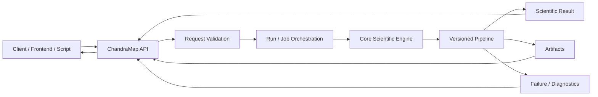
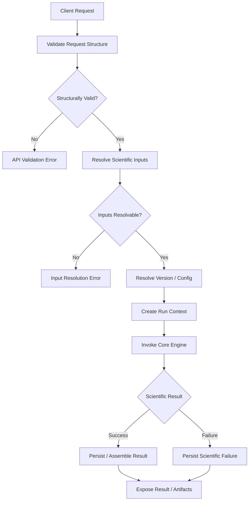
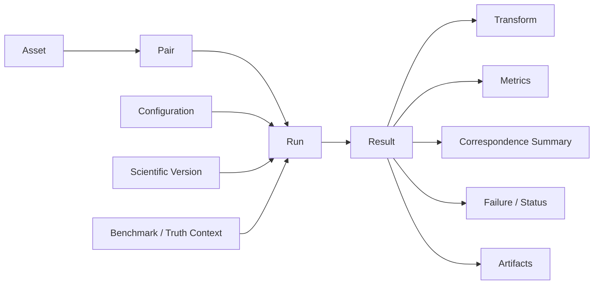

# ChandraMap API

> **Main API Documentation Entry Point**
> **Project:** ChandraMap
> **Domain:** Scientific lunar image correspondence and registration

ChandraMap may expose a programmatic API so frontends, scripts, notebooks, benchmark tooling, and other research clients can invoke scientific registration workflows without embedding scientific algorithms in every consumer.

The API is an **interface and orchestration boundary** around ChandraMap's scientific engine.

> **The API is an interface to ChandraMap's scientific engine; it must not become a second implementation of the scientific engine.**

Scientific algorithms remain owned by the core engine and versioned scientific pipelines. The API is responsible for accepting and validating client requests, resolving scientific inputs, selecting a requested scientific version/configuration, coordinating execution, exposing status, serializing scientific results, exposing artifacts, and representing failures faithfully.

> **Scientific behavior belongs in the core engine. HTTP, request parsing, serialization, job management, and client-facing status belong in the API/backend layer.**

ChandraMap results are richer than a Boolean success flag. A scientifically meaningful result may include correspondences, verified inliers, transformation parameters, coordinate-space information, registration artifacts, residual diagnostics, spatial coverage, independent check-point error where available, runtime, failure information, and provenance.

> **API contracts must preserve scientific meaning, including coordinate space, units, sensor identity, transform direction, and provenance.**

A transport-level success does not imply scientific success.

> **A successful HTTP response does not automatically mean a scientifically successful registration.**

For example, a request may be accepted and processed correctly while the underlying registration fails to establish valid geometric consensus. Such a run should remain a valid API result containing an explicit scientific failure—not be hidden as a generic server crash.

> **Failure is part of the scientific result and should be represented explicitly rather than hidden behind generic server errors.**

Image registration may also be computationally expensive.

> **Long-running scientific work should not force the API contract to pretend every operation is instantaneous.**

This README therefore describes the intended API boundary and scientific contract principles. It does **not** claim that any particular endpoint, framework, authentication mechanism, queue, database, storage system, or deployment topology currently exists unless established elsewhere in the repository.

---

## Relationship to Project Architecture

The intended separation is:

```text
Scientific Core Engine
        ↓
owns algorithms, geometry, evaluation, scientific semantics

Backend / API Layer
        ↓
owns request handling, orchestration, serialization, status, access

Frontend / Client
        ↓
consumes authoritative API results for presentation and interaction
```

Relevant architecture documentation includes:

- [`../architecture/system-overview.md`](../architecture/system-overview.md)
- [`../architecture/core-engine-architecture.md`](../architecture/core-engine-architecture.md)
- [`../architecture/backend-architecture.md`](../architecture/backend-architecture.md)
- [`../architecture/frontend-architecture.md`](../architecture/frontend-architecture.md)
- [`../architecture/module-map.md`](../architecture/module-map.md)
- [`../architecture/data-flow.md`](../architecture/data-flow.md)
- [`../architecture/output-flow.md`](../architecture/output-flow.md)
- [`../architecture/v1-pipeline.md`](../architecture/v1-pipeline.md)

The API must not duplicate SIFT, matching, RANSAC, transformation estimation, residual analysis, spatial-coverage logic, or other scientific computation inside routes/controllers/handlers.

---

## Relationship to Versioned Scientific Pipelines

ChandraMap versions define scientific behavior independently from the API transport contract.

Relevant version documentation includes:

- [`../versions/README.md`](../versions/README.md)
- [`../versions/v1/README.md`](../versions/v1/README.md)
- [`../versions/v1/specification.md`](../versions/v1/specification.md)
- [`../versions/v1/scope.md`](../versions/v1/scope.md)
- [`../versions/v1/requirements.md`](../versions/v1/requirements.md)
- [`../versions/v1/pipeline.md`](../versions/v1/pipeline.md)
- [`../versions/v1/inputs.md`](../versions/v1/inputs.md)
- [`../versions/v1/benchmark.md`](../versions/v1/benchmark.md)
- [`../versions/v1/exclusions.md`](../versions/v1/exclusions.md)

Where additional V1 files such as `outputs.md`, `acceptance-criteria.md`, or `limitations.md` exist, they should also remain authoritative for their respective contracts.

The API should invoke the selected scientific version and expose its outputs. It must not redefine version semantics.

### V1 Context

V1 is the classical known-overlap registration baseline:

```text
Known Source / Reference Pair
        ↓
Validation
        ↓
Sensor Routing
        ↓
Preprocessing
        ↓
Physical Scale Handling
        ↓
SIFT
        ↓
Descriptor Matching
        ↓
Filtering
        ↓
RANSAC
        ↓
Transform
        ↓
Optional Refinement
        ↓
Final Refit
        ↓
Registration
        ↓
Evaluation
        ↓
Scientific Result
```

This API README explains how such work may be exposed programmatically. It does not replace the V1 scientific documentation.

---

# 1. Overview

Conceptually, the ChandraMap API provides a machine-readable interface for clients to:

- describe or submit registration work;
- identify source/reference scientific assets;
- select a ChandraMap scientific version;
- select or reference scientific configuration;
- initiate execution;
- inspect execution state;
- retrieve scientific results;
- retrieve or reference larger artifacts;
- inspect scientific failures and diagnostics;
- preserve enough provenance to reproduce the run.

The API should expose scientific evidence faithfully rather than collapsing the result into:

```json
{
  "success": true
}
```

A registration result can be partially successful, scientifically failed, unevaluated, or complete with independent validation. Those distinctions should remain visible.

---

# 2. Design Goals

The API design should prioritize:

- stable scientific semantics;
- reproducibility;
- traceability;
- explicit scientific versioning;
- machine-readable results;
- clear transport-vs-scientific status separation;
- explicit failure representation;
- compatibility with long-running scientific work;
- frontend/core decoupling;
- framework independence where implementation is not established;
- testability;
- backward-compatible evolution where reasonable;
- extensibility toward V2, V3, and V4;
- security-conscious handling of untrusted input;
- clean separation between small metadata responses and large scientific artifacts.

> **The API should evolve around stable scientific contracts rather than forcing the scientific engine to conform to accidental early endpoint designs.**

---

# 3. Non-Goals

The API documentation does not require or imply:

- microservices;
- public SaaS operation;
- Kubernetes;
- multi-region deployment;
- an API gateway;
- OAuth;
- JWT;
- API keys;
- user accounts;
- billing;
- subscriptions;
- GraphQL;
- WebSockets;
- streaming infrastructure;
- public anonymous file uploads;
- distributed GPU workers;
- production SLO/SLA targets;
- global lunar retrieval in V1;
- cloud object storage;
- a particular database;
- a particular background queue;
- a particular backend framework.

These may become implementation choices later, but they are not scientific API requirements.

---

# 4. API Responsibilities

The API/backend layer may conceptually be responsible for:

- accepting client requests;
- parsing and structurally validating request data;
- resolving asset references;
- resolving pair references;
- resolving requested scientific version;
- resolving scientific configuration;
- creating request/run/job context;
- invoking the scientific core engine;
- representing long-running execution;
- exposing execution state;
- serializing scientific results;
- exposing artifact references;
- returning failure diagnostics;
- preserving identifiers and provenance;
- applying deployment-specific access controls where implemented;
- providing machine-readable contract boundaries.

---

# 5. API Non-Responsibilities

The API should not independently implement scientific methods such as:

- SIFT;
- local descriptor computation;
- descriptor matching;
- candidate filtering science;
- RANSAC mathematics;
- transform fitting;
- sub-pixel refinement;
- registration/warping mathematics;
- RMSE formulas;
- residual-vector computation;
- spatial-coverage algorithms;
- benchmark-success logic.

Those belong to the scientific core and evaluation layers.

> **If an algorithm would still be necessary when HTTP is removed entirely, it probably belongs outside the API layer.**

---

# 6. Where the API Sits in ChandraMap



The API orchestrates scientific execution.

It does not implement the algorithm represented by the versioned pipeline.

---

# 7. Potential API Consumers

Potential consumers include:

- ChandraMap frontend;
- CLI wrapper;
- research scripts;
- notebooks;
- benchmark tooling;
- automated experiments;
- external research clients.

This list describes possible consumers, not confirmed implementation status.

All consumers should ideally rely on the same scientific core contracts.

---

# 8. Request Lifecycle

A registration request conceptually progresses through:

```text
Request
   ↓
Request-Structure Validation
   ↓
Scientific Input Resolution
   ↓
Scientific Version Resolution
   ↓
Configuration Resolution
   ↓
Run Context Creation
   ↓
Core Engine Invocation
   ↓
Scientific Execution
   ↓
Result Assembly
   ↓
Artifact Registration
   ↓
Serialization / Retrieval
```

---

# 9. Request Lifecycle Flow



The scientific result may succeed or fail independently from the API request lifecycle.

---

# 10. Synchronous vs. Asynchronous Operations

Scientific registration may range from relatively small operations to long-running processing.

Two conceptual execution styles should therefore remain possible.

## Synchronous

Appropriate when:

- execution is short;
- result size is manageable;
- request timeouts are not problematic;
- operational deployment allows it.

Conceptually:

```text
Request
→ Execute
→ Return Result
```

## Asynchronous

Potentially more appropriate for expensive operations.

Conceptually:

```text
Request
→ Accept Work
→ Create Job / Run Reference
→ Process
→ Client Polls or Otherwise Retrieves State
→ Retrieve Result
```

This document does not claim that asynchronous execution currently exists.

It also does not prescribe:

- Celery;
- Redis;
- RabbitMQ;
- Kafka;
- RQ;
- BullMQ;
- another queue or worker framework.

---

# 11. Run and Job Concepts

Two concepts may be useful.

### Scientific Run

Represents one scientific execution.

A run may identify:

- scientific version;
- pair;
- source/reference assets;
- configuration;
- truth/benchmark context;
- result;
- artifacts;
- failure;
- provenance.

### Backend Job

Optionally represents backend execution/orchestration.

A job may track:

- queued state;
- active execution;
- retry state;
- worker state;
- completion.

A job and run may be associated, but they should not automatically be treated as the same conceptual object.

A backend job can finish successfully while the scientific run produces a valid failure result.

---

# 12. API Status vs. Scientific Status

This separation is one of the most important API contracts.

Three status layers may coexist:

| Status Layer      | Meaning                               | Example Concept                                                   |
| ----------------- | ------------------------------------- | ----------------------------------------------------------------- |
| HTTP / API        | Request, transport, or server outcome | Request accepted / malformed request                              |
| Job / Execution   | Backend processing lifecycle          | Waiting / active / completed                                      |
| Scientific Result | Registration outcome                  | Registration succeeded / geometry failed / evaluation unavailable |

The exact enum names are implementation-defined.

Conceptually, this combination must remain possible:

```text
API Request:
accepted

Backend Job:
completed

Scientific Result:
registration failed during geometric verification
```

> **HTTP/API success must never be interpreted automatically as scientific registration success.**

---

# 13. API Versioning

API versioning and scientific versioning solve different problems.

### API Contract Version

Controls how clients communicate with the service.

It may govern:

- request schema;
- response schema;
- serialization;
- field lifecycle;
- breaking client-contract changes.

### ChandraMap Scientific Version

Controls the scientific methodology.

Examples conceptually include:

- V1 classical baseline;
- V2 improved local pipeline;
- V3 retrieval-enabled pipeline;
- V4 advanced research pipeline.

> **API versioning must not silently change scientific semantics.**

A route or schema generation should not implicitly rewrite what ChandraMap V1 means.

---

# 14. API Version vs. Scientific Version

| Version Type                  | Purpose                               | Example Meaning                                  |
| ----------------------------- | ------------------------------------- | ------------------------------------------------ |
| API contract version          | Client compatibility                  | Request/response schema generation               |
| ChandraMap scientific version | Scientific methodology                | V1 classical baseline, later scientific versions |
| Benchmark version             | Frozen evaluation identity            | Pair/truth/metric configuration revision         |
| Result schema version         | Machine-readable result compatibility | Serialized-result evolution                      |

Do not assume that an API path containing a string such as `/v1/` necessarily represents **scientific ChandraMap V1**.

The two version namespaces should remain conceptually distinct.

---

# 15. Scientific Version Selection

If the API permits clients to request a ChandraMap scientific version, both the requested and resolved scientific methodology should remain traceable.

A result should not leave the client wondering whether it came from:

- V1;
- V2;
- V3;
- another experimental pipeline.

The exact request field used for version selection is implementation-defined.

---

# 16. Input Contract

For V1, see [`../versions/v1/inputs.md`](../versions/v1/inputs.md).

Scientific request concepts may include:

- source asset;
- reference asset;
- pair definition;
- sensor metadata;
- physical-scale metadata;
- coordinate metadata;
- configuration;
- benchmark context;
- truth/check-point references where applicable.

> **Scientific inputs should not be reduced to anonymous file bytes when their sensor identity, scale, coordinate context, and provenance matter to interpretation.**

---

# 17. Asset Reference vs. File Submission

Two broad API patterns may be supported eventually.

## Asset Reference

A client identifies an already known scientific asset.

Conceptually:

```text
Client
→ Asset ID
→ Server Resolves Scientific Asset
```

Advantages may include:

- stable scientific identity;
- reproducibility;
- reduced repeated upload;
- clearer provenance;
- separation of identity from filesystem location.

## File / Product Submission

A client provides data through the API.

Conceptually:

```text
Client
→ File / Product Data
→ Validate
→ Establish Scientific Identity
→ Process
```

Neither pattern is claimed to exist today.

---

# 18. Source and Reference Roles

The API must preserve scientific roles.

### Source

The observation/representation being aligned or transformed.

### Reference

The target image/region defining the destination/reference frame.

Do not reduce the contract to:

```text
image1
image2
```

if that destroys the scientific role distinction.

Transformation semantics normally depend on this ordering.

---

# 19. Conceptual Request Contract

> **Illustrative conceptual contract — not an implemented API schema.**

```yaml
request:
  scientific_version: v1

  pair:
    id: PLACEHOLDER_PAIR_ID

  source:
    asset_id: PLACEHOLDER_SOURCE_ASSET
    sensor: PLACEHOLDER_SENSOR

  reference:
    asset_id: PLACEHOLDER_REFERENCE_ASSET
    sensor: PLACEHOLDER_REFERENCE_SENSOR

  configuration:
    id: PLACEHOLDER_CONFIG_ID

  evaluation:
    truth_version: PLACEHOLDER_TRUTH_VERSION_OR_NULL
```

Field names, nesting, validation, and serialization remain implementation-defined until an authoritative machine-readable API contract exists.

---

# 20. File-Upload Caution

If file uploads are introduced, API design should consider:

- content validation;
- supported scientific representation;
- malformed-file handling;
- decompression/archive safety;
- filename sanitization;
- temporary-storage lifecycle;
- image dimensions;
- multi-band dimensionality;
- resource exhaustion;
- mission-data provenance;
- data licensing;
- asset identity after upload.

No numeric upload limits are defined here.

No production-security guarantee is implied.

---

# 21. Sensor-Aware Request Semantics

Scientific routing depends on sensor identity.

Relevant project instruments include:

### Chandrayaan-2

- OHRC;
- TMC-2;
- IIRS.

### LRO / LROC

- NAC;
- WAC.

The API layer should preserve explicit sensor context and pass it to the core engine.

It should not independently implement:

```text
if sensor == OHRC:
    do scientific preprocessing X
```

unless such logic is merely input validation/routing defined by core scientific contracts.

Scientific preprocessing decisions belong to the versioned pipeline.

---

# 22. IIRS API Semantics

IIRS is a hyperspectral / imaging-infrared instrument.

An API must not imply that an IIRS cube can be treated as an ordinary grayscale camera frame without a documented representation step.

Conceptually:

```text
IIRS Parent Product
        ↓
Documented Registration Representation
        ↓
2D Registration Input
        ↓
Scientific Pipeline
```

An API request may eventually reference:

- parent IIRS product;
- derived 2D representation;
- representation identity/configuration.

Parent→derived lineage should remain traceable.

The API must not silently choose:

- an arbitrary spectral band;
- the first channel;
- an undocumented projection.

---

# 23. Physical Scale Semantics

> **API image dimensions are not a substitute for physical scale metadata.**

Approximate project context includes:

| Sensor  | Approximate Context                       |
| ------- | ----------------------------------------- |
| OHRC    | ~0.25–0.32 m/pixel                        |
| TMC-2   | ~5 m/pixel                                |
| IIRS    | ~80 m/pixel                               |
| LRO NAC | Often ~0.5–2 m/pixel depending on product |

These are contextual values, not API defaults.

> **Actual product metadata wins.**

The backend must not hard-code nominal instrument values as exact product metadata merely to satisfy an API request.

---

# 24. Configuration Input

Scientific configuration is part of the experiment.

A client may conceptually identify:

- configuration ID;
- predefined pipeline profile;
- versioned benchmark configuration;
- explicitly resolved scientific settings.

The exact interface remains implementation-defined.

> **Reproducibility requires preserving the resolved scientific configuration actually used, not merely the filename or name of a default configuration.**

If server-side configuration overrides client settings, the final resolved values affecting science should remain traceable.

---

# 25. Output Contract

Where available, the V1 output contract belongs in:

`../versions/v1/outputs.md`

A scientific result should conceptually be capable of representing:

- run identity;
- scientific version;
- pair identity;
- source identity;
- reference identity;
- source/reference representations;
- candidate count;
- filtered candidate count;
- verified inlier count;
- inlier ratio;
- final transformation;
- coordinate spaces;
- transformation direction;
- registration state;
- residual metrics;
- spatial coverage;
- held-out check metrics where available;
- runtime;
- failure stage;
- diagnostics;
- artifact references;
- benchmark/truth/configuration provenance.

> **The API should expose enough scientific evidence to understand a registration result, not just a Boolean success flag.**

---

# 26. Conceptual Result Contract

> **Conceptual only — not a claim that this schema exists.**

```yaml
result:
  run:
    id: PLACEHOLDER_RUN_ID
    scientific_version: v1
    status: PLACEHOLDER_SCIENTIFIC_STATUS

  source:
    asset_id: PLACEHOLDER_SOURCE_ASSET

  reference:
    asset_id: PLACEHOLDER_REFERENCE_ASSET

  correspondence:
    candidate_count: PLACEHOLDER
    filtered_count: PLACEHOLDER
    inlier_count: PLACEHOLDER
    inlier_ratio: PLACEHOLDER

  geometry:
    model: PLACEHOLDER_MODEL
    direction: source_to_reference
    transform: PLACEHOLDER_TRANSFORM
    source_space: PLACEHOLDER_SOURCE_SPACE
    reference_space: PLACEHOLDER_REFERENCE_SPACE

  evaluation:
    coverage: PLACEHOLDER_OR_UNAVAILABLE
    check_rmse: PLACEHOLDER_OR_UNAVAILABLE
    units: PLACEHOLDER_UNITS
    coordinate_space: PLACEHOLDER_SPACE

  artifacts:
    registered_preview: PLACEHOLDER_REFERENCE
    correspondence_visualization: PLACEHOLDER_REFERENCE

  failure:
    stage: PLACEHOLDER_OR_NULL
    diagnostic: PLACEHOLDER_OR_NULL

  provenance:
    config_id: PLACEHOLDER
    benchmark_version: PLACEHOLDER
    truth_version: PLACEHOLDER
    code_revision: PLACEHOLDER
```

---

# 27. Transform Response Semantics

Where corresponding documentation exists, see:

`../algorithms/transforms.md`

A transformation returned by the API should conceptually identify:

- model type;
- direction;
- source coordinate space;
- reference coordinate space;
- transformation parameters;
- validity/status;
- representation context where necessary.

The preferred scientific interpretation is:

```text
source → reference
```

A bare matrix is incomplete without these semantics.

For example:

```yaml
transform:
  matrix: PLACEHOLDER_MATRIX
```

is ambiguous if the client does not know:

- whether it maps source→reference or reference→source;
- whether it operates on native, crop, or pyramid coordinates;
- whether the model is affine or homography.

---

# 28. Coordinate Spaces in API Responses

Coordinates exposed through the API may belong to different spaces, including:

- source-native pixels;
- source-prepared pixels;
- source crop/ROI pixels;
- IIRS-derived representation pixels;
- reference-native pixels;
- reference tile pixels;
- reference pyramid pixels;
- registered-output pixels;
- projected/map coordinates;
- lunar geographic coordinates where valid.

> **Coordinates exposed through the API are incomplete unless their coordinate space is known.**

A client should not be expected to infer coordinate semantics from context or field position alone.

---

# 29. X/Y and Row/Column Semantics

API schemas should avoid ambiguity between:

- `x, y` geometric coordinates;
- `row, column` array indexing.

Where coordinate data is exposed, the convention should be documented in the authoritative schema.

Do not silently transpose:

```text
(x, y)
```

and:

```text
(row, column)
```

between the scientific engine and serialization layer.

---

# 30. Pixel Units

A response such as:

```text
RMSE = 0.8 pixels
```

is scientifically incomplete unless the pixel space is identified.

One pixel in:

- OHRC;
- TMC-2;
- IIRS;
- native NAC;
- a downsampled NAC pyramid level;

has different meaning.

The API therefore needs to preserve coordinate-space context with pixel-based metrics.

---

# 31. Metric Response Semantics

Where present, see:

`../evaluation/metrics.md`

Every serialized scientific metric should conceptually retain:

- metric identity;
- value;
- availability;
- units;
- coordinate space;
- population;
- sample count where relevant;
- definition/version where relevant.

A metric value without its interpretation is insufficient scientific output.

---

# 32. Conceptual Metric Structure

> **Illustrative conceptual structure — not an implemented schema.**

```yaml
metric:
  name: PLACEHOLDER_METRIC
  value: PLACEHOLDER_OR_UNAVAILABLE
  units: PLACEHOLDER_UNITS
  coordinate_space: PLACEHOLDER_SPACE
  population: PLACEHOLDER_POPULATION
  count: PLACEHOLDER_N
  definition_version: PLACEHOLDER_VERSION
```

---

# 33. Candidate vs. Inlier Semantics

The API must preserve the scientific distinction between:

```text
candidate correspondence
```

and:

```text
geometrically verified inlier
```

Candidate correspondences are hypotheses generated through matching.

RANSAC inliers are correspondences consistent with the configured geometric model.

They are not equivalent.

> **Candidate match ≠ verified inlier ≠ independent ground truth.**

Where present, relevant documentation may include:

- `../algorithms/matching.md`
- `../algorithms/ransac.md`

---

# 34. Inlier Ratio Semantics

Conceptually:

$$
\text{inlier ratio}
=
\frac{N_{\text{verified inliers}}}
     {N_{\text{candidates used for geometric verification}}}
$$

The denominator definition matters.

The API must not serialize an inlier ratio as a field called simply:

```text
accuracy
```

unless a separate scientifically defined accuracy metric actually exists.

Inlier ratio is geometric-consensus evidence, not independent registration accuracy.

---

# 35. Fit Residual vs. Held-Out Error

Where present, see:

- `../algorithms/residual-analysis.md`
- `../evaluation/checkpoint-evaluation.md`

The API should distinguish:

### Fit Residual

Error measured on data supporting or fitting the transformation.

### Held-Out Check Error

Error measured on independent truth that did not influence the fitted transform.

These answer different scientific questions.

Do not collapse both into a generic:

```text
error
```

field whose meaning changes from run to run.

---

# 36. Missing Evaluation

If independent truth is unavailable, the API should preserve that state explicitly.

Conceptually:

```yaml
check_rmse: unavailable
```

is different from:

```yaml
check_rmse: 0
```

Zero is a valid measurement.

Unavailable means no valid measurement exists.

> **Missing metric ≠ zero.**

---

# 37. Spatial Coverage

Where present, see:

`../evaluation/spatial-coverage.md`

A coverage response should conceptually identify:

- point population;
- coverage method;
- valid/evaluation region;
- coordinate space;
- value;
- definition version where applicable.

Coverage is not registration accuracy.

A run may have:

- high coverage and poor error;
- low coverage and low fit residual;
- high inlier count and weak coverage.

These are different scientific properties.

---

# 38. Ground-Space Error

Ground-space error in metres is conditional.

It should be exposed only when the scientific/evaluation layer establishes a valid mapping to physical ground units.

The API must not invent metre-level error through:

```text
pixel RMSE × approximate nominal GSD
```

unless the core scientific contract explicitly validates that conversion.

> **The API must serialize scientific ground error, not manufacture it.**

---

# 39. Artifacts

Potential artifacts include:

- registered raster;
- registered preview;
- candidate-match visualization;
- filtered-match visualization;
- inlier/outlier visualization;
- residual plot;
- coverage visualization;
- point-level evaluation data;
- scientific result manifest.

Large artifacts should be conceptually separable from small machine-readable result metadata.

The API may expose references to artifacts instead of embedding all binary data directly.

No artifact URL format or storage implementation is defined here.

---

# 40. Artifact Metadata

An artifact record should conceptually retain enough information to identify:

- artifact role/type;
- run identity;
- content/media type where known;
- representation;
- scientific relationship to the result;
- coordinate context where relevant;
- provenance or storage reference.

An artifact name alone may not be sufficient.

---

# 41. Large Artifacts

Lunar rasters and detailed correspondence outputs may be large.

The API should not assume they belong inside every JSON response.

A conceptual separation is:

```text
Result Metadata
    ↓
small machine-readable scientific summary

Artifact Reference
    ↓
larger raster / visualization / detailed point data
```

This document does not prescribe:

- S3;
- MinIO;
- GCS;
- Azure Blob;
- local object storage;
- another storage mechanism.

---

# 42. Scientific Failure Contract

Where present, see:

`../evaluation/failure-cases.md`

A scientific failure may still have:

- a valid request;
- a run identity;
- valid source/reference assets;
- partial correspondence results;
- a last successful stage;
- an observed failure stage;
- diagnostics;
- configuration;
- provenance;
- artifacts.

For example:

```text
API request accepted
        ↓
inputs valid
        ↓
features extracted
        ↓
candidates generated
        ↓
RANSAC cannot establish valid geometry
        ↓
scientific failure result
```

This is not automatically a transport or backend failure.

---

# 43. API Error vs. Scientific Failure

| Condition                             |             API-Level Problem? |                Scientific Failure? |
| ------------------------------------- | -----------------------------: | ---------------------------------: |
| Malformed request structure           |                            Yes |       Scientific run may not start |
| Unknown required asset reference      | Yes / input-resolution problem | Scientific execution may not start |
| Unsupported input representation      |         Input/contract problem | Scientific execution may not start |
| RANSAC finds no valid model           |  No transport failure required |                                Yes |
| Final transformation invalid          |  No transport failure required |                                Yes |
| Independent truth unavailable         |                             No |              Evaluation limitation |
| Internal backend crash                |                            Yes |   Scientific run may be incomplete |
| Scientific run completes successfully |                             No |                                 No |

Exact HTTP status-code mapping remains implementation-defined.

---

# 44. Conceptual API Error Structure

> **Conceptual only — no error codes are defined here.**

```yaml
error:
  category: PLACEHOLDER_CATEGORY
  message: PLACEHOLDER_MESSAGE
  request_id: PLACEHOLDER_REQUEST_ID

  details:
    field: PLACEHOLDER_OR_NULL
    scientific_stage: PLACEHOLDER_OR_NULL
```

---

# 45. Conceptual Scientific Failure Record

> **Illustrative conceptual structure — not an implemented schema.**

```yaml
failure:
  run_id: PLACEHOLDER_RUN_ID
  scientific_status: PLACEHOLDER_STATUS

  observed_stage: PLACEHOLDER_STAGE
  last_successful_stage: PLACEHOLDER_STAGE

  diagnostic: PLACEHOLDER_DIAGNOSTIC

  partial_results:
    candidate_count: PLACEHOLDER_OR_UNAVAILABLE
    inlier_count: PLACEHOLDER_OR_UNAVAILABLE
```

The observed failure stage should not automatically be interpreted as the root cause.

---

# 46. HTTP Status-Code Guidance

HTTP status codes should represent:

- request semantics;
- transport semantics;
- access semantics;
- service/server semantics.

Scientific result fields should represent:

- registration success/failure;
- geometry validity;
- evaluation availability;
- benchmark interpretation.

Do not encode the scientific contract as:

```text
HTTP 200 = accurate registration
```

and do not assume:

```text
scientific failure = HTTP 500
```

Exact mappings should only be documented when actual API behavior exists.

---

# 47. Request ID, Run ID, and Job ID

These identifiers may represent different concerns.

### Request ID

Tracks one API interaction.

### Run ID

Tracks one scientific execution.

### Job ID

May track one backend execution/orchestration task if job processing exists.

Conceptually:

```text
Request
   ↓
Request ID

Scientific Execution
   ↓
Run ID

Backend Worker Task
   ↓
Job ID
```

They may be correlated.

They should not automatically be assumed identical.

---

# 48. Idempotency and Retries

Scientific jobs may be expensive.

Future API design may need to consider:

- accidental duplicate submission;
- client retries after network failures;
- run identity;
- safe retry semantics;
- duplicate-result reuse;
- deterministic request identity where appropriate.

This document does not claim existing idempotency support and does not define an idempotency-header scheme.

---

# 49. Retryable vs. Non-Retryable Conditions

Conceptually distinguish:

### Invalid Request

Usually requires client correction.

### Scientific Failure

Rerunning the same scientific inputs/configuration may reproduce the same failure.

### Transient System Failure

May potentially succeed when retried.

The backend should not endlessly retry a stable scientific failure merely to hide it.

> **A reproducible RANSAC failure is scientific evidence, not necessarily an infrastructure incident.**

---

# 50. Pagination

If resource-listing endpoints are later created, pagination may be useful for:

- runs;
- jobs;
- results;
- artifacts;
- datasets;
- benchmarks.

No pagination method, cursor design, page size, or query syntax is defined here.

---

# 51. Resource Filtering

Future APIs may allow resource filtering by concepts such as:

- run identity;
- scientific version;
- source sensor;
- reference sensor;
- pair;
- benchmark version;
- execution/scientific status.

This README does not claim such filters exist and does not define query parameters.

---

# 52. Authentication

Authentication requirements depend on deployment.

A local single-user research backend may have different needs from a public multi-user service.

Do not assume current use of:

- JWT;
- OAuth2;
- API keys;
- sessions;
- external identity providers.

If authentication is implemented later, its authoritative documentation should be linked from this README.

---

# 53. Authorization

Authorization may become necessary for:

- private scientific assets;
- restricted artifacts;
- benchmark administration;
- destructive operations;
- multi-user deployments.

No role names, permission model, or access-control hierarchy is defined here.

---

# 54. Security Boundary

Repository security guidance should be followed through:

[`../../SECURITY.md`](../../SECURITY.md)

Relevant API principles include:

- validate untrusted input;
- do not expose secrets in responses;
- do not commit credentials;
- prevent unsafe filesystem access;
- validate artifact references;
- avoid path traversal;
- avoid arbitrary server-side file reads;
- avoid exposing internal stack traces inappropriately;
- treat large uploads and expensive processing as resource risks;
- validate archive/decompression behavior where relevant.

These are principles, not claims that a specific deployment has been security-audited.

---

# 55. Secret Handling

API responses, run manifests, artifacts, and reproducibility metadata must not intentionally contain:

- passwords;
- API keys;
- bearer tokens;
- secret environment values;
- private credentials.

Reproducibility records should preserve non-secret scientific configuration.

> **Secrets are operational state, not scientific provenance.**

---

# 56. File-Path Security

A future API should not rely on arbitrary unrestricted client-provided server filesystem paths such as:

```text
/etc/...
```

or:

```text
../../...
```

as normal asset access.

Where architecture permits, prefer concepts such as:

- registered asset identity;
- controlled data roots;
- validated relative references;
- managed scientific manifests.

The exact mechanism remains implementation-defined.

---

# 57. Resource-Exhaustion Considerations

Scientific imagery may be large.

API design should consider:

- image dimensions;
- band count;
- file size;
- number of correspondences;
- preprocessing cost;
- memory consumption;
- runtime;
- concurrent processing;
- artifact generation volume.

This README intentionally defines no numeric limits.

---

# 58. Data Licensing and Redistribution

See:

`../data-licenses.md`

Serving mission data or derived artifacts through an API may have licensing or redistribution implications.

The API must not assume:

> public access = unrestricted redistribution.

Provider/source provenance should remain associated with externally sourced scientific data.

---

# 59. API and Provenance

Where present, see:

`../evaluation/reproducibility.md`

A formal result should remain traceable to:

- scientific version;
- source identity;
- reference identity;
- pair identity/version;
- source representation;
- reference representation;
- configuration;
- benchmark version;
- truth version;
- code revision;
- environment where relevant.

> **Reproducibility metadata should survive the API boundary.**

---

# 60. Conceptual Provenance Response

> **Illustrative conceptual structure — not an implemented schema.**

```yaml
provenance:
  scientific_version: v1
  benchmark_version: PLACEHOLDER
  pair_version: PLACEHOLDER
  source_asset_id: PLACEHOLDER
  reference_asset_id: PLACEHOLDER
  config_id: PLACEHOLDER
  truth_version: PLACEHOLDER
  code_revision: PLACEHOLDER
  environment: PLACEHOLDER_REFERENCE
```

---

# 61. API and Reproducibility

A client receiving a scientific result should ideally be able to answer:

- What source was processed?
- What reference was used?
- Which scientific version ran?
- Which configuration was used?
- Which truth/benchmark definition applied?
- Which result schema was used?
- Which code revision generated the result?

Untracked backend defaults should not erase scientifically important settings.

---

# 62. API and Benchmarking

See:

- [`../versions/v1/benchmark.md`](../versions/v1/benchmark.md)
- `../evaluation/benchmark-protocol.md`

Running a formal benchmark through the API should preserve the same scientific definition as invoking the core engine directly.

The API must not secretly alter:

- preprocessing;
- scale handling;
- matcher settings;
- filtering;
- RANSAC;
- transform model;
- truth;
- success criteria.

> **Running the same scientific configuration through the API should not intentionally change the scientific method compared with invoking the core engine directly.**

---

# 63. API and Frontend

See:

[`../architecture/frontend-architecture.md`](../architecture/frontend-architecture.md)

The frontend may use the API to:

- submit registration work;
- inspect run state;
- display candidate/verified correspondences;
- display registered previews;
- display metrics;
- display provenance;
- display scientific failure information.

The frontend should not independently become the authoritative implementation of:

- RMSE;
- coverage;
- inlier ratio;
- transform interpretation;
- success criteria.

> **The API should expose scientific outputs; the frontend should not independently reconstruct or redefine them.**

---

# 64. API and CLI

If a command-line interface exists or is added later, the CLI and API should ideally invoke the same scientific core.

Avoid this architecture:

```text
Web API
→ Scientific Pipeline A

CLI
→ Scientific Pipeline B
```

when both claim to represent the same ChandraMap version.

Transport should differ.

Science should remain consistent.

---

# 65. API and Notebooks

Notebooks may:

- invoke the core engine directly;
- invoke the API.

Formal scientific conclusions should not depend on hidden notebook state.

Notebook convenience must not bypass provenance, configuration, or version identity.

---

# 66. API and V1

V1 API exposure should primarily support:

> known-pair local registration.

The client should not be forced to perform or request global retrieval before invoking V1 registration when the reference pair is already known.

---

# 67. API and Later Scientific Versions

Future versions may require additional API concepts.

### V2

May add stronger local-registration capabilities.

### V3

May introduce retrieval-related concepts such as:

- query asset;
- candidate reference regions;
- retrieval scores;
- Top-K candidates.

### V4

May add advanced multimodal, uncertainty, terrain, or multi-mission concepts.

Actual API changes must follow the corresponding scientific specifications.

This README does not define future endpoints.

---

# 68. Retrieval API Is Not Core V1

If a later version introduces:

- global descriptors;
- FAISS;
- Top-K reference retrieval;
- broad-region search;

those capabilities should receive their own API semantics.

They should not alter the meaning of V1 registration metrics.

---

# 69. Recall@K vs. Registration Metrics

Retrieval and registration answer different questions.

### Retrieval

Possible metrics include:

- Recall@K;
- ranking position;
- candidate-region retrieval success.

### Registration

Possible evidence includes:

- correspondences;
- verified inliers;
- transformation;
- spatial coverage;
- held-out RMSE.

Do not combine them into one generic:

```text
accuracy
```

or:

```text
confidence
```

value.

---

# 70. Conceptual API Resource Model

Possible domain-resource concepts include:

| Resource Concept | Purpose                                                   |
| ---------------- | --------------------------------------------------------- |
| Asset            | Traceable source/reference data product or representation |
| Pair             | Defined source/reference relationship                     |
| Configuration    | Scientific pipeline settings                              |
| Run              | One scientific execution                                  |
| Job              | Optional backend execution/orchestration state            |
| Result           | Scientific outcome                                        |
| Artifact         | Larger generated output                                   |
| Benchmark        | Frozen evaluation definition                              |

These are conceptual resources.

They do not imply that corresponding endpoints currently exist.

---

# 71. Conceptual Domain Model



This diagram describes scientific/domain relationships, not database tables or API routes.

---

# 72. Validation Layers

Validation should be separated by responsibility.

## Transport / Schema Validation

Owned primarily by the API layer.

Examples:

- request structure is valid;
- required API fields are present;
- primitive data types can be parsed.

## Asset / Input Resolution

Owned by API/backend/data-contract layers.

Examples:

- referenced asset exists;
- pair can be resolved;
- source/reference roles are present.

## Scientific Input Validation

Owned by scientific/data contracts.

Examples:

- sensor representation is supported;
- required scale context exists;
- mask aligns with raster;
- coordinate mappings are valid.

## Scientific Processing Validation

Owned by the core engine.

Examples:

- sufficient feature support exists;
- RANSAC finds valid consensus;
- transformation is non-degenerate.

## Benchmark Evaluation

Owned by the evaluation system.

Examples:

- success criteria;
- held-out metrics;
- benchmark-specific interpretation.

---

# 73. Validation Ownership Table

| Validation Layer         | Owner                  | Example                                 |
| ------------------------ | ---------------------- | --------------------------------------- |
| Request structure        | API                    | Missing required request concept        |
| Asset resolution         | API/backend/data layer | Unknown asset ID                        |
| Sensor/metadata validity | Core/data contracts    | Missing required physical-scale context |
| Geometric validity       | Core engine            | Degenerate transformation               |
| Benchmark success        | Evaluation layer       | Frozen criteria not satisfied           |

The API should not appropriate scientific validation responsibilities simply because data arrives through HTTP.

---

# 74. API Must Not Invent Science

If the core engine reports:

```text
check RMSE unavailable
```

the API must not manufacture a substitute.

If the core engine reports:

```text
registration failed
```

the API must not mark it scientifically successful merely because a visualization artifact exists.

If the core engine reports coordinates in:

```text
reference_pyramid_level_N
```

the API must not relabel them:

```text
native_reference
```

for convenience.

Serialization must preserve meaning.

---

# 75. API Error Taxonomy

Conceptual error categories may include:

- request validation;
- input resolution;
- unsupported input;
- configuration;
- scientific processing;
- evaluation limitation;
- artifact access;
- internal service failure.

These are conceptual categories.

No concrete error-code identifiers are defined here.

---

# 76. Response Stability

API evolution should avoid silently changing scientific semantics such as:

- coordinate spaces;
- units;
- transform direction;
- status meaning;
- metric definition;
- unavailable/null interpretation;
- candidate-vs-inlier meaning.

A change may be syntactically small while scientifically breaking.

Such changes may require explicit API/result-schema versioning.

---

# 77. Backward Compatibility

Where practical, API evolution should favor:

- stable field semantics;
- additive optional fields;
- explicit versioning for breaking changes;
- deprecation documentation;
- preservation of historical V1 meaning.

This README does not guarantee formal backward compatibility.

Actual compatibility policy should be documented when the implementation matures.

---

# 78. Null, Unavailable, Not Evaluated, and Zero

These concepts are distinct.

| State          | Meaning                                                  |
| -------------- | -------------------------------------------------------- |
| `0`            | Valid numerical measurement equal to zero                |
| Null/missing   | Value absent according to schema semantics               |
| Unavailable    | Could not be produced under available scientific context |
| Not evaluated  | Evaluation step was intentionally not performed          |
| Not applicable | Metric does not apply to this result                     |

Do not encode all of these as the same value.

---

# 79. Numerical Precision and Serialization

Transforms and coordinates may contain scientifically significant floating-point values.

The API should preserve enough numeric precision for downstream scientific interpretation.

Do not round authoritative values solely to improve visual appearance.

Human-readable formatting can occur in clients without changing the underlying serialized result.

No universal decimal-place requirement is defined here.

---

# 80. Timestamps

If timestamps are exposed, they should use an unambiguous standard representation.

Timestamps may describe:

- request creation;
- run start;
- run completion;
- artifact creation.

Timestamp fields do not replace:

- code revision;
- scientific version;
- benchmark version;
- asset identity.

---

# 81. Artifact Retention

Artifact retention is deployment-dependent.

The API should not promise permanent artifact availability unless repository/deployment policy actually establishes it.

Formal scientific benchmark artifacts should be preserved according to reproducibility requirements where possible.

---

# 82. Logging and Observability

Backend logging may include:

- request identity;
- run/job identity;
- stage transitions;
- timing;
- system errors;
- scientific failure stage.

Logs must not intentionally expose secrets.

Logs also must not become the only source of scientific output.

Authoritative scientific result data should exist independently of transient log messages.

---

# 83. Health and Readiness

If operational health/readiness endpoints are later introduced, they should report service operation—not scientific accuracy.

For example:

```text
service can accept work
```

does not imply:

```text
all lunar registration pairs will succeed
```

No specific health endpoint is defined here.

---

# 84. Rate Limiting

Rate limiting may be necessary for public or shared deployments.

This README does not define:

- request quotas;
- rate-limit headers;
- burst limits;
- concurrency limits.

Do not claim rate limiting exists without implementation evidence.

---

# 85. Browser Access and CORS

If a browser frontend communicates with the API, CORS configuration may become relevant.

Allowed origins and security policy belong to implementation/deployment configuration.

No origin list or CORS policy is defined here.

---

# 86. Data Privacy

ChandraMap primarily handles scientific lunar imagery, but API deployments may also process:

- private research assets;
- unpublished derived products;
- client metadata;
- local dataset references.

Deployment-specific privacy requirements should be documented separately.

This README does not promise any specific privacy guarantee.

---

# 87. Endpoint Documentation Organization

If endpoint-specific API documentation is later added, keep it under `docs/api/` and link it from this README.

Useful documentation areas may eventually include:

- authentication;
- registration;
- runs/jobs;
- assets;
- results;
- artifacts;
- benchmarks;
- errors;
- schemas;
- versioning;
- examples;
- OpenAPI.

These are recommended documentation categories, not claims that files or endpoints already exist.

---

# 88. OpenAPI and Machine-Readable Schemas

If ChandraMap later maintains authoritative:

- OpenAPI;
- JSON Schema;
- Pydantic models;
- TypeScript types;
- another machine-readable contract;

this README should link to that source rather than duplicating large low-level schemas manually.

> **API documentation should describe contracts, while generated or machine-readable schemas should remain the authoritative low-level serialization definition when such schemas exist.**

Do not invent an OpenAPI path until the repository establishes one.

---

# 89. Summary vs. Detailed Results

A future API may distinguish between result detail levels.

### Summary Result

Potentially includes:

- scientific status;
- counts;
- transform summary;
- headline metrics;
- failure stage;
- artifact references.

### Detailed Result

May additionally include:

- point-level candidate correspondences;
- inliers;
- residuals;
- diagnostic metadata;
- detailed evaluation;
- extended artifacts.

This distinction is conceptual only.

---

# 90. Large Correspondence Sets

Point-level match data may become large.

The API may eventually choose to:

- return only summary counts by default;
- expose point-level details separately;
- paginate;
- expose detailed data as an artifact;
- provide selectable detail modes.

No particular mechanism is prescribed here.

---

# 91. API and Benchmark Runs

Benchmark automation may:

- invoke the API;
- invoke the scientific core directly.

Either execution path should preserve:

- the same pair definitions;
- the same frozen configuration;
- the same scientific version;
- the same truth;
- the same metric definitions;
- the same success criteria.

API orchestration must not alter benchmark science.

---

# 92. API and Failure Reproducibility

A failed run should still preserve enough context to reproduce and investigate it.

At minimum conceptually:

```text
Pair
+
Scientific Version
+
Configuration
+
Input Identities
+
Failure Stage
+
Available Partial Evidence
+
Code / Benchmark Provenance
```

should remain traceable.

Failure is evidence.

It should not disappear when the API request completes.

---

# 93. API and Version Comparison

If the API eventually supports multiple scientific versions, every result should make the producing scientific version clear.

Comparing V1 to V2 is invalid if clients cannot determine which pipeline generated each result.

Version identity should therefore remain part of provenance.

---

# 94. Result-Schema Evolution

Later scientific versions may require additional result fields.

For example, a retrieval-enabled future version may add:

- candidate reference regions;
- retrieval ranks;
- retrieval scores.

Such additions should not redefine established V1 fields such as:

- transform direction;
- check RMSE semantics;
- coordinate spaces;
- inlier ratio meaning.

Prefer extensible contracts over semantic reuse.

---

# 95. Retrieval Fields

If retrieval is added later, conceptually keep it separate:

```yaml
retrieval:
  candidates: PLACEHOLDER
  ranking: PLACEHOLDER
  retrieval_metrics: PLACEHOLDER
```

from:

```yaml
registration:
  correspondences: PLACEHOLDER
  inliers: PLACEHOLDER
  transform: PLACEHOLDER
  residuals: PLACEHOLDER
  coverage: PLACEHOLDER
```

Do not collapse both stages into one undifferentiated confidence value.

---

# 96. API and Uncertainty

Later versions may expose uncertainty estimates.

V1 must not invent calibrated probability semantics for:

- matcher scores;
- RANSAC inlier ratio;
- spatial coverage;
- descriptor similarity.

These values are not automatically probability estimates.

---

# 97. End-to-End API Flow

```text
Client
   ↓
API Request
   ↓
Validate Structure
   ↓
Resolve Scientific Assets
   ↓
Resolve Scientific Version
   ↓
Resolve Configuration
   ↓
Create Run Context
   ↓
Core Scientific Engine
   ↓
Versioned Pipeline
   ↓
Scientific Result Manifest
   +
Artifact References
   ↓
API Serialization
   ↓
Client
```

The scientific engine remains authoritative for scientific outcomes.

---

# 98. API Testing Strategy

API testing should protect both software behavior and scientific semantics.

## Contract Tests

Potential coverage:

- required concepts;
- serialization;
- schema-version behavior;
- unavailable/null semantics;
- scientific-version fields.

## Request Validation Tests

Potential coverage:

- malformed request;
- missing required reference;
- unsupported input;
- invalid pair relationship.

## Integration Tests

Potential coverage:

- API → core engine;
- core result → API serialization;
- scientific failure → valid API result;
- artifact reference generation.

## Scientific Contract Tests

Potential coverage:

- source/reference direction preserved;
- transform direction preserved;
- coordinate spaces preserved;
- metric units preserved;
- candidate/inlier distinction preserved;
- fit/check metrics preserved;
- provenance preserved.

## Failure Tests

Potential coverage:

- scientific failure does not become an unexplained server crash;
- internal backend crash does not become scientific failure;
- unavailable evaluation is not encoded as zero.

---

# 99. Conceptual API Test Matrix

| Test Case                           | API Outcome                           | Scientific Outcome                                |
| ----------------------------------- | ------------------------------------- | ------------------------------------------------- |
| Malformed request                   | Validation failure                    | Not started                                       |
| Unknown asset                       | Input-resolution failure              | Not started                                       |
| Valid pair, successful registration | Valid result serialization            | Success                                           |
| Valid pair, RANSAC failure          | Valid scientific-result serialization | Scientific failure                                |
| Valid pair, no check truth          | Valid result serialization            | Registration result + evaluation unavailable      |
| Internal backend exception          | Service/internal failure              | Incomplete or unknown unless previously persisted |

Exact HTTP status codes are intentionally not specified.

---

# 100. Scientific Contract Regression Tests

Regression tests should prevent accidental API corruption of scientific semantics.

High-priority invariants include:

- source remains source;
- reference remains reference;
- transform direction remains explicit;
- source/reference coordinate spaces remain unchanged;
- metric units remain attached;
- check RMSE cannot silently become fit RMSE;
- missing metrics remain unavailable rather than zero;
- candidate count cannot become inlier count;
- benchmark version remains preserved;
- scientific version remains preserved;
- transform model identity remains preserved.

These are important even when the underlying scientific engine itself has not changed.

---

# 101. Documentation Examples

Documentation examples should use:

- `PLACEHOLDER_*` values;
- real published test fixtures where available;
- clearly marked conceptual structures.

Do not include fabricated:

- product IDs;
- pair IDs presented as real;
- RMSE measurements;
- runtime measurements;
- success rates;
- secrets;
- production domains.

---

# 102. Curl and Code Examples

Concrete executable examples should be added only after the repository establishes:

- real endpoint paths;
- actual methods;
- request schema;
- base URL configuration;
- authentication requirements where any.

Until then, invented `curl` examples create false documentation.

---

# 103. Base URL

No API base URL, localhost port, deployment domain, or public API URL is defined by this README.

Once implementation documentation establishes those values, link to the authoritative configuration/setup documentation.

---

# 104. Implementation Status

This document defines the intended API role, scientific contract principles, and documentation boundary.

Unless verified from repository implementation, statements in this README should be interpreted as:

- intended responsibilities;
- conceptual contracts;
- recommended semantics;
- future-compatible design guidance;
- implementation-defined behavior where noted.

It does not claim that:

- a public API is deployed;
- all conceptual resources exist;
- any specific endpoint is implemented;
- asynchronous workers exist;
- artifact serving exists;
- authentication exists;
- multiple scientific versions are exposed through one service.

Implementation status should be determined from repository code, release notes, changelog, and version-specific documentation.

---

# 105. API Maturity

This README does not assign:

- alpha;
- beta;
- stable;
- production-ready;

maturity labels.

Maturity should only be stated when established by actual release/version policy.

---

# 106. Security Caution

Do not describe ChandraMap's API as:

- secure;
- hardened;
- production-secure;
- penetration-tested;

without corresponding evidence.

This document defines security-aware design principles, not an audit result.

---

# 107. Performance Caution

Image registration can be computationally expensive.

This README does not promise:

- low latency;
- real-time processing;
- high throughput;
- fixed concurrency;
- specific scaling behavior.

Such claims require implementation benchmarks and deployment context.

---

# 108. API Response-Size Caution

Scientific responses may contain:

- many correspondences;
- dense diagnostics;
- residual arrays;
- large artifact metadata.

Future implementation may require:

- summary/detail modes;
- separate artifact resources;
- pagination;
- streaming or chunking where justified.

No mechanism is prescribed prematurely.

---

# 109. Framework Neutrality

This README intentionally does not assume:

- FastAPI;
- Flask;
- Django;
- Express;
- NestJS;
- Go;
- Rust;
- another web framework.

Framework-specific behavior should be documented only after confirmed in the repository.

The scientific API contract should remain understandable independently of framework choice.

---

# 110. Database Neutrality

This README does not assume:

- PostgreSQL;
- PostGIS;
- SQLite;
- MongoDB;
- Redis;
- another database.

If the API can operate without persistent database state, do not introduce a database merely because APIs often use one.

Persistence choices belong to implementation architecture.

---

# 111. Background-Worker Neutrality

This documentation does not assume:

- Celery;
- RQ;
- BullMQ;
- RabbitMQ;
- Kafka;
- another queue/worker.

The requirement is only that long-running execution can be represented correctly if the implementation needs it.

---

# 112. Object-Storage Neutrality

This README does not assume:

- S3;
- Google Cloud Storage;
- Azure Blob;
- MinIO;
- another artifact store.

Use the conceptual term **artifact reference** until storage architecture is established.

---

# 113. API Documentation Navigation

This README should remain the main entry point for API documentation.

If endpoint-specific files are introduced later, consider organizing them under `docs/api/` around topics such as:

- API overview;
- scientific versioning;
- assets;
- registration;
- runs/jobs;
- results;
- artifacts;
- benchmarks;
- errors;
- authentication;
- schemas;
- examples;
- OpenAPI.

Only link those files once they actually exist.

---

# 114. Related Documentation

## Project Documentation

Relevant project-level documents include:

- [`../project/goals.md`](../project/goals.md)
- [`../project/non-goals.md`](../project/non-goals.md)
- [`../project/v1-scope.md`](../project/v1-scope.md)
- [`../project/terminology.md`](../project/terminology.md)
- [`../project/assumptions.md`](../project/assumptions.md)
- [`../project/limitations.md`](../project/limitations.md)

These define project purpose, terminology, assumptions, and scope independently of API transport.

## Architecture Documentation

The most relevant architecture documents are:

- [`../architecture/system-overview.md`](../architecture/system-overview.md)
- [`../architecture/core-engine-architecture.md`](../architecture/core-engine-architecture.md)
- [`../architecture/backend-architecture.md`](../architecture/backend-architecture.md)
- [`../architecture/frontend-architecture.md`](../architecture/frontend-architecture.md)
- [`../architecture/module-map.md`](../architecture/module-map.md)
- [`../architecture/data-flow.md`](../architecture/data-flow.md)
- [`../architecture/output-flow.md`](../architecture/output-flow.md)
- [`../architecture/v1-pipeline.md`](../architecture/v1-pipeline.md)

`core-engine-architecture.md` defines where scientific behavior belongs.

`backend-architecture.md` defines the backend/API layer.

`frontend-architecture.md` defines how presentation should consume authoritative outputs.

## Version Documentation

Relevant version documentation includes:

- [`../versions/README.md`](../versions/README.md)
- [`../versions/v1/README.md`](../versions/v1/README.md)
- [`../versions/v1/specification.md`](../versions/v1/specification.md)
- [`../versions/v1/scope.md`](../versions/v1/scope.md)
- [`../versions/v1/requirements.md`](../versions/v1/requirements.md)
- [`../versions/v1/pipeline.md`](../versions/v1/pipeline.md)
- [`../versions/v1/inputs.md`](../versions/v1/inputs.md)
- [`../versions/v1/benchmark.md`](../versions/v1/benchmark.md)
- [`../versions/v1/exclusions.md`](../versions/v1/exclusions.md)

Where files such as `outputs.md`, `acceptance-criteria.md`, or `limitations.md` exist, they should be linked when confirmed and used as authoritative sources for their contracts.

## Sensor Documentation

Where present, sensor-specific documentation may include:

- [`../sensors/overview.md`](../sensors/overview.md)
- `../sensors/ohrc.md`
- `../sensors/tmc2.md`
- `../sensors/iirs.md`
- `../sensors/lro-nac.md`
- `../sensors/lro-wac.md`

Only confirmed files should be converted into active links.

## Dataset Documentation

Relevant project-wide dataset areas may include:

- `../datasets/README.md`
- `../datasets/chandrayaan-2.md`
- `../datasets/lro.md`
- `../datasets/metadata.md`
- `../datasets/data-format.md`
- `../datasets/dataset-structure.md`
- `../datasets/dataset-preparation.md`
- `../datasets/pair-definition.md`
- `../datasets/ground-truth-preparation.md`

These documents govern scientific data meaning independently from API transport.

## Algorithm Documentation

Where corresponding files exist:

- `../algorithms/overview.md`
- `../algorithms/sensor-routing.md`
- `../algorithms/preprocessing.md`
- `../algorithms/illumination-handling.md`
- `../algorithms/scale-pyramid.md`
- `../algorithms/sift.md`
- `../algorithms/matching.md`
- `../algorithms/match-filtering.md`
- `../algorithms/ransac.md`
- `../algorithms/transforms.md`
- `../algorithms/residual-analysis.md`
- `../algorithms/subpixel-refinement.md`
- `../algorithms/registration.md`

These should only become active links once their existence is confirmed.

## Evaluation Documentation

Where present:

- `../evaluation/README.md`
- `../evaluation/benchmark-protocol.md`
- `../evaluation/benchmark-categories.md`
- `../evaluation/metrics.md`
- `../evaluation/ground-truth.md`
- `../evaluation/control-points.md`
- `../evaluation/checkpoint-evaluation.md`
- `../evaluation/spatial-coverage.md`
- `../evaluation/stress-tests.md`
- `../evaluation/success-criteria.md`
- `../evaluation/failure-cases.md`
- `../evaluation/reproducibility.md`

Evaluation semantics must remain authoritative when exposed through API responses.

## Data Licenses

Where present:

`../data-licenses.md`

API distribution of source or derived scientific data must remain compatible with provider licensing and redistribution constraints.

## Root Documentation

From `docs/api/README.md`, repository-root documents are two levels above.

Where present:

- [`../../README.md`](../../README.md)
- [`../../ROADMAP.md`](../../ROADMAP.md)
- [`../../CHANGELOG.md`](../../CHANGELOG.md)
- [`../../CONTRIBUTING.md`](../../CONTRIBUTING.md)
- [`../../SECURITY.md`](../../SECURITY.md)
- [`../../CITATION.cff`](../../CITATION.cff)

---

# 115. API Documentation Quality Checklist

## Scientific Semantics

- [ ] API/core-engine boundary is explicit
- [ ] API does not redefine scientific algorithms
- [ ] ChandraMap scientific version is preserved
- [ ] Source/reference roles are explicit
- [ ] Sensor identity is preserved
- [ ] Transform direction is explicit
- [ ] Coordinate spaces are preserved
- [ ] Metric units are preserved
- [ ] Candidate/inlier distinction is preserved
- [ ] Fit/check error distinction is preserved
- [ ] Missing metrics are not encoded as zero

## Requests

- [ ] Request contracts are documented
- [ ] Scientific asset identity is separate from filename/path
- [ ] Configuration identity is preserved
- [ ] IIRS representation semantics are documented
- [ ] Invalid requests can be distinguished from scientific failures
- [ ] Scientific version selection is traceable

## Results

- [ ] Run identity is available
- [ ] Scientific status is available
- [ ] Final transform can be represented
- [ ] Transform direction can be represented
- [ ] Metrics retain scientific context
- [ ] Artifacts remain linked to runs
- [ ] Failure stage can be represented
- [ ] Provenance can be represented

## Versioning

- [ ] API contract version is distinguished from ChandraMap version
- [ ] Benchmark version is distinguished from API version
- [ ] Result schema version can evolve independently where needed
- [ ] Breaking semantic changes require explicit handling
- [ ] Historical V1 result meaning remains stable

## Security

- [ ] Secrets are excluded from responses
- [ ] Untrusted file/path inputs are validated
- [ ] Artifact access is controlled appropriately where needed
- [ ] Arbitrary filesystem access is avoided
- [ ] Security claims are not overstated

## Testing

- [ ] Contract tests are defined
- [ ] API→core integration is tested
- [ ] Scientific failures serialize correctly
- [ ] Internal API errors remain distinct from scientific failures
- [ ] Coordinate/unit/status semantics have regression tests
- [ ] Null/unavailable/zero semantics are tested

## Documentation

- [ ] README links to architecture documentation
- [ ] README links to scientific version documentation
- [ ] README links to input/output contracts where present
- [ ] README links to evaluation documentation
- [ ] Concrete endpoint examples are added only when authoritative
- [ ] No imaginary endpoints are documented
- [ ] No imaginary framework/database/queue is documented

---

# 116. API Anti-Patterns

Do **not**:

- duplicate SIFT logic inside API handlers;
- duplicate RANSAC mathematics inside route/controller code;
- calculate authoritative scientific metrics in frontend presentation code;
- return only `success: true`;
- use HTTP success as scientific success;
- convert every scientific failure into a generic server error;
- hide scientific failure-stage information;
- return a transform matrix without direction;
- return coordinates without coordinate spaces;
- return RMSE without units and population;
- encode unavailable metrics as zero;
- call inlier ratio "accuracy";
- call candidate correspondences verified matches;
- call RANSAC inliers ground truth;
- invent metre-level accuracy in the API layer;
- infer sensor solely from upload filename;
- silently choose an IIRS band;
- silently flatten hyperspectral data;
- expose arbitrary filesystem paths;
- allow path traversal;
- store secrets in result manifests;
- invent endpoint paths in documentation;
- invent authentication mechanisms;
- invent databases;
- invent queues/workers;
- invent object-storage providers;
- couple scientific results to one frontend implementation;
- make V1 depend on global retrieval;
- merge retrieval and registration metrics;
- silently change V1 response semantics when later scientific versions appear;
- embed huge lunar rasters in every small result response by default;
- rely on logs as the only scientific result store;
- claim production readiness without evidence.

---

# 117. Claims to Avoid

Do not claim without repository evidence:

- "ChandraMap has a production-ready REST API."
- "The API is secure."
- "The API supports unlimited uploads."
- "The API runs in real time."
- "The API is highly scalable."
- "The API supports every Chandrayaan-2 product."
- "The API supports every LRO product."
- "The API supports V1 through V4."
- "The API uses FastAPI."
- "The API uses Flask."
- "The API uses PostgreSQL."
- "The API uses Redis."
- "The API uses a distributed worker queue."
- "The API is asynchronous."
- "The API guarantees deterministic results."
- "The API returns sub-metre accuracy."
- "The API has stable public endpoints."
- "The API guarantees backward compatibility."
- "The API is publicly deployed."

Implementation evidence should precede implementation claims.

---

# 118. API Limitations

## Implementation May Evolve

The backend/API layer may change as the project develops.

Concrete endpoints should not be considered established until implemented and documented.

## Framework Is Implementation-Defined

This document intentionally remains framework-neutral.

## Long-Running Processing

Scientific registration may require an asynchronous job abstraction in some deployments.

The specific orchestration mechanism is not defined here.

## Large Artifacts

Large images and detailed scientific artifacts may require storage or retrieval mechanisms separate from ordinary API response bodies.

## Scientific Limitations Remain

An API does not remove underlying scientific limitations related to:

- feature scarcity;
- scale differences;
- illumination changes;
- modality differences;
- geometric degeneracy;
- limited ground truth.

## V1 Remains Known-Overlap

Global retrieval is outside the V1 scientific baseline.

## Independent Truth May Be Missing

Not every registration run may have valid held-out check truth.

The API must report this honestly.

## Geolocation Is Conditional

Ground-space or absolute lunar coordinates require valid geospatial context.

## Security Depends on Deployment

Security posture depends on the actual implementation, environment, access model, and deployment architecture.

## Performance Depends on Context

Runtime depends on:

- image size;
- sensor representation;
- scientific configuration;
- hardware;
- cache state;
- implementation.

---

# 119. API Design Decision Questions

Before adding an API feature, ask:

1. Does this belong in the API layer or scientific core?
2. Does it change scientific behavior?
3. Is the scientific version explicit?
4. Does it preserve source/reference roles?
5. Does it preserve sensor identity?
6. Does it preserve coordinate spaces?
7. Does it preserve metric units?
8. Does it preserve transform direction?
9. Is scientific failure represented independently from transport failure?
10. Does the change preserve provenance?
11. Is the response likely to become unnecessarily large?
12. Should some output be an artifact instead?
13. Is a new resource/endpoint actually necessary?
14. Is the feature V1-specific or part of a later version?
15. Does it require an API breaking change?
16. Can the same science still be tested without HTTP?
17. Does the feature introduce undocumented server defaults?
18. Does it duplicate evaluation logic?
19. Does it silently change benchmark behavior?
20. Does the change require result-schema versioning?

---

# 120. API Evolution Principle

> **The API should evolve around stable scientific contracts rather than forcing the scientific engine to conform to accidental early endpoint designs.**

The transport layer may change over time.

Scientific semantics should remain explicit and historically interpretable.

Later versions may add new fields and resources, but they should not silently redefine what existing V1 results mean.

---

# 121. API Summary

Conceptually, the ChandraMap API should provide:

```text
Client Request
        +
Validated Scientific Input References
        +
Explicit Scientific Version
        +
Traceable Configuration
        ↓
Core Scientific Engine
        ↓
Scientific Run
        ↓
Transform
+
Correspondence Evidence
+
Metrics
+
Artifacts
+
Failure / Status
+
Provenance
        ↓
Machine-Readable API Result
```

The governing principles are:

1. **The API is an interface layer, not the scientific engine.**
2. **Scientific logic remains in the versioned core pipeline.**
3. **HTTP success is different from scientific success.**
4. **API version and ChandraMap scientific version are different concepts.**
5. **Scientific version identity must survive into results.**
6. **Source and reference roles must remain explicit.**
7. **Sensor identity must survive the API boundary.**
8. **IIRS requires explicit representation semantics.**
9. **Product metadata overrides nominal sensor assumptions.**
10. **Transforms require direction and coordinate-space semantics.**
11. **Coordinates require coordinate spaces.**
12. **Metrics require units, populations, and definitions.**
13. **Candidate matches are not verified inliers.**
14. **RANSAC inliers are not ground truth.**
15. **Fit residuals and held-out error remain distinct.**
16. **Missing scientific metrics must not become zero.**
17. **The API must not invent physical ground accuracy.**
18. **Scientific failures are valid scientific results.**
19. **Large artifacts may be separated from compact result metadata.**
20. **Reproducibility metadata must survive serialization.**
21. **Benchmark execution through the API must remain scientifically equivalent to direct engine execution.**
22. **Clients should consume authoritative metrics rather than recompute them independently.**
23. **Retrieval remains outside core V1.**
24. **Future retrieval metrics must remain distinct from registration metrics.**
25. **Security claims require evidence.**
26. **Framework, database, queue, and storage technologies must not be invented in documentation.**
27. **Concrete endpoint documentation should appear only after authoritative interfaces exist.**
28. **Historical V1 scientific meaning must survive future API evolution.**

> **The API should remain an interface to the science, not a replacement for the science.**

<!-- Documentation request source: :contentReference[oaicite:0]{index=0} -->
