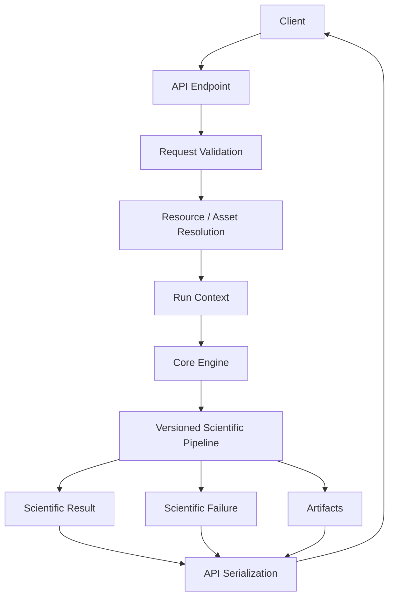
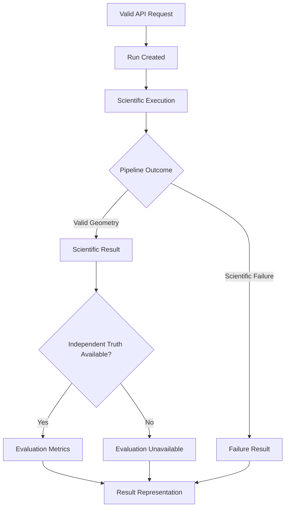
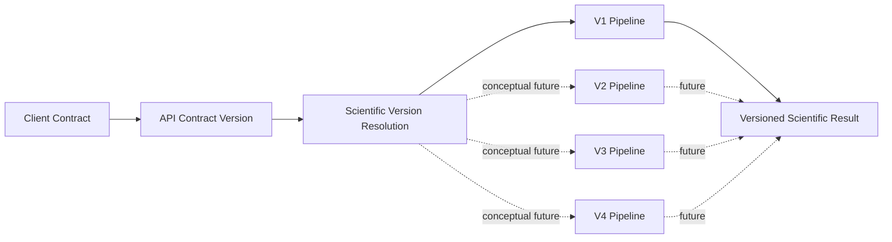

# ChandraMap API Endpoints

> **Document role:** Endpoint-level API contract and scientific interface guide
> **Project:** ChandraMap
> **API scope:** Scientific execution, result access, artifacts, provenance, and service-facing orchestration
> **Current documentation mode:** Conceptual endpoint surface; no concrete route contract is established by the repository evidence available to this document
> **Scientific baseline context:** ChandraMap V1 — known-overlap local lunar image registration

This document defines how ChandraMap's scientific capabilities should be exposed through an API **without inventing endpoint routes or implementation behavior that is not established by repository code or authoritative machine-readable schemas**.

No concrete endpoint path, HTTP method, request field name, response field name, status-code mapping, authentication mechanism, framework, port, deployment URL, queue, storage backend, or database is declared here unless it is established by implementation evidence.

> **An API endpoint should expose a scientific capability without reimplementing the science inside the endpoint handler.**

> **Endpoint documentation must reflect actual implementation; an undocumented endpoint is preferable to a fabricated endpoint.**

> **HTTP status describes request/service behavior; scientific status describes registration behavior.**

> **A successful API request can produce a scientifically unsuccessful registration result.**

> **Scientific results returned by endpoints must preserve transform direction, coordinate spaces, units, version, and provenance.**

> **Candidate matches, verified inliers, fit residuals, and held-out evaluation results must remain distinct in API responses.**

> **Missing scientific evidence must be represented as unavailable, not fabricated as zero.**

> **Endpoints should remain thin orchestration interfaces over the ChandraMap core engine.**

> **API endpoint evolution must not silently change the scientific meaning of historical V1 results.**

> **This document describes endpoint contracts only where the repository establishes them. Conceptual endpoint groups are clearly labeled and must not be mistaken for implemented routes.**

---

## 1. Endpoint Documentation Status

This file currently operates in **conceptual endpoint mode**.

The available repository documentation establishes ChandraMap's:

- scientific responsibilities;
- V1 registration behavior;
- inputs;
- outputs;
- architecture;
- evaluation semantics;
- reproducibility requirements.

It does **not**, from the evidence available to this document, establish an authoritative concrete route table with verified:

- HTTP methods;
- endpoint paths;
- request schemas;
- response schemas;
- status-code mappings;
- authentication behavior;
- pagination rules;
- content types;
- upload limits;
- rate limits;
- deployment addresses.

Therefore this document does **not** fabricate those details.

Concrete endpoint documentation should be added only when supported by one or more authoritative sources such as:

- backend route implementation;
- checked-in machine-readable API specification;
- authoritative request/response schemas;
- backend integration tests;
- versioned API contract documentation.

> **Code and authoritative machine-readable schemas define concrete route behavior; this Markdown explains how those routes map to ChandraMap's scientific domain.**

---

## 2. Relationship to Other API Documentation

### `README.md`

[API README](./README.md) is the API documentation entry point.

It should explain:

- why an API layer exists;
- how API documentation is organized;
- how API behavior relates to ChandraMap's scientific engine.

### `overview.md`

`overview.md`, where present, should describe the system-level API concept:

- API boundary;
- major resources;
- client/backend/core-engine relationship;
- API lifecycle at a high level.

This file does not assume that `overview.md` currently exists unless confirmed by the repository.

### `endpoints.md`

This file is more contract-oriented.

It focuses on:

- endpoint/resource responsibilities;
- request semantics;
- result semantics;
- scientific status;
- API errors;
- artifact handling;
- versioning;
- testing;
- endpoint evolution.

It intentionally avoids duplicating the complete API overview or backend architecture.

---

## 3. Core-Engine Boundary

The API layer should remain a thin interface over the scientific engine.

### Core engine owns scientific behavior

The core engine should own:

- sensor routing;
- preprocessing;
- illumination handling;
- physical scale handling;
- SIFT feature extraction;
- local correspondence matching;
- match filtering;
- RANSAC/geometric verification;
- transform estimation;
- optional sub-pixel refinement;
- final transform refitting;
- registration/warping;
- residual analysis;
- spatial coverage;
- held-out evaluation;
- scientific success/failure logic.

### API/backend layer may own orchestration

The endpoint/backend layer may own:

- request parsing;
- structural validation;
- resource lookup;
- scientific version resolution;
- configuration resolution;
- run creation;
- execution orchestration;
- result serialization;
- artifact exposure;
- API-level errors;
- client compatibility.

The endpoint layer should not contain a second independent implementation of SIFT, RANSAC, transform fitting, or evaluation metrics.

---

## 4. V1 Scientific Context

ChandraMap V1 is the **classical known-overlap local registration baseline**.

Its conceptual flow is:

```text
Known Source / Reference Pair
        ↓
Validate Inputs
        ↓
Sensor Routing
        ↓
Preprocessing
        ↓
Physical Scale Handling
        ↓
SIFT
        ↓
Descriptor Matching
        ↓
Match Filtering
        ↓
RANSAC
        ↓
Transform
        ↓
Optional Sub-Pixel Refinement
        ↓
Final Transform Refit
        ↓
Registration
        ↓
Evaluation
        ↓
Reproducible Result or Failure
```

Relevant V1 documentation includes:

- [V1 README](../versions/v1/README.md)
- [V1 Specification](../versions/v1/specification.md)
- [V1 Scope](../versions/v1/scope.md)
- [V1 Requirements](../versions/v1/requirements.md)
- [V1 Architecture](../versions/v1/architecture.md)
- [V1 Pipeline](../versions/v1/pipeline.md)
- [V1 Inputs](../versions/v1/inputs.md)
- [V1 Outputs](../versions/v1/outputs.md)
- [V1 Benchmark](../versions/v1/benchmark.md)
- [V1 Acceptance Criteria](../versions/v1/acceptance-criteria.md)
- [V1 Limitations](../versions/v1/limitations.md)

The API should expose the **versioned scientific engine** rather than create an API-specific reimplementation of V1.

---

# 5. Endpoint Design Principles

ChandraMap endpoint design should follow these principles.

### Thin endpoints

Handlers should translate between client-facing contracts and core-engine contracts.

### Explicit scientific version

A run/result must preserve which ChandraMap scientific methodology produced it.

### Reproducible configuration

Scientific configuration should be resolvable and preserved with the run.

### Stable scientific semantics

Endpoint refactoring must not silently redefine:

- source/reference meaning;
- transform direction;
- metric units;
- inlier semantics;
- truth semantics.

### Explicit source/reference roles

`source` and `reference` have scientific meaning and must remain distinguishable.

### Clear error separation

API validation errors, execution state, scientific failures, and evaluation limitations are different concepts.

### Machine-readable scientific results

Critical scientific outputs should be serializable without depending exclusively on logs or screenshots.

### Large-artifact separation

Large rasters or visualizations may require separate artifact access rather than embedding them in every result response.

### Backward-compatible evolution where practical

API evolution should preserve historical scientific meaning even if client-facing schemas change.

---

# 6. Conceptual API Resource Model

The following are **domain resource concepts**.

They do not imply implemented routes.

### Asset

A traceable scientific image/product/representation.

Examples conceptually include:

- Chandrayaan-2 source product;
- LRO reference product;
- derived IIRS registration representation;
- prepared reference representation.

### Pair

A defined scientific relationship between:

- one source;
- one reference.

A pair may also preserve overlap and benchmark context.

### Configuration

The scientific settings controlling a registration run.

### Run

One execution of a ChandraMap scientific pipeline.

### Job

An optional backend orchestration object for long-running processing.

A job is not necessarily a scientific resource.

### Result

The scientific outcome of a run.

### Artifact

A potentially large generated output such as:

- registered raster;
- registered preview;
- correspondence visualization;
- residual visualization.

### Benchmark

A frozen evaluation definition containing or referencing:

- pair population;
- truth;
- metrics;
- success criteria;
- configuration.

---

## 7. Resource Model Table

| Resource      | Scientific Meaning                     | Typical API Responsibility                    |
| ------------- | -------------------------------------- | --------------------------------------------- |
| Asset         | Traceable image/product/representation | Resolve scientific data identity              |
| Pair          | Source/reference relationship          | Select a controlled registration case         |
| Configuration | Pipeline settings                      | Resolve reproducible scientific behavior      |
| Run           | One scientific execution               | Start and expose processing context           |
| Job           | Optional orchestration state           | Track long-running execution where supported  |
| Result        | Scientific outcome                     | Expose transform, metrics, status, provenance |
| Artifact      | Larger generated output                | Expose rasters, previews, diagnostics         |
| Benchmark     | Frozen evaluation definition           | Preserve evaluation context                   |

---

# 8. Conceptual Endpoint Surface

No concrete method/path is defined by this document.

| Conceptual Endpoint Group | Purpose                                  | Implementation Status             |
| ------------------------- | ---------------------------------------- | --------------------------------- |
| Assets                    | Resolve scientific data resources        | Conceptual; no route defined here |
| Pairs                     | Resolve source/reference relationships   | Conceptual; no route defined here |
| Registration Runs         | Start or expose scientific execution     | Conceptual; no route defined here |
| Run / Job Status          | Expose execution lifecycle where needed  | Conceptual; no route defined here |
| Results                   | Expose scientific outcomes               | Conceptual; no route defined here |
| Artifacts                 | Expose larger generated outputs          | Conceptual; no route defined here |
| Configurations            | Resolve reproducible pipeline settings   | Conceptual; no route defined here |
| Benchmarks                | Resolve frozen evaluation context        | Conceptual; no route defined here |
| Service / Health          | Operational service state if implemented | No route assumed                  |

---

# 9. Registration Runs

### Purpose

A registration-run interface would expose the scientific operation:

> Run ChandraMap for a defined source/reference registration case using a specified scientific version and resolved configuration.

### Scientific responsibility

The endpoint layer should:

1. parse the client request;
2. validate the request structure;
3. resolve scientific assets;
4. resolve source/reference roles;
5. resolve ChandraMap scientific version;
6. resolve configuration;
7. establish run context;
8. invoke or schedule the core engine;
9. expose resulting run/result context.

### Core-engine responsibility

The scientific engine remains responsible for:

- preprocessing;
- scale handling;
- matching;
- RANSAC;
- transforms;
- registration;
- evaluation;
- scientific failure classification.

### Implementation status

No concrete registration route or HTTP method is defined by this document.

---

# 10. Registration Request Semantics

See [V1 Inputs](../versions/v1/inputs.md).

A V1 registration request conceptually needs enough information to establish:

- source scientific asset;
- reference scientific asset;
- pair identity where applicable;
- source sensor;
- reference sensor;
- ChandraMap scientific version;
- resolved or selectable configuration;
- benchmark context where applicable;
- truth/evaluation context where applicable.

Exact wire-field names are implementation-defined until authoritative schemas exist.

---

# 11. Illustrative Conceptual Registration Request

> **Illustrative conceptual request — not an implemented endpoint schema.**

```yaml
request:
  scientific_version: v1

  source:
    asset_id: PLACEHOLDER_SOURCE_ASSET
    sensor: PLACEHOLDER_SOURCE_SENSOR

  reference:
    asset_id: PLACEHOLDER_REFERENCE_ASSET
    sensor: PLACEHOLDER_REFERENCE_SENSOR

  pair:
    id: PLACEHOLDER_PAIR_ID_OR_NULL

  configuration:
    id: PLACEHOLDER_CONFIG_ID

  evaluation:
    benchmark_version: PLACEHOLDER_OR_NULL
    truth_version: PLACEHOLDER_OR_NULL
```

These field names illustrate scientific meaning only.

They must not be treated as current API field names.

---

# 12. Source and Reference Semantics

The API must preserve scientific directionality.

### Source

The source is the image/product whose coordinates are being transformed or aligned.

### Reference

The reference is the target image/reference coordinate frame.

The preferred scientific transform convention is:

```text
source coordinates → reference coordinates
```

Ambiguous terminology such as:

```text
image1
image2
```

should not replace source/reference semantics unless an existing implementation requires those legacy names and their meaning is explicitly documented.

---

# 13. Sensor Input Semantics

Relevant ChandraMap sensor context includes:

| Sensor  | Approximate Project Context                                                               |
| ------- | ----------------------------------------------------------------------------------------- |
| OHRC    | `~0.25–0.32 m/pixel`, product/documentation dependent                                     |
| TMC-2   | `~5 m/pixel`                                                                              |
| IIRS    | `~80 m/pixel`, `~0.8–5.0 µm`, roughly `~250–256` bands depending on product/documentation |
| LRO NAC | Often roughly `~0.5–2 m/pixel` depending on product/acquisition context                   |
| LRO WAC | Broader/coarser reference context; product/mode dependent                                 |

These are contextual summaries.

> **Actual product metadata is authoritative and must not be replaced by approximate endpoint defaults.**

API handlers should not infer physical scale solely from:

- filename;
- raster dimensions;
- generic instrument summaries.

---

# 14. IIRS Request Semantics

IIRS is hyperspectral/imaging-infrared data.

It must not be treated by the API as though:

```text
raw hyperspectral cube
=
ordinary grayscale registration image
```

Where V1 supports IIRS matching, the scientific request context should identify a documented 2D registration representation and preserve its relationship to the parent IIRS product.

Conceptually, provenance should be sufficient to answer:

- which parent IIRS product was used;
- which representation was matched;
- how that representation was produced.

No universal IIRS representation is prescribed by this endpoint document.

---

# 15. Start-Run Behavior

A run-starting interface may conceptually perform:

```text
Client Request
      ↓
Structural Validation
      ↓
Asset / Pair Resolution
      ↓
Scientific Version Resolution
      ↓
Configuration Resolution
      ↓
Run Context Creation
      ↓
Core-Engine Invocation
```

This document does not prescribe whether execution is:

- synchronous;
- asynchronous;
- local;
- queued;
- distributed.

That behavior must come from implementation evidence.

---

# 16. Synchronous Execution

Some implementations may execute a registration operation synchronously.

If ChandraMap later establishes such behavior, endpoint documentation should describe:

- when execution is synchronous;
- whether the scientific result is returned directly;
- any implementation-defined limits.

This document does not assume synchronous execution.

Registration may involve sufficiently large imagery or processing cost that synchronous execution is not universally appropriate.

---

# 17. Asynchronous Execution

Long-running execution may require an asynchronous model.

Conceptually:

```text
Submit Scientific Work
        ↓
Receive Run / Job Identity
        ↓
Execution Proceeds
        ↓
Inspect Execution State
        ↓
Retrieve Scientific Result
```

This does **not** imply that ChandraMap currently uses:

- a queue;
- workers;
- callbacks;
- webhooks;
- WebSockets;
- polling;
- a particular task system.

Those are implementation decisions.

---

# 18. Run and Job Status

A run and a job should not automatically be treated as identical concepts.

### Run

Represents the scientific execution.

### Job

Where implemented, may represent backend orchestration.

For example, a backend job could finish normally while the scientific registration itself reports failure.

No concrete run-status or job-status endpoint is defined here.

---

# 19. API Status vs Scientific Status

This distinction is essential.

| Layer           | Question                                                   |
| --------------- | ---------------------------------------------------------- |
| HTTP / API      | Was the client request structurally/service-wise handled?  |
| Job / Execution | Is computation pending, active, complete, or interrupted?  |
| Scientific      | Did registration produce valid geometry?                   |
| Evaluation      | Was independent evaluation available and what did it show? |

These layers should not be collapsed into one generic `success` value.

---

## 20. Example Status Scenario

Conceptually:

```text
API handling:
request accepted

Execution:
completed

Scientific registration:
failed during geometric verification

Evaluation:
not applicable because no valid final transform exists
```

This is a legitimate scientific result.

It should not be represented as either:

```text
everything succeeded scientifically
```

or:

```text
backend crashed
```

if the pipeline handled the scientific failure correctly.

---

# 21. Result Endpoint Group

See [V1 Outputs](../versions/v1/outputs.md).

A result resource should conceptually expose enough information to identify:

- run;
- ChandraMap scientific version;
- source/reference assets;
- scientific status;
- correspondence evidence;
- geometry;
- evaluation;
- failure context;
- artifacts;
- provenance.

No concrete result route is defined by this document.

---

# 22. Illustrative Conceptual Result Response

> **Illustrative conceptual response — not an implemented schema.**

```yaml
result:
  run:
    id: PLACEHOLDER_RUN_ID
    scientific_version: v1
    scientific_status: PLACEHOLDER

  source:
    asset_id: PLACEHOLDER_SOURCE_ASSET

  reference:
    asset_id: PLACEHOLDER_REFERENCE_ASSET

  correspondence:
    candidate_count: PLACEHOLDER
    filtered_count: PLACEHOLDER
    inlier_count: PLACEHOLDER
    inlier_ratio: PLACEHOLDER

  geometry:
    model: PLACEHOLDER_MODEL
    direction: source_to_reference
    transform: PLACEHOLDER
    source_space: PLACEHOLDER_SOURCE_SPACE
    reference_space: PLACEHOLDER_REFERENCE_SPACE

  evaluation:
    fit_residual: PLACEHOLDER_OR_UNAVAILABLE
    spatial_coverage: PLACEHOLDER_OR_UNAVAILABLE
    check_rmse: PLACEHOLDER_OR_UNAVAILABLE
    units: PLACEHOLDER_UNITS
    coordinate_space: PLACEHOLDER_SPACE

  failure:
    stage: PLACEHOLDER_OR_NULL
    diagnostic: PLACEHOLDER_OR_NULL

  artifacts:
    items:
      - PLACEHOLDER_ARTIFACT_REFERENCE

  provenance:
    benchmark_version: PLACEHOLDER_OR_UNAVAILABLE
    truth_version: PLACEHOLDER_OR_UNAVAILABLE
    config_id: PLACEHOLDER_CONFIG_ID
    code_revision: PLACEHOLDER_REVISION
```

The structure illustrates scientific relationships only.

It does not define current field names or serialization.

---

# 23. Candidate Correspondence Semantics

Matcher output consists of **candidate correspondences**.

A candidate is:

> a proposed relationship between a source location and a reference location.

It is not automatically:

- correct;
- geometrically verified;
- ground truth.

An API exposing candidate details should preserve that terminology.

Do not expose a raw matcher candidate collection as:

```text
correct_matches
```

unless additional semantics actually justify that term.

---

# 24. Verified Inlier Semantics

RANSAC or another defined geometric-verification stage produces **model-consistent inliers**.

An inlier is:

> a candidate correspondence consistent with the fitted geometric model under the configured verification rule.

It is not:

> independent ground truth.

The API should preserve that distinction in response contracts and documentation.

---

# 25. Correspondence Detail Semantics

Point-level correspondence information may conceptually include:

- source x/y;
- reference x/y;
- source coordinate space;
- reference coordinate space;
- candidate state;
- filtered state;
- inlier state;
- matcher-specific score;
- refinement state where relevant.

No concrete endpoint or field schema for correspondence details is established here.

---

# 26. Large Correspondence Sets

Candidate and point-level correspondence data may be large.

Possible implementation strategies include:

- separate detail resource;
- artifact file;
- optional response expansion;
- pagination.

This document intentionally does not select one.

Pagination parameters or expansion syntax must not be invented without implementation evidence.

---

# 27. Transform Semantics

See [Transforms](../algorithms/transforms.md) where that document is present.

A transformation result should conceptually preserve:

- transform model;
- parameters;
- scientific direction;
- source coordinate space;
- reference coordinate space;
- whether it is initial or final;
- refinement context;
- validity/status.

Recommended scientific direction:

```text
source → reference
```

---

## 28. Transform Anti-Pattern

A response containing only:

```yaml
transform:
  - [PLACEHOLDER, PLACEHOLDER, PLACEHOLDER]
  - [PLACEHOLDER, PLACEHOLDER, PLACEHOLDER]
  - [PLACEHOLDER, PLACEHOLDER, PLACEHOLDER]
```

is scientifically incomplete if the client cannot determine:

- whether it is affine or homography representation;
- what direction it maps;
- what coordinate spaces it connects;
- whether it is initial or final.

---

# 29. Metric Semantics

See [Evaluation Metrics](../evaluation/metrics.md).

A scientific metric should conceptually preserve:

- metric name;
- value or availability;
- units;
- evaluated population;
- coordinate space;
- observation count where relevant;
- metric-definition version where applicable.

A bare numeric value is often insufficient.

---

# 30. Illustrative Conceptual Metric Record

> **Conceptual only — not an implemented schema.**

```yaml
metric:
  name: PLACEHOLDER_METRIC_NAME
  value: PLACEHOLDER_VALUE_OR_UNAVAILABLE
  units: PLACEHOLDER_UNITS
  coordinate_space: PLACEHOLDER_SPACE
  population: PLACEHOLDER_POPULATION
  count: PLACEHOLDER_N
  definition_version: PLACEHOLDER_VERSION
```

---

# 31. Inlier-Ratio Semantics

Conceptually:

$$
\text{Inlier Ratio}
=
\frac{N_{\text{verified inliers}}}
{N_{\text{candidates used for geometric verification}}}
$$

The API result should retain enough context to identify the denominator.

> **Inlier ratio is not registration accuracy.**

A high ratio can coexist with:

- very few correspondences;
- clustered geometry;
- repeated-pattern false consensus.

---

# 32. Fit-Residual Semantics

See [Residual Analysis](../algorithms/residual-analysis.md) where present.

Fit residual measures agreement between the fitted transform and points used to support or fit that model.

It does not represent independent accuracy.

The API must not collapse:

```text
fit residual
```

and:

```text
held-out check error
```

into one ambiguous `error` field.

---

# 33. Held-Out Check Metrics

See [Check-Point Evaluation](../evaluation/checkpoint-evaluation.md).

Where independent truth exists, held-out evaluation should conceptually preserve:

- check/truth set identity;
- truth version;
- count;
- coordinate space;
- units;
- residual information;
- aggregate metric such as RMSE where defined.

Held-out check points must remain independent of final transform fitting for the corresponding run.

---

# 34. Missing Evaluation

A registration may complete successfully even when no independent truth is available.

Conceptually:

```text
registration:
completed

independent_evaluation:
unavailable
```

must remain distinguishable from:

```text
check_rmse:
0
```

> **Unavailable evidence is not zero error.**

---

# 35. Spatial-Coverage Semantics

See [Spatial Coverage](../evaluation/spatial-coverage.md).

Coverage output should preserve or reference:

- point population;
- valid evaluation region;
- coverage method;
- resulting value;
- relevant configuration/version.

> **Coverage describes spatial distribution of support, not registration correctness.**

---

# 36. Ground-Space Metrics

Metre-level or other physical ground-error values should originate from the scientific evaluation layer only when valid geospatial mapping exists.

The API handler must not independently calculate:

```text
pixel_error × approximate_GSD
```

and expose the result as absolute lunar accuracy.

Ground-space metrics require scientifically valid:

- coordinate semantics;
- spatial mapping;
- reference context;
- units.

---

# 37. Artifact Endpoint Group

Potential V1 artifacts may include:

- registered raster;
- registered preview;
- candidate-match visualization;
- verified-inlier visualization;
- residual visualization;
- spatial-coverage visualization;
- result manifest.

No concrete artifact endpoint is defined here.

Large artifacts may be better referenced separately from compact result metadata, but the actual access pattern is implementation-defined.

---

# 38. Artifact Reference Semantics

A conceptual artifact record may preserve:

- artifact identity;
- artifact role/type;
- originating run;
- scientific context;
- media/data type where established.

This document does not define:

- URL structure;
- download route;
- storage provider;
- retention period;
- expiration policy.

---

# 39. Asset Endpoint Group

An asset is a scientific resource, not merely a filename.

Conceptually, an asset may preserve:

- scientific asset identifier;
- mission;
- instrument;
- provider product identity;
- processing state;
- representation;
- metadata;
- provenance.

No asset endpoint is declared as implemented.

---

# 40. File Uploads

This document does not assume that file-upload endpoints exist.

If upload support is later implemented, documentation should cover verified behavior including:

- structural validation;
- content validation;
- filename/path safety;
- metadata requirements;
- resource limits;
- storage lifecycle;
- provenance.

No upload-size limit or supported content type is defined here.

---

# 41. Pair Endpoint Group

See [Pair Definition](../datasets/pair-definition.md).

A pair conceptually identifies:

```text
one source
+
one reference
+
associated registration context
```

A pair may support:

- controlled known-overlap registration;
- benchmark membership;
- truth association.

The existence of a `Pair` resource concept does not imply CRUD routes.

No pair endpoint path or method is defined here.

---

# 42. Configuration Endpoint Group

A configuration represents scientific pipeline behavior.

Conceptual API responsibilities may include:

- resolve a named configuration;
- expose a configuration;
- associate a configuration with a run.

No concrete configuration route is established.

Configuration interfaces must not expose:

- API keys;
- passwords;
- private tokens;
- secret environment values.

---

# 43. Resolved Configuration

The final run should preserve the configuration actually used.

This matters because a named template may be combined with:

- defaults;
- overrides;
- version-specific behavior.

Conceptually:

```text
template configuration
+
allowed overrides
+
resolved defaults
=
effective scientific configuration
```

The result should remain traceable to the effective configuration.

---

# 44. Benchmark Endpoint Group

Relevant documentation includes:

- [V1 Benchmark](../versions/v1/benchmark.md)
- [Benchmark Protocol](../evaluation/benchmark-protocol.md)

A benchmark conceptually identifies:

- benchmark version;
- pair population;
- truth version;
- metric definitions;
- success criteria;
- scientific configuration.

This document does not define a benchmark endpoint or benchmark-execution route.

---

# 45. Benchmark Result Semantics

A **single-run result** is different from a **benchmark aggregate**.

```text
Run
→ one scientific execution

Benchmark
→ a defined collection/evaluation protocol

Benchmark result
→ aggregate evidence across multiple runs
```

An API should not mix these concepts under one ambiguous result representation.

---

# 46. Service / Health Endpoints

Operational health endpoints may be useful in a deployed service.

No concrete health or readiness endpoint is established by this document.

If such endpoints are implemented, their documentation must distinguish:

```text
service is operational
```

from:

```text
scientific registration is accurate
```

Operational health does not measure scientific quality.

---

# 47. Authentication

This document does not assume an authentication mechanism.

Do not infer:

- JWT;
- API keys;
- OAuth;
- session authentication;
- anonymous access.

Where authentication is implemented, endpoint documentation should describe the actual contract.

Otherwise it remains deployment/implementation-defined.

---

# 48. Authorization

No:

- roles;
- permissions;
- scopes;
- ACLs;

are defined by this document.

Authorization behavior must be documented only when established by implementation.

---

# 49. Endpoint Security

Security concerns may include:

- request validation;
- upload validation where supported;
- arbitrary-path prevention;
- artifact-access control;
- secret handling;
- resource exhaustion;
- error-message disclosure.

Where repository-level security documentation exists, see the root `SECURITY.md` policy.

Endpoint documentation should complement that policy rather than replace it.

---

# 50. Arbitrary File Paths

An API should not expose unrestricted server filesystem reads merely because the scientific engine accepts files internally.

Prefer architecture that resolves:

- validated asset IDs;
- controlled data roots;
- managed resources;

where appropriate.

A client-controlled path such as:

```text
../../arbitrary/server/file
```

must not become a scientific asset merely because it is syntactically a path.

---

# 51. Error Model

ChandraMap must distinguish three broad classes of non-success conditions.

### API / request error

The request cannot validly start or continue.

Examples conceptually include:

- malformed structure;
- unknown required resource;
- invalid request semantics.

### Scientific failure

The request is valid, the scientific pipeline executes, but registration cannot produce a valid scientific result.

Examples:

- insufficient usable correspondence;
- RANSAC cannot estimate a valid model;
- final geometry invalid.

### Evaluation limitation

Registration may complete, but a particular form of evaluation is unavailable.

Example:

- no independent held-out truth exists.

---

## 52. Error Model Table

| Condition                             | Category                    | Scientific Run                     |
| ------------------------------------- | --------------------------- | ---------------------------------- |
| Invalid request structure             | API validation              | Not started                        |
| Unknown required asset                | Resource/input resolution   | Not started                        |
| Unsupported scientific representation | Input/scientific validation | Not started or explicitly rejected |
| RANSAC cannot estimate a valid model  | Scientific failure          | Failed                             |
| Final transform invalid               | Scientific failure          | Failed                             |
| Independent truth unavailable         | Evaluation limitation       | Registration may still complete    |
| Internal backend exception            | Service/system error        | May be incomplete                  |

---

# 53. Conceptual Error Response

> **Illustrative conceptual error structure — not an implemented schema.**

```yaml
error:
  category: PLACEHOLDER_CATEGORY
  message: PLACEHOLDER_MESSAGE
  request_id: PLACEHOLDER_OR_NULL
  run_id: PLACEHOLDER_OR_NULL

  details:
    field: PLACEHOLDER_OR_NULL
    scientific_stage: PLACEHOLDER_OR_NULL
```

No exact error field names or codes are defined.

---

# 54. HTTP Status Codes

No HTTP status-code mapping is defined by this document.

In particular, this file does not invent mappings for:

- `200`;
- `201`;
- `202`;
- `400`;
- `404`;
- `422`;
- `500`.

Concrete mappings belong to the actual API contract.

The governing principle is:

> **HTTP status should describe request/service behavior, not scientific accuracy.**

---

# 55. Scientific Failure Record

A scientific failure may conceptually preserve:

- run ID;
- source/reference pair;
- scientific version;
- failure stage;
- last successful stage;
- available partial metrics;
- diagnostics;
- provenance.

A scientifically failed run can still be:

- successfully serialized;
- successfully retrieved;
- useful benchmark evidence.

---

# 56. Scientific-Failure Anti-Pattern

Do not transform:

```text
RANSAC could not establish valid geometry
```

into:

```text
unhandled server error
```

if the core engine handled the condition correctly.

That loses scientifically useful failure information.

---

# 57. Unavailable vs Zero

These concepts are different:

```text
0
null
unavailable
not applicable
not evaluated
failed before measurement
```

The exact wire representation must come from the implemented schema.

The API must not silently turn all of these states into numeric zero.

For example:

```text
check RMSE unavailable
```

is not equivalent to:

```text
check RMSE = 0
```

---

# 58. API Versioning

API versioning and scientific versioning solve different problems.

| Version                           | Meaning                                     |
| --------------------------------- | ------------------------------------------- |
| **API contract version**          | Client-facing endpoint/schema compatibility |
| **ChandraMap scientific version** | Scientific methodology/pipeline generation  |
| **Benchmark version**             | Frozen evaluation definition                |
| **Result-schema version**         | Serialized result-format compatibility      |

These versions must not be conflated.

---

# 59. API Version ≠ Scientific V1

A route namespace containing something similar to `v1`, if one ever exists, must not automatically be interpreted as ChandraMap scientific V1.

For example:

```text
API contract revision 1
```

could theoretically expose:

```text
scientific V1
scientific V2
```

without those concepts being identical.

No route naming convention is defined here.

---

# 60. Scientific Version in Results

Where clients can select or influence scientific methodology, the actual mechanism must be documented from implementation.

Regardless of selection mechanism, formal run/result provenance should remain able to identify:

- scientific version;
- resolved configuration;
- benchmark context where relevant.

---

# 61. Future V2/V3/V4 API Evolution

Later scientific versions may require additional result or resource concepts.

Possible future directions include:

### V2

Potentially stronger local-registration options and diagnostics.

### V3

Potentially retrieval-related inputs/results.

### V4

Potentially advanced multimodal, uncertainty, or terrain-aware outputs.

These are conceptual research directions.

This document does not define future endpoint paths.

---

# 62. Retrieval Endpoints

Global retrieval is not part of core V1 known-pair registration.

If retrieval is added later, it should remain logically separate from local registration.

Conceptually:

```text
Retrieval
→ Which reference candidate should be considered?

Registration
→ How should the known candidate be geometrically aligned?
```

These are different scientific problems.

---

# 63. FAISS Context

FAISS can support vector nearest-neighbor retrieval.

It does not itself perform:

- local feature verification;
- RANSAC;
- transformation estimation;
- registration.

A future vector-search resource must therefore not be described as a registration endpoint simply because it helps select candidate references.

---

# 64. Retrieval Metrics vs Registration Metrics

Examples of retrieval metrics:

- Recall@K;
- candidate-ranking measures.

Examples of registration/evaluation metrics:

- inlier ratio;
- residuals;
- RMSE;
- spatial coverage.

They should not be collapsed into one generic `accuracy`.

---

# 65. Pagination

Large resource collections may eventually require pagination.

This document does not define:

- `page`;
- `limit`;
- `offset`;
- cursor parameters.

Those must be documented only if they exist in the implemented API.

---

# 66. Filtering and Searching Resources

Possible future resource filters might include:

- scientific status;
- sensor;
- scientific version;
- pair;
- benchmark.

No query syntax is defined here.

---

# 67. Sorting

No ordering guarantee or sorting parameter is defined.

If actual list endpoints later support sorting, the exact behavior should be documented from implementation.

---

# 68. Idempotency

Duplicate run submissions may require well-defined retry or identity semantics in a production API.

No idempotency mechanism or header is defined here.

Scientific run identity should not be invented implicitly from request similarity unless implementation explicitly establishes that behavior.

---

# 69. Retries

A client or service may retry a transient service error.

That is different from rerunning a scientific failure.

For example:

```text
network interruption
→ retry may make sense
```

while:

```text
valid pair consistently has insufficient geometric support
→ retry may reproduce the same scientific failure
```

Automatic retries must not hide persistent scientific failure.

---

# 70. Timeouts

No timeout is defined.

If registration execution exceeds practical request duration in a future implementation, asynchronous orchestration may be appropriate.

The actual timeout strategy must come from the backend implementation.

---

# 71. Rate Limiting

No rate limit is defined.

If rate limiting is introduced, it should be documented from deployment/backend configuration rather than invented in this file.

---

# 72. File Size Limits

No upload or image-size limit is defined.

Large lunar products may create substantial processing and memory requirements, but exact limits must be measured and implemented before being documented.

---

# 73. Content Types

This document does not assume that every endpoint uses:

- JSON;
- `multipart/form-data`;
- GeoTIFF;
- PNG;
- JPEG.

Request/response content types should be documented only once the API implementation defines them.

See [Dataset Data Format](../datasets/data-format.md) for scientific data-format context where present.

---

# 74. Response Precision

Scientific coordinates and metrics may require floating-point precision.

Authoritative machine-readable responses should avoid arbitrary display-only rounding that changes scientific meaning.

No fixed decimal precision is defined here.

---

# 75. Example Policy

Concrete endpoint examples must use either:

- verified implementation contracts; or
- explicit placeholders.

Examples must not invent:

- production product IDs;
- secrets;
- benchmark values;
- accuracy values;
- runtime values;
- deployment hosts.

---

# 76. cURL Examples

No cURL command is provided because no concrete method, route, base URL, or content type is established by the available endpoint contract.

Concrete cURL examples should be added only after actual routes exist.

---

# 77. Client Examples

For the same reason, this document does not invent:

- Python client methods;
- TypeScript SDK calls;
- shell commands.

Client examples should be generated from or checked against the real API contract.

---

# 78. OpenAPI Relationship

No authoritative OpenAPI path is assumed by this document.

If a machine-readable API specification is added later, it should become a low-level source of truth for:

- routes;
- methods;
- parameters;
- request schemas;
- response schemas;
- documented HTTP errors.

This Markdown should then focus on:

- organization;
- scientific interpretation;
- cross-resource semantics;
- versioning;
- failure meaning.

---

# 79. Generated API Documentation

If API documentation is later generated from:

- OpenAPI;
- framework routing;
- typed schemas;
- validation models;

this file should not duplicate every generated field manually.

Instead it should explain the scientific meaning of those contracts and link to authoritative generated references where appropriate.

---

# 80. Endpoint Source-of-Truth Hierarchy

A practical documentation hierarchy is:

```text
Backend Route / Interface Code
        +
Authoritative Machine-Readable Schemas
        +
Contract / Integration Tests
        ↓
Concrete API Behavior
        ↓
endpoints.md Scientific Interpretation
```

Markdown should explain the contract.

It must not override the real contract silently.

---

# 81. Endpoint Execution Flow



The route, protocol, and serialization technology are implementation-defined.

---

# 82. Scientific Status Flow



A scientific failure remains an expected result type rather than necessarily becoming an API/system error.

---

# 83. Version Flow



The V2–V4 branches illustrate version-separation principles only.

They do not assert endpoint or implementation availability.

---

# 84. Endpoint Testing

Endpoint testing should validate both ordinary API contracts and scientific semantics.

## Contract Tests

Where concrete routes exist, test that:

- documented route exists;
- documented method matches implementation;
- request validation behaves as documented;
- response serialization follows the schema.

## Core Integration Tests

Verify that the endpoint:

- invokes the correct core-engine workflow;
- preserves scientific version;
- preserves resolved configuration;
- does not duplicate scientific logic.

## Scientific-Semantics Tests

Verify preservation of:

- source/reference direction;
- candidate/inlier distinction;
- transform model;
- transform direction;
- coordinate spaces;
- units;
- truth provenance.

## Failure Tests

Verify that:

- invalid requests are rejected before execution;
- scientific failures remain scientific results;
- backend exceptions remain distinguishable from scientific failures;
- unavailable truth does not become zero error.

---

# 85. Endpoint Test Matrix

| Scenario                       | API Behavior                                                          | Scientific Behavior                              |
| ------------------------------ | --------------------------------------------------------------------- | ------------------------------------------------ |
| Malformed request              | Reject or report request-level error according to actual API contract | No scientific run                                |
| Unknown required asset         | Resource/input resolution error                                       | No scientific run                                |
| Valid known pair               | Accept/execute according to orchestration model                       | Pipeline runs                                    |
| Too few usable matches         | API/service can remain functional                                     | Scientific failure                               |
| RANSAC cannot find valid model | API/service can remain functional                                     | Scientific failure                               |
| Independent truth unavailable  | Scientific result may still be available                              | Independent evaluation unavailable               |
| Internal backend exception     | Service/system error                                                  | Run may be incomplete                            |
| Successful registration        | Result exposed according to API contract                              | Scientific success according to defined criteria |

No HTTP status code is implied by this table.

---

# 86. Endpoint Regression Tests

Regression protection should cover accidental changes to:

- source/reference meaning;
- scientific-version semantics;
- transform direction;
- source/reference coordinate spaces;
- metric units;
- unavailable/null semantics;
- inlier-ratio denominator;
- failure-stage semantics;
- benchmark version;
- truth provenance.

These fields carry scientific meaning and should not change casually during API refactoring.

---

# 87. Concrete Endpoint Documentation Template

When actual endpoints exist, use a template similar to the following.

### `<VERIFIED METHOD> <VERIFIED PATH>`

**Purpose**

What the endpoint does.

**Scientific role**

Which ChandraMap capability it invokes.

**Scientific version**

Which scientific version or versions are supported.

**Authentication**

Only when implemented.

**Path parameters**

Only verified parameters.

**Query parameters**

Only verified parameters.

**Request body**

Actual implemented schema or authoritative schema reference.

**Response**

Actual implemented schema or authoritative schema reference.

**Scientific status**

How scientific success/failure is represented.

**Errors**

Actual endpoint-level errors.

**Artifacts**

Related outputs where supported.

**Reproducibility**

Relevant configuration/version/provenance behavior.

**Example**

Only verified contract values or explicit placeholders.

Sections that do not apply should be omitted rather than filled with invented content.

---

# 88. Conceptual Endpoint-Group Template

Until concrete routes exist, use the following style.

### Registration Runs

**Purpose**

Expose one scientific registration execution.

**Scientific responsibility**

Delegate versioned registration to the ChandraMap core engine.

**Possible inputs**

Conceptual source/reference/configuration/version context.

**Possible outputs**

Run identity, scientific result or failure, artifact references, provenance.

**Implementation status**

No concrete route or HTTP method is defined by this document.

This format avoids turning architecture concepts into fake APIs.

---

# 89. Endpoint Security Checklist

The checklist is intentionally unchecked.

- [ ] Concrete endpoint documentation matches implementation
- [ ] Input validation occurs before scientific processing
- [ ] Untrusted file paths are controlled
- [ ] Uploads are validated where supported
- [ ] Secrets are never returned
- [ ] Result provenance excludes secret values
- [ ] Artifact access is controlled appropriately
- [ ] Error messages do not expose sensitive implementation details
- [ ] Large requests cannot silently bypass resource controls
- [ ] Endpoint behavior does not rely on undocumented credentials

---

# 90. Endpoint Scientific-Correctness Checklist

The checklist is intentionally unchecked.

- [ ] Source/reference roles are explicit
- [ ] Scientific version is preserved
- [ ] Sensor identity is preserved
- [ ] Product metadata is not replaced with approximate defaults
- [ ] IIRS representation is explicit where applicable
- [ ] Candidate matches remain candidates
- [ ] Verified inliers are separately represented
- [ ] RANSAC inliers are not labeled ground truth
- [ ] Transform model is preserved
- [ ] Transform direction is preserved
- [ ] Source/reference coordinate spaces are preserved
- [ ] RMSE includes coordinate space and units
- [ ] Fit residual is distinct from held-out error
- [ ] Spatial coverage identifies population and method
- [ ] Missing evaluation is not encoded as zero
- [ ] Ground-space metrics originate from scientific evaluation
- [ ] Scientific failure remains a scientific result
- [ ] Result provenance links to data, configuration, code, and truth

---

# 91. Endpoint Documentation Checklist

The checklist is intentionally unchecked.

- [ ] Relationship to `README.md` is clear
- [ ] Relationship to `overview.md` is clear where that document exists
- [ ] Actual endpoints are separated from conceptual groups
- [ ] No nonexistent route is documented
- [ ] No unsupported HTTP method is documented
- [ ] No fake request field is claimed as implemented
- [ ] No fake response field is claimed as implemented
- [ ] No fake HTTP status mapping is claimed
- [ ] No fake authentication mechanism is claimed
- [ ] No fake base URL or port is claimed
- [ ] Concrete examples use verified contracts or placeholders
- [ ] Endpoint errors are separated from scientific failures
- [ ] V1 known-pair semantics remain intact
- [ ] Future V2–V4 behavior is clearly labeled conceptual
- [ ] API contract version is distinct from scientific version
- [ ] Benchmark version is preserved separately
- [ ] Links use correct relative paths
- [ ] Machine-readable API specs are treated as authoritative once present

---

# 92. Endpoint Anti-Patterns

Do **not**:

- invent `/api/v1/register`;
- invent `/match`;
- invent `/upload`;
- invent `/status/{id}`;
- invent `/results/{id}`;
- invent `/health`;
- invent any route not established by repository implementation;
- invent `POST`, `GET`, `PUT`, `PATCH`, or `DELETE` methods;
- invent request-field names;
- invent query parameters;
- invent response schemas;
- invent authentication headers;
- invent HTTP status-code mappings;
- invent base URLs;
- invent ports;
- invent database identifiers;
- invent job queues;
- invent asynchronous semantics;
- duplicate SIFT logic in endpoint handlers;
- duplicate RANSAC logic in endpoint handlers;
- duplicate metric formulas in presentation code;
- treat API success as scientific success;
- call candidate correspondences verified;
- call inlier ratio accuracy;
- call RANSAC inliers truth;
- return a transform without model/direction/coordinate-space semantics;
- return bare RMSE without context;
- encode missing evaluation as zero;
- compute metre accuracy in the API layer from approximate GSD;
- expose unrestricted server filesystem paths;
- expose credentials in result provenance;
- mix V1 registration with future retrieval under ambiguous semantics;
- silently alter V1 scientific meaning to simplify a future API;
- present conceptual endpoint groups as implemented routes.

---

# 93. Claims to Avoid

Do not claim without repository evidence:

> "The API exposes REST endpoints."

> "The API uses FastAPI."

> "The API runs on port 8000."

> "POST /register starts registration."

> "GET /status returns job status."

> "Authentication uses JWT."

> "The API supports file uploads."

> "The API is asynchronous."

> "The API uses Redis or Celery."

> "The API has OpenAPI documentation."

> "The API supports all V1–V4 versions."

> "The API is deployed publicly."

> "The API is production-ready."

> "The API is secure."

> "The API operates in real time."

> "The API returns guaranteed registration accuracy."

Concrete implementation evidence is required before making these statements.

---

# 94. Endpoint Limitations

The API layer inherits several limitations from the scientific system and may introduce additional interface limitations.

Potential endpoint-level constraints include:

- route structure may evolve;
- not every conceptual resource may be exposed;
- asynchronous orchestration may not exist;
- upload support may not exist;
- artifact delivery may evolve;
- authentication may be deployment-specific;
- pagination may not yet be required;
- framework behavior remains implementation-defined;
- API calls cannot remove scientific limitations of SIFT/RANSAC/geometry;
- V1 remains a known-pair local-registration baseline;
- independent truth may not exist for every result;
- physical ground/geolocation metrics remain conditional;
- later scientific versions may require additional resource types.

The API must not hide scientific limitations by presenting a simpler client-facing response.

---

# 95. Relationship to ChandraMap Scientific Limitations

See [V1 Limitations](../versions/v1/limitations.md).

API clients must still interpret results within limitations such as:

- cross-resolution information loss;
- illumination variation;
- SIFT modality sensitivity;
- repeated lunar terrain;
- local affine/homography assumptions;
- truth uncertainty;
- benchmark coverage.

An endpoint can make the scientific engine accessible.

It cannot make those limitations disappear.

---

# 96. Related API Documentation

## API Documentation

- [API README](./README.md) — API documentation entry point.
- `overview.md` — intended system-level API overview where present.
- **`endpoints.md`** — concrete endpoint reference where verified, otherwise conceptual endpoint contract.

Potential future API documentation areas may include:

- schemas;
- errors;
- authentication;
- versioning;
- artifacts;
- run/job lifecycle;
- examples;
- generated OpenAPI reference.

These are documentation areas, not assertions that files currently exist.

---

# 97. Related Project Documentation

- [Project Goals](../project/goals.md)
- [Project Non-Goals](../project/non-goals.md)
- [Project-Level V1 Scope](../project/v1-scope.md)
- [Terminology](../project/terminology.md)
- [Assumptions](../project/assumptions.md)
- [Project Limitations](../project/limitations.md)

These documents define project intent and scientific boundaries that the API must preserve.

---

# 98. Related Architecture Documentation

- [System Overview](../architecture/system-overview.md)
- [V1 Pipeline Architecture](../architecture/v1-pipeline.md)
- [Core Engine Architecture](../architecture/core-engine-architecture.md)
- [Backend Architecture](../architecture/backend-architecture.md)
- [Frontend Architecture](../architecture/frontend-architecture.md)
- [Module Map](../architecture/module-map.md)
- [Data Flow](../architecture/data-flow.md)
- [Output Flow](../architecture/output-flow.md)

Two especially important companions are:

- [Core Engine Architecture](../architecture/core-engine-architecture.md) — defines scientific engine ownership.
- [Backend Architecture](../architecture/backend-architecture.md) — defines backend/API orchestration boundaries.

---

# 99. Related Version Documentation

- [Version Architecture](../versions/README.md)
- [V1 README](../versions/v1/README.md)
- [V1 Specification](../versions/v1/specification.md)
- [V1 Scope](../versions/v1/scope.md)
- [V1 Requirements](../versions/v1/requirements.md)
- [V1 Architecture](../versions/v1/architecture.md)
- [V1 Pipeline](../versions/v1/pipeline.md)
- [V1 Inputs](../versions/v1/inputs.md)
- [V1 Outputs](../versions/v1/outputs.md)
- [V1 Benchmark](../versions/v1/benchmark.md)
- [V1 Acceptance Criteria](../versions/v1/acceptance-criteria.md)
- [V1 Limitations](../versions/v1/limitations.md)

Where an exclusions document is present, it should define V1 capabilities intentionally omitted from the baseline.

The endpoint layer must not silently reintroduce excluded V1 capabilities under a different API name.

---

# 100. Related Sensor Documentation

Known sensor documentation includes:

- [Sensor Overview](../sensors/overview.md)

Where the corresponding files exist in the repository, sensor-specific documentation may further define:

- `../sensors/ohrc.md`
- `../sensors/tmc2.md`
- `../sensors/iirs.md`
- `../sensors/lro-nac.md`
- `../sensors/lro-wac.md`

These files should only be linked directly when their presence is confirmed.

Sensor metadata must remain available through the scientific asset/run context where required by the core engine.

---

# 101. Related Dataset Documentation

Where present, relevant dataset documentation includes:

- `../datasets/README.md`
- `../datasets/chandrayaan-2.md`
- `../datasets/lro.md`
- `../datasets/metadata.md`
- `../datasets/data-format.md`
- `../datasets/dataset-structure.md`
- `../datasets/dataset-preparation.md`
- `../datasets/pair-definition.md`
- `../datasets/ground-truth-preparation.md`

These documents define scientific asset identity, metadata, pair semantics, preparation, and truth provenance.

The API should consume those semantics rather than invent replacements.

---

# 102. Related Algorithm Documentation

Where present, algorithm documentation may include:

- `../algorithms/overview.md`
- `../algorithms/sensor-routing.md`
- `../algorithms/preprocessing.md`
- `../algorithms/illumination-handling.md`
- `../algorithms/scale-pyramid.md`
- `../algorithms/sift.md`
- `../algorithms/matching.md`
- `../algorithms/match-filtering.md`
- `../algorithms/ransac.md`
- `../algorithms/transforms.md`
- `../algorithms/residual-analysis.md`
- `../algorithms/subpixel-refinement.md`
- `../algorithms/registration.md`

Concrete links should be added only when those files exist.

The API layer should expose these scientific capabilities through the core engine rather than reimplement them.

---

# 103. Related Evaluation Documentation

Where present, evaluation documentation may include:

- `../evaluation/README.md`
- `../evaluation/benchmark-protocol.md`
- `../evaluation/benchmark-categories.md`
- `../evaluation/metrics.md`
- `../evaluation/ground-truth.md`
- `../evaluation/control-points.md`
- `../evaluation/checkpoint-evaluation.md`
- `../evaluation/spatial-coverage.md`
- `../evaluation/stress-tests.md`
- `../evaluation/success-criteria.md`
- `../evaluation/failure-cases.md`
- `../evaluation/reproducibility.md`

These documents define the scientific semantics that API result contracts must preserve.

---

# 104. Data Licensing

Where present, `../data-licenses.md` defines data-access, attribution, and redistribution considerations.

API delivery of mission-derived imagery or artifacts must respect those constraints.

Public availability of scientific source data must not be interpreted automatically as unrestricted API redistribution permission.

---

# 105. Root Repository Documentation

From `docs/api/endpoints.md`, root repository documentation is two levels above.

Relevant files may include:

- `../../README.md`
- `../../ROADMAP.md`
- `../../CHANGELOG.md`
- `../../CONTRIBUTING.md`
- `../../SECURITY.md`
- `../../CITATION.cff`

Direct links should be added only where repository presence is confirmed.

---

# 106. Implementation Technology Caution

This document intentionally does not assume:

- REST;
- FastAPI;
- Flask;
- Django;
- Express;
- NestJS;
- GraphQL;
- gRPC;
- WebSockets.

If implementation later establishes one of these, endpoint documentation should describe only verified behavior.

---

# 107. Infrastructure Caution

This document also does not assume:

- PostgreSQL;
- PostGIS;
- SQLite;
- MongoDB;
- Redis;
- Celery;
- RabbitMQ;
- Kafka;
- S3;
- MinIO;
- Kubernetes;
- Docker-based deployment topology.

Infrastructure should be documented from actual architecture and configuration, not added to make endpoint documentation appear more complete.

---

# 108. Final Endpoint Contract

The intended API relationship can be summarized as:

```text
Client
  ↓
Verified API Contract
  ↓
Request Validation
  ↓
Scientific Resource Resolution
  ↓
Version + Configuration Resolution
  ↓
ChandraMap Core Engine
  ↓
Versioned Scientific Pipeline
  ↓
Scientific Result / Scientific Failure
  ↓
Metrics + Transform + Artifacts + Provenance
  ↓
API Serialization
```

The defining endpoint principles are:

> **Concrete routes are documented only when implementation establishes them.**

> **The API exposes scientific capabilities; it does not duplicate scientific algorithms.**

> **Source and reference remain explicit.**

> **Scientific version and API version remain separate concepts.**

> **Product metadata remains authoritative.**

> **IIRS remains a hyperspectral modality requiring explicit representation semantics.**

> **Candidate correspondence is not verified inlier.**

> **RANSAC inlier is not ground truth.**

> **A transform is incomplete without model, direction, and coordinate spaces.**

> **A metric is incomplete without population, units, and coordinate-space semantics.**

> **Fit residual and held-out evaluation remain distinct.**

> **Unavailable evidence is not represented as zero.**

> **Ground-space accuracy comes from scientifically valid evaluation, not endpoint presentation code.**

> **Scientific failure is a valid result and must remain distinct from API/system failure.**

> **Large artifacts may be exposed separately without weakening result provenance.**

> **Reproducibility context must survive the API boundary.**

> **Later API evolution must not silently rewrite the meaning of historical V1 results.**

Until concrete endpoint implementation or authoritative machine-readable contracts are established, ChandraMap should prefer an explicit conceptual interface model over a fabricated REST reference.

<!-- Source requirements: :contentReference[oaicite:0]{index=0} -->
