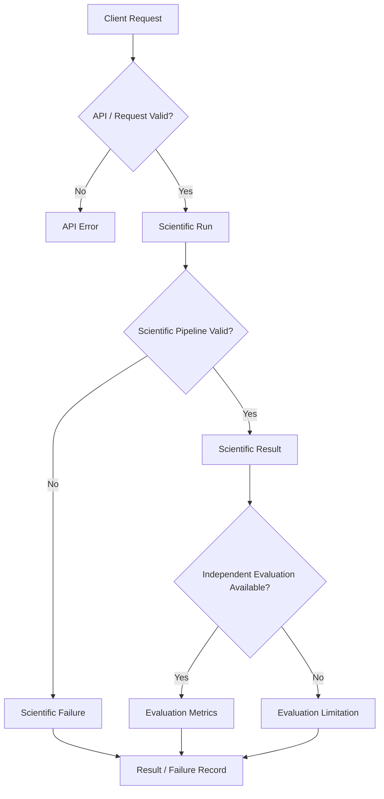
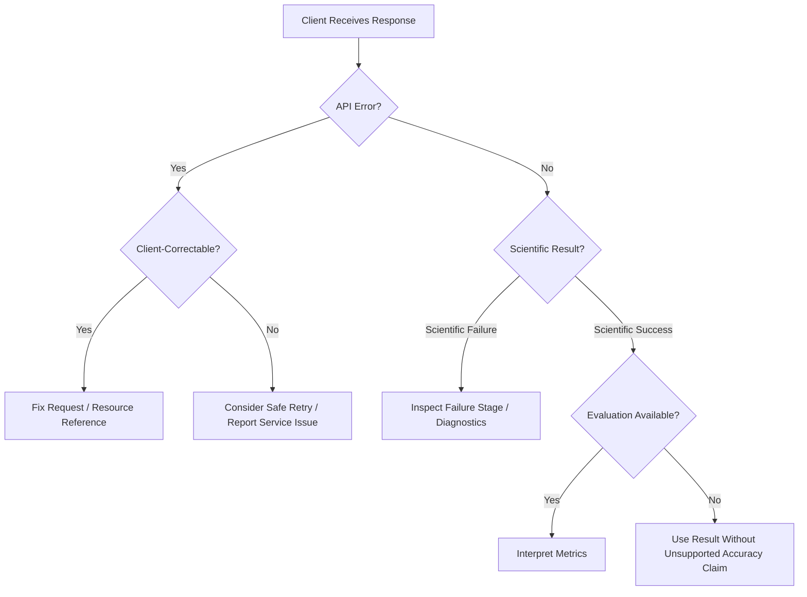
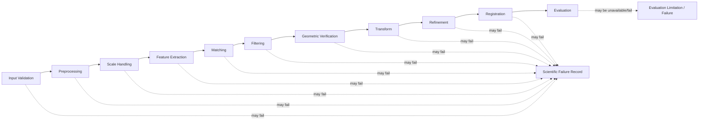
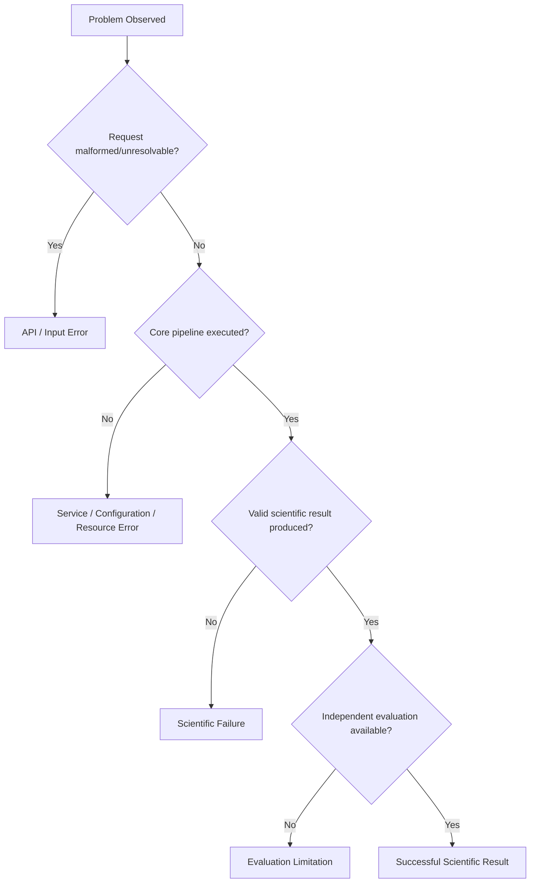

# API Error Codes and Failure Semantics

> **ChandraMap — API Error Model, Scientific Failure Semantics, and Client-Handling Guide**

This document defines how ChandraMap API clients should conceptually distinguish request errors, resource-resolution problems, unsupported scientific inputs, scientific registration failures, evaluation limitations, artifact problems, and backend/service faults.

> **In ChandraMap, a registration failure can be a valid scientific result. The API must distinguish that outcome from malformed requests and backend faults.**

The API is an interface to a scientific image-registration system. A request can therefore be processed correctly while the underlying scientific pipeline legitimately fails to produce a valid transformation.

> **API failure and scientific failure are different classes of events and must not be represented as though they mean the same thing.**

This distinction is fundamental to:

- reproducible benchmarking;
- correct client behavior;
- useful failure diagnostics;
- honest scientific reporting;
- stable API evolution.

No concrete error-code identifiers, numeric codes, HTTP mappings, status enums, retry flags, or wire-schema fields are asserted by this document unless they are established by the repository implementation or an authoritative API schema.

> **Do not invent a numeric error-code system simply to make the API look complete.**

The current role of this document is therefore to define **conceptual error and failure semantics**.

---

## Relationship to Other API Documentation

The API documentation files have different responsibilities.

| Document                     | Responsibility                                                                            |
| ---------------------------- | ----------------------------------------------------------------------------------------- |
| [`README.md`](README.md)     | API documentation entry point and navigation                                              |
| [`overview.md`](overview.md) | Conceptual API/system model                                                               |
| `endpoints.md`               | Endpoint-level operations where documented                                                |
| `schemas.md`                 | Request, response, and serialized data-contract semantics where documented                |
| **`error-codes.md`**         | Error taxonomy, scientific-failure distinction, retry guidance, and client interpretation |

This file must not duplicate the complete endpoint or schema documentation.

If a concrete error-response schema is defined in `schemas.md`, that schema becomes the serialization source of truth.

---

## Relationship to Scientific Failure Documentation

Project-wide scientific failure semantics belong in:

`../evaluation/failure-cases.md`

The distinction is:

### Scientific Failure Documentation

Defines:

- scientific failure stages;
- diagnostic interpretation;
- research meaning;
- benchmark treatment;
- likely scientific causes where evidence exists.

### API Error Documentation

Defines how clients distinguish:

- request/API errors;
- scientific failures;
- evaluation limitations;
- artifact failures;
- backend/service failures.

> **The API should transport the scientific failure model, not redefine it.**

---

# 1. Error Documentation Status

Concrete error contracts must come from actual implementation.

If the repository defines stable:

- error identifiers;
- HTTP mappings;
- error-response fields;
- failure-stage enums;
- retry semantics;
- status enums;

those should be documented here exactly as implemented.

If they are not established, this file must remain conceptual.

At present, this document does **not** assert any concrete error-code identifiers.

It therefore uses descriptive categories such as:

- request validation;
- resource resolution;
- unsupported scientific input;
- configuration;
- scientific processing;
- evaluation limitation;
- artifact failure;
- internal service failure.

> **These are conceptual categories, not implemented error-code identifiers.**

---

# 2. Error Model Overview

| Class                        | Meaning                                                               | Scientific Run May Exist? |
| ---------------------------- | --------------------------------------------------------------------- | ------------------------: |
| Request validation           | Request is structurally invalid                                       |                        No |
| Resource resolution          | Required referenced resource cannot be resolved                       |                Usually no |
| Unsupported scientific input | Request is structurally valid but scientifically unsupported          |         Maybe not started |
| Configuration                | Scientific configuration cannot be resolved or validated              |                Usually no |
| Scientific failure           | Core pipeline executed but scientific validity was not achieved       |                       Yes |
| Evaluation limitation        | Registration may exist but independent evaluation cannot be completed |                       Yes |
| Artifact failure             | Scientific result may exist but artifact production/access failed     |                       Yes |
| Internal service failure     | Unexpected backend/service malfunction                                |       Possibly incomplete |

Actual behavior may vary by implementation.

The important requirement is preserving the semantic distinction.

---

# 3. Three Failure Planes

ChandraMap errors and failures can be understood through three major planes.

## Plane 1 — API / Transport

This plane concerns whether the client request can be understood and handled operationally.

Examples include:

- malformed request;
- invalid request structure;
- unresolvable required resource;
- backend exception;
- service unavailability.

These conditions occur at the interface or service level.

## Plane 2 — Scientific Execution

This plane concerns whether the scientific registration pipeline can produce a valid result.

Examples include:

- insufficient useful features;
- insufficient valid correspondence support;
- geometric verification failure;
- invalid transform;
- refinement failure;
- registration failure.

These may be expected scientific outcomes.

## Plane 3 — Evaluation

This plane concerns whether independent evaluation can be performed.

Examples include:

- independent truth unavailable;
- held-out check set unavailable;
- ground-space conversion unavailable;
- evaluation prerequisites incomplete.

These conditions do not automatically mean the registration itself failed.

> **Missing evaluation is not the same as scientific failure, and neither is the same as a server error.**

---

# 4. Error Plane Flow



A scientific failure belongs in the run/result model whenever possible.

It should not automatically be transformed into an API/service error.

---

# 5. Request Validation Errors

Request validation checks whether the client interaction is structurally acceptable before expensive scientific processing begins.

Conceptual examples include:

- missing required request information;
- malformed request structure;
- invalid primitive value type;
- inconsistent request structure;
- unsupported serialization shape.

Request validation belongs primarily to the API/interface layer.

It does not determine whether the lunar data can be registered scientifically.

For example:

```text
Structurally invalid request
        ↓
Reject before scientific execution
```

is different from:

```text
Structurally valid request
        ↓
Scientific pipeline runs
        ↓
RANSAC fails
```

---

# 6. Domain and Scientific Input Validation

A request can be syntactically valid while still being unsuitable for scientific processing.

Conceptual scientific-input problems include:

- unresolved source/reference roles;
- unsupported sensor representation;
- required physical-scale information unavailable;
- invalid pair definition;
- unusable raster representation;
- invalid coordinate-space context;
- incompatible derived representation.

These conditions belong to the scientific/data contract rather than ordinary request syntax.

> **Valid serialization does not imply valid science.**

---

# 7. Resource Resolution Errors

Conceptual resources may include:

- asset;
- pair;
- configuration;
- run;
- result;
- artifact;
- benchmark.

A resource-resolution problem occurs when a referenced entity is:

- unknown;
- unavailable;
- inaccessible;
- no longer resolvable;
- inconsistent with the request context.

No specific HTTP mapping is defined here.

No resource-specific error identifier is asserted.

---

# 8. Source and Reference Errors

Source and reference are different scientific roles.

Potential problems include:

- source asset cannot be resolved;
- reference asset cannot be resolved;
- pair does not identify the expected relationship;
- source/reference roles are ambiguous;
- representation is unsupported;
- coordinate context cannot be interpreted.

When possible, diagnostics should preserve which role caused the problem.

Avoid reducing all source/reference problems to a generic:

```text
image error
```

when the scientific distinction is known.

---

# 9. Sensor-Related Input Errors

Relevant ChandraMap sensor contexts include:

### Chandrayaan-2

- OHRC;
- TMC-2;
- IIRS.

### LRO / LROC

- NAC;
- WAC.

Potential sensor-related problems include:

- unsupported sensor identity;
- unsupported product state;
- missing required metadata;
- unsupported derived representation;
- incompatible scale context.

Approximate mission-level sensor values must not be used as exact validation constants.

> **Actual product metadata remains authoritative.**

---

# 10. IIRS-Specific Input Failures

IIRS is hyperspectral / imaging infrared data.

A scientifically valid registration path may require a documented 2D registration representation.

Conceptual IIRS-specific problems include:

- no supported registration-compatible representation;
- parent product cannot be resolved;
- derived representation lineage is missing;
- derived representation is incompatible with the selected pipeline.

The issue should not be described merely as:

```text
IIRS is invalid because it is not grayscale
```

The actual concern is scientific representation compatibility.

The API must not silently flatten or arbitrarily select spectral data to avoid a validation failure.

---

# 11. Configuration Errors

Scientific configuration errors occur before or during run initialization when the requested scientific configuration cannot be used validly.

Conceptual examples include:

- configuration cannot be resolved;
- configuration is incomplete;
- configuration is incompatible with the selected scientific version;
- required version-specific settings are absent;
- requested scientific options conflict.

This document defines no concrete configuration field names or numerical bounds.

---

# 12. Configuration Error vs. Scientific Failure

The distinction is:

```text
Invalid configuration
        ↓
Run should normally not begin meaningfully
```

versus:

```text
Valid configuration
        ↓
Scientific pipeline executes
        ↓
RANSAC cannot establish valid geometry
        ↓
Scientific failure
```

The second condition is not a configuration error merely because another configuration might have worked better.

---

# 13. Scientific Processing Failures

Project-wide scientific failure definitions belong in:

`../evaluation/failure-cases.md`

Potential observed stages may conceptually include:

- input validation;
- metadata interpretation;
- preprocessing;
- representation preparation;
- physical-scale handling;
- feature extraction;
- matching;
- filtering;
- geometric verification;
- transform fitting;
- refinement;
- final refit;
- registration;
- evaluation.

These names are conceptual stage descriptions.

They are **not** claimed to be implemented enum values.

> **A valid API request may produce a scientifically failed registration result.**

---

# 14. Feature-Extraction Failure

Feature extraction may produce insufficient useful support.

Conceptually:

```text
Valid lunar image
      ↓
Feature extraction
      ↓
Too few stable/useful features
      ↓
Scientific failure or insufficient-support result
```

This can arise from legitimate image content.

It is not automatically evidence of:

- corrupt backend code;
- service failure;
- malformed request.

---

# 15. Matching Failure

Feature extraction may succeed while matching fails to produce usable correspondence candidates.

Potential scientific conditions include:

- insufficient descriptor agreement;
- severe appearance differences;
- repetitive terrain ambiguity;
- insufficient overlap evidence.

Candidate correspondences remain hypotheses.

> **Candidate match ≠ verified inlier.**

A matching failure should not be described as RANSAC failure if geometric verification was never meaningfully reached.

---

# 16. Filtering Failure

Candidate filtering may leave insufficient correspondence support.

Conceptually:

```text
Candidate Correspondences
        ↓
Filtering
        ↓
Too Little Valid Support
        ↓
Scientific Failure
```

The observed stage may be filtering.

The underlying cause may instead involve:

- physical scale mismatch;
- illumination difference;
- sensor modality;
- descriptor ambiguity;
- low-feature terrain.

> **Observed failure stage and suspected root cause should remain separate.**

---

# 17. RANSAC / Geometric Verification Failure

RANSAC and related robust geometry stages are expected points of scientific failure.

Possible contributing conditions may include:

- insufficient valid correspondences;
- high outlier fraction;
- degenerate geometry;
- unsuitable model family;
- repetitive-pattern ambiguity.

However:

> **RANSAC failure is a scientific failure mode, not automatically a backend failure.**

Conceptually:

```text
API processing
    → healthy

Core execution
    → completed normally

RANSAC
    → no scientifically valid geometric model

Result
    → scientific failure
```

The API should preserve this distinction.

---

# 18. Transform Failure

Potential transformation problems include:

- no valid model can be estimated;
- estimated geometry is degenerate;
- transform contains invalid numerical values;
- transform fails scientific validation.

A failed transform must not silently become an identity transform.

> **Invalid transform must not become identity success.**

If the core engine rejects the transform, the API should preserve that scientific result.

---

# 19. Refinement Failure

Where optional refinement is enabled, refinement itself may fail.

Possible scientific policies may include:

- reject only unsuccessfully refined points;
- fall back to validated unrefined support;
- invalidate the run;
- disable refinement under defined conditions.

The correct behavior must come from the authoritative core specification.

The API must not invent fallback behavior.

---

# 20. Final-Refit Failure

For a refined V1 path:

```text
Verify
  ↓
Refine
  ↓
Refit
```

the final transformation should correspond to the refined accepted support.

If final refitting fails to produce valid geometry, the API should not:

- retain an unrelated stale transform;
- label the run successfully refined;
- hide the failure.

The core pipeline decides scientific validity.

The API exposes that decision.

---

# 21. Registration / Warp Failure

A transformation may be estimated while registration/warping still cannot produce a valid output.

Potential conceptual issues include:

- transform cannot be applied validly;
- output geometry is invalid;
- output grid cannot be interpreted;
- raster operation fails scientific validation.

Distinguish:

### Expected Scientific/Processing Rejection

The core determines the requested registration output is invalid.

### Unexpected Implementation Exception

Backend or scientific code crashes unexpectedly.

These belong to different error classes.

---

# 22. Evaluation Limitations

Evaluation limitations are not automatically registration failures.

A run may produce a valid transformation while independent accuracy evidence remains unavailable.

Potential reasons include:

- no independent truth;
- insufficient held-out check points;
- truth version unavailable;
- incompatible truth coordinate context;
- ground-space interpretation unavailable.

Conceptually:

```text
Valid Registration
       ↓
No Independent Truth
       ↓
Evaluation Unavailable
```

not:

```text
Valid Registration
       ↓
No Independent Truth
       ↓
Registration Failed
```

unless a particular benchmark explicitly requires that truth for success.

---

# 23. Missing Check Truth

If a valid transformation exists but held-out truth does not:

- preserve the registration result;
- report independent evaluation as unavailable;
- avoid fabricated check error.

Do not report:

```text
RMSE = 0
```

to mean:

```text
RMSE was not measured
```

> **Unavailable scientific metrics must not be encoded as zero merely because a run failed before those metrics existed.**

---

# 24. Ground-Error Unavailable

Ground-space or metre-level evaluation may be unavailable when:

- no valid map/geospatial transformation exists;
- the reference cannot support physical-ground interpretation;
- the metric would require scientifically invalid conversion.

This is generally an evaluation limitation.

The API must not manufacture metre-level error using an approximate mission-level GSD.

---

# 25. Artifact Failures

A scientific result may exist even when a generated artifact does not.

Potential artifact problems include:

- preview generation failure;
- visualization generation failure;
- large raster export failure;
- artifact-storage problem;
- artifact access failure.

An artifact problem should not automatically destroy an otherwise valid scientific result.

---

# 26. Result vs. Artifact Failure

> **A failed visualization does not automatically invalidate a valid scientific transform.**

Likewise:

> **A successful-looking preview does not prove scientific validity.**

These concepts must remain separate:

```text
Scientific Result
        +
Artifact Generation
```

rather than:

```text
Artifact Exists
        =
Scientific Success
```

---

# 27. Internal Service Errors

Internal service errors are backend or infrastructure faults unrelated to expected scientific failure.

Conceptual examples include:

- unexpected exception;
- serialization failure;
- storage/backend failure;
- service dependency failure;
- process crash;
- infrastructure malfunction.

These conditions should not be reported as scientific conclusions.

For example:

```text
backend serialization crashed
```

must not become:

```text
registration failed at RANSAC
```

unless RANSAC actually failed.

---

# 28. Unknown or Unexpected Failure

Sometimes the system may know that execution failed without knowing why.

In that situation:

> **Prefer an unknown/internal classification to an invented scientific explanation.**

Do not infer a root cause merely from:

- the final visible error;
- the last executed function;
- incomplete logs.

Client-facing output should avoid exposing raw internal exception details when inappropriate.

---

# 29. HTTP Status Semantics

HTTP status communicates request and service behavior.

Scientific result fields communicate registration and evaluation behavior.

These are separate contracts.

> **HTTP status communicates request/service behavior; it does not communicate registration accuracy.**

The following inference is invalid:

```text
HTTP request succeeded
        ↓
therefore lunar registration is scientifically correct
```

Likewise, a scientific registration failure need not imply a transport/server failure.

---

# 30. HTTP Status Mapping Rule

If exact HTTP mappings are established in implementation or schemas, document them exactly.

Until then:

> **Actual HTTP mappings are implementation-defined.**

This file intentionally does not assign specific HTTP numbers to:

- validation errors;
- missing resources;
- unsupported scientific inputs;
- scientific failure;
- evaluation unavailability;
- artifact failure;
- service faults.

---

# 31. API Error vs. Scientific Failure

| Scenario                                      |                     API Error? |                Scientific Failure? |   Run May Exist? |
| --------------------------------------------- | -----------------------------: | ---------------------------------: | ---------------: |
| Malformed request                             |                            Yes |                                 No |               No |
| Missing source reference                      | Yes / input-resolution problem |                                 No |       Usually no |
| Unsupported scientific representation         |         Input/domain rejection |                        No/Rejected |            Maybe |
| Feature extraction produces no useful support |    No transport error required |                                Yes |              Yes |
| Too few usable matches                        |    No transport error required |                                Yes |              Yes |
| RANSAC fails                                  |    No transport error required |                                Yes |              Yes |
| Final transform rejected                      |    No transport error required |                                Yes |              Yes |
| Check truth unavailable                       |                             No |            No registration failure |              Yes |
| Preview generation fails                      |         Artifact-level problem | Scientific result may remain valid |              Yes |
| Backend crashes unexpectedly                  |                            Yes |  Scientific outcome may be unknown | Maybe incomplete |

Exact runtime behavior remains implementation-defined.

---

# 32. Conceptual Error Taxonomy

No concrete error identifiers are asserted by this document.

The following categories are conceptual.

## Request Validation

Examples:

- malformed request;
- missing required request information;
- inconsistent request structure.

## Resource Resolution

Examples:

- asset unavailable;
- pair unavailable;
- configuration unavailable;
- result unavailable.

## Scientific Input

Examples:

- unsupported sensor;
- unsupported representation;
- missing required scientific metadata;
- invalid coordinate context.

## Configuration

Examples:

- unresolved configuration;
- incompatible scientific configuration;
- configuration/version mismatch.

## Scientific Processing

Examples:

- feature extraction failure;
- insufficient correspondence support;
- geometric verification failure;
- invalid transformation;
- registration failure.

## Evaluation

Examples:

- truth unavailable;
- metric unavailable;
- ground-space conversion unavailable.

## Artifact

Examples:

- artifact generation unavailable;
- artifact access unavailable.

## Service

Examples:

- internal processing exception;
- backend/storage failure;
- serialization failure.

> **These labels are descriptive categories, not stable wire-level identifiers.**

---

# 33. Conceptual Error Index

No concrete error-code identifiers are defined by this document.

| Conceptual Error Category | Meaning                                                        |   Run May Exist? |
| ------------------------- | -------------------------------------------------------------- | ---------------: |
| Request validation        | Client request is structurally invalid                         |               No |
| Resource resolution       | Required resource cannot be resolved                           |       Usually no |
| Scientific input          | Resolved data is scientifically unsupported/invalid            |            Maybe |
| Configuration             | Scientific configuration cannot be used                        |       Usually no |
| Scientific processing     | Core execution cannot produce required scientific result       |              Yes |
| Evaluation limitation     | Registration may exist but evaluation is unavailable           |              Yes |
| Artifact problem          | Result may exist while an artifact cannot be produced/accessed |              Yes |
| Internal service          | Backend/service malfunction                                    | Maybe incomplete |

If stable concrete codes are introduced later, this section should be replaced or supplemented by a verified code index.

---

# 34. Error Response Schema

If an authoritative error schema exists in `schemas.md`, that schema should be used.

Otherwise the following is conceptual only.

> **Illustrative conceptual error structure — not an implemented wire schema.**

```yaml
error:
  category: PLACEHOLDER_CATEGORY
  message: PLACEHOLDER_MESSAGE

  request_id: PLACEHOLDER_OR_NULL
  run_id: PLACEHOLDER_OR_NULL

  details:
    resource: PLACEHOLDER_OR_NULL
    field: PLACEHOLDER_OR_NULL
    scientific_stage: PLACEHOLDER_OR_NULL

  retry:
    recommended: PLACEHOLDER_BOOLEAN_OR_UNSPECIFIED
```

The field names above are examples only.

They must not be treated as implementation contracts.

---

# 35. Scientific Failure Result

Scientific failure should not automatically be forced into the same representation as an API request error.

A scientific run may have a proper result record whose status is unsuccessful.

> **Illustrative conceptual structure — not an implemented schema.**

```yaml
result:
  run_id: PLACEHOLDER_RUN_ID
  scientific_status: PLACEHOLDER_FAILED_STATUS

  failure:
    observed_stage: PLACEHOLDER_STAGE
    last_successful_stage: PLACEHOLDER_STAGE
    diagnostic: PLACEHOLDER_DIAGNOSTIC

  partial_results:
    candidate_count: PLACEHOLDER_OR_UNAVAILABLE
    filtered_count: PLACEHOLDER_OR_UNAVAILABLE
    inlier_count: PLACEHOLDER_OR_UNAVAILABLE

  provenance:
    config_id: PLACEHOLDER
    scientific_version: v1
    code_revision: PLACEHOLDER
```

A scientific failure record is part of scientific provenance.

---

# 36. Observed Failure Stage

The observed failure stage answers:

> **Where did the pipeline stop satisfying required scientific conditions?**

Potential conceptual stages include:

- validation;
- metadata;
- preprocessing;
- representation;
- physical scale;
- feature extraction;
- matching;
- filtering;
- geometric verification;
- transform estimation;
- refinement;
- final refit;
- registration;
- evaluation.

These are conceptual names.

They are not asserted to be implemented enum values.

---

# 37. Root Cause

Root cause answers:

> **Why did the run fail?**

The answer may be:

- confirmed;
- suspected;
- unknown.

The failure stage and root cause must remain separate.

> **Observed failure stage and suspected root cause should remain separate.**

For example:

```text
Observed failure stage:
geometric verification
```

does not prove:

```text
Root cause:
RANSAC algorithm defect
```

The actual cause could lie earlier in the pipeline.

---

# 38. Failure Stage vs. Cause Example

Suppose geometric verification cannot establish a valid model.

Observed stage:

```text
RANSAC / geometric verification
```

Possible causes may include:

- severe scale mismatch;
- repetitive crater patterns;
- illumination-driven descriptor mismatch;
- insufficient overlap;
- weak candidate correspondences;
- inappropriate model assumptions.

Without evidence, the result should not claim one of these as confirmed root cause.

A safe diagnostic may state what was observed without overdiagnosing why.

---

# 39. Partial Results

Scientific failure does not always erase prior valid evidence.

A failed run may still have:

- feature counts;
- candidate correspondence counts;
- filtered counts;
- partial inlier information;
- preprocessing outputs;
- diagnostic artifacts;
- execution timings.

These may be valuable for:

- debugging;
- failure analysis;
- benchmark characterization;
- later method comparison.

> **Partial evidence may remain scientifically useful even when the final transform is unavailable.**

---

# 40. Partial Result Caution

Partial outputs must be clearly distinguished from final successful outputs.

For example:

```text
candidate_count
```

may remain meaningful after RANSAC failure.

But:

```text
final_transform
```

should not contain a placeholder matrix that looks valid.

Clients should not need to guess whether a value is:

- final;
- partial;
- unavailable.

---

# 41. Unavailable Metrics

Scientific outputs should distinguish:

| State                     | Meaning                                    |
| ------------------------- | ------------------------------------------ |
| Zero                      | A valid measured quantity equal to zero    |
| Unavailable               | Required information does not exist        |
| Not applicable            | Metric does not apply to this case         |
| Not evaluated             | Evaluation was intentionally not performed |
| Failed before measurement | Pipeline did not reach the metric          |
| Measured                  | Valid metric exists                        |

> **Missing metric ≠ zero.**

This is especially important for:

- RMSE;
- coverage;
- ground-space error;
- check-point metrics.

---

# 42. Missing Metric Example

Suppose geometric verification fails.

There is no valid final transformation.

Held-out check RMSE therefore may be:

```text
unavailable
```

because the required transformation never existed.

It must not become:

```text
0
```

or a fabricated large value.

The absence of a valid metric is itself meaningful state.

---

# 43. Client Action Guidance

Different classes require different handling.

| Conceptual Class             | Typical Client Handling                                                  |
| ---------------------------- | ------------------------------------------------------------------------ |
| Request validation           | Correct request structure/input                                          |
| Resource resolution          | Verify requested resource identity/access                                |
| Unsupported scientific input | Select supported product/representation or correct metadata              |
| Configuration                | Correct or select compatible scientific configuration                    |
| Scientific failure           | Inspect run diagnostics and failure stage                                |
| Evaluation limitation        | Use registration result without claiming unavailable evaluation evidence |
| Artifact failure             | Preserve result; retry/recover artifact operation where supported        |
| Internal service failure     | A safe retry may be appropriate depending on implementation              |

These are general guidelines.

They are not automatic retry rules.

---

# 44. Retryability

Retry behavior depends on the class of failure.

## Likely Client-Correctable

Examples:

- malformed request;
- unresolvable resource reference;
- invalid configuration.

The client should normally correct the request rather than resend it unchanged.

## Likely Scientifically Deterministic

Example:

```text
same source
+
same reference
+
same scientific configuration
+
insufficient geometric support
```

Blind repeated execution may reproduce the same outcome.

## Potentially Transient

Examples may include:

- temporary storage failure;
- temporary service dependency issue;
- transient infrastructure problem.

## Unknown

Where the system cannot safely determine retryability, it should not pretend certainty.

No stable retry flag is asserted by this document.

---

# 45. Scientific Failure Retries

> **Retrying the same scientific run without changing any scientific condition should not be treated as a substitute for diagnosis.**

Some algorithms, including robust estimation methods, may use randomness.

A repeated run could therefore differ.

However, unlimited retries can hide:

- unstable scientific behavior;
- poor correspondence support;
- weak geometric evidence.

Retry policy should never be used to transform an unreliable method into apparent success.

---

# 46. Idempotency Context

If the API later supports:

- idempotency;
- deduplication;
- duplicate-run detection;

the exact behavior should be documented from implementation.

This document does not define:

- idempotency headers;
- request hashes;
- duplicate-detection rules.

---

# 47. Request ID, Run ID, Job ID, and Error ID

Different identifiers may exist.

### Request ID

Tracks one API interaction.

### Run ID

Tracks one scientific execution.

### Job ID

May track backend orchestration if asynchronous processing exists.

### Error ID

May identify a diagnostic/error occurrence if an implementation defines one.

These concepts should not automatically be treated as interchangeable.

No ID formats are defined here.

---

# 48. Scientific Version Context

Scientific failures should remain traceable to the scientific methodology that produced them.

For example:

```text
ChandraMap V1
```

may produce a geometric verification failure under its classical baseline.

That failure must not be interpreted as meaning:

```text
API version 1
```

or:

```text
all future ChandraMap versions fail
```

> **Scientific version identity should survive into failure records.**

---

# 49. Error Versioning

Error semantics may evolve as the API and scientific system evolve.

Potential changes include:

- new conceptual categories;
- stable code identifiers being introduced;
- fields being added to error payloads;
- failure-stage taxonomy being extended;
- retry meaning changing;
- version-specific scientific failures being introduced.

Breaking semantic changes should not occur silently.

---

# 50. API Version vs. Error Version

If an implementation eventually introduces an independently versioned error contract, document it explicitly.

Otherwise, error serialization will normally evolve with the surrounding API/schema contract.

This document does not invent a standalone error-version number.

---

# 51. Scientific Version vs. Error Category

Different ChandraMap scientific versions may introduce new failure modes.

For example:

### V1

Known-pair local registration failures.

### V3

May introduce retrieval-specific failure concepts.

### V4

May introduce terrain/DEM or advanced multimodal failure concepts.

These should not be forced into the V1 failure taxonomy before the corresponding scientific capabilities exist.

---

# 52. V1 Failure Context

V1 remains focused on:

> **Known-pair local lunar registration.**

Therefore its scientific failure model should focus on areas such as:

- scientific input validity;
- preprocessing;
- physical-scale compatibility;
- feature extraction;
- candidate matching;
- filtering;
- geometric verification;
- transform estimation;
- refinement;
- registration;
- evaluation.

V1 does not require failure categories for:

- global retrieval;
- FAISS search;
- Top-K ranking.

---

# 53. V2 Future Extension

V2 may introduce stronger local-registration stages or additional local methods.

Those may create additional scientifically meaningful failure modes.

Do not define concrete V2 error identifiers here.

The V2 specification should determine whether new categories are necessary.

---

# 54. V3 Future Extension

A retrieval-enabled later version may introduce conceptual failures such as:

- query representation cannot be created;
- global descriptor unavailable;
- no suitable reference candidate;
- retrieval ranking unavailable.

These belong to retrieval.

They are separate from local registration failure.

No concrete V3 codes are defined here.

---

# 55. V4 Future Extension

Future advanced versions may introduce failure concepts related to:

- DEM availability;
- terrain geometry;
- multi-mission compatibility;
- advanced multimodal representations;
- uncertainty estimation.

These remain future scientific concepts.

They should not be added prematurely to the V1 error model.

---

# 56. Retrieval vs. Registration Failure

These failures answer different questions.

## Retrieval Failure

The system cannot identify a suitable reference candidate.

## Registration Failure

A reference is already known or selected, but the source cannot be validly aligned to it.

Conceptually:

```text
Retrieval
→ Which reference?

Registration
→ How do source and reference align?
```

The API should not label both failures simply:

```text
matching failed
```

when their scientific meaning differs.

---

# 57. FAISS Failure Context

If a future version uses FAISS, FAISS would provide vector-search infrastructure.

A FAISS/index problem belongs to:

- retrieval infrastructure;
- reference discovery.

It is not the same as:

- feature matching;
- RANSAC;
- transformation estimation;
- registration.

A vector-index failure must not be misreported as geometric registration failure.

---

# 58. Evaluation Failure vs. Evaluation Unavailable

These concepts may differ.

## Evaluation Unavailable

Required evaluation information does not exist.

Example:

- no held-out truth.

## Evaluation Failure

Evaluation was expected/attempted but could not be completed validly.

Example:

- truth exists but cannot be interpreted due to invalid coordinate mapping.

The exact implementation semantics should come from the evaluation contract.

They should not be collapsed automatically.

---

# 59. Benchmark Failure Context

See:

- [`../versions/v1/benchmark.md`](../versions/v1/benchmark.md)
- `../evaluation/benchmark-protocol.md`
- `../evaluation/success-criteria.md`

A valid benchmark pair may legitimately fail under V1.

That run remains part of the benchmark.

> **Scientific method failure on valid benchmark data is not the same as an invalid benchmark case.**

---

# 60. Invalid Benchmark Case vs. Method Failure

| Condition              | Meaning                                                            |
| ---------------------- | ------------------------------------------------------------------ |
| Method failure         | Benchmark case is valid; method fails scientifically               |
| Invalid benchmark case | Pair/data/truth definition itself is invalid                       |
| Evaluation unavailable | Scientific run may exist but independent evaluation is unavailable |
| API/service failure    | Infrastructure prevents reliable execution                         |

These categories should remain separate during benchmark aggregation.

---

# 61. Security of Error Responses

See [`../../SECURITY.md`](../../SECURITY.md) for repository-level security guidance.

Client-facing error responses should not expose:

- passwords;
- tokens;
- API keys;
- secret environment values;
- database credentials;
- private infrastructure addresses;
- unsafe filesystem paths;
- raw internal stack traces.

> **Error responses should provide useful client context without exposing secrets, unsafe paths, stack traces, or sensitive internal details.**

---

# 62. Safe Error Messages

Client-facing messages should be:

- concise;
- useful;
- understandable;
- actionable where appropriate;
- safe for the intended audience.

Detailed internal debugging information may belong in controlled logs or diagnostics.

It should not automatically be serialized to every client.

---

# 63. Path Disclosure

Avoid exposing raw server filesystem paths in normal client-facing errors.

For example, an error should not need to reveal internal paths merely to communicate:

```text
requested asset could not be resolved
```

Where public artifact/resource references exist, use the implementation's safe resource abstraction.

---

# 64. Stack Trace Disclosure

Raw stack traces are implementation diagnostics.

They should not become part of the normal public API error contract.

They can expose:

- internal package names;
- file paths;
- implementation structure;
- potentially sensitive values.

No stack-trace field is defined by this document.

---

# 65. Error Logging

Internal logs may conceptually capture:

- request identity;
- run identity;
- job identity where applicable;
- error category;
- failure stage;
- timestamp;
- internal diagnostic context.

Logs must not intentionally include secrets.

Logging technology is implementation-defined.

---

# 66. Scientific Failure Logging

Scientific failures should not exist only in logs.

Where possible, the structured run/result record should preserve:

- scientific status;
- failure stage;
- available diagnostics;
- provenance;
- partial evidence.

This is necessary for:

- benchmarking;
- reproducibility;
- failure analysis;
- later version comparison.

---

# 67. Error Message Stability

Human-readable error text is primarily for humans.

Clients should not be encouraged to parse messages such as:

```text
"Could not process image"
```

as stable machine identifiers.

If stable structured identifiers are implemented, document them.

If not, do not pretend free-form message text is a stable contract.

---

# 68. Localization and Human Text

Human-readable message wording may change.

This document does not claim localization support.

Machine clients should rely on stable structured semantics only when the implementation actually defines such fields.

---

# 69. Validation Detail

Validation responses may conceptually identify:

- affected request concept;
- affected resource;
- reason for rejection.

However, detail should not expose:

- secret configuration;
- internal filesystem structure;
- implementation-sensitive information.

---

# 70. Multiple Validation Problems

An implementation may choose to return:

- one validation problem;
- several validation problems.

This document does not define which behavior applies.

Do not invent a batch-validation schema without repository support.

---

# 71. Unsupported Feature Errors

A client may request functionality not supported by the selected scientific version.

Conceptually:

```text
Scientific version: V1
Requested capability: global retrieval
```

may be incompatible.

This should be represented as an unsupported version/capability condition rather than an arbitrary internal service error.

No concrete code is defined here.

---

# 72. Version / Capability Compatibility

Scientific version and requested capability should be compatible.

Conceptually:

```text
Selected Version
        +
Requested Capability
        ↓
Compatibility Check
```

A version mismatch is different from scientific registration failure.

The registration method should not be executed under silently altered semantics merely to make an unsupported request succeed.

---

# 73. Configuration / Version Mismatch

A configuration intended for one scientific version may not be valid for another.

The system should not silently reinterpret a configuration across versions if doing so changes its scientific meaning.

A mismatch should be handled explicitly.

---

# 74. Data and Product Errors

Potential scientific data problems include:

- unreadable/corrupt asset;
- unsupported product representation;
- required metadata missing;
- invalid nodata/mask context;
- unusable derived representation;
- inconsistent parent lineage.

Mission-specific archive error codes are outside this document unless actually implemented.

---

# 75. Coordinate-Semantics Errors

Coordinates cannot be scientifically interpreted when their coordinate space is unknown or inconsistent.

Potential contract problems include:

- source coordinate space missing;
- reference coordinate space missing;
- crop mapping unavailable;
- pyramid-level mapping unavailable;
- incompatible coordinate conventions.

The system should not silently assume native pixel space.

> **Unknown coordinate space is a scientific contract problem, not cosmetic missing metadata.**

---

# 76. Transform-Semantics Errors

A transformation is incomplete if scientifically required context is missing.

Conceptually, a transform may require:

- model;
- parameters;
- direction;
- source coordinate space;
- reference coordinate space;
- validity state.

A bare numerical matrix should not automatically be accepted as complete scientific output.

---

# 77. Metric-Semantics Errors

Scientific metrics require context.

For example, an authoritative RMSE generally needs:

- units;
- coordinate space;
- point population;
- sample count where applicable;
- metric definition/version where relevant.

An API/result contract that loses these semantics may produce scientifically unsafe output even if the numerical value itself is valid.

---

# 78. Ground-Error Semantics

If conversion to ground units is not scientifically justified, ground-space evaluation should remain unavailable.

The API must not calculate metres from approximate instrument GSD merely to fill a response field.

---

# 79. Artifact Access Errors

Artifact access failure should remain distinguishable from scientific-result failure.

Conceptually:

```text
Scientific result
    → valid

Registered preview access
    → unavailable
```

should remain possible.

The client should not be forced to interpret this as:

```text
scientific transform invalid
```

---

# 80. Error Response Examples

Examples in this document are conceptual unless tied to verified repository schemas.

They must not contain:

- fabricated stable error codes;
- fabricated production identifiers;
- secrets;
- invented benchmark results;
- fake accuracy measurements.

---

# 81. Conceptual Request Error Example

> **Illustrative conceptual example — category and fields are not claimed as implemented.**

```yaml
error:
  category: request_validation
  message: PLACEHOLDER_MESSAGE
  request_id: PLACEHOLDER

  details:
    field: PLACEHOLDER_FIELD
    reason: PLACEHOLDER_REASON
```

---

# 82. Conceptual Scientific Failure Example

> **Illustrative conceptual example only.**

```yaml
result:
  run_id: PLACEHOLDER_RUN_ID
  scientific_version: v1
  scientific_status: PLACEHOLDER_FAILED

  failure:
    observed_stage: PLACEHOLDER_GEOMETRIC_VERIFICATION_STAGE
    diagnostic: PLACEHOLDER_DIAGNOSTIC

  partial_results:
    candidate_count: PLACEHOLDER
    filtered_count: PLACEHOLDER
    inlier_count: PLACEHOLDER_OR_UNAVAILABLE

  evaluation:
    check_rmse: UNAVAILABLE
```

The scientific failure remains part of the run/result contract rather than being represented as an arbitrary transport failure.

---

# 83. Conceptual Evaluation-Limitation Example

> **Conceptual only — not an implemented schema.**

```yaml
result:
  run_id: PLACEHOLDER_RUN_ID
  scientific_status: PLACEHOLDER_SUCCESS_OR_VALID

  evaluation:
    availability: PLACEHOLDER_UNAVAILABLE
    reason: PLACEHOLDER_TRUTH_NOT_AVAILABLE
```

This example demonstrates that successful registration and unavailable independent evaluation can coexist.

---

# 84. Client Error-Handling Flow



Clients should make decisions based on the class of outcome rather than simply retrying every non-successful response.

---

# 85. Failure-Stage Flow



This diagram is conceptual.

Actual stages remain governed by the versioned scientific pipeline.

---

# 86. Error Classification Flow



---

# 87. Concrete Error-Code Documentation Template

If stable error identifiers are later implemented, document each verified code using a structure such as:

### `<ERROR_CODE>`

**Category**

Actual implemented category.

**Meaning**

Precise meaning of the code.

**Triggered when**

Verified condition from implementation.

**API / Scientific?**

Which failure plane it belongs to.

**Run created?**

Only if known.

**Retryable?**

Only if explicitly defined.

**Client action**

Recommended handling.

**Related scientific stage**

Where relevant.

**Related endpoint(s)**

Only actual endpoints.

**Example**

Safe example using placeholder values.

This section intentionally provides **no fabricated error code**.

---

# 88. Conceptual Error-Category Template

Until concrete error identifiers exist:

### `<Conceptual Error Category>`

**Meaning**

What class of condition it represents.

**Scientific impact**

Whether scientific execution may begin or continue.

**Typical client action**

General handling guidance.

**Implementation status**

No stable error identifier is defined by this document.

---

# 89. Error Testing Strategy

Testing should ensure the interface preserves correct error semantics.

## Request Validation Tests

Test cases may include:

- malformed request rejected;
- required request information missing;
- unresolved resource reference;
- invalid request structure.

## Scientific Input Tests

Test cases may include:

- unsupported representation;
- missing required scale context;
- invalid coordinate metadata;
- unsupported IIRS representation.

## Scientific Failure Tests

Test cases may include:

- no usable features;
- too few valid matches;
- geometric verification failure;
- invalid transformation;
- registration failure.

## Evaluation Tests

Test cases may include:

- truth unavailable;
- held-out evaluation unavailable;
- ground-space metric unavailable;
- missing metrics not serialized as zero.

## Service Error Tests

Test cases should verify:

- internal backend exceptions remain service problems;
- scientific failure is not relabeled as backend failure.

## Security Tests

Test cases should verify:

- no secret exposure;
- no unsafe path disclosure;
- no unintended stack-trace disclosure.

---

# 90. Error Test Matrix

| Scenario                                    | Expected Error / Failure Class |  Scientific Run? |
| ------------------------------------------- | ------------------------------ | ---------------: |
| Malformed request                           | Request validation             |               No |
| Unknown required asset                      | Resource resolution            | No / not started |
| Unsupported IIRS representation             | Scientific input               |    No / rejected |
| No useful keypoints                         | Scientific failure             |              Yes |
| Too few valid matches                       | Scientific failure             |              Yes |
| RANSAC cannot fit valid model               | Scientific failure             |              Yes |
| Invalid transform                           | Scientific failure             |              Yes |
| Missing check truth                         | Evaluation limitation          |              Yes |
| Preview generation fails after valid result | Artifact problem               |              Yes |
| Unexpected backend exception                | Service/internal               | Maybe incomplete |

Actual implementation behavior may refine these states.

---

# 91. Error Regression Testing

Regression tests should prevent changes that accidentally:

- convert scientific failure into generic server failure;
- encode unavailable RMSE as zero;
- remove failure-stage information;
- lose run provenance;
- expose secrets;
- expose internal paths;
- change error meaning silently;
- reinterpret historical V1 failure semantics under later versions;
- classify artifact failure as transform failure;
- treat missing evaluation as registration failure.

---

# 92. Observability and Correlation

If request/run/job identifiers are implemented, they may help correlate:

```text
API Request
    ↕
Backend Log
    ↕
Scientific Run
    ↕
Result / Failure Record
```

This document does not define:

- trace IDs;
- distributed tracing;
- observability vendors;
- correlation-header formats.

---

# 93. Operational Error Metrics vs. Scientific Metrics

Operational monitoring may track:

- API failures;
- server exceptions;
- storage problems;
- infrastructure availability.

Scientific evaluation may track:

- registration failures;
- geometric-verification failures;
- benchmark success/failure rates.

These must remain separate.

> **Backend reliability metrics and scientific registration metrics answer different questions.**

---

# 94. Service Reliability vs. Scientific Failure Rate

A backend may be fully operational while some lunar image pairs fail scientifically.

Conceptually:

```text
Service:
operating correctly

Scientific pipeline:
runs successfully as software

Registration outcome:
fails to establish valid geometry
```

This is not contradictory.

Likewise, a scientifically strong algorithm cannot compensate for an unavailable backend service.

---

# 95. Benchmark Failure Aggregation

See [`../versions/v1/benchmark.md`](../versions/v1/benchmark.md).

Scientifically failed valid pairs must remain part of benchmark reporting.

Do not:

- remove them;
- convert them to missing data;
- classify them as invalid benchmark cases merely because the method failed.

Method failure is evidence.

---

# 96. Error Documentation Checklist

## Source of Truth

- [ ] Concrete codes match actual implementation
- [ ] HTTP mappings match actual implementation
- [ ] Error response fields match actual schema
- [ ] Conceptual categories are clearly labeled
- [ ] No fabricated code identifiers are documented

## API / Scientific Separation

- [ ] API errors differ from scientific failures
- [ ] Evaluation limitations are separate
- [ ] Artifact problems are separate
- [ ] Service failures are separate
- [ ] HTTP success is not described as scientific success

## Scientific Failure

- [ ] Failure stage can be represented
- [ ] Root cause is not guessed
- [ ] Partial results can be preserved where appropriate
- [ ] RANSAC failure is treated as scientific failure
- [ ] Invalid transform does not become success
- [ ] Refinement/final-refit failure is handled honestly

## Metrics

- [ ] Missing RMSE is not encoded as zero
- [ ] Ground-space error may be unavailable
- [ ] Evaluation-unavailable semantics are explicit
- [ ] Scientific failure does not fabricate metrics

## Client Handling

- [ ] Client-correctable errors are distinguishable
- [ ] Scientific failures are diagnosable
- [ ] Retry guidance is cautious
- [ ] Deterministic scientific failure is not hidden by retries

## Security

- [ ] Error responses do not contain secrets
- [ ] Raw stack traces are not part of the normal public contract
- [ ] Internal paths are not exposed unnecessarily
- [ ] Logs do not contain secrets

## Versioning

- [ ] API version and scientific version are distinguishable
- [ ] V1 does not contain retrieval-failure semantics unnecessarily
- [ ] Future-version failures remain clearly conceptual until specified
- [ ] Breaking error-semantic changes are documented

## Reproducibility

- [ ] Scientific failures retain version context
- [ ] Scientific failures retain configuration context where possible
- [ ] Benchmark failures remain attributable to pair/version
- [ ] Partial results are traceable to their run

---

# 97. Error-Handling Anti-Patterns

Do **not**:

- invent `ERR_001`;
- invent `CHANDRAMAP_1001`;
- invent numeric error codes;
- invent HTTP mappings;
- use a generic internal-service error for every scientific failure;
- use successful HTTP handling as proof of scientific accuracy;
- convert RANSAC failure into a backend exception;
- convert missing truth into `RMSE = 0`;
- hide failed scientific runs;
- substitute identity transform after transform failure;
- fabricate registered output after scientific failure;
- retry the same scientific failure indefinitely;
- call failure stage the confirmed root cause;
- expose raw stack traces;
- expose internal filesystem paths;
- expose tokens, keys, or credentials;
- force clients to parse human-readable text as a stable machine contract;
- mix service failure rate with scientific registration failure rate;
- classify preview generation failure as invalid geometry automatically;
- insert V3 retrieval failures into V1 unnecessarily;
- change error semantics silently;
- fabricate examples that look like implemented error identifiers;
- silently reinterpret unsupported configuration;
- fabricate ground-space error;
- serialize unavailable metrics as zero.

---

# 98. Claims to Avoid

Do not claim without implementation evidence:

- "The API uses these error codes."
- "All API errors map to one specific HTTP status."
- "Scientific failures use a particular HTTP status."
- "The API uses RFC-style problem responses."
- "All error responses include trace IDs."
- "All errors are retryable."
- "RANSAC failure has a specific stable code."
- "Authentication errors use a specific code."
- "The API automatically retries failures."
- "The API never exposes internal details."
- "The error contract is stable."
- "The backend is production hardened."
- "V1 through V4 share one error enum."
- "All failures have known root causes."

Implementation must precede implementation claims.

---

# 99. Limitations

## Concrete Codes May Not Yet Exist

This document intentionally does not invent them.

## HTTP Mapping May Remain Implementation-Defined

The conceptual error model is independent from any one transport mapping.

## Framework Behavior May Evolve

Backend framework exception handling is outside the scope of this document unless established by implementation.

## Asynchronous Failure Semantics May Need Extension

Future job orchestration may introduce:

- job interruption;
- worker failure;
- cancellation;
- expiration.

No such stable states are asserted here.

## Artifact Handling May Evolve

Storage and artifact-access semantics may require additional error categories later.

## Future Versions May Add Scientific Failures

Retrieval, DEM-aware geometry, multimodal models, or multi-mission pipelines may require additional categories.

## Root Cause May Remain Unknown

Even when the observed failure stage is known, the underlying scientific cause may remain uncertain.

## Error Schemas Do Not Remove Scientific Uncertainty

Structured error representation improves interpretation.

It does not make ambiguous scientific failure causes certain.

---

# 100. Error Design Decision Questions

Before adding a new error code or category, ask:

1. Is this an API error or a scientific failure?
2. Did a scientific run actually begin?
3. Is this an evaluation limitation instead?
4. Is the observed stage known?
5. Is the root cause actually known?
6. Does the client need machine-stable classification?
7. Is an existing category sufficient?
8. Is the condition specific to one scientific version?
9. Is retryability actually known?
10. Would retrying identical scientific conditions change anything?
11. Should partial outputs survive?
12. Could the client message expose sensitive information?
13. Does this require a breaking API/schema change?
14. Does this category belong in V1 or a later version?
15. Is this an implementation bug rather than an expected scientific failure?
16. Is this an artifact problem rather than a scientific-result problem?
17. Is a missing metric being confused with zero?
18. Does the proposed category describe an observed stage or an unsupported causal conclusion?
19. Does the scientific failure need benchmark visibility?
20. Is a stable code actually useful to clients?

---

# 101. Error Evolution Principle

> **Add error structure when clients need stable behavior or the science needs clearer failure semantics; do not create codes merely to inflate the API surface.**

The error model should evolve only when there is a real need for:

- machine-stable handling;
- scientific distinction;
- reproducibility;
- compatibility;
- client action.

---

# 102. Error Model Summary

ChandraMap should preserve the following conceptual distinctions:

```text
Malformed / Unresolvable Request
        ↓
API / Input Error
```

```text
Valid Request
+
Invalid / Unsupported Scientific Input
        ↓
Domain / Input Rejection
```

```text
Valid Scientific Run
+
Registration Cannot Establish Valid Result
        ↓
Scientific Failure
```

```text
Valid Registration
+
Independent Truth Missing
        ↓
Evaluation Limitation
```

```text
Valid Scientific Result
+
Artifact Unavailable
        ↓
Artifact Problem
```

```text
Unexpected Backend Malfunction
        ↓
Internal Service Error
```

The API should preserve enough context to make these states:

- machine-readable where stable contracts exist;
- diagnosable;
- scientifically honest;
- reproducible;
- safe for clients.

The key principles are:

1. **API error ≠ scientific failure.**
2. **Scientific failure can be a valid result.**
3. **Evaluation unavailable ≠ registration failure.**
4. **Artifact failure ≠ automatically invalid science.**
5. **HTTP status ≠ scientific status.**
6. **Failure stage ≠ root cause.**
7. **Missing metric ≠ zero.**
8. **RANSAC failure is a scientific outcome.**
9. **Invalid transforms must fail honestly.**
10. **Partial evidence may remain useful.**
11. **Retry behavior depends on failure class.**
12. **Scientific version must remain traceable.**
13. **V1 should not contain unrelated retrieval failure semantics.**
14. **Future failure categories must preserve historical V1 meaning.**
15. **Concrete error codes must come from implementation.**
16. **Client-facing messages should be useful but safe.**
17. **Service reliability and registration success are different metrics.**
18. **Valid benchmark failures must remain visible.**
19. **Error output must not expose secrets or unsafe internal details.**
20. **Failure records should preserve reproducibility context whenever possible.**

---

# 103. Related API Documentation

## API Documentation

- [`README.md`](README.md) — API documentation entry point.
- [`overview.md`](overview.md) — conceptual API/system model.
- `endpoints.md` — endpoint-level interface documentation where present.
- `schemas.md` — authoritative request/response contract documentation where present.
- **`error-codes.md`** — error/failure interpretation and client-handling guidance.

Potential future API documentation areas may include:

- authentication;
- versioning;
- examples;
- OpenAPI;
- runs/jobs;
- artifact handling.

Only link those files once they exist.

---

## Related Project Documentation

Where present:

- `../project/goals.md`
- `../project/non-goals.md`
- [`../project/v1-scope.md`](../project/v1-scope.md)
- `../project/terminology.md`
- `../project/assumptions.md`
- `../project/limitations.md`

These define project-level scope and terminology that should not be redefined by API errors.

---

## Related Architecture Documentation

- [`../architecture/system-overview.md`](../architecture/system-overview.md)
- [`../architecture/v1-pipeline.md`](../architecture/v1-pipeline.md)
- [`../architecture/core-engine-architecture.md`](../architecture/core-engine-architecture.md)
- [`../architecture/backend-architecture.md`](../architecture/backend-architecture.md)
- [`../architecture/frontend-architecture.md`](../architecture/frontend-architecture.md)
- [`../architecture/module-map.md`](../architecture/module-map.md)
- [`../architecture/data-flow.md`](../architecture/data-flow.md)
- [`../architecture/output-flow.md`](../architecture/output-flow.md)

Especially important:

- `../architecture/backend-architecture.md` — interface/backend error ownership.
- `../architecture/core-engine-architecture.md` — scientific-failure ownership.

---

## Related Version Documentation

Known V1 documentation includes:

- [`../versions/README.md`](../versions/README.md)
- [`../versions/v1/README.md`](../versions/v1/README.md)
- [`../versions/v1/specification.md`](../versions/v1/specification.md)
- [`../versions/v1/scope.md`](../versions/v1/scope.md)
- [`../versions/v1/requirements.md`](../versions/v1/requirements.md)
- [`../versions/v1/architecture.md`](../versions/v1/architecture.md)
- [`../versions/v1/pipeline.md`](../versions/v1/pipeline.md)
- [`../versions/v1/inputs.md`](../versions/v1/inputs.md)
- [`../versions/v1/benchmark.md`](../versions/v1/benchmark.md)
- [`../versions/v1/exclusions.md`](../versions/v1/exclusions.md)

Where files such as `outputs.md`, `acceptance-criteria.md`, or `limitations.md` exist, they should also be consulted and linked.

---

## Related Sensor Documentation

Where present:

- [`../sensors/overview.md`](../sensors/overview.md)
- `../sensors/ohrc.md`
- `../sensors/tmc2.md`
- `../sensors/iirs.md`
- `../sensors/lro-nac.md`
- `../sensors/lro-wac.md`

Sensor-specific error semantics should follow scientific sensor contracts rather than API assumptions.

---

## Related Dataset Documentation

Where present:

- `../datasets/README.md`
- `../datasets/chandrayaan-2.md`
- `../datasets/lro.md`
- `../datasets/metadata.md`
- `../datasets/data-format.md`
- `../datasets/dataset-structure.md`
- `../datasets/dataset-preparation.md`
- `../datasets/pair-definition.md`
- `../datasets/ground-truth-preparation.md`

These documents govern scientific input identity and preparation.

---

## Related Algorithm Documentation

Where the corresponding files exist:

- `../algorithms/overview.md`
- `../algorithms/sensor-routing.md`
- `../algorithms/preprocessing.md`
- `../algorithms/illumination-handling.md`
- `../algorithms/scale-pyramid.md`
- `../algorithms/sift.md`
- `../algorithms/matching.md`
- `../algorithms/match-filtering.md`
- `../algorithms/ransac.md`
- `../algorithms/transforms.md`
- `../algorithms/residual-analysis.md`
- `../algorithms/subpixel-refinement.md`
- `../algorithms/registration.md`

Algorithm-level failure behavior should be interpreted through the scientific pipeline rather than rewritten in API handlers.

---

## Related Evaluation Documentation

Where present:

- `../evaluation/README.md`
- `../evaluation/benchmark-protocol.md`
- `../evaluation/benchmark-categories.md`
- `../evaluation/metrics.md`
- `../evaluation/ground-truth.md`
- `../evaluation/control-points.md`
- `../evaluation/checkpoint-evaluation.md`
- `../evaluation/spatial-coverage.md`
- `../evaluation/stress-tests.md`
- `../evaluation/success-criteria.md`
- `../evaluation/failure-cases.md`
- `../evaluation/reproducibility.md`

`../evaluation/failure-cases.md` is particularly important.

It should remain the scientific source of truth for failure interpretation, while this document describes how those outcomes cross the API boundary.

---

## Data Licenses

Where present:

`../data-licenses.md`

Artifact and data-access failures may sometimes reflect data availability or redistribution constraints rather than scientific registration failure.

---

## Root Documentation

From `docs/api/error-codes.md`, repository-root documentation is two levels above.

Where present:

- [`../../README.md`](../../README.md)
- [`../../ROADMAP.md`](../../ROADMAP.md)
- [`../../CHANGELOG.md`](../../CHANGELOG.md)
- [`../../CONTRIBUTING.md`](../../CONTRIBUTING.md)
- [`../../SECURITY.md`](../../SECURITY.md)
- [`../../CITATION.cff`](../../CITATION.cff)

These documents govern broader repository, contribution, security, release, and citation practices.

<!-- Source request: :contentReference[oaicite:0]{index=0} -->
