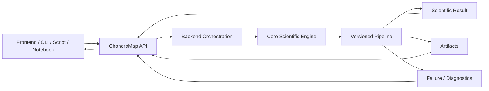
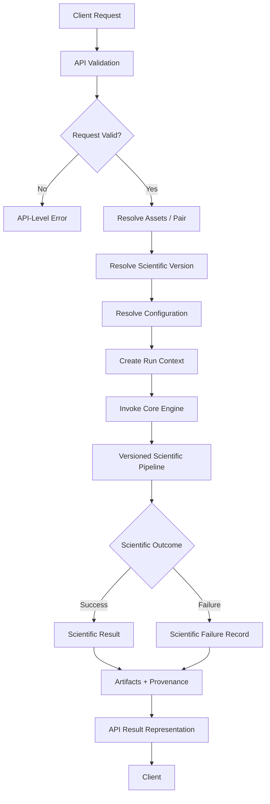
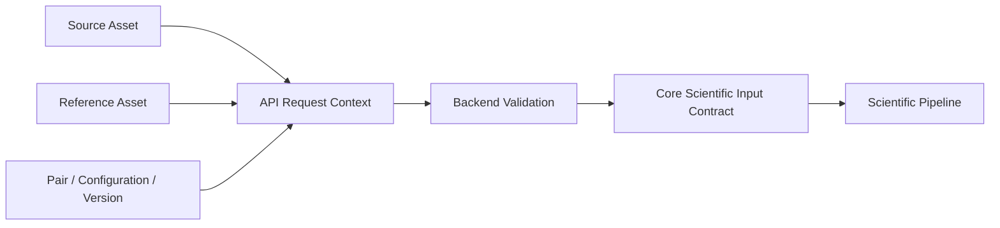
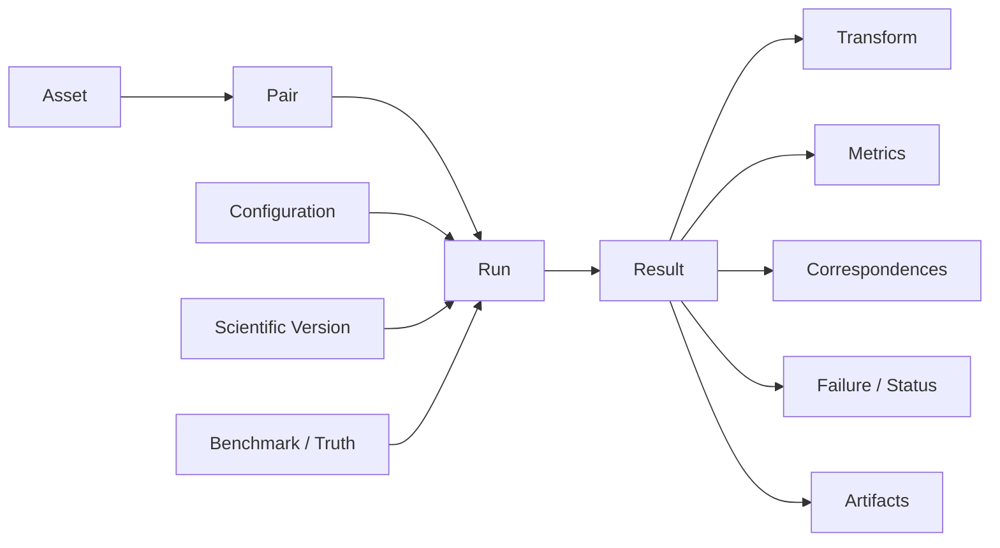
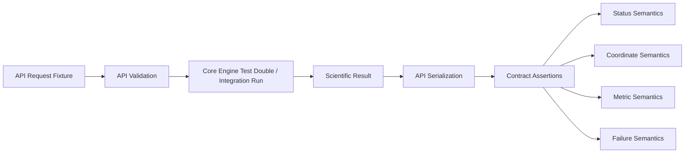

# API Overview

> **ChandraMap — Conceptual API and Scientific Workflow Overview**
> **Purpose:** Explain how programmatic clients interact with ChandraMap without moving scientific logic out of the core engine.

The ChandraMap API is the conceptual programmatic boundary between client applications and the project's scientific image-correspondence and registration engine.

It allows software clients to describe scientific work, identify source and reference data, select a scientific version and configuration, initiate or inspect processing, and obtain structured scientific results and artifacts.

> **The ChandraMap API is a programmatic interface to the scientific engine, not an alternative implementation of the scientific engine.**

The API does not own the mathematics of image registration. Scientific algorithms remain inside the core engine and version-specific scientific pipelines.

> **HTTP and backend orchestration should transport scientific intent and scientific results without redefining their meaning.**

The same scientific operation should retain the same meaning whether invoked through an API, CLI, notebook, benchmark runner, or another supported interface.

> **Scientific behavior should remain consistent whether the core engine is invoked through an API, CLI, notebook, benchmark runner, or another supported interface.**

This document focuses on the conceptual system boundary and workflow. It deliberately does not invent concrete endpoints, HTTP methods, request field names, authentication mechanisms, backend frameworks, databases, worker systems, storage providers, or deployment details.

For the main API documentation entry point, navigation, and broader API documentation principles, see [`README.md`](README.md).

---

## Relationship to `README.md`

The two API documents have different responsibilities.

| Document                 | Responsibility                                                                                            |
| ------------------------ | --------------------------------------------------------------------------------------------------------- |
| [`README.md`](README.md) | Main API documentation landing page, navigation, design principles, and documentation index               |
| **`overview.md`**        | Conceptual explanation of where the API sits in ChandraMap and how API-driven scientific workflows behave |

This document is intentionally more:

* architectural;
* workflow-oriented;
* scientific-contract-oriented;
* focused on request → run → result semantics.

It should not become a duplicate endpoint/reference document.

---

# 1. Purpose

The API exists conceptually to make ChandraMap's scientific capabilities accessible to software clients without requiring each client to reimplement the scientific pipeline.

Potential consumers may include:

* frontend applications;
* command-line tools;
* research scripts;
* notebooks;
* automated benchmark tooling;
* external scientific integrations.

The API may support workflows around:

```text
Scientific Input
      ↓
Scientific Run
      ↓
Scientific Result
      ↓
Artifacts / Diagnostics
```

The API's purpose is therefore not merely to expose image-processing functions.

It should expose **traceable scientific work**.

> **The API should expose reproducible scientific work, not anonymous image processing.**

---

# 2. What the API Exposes

Conceptually, API-accessible operations may revolve around the following scientific/domain concepts:

* scientific assets;
* source/reference pairs;
* scientific configurations;
* ChandraMap versions;
* scientific runs;
* execution state;
* scientific results;
* generated artifacts;
* benchmark/truth context;
* failure diagnostics;
* provenance.

These are conceptual capabilities.

They are **not** documented endpoint names.

For example, this document does not imply the existence of routes such as:

```text
/assets
/runs
/results
```

or any equivalent HTTP interface.

Concrete endpoint design belongs in authoritative endpoint/schema documentation once such interfaces exist.

---

# 3. What the API Does Not Own

The API is not the scientific engine.

It should not independently implement or redefine:

* sensor-routing science;
* image preprocessing algorithms;
* illumination-handling algorithms;
* physical-scale selection;
* SIFT feature extraction;
* local descriptor matching;
* match filtering;
* RANSAC;
* geometric model estimation;
* affine/homography mathematics;
* sub-pixel refinement;
* raster registration;
* residual analysis;
* RMSE computation;
* spatial-coverage definitions;
* benchmark-success logic.

Those responsibilities belong to scientific core and evaluation modules.

Conceptually:

```text
API
→ tells the scientific engine what work to perform

Core Engine
→ determines scientifically how that work is performed

API
→ transports the resulting scientific evidence back to clients
```

> **Scientific logic should not be duplicated merely because a workflow is exposed through HTTP or another backend interface.**

---

# 4. System Context

Relevant architecture documentation includes:

* [`../architecture/system-overview.md`](../architecture/system-overview.md)
* [`../architecture/core-engine-architecture.md`](../architecture/core-engine-architecture.md)
* [`../architecture/backend-architecture.md`](../architecture/backend-architecture.md)
* [`../architecture/frontend-architecture.md`](../architecture/frontend-architecture.md)
* [`../architecture/module-map.md`](../architecture/module-map.md)
* [`../architecture/data-flow.md`](../architecture/data-flow.md)
* [`../architecture/output-flow.md`](../architecture/output-flow.md)
* [`../architecture/v1-pipeline.md`](../architecture/v1-pipeline.md)

The conceptual ownership model is:

| Layer              | Primary Responsibility                                                                    |
| ------------------ | ----------------------------------------------------------------------------------------- |
| Client             | Express intent and consume results                                                        |
| API / Backend      | Validate interface contracts, resolve resources, orchestrate execution, serialize results |
| Core Engine        | Execute scientific algorithms                                                             |
| Versioned Pipeline | Define version-specific scientific behavior                                               |
| Evaluation Layer   | Compute and interpret scientific metrics                                                  |
| Artifact Layer     | Preserve generated scientific/visual outputs                                              |

The API is therefore a controlled boundary between external clients and the scientific system.

---

# 5. System Context



The API does not become another copy of the versioned pipeline.

Its role is to connect clients to that pipeline while preserving scientific semantics.

---

# 6. Client Types

The API may eventually support multiple client types.

These are conceptual consumers and should not be interpreted as confirmed implementation status.

## Frontend Client

A frontend may use API results to:

* submit scientific work;
* inspect execution state;
* display correspondence evidence;
* display registered imagery;
* display metrics;
* display failure diagnostics;
* expose provenance.

The frontend should not independently redefine authoritative scientific metrics.

## CLI / Script

A command-line tool or research script may use an API to:

* submit repeatable runs;
* inspect machine-readable results;
* automate experiments;
* integrate ChandraMap with other research tooling.

Where practical, CLI/API behavior should share the same core scientific engine.

## Notebook

Research notebooks may call:

* the API;
* the core engine directly.

Notebooks remain useful for experimentation but should not become the only place where scientific configuration or interpretation exists.

## Benchmark Tooling

Benchmark runners may invoke:

* the API;
* the core engine directly.

Either path should preserve the same benchmark definition and scientific configuration.

## External Integration

External scientific software may eventually consume machine-readable ChandraMap results.

Such clients should not need to understand internal backend implementation details to interpret:

* transforms;
* coordinate spaces;
* metrics;
* scientific status;
* provenance.

---

# 7. Scientific Run Model

Several concepts must remain separate.

## API Request

An **API request** is one client interaction with the interface.

It may:

* describe work;
* query status;
* request a result;
* request an artifact.

A request is not automatically equivalent to one scientific execution.

## Job

A **job** may represent backend orchestration if asynchronous processing exists.

It may describe execution lifecycle such as:

* waiting;
* running;
* completed;
* interrupted.

Job semantics are backend concerns and are implementation-defined.

## Run

A **run** is one scientific execution of a defined ChandraMap pipeline under a defined scientific context.

A run may be identified by concepts such as:

* source/reference pair;
* scientific version;
* resolved configuration;
* benchmark/truth context;
* provenance.

## Result

A **result** is the scientific outcome of a run.

It may represent:

* successful registration;
* scientific failure;
* partial diagnostic evidence;
* evaluation limitation.

## Artifact

An **artifact** is a larger generated output associated with a run/result.

Examples may include:

* registered raster;
* preview;
* match visualization;
* residual visualization;
* result manifest.

These concepts are related but not necessarily one-to-one.

---

# 8. Request → Run → Result

Conceptually:

```text
Client Request
      ↓
Request Validation
      ↓
Scientific Input Resolution
      ↓
Scientific Version Resolution
      ↓
Configuration Resolution
      ↓
Run Context Creation
      ↓
Core Engine Execution
      ↓
Scientific Result Assembly
      ↓
Artifact Registration
      ↓
Result Exposure
```

A request may fail before a run begins.

A run may execute but produce a scientific failure.

A result may exist even when registration was scientifically unsuccessful.

This distinction is central to a correct API design.

---

# 9. Request Lifecycle



The branch at `Scientific Outcome` is not an HTTP error branch.

It represents the outcome of the scientific method.

---

# 10. V1 Context

Relevant V1 documentation includes:

* [`../versions/v1/README.md`](../versions/v1/README.md)
* [`../versions/v1/pipeline.md`](../versions/v1/pipeline.md)
* [`../versions/v1/specification.md`](../versions/v1/specification.md)
* [`../versions/v1/scope.md`](../versions/v1/scope.md)

V1 is ChandraMap's classical known-overlap local-registration baseline.

Conceptually:

```text
Known Pair
    ↓
Validate
    ↓
Sensor Routing
    ↓
Sensor-Aware Preprocessing
    ↓
Physical Scale Handling
    ↓
SIFT
    ↓
Descriptor Matching
    ↓
Filtering
    ↓
RANSAC
    ↓
Transform
    ↓
Optional Refinement
    ↓
Final Refit
    ↓
Registration
    ↓
Evaluation
    ↓
Reproducible Result / Failure
```

The API may invoke or orchestrate this workflow.

It must not reimplement it.

> **For V1, the API exposes the classical registration pipeline; it does not define that pipeline.**

---

# 11. V1 Request Context

See [`../versions/v1/inputs.md`](../versions/v1/inputs.md).

A V1 API-driven scientific run conceptually needs enough information to resolve:

* source asset;
* reference asset;
* source/reference pair;
* sensor identities;
* scientific metadata;
* coordinate context;
* physical-scale context;
* scientific configuration;
* benchmark context where relevant;
* truth/check-point context where relevant.

This document intentionally does not define concrete request field names.

The API should carry or resolve the information required by the authoritative scientific input contract.

---

# 12. Source and Reference

The source/reference distinction must survive the API boundary.

## Source

The image, product, or derived representation being aligned.

## Reference

The target image or coordinate frame against which the source is registered.

The intended transformation semantics are typically:

```text
source → reference
```

Authoritative API/scientific contracts should therefore avoid ambiguous terms such as:

```text
image1
image2
```

when they hide these roles.

A client should be able to determine which image was transformed and which defined the target frame.

---

# 13. Sensor Context

Relevant scientific instruments currently include the following project contexts.

## OHRC

Chandrayaan-2 Orbiter High Resolution Camera.

Approximate project context:

**~0.25–0.32 m/pixel**

depending on product/documentation.

## TMC-2

Chandrayaan-2 Terrain Mapping Camera-2.

Approximate project context:

**~5 m/pixel**

subject to product-specific metadata.

## IIRS

Chandrayaan-2 Imaging Infrared Spectrometer.

Approximate project context:

* ~80 m/pixel;
* ~0.8–5.0 µm;
* roughly ~250–256 spectral bands depending on product/documentation.

## LRO NAC

Fine-resolution LROC Narrow Angle Camera imagery.

Project context often treats products approximately around:

**~0.5–2 m/pixel**

depending on acquisition/product.

## LRO WAC

LROC Wide Angle Camera imagery may provide broader/coarser lunar reference context.

No single fixed WAC resolution is defined here.

> **Actual product metadata wins over approximate project-level sensor values.**

These values must not become hard-coded API defaults.

---

# 14. IIRS Through the API

IIRS requires special scientific handling because it is hyperspectral rather than an ordinary grayscale camera source.

The API should not imply:

```text
hyperspectral cube
=
ordinary grayscale registration image
```

A V1-compatible scientific flow may conceptually involve:

```text
IIRS Parent Product
        ↓
Documented 2D Registration Representation
        ↓
Scientific Registration Input
```

The API may therefore need to preserve concepts such as:

* parent product identity;
* derived representation identity;
* representation-generation method;
* parent→derived lineage.

The backend must not silently:

* select the first IIRS band;
* average arbitrary bands;
* flatten the spectral dimension;
* invent a grayscale representation.

Such decisions belong to the scientific pipeline/configuration.

---

# 15. Scientific Version Selection

The API may eventually expose multiple ChandraMap scientific methodologies.

The project architecture includes conceptual version lines:

* V1;
* V2;
* V3;
* V4.

This does not imply all versions are currently implemented or available through an API.

A client-visible scientific run should preserve enough context to determine which ChandraMap version produced the result.

> **Scientific-version identity is part of provenance.**

---

# 16. API Version vs. Scientific Version

Several independent forms of versioning may exist.

| Version Concept       | Controls                                           |
| --------------------- | -------------------------------------------------- |
| API version           | Client-facing request/response contract            |
| ChandraMap version    | Scientific methodology/pipeline                    |
| Benchmark version     | Frozen evaluation pairs, truth, metrics, and rules |
| Result schema version | Serialized scientific-result compatibility         |

These must not be conflated.

For example:

```text
API contract remains unchanged
        +
scientific pipeline changes V1 → V2
```

may be valid.

Likewise:

```text
API schema changes
```

must not silently change the scientific meaning of a historical V1 result.

> **API version ≠ ChandraMap scientific version.**

---

# 17. Why Version Separation Matters

Consider two different changes.

### Scientific Change

Example:

```text
SIFT-centered V1
        ↓
stronger local registration in V2
```

The scientific methodology has changed even if the API payload shape remains identical.

### API Contract Change

Example:

```text
result serialization gains a new metadata field
```

The transport contract may change while the underlying scientific methodology remains V1.

Keeping these concepts separate makes it possible to:

* preserve historical interpretation;
* compare versions fairly;
* evolve client interfaces safely;
* audit benchmark results correctly.

> **API evolution must not silently redefine the scientific meaning of historical V1 results.**

---

# 18. Configuration

Every formal scientific run should use a traceable scientific configuration or equivalent resolved parameter set.

Configuration may affect:

* preprocessing;
* scale handling;
* feature extraction;
* matching;
* filtering;
* RANSAC;
* transformation model;
* refinement;
* registration;
* evaluation.

The API must not hide scientifically important configuration behind undocumented server defaults.

Conceptually:

```text
Requested Configuration
        +
Server / Version Resolution
        ↓
Resolved Scientific Configuration
        ↓
Core Engine
```

The resolved configuration that actually influenced the result should remain reproducible.

---

# 19. Asset Identity

> **A filename or local path is not sufficient scientific identity.**

For example:

```text
image.tif
```

does not establish:

* mission;
* instrument;
* product;
* representation;
* processing level;
* scientific lineage.

A more useful conceptual identity may include:

* asset identifier;
* mission;
* instrument;
* provider/product identifier;
* representation;
* version;
* provenance.

Exact identifier formats are intentionally not defined here.

---

# 20. Existing Asset vs. Submitted Data

Two conceptual interaction styles may eventually exist.

## Existing Asset

The client references data already known to the ChandraMap environment.

Conceptually:

```text
Client
→ Scientific Asset Reference
→ Asset Resolution
→ Processing
```

This can improve:

* reproducibility;
* identity stability;
* provenance;
* caching;
* benchmark control.

## Submitted File / Product

The client transfers or otherwise supplies scientific data.

Conceptually:

```text
Client Data
→ Validation
→ Scientific Identity / Metadata Resolution
→ Processing
```

This document does not claim upload functionality exists.

---

# 21. API Input Principle

> **The API transports scientific inputs; it must not remove the metadata needed to interpret those inputs.**

For example, reducing a source product to anonymous pixel data while discarding:

* sensor;
* scale;
* coordinate system;
* representation;
* lineage;

may prevent the core engine or downstream client from interpreting the result correctly.

API simplicity should not erase scientific meaning.

---

# 22. Conceptual Input Flow



The API request context should ultimately satisfy the version-specific scientific input contract.

---

# 23. Result Model

For V1, see [`../versions/v1/outputs.md`](../versions/v1/outputs.md).

A scientific result may conceptually preserve:

* run identity;
* source identity;
* reference identity;
* pair identity;
* scientific version;
* scientific status;
* candidate count;
* filtered candidate count;
* verified inlier count;
* inlier ratio;
* final transform;
* coordinate spaces;
* residual metrics;
* spatial coverage;
* held-out check metrics where available;
* runtime;
* failure information;
* artifact references;
* reproducibility metadata.

The API's task is to expose these semantics faithfully.

---

# 24. Results Are More Than `success = true`

> **ChandraMap results are scientific records, not Boolean API responses.**

A Boolean cannot explain:

* how many correspondences existed;
* how many survived filtering;
* whether RANSAC established valid geometry;
* what transform was estimated;
* which coordinate spaces were used;
* whether held-out truth existed;
* what failure occurred;
* which scientific configuration generated the result.

Even a valid "success/failure" field should therefore be only one component of the scientific result.

---

# 25. Transform Semantics

Where present, see:

`../algorithms/transforms.md`

A transformation exposed by an API should preserve at least the conceptual meaning of:

* model type;
* parameters;
* direction;
* source coordinate space;
* reference coordinate space;
* validity/state.

The recommended scientific direction is:

```text
source → reference
```

A bare matrix such as:

```text
[[...], [...], [...]]
```

is incomplete without knowing what it transforms.

> **Transform direction is part of the transform contract, not optional presentation metadata.**

---

# 26. Coordinate Spaces

Potential coordinate spaces include:

* source-native pixels;
* source-prepared pixels;
* source-crop pixels;
* IIRS-derived representation pixels;
* reference-native pixels;
* reference-tile pixels;
* reference-pyramid pixels;
* registered-output pixels;
* projected/map coordinates where valid.

> **Coordinates are not scientifically meaningful unless the API also preserves the coordinate space in which they are defined.**

For example:

```text
x = 1042.7
y = 731.3
```

does not tell a client whether the point belongs to:

* source-native imagery;
* a crop;
* a reference pyramid;
* registered output.

The API should not force clients to infer this information.

---

# 27. Metrics

Where present, see:

`../evaluation/metrics.md`

Potential V1 metrics and diagnostics include:

* candidate count;
* filtered-candidate count;
* verified inlier count;
* inlier ratio;
* fit residuals;
* held-out check RMSE;
* spatial coverage;
* runtime.

Every metric should preserve enough scientific context to understand:

* what was measured;
* over which population;
* in which coordinate space;
* with which units;
* under which metric definition/version where applicable.

A bare number is often insufficient.

---

# 28. Candidate vs. Verified Inlier

Where present, relevant algorithm documentation may include:

* `../algorithms/matching.md`
* `../algorithms/ransac.md`

The distinction is:

```text
Descriptor Matcher
       ↓
Candidate Correspondences
       ↓
Geometric Verification
       ↓
Verified Inliers
```

Candidate correspondences are hypotheses.

Verified inliers are correspondences consistent with the selected geometric model.

The API must preserve these labels.

> **Candidate correspondence ≠ verified inlier ≠ ground truth.**

---

# 29. Inlier Ratio

Conceptually:

$$
\text{Inlier Ratio}
=
\frac{N_{\text{verified inliers}}}
     {N_{\text{correspondences entering geometric verification}}}
$$

The denominator definition matters.

Inlier ratio is useful evidence about geometric consistency.

It is **not** a generic registration-accuracy percentage.

The API should therefore avoid presenting:

```text
inlier_ratio
```

as though it means:

```text
accuracy
```

---

# 30. Fit Residual vs. Independent Error

Where present, see:

* `../algorithms/residual-analysis.md`
* `../evaluation/checkpoint-evaluation.md`

These metrics answer different questions.

### Fit Residual

Measures agreement between the fitted model and points used to support or estimate that model.

### Held-Out Check Error

Measures how the final transformation predicts independent truth not used for fitting.

Conceptually:

```text
Fit Points
    ↓
Estimate Transform
    ↓
Fit Residual

Held-Out Check Points
    ↓
Apply Final Transform
    ↓
Independent Error
```

The API should not collapse these into one ambiguous field such as `error`.

---

# 31. Missing Metrics

Independent evaluation may not exist for every run.

For example, if no held-out check truth exists:

```text
check RMSE = unavailable
```

is scientifically different from:

```text
check RMSE = 0
```

> **Missing metric ≠ zero.**

Potential scientific states include:

* measured;
* unavailable;
* not evaluated;
* not applicable;
* failed before measurement.

The exact serialization convention remains implementation-defined.

---

# 32. Spatial Coverage

Where present, see:

`../evaluation/spatial-coverage.md`

Spatial coverage describes how broadly a defined point population supports the usable image/overlap region.

It can help distinguish:

```text
many points concentrated in one location
```

from:

```text
points distributed across the overlap
```

Coverage does not directly establish correspondence correctness.

> **Coverage is geometric-support evidence, not a replacement for accuracy measurement.**

---

# 33. Registered Outputs

Registration may produce outputs such as:

* aligned raster;
* registered preview;
* overlap/validity masks;
* comparison visualization.

A registered preview is useful for human inspection.

It is not, by itself, the complete scientific result.

The scientific record should still preserve:

* transform;
* correspondence evidence;
* metrics;
* status;
* provenance.

---

# 34. Large Artifacts

Large outputs should remain conceptually separable from small metadata/results.

Potential artifacts include:

* registered raster;
* registered preview;
* candidate-match visualization;
* verified-inlier visualization;
* residual visualization;
* coverage visualization;
* detailed correspondence file.

Conceptually:

```text
Scientific Result
      ├── Structured Metadata / Metrics
      └── Artifact References
```

This document does not prescribe:

* file URLs;
* object storage;
* cloud storage;
* local-storage design.

---

# 35. Failure Model

Where present, see:

`../evaluation/failure-cases.md`

Scientific processing can fail for legitimate reasons.

Examples include:

* insufficient feature support;
* insufficient valid candidate correspondences;
* RANSAC failure;
* degenerate geometry;
* invalid final transform;
* registration failure.

A valid API request may therefore produce a scientifically failed run.

The backend should not pretend that this means the server itself failed.

> **Failure is part of the scientific result.**

---

# 36. Status Layers

| Layer           | Question                                                         |
| --------------- | ---------------------------------------------------------------- |
| API / Transport | Was the request understood and handled?                          |
| Execution / Job | Is processing waiting, running, or finished?                     |
| Scientific      | Did the registration pipeline produce a valid scientific result? |
| Evaluation      | Was independent evaluation available and valid?                  |

The exact status values are implementation-defined.

The important requirement is conceptual separation.

---

# 37. Status Example

A valid scientific workflow may look like:

```text
API request
    → accepted

Execution
    → completed

Scientific registration
    → failed during geometric verification

Evaluation
    → not reached
```

The backend completed its responsibility.

The scientific method reported failure.

This is not equivalent to:

```text
server crashed
```

> **A request can succeed at the API level while the registration fails scientifically.**

---

# 38. API Error vs. Scientific Failure

| Condition                              |                        API / Request Error |                 Scientific Failure |
| -------------------------------------- | -----------------------------------------: | ---------------------------------: |
| Invalid request structure              |                                        Yes |                                 No |
| Unknown required source asset          |               Yes / input-resolution issue |        No scientific run may start |
| Unsupported representation             | Input/scientific-contract validation issue | Scientific execution may not start |
| RANSAC cannot establish valid geometry |              No transport failure required |                                Yes |
| Final transform invalid                |              No transport failure required |                                Yes |
| Independent check truth unavailable    |                                         No |             Evaluation unavailable |
| Internal backend exception             |                                        Yes |           Result may be incomplete |
| Valid final transform and evaluation   |                                         No |                                 No |

Exact HTTP mappings are intentionally not defined here.

---

# 39. Failure Is a Result

> **A scientifically failed run should remain traceable and reproducible.**

Where available, a scientific failure record should retain:

* run identity;
* pair identity;
* source/reference identities;
* scientific version;
* configuration;
* last successful stage;
* observed failure stage;
* partial correspondence metrics;
* diagnostic context;
* provenance.

For example:

```text
candidate matching succeeded
        ↓
filtering succeeded
        ↓
RANSAC failed
```

should not erase the valid evidence produced by earlier stages.

---

# 40. Request ID, Job ID, and Run ID

These identities represent different concerns.

| Identity   | Conceptual Purpose                                  |
| ---------- | --------------------------------------------------- |
| Request ID | Track one API interaction                           |
| Job ID     | Track backend orchestration if such a system exists |
| Run ID     | Track one scientific execution                      |

Conceptually:

```text
API Request
    ↓
Request ID

Backend Processing
    ↓
Job ID, if applicable

Scientific Execution
    ↓
Run ID
```

They may be correlated but should not be assumed identical.

No identifier format is defined here.

---

# 41. Synchronous vs. Asynchronous Execution

Scientific image registration may be computationally expensive.

Two conceptual interaction models are possible.

## Synchronous

```text
Client Request
    ↓
Scientific Execution
    ↓
Result Returned
```

Suitable when execution can reasonably complete within one request lifecycle.

## Asynchronous

```text
Client Submission
    ↓
Run / Job Reference
    ↓
Scientific Execution
    ↓
State / Result Retrieved Later
```

Potentially more suitable for expensive processing.

This document does not claim either mechanism is currently implemented.

It also does not prescribe any worker or queue technology.

---

# 42. Why Asynchronous Design May Matter

Potential causes of long-running work include:

* large source rasters;
* large reference regions;
* pyramid preparation;
* many SIFT features;
* expensive candidate matching;
* robust geometric estimation;
* artifact generation;
* benchmark execution over many pairs.

The actual runtime depends on:

* data size;
* configuration;
* hardware;
* implementation.

No runtime estimate or performance guarantee is defined here.

---

# 43. API Resource Concepts

| Resource Concept | Meaning                                                      |
| ---------------- | ------------------------------------------------------------ |
| Asset            | Traceable source/reference scientific data or representation |
| Pair             | Defined source/reference relationship                        |
| Configuration    | Scientific pipeline settings                                 |
| Run              | One scientific execution                                     |
| Job              | Optional backend execution/orchestration representation      |
| Result           | Scientific outcome of a run                                  |
| Artifact         | Generated larger scientific or visual output                 |
| Benchmark        | Frozen evaluation definition                                 |

These are conceptual domain resources.

They are **not endpoint names**.

---

# 44. Conceptual Domain Model



The diagram describes domain relationships.

It does not define database tables or serialized API schemas.

---

# 45. Provenance

Where present, see:

`../evaluation/reproducibility.md`

A formal scientific result should remain traceable to concepts such as:

* source asset;
* reference asset;
* pair definition/version;
* source representation;
* reference representation;
* scientific version;
* benchmark version;
* truth version;
* resolved configuration;
* code revision;
* execution environment where relevant.

Provenance is not optional decoration for formal scientific work.

It explains what produced a result.

---

# 46. Reproducibility Across the API

> **The API should not make a scientific run less reproducible than invoking the core engine directly.**

API/backend orchestration must not silently change:

* preprocessing;
* reference scale;
* matcher settings;
* RANSAC configuration;
* transformation family;
* refinement;
* evaluation settings;
* truth;
* benchmark criteria.

If server-side configuration affects the run, the resolved configuration should remain traceable.

---

# 47. Benchmark Execution

See:

* [`../versions/v1/benchmark.md`](../versions/v1/benchmark.md)
* `../evaluation/benchmark-protocol.md`

Benchmark tooling may invoke:

```text
Benchmark Runner
      ↓
API
      ↓
Core Engine
```

or:

```text
Benchmark Runner
      ↓
Core Engine
```

The benchmark definition should remain scientifically equivalent.

The API must not insert hidden processing that changes the benchmark.

---

# 48. API / Engine Consistency

The API and direct engine invocation should be two interfaces to the same scientific method.

Conceptually:

```text
API Client ───────┐
                  ├──→ Core Engine → Scientific Result
CLI / Script ─────┤
Notebook ─────────┤
Benchmark Runner ─┘
```

Avoid separate scientific implementations such as:

```text
API-specific registration logic
```

and:

```text
CLI-specific registration logic
```

for the same ChandraMap version.

---

# 49. Frontend Relationship

See [`../architecture/frontend-architecture.md`](../architecture/frontend-architecture.md).

A frontend may:

* submit work;
* display execution state;
* show source/reference images;
* visualize matches;
* display registered previews;
* display metrics;
* display failures;
* expose provenance.

The frontend should normally consume authoritative scientific values rather than recalculating:

* final transformation;
* RMSE;
* spatial coverage;
* inlier ratio;
* benchmark status.

> **Presentation should not become a second evaluation engine.**

---

# 50. Backend Relationship

See [`../architecture/backend-architecture.md`](../architecture/backend-architecture.md).

The backend/API layer may own:

* interface handling;
* validation;
* resource resolution;
* orchestration;
* serialization;
* artifact access;
* client-facing state.

It should delegate scientific operations to the core engine.

This preserves:

* testability;
* consistency;
* maintainability;
* scientific reproducibility.

---

# 51. Core-Engine Relationship

See [`../architecture/core-engine-architecture.md`](../architecture/core-engine-architecture.md).

Where practical, the core engine should remain usable without HTTP.

That enables:

* direct research workflows;
* testing;
* CLI execution;
* notebook use;
* benchmark execution;
* offline operation;
* reuse in alternative interfaces.

> **The scientific engine should not require an API server merely to exist as scientific software.**

---

# 52. CLI Relationship

If a CLI exists or is introduced later, it should preferably invoke the same scientific core engine.

Conceptually:

```text
CLI
 └──→ Core Engine

API
 └──→ Core Engine
```

not:

```text
CLI → Independent Algorithm Implementation

API → Different Algorithm Implementation
```

when both claim to run the same ChandraMap version.

---

# 53. Notebook Relationship

Research notebooks may invoke either:

* the core engine;
* the API.

Notebooks can be useful for:

* experimentation;
* visualization;
* analysis;
* debugging.

Formal results should still preserve:

* configuration;
* asset identity;
* scientific version;
* provenance.

Hidden notebook state should not define the only reproducible record of a scientific run.

---

# 54. API Version Evolution

API contracts may evolve through:

* additive fields;
* new resource concepts;
* improved serialization;
* new scientific versions;
* new artifact types;
* new status detail.

Breaking semantic changes should be explicit.

For example, silently changing:

```text
transform.direction
```

from:

```text
source → reference
```

to:

```text
reference → source
```

would be scientifically breaking even if the JSON shape remained identical.

---

# 55. V1 → V2 API Evolution

A later V2 may introduce stronger local-registration capabilities.

That may require:

* additional configuration context;
* additional diagnostics;
* additional result metadata.

V2 endpoint or schema design is not defined here.

The authoritative V2 scientific specification should determine what new concepts, if any, need API representation.

---

# 56. V1 → V3 API Evolution

A retrieval-enabled later version may introduce concepts such as:

* query representation;
* global descriptors;
* candidate reference regions;
* Top-K retrieval;
* retrieval ranking;
* retrieval metrics.

These concepts should remain distinct from local registration results.

For example:

```text
Retrieval
→ decides which reference should be considered

Registration
→ determines how source and reference align
```

---

# 57. V1 → V4 API Evolution

A later advanced-research version may need to represent concepts such as:

* multimodal-specific information;
* terrain/DEM context;
* more advanced transformation models;
* uncertainty;
* multi-mission provenance.

This document does not define their request or response fields.

Actual future version specifications remain authoritative.

---

# 58. Retrieval vs. Registration

This distinction is essential.

## Retrieval

Asks:

> Which reference region or product should be considered?

Possible retrieval evidence may include:

* ranking;
* candidate reference list;
* Recall@K.

## Registration

Asks:

> How should the source align with the selected reference?

Possible registration evidence includes:

* candidate correspondences;
* verified inliers;
* transformation;
* residuals;
* coverage;
* held-out RMSE.

Therefore:

```text
Recall@K
```

must not be merged with:

```text
registration RMSE
```

or:

```text
inlier ratio
```

into one generic accuracy value.

---

# 59. FAISS Context

If a future ChandraMap version uses FAISS, its role would be vector-similarity search.

Conceptually:

```text
Query Descriptor
      ↓
FAISS / Vector Search
      ↓
Candidate References
      ↓
Registration Pipeline
```

FAISS does not perform:

* SIFT;
* RANSAC;
* transformation estimation;
* image warping;
* registration evaluation.

Therefore FAISS output is not itself a registration result.

---

# 60. API Extensibility Principle

> **Future API capabilities should add new scientific concepts without silently changing the meaning of established V1 fields and results.**

For example, a future retrieval-enabled result may add a retrieval section.

It should not redefine:

* V1 transform direction;
* V1 RMSE meaning;
* V1 correspondence terminology;
* V1 coordinate-space semantics.

Historical results must remain interpretable.

---

# 61. Result Summary vs. Result Detail

Future API design may benefit from distinguishing two levels of result representation.

## Summary

May contain:

* scientific status;
* candidate/inlier counts;
* transformation summary;
* key metrics;
* failure stage;
* artifact references.

## Detailed Result

May additionally contain:

* point-level correspondences;
* point-level residuals;
* masks;
* extended diagnostics;
* detailed evaluation records.

This is a conceptual design option.

No summary/detail endpoints are defined here.

---

# 62. Large Correspondence Sets

Full point-level correspondence data can become large.

Future interfaces may therefore choose to expose detailed data through:

* optional expansions;
* separate resources;
* artifact files;
* pagination.

The implementation remains open.

The scientific requirement is that detailed data, where exposed, preserves:

* candidate/inlier semantics;
* coordinate spaces;
* score semantics;
* source/reference roles.

---

# 63. Scientific Null / Unavailable Semantics

Scientific outputs require more than numeric values.

The following states are distinct:

| State                     | Meaning                                          |
| ------------------------- | ------------------------------------------------ |
| Measured value            | A valid scientific measurement exists            |
| Not applicable            | Metric does not apply                            |
| Not evaluated             | Evaluation was not performed                     |
| Unavailable               | Required information was unavailable             |
| Failed before measurement | Pipeline did not reach a valid measurement state |
| Zero                      | Valid measured value equal to zero               |

No concrete serialization convention is defined here.

The core principle remains:

> **`0` must not be used as a generic placeholder for unavailable scientific information.**

---

# 64. Validation Layers

Validation should occur at several layers.

## Request Validation

Checks interface-level structure.

Examples:

* required request concepts present;
* valid data types;
* syntactically valid structure.

## Resource Resolution

Checks whether referenced resources can be resolved.

Examples:

* asset exists;
* pair exists;
* configuration exists or can be resolved.

## Scientific Input Validation

Checks whether resolved inputs satisfy the scientific contract.

Examples:

* supported representation;
* required sensor metadata;
* valid physical-scale context;
* valid coordinate mapping.

## Scientific Runtime Validation

Occurs during pipeline execution.

Examples:

* enough correspondences;
* valid RANSAC consensus;
* non-degenerate transformation.

## Evaluation Validation

Checks whether evaluation can be performed correctly.

Examples:

* held-out truth available;
* valid coordinate spaces;
* metric prerequisites satisfied.

---

# 65. Validation Ownership

| Validation                    | Primary Owner          |
| ----------------------------- | ---------------------- |
| Request shape                 | API                    |
| Asset lookup                  | API/backend/data layer |
| Pair/configuration resolution | API/backend/data layer |
| Sensor/metadata semantics     | Data/core contracts    |
| Physical-scale compatibility  | Core engine            |
| Geometric validity            | Core engine            |
| Metric validity               | Evaluation layer       |
| Benchmark success             | Evaluation layer       |

The API should not redefine scientific validity merely because it is the entry point.

---

# 66. Security Overview

For repository-level security guidance, see [`../../SECURITY.md`](../../SECURITY.md).

This document does not define a complete API security architecture.

Relevant conceptual concerns may include:

* untrusted requests;
* malformed scientific files;
* uploaded data;
* path handling;
* resource exhaustion;
* artifact access;
* archive safety;
* secret handling.

Security design depends on the actual backend/deployment implementation.

No authentication mechanism or security guarantee is implied here.

---

# 67. Secret Handling

API responses, result records, logs, and provenance should not intentionally expose:

* passwords;
* access tokens;
* API keys;
* secret environment variables;
* private credentials.

Scientific reproducibility metadata should preserve non-secret configuration.

> **Secrets are operational credentials, not scientific provenance.**

---

# 68. File and Asset Safety

Future APIs should not be designed around unrestricted access to arbitrary server filesystem paths.

Prefer conceptual patterns such as:

* registered scientific assets;
* validated references;
* controlled data roots;
* validated uploads;

where appropriate for the implementation.

The exact storage and access architecture is not defined here.

---

# 69. Large-Data Considerations

Lunar scientific data can be large.

API/backend design may eventually need to consider:

* upload size;
* raster dimensions;
* band count;
* memory consumption;
* processing runtime;
* correspondence-set size;
* artifact size;
* concurrent processing.

No numeric limits are defined by this document.

Performance and resource policies require implementation evidence.

---

# 70. Data-License Considerations

Where present, see:

`../data-licenses.md`

API access to mission data or derived products must respect upstream provider and redistribution terms.

The fact that scientific data is publicly accessible does not automatically prove that every derivative can be redistributed without conditions through an API.

Provider/source provenance should remain available.

---

# 71. API Observability

Backend observability may conceptually track:

* request identity;
* run identity;
* job identity where applicable;
* execution stage;
* elapsed time;
* server error;
* scientific failure stage.

Logs should not contain secrets.

Logs should also not be the only location where scientific outputs exist.

> **Scientific results belong in structured scientific result records, not only in operational logs.**

---

# 72. API Testing Overview

Testing should verify both software behavior and preservation of scientific semantics.

## Contract Behavior

Tests may verify:

* valid/invalid request structures;
* scientific-version fields;
* serialization;
* null/unavailable behavior;
* result semantics.

## API/Core Integration

Tests should verify that:

* the correct scientific pipeline is invoked;
* resolved configuration reaches the core;
* core results are serialized without semantic changes.

## Failure Semantics

Tests should distinguish:

* scientific RANSAC failure;
* unavailable check truth;
* request-validation failure;
* backend/internal error.

## Coordinate and Metric Preservation

Regression tests should ensure:

* transform direction does not change;
* coordinate spaces are not lost;
* units are preserved;
* candidate and inlier populations remain distinguishable;
* fit/check metrics remain separate.

---

# 73. API Test Flow



The purpose is not merely to check that JSON can be returned.

The purpose is to verify that scientific meaning survives the interface boundary.

---

# 74. API Overview Anti-Patterns

Do **not**:

* duplicate scientific algorithms in API handlers;
* let frontend code redefine scientific truth;
* infer sensor identity only from a filename;
* discard source/reference roles;
* return a transform without its direction;
* return coordinates without their coordinate spaces;
* return RMSE without units or population;
* call inlier ratio "accuracy";
* label candidates as verified inliers;
* call RANSAC inliers ground truth;
* encode missing evaluation metrics as zero;
* convert scientific failure into a generic server failure;
* use HTTP/API success as proof of scientific correctness;
* calculate metre-level accuracy in API presentation code from approximate GSD;
* silently change pipeline configuration server-side;
* silently select an IIRS spectral band;
* silently flatten a hyperspectral cube;
* invent endpoints in documentation;
* invent backend frameworks;
* invent database technology;
* invent queue/worker technology;
* couple V1 to global retrieval;
* merge Recall@K with registration accuracy;
* return large binary rasters inside every small metadata response by default;
* expose secrets;
* expose unrestricted server paths;
* claim production readiness without evidence;
* let V2, V3, or V4 silently redefine historical V1 result semantics.

---

# 75. Claims to Avoid

Without repository evidence, do not claim:

* "The ChandraMap API is implemented."
* "The API is REST."
* "The API uses FastAPI."
* "The API uses Flask."
* "The API is asynchronous."
* "The API is publicly deployed."
* "The API is production ready."
* "The API is secure."
* "The API is highly scalable."
* "The API uses PostgreSQL."
* "The API uses Redis."
* "The API uses Celery."
* "The API supports every Chandrayaan-2 product."
* "The API supports every LRO product."
* "The API exposes V1 through V4."
* "The API supports global retrieval."
* "The API operates in real time."
* "The API guarantees scientific accuracy."
* "The API guarantees deterministic outputs."
* "The API has stable public endpoints."

Such statements require implementation or release evidence.

---

# 76. Limitations

## Concrete API Design May Evolve

Endpoint shape, transport semantics, and serialization may not yet be frozen.

## Framework Is Implementation-Defined

This document does not assume a specific backend technology.

## Long-Running Orchestration May Evolve

Asynchronous processing may become appropriate, but its implementation is not defined here.

## Large Artifacts Need Separate Consideration

Scientific rasters and point-level outputs may require storage/access patterns beyond small API responses.

## API Does Not Remove Scientific Limitations

Underlying limitations may still arise from:

* physical scale mismatch;
* illumination differences;
* modality differences;
* low-feature terrain;
* repetitive lunar structures;
* geometric degeneracy;
* limited truth.

## V1 Remains Known-Reference Oriented

Global retrieval is not part of the V1 scientific baseline.

## Independent Truth May Be Missing

Some runs may support registration diagnostics but not independent accuracy validation.

## Ground-Space Accuracy Is Conditional

Metre-level interpretation requires valid geospatial context.

## Security Depends on Deployment

Security characteristics depend on actual implementation and deployment environment.

## Later Versions May Require Contract Extensions

V2, V3, and V4 may introduce new scientific concepts that require additive API representation.

---

# 77. Conceptual API Summary

The complete conceptual flow is:

```text
Client
+
Scientific Input References
+
Explicit ChandraMap Version
+
Resolved Scientific Configuration
        ↓
API / Backend
        ↓
Core Scientific Engine
        ↓
Versioned Scientific Pipeline
        ↓
Scientific Result
+
Transform
+
Correspondence Evidence
+
Metrics
+
Artifacts
+
Failure / Status
+
Provenance
        ↓
API Representation
        ↓
Client
```

The central principles are:

1. **The API is an interface to the scientific core.**
2. **Scientific logic remains in the core engine.**
3. **Scientific semantics must survive serialization.**
4. **API/transport state and scientific state remain separate.**
5. **Source/reference roles remain explicit.**
6. **Sensor identity and product metadata remain traceable.**
7. **IIRS requires explicit representation semantics.**
8. **Physical-scale information must not be replaced by image dimensions.**
9. **API version and scientific version remain distinct.**
10. **Benchmark version and result-schema version remain separately identifiable.**
11. **Configuration affecting science remains reproducible.**
12. **Asset identity is richer than a path or filename.**
13. **Transforms require model, direction, and coordinate-space context.**
14. **Coordinates require explicit spaces.**
15. **Metrics require units and population semantics.**
16. **Candidate correspondences are not verified inliers.**
17. **RANSAC inliers are not ground truth.**
18. **Fit residual and held-out error are different.**
19. **Unavailable metrics must not become zero.**
20. **Scientific failure is a valid scientific outcome.**
21. **Large artifacts may be referenced separately from result metadata.**
22. **Provenance must survive the API boundary.**
23. **API and direct engine execution should remain scientifically consistent.**
24. **Retrieval and registration remain distinct problems.**
25. **Future API evolution must preserve historical V1 meaning.**

> **The API transports and exposes scientific meaning. It does not replace the scientific engine.**

---

# 78. Related API Documentation

## API Documentation

* [`README.md`](README.md) — main API documentation entry point, navigation, design principles, and broader contract guidance.
* **`overview.md`** — conceptual API system role and scientific workflow overview.

If additional API documentation is introduced later, useful categories may include:

* endpoint reference;
* request/response schemas;
* versioning;
* errors;
* authentication;
* runs/jobs;
* assets;
* results;
* artifacts;
* examples;
* OpenAPI.

These are recommended future documentation areas, not claims that such files already exist.

---

## Related Project Documentation

* [`../project/goals.md`](../project/goals.md)
* [`../project/non-goals.md`](../project/non-goals.md)
* [`../project/v1-scope.md`](../project/v1-scope.md)
* [`../project/terminology.md`](../project/terminology.md)
* [`../project/assumptions.md`](../project/assumptions.md)
* [`../project/limitations.md`](../project/limitations.md)

These documents define project purpose and terminology independently of API concerns.

---

## Related Architecture Documentation

* [`../architecture/system-overview.md`](../architecture/system-overview.md)
* [`../architecture/v1-pipeline.md`](../architecture/v1-pipeline.md)
* [`../architecture/core-engine-architecture.md`](../architecture/core-engine-architecture.md)
* [`../architecture/backend-architecture.md`](../architecture/backend-architecture.md)
* [`../architecture/frontend-architecture.md`](../architecture/frontend-architecture.md)
* [`../architecture/module-map.md`](../architecture/module-map.md)
* [`../architecture/data-flow.md`](../architecture/data-flow.md)
* [`../architecture/output-flow.md`](../architecture/output-flow.md)

Particularly important are:

* `core-engine-architecture.md` — scientific engine ownership.
* `backend-architecture.md` — backend/API ownership.

---

## Related Version Documentation

* [`../versions/README.md`](../versions/README.md)
* [`../versions/v1/README.md`](../versions/v1/README.md)
* [`../versions/v1/specification.md`](../versions/v1/specification.md)
* [`../versions/v1/scope.md`](../versions/v1/scope.md)
* [`../versions/v1/requirements.md`](../versions/v1/requirements.md)
* [`../versions/v1/architecture.md`](../versions/v1/architecture.md)
* [`../versions/v1/pipeline.md`](../versions/v1/pipeline.md)
* [`../versions/v1/inputs.md`](../versions/v1/inputs.md)
* [`../versions/v1/outputs.md`](../versions/v1/outputs.md)
* [`../versions/v1/benchmark.md`](../versions/v1/benchmark.md)
* [`../versions/v1/acceptance-criteria.md`](../versions/v1/acceptance-criteria.md)
* [`../versions/v1/exclusions.md`](../versions/v1/exclusions.md)
* [`../versions/v1/limitations.md`](../versions/v1/limitations.md)

The version documentation remains authoritative for scientific behavior exposed through the API.

---

## Related Sensor Documentation

Where present, relevant sensor documentation includes:

* [`../sensors/overview.md`](../sensors/overview.md)
* `../sensors/ohrc.md`
* `../sensors/tmc2.md`
* `../sensors/iirs.md`
* `../sensors/lro-nac.md`
* `../sensors/lro-wac.md`

Sensor-specific files should only be converted into active links when confirmed in the repository.

---

## Related Dataset Documentation

Where present:

* `../datasets/README.md`
* `../datasets/chandrayaan-2.md`
* `../datasets/lro.md`
* `../datasets/metadata.md`
* `../datasets/data-format.md`
* `../datasets/dataset-structure.md`
* `../datasets/dataset-preparation.md`
* `../datasets/pair-definition.md`
* `../datasets/ground-truth-preparation.md`

These documents govern scientific data identity, metadata, preparation, pair definition, and truth generation.

---

## Related Algorithm Documentation

Where the corresponding files exist:

* `../algorithms/overview.md`
* `../algorithms/sensor-routing.md`
* `../algorithms/preprocessing.md`
* `../algorithms/illumination-handling.md`
* `../algorithms/scale-pyramid.md`
* `../algorithms/sift.md`
* `../algorithms/matching.md`
* `../algorithms/match-filtering.md`
* `../algorithms/ransac.md`
* `../algorithms/transforms.md`
* `../algorithms/residual-analysis.md`
* `../algorithms/subpixel-refinement.md`
* `../algorithms/registration.md`

These documents define science that the API should expose—not reimplement.

---

## Related Evaluation Documentation

Where present:

* `../evaluation/README.md`
* `../evaluation/benchmark-protocol.md`
* `../evaluation/benchmark-categories.md`
* `../evaluation/metrics.md`
* `../evaluation/ground-truth.md`
* `../evaluation/control-points.md`
* `../evaluation/checkpoint-evaluation.md`
* `../evaluation/spatial-coverage.md`
* `../evaluation/stress-tests.md`
* `../evaluation/success-criteria.md`
* `../evaluation/failure-cases.md`
* `../evaluation/reproducibility.md`

Evaluation semantics should remain authoritative when exposed through API results.

---

## Data Licenses

Where present:

`../data-licenses.md`

API-based data access must remain consistent with provider provenance and redistribution requirements.

---

## Root Documentation

From `docs/api/overview.md`, repository-root documentation is located two levels above.

Where present:

* [`../../README.md`](../../README.md)
* [`../../ROADMAP.md`](../../ROADMAP.md)
* [`../../CHANGELOG.md`](../../CHANGELOG.md)
* [`../../CONTRIBUTING.md`](../../CONTRIBUTING.md)
* [`../../SECURITY.md`](../../SECURITY.md)
* [`../../CITATION.cff`](../../CITATION.cff)

These documents govern project-wide use, contribution, security, roadmap, release, and citation concerns.

<!-- Source request: :contentReference[oaicite:0]{index=0} -->
