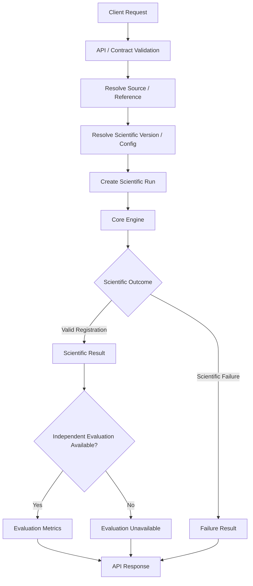
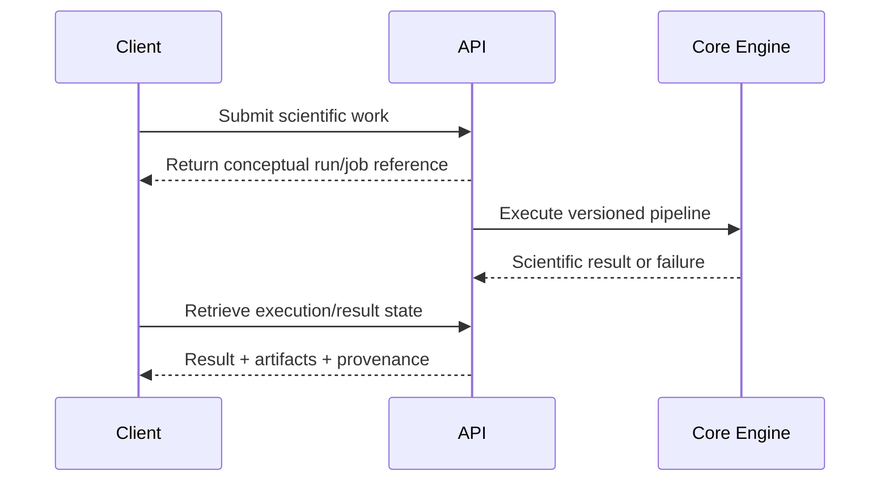

# API Request and Response Examples

> **ChandraMap — Scientific API Interaction Examples and Client Interpretation Guide**

This document shows how ChandraMap API interactions should be represented conceptually while preserving the scientific meaning of lunar image correspondence and registration.

> **These examples illustrate how ChandraMap scientific intent and results should be represented. They are not claims about concrete endpoint paths or wire schemas unless explicitly tied to repository implementation.**

No concrete endpoint paths, HTTP methods, base URLs, authentication mechanisms, request-field names, response-field names, status enums, error identifiers, pagination conventions, or deployment details are asserted by this document.

The examples below therefore use **conceptual structures with explicit placeholder values**.

> **Illustrative conceptual example — not an implemented API wire contract.**

For broader API concepts, see [`README.md`](README.md) and [`overview.md`](overview.md). Error and scientific-failure interpretation is covered in [`error-codes.md`](error-codes.md). Endpoint, schema, and versioning documents should remain authoritative whenever concrete contracts are established.

> **Examples must clarify an established contract; they must never invent a contract that does not exist.**

> **Every example should preserve ChandraMap's scientific semantics, not merely demonstrate JSON or YAML syntax.**

---

## Relationship to Other API Documentation

| Document                           | Responsibility                                                                |
| ---------------------------------- | ----------------------------------------------------------------------------- |
| [`README.md`](README.md)           | API documentation entry point and navigation                                  |
| [`overview.md`](overview.md)       | Conceptual API/system model                                                   |
| `endpoints.md`                     | Actual or conceptual API operation surface where documented                   |
| `schemas.md`                       | Request/response and scientific data-contract semantics where documented      |
| [`error-codes.md`](error-codes.md) | API-error, scientific-failure, and evaluation-limitation semantics            |
| `versioning.md`                    | API, scientific, benchmark, and schema version relationships where documented |
| **`request-response-examples.md`** | Examples showing how those concepts may be represented and interpreted        |

This document does not replace endpoint or schema documentation.

---

# 1. How to Use This Document

Use this file to understand:

- the concepts a registration request needs to preserve;
- how source and reference roles differ;
- how scientific-version context may travel with a request;
- what a scientifically meaningful result contains;
- how transformations should be interpreted;
- why coordinate spaces matter;
- how correspondence populations differ;
- how independent evaluation differs from fit diagnostics;
- how unavailable metrics should be represented conceptually;
- how scientific failure differs from API failure;
- how artifacts and provenance relate to a run;
- how future versions can extend results without changing historical V1 meaning.

For authoritative concrete serialization, use actual:

- API models;
- implementation code;
- machine-readable schema;
- OpenAPI description;
- endpoint documentation;

where those exist.

---

# 2. Example Mode Used by This Document

Two example modes are possible.

## Mode A — Verified Concrete API

When real endpoints and schemas exist, examples should use actual:

- HTTP methods;
- route paths;
- field names;
- response structures;
- status semantics.

Scientific values should still use safe fixtures or placeholders unless actual published fixtures exist.

## Mode B — Conceptual API

When a concrete API contract is not established, examples must avoid inventing:

- routes;
- methods;
- ports;
- URLs;
- headers;
- schema fields presented as real;
- status strings presented as implemented.

This document uses **Mode B** unless a later repository revision replaces a conceptual example with an implementation-verified one.

---

# 3. Example Conventions

The following conventions apply throughout this file.

### Placeholder Values

Values beginning with:

```text
PLACEHOLDER_
```

are intentionally illustrative.

They are not fabricated production or benchmark values.

### `UNAVAILABLE`

`UNAVAILABLE` is used only as a human-readable conceptual marker.

It does **not** assert that the implemented wire format uses that string.

A real schema may instead use:

- `null`;
- a separate availability field;
- another documented representation.

### Scientific Version

`v1` is used to identify the known ChandraMap scientific V1 baseline.

It does **not** represent an API contract version.

### Sensor Labels

Human-readable labels such as:

```text
OHRC
TMC-2
IIRS
LRO NAC
```

describe scientific sensor concepts.

They are not assertions about implemented enum strings.

### Numerical Scientific Results

Examples deliberately avoid fabricated values such as:

```text
0.42 px
93.7%
172 ms
```

unless those values come from a real published fixture.

---

# 4. Placeholder Policy

Good placeholder:

```yaml
asset_id: PLACEHOLDER_SOURCE_ASSET
```

Avoid an invented realistic-looking identifier:

```yaml
asset_id: OHRC_2026_TILE_00431
```

unless it is a verified fixture.

Good placeholder:

```yaml
value: PLACEHOLDER_RMSE_VALUE
```

Avoid fabricated measurement:

```yaml
value: 0.37
```

unless it is a real measured result.

> **Placeholder values should look intentionally illustrative rather than like fabricated benchmark results.**

---

# 5. Request / Response Lifecycle

A conceptual ChandraMap interaction is:

```text
Client Request
        ↓
API / Contract Validation
        ↓
Scientific Resource Resolution
        ↓
Scientific Version + Configuration Resolution
        ↓
Scientific Run
        ↓
Core Engine
        ↓
Scientific Result or Scientific Failure
        ↓
Evaluation
        ↓
Artifacts + Provenance
        ↓
API Representation
        ↓
Client
```

A request can fail before a scientific run begins.

A scientific run can execute correctly as software while producing a scientifically failed registration.

A valid registration can exist while independent evaluation remains unavailable.

---

# 6. Request / Response Flow



---

# 7. V1 Scientific Context

Relevant V1 documentation includes:

- [`../versions/v1/README.md`](../versions/v1/README.md)
- [`../versions/v1/pipeline.md`](../versions/v1/pipeline.md)
- [`../versions/v1/inputs.md`](../versions/v1/inputs.md)
- [`../versions/v1/benchmark.md`](../versions/v1/benchmark.md)

Where present, `../versions/v1/outputs.md` should define the authoritative V1 output contract.

V1 represents the classical known-overlap local-registration baseline:

```text
Known Pair
→ Validate Inputs
→ Sensor Routing
→ Preprocessing
→ Physical Scale Handling
→ SIFT
→ Descriptor Matching
→ Match Filtering
→ RANSAC
→ Transform
→ Optional Sub-Pixel Refinement
→ Final Refit
→ Registration
→ Evaluation
→ Result / Failure
```

The examples below should reflect this scientific structure without inventing API implementation.

---

# 8. Conceptual V1 Registration Request

> **Illustrative conceptual request — not an implemented wire schema.**

```yaml
request:
  scientific_version: v1

  source:
    asset_id: PLACEHOLDER_SOURCE_ASSET
    sensor: PLACEHOLDER_SOURCE_SENSOR
    representation: PLACEHOLDER_SOURCE_REPRESENTATION

  reference:
    asset_id: PLACEHOLDER_REFERENCE_ASSET
    sensor: PLACEHOLDER_REFERENCE_SENSOR
    representation: PLACEHOLDER_REFERENCE_REPRESENTATION

  pair:
    id: PLACEHOLDER_PAIR_ID

  configuration:
    id: PLACEHOLDER_CONFIG_ID

  benchmark:
    version: PLACEHOLDER_BENCHMARK_VERSION_OR_NULL

  evaluation:
    truth_version: PLACEHOLDER_TRUTH_VERSION_OR_NULL
```

The names and nesting above are explanatory only.

---

# 9. Understanding the V1 Request

### `scientific_version`

Identifies which ChandraMap scientific methodology should execute.

For this example:

```text
v1
```

means the V1 classical known-pair registration baseline.

It does not mean API version 1.

### `source`

Identifies the observation or representation being aligned.

### `reference`

Identifies the target image or coordinate frame.

### `pair`

Represents the known source/reference relationship.

V1 does not require rediscovering the lunar region when the benchmark or run definition already provides the pair.

### `configuration`

Identifies the scientific settings controlling the run.

### `benchmark`

Optionally identifies a formal frozen benchmark context.

### `evaluation.truth_version`

Optionally identifies independent evaluation truth.

These are conceptual responsibilities, not confirmed wire-level field names.

---

# 10. Source / Reference Role Example

> **Conceptual example using human-readable sensor labels, not API enum definitions.**

```yaml
source:
  asset_id: PLACEHOLDER_SOURCE_ASSET
  sensor: OHRC

reference:
  asset_id: PLACEHOLDER_REFERENCE_ASSET
  sensor: LRO NAC
```

The important scientific distinction is:

```text
source → reference
```

not:

```text
image1 ↔ image2
```

> **Source and reference roles must remain explicit in every registration example.**

---

# 11. Sensor Context

Approximate project context includes:

| Sensor                 | Approximate Context                                   |
| ---------------------- | ----------------------------------------------------- |
| OHRC                   | ~0.25–0.32 m/pixel                                    |
| TMC-2                  | ~5 m/pixel                                            |
| IIRS                   | ~80 m/pixel                                           |
| IIRS spectral coverage | ~0.8–5.0 µm                                           |
| IIRS bands             | Roughly ~250–256 depending on product/documentation   |
| LRO NAC                | Often ~0.5–2 m/pixel depending on product/acquisition |
| LRO WAC                | Broader/coarser reference context                     |

These values are not request defaults.

> **Actual product metadata wins over approximate mission-level values.**

Do not write examples that silently convert these approximate values into authoritative per-product metadata.

---

# 12. IIRS Request Example

IIRS requires explicit representation semantics because its parent product may be hyperspectral.

> **Illustrative conceptual example — not an implemented API schema.**

```yaml
source:
  asset_id: PLACEHOLDER_IIRS_PARENT_PRODUCT
  sensor: IIRS

  representation:
    asset_id: PLACEHOLDER_DERIVED_2D_REPRESENTATION
    method: PLACEHOLDER_REPRESENTATION_METHOD
    version: PLACEHOLDER_REPRESENTATION_VERSION
```

Conceptually:

```text
IIRS Parent Product
        ↓
Documented Derived 2D Representation
        ↓
V1 Local Registration
```

The ordinary V1 local matcher should not be represented as consuming a hyperspectral cube as ordinary grayscale imagery.

---

# 13. IIRS Example Caution

Do not invent:

- a "best" IIRS band;
- a fixed band number;
- a PCA component;
- a wavelength range;
- a composite rule;

unless the scientific configuration actually establishes it.

Prefer:

```yaml
method: PLACEHOLDER_REPRESENTATION_METHOD
```

rather than a fabricated scientific choice.

---

# 14. Configuration Reference Example

> **Conceptual only.**

```yaml
configuration:
  id: PLACEHOLDER_CONFIG_ID
  resolved_version: PLACEHOLDER_CONFIG_VERSION
```

A configuration reference can help avoid hidden server defaults.

The actual API may use another representation.

The important scientific principle is that the final resolved configuration remains traceable.

---

# 15. Resolved Configuration Example

> **Conceptual scientific structure — no actual configuration keys or thresholds are asserted.**

```yaml
resolved_configuration:
  preprocessing: PLACEHOLDER
  scale: PLACEHOLDER
  feature_extraction: PLACEHOLDER
  matching: PLACEHOLDER
  geometric_verification: PLACEHOLDER
  transform: PLACEHOLDER
  refinement: PLACEHOLDER
  evaluation: PLACEHOLDER
```

Do not insert arbitrary threshold values merely to make the example look realistic.

---

# 16. Successful Scientific Result Example

> **Illustrative conceptual successful result — not an implemented schema and not a real benchmark result.**

```yaml
result:
  schema_version: PLACEHOLDER_SCHEMA_VERSION

  run:
    id: PLACEHOLDER_RUN_ID
    scientific_version: v1
    scientific_status: PLACEHOLDER_SUCCESS_STATUS

  source:
    asset_id: PLACEHOLDER_SOURCE_ASSET

  reference:
    asset_id: PLACEHOLDER_REFERENCE_ASSET

  correspondence:
    candidate_count: PLACEHOLDER_CANDIDATE_COUNT
    filtered_count: PLACEHOLDER_FILTERED_COUNT
    inlier_count: PLACEHOLDER_INLIER_COUNT
    inlier_ratio: PLACEHOLDER_INLIER_RATIO

  geometry:
    model: PLACEHOLDER_TRANSFORM_MODEL
    direction: source_to_reference
    source_space: PLACEHOLDER_SOURCE_COORDINATE_SPACE
    reference_space: PLACEHOLDER_REFERENCE_COORDINATE_SPACE
    transform: PLACEHOLDER_TRANSFORM_PARAMETERS

  evaluation:
    fit_residual:
      value: PLACEHOLDER_VALUE
      units: PLACEHOLDER_UNITS
      coordinate_space: PLACEHOLDER_SPACE
      population: fit_points

    spatial_coverage:
      value: PLACEHOLDER_VALUE
      method: PLACEHOLDER_METHOD
      population: verified_inliers

    check_evaluation:
      availability: PLACEHOLDER
      rmse:
        value: PLACEHOLDER_OR_UNAVAILABLE
        units: PLACEHOLDER_UNITS
        coordinate_space: PLACEHOLDER_SPACE
        count: PLACEHOLDER_CHECK_COUNT

  artifacts:
    - id: PLACEHOLDER_ARTIFACT_ID
      role: PLACEHOLDER_ARTIFACT_ROLE

  provenance:
    scientific_version: v1
    config_id: PLACEHOLDER_CONFIG
    benchmark_version: PLACEHOLDER_OR_NULL
    truth_version: PLACEHOLDER_OR_NULL
    code_revision: PLACEHOLDER_REVISION
```

---

# 17. Understanding the Successful Result

### `run`

Identifies the scientific execution and the ChandraMap methodology that produced it.

### `correspondence`

Preserves different correspondence populations rather than reporting one generic match count.

### `geometry`

Describes the final transformation and its coordinate semantics.

### `evaluation`

Preserves diagnostic and independent-evaluation metrics separately.

### `artifacts`

References larger generated outputs.

### `provenance`

Preserves enough scientific context to reproduce or interpret the run.

> **A scientific result is not equivalent to a visual overlay.**

The registered image is one artifact of a result whose scientific evidence also includes geometry, correspondences, evaluation, status, and provenance.

---

# 18. Candidate / Filtered / Inlier Example

> **Conceptual only.**

```yaml
correspondence:
  candidate_count: PLACEHOLDER_CANDIDATE_COUNT
  filtered_count: PLACEHOLDER_FILTERED_COUNT
  inlier_count: PLACEHOLDER_INLIER_COUNT
```

These counts represent different stages:

```text
candidate_count
    ↓ filtering
filtered_count
    ↓ geometric verification
inlier_count
```

> **Candidate correspondences, filtered candidates, and verified inliers must remain distinguishable in examples.**

---

# 19. Inlier-Ratio Example

> **Conceptual only.**

```yaml
inlier_ratio:
  numerator: PLACEHOLDER_INLIERS
  denominator: PLACEHOLDER_GEOMETRY_CANDIDATES
  value: PLACEHOLDER_RATIO
```

The denominator matters.

Conceptually:

$$
\text{inlier ratio}
=
\frac{N_{\text{verified inliers}}}
     {N_{\text{candidates entering geometric verification}}}
$$

Do not label this value:

```text
accuracy
```

Inlier ratio describes geometric consensus, not independent registration accuracy.

---

# 20. Point-Level Candidate Example

> **Illustrative conceptual candidate — not an implemented schema.**

```yaml
candidate:
  source:
    x: PLACEHOLDER_X
    y: PLACEHOLDER_Y
    coordinate_space: PLACEHOLDER_SOURCE_SPACE

  reference:
    x: PLACEHOLDER_X
    y: PLACEHOLDER_Y
    coordinate_space: PLACEHOLDER_REFERENCE_SPACE

  matcher_score: PLACEHOLDER_OR_NULL

  stage: candidate
```

A matcher score, where available, is not automatically a calibrated probability that the correspondence is correct.

---

# 21. Verified Inlier Example

> **Conceptual only.**

```yaml
verified_inlier:
  source:
    x: PLACEHOLDER_X
    y: PLACEHOLDER_Y
    coordinate_space: PLACEHOLDER_SOURCE_SPACE

  reference:
    x: PLACEHOLDER_X
    y: PLACEHOLDER_Y
    coordinate_space: PLACEHOLDER_REFERENCE_SPACE

  geometric_residual:
    value: PLACEHOLDER_VALUE
    units: PLACEHOLDER_UNITS

  stage: geometrically_verified
```

A RANSAC/model inlier is:

> a correspondence consistent with the configured geometric model.

It is **not** automatically:

> independent ground truth.

---

# 22. Refined Correspondence Example

If V1 refinement is enabled, the scientific sequence should remain:

> **Verify → Refine → Refit**

> **Conceptual only.**

```yaml
refinement:
  applied: PLACEHOLDER_BOOLEAN

  source_before: PLACEHOLDER_COORDINATE
  source_after: PLACEHOLDER_COORDINATE

  reference_before: PLACEHOLDER_COORDINATE
  reference_after: PLACEHOLDER_COORDINATE

  final_model_refit: PLACEHOLDER_BOOLEAN
```

This structure is explanatory and does not assert actual API field names.

---

# 23. Initial vs. Final Transform Example

> **Conceptual only.**

```yaml
geometry:
  initial_transform:
    model: PLACEHOLDER_MODEL
    parameters: PLACEHOLDER_INITIAL_PARAMETERS

  refinement:
    applied: PLACEHOLDER_BOOLEAN

  final_transform:
    model: PLACEHOLDER_MODEL
    parameters: PLACEHOLDER_FINAL_PARAMETERS
```

When correspondence coordinates are refined, the final transformation should be the model refit from the accepted refined data according to the scientific pipeline.

A stale pre-refinement model should not be labeled the refined final result.

---

# 24. Final Transform Example

> **Illustrative conceptual transform.**

```yaml
transform:
  stage: final
  model: PLACEHOLDER_MODEL
  direction: source_to_reference

  source_space: PLACEHOLDER_SOURCE_SPACE
  reference_space: PLACEHOLDER_REFERENCE_SPACE

  parameters: PLACEHOLDER_PARAMETERS

  status: PLACEHOLDER_STATUS
```

> **A transform example is incomplete without its model, direction, source space, and reference space.**

A bare matrix cannot tell the client what it maps.

---

# 25. Affine Transform Example

> **Conceptual representation only. Actual matrix shape/serialization must follow the implementation schema.**

```yaml
transform:
  model: PLACEHOLDER_AFFINE_MODEL_LABEL

  parameters:
    matrix: PLACEHOLDER_AFFINE_MATRIX
```

No numerical coefficients are fabricated here.

---

# 26. Homography Example

> **Conceptual representation only.**

```yaml
transform:
  model: PLACEHOLDER_HOMOGRAPHY_MODEL_LABEL

  parameters:
    matrix: PLACEHOLDER_HOMOGRAPHY_MATRIX
```

The fact that a model is mathematically representable does not establish that it is scientifically valid for a particular pair.

Model validity belongs to the core scientific logic.

---

# 27. Coordinate-Space Example

> **Conceptual only.**

```yaml
point:
  x: PLACEHOLDER_X
  y: PLACEHOLDER_Y
  coordinate_space: PLACEHOLDER_REFERENCE_PYRAMID_SPACE

  parent_mapping:
    parent_space: PLACEHOLDER_REFERENCE_NATIVE_SPACE
    mapping_ref: PLACEHOLDER_MAPPING_REFERENCE
```

> **Coordinates without a coordinate space are incomplete.**

A point in a reference pyramid level is not automatically equivalent to the same numerical point in native reference coordinates.

---

# 28. Crop / Tile / Pyramid Context

> **Conceptual scientific metadata.**

```yaml
coordinate_context:
  local_space: PLACEHOLDER_TILE_OR_PYRAMID_SPACE
  parent_space: PLACEHOLDER_NATIVE_REFERENCE_SPACE
  crop_or_tile_offset: PLACEHOLDER
  scale_mapping: PLACEHOLDER
```

The actual schema may represent these relationships differently.

The key requirement is preserving enough context to map local coordinates back to their parent representation.

---

# 29. Fit Residual Example

> **Conceptual only.**

```yaml
fit_residual:
  value: PLACEHOLDER_VALUE
  units: PLACEHOLDER_UNITS
  coordinate_space: PLACEHOLDER_SPACE
  population: fit_points
  count: PLACEHOLDER_N
```

Fit residual describes agreement with the population used to fit or support the model.

> **Fit residual is not independent registration accuracy.**

---

# 30. Held-Out Check RMSE Example

> **Conceptual only.**

```yaml
check_evaluation:
  truth_version: PLACEHOLDER_TRUTH_VERSION
  count: PLACEHOLDER_N

  rmse:
    value: PLACEHOLDER_RMSE_VALUE
    units: PLACEHOLDER_UNITS
    coordinate_space: PLACEHOLDER_SPACE
```

Held-out check error is independent only if those check points did not influence:

- transformation estimation;
- refinement;
- model selection;
- configuration tuning for the evaluated run.

---

# 31. Check-Point Detail Example

> **Conceptual only.**

```yaml
check_point:
  id: PLACEHOLDER_CHECK_ID

  predicted:
    x: PLACEHOLDER_X
    y: PLACEHOLDER_Y
    coordinate_space: PLACEHOLDER_SPACE

  truth:
    x: PLACEHOLDER_X
    y: PLACEHOLDER_Y
    coordinate_space: PLACEHOLDER_SPACE

  residual:
    dx: PLACEHOLDER_DX
    dy: PLACEHOLDER_DY
    magnitude: PLACEHOLDER_MAGNITUDE
    units: PLACEHOLDER_UNITS
```

Predicted and truth coordinates must refer to compatible coordinate spaces before their residual can be interpreted.

---

# 32. Missing Check Truth Response

A scientifically valid registration may have no independent held-out truth.

> **Illustrative conceptual example.**

```yaml
evaluation:
  independent_check:
    availability: unavailable
    reason: PLACEHOLDER_NO_INDEPENDENT_TRUTH

  check_rmse:
    value: UNAVAILABLE
```

The run may still have:

- a valid transform;
- verified inliers;
- fit residuals;
- coverage diagnostics;
- registration artifacts.

What it does **not** have is independently measured check-point accuracy.

> **Missing independent evaluation must be represented as unavailable, not as zero error.**

---

# 33. Ground-Space Error Example

Ground-space error is conditional.

> **Conceptual only.**

```yaml
ground_error:
  availability: PLACEHOLDER_AVAILABLE_OR_UNAVAILABLE

  value: PLACEHOLDER_OR_UNAVAILABLE
  units: metres
  coordinate_reference: PLACEHOLDER_OR_NULL
  conversion_context: PLACEHOLDER_OR_NULL
```

A metre-level error value should come from valid geospatial evaluation.

Do not manufacture it through:

```text
pixel error × approximate mission GSD
```

when the scientific mapping does not justify that conversion.

---

# 34. Spatial Coverage Example

> **Conceptual only.**

```yaml
spatial_coverage:
  value: PLACEHOLDER_VALUE
  method: PLACEHOLDER_METHOD
  population: verified_inliers
  coordinate_space: PLACEHOLDER_SPACE
  valid_region: PLACEHOLDER_REFERENCE
```

Coverage measures distribution of a defined point population.

> **Coverage ≠ accuracy.**

Many spatially distributed correspondences can still be wrong, while a low-error set concentrated in a small area may provide weak geometric support.

---

# 35. Runtime Example

> **Conceptual only.**

```yaml
runtime:
  total:
    value: PLACEHOLDER_RUNTIME
    units: PLACEHOLDER_TIME_UNIT

  environment_ref: PLACEHOLDER_ENVIRONMENT
```

Runtime is meaningful only with execution context.

This document intentionally provides no fabricated execution time.

---

# 36. Artifact Response Example

> **Conceptual only. Artifact roles below are descriptive labels, not asserted enum values.**

```yaml
artifacts:
  - id: PLACEHOLDER_REGISTERED_ARTIFACT
    role: registered_raster
    reference: PLACEHOLDER_ARTIFACT_REFERENCE

  - id: PLACEHOLDER_PREVIEW_ARTIFACT
    role: registered_preview
    reference: PLACEHOLDER_ARTIFACT_REFERENCE

  - id: PLACEHOLDER_MATCH_VISUALIZATION
    role: correspondence_visualization
    reference: PLACEHOLDER_ARTIFACT_REFERENCE
```

Artifacts can be linked to a scientific result without being embedded directly in every response.

---

# 37. Artifact Example Caution

Do not invent:

- cloud-storage URLs;
- signed URLs;
- localhost download URLs;
- raw server filesystem paths;
- expiry timestamps;
- bucket names;
- download endpoints.

Use:

```text
PLACEHOLDER_ARTIFACT_REFERENCE
```

until an authoritative artifact-access contract exists.

---

# 38. Provenance Response Example

> **Illustrative conceptual provenance structure.**

```yaml
provenance:
  scientific_version: v1

  api_contract_version: PLACEHOLDER_API_VERSION
  result_schema_version: PLACEHOLDER_SCHEMA_VERSION

  pair_version: PLACEHOLDER_PAIR_VERSION
  benchmark_version: PLACEHOLDER_OR_NULL
  truth_version: PLACEHOLDER_OR_NULL

  source_asset_id: PLACEHOLDER_SOURCE
  reference_asset_id: PLACEHOLDER_REFERENCE

  configuration:
    template: PLACEHOLDER_OR_NULL
    resolved_id: PLACEHOLDER_CONFIG

  software:
    release: PLACEHOLDER_OR_NULL
    code_revision: PLACEHOLDER_REVISION

  environment:
    reference: PLACEHOLDER_ENVIRONMENT_REFERENCE
```

Reproducibility requires more context than one generic:

```text
version: 1
```

Different version axes answer different questions.

---

# 39. Scientific Failure Result Example

> **Illustrative conceptual scientific failure result — not an API/service error schema.**

```yaml
result:
  run:
    id: PLACEHOLDER_RUN_ID
    scientific_version: v1
    scientific_status: PLACEHOLDER_FAILED_STATUS

  failure:
    observed_stage: PLACEHOLDER_GEOMETRIC_VERIFICATION_STAGE
    last_successful_stage: PLACEHOLDER_MATCH_FILTERING_STAGE
    diagnostic: PLACEHOLDER_DIAGNOSTIC

  partial_results:
    candidate_count: PLACEHOLDER_CANDIDATE_COUNT
    filtered_count: PLACEHOLDER_FILTERED_COUNT
    inlier_count: PLACEHOLDER_OR_UNAVAILABLE

  evaluation:
    check_rmse: UNAVAILABLE

  provenance:
    config_id: PLACEHOLDER_CONFIG
    code_revision: PLACEHOLDER_REVISION
```

The request may have been processed correctly.

The core pipeline may also have executed correctly as software.

The scientific conclusion can still be:

> valid geometry was not established.

> **Scientific failure should be shown as a valid result state when the core pipeline executed correctly but could not produce valid geometry.**

---

# 40. RANSAC Failure Example

Conceptual sequence:

```text
Valid request
        ↓
Valid source/reference pair
        ↓
Features extracted
        ↓
Candidate matches generated
        ↓
Filtering completed
        ↓
Geometric verification cannot establish valid model
        ↓
Scientific failure record
```

A conceptual fragment may be:

```yaml
failure:
  observed_stage: PLACEHOLDER_GEOMETRIC_VERIFICATION_STAGE
  diagnostic: PLACEHOLDER_GEOMETRIC_SUPPORT_DIAGNOSTIC
```

No fabricated RANSAC error code should be added.

---

# 41. Too-Few-Features Failure Example

> **Conceptual only.**

```yaml
failure:
  observed_stage: PLACEHOLDER_FEATURE_EXTRACTION_STAGE
  diagnostic: PLACEHOLDER_INSUFFICIENT_SUPPORT_DESCRIPTION
```

Do not invent a threshold such as:

```text
fewer than 25 keypoints
```

unless the versioned configuration actually defines that threshold.

---

# 42. Transform Failure Example

> **Conceptual only.**

```yaml
failure:
  observed_stage: PLACEHOLDER_TRANSFORM_STAGE
  diagnostic: PLACEHOLDER_INVALID_OR_DEGENERATE_GEOMETRY
```

Do not return:

```yaml
transform: identity
```

as a fake success fallback unless such behavior is explicitly part of the scientific specification—and even then its semantics must be clear.

---

# 43. Refinement / Final-Refit Failure

If refinement is configured:

```text
verified inliers
    ↓
refinement
    ↓
final refit
```

then a final-refit failure should not produce the old transform while implying that refined geometry succeeded.

A conceptual failure record may retain:

```yaml
failure:
  observed_stage: PLACEHOLDER_FINAL_REFIT_STAGE

partial_results:
  initial_transform_available: PLACEHOLDER_BOOLEAN
  refined_points_available: PLACEHOLDER_BOOLEAN
  final_transform_available: false
```

The actual representation is implementation-defined.

---

# 44. Registration-Warp Failure

A valid transform and a registered raster are related but distinct outputs.

Conceptually:

```yaml
geometry:
  final_transform:
    availability: PLACEHOLDER_AVAILABLE

registration:
  artifact:
    availability: PLACEHOLDER_UNAVAILABLE

failure:
  observed_stage: PLACEHOLDER_REGISTRATION_OR_ARTIFACT_STAGE
```

Whether this makes the entire scientific run unsuccessful depends on the authoritative V1 output/acceptance contract.

The API examples must not invent that policy.

---

# 45. Evaluation-Unavailable Example

> **Conceptual only.**

```yaml
result:
  scientific_status: PLACEHOLDER_VALID_REGISTRATION_STATUS

  geometry:
    final_transform: PLACEHOLDER_TRANSFORM

  evaluation:
    independent_check:
      availability: unavailable
      reason: PLACEHOLDER_TRUTH_NOT_AVAILABLE
```

This means:

```text
registration result exists
+
independent accuracy evidence is unavailable
```

not:

```text
registration failed
```

---

# 46. Artifact-Failure Example

> **Conceptual only.**

```yaml
result:
  scientific_status: PLACEHOLDER_VALID_STATUS

  geometry:
    final_transform: PLACEHOLDER_TRANSFORM

  evaluation:
    status: PLACEHOLDER_EVALUATION_STATUS

  artifacts:
    registered_preview:
      availability: unavailable
      diagnostic: PLACEHOLDER_ARTIFACT_DIAGNOSTIC
```

A failed visualization should not automatically erase valid geometry or evaluation.

---

# 47. API Request Error Example

See [`error-codes.md`](error-codes.md).

> **Illustrative conceptual API error — not an implemented error schema.**

```yaml
error:
  category: PLACEHOLDER_REQUEST_VALIDATION_CATEGORY
  message: PLACEHOLDER_SAFE_MESSAGE
  request_id: PLACEHOLDER_REQUEST_ID

  details:
    field: PLACEHOLDER_FIELD_OR_NULL
    reason: PLACEHOLDER_REASON
```

An API error generally means the requested interaction could not proceed normally.

It is different from a scientific result whose status is failed.

---

# 48. Resource-Resolution Error Example

> **Conceptual only.**

```yaml
error:
  category: PLACEHOLDER_RESOURCE_RESOLUTION_CATEGORY
  message: PLACEHOLDER_MESSAGE

  resource:
    type: PLACEHOLDER_RESOURCE_TYPE
    id: PLACEHOLDER_RESOURCE_ID
```

No HTTP mapping or concrete category identifier is asserted.

---

# 49. Unsupported Scientific Input Example

Consider a structurally valid request referring to an IIRS product but providing no supported/traceable registration representation where the selected scientific pipeline requires one.

Conceptually:

```yaml
error_or_rejection:
  category: PLACEHOLDER_UNSUPPORTED_SCIENTIFIC_INPUT
  resource: PLACEHOLDER_IIRS_ASSET
  diagnostic: PLACEHOLDER_REPRESENTATION_REQUIRED
```

This does **not** mean:

> IIRS is unsupported.

It means the requested representation/context is insufficient for the selected scientific operation.

---

# 50. Configuration Error Example

> **Conceptual only.**

```yaml
error:
  category: PLACEHOLDER_CONFIGURATION_CATEGORY
  message: PLACEHOLDER_SAFE_MESSAGE

  configuration:
    id: PLACEHOLDER_CONFIG_ID
    scientific_version: v1

  diagnostic: PLACEHOLDER_INCOMPATIBLE_OR_UNRESOLVED_CONFIGURATION
```

Do not invent specific invalid parameter names unless an authoritative schema defines them.

---

# 51. Internal Service Error Example

> **Conceptual only.**

```yaml
error:
  category: PLACEHOLDER_INTERNAL_SERVICE_CATEGORY
  message: PLACEHOLDER_SAFE_GENERIC_MESSAGE
  request_id: PLACEHOLDER_REQUEST_ID
```

A safe client-facing example should not include:

- stack trace;
- database connection string;
- server filesystem path;
- secret;
- credential;
- private infrastructure address.

---

# 52. API Error vs. Scientific Failure

| Scenario                           |       API Request Valid? | Scientific Run Exists? | Scientific Result                     |
| ---------------------------------- | -----------------------: | ---------------------: | ------------------------------------- |
| Malformed request                  |                       No |                     No | N/A                                   |
| Unknown source asset               | Structurally maybe valid |             Usually no | N/A                                   |
| Valid pair, no stable geometry     |                      Yes |                    Yes | Scientific failure                    |
| Valid registration, no check truth |                      Yes |                    Yes | Valid result + evaluation unavailable |
| Backend exception                  |                 Possibly |       Maybe incomplete | Unknown/incomplete                    |
| Valid registration + evaluation    |                      Yes |                    Yes | Scientific result                     |

> **A successful API request does not automatically mean a scientifically successful registration.**

---

# 53. Run Creation Example

Where asynchronous or persistent run semantics are not established, treat this example as conceptual.

```yaml
run:
  id: PLACEHOLDER_RUN_ID
  scientific_version: v1
  execution_state: PLACEHOLDER_EXECUTION_STATE
  scientific_status: PLACEHOLDER_NOT_YET_AVAILABLE
```

Execution state and scientific status are different.

For example:

```text
execution complete
```

does not necessarily mean:

```text
scientific registration successful
```

---

# 54. Job vs. Run

If a backend job abstraction exists, conceptually:

```yaml
job:
  id: PLACEHOLDER_JOB_ID
  execution_state: PLACEHOLDER_EXECUTION_STATE

run:
  id: PLACEHOLDER_RUN_ID
  scientific_version: v1
  scientific_status: PLACEHOLDER_SCIENTIFIC_STATUS
```

A job represents backend orchestration.

A run represents scientific execution.

Do not assume:

```text
job ID = run ID
```

unless implementation explicitly defines that equivalence.

---

# 55. Synchronous Interaction Example

Without an established synchronous endpoint, only the workflow should be shown:

```text
Client Request
        ↓
Validation
        ↓
Core Scientific Execution
        ↓
Scientific Result
        ↓
Immediate Result Representation
```

No `curl` command, path, method, or base URL is invented here.

---

# 56. Asynchronous Interaction Example

Conceptually:

```text
Submit Scientific Work
        ↓
Receive Run / Job Reference
        ↓
Execution Continues
        ↓
Inspect State Later
        ↓
Retrieve Scientific Result
```

This document does not define:

- polling route;
- webhook;
- queue;
- callback URL;
- worker technology;
- event stream.

---

# 57. Conceptual Asynchronous Flow

> **Conceptual flow only unless concrete implementation later establishes these interactions.**



---

# 58. Result Summary Example

> **Conceptual only.**

```yaml
summary:
  run_id: PLACEHOLDER_RUN_ID
  scientific_version: v1
  scientific_status: PLACEHOLDER_SCIENTIFIC_STATUS

  candidate_count: PLACEHOLDER_CANDIDATE_COUNT
  inlier_count: PLACEHOLDER_INLIER_COUNT

  transform_available: PLACEHOLDER_BOOLEAN
  check_evaluation_available: PLACEHOLDER_BOOLEAN

  artifacts:
    count: PLACEHOLDER_ARTIFACT_COUNT
```

A summary helps clients inspect a run quickly.

It should not replace the full scientific record when detailed interpretation is required.

---

# 59. Detailed Result

A detailed result may contain:

- point-level candidate correspondences;
- verified inliers;
- transformation metadata;
- fit residuals;
- check-point predictions;
- check-point truth;
- point residuals;
- mask/coverage information;
- diagnostics;
- detailed artifact references.

Large detail may be exposed through:

- a separate resource;
- an artifact;
- optional expansion;
- another implementation-defined mechanism.

No such mechanism is prescribed here.

---

# 60. Large Correspondence Sets

Returning every candidate correspondence in every summary response may be inefficient.

Potential future approaches include:

- optional detail;
- dedicated correspondence resources;
- artifact-backed point data;
- pagination.

The actual design should be documented only after implementation establishes it.

Scientific detail must not be lost merely for response convenience.

---

# 61. Pagination Examples

No pagination contract is asserted by this document.

Therefore no example invents fields such as:

```text
page
limit
offset
cursor
next_cursor
```

Pagination examples should be added only after repository implementation establishes them.

---

# 62. HTTP Examples

No concrete HTTP route/method contract is established by this document.

Therefore it intentionally avoids examples such as:

```text
POST /api/v1/register
GET /runs/...
```

Those examples would falsely imply implemented interface design.

Concrete HTTP examples belong here once authoritative routes and methods exist.

---

# 63. `curl` Examples

No `curl` command is provided because a valid command requires verified:

- protocol/base URL;
- route;
- HTTP method;
- body schema;
- authentication behavior;
- content type.

Do not invent localhost ports or production domains merely for documentation appearance.

---

# 64. Python Client Examples

This document does not invent a ChandraMap Python SDK.

Do not document code such as:

```text
from chandramap_client import Client
```

unless such a client package actually exists.

Researchers may still use the core Python scientific implementation directly if that interface is defined elsewhere.

---

# 65. JavaScript / TypeScript Client Examples

Likewise, this document does not invent:

- NPM package names;
- generated clients;
- TypeScript request types;
- frontend API helper functions.

Concrete examples should follow actual implementation.

---

# 66. Version Identity Example

Where present, see `versioning.md`.

> **Conceptual version context.**

```yaml
versions:
  api_contract: PLACEHOLDER_API_VERSION
  scientific: v1
  result_schema: PLACEHOLDER_SCHEMA_VERSION
  benchmark: PLACEHOLDER_BENCHMARK_VERSION
  truth: PLACEHOLDER_TRUTH_VERSION
```

These are independent version axes.

---

# 67. API Version Is Not Scientific V1

> **Do not infer ChandraMap scientific V1 from a hypothetical `/v1` endpoint path.**

An API contract could theoretically have its own version while executing:

- scientific V1;
- V2;
- V3;
- another supported method.

This document deliberately does not invent a `/v1` route.

---

# 68. V2 Conceptual Extension

A later V2 may add local-registration capabilities such as stronger robustness or additional refinement diagnostics.

A V2-compatible result could extend shared scientific concepts while retaining:

- run identity;
- source/reference identity;
- transformation semantics;
- coordinate spaces;
- metrics;
- failures;
- provenance.

No full V2 request/response structure is defined here.

The actual V2 specification remains authoritative.

---

# 69. V3 Retrieval Example

> **Conceptual future V3-style extension only — not a committed schema.**

```yaml
retrieval:
  candidates:
    - reference_asset_id: PLACEHOLDER_REFERENCE_ASSET
      score: PLACEHOLDER_RETRIEVAL_SCORE

registration:
  selected_reference: PLACEHOLDER_REFERENCE_ASSET
  transform: PLACEHOLDER_TRANSFORM
  check_rmse: PLACEHOLDER_OR_UNAVAILABLE
```

This structure demonstrates separation between:

```text
retrieval
```

and:

```text
registration
```

---

# 70. Retrieval-Score Caution

A retrieval score answers:

> How strongly did the query match a candidate reference representation according to the retrieval system?

It does not directly answer:

> How accurately was the source geometrically registered?

Therefore:

> **Retrieval score is not registration confidence.**

Similarly:

```text
Recall@K
```

is a retrieval metric.

```text
check-point RMSE
```

is a registration/evaluation metric.

They should not be merged.

---

# 71. V4 Advanced Result Extension

> **Possible conceptual future extension — not a committed V4 design.**

```yaml
advanced_geometry: PLACEHOLDER

uncertainty: PLACEHOLDER

multimodal_context: PLACEHOLDER
```

Actual V4 scientific contracts may differ substantially.

Do not design V4 wire formats before the scientific specification exists.

---

# 72. Benchmark Run Example

See [`../versions/v1/benchmark.md`](../versions/v1/benchmark.md).

> **Conceptual benchmark-run structure only.**

```yaml
benchmark_run:
  benchmark_version: PLACEHOLDER_BENCHMARK_VERSION
  scientific_version: v1
  configuration_id: PLACEHOLDER_CONFIG_ID

  pair_results:
    - run_id: PLACEHOLDER_RUN_ID
      pair_id: PLACEHOLDER_PAIR_ID
      scientific_status: PLACEHOLDER_SCIENTIFIC_STATUS
```

No aggregate measurement is asserted.

---

# 73. Benchmark Failure Example

A valid benchmark case may scientifically fail.

> **Conceptual only.**

```yaml
pair_result:
  pair_id: PLACEHOLDER_PAIR_ID
  benchmark_case_valid: PLACEHOLDER_TRUE

  scientific_status: PLACEHOLDER_FAILED_STATUS

  failure:
    observed_stage: PLACEHOLDER_STAGE
    diagnostic: PLACEHOLDER_DIAGNOSTIC
```

The pair remains part of the benchmark result set.

It should not disappear simply because V1 could not register it successfully.

---

# 74. Benchmark Summary Template

> **Template only — no real benchmark result is being asserted.**

```yaml
benchmark_summary:
  benchmark_version: PLACEHOLDER_BENCHMARK_VERSION
  scientific_version: v1

  total_pairs: PLACEHOLDER_TOTAL
  completed_pairs: PLACEHOLDER_COMPLETED
  scientific_successes: PLACEHOLDER_SUCCESSES
  scientific_failures: PLACEHOLDER_FAILURES

  metrics: PLACEHOLDER_AGGREGATES
```

Valid scientific failures must remain visible in the aggregate.

---

# 75. Failure Counts in Aggregates

Avoid reporting only successful pairs unless explicitly labeling that population.

For example:

```text
RMSE summary over successful, independently evaluated pairs
```

is different from:

```text
overall benchmark performance
```

A benchmark result should preserve:

- successful cases;
- valid scientific failures;
- invalid benchmark cases;
- evaluation-unavailable cases.

---

# 76. Unavailable-Value Examples

| Situation                 | Conceptual Representation          |
| ------------------------- | ---------------------------------- |
| Real measured zero        | `0`                                |
| Metric unavailable        | `UNAVAILABLE` conceptual marker    |
| Not applicable            | `NOT_APPLICABLE` conceptual marker |
| Not evaluated             | `NOT_EVALUATED` conceptual marker  |
| Failed before measurement | Explicit failure context           |

The actual wire contract may instead use:

- `null`;
- availability/status fields;
- tagged unions;
- another documented mechanism.

The important rule is semantic distinction.

---

# 77. Bad vs. Good Example — RMSE

## Bad

```yaml
rmse: 0.7
```

Problems:

- Which RMSE?
- Which coordinate space?
- Which units?
- Which point population?
- How many points?
- Was it fit error or held-out error?

## Better Conceptual Example

```yaml
check_rmse:
  value: PLACEHOLDER_RMSE_VALUE
  units: PLACEHOLDER_UNITS
  coordinate_space: PLACEHOLDER_COORDINATE_SPACE
  population: held_out_check_points
  count: PLACEHOLDER_N
```

> **Metrics must be shown with their units, population, and coordinate space.**

---

# 78. Bad vs. Good Example — Missing RMSE

## Bad

```yaml
check_rmse: 0
```

when no independent truth exists.

This falsely looks like perfect evaluation.

## Better Conceptual Example

```yaml
check_evaluation:
  availability: unavailable
  reason: PLACEHOLDER_NO_CHECK_TRUTH

check_rmse:
  value: UNAVAILABLE
```

> **Missing independent evaluation must not become zero error.**

---

# 79. Bad vs. Good Example — Transform

## Bad

```yaml
transform:
  - PLACEHOLDER_VALUES
```

The client cannot determine:

- transformation model;
- direction;
- coordinate spaces;
- whether it is final.

## Better Conceptual Example

```yaml
transform:
  stage: final
  model: PLACEHOLDER_MODEL
  direction: source_to_reference
  source_space: PLACEHOLDER_SOURCE_SPACE
  reference_space: PLACEHOLDER_REFERENCE_SPACE
  parameters: PLACEHOLDER_PARAMETERS
```

---

# 80. Bad vs. Good Example — Coordinates

## Bad

```yaml
point:
  x: PLACEHOLDER_X
  y: PLACEHOLDER_Y
```

## Better Conceptual Example

```yaml
point:
  x: PLACEHOLDER_X
  y: PLACEHOLDER_Y
  coordinate_space: PLACEHOLDER_REFERENCE_TILE_SPACE
```

Coordinates are incomplete when their coordinate frame is unknown.

---

# 81. Bad vs. Good Example — Match Counts

## Bad

```yaml
matches: PLACEHOLDER_COUNT
```

This hides whether the count represents:

- raw candidates;
- filtered candidates;
- geometrically verified inliers.

## Better Conceptual Example

```yaml
correspondence:
  candidate_count: PLACEHOLDER_CANDIDATE_COUNT
  filtered_count: PLACEHOLDER_FILTERED_COUNT
  inlier_count: PLACEHOLDER_INLIER_COUNT
```

---

# 82. Bad vs. Good Example — Inlier Ratio

## Bad

```yaml
accuracy: PLACEHOLDER_INLIER_RATIO
```

## Better Conceptual Example

```yaml
inlier_ratio:
  numerator: PLACEHOLDER_INLIER_COUNT
  denominator: PLACEHOLDER_GEOMETRY_INPUT_COUNT
  value: PLACEHOLDER_RATIO
```

An inlier ratio is not independent registration accuracy.

---

# 83. Bad vs. Good Example — Scientific Failure

## Bad

```yaml
error:
  message: registration failed
```

This may incorrectly imply the backend malfunctioned.

## Better Conceptual Example

```yaml
result:
  scientific_status: PLACEHOLDER_FAILED_STATUS

  failure:
    observed_stage: PLACEHOLDER_GEOMETRIC_VERIFICATION_STAGE
    diagnostic: PLACEHOLDER_DIAGNOSTIC

  partial_results:
    candidate_count: PLACEHOLDER_CANDIDATE_COUNT
```

This preserves the fact that a scientific run existed.

---

# 84. Bad vs. Good Example — Provenance

## Bad

```yaml
version: 1
```

It is unclear whether this means:

- API version;
- scientific version;
- benchmark version;
- schema version.

## Better Conceptual Example

```yaml
versions:
  api_contract: PLACEHOLDER_API_VERSION
  scientific: v1
  result_schema: PLACEHOLDER_SCHEMA_VERSION
  benchmark: PLACEHOLDER_BENCHMARK_VERSION
```

---

# 85. Bad vs. Good Example — IIRS

## Bad

```yaml
source:
  image: PLACEHOLDER_IIRS_FILE
  grayscale: true
```

This suggests an undocumented flattening of hyperspectral data.

## Better Conceptual Example

```yaml
source:
  asset_id: PLACEHOLDER_IIRS_PARENT
  sensor: IIRS

  representation:
    asset_id: PLACEHOLDER_2D_REGISTRATION_REPRESENTATION
    method: PLACEHOLDER_METHOD
    version: PLACEHOLDER_VERSION
```

---

# 86. Bad vs. Good Example — Ground Error

## Bad

```yaml
ground_error_metres: PLACEHOLDER_PIXEL_ERROR_TIMES_NOMINAL_GSD
```

## Better Conceptual Example

```yaml
ground_error:
  availability: PLACEHOLDER_AVAILABLE_OR_UNAVAILABLE
  value: PLACEHOLDER_OR_UNAVAILABLE
  units: metres
  coordinate_reference: PLACEHOLDER_OR_NULL
  conversion_context: PLACEHOLDER_OR_NULL
```

Ground-space accuracy is conditional on valid scientific/geospatial interpretation.

---

# 87. Example Interpretation Checklist

When reading or adding an example, verify:

- Does it identify source and reference explicitly?
- Is scientific version clear?
- Is API version kept separate from scientific version?
- Is configuration traceable?
- Are product/sensor identities preserved?
- Is an IIRS representation explicit where relevant?
- Are candidate, filtered, and inlier populations distinct?
- Does a transformation include direction?
- Does a transformation include source/reference spaces?
- Do coordinates include coordinate-space context?
- Do metrics include units?
- Do metrics identify their population?
- Is fit residual separate from held-out error?
- Is missing evaluation represented as unavailable rather than zero?
- Is ground-space error only shown when scientifically valid?
- Are artifacts distinct from core scientific result metadata?
- Does scientific failure remain separate from API failure?
- Does provenance preserve enough context for reproducibility?
- Are all non-established values obviously placeholders?

---

# 88. Example Testing Use

Conceptual examples can later become useful inputs for:

- schema tests;
- API contract tests;
- serialization tests;
- documentation tests;
- frontend fixtures;
- integration tests.

However, a documentation example should not automatically become a test fixture if its fields are only conceptual.

When actual schemas exist, examples should be synchronized with those schemas and validated automatically where practical.

---

# 89. Contract-Test Example Categories

Useful future fixture categories may include:

| Fixture Type              | Purpose                                |
| ------------------------- | -------------------------------------- |
| Minimal valid V1 request  | Verify required request contract       |
| Valid scientific success  | Verify complete result serialization   |
| Scientific RANSAC failure | Verify scientific failure semantics    |
| Evaluation unavailable    | Verify unavailable/null handling       |
| IIRS representation input | Verify representation lineage          |
| Transform response        | Verify direction/coordinate semantics  |
| Artifact failure          | Verify artifact/result separation      |
| Request validation error  | Verify API-error semantics             |
| Benchmark run             | Verify version/provenance preservation |

Actual fixtures should use authoritative schemas once available.

---

# 90. Example Documentation Anti-Patterns

Do **not**:

- invent endpoint paths;
- invent HTTP methods;
- invent localhost ports;
- invent production URLs;
- invent authentication headers;
- invent request field names presented as real;
- invent status enum values;
- invent error codes;
- invent schema versions;
- invent run IDs;
- invent product IDs that look real;
- fabricate RMSE measurements;
- fabricate inlier ratios;
- fabricate runtime;
- fabricate benchmark success rates;
- call candidate matches verified inliers;
- call RANSAC inliers ground truth;
- call inlier ratio accuracy;
- hide the denominator of an inlier ratio;
- report coordinates without coordinate spaces;
- report a transform without direction;
- report bare RMSE without units/population;
- use `0` to represent missing evaluation;
- convert approximate GSD into fake metre-level accuracy;
- silently flatten IIRS cubes;
- silently choose an IIRS band;
- hide scientific failures behind generic API errors;
- hide valid failed benchmark cases;
- return a stale pre-refinement transform as a successful final transform;
- imply an artifact preview proves registration correctness;
- invent cloud-storage URLs;
- expose raw server paths;
- include secrets in examples;
- imply V1 requires retrieval;
- mix Recall@K with registration metrics;
- let future V3/V4 examples redefine V1 semantics.

---

# 91. Claims to Avoid in Examples

Do not use examples to imply, without evidence, that:

- a public ChandraMap API exists;
- specific API routes are implemented;
- a REST interface is implemented;
- V1 is exposed over HTTP;
- asynchronous processing is implemented;
- jobs are persisted;
- a particular authentication method exists;
- a particular schema format exists;
- artifact download URLs exist;
- all sensor products are supported;
- IIRS matching is fully implemented;
- V2, V3, or V4 are implemented;
- global retrieval exists;
- FAISS is integrated;
- ChandraMap achieves any specific RMSE;
- ChandraMap reaches any specific accuracy percentage;
- a particular runtime is guaranteed;
- any example represents a real benchmark result.

---

# 92. Example Security Guidance

Examples must never include:

- passwords;
- access tokens;
- API keys;
- secret environment variables;
- private credentials;
- signed artifact URLs;
- real private filesystem paths;
- internal service addresses;
- database connection strings.

Use explicit placeholders such as:

```text
PLACEHOLDER_REQUEST_ID
PLACEHOLDER_ARTIFACT_REFERENCE
PLACEHOLDER_CONFIG_ID
```

instead.

For repository-level security guidance, see [`../../SECURITY.md`](../../SECURITY.md).

---

# 93. Example Maintenance Rules

When the API becomes concrete:

1. Replace conceptual examples only with verified contracts.
2. Keep conceptual warnings until every relevant structure is authoritative.
3. Validate examples against machine-readable schemas where possible.
4. Update examples when field semantics change.
5. Preserve historical V1 scientific meaning.
6. Do not update numbers merely to make examples appear realistic.
7. Keep actual benchmark results outside this guide unless explicitly used as documented fixtures.
8. Link examples to authoritative endpoint/schema documentation rather than duplicating large specifications.

---

# 94. Example Documentation Checklist

## Source of Truth

- [ ] Concrete examples match actual implementation
- [ ] Endpoint paths are shown only when verified
- [ ] HTTP methods are shown only when verified
- [ ] Field names are shown as concrete only when verified
- [ ] Status values are shown as concrete only when verified
- [ ] Error identifiers are shown only when verified
- [ ] Conceptual examples are labeled explicitly

## Scientific Inputs

- [ ] Source role is explicit
- [ ] Reference role is explicit
- [ ] Scientific version is explicit
- [ ] Sensor identity is preserved
- [ ] Configuration identity is preserved
- [ ] Pair context is preserved
- [ ] IIRS representation lineage is explicit where relevant
- [ ] Approximate sensor values are not used as authoritative defaults

## Correspondence

- [ ] Candidate count is distinct
- [ ] Filtered count is distinct
- [ ] Inlier count is distinct
- [ ] Inlier-ratio denominator is explicit
- [ ] Candidate matches are not labeled verified
- [ ] RANSAC inliers are not labeled ground truth

## Geometry

- [ ] Transform model is identified
- [ ] Transform direction is identified
- [ ] Source coordinate space is identified
- [ ] Reference coordinate space is identified
- [ ] Initial and final transforms are distinguished where necessary
- [ ] Refinement is followed by final refit when applicable

## Evaluation

- [ ] Fit residual is separate from held-out error
- [ ] Check-point independence is preserved
- [ ] Metric units are present
- [ ] Metric population is present
- [ ] Coordinate space is present
- [ ] Missing evaluation is not encoded as zero
- [ ] Ground-space error is conditional
- [ ] Coverage is not described as accuracy

## Failures

- [ ] Scientific failure differs from API error
- [ ] RANSAC failure remains scientific
- [ ] Transform failure does not silently become identity success
- [ ] Partial results may survive failures
- [ ] Artifact failure does not automatically erase valid science
- [ ] Evaluation unavailable is distinct from registration failure

## Provenance

- [ ] Source/reference identities are traceable
- [ ] Scientific version is traceable
- [ ] Configuration is traceable
- [ ] Benchmark version is traceable where applicable
- [ ] Truth version is traceable where applicable
- [ ] Code revision is traceable where applicable
- [ ] API version is not confused with scientific version

## Security

- [ ] No secret values appear
- [ ] No unsafe filesystem paths appear
- [ ] No fabricated signed URLs appear
- [ ] No internal stack traces appear

## Documentation

- [ ] Examples use intentional placeholders
- [ ] No fake benchmark results appear
- [ ] No fake runtime values appear
- [ ] No fake API implementation claims appear
- [ ] No fake client libraries appear
- [ ] Examples render correctly on GitHub

---

# 95. Limitations of These Examples

## No Concrete Wire Contract Is Asserted

The examples are conceptual unless later tied explicitly to implementation.

## Field Names May Change

Actual schemas may choose different names, nesting, or normalization.

## Availability Encoding Is Conceptual

Markers such as:

```text
UNAVAILABLE
```

may become `null` or another representation in the actual contract.

## Artifact Access Is Undefined Here

No storage architecture or download mechanism is asserted.

## Job Semantics Are Conceptual

Asynchronous orchestration may or may not exist.

## V1 Results Depend on Actual Core Implementation

This guide cannot establish scientific support that the core engine does not provide.

## Future Versions May Add Fields

V2–V4 may require additional scientific concepts, but additions should preserve established V1 meaning.

---

# 96. Example Design Questions

Before adding a request/response example, ask:

1. Is this based on an implemented contract or is it conceptual?
2. Is that distinction obvious to the reader?
3. Are source and reference roles explicit?
4. Is scientific version distinct from API version?
5. Does the example preserve sensor identity?
6. Does it preserve physical/coordinate context?
7. Does it avoid fabricated realistic identifiers?
8. Does it avoid fake scientific measurements?
9. Are candidate, filtered, and inlier populations distinct?
10. Does the transform include direction?
11. Does every point identify its coordinate space?
12. Do metrics include units and population?
13. Is fit error kept separate from held-out evaluation?
14. Is unavailable evaluation different from zero?
15. Is ground-space error scientifically justified?
16. Is scientific failure distinct from API error?
17. Are partial results labeled clearly?
18. Are artifacts represented without inventing storage?
19. Is enough provenance retained for reproducibility?
20. Would this example still make scientific sense if HTTP were removed?

---

# 97. Example Evolution Principle

> **Examples should follow the contract; the contract should not be invented to justify the examples.**

As ChandraMap evolves:

```text
Scientific Specification
        ↓
Implementation / Schema
        ↓
API Contract
        ↓
Examples
```

not:

```text
Invented Example
        ↓
Accidental API Design
        ↓
Scientific Semantics Forced to Match
```

---

# 98. Conceptual Example Summary

A scientifically meaningful ChandraMap interaction can be summarized as:

```text
Scientific Request
=
Source
+
Reference
+
Known Pair
+
Scientific Version
+
Resolved Configuration
+
Optional Benchmark / Truth Context

        ↓

Core Scientific Run

        ↓

Scientific Result
=
Correspondence Evidence
+
Final Transform
+
Coordinate Semantics
+
Evaluation Metrics
+
Scientific Status / Failure
+
Artifacts
+
Provenance
```

The examples in this file are governed by the following rules:

1. **Examples do not invent API contracts.**
2. **Source and reference roles remain explicit.**
3. **Scientific V1 is distinct from API versioning.**
4. **Sensor and representation context remain visible.**
5. **IIRS is not silently reduced to grayscale.**
6. **Product metadata remains authoritative.**
7. **Candidate, filtered, and inlier populations remain distinct.**
8. **Inlier ratio is not accuracy.**
9. **RANSAC inliers are not ground truth.**
10. **Transforms include model, direction, and coordinate spaces.**
11. **Coordinates include their spaces.**
12. **Fit residual and independent check error remain separate.**
13. **Missing evaluation is not zero.**
14. **Ground-space error is conditional.**
15. **Coverage is not accuracy.**
16. **Scientific failure is a valid result state.**
17. **API failure and scientific failure remain separate.**
18. **Artifacts remain distinguishable from the scientific result.**
19. **Provenance survives the API boundary.**
20. **Placeholder values must look deliberately illustrative.**
21. **Future versions may extend results without silently redefining V1.**

> **Every example should preserve ChandraMap's scientific semantics, not merely demonstrate JSON syntax.**

---

# 99. Related API Documentation

## API Documentation

- [`README.md`](README.md) — API documentation entry point.
- [`overview.md`](overview.md) — conceptual API architecture and workflow.
- [`error-codes.md`](error-codes.md) — API errors, scientific failures, and evaluation limitations.
- `endpoints.md` — endpoint-level contract where present.
- `schemas.md` — authoritative request/response schema documentation where present.
- `versioning.md` — API/scientific/schema/benchmark versioning where present.

Concrete examples should follow those documents rather than redefine them.

---

## Related Project Documentation

Where present:

- `../project/goals.md`
- `../project/non-goals.md`
- [`../project/v1-scope.md`](../project/v1-scope.md)
- `../project/terminology.md`
- `../project/assumptions.md`
- `../project/limitations.md`

---

## Related Architecture Documentation

- [`../architecture/system-overview.md`](../architecture/system-overview.md)
- [`../architecture/v1-pipeline.md`](../architecture/v1-pipeline.md)
- [`../architecture/core-engine-architecture.md`](../architecture/core-engine-architecture.md)
- [`../architecture/backend-architecture.md`](../architecture/backend-architecture.md)
- [`../architecture/frontend-architecture.md`](../architecture/frontend-architecture.md)
- [`../architecture/module-map.md`](../architecture/module-map.md)
- [`../architecture/data-flow.md`](../architecture/data-flow.md)
- [`../architecture/output-flow.md`](../architecture/output-flow.md)

The API examples should reflect this architecture without duplicating scientific logic.

---

## Related Version Documentation

Known V1 documentation includes:

- [`../versions/README.md`](../versions/README.md)
- [`../versions/v1/README.md`](../versions/v1/README.md)
- [`../versions/v1/specification.md`](../versions/v1/specification.md)
- [`../versions/v1/scope.md`](../versions/v1/scope.md)
- [`../versions/v1/requirements.md`](../versions/v1/requirements.md)
- [`../versions/v1/architecture.md`](../versions/v1/architecture.md)
- [`../versions/v1/pipeline.md`](../versions/v1/pipeline.md)
- [`../versions/v1/inputs.md`](../versions/v1/inputs.md)
- [`../versions/v1/benchmark.md`](../versions/v1/benchmark.md)
- [`../versions/v1/exclusions.md`](../versions/v1/exclusions.md)

Where `outputs.md`, `acceptance-criteria.md`, or `limitations.md` exist, they should also be used as authoritative V1 references.

---

## Related Sensor Documentation

Where present:

- [`../sensors/overview.md`](../sensors/overview.md)
- `../sensors/ohrc.md`
- `../sensors/tmc2.md`
- `../sensors/iirs.md`
- `../sensors/lro-nac.md`
- `../sensors/lro-wac.md`

Sensor-specific files should only become active links when their existence is confirmed.

---

## Related Dataset Documentation

Where present:

- `../datasets/README.md`
- `../datasets/chandrayaan-2.md`
- `../datasets/lro.md`
- `../datasets/metadata.md`
- `../datasets/data-format.md`
- `../datasets/dataset-structure.md`
- `../datasets/dataset-preparation.md`
- `../datasets/pair-definition.md`
- `../datasets/ground-truth-preparation.md`

These documents define scientific asset, pair, and ground-truth semantics represented conceptually in the examples.

---

## Related Algorithm Documentation

Where corresponding files exist:

- `../algorithms/overview.md`
- `../algorithms/sensor-routing.md`
- `../algorithms/preprocessing.md`
- `../algorithms/illumination-handling.md`
- `../algorithms/scale-pyramid.md`
- `../algorithms/sift.md`
- `../algorithms/matching.md`
- `../algorithms/match-filtering.md`
- `../algorithms/ransac.md`
- `../algorithms/transforms.md`
- `../algorithms/residual-analysis.md`
- `../algorithms/subpixel-refinement.md`
- `../algorithms/registration.md`

The API examples should expose outputs from these scientific stages rather than reimplementing them.

---

## Related Evaluation Documentation

Where present:

- `../evaluation/README.md`
- `../evaluation/benchmark-protocol.md`
- `../evaluation/benchmark-categories.md`
- `../evaluation/metrics.md`
- `../evaluation/ground-truth.md`
- `../evaluation/control-points.md`
- `../evaluation/checkpoint-evaluation.md`
- `../evaluation/spatial-coverage.md`
- `../evaluation/stress-tests.md`
- `../evaluation/success-criteria.md`
- `../evaluation/failure-cases.md`
- `../evaluation/reproducibility.md`

Evaluation examples in this document should follow those scientific definitions.

---

## Data Licenses

Where present:

`../data-licenses.md`

Examples must not imply unrestricted redistribution of mission products or generated artifacts.

---

## Root Documentation

From `docs/api/request-response-examples.md`, repository-root files are two levels above.

Where present:

- [`../../README.md`](../../README.md)
- [`../../ROADMAP.md`](../../ROADMAP.md)
- [`../../CHANGELOG.md`](../../CHANGELOG.md)
- [`../../CONTRIBUTING.md`](../../CONTRIBUTING.md)
- [`../../SECURITY.md`](../../SECURITY.md)
- [`../../CITATION.cff`](../../CITATION.cff)

---

# 100. Final Example Contract Principle

> **Examples must clarify an established contract; they must never invent a contract that does not exist.**

Until concrete ChandraMap API implementation and schemas are established, examples should remain deliberately conceptual, explicit about scientific meaning, and conservative about implementation details.

A good ChandraMap example should teach the reader:

```text
what scientific work was requested
+
what scientific pipeline produced the result
+
what coordinate system the result belongs to
+
what evidence supports the registration
+
what evaluation was available
+
what failed, if anything
+
what data/configuration/code produced it
```

rather than merely teaching the reader how to format a JSON object.

<!-- Source request: :contentReference[oaicite:0]{index=0} -->
