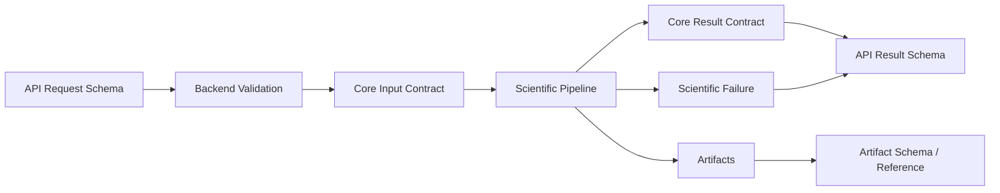
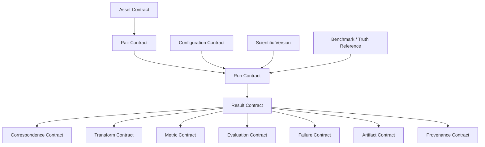
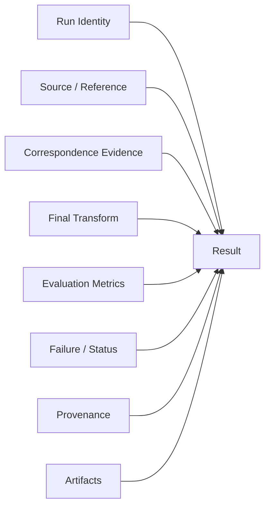
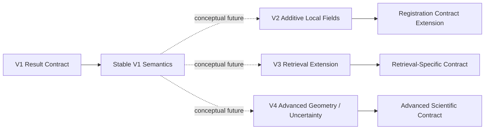

# API Schemas

> **Document role:** Scientific API schema and data-contract documentation
> **Project:** ChandraMap
> **Domain:** Lunar image correspondence, registration, geospatial localization, remote sensing, and scientific benchmarking
> **Current documentation mode:** Conceptual scientific contracts; no concrete machine-readable wire schema is established by the repository evidence available to this document
> **Primary scientific context:** ChandraMap V1 — known-overlap local lunar image registration

This document defines the **scientific meaning and contract boundaries** that ChandraMap API schemas must preserve.

It does not invent concrete request or response fields where no authoritative machine-readable schema or implementation establishes them.

> **A schema is not merely a serialization format; it is part of the scientific contract.**

> **A field is incomplete if its scientific meaning depends on unstated coordinate spaces, units, populations, or versions.**

> **Candidate correspondences and verified inliers must not share ambiguous semantics.**

> **A transform matrix without model, direction, and coordinate spaces is an incomplete scientific schema.**

> **A metric value without units, population, and coordinate space is an incomplete scientific result.**

> **Unavailable scientific evidence must not be encoded as a numeric zero.**

> **API schema evolution must preserve the historical scientific meaning of V1 results.**

> **Machine-readable schemas should be authoritative for wire-level structure when they exist; Markdown should explain scientific meaning.**

> **Schema fields must reflect core-engine outputs rather than inventing new science inside the API layer.**

> **Do not claim an illustrative conceptual structure is an implemented wire schema.**

> **ChandraMap schemas should preserve enough scientific context that a result remains interpretable even outside the process that generated it.**

---

## 1. Schema Documentation Status

This file currently defines **conceptual scientific contracts**.

The available project documentation establishes important scientific semantics for:

- V1 inputs;
- V1 outputs;
- source/reference roles;
- sensor context;
- matching;
- geometric verification;
- transforms;
- evaluation;
- failure handling;
- reproducibility.

The available evidence does not establish an authoritative concrete wire-schema set with verified:

- exact JSON property names;
- required/optional constraints;
- enum values;
- schema IDs;
- OpenAPI component names;
- Pydantic models;
- TypeScript interfaces;
- concrete nullability;
- validation ranges.

Therefore all YAML-style structures in this document are explicitly **illustrative conceptual schemas**.

They must not be treated as current production request or response formats.

If machine-readable schemas are introduced later, they should become authoritative for wire-level details.

---

## 2. Source of Truth

Concrete schema behavior should come from authoritative repository sources where available.

Potential sources of truth include:

- OpenAPI specifications;
- JSON Schema documents;
- framework request/response models;
- typed backend models;
- generated client types;
- core-engine input/result models;
- contract tests;
- serialization tests.

This document does not assume that any particular technology currently exists.

It therefore does **not** invent paths such as:

```text
openapi.yaml
schemas/
models.py
api-types.ts
```

If authoritative machine-readable contracts are added later, they should be linked from this section.

A useful authority hierarchy is:

```text
Machine-Readable Schema / Implementation
                +
Contract Tests
                ↓
Concrete Wire Contract
                ↓
schemas.md Scientific Interpretation
```

---

## 3. Relationship to Other API Documentation

### [`README.md`](./README.md)

The API README is the documentation entry point.

It should explain:

- why an API layer exists;
- how API documentation is organized;
- how API behavior relates to ChandraMap.

### [`overview.md`](./overview.md)

The API overview describes the conceptual system/API boundary.

It should focus on:

- clients;
- backend/API layer;
- core engine;
- high-level resource flow;
- major responsibilities.

### [`endpoints.md`](./endpoints.md)

The endpoint documentation describes:

- concrete endpoints where implementation establishes them;
- otherwise clearly labeled conceptual endpoint groups.

### `schemas.md`

This file focuses on:

- scientific data structure;
- field meaning;
- contract boundaries;
- coordinate semantics;
- metric semantics;
- availability semantics;
- provenance;
- versioning;
- schema evolution.

The four documents serve different purposes and should not duplicate one another.

---

## 4. Schema Design Goals

ChandraMap API schemas should optimize for:

### Scientific interpretability

A result should remain understandable after serialization.

### Reproducibility

Scientific data, configuration, truth, benchmark, and code context should remain traceable.

### Explicit coordinate meaning

Coordinates must retain the space in which they are defined.

### Explicit units

Spatial and runtime quantities must retain units.

### Explicit versioning

Scientific methodology, result structure, benchmark, and truth must remain distinguishable.

### Machine readability

Important scientific state should be available in structured form rather than only in logs or screenshots.

### Stable semantics

Fields should not silently change meaning across schema revisions.

### Failure transparency

Scientific failure must remain a first-class result state.

### Extensibility

Later versions should be able to add fields without rewriting historical V1 semantics.

### Validation

Schemas should support structural validation without duplicating scientific algorithms.

### Client interoperability

Backend, frontend, tools, and research workflows should interpret the same scientific concepts consistently.

### Benchmark compatibility

Formal benchmark results should remain machine-readable and comparable.

---

## 5. Schema Non-Goals

API schemas should not be used to:

- duplicate SIFT implementation;
- duplicate RANSAC implementation;
- duplicate transform estimation;
- calculate scientific metrics in the transport layer;
- encode frontend presentation state as scientific state;
- invent geolocation;
- infer metre-level error from approximate GSD;
- replace benchmark definitions;
- replace authoritative mission metadata;
- replace dataset documentation;
- expose internal database structures directly;
- encode all possible future ChandraMap research into V1 contracts.

The schema layer should preserve scientific meaning, not redefine it.

---

## 6. Relationship to the Core Engine

Relevant architecture documentation includes:

- [Core Engine Architecture](../architecture/core-engine-architecture.md)
- [Backend Architecture](../architecture/backend-architecture.md)

Conceptually:

```text
Core Engine
→ produces scientific domain objects and results

API Schema Layer
→ validates and serializes those objects for external use
```

The API schema layer must not change scientific meaning simply because another shape is more convenient for transport.

For example:

```text
Core transform:
source → reference
```

must not become:

```text
API transform:
direction unspecified
```

because that would remove essential scientific information.

---

## 7. Schema Flow



The API schema layer translates and exposes scientific state.

It should not become an independent scientific implementation.

---

## 8. V1 Schema Context

Relevant V1 documentation includes:

- [V1 Inputs](../versions/v1/inputs.md)
- [V1 Outputs](../versions/v1/outputs.md)
- [V1 Pipeline](../versions/v1/pipeline.md)
- [V1 Architecture](../versions/v1/architecture.md)
- [V1 Requirements](../versions/v1/requirements.md)

V1 is the **known-overlap local registration baseline**.

Conceptually:

```text
Known Pair
    ↓
Sensor-Aware Preparation
    ↓
Physical Scale Handling
    ↓
SIFT
    ↓
Descriptor Matching
    ↓
Filtering
    ↓
RANSAC
    ↓
Transform
    ↓
Optional Refinement
    ↓
Final Refit
    ↓
Registration
    ↓
Evaluation
```

V1 schema contracts therefore do **not** require mandatory:

- global retrieval;
- Top-K candidates;
- FAISS vectors;
- learned global descriptors;
- DEM-aware geometry;
- multi-mission retrieval fields.

Those concepts may appear only in later-version extensions.

---

# 9. Schema Categories

ChandraMap may conceptually require the following schema categories.

| Category                | Scientific Purpose                                               |
| ----------------------- | ---------------------------------------------------------------- |
| Input Contract          | Defines information needed to start or describe a scientific run |
| Resource Contract       | Describes assets, pairs, configurations, or benchmarks           |
| Run Contract            | Identifies one scientific execution                              |
| Job Contract            | Represents optional backend orchestration                        |
| Result Contract         | Represents the scientific outcome                                |
| Correspondence Contract | Represents candidate, filtered, or verified point relationships  |
| Transform Contract      | Represents geometric mapping                                     |
| Metric Contract         | Represents quantitative scientific measurements                  |
| Evaluation Contract     | Represents held-out truth/check evaluation                       |
| Failure Contract        | Represents scientific failure                                    |
| API Error Contract      | Represents request/service failures                              |
| Artifact Contract       | Represents generated output references                           |
| Provenance Contract     | Represents reproducibility context                               |

These are scientific concepts.

They are not current class names or OpenAPI component names.

---

# 10. Conceptual Schema Index

| Conceptual Contract | Scientific Purpose                                | Implementation Status                            |
| ------------------- | ------------------------------------------------- | ------------------------------------------------ |
| Asset               | Identify scientific data                          | Conceptual; no concrete wire schema defined here |
| Pair                | Identify source/reference relationship            | Conceptual                                       |
| Configuration       | Describe scientific behavior                      | Conceptual                                       |
| Run                 | Identify one scientific execution                 | Conceptual                                       |
| Job                 | Optional backend orchestration                    | Conceptual / conditional                         |
| Result              | Preserve scientific outcome                       | Conceptual                                       |
| Correspondence      | Preserve point relationships and processing stage | Conceptual                                       |
| Transform           | Preserve geometric mapping                        | Conceptual                                       |
| Metric              | Preserve measurement semantics                    | Conceptual                                       |
| Evaluation          | Preserve independent evaluation evidence          | Conceptual                                       |
| Failure             | Preserve scientific failure state                 | Conceptual                                       |
| API Error           | Preserve request/service errors                   | Conceptual                                       |
| Artifact            | Preserve generated-output references              | Conceptual                                       |
| Provenance          | Preserve reproducibility context                  | Conceptual                                       |

---

# 11. Input Contract Overview

A V1 scientific input contract may conceptually identify:

- scientific version;
- source asset;
- reference asset;
- pair;
- configuration;
- benchmark context;
- truth context;
- execution options where scientifically relevant.

The exact wire structure must come from a future authoritative schema.

---

## 12. Illustrative Conceptual Input Schema

> **Illustrative conceptual schema — not an implemented wire contract.**

```yaml
request:
  scientific_version: v1

  source:
    asset_id: PLACEHOLDER_SOURCE_ASSET
    sensor: PLACEHOLDER_SOURCE_SENSOR
    representation: PLACEHOLDER_REPRESENTATION

  reference:
    asset_id: PLACEHOLDER_REFERENCE_ASSET
    sensor: PLACEHOLDER_REFERENCE_SENSOR
    representation: PLACEHOLDER_REPRESENTATION

  pair:
    id: PLACEHOLDER_PAIR_ID_OR_NULL

  configuration:
    id: PLACEHOLDER_CONFIG_ID

  benchmark:
    version: PLACEHOLDER_OR_NULL

  evaluation:
    truth_version: PLACEHOLDER_OR_NULL
```

These field names illustrate required scientific meaning only.

They are not asserted as implemented API properties.

---

# 13. Source Contract

The **source** is the image/product being transformed or aligned.

A source contract may conceptually preserve enough information to resolve:

- asset identity;
- mission;
- instrument;
- product;
- representation;
- processing state;
- coordinate context;
- physical scale context;
- parent-product provenance.

Not every request must repeat all of this information.

If a stable asset identifier resolves the rest, duplication may be unnecessary.

The essential requirement is that the scientific meaning remain recoverable.

---

# 14. Reference Contract

The **reference** is the target image/reference coordinate frame.

In addition to general asset information, a reference contract may require context such as:

- selected reference region;
- tile or crop;
- pyramid level;
- coordinate space;
- effective scale;
- map/projection context where valid.

Not every reference is necessarily map-projected.

Geospatial fields must therefore remain conditional.

---

# 15. Source and Reference Are Different Roles

The scientific direction must remain explicit.

Preferred semantic interpretation:

```text
source → reference
```

Avoid reducing the contract to ambiguous concepts such as:

```text
image1
image2
```

unless legacy implementation requires those terms and their scientific roles are explicitly documented.

---

# 16. Asset Contract

An asset represents a traceable scientific data object.

It may refer to:

- provider/native mission product;
- prepared image;
- derived representation;
- reference tile;
- pyramid representation;
- other scientifically defined data product.

---

## 17. Illustrative Conceptual Asset Schema

> **Illustrative conceptual schema — not an implemented wire contract.**

```yaml
asset:
  id: PLACEHOLDER_ASSET_ID
  mission: PLACEHOLDER_MISSION
  instrument: PLACEHOLDER_INSTRUMENT
  product_id: PLACEHOLDER_PRODUCT_ID

  representation: PLACEHOLDER_REPRESENTATION
  processing_state: PLACEHOLDER_PROCESSING_STATE

  metadata_ref: PLACEHOLDER_METADATA_REFERENCE
  provenance_ref: PLACEHOLDER_PROVENANCE_REFERENCE
```

Exact field names and requiredness are implementation-defined.

---

## 18. Asset Identity Principle

> **Scientific identity should not depend only on a filename.**

Two files can have the same filename while representing different:

- products;
- versions;
- processing states;
- derived representations.

A reproducible asset identity may need to preserve or resolve:

```text
Provider Product
+
Version
+
Representation
+
Processing State
+
Provenance
```

---

# 19. Sensor Identity

Relevant project sensor families include:

- OHRC;
- TMC-2;
- IIRS;
- LRO NAC;
- LRO WAC.

This document does not define enum spelling or casing.

For example, it does not claim that an API uses:

```text
"OHRC"
"ohrc"
"CH2_OHRC"
```

as concrete serialized values.

Such values must come from the authoritative machine-readable contract.

---

# 20. Sensor Metadata Context

Approximate project context includes:

| Sensor  | Approximate Context                                                                       |
| ------- | ----------------------------------------------------------------------------------------- |
| OHRC    | `~0.25–0.32 m/pixel`, product/documentation dependent                                     |
| TMC-2   | `~5 m/pixel`                                                                              |
| IIRS    | `~80 m/pixel`, `~0.8–5.0 µm`, roughly `~250–256` bands depending on product/documentation |
| LRO NAC | Often roughly `~0.5–2 m/pixel` depending on product/acquisition                           |
| LRO WAC | Broader/coarser reference context; product dependent                                      |

These values must not become schema constants or endpoint defaults.

> **Actual product metadata wins.**

---

# 21. IIRS Representation Contract

IIRS requires special treatment because it is hyperspectral/imaging-infrared data.

A conventional 2D local matcher should not receive a raw hyperspectral cube under the fiction that it is an ordinary grayscale image.

A conceptual IIRS representation contract should preserve enough information to identify:

- parent IIRS product;
- derived 2D registration representation;
- representation method;
- representation/version identity;
- derivation provenance;
- coordinate relationship to the parent product.

Possible V1 representation categories may include a documented:

- selected band;
- derived component;
- structural representation.

The exact representation must come from authoritative V1 configuration/documentation.

---

## 22. Illustrative IIRS Representation Context

> **Illustrative conceptual schema — not an implemented wire contract.**

```yaml
representation:
  parent_asset_id: PLACEHOLDER_IIRS_PARENT_ASSET
  type: PLACEHOLDER_REGISTRATION_REPRESENTATION
  method: PLACEHOLDER_METHOD
  method_version: PLACEHOLDER_VERSION

  provenance_ref: PLACEHOLDER_PROVENANCE_REFERENCE
  coordinate_mapping_ref: PLACEHOLDER_MAPPING_REFERENCE
```

No specific representation type or method is mandated here.

---

# 23. Pair Contract

See [Pair Definition](../datasets/pair-definition.md).

A pair represents a controlled source/reference relationship.

Conceptually, a pair may preserve:

- pair identity;
- pair version;
- source asset;
- reference asset;
- overlap/task context;
- benchmark categories;
- truth version.

---

## 24. Illustrative Conceptual Pair Schema

> **Illustrative conceptual schema — not an implemented wire contract.**

```yaml
pair:
  id: PLACEHOLDER_PAIR_ID
  version: PLACEHOLDER_PAIR_VERSION

  source_asset_id: PLACEHOLDER_SOURCE
  reference_asset_id: PLACEHOLDER_REFERENCE

  categories:
    - PLACEHOLDER_CATEGORY

  truth_version: PLACEHOLDER_OR_NULL
```

No category vocabulary is defined here.

---

# 25. Configuration Contract

A scientific configuration determines pipeline behavior.

Conceptually, configuration may cover:

- preprocessing;
- illumination handling;
- physical scale handling;
- reference-pyramid behavior;
- SIFT;
- descriptor matching;
- candidate filtering;
- RANSAC;
- transform model;
- refinement;
- registration;
- evaluation.

This document does not invent concrete configuration keys or defaults.

---

# 26. Configuration Template vs Resolved Configuration

These concepts should remain distinct.

### Configuration Template

A named or reusable set of defaults.

### Resolved Configuration

The actual configuration used by a run after:

- defaults;
- version-specific behavior;
- permitted overrides.

Conceptually:

```text
Template
+
Overrides
+
Resolved Defaults
=
Effective Scientific Configuration
```

Formal results should preserve or reference the **resolved configuration**, not merely the template name.

---

# 27. Run Contract

A **run** is one scientific execution.

It is not necessarily the same object as a backend job.

A run may conceptually preserve:

- run identity;
- scientific version;
- pair identity;
- source identity;
- reference identity;
- configuration;
- benchmark context;
- truth context;
- scientific status;
- timestamps where implemented.

---

## 28. Illustrative Conceptual Run Schema

> **Illustrative conceptual schema — not an implemented wire contract.**

```yaml
run:
  id: PLACEHOLDER_RUN_ID
  scientific_version: v1

  pair_id: PLACEHOLDER_PAIR_ID_OR_NULL

  source_asset_id: PLACEHOLDER_SOURCE
  reference_asset_id: PLACEHOLDER_REFERENCE

  config_id: PLACEHOLDER_CONFIG
  benchmark_version: PLACEHOLDER_OR_NULL
  truth_version: PLACEHOLDER_OR_NULL

  status: PLACEHOLDER_STATUS
```

No status vocabulary is defined here.

---

# 29. Job Contract

Where asynchronous backend execution exists, a **job** may represent orchestration state.

Conceptually:

```text
Run
→ scientific execution identity

Job
→ backend execution/orchestration identity
```

A job ID must not automatically be assumed to equal the run ID.

This document does not define:

- job state enums;
- queue fields;
- worker IDs;
- retry counters;
- progress percentages.

Those depend on actual implementation.

---

# 30. Result Contract

The result contract is one of the most important ChandraMap schema concepts.

See [V1 Outputs](../versions/v1/outputs.md).

A formal result should conceptually preserve:

- result/schema version;
- run identity;
- scientific version;
- scientific status;
- source/reference context;
- correspondence summary;
- geometric model;
- transform;
- evaluation;
- failure state;
- artifacts;
- provenance.

> **A result should remain scientifically interpretable without requiring the reader to guess what its coordinates, units, transform, or status mean.**

---

## 31. Illustrative Conceptual Result Schema

> **Illustrative conceptual result schema — not an implemented wire contract.**

```yaml
result:
  schema_version: PLACEHOLDER_SCHEMA_VERSION

  run:
    id: PLACEHOLDER_RUN_ID
    scientific_version: v1
    status: PLACEHOLDER_STATUS

  source:
    asset_id: PLACEHOLDER_SOURCE_ASSET

  reference:
    asset_id: PLACEHOLDER_REFERENCE_ASSET

  correspondence:
    candidate_count: PLACEHOLDER
    filtered_count: PLACEHOLDER
    inlier_count: PLACEHOLDER
    inlier_ratio: PLACEHOLDER

  geometry:
    initial_transform: PLACEHOLDER_OR_NULL
    final_transform: PLACEHOLDER_OR_NULL
    refinement_enabled: PLACEHOLDER_BOOLEAN

  evaluation:
    fit_residual: PLACEHOLDER_OR_UNAVAILABLE
    spatial_coverage: PLACEHOLDER_OR_UNAVAILABLE
    check_result: PLACEHOLDER_OR_UNAVAILABLE

  failure:
    stage: PLACEHOLDER_OR_NULL
    diagnostic: PLACEHOLDER_OR_NULL

  artifacts:
    - PLACEHOLDER_ARTIFACT_REFERENCE

  provenance:
    config_id: PLACEHOLDER_CONFIG
    pair_version: PLACEHOLDER_PAIR_VERSION
    benchmark_version: PLACEHOLDER_OR_NULL
    truth_version: PLACEHOLDER_OR_NULL
    code_revision: PLACEHOLDER_REVISION
```

This example expresses scientific relationships only.

It does not establish implemented property names.

---

# 32. Correspondence Contract

Relevant algorithm documentation includes:

- [Matching](../algorithms/matching.md)
- [Match Filtering](../algorithms/match-filtering.md)
- [RANSAC](../algorithms/ransac.md)

ChandraMap must preserve the distinction between:

```text
Candidate Correspondence
        ↓
Filtered Candidate
        ↓
Geometrically Verified Inlier
```

These stages have different scientific meanings.

---

## 33. Candidate Correspondence

A candidate correspondence is a matcher proposal.

It has **not** yet been established as geometrically valid.

Candidate records may conceptually preserve:

- source coordinate;
- reference coordinate;
- coordinate spaces;
- matcher score;
- score semantics.

---

## 34. Filtered Candidate

A filtered candidate passed configured match-level filtering.

That may include operations such as:

- validity checks;
- duplicate handling;
- ratio testing;
- mutual/cross-check filtering.

It remains a candidate until geometric verification.

---

## 35. Verified Inlier

A verified inlier is a candidate judged consistent with the estimated geometric model.

It is:

> model-consistent algorithm output.

It is **not**:

> independent ground truth.

---

## 36. Illustrative Conceptual Correspondence Record

> **Illustrative conceptual schema — not an implemented wire contract.**

```yaml
correspondence:
  id: PLACEHOLDER_ID
  stage: PLACEHOLDER_STAGE

  source:
    x: PLACEHOLDER
    y: PLACEHOLDER
    coordinate_space: PLACEHOLDER_SOURCE_SPACE

  reference:
    x: PLACEHOLDER
    y: PLACEHOLDER
    coordinate_space: PLACEHOLDER_REFERENCE_SPACE

  matcher:
    score: PLACEHOLDER_OR_NULL
    score_semantics: PLACEHOLDER_OR_NULL

  geometry:
    inlier: PLACEHOLDER_BOOLEAN_OR_NULL
    residual: PLACEHOLDER_OR_NULL

  refinement:
    applied: PLACEHOLDER_BOOLEAN
    refined_source: PLACEHOLDER_OR_NULL
    refined_reference: PLACEHOLDER_OR_NULL
```

The exact stage representation and booleans are not defined here.

---

# 37. Correspondence Stage Semantics

Avoid one ambiguous collection named only:

```text
matches
```

if that loses scientific stage information.

Where detailed correspondence data is exposed, clients should be able to determine whether a record is:

- proposed;
- filtered;
- geometrically verified;
- refined.

This can be represented in many ways.

The exact wire structure is implementation-defined.

---

# 38. Matcher Score Limitation

A matcher-specific score is not automatically a probability that a match is physically correct.

For example:

```text
matcher score
≠
P(correct correspondence)
```

unless the algorithm explicitly defines and validates that interpretation.

Schemas should preserve score semantics where needed rather than normalize all matcher outputs into a misleading generic confidence field.

---

# 39. Transform Contract

See [Transforms](../algorithms/transforms.md).

A transform schema should conceptually preserve:

- transform stage;
- transform model;
- scientific direction;
- source coordinate space;
- reference coordinate space;
- model parameters;
- fitting population;
- whether refined coordinates were used;
- validity/status.

> **Transform direction must be explicit even if the matrix shape appears obvious.**

Recommended scientific semantics:

```text
source → reference
```

---

## 40. Illustrative Conceptual Transform Schema

> **Illustrative conceptual schema — not an implemented wire contract.**

```yaml
transform:
  stage: final
  model: PLACEHOLDER_MODEL
  direction: source_to_reference

  source_space: PLACEHOLDER_SOURCE_SPACE
  reference_space: PLACEHOLDER_REFERENCE_SPACE

  parameters: PLACEHOLDER_PARAMETERS

  fitting:
    population: PLACEHOLDER_POINT_SET
    refined_coordinates: PLACEHOLDER_BOOLEAN

  status: PLACEHOLDER_STATUS
```

The literal value `source_to_reference` is shown conceptually and is not asserted as an implemented enum.

---

# 41. Transform Parameter Semantics

Affine and homography transformations have different parameter meanings.

A schema must not imply:

```text
all transforms
=
same anonymous matrix representation
```

without model context.

Implementation may choose:

- flat arrays;
- nested matrices;
- model-specific objects;
- another representation.

The scientific contract must still identify:

- model;
- direction;
- spaces.

---

# 42. Initial vs Final Transform

When optional refinement is enabled, V1 may contain:

```text
Initial Transform
        ↓
Verified-Point Refinement
        ↓
Final Refit
        ↓
Final Transform
```

A schema should therefore avoid ambiguously representing both as one transform when the distinction matters.

The final evaluation should correspond to the final transform.

---

# 43. Coordinate-Space Contract

Coordinate spaces are first-class scientific context.

Potential conceptual spaces include:

- source native;
- source prepared;
- source crop;
- source matching;
- reference native;
- reference tile;
- reference pyramid;
- reference matching;
- registered output;
- projected map coordinates where valid;
- lunar geographic coordinates where valid.

This document does not define actual enum values.

---

## 44. Coordinate Principle

> **x and y are data only when the coordinate space that gives them meaning is also preserved.**

For example:

```text
x = 125.4
y = 89.7
```

is scientifically incomplete without knowing whether those values refer to:

- source-native pixels;
- cropped pixels;
- reference-pyramid pixels;
- map coordinates.

---

## 45. Illustrative Conceptual Coordinate Record

> **Illustrative conceptual schema — not an implemented wire contract.**

```yaml
coordinate:
  x: PLACEHOLDER
  y: PLACEHOLDER
  space: PLACEHOLDER_COORDINATE_SPACE

  parent_mapping:
    parent_space: PLACEHOLDER_OR_NULL
    transform_ref: PLACEHOLDER_OR_NULL
```

---

# 46. Row / Column vs X / Y

Image-processing implementations frequently use both:

```text
row, column
```

and:

```text
x, y
```

These must not be silently interchanged.

If concrete schemas eventually expose both conventions, documentation must define:

- ordering;
- origin;
- pixel-center semantics where relevant;
- relationship between row/column and x/y.

This document does not invent that convention.

---

# 47. Crop, Tile, and Pyramid Mapping

Coordinates derived from a:

- crop;
- tile;
- reference pyramid level;

should preserve enough mapping context to recover parent coordinates.

Conceptually:

```text
Reference Pyramid Coordinate
        ↓
Pyramid Mapping
        ↓
Reference Tile / ROI
        ↓
Parent Reference
```

Losing this mapping can invalidate transform and metric interpretation.

---

# 48. Metric Contract

See [Metrics](../evaluation/metrics.md).

A scientific metric should conceptually preserve:

- metric identity;
- value;
- availability;
- units;
- coordinate space;
- evaluated population;
- point count where relevant;
- definition/version;
- aggregation semantics where relevant.

> **A metric value without units, population, and coordinate space is an incomplete scientific result.**

---

## 49. Illustrative Conceptual Metric Schema

> **Illustrative conceptual schema — not an implemented wire contract.**

```yaml
metric:
  name: PLACEHOLDER_METRIC_NAME
  value: PLACEHOLDER_OR_UNAVAILABLE

  units: PLACEHOLDER_UNITS
  coordinate_space: PLACEHOLDER_SPACE

  population: PLACEHOLDER_POPULATION
  count: PLACEHOLDER_N

  definition_version: PLACEHOLDER_VERSION
  availability: PLACEHOLDER_AVAILABILITY
```

No metric names or availability enum values are defined here.

---

# 50. Metric Names Are Not Enough

A field named:

```text
rmse
```

is ambiguous by itself.

At minimum, interpretation may depend on:

- fit vs held-out check population;
- source vs reference coordinate space;
- native vs pyramid coordinates;
- pixels vs metres;
- evaluated point count;
- truth version.

For example:

```text
check RMSE
+
reference-parent pixel space
+
N points
+
truth version
```

is scientifically much more meaningful than a bare number.

---

# 51. Fit Residual Contract

See [Residual Analysis](../algorithms/residual-analysis.md).

Fit residuals describe agreement between the fitted model and its fitting/support points.

A fit-residual schema should therefore identify the fitting population.

It must not imply independent accuracy.

Conceptually:

```text
fit residual
≠
held-out registration error
```

---

# 52. Check-Point Evaluation Contract

See [Check-Point Evaluation](../evaluation/checkpoint-evaluation.md).

Where independent truth exists, a check-evaluation contract may conceptually preserve:

- truth version;
- check set;
- check count;
- predicted coordinates;
- truth coordinates;
- residual vectors;
- RMSE;
- coordinate space;
- units.

---

## 53. Illustrative Conceptual Check Result

> **Illustrative conceptual schema — not an implemented wire contract.**

```yaml
check_evaluation:
  truth_version: PLACEHOLDER_TRUTH_VERSION
  check_set: PLACEHOLDER_CHECK_SET

  count: PLACEHOLDER_N

  rmse:
    value: PLACEHOLDER_OR_UNAVAILABLE
    units: PLACEHOLDER_UNITS
    coordinate_space: PLACEHOLDER_SPACE

  points:
    - point_id: PLACEHOLDER_POINT_ID

      predicted:
        x: PLACEHOLDER
        y: PLACEHOLDER

      truth:
        x: PLACEHOLDER
        y: PLACEHOLDER

      residual:
        dx: PLACEHOLDER
        dy: PLACEHOLDER
        magnitude: PLACEHOLDER
```

A real contract should also preserve coordinate-space semantics for point-level coordinates where they are not inherited unambiguously.

---

# 54. Spatial-Coverage Contract

See [Spatial Coverage](../evaluation/spatial-coverage.md).

A coverage contract should preserve:

- resulting value;
- method;
- point population;
- valid region;
- coordinate space;
- method/definition version.

> **Spatial coverage measures distribution of support; it does not measure registration accuracy.**

---

## 55. Illustrative Conceptual Coverage Record

> **Illustrative conceptual schema — not an implemented wire contract.**

```yaml
coverage:
  value: PLACEHOLDER_VALUE
  method: PLACEHOLDER_METHOD
  population: PLACEHOLDER_POPULATION
  coordinate_space: PLACEHOLDER_SPACE
  valid_region: PLACEHOLDER_REFERENCE
  definition_version: PLACEHOLDER_VERSION
```

---

# 56. Inlier-Ratio Contract

Conceptually:

$$
\text{Inlier Ratio}
=
\frac{N_{\text{verified inliers}}}
{N_{\text{candidates used for geometric verification}}}
$$

Where useful, a schema may preserve:

- numerator;
- denominator;
- derived ratio.

This avoids ambiguity.

For example:

```text
4 / 5
```

and:

```text
80 / 100
```

have the same ratio but represent very different amounts of geometric support.

> **Inlier ratio is not accuracy.**

---

# 57. Runtime Contract

Runtime may conceptually preserve:

- total runtime;
- stage runtime;
- units;
- relevant execution environment.

No:

- precision;
- hardware requirement;
- latency target;
- SLA;

is defined here.

Runtime claims should remain interpretable only within documented execution context.

---

# 58. Ground-Space Metric Contract

Physical ground error should be represented only when scientifically valid.

A ground-space metric may require context such as:

- units;
- coordinate/reference system;
- conversion method;
- relevant spatial metadata;
- provenance.

The API layer must not fabricate ground error from:

```text
pixel error × approximate GSD
```

unless the scientific evaluation layer establishes that conversion as valid.

---

# 59. Geospatial Fields

Geospatial fields are conditional.

A local image-registration result does not universally require:

- latitude;
- longitude;
- projected coordinates;
- lunar geographic coordinates.

Such fields should appear only when the data and scientific context justify them.

> **Image-to-image registration does not automatically establish independently validated absolute geolocation.**

---

# 60. Failure Contract

See [Failure Cases](../evaluation/failure-cases.md).

Scientific failure is a valid result state.

A failure contract may conceptually preserve:

- run ID;
- scientific status;
- observed failure stage;
- last successful stage;
- diagnostic;
- partial outputs;
- suspected cause separately where used;
- provenance.

A scientific failure must not be confused with an API/service failure.

---

## 61. Illustrative Conceptual Failure Schema

> **Illustrative conceptual schema — not an implemented wire contract.**

```yaml
failure:
  run_id: PLACEHOLDER_RUN_ID
  observed_stage: PLACEHOLDER_STAGE
  last_successful_stage: PLACEHOLDER_STAGE

  diagnostic: PLACEHOLDER_DIAGNOSTIC

  partial_results:
    candidate_count: PLACEHOLDER_OR_UNAVAILABLE
    filtered_count: PLACEHOLDER_OR_UNAVAILABLE
    inlier_count: PLACEHOLDER_OR_UNAVAILABLE

  suspected_cause:
    value: PLACEHOLDER_OR_UNKNOWN
    confidence: PLACEHOLDER_OR_NOT_ASSESSED
```

No diagnostic vocabulary or confidence scale is defined here.

---

# 62. Failure Stage vs Root Cause

These must remain separate concepts.

Example:

```text
Observed stage:
geometric verification
```

Possible cause:

```text
physical scale mismatch
```

The stage where the run failed is not automatically the root cause.

Schemas should not collapse both concepts into a single misleading field.

---

# 63. API Error Contract

An API error describes request or service behavior.

It is different from scientific failure.

Conceptual API-error categories may include:

- request validation;
- resource resolution;
- unsupported input;
- authorization where implemented;
- internal service error.

This document does not define actual error codes.

---

## 64. Illustrative Conceptual API Error

> **Illustrative conceptual schema — not an implemented wire contract.**

```yaml
error:
  category: PLACEHOLDER_CATEGORY
  message: PLACEHOLDER_MESSAGE
  request_id: PLACEHOLDER_OR_NULL
  run_id: PLACEHOLDER_OR_NULL

  details:
    field: PLACEHOLDER_OR_NULL
    scientific_stage: PLACEHOLDER_OR_NULL
```

---

# 65. Status Layers

A single Boolean such as:

```text
success = true
```

is usually insufficient for ChandraMap.

Different layers answer different questions.

| Status Layer    | Purpose                                             |
| --------------- | --------------------------------------------------- |
| API / Transport | Was the request/service interaction handled?        |
| Execution / Job | What is the processing lifecycle state?             |
| Scientific      | Did registration produce valid scientific geometry? |
| Evaluation      | Was independent evaluation available and valid?     |

These states should remain conceptually separate.

---

# 66. Status Example

Conceptually:

```text
API:
handled successfully

Execution:
completed

Scientific:
registration failed

Evaluation:
not available because no final transform exists
```

This is entirely valid.

A service can function correctly while a scientific run fails.

---

# 67. Artifact Contract

Potential artifacts include:

- registered raster;
- registered preview;
- candidate-match visualization;
- verified-inlier visualization;
- residual visualization;
- coverage visualization;
- result manifest.

Large binary outputs should not automatically be embedded in every compact result object.

---

## 68. Illustrative Conceptual Artifact Schema

> **Illustrative conceptual schema — not an implemented wire contract.**

```yaml
artifact:
  id: PLACEHOLDER_ARTIFACT_ID
  run_id: PLACEHOLDER_RUN_ID
  role: PLACEHOLDER_ARTIFACT_ROLE

  media_type: PLACEHOLDER_OR_NULL
  scientific_context: PLACEHOLDER_CONTEXT

  reference: PLACEHOLDER_STORAGE_OR_ACCESS_REFERENCE
```

The `reference` concept does not imply:

- a URL;
- a local path;
- cloud storage;
- a specific download endpoint.

---

# 69. Artifact Metadata vs Artifact Content

Schemas should distinguish:

```text
Artifact Metadata / Reference
```

from:

```text
Large Binary or Scientific Payload
```

For example:

```text
registered raster metadata
```

may belong in a result response while:

```text
full registered raster bytes
```

may be retrieved through a separate mechanism.

The exact delivery architecture is implementation-defined.

---

# 70. Provenance Contract

See [Reproducibility](../evaluation/reproducibility.md).

Provenance is part of the scientific result.

A formal provenance contract may conceptually preserve:

- ChandraMap scientific version;
- schema version;
- source identity;
- reference identity;
- pair version;
- benchmark version;
- truth version;
- resolved configuration;
- code revision;
- environment context;
- random state where relevant.

> **A result without sufficient provenance is incomplete scientific evidence.**

---

## 71. Illustrative Conceptual Provenance Schema

> **Illustrative conceptual schema — not an implemented wire contract.**

```yaml
provenance:
  scientific_version: v1
  schema_version: PLACEHOLDER_SCHEMA_VERSION

  pair_version: PLACEHOLDER_OR_NULL
  benchmark_version: PLACEHOLDER_OR_NULL
  truth_version: PLACEHOLDER_OR_NULL

  source_asset_id: PLACEHOLDER_SOURCE
  reference_asset_id: PLACEHOLDER_REFERENCE

  config_id: PLACEHOLDER_CONFIG
  code_revision: PLACEHOLDER_REVISION

  environment: PLACEHOLDER_ENVIRONMENT_REFERENCE

  randomness:
    seed: PLACEHOLDER_OR_NULL
```

No environment or seed field is asserted as currently implemented.

---

# 72. Benchmark Contract

Relevant documentation includes:

- [V1 Benchmark](../versions/v1/benchmark.md)
- [Benchmark Protocol](../evaluation/benchmark-protocol.md)

A benchmark reference may conceptually identify:

- benchmark ID/version;
- pair-set version;
- truth version;
- metric-definition version;
- success-criteria version.

The complete benchmark definition does not necessarily need to be duplicated in every result.

Stable references plus essential resolved context may be preferable.

---

# 73. Benchmark vs Run vs Aggregate Result

These contracts should remain distinct.

### Benchmark Definition

Defines what should be evaluated.

### Run Result

Represents one scientific execution.

### Benchmark Aggregate

Summarizes multiple run results.

Conceptually:

```text
Benchmark Definition
       ↓
Runs
       ↓
Per-Run Results
       ↓
Benchmark Aggregate
```

A benchmark aggregate must not be mistaken for one registration result.

---

# 74. Future Benchmark Aggregate Contract

If benchmark aggregate schemas are introduced later, they may conceptually include:

- evaluated pair count;
- successful run count;
- failed run count;
- per-pair references;
- category summaries;
- aggregate metrics.

This document does not define concrete aggregate fields.

---

# 75. Availability and Missing-Value Semantics

Scientific schemas must distinguish different forms of absence.

### Zero

A genuine measured numeric value of zero.

### Null / Absent

A transport/schema-level representation whose exact meaning depends on the concrete contract.

### Unavailable

The metric or evidence could not be produced.

### Not Applicable

The concept does not apply to this run.

### Not Evaluated

The evaluation was not performed.

### Failed Before Measurement

The pipeline failed before the measurement could exist.

> **A zero-valued scientific measurement and a missing scientific measurement are fundamentally different data.**

---

# 76. Example: Missing Truth

Suppose a run produces a valid transform but has no independent check truth.

Correct conceptual interpretation:

```text
registration:
available

held_out_evaluation:
unavailable
```

Incorrect interpretation:

```text
check_rmse:
0
```

because that would imply perfect measured error.

---

# 77. Required vs Optional Fields

This document does not define actual required/optional wire constraints.

Conceptually, fields may fall into three classes.

### Core Identity

Likely necessary for formal scientific interpretation.

Examples conceptually include:

- run identity;
- scientific version;
- source/reference identity.

### Conditional Scientific Fields

Required only when the corresponding stage exists.

Examples:

- refinement information;
- check RMSE;
- ground-space metrics.

### Optional Diagnostics

Useful but not necessarily required for every result.

Examples:

- visual-artifact references;
- stage timings;
- detailed point records.

Actual requiredness must come from the machine-readable schema.

---

# 78. Conditional Field Examples

| Field Concept               | Condition                                        |
| --------------------------- | ------------------------------------------------ |
| Held-out check RMSE         | Independent truth exists and evaluation runs     |
| Ground/metre error          | Valid geospatial mapping exists                  |
| Refinement details          | Refinement is enabled                            |
| Reference pyramid level     | Pyramid representation is used                   |
| IIRS representation lineage | IIRS-derived registration representation is used |
| Retrieval candidates        | Retrieval-enabled later version                  |
| DEM/terrain geometry        | Advanced later-version geometry                  |

---

# 79. Schema Versioning

Several independent version dimensions may coexist.

| Version            | Controls                                 |
| ------------------ | ---------------------------------------- |
| API version        | Endpoint/client compatibility            |
| Scientific version | ChandraMap methodology                   |
| Schema version     | Serialized structure and field semantics |
| Benchmark version  | Evaluation definition                    |
| Truth version      | Ground-truth/check data                  |

These versions should not be conflated.

---

# 80. Schema Version Principle

> **Schema versioning exists to preserve machine-readable compatibility; scientific versioning exists to preserve methodological meaning.**

For example:

```text
Schema version changes
```

may alter transport structure without changing:

```text
Scientific V1 methodology
```

Likewise, a later scientific methodology may theoretically use the same transport schema.

---

# 81. Breaking Schema Changes

Potential breaking changes include:

- removing a field;
- changing a field's meaning;
- changing units;
- changing coordinate-space interpretation;
- changing transform direction;
- changing status semantics;
- changing missing-value semantics;
- changing the structure required to interpret historical results.

Such changes must not occur silently.

---

# 82. Additive Schema Evolution

Where practical, future schemas may add:

- optional diagnostic fields;
- new artifact types;
- additional provenance;
- later-version substructures.

Additive evolution should not silently change existing V1 semantics.

This document does not promise formal backward compatibility unless a repository policy explicitly establishes it.

---

# 83. V1 Schema Stability

Historical V1 results should remain interpretable after V2, V3, and V4 are introduced.

For example:

```text
V1 inlier_ratio
```

must not later change meaning merely because a V3 retrieval stage exists.

Similarly:

```text
V1 transform
```

must continue to mean the same source/reference geometric relationship.

---

# 84. Conceptual V2 Schema Extension

V2 may introduce stronger local-registration information such as:

- richer preprocessing diagnostics;
- alternative local matcher diagnostics;
- refinement comparisons;
- robustness metadata.

The actual V2 specification should define any such contract.

No V2 field names are defined here.

---

# 85. Conceptual V3 Schema Extension

V3 may introduce retrieval concepts such as:

- global descriptor references;
- candidate reference lists;
- retrieval scores;
- Top-K results;
- retrieval evaluation.

These should remain under retrieval-specific structures.

They must not alter V1 registration semantics.

---

# 86. Conceptual V4 Schema Extension

V4 research may introduce:

- DEM-aware geometry;
- uncertainty estimates;
- multi-mission context;
- advanced multimodal information;
- terrain-dependent transformations.

Concrete fields should be defined only when the V4 specification establishes them.

---

# 87. Retrieval and Registration Contracts

> **Retrieval schema and registration schema should remain distinct even when one workflow uses both.**

Retrieval asks:

```text
Which reference candidate?
```

Registration asks:

```text
How do source and reference align?
```

A combined workflow may link both results while preserving this distinction.

---

# 88. FAISS Context

FAISS may later support vector similarity retrieval.

FAISS does not itself produce:

- verified image correspondences;
- RANSAC inliers;
- image transforms;
- registration RMSE.

Therefore:

```text
FAISS similarity score
≠
registration confidence
```

and should not be serialized as though those concepts were equivalent.

---

# 89. Recall@K Context

Recall@K is a retrieval metric.

It should remain separate from registration metrics such as:

- inlier ratio;
- residuals;
- check RMSE;
- spatial coverage.

Schema design should preserve that domain boundary.

---

# 90. Validation Layers

ChandraMap validation can be separated conceptually into several layers.

### Serialization Validation

Checks transport structure and primitive types.

### Resource Validation

Checks whether referenced assets/configurations exist or resolve.

### Scientific Input Validation

Checks whether required scientific context exists.

### Geometric Validation

Checks whether estimated geometry is scientifically usable.

### Evaluation Validation

Checks whether independent truth is available and appropriate.

---

## 91. Validation Table

| Validation Layer | Example                                       |
| ---------------- | --------------------------------------------- |
| Serialization    | Value has expected structural type            |
| Resource         | Asset identifier resolves                     |
| Scientific input | Required sensor/scale context exists          |
| Geometry         | Transform is valid and non-degenerate         |
| Evaluation       | Held-out truth exists and remains independent |

---

# 92. Schema Validation Must Not Reimplement Science

API/schema validation may reasonably verify:

- expected structural shape;
- presence of required identifiers;
- simple domain relationships;
- recognizable version references.

It should not independently reimplement:

- RANSAC;
- residual analysis;
- RMSE calculation;
- coverage;
- transform validity logic;

when those responsibilities belong to the scientific core/evaluation system.

The transport layer should preserve authoritative scientific outcomes.

---

# 93. Numeric Precision

Scientific values such as:

- coordinates;
- transform parameters;
- residuals;
- metrics;

may require floating-point precision.

Authoritative machine-readable schemas should avoid arbitrary rounding merely for display convenience.

Presentation layers may render:

```text
1.23
```

while preserving a more precise machine-readable value internally.

No fixed decimal precision is specified here.

---

# 94. Unit Semantics

Potential scientific units include:

- source pixels;
- reference pixels;
- reference-pyramid pixels;
- metres where valid;
- seconds;
- dimensionless ratios.

Do not reduce all spatial units to:

```text
pixels
```

without identifying which pixel coordinate space is meant.

---

# 95. Unit Enum Caution

This document does not define serialized unit enum values.

For example, it does not claim a schema uses:

```text
px_source
px_reference
m
s
```

Those are implementation details.

The scientific requirement is that units remain unambiguous.

---

# 96. Geospatial Contract Caution

Projected or lunar geographic data is conditional.

Schema design should not make geospatial coordinates mandatory for every V1 local-registration result.

Some runs may provide only image-space registration.

That remains scientifically valid when interpreted appropriately.

---

# 97. Security and Schema Design

Scientific schemas must not expose:

- passwords;
- authentication tokens;
- API keys;
- secret environment variables;
- unrestricted internal filesystem paths.

Where repository-level security guidance exists, root-level `SECURITY.md` should remain the authoritative security policy.

Scientific provenance should identify configuration without copying secret values.

---

# 98. Secret-Field Anti-Pattern

Do not place fields such as:

```text
password
api_key
token
```

inside scientific provenance examples.

Authentication/security schemas, if they later exist, should be documented separately and handled safely.

---

# 99. Path and Storage Caution

Artifact or asset contracts should not automatically expose raw server paths such as:

```text
/home/user/data/...
```

Prefer implementation-defined managed references such as:

- asset IDs;
- artifact IDs;
- controlled resource references.

Exact storage architecture is outside this document.

---

# 100. Data-License Context

Where present, `../data-licenses.md` describes data provenance and redistribution considerations.

Asset or artifact metadata may need to preserve enough information to support:

- provider attribution;
- mission/product identity;
- provenance;
- redistribution rules.

This document does not invent mandatory license property names.

---

# 101. Serialization Format

This document does not assume JSON is the only transport format.

Conceptual examples use YAML-style structures because they are readable in Markdown.

If an implemented API uses:

- JSON;
- MessagePack;
- Protocol Buffers;
- another format;

the actual implementation should define the wire contract.

---

# 102. Conceptual Example Policy

Every non-implemented structure in this document uses:

- explicit conceptual labeling;
- `PLACEHOLDER` values;
- no fake benchmark values;
- no fake run IDs;
- no fake accuracy values;
- no fake product identifiers.

This prevents examples from being mistaken for measured scientific evidence.

---

# 103. OpenAPI Relationship

No OpenAPI file is assumed.

If an OpenAPI specification is introduced later, it may become authoritative for:

- endpoint paths;
- HTTP methods;
- request models;
- response models;
- parameter constraints;
- error response structure.

This document should then explain the scientific meaning of those schemas rather than duplicating the entire generated specification.

---

# 104. JSON Schema Relationship

If JSON Schema files are introduced later, they should define the exact machine-readable structural contract.

This Markdown should not manually duplicate all schema source.

Instead it should explain concepts such as:

- transform direction;
- metric population;
- scientific status;
- availability;
- provenance.

---

# 105. Backend Model Relationship

If backend framework models are introduced, their concrete fields may participate in the authoritative contract.

This document does not assume:

- Pydantic;
- FastAPI;
- dataclasses;
- Django serializers;
- another library.

Technology must be documented from repository evidence.

---

# 106. Frontend Type Relationship

If frontend/client types are generated from authoritative API schemas, that can reduce contract drift.

This document does not invent:

- TypeScript interface names;
- code-generation tools;
- frontend type paths.

Scientific semantics should remain shared regardless of client language.

---

# 107. Database Models Are Not API Schemas

> **Internal persistence models and public API schemas are related but not automatically the same contract.**

A database may contain:

- internal IDs;
- indexes;
- foreign keys;
- storage metadata;
- implementation-specific fields.

Those do not automatically belong in the public API contract.

Similarly, API scientific fields may be derived from multiple persistence sources.

---

# 108. Core Result Models vs API Result Models

The core engine may use scientific-native objects such as:

- arrays;
- matrices;
- image objects;
- domain classes.

The API layer may need transport-safe representations.

Conceptually:

```text
Core Scientific Object
        ↓
Serialization Mapping
        ↓
API-Safe Structure
```

The representation may change.

The scientific meaning must not.

---

# 109. Schema Dependency Model



The diagram describes conceptual dependency, not implementation classes.

---

# 110. Result Contract Composition



A complete result is more than a transform matrix or aligned image.

---

# 111. Version Evolution Model



The V2–V4 nodes are conceptual future extensions.

They do not assert current implementation.

---

# 112. Schema Testing Strategy

Schema testing should verify both structural correctness and scientific meaning.

## Structural Tests

Potential checks include:

- valid structure serializes;
- malformed structure is rejected;
- required identity context is preserved;
- result can be parsed.

## Semantic Contract Tests

Potential checks include:

- source/reference direction preserved;
- coordinate spaces preserved;
- units preserved;
- candidate/inlier distinction preserved;
- scientific version preserved.

## Result Tests

Potential checks include:

- successful result serializes;
- scientific failure result serializes;
- unavailable evaluation remains unavailable;
- artifacts remain connected to run identity;
- provenance survives serialization.

## Version Tests

Potential checks include:

- schema version preserved;
- scientific version preserved independently;
- old V1 result remains interpretable after additive extensions.

---

# 113. Schema Test Matrix

| Test Scenario                         | Expected Contract Behavior                       |
| ------------------------------------- | ------------------------------------------------ |
| Candidate correspondence serialized   | Remains candidate, not verified inlier           |
| Verified inlier serialized            | Inlier state and coordinate spaces preserved     |
| Transform serialized                  | Model, direction, and coordinate spaces retained |
| Check RMSE serialized                 | Units, space, population/count retained          |
| Missing check truth                   | Evaluation unavailable, not numeric zero         |
| Scientific failure                    | Failure stage and partial evidence retained      |
| Artifact serialized                   | Run/scientific context remains traceable         |
| V1 result read after schema extension | Original scientific semantics remain unchanged   |

---

# 114. Round-Trip Testing

Where practical, schema implementations should support semantic round trips:

```text
Scientific Object
    ↓ serialize
Transport Representation
    ↓ deserialize
Scientific Object
```

Important candidates include:

- transforms;
- coordinates;
- metrics;
- scientific status;
- provenance.

The requirement is preservation of meaning.

Bitwise identity is not always required if internal representations differ.

---

# 115. Schema Regression Testing

Regression tests should protect against accidental changes to:

- source/reference role;
- transform direction;
- coordinate-space identifiers;
- metric units;
- fit/check semantics;
- status semantics;
- missing-value semantics;
- transform-model interpretation;
- scientific-version context;
- benchmark/truth provenance.

These areas are especially sensitive because an apparently harmless serialization change can alter scientific interpretation.

---

# 116. Concrete Schema Documentation Template

When actual schemas exist, document them consistently.

### `<Verified Schema Name>`

**Purpose**

What scientific/API concept the schema represents.

**Source of truth**

Where the concrete contract is defined.

**Used by**

Which endpoints/resources use it.

**Scientific semantics**

What the fields mean scientifically.

**Required fields**

Only when the authoritative schema defines them.

**Conditional fields**

Explain science-driven conditions.

**Versioning**

Relevant schema/scientific-version behavior.

**Validation**

Describe structural/domain boundaries without duplicating scientific algorithms.

**Example**

Use authoritative field names and placeholder values.

Do not invent schema names merely to fill this template.

---

# 117. Conceptual Contract Template

When no machine-readable schema exists, use a conceptual contract instead.

### Conceptual `<Domain Concept>` Contract

**Purpose**

Scientific role.

**Required scientific meaning**

What must remain representable.

**Possible structure**

Illustrative example using placeholders.

**Implementation status**

No concrete wire schema is defined by this document.

---

# 118. Schema Documentation Checklist

The checklist is intentionally unchecked.

## Source of Truth

- [ ] Concrete schemas link to actual implementation/schema files
- [ ] Conceptual contracts are clearly labeled
- [ ] No invented schema name is presented as implemented
- [ ] Generated schema content is not duplicated unnecessarily

## Scientific Identity

- [ ] Scientific version is preserved
- [ ] Source identity is preserved
- [ ] Reference identity is preserved
- [ ] Pair version is traceable
- [ ] Configuration identity is traceable
- [ ] Benchmark version is traceable where applicable
- [ ] Truth version is traceable where applicable
- [ ] Sensor identity is preserved

## Coordinates and Geometry

- [ ] Coordinates include coordinate-space semantics
- [ ] Row/column and x/y conventions are unambiguous
- [ ] Crop/tile/pyramid mapping can be preserved
- [ ] Transform model is preserved
- [ ] Transform direction is preserved
- [ ] Source transform space is preserved
- [ ] Reference transform space is preserved
- [ ] Initial/final transform distinction is preserved where needed

## Correspondence

- [ ] Candidate matches remain distinct from filtered candidates
- [ ] Filtered candidates remain distinct from verified inliers
- [ ] RANSAC inliers are not represented as ground truth
- [ ] Match scores preserve method-specific meaning
- [ ] Refinement state is preserved where applicable

## Metrics and Evaluation

- [ ] Metric units are preserved
- [ ] Metric population is preserved
- [ ] Metric coordinate space is preserved
- [ ] Fit residual and held-out error remain distinct
- [ ] Check-point count is preserved
- [ ] Truth version is preserved
- [ ] Coverage method and population are preserved
- [ ] Inlier-ratio denominator remains recoverable
- [ ] Missing evaluation is not encoded as zero

## Failure and Status

- [ ] API error differs from scientific failure
- [ ] Failure stage is preserved
- [ ] Failure stage differs from root-cause hypothesis
- [ ] Partial scientific outputs may survive failure
- [ ] API, execution, scientific, and evaluation status are not collapsed into one Boolean

## Artifacts and Provenance

- [ ] Artifact references link to run context
- [ ] Large binaries are not forced into compact result metadata
- [ ] Provenance preserves data identity
- [ ] Provenance preserves configuration identity
- [ ] Provenance preserves code revision
- [ ] Provenance preserves benchmark/truth context where applicable
- [ ] Secrets are excluded

## Versioning

- [ ] API version differs from scientific version
- [ ] Schema version differs from scientific version
- [ ] Benchmark version remains separate
- [ ] Truth version remains separate
- [ ] Breaking semantic changes require explicit handling
- [ ] Historical V1 semantics remain stable

---

# 119. Schema Anti-Patterns

Do **not**:

- invent `RegistrationRequest`;
- invent `RegistrationResponse`;
- invent Pydantic class names;
- invent OpenAPI component names;
- invent enum values;
- invent required fields;
- invent validation ranges;
- invent status strings;
- use one generic `image` field for both source and reference;
- use filename alone as scientific identity;
- label all matcher output as verified matches;
- represent matcher score as universal probability;
- call RANSAC inliers ground truth;
- serialize a transform as bare numbers with no model or direction;
- serialize coordinates without coordinate-space meaning;
- serialize RMSE without units and population;
- merge fit residual and held-out error into one ambiguous field;
- encode unavailable evaluation as zero;
- mix retrieval score with registration confidence;
- expose secret configuration values;
- expose unrestricted server paths;
- make persistence models equal public schemas by default;
- silently change field semantics;
- use one Boolean for API, execution, scientific, and evaluation status;
- make future-version fields mandatory for historical V1 results;
- fabricate examples that resemble real benchmark outcomes.

---

# 120. Claims to Avoid

Do not claim without repository evidence:

> "The API uses JSON Schema."

> "The backend uses Pydantic."

> "OpenAPI defines these models."

> "This is the production result schema."

> "All fields are required."

> "These enum values are supported."

> "The API uses these exact request fields."

> "The schema is stable."

> "The schema is backward compatible."

> "Frontend types are automatically generated."

> "The result schema supports V1 through V4."

> "The API always returns metre accuracy."

> "The schema supports every sensor and product."

Concrete implementation evidence is required for such statements.

---

# 121. Schema Limitations

Current conceptual schema documentation has several deliberate limitations.

### Wire contracts may evolve

Exact property names, requiredness, and serialization are not established here.

### Not every conceptual contract may become a standalone schema

Implementation may combine or split contracts differently.

### Core models may differ from transport models

Scientific-native objects do not need to have identical serialization structure.

### Validation cannot prove scientific correctness

A structurally valid transform object can still contain scientifically invalid geometry.

### Coordinate complexity may grow

Later versions may introduce additional coordinate spaces and transforms.

### Large point sets may need separate resources

Detailed correspondence and residual data may be too large for compact result payloads.

### Geospatial fields remain conditional

Not every registration supports valid physical/geographic coordinates.

### V1 remains known-pair oriented

Retrieval-specific fields are not part of the core V1 result contract.

### Nullability is implementation-defined

The exact representation of unavailable data must come from machine-readable schemas when they exist.

---

# 122. Schema Design Decision Questions

Before adding or modifying a field, contributors should ask:

1. What scientific concept does this field represent?
2. Is that concept already represented by a stable resource identifier?
3. Does the value require units?
4. Does it require coordinate-space context?
5. Does it require scientific-version context?
6. Is it V1 core or later-version specific?
7. Is it required, conditional, or diagnostic?
8. Is missing meaningfully different from zero?
9. Is it API state or scientific state?
10. Could its meaning change across scientific versions?
11. Does it unnecessarily duplicate core-engine state?
12. Does it expose backend implementation details?
13. Does it expose secrets?
14. Is the value too large and better represented as an artifact?
15. Would changing its meaning break historical V1 interpretation?
16. Is the field truly needed by a client or only convenient internally?
17. Is the same scientific concept already represented elsewhere?
18. Can the field be validated without reimplementing scientific logic?
19. Does it create ambiguity between source and reference?
20. Does it preserve enough provenance for later benchmarking?

---

# 123. Schema Evolution Principle

> **Add structure when the science requires it; do not add fields merely to make the API appear more sophisticated.**

ChandraMap schema quality should be judged by:

- scientific clarity;
- reproducibility;
- stable meaning;
- usability;
- testability;

not by the number of fields.

---

# 124. Schema Summary

A formal ChandraMap API result should remain capable of preserving:

```text
Scientific Version
        +
Asset / Pair Identity
        +
Resolved Configuration
        +
Run Identity
        +
Correspondence Evidence
        +
Transform Geometry
        +
Metrics
        +
Independent Evaluation
        +
Failure / Status
        +
Artifacts
        +
Provenance
```

The essential requirement is:

> **A machine-readable result should remain scientifically interpretable without guessing what its coordinates, units, transform, or status mean.**

---

# 125. Related API Documentation

- [API README](./README.md) — API documentation entry point.
- [API Overview](./overview.md) — conceptual API/system model.
- [API Endpoints](./endpoints.md) — concrete endpoint documentation where verified and conceptual endpoint groups otherwise.
- **API Schemas** — scientific and API-facing data-contract semantics.

Potential future API documentation areas may include:

- error contracts;
- authentication;
- versioning;
- examples;
- generated OpenAPI documentation.

These are possible documentation areas, not claims that corresponding files already exist.

---

# 126. Related Project Documentation

Known project documentation includes:

- [Project Goals](../project/goals.md)
- [Project Non-Goals](../project/non-goals.md)
- [Project-Level V1 Scope](../project/v1-scope.md)
- [Terminology](../project/terminology.md)
- [Assumptions](../project/assumptions.md)
- [Project Limitations](../project/limitations.md)

These documents define project-level meaning that API schemas should preserve.

---

# 127. Related Architecture Documentation

- [System Overview](../architecture/system-overview.md)
- [V1 Pipeline Architecture](../architecture/v1-pipeline.md)
- [Core Engine Architecture](../architecture/core-engine-architecture.md)
- [Backend Architecture](../architecture/backend-architecture.md)
- [Frontend Architecture](../architecture/frontend-architecture.md)
- [Module Map](../architecture/module-map.md)
- [Data Flow](../architecture/data-flow.md)
- [Output Flow](../architecture/output-flow.md)

Especially important are:

- [Core Engine Architecture](../architecture/core-engine-architecture.md)
- [Backend Architecture](../architecture/backend-architecture.md)

These define the boundary between scientific computation and API serialization.

---

# 128. Related Version Documentation

Known V1 documentation includes:

- [Version Architecture](../versions/README.md)
- [V1 README](../versions/v1/README.md)
- [V1 Specification](../versions/v1/specification.md)
- [V1 Scope](../versions/v1/scope.md)
- [V1 Requirements](../versions/v1/requirements.md)
- [V1 Architecture](../versions/v1/architecture.md)
- [V1 Pipeline](../versions/v1/pipeline.md)
- [V1 Inputs](../versions/v1/inputs.md)
- [V1 Outputs](../versions/v1/outputs.md)
- [V1 Benchmark](../versions/v1/benchmark.md)
- [V1 Acceptance Criteria](../versions/v1/acceptance-criteria.md)
- [V1 Limitations](../versions/v1/limitations.md)

Where a V1 exclusions document exists, it should define intentionally omitted capabilities and should be referenced by future revisions of this file.

---

# 129. Related Sensor Documentation

Known sensor documentation includes:

- [Sensor Overview](../sensors/overview.md)

Where corresponding files exist, additional sensor documentation may include:

- `../sensors/ohrc.md`
- `../sensors/tmc2.md`
- `../sensors/iirs.md`
- `../sensors/lro-nac.md`
- `../sensors/lro-wac.md`

Direct links should only be added once repository presence is confirmed.

---

# 130. Related Dataset Documentation

Where present, relevant dataset documentation includes:

- `../datasets/README.md`
- `../datasets/chandrayaan-2.md`
- `../datasets/lro.md`
- `../datasets/metadata.md`
- `../datasets/data-format.md`
- `../datasets/dataset-structure.md`
- `../datasets/dataset-preparation.md`
- `../datasets/pair-definition.md`
- `../datasets/ground-truth-preparation.md`

These documents define the scientific identity and lineage concepts that API schemas must preserve.

---

# 131. Related Algorithm Documentation

Where present, relevant algorithm documentation includes:

- `../algorithms/overview.md`
- `../algorithms/sensor-routing.md`
- `../algorithms/preprocessing.md`
- `../algorithms/illumination-handling.md`
- `../algorithms/scale-pyramid.md`
- `../algorithms/sift.md`
- `../algorithms/matching.md`
- `../algorithms/match-filtering.md`
- `../algorithms/ransac.md`
- `../algorithms/transforms.md`
- `../algorithms/residual-analysis.md`
- `../algorithms/subpixel-refinement.md`
- `../algorithms/registration.md`

Only verified files should become direct links.

---

# 132. Related Evaluation Documentation

Where present, relevant evaluation documentation includes:

- `../evaluation/README.md`
- `../evaluation/benchmark-protocol.md`
- `../evaluation/benchmark-categories.md`
- `../evaluation/metrics.md`
- `../evaluation/ground-truth.md`
- `../evaluation/control-points.md`
- `../evaluation/checkpoint-evaluation.md`
- `../evaluation/spatial-coverage.md`
- `../evaluation/stress-tests.md`
- `../evaluation/success-criteria.md`
- `../evaluation/failure-cases.md`
- `../evaluation/reproducibility.md`

These files define the scientific semantics that metric and evaluation schemas must preserve.

---

# 133. Data Licensing

Where present, `../data-licenses.md` defines data provenance, attribution, and redistribution considerations.

Schema design may need to preserve enough scientific identity to support those obligations without inventing license-specific fields prematurely.

---

# 134. Root Repository Documentation

From `docs/api/schemas.md`, repository-root documentation is two levels above.

Where present, relevant files may include:

- `../../README.md`
- `../../ROADMAP.md`
- `../../CHANGELOG.md`
- `../../CONTRIBUTING.md`
- `../../SECURITY.md`
- `../../CITATION.cff`

Direct links should be added only after repository presence is confirmed.

---

# 135. Implementation Technology Caution

This document intentionally does not assume:

- OpenAPI;
- JSON Schema;
- Pydantic;
- FastAPI;
- Flask;
- Django;
- Express;
- NestJS;
- GraphQL;
- Protocol Buffers;
- generated TypeScript clients.

If implementation establishes one of these technologies, future schema documentation should describe its actual contract.

---

# 136. Database and Storage Caution

Do not assume:

- SQL tables;
- PostgreSQL records;
- PostGIS geometries;
- MongoDB documents;
- Redis objects;
- object-storage metadata;

are identical to the public API contract.

Keep these three layers conceptually distinct:

```text
Scientific Domain Contract
        ↓
Transport/API Contract
        ↓
Persistence Model
```

They may overlap.

They are not automatically the same thing.

---

# 137. Final Scientific Schema Contract

ChandraMap schema design can be summarized as:

```text
Scientific Asset Identity
        ↓
Source / Reference Roles
        ↓
Pair + Configuration + Version
        ↓
Scientific Run
        ↓
Correspondence Evidence
        ↓
Geometric Transform
        ↓
Evaluation
        ↓
Failure / Success Status
        ↓
Artifacts
        ↓
Provenance
        ↓
Versioned Machine-Readable Result
```

The defining rules are:

> **A schema is part of the scientific contract.**

> **Source and reference are distinct scientific roles.**

> **Scientific identity is more than a filename.**

> **Product metadata overrides approximate instrument summaries.**

> **IIRS-derived registration representations must preserve parent lineage.**

> **Candidate, filtered candidate, and verified inlier semantics must remain distinct.**

> **RANSAC inlier does not mean ground truth.**

> **A transform requires model, direction, and coordinate spaces.**

> **A coordinate requires a coordinate space.**

> **A metric requires units, population, and coordinate context.**

> **Fit residual and held-out error are different measurements.**

> **Coverage describes distribution, not accuracy.**

> **Unavailable evidence is not zero.**

> **Scientific failure is different from API error.**

> **Provenance is part of the formal scientific result.**

> **API version, scientific version, schema version, benchmark version, and truth version are different concepts.**

> **Retrieval contracts remain separate from registration contracts.**

> **Later schema extensions must preserve historical V1 meaning.**

> **Machine-readable schemas should become authoritative for wire-level structure once they exist.**

> **Markdown documentation should explain scientific semantics rather than pretending to be an implementation schema.**

<!-- Source requirements: :contentReference[oaicite:0]{index=0} -->
