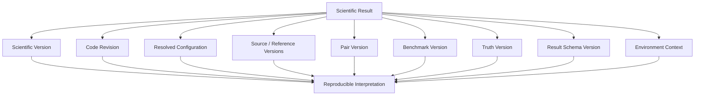
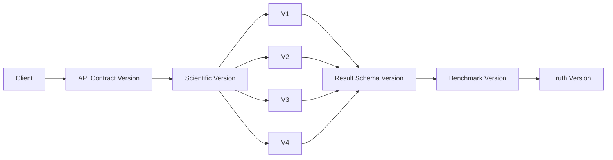
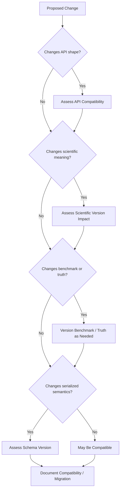
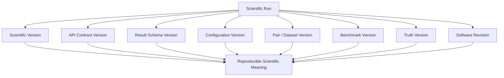
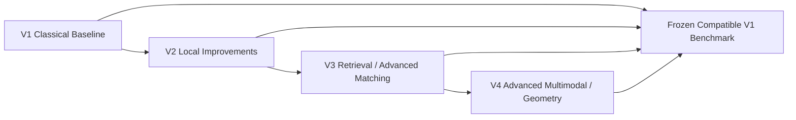
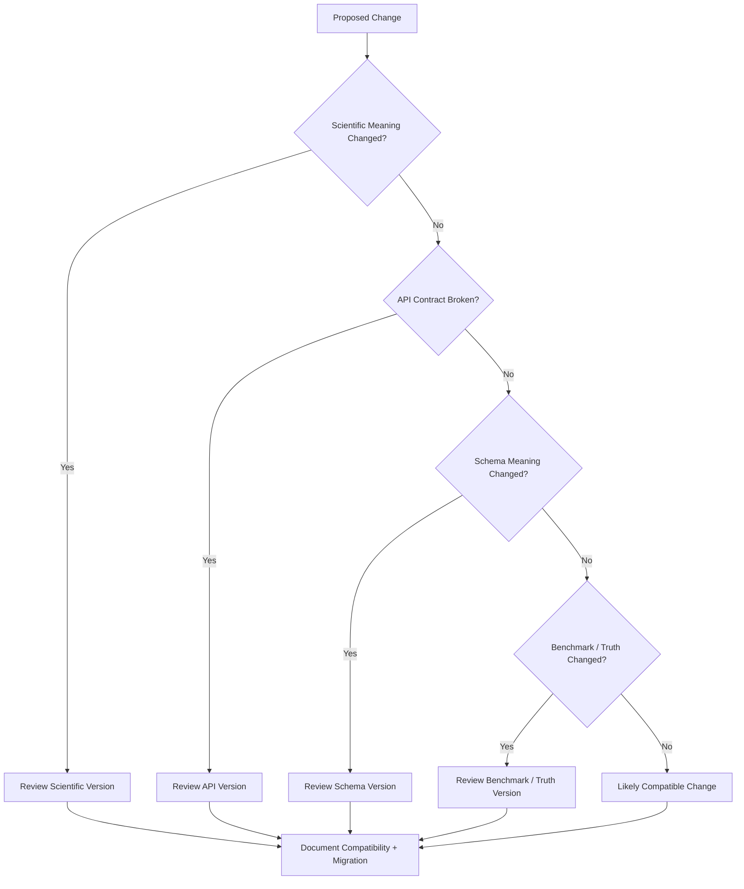

# API Versioning

> **Document role:** Authoritative API versioning and compatibility guide
> **Project:** ChandraMap
> **Scope:** API contracts, scientific versions, schemas, benchmarks, truth, datasets, configurations, software revisions, and reproducibility
> **Scientific context:** Lunar image correspondence and registration research platform
> **Current API-version mechanism:** Not asserted by this document
> **Current API-contract version:** Not asserted by this document

ChandraMap requires explicit version governance because it is both a software system and a scientific research platform.

A single version number is not sufficient to describe a ChandraMap result.

A formal result may depend independently on:

* the scientific methodology;
* the API contract used to transport the request/result;
* the result-schema structure;
* the benchmark definition;
* the ground-truth/check-point definition;
* the source/reference pair;
* the resolved scientific configuration;
* the exact software revision;
* derived data or representation versions.

> **ChandraMap versions the interface and the science separately so that clients can evolve without erasing the methodological meaning of past results.**

> **API contract version and ChandraMap scientific version are different axes and must never be treated as interchangeable.**

> **A client should be able to determine which scientific methodology produced a result independently of which API contract transported it.**

> **API evolution must not silently change the scientific meaning of historical results.**

> **Scientific versioning protects methodology; schema versioning protects serialization; benchmark versioning protects evaluation comparability.**

> **Reproducibility requires recording all scientifically relevant version axes, not only the software release.**

> **A new field can be backward-compatible structurally while still being scientifically incompatible if it changes the meaning of an existing result.**

> **Later scientific versions should extend ChandraMap without rewriting the historical definition of V1.**

> **Benchmark definitions, truth, and metric semantics must not change silently under an unchanged version identifier.**

> **API version numbers should describe the API contract, not claim the quality or accuracy of the scientific method.**

> **Do not introduce version numbers unless they represent an actual compatibility or scientific boundary.**

---

## 1. Purpose

This document defines how ChandraMap should reason about versioning across:

* API contracts;
* scientific methodologies;
* result schemas;
* benchmarks;
* ground truth;
* datasets and pairs;
* configuration;
* software releases;
* derived artifacts.

The goal is to ensure that an old ChandraMap result remains interpretable even after:

* the API evolves;
* result schemas gain fields;
* later scientific versions are introduced;
* benchmark definitions are revised;
* ground truth is corrected;
* software implementation changes.

Version governance supports:

* scientific reproducibility;
* controlled benchmarking;
* client stability;
* long-lived research artifacts;
* transparent migration;
* explicit compatibility;
* fair V1-to-later-version comparisons.

This document defines **versioning principles and compatibility boundaries**.

It does not invent the project's current API-versioning mechanism.

---

## 2. Relationship to Other API Documentation

The API documentation set has different responsibilities.

| Document                        | Responsibility                                                           |
| ------------------------------- | ------------------------------------------------------------------------ |
| [API README](./README.md)       | API documentation entry point                                            |
| [API Overview](./overview.md)   | Conceptual API/system model                                              |
| [API Endpoints](./endpoints.md) | Endpoint operations and resource surface                                 |
| [API Schemas](./schemas.md)     | Request/result/data-contract semantics                                   |
| `error-codes.md`                | Error and failure semantics when present                                 |
| **`versioning.md`**             | Version identity, compatibility, migration, benchmark/version governance |

This document should not duplicate endpoint definitions or schema field documentation.

Instead it answers questions such as:

> Which kind of version changed?

> Does an old client still understand the contract?

> Does an old result still mean the same thing scientifically?

> Can two benchmark results still be compared fairly?

---

## 3. Relationship to ChandraMap Version Documentation

The project scientific-version model is defined separately from API versioning.

See:

* [ChandraMap Version Architecture](../versions/README.md)

The distinction is essential:

```text
../versions/README.md
→ defines scientific / research / benchmark milestones

docs/api/versioning.md
→ defines how those scientific versions coexist with API,
  schema, benchmark, truth, data, configuration, and release versions
```

ChandraMap scientific V1/V2/V3/V4 must not be interpreted as automatic API revisions.

---

## 4. Versioning Goals

ChandraMap versioning should:

* preserve historical scientific meaning;
* make API incompatibilities explicit;
* support multiple scientific methodologies where appropriate;
* keep V1 reproducible after later versions exist;
* protect benchmark comparability;
* preserve truth/data/configuration provenance;
* permit additive API evolution;
* avoid unnecessary breaking changes;
* make migrations reviewable;
* prevent silent semantic drift;
* allow old scientific results to remain interpretable;
* keep research experiments distinct from stable scientific milestones.

---

## 5. Versioning Non-Goals

Versioning should not be used to:

* imply that a larger version number means scientifically better;
* advertise accuracy;
* hide breaking changes;
* convert unfinished work into a new version label;
* replace `CHANGELOG.md`;
* replace release notes;
* encode every internal refactor;
* make every experiment a scientific version;
* permanently bind one API version to one scientific version;
* make software releases equal benchmark versions;
* make configuration presets equal scientific versions.

---

# 6. Version Taxonomy

ChandraMap contains multiple independent version axes.

This is the central versioning model.

## 6.1 ChandraMap Scientific Version

The scientific version identifies the **methodological research milestone**.

Examples in the project architecture are:

* V1;
* V2;
* V3;
* V4.

> **Each ChandraMap scientific version represents a benchmarkable research milestone, not merely a new API or software release.**

Scientific versioning answers:

> Which ChandraMap methodology produced this result?

---

## 6.2 API Contract Version

The API contract version identifies the client-facing interaction contract.

It may govern:

* endpoint shape;
* request semantics;
* response semantics;
* resource interaction;
* errors;
* pagination or negotiation behavior where implemented.

This document does not assert that ChandraMap currently has a concrete API-contract version.

---

## 6.3 Result / Schema Version

The schema version identifies the machine-readable structure and semantics of serialized data.

It may govern:

* fields;
* nesting;
* requiredness;
* nullability;
* field interpretation;
* serialized transform representation;
* metric structure;
* status representation.

See [API Schemas](./schemas.md).

---

## 6.4 Benchmark Version

The benchmark version identifies a frozen scientific evaluation contract.

It may include:

* pair population;
* truth;
* fit/check assignments;
* metric definitions;
* success criteria;
* benchmark categories;
* official configuration.

---

## 6.5 Ground-Truth Version

The ground-truth version identifies the exact:

* control-point definitions;
* held-out check points;
* truth coordinates;
* truth preparation;
* truth corrections.

Ground truth must not silently change while retaining an unchanged identity.

---

## 6.6 Pair / Dataset Version

Pair or dataset version identifies the exact scientific input state.

It may distinguish changes to:

* source asset;
* reference asset;
* crop;
* tile;
* representation;
* preprocessing state;
* pair definition.

---

## 6.7 Configuration Version

Configuration version or identity identifies the scientific settings used by the pipeline.

Relevant settings may include:

* preprocessing;
* illumination handling;
* scale strategy;
* SIFT;
* matching;
* filtering;
* RANSAC;
* transform model;
* refinement;
* registration;
* evaluation.

---

## 6.8 Software / Repository Release Version

Software release version identifies a code-distribution or repository release state.

It is not automatically equivalent to:

* scientific version;
* API version;
* schema version;
* benchmark version.

---

## 6.9 Artifact / Derived-Data Version

Some derived products may require independent identity/versioning.

Examples include:

* prepared source representations;
* reference pyramids;
* IIRS-derived registration representations;
* registered rasters;
* reusable masks.

The exact artifact-versioning mechanism is implementation-defined.

---

# 7. Version Taxonomy Table

| Version Axis                  | What It Controls                          | Why It Matters                 |
| ----------------------------- | ----------------------------------------- | ------------------------------ |
| Scientific version            | Algorithm/pipeline methodology            | Scientific comparability       |
| API contract version          | Client/API interaction contract           | Client compatibility           |
| Schema version                | Serialized result structure and semantics | Machine-readable compatibility |
| Benchmark version             | Evaluation population/rules               | Fair comparison                |
| Ground-truth version          | Truth/check-point identity                | Metric reproducibility         |
| Pair/dataset version          | Input data and preparation identity       | Data reproducibility           |
| Configuration version         | Pipeline settings                         | Run reproducibility            |
| Software release              | Code/repository state                     | Implementation reproducibility |
| Artifact/derived-data version | Prepared/generated data identity          | Data lineage                   |

These axes are related but independent.

---

# 8. API Version Is Not Scientific Version

> **API contract version and ChandraMap scientific version are different axes and must never be treated as interchangeable.**

A stable API contract could theoretically expose several scientific methodologies.

Conceptually:

```text
One API Contract
      ↓
Scientific V1
Scientific V2
Scientific V3
```

Likewise, the API contract could evolve while continuing to expose the same V1 scientific methodology.

Conceptually:

```text
Older API Contract
        ↓
Scientific V1

Newer API Contract
        ↓
Scientific V1
```

Therefore:

```text
API version
≠
Scientific version
```

---

## 9. Conceptual Multi-Axis Example

> **Illustrative conceptual version set — not an implemented version contract.**

```yaml
versions:
  api_contract: PLACEHOLDER_API_VERSION
  scientific: v1
  result_schema: PLACEHOLDER_SCHEMA_VERSION
  benchmark: PLACEHOLDER_BENCHMARK_VERSION
```

This means only:

* one API representation was used;
* ChandraMap scientific V1 produced the result;
* the result used a particular schema;
* the run was interpreted under a particular benchmark.

It does not imply that these placeholder versions currently exist.

---

# 10. `/v1` Does Not Automatically Mean Scientific V1

> **A URL such as `/v1/...`, if one ever exists, would normally represent an API contract version unless explicitly documented otherwise. It must not automatically be interpreted as ChandraMap scientific V1.**

This document does not assert that any such URL exists.

Avoid reasoning such as:

```text
/api/v1/register
→ therefore ChandraMap scientific V1
```

unless the repository explicitly establishes that meaning.

---

# 11. ChandraMap Scientific Versioning

Scientific versions represent stable methodological milestones suitable for controlled comparison.

They are not ordinary release-number increments.

A scientific-version change should be deliberate because it affects:

* methodology;
* benchmark interpretation;
* historical comparison;
* research claims.

---

## 12. V1 — Classical Baseline / Registration Foundation

See:

* [V1 README](../versions/v1/README.md)
* [V1 Specification](../versions/v1/specification.md)
* [V1 Scope](../versions/v1/scope.md)

V1's primary task is:

> **Known-overlap local lunar image registration.**

Its conceptual baseline is:

```text
Sensor-Aware Preparation
        ↓
Physical Scale Handling
        ↓
SIFT
        ↓
Descriptor Matching
        ↓
Match Filtering
        ↓
RANSAC
        ↓
Local Transform
        ↓
Optional Sub-Pixel Refinement
        ↓
Final Transform Refit
        ↓
Registration
        ↓
Evaluation
        ↓
Reproducible Result
```

> **V1's historical meaning should remain stable even after later versions become more capable.**

---

## 13. V2 Context

Subject to the authoritative V2 specification, V2 may focus on stronger local-registration robustness.

Potential areas may include:

* stronger preprocessing;
* improved local matching;
* better illumination handling;
* refined local geometry;
* stronger local correspondence filtering.

This document does not define V2.

---

## 14. V3 Context

Subject to the authoritative V3 specification, V3 may introduce more advanced:

* matching;
* retrieval;
* global/reference search;
* candidate ranking.

Potential retrieval infrastructure may include vector-search systems such as FAISS.

This document does not define V3 fields, routes, or implementation status.

---

## 15. V4 Context

Subject to the authoritative V4 specification, V4 may investigate:

* advanced multimodal registration;
* terrain/DEM-aware geometry;
* uncertainty;
* multi-mission registration;
* advanced physical/geospatial models.

This document does not define V4.

---

# 16. What May Justify a New Scientific Version?

A new scientific version may be justified by a significant change such as:

* replacing the primary matching paradigm;
* making global retrieval part of the main scientific workflow;
* introducing materially different geometry;
* adding a new core multimodal strategy;
* substantially changing the evaluation-relevant pipeline;
* changing the methodology enough that V1 results are no longer directly methodologically equivalent.

There is no automatic rule such as:

```text
one algorithm changed
=
new scientific version
```

Scientific-version decisions require deliberate:

* specification review;
* benchmark review;
* compatibility analysis.

---

# 17. What Does Not Necessarily Require a New Scientific Version?

Examples may include:

* documentation fixes;
* logging improvements;
* internal code refactors;
* cache improvements;
* performance optimization;
* frontend changes;
* serialization changes;
* bug fixes restoring intended V1 behavior.

The key question is:

> Did the intended scientific methodology change?

---

# 18. Experiment Is Not Scientific Version

An experiment is a controlled trial.

A scientific version is a stable benchmarkable methodology milestone.

| Concept            | Purpose                          |
| ------------------ | -------------------------------- |
| Scientific version | Stable benchmarkable methodology |
| Experiment         | Controlled research trial        |
| Software release   | Code-distribution checkpoint     |
| Benchmark version  | Frozen evaluation contract       |
| API version        | Client compatibility boundary    |

A single experiment should not automatically become V2.

---

# 19. Ablation Is Not Automatically a New Version

An ablation such as:

```text
sub-pixel refinement OFF
vs
sub-pixel refinement ON
```

may remain an experiment under the same scientific-version framework when permitted by the specification.

Ablations should preserve:

* configuration;
* run identity;
* benchmark context.

They do not automatically require a new scientific milestone.

---

# 20. Sensor Routes Do Not Necessarily Create New Scientific Versions

OHRC, TMC-2, and IIRS may have different sensor-specific preparation routes within one scientific methodology.

For example:

```text
OHRC
→ optical preparation

TMC-2
→ terrain/panchromatic preparation

IIRS
→ derived 2D registration representation
```

These routes do not inherently require separate API or scientific versions.

They are part of sensor-aware pipeline behavior.

---

# 21. API Contract Versioning

The API contract controls how clients communicate with ChandraMap.

Potentially breaking API-contract changes may include:

* endpoint removal;
* incompatible method changes;
* incompatible request semantics;
* required input added incompatibly;
* response field removal;
* field-type changes;
* incompatible status/error behavior;
* authentication behavior changes;
* incompatible pagination behavior.

Actual versioning policy must come from implementation and repository governance.

---

# 22. API Versioning Mechanism

Software APIs can use mechanisms such as:

* path-based versioning;
* request-header versioning;
* media-type negotiation;
* another explicit negotiation mechanism.

ChandraMap does not choose one in this document.

> **The concrete API-version mechanism remains implementation-defined until repository evidence establishes it.**

Do not invent:

```text
/api/v1/
```

or:

```text
X-API-Version
```

or:

```text
?version=v1
```

without implementation evidence.

---

# 23. URL Versioning Caution

A path prefix may be useful in some API architectures.

That does not make it the correct strategy for ChandraMap automatically.

If path-versioned routes later exist, documentation should specify whether the path version refers to:

* API contract;
* scientific methodology;
* another resource-versioning concept.

No route is defined here.

---

# 24. Schema Versioning

See [API Schemas](./schemas.md).

Schema versioning protects machine-readable structure.

It may be relevant when changing:

* fields;
* nesting;
* type representation;
* nullability;
* units/context representation;
* status representation;
* transform serialization;
* metric representation.

> **Schema versioning protects serialization; scientific versioning protects methodology.**

---

# 25. Structural Compatibility vs Scientific Compatibility

This distinction is critical.

## Structural Compatibility

An older reader can parse the payload.

## Scientific Compatibility

The parsed data still means the same thing.

For example, suppose a schema continues to contain:

```text
rmse
```

but its meaning silently changes from:

```text
fit RMSE
```

to:

```text
held-out check RMSE
```

The structure may remain parseable.

The scientific contract is broken.

> **A structurally compatible change can still be scientifically incompatible.**

---

# 26. Result Schema Versioning

Formal result records should preserve result-schema identity where the implementation defines one.

Historical result interpretation may depend on knowing:

* which fields existed;
* what their semantics were;
* how null/unavailable values were represented;
* how transforms were serialized.

This document does not define a current result-schema version.

---

# 27. Transform Semantic Versioning

See:

* [API Schemas](./schemas.md)
* [V1 Outputs](../versions/v1/outputs.md)

A transform is scientifically defined by more than matrix values.

It requires:

* model;
* direction;
* source space;
* reference space.

Changing transform direction from:

```text
source → reference
```

to:

```text
reference → source
```

without explicit versioning or migration is a severe semantic break.

The matrix dimensions may remain identical while the meaning becomes opposite.

---

# 28. Coordinate-Space Versioning

A coordinate field must not silently change from:

```text
reference-native pixels
```

to:

```text
reference-pyramid pixels
```

while retaining the same field semantics.

Likewise:

```text
source-crop coordinates
```

must not silently become:

```text
source-native coordinates
```

Coordinate-space changes are scientific-contract changes.

---

# 29. Unit Versioning

Changing a metric from:

```text
pixels
```

to:

```text
metres
```

without explicit contract change is breaking.

Likewise:

```text
reference pixels
```

and:

```text
source pixels
```

must not be treated as interchangeable units.

> **Units cannot change silently.**

---

# 30. Metric Versioning

See `../evaluation/metrics.md` where present.

Metric definitions may themselves require version identity when their semantics change materially.

Examples include changes to:

* evaluated population;
* coordinate space;
* residual definition;
* aggregation;
* point inclusion/exclusion;
* transformation used;
* fit/check role.

For example:

```text
fit RMSE
```

and:

```text
held-out check RMSE
```

are different metrics even when both use the same mathematical RMSE formula.

---

# 31. Coverage Definition Versioning

See `../evaluation/spatial-coverage.md` where present.

Coverage may be measured using:

* grid occupancy;
* convex-hull area;
* another benchmark-defined method.

These are not interchangeable.

Do not retain one generic field named:

```text
coverage
```

while silently changing from one definition to another.

The definition/version should remain recoverable.

---

# 32. Benchmark Versioning

Relevant documentation includes:

* [V1 Benchmark](../versions/v1/benchmark.md)
* `../evaluation/benchmark-protocol.md`

A benchmark is more than a folder of test images.

A benchmark may define:

* pair population;
* truth;
* control/check roles;
* categories;
* metrics;
* success criteria;
* official configuration;
* evaluation procedures.

> **A benchmark identifier should refer to a frozen scientific evaluation contract, not a moving collection of convenient test cases.**

---

## 33. Changes That May Require Benchmark Revision

Potential benchmark-affecting changes include:

* adding/removing pairs;
* changing source/reference products;
* changing truth;
* changing fit/check split;
* changing metric definitions;
* changing success criteria;
* changing benchmark categories materially;
* changing official input preparation;
* changing official baseline configuration.

Actual benchmark-version naming is repository-defined.

---

## 34. Benchmark Change Table

| Change                             | New Benchmark Version Likely Needed? | Reason                          |
| ---------------------------------- | -----------------------------------: | ------------------------------- |
| Add/remove benchmark pair          |                         Yes / likely | Evaluation population changed   |
| Correct truth coordinates          |                         Yes / likely | Accuracy reference changed      |
| Change fit/check split             |                                  Yes | Evaluation independence changed |
| Change metric definition           |                                  Yes | Result meaning changed          |
| Documentation typo only            |                           Usually no | Scientific semantics unchanged  |
| Add explanatory note               |                           Usually no | Evaluation contract unchanged   |
| Change benchmark-success threshold |                         Yes / likely | Outcome classification changed  |

The exact version policy remains repository-defined.

---

# 35. Ground-Truth Versioning

See `../evaluation/ground-truth.md` where present.

Ground truth should have stable identity.

If truth coordinates are corrected, do not:

```text
replace old truth
+
reuse same identity
+
silently recalculate historical results
```

Instead preserve enough version history to determine:

* which truth produced old metrics;
* which truth produced corrected metrics.

---

# 36. Control / Check-Point Versioning

Relevant documentation may include:

* `../evaluation/control-points.md`
* `../evaluation/checkpoint-evaluation.md`

Changing which points are:

* fitting/control points;
* held-out check points;

changes the evaluation experiment.

A point moving from:

```text
held-out check
```

to:

```text
transform fitting
```

changes the independence of evaluation.

This must remain traceable.

---

# 37. Pair / Dataset Versioning

Relevant documentation may include:

* `../datasets/pair-definition.md`
* `../datasets/dataset-preparation.md`

Pair/data identity may need revision when:

* source product changes;
* reference product changes;
* crop changes;
* tile changes;
* representation changes;
* preparation changes materially;
* pair definition changes.

Scientific identity must not depend only on an unchanged filename.

---

# 38. Derived-Data Versioning

Derived scientific representations should retain parent lineage.

Examples include:

* reference pyramid;
* source crop;
* normalized source representation;
* IIRS-derived registration representation;
* mask.

Conceptually:

```text
Parent Asset
    ↓
Derivation Method + Configuration
    ↓
Derived Representation
```

Changing the derivation while keeping the same filename does not make the products scientifically identical.

---

# 39. IIRS Representation Versioning

IIRS requires particular care because V1 may match a derived 2D registration representation rather than the complete hyperspectral cube.

Representation identity may depend on:

* selected band;
* derived component;
* structural representation;
* normalization;
* representation algorithm;
* processing version.

A change to the representation may alter:

* local features;
* descriptor behavior;
* match quality;
* evaluation.

Therefore the representation must remain traceable.

No exact IIRS representation strategy is mandated here.

---

# 40. Configuration Versioning

Scientific configuration can materially change results.

Relevant configuration categories may include:

* preprocessing;
* illumination handling;
* scale selection;
* reference pyramid;
* SIFT;
* descriptor matching;
* filtering;
* RANSAC;
* transform model;
* refinement;
* registration;
* evaluation.

Formal results should preserve:

* the resolved configuration itself; or
* a stable immutable reference sufficient to reconstruct it.

---

# 41. Configuration Template vs Resolved Configuration

A template is not necessarily the configuration actually executed.

Conceptually:

```text
Template
    +
Overrides
    +
Resolved Defaults
    ↓
Actual Run Configuration
```

Two runs can use the same template name but different overrides.

Therefore:

> **Template identity alone may be insufficient for reproducibility.**

---

# 42. Software Release Versioning

A software release identifies a code-distribution state.

It may bundle:

* API changes;
* scientific changes;
* documentation;
* bug fixes;
* dependency updates.

Software releases and scientific versions must remain separate.

For example, one software release could theoretically contain:

* the preserved V1 baseline;
* experimental V2 code;
* API documentation improvements.

The release identifier does not by itself say which scientific methodology produced a result.

---

# 43. Semantic Versioning Caution

Semantic Versioning is one possible approach for software packages.

This document does **not** state that ChandraMap currently uses Semantic Versioning.

Do not infer:

```text
1.0.0
=
Scientific V1
```

Scientific versions are research milestones and may use a separate naming model.

---

# 44. Git Revision

For scientific reproducibility, a Git commit/revision may provide more precise implementation identity than a release name alone.

Conceptually:

```text
Scientific Version:
V1

Software Release:
PLACEHOLDER_OR_NULL

Code Revision:
PLACEHOLDER_REVISION
```

No revision format is prescribed here.

---

# 45. Release Tag vs Scientific Version

A Git release/tag may contain an implementation of V1.

That does not mean:

```text
Git tag
=
scientific version
```

A release may include many unrelated changes.

Scientific methodology should remain separately identifiable.

---

# 46. Artifact Versioning

Generated scientific artifacts may require identity where reproducibility depends on them.

Examples include:

* registered raster;
* prepared source representation;
* reference pyramid;
* result manifest;
* residual outputs.

Possible identity mechanisms may include:

* version identifier;
* derivation ID;
* content hash;
* another repository-defined mechanism.

This document does not prescribe one.

---

# 47. Version Identity in Formal Results

A strong scientific result should let a reviewer answer:

```text
Which science?
Which API contract?
Which result schema?
Which source/reference data?
Which pair definition?
Which benchmark?
Which truth?
Which configuration?
Which code?
```

This is one of the strongest reproducibility requirements in ChandraMap.

---

## 48. Illustrative Version Provenance

> **Illustrative conceptual version/provenance structure — not an implemented schema.**

```yaml
versions:
  scientific: v1

  api_contract: PLACEHOLDER_API_VERSION
  result_schema: PLACEHOLDER_SCHEMA_VERSION

  benchmark: PLACEHOLDER_BENCHMARK_VERSION
  ground_truth: PLACEHOLDER_TRUTH_VERSION
  pair: PLACEHOLDER_PAIR_VERSION

  configuration:
    template: PLACEHOLDER_CONFIG_TEMPLATE_OR_NULL
    resolved_id: PLACEHOLDER_RESOLVED_CONFIG

  software:
    release: PLACEHOLDER_RELEASE_OR_NULL
    code_revision: PLACEHOLDER_REVISION
```

No concrete field names or version values are established by this example.

---

# 49. Minimum Reproducibility Identity

This document does not define exact mandatory serialized fields.

However, formal scientific results should preserve enough information to reconstruct:

* scientific methodology;
* source/reference inputs;
* pair definition;
* resolved configuration;
* benchmark context;
* truth/evaluation context;
* code state.

Additional environment context may be required for detailed reproduction.

---

# 50. Backward Compatibility

Backward compatibility in ChandraMap is multi-dimensional.

It may mean:

> An older client can still interact with a newer implementation without misreading scientific results.

This document does not promise universal backward compatibility.

Compatibility must be assessed across several dimensions.

---

## 51. Compatibility Dimensions

### Wire Compatibility

Can the payload still be parsed?

### Behavioral Compatibility

Does the endpoint operation behave compatibly?

### Scientific Compatibility

Does the scientific field/result still mean the same thing?

### Benchmark Compatibility

Can results still be compared fairly?

### Reproducibility Compatibility

Can the historical run still be reconstructed and interpreted?

---

# 52. Compatibility Matrix

| Change                                        |         Wire Compatible? |         Scientifically Compatible? |                     Benchmark Comparable? |
| --------------------------------------------- | -----------------------: | ---------------------------------: | ----------------------------------------: |
| Add optional diagnostic field                 |                  Usually |                            Usually |                                   Usually |
| Rename/remove existing field                  |             Possibly not |                            Depends |                                   Depends |
| Change transform direction silently           |                 Possibly |                                 No |                                        No |
| Change RMSE population                        |    Structurally possible |                                 No |                                        No |
| Fix documentation typo                        |                      Yes |                                Yes |                                       Yes |
| Add new artifact type                         |                  Usually |                            Usually |                                   Usually |
| Replace V1 SIFT baseline with learned matcher | API may remain parseable |   No for historical V1 methodology |                  Not the same V1 baseline |
| Change truth coordinates                      |     API may be unchanged | Scientific method may be unchanged | Old/new metrics require truth distinction |
| Change reference-pyramid semantics            |                 Possibly |                            Depends |                Comparison may be affected |

Compatibility must be judged from meaning, not structure alone.

---

# 53. Breaking API Changes

Potential API-breaking changes include:

* endpoint removal;
* incompatible request change;
* incompatible response change;
* existing field removal;
* field-type change;
* new mandatory input for existing clients;
* incompatible authentication behavior;
* incompatible status semantics;
* incompatible error semantics;
* incompatible pagination behavior.

The actual API compatibility policy remains implementation-defined.

---

# 54. Breaking Scientific Changes

Potential scientifically breaking changes include:

* replacing the V1 SIFT baseline;
* changing transform direction semantics;
* changing fit/check separation;
* changing the meaning of a metric;
* using held-out check truth during fitting;
* materially changing the physical-scale strategy;
* materially changing the official IIRS representation;
* making retrieval part of the primary scientific workflow;
* replacing local transform geometry with fundamentally different terrain-aware geometry.

Such changes may require:

* a new scientific version;
* an explicitly versioned experimental variant;
* a benchmark revision;
* another deliberate compatibility mechanism.

---

# 55. Potentially Non-Breaking API Changes

Possible examples include:

* documentation clarification;
* additive optional response field;
* additional optional diagnostic data;
* new artifact type;
* new endpoint that does not change existing operations.

However:

> **Every additive change must still be checked for scientific semantic impact.**

---

# 56. Potentially Non-Breaking Scientific Implementation Changes

Examples may include:

* code refactor;
* performance optimization;
* caching;
* logging improvement;
* improved diagnostics;
* bug fix restoring the documented specification.

These may preserve the scientific version if the intended methodology remains the same.

Numerical effects should still be documented where relevant.

---

# 57. Bug Fix vs Scientific Change

This distinction is important.

### Bug Fix

Corrects implementation so it behaves according to the existing scientific contract.

Example:

```text
Incorrect crop-offset conversion
→ corrected to follow existing coordinate specification
```

### Scientific Change

Changes the intended scientific method.

Example:

```text
Affine / homography baseline
→ DEM-aware piecewise terrain model
```

The first may remain V1.

The second may belong to a later scientific version.

---

# 58. Bug Fix and Benchmark Re-Run

A bug fix can change numerical benchmark results even when the scientific specification remains unchanged.

Therefore:

* preserve historical results;
* identify the corrected code revision;
* rerun affected benchmark results where appropriate;
* distinguish old and corrected evidence;
* consider benchmark/result revision if repository policy requires it.

> **Never overwrite historical scientific results merely because the implementation has improved.**

---

# 59. Historical Result Preservation

Historical benchmark results provide evidence about:

* what code existed;
* what configuration was used;
* what the system produced at that time.

Corrected results may supersede them for current conclusions.

They should not erase them silently.

A professional research repository should preserve enough context to distinguish:

```text
Historical Result
```

from:

```text
Corrected / New Result
```

---

# 60. Deprecation

API behavior may eventually become outdated.

Deprecation can provide a transition period before removal.

A documented deprecation should conceptually identify:

* what is deprecated;
* why;
* replacement behavior;
* compatibility impact;
* removal policy if one is formally defined.

This document does not define:

* deprecation dates;
* support periods;
* sunset dates.

---

# 61. Deprecation Does Not Invalidate Historical Science

An API contract may be deprecated while results produced through it remain valid historical scientific records.

Conceptually:

```text
Old API Contract
→ deprecated

Historical V1 Result
→ still interpretable under preserved version/provenance
```

API lifecycle and scientific evidence lifecycle are not the same thing.

---

# 62. Sunset / Removal

No ChandraMap sunset policy is defined here.

Do not invent:

* 30-day support windows;
* one-year support periods;
* automatic removal schedules.

If the project later establishes a policy, document it explicitly.

---

# 63. API Migration

When a breaking API contract is introduced, client migration documentation should explain:

* old contract;
* new contract;
* field/operation changes;
* semantic changes;
* required client updates;
* scientific compatibility implications.

> **Migration documentation must explain changes in meaning, not only changes in field names.**

---

## 64. Conceptual Schema Migration Example

> **Conceptual example only — not an implemented migration.**

Suppose an old result contains:

```text
error
```

and a later schema distinguishes:

```text
fit_residual
```

from:

```text
check_error
```

This should not be documented as a simple rename.

The new structure clarifies two scientifically different populations:

```text
fit points
≠
held-out check points
```

Migration documentation should explain that distinction.

---

# 65. Version Negotiation

If the API later supports explicit version negotiation, its real mechanism must be documented from implementation.

Do not invent:

* request headers;
* query parameters;
* media types;
* fallback rules;
* default-version behavior.

---

# 66. Unsupported API Version

A client requesting an unsupported API contract version is an API compatibility issue.

The actual response behavior must come from the implementation and error contract.

This document does not define:

* an HTTP status;
* an error code;
* fallback behavior.

---

# 67. Unsupported Scientific Version

A client requesting a scientific methodology that a deployment does not support is a different condition.

Conceptually:

```text
Unsupported API contract
≠
Unsupported scientific methodology
```

These should not be represented as the same compatibility problem.

---

# 68. Scientific Capability Discovery

A future API may expose supported scientific capabilities.

If that occurs, documentation should describe the actual mechanism.

This document does not invent endpoints such as:

```text
/versions
```

or:

```text
/capabilities
```

---

# 69. Version / Capability Matrix

| Capability                       | V1                       | Later Versions                             |
| -------------------------------- | ------------------------ | ------------------------------------------ |
| Known-pair local registration    | Core                     | Expected to remain available or comparable |
| SIFT classical baseline          | Core                     | Preserved as historical comparison         |
| Candidate filtering + RANSAC     | Core                     | May be retained or augmented               |
| Local affine/homography geometry | Core/configured baseline | May be augmented by later research         |
| Global retrieval                 | Not core                 | Possible later capability                  |
| FAISS/vector search              | Not core                 | Possible V3 direction                      |
| Advanced multimodal matching     | Not core V1              | Possible later research                    |
| DEM-aware geometry               | Not core                 | Possible V4 direction                      |
| Multi-mission expansion          | Not core                 | Possible future research                   |

Later-version capabilities are conceptual unless their authoritative specifications establish them.

---

# 70. V1 Compatibility Principle

V1 results must continue to mean **V1 methodology** even after later versions exist.

Do not silently interpret:

```text
scientific_version = V1
```

as:

```text
latest available methodology
```

That would destroy historical comparability.

---

# 71. V1 Immutability Principle

> **Once V1 is accepted as the classical baseline, later improvements should create new scientific versions or explicitly versioned corrections rather than silently changing what “V1” means.**

Historical V1 must remain a stable benchmark anchor.

---

# 72. V2 Evolution

V2 may improve local robustness while retaining common result concepts useful for comparison.

Potential comparable concepts include:

* candidate correspondence count;
* verified inliers;
* transform;
* held-out RMSE;
* coverage;
* runtime;
* failure status.

Exact V2 semantics belong to the V2 specification.

---

# 73. V3 Evolution

V3 may introduce retrieval.

Retrieval and registration should remain distinct.

Conceptually:

```text
retrieval:
  reference candidates
  ranking
  retrieval metrics

registration:
  local correspondences
  verified geometry
  transform
  RMSE
  coverage
```

Do not reinterpret existing V1 fields to carry retrieval meaning.

---

# 74. V4 Evolution

V4 may require additional structures for:

* DEM-aware geometry;
* advanced multimodal evidence;
* uncertainty;
* multi-mission context;
* terrain-dependent transforms.

The safer evolution pattern is:

```text
add new explicit scientific structures
```

rather than:

```text
reuse V1 field names with changed meanings
```

---

# 75. Retrieval Versioning

If retrieval becomes part of a later workflow, it may require its own:

* configuration identity;
* schema semantics;
* metric definitions;
* benchmark definitions.

For example:

```text
FAISS similarity
≠
registration confidence
```

Likewise:

```text
Recall@K
≠
registration RMSE
```

Versioning must preserve these boundaries.

---

# 76. Versioning and Error Semantics

Where `error-codes.md` exists, it should define concrete error/failure semantics.

Versioning must ensure that an existing error identifier does not silently change meaning.

For example, if an error identifier historically means:

```text
resource resolution failure
```

it must not later mean:

```text
RANSAC failure
```

without explicit contract revision.

---

# 77. Versioning and Schemas

See [API Schemas](./schemas.md).

Schema changes should preserve:

* source/reference roles;
* transform direction;
* coordinate spaces;
* metric units;
* metric populations;
* failure semantics;
* availability semantics;
* scientific version context.

---

# 78. Versioning and Endpoints

See [API Endpoints](./endpoints.md).

Endpoint additions/removals can affect API contract compatibility while leaving the scientific methodology unchanged.

For example:

```text
new result-retrieval endpoint
```

may be an API evolution without changing V1.

---

# 79. Versioning and Artifacts

Artifact format changes vary in scientific significance.

For example:

```text
preview PNG styling changed
```

may have little or no scientific impact.

By contrast:

```text
registered raster grid semantics changed
```

may affect scientific interpretation.

Artifact versioning should therefore consider the artifact's role.

---

# 80. Versioning and Reproducibility

See `../evaluation/reproducibility.md` where present.

A reproducible formal run may require:

* scientific version;
* code revision;
* resolved configuration;
* source/reference identity;
* derived representation identity;
* pair version;
* benchmark version;
* truth version;
* result-schema version;
* environment context.

> **Reproducibility requires recording all scientifically relevant version axes, not only the software release.**

---

# 81. Reproducibility Graph



---

# 82. Version Axes



The graph shows related version dimensions.

It does **not** mean the axes are hierarchically dependent or share the same identifier.

---

# 83. Compatibility Decision Flow



---

# 84. Scientific Run Version Axes



---

# 85. V1 to Future Scientific Versions



The later-version nodes are conceptual.

Where scientifically compatible, later versions can be evaluated against frozen V1 benchmark conditions without changing the historical V1 definition.

---

# 86. Change Decision Flow



---

# 87. Benchmark Comparison Across Versions

A later version should ideally be compared against a frozen compatible V1 benchmark where the scientific question permits it.

If any of the following differ:

* data;
* pair population;
* truth;
* metric;
* configuration;
* hardware for runtime;
* task definition;

that difference should be disclosed.

Do not write:

```text
V2 improved V1
```

if the comparison changed:

```text
data + truth + metric + task
```

without qualification.

---

# 88. Same Scientific Version, Different Code Revision

Two runs can both use:

```text
Scientific V1
```

while running different code revisions.

This can occur after:

* bug fixes;
* performance changes;
* dependency updates.

Therefore scientific version alone is insufficient for exact implementation provenance.

---

# 89. Same Code Revision, Different Configuration

The same code can produce different results under different:

* SIFT settings;
* filtering;
* RANSAC settings;
* scale handling;
* refinement settings.

Therefore:

```text
same Git revision
≠
same experiment
```

Resolved configuration matters.

---

# 90. Same Configuration, Different Data

Changing:

* source asset;
* reference asset;
* crop;
* tile;
* representation;

changes the experiment.

Data identity must remain versioned/traceable.

---

# 91. Same Data, Different Truth

Changing truth can change reported accuracy while leaving:

* algorithm;
* data;
* configuration;

unchanged.

Ground-truth identity therefore matters independently.

---

# 92. Same Scientific Result, Different Schema

A result can theoretically be reserialized using a newer schema without changing the underlying scientific result.

This illustrates why:

```text
Schema Version
≠
Scientific Version
```

Migration must preserve the original scientific semantics.

---

# 93. Version Identifier Design

This document does not prescribe formats.

Useful properties for version identifiers may include:

* human readability;
* stability;
* immutability once published;
* unambiguous interpretation;
* machine readability;
* sortability where useful.

Actual conventions should come from repository policy.

---

# 94. Date-Based Versioning

Do not introduce calendar/date versioning without deliberate project adoption.

A date is useful provenance.

It is not automatically the right API or scientific version identifier.

---

# 95. Semantic Versioning

Do not automatically use:

```text
MAJOR.MINOR.PATCH
```

for scientific methodology.

Scientific V1/V2/V3/V4 represent research milestones.

A separate package/release scheme may be used if the project adopts one.

---

# 96. Configuration Presets Are Not Scientific Versions

Multiple configuration presets may exist within one scientific methodology.

For example:

```text
V1
  ├─ configuration A
  └─ configuration B
```

does not automatically mean:

```text
V1
V2
```

Formal results should simply preserve the resolved configuration.

---

# 97. Transform-Model Configuration

Affine and homography may both be permitted by a scientific version if its specification defines them.

Changing an experiment from affine to homography may therefore be:

* a configuration difference;
* an ablation;
* a benchmark revision;

rather than automatically a new scientific version.

If the official baseline transform choice changes, benchmark/configuration identity must reflect it.

---

# 98. Refinement Configuration

Sub-pixel refinement may be:

* enabled;
* disabled;
* tested as an ablation;

where V1 specification permits it.

Different refinement choices should be recorded as configuration/provenance.

If the official frozen baseline changes, benchmark/configuration revision may be needed.

---

# 99. Randomness Versioning

A random seed is:

> run configuration/provenance.

It is not:

> scientific version.

Do not create a new scientific version for every RANSAC seed.

Seeds should be recorded where relevant to reproducibility.

---

# 100. Environment Versioning

Environment context may include:

* Python version;
* dependency versions;
* operating system;
* CPU/GPU context;
* numerical backend.

These belong to reproducibility metadata.

They do not automatically define scientific versions.

---

# 101. Runtime Results

Runtime comparison is environment-sensitive.

A faster run on different hardware does not constitute:

* a new scientific version;
* evidence of algorithmic improvement by itself.

Runtime reports should preserve relevant environment context.

---

# 102. Documentation Versioning

A documentation change alone does not normally change the scientific version.

Examples:

```text
fix spelling
clarify description
repair link
```

do not change the methodology.

However, if documentation corrects the **actual intended scientific contract**, maintainers should determine whether:

* implementation was wrong;
* documentation was wrong;
* historical results need reinterpretation.

---

# 103. Changelog Relationship

Where present, root-level `CHANGELOG.md` may record:

* software changes;
* API changes;
* documentation changes;
* scientific changes;
* bug fixes.

The changelog does not replace:

* scientific-version specifications;
* benchmark manifests;
* migration guides.

---

# 104. Roadmap Relationship

Where present, root-level `ROADMAP.md` describes future intentions.

Do not confuse:

```text
Roadmap
→ what may happen
```

with:

```text
Scientific specification
→ what a version means
```

or:

```text
API versioning
→ compatibility boundary
```

---

# 105. Release Relationship

A software release may contain several kinds of change.

Release notes should ideally identify which axes changed:

* API contract;
* scientific version;
* schema;
* benchmark;
* truth;
* configuration defaults;
* implementation revision.

No release-tag convention is defined here.

---

# 106. Illustrative Version Change Record

> **Illustrative conceptual record — not an implemented schema.**

```yaml
change:
  category: PLACEHOLDER_CHANGE_CATEGORY

  previous:
    api_contract: PLACEHOLDER
    scientific_version: PLACEHOLDER
    schema_version: PLACEHOLDER
    benchmark_version: PLACEHOLDER

  new:
    api_contract: PLACEHOLDER
    scientific_version: PLACEHOLDER
    schema_version: PLACEHOLDER
    benchmark_version: PLACEHOLDER

  compatibility:
    wire: PLACEHOLDER
    scientific: PLACEHOLDER
    benchmark: PLACEHOLDER

  migration_required: PLACEHOLDER
```

---

# 107. Version Migration Table Template

| From        | To          | Change Type | Client Migration | Scientific Compatibility | Benchmark Compatibility |
| ----------- | ----------- | ----------- | ---------------- | ------------------------ | ----------------------- |
| PLACEHOLDER | PLACEHOLDER | PLACEHOLDER | PLACEHOLDER      | PLACEHOLDER              | PLACEHOLDER             |

This table intentionally contains no real migration claims.

---

# 108. API Version History Template

No current API-contract version is asserted.

| API Contract Version | Status       | Scientific Versions Supported | Notes       |
| -------------------- | ------------ | ----------------------------- | ----------- |
| PLACEHOLDER          | Not asserted | PLACEHOLDER                   | PLACEHOLDER |

Populate this table only after actual API versions are established.

---

# 109. Client Compatibility Guidance

API clients should ideally:

* know which API contract they target;
* inspect/preserve scientific version from formal results;
* not infer scientific version solely from URL;
* not assume every future optional field exists;
* tolerate additional optional fields where their parser allows;
* avoid parsing display strings as machine contracts;
* preserve metric units;
* preserve coordinate-space meaning;
* preserve schema version;
* avoid assuming future scientific versions reuse identical fields.

---

# 110. Client Forward Compatibility

Where practical, clients may ignore unknown additive diagnostic fields.

However, clients must not ignore changes to:

* units;
* coordinate spaces;
* transform direction;
* metric populations;
* scientific version;
* schema semantics.

Forward compatibility is not permission to ignore scientific meaning.

---

# 111. Server Compatibility Guidance

Server implementations should avoid:

* silent field reinterpretation;
* silent unit changes;
* silent coordinate-space changes;
* silent transform-direction changes;
* silently mapping V1 to later methodology;
* removing fields without appropriate contract governance;
* reusing errors/statuses with new meanings;
* hiding benchmark/truth version changes.

---

# 112. Unavailable Fields and Versioning

A field being unavailable is not necessarily the same as a field being removed.

For example:

```text
check RMSE field concept exists
+
no independent truth
=
evaluation unavailable
```

is different from:

```text
check RMSE removed from contract
```

Availability semantics should remain distinguishable from schema evolution.

---

# 113. Optional Field Addition

Adding a new optional diagnostic field may be non-breaking.

For example:

```text
new stage timing metadata
```

may be additive.

Making that field mandatory for old clients may become breaking.

Scientific meaning must still be reviewed.

---

# 114. Field Renaming

A field rename may break wire compatibility even if scientific meaning stays the same.

Example:

```text
old_name
→
new_name
```

may require client migration.

Migration documentation should state whether the change is:

* naming only;
* semantic.

---

# 115. Field Meaning Change

Changing meaning while keeping the same field name is often more dangerous than renaming.

For example:

```text
error
```

changing from:

```text
fit residual
```

to:

```text
held-out residual
```

without schema revision can produce silently incorrect scientific interpretation.

---

# 116. Status Versioning

Scientific status meaning should remain stable.

Do not reuse a historical status concept for a different scientific condition.

For example, a status historically meaning:

```text
valid final transform produced
```

must not later mean merely:

```text
pipeline process exited normally
```

without explicit change.

---

# 117. Versioning Test Strategy

Compatibility should be tested, not merely described.

## Contract Compatibility Tests

Potential checks:

* previously supported request still parses where compatibility is promised;
* historical result still deserializes;
* additive optional fields do not break old readers;
* migration behavior is deterministic where supported.

## Scientific Semantic Tests

Potential checks:

* scientific V1 still invokes V1 methodology;
* transform direction remains unchanged;
* coordinate semantics remain unchanged;
* candidate/inlier definitions remain unchanged;
* metric definitions remain unchanged.

## Benchmark Reproducibility Tests

Potential checks:

* benchmark version resolves correct pair population;
* truth version resolves correct check set;
* frozen configuration resolves correctly;
* old benchmark results remain attributable.

## Migration Tests

Potential checks:

* old schema converts to newer representation;
* transform semantics survive migration;
* metric units survive migration;
* availability semantics survive migration.

---

# 118. Compatibility Test Matrix

| Change                          | Test                                                            |
| ------------------------------- | --------------------------------------------------------------- |
| Add optional result field       | Older result reader still works where compatibility is intended |
| Change API contract             | Migration/compatibility behavior is verified                    |
| Update result schema            | Historical V1 result remains interpretable                      |
| Bug fix core code               | V1 specification still holds                                    |
| Add new scientific version      | V1 and new methodology remain distinguishable                   |
| Benchmark revision              | Old/new benchmark results remain separately identifiable        |
| Truth correction                | Historical truth version remains recoverable                    |
| Transform representation change | Model, direction, and spaces survive migration                  |
| Metric representation change    | Units/population/definition remain intact                       |

---

# 119. Historical Contract Testing

Where practical, preserve representative historical records such as:

* V1 result payloads;
* scientific failure records;
* version-provenance records.

These can serve as compatibility fixtures for newer readers.

This document does not define fixture paths or filenames.

---

# 120. Version Regression Tests

Regression tests should guard against:

* V1 accidentally executing V2 logic;
* source/reference reversal;
* transform-direction changes;
* coordinate-space changes;
* metric-definition drift;
* benchmark-version loss;
* truth-version loss;
* configuration-provenance loss;
* schema-version loss;
* status/error semantic drift.

---

# 121. Version Change Decision Table

| Change                      | API Version Impact         | Scientific Version Impact       | Benchmark Impact                 |
| --------------------------- | -------------------------- | ------------------------------- | -------------------------------- |
| Endpoint removed            | Possible breaking change   | None necessarily                | None necessarily                 |
| Add optional response field | Usually additive           | None                            | None                             |
| Replace SIFT baseline       | API may remain unchanged   | Scientific change likely        | Comparison affected              |
| Correct coordinate bug      | Usually none               | Bug fix rather than new science | Results may need rerun           |
| Change check-point set      | None necessarily           | None necessarily                | Benchmark/truth revision likely  |
| Add later retrieval result  | API/schema extension       | New scientific capability       | Retrieval benchmark may be added |
| Change units from px to m   | Semantic API/schema change | Interpretation affected         | Metric comparison affected       |
| Add preview artifact        | Usually additive           | None                            | Usually none                     |
| Change transform direction  | Breaking semantics         | Scientific contract affected    | Comparability affected           |

Terms such as `possible`, `likely`, and `depends` are intentional because version decisions require context.

---

# 122. Versioning Decision Questions

Before changing a version identifier, contributors should ask:

1. Did the API contract change?
2. Did request/response semantics change?
3. Did the scientific methodology change?
4. Did transform direction change?
5. Did transform model semantics change?
6. Did coordinate-space meaning change?
7. Did units change?
8. Did metric meaning change?
9. Did benchmark population change?
10. Did truth change?
11. Did fit/check assignments change?
12. Did pair/data preparation change?
13. Did the resolved configuration change?
14. Is this only a bug fix?
15. Is this only an internal refactor?
16. Is this only documentation?
17. Would an old result become ambiguous?
18. Would old clients stop working?
19. Would benchmark comparability be lost?
20. Is migration documentation needed?
21. Is this an experiment rather than a scientific version?
22. Can historical V1 still be reconstructed?
23. Does this belong to V2/V3/V4 rather than redefining V1?

---

# 123. Versioning Checklist

The checklist is intentionally unchecked.

## Version Identity

* [ ] API version and scientific version are distinct
* [ ] Scientific version is traceable for formal results
* [ ] Result/schema version is traceable where used
* [ ] Benchmark version is traceable
* [ ] Truth version is traceable
* [ ] Pair/data identity is traceable
* [ ] Derived-representation identity is traceable where relevant
* [ ] Resolved configuration is traceable
* [ ] Code revision is traceable
* [ ] Software release identity is preserved where useful

## Scientific Compatibility

* [ ] V1 still means the classical baseline
* [ ] V1 does not silently adopt later-version methodology
* [ ] Source/reference roles are stable
* [ ] Transform direction semantics are stable
* [ ] Coordinate-space semantics are stable
* [ ] Candidate/inlier terminology is stable
* [ ] Fit/check semantics are stable
* [ ] Metric definitions are stable or explicitly versioned
* [ ] Units are stable or explicitly changed
* [ ] IIRS representation identity is preserved where relevant

## API Compatibility

* [ ] Breaking endpoint changes are identified
* [ ] Removed fields are identified
* [ ] Renamed fields are identified
* [ ] Changed requiredness is identified
* [ ] Changed field types are identified
* [ ] Changed status semantics are identified
* [ ] Changed error semantics are identified
* [ ] Migration guidance exists where needed
* [ ] No API versioning mechanism is invented

## Benchmark Compatibility

* [ ] Pair-set changes trigger explicit review
* [ ] Source/reference product changes are traceable
* [ ] Truth changes trigger explicit versioning
* [ ] Fit/check changes are traceable
* [ ] Metric-definition changes are traceable
* [ ] Coverage-definition changes are traceable
* [ ] Success-criteria changes are traceable
* [ ] Baseline-configuration changes are traceable
* [ ] Historical benchmark results remain preserved

## Schema Compatibility

* [ ] Field meaning changes are treated as breaking
* [ ] Unit changes are explicit
* [ ] Coordinate-space changes are explicit
* [ ] Transform-direction changes are explicit
* [ ] Null/unavailable semantics remain stable
* [ ] New later-version fields do not redefine V1 fields
* [ ] Old result records remain interpretable

## Reproducibility

* [ ] Scientific methodology can be identified
* [ ] Code revision can be identified
* [ ] Resolved config can be identified
* [ ] Pair/data versions can be identified
* [ ] Derived representation versions can be identified
* [ ] Benchmark can be identified
* [ ] Truth can be identified
* [ ] Schema representation can be identified
* [ ] Environment context is available where necessary

## Documentation / Release

* [ ] Version changes are documented
* [ ] Changelog is updated where appropriate
* [ ] Migration notes exist where necessary
* [ ] Deprecated behavior is clearly identified
* [ ] No unsupported compatibility guarantee is claimed
* [ ] No fake deprecation date is documented
* [ ] Release notes identify relevant version axes where appropriate

---

# 124. API Versioning Anti-Patterns

| Anti-Pattern                                | Why It Is Dangerous                                       |
| ------------------------------------------- | --------------------------------------------------------- |
| `/v1` assumed to mean scientific V1         | API and scientific methodology become incorrectly coupled |
| One `version` field for everything          | Reproducibility becomes ambiguous                         |
| Silent metric redefinition                  | Historical results cannot be compared reliably            |
| Silent truth replacement                    | Reported accuracy changes invisibly                       |
| Silent transform-direction change           | Geometry becomes misinterpreted                           |
| Silent coordinate-space change              | Coordinates become scientifically invalid                 |
| Overwrite V1 benchmark result               | Historical baseline evidence is lost                      |
| Every experiment becomes a version          | Scientific versions lose meaning                          |
| API release used as benchmark version       | Independent contracts become coupled                      |
| V3 retrieval fields reuse V1 field names    | Historical semantics break                                |
| Software release assumed to define science  | Methodology becomes impossible to identify reliably       |
| Different config treated as same experiment | Reproducibility weakens                                   |

---

# 125. Additional Versioning Anti-Patterns

Do **not**:

* assume API `/v1` means ChandraMap V1;
* use one version field for every version axis;
* call every bug fix V2;
* call every experiment V2;
* silently replace the SIFT baseline while retaining the V1 label;
* silently change transform direction;
* silently change RMSE population;
* silently change coordinate space;
* silently change units;
* silently change benchmark pair set;
* silently correct truth;
* silently change fit/check split;
* overwrite historical benchmark results;
* overwrite old schema semantics without migration;
* tie benchmark version to software release automatically;
* tie API version to scientific version automatically;
* use software release as the only provenance field;
* infer scientific version from endpoint path;
* invent API versions;
* invent compatibility guarantees;
* promise permanent backwards compatibility without policy;
* modernize V1 silently because a later method performs better;
* place V3 retrieval scores into V1 registration fields;
* reuse V1 confidence/metric names for unrelated V4 uncertainty;
* create versions for marketing purposes.

---

# 126. Claims to Avoid

Do not claim without repository evidence:

> "The API is currently v1."

> "The API uses Semantic Versioning."

> "The API supports versions v1 and v2."

> "The API route is `/api/v1`."

> "Old API versions are supported for a fixed period."

> "Old API versions are supported indefinitely."

> "The result schema is version 1.0."

> "Scientific V1 corresponds to API v1."

> "Software release 1.0 equals scientific V1."

> "The API is backward compatible."

> "The API automatically migrates old clients."

> "V2 is better than V1."

> "V3 replaces V1."

> "V4 is the final ChandraMap version."

Scientific-version numbers define methodology, not rankings or guarantees.

---

# 127. Versioning Limitations

The versioning model has practical limitations.

### API strategy may evolve

The concrete API-version mechanism may not yet be established.

### Schema policy may evolve

Exact schema-version identifiers and migration tooling may change.

### Complete backward compatibility may be impractical

Some future API changes may require explicit client migration.

### Bug fixes may change numerical output

A corrected implementation may produce different results while still belonging to the same scientific methodology.

### Historical environments may become difficult to recreate

Dependency versions or platforms may become unavailable.

### External mission archives may change

Data URLs, access mechanisms, or archive organization can evolve.

### Future scientific versions may require new schemas

V3 retrieval or V4 geometry may require new contracts.

### Some version decisions require scientific judgment

Not every change can be classified by a mechanical versioning rule.

---

# 128. Professional Repository Integration

Versioning should integrate with broader repository practices.

Relevant mechanisms may include:

* `CHANGELOG.md`;
* `ROADMAP.md`;
* version-specific documentation;
* Git releases/tags where used;
* reproducible configuration;
* benchmark manifests;
* result provenance;
* automated tests.

Their roles remain distinct.

Conceptually:

```text
CHANGELOG
→ records change history

ROADMAP
→ describes intended future work

Scientific Version Docs
→ define methodology

API Versioning
→ defines client compatibility

Benchmark Manifest
→ defines evaluation

Result Provenance
→ identifies exactly what produced one result
```

No release/tag convention is prescribed here.

---

# 129. Related API Documentation

* [API README](./README.md) — API documentation entry point.
* [API Overview](./overview.md) — conceptual API/system architecture.
* [API Endpoints](./endpoints.md) — endpoint/resource operations.
* [API Schemas](./schemas.md) — request, result, and scientific data-contract semantics.
* `error-codes.md` — error/failure semantics when present.
* **API Versioning** — compatibility, scientific/version governance, migration, and historical interpretation.

Potential future API documentation areas may include:

* authentication;
* examples;
* machine-readable OpenAPI;
* migrations;
* deprecations.

They should be linked only when they exist.

---

# 130. Related Version Documentation

Known version documentation includes:

* [ChandraMap Version Architecture](../versions/README.md)
* [V1 README](../versions/v1/README.md)
* [V1 Specification](../versions/v1/specification.md)
* [V1 Scope](../versions/v1/scope.md)
* [V1 Requirements](../versions/v1/requirements.md)
* [V1 Architecture](../versions/v1/architecture.md)
* [V1 Pipeline](../versions/v1/pipeline.md)
* [V1 Inputs](../versions/v1/inputs.md)
* [V1 Outputs](../versions/v1/outputs.md)
* [V1 Benchmark](../versions/v1/benchmark.md)
* [V1 Acceptance Criteria](../versions/v1/acceptance-criteria.md)
* [V1 Exclusions](../versions/v1/exclusions.md)
* [V1 Limitations](../versions/v1/limitations.md)

These documents define the scientific meaning that API contracts must preserve.

---

# 131. Related Project Documentation

Known project-level documentation includes:

* [Project Goals](../project/goals.md)
* [Project Non-Goals](../project/non-goals.md)
* [Project-Level V1 Scope](../project/v1-scope.md)
* [Terminology](../project/terminology.md)
* [Assumptions](../project/assumptions.md)
* [Project Limitations](../project/limitations.md)

These documents provide project-level constraints for version governance.

---

# 132. Related Architecture Documentation

* [System Overview](../architecture/system-overview.md)
* [V1 Pipeline Architecture](../architecture/v1-pipeline.md)
* [Core Engine Architecture](../architecture/core-engine-architecture.md)
* [Backend Architecture](../architecture/backend-architecture.md)
* [Frontend Architecture](../architecture/frontend-architecture.md)
* [Module Map](../architecture/module-map.md)
* [Data Flow](../architecture/data-flow.md)
* [Output Flow](../architecture/output-flow.md)

These documents help determine whether a proposed change affects:

* core science;
* API orchestration;
* presentation only.

---

# 133. Related Dataset Documentation

Where present, relevant dataset documentation may include:

* `../datasets/README.md`
* `../datasets/chandrayaan-2.md`
* `../datasets/lro.md`
* `../datasets/metadata.md`
* `../datasets/data-format.md`
* `../datasets/dataset-structure.md`
* `../datasets/dataset-preparation.md`
* `../datasets/pair-definition.md`
* `../datasets/ground-truth-preparation.md`

Dataset and pair documentation is important because scientific reproducibility depends on input identity independently of code/API versions.

---

# 134. Related Sensor Documentation

Known sensor documentation includes:

* [Sensor Overview](../sensors/overview.md)

Where present, additional sensor documentation may include:

* `../sensors/ohrc.md`
* `../sensors/tmc2.md`
* `../sensors/iirs.md`
* `../sensors/lro-nac.md`
* `../sensors/lro-wac.md`

Direct links should be added only when the repository confirms those files.

---

# 135. Related Algorithm Documentation

Where present, algorithm documentation may include:

* `../algorithms/overview.md`
* `../algorithms/sensor-routing.md`
* `../algorithms/preprocessing.md`
* `../algorithms/illumination-handling.md`
* `../algorithms/scale-pyramid.md`
* `../algorithms/sift.md`
* `../algorithms/matching.md`
* `../algorithms/match-filtering.md`
* `../algorithms/ransac.md`
* `../algorithms/transforms.md`
* `../algorithms/residual-analysis.md`
* `../algorithms/subpixel-refinement.md`
* `../algorithms/registration.md`

Algorithm documentation helps distinguish:

```text
implementation adjustment
```

from:

```text
methodological scientific change
```

---

# 136. Related Evaluation Documentation

Where present, particularly important evaluation documentation includes:

* `../evaluation/README.md`
* `../evaluation/benchmark-protocol.md`
* `../evaluation/benchmark-categories.md`
* `../evaluation/metrics.md`
* `../evaluation/ground-truth.md`
* `../evaluation/control-points.md`
* `../evaluation/checkpoint-evaluation.md`
* `../evaluation/spatial-coverage.md`
* `../evaluation/stress-tests.md`
* `../evaluation/success-criteria.md`
* `../evaluation/failure-cases.md`
* `../evaluation/reproducibility.md`

Two especially important documents for version governance are:

```text
../evaluation/benchmark-protocol.md
```

and:

```text
../evaluation/reproducibility.md
```

because benchmark and reproducibility semantics often require independent version identity.

---

# 137. Data Licensing and Version Reproducibility

Where present, `../data-licenses.md` defines data provenance and redistribution considerations.

Long-term reproduction may be constrained by:

* external archive availability;
* provider URL changes;
* redistribution restrictions.

This makes stable scientific product identity more important than relying solely on locally bundled files.

---

# 138. Root Repository Documentation

From `docs/api/versioning.md`, root repository files are two levels above.

Relevant files may include:

* `../../README.md`
* `../../ROADMAP.md`
* `../../CHANGELOG.md`
* `../../CONTRIBUTING.md`
* `../../SECURITY.md`
* `../../CITATION.cff`

Direct links should only be added when repository presence is confirmed.

---

# 139. Implementation Caution

This document intentionally does not assume:

* `/v1`;
* `/v2`;
* path-based API versioning;
* request-header versioning;
* media-type versioning;
* query-parameter versioning;
* Semantic Versioning;
* OpenAPI version negotiation;
* automatic migration;
* deprecation middleware;
* a version-discovery endpoint;
* a capabilities endpoint.

Implementation details should be documented only after repository evidence establishes them.

---

# 140. Final Versioning Contract

ChandraMap version identity can be summarized as:

```text
Scientific Result
    +
Scientific Version
    +
API Contract Version
    +
Result Schema Version
    +
Pair / Dataset Version
    +
Resolved Configuration
    +
Benchmark Version
    +
Ground-Truth Version
    +
Software Revision
    +
Relevant Environment Context
    ↓
Reproducible Scientific Interpretation
```

The defining principles are:

> **Each ChandraMap scientific version represents a benchmarkable research milestone, not merely a new API or software release.**

> **API contract version and scientific version are independent.**

> **A client should be able to determine which methodology produced a result regardless of the API contract used to transport it.**

> **Schema versioning protects machine-readable representation.**

> **Benchmark versioning protects evaluation comparability.**

> **Ground-truth versioning protects the meaning of measured error.**

> **Pair/data versioning protects input identity.**

> **Resolved configuration protects experimental reproducibility.**

> **Code revision protects implementation provenance.**

> **Structural compatibility does not guarantee scientific compatibility.**

> **Transform direction cannot change silently.**

> **Coordinate-space meaning cannot change silently.**

> **Metric populations cannot change silently.**

> **Units cannot change silently.**

> **Benchmark pairs and truth cannot change silently.**

> **A bug fix does not automatically require a new scientific version.**

> **An experiment does not automatically require a new scientific version.**

> **Random seeds and environments are provenance, not scientific versions.**

> **Retrieval should extend later workflows without redefining V1 registration semantics.**

> **Historical results should remain preserved rather than overwritten.**

> **Migration documentation must explain changes in scientific meaning, not only field names.**

> **Once V1 is accepted as the classical baseline, later improvements must not silently rewrite what V1 means.**

The purpose of this versioning policy is not to create as many version numbers as possible.

It is to ensure that every important compatibility boundary has a clear identity so that ChandraMap can evolve while keeping its historical scientific results **reproducible, interpretable, and fairly comparable**.

<!-- Source requirements: :contentReference[oaicite:0]{index=0} -->
