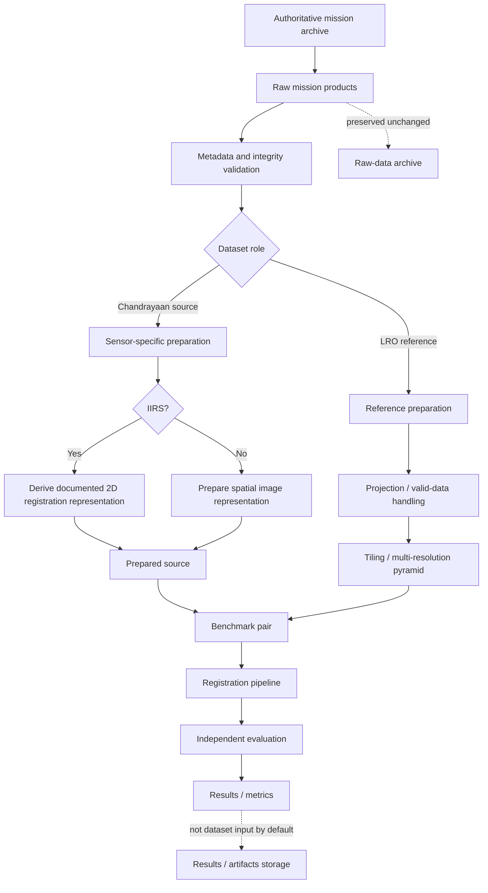
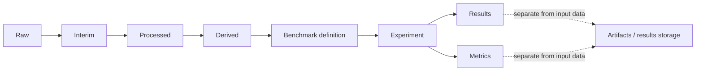

# ChandraMap Datasets

ChandraMap treats lunar datasets as **scientific, traceable inputs**, not as arbitrary collections of image files. Reliable correspondence and registration depend on understanding what each product measures, how it was acquired, what physical ground scale it represents, which coordinate system it uses, and how every processed or derived artifact relates back to the original mission product.

The project works with data from multiple lunar instruments and missions whose spatial resolutions, spectral characteristics, illumination conditions, viewing geometry, and processing states can differ substantially. Those differences must be preserved in the dataset layer rather than hidden by generic image preprocessing.

> **Core dataset principle:** every benchmark result should be traceable from the experiment output back to the exact source and reference mission products that produced it.

This document is the top-level dataset index and governance guide for ChandraMap. Sensor-specific physics and processing details belong under [`../sensors/`](../sensors/).

## Quick Navigation

- [Dataset Overview](#1-dataset-overview)
- [Source vs Reference Data](#2-source-data-vs-reference-data)
- [Dataset Lifecycle](#7-raw-interim-processed-and-derived-data)
- [Recommended Directory Model](#8-recommended-dataset-directory-model)
- [Git and Large Data Policy](#9-do-not-commit-large-mission-data-to-git)
- [Dataset Manifests](#11-dataset-manifests)
- [Metadata Requirements](#14-metadata-requirements)
- [Multi-Resolution Reference Data](#17-multi-resolution-reference-data)
- [Benchmark Pair Definition](#20-sourcereference-pair-definition)
- [Benchmark Design](#24-benchmark-dataset-design)
- [Train/Validation/Test Splits](#26-train--validation--test-splits)
- [Dataset Versioning](#34-dataset-versioning)
- [Licensing and Access](#36-data-licensing-and-usage-terms)
- [Adding New Datasets](#61-dataset-contribution-guidelines)
- [Dataset Reproducibility Checklist](#64-dataset-reproducibility-checklist)

---

## 1. Dataset Overview

The current ChandraMap data landscape includes Chandrayaan-2 source sensors, LRO reference imagery, optional cross-mission datasets, and synthetic or derived research products.

| Dataset                        | Mission                      | Agency                | Modality                         |                        Approx. Scale | Typical ChandraMap Role                 | Architectural Status      |
| ------------------------------ | ---------------------------- | --------------------- | -------------------------------- | -----------------------------------: | --------------------------------------- | ------------------------- |
| OHRC                           | Chandrayaan-2                | ISRO                  | Visible / panchromatic           |   ~0.25–0.32 m/px, product-dependent | Fine source correspondence              | Core source               |
| TMC-2                          | Chandrayaan-2                | ISRO                  | Panchromatic terrain imagery     |                              ~5 m/px | Structural terrain matching             | Core source               |
| IIRS                           | Chandrayaan-2                | ISRO                  | Hyperspectral / imaging IR       |                             ~80 m/px | Cross-modality source                   | Core research source      |
| LRO NAC                        | Lunar Reconnaissance Orbiter | NASA                  | High-resolution lunar imagery    | Often ~0.5–2 m/px, product-dependent | Fine/local reference                    | Core reference            |
| LRO WAC                        | Lunar Reconnaissance Orbiter | NASA                  | Wide-angle lunar imagery         |               Product/mode dependent | Broad/global reference                  | Core contextual reference |
| Kaguya / SELENE Terrain Camera | SELENE / Kaguya              | JAXA                  | Lunar terrain imagery            |                    Product-dependent | Independent validation / generalization | Optional / future         |
| Synthetic lunar data           | Derived                      | ChandraMap experiment | Artificially transformed imagery |                              Derived | Stress testing / augmentation           | Experimental              |

These values are documentation-level approximations.

> **Actual product metadata takes precedence over generic sensor values.**

---

## 2. Source Data vs Reference Data

ChandraMap separates the **experiment role** of an image from the physical identity of its instrument.

### Source Data

The source is the product ChandraMap is attempting to locate, correspond, or register.

Typical examples include:

- Chandrayaan-2 OHRC;
- Chandrayaan-2 TMC-2;
- Chandrayaan-2 IIRS.

The source defines important properties such as:

- source-image coordinate system;
- source-pixel registration error;
- sensor-specific preprocessing;
- source GSD;
- source modality.

### Reference Data

The reference is the lunar product, tile, mosaic, or database against which the source is compared.

Typical examples include:

- LRO NAC;
- LRO WAC.

A reference may provide:

- candidate geographic region;
- local registration target;
- map projection;
- reference geometry;
- high-resolution terrain context.

These are **experiment roles**, not immutable scientific categories.

A controlled research experiment may reverse them if there is a legitimate reason to do so.

---

## 3. Primary Chandrayaan-2 Data

### 3.1 OHRC

**Orbiter High Resolution Camera (OHRC)** provides very-high-resolution visible/panchromatic lunar imagery.

Approximate project scale:

> **~0.25–0.32 m/pixel, product/documentation-dependent**

Typical dataset roles include:

- fine correspondence experiments;
- high-resolution source images;
- sub-pixel refinement studies;
- illumination-stress benchmarks.

OHRC data should preserve:

- original product identity;
- product-specific GSD;
- map/projection metadata;
- illumination metadata;
- acquisition geometry.

See [`../sensors/ohrc.md`](../sensors/ohrc.md).

---

### 3.2 TMC-2

**Terrain Mapping Camera-2 (TMC-2)** provides panchromatic lunar terrain imagery.

Approximate project scale:

> **~5 m/pixel**

Typical dataset roles include:

- structural terrain matching;
- medium-scale correspondence;
- scale-stress experiments;
- terrain/geometry evaluation.

TMC-2 is especially useful as an intermediate physical scale between OHRC and IIRS.

See [`../sensors/tmc2.md`](../sensors/tmc2.md).

---

### 3.3 IIRS

**Imaging Infrared Spectrometer (IIRS)** provides hyperspectral / imaging infrared data rather than a conventional single-channel camera image.

Approximate project values:

- spatial scale: **~80 m/pixel**;
- spectral range: **~0.8–5.0 µm**;
- spectral channels: **roughly 250–256**, depending on product/documentation.

IIRS may conceptually contain:

```text
X × Y × spectral_bands
```

instead of:

```text
X × Y
```

Typical dataset roles include:

- cross-modality experiments;
- hyperspectral-to-spatial representation research;
- coarse structural matching;
- modality-stress evaluation.

The original IIRS product must remain separate from derived 2D registration representations.

See [`../sensors/iirs.md`](../sensors/iirs.md).

---

## 4. LRO Reference Data

### 4.1 LRO NAC

The **Lunar Reconnaissance Orbiter Camera Narrow Angle Camera (LRO NAC)** provides high-detail lunar reference imagery.

Current ChandraMap planning commonly treats NAC imagery as approximately:

> **~0.5–2 m/pixel, depending on product and acquisition geometry**

Typical roles include:

- fine local reference imagery;
- known-overlap benchmarks;
- reference tiling;
- candidate-region confirmation;
- scale-pyramid generation;
- local registration targets.

NAC should not be assigned one universal GSD.

See [`../sensors/lro-nac.md`](../sensors/lro-nac.md).

---

### 4.2 LRO WAC

The **Lunar Reconnaissance Orbiter Camera Wide Angle Camera (LRO WAC)** provides broader lunar context.

Typical ChandraMap roles include:

- global or regional context;
- coarse localization;
- candidate-region retrieval;
- broad reference mosaics;
- illumination/context experiments;
- WAC-to-NAC coarse-to-fine search.

No single universal WAC GSD is defined in ChandraMap documentation.

Use the actual WAC product or mosaic metadata.

See [`../sensors/lro-wac.md`](../sensors/lro-wac.md).

### NAC vs WAC

| Reference | Primary Role                  |
| --------- | ----------------------------- |
| LRO NAC   | Fine/local reference          |
| LRO WAC   | Broad/coarse/global reference |

WAC is not simply a lower-quality NAC. They support different stages of the reference architecture.

---

## 5. Optional and Future Data Sources

### Kaguya / SELENE Terrain Camera

Kaguya / SELENE imagery may support future:

- cross-mission validation;
- independent reference experiments;
- generalization testing;
- additional scale-stress benchmarks.

It should remain optional unless a version specification explicitly makes it required.

### Additional Lunar Missions

Future datasets may be considered when they provide:

- reliable mission provenance;
- suitable imagery;
- usable spatial metadata;
- projection/geolocation information;
- documented access conditions;
- a clear research purpose.

A dataset should not be added merely because it exists.

---

## 6. Synthetic and Derived Data

Synthetic and derived data are different concepts.

### Synthetic / Augmented Data

Synthetic data is produced by controlled transformations such as:

- rotation;
- scale change;
- brightness change;
- contrast change;
- noise;
- blur;
- cropping;
- controlled occlusion;
- limited illumination approximations.

Synthetic data can support:

- training augmentation;
- stress tests;
- controlled ablations.

It does not replace validation on real lunar imagery.

### Derived Data

Derived data originates from real mission products but has been transformed for ChandraMap.

Examples include:

- crops;
- geographic tiles;
- image pyramids;
- projected images;
- PCA components;
- IIRS registration representations;
- gradient images;
- edge maps;
- global descriptors;
- local descriptors;
- cached retrieval assets.

Every derived artifact should remain traceable to its parent product.

---

## 7. Raw, Interim, Processed, and Derived Data

ChandraMap should maintain a clear data lifecycle.

### Raw

Original downloaded mission products.

Raw data should be:

- immutable;
- unmodified;
- preserved with original metadata;
- traceable to the authoritative archive.

### Interim

Temporary or intermediate products generated while preparing raw data.

Examples:

- temporary conversions;
- calibration intermediates;
- reprojection intermediates;
- unpacked working files.

### Processed

Products intentionally prepared for ChandraMap algorithms.

Examples:

- calibrated imagery;
- map-projected imagery;
- valid-data masked imagery;
- normalized working images.

### Derived

Algorithm-oriented representations generated from processed or raw products.

Examples:

- tiles;
- pyramid levels;
- descriptors;
- IIRS PCA images;
- structural images.

### Benchmark

Frozen product selections and pair definitions used for controlled evaluation.

### Results

Registration outputs and metrics belong outside the input dataset hierarchy.

> **Results should never silently become new dataset inputs unless they are explicitly promoted through a documented data-generation process.**

---

## 8. Recommended Dataset Directory Model

The following is a recommended conceptual structure.

If another repository document defines a canonical data layout, that definition takes precedence.

```text
data/
├── raw/
│   ├── chandrayaan2/
│   │   ├── ohrc/
│   │   ├── tmc2/
│   │   └── iirs/
│   │
│   ├── lro/
│   │   ├── nac/
│   │   └── wac/
│   │
│   └── kaguya/
│
├── interim/
│
├── processed/
│   ├── ohrc/
│   ├── tmc2/
│   ├── iirs/
│   ├── lro_nac/
│   └── lro_wac/
│
├── derived/
│   ├── tiles/
│   ├── pyramids/
│   ├── descriptors/
│   └── representations/
│
├── benchmarks/
│   ├── pairs/
│   ├── splits/
│   └── ground_truth/
│
└── manifests/
```

Experiment outputs should remain outside this hierarchy, for example under a dedicated results or artifacts area.

---

## 9. Do Not Commit Large Mission Data to Git

Large mission datasets should **not** normally be stored directly in ordinary Git history.

Reasons include:

- repository size;
- permanently growing Git history;
- slow clones;
- archive update difficulty;
- redistribution/licensing uncertainty;
- inability to manage large binary revisions efficiently.

The repository should normally track:

- download instructions;
- product identifiers;
- manifests;
- checksums;
- configuration;
- metadata schemas;
- tiny fixtures;
- small legal example crops;
- benchmark definitions.

Large mission products should normally remain in external data storage.

### Git LFS

Git LFS may be appropriate for a small number of controlled binary assets.

It should not automatically be used to place large mission archives or extensive hyperspectral datasets inside the repository.

---

## 10. What May Be Committed

| Item                              | Typical Git Policy             |
| --------------------------------- | ------------------------------ |
| Dataset README files              | Track                          |
| Dataset manifests                 | Track                          |
| Metadata schemas                  | Track                          |
| Download scripts                  | Track                          |
| Dataset configuration             | Track                          |
| Checksums                         | Track                          |
| Product IDs / archive identifiers | Track                          |
| Benchmark pair definitions        | Track                          |
| Split definitions                 | Track                          |
| Tiny test fixtures                | Track when permitted           |
| Tiny example crops                | Track when legally appropriate |
| Transformation recipes            | Track                          |
| Large raw imagery                 | Exclude                        |
| Full hyperspectral cubes          | Exclude                        |
| Generated pyramid archives        | Usually exclude                |
| Descriptor caches                 | Usually exclude                |
| Temporary intermediates           | Exclude                        |
| Local download archives           | Exclude                        |

`.gitignore` should enforce the repository's actual data policy.

---

## 11. Dataset Manifests

Machine-readable manifests are strongly recommended for reproducible dataset management.

A manifest may contain fields such as:

```text
dataset_id
mission
instrument
product_id
source_archive
source_identifier
local_path
checksum
file_size
acquisition_time
gsd
width
height
bands
product_type
processing_level
projection
crs
geographic_bounds
illumination_metadata
viewing_metadata
access_note
```

The exact schema should remain consistent with repository contracts.

Suitable formats may include:

- YAML;
- JSON;
- CSV;
- Parquet;

depending on dataset size and use.

Avoid over-engineering small datasets with complex storage systems when a simple manifest is sufficient.

---

## 12. Product Identity and Provenance

Every locally stored file should remain traceable to an authoritative original.

For example:

```text
Original NAC product
        ↓
Map-projected derivative
        ↓
Geographic tile
        ↓
Pyramid level
        ↓
Global descriptor
```

At each stage, ChandraMap should be able to answer:

- Which original product produced this file?
- Which transformation produced it?
- Which configuration was used?
- Which software version generated it?
- Which benchmark consumed it?

Important provenance fields include:

- original product ID;
- source archive;
- acquisition identifier;
- checksum;
- processing history;
- parent-derived relationship.

---

## 13. Checksums and Integrity

Checksums help ensure dataset inputs remain stable.

Uses include:

- detecting incomplete downloads;
- detecting corruption;
- confirming two machines use the same file;
- detecting benchmark-input changes;
- validating cached assets.

A modern cryptographic checksum such as **SHA-256** may be used where appropriate.

If another repository standard specifies a different integrity mechanism, follow that standard.

---

## 14. Metadata Requirements

The following metadata should be preserved when available.

| Metadata                     | Why It Matters                     |
| ---------------------------- | ---------------------------------- |
| Mission                      | Provenance                         |
| Instrument                   | Sensor routing                     |
| Product ID                   | Reproducibility                    |
| Product type                 | Processing path                    |
| Processing level/state       | Calibration assumptions            |
| Width / height               | Image handling                     |
| GSD / pixel scale            | Scale-aware matching               |
| Number of bands              | Hyperspectral handling             |
| Wavelength metadata          | IIRS representation                |
| Ground footprint             | Geographic search restriction      |
| Latitude / longitude         | Localization                       |
| Map projection               | Coordinate interpretation          |
| Lunar CRS / reference system | Geospatial correctness             |
| Acquisition time             | Provenance                         |
| Sun geometry                 | Illumination analysis              |
| Incidence angle              | Lighting interpretation            |
| Emission angle               | Viewing geometry                   |
| Phase angle                  | Observation geometry               |
| NoData values                | Valid-pixel masking                |
| Quality flags                | Product validation where available |

Not every product contains all fields.

Missing metadata should be represented explicitly rather than invented.

---

## 15. Sensor-Specific Dataset Handling

### OHRC

Preserve:

- fine spatial detail;
- actual GSD;
- original product identity;
- projection;
- illumination metadata;
- acquisition geometry.

Avoid unnecessary resampling of the original product.

### TMC-2

Preserve:

- terrain morphology;
- map/projection information;
- acquisition geometry;
- product-specific GSD;
- DEM/stereo relationships where such products legitimately exist.

### IIRS

Preserve:

- original hyperspectral product;
- spectral metadata;
- band identity;
- wavelength information;
- valid/invalid-band information;
- derived-representation provenance.

Never replace the original IIRS source with a single derived image.

### LRO NAC

Preserve:

- product provenance;
- projection;
- reference GSD;
- tile lineage;
- pyramid level;
- acquisition metadata.

### LRO WAC

Preserve:

- product or mosaic provenance;
- geographic extent;
- projection;
- scale;
- source lineage;
- tiling/index information.

---

## 16. IIRS Dataset Handling

IIRS requires explicit separation between scientific source data and matcher-ready data.

Conceptually:

```text
Original IIRS hyperspectral product
            |
            +-------------------+
            |                   |
            v                   v
    Scientific source      Derived registration
       preserved             representation
```

Possible derived registration products include:

- one selected spectral band;
- PCA component;
- spectral composite;
- gradient representation;
- edge/structural image.

Every derived representation should record:

- parent product ID;
- selected bands;
- wavelength information where available;
- transformation method;
- transformation parameters;
- software/configuration version;
- output version.

Do not overwrite or discard the original cube.

---

## 17. Multi-Resolution Reference Data

LRO references often need to be represented at multiple effective scales.

Conceptually:

```text
High-resolution reference
        ↓
Level 0
        ↓
Level 1
        ↓
Level 2
        ↓
Level 3
```

A source image should initially be compared against a reference level containing physically comparable terrain information.

For example:

- OHRC may use a relatively fine NAC level;
- TMC-2 may need a reduced NAC level;
- IIRS may require strong reference downsampling.

> **Compare physical information, not pixel count.**

Upsampling a coarse source does not recover missing terrain detail.

---

## 18. Reference Tiling

NAC, WAC, mosaics, or other large reference products may be divided into tiles.

Benefits include:

- memory efficiency;
- faster retrieval;
- parallel processing;
- geographic indexing;
- manageable local matching;
- scalable reference databases.

Each tile should remain traceable to:

- parent product;
- pixel bounds;
- geographic bounds;
- effective GSD;
- pyramid level;
- projection;
- preprocessing configuration.

Tile size should remain configurable.

---

## 19. Tile Overlap

Features near a tile edge may become fragmented.

Conceptually:

```text
Tile A | Tile B
       ^
       terrain feature crosses boundary
```

Overlapping tiles can reduce this problem.

Overlap should be treated as a configurable and benchmarkable parameter.

Do not define an arbitrary universal percentage in dataset governance documentation.

---

## 20. Source/Reference Pair Definition

A reproducible benchmark pair should conceptually record:

- unique pair ID;
- source product;
- reference product or tile;
- source sensor;
- reference sensor;
- known overlap or truth region;
- source GSD;
- reference GSD;
- source projection;
- reference projection;
- representation type where derived data is used;
- ground-truth/check-point information;
- stress-test category;
- benchmark split;
- benchmark version.

For example:

```text
pair
├── source product
├── reference product/tile
├── overlap definition
├── sensor metadata
├── scale metadata
├── check points
├── stress category
└── split
```

The pair must be reproducible from its recorded identifiers.

---

## 21. Known-Overlap Pairs

Known-overlap pairs are especially important during early ChandraMap development.

They allow the project to test:

- sensor preprocessing;
- local correspondence;
- geometric verification;
- transform estimation;
- sub-pixel refinement;
- registration metrics;

without simultaneously solving global lunar retrieval.

This separation is important for V1.

A failure in local registration should not be hidden by a retrieval problem, and vice versa.

---

## 22. Unknown-Location Retrieval Dataset

Global retrieval requires a different dataset structure.

### Reference Side

May contain:

- many geographic reference tiles;
- multiple scales;
- global descriptors;
- geographic labels;
- reference metadata;
- product lineage.

### Query Side

May contain:

- source products;
- source representations;
- correct reference-region IDs;
- acceptable reference candidates where multiple tiles overlap.

### Retrieval Metrics

Use metrics such as:

- Recall@1;
- Recall@5;
- Recall@K.

These should remain separate from registration RMSE.

---

## 23. Retrieval vs Registration Dataset Tasks

| Task           | Input                                       | Output                        | Main Metrics                       |
| -------------- | ------------------------------------------- | ----------------------------- | ---------------------------------- |
| Retrieval      | Source query + reference database           | Top-K candidate regions       | Recall@K                           |
| Local matching | Known/candidate source-reference pair       | Candidate tie points          | Match count, inliers, inlier ratio |
| Registration   | Verified correspondences                    | Transform / registered result | Check-point RMSE, coverage         |
| Geolocation    | Registered image + valid reference metadata | Lunar coordinates             | Ground error where valid           |

One dataset can support several tasks, but labels and metrics must remain task-specific.

---

## 24. Benchmark Dataset Design

A robust benchmark should contain controlled cases representing different failure conditions.

Useful categories include:

- easy known-overlap pair;
- Sun-angle stress pair;
- scale-stress pair;
- modality-stress pair;
- geometry-stress pair;
- low-feature pair;
- repetitive-crater pair.

Each case should record:

- pair ID;
- source/reference sensors;
- product identifiers;
- stress category;
- source/reference metadata;
- truth/check-point source;
- benchmark split;
- benchmark version.

Benchmark datasets should contain failures as well as successes.

A benchmark containing only visually convenient pairs cannot characterize system robustness.

---

## 25. Sensor-Pair Benchmark Categories

| Sensor Pair     | Main Dataset Challenge                                   | Required Preparation                              | Appropriate Registration Goal           |
| --------------- | -------------------------------------------------------- | ------------------------------------------------- | --------------------------------------- |
| OHRC ↔ LRO NAC  | Illumination, fine-scale geometry, product-dependent GSD | Comparable fine scale, metadata-aware preparation | Fine/local registration where supported |
| OHRC ↔ LRO WAC  | Very large detail gap                                    | Coarse OHRC representation, suitable WAC scale    | Coarse localization/context first       |
| TMC-2 ↔ LRO NAC | Moderate-to-large GSD difference                         | NAC pyramid selection                             | Structural/local registration           |
| TMC-2 ↔ LRO WAC | Product-dependent scale and context                      | Scale-aware WAC selection                         | Coarse/structural registration          |
| IIRS ↔ LRO NAC  | Extreme GSD + modality gap                               | IIRS 2D representation + strongly reduced NAC     | Coarse structural correspondence        |
| IIRS ↔ LRO WAC  | Modality + product-dependent scale                       | IIRS representation + compatible WAC scale        | Coarse/global correspondence            |

The table describes experiment design, not guaranteed performance.

---

## 26. Train / Validation / Test Splits

If machine learning or learned retrieval is introduced, dataset splits must prevent unrealistic leakage.

Randomly splitting neighboring crops from the same lunar terrain into train and test sets can produce misleadingly strong results.

Depending on the research question, consider:

- region-level splits;
- product-level splits;
- geographic splits;
- acquisition-level splits;
- mission-level generalization splits.

The exact split strategy belongs in benchmark-specific documentation.

---

## 27. Lunar Geographic Leakage

Lunar imagery has strong spatial continuity.

Two neighboring tiles may contain nearly the same crater structures.

If one enters training and another enters testing, the model may appear to generalize while effectively memorizing local terrain.

Track at minimum where possible:

- lunar region;
- parent product;
- geographic footprint;
- tile lineage;
- overlapping area.

A test set should represent genuinely unseen geography when that is what the experiment claims to measure.

---

## 28. Pair Leakage

Derived versions of the same source/reference pair can also leak across splits.

Examples include:

- another crop from the same image;
- another scale of the same tile;
- augmented copy of a training sample;
- adjacent overlapping tile;
- same reference region with minor preprocessing changes.

Split generation should operate with lineage information rather than treating every file as independent.

---

## 29. Synthetic Augmentation

Potential augmentations include:

- rotation;
- scale changes;
- brightness changes;
- contrast changes;
- noise;
- blur;
- cropping;
- controlled occlusion.

Synthetic transformations can help test specific algorithm properties.

### Illumination Caution

Simple brightness or contrast modification is not a physically complete model of lunar Sun-angle changes.

Real illumination differences can cause:

- shadow movement;
- changed shadow length;
- terrain becoming hidden or visible;
- different illuminated slopes.

Synthetic illumination data should therefore be labeled as approximate augmentation rather than equivalent to real multi-illumination observations.

---

## 30. Real vs Synthetic Evaluation

Synthetic data may support:

- training;
- ablation studies;
- controlled robustness tests;
- debugging.

Final scientific claims about lunar correspondence should rely on real mission data wherever practical.

Do not report synthetic-only results as proof of real cross-mission or cross-modality robustness.

---

## 31. Data Preprocessing vs Dataset Creation

Dataset construction and algorithm preprocessing should remain conceptually separate.

### Dataset Creation Defines

- source product;
- reference product;
- crop;
- tile;
- representation;
- benchmark pair;
- benchmark split;
- truth/check points.

### Algorithm Preprocessing Defines

- normalization;
- local matcher input conversion;
- runtime filtering;
- temporary representation transforms.

Experiment-specific preprocessing should not permanently modify the raw dataset.

---

## 32. Immutable Raw Data Principle

Raw mission products should be treated as immutable.

Do not:

- overwrite original imagery;
- remove original metadata;
- normalize in place;
- reproject over the source file;
- replace original IIRS cubes;
- modify archive files directly.

Use:

```text
raw source
    ↓
new processed / derived artifact
```

This ensures that an experiment can always be rebuilt from the original scientific input.

---

## 33. Derived Data Lineage

Every derived artifact should contain or reference enough information to reconstruct it.

### Example: NAC Tile

```text
derived tile
→ parent NAC product
→ pixel bounds
→ geographic bounds
→ pyramid level
→ resampling method
→ processing version
```

### Example: IIRS PCA Image

```text
derived PCA image
→ parent IIRS cube
→ selected/valid bands
→ normalization
→ PCA configuration
→ component index
→ processing version
```

Lineage should be machine-readable where practical.

---

## 34. Dataset Versioning

Dataset definitions can evolve independently of source code.

Possible changes include:

- additional products;
- corrected metadata;
- new reference mosaics;
- changed tile layout;
- new truth points;
- improved pair definitions;
- modified train/test splits.

Dataset releases should therefore use explicit version identifiers.

Git history alone is not sufficient as a version-management strategy for large external binary datasets.

---

## 35. Benchmark Versioning

Code version and benchmark version are different concepts.

A frozen benchmark version may define:

- source/reference pair list;
- product IDs;
- check points;
- ground truth;
- split definitions;
- reference-product version;
- tile configuration;
- pyramid configuration;
- evaluation protocol.

For example:

```text
Code version:
V2 algorithm

Benchmark version:
Benchmark B1
```

Keeping the benchmark fixed allows fair algorithm comparison across ChandraMap versions.

---

## 36. Data Licensing and Usage Terms

Mission data may have provider-specific requirements related to:

- access;
- attribution;
- scientific citation;
- redistribution;
- archive usage.

ChandraMap should not invent legal rights or assume every product can be redistributed freely.

Contributors should consult the authoritative provider.

Relevant providers include:

- ISRO;
- ISSDC;
- PRADAN;
- NASA;
- Planetary Data System;
- LROC / Arizona State University;
- JAXA.

When redistribution conditions are unclear, prefer storing:

- product identifiers;
- manifests;
- retrieval scripts;
- citation information;

rather than republishing the data.

---

## 37. Dataset Citations

Scientific data should be cited according to provider guidance where applicable.

A dataset record should preserve enough information to identify:

- mission;
- instrument;
- archive;
- product;
- product ID;
- authoritative documentation.

If an official provider supplies a DOI or required citation format, use that official guidance.

Do not fabricate DOIs or citation text.

---

## 38. Data Download Sources

Use authoritative data providers wherever possible.

### Chandrayaan-2

Relevant source organizations include:

- ISRO;
- ISSDC;
- PRADAN.

### Lunar Reconnaissance Orbiter

Relevant source organizations include:

- NASA Planetary Data System;
- LROC / Arizona State University.

### Kaguya / SELENE

Relevant source organization:

- JAXA and official mission archives.

Exact download URLs should be maintained only when verified and stable.

Do not invent archive paths.

---

## 39. Download Automation

Dataset download tooling should be reproducible and non-destructive.

A download script should ideally:

- accept product IDs or manifest entries;
- obtain data from authoritative sources;
- skip already validated downloads;
- verify checksums where possible;
- preserve original filenames/product IDs;
- record provenance;
- fail clearly when retrieval fails;
- avoid silently changing benchmark content.

Download scripts must not contain hard-coded credentials.

---

## 40. Data Access Configuration

Data paths should not depend on one developer's filesystem.

Avoid:

```text
C:\Users\someone\Desktop\moon-data\
```

or:

```text
/home/someone/private/chandramap-data/
```

Prefer configurable data roots supplied through:

- environment variables;
- CLI arguments;
- YAML configuration;
- project configuration.

A name such as `CHANDRAMAP_DATA_ROOT` can illustrate the idea, but the repository's actual configuration contract should define the final key.

---

## 41. Local vs External Storage

Large datasets may live in:

- local storage;
- external SSDs;
- research servers;
- shared filesystems;
- object storage.

Code should discover those datasets through configuration and manifests.

The repository should not depend on absolute machine-specific paths.

---

## 42. Cache Data

Some generated assets are best treated as cache.

Examples include:

- global descriptors;
- local descriptors;
- temporary image pyramids;
- temporary tile exports;
- matcher caches;
- retrieval indexes that can be rebuilt.

A cache should normally be regenerable from:

```text
source products
+
configuration
+
software version
```

Caches are not primary scientific truth.

---

## 43. Data Security and Secrets

Public lunar mission data does not normally create personal-data concerns, but infrastructure credentials still require protection.

Never commit:

- API keys;
- passwords;
- cloud credentials;
- access tokens;
- signed private URLs;
- secret configuration.

Use appropriate `.env` or secret-management mechanisms when external services require authentication.

Dataset manifests should not contain secrets.

---

## 44. Dataset Quality Checks

Quality checks should be sensor-aware.

Potential checks include:

- file can be opened;
- checksum matches;
- mission identity is correct;
- instrument identity is correct;
- product ID is recorded;
- dimensions are valid;
- data type is supported;
- expected metadata exists;
- GSD is valid where required;
- projection is interpretable;
- geographic footprint is valid;
- NoData handling is correct;
- spectral dimensions are understood;
- IIRS band count is read correctly;
- wavelength metadata is available where required;
- benchmark pair overlap is real.

Not every check applies to every product.

---

## 45. Pair Validation

Before a source/reference pair becomes part of a benchmark, verify:

- both products are readable;
- source instrument is correct;
- reference instrument is correct;
- source/reference roles are recorded;
- physical overlap exists;
- coordinate/projection information is interpretable where required;
- GSD values are known when needed;
- benchmark pair ID is unique;
- truth/check points are stored separately from fit points;
- provenance is complete.

A visually similar pair should not be assumed to overlap without evidence.

---

## 46. Independent Check Points

Dataset annotations should distinguish between:

### Control / Fit / Tie Points

Used to estimate the transformation.

### Check Points

Used to evaluate the fitted transformation independently.

Conceptually:

```text
fit points
    ↓
estimate transform

check points
    ↓
evaluate transform
```

The same coordinates should not serve both purposes when reporting independent registration RMSE.

---

## 47. Ground Truth

The phrase **ground truth** should be used carefully.

Possible sources include:

- official challenge truth;
- authoritative map/control coordinates;
- independently expert-verified correspondences;
- manually validated held-out check points.

Matcher-generated inliers are **not** ground truth.

Likewise, a reference image is not automatically independent ground truth.

Ground-truth provenance should always be recorded.

---

## 48. Annotation Format

A correspondence/check-point annotation may conceptually include:

```text
pair_id
source_product_id
reference_product_id
source_x
source_y
reference_x
reference_y
latitude
longitude
verification_status
annotation_source
notes
```

Exact field definitions should follow repository contracts if they exist.

Annotations should specify whether a point is:

- fitting/control;
- independent check point;
- manually validated;
- automatically proposed;
- externally supplied truth.

---

## 49. Coordinate Conventions

Coordinate conventions must be explicit.

Possible ambiguities include:

- `(x, y)` vs `(row, column)`;
- zero-based vs one-based indexing;
- pixel corner vs pixel center;
- longitude range;
- latitude convention;
- projected vs image coordinates.

Benchmark documentation should define conventions before annotations are created.

For example:

```text
x = image column
y = image row
```

should be stated rather than assumed if that convention is adopted.

---

## 50. Lunar Coordinate Systems

Lunar products may use different planetary coordinate conventions and projections.

Dataset metadata should preserve:

- map projection;
- lunar reference system;
- longitude convention where relevant;
- coordinate units;
- product-specific cartographic information.

ChandraMap should defer to:

- product metadata;
- mission documentation;
- authoritative planetary cartographic guidance.

Unsupported geodetic assumptions should not be invented.

---

## 51. Data Normalization Should Be Reproducible

If a normalized representation is persisted, record:

- parent product;
- normalization method;
- parameters;
- output data type;
- software/version;
- representation version.

Avoid undocumented files such as:

```text
final_processed.png
new_final2.tif
fixed_image.tif
```

without provenance.

An experiment should be reproducible without relying on filenames that encode no scientific meaning.

---

## 52. File Naming Conventions

File names should remain stable and readable.

Useful components may include:

- mission;
- instrument;
- product ID;
- tile ID;
- representation type;
- pyramid level.

For example, conceptually:

```text
<mission>_<instrument>_<product-id>_<tile-id>_<representation>
```

Do not attempt to store every metadata field in a filename.

Full metadata belongs in manifests.

Avoid ambiguous names such as:

```text
final.png
test123.tif
output_new.tif
best.tif
```

---

## 53. Dataset IDs

Stable internal IDs make it easier to connect:

- manifests;
- benchmark pairs;
- result files;
- logs;
- experiment tracking;
- annotations.

Useful entity types may include:

- dataset ID;
- product ID;
- tile ID;
- pair ID;
- benchmark-case ID;
- benchmark-version ID.

The exact ID syntax should follow repository conventions rather than being invented independently in each module.

---

## 54. Recommended Dataset Documentation Files

A future or expanded dataset documentation structure may look like:

```text
docs/datasets/
├── README.md
├── chandrayaan2.md
├── lro.md
├── benchmark-pairs.md
├── data-access.md
├── manifests.md
└── licensing.md
```

This structure is **recommended/planned unless those files are confirmed to exist**.

The top-level `README.md` should remain an index and governance document rather than duplicate every specialized page.

---

## 55. Relationship to Sensor Documentation

Sensor documentation answers:

> **What is this instrument, what does it measure, and how should ChandraMap interpret its data?**

Dataset documentation answers:

> **Which actual products are used, how are they stored, versioned, paired, accessed, and benchmarked?**

Relevant sensor documents include:

- [`../sensors/overview.md`](../sensors/overview.md)
- [`../sensors/ohrc.md`](../sensors/ohrc.md)
- [`../sensors/tmc2.md`](../sensors/tmc2.md)
- [`../sensors/iirs.md`](../sensors/iirs.md)
- [`../sensors/lro-nac.md`](../sensors/lro-nac.md)
- [`../sensors/lro-wac.md`](../sensors/lro-wac.md)

The sensor layer explains physics.

The dataset layer explains data governance and reproducibility.

---

## 56. Relationship to Architecture Documentation

Dataset design should remain consistent with system input/output contracts.

Related architecture documentation includes:

- [`../architecture/system-overview.md`](../architecture/system-overview.md)
- [`../architecture/v1-pipeline.md`](../architecture/v1-pipeline.md)
- [`../architecture/core-engine-architecture.md`](../architecture/core-engine-architecture.md)
- [`../architecture/backend-architecture.md`](../architecture/backend-architecture.md)
- [`../architecture/module-map.md`](../architecture/module-map.md)
- [`../architecture/data-flow.md`](../architecture/data-flow.md)
- [`../architecture/output-flow.md`](../architecture/output-flow.md)

Dataset documentation should define **what data means**.

Architecture documentation should define **how the system moves and processes it**.

---

## 57. Relationship to Project Documentation

Relevant project documents include:

- [`../project/goals.md`](../project/goals.md)
- [`../project/non-goals.md`](../project/non-goals.md)
- [`../project/v1-scope.md`](../project/v1-scope.md)
- [`../project/terminology.md`](../project/terminology.md)
- [`../project/assumptions.md`](../project/assumptions.md)
- [`../project/limitations.md`](../project/limitations.md)

In particular:

> **The dataset README must not silently expand V1 beyond the scope defined by `v1-scope.md`.**

---

## 58. Dataset Role Across ChandraMap Versions

The following is a conceptual progression. Existing version specifications remain authoritative.

### V1 — Minimal Controlled Dataset

Primary focus:

- small known-overlap set;
- OHRC and/or TMC-2 where appropriate;
- LRO NAC reference;
- measurable baseline;
- independent check points;
- reproducible pair definitions.

V1 should not require a whole-Moon reference database.

### V2 — Sensor / Scale Stress Dataset

Possible additions:

- more illumination variation;
- multi-resolution reference levels;
- broader TMC-2 coverage;
- IIRS representation experiments;
- controlled failure cases.

### V3 — Retrieval Dataset

Possible additions:

- larger reference-tile database;
- WAC/global context;
- NAC tile index;
- query/reference labels;
- Top-K retrieval;
- Recall@K evaluation.

### V4 — Research-Grade Dataset

Possible additions:

- larger cross-mission benchmark;
- Kaguya / SELENE;
- difficult multimodal pairs;
- DEM/geometry-aware cases;
- larger geographic split strategy;
- lunar-specific learned-model datasets.

These are possible roles, not implementation-status claims.

---

## 59. Start Small Before Building a Global Dataset

Recommended development order:

1. one known-overlap pair;
2. several controlled pairs;
3. sensor-specific stress cases;
4. small reference-tile database;
5. regional/global retrieval experiments;
6. larger research benchmark.

A large lunar archive does not automatically produce a useful benchmark.

A small dataset with:

- known product identity;
- verified overlap;
- independent check points;
- clear metadata;
- frozen evaluation;

is scientifically more useful than a huge uncontrolled image collection.

---

## 60. Dataset Growth Criteria

A new dataset should answer a specific research question.

Good reasons include:

- introducing a new sensor modality;
- testing a new physical scale gap;
- adding difficult illumination conditions;
- validating on another mission;
- providing independent reference truth;
- testing generalization.

Avoid collecting datasets without a benchmark purpose.

Every addition increases:

- storage requirements;
- metadata burden;
- validation cost;
- benchmark complexity;
- reproducibility responsibilities.

---

## 61. Dataset Contribution Guidelines

A contributor adding dataset support should document:

- mission;
- instrument;
- authoritative source;
- product identifiers;
- product/data format;
- metadata availability;
- access conditions;
- licensing/citation guidance;
- processing requirements;
- intended ChandraMap role;
- benchmark relevance;
- known limitations.

Where practical, contributions should also include:

- manifest example;
- validation test;
- small test fixture;
- known-overlap pair definition.

Large raw mission files should not normally be included directly in a pull request.

---

## 62. Adding a New Sensor Dataset

A high-level process is:

1. verify the authoritative data source;
2. document the instrument and product;
3. identify available metadata;
4. define raw storage;
5. define product provenance;
6. determine modality and physical scale;
7. define a registration representation if needed;
8. create a known-overlap pair;
9. validate the pair;
10. add a benchmark case;
11. document limitations.

For unusual modalities, the representation step must be explicit.

IIRS is the current example of why this matters.

---

## 63. Adding a New Reference Dataset

Reference datasets require additional design considerations.

Document:

- geographic footprint;
- projection;
- CRS/reference system;
- scale;
- product provenance;
- tiling requirements;
- pyramid requirements;
- geographic indexing;
- candidate lookup;
- compatibility with evaluation truth.

A reference dataset does **not** automatically require FAISS or another vector index.

Metadata-constrained selection may be sufficient.

---

## 64. Dataset Reproducibility Checklist

| Requirement                                     | Expected |
| ----------------------------------------------- | -------- |
| Product IDs recorded                            | Yes      |
| Source archive recorded                         | Yes      |
| Checksums available where practical             | Yes      |
| Sensor metadata preserved                       | Yes      |
| Processing steps recorded                       | Yes      |
| Derived lineage recorded                        | Yes      |
| Pair definitions frozen for a benchmark version | Yes      |
| Split definitions frozen                        | Yes      |
| Check points / truth versioned                  | Yes      |
| Geographic leakage reviewed                     | Yes      |
| Pair leakage reviewed                           | Yes      |
| Benchmark version recorded                      | Yes      |
| Raw products left immutable                     | Yes      |
| Reference provenance recorded                   | Yes      |
| Derived representations reproducible            | Yes      |

---

## 65. Dataset Limitations

ChandraMap's dataset layer has several practical limitations.

### Mission Formats Can Be Complex

Planetary data products may require specialized tooling or metadata interpretation.

### Metadata Availability Varies

Not every product exposes the same metadata fields or processing level.

### Geospatial Preparation Can Be Non-Trivial

Projection and overlap calculations may require dedicated planetary tools.

### Sensor Scales Differ Dramatically

OHRC and IIRS should not be treated as though they contain the same physical information.

### IIRS Requires Special Representation

A hyperspectral cube cannot be treated as an ordinary grayscale dataset without a documented transformation.

### Illumination Differences Are Physical

Dataset preparation cannot make real shadow-geometry differences disappear.

### Cross-Mission Coverage May Be Uneven

Not every lunar region will have equally useful pairings.

### Independent Ground Truth May Be Limited

Manual or expert validation may be required.

### Global Reference Databases Can Be Large

Tiling, descriptors, and pyramids can require substantial storage.

### Derived Representations Can Introduce Bias

Representation choice can influence benchmark difficulty.

### Synthetic Data Is Not Real Validation

Synthetic transformations cannot fully reproduce cross-sensor lunar physics.

---

## 66. Common Dataset Mistakes to Avoid

Do not:

- commit huge mission archives into ordinary Git history;
- rename products without retaining original product IDs;
- discard original mission metadata;
- overwrite raw mission files;
- mix raw and processed data;
- hard-code generic GSD values when product metadata exists;
- treat IIRS as a normal grayscale dataset;
- overwrite IIRS cubes with derived 2D images;
- upsample coarse data and describe it as recovered high-resolution data;
- lose parent-product lineage during tiling;
- confuse reference imagery with ground truth;
- use matcher-generated inliers as ground truth;
- use identical points for fitting and independent evaluation;
- randomly split overlapping lunar tiles across training and testing;
- allow augmented duplicates into both training and test sets;
- mix benchmark versions silently;
- store credentials in download scripts or manifests;
- assume all reference products are already map-projected;
- report synthetic-only results as evidence of real lunar performance.

---

## 67. Dataset README Quick Start

A contributor preparing a ChandraMap dataset should follow this general workflow:

1. choose a source/reference sensor pair;
2. obtain products from authoritative archives;
3. preserve the original raw products unchanged;
4. create or update dataset manifests;
5. validate product metadata;
6. create required processed/derived representations;
7. define a reproducible source/reference pair;
8. define independent evaluation data where available;
9. run the baseline pipeline;
10. store results separately from dataset inputs.

If a result cannot be traced back to the exact mission products and processing steps that produced it, the dataset preparation is incomplete.

---

## 68. Example Data Flow



---

## 69. Dataset Lifecycle Diagram



The lifecycle should remain directional.

Results should not silently flow back into source datasets.

---

## 70. Data Provider References

Primary and authoritative resources should be used whenever possible.

### Chandrayaan-2

Relevant authoritative source categories include:

- ISRO Chandrayaan-2 mission documentation
- ISRO Chandrayaan-2 payload documentation
- ISRO / ISSDC PRADAN
- official Chandrayaan-2 product documentation

### Lunar Reconnaissance Orbiter

Relevant authoritative source categories include:

- NASA Lunar Reconnaissance Orbiter documentation
- LROC / Arizona State University
- NASA Planetary Data System
- LROC product and archive documentation

### Planetary Processing

Relevant authoritative source:

- USGS ISIS documentation

### Optional Future Data

Relevant authoritative source:

- JAXA Kaguya / SELENE mission documentation and archives

Use official provider documentation for:

- exact product formats;
- archive identifiers;
- access procedures;
- licensing or usage guidance;
- citation instructions;
- product-specific metadata.

Do not fabricate URLs, DOIs, legal terms, or archive paths.

---

## 71. Dataset Documentation Maintenance

This README should be updated whenever:

- a new mission is introduced;
- a new sensor becomes part of the architecture;
- benchmark pair definitions change;
- train/validation/test splits change;
- new reference products are added;
- reference tiling changes;
- directory conventions change;
- manifest formats change;
- access/download procedures change;
- licensing/citation guidance changes;
- dataset versions change.

Implementation details that belong in scripts, contracts, or configuration files should not be duplicated here unless they are necessary to understand dataset governance.

---

## Dataset Governance Principles

The ChandraMap dataset layer should consistently follow these rules.

### Raw Data Is Immutable

Original mission products remain unchanged.

### Product Metadata Is Authoritative

Approximate documentation values are only context.

### Provenance Must Be Preserved

Every processed or derived file should be traceable to its source.

### Source and Reference Are Experiment Roles

Do not confuse them with permanent sensor classifications.

### Retrieval and Registration Are Different Tasks

They require different labels and metrics.

### Known-Overlap Baselines Come First

Local registration should work before global retrieval becomes a requirement.

### Physical Scale Matters

Equal image dimensions do not mean equal terrain information.

### Upsampling Does Not Recover Detail

Interpolation cannot recreate unresolved lunar structure.

### IIRS Requires a Separate Data Path

Preserve the hyperspectral source and derive registration representations separately.

### Geographic Leakage Must Be Controlled

Training and testing should not accidentally share nearly identical terrain unless the benchmark explicitly permits it.

### Ground Truth Must Be Independently Defined

Matcher output is not truth.

### Fit Points and Check Points Are Different

Keep estimation and independent evaluation separated.

### Large Mission Data Usually Stays Outside Git

Version metadata and manifests, not giant archives.

### Data Access Must Be Configurable

Code should not depend on one developer's machine paths.

### Licensing Comes From the Provider

Do not invent redistribution permissions.

### Synthetic Data Must Remain Labeled

Synthetic and real results must not be mixed ambiguously.

### Benchmark Versions Must Be Frozen

Fair algorithm comparison requires stable dataset definitions.

### Reference Imagery Is Not Automatically Perfect Truth

Reference role and evaluation truth are separate concepts.

### Caches Are Regenerable

Descriptors and temporary pyramids should not become primary dataset truth.

### Reproducibility Comes Before Dataset Size

> **A small, versioned, metadata-complete lunar benchmark is more scientifically useful than a large collection of untraceable image files.**

<!-- ChandraMap dataset documentation specification and supplied project context: :contentReference[oaicite:0]{index=0} -->
