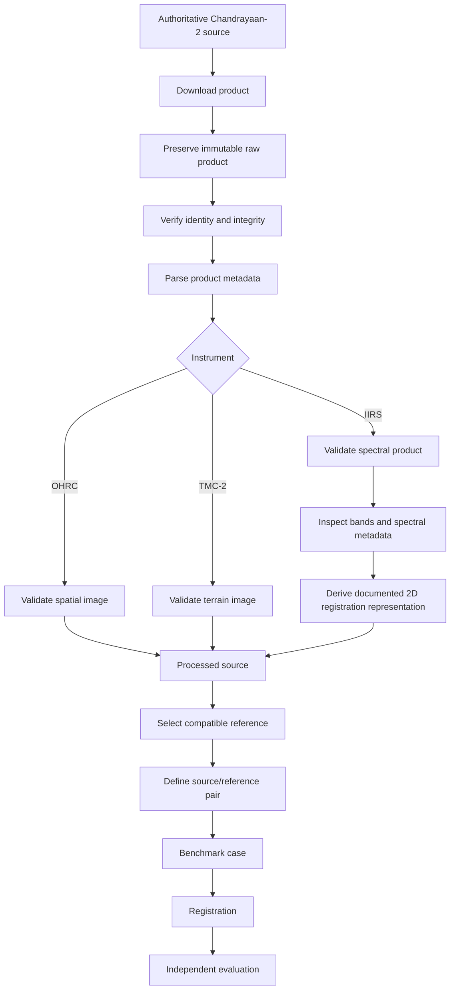
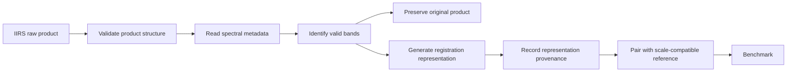

# Chandrayaan-2 Datasets

Chandrayaan-2 is the primary **source-data family** used by ChandraMap for lunar image correspondence, registration, cross-resolution matching, and cross-modality research. The project currently focuses on three Chandrayaan-2 Orbiter instruments:

* **OHRC — Orbiter High Resolution Camera**
* **TMC-2 — Terrain Mapping Camera-2**
* **IIRS — Imaging Infrared Spectrometer**

These instruments must not be treated as interchangeable image files. They differ substantially in spatial scale, sensor modality, spectral content, product structure, metadata, and registration requirements.

ChandraMap therefore treats dataset preparation as part of the scientific workflow. Every product should remain traceable to its authoritative mission source, and every processed or derived artifact should preserve enough provenance to reconstruct how it was generated.

> **Core dataset principle:** preserve the original Chandrayaan-2 product, preserve its metadata, derive new representations separately, and make every benchmark result traceable back to the exact mission products that produced it.

| Instrument | Data Type                        |                        Approximate Project Scale | Typical ChandraMap Role                          |
| ---------- | -------------------------------- | -----------------------------------------------: | ------------------------------------------------ |
| OHRC       | Visible / panchromatic imagery   | ~0.25–0.32 m/px, product/documentation-dependent | Fine source registration                         |
| TMC-2      | Panchromatic terrain imagery     |                                          ~5 m/px | Structural correspondence                        |
| IIRS       | Hyperspectral / imaging infrared |                                         ~80 m/px | Cross-modality and coarse structural experiments |

For IIRS, current project documentation also uses approximately **~0.8–5.0 µm** spectral coverage and **roughly 250–256 bands**, depending on product/documentation.

> **Product metadata is authoritative.** Approximate values in this document are architecture and planning aids, not replacements for metadata distributed with an actual product.

---

## 1. Chandrayaan-2 Dataset Role in ChandraMap

Chandrayaan-2 products normally act as the **source** or **query** side of a ChandraMap experiment.

Typical reference data includes:

* LRO NAC;
* LRO WAC.

Conceptually:

```text
Chandrayaan-2 source
        ↓
sensor-specific preparation
        ↓
reference selection
        ↓
local correspondence
        ↓
geometric verification
        ↓
registration
        ↓
evaluation
```

Typical source roles are:

### OHRC

Used for:

* high-detail correspondence;
* fine local registration;
* high-resolution benchmark pairs;
* illumination and geometry stress tests.

### TMC-2

Used for:

* terrain-structure correspondence;
* medium-scale registration;
* cross-resolution experiments;
* scale-stress benchmarks.

### IIRS

Used for:

* hyperspectral registration research;
* cross-modality experiments;
* coarse structural correspondence;
* spectral-representation ablations.

Source and reference are **experiment roles**, not permanent classifications. A controlled research experiment may reverse them when scientifically justified.

---

## 2. Dataset vs Sensor Documentation

ChandraMap separates **sensor documentation** from **dataset documentation**.

Sensor documentation answers:

> What is the instrument, what does it measure, and which physical properties matter for registration?

Dataset documentation answers:

> Which actual products are used, where do they come from, how are they stored, validated, versioned, paired, and reproduced?

Dedicated sensor pages:

* [`../sensors/ohrc.md`](../sensors/ohrc.md)
* [`../sensors/tmc2.md`](../sensors/tmc2.md)
* [`../sensors/iirs.md`](../sensors/iirs.md)

This file intentionally avoids repeating complete instrument descriptions.

---

## 3. Chandrayaan-2 OHRC Dataset

**OHRC — Orbiter High Resolution Camera** provides very-high-resolution visible/panchromatic lunar imagery.

Approximate ChandraMap planning scale:

> **~0.25–0.32 m/pixel, depending on product/documentation**

Typical dataset role:

* high-detail source imagery;
* fine correspondence;
* fine registration;
* high-resolution benchmark input.

Important dataset fields include:

* product ID;
* source archive;
* acquisition time;
* product type/state;
* image dimensions;
* actual GSD;
* ground footprint;
* projection;
* lunar coordinate system;
* illumination metadata;
* viewing geometry;
* NoData/valid-data information.

Raw OHRC data should remain unchanged.

Possible derived products include:

* geographic crops;
* map-projected versions;
* normalized images;
* multi-scale representations;
* matcher-ready derivatives.

Every derivative should remain connected to the original OHRC product.

---

## 4. Chandrayaan-2 TMC-2 Dataset

**TMC-2 — Terrain Mapping Camera-2** provides panchromatic lunar terrain imagery.

Approximate project scale:

> **~5 m/pixel**

Typical roles include:

* structural source imagery;
* terrain correspondence;
* medium-scale registration;
* scale-stress experiments;
* geometry-focused benchmarks.

Important dataset information includes:

* product identity;
* GSD;
* geographic footprint;
* projection;
* acquisition metadata;
* illumination geometry;
* viewing geometry;
* processing state.

TMC-2 is useful as an intermediate spatial scale between OHRC and IIRS.

Conceptually:

```text
OHRC
~0.25–0.32 m/px
        ↓
TMC-2
~5 m/px
        ↓
IIRS
~80 m/px
```

TMC-2 imagery may participate in terrain or stereo workflows where appropriate products exist, but ChandraMap should **not** assume that every TMC-2 product contains a DEM or elevation information.

---

## 5. Chandrayaan-2 IIRS Dataset

**IIRS — Imaging Infrared Spectrometer** requires a substantially different dataset path.

Unlike OHRC and TMC-2, an IIRS product may contain hyperspectral information conceptually represented as:

```text
X × Y × B
```

where:

* `X` = spatial width;
* `Y` = spatial height;
* `B` = spectral bands.

Current project-level approximations are:

* spatial scale: **~80 m/pixel**;
* spectral range: **~0.8–5.0 µm**;
* spectral channels: **roughly 250–256**, depending on product/documentation.

The actual distributed product may instead be:

* a full hyperspectral cube;
* individual spectral bands;
* a subset product;
* a browse product;
* a calibrated product;
* a projected product;
* a derived product.

> **Never assume the IIRS data layout before inspecting the actual product and its metadata.**

---

## 6. IIRS Raw vs Registration Representation

The original IIRS scientific product and the representation used for image matching are different artifacts.

### Raw IIRS Product

Contains the original mission-provided spectral data.

It should be:

* preserved unchanged;
* stored with its metadata;
* traceable to its provider;
* retained even if ChandraMap uses only a subset for registration.

### Derived Registration Representation

A matcher-ready representation may be created from the original product.

Possible examples include:

* selected spectral band;
* PCA component;
* multi-band composite;
* gradient map;
* edge/structural representation.

Conceptually:

```text
Original IIRS product
        |
        +--------------------+
        |                    |
        v                    v
Preserved scientific    Derived registration
source product            representation
```

The derived representation must never replace the original cube/product.

---

## 7. IIRS Representation Metadata

Every persisted IIRS-derived registration representation should record enough information to reproduce it.

Useful fields include:

* source product ID;
* source archive;
* selected band indices;
* wavelengths used where available;
* excluded/invalid bands;
* PCA configuration;
* PCA component index;
* composite definition;
* normalization method;
* output dimensions;
* source GSD;
* output projection;
* software/version;
* representation version;
* generation configuration.

For example:

```text
representation_type: pca
source_product_id: <product-id>
selected_component: <component-index>
normalization: <documented-method>
processing_version: <version>
```

The exact schema should follow repository contracts if they exist.

---

## 8. Authoritative Data Access

Chandrayaan-2 products should be obtained from authoritative mission or data-provider resources.

Relevant source categories include:

* ISRO Chandrayaan-2 mission resources;
* ISRO Chandrayaan-2 payload documentation;
* ISRO / ISSDC;
* PRADAN;
* official Chandrayaan-2 product documentation.

ChandraMap should not depend on unofficial re-hosted imagery when authoritative products are available.

For each downloaded product, record where practical:

* provider;
* archive/resource;
* product ID;
* original filename;
* access/download date;
* checksum;
* local path;
* relevant provider documentation.

Exact URLs should only be added when verified.

---

## 9. Before Downloading Large Data

ChandraMap should not begin research by downloading an entire lunar mission archive.

A more useful progression is:

1. select one known OHRC or TMC-2 product;
2. identify one overlapping LRO reference;
3. verify metadata and product geometry;
4. run an end-to-end registration baseline;
5. add several controlled pairs;
6. introduce IIRS as a separate sensor path;
7. expand to larger datasets only after the baseline is measurable.

> **Start with one measurable pair before building a global lunar dataset.**

A large data collection cannot compensate for an unvalidated registration pipeline.

---

## 10. Product Identification

Every local Chandrayaan-2 file should remain traceable to its original mission product.

Avoid relying on local filenames such as:

```text
image1.tif
moon.png
final.tif
test2.tif
```

A product record should preserve:

* mission;
* instrument;
* official product ID;
* source provider;
* product processing state;
* acquisition information;
* original filename where relevant.

A local rename is acceptable only if provenance remains intact.

---

## 11. Raw Data Storage

A recommended conceptual structure is:

```text
data/
└── raw/
    └── chandrayaan2/
        ├── ohrc/
        ├── tmc2/
        └── iirs/
```

Raw storage should contain the original downloaded mission products.

Raw files should not be experiment-specific.

If the repository defines another canonical structure elsewhere, that structure is authoritative.

---

## 12. Interim Data

Interim files are temporary or transitional products created during preparation.

Possible examples include:

* decompressed working files;
* temporary format conversions;
* calibration intermediates;
* temporary projection outputs;
* temporary masks.

A conceptual location may be:

```text
data/interim/chandrayaan2/
```

Interim data should remain reproducible from raw products.

It should never replace the raw source.

---

## 13. Processed Data

Processed data is intentionally prepared for ChandraMap algorithms.

Examples may include:

* validated image products;
* calibrated products;
* map-projected images;
* valid-data masked images;
* normalized imagery;
* matcher-ready 2D IIRS representations.

Processed products should retain:

* parent product ID;
* processing configuration;
* software/version;
* projection;
* physical scale;
* relevant metadata.

---

## 14. Derived Data

Derived data is generated from raw or processed mission products for algorithmic use.

Examples include:

* crops;
* geographic tiles;
* image pyramids;
* keypoint caches;
* global descriptors;
* local descriptors;
* IIRS PCA images;
* gradient maps;
* structural representations;
* benchmark crops.

> **Derived data is not mission truth. It is a reproducible transformation of mission data.**

Derived data must retain lineage.

---

## 15. Recommended Data Layout

A possible Chandrayaan-2 layout is:

```text
data/
├── raw/
│   └── chandrayaan2/
│       ├── ohrc/
│       ├── tmc2/
│       └── iirs/
│
├── interim/
│   └── chandrayaan2/
│
├── processed/
│   └── chandrayaan2/
│       ├── ohrc/
│       ├── tmc2/
│       └── iirs/
│
├── derived/
│   └── chandrayaan2/
│       ├── crops/
│       ├── representations/
│       ├── pyramids/
│       └── descriptors/
│
└── manifests/
    └── chandrayaan2/
```

### `raw/`

Original immutable mission products.

### `interim/`

Temporary conversion or processing artifacts.

### `processed/`

Products prepared for registration.

### `derived/`

Experiment-oriented transformations such as crops and descriptors.

### `manifests/`

Machine-readable provenance and metadata records.

This is a recommended model unless the repository defines a different canonical layout.

---

## 16. Raw Data Must Be Immutable

Original Chandrayaan-2 mission products should never be modified in place.

Do not:

* overwrite raw imagery;
* normalize raw files;
* resize raw files;
* remove mission metadata;
* modify product headers in place;
* replace an IIRS cube with a PCA image.

Use:

```text
raw
 ↓
processed
 ↓
derived
```

Preserving immutable raw data makes experiments reproducible and reversible.

---

## 17. Do Not Commit Large Chandrayaan-2 Data to Git

Large mission products should generally remain outside ordinary Git history.

Git should normally track:

* documentation;
* dataset manifests;
* checksums;
* download scripts;
* configuration;
* benchmark definitions;
* tiny fixtures;
* small example products where redistribution permits them.

Git should generally not track:

* full OHRC archives;
* full TMC-2 archives;
* full IIRS hyperspectral cubes;
* generated reference pyramids;
* large intermediate arrays;
* large descriptor databases.

Git LFS may be useful for a small number of controlled assets, but it should not become the default storage system for multi-gigabyte scientific archives.

---

## 18. Chandrayaan-2 Dataset Manifest

A machine-readable manifest is recommended for dataset collections.

Possible conceptual fields include:

| Field               | Purpose                            |
| ------------------- | ---------------------------------- |
| `dataset_id`        | Stable internal dataset identifier |
| `mission`           | Mission provenance                 |
| `instrument`        | Sensor routing                     |
| `product_id`        | Exact mission-product identity     |
| `source_archive`    | Authoritative provider/archive     |
| `original_filename` | Original local/archive filename    |
| `local_path`        | Configurable local location        |
| `checksum`          | File integrity                     |
| `file_size`         | Local integrity/management         |
| `product_type`      | Product interpretation             |
| `processing_level`  | Product state                      |
| `acquisition_time`  | Observation provenance             |
| `width`             | Spatial dimension                  |
| `height`            | Spatial dimension                  |
| `bands`             | Spectral dimension where relevant  |
| `wavelength_range`  | IIRS spectral interpretation       |
| `gsd`               | Scale-aware registration           |
| `projection`        | Geospatial interpretation          |
| `crs`               | Coordinate reference               |
| `footprint`         | Geographic search                  |
| `latitude_bounds`   | Geographic location                |
| `longitude_bounds`  | Geographic location                |
| `incidence_angle`   | Illumination geometry              |
| `emission_angle`    | Viewing geometry                   |
| `phase_angle`       | Observation geometry               |
| `nodata`            | Valid-pixel handling               |
| `notes`             | Product-specific information       |

Fields unavailable for a product should remain explicitly missing rather than being fabricated.

---

## 19. Metadata Validation

Before a product enters a benchmark, validate whichever properties are relevant:

* mission identity;
* instrument identity;
* product ID;
* product type/state;
* file readability;
* dimensions;
* pixel type;
* band count;
* wavelength information;
* GSD;
* map projection;
* lunar coordinate system;
* footprint;
* NoData values;
* acquisition time;
* illumination metadata;
* viewing geometry.

A metadata parser should distinguish:

```text
field absent
```

from:

```text
field present but invalid
```

and:

```text
field required for this operation
```

Missing values should never be silently replaced with invented defaults.

---

## 20. Approximate Values vs Product Metadata

ChandraMap should use this information hierarchy:

1. **actual product metadata**
2. **official product documentation**
3. **official mission/instrument documentation**
4. **generic ChandraMap documentation**

Examples of generic project values are:

```text
OHRC  ~0.25–0.32 m/px
TMC-2 ~5 m/px
IIRS  ~80 m/px
```

These are useful for architecture planning.

They must not override actual product metadata.

---

## 21. Product Processing State

A Chandrayaan-2 product may be distributed or transformed through different processing stages.

Conceptually, data may be:

* raw/unprocessed;
* calibrated;
* geometrically corrected;
* map-projected;
* derived.

The exact official product-level terminology should come from authoritative product documentation.

ChandraMap should record the real product state rather than invent its own mission-level classification.

---

## 22. Map-Projected vs Non-Map-Projected Data

Projection state affects how a product should enter registration.

### Map-Projected Product

Can simplify:

* geographic overlap;
* reference selection;
* coordinate conversion;
* source/reference comparison;
* map-space registration.

### Non-Map-Projected Product

May require additional handling involving:

* sensor/camera geometry;
* spacecraft viewing geometry;
* lunar shape model;
* terrain relief;
* projection or orthorectification.

> **Do not ask a computer-vision matcher to solve known geometric structure that can be obtained reliably from mission metadata and planetary processing.**

---

## 23. Geospatial Metadata

Geospatial metadata can dramatically reduce the reference-search problem.

Useful information includes:

* latitude;
* longitude;
* geographic footprint;
* map projection;
* lunar coordinate system;
* GSD;
* acquisition geometry.

If trustworthy footprint metadata already exists:

```text
source footprint
        ↓
intersect reference coverage
        ↓
candidate reference region
```

is generally preferable to an unnecessary whole-Moon image search.

---

## 24. Known-Location Mode

If a Chandrayaan-2 product includes trustworthy geographic information, use it.

Conceptually:

```text
Chandrayaan-2 product
        ↓
geographic footprint
        ↓
intersect LRO reference
        ↓
candidate reference tile
        ↓
local matching
```

Using mission metadata is scientifically valid engineering.

It is not "cheating."

---

## 25. Unknown-Location Mode

If location is genuinely unknown, unavailable, unreliable, or deliberately hidden for a retrieval benchmark:

```text
Chandrayaan-2 source
        ↓
global representation
        ↓
reference database search
        ↓
Top-K candidate lunar regions
        ↓
local matching
        ↓
geometric verification
```

This should be treated as a separate benchmark task from known-overlap registration.

---

## 26. Known-Overlap Dataset

A known-overlap benchmark pair should record:

* Chandrayaan-2 source product;
* reference product or tile;
* confirmed overlapping lunar region;
* source sensor;
* reference sensor;
* source GSD;
* reference GSD;
* relevant projections;
* representation type;
* truth/check points where available;
* benchmark category;
* pair ID;
* benchmark version.

Known-overlap pairs are the preferred starting point for V1.

---

## 27. Why Known-Overlap Comes First

Known-overlap evaluation isolates:

* sensor preprocessing;
* image representation;
* local matching;
* geometric verification;
* transform estimation;
* sub-pixel refinement;
* error computation.

It removes:

* full-Moon retrieval;
* descriptor indexing;
* candidate-region ranking;

from the initial problem.

This makes failures much easier to diagnose.

---

## 28. Chandrayaan-2 / LRO Pairing

### OHRC ↔ LRO NAC

Typical role:

> fine cross-mission registration

Important challenges:

* product-scale differences;
* illumination;
* shadow geometry;
* viewing geometry;
* projection;
* terrain relief.

### OHRC ↔ LRO WAC

Typical role:

> broad/coarse localization or contextual registration

OHRC may contain far more fine spatial information than the WAC product.

### TMC-2 ↔ LRO NAC

Typical role:

> structural cross-resolution registration

The NAC reference should often be represented at a coarser pyramid level before initial matching.

### TMC-2 ↔ LRO WAC

Possible role:

> coarse structural or regional correspondence

Actual compatibility depends on the WAC product.

### IIRS ↔ LRO NAC

A difficult combination involving:

* extreme scale difference;
* sensor-modality difference.

Required preparation includes:

```text
IIRS
→ documented 2D representation

NAC
→ strongly reduced scale level
```

### IIRS ↔ LRO WAC

Potential role:

> coarse cross-modality localization

Again, a documented IIRS representation is required.

These pairings are research possibilities, not claims that each is already implemented.

---

## 29. Physical Scale Matching

Equal digital dimensions do not mean equal physical resolution.

Incorrect:

```text
TMC-2
        ↓
resize NAC to same width/height
        ↓
assume scales now match
```

Preferred:

```text
TMC-2 GSD
        ↓
inspect NAC scale pyramid
        ↓
select physically comparable effective level
```

> **Compare information, not pixel count.**

---

## 30. Upsampling Limitations

Upsampling increases the number of samples in an array.

It does not increase the physical information originally measured.

For example:

```text
IIRS
~80 m/px
    ↓
upsample
    ↓
more pixels
```

does not create:

* newly observed craters;
* new ridge structure;
* OHRC-level detail;
* NAC-level fine morphology.

> **Interpolation changes representation, not sensor information content.**

---

## 31. Reference Downsampling

When the Chandrayaan-2 source is much coarser than the reference, downsampling the reference can be the scientifically correct choice.

Examples include:

* TMC-2 ↔ LRO NAC;
* IIRS ↔ LRO NAC.

Conceptually:

```text
High-resolution reference
        ↓
multi-resolution pyramid
        ↓
source-compatible level
        ↓
coarse correspondence
```

Fine reference levels may be introduced later only when the source contains enough corresponding information.

---

## 32. Dataset Pair Metadata

Each source/reference pair should conceptually store:

```text
pair_id
source_product_id
reference_product_id
source_sensor
reference_sensor
source_gsd
reference_gsd
source_projection
reference_projection
geographic_region
overlap_information
source_representation
reference_scale_level
benchmark_category
ground_truth_version
check_point_set
split
notes
```

The exact schema should follow repository contracts when available.

---

## 33. Benchmark Categories

ChandraMap should maintain benchmark pairs that represent distinct failure modes.

### Known-Overlap / Baseline

Purpose:

* verify end-to-end registration under controlled conditions.

### Sun-Angle Stress

Purpose:

* evaluate robustness to different illumination and shadow geometry.

### Scale Stress

Purpose:

* measure behavior under large GSD differences.

### Modality Stress

Purpose:

* evaluate cross-modal pairs such as IIRS-derived imagery against visible references.

### Geometry Stress

Purpose:

* test relief, viewing, or projection differences.

### Low-Feature Terrain

Purpose:

* evaluate areas containing limited distinctive structure.

### Repetitive Crater Terrain

Purpose:

* expose ambiguity and false-match behavior.

Do not assign arbitrary numerical difficulty scores.

---

## 34. OHRC Benchmark Data

Useful OHRC benchmark cases may include:

* known overlap with NAC;
* relatively similar illumination;
* strongly different illumination;
* scale difference;
* repetitive crater terrain;
* relief-rich terrain;
* low-feature regions.

Each case should preserve:

* exact OHRC product;
* exact reference product;
* overlap definition;
* pair metadata;
* evaluation points.

Expected performance should not be assumed.

---

## 35. TMC-2 Benchmark Data

TMC-2 benchmark pairs should exercise:

* structural terrain correspondence;
* moderate-to-large scale differences;
* illumination variation;
* relief/view geometry;
* medium-scale crater and ridge structures;
* low-feature terrain.

Reference-scale selection should be recorded as part of the benchmark configuration.

---

## 36. IIRS Benchmark Data

IIRS benchmark design should explicitly include:

* representation selection;
* scale compatibility;
* modality differences;
* coarse structural correspondence;
* large GSD gaps.

Possible experiments include:

* selected-band registration;
* PCA representation;
* spectral composite;
* gradient/structural representation.

Each representation should ideally be tested against the same source/reference pair.

---

## 37. IIRS Representation Ablation Dataset

A controlled IIRS ablation should keep constant:

* IIRS source product;
* reference product;
* reference scale;
* matcher;
* geometric model;
* evaluation points;
* thresholds.

Change only:

```text
IIRS representation
```

For example:

```text
Band A
vs.
Band B
vs.
PCA component
vs.
Composite
vs.
Structural representation
```

This allows the project to determine whether performance changes come from the representation rather than unrelated pipeline modifications.

---

## 38. Dataset Splits

If ChandraMap trains learned components, dataset splits should be explicitly defined.

Typical partitions include:

* training;
* validation;
* test.

Random image-level splitting may be inappropriate when neighboring lunar crops overlap strongly.

Depending on the experiment, consider:

* region-level splitting;
* product-level splitting;
* geographic separation;
* acquisition separation.

Exact split rules belong in benchmark documentation.

---

## 39. Geographic Leakage

Lunar terrain is spatially continuous.

Two neighboring tiles can contain nearly identical crater structures.

If one appears in training and another appears in testing, a learned method may seem to generalize while effectively seeing the same terrain.

Track:

* geographic footprint;
* parent product;
* tile lineage;
* overlap fraction where practical;
* lunar region.

Use region-level separation when the experiment claims unseen-geography generalization.

---

## 40. Product Leakage

Different derivatives of one product should not silently cross training/test boundaries.

Examples include:

* another crop from the same image;
* another pyramid level;
* augmented copy;
* overlapping tile;
* normalized version of the same source.

Split generation should use parent-product lineage.

---

## 41. Pair Leakage

A source/reference pair should remain identifiable across all of its derivatives.

For example:

```text
pair_001 crop A
pair_001 crop B
pair_001 augmented
pair_001 scale level 2
```

should not be treated as four unrelated samples when defining train/test separation.

Pair IDs help detect this leakage.

---

## 42. Synthetic Augmentation

Potential controlled augmentations include:

* rotation;
* scale;
* contrast;
* brightness;
* noise;
* blur;
* cropping;
* limited occlusion.

These can support:

* training;
* robustness testing;
* controlled ablations.

### Illumination Caution

Simple brightness transformations are not physically equivalent to changing lunar Sun angle.

Real illumination variation can alter:

* shadow position;
* shadow length;
* illuminated slopes;
* visible terrain.

Synthetic illumination transformations should therefore be labeled appropriately.

---

## 43. Real Lunar Data Must Drive Evaluation

Synthetic augmentation is useful, but real Chandrayaan-2/reference pairs should remain central to scientific evaluation.

Do not use synthetic-only results as proof of:

* cross-mission generalization;
* Sun-angle invariance;
* hyperspectral-visible robustness;
* real lunar registration accuracy.

---

## 44. Dataset Ground Truth

The term **ground truth** should be reserved for independently justified reference information.

Possible sources include:

* official challenge truth;
* authoritative map/control information;
* independently verified correspondences;
* held-out manually checked points.

Matcher-generated RANSAC inliers are not ground truth.

A reference image alone is also not automatically ground truth.

---

## 45. Control Points vs Check Points

These should be stored separately when independent evaluation is intended.

### Control / Tie / Fit Points

Used to estimate the transformation.

### Check Points

Used only to evaluate the transformation.

Conceptually:

```text
fit points
    ↓
estimate transform

check points
    ↓
evaluate transform
```

This distinction should be represented in annotation metadata.

---

## 46. Do Not Evaluate on Fit Points Alone

A weak evaluation procedure is:

```text
RANSAC inliers
        ↓
fit transform
        ↓
measure RMSE on same points
        ↓
claim independent accuracy
```

This can produce an overly optimistic error estimate.

Fit-point residuals are useful diagnostics.

Independent accuracy should use separate check points whenever possible.

---

## 47. Annotation Data

A correspondence annotation may conceptually include:

```text
pair_id
source_product_id
reference_product_id
source_x
source_y
reference_x
reference_y
latitude
longitude
annotation_type
verification_status
annotation_source
notes
```

Possible annotation types include:

* fitting/control;
* independent check;
* manually verified;
* official truth;
* automatically proposed.

Exact schemas belong in repository contracts.

---

## 48. Pixel Coordinate Conventions

Benchmark annotations must define their coordinate system clearly.

Document:

* `x/y` ordering;
* row/column ordering;
* image origin;
* zero-based vs one-based indexing;
* pixel-center convention.

For example, if ChandraMap adopts:

```text
x = column
y = row
origin = top-left
```

that convention should be explicitly documented in the authoritative annotation contract.

Do not leave it implicit.

---

## 49. Geospatial Coordinate Conventions

Geospatial annotations should preserve:

* coordinate reference system;
* projection;
* latitude convention;
* longitude convention;
* units;
* lunar datum/reference model where applicable.

Use:

* product metadata;
* official mission documentation;
* authoritative lunar cartographic guidance.

Do not invent geodetic assumptions.

---

## 50. Dataset Checksums

Checksums help confirm that benchmark inputs remain unchanged.

Useful applications include:

* verifying downloads;
* detecting corruption;
* confirming two machines use identical files;
* validating benchmark releases.

A modern cryptographic hash such as **SHA-256** may be used where appropriate.

If the repository adopts another standard, that standard is authoritative.

---

## 51. Dataset Provenance

Every Chandrayaan-2 file should ideally answer:

* Which original product produced this?
* Which provider supplied it?
* What was the product's processing state?
* Which processing steps were applied locally?
* Which benchmark pair uses it?
* Which experiment consumed it?

Conceptually:

```text
Authoritative Chandrayaan-2 product
        ↓
raw local copy
        ↓
processed derivative
        ↓
crop / representation
        ↓
benchmark pair
        ↓
experiment
```

Provenance should remain available at every stage.

---

## 52. Derived File Naming

Avoid meaningless names such as:

```text
final.png
final2.tif
new_output.tif
working_good.png
```

Prefer stable identifiers that reference:

* mission;
* sensor;
* product;
* representation;
* tile/crop;
* pyramid level.

Detailed metadata should remain in manifests rather than producing excessively long filenames.

---

## 53. Dataset IDs

Stable internal identifiers are useful for:

* products;
* representations;
* source/reference pairs;
* benchmark cases;
* dataset releases.

They help connect:

* manifests;
* annotations;
* results;
* logs;
* experiment tracking.

The repository should use one consistent ID convention rather than inventing a new syntax per module.

---

## 54. Dataset Versioning

Dataset definitions can change even when source code does not.

Reasons include:

* new products;
* corrected metadata;
* improved pair definitions;
* new reference imagery;
* improved check points;
* new split strategy.

ChandraMap should therefore identify dataset releases explicitly.

A code version alone is not enough to reproduce a benchmark.

---

## 55. Benchmark Versioning

A benchmark version should freeze:

* source product list;
* reference product list;
* pair definitions;
* representation definitions;
* check points/ground truth;
* split definitions;
* reference-scale rules;
* evaluation protocol.

This allows fair comparison between algorithm versions.

For example:

```text
Algorithm: V3
Benchmark: B1
```

and:

```text
Algorithm: V4
Benchmark: B1
```

can be compared meaningfully because the data remained fixed.

---

## 56. ChandraMap Version Dataset Scope

Existing version specifications are authoritative. The following is a conceptual progression only.

### V1 — Minimal Controlled Chandrayaan-2 Dataset

Focus on:

* a very small known-overlap set;
* OHRC and/or TMC-2;
* LRO NAC reference;
* classical registration baseline;
* independent evaluation points.

Whole-Moon retrieval should not be required.

### V2 — Sensor-Aware Stress Dataset

Possible additions include:

* stronger scale differences;
* illumination differences;
* more OHRC/TMC-2 pairs;
* IIRS representation experiments;
* controlled failure cases.

### V3 — Retrieval Dataset

Possible additions include:

* larger query collection;
* NAC/WAC reference tiles;
* global descriptors;
* Top-K reference labels;
* unknown-location experiments.

### V4 — Research-Grade Dataset

Possible additions include:

* additional missions;
* broader lunar geography;
* larger IIRS multimodal benchmark;
* Kaguya / SELENE validation;
* DEM/geometry-aware cases;
* geographic split datasets for learned methods.

---

## 57. Data Access Configuration

Local dataset paths must not be hard-coded into source code.

Avoid:

```text
C:\Users\Name\Desktop\moon\
```

or:

```text
/home/user/data/chandrayaan/
```

Prefer configuration through:

* project configuration;
* environment variable;
* CLI argument;
* dataset manifest.

A conceptual name such as:

```text
CHANDRAMAP_DATA_ROOT
```

may illustrate the design, but the repository's configuration contract should define the real setting.

---

## 58. External Data Storage

Real Chandrayaan-2 products may live outside the Git checkout.

Possible storage locations include:

* local disks;
* external SSDs;
* research servers;
* shared filesystems;
* object storage.

The codebase should access them through configuration and manifests rather than absolute machine paths.

---

## 59. Download Automation

Future download tooling should ideally:

* accept product identifiers or manifest entries;
* use authoritative data providers;
* preserve source product IDs;
* preserve original filenames where useful;
* avoid duplicate downloads;
* verify integrity where practical;
* record provenance;
* fail clearly;
* avoid silently modifying frozen benchmark definitions.

Download tools must not contain credentials or secrets.

---

## 60. Dataset Validation Pipeline



The IIRS branch is intentionally different because spectral representation generation precedes conventional image matching.

---

## 61. IIRS Dataset Flow



The raw scientific source remains preserved regardless of which representation is used for registration.

---

## 62. Dataset Quality Control

| Check                          | Purpose                             |
| ------------------------------ | ----------------------------------- |
| File readable                  | Detect corrupt/unsupported products |
| Correct mission                | Prevent dataset contamination       |
| Correct instrument             | Select correct sensor path          |
| Product ID recorded            | Reproducibility                     |
| Checksum valid                 | Data integrity                      |
| Dimensions valid               | Processing safety                   |
| Metadata parsed                | Product interpretation              |
| GSD available when required    | Scale-aware matching                |
| Projection identified          | Geospatial processing               |
| Footprint valid                | Reference selection                 |
| NoData handled                 | Prevent invalid matches             |
| IIRS dimensions checked        | Hyperspectral validation            |
| IIRS spectral metadata checked | Reproducible representation         |
| Pair overlap verified          | Benchmark correctness               |
| Provenance complete            | Reproducibility                     |

Not every check applies to every product.

---

## 63. Pair Quality Control

Before accepting a Chandrayaan-2/reference pair:

* verify both products are readable;
* verify sensor identities;
* verify real geographic overlap;
* record source/reference roles;
* record GSD values;
* record projections;
* validate reference region;
* check valid-data coverage;
* record benchmark category;
* record check points/truth source;
* assign a stable pair ID;
* record benchmark version.

Anonymous screenshots or visually similar images should not become benchmark truth.

---

## 64. Dataset Security

Chandrayaan-2 imagery is scientific mission data rather than personal user data, but infrastructure credentials must still be protected.

Never commit:

* API tokens;
* provider passwords;
* cloud credentials;
* signed private URLs;
* `.env` secrets.

If future data systems require authenticated access, use appropriate secret-management mechanisms.

---

## 65. Licensing and Usage Terms

ChandraMap must not invent data licensing or redistribution rights.

Contributors should consult authoritative provider terms from organizations such as:

* ISRO;
* ISSDC;
* PRADAN.

Record where applicable:

* provider;
* source;
* attribution requirements;
* citation instructions;
* redistribution restrictions.

If redistribution permissions are unclear, store identifiers and acquisition instructions instead of republishing the data.

---

## 66. Scientific Citation

Chandrayaan-2 products should be cited according to official provider guidance where required.

Record enough information to identify:

* mission;
* instrument;
* product;
* product ID;
* archive/provider;
* relevant product documentation.

Do not fabricate:

* DOIs;
* publication references;
* citation requirements.

Use official guidance when available.

---

## 67. Chandrayaan-2 Dataset Limitations

### Product Access and Formats May Vary

Different products may require different readers or preparation steps.

### Metadata Availability Varies

Not every product provides every desired field.

### Projection State May Differ

Some products may require additional geospatial processing.

### Cross-Mission Overlap May Be Limited

Not every Chandrayaan-2 observation has an equally useful LRO counterpart.

### Sensor Scales Differ Dramatically

OHRC, TMC-2, and IIRS do not contain the same spatial information.

### IIRS Requires Modality-Specific Preparation

Its hyperspectral source cannot be treated as a normal grayscale camera image.

### Illumination Differences Can Be Severe

Different Sun geometry may substantially change surface appearance.

### Ground Truth May Be Limited

Independent manual check points may sometimes be necessary.

### Data Can Be Storage-Intensive

High-resolution imagery and hyperspectral products can require significant local storage.

### Planetary Processing Tools May Be Required

Projection and geometry tasks may require specialized planetary software.

### Derived Representations Can Introduce Bias

Benchmark performance can depend strongly on how data was transformed.

---

## 68. Common Chandrayaan-2 Dataset Mistakes

Do not:

* put OHRC, TMC-2, and IIRS into one unlabeled image folder;
* remove original product IDs;
* rename files without preserving provenance;
* modify raw products in place;
* hard-code approximate GSD values over real metadata;
* treat IIRS as grayscale;
* overwrite an IIRS cube with a PCA image;
* upsample IIRS and call it high-resolution;
* confuse digital dimensions with physical resolution;
* ignore map projection;
* ignore footprint information;
* perform whole-Moon search when trustworthy coordinates already exist;
* mix dataset inputs with experiment results;
* call RANSAC inliers ground truth;
* evaluate only on the points used to fit the transform;
* randomly split neighboring lunar regions without considering leakage;
* commit large mission archives into ordinary Git history;
* invent licensing terms;
* invent missing product metadata.

---

## 69. Adding a New Chandrayaan-2 Product

A contributor adding a new product should:

1. identify the authoritative mission product;
2. record the product ID and provider;
3. download it to raw storage;
4. verify file integrity;
5. parse product metadata;
6. confirm the instrument;
7. record GSD and processing state;
8. create a processed/derived representation only if required;
9. define the intended ChandraMap role;
10. identify an appropriate reference;
11. create or update the manifest;
12. add validation/tests where appropriate;
13. document important limitations.

The product should not enter a benchmark until its identity and provenance are clear.

---

## 70. Adding a New OHRC Product

For OHRC, verify where available:

* actual product GSD;
* geographic footprint;
* projection;
* illumination geometry;
* viewing geometry;
* valid-data region;
* suitable reference overlap.

For fine-registration experiments, ensure the reference product contains enough spatial information to justify the intended accuracy.

---

## 71. Adding a New TMC-2 Product

For TMC-2, verify:

* actual product GSD;
* projection;
* footprint;
* terrain coverage;
* acquisition/illumination metadata;
* suitable NAC or WAC overlap.

Do not assume that a DEM or stereo-derived terrain model is embedded in every TMC-2 product.

---

## 72. Adding a New IIRS Product

IIRS requires additional validation.

Check:

* product type;
* spatial dimensions;
* spectral dimension;
* band count;
* wavelength metadata;
* invalid/bad-band metadata where documented;
* spatial GSD;
* projection;
* valid-data mask;
* planned registration representation.

The original spectral product must remain preserved.

Any registration representation should be stored separately with reproducible lineage.

---

## 73. Relationship to LRO Dataset Documentation

Chandrayaan-2 products normally occupy the source/query side of ChandraMap.

The LRO documentation describes important reference-side datasets.

Related pages include:

* [`../sensors/lro-nac.md`](../sensors/lro-nac.md)
* [`../sensors/lro-wac.md`](../sensors/lro-wac.md)

A dedicated dataset-level `lro.md` may be maintained separately if present in the repository.

---

## 74. Relationship to Dataset README

The parent dataset guide is:

* [`README.md`](README.md)

`docs/datasets/README.md` describes the full ChandraMap dataset architecture and governance model.

This file focuses specifically on:

* Chandrayaan-2 products;
* source-data preparation;
* Chandrayaan-specific validation;
* provenance;
* pair construction.

---

## 75. Relationship to Sensor Documentation

Relevant sensor pages are:

* [`../sensors/overview.md`](../sensors/overview.md)
* [`../sensors/ohrc.md`](../sensors/ohrc.md)
* [`../sensors/tmc2.md`](../sensors/tmc2.md)
* [`../sensors/iirs.md`](../sensors/iirs.md)

The distinction is:

```text
Sensor documentation
→ physical/instrument behavior

Dataset documentation
→ products, storage, provenance, pairing, versioning
```

---

## 76. Relationship to Architecture Documentation

Relevant architecture pages include:

* [`../architecture/system-overview.md`](../architecture/system-overview.md)
* [`../architecture/v1-pipeline.md`](../architecture/v1-pipeline.md)
* [`../architecture/core-engine-architecture.md`](../architecture/core-engine-architecture.md)
* [`../architecture/data-flow.md`](../architecture/data-flow.md)
* [`../architecture/output-flow.md`](../architecture/output-flow.md)

Dataset products and representations should remain compatible with architecture-level input/output contracts.

---

## 77. Relationship to Project Documentation

Relevant project pages include:

* [`../project/goals.md`](../project/goals.md)
* [`../project/non-goals.md`](../project/non-goals.md)
* [`../project/v1-scope.md`](../project/v1-scope.md)
* [`../project/terminology.md`](../project/terminology.md)
* [`../project/assumptions.md`](../project/assumptions.md)
* [`../project/limitations.md`](../project/limitations.md)

> **V1 dataset scope should follow the authoritative V1 scope document. This dataset page must not silently expand V1.**

---

## 78. Authoritative References

Chandrayaan-2 dataset decisions should prioritize official mission and data-provider documentation.

### Chandrayaan-2

Relevant authoritative source categories include:

* ISRO Chandrayaan-2 mission documentation
* ISRO Chandrayaan-2 payload documentation
* ISRO Chandrayaan-2 science documentation
* ISRO / ISSDC
* PRADAN
* official Chandrayaan-2 product/data documentation

### LRO Reference Data

For paired reference datasets:

* NASA Lunar Reconnaissance Orbiter documentation
* LROC / Arizona State University documentation
* NASA Planetary Data System

### Planetary Processing

Relevant source:

* USGS ISIS documentation

> **Actual product metadata and official product documentation take precedence over generic scale, format, and processing descriptions in this file.**

This document follows the supplied ChandraMap Chandrayaan-2 dataset documentation specification and project requirements. 

---

## Chandrayaan-2 Dataset Principles

### OHRC, TMC-2, and IIRS Are Different

Do not force them through one undocumented generic input path.

### Product Metadata Is Authoritative

Approximate mission-level values are context, not processing truth.

### Raw Data Is Immutable

Mission products should remain unchanged.

### Product IDs Must Be Preserved

A local file must remain traceable to its authoritative origin.

### Provenance Must Survive Every Transformation

Crops, projections, PCA representations, and descriptors must retain parent-product lineage.

### IIRS Requires Separate Handling

The spectral source and registration representation are different artifacts.

### Physical Scale Comes Before Pixel Dimensions

Use GSD and information content when pairing datasets.

### Upsampling Does Not Recover Missing Detail

Interpolation cannot reconstruct terrain the sensor never resolved.

### Geospatial Metadata Should Be Used

Known coordinates and footprints should restrict the reference search.

### Known-Overlap Registration Comes First

Establish a measurable local baseline before solving global retrieval.

### Retrieval and Registration Are Separate Dataset Tasks

Recall@K does not replace registration RMSE.

### Ground Truth Must Be Independent

Matcher output is not truth.

### Fit Points and Check Points Must Be Distinguished

Independent evaluation requires separate check points.

### Geographic Leakage Must Be Controlled

Highly overlapping lunar regions can invalidate generalization claims.

### Large Mission Products Usually Stay Outside Git

Track manifests, scripts, checksums, and definitions instead.

### Storage Must Be Configurable

The codebase should not depend on one machine's filesystem.

### Licensing Comes From the Provider

Do not invent redistribution rights.

### Benchmark Versions Must Be Frozen

Fair V1/V2/V3/V4 comparisons require stable dataset definitions.

### Reproducibility Comes Before Scale

> **A small, verified, metadata-complete Chandrayaan-2 benchmark is more scientifically valuable than a huge archive whose products, overlaps, and processing history cannot be reconstructed.**
