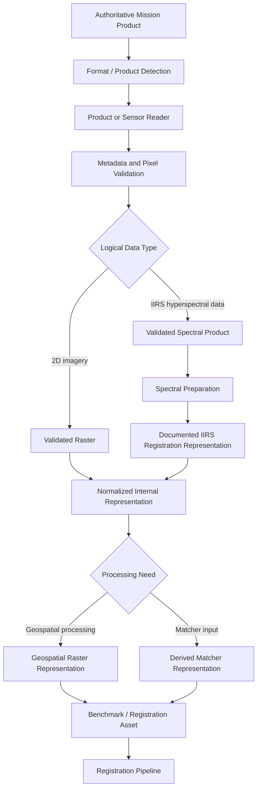
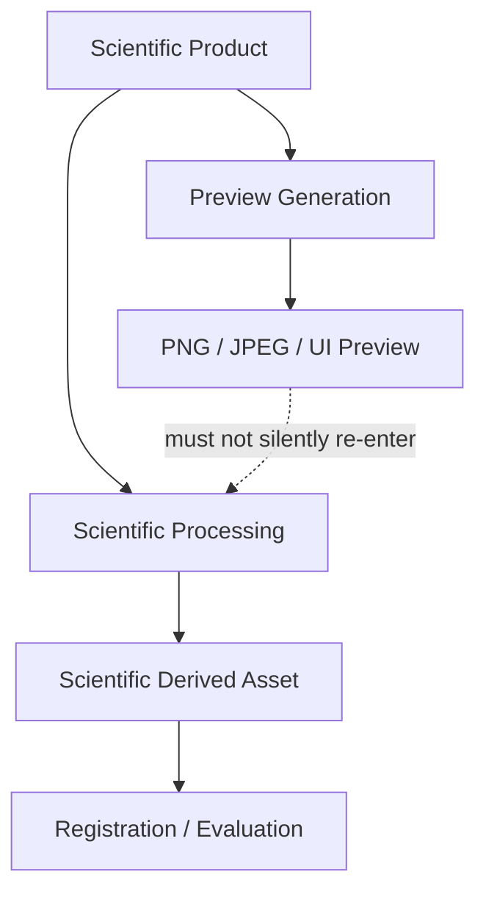

# Dataset and File Formats

ChandraMap works with scientific imagery from multiple lunar missions and instruments whose native products may differ in file structure, numeric precision, spectral dimensionality, geospatial encoding, metadata layout, projection state, and processing level.

The project therefore separates **mission-native scientific products** from **normalized and derived ChandraMap representations**.

Original mission products remain the authoritative source data. ChandraMap may create normalized rasters, hyperspectral-derived images, reference tiles, scale pyramids, descriptors, benchmark records, registered outputs, and visualization previews when required by later processing stages, but those derived assets must remain traceable to their original products.

> **Preserve mission-native data; convert only when a processing stage requires a normalized representation.**

A file format is only part of the scientific meaning of an asset. Correct interpretation may also require:

- product metadata;
- sensor identity;
- array dimensions;
- axis order;
- numeric data type;
- band information;
- Ground Sampling Distance (GSD);
- map projection;
- lunar coordinate reference;
- NoData semantics;
- processing state;
- provenance.

This document defines ChandraMap's **data-representation and file-format conventions**. Metadata semantics are documented separately in [`metadata.md`](metadata.md).

---

## 1. Format Design Goals

ChandraMap format handling should prioritize the following properties.

### Scientific Fidelity

Conversions should preserve the values and information needed for scientific processing.

### Metadata Preservation

Mission, sensor, geospatial, spectral, and provenance information should not disappear when data changes format.

### Geospatial Fidelity

Projection, coordinate-reference information, pixel-to-map mapping, footprint, and NoData information must remain available when geospatial processing requires them.

### Sensor Fidelity

OHRC, TMC-2, IIRS, LRO NAC, and LRO WAC should not be forced into one undocumented representation that removes sensor-specific information.

### Reproducibility

Another contributor should be able to reconstruct a derived asset from:

```text
source product
+
conversion configuration
+
software/version
```

### Efficient Processing

Algorithm-friendly derived forms may be created where they reduce repeated conversion or improve computational efficiency.

### Interoperability

Where practical, ChandraMap should use documented, open, or broadly supported scientific representations rather than unnecessary custom binary formats.

### Clear Provenance

Every converted or derived asset should remain traceable to its parent.

### Deterministic Conversion

The same scientific input and documented configuration should ideally produce the same normalized representation.

### Long-Term Maintainability

Format rules should remain understandable even if readers, processing libraries, or storage systems change.

---

## 2. Native Products vs ChandraMap Formats

ChandraMap distinguishes several data layers.

| Layer                  | Purpose                              | Modification Allowed?                        | Scientific Authority          |
| ---------------------- | ------------------------------------ | -------------------------------------------- | ----------------------------- |
| Native mission product | Original mission/archive source      | No; preserve unchanged                       | Highest source-data authority |
| Interim conversion     | Temporary tool compatibility         | Reproducibly                                 | Derived                       |
| Processed raster       | Algorithm-ready scientific image     | Yes, with provenance                         | Derived from native data      |
| Derived representation | Registration-specific representation | Yes, with provenance                         | Derived                       |
| Benchmark asset        | Frozen evaluation input              | Only through a new benchmark/dataset version | Frozen derived/input asset    |
| Preview                | Human visualization                  | Yes                                          | Not scientific source truth   |

This distinction prevents several common problems:

- overwriting scientific source data;
- losing mission metadata;
- treating visualization images as benchmark inputs;
- confusing derived sampling with original sensor resolution;
- losing the lineage of tiles and representations.

---

## 3. Original Mission Products

Original mission products should normally remain unchanged after download.

Preserve where applicable:

- original filename;
- official product ID;
- mission/provider metadata;
- original binary structure;
- labels or sidecar metadata;
- archive structure needed to interpret the product;
- checksum;
- source archive/provider information.

Do not discard mission metadata simply because a generic image reader can open part of the product.

A mission-native product may contain information that is not represented by the visible raster alone.

> The original mission product is the source of truth. A normalized derivative is a processing convenience, not a replacement.

---

## 4. Product Format Discovery

Before adding a new dataset or product type, inspect the actual product and authoritative documentation.

Determine where applicable:

- file extension;
- actual container/file format;
- image/raster dimensions;
- numeric data type;
- numeric precision;
- byte order if relevant;
- number of channels or bands;
- array/dimension ordering;
- spectral-band organization;
- metadata location;
- sidecar/label requirements;
- projection state;
- coordinate-reference information;
- compression;
- NoData convention;
- quality masks;
- auxiliary files;
- processing state.

Do not infer the scientific format from the extension alone.

For example:

```text
example.tif
```

does not by itself prove that the file:

- contains valid GeoTIFF georeferencing;
- uses the expected lunar coordinate system;
- contains the expected product;
- retains mission provenance.

---

## 5. Supported-Format Philosophy

ChandraMap should conceptually use an **adapter/reader architecture**.

Preferred flow:

```text
Native mission product
        ↓
Product / sensor reader
        ↓
Metadata + pixel validation
        ↓
Normalized internal representation
        ↓
Registration pipeline
```

This is preferable to requiring contributors to manually convert every product before ChandraMap can understand it.

A product-specific reader or adapter may be responsible for:

- opening the product;
- interpreting dimensions;
- exposing pixel arrays;
- exposing spectral axes;
- exposing geospatial metadata;
- exposing masks;
- preserving product identity.

The exact implementation belongs in code and architecture documentation rather than this file.

---

## 6. Canonical Internal Representation

ChandraMap may define common **logical** representations without requiring all persisted files to use one physical format.

### 2D Image Representation

Conceptually:

```text
height × width
```

or, where multiple channels are intentionally used:

```text
height × width × channels
```

### Hyperspectral Representation

Conceptually:

```text
height × width × bands
```

### Geospatial Raster Representation

Conceptually:

```text
pixel array
+
pixel-to-map transform
+
projection / CRS
+
NoData / mask
+
product metadata
```

### Correspondence Representation

Conceptually:

```text
source point
↔
reference point
+
status / role / score
```

### Transform Representation

Conceptually:

```text
model type
+
parameters / matrix
+
source domain
+
destination domain
+
direction
```

These are logical contracts, not requirements to use one particular Python class or third-party library.

---

## 7. Raster Dimensions

Array dimensions should be interpreted explicitly.

### Two-Dimensional Image

```text
height × width
```

### Multi-Channel Image

```text
height × width × channels
```

### Hyperspectral Product

A normalized logical representation may be:

```text
height × width × bands
```

However, mission files and scientific libraries may expose a different on-disk or in-memory order.

ChandraMap must not infer dimension meaning from array shape alone.

---

## 8. Axis Conventions

Potentially ambiguous terms include:

- row;
- column;
- x;
- y;
- width;
- height;
- channel;
- spectral band.

A common image-domain interpretation is:

```text
row    ↔ y
column ↔ x
```

but the authoritative internal convention should be defined by project contracts.

Every adapter should make axis semantics explicit before passing data downstream.

Do not silently transpose arrays merely to make shapes appear familiar.

---

## 9. Band-First vs Band-Last Data

Scientific raster systems may expose data in forms such as:

```text
bands × height × width
```

while computer-vision libraries often expect:

```text
height × width × channels
```

ChandraMap should normalize these semantics at the product-reader or adapter boundary.

The conversion should understand:

- which axis is spectral;
- which axis is row;
- which axis is column.

A reshape operation is not sufficient if the axis interpretation is unknown.

For IIRS especially, an incorrect dimension order can silently mix:

- spatial coordinates;
- wavelength channels.

---

## 10. Numeric Data Types

Mission and derived products may use different numeric representations.

Possible categories include:

- unsigned integers;
- signed integers;
- floating-point arrays.

The exact native type and bit depth are product-dependent and must be inspected.

Numeric type affects:

- dynamic range;
- radiometric calibration;
- memory use;
- normalization;
- interpolation;
- feature extraction;
- descriptor computation;
- output precision.

ChandraMap should preserve scientific precision until a processing stage explicitly requires another representation.

---

## 11. Bit Depth

Display imagery and scientific imagery should not be confused.

An 8-bit visualization provides values commonly represented within:

```text
0 ... 255
```

but the original mission product may contain a different numeric precision or calibrated scientific range.

Therefore ChandraMap should not automatically reduce every scientific raster to 8-bit.

8-bit conversion may be appropriate for:

- visualization;
- documentation images;
- UI previews;
- controlled matcher inputs after documented normalization.

If an 8-bit representation becomes an algorithm input, the conversion must be reproducible and recorded.

---

## 12. Dynamic Range

Different products may expose very different numeric ranges.

Examples may include:

- raw digital-number ranges;
- calibrated values;
- floating-point reflectance/radiometric quantities;
- normalized derived intensities.

A normalization stage should be:

- deliberate;
- reproducible;
- sensor-aware;
- documented.

Prefer:

```text
original product
        ↓
normalized derivative
```

rather than modifying source data in place.

---

## 13. Grayscale / Panchromatic Data

OHRC, TMC-2, and some LRO reference products may enter ChandraMap as logically two-dimensional intensity imagery after appropriate product preparation.

Conceptually:

```text
I(y, x)
```

may be sufficient as the pixel representation used by a matcher.

However, the scientific asset still includes more than this array.

Relevant context may include:

- product ID;
- GSD;
- projection;
- footprint;
- acquisition geometry;
- illumination;
- valid-data mask.

A plain PNG export with none of this context is not an equivalent scientific replacement.

---

## 14. Hyperspectral Data

IIRS requires separate handling because hyperspectral data contains a spectral dimension.

A conceptual IIRS representation is:

```text
H(x, y, λ)
```

or logically:

```text
height × width × spectral_bands
```

The product may contain information across many wavelengths for every spatial sample.

ChandraMap should preserve:

- spatial dimensions;
- spectral dimension;
- band identity;
- wavelength metadata;
- spectral units;
- invalid-band information;
- NoData semantics;
- geospatial information;
- product provenance.

> An IIRS hyperspectral product must not be flattened into a conventional grayscale image without a documented derivation.

---

## 15. IIRS Native Product Handling

The exact native container or file structure of a particular IIRS product must be verified from the actual product and official documentation.

ChandraMap should determine whether the supplied product is:

- a full hyperspectral cube;
- individual spectral bands;
- a band subset;
- a browse image;
- a calibrated product;
- a projected product;
- another derived product.

Do not assume one fixed native format or layout for every IIRS product.

The processing route depends on what the actual product contains.

---

## 16. IIRS Registration-Friendly 2D Formats

Conventional image matchers may require a derived 2D representation.

Possible registration representations include:

- selected spectral band;
- PCA-derived component;
- multi-band spectral composite;
- structural representation;
- gradient representation;
- another explicitly documented transformation.

Conceptually:

```text
Original IIRS product
        ↓
spectral interpretation
        ↓
registration representation
        ↓
2D matcher-compatible raster
```

These derivatives should be stored separately from the original scientific source.

Each should retain provenance including:

- parent product;
- selected bands/components;
- processing method;
- normalization;
- representation version.

---

## 17. IIRS Representation File Naming

Avoid ambiguous names such as:

```text
iirs_final.png
iirs2.tif
pca_new.png
best_iirs.png
```

A derived filename may include stable information such as:

- parent product ID;
- representation type;
- internal representation ID;
- version.

For example, conceptually:

```text
<product-id>_<representation-type>_<version>
```

The exact naming convention should follow repository-wide rules.

Detailed spectral metadata belongs in manifests, not only in filenames.

---

## 18. Geospatial Raster Data

A geospatial raster is more than a pixel array.

Conceptually:

```text
raster pixels
+
pixel-to-map transform
+
projection / CRS
+
pixel scale
+
NoData
+
geographic extent
+
product metadata
```

These elements allow a pixel location to be interpreted geographically.

If they are removed during conversion, ChandraMap may still be able to perform image-domain matching, but geolocation and physically meaningful error reporting can become invalid.

---

## 19. GeoTIFF as a Possible Normalized Format

GeoTIFF can be useful as a **normalized or interchange representation** for georeferenced raster data when conversion is appropriate and the required planetary geospatial information can be represented correctly.

Potential benefits include:

- raster storage;
- geospatial transforms;
- projection metadata;
- broad geospatial-tool compatibility.

However:

- not every mission product is natively GeoTIFF;
- a conversion must not replace the original mission product;
- lunar CRS/projection information must be validated after conversion;
- NoData must remain correct;
- numeric precision should be preserved as required;
- conversion provenance must be stored.

> GeoTIFF is a possible ChandraMap representation, not a universal mission-native format.

---

## 20. Plain TIFF vs GeoTIFF

A TIFF file and a correctly georeferenced GeoTIFF are not automatically equivalent.

A `.tif` extension alone does not prove that the file contains:

- geospatial transformation;
- valid lunar CRS;
- projection;
- geographic extent;
- correct pixel scale.

Therefore:

```text
filename.tif
```

should not be assumed to be geospatial without validation.

The raster and its geospatial metadata must both be inspected.

---

## 21. PNG / JPEG Use

PNG and JPEG are primarily display-oriented formats in ChandraMap.

### PNG

May be useful for:

- lossless visual previews;
- documentation figures;
- diagrams;
- match visualizations;
- controlled 8-bit matcher inputs when explicitly defined.

### JPEG

May be useful for:

- lightweight previews;
- UI thumbnails;
- documentation imagery where lossy compression is acceptable.

JPEG compression changes pixel values and should not silently replace scientific raster data.

Neither PNG nor JPEG should automatically replace:

- geospatial reference rasters;
- hyperspectral source products;
- high-precision scientific arrays;
- benchmark truth.

---

## 22. Preview Files vs Scientific Data

ChandraMap should explicitly distinguish between a **scientific asset** and a **preview**.

### Scientific Asset

Used for:

- correspondence;
- measurement;
- registration;
- error computation;
- benchmark evaluation.

### Preview

Used for:

- visual inspection;
- UI;
- documentation;
- qualitative debugging.

A preview may have been:

- downsampled;
- contrast stretched;
- converted to 8-bit;
- compressed;
- annotated;
- colorized;
- overlaid with graphics.

Therefore:

> **A preview must not silently flow back into scientific processing.**

---

## 23. NoData Representation

Mission and derived rasters may contain pixels without valid scientific values.

NoData information may be represented through:

- a dedicated NoData value;
- an alpha/validity mask;
- an associated mask;
- product-specific quality information.

ChandraMap should preserve NoData semantics.

NoData pixels must not be interpreted as:

- dark lunar terrain;
- valid descriptor inputs;
- meaningful feature locations.

---

## 24. Masks

Possible mask types include:

- valid-pixel mask;
- NoData mask;
- invalid/saturated-pixel mask;
- processing mask;
- shadow mask;
- manually excluded region.

Every persisted mask should record or inherit:

- parent asset;
- width/height;
- coordinate alignment;
- mask semantics;
- representation/version.

A mask should have an unambiguous meaning such as:

```text
1 = valid
0 = invalid
```

only if that convention is explicitly documented.

Do not assume all mask formats use the same value convention.

---

## 25. Map-Projected Data

A map-projected raster should preserve enough information to reconstruct its geographic interpretation.

Relevant information may include:

- projection;
- lunar coordinate/reference system;
- geotransform;
- pixel scale;
- geographic extent;
- NoData;
- parent product.

Format conversion must not silently remove these fields.

---

## 26. Unprojected Data

An unprojected product may depend on:

- instrument geometry;
- spacecraft geometry;
- observation metadata;
- planetary shape model;
- provider labels;
- terrain information.

ChandraMap should not manufacture map coordinates by simply attaching an arbitrary CRS to an unprojected image.

Proper projection should use authoritative product geometry and suitable planetary-processing methods.

---

## 27. Raster Conversion Rules

Every scientifically meaningful format conversion should ideally record:

- source asset;
- source product ID;
- source format;
- destination format;
- conversion tool;
- tool version;
- conversion configuration;
- output numeric type;
- resampling operation, if any;
- output checksum.

Conceptually:

```text
Source scientific asset
        ↓
documented conversion
        ↓
new scientific asset
```

The conversion should create a new artifact rather than overwrite the source.

---

## 28. Lossless vs Lossy Conversion

### Lossless Conversion

Preserves data values according to the format's supported representation.

Usually preferred for:

- scientific intermediates;
- frozen benchmark assets;
- reference imagery;
- derived analysis rasters.

### Lossy Conversion

May modify pixel values.

Potentially suitable for:

- previews;
- thumbnails;
- documentation;
- UI imagery.

Lossy data should not silently replace scientific measurement inputs.

---

## 29. Format Conversion Should Not Change Scientific Meaning

Dangerous undocumented conversions include:

```text
floating point
→
uint8
```

```text
hyperspectral cube
→
RGB preview
```

```text
projected raster
→
plain PNG
```

```text
NoData
→
numeric zero
```

```text
high-dynamic-range raster
→
contrast-stretched display image
```

```text
degrees
→
radians
```

without recording the conversion.

Every such operation changes interpretation and must be explicit.

---

## 30. Resampling vs Format Conversion

These are separate operations.

### Format Conversion

Changes how the same information is encoded or stored.

Example conceptually:

```text
scientific raster format A
→
scientific raster format B
```

### Resampling

Changes the raster sampling grid.

Example:

```text
4096 × 4096
→
2048 × 2048
```

A file can undergo both operations simultaneously, but they should be documented separately.

For example:

> GeoTIFF → GeoTIFF with changed dimensions

is still a resampling operation even though the file format did not change.

---

## 31. Resampling Metadata

A resampled asset should record where appropriate:

- parent asset;
- original dimensions;
- output dimensions;
- scale factor;
- resampling method;
- original GSD;
- effective output sampling;
- purpose.

Important:

> **Resampling changes digital sampling. It does not recover or improve the physical sensor information that was originally measured.**

An upsampled IIRS raster does not gain OHRC- or NAC-level surface detail.

---

## 32. Multi-Resolution Pyramid Data

Reference imagery may be represented as a hierarchy of scales.

Conceptually:

```text
Reference Level 0
        ↓
Level 1
        ↓
Level 2
        ↓
Level 3
        ↓
...
```

Each level should retain:

- pyramid ID;
- parent reference;
- pyramid level;
- dimensions;
- scale factor;
- effective GSD;
- projection;
- geographic footprint;
- resampling method;
- checksum where useful.

Pyramid images should not become anonymous files.

---

## 33. Reference Tile Format

A logical reference tile consists of more than raster pixels.

A tile should contain or link to:

- tile ID;
- raster asset;
- parent LRO product or mosaic;
- pixel bounds;
- geographic bounds;
- effective GSD;
- projection;
- pyramid level;
- tile-overlap configuration;
- checksum.

The image file itself does not need to contain every logical property if an associated manifest provides them reliably.

---

## 34. Tile Edge and Overlap Representation

If reference tiles overlap, the overlap configuration should be recorded explicitly.

Useful information includes:

- parent product;
- tile pixel bounds;
- geographic bounds;
- overlap amount/configuration;
- neighboring relationships where useful.

Do not attempt to reconstruct overlap later from informal filenames.

---

## 35. Reference Mosaic Formats

A reference mosaic is a derived geospatial asset.

It should preserve:

- mosaic ID;
- mosaic version;
- projection;
- coordinate-reference information;
- pixel scale;
- geographic coverage;
- NoData;
- parent/source lineage where available;
- processing provenance.

A mosaic may combine multiple observations.

It should therefore not be interpreted as though it were one raw acquisition with one observation geometry.

---

## 36. Descriptor / Embedding Data

Global and local descriptors are numerical arrays rather than images.

Relevant representation properties include:

- descriptor ID;
- parent asset;
- algorithm/model;
- model version;
- dimensionality;
- numeric data type;
- normalization;
- configuration.

Possible logical structures include:

```text
N × D
```

where:

- `N` = number of descriptors;
- `D` = descriptor dimension.

The exact file format should be selected by implementation requirements and documented separately.

---

## 37. Vector Index Files

A vector index such as a FAISS index is not self-describing scientific reference data.

An index should be accompanied by metadata mapping entries to:

```text
index item
→ descriptor ID
→ tile ID
→ parent product
→ geographic region
```

Without this mapping, retrieval results cannot reliably be converted into lunar candidate locations.

Index metadata should also identify:

- descriptor model/version;
- reference database version;
- build configuration;
- dimensionality.

---

## 38. NumPy / Array-Based Intermediate Formats

Scientific array formats used by numerical tooling may be useful internally for:

- feature arrays;
- keypoints;
- descriptor matrices;
- transforms;
- cached normalized arrays;
- temporary scientific intermediates.

These should be treated as **optional implementation/interchange representations**, not mission-native formats.

Do not claim that OHRC, TMC-2, IIRS, NAC, or WAC archives are distributed in NumPy-specific formats.

A Python-specific array format should not become mandatory unless repository architecture explicitly chooses it.

---

## 39. Tabular Formats

Structured tabular information may include:

- product manifests;
- tile indexes;
- benchmark pairs;
- correspondences;
- metrics;
- result summaries.

Possible file representations include:

- CSV;
- JSON;
- YAML;
- Parquet.

No single format is appropriate for every purpose.

---

## 40. CSV Use

CSV can be useful for simple tabular data such as:

- correspondence point tables;
- small product manifests;
- tile lists;
- benchmark indexes.

Advantages:

- simple;
- widely supported;
- easy to inspect.

Limitations:

- weak support for nested structures;
- weak schema typing;
- awkward storage of polygons or complex provenance;
- ambiguous missing-value conventions unless documented.

---

## 41. JSON Use

JSON can be useful for:

- structured result records;
- nested metadata;
- benchmark definitions;
- provenance;
- manifest entries.

Advantages:

- machine-readable;
- supports nested structures;
- widely interoperable.

JSON should not be used to embed large raster or hyperspectral arrays directly when a scientific binary format is more appropriate.

---

## 42. YAML Use

YAML can be useful for:

- human-edited configuration;
- benchmark configuration;
- small manifests;
- readable processing recipes.

It should not be used as a replacement for large scientific binary arrays.

YAML records should still follow a documented schema.

---

## 43. Parquet / Columnar Tables

Columnar formats such as Parquet may be useful in later versions for:

- large tile indexes;
- large benchmark tables;
- large result collections;
- analytical workflows.

This is optional.

V1 does not require a columnar-data stack.

---

## 44. Correspondence Point Format

Point correspondence data should be machine-readable.

A conceptual record may include:

```text
point_id
source_x
source_y
reference_x
reference_y
matcher_score
geometric_status
point_role
```

Optional fields may include:

- descriptor/matcher confidence;
- residual;
- refinement status;
- geographic coordinate;
- annotation source.

`point_role` may distinguish:

- fit/control point;
- independent check point.

The final schema should follow repository contracts.

---

## 45. Pixel Coordinate Convention

Every correspondence file must define its coordinate convention.

Document:

- what `x` means;
- what `y` means;
- row/column relationship;
- coordinate origin;
- zero-based vs one-based indexing;
- pixel-center convention;
- coordinate direction.

For example, a project might define:

```text
x = image column
y = image row
```

but this should be explicitly specified by the authoritative contract rather than assumed.

---

## 46. Geospatial Correspondence Format

If a correspondence record contains lunar coordinates, it should also identify:

- latitude;
- longitude;
- coordinate reference system;
- latitude convention;
- longitude convention;
- coordinate units;
- projection/reference context.

Bare coordinates such as:

```text
latitude: ...
longitude: ...
```

are incomplete if the lunar coordinate convention is unknown.

---

## 47. Transformation File Format

A transformation record must preserve enough information to interpret the numeric parameters.

Conceptually include:

- transform ID;
- transform type;
- matrix or parameters;
- source asset;
- destination/reference asset;
- source coordinate system;
- destination coordinate system;
- transform direction;
- units;
- estimation method;
- model version/configuration.

Saving only:

```text
3 × 3 matrix
```

is insufficient.

---

## 48. Affine Transform Representation

An affine transform may conceptually be represented as:

- a matrix;
- a compact parameter set.

The serialization should explicitly identify:

```text
source
→
destination
```

Direction matters.

A transform mapping source coordinates into reference coordinates is not interchangeable with its inverse.

---

## 49. Homography Representation

A homography is commonly represented by a:

```text
3 × 3 matrix
```

but the stored record must also define:

- source coordinate domain;
- destination coordinate domain;
- matrix direction;
- normalization/convention;
- estimation stage;
- estimation method.

ChandraMap should not imply that every lunar registration problem is appropriately modeled by one homography.

---

## 50. Local / Piecewise Transform Representation

Advanced ChandraMap versions may require more complex geometric models such as:

- local transform collections;
- control-point grids;
- piecewise warps;
- displacement fields.

Such representations may require:

- grid geometry;
- local parameters;
- interpolation rules;
- parent/global model;
- coordinate conventions.

These are advanced/future representations and should not complicate the minimal V1 format contract unnecessarily.

---

## 51. Registration Result Format

A scientific registration result should have a structured machine-readable representation.

Conceptually:

```text
result_id
pair_id
source_asset
reference_asset
candidate_matches
verified_inliers
transform
residual_statistics
rmse
rmse_unit
spatial_coverage
runtime
status
failure_reason
```

The result may link to separate correspondence and transform files instead of embedding all data directly.

A visualization alone is not a complete scientific result.

---

## 52. Metrics Format

Metrics should be stored with names, definitions, and units.

Possible fields include:

- candidate match count;
- inlier count;
- inlier ratio;
- RMSE;
- RMSE unit;
- spatial coverage;
- runtime;
- success/failure status;
- retrieval Recall@K.

Retrieval metrics and registration metrics should remain clearly separated.

For example:

```text
Recall@5
```

answers a retrieval question.

It does not replace:

```text
check-point RMSE
```

for local registration accuracy.

---

## 53. Benchmark Pair Format

A benchmark pair definition may conceptually include:

```text
pair_id
source_asset_id
reference_asset_id
benchmark_category
expected_overlap
check_point_asset
split
benchmark_version
```

Additional information may include:

- source/reference GSD;
- source/reference projection;
- representation version;
- reference pyramid level;
- geographic region.

Do not rely only on directory names to define benchmark meaning.

---

## 54. Benchmark Split Format

Where training is used, structured benchmark metadata may designate:

- `train`;
- `validation`;
- `test`.

Split records should retain stable:

- product IDs;
- pair IDs;
- region IDs;
- parent-asset lineage.

This helps detect geographic, product, and pair leakage.

---

## 55. Ground-Truth / Check-Point Format

An evaluation-point file should conceptually identify:

- point ID;
- pair ID;
- source coordinates;
- reference coordinates;
- point role;
- coordinate convention;
- verification source;
- provenance;
- coordinate units.

Matcher-generated candidates or RANSAC inliers should not automatically be labeled ground truth.

---

## 56. Manifest Files

Scientific binary files should normally be accompanied by machine-readable metadata.

Conceptually:

```text
scientific file
+
manifest record
```

The manifest can carry information that should not be encoded solely in filenames, such as:

- product ID;
- source archive;
- GSD;
- footprint;
- processing state;
- lineage;
- benchmark usage;
- checksum.

See [`metadata.md`](metadata.md) for metadata semantics.

---

## 57. File Naming Conventions

File names should be stable and informative without becoming the sole metadata source.

Useful components may include:

- mission;
- sensor;
- product ID;
- tile ID;
- pyramid level;
- representation type.

Avoid:

```text
final.png
new.tif
latest_final2.npy
reference_fixed.tif
```

A meaningful filename improves usability, but authoritative details should remain in structured metadata.

---

## 58. File Extensions Are Not Metadata

A file extension does not prove scientific interpretation.

For example:

```text
something.tif
```

does not automatically prove:

- it contains GeoTIFF tags;
- it uses the correct lunar CRS;
- its GSD is valid;
- its transform is correct;
- it originated from the claimed sensor.

Similarly:

```text
something.png
```

does not indicate whether it is:

- a scientific 8-bit raster;
- a preview;
- an overlay;
- a normalized matcher input.

Inspect the actual file and metadata.

---

## 59. Directory Names Are Not Metadata

Placing a file under:

```text
data/ohrc/
```

does not prove it is an OHRC product.

Likewise:

```text
data/lro/nac/
```

does not guarantee that the product is a valid NAC reference.

Dataset ingestion should verify product identity using authoritative metadata where possible.

---

## 60. Checksums

Important scientific assets may record:

- checksum algorithm;
- checksum value.

Useful cases include:

- original downloaded products;
- frozen benchmark assets;
- important converted scientific rasters;
- reference-database versions;
- ground-truth/check-point files.

Checksums support:

- corruption detection;
- accidental-change detection;
- benchmark reproducibility.

A modern cryptographic checksum such as SHA-256 may be used where appropriate unless repository standards define another method.

---

## 61. Data Format Validation

Before an input enters the pipeline, validate where applicable:

- file exists;
- file is readable;
- format/container is recognized;
- product identity is known;
- dimensions are valid;
- axis order is understood;
- numeric type is supported;
- expected bands exist;
- metadata is accessible;
- NoData can be interpreted;
- projection/geotransform is valid where required;
- scientific vs preview role is known.

Do not continue silently with corrupt or ambiguous data.

---

## 62. Semantic Validation

A file can be syntactically readable and still be scientifically wrong.

Examples include:

| Situation                              | Problem                               |
| -------------------------------------- | ------------------------------------- |
| Image opens but axes are swapped       | Spatial interpretation is wrong       |
| IIRS cube appears as one image         | Spectral dimension was misinterpreted |
| Preview imported as source data        | Scientific precision/provenance lost  |
| Wrong sensor product loaded            | Incorrect sensor routing              |
| Projection metadata copied incorrectly | Geolocation becomes invalid           |
| Pyramid level mislabeled               | Scale reasoning becomes wrong         |
| NoData treated as terrain              | False features may be extracted       |

Format validation must therefore include both structural and semantic checks.

---

## 63. Format Adapters

A product adapter conceptually sits between mission-native storage and ChandraMap's logical representations.

```text
Native file
   ↓
reader / adapter
   ↓
normalized logical asset
```

Potential responsibilities include:

- read raster pixels;
- interpret array dimensions;
- interpret band axes;
- expose numeric type;
- expose metadata;
- expose geospatial information;
- expose masks;
- preserve product ID;
- preserve provenance.

The reader should not discard information merely because downstream computer-vision code does not use it immediately.

---

## 64. Conversion Pipeline



The diagram represents the logical flow. It does not require every product to be converted into one common physical file format.

---

## 65. Scientific Data vs Preview Flow



A preview may enter scientific processing only if a benchmark or processing specification explicitly defines it as an intentional input.

---

## 66. Format Conversion Provenance

Every important conversion should be reproducible.

Useful provenance includes:

- source asset ID;
- source format;
- destination format;
- converter/tool;
- software version;
- conversion parameters;
- output data type;
- resampling method;
- output checksum;
- generation version/time where useful.

This is especially important for benchmark-frozen assets.

---

## 67. Reproducible Conversion

A scientific conversion should ideally satisfy:

```text
same source
+
same processing software/version
+
same configuration
=
same scientific representation
```

Avoid undocumented one-off GUI conversions.

If a manual tool must be used, record:

- software;
- version;
- processing operation;
- relevant settings;
- output identity.

---

## 68. Compression

Compression may be:

### Lossless

Designed to preserve recoverable pixel values.

Potentially appropriate for scientific storage when supported.

### Lossy

Changes the numerical representation.

Potentially appropriate for:

- UI images;
- documentation;
- thumbnails.

The exact compression used by mission products is product-specific and should be determined from authoritative documentation.

ChandraMap should not invent mission compression assumptions.

---

## 69. Storage Efficiency

Scientific storage design involves trade-offs between:

- uncompressed arrays;
- compressed lossless rasters;
- reusable derived data;
- caches;
- regeneration cost;
- external storage.

A large derived asset should be persisted when its reuse justifies the storage cost.

A cheap-to-regenerate cache may not need permanent archival.

Storage optimization should not compromise:

- numeric fidelity;
- geospatial fidelity;
- spectral fidelity;
- provenance.

---

## 70. Large-File Policy

Large mission data should normally remain outside ordinary Git history.

Do not commit by default:

- full-resolution mission archives;
- full hyperspectral cubes;
- large lunar mosaics;
- generated pyramid databases;
- large descriptor databases;
- vector indexes;
- large intermediate rasters.

Git should instead track:

- manifests;
- configuration;
- product IDs;
- checksums;
- preparation scripts;
- format/schema definitions;
- benchmark definitions;
- tiny test fixtures.

---

## 71. Git LFS

Git LFS may be useful for a limited set of:

- small controlled binary fixtures;
- example scientific assets;
- benchmark samples where appropriate.

It should not be treated as the default storage backend for a full planetary mission archive or global lunar reference database.

---

## 72. Test Fixture Formats

Automated tests may require small representative binary files.

Suitable fixtures may include:

- tiny image crops;
- minimal geospatial rasters;
- synthetic arrays;
- small hyperspectral-like cubes;
- reduced metadata samples.

Fixtures should be:

- small;
- clearly identified;
- legally redistributable;
- sufficient to test a reader or processing path.

A test fixture should not be mistaken for a full scientific benchmark dataset.

---

## 73. Synthetic Data Format

Synthetic or augmented data should be clearly labeled.

Useful metadata includes:

- synthetic flag;
- parent real asset or generator;
- transformation list;
- transformation parameters;
- random seed where relevant;
- output representation;
- generation version.

For example:

```text
real source asset
        ↓
rotation + scale + noise
        ↓
synthetic derivative
```

Synthetic data must never become indistinguishable from real mission imagery.

---

## 74. Derived Structural Representations

Possible structural representations include:

- edge maps;
- gradient magnitude;
- gradient orientation;
- normalized rasters;
- phase/structural representations;
- shadow masks.

Every persisted structural derivative should record:

- parent asset;
- method;
- parameters;
- output numeric type;
- numeric range where meaningful;
- representation version.

Do not overwrite the original image.

---

## 75. Cache Formats

Potential caches include:

- keypoints;
- local descriptors;
- global descriptors;
- embeddings;
- temporary tiles;
- normalized arrays;
- intermediate pyramid levels.

Caches should be:

- regenerable;
- versioned where necessary;
- clearly separated from scientific source data.

A cache should not silently become a benchmark source of truth.

---

## 76. Output Image Formats

ChandraMap may generate visual outputs such as:

- registered previews;
- overlays;
- checkerboard comparisons;
- match visualizations;
- residual plots.

Standard display formats may be appropriate for these assets.

However, the scientific result should also preserve machine-readable:

- correspondences;
- transformation;
- metrics;
- coordinate context;
- provenance.

A screenshot is not a registration record.

---

## 77. Match Visualization Format

A match visualization may display:

- source keypoints;
- reference keypoints;
- match lines;
- accepted inliers;
- rejected outliers;
- confidence information;
- image overlays.

The visualization exists for humans.

Underlying coordinates should remain available in structured machine-readable form.

---

## 78. Registered Raster Output

If ChandraMap outputs a warped/registered raster, preserve where applicable:

- source asset;
- reference grid;
- transform;
- interpolation/resampling method;
- output dimensions;
- output pixel type;
- projection;
- CRS/reference system;
- NoData;
- output checksum.

The warped raster should not replace the transformation record that created it.

---

## 79. Georeferenced Output

A geospatially referenced registration output should retain:

- projection;
- lunar coordinate/reference system;
- pixel-to-map transform;
- pixel scale;
- geographic extent;
- NoData;
- parent source/reference assets.

A plain image preview is insufficient for scientific geospatial output.

---

## 80. Coordinate Precision

Numeric serialization should preserve sufficient precision for the accuracy being reported.

For example, sub-pixel control points should not be rounded to integer coordinates simply because a display format uses integer pixel locations.

Do not prescribe an arbitrary number of decimal places globally.

Precision should be selected based on:

- algorithm requirements;
- coordinate domain;
- numerical stability;
- claimed accuracy.

---

## 81. Floating-Point Precision

Different operations may justify different numeric precision.

For example:

- many image operations may work efficiently with `float32`;
- some transformation estimation or geospatial calculations may benefit from higher precision.

This document does not mandate one universal floating-point type.

The principle is:

> preserve enough numerical precision to support the scientific result without introducing avoidable storage or computation cost.

---

## 82. Interoperability

ChandraMap's format strategy should support interaction with:

- computer-vision tools;
- geospatial tools;
- planetary-processing tools;
- remote-sensing workflows;
- scientific Python tooling;
- benchmarking infrastructure.

Where practical, use documented open/scientific representations and machine-readable metadata.

Avoid locking all scientific data into an opaque custom binary representation without a strong reason.

---

## 83. Custom Formats

Custom binary formats should be avoided unless existing interoperable representations are insufficient.

Prefer:

```text
standard scientific/geospatial representation
+
ChandraMap manifest
+
documented metadata contract
```

If a custom format becomes necessary, document:

- version;
- binary layout;
- numeric types;
- endianness;
- coordinate conventions;
- metadata;
- backward compatibility;
- reader/writer behavior.

---

## 84. Format Versioning

ChandraMap-defined structured formats should contain or reference a format/schema version.

Versioning is necessary because:

- field names evolve;
- coordinate conventions may be clarified;
- additional result fields may be introduced;
- old benchmark files must remain interpretable.

Do not silently change field meaning without a version change.

---

## 85. Backward Compatibility

Old scientific results should not be reinterpreted silently after a format change.

When semantics change:

1. create a new format/schema version;
2. document the difference;
3. add migration tooling where needed;
4. preserve old records where practical.

For example, a field meaning:

```text
RMSE in reference pixels
```

must not silently become:

```text
RMSE in source pixels
```

without an explicit schema change.

---

## 86. Dataset Version vs Format Version

These versions represent different things.

### Dataset Version

Defines:

- which products are included;
- which source/reference pairs exist;
- which truth/check-point assets are included.

### Format / Schema Version

Defines:

- how data or metadata is serialized;
- field semantics;
- coordinate conventions.

### Benchmark Version

Defines:

- frozen pair list;
- evaluation protocol;
- metric interpretation;
- split definitions.

### Reference Index Version

May define:

- tiling;
- descriptors;
- index build;
- geographic mappings.

Do not combine these into one ambiguous version number.

---

## 87. Format Matrix

The following table describes logical handling rather than guaranteed mission-native extensions.

| Asset                  | Logical Type                 | Recommended Handling                  | Geospatial?                           | Scientific / Visualization | Normal Git?           | Provenance Required? |
| ---------------------- | ---------------------------- | ------------------------------------- | ------------------------------------- | -------------------------- | --------------------- | -------------------- |
| Raw OHRC               | Mission product / raster     | Preserve native product               | Product-dependent                     | Scientific                 | Usually no            | Yes                  |
| Processed OHRC         | 2D raster                    | Reproducible scientific derivative    | Where applicable                      | Scientific                 | Usually no            | Yes                  |
| Raw TMC-2              | Mission product / raster     | Preserve native product               | Product-dependent                     | Scientific                 | Usually no            | Yes                  |
| Processed TMC-2        | 2D raster                    | Reproducible scientific derivative    | Where applicable                      | Scientific                 | Usually no            | Yes                  |
| Raw IIRS               | Hyperspectral product        | Preserve native spectral product      | Product-dependent                     | Scientific                 | No for large products | Yes                  |
| IIRS 2D representation | Derived raster               | Store separately from cube            | Where applicable                      | Scientific                 | Usually no            | Critical             |
| LRO NAC                | Reference mission product    | Preserve native product               | Product-dependent                     | Scientific                 | Usually no            | Yes                  |
| LRO WAC                | Reference product/mosaic     | Preserve native/authoritative product | Product-dependent                     | Scientific                 | Usually no            | Yes                  |
| Reference tile         | Geospatial raster derivative | Manifest-linked asset                 | Usually yes for geographic retrieval  | Scientific                 | Usually no            | Yes                  |
| Pyramid level          | Resampled raster             | Manifest-linked scale asset           | Inherits/derives                      | Scientific                 | Usually no            | Yes                  |
| Mask                   | Binary/categorical raster    | Associate with parent                 | Same grid as parent                   | Scientific                 | Depends on size       | Yes                  |
| Correspondence points  | Structured table             | CSV/JSON/etc.                         | Image-domain, optionally geographic   | Scientific                 | Often yes             | Yes                  |
| Transform              | Structured numeric record    | JSON/YAML/etc.                        | Coordinate-domain dependent           | Scientific                 | Often yes             | Yes                  |
| Descriptor             | Numeric array/vector         | Implementation-appropriate storage    | No direct map meaning without mapping | Scientific/derived         | Usually no if large   | Yes                  |
| Benchmark manifest     | Structured metadata          | YAML/JSON/CSV/etc.                    | Can reference geography               | Scientific                 | Yes                   | Yes                  |
| Metrics                | Structured record/table      | JSON/CSV/etc.                         | Metric-dependent                      | Scientific                 | Yes                   | Yes                  |
| Preview                | Display raster               | PNG/JPEG/etc.                         | Usually not sufficient alone          | Visualization              | Often yes if small    | Recommended          |

---

## 88. Recommended vs Required Formats

### Native / Required Preservation

The original mission product is the only universally required preservation target.

Do not replace it with a normalized derivative.

### Recommended Normalized Forms

ChandraMap may use normalized representations when they improve interoperability or algorithm input handling.

Examples may include:

- georeferenced raster derivative;
- normalized 2D matcher input;
- IIRS selected-band/PCA representation;
- reference tile;
- pyramid level.

These are architectural options unless implementation documentation declares them canonical.

### Visualization Formats

PNG/JPEG-style preview assets are for human interpretation.

They should not be confused with scientific source truth.

---

## 89. V1 Format Scope

V1 should remain deliberately small.

A reasonable conceptual V1 format contract may require only:

- readable source raster;
- readable reference raster;
- preserved product metadata;
- normalized 2D matcher arrays;
- machine-readable correspondence points;
- transformation record;
- metrics record;
- registered preview.

V1 does not require:

- a global tile database;
- a vector-search index;
- complex custom storage;
- a data lake;
- enterprise metadata infrastructure.

Existing V1 scope documentation remains authoritative.

---

## 90. V2 Format Scope

Possible V2 additions include:

- reference pyramid assets;
- structural representations;
- richer preprocessing records;
- explicit IIRS representation assets;
- richer masks;
- improved geospatial derivatives.

These are conceptual extensions, not implementation claims.

---

## 91. V3 Format Scope

Possible V3 additions include:

- reference tiles;
- global descriptor storage;
- vector-index artifacts;
- retrieval-result records;
- WAC-to-NAC handoff records;
- larger manifest/index files.

---

## 92. V4 Format Scope

Possible V4 additions include:

- DEM-related products;
- sensor-geometry data;
- local deformation fields;
- richer multimodal representations;
- learned embeddings;
- multi-mission reference assets;
- more advanced reproducibility metadata.

Existing version specifications take precedence if they define different scope.

---

## 93. Adding Support for a New Format

A contributor adding a new format should:

1. identify authoritative format documentation;
2. obtain a representative legal test product/fixture;
3. determine file/container structure;
4. verify dimensions;
5. identify axis ordering;
6. verify numeric data type;
7. identify bands/channels;
8. locate provider metadata;
9. identify NoData semantics;
10. identify projection/geospatial information;
11. preserve the original product;
12. define the normalized logical representation;
13. implement or extend the appropriate reader/adapter;
14. add semantic validation;
15. add a minimal test fixture;
16. document conversion/provenance behavior;
17. test on at least one known source/reference workflow;
18. document limitations.

Do not begin by converting everything manually into an undocumented image format.

---

## 94. Adding a New Hyperspectral Format

Additional validation is required for hyperspectral products.

Determine:

- dimension order;
- spatial width/height;
- band count;
- wavelength mapping;
- wavelength units;
- valid/invalid bands;
- calibration state;
- spectral scaling;
- spatial georeferencing;
- NoData representation.

Do not flatten spectral data into one image until the representation strategy is explicit.

---

## 95. Adding a New Geospatial Raster Format

A new geospatial format should be tested for preservation of:

- projection;
- CRS/reference system;
- pixel-to-map transform;
- pixel scale;
- NoData;
- geographic extent;
- axis order;
- numeric precision.

A successful file conversion is insufficient if the geospatial information becomes incorrect.

---

## 96. Format Validation Checklist

| Check                                  | Requirement                            |
| -------------------------------------- | -------------------------------------- |
| File readable                          | Yes                                    |
| Format/container recognized            | Yes                                    |
| Product identity known                 | Yes                                    |
| Scientific vs preview role known       | Yes                                    |
| Dimensions known                       | Yes                                    |
| Axis ordering understood               | Yes                                    |
| Numeric type known                     | Yes                                    |
| Bands/channels interpreted             | When applicable                        |
| Spectral dimension validated           | For IIRS/hyperspectral data            |
| NoData known or explicitly unavailable | Yes                                    |
| Metadata readable                      | Yes                                    |
| Projection handled                     | When geospatial processing requires it |
| Geotransform handled                   | When applicable                        |
| Provenance preserved                   | Yes                                    |
| Conversion history recorded            | For derived scientific assets          |
| Checksum available                     | For important/frozen assets            |
| Parent asset valid                     | For derived assets                     |

---

## 97. Failure Modes

| Failure                                   | Likely Cause                                 | Correct Response                           |
| ----------------------------------------- | -------------------------------------------- | ------------------------------------------ |
| File opens but image is scrambled         | Wrong axis/order/byte interpretation         | Revalidate format and dimensions           |
| IIRS appears as one ordinary image        | Spectral cube interpreted incorrectly        | Use a hyperspectral-aware reader/adapter   |
| Geospatial raster loses lunar reference   | Conversion dropped/changed CRS metadata      | Rebuild and validate geospatial conversion |
| Matcher detects features in blank borders | NoData treated as image intensity            | Apply valid-data mask                      |
| Preview looks good but metrics fail       | Display stretch used as scientific input     | Restore scientific raster                  |
| Physical scale is wrong                   | GSD lost or misinterpreted                   | Recover authoritative metadata             |
| Tile cannot be mapped geographically      | Parent transform/footprint lost              | Rebuild tile provenance                    |
| Pyramid level matches poorly              | Effective scale mislabeled                   | Revalidate resampling and GSD              |
| Transform cannot be interpreted           | Missing direction/coordinate systems         | Require structured transform metadata      |
| RMSE cannot be compared                   | Unit missing                                 | Add coordinate-domain/unit metadata        |
| Different tools display different bands   | Band order ambiguous                         | Normalize axis/band semantics explicitly   |
| Output contains false dark terrain        | NoData converted to zero                     | Preserve NoData/mask semantics             |
| Registration changes after reconversion   | Non-deterministic/undocumented preprocessing | Freeze conversion configuration/version    |

---

## 98. Common Format Mistakes to Avoid

Do not:

- assume an extension defines scientific meaning;
- claim every OHRC product uses one native format without evidence;
- claim every TMC-2 product uses one native format without evidence;
- claim every IIRS product uses one native container without evidence;
- claim every NAC product uses one native format without evidence;
- claim every WAC product/mosaic uses one native format without evidence;
- convert all mission imagery to PNG;
- use JPEG scientific inputs without explicit justification;
- discard geospatial metadata;
- discard spectral metadata;
- flatten IIRS blindly;
- hard-code spectral axis order;
- hard-code mission bit depth;
- call every TIFF a GeoTIFF;
- assume every GeoTIFF contains valid lunar CRS information;
- modify raw products in place;
- mix previews with benchmark inputs;
- lose NoData masks;
- confuse resampling with simple format conversion;
- treat upsampled imagery as newly resolved detail;
- store transforms without direction;
- store RMSE without units;
- create tiles without parent IDs;
- create pyramid levels without effective scale;
- store large planetary datasets in ordinary Git history;
- invent product-format conventions.

---

## 99. Data Format Limitations

### Mission Formats Vary

Different missions, instruments, product types, and processing levels may use different storage conventions.

### Provider Products Can Change by Product Type

A single sensor family may expose more than one logical product structure.

### Specialized Readers May Be Required

Generic image libraries may not understand:

- planetary metadata;
- scientific labels;
- geospatial conventions;
- hyperspectral products.

### Sidecar Metadata May Be Important

Some products may depend on associated labels or files rather than one self-contained raster.

### Hyperspectral Data Requires More Memory

IIRS-like products can be much larger than one 2D matcher image.

### Geospatial Conversion Can Lose Information

Improper conversion can drop or corrupt:

- CRS;
- geotransform;
- scale;
- NoData;
- provenance.

### Display Formats Lose Scientific Fidelity

8-bit stretching and lossy compression may be visually useful but scientifically insufficient.

### Large Mosaics Require Additional Engineering

Global references can require tiling, pyramids, caching, and external storage.

### Interoperable Format Does Not Mean Physically Comparable Data

Two GeoTIFFs may still differ greatly in:

- GSD;
- illumination;
- modality;
- viewing geometry;
- terrain information.

---

## 100. Relationship to Metadata Documentation

Shared metadata semantics are documented in:

- [`metadata.md`](metadata.md)

The distinction is:

```text
data-format.md
→ how scientific data is represented and serialized

metadata.md
→ what the accompanying scientific information means
```

These documents should evolve together.

---

## 101. Relationship to Dataset README

The overall dataset architecture is documented in:

- [`README.md`](README.md)

That document describes:

- dataset families;
- raw/interim/processed/derived data;
- benchmark governance;
- large-file policy;
- reproducibility.

This file focuses specifically on file and representation conventions.

---

## 102. Relationship to Chandrayaan-2 Dataset Documentation

Mission-specific Chandrayaan-2 data organization is documented in:

- [`chandrayaan-2.md`](chandrayaan-2.md)

That document explains:

- OHRC data;
- TMC-2 data;
- IIRS data;
- source/reference pair construction;
- dataset provenance.

This file defines the shared representation rules those products should follow after ingestion.

---

## 103. Relationship to LRO Dataset Documentation

LRO reference-data organization is documented in:

- [`lro.md`](lro.md)

That document covers:

- NAC/WAC reference products;
- reference tiling;
- pyramids;
- mosaics;
- global descriptors;
- vector indexes.

This document defines how those assets should be represented and validated.

---

## 104. Relationship to Sensor Documentation

Relevant sensor documentation includes:

- [`../sensors/overview.md`](../sensors/overview.md)
- [`../sensors/ohrc.md`](../sensors/ohrc.md)
- [`../sensors/tmc2.md`](../sensors/tmc2.md)
- [`../sensors/iirs.md`](../sensors/iirs.md)
- [`../sensors/lro-nac.md`](../sensors/lro-nac.md)
- [`../sensors/lro-wac.md`](../sensors/lro-wac.md)

Sensor documentation defines:

- physical sensor behavior;
- modality;
- resolution context;
- registration implications.

This document defines how corresponding digital assets are represented, converted, and stored.

---

## 105. Relationship to Architecture Documentation

Relevant architecture documentation includes:

- [`../architecture/system-overview.md`](../architecture/system-overview.md)
- [`../architecture/v1-pipeline.md`](../architecture/v1-pipeline.md)
- [`../architecture/core-engine-architecture.md`](../architecture/core-engine-architecture.md)
- [`../architecture/backend-architecture.md`](../architecture/backend-architecture.md)
- [`../architecture/module-map.md`](../architecture/module-map.md)
- [`../architecture/data-flow.md`](../architecture/data-flow.md)
- [`../architecture/output-flow.md`](../architecture/output-flow.md)

Data representations act as contracts between stages such as:

```text
dataset ingestion
        ↓
sensor-specific preprocessing
        ↓
normalized representation
        ↓
reference selection
        ↓
matching
        ↓
geometric verification
        ↓
registration
        ↓
evaluation
        ↓
output
```

Architecture defines how these stages interact.

This document defines what their scientific data should mean.

---

## 106. Relationship to Project Documentation

Relevant project documentation includes:

- [`../project/goals.md`](../project/goals.md)
- [`../project/non-goals.md`](../project/non-goals.md)
- [`../project/v1-scope.md`](../project/v1-scope.md)
- [`../project/terminology.md`](../project/terminology.md)
- [`../project/assumptions.md`](../project/assumptions.md)
- [`../project/limitations.md`](../project/limitations.md)

> **The authoritative V1 scope determines which formats and representations are actually required in V1. Documenting future representations does not make them V1 requirements.**

---

## 107. Authoritative References

Format handling should rely on authoritative product and technology documentation.

### Chandrayaan-2

Relevant authoritative resources include:

- ISRO Chandrayaan-2 documentation
- ISRO Chandrayaan-2 payload documentation
- ISRO / ISSDC
- PRADAN
- official Chandrayaan-2 product and format documentation

### Lunar Reconnaissance Orbiter

Relevant authoritative resources include:

- NASA Lunar Reconnaissance Orbiter documentation
- LROC / Arizona State University
- NASA Planetary Data System
- official LROC NAC/WAC product documentation

### Planetary / Geospatial Processing

Relevant resources include:

- USGS ISIS documentation
- GDAL documentation where appropriate
- GeoTIFF specification/resources where appropriate
- authoritative planetary cartographic documentation

> **Actual product documentation and product metadata take precedence over format examples and architectural recommendations in this file.**

---

## Data Format Principles

### Never Invent Native Mission Formats

When a product's native format is unknown, inspect the product and authoritative provider documentation.

### Preserve Original Mission Products

Normalized files supplement rather than replace original mission data.

### Format and Metadata Are Different

A filename or extension cannot carry the entire scientific interpretation.

### Preserve Geospatial Information

Projection, CRS, transform, GSD, footprint, and NoData must survive geospatial conversion where required.

### Preserve Spectral Information

IIRS spectral products must not be flattened without documented derivation.

### Distinguish Scientific Data from Previews

A visualization asset is not automatically a valid measurement input.

### Do Not Reduce Numeric Precision Silently

8-bit conversion, casting, clipping, and normalization must be explicit.

### NoData Must Remain NoData

Invalid pixels must not become false lunar terrain.

### Axis Order Must Be Explicit

Band, row, and column interpretation must be known.

### Resampling and Format Conversion Are Different

Changing encoding and changing the sampling grid are separate scientific operations.

### Resampling Does Not Create Information

Upsampling does not increase the physical sensor resolution.

### Tiles Need Parent Provenance

Every reference tile must remain connected to its source product or mosaic.

### Pyramid Levels Need Effective Scale

Every pyramid asset should record how it relates physically to its parent.

### Transform Direction Must Be Explicit

```text
source → reference
```

and:

```text
reference → source
```

are different mappings.

### Metrics Need Units

RMSE without a coordinate system and unit is incomplete.

### Machine-Readable Results Matter

A visualization alone is not a reproducible registration result.

### Large Scientific Data Usually Stays Outside Git

Version:

- manifests;
- schemas;
- configuration;
- checksums;
- scripts;
- benchmark definitions.

Store large mission products and reference databases externally.

### Prefer Interoperable Representations

Avoid custom binary formats unless they solve a real requirement that documented existing formats cannot.

### Format Schemas Must Be Versioned

Scientific files should not change meaning silently.

### Keep V1 Simple

> **V1 needs a small, reliable scientific format contract—not every format that future global retrieval, hyperspectral research, and multi-mission processing may eventually require.**

<!-- Documentation request and supplied data-format specification: :contentReference[oaicite:0]{index=0} -->
