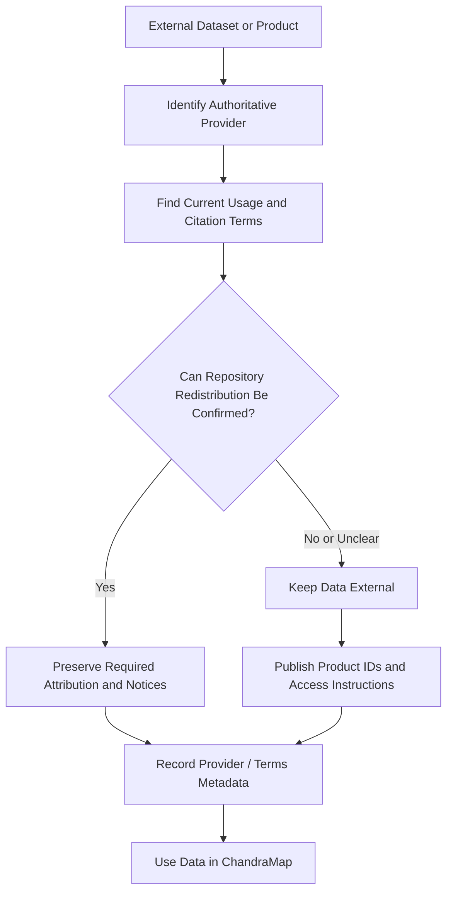
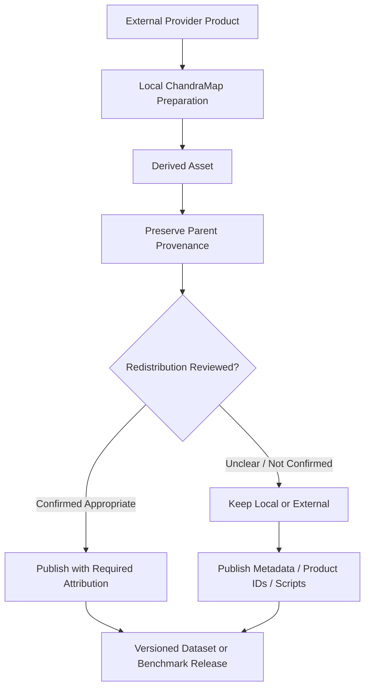

# Data Licenses and Usage

ChandraMap is an open-source research software project that processes scientific data produced by external space missions, agencies, archives, and research organizations.

The fact that ChandraMap's source code is distributed under the repository's software license does **not** mean that external lunar imagery or other scientific datasets automatically receive the same license.

Chandrayaan-2 products, LRO products, future Kaguya/SELENE products, DEMs, third-party annotations, pretrained model assets, and other externally supplied data remain subject to the terms, attribution requirements, citation guidance, access conditions, and redistribution policies of their respective providers.

> **ChandraMap can be open source without owning or relicensing the scientific datasets it processes.**

Contributors must preserve dataset provenance and consult authoritative provider documentation before redistributing external scientific data or derived products.

> **This document is a repository-maintenance and research-data guide, not legal advice. Always consult the authoritative data provider's current terms and citation guidance.**

Provider policies can change. The current provider documentation always takes precedence over summaries in this file.

---

## 1. Scope

This document covers data-use and licensing considerations for:

- external scientific imagery;
- lunar mission products;
- planetary geospatial products;
- Chandrayaan-2 datasets;
- LRO datasets;
- optional/future Kaguya/SELENE datasets;
- DEM/elevation products;
- derived image products;
- crops;
- tiles;
- scale pyramids;
- normalized representations;
- IIRS-derived representations;
- mosaics;
- masks;
- benchmark fixtures;
- benchmark annotations;
- ground truth;
- third-party datasets;
- machine-learning training data;
- externally supplied model/data assets where relevant.

This document does **not**:

- redefine ChandraMap's software license;
- replace official provider terms;
- provide legal advice;
- guarantee redistribution rights;
- define all dependency licenses;
- replace mission-specific data documentation.

---

## 2. Software License vs Data License

The repository's software license and external dataset terms are separate legal and governance concerns.

| Item                                      | Governing Terms                                                                  |
| ----------------------------------------- | -------------------------------------------------------------------------------- |
| ChandraMap source code                    | Root repository [`LICENSE`](../LICENSE)                                          |
| ChandraMap-owned documentation            | Repository licensing setup unless otherwise stated                               |
| ChandraMap-owned scripts/configuration    | Root repository `LICENSE` unless otherwise stated                                |
| Chandrayaan-2 products                    | Current authoritative ISRO / ISSDC / PRADAN terms                                |
| LRO products                              | Current authoritative NASA / PDS / LROC terms applicable to the product/resource |
| Kaguya / SELENE products                  | Current authoritative JAXA/archive terms                                         |
| External DEM/elevation data               | Original provider terms                                                          |
| Third-party benchmark data                | Original provider/license                                                        |
| Third-party annotations                   | Original author/provider terms                                                   |
| Derived mission-data assets               | ChandraMap processing provenance plus applicable upstream obligations            |
| Pretrained model weights                  | Their own model/asset license                                                    |
| Fully ChandraMap-generated synthetic data | Repository-defined terms, subject to any parent-data dependencies                |

The root software license cannot automatically override external provider conditions.

For example:

```text
ChandraMap software
        ↓
governed by repository LICENSE

Chandrayaan-2 / LRO data
        ↓
governed by provider terms
```

These two licensing layers must remain distinct.

---

## 3. Public Availability Is Not the Same as Open-Source Licensing

A dataset being publicly downloadable does not automatically mean:

- it is licensed under ChandraMap's software license;
- it can be mirrored without conditions;
- it can be redistributed through GitHub;
- it can be included in Docker images;
- attribution is optional;
- derived products are automatically unrestricted;
- commercial use is automatically permitted;
- provider citation requirements can be ignored.

Public access and redistribution permission are different concepts.

> **Publicly accessible data should not automatically be treated as freely redistributable data.**

If redistribution rights are unclear, ChandraMap should keep the data external until current provider terms have been verified.

---

## 4. Why Data Licensing Matters

Data licensing affects how ChandraMap can distribute and reproduce research.

It can influence:

- GitHub repository contents;
- GitHub Releases;
- benchmark packages;
- training datasets;
- research publications;
- website demonstrations;
- downloadable examples;
- Docker images;
- data mirrors;
- reference databases;
- public model-training pipelines;
- derived dataset releases.

A technically reproducible dataset package may still be inappropriate to redistribute if the provider's terms have not been verified.

ChandraMap therefore separates:

```text
reproducibility
```

from:

```text
redistribution
```

A benchmark can often remain reproducible through:

- product IDs;
- checksums;
- manifests;
- preparation scripts;
- access instructions;

without bundling the original mission products.

---

## 5. Authoritative Source Principle

For every external dataset, the current authoritative provider documentation takes precedence over this repository guide.

Contributors should identify where applicable:

- provider;
- mission;
- instrument;
- dataset/product;
- archive/resource;
- official access source;
- usage terms;
- citation guidance;
- attribution guidance;
- redistribution conditions;
- relevant restrictions;
- policy version/date where useful.

Do not infer legal terms from:

- file availability;
- search-engine results;
- unofficial mirrors;
- third-party blog posts;
- copied files;
- old repository notes.

When uncertainty exists:

> **Do not redistribute until the current authoritative terms have been verified.**

---

# ChandraMap Repository Licensing

## 6. ChandraMap Code License

ChandraMap's repository-owned software is governed by the root:

- [`LICENSE`](../LICENSE)

This document intentionally does not duplicate the full license text or name its license type.

The root `LICENSE` remains authoritative for repository-owned software.

It may cover repository-owned components such as:

- application code;
- library code;
- scripts;
- build files;
- repository-owned configuration;
- repository-owned software artifacts.

It does **not** automatically relicense third-party scientific datasets.

---

## 7. Repository Documentation

Repository-created documentation is generally handled according to ChandraMap's repository licensing setup unless explicitly stated otherwise.

Examples include:

- architecture documentation;
- dataset documentation;
- sensor documentation;
- contribution guides;
- research notes authored by the project.

Do not interpret this as granting rights over embedded or externally sourced scientific imagery beyond the terms applicable to that imagery.

For example:

```text
Markdown text written by ChandraMap
```

and:

```text
embedded third-party lunar image
```

may have different rights/provenance considerations.

---

# Chandrayaan-2 Data

## 8. Chandrayaan-2 Provider Context

ChandraMap may use products from the Chandrayaan-2 mission.

Relevant instruments include:

- OHRC — Orbiter High Resolution Camera;
- TMC-2 — Terrain Mapping Camera-2;
- IIRS — Imaging Infrared Spectrometer.

Typical ChandraMap role:

> Primary source/query imagery.

Relevant authoritative organizations and resources include:

- ISRO;
- ISSDC;
- PRADAN;
- official Chandrayaan-2 mission documentation;
- official payload documentation;
- official product documentation.

ChandraMap must not invent:

- redistribution rights;
- commercial-use permissions;
- official license classifications;
- attribution wording;
- citation requirements.

Refer to current authoritative provider guidance.

---

## 9. Chandrayaan-2 Data Access

Contributors should obtain Chandrayaan-2 products from official or otherwise authorized mission resources.

Recommended provenance records include:

- mission;
- sensor;
- provider;
- archive/resource;
- official product ID;
- original filename;
- access date where useful;
- checksum where practical.

Avoid treating third-party copies as authoritative unless their provenance and redistribution status are clear.

---

## 10. Chandrayaan-2 Attribution

Chandrayaan-2 products should be attributed according to current official provider guidance.

ChandraMap must not invent a mandatory credit line.

If the official wording is unknown or has not been verified:

> Refer to the current ISRO / ISSDC / PRADAN attribution and citation guidance applicable to the product.

Derived assets should retain enough provenance to recover the original provider and product identity.

---

## 11. Chandrayaan-2 Redistribution

ChandraMap should not assume that full Chandrayaan-2 products can be redistributed through GitHub.

If redistribution permission has not been confirmed:

- do not commit full products;
- do not mirror mission archives;
- do not bundle products into releases;
- provide official product identifiers;
- document the authoritative provider;
- provide access instructions;
- provide checksums where permitted and useful;
- provide preparation scripts.

This approach supports reproducibility while avoiding unsupported redistribution assumptions.

---

## 12. OHRC Data

OHRC imagery is external mission data.

ChandraMap processing does not transfer ownership of OHRC data to the repository.

Possible OHRC-derived assets include:

- geographic crops;
- normalized imagery;
- map-projected derivatives;
- matcher inputs;
- benchmark samples.

Those derivatives remain scientifically linked to the parent OHRC product.

When distributing an OHRC-derived asset:

- preserve parent product identity;
- preserve provider provenance;
- verify applicable upstream terms;
- preserve required attribution.

Do not describe a processed OHRC image as wholly unrelated repository-owned data merely because ChandraMap modified it.

---

## 13. TMC-2 Data

TMC-2 products should follow the same provenance principles.

Derived assets may include:

- crops;
- projected imagery;
- normalized rasters;
- benchmark references;
- structural representations.

Each derivative should remain traceable to:

```text
derived TMC-2 asset
        ↓
parent TMC-2 product
        ↓
authoritative Chandrayaan-2 provider
```

Any redistribution decision should use current official provider terms.

---

## 14. IIRS Data

IIRS requires particular care because ChandraMap may generate several derived representations from one hyperspectral product.

Examples include:

- selected-band images;
- PCA components;
- spectral composites;
- gradient images;
- structural representations.

The transformation:

```text
IIRS hyperspectral product
        ↓
PCA / selected band / composite
        ↓
2D ChandraMap representation
```

does not erase the upstream provenance of the original IIRS data.

A derived IIRS representation should preserve:

- parent product ID;
- provider;
- mission;
- instrument;
- transformation provenance;
- applicable data-use information.

Do not assume a transformed IIRS image can automatically be redistributed without reviewing the upstream terms.

---

# Lunar Reconnaissance Orbiter Data

## 15. LRO Provider Context

ChandraMap uses Lunar Reconnaissance Orbiter data primarily as reference imagery.

Relevant resources include:

- NASA;
- NASA Planetary Data System;
- LROC / Arizona State University;
- official LRO/LROC documentation.

Relevant ChandraMap reference families include:

- LRO NAC;
- LRO WAC.

Do not assume one generic policy necessarily applies identically to:

- every observation;
- every mosaic;
- every hosted derivative;
- every third-party processed product.

Check the actual provider/resource.

---

## 16. LRO NAC

LRO NAC may be used for:

- fine local reference imagery;
- benchmark pairs;
- map-projected reference products;
- tiles;
- scale pyramids.

A NAC product may be referenced through its official product identity while the actual imagery remains external.

Before redistributing:

- full NAC imagery;
- cropped NAC imagery;
- reference tiles;
- pyramids;

verify the current terms applicable to the source/product.

---

## 17. LRO WAC

LRO WAC may be used for:

- broad lunar reference imagery;
- contextual reference;
- regional retrieval;
- WAC mosaics;
- tiles;
- coarse reference pyramids.

A WAC mosaic may combine multiple observations and processing stages.

Its provenance and applicable usage guidance may therefore differ from a single mission observation.

When using a mosaic, preserve:

- mosaic identity/version;
- provider;
- source/resource;
- upstream observations where documented;
- applicable attribution/citation information.

---

## 18. NASA / PDS / LROC Attribution

ChandraMap should not invent mandatory credit text.

Use the official provider's current:

- citation guidance;
- acknowledgment guidance;
- data-use documentation.

Where multiple organizations contribute to a product or hosted resource, preserve the relevant provenance.

Do not reduce:

```text
NASA / PDS / LROC / processing source
```

to an anonymous:

```text
LRO image
```

when more complete attribution information is available.

---

# Optional and Future Data

## 19. Kaguya / SELENE

Kaguya / SELENE datasets may be considered for future cross-mission validation.

Potential source:

- JAXA official mission/archive resources.

Before inclusion, contributors should document:

- provider;
- mission;
- instrument/product;
- official archive;
- current usage terms;
- citation guidance;
- attribution guidance;
- redistribution status.

Do not describe Kaguya/SELENE imagery as already covered by ChandraMap's software license.

Do not imply it is already part of the implemented benchmark unless repository evidence confirms that.

---

## 20. Additional Missions

Before adding another lunar mission or external dataset:

1. identify the authoritative provider;
2. identify the exact product;
3. record the official source;
4. review current data-use conditions;
5. review citation requirements;
6. review redistribution conditions;
7. preserve product identity;
8. determine whether data remains external;
9. update this document or the data-license registry where appropriate.

"Available online" is not sufficient dataset-governance information.

---

# Derived Data

## 21. What Is Derived Data?

Derived data includes assets produced from external scientific products.

Examples include:

- crops;
- tiles;
- scale pyramids;
- map-projected products;
- orthorectified products;
- normalized imagery;
- selected spectral bands;
- PCA representations;
- spectral composites;
- gradient representations;
- edge maps;
- masks;
- mosaics;
- benchmark fixtures;
- descriptors;
- embeddings;
- synthetic augmentations based on real imagery.

Derived data should retain upstream provenance.

---

## 22. Derived Does Not Automatically Mean Unrestricted

> **Transforming external data does not automatically remove upstream data-use or attribution considerations.**

For example:

```text
external image
    ↓
crop
    ↓
downsample
    ↓
normalize
```

still produces an asset derived from the external image.

ChandraMap should not make unsupported claims about whether a particular transformation creates a legally independent work.

Instead:

- preserve upstream attribution;
- preserve provenance;
- verify redistribution terms before release.

---

## 23. Crops

A crop should retain:

- parent product ID;
- provider;
- mission;
- instrument;
- crop bounds;
- processing provenance.

Avoid publishing anonymous files such as:

```text
moon_crop.png
```

without the ability to identify the original source.

If public redistribution is uncertain, publish:

- crop definition;
- parent product ID;
- reconstruction script;

instead of the pixels themselves.

---

## 24. Tiles

A reference tile should retain:

- tile ID;
- parent product/mosaic;
- provider;
- geographic or pixel bounds;
- preparation version;
- applicable attribution.

If tiles are distributed publicly, verify upstream redistribution permission first.

Tiling a product does not automatically remove the provider's data-use considerations.

---

## 25. Scale Pyramids

Downsampled reference levels remain derived from the original mission product.

Each level should preserve:

- parent asset;
- provider;
- product ID;
- level;
- processing provenance.

Do not label a downsampled NAC or WAC pyramid as completely independent ChandraMap source data without reviewing upstream terms.

---

## 26. IIRS-Derived Representations

Derived IIRS assets such as:

- PCA components;
- selected bands;
- spectral composites;
- structural representations;

should preserve:

- parent IIRS product ID;
- provider;
- mission;
- representation method;
- processing provenance;
- upstream attribution information.

The parent-product relationship should remain discoverable through manifests or metadata.

---

## 27. Mosaics

A mosaic may combine:

- multiple mission observations;
- multiple dates;
- multiple products;
- reprojection;
- resampling;
- seam processing;
- third-party processing.

Its provenance may therefore be more complex than a single observation.

A mosaic record should identify where practical:

- mosaic provider;
- source products;
- processing source;
- version;
- upstream attribution/citation information.

Do not assume every mosaic shares identical terms with every source observation.

---

## 28. Masks and Annotations

### Provider-Derived Masks

A mask supplied by or derived directly from an external provider product may retain upstream considerations.

### ChandraMap-Created Masks

A mask generated by ChandraMap may be repository-created, but it should still preserve parent-data provenance.

### ChandraMap-Created Annotations

Ground-truth or check-point annotations may be independently authored by ChandraMap contributors.

However, they remain connected to external imagery through:

- product IDs;
- pixel coordinates;
- pair definitions.

Do not make broad licensing claims about annotation datasets without explicitly choosing and documenting their licensing treatment.

---

# Benchmark Data

## 29. Benchmark Definitions vs Benchmark Images

This distinction is important.

### Benchmark Definition

May contain:

- pair IDs;
- product IDs;
- asset IDs;
- splits;
- coordinates;
- benchmark configuration;
- metadata;
- truth versions.

### Benchmark Imagery

Contains actual scientific pixels from external mission products or derivatives.

These two classes should not automatically receive the same redistribution treatment.

A benchmark can often publish its definitions while requiring users to obtain the underlying mission imagery separately.

---

## 30. Pair Definitions

ChandraMap-created pair definitions may contain repository-authored information such as:

- which source/reference products belong together;
- benchmark category;
- crop definitions;
- scale selections.

The external source/reference imagery remains governed by the original provider terms.

See [`datasets/pair-definition.md`](datasets/pair-definition.md).

---

## 31. Ground Truth and Check Points

Ground-truth/check-point files may have separate authorship from the external imagery.

They should preserve:

- pair ID;
- pair version;
- underlying provider;
- parent product IDs;
- annotation provenance;
- truth version.

Do not infer that the underlying lunar imagery inherits the annotation file's repository licensing treatment.

See [`datasets/ground-truth-preparation.md`](datasets/ground-truth-preparation.md).

---

## 32. Small Benchmark Fixtures

Small real-data fixtures should only be committed when:

- redistribution has been reviewed;
- the source is documented;
- attribution is preserved;
- the fixture is genuinely necessary;
- the file size is appropriate for the repository.

When redistribution is uncertain:

> Prefer a synthetic fixture.

This is especially appropriate for:

- parser tests;
- coordinate tests;
- transform tests;
- CI.

---

## 33. Synthetic Test Data

Fully generated synthetic data may be distinct from mission imagery.

However, distinguish:

### Fully Synthetic

Generated without external mission pixels.

### Augmented External Data

Created by transforming:

- OHRC;
- TMC-2;
- IIRS;
- NAC;
- WAC;

or another external image.

Augmented external imagery retains parent-data provenance and may still involve upstream considerations.

Do not label both categories simply as:

```text
synthetic
```

without clarifying the parent relationship.

---

# Git and Distribution Policy

## 34. What Should Normally Be Stored in Git

| Asset                                                | Normal Repository Treatment |
| ---------------------------------------------------- | --------------------------- |
| Data documentation                                   | Track                       |
| Dataset manifests                                    | Track                       |
| Product IDs                                          | Track                       |
| Checksums                                            | Track                       |
| Download/access instructions                         | Track                       |
| Download scripts                                     | Track                       |
| Preparation scripts                                  | Track                       |
| Dataset configurations                               | Track                       |
| Pair definitions                                     | Track                       |
| Metadata schemas                                     | Track                       |
| Citation information                                 | Track                       |
| Data-license registry                                | Track                       |
| Small fully synthetic fixtures                       | Track                       |
| Small external fixtures with verified redistribution | Track selectively           |
| Large external mission imagery                       | Usually external            |

Git should primarily contain the information required to identify and reproduce scientific data.

---

## 35. What Should Normally Stay Outside Git

Unless redistribution is specifically reviewed and justified, keep the following outside normal Git history:

- full Chandrayaan-2 products;
- full OHRC imagery;
- full TMC-2 imagery;
- full IIRS hyperspectral products;
- full LRO NAC products;
- full LRO WAC products;
- large WAC/NAC mosaics;
- global reference tiles;
- scale-pyramid databases;
- large external DEM collections;
- third-party datasets with unclear terms;
- large generated derivative datasets.

This approach also keeps repository size manageable.

---

## 36. Why Large Data Usually Remains External

Reasons include:

- redistribution uncertainty;
- storage cost;
- Git clone size;
- binary-history growth;
- duplicate copies;
- provider archives remaining authoritative;
- scientific products being recoverable through official identifiers;
- easier policy updates.

A lightweight repository can still be scientifically reproducible.

---

## 37. Git LFS

Git LFS can help manage large binary files.

It does **not** determine whether a file may legally or contractually be redistributed.

Git LFS does not solve:

- attribution requirements;
- redistribution rights;
- provider restrictions;
- citation obligations;
- derivative-data conditions.

> **Permission must exist before distribution, regardless of storage technology.**

Do not add an external product to Git LFS merely because it is too large for ordinary Git.

---

## 38. GitHub Releases

Do not automatically include raw mission data in GitHub release archives.

Before releasing an external or derived dataset through GitHub Releases, verify:

- redistribution permission;
- attribution requirements;
- citation guidance;
- derivative-data considerations;
- third-party notices;
- practical file size.

A software release and a dataset release should be treated as separate distribution decisions.

---

## 39. Docker Images

Do not bake large mission datasets into Docker images by default.

Problems include:

- very large images;
- duplicated data;
- unclear redistribution;
- difficult dataset updates;
- provider policy changes.

Preferred:

```text
Docker application image
        +
mounted external dataset
```

rather than:

```text
Docker application image
containing full lunar archive
```

---

## 40. Website and Demo Assets

If ChandraMap websites, documentation, or demonstrations display external lunar imagery:

- preserve source/provider information;
- follow applicable provider attribution guidance;
- retain underlying product provenance.

A screenshot or resized image does not automatically remove upstream considerations.

Demo assets should remain small and provenance-aware.

---

# Reproducibility Without Redistribution

## 41. Product-ID-Based Reproducibility

A preferred ChandraMap workflow is:

```text
Repository
    ↓
records mission + product ID
    ↓
user retrieves product from authoritative provider
    ↓
checksum verifies expected product
    ↓
preparation script creates ChandraMap derivative
    ↓
benchmark runs reproducibly
```

This approach can provide strong reproducibility without republishing mission archives.

---

## 42. Download Manifests

A dataset download manifest may include:

- mission;
- instrument;
- product ID;
- provider;
- archive/resource;
- expected file name where relevant;
- checksum;
- local logical destination;
- access/citation note.

Do not store:

- credentials;
- passwords;
- private tokens;
- sensitive signed URLs.

---

## 43. Download Scripts

Dataset download tooling should:

- use authoritative or authorized provider resources;
- preserve official product IDs;
- respect provider policies;
- avoid bypassing access controls;
- avoid unauthorized mirroring;
- avoid embedding credentials;
- document failures clearly.

Download automation does not grant additional data rights.

---

## 44. Authentication

If a provider requires authenticated access, users should authenticate through the provider's supported process.

Never commit:

- account passwords;
- API tokens;
- cookies;
- session identifiers;
- private access URLs;
- secret cloud credentials.

This requirement overlaps with repository security practices but is included here because data-access tooling may require credentials.

---

# Attribution

## 45. Attribution Principle

Every external scientific product should remain traceable to at least:

- mission;
- instrument;
- provider/archive;
- product identity.

This is important for:

- scientific reproducibility;
- provider recognition;
- citation;
- data-governance review.

---

## 46. Attribution Metadata

Useful provenance fields may include:

- provider;
- mission;
- instrument;
- product ID;
- source archive;
- provider citation reference;
- access date where useful;
- usage-terms reference;
- attribution note.

These should integrate with the shared metadata system described in [`datasets/metadata.md`](datasets/metadata.md).

Do not manually copy long legal text into every product record when a provider-level record can be referenced reliably.

---

## 47. Attribution in Derived Assets

Derived assets should retain parent relationships.

Examples:

```text
Derived NAC tile
      ↓
Parent NAC product
      ↓
LRO / LROC / PDS provenance
```

and:

```text
Derived IIRS PCA image
      ↓
Parent IIRS product
      ↓
Chandrayaan-2 provider provenance
```

A user should be able to move from a derived asset back to the external source.

---

## 48. Attribution in Figures

Scientific figures containing mission data should follow the provider's current attribution/acknowledgment guidance.

Examples may include:

- match visualizations;
- registered overlays;
- lunar reference crops;
- documentation screenshots;
- paper figures.

Do not invent one universal credit line for all providers.

---

## 49. Attribution in Documentation

General data-license guidance should remain centralized in this file.

Dataset and sensor pages may reference this document rather than repeating long licensing statements.

This reduces:

- inconsistency;
- outdated duplicated text;
- maintenance burden.

---

# Citation

## 50. Dataset Citation vs ChandraMap Citation

These are separate responsibilities.

### ChandraMap Citation

Credits the software/project.

### Dataset Citation

Credits the mission, provider, archive, or scientific data product.

A publication using ChandraMap may need both:

```text
cite ChandraMap
+
cite the scientific datasets
```

depending on provider guidance.

---

## 51. `CITATION.cff`

The repository's [`CITATION.cff`](../CITATION.cff) provides citation information for ChandraMap itself.

It does **not** automatically replace citation requirements associated with:

- ISRO;
- ISSDC;
- PRADAN;
- NASA;
- PDS;
- LROC;
- JAXA;
- other dataset providers.

Researchers should consult provider-specific citation guidance separately.

---

## 52. Scientific Publication Guidance

A scientific publication using ChandraMap should record where relevant:

- ChandraMap version;
- benchmark version;
- dataset version;
- mission;
- instrument;
- provider;
- product IDs;
- truth version;
- relevant provider-required citations.

This improves both attribution and reproducibility.

Do not invent publication references or DOIs when they have not been verified.

---

## 53. Product IDs in Publications

When practical, include actual mission product IDs in:

- papers;
- supplementary material;
- benchmark manifests;
- experiment repositories.

Product IDs allow another researcher to retrieve the same observations rather than guessing which images were used.

---

# Third-Party Data

## 54. Third-Party Dataset Review

Before introducing any external dataset, review:

- authoritative source;
- provider/author;
- license or data-use terms;
- permitted use;
- redistribution conditions;
- derivative-data conditions;
- attribution requirements;
- citation requirements.

A third-party dataset should not enter ChandraMap solely because it is convenient.

---

## 55. Unknown or Missing Terms

If a dataset has no clearly identifiable license or usage policy:

> **Do not assume it is unrestricted or public domain.**

Preferred actions:

- identify the authoritative source;
- review official terms;
- contact the provider when necessary;
- reference the external source rather than redistributing;
- keep the dataset local until the situation is clarified.

---

## 56. Conflicting Terms

If provider terms conflict with ChandraMap's desired distribution model:

- keep the data external;
- provide access instructions;
- configure local paths;
- preserve product IDs;
- do not relicense the data.

Do not attempt to resolve incompatible terms by placing the data under the repository's software license.

---

## 57. User-Contributed Data

Contributors should not submit third-party imagery to a pull request unless its provenance and redistribution status have been reviewed.

A data contribution should identify:

- provider;
- mission;
- instrument/product;
- official source;
- product ID;
- reason for inclusion;
- redistribution status.

"Found online" is not sufficient provenance.

---

# Model Weights and Other Assets

## 58. Model Weights

Third-party pretrained model weights may have licensing terms separate from:

- ChandraMap's code;
- lunar mission data.

If ChandraMap uses third-party weights, record where relevant:

- model source;
- model license;
- model version;
- upstream repository;
- redistribution conditions.

Do not classify model weights as mission data.

---

## 59. Third-Party Software Assets

Libraries and matching systems such as:

- OpenCV;
- FAISS;
- learned local-feature libraries;
- remote-sensing matching implementations;

may have their own software licenses.

This document does not attempt to maintain a complete dependency-license inventory.

Dependency licensing should be handled through the repository's software/dependency governance.

---

# Data-License Registry

## 60. Recommended Registry

ChandraMap should maintain a compact data-license/usage registry as the dataset ecosystem grows.

A conceptual registry could contain:

| Data Family                               | Provider / Authority                              | ChandraMap Role    | Repository Distribution Status                              | Attribution / Citation      | Authority                        |
| ----------------------------------------- | ------------------------------------------------- | ------------------ | ----------------------------------------------------------- | --------------------------- | -------------------------------- |
| Chandrayaan-2 OHRC                        | ISRO / ISSDC / PRADAN                             | Source             | Verify provider terms; prefer external retrieval            | Provider guidance applies   | Official provider documentation  |
| Chandrayaan-2 TMC-2                       | ISRO / ISSDC / PRADAN                             | Source             | Verify provider terms; prefer external retrieval            | Provider guidance applies   | Official provider documentation  |
| Chandrayaan-2 IIRS                        | ISRO / ISSDC / PRADAN                             | Source             | Verify provider terms; preserve provenance                  | Provider guidance applies   | Official provider documentation  |
| LRO NAC                                   | NASA / PDS / LROC                                 | Fine reference     | Follow current provider guidance                            | Provider guidance applies   | Official provider documentation  |
| LRO WAC                                   | NASA / PDS / LROC                                 | Broad reference    | Follow current provider guidance                            | Provider guidance applies   | Official provider documentation  |
| Kaguya / SELENE                           | JAXA / official archive                           | Optional/future    | Verify before inclusion                                     | Provider guidance applies   | Official provider documentation  |
| Fully ChandraMap-generated synthetic data | ChandraMap-generated                              | Tests/augmentation | Repository policy applies, subject to generation provenance | Document generator          | Repository                       |
| Augmented mission imagery                 | Original mission provider + ChandraMap processing | Tests/training     | Upstream review required                                    | Preserve parent attribution | Provider + processing provenance |

This table is intentionally conservative.

It does not declare:

- public-domain status;
- Creative Commons status;
- commercial-use rights;
- unrestricted redistribution.

---

## 61. Registry Status Vocabulary

Repository-maintenance statuses may include concepts such as:

- Verified;
- Review required;
- External-only;
- Redistribution not verified;
- Deprecated.

These are **project workflow statuses**, not legal classifications.

For example:

```text
Redistribution not verified
```

means:

> ChandraMap has not yet recorded sufficient evidence to redistribute the asset.

It does not independently determine the provider's legal terms.

---

## 62. Verification Date

Because provider terms may change, a data-license registry may record:

```text
terms_checked_at
```

and:

```text
terms_source
```

or equivalent fields.

Do not invent verification dates.

Record actual reviews when they occur.

---

# Licensing Metadata

## 63. Per-Dataset Licensing Metadata

A dataset manifest may conceptually include:

- provider;
- source resource;
- usage-terms reference;
- citation reference;
- redistribution status;
- attribution note;
- terms verification status;
- terms checked date where applicable.

The repository does not need to duplicate entire legal policies in each manifest.

---

## 64. Per-Asset Metadata

Many products may share one provider-level usage record.

A useful architecture is:

```text
asset
  ↓
provider / dataset record
  ↓
usage-terms reference
```

rather than copying identical policy text into thousands of tile/product records.

Each asset should still preserve its provider and parent-product provenance.

---

## 65. Preserve Upstream Notices

If a dataset or archive includes:

- README files;
- copyright notices;
- data-use notices;
- citation instructions;
- attribution guidance;
- license documents;

preserve them when relevant to dataset use or redistribution.

Do not intentionally strip provider notices during dataset preparation.

---

# Derived Dataset Releases

## 66. Releasing Derived Data

Before publicly releasing:

- image crops;
- tiles;
- downsampled pyramids;
- projected images;
- IIRS representations;
- mosaics;
- derived benchmark imagery;

review:

1. upstream provider terms;
2. redistribution permission;
3. attribution requirements;
4. citation guidance;
5. derivative-data conditions where documented;
6. third-party processing dependencies.

A technically transformed file is not automatically safe to redistribute.

---

## 67. Metadata-Only Releases

When imagery redistribution is unclear, ChandraMap can publish:

- product IDs;
- pair definitions;
- tile definitions;
- crop coordinates;
- annotations where appropriate;
- checksums;
- manifests;
- preparation scripts;
- benchmark configuration.

Users can then retrieve the original data from the authoritative provider.

This often provides a cleaner reproducibility path.

---

## 68. Benchmark Reproduction Package

A benchmark reproduction package may conceptually contain:

```text
benchmark manifest
+
product IDs
+
truth / check-point definitions
+
preparation configuration
+
data-source instructions
```

without bundling external mission imagery.

This keeps the benchmark scientifically reproducible while respecting external-data distribution boundaries.

---

# Machine Learning Data Use

## 69. Training Data

If ChandraMap uses external lunar imagery to train a learned model, record:

- provider;
- mission;
- sensor;
- product IDs or dataset release;
- preprocessing;
- split;
- training-data provenance;
- applicable provider usage documentation.

Do not claim that a specific provider permits or prohibits a particular machine-learning use without verifying the current provider terms.

---

## 70. Trained Model Distribution

Model-weight distribution may involve licensing considerations separate from direct source-data distribution.

ChandraMap should document:

- training-data provenance;
- model source;
- model license;
- model version.

Do not make unsupported claims that trained weights automatically inherit, or automatically avoid, source-data restrictions.

Case-specific review may be required.

---

## 71. Synthetic Augmentation

Augmentation of external imagery begins with external data.

Examples:

```text
OHRC image
→ rotation
→ augmented OHRC image
```

or:

```text
NAC image
→ contrast change
→ augmented NAC image
```

These assets remain linked to their source products.

Do not automatically classify them as unrestricted repository-owned synthetic data.

---

# Benchmark Publication

## 72. Public Benchmarks

A public benchmark should explain:

- which data ChandraMap redistributes;
- which data users must obtain externally;
- which providers supply the data;
- which pair/truth files are ChandraMap-created;
- which provider terms apply.

This distinction should be visible before users download or redistribute benchmark assets.

---

## 73. Leaderboards and Results

Leaderboard or benchmark-result publication does not replace dataset attribution.

Benchmark pages should continue to reference:

- dataset documentation;
- provider information;
- benchmark version;
- applicable citation guidance.

---

# Data Removal

## 74. Removing Data Because of Licensing Concerns

If a redistributed asset later appears to have unclear or incompatible terms:

1. stop distributing the affected asset in future releases;
2. document the issue;
3. retain non-infringing scientific metadata needed to understand historical experiments;
4. provide authoritative access instructions where appropriate;
5. update the data-license registry;
6. update benchmark packaging.

Do not silently rewrite historical benchmark metadata if earlier results depended on the asset.

---

## 75. Git History

Deleting a file from the current working tree does not necessarily remove it from Git history.

Licensing-related repository cleanup may therefore require maintainer action beyond ordinary file deletion.

Detailed Git-history rewriting procedures are outside the scope of this document.

---

# Versioning and Maintenance

## 76. Updating Data-License Documentation

This file should be reviewed when:

- provider policies change;
- a new mission is added;
- new benchmark data is released;
- redistribution strategy changes;
- a new third-party dataset is introduced;
- model-training datasets change;
- a new hosted mosaic/reference source is added.

Data-license documentation should evolve with the project.

---

## 77. Dataset Version vs Licensing Record

These are separate concepts.

### Dataset Version

Defines:

- which products;
- assets;
- pair definitions;

belong to a scientific dataset release.

### Licensing Record

Describes:

- provider;
- policy source;
- review status;
- redistribution treatment;
- attribution/citation guidance.

A dataset version should reference the relevant data-license records where practical.

---

## 78. Historical Reproducibility

If provider policies change later, historical experiment records should still preserve where available:

- provider;
- mission;
- instrument;
- product ID;
- dataset version;
- benchmark version;
- recorded usage-terms source used at the time.

Do not silently rewrite scientific history.

Changes in redistribution policy do not erase which products were used in historical experiments.

---

# Contributor Workflow

## 79. Adding a New External Dataset

Before adding a new external dataset:

1. **Identify the authoritative provider.**
2. **Identify the exact mission/dataset/product.**
3. **Record the authoritative access resource.**
4. **Review current usage terms.**
5. **Review citation guidance.**
6. **Review attribution guidance.**
7. **Review redistribution conditions.**
8. **Determine whether ChandraMap should keep the data external.**
9. **Record product/provider provenance.**
10. **Update dataset documentation.**
11. **Update the data-license registry where applicable.**
12. **Add preparation/benchmark support only after provenance is clear.**
13. **Review the change before merge.**

Do not treat licensing review as an afterthought after large amounts of data have already been committed.

---

## 80. Adding a Real Data File to Git

Before committing any third-party scientific file, ask:

- Is redistribution permitted?
- Is attribution preserved?
- Is the source authoritative?
- Is the file necessary?
- Can product ID + download instructions reproduce it?
- Can a synthetic fixture replace it?
- Is its provenance recorded?
- Is its file size appropriate?
- Does `.gitignore` intentionally exclude this class of data?
- Does the provider impose additional requirements?

If any answer is unclear, keep the data external until reviewed.

---

## 81. Pull Request Requirements

A pull request adding real external data should identify where applicable:

- provider;
- mission;
- instrument;
- official product ID;
- official source;
- reason for inclusion;
- redistribution review/status;
- attribution/citation guidance;
- file size;
- whether a synthetic alternative was considered.

Unexplained third-party binary assets should not be merged.

---

# Data-License Decision Flow

## 82. External Data Decision Flow



This flow is a repository-governance process.

It does not replace human review of provider terms.

---

## 83. Derived Asset Distribution Flow



Derived-data distribution should not be automated solely from the fact that a file was generated by ChandraMap.

---

# Data Source Summary

## 84. Provider-Specific Summary

| Data Family                               | Provider / Authority                      | Typical ChandraMap Role                 | Repository Policy                                                                          |
| ----------------------------------------- | ----------------------------------------- | --------------------------------------- | ------------------------------------------------------------------------------------------ |
| Chandrayaan-2 OHRC                        | ISRO / ISSDC / PRADAN                     | High-resolution source/query            | Verify current provider terms; prefer external retrieval when redistribution is unverified |
| Chandrayaan-2 TMC-2                       | ISRO / ISSDC / PRADAN                     | Structural source/query                 | Verify current provider terms; preserve product provenance                                 |
| Chandrayaan-2 IIRS                        | ISRO / ISSDC / PRADAN                     | Hyperspectral/cross-modal source        | Verify current provider terms; preserve parent provenance for derived representations      |
| LRO NAC                                   | NASA / PDS / LROC                         | Fine/local reference                    | Follow current provider guidance for the specific product/resource                         |
| LRO WAC                                   | NASA / PDS / LROC                         | Broad/global reference                  | Follow current provider guidance; preserve mosaic/product provenance                       |
| Kaguya / SELENE                           | JAXA / official archive                   | Optional/future reference or validation | Verify current terms before inclusion or redistribution                                    |
| External DEM/elevation data               | Original provider                         | Geometry/elevation support              | Follow provider-specific terms                                                             |
| Fully ChandraMap-generated synthetic data | ChandraMap-generated                      | Testing / controlled experiments        | Document generation and repository policy                                                  |
| Augmented mission imagery                 | Original provider + ChandraMap processing | Training/testing                        | Preserve parent provenance; review upstream terms                                          |

No unsupported license classification is implied by this table.

---

# Common Data-Licensing Mistakes

## 85. Mistakes to Avoid

Do not:

- assume the repository software license applies to external mission imagery;
- describe all publicly available scientific data as "open source";
- assume public download means unrestricted redistribution;
- mirror entire mission archives without reviewing provider terms;
- remove upstream attribution;
- lose original product IDs;
- accept external data with unknown provenance;
- label transformed mission imagery as entirely ChandraMap-owned without review;
- automatically bundle mission imagery into GitHub Releases;
- automatically bake datasets into Docker images;
- assume Git LFS resolves licensing questions;
- invent provider attribution wording;
- invent license identifiers;
- invent provider permissions;
- copy random web imagery into scientific benchmarks;
- redistribute future Kaguya/SELENE data without reviewing JAXA terms;
- treat model weights and mission imagery as the same asset class;
- confuse software citation with data citation;
- assume `CITATION.cff` satisfies dataset citation requirements;
- remove provider notices;
- publish credentials;
- rely indefinitely on outdated provider-policy summaries;
- treat a derived crop as legally independent merely because it was resized;
- publish benchmark imagery when metadata-only reproduction would be sufficient;
- assume one NASA/LRO rule applies identically to every hosted derivative or third-party mosaic.

---

# Limitations

## 86. Data-License Documentation Limitations

### Provider Policies Can Change

A statement that was accurate when reviewed may become outdated.

### Different Products May Have Different Guidance

Products from one mission may be:

- hosted by different resources;
- processed by different organizations;
- distributed with different accompanying documentation.

### Third-Party Hosted Copies Can Differ

A mirror or processed derivative may introduce additional provenance or usage considerations.

### Derived Data Can Require Case-Specific Review

This document cannot determine the legal status of every possible transformation.

### Maintainers Are Not Necessarily Legal Experts

When licensing or redistribution questions are material or unclear, authoritative provider documentation and appropriate expert guidance should be consulted.

### Citation and Licensing Are Different

A dataset may have citation expectations even when access is public.

Citation alone does not necessarily establish redistribution permission.

### Reproducibility Does Not Grant Redistribution Rights

A project can require a dataset for reproducibility without automatically being permitted to redistribute it.

### This Document Is Not a Substitute for Provider Terms

Official provider documentation remains authoritative.

---

# Relationship to Repository Licensing and Documentation

## 87. Relationship to Root [`LICENSE`](../LICENSE)

The root `LICENSE` governs ChandraMap's repository-owned software according to the license text itself.

This file governs repository practice for:

- external scientific data;
- attribution;
- citation;
- data provenance;
- redistribution review.

Do not conflate the two.

---

## 88. Relationship to [`CITATION.cff`](../CITATION.cff)

`CITATION.cff` describes how to cite ChandraMap itself.

This document reminds users that mission/provider datasets may require separate citation or acknowledgment according to their own guidance.

A research paper may therefore need:

```text
ChandraMap citation
+
dataset/provider citation
```

---

## 89. Relationship to [`datasets/README.md`](datasets/README.md)

The dataset README explains:

- what data families ChandraMap uses;
- how datasets fit into the project;
- data governance;
- reproducibility.

This file focuses specifically on:

- external-data licensing;
- attribution;
- citation;
- redistribution;
- provider terms.

---

## 90. Relationship to [`datasets/chandrayaan-2.md`](datasets/chandrayaan-2.md)

The Chandrayaan-2 dataset documentation describes:

- OHRC;
- TMC-2;
- IIRS;
- source-data organization;
- provenance.

This file defines the data-use and attribution principles that apply to those external products.

---

## 91. Relationship to [`datasets/lro.md`](datasets/lro.md)

The LRO dataset documentation describes:

- NAC;
- WAC;
- reference products;
- mosaics;
- tiles;
- pyramids.

This file defines the licensing and redistribution review required for those assets.

---

## 92. Relationship to [`datasets/metadata.md`](datasets/metadata.md)

Dataset metadata should preserve fields such as:

- provider;
- mission;
- instrument;
- product ID;
- source archive;
- usage-terms reference;
- citation reference;
- attribution note.

Licensing provenance should remain machine-readable where practical.

---

## 93. Relationship to [`datasets/data-format.md`](datasets/data-format.md)

Changing data format does not automatically change upstream data terms.

For example:

```text
mission product
→ GeoTIFF
```

or:

```text
mission product
→ PNG crop
```

does not by itself determine new licensing or redistribution rights.

Data representation and data rights are separate concerns.

---

## 94. Relationship to [`datasets/dataset-structure.md`](datasets/dataset-structure.md)

Dataset structure defines where local assets belong.

This file determines how maintainers should reason about whether those assets can be redistributed through the repository.

A file can be correctly placed under:

```text
data/raw/
```

while still being inappropriate to commit to Git.

---

## 95. Relationship to [`datasets/dataset-preparation.md`](datasets/dataset-preparation.md)

Dataset preparation creates:

- projected imagery;
- normalized data;
- masks;
- crops;
- tiles;
- representations.

This document explains why provider provenance and upstream terms remain relevant after those transformations.

---

## 96. Relationship to [`datasets/pair-definition.md`](datasets/pair-definition.md)

Benchmark pair definitions should preserve:

- source product ID;
- reference product ID;
- provider identity;
- asset provenance.

A pair file can normally reference external imagery without duplicating the imagery itself.

---

## 97. Relationship to [`datasets/ground-truth-preparation.md`](datasets/ground-truth-preparation.md)

Ground truth and annotations may be ChandraMap-created while remaining tied to external lunar imagery.

Preserve both:

```text
annotation provenance
```

and:

```text
underlying image provenance
```

They represent different authorship and data-governance layers.

---

## 98. Relationship to Sensor Documentation

Relevant sensor documentation includes:

- [`sensors/overview.md`](sensors/overview.md)
- [`sensors/ohrc.md`](sensors/ohrc.md)
- [`sensors/tmc2.md`](sensors/tmc2.md)
- [`sensors/iirs.md`](sensors/iirs.md)
- [`sensors/lro-nac.md`](sensors/lro-nac.md)
- [`sensors/lro-wac.md`](sensors/lro-wac.md)

Sensor documentation explains:

- what each instrument measures;
- scientific properties;
- registration implications.

This document explains external-data usage responsibilities.

---

## 99. Relationship to [`SECURITY.md`](../SECURITY.md)

Security policy and data licensing are separate concerns.

However, dataset access may involve:

- user accounts;
- API keys;
- tokens;
- private URLs.

Those credentials must never be committed to the repository.

Follow the repository's security practices for secret handling.

---

## 100. Relationship to [`CONTRIBUTING.md`](../CONTRIBUTING.md)

Contributors adding external data should follow both:

- repository contribution requirements;
- the data-review rules in this document.

A pull request adding third-party scientific data should include enough provenance and redistribution information for maintainers to evaluate the contribution.

---

# Authoritative References and Verification Sources

## 101. Chandrayaan-2

Use current authoritative resources such as:

- ISRO Chandrayaan-2 mission documentation;
- ISRO Chandrayaan-2 payload documentation;
- ISRO / ISSDC;
- PRADAN;
- official Chandrayaan-2 data-use documentation;
- official Chandrayaan-2 citation guidance;
- official product documentation.

Do not rely on this repository as the authoritative statement of ISRO/ISSDC/PRADAN policy.

---

## 102. Lunar Reconnaissance Orbiter

Use current authoritative resources such as:

- NASA Lunar Reconnaissance Orbiter documentation;
- NASA Planetary Data System;
- LROC / Arizona State University;
- official LROC data documentation;
- official NAC/WAC product documentation;
- applicable provider citation/acknowledgment guidance.

---

## 103. Kaguya / SELENE

Use current authoritative resources such as:

- JAXA mission documentation;
- official JAXA archive documentation;
- applicable data-use and citation guidance.

Verify terms before incorporating or redistributing future Kaguya/SELENE data.

---

## 104. Repository References

Relevant repository files include:

- [`LICENSE`](../LICENSE)
- [`CITATION.cff`](../CITATION.cff)
- [`CONTRIBUTING.md`](../CONTRIBUTING.md)
- [`SECURITY.md`](../SECURITY.md)

These repository files do not replace external provider terms.

---

# Data Licensing Principles

## 105. Software and Data Licenses Are Separate

The ChandraMap software license does not automatically relicense external scientific imagery.

---

## 106. Provider Terms Are Authoritative

Always defer to current official provider documentation.

---

## 107. Public Access Does Not Automatically Mean Redistribution Rights

Downloading data and republishing data are separate actions.

---

## 108. Never Invent a License

If the terms have not been verified:

> **Mark the dataset for review and keep it external.**

---

## 109. Preserve Product Provenance

Every external and derived asset should remain traceable to:

- provider;
- mission;
- instrument;
- parent product.

---

## 110. Preserve Attribution

Do not strip mission/provider identity from scientific assets.

---

## 111. Derived Data May Still Carry Upstream Considerations

Cropping, resizing, tiling, projection, PCA, normalization, or augmentation does not automatically eliminate upstream obligations.

---

## 112. Prefer Product IDs Over Bundling Raw Data

Product-ID-based reproduction keeps:

- the authoritative archive in control of source data;
- the repository smaller;
- provenance clearer.

---

## 113. Git LFS Is Not a Licensing Solution

Large-file tooling does not create redistribution permission.

---

## 114. Dataset Citation and Software Citation Are Separate

Researchers may need to cite both ChandraMap and the external datasets used.

---

## 115. `CITATION.cff` Does Not Replace Dataset Citations

Provider-specific citation guidance remains separate.

---

## 116. Unknown Terms Require Review

Do not assume that absence of a visible license means unrestricted use.

---

## 117. Third-Party Data Requires Provenance

"Found online" is not sufficient.

---

## 118. Do Not Commit Credentials

Authentication details remain outside source control.

---

## 119. Synthetic and Augmented Data Are Different

Fully generated synthetic data and transformed external imagery have different provenance.

---

## 120. Benchmark Definitions and Benchmark Images Are Different

A benchmark manifest can often be shared even when source imagery remains external.

---

## 121. Preserve Upstream Notices

Relevant provider documentation should not be intentionally removed during preparation.

---

## 122. Do Not Mirror Archives Without Review

Use authoritative mission resources whenever practical.

---

## 123. Maintain Licensing Records

Provider policies may change over the lifetime of the project.

---

## 124. When Uncertain, Do Not Redistribute

> **Keep the data external, preserve product IDs and provenance, and direct users to the authoritative provider until redistribution terms have been verified.**

<!-- Documentation request and supplied data-licenses specification: :contentReference[oaicite:0]{index=0} -->
