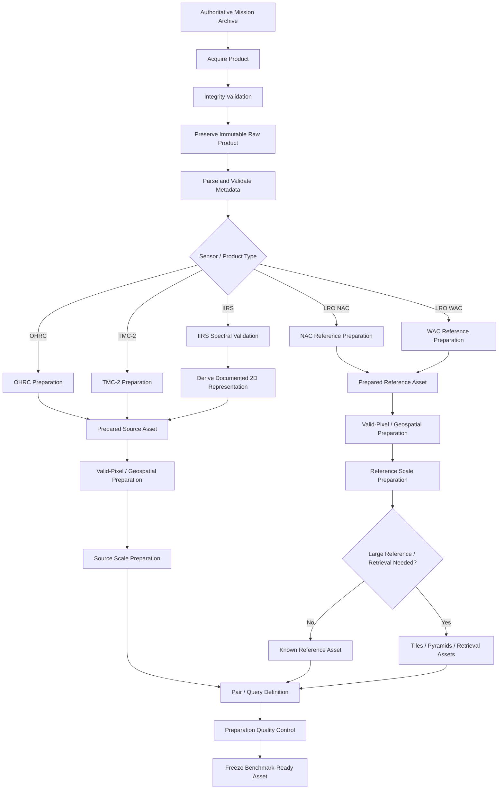
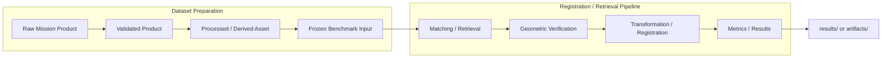

# Dataset Preparation

ChandraMap prepares lunar mission products for reproducible correspondence, registration, retrieval, and benchmarking across sensors with very different physical characteristics.

Preparation is necessary because OHRC, TMC-2, IIRS, LRO NAC, and LRO WAC do not provide interchangeable images. They differ in spatial sampling, modality, spectral response, illumination, projection, viewing geometry, terrain relief, processing state, and available metadata.

Dataset preparation therefore has two responsibilities:

1. preserve the scientific meaning and provenance of the original mission product;
2. produce a validated representation suitable for the specific ChandraMap task.

> **Prepare the data only enough to make a valid comparison; do not manufacture information that the source sensor never measured.**

Original mission products remain immutable. Preparation creates new processed or derived assets rather than rewriting source data.

A reliable preparation workflow should make every algorithm input traceable through:

```text
benchmark-ready asset
        ↓
processed / derived asset
        ↓
raw mission product
        ↓
authoritative provider
```

Preparation should also remain deliberately small during early development. A verified known-overlap pair is more useful than a large uncontrolled lunar archive whose preprocessing, geometry, and evaluation have not yet been validated.

---

## 1. Preparation Goals

The dataset-preparation layer should:

- validate mission products before use;
- preserve authoritative source data;
- preserve product identity and provenance;
- inspect actual data structure rather than assume it;
- extract and validate relevant metadata;
- identify invalid pixels and NoData;
- preserve useful scientific precision;
- route products through sensor-specific preparation;
- handle geospatial information correctly;
- create registration-friendly representations when required;
- make source and reference scales physically comparable;
- prepare reference tiles and pyramids where justified;
- create reproducible benchmark pairs;
- preserve independent evaluation data;
- prevent train/validation/test leakage;
- make every preparation step reproducible;
- produce validated algorithm inputs.

The objective is not to make all lunar images look identical.

The objective is to make them **validly comparable**.

---

## 2. Preparation Stages

A high-level ChandraMap preparation sequence is:

```text
Acquire
   ↓
Validate
   ↓
Inspect
   ↓
Preserve Raw
   ↓
Parse Metadata
   ↓
Sensor-Specific Preparation
   ↓
Geospatial Preparation
   ↓
Representation Preparation
   ↓
Scale Preparation
   ↓
Pair / Reference Preparation
   ↓
Quality Control
   ↓
Freeze Benchmark-Ready Asset
```

### Acquire

Obtain the scientific product from an authoritative source.

### Validate

Confirm that the product is complete, readable, identifiable, and suitable for the intended task.

### Inspect

Determine:

- dimensions;
- numeric type;
- bands;
- projection state;
- metadata;
- NoData;
- processing state.

### Preserve Raw

Store the original mission product unchanged.

### Parse Metadata

Extract product identity, scale, geospatial, acquisition, illumination, viewing, and spectral information where available.

### Sensor-Specific Preparation

Route the product through the preparation path appropriate to OHRC, TMC-2, IIRS, NAC, or WAC.

### Geospatial Preparation

Validate or prepare projection and coordinate context where required.

### Representation Preparation

Create a matcher-compatible representation only when necessary.

### Scale Preparation

Choose or generate physically meaningful source/reference scale relationships.

### Pair / Reference Preparation

Construct a known-overlap pair or retrieval-ready reference dataset.

### Quality Control

Perform scientific, numeric, geospatial, and provenance checks.

### Freeze Benchmark-Ready Asset

Assign stable identity and preparation version before using the asset in controlled evaluation.

---

## 3. Lock the Data Definition Before Coding

Dataset preparation should not begin from assumptions such as:

> "OHRC will probably be a normal TIFF."

or:

> "IIRS is probably already a grayscale image."

or:

> "Every LRO reference probably uses the same projection."

Before implementing preparation logic, determine the actual input definition.

Confirm at minimum:

- exact source mission;
- exact source instrument;
- exact source product;
- exact reference mission/product;
- provider/archive;
- native product structure;
- associated metadata;
- processing state;
- projection state;
- available geolocation;
- GSD or equivalent spatial information;
- evaluation/ground-truth method;
- IIRS delivery structure where applicable;
- coordinate conventions required downstream.

The preparation implementation should follow verified product characteristics.

It should not define them.

---

## 4. Start with a Tiny Real Dataset

The first preparation target should not be an entire lunar archive.

Recommended progression:

1. one real source product;
2. one confirmed overlapping reference;
3. one successfully prepared source/reference pair;
4. one end-to-end registration baseline;
5. several controlled stress pairs;
6. a small reference database;
7. larger-scale retrieval preparation.

Benefits include:

- easier debugging;
- smaller storage requirements;
- quicker iteration;
- clearer preparation ablations;
- easier provenance tracking;
- easier evaluation;
- faster identification of product-format mistakes.

> **One scientifically valid pair is more useful than thousands of unvalidated files.**

---

## 5. Authoritative Data Sources

Preparation should begin from authoritative mission/data-provider resources.

### Chandrayaan-2

Relevant authoritative source categories include:

- ISRO;
- ISSDC;
- PRADAN;
- official Chandrayaan-2 mission documentation;
- official payload/product documentation.

### Lunar Reconnaissance Orbiter

Relevant authoritative source categories include:

- NASA;
- NASA Planetary Data System;
- LROC / Arizona State University;
- official LROC NAC/WAC product documentation.

### Optional Future Datasets

Potential providers include:

- JAXA for Kaguya / SELENE products;
- other official lunar mission archives.

Exact URLs should only be added when verified.

Do not substitute unofficial imagery for authoritative mission products without explicitly documenting why.

---

## 6. Acquisition Checklist

Before accepting a downloaded product, verify where practical:

- [ ] authoritative provider identified;
- [ ] mission identified;
- [ ] sensor/instrument identified;
- [ ] provider product ID recorded;
- [ ] original filename preserved;
- [ ] associated labels/sidecars preserved;
- [ ] source/archive recorded;
- [ ] file size is non-zero;
- [ ] download appears complete;
- [ ] checksum recorded or verified where practical;
- [ ] local ChandraMap asset ID assigned where required.

Acquisition records should make it possible to answer:

> **Where did this exact scientific product come from?**

---

## 7. Download Only What Is Needed First

Avoid collecting a mission-scale dataset before demonstrating a valid local workflow.

A disciplined progression is:

```text
1 source product
        +
1 known-overlap reference
        ↓
working baseline
        ↓
small controlled dataset
        ↓
reference tiles / pyramids
        ↓
larger retrieval dataset
```

This reduces the risk of spending significant time on storage, indexing, and downloading before the fundamental registration problem is measurable.

---

## 8. Preserve the Original Product

The first rule after acquisition is preservation.

Original mission data belongs in the raw-data lifecycle defined in [`dataset-structure.md`](dataset-structure.md).

Preparation should operate through:

```text
raw product
    ↓
interim / processed copy
    ↓
derived representation
```

Never through:

```text
raw product
    ↓
edit in place
```

Do not:

- resize raw data;
- normalize raw data;
- crop away original data;
- rewrite raw metadata;
- overwrite hyperspectral cubes;
- replace a raw reference with tiles;
- delete the original after conversion.

---

## 9. Integrity Validation

A file being readable is not enough to make it scientifically valid.

Initial integrity validation may include:

- file exists;
- file size is plausible/non-zero;
- checksum is valid where available;
- expected sidecar/label files exist;
- container can be opened;
- dimensions can be read;
- product ID can be recovered;
- mission/sensor identity agrees with expectations;
- expected internal structures are accessible.

Preparation should fail clearly if essential product components are missing.

---

## 10. Product Identity Validation

Verify the scientific identity of the product.

Relevant fields include:

- mission;
- provider;
- instrument;
- camera/component;
- product ID;
- product type;
- processing state.

A file located under:

```text
data/raw/chandrayaan2/ohrc/
```

should not automatically be assumed to be OHRC merely because of its directory path.

> **Structure helps organize data; product metadata establishes identity.**

---

## 11. Format Inspection

Before applying scientific preprocessing, inspect the actual product.

Determine where applicable:

- raster dimensions;
- channel count;
- band count;
- axis ordering;
- numeric type;
- numeric range;
- NoData representation;
- valid-pixel mask;
- metadata structure;
- projection;
- coordinate system;
- geotransform;
- processing level/state;
- compression;
- calibration state.

Do not infer scientific structure from:

- filename;
- extension;
- folder name.

Detailed representation conventions belong in [`data-format.md`](data-format.md).

---

## 12. Metadata Extraction

Preparation should extract the metadata required by downstream processing.

Relevant fields may include:

- product ID;
- mission;
- sensor;
- dimensions;
- GSD/pixel scale;
- footprint;
- projection;
- lunar coordinate reference;
- acquisition time;
- Sun/illumination geometry;
- viewing geometry;
- processing state;
- NoData;
- spectral information for IIRS;
- band validity information;
- parent-product provenance.

Detailed metadata meaning and conventions are documented in [`metadata.md`](metadata.md).

---

## 13. Missing Metadata Handling

Missing metadata should remain explicitly missing.

Do not silently invent a scientifically meaningful value.

For example:

```text
GSD unavailable
```

should not become:

```text
GSD = approximate sensor documentation value
```

without being clearly marked as an assumption.

Possible behavior includes:

### Missing GSD

Allowed:

- image-domain processing where appropriate.

Restricted:

- confident metadata-driven physical scale selection;
- precise ground-error conversion.

### Missing Footprint

Allowed:

- manually established known-overlap registration.

Unavailable:

- reliable metadata-constrained geographic reference search.

### Missing Projection

Allowed:

- some image-domain comparisons.

Restricted:

- geospatial localization and projection-dependent ground accuracy.

Preparation should degrade functionality explicitly rather than fabricate metadata.

---

## 14. Data-Type Validation

Inspect the native numeric representation before conversion.

Do not automatically transform every scientific raster into 8-bit data.

Preserve scientific precision during preparation unless a downstream representation explicitly requires conversion.

Potential data categories include:

- integer digital numbers;
- calibrated floating-point values;
- normalized derivatives;
- categorical masks.

Any conversion such as:

```text
float scientific raster
→
uint8 matcher image
```

must be reproducible and recorded.

---

## 15. NoData Handling

NoData must be identified before operations such as:

- statistics;
- histogram calculation;
- normalization;
- feature extraction;
- tiling;
- descriptor generation;
- correspondence;
- metric calculation.

NoData must never be interpreted as valid dark terrain.

For example:

```text
NoData = 0
```

does not mean:

```text
0 = physically dark lunar surface
```

unless the product definition explicitly says so.

---

## 16. Valid-Pixel Masks

A valid-pixel mask may be created or preserved when needed.

The mask should remain associated with:

- parent asset;
- image dimensions;
- coordinate alignment;
- mask meaning;
- preparation version.

Conceptually:

```text
processed asset
        +
valid-pixel mask
```

is preferable to permanently burning invalid regions into the scientific source raster.

A mask convention such as:

```text
1 = valid
0 = invalid
```

must only be assumed if explicitly defined.

---

## 17. Calibration

Calibration is product-specific.

If calibration is required for the selected product type:

- follow official mission/product documentation;
- record the calibration state;
- record processing software and relevant configuration;
- preserve the original product.

Do not invent generic calibration steps.

Do not assume:

> every product requires local calibration.

A distributed product may already be calibrated or otherwise prepared.

Record that state rather than recalibrating blindly.

---

## 18. Map Projection

Projection handling depends on the product.

### Map-Projected Product

Preparation should preserve and validate:

- projection;
- geotransform;
- pixel scale;
- lunar coordinate reference;
- geographic extent;
- NoData.

### Unprojected Product

Determine whether the intended experiment requires projection.

Possible additional requirements may include:

- sensor geometry;
- spacecraft geometry;
- planetary shape model;
- terrain information;
- planetary processing tools.

Do not attach a generic Earth CRS to lunar imagery merely to make geospatial software accept it.

---

## 19. Use Existing Geometry Before Computer Vision

If authoritative product metadata already provides:

- projection;
- footprint;
- geolocation;
- approximate overlap;

use that information.

Avoid requiring a matcher to rediscover known geographic information.

For example:

```text
source footprint
        ↓
reference-footprint intersection
        ↓
candidate reference
        ↓
local image matching
```

is preferable to an unnecessary whole-Moon visual search when reliable coordinates already exist.

---

## 20. Sensor Routing

Sensor-specific preparation should occur before common matching logic.

Conceptually:

```text
Input Product
      ↓
Identify Sensor
      ↓
 ┌────┼────────┐
 │    │        │
OHRC TMC-2    IIRS
 │    │        │
 │    │   spectral preparation
 │    │        │
 └────┴────────┘
      ↓
matcher-compatible representation
```

OHRC, TMC-2, and IIRS should not be forced through one identical preprocessing chain.

---

# OHRC Preparation

## 21. OHRC Preparation Goals

OHRC preparation should preserve the fine lunar structure measured by the instrument while producing a reliable matcher-ready scientific image.

Important preparation concerns include:

- product-specific GSD;
- image validity;
- projection;
- footprint;
- illumination;
- viewing geometry;
- high-frequency terrain detail.

Current project documentation commonly describes OHRC at approximately:

> **~0.25–0.32 m/pixel**

depending on product/documentation.

Actual product metadata remains authoritative.

---

## 22. OHRC Preparation Flow

Conceptually:

```text
OHRC raw product
        ↓
validate product
        ↓
parse metadata
        ↓
product / calibration handling if required
        ↓
projection handling if required
        ↓
valid-pixel mask
        ↓
optional controlled normalization
        ↓
matcher-ready scientific image
        ↓
benchmark pairing
```

Every generated asset should preserve parent-product identity.

---

## 23. OHRC Denoising

Denoising should remain optional.

Strong smoothing may remove precisely the structures useful for high-resolution lunar correspondence, including:

- crater rims;
- small ridges;
- local terrain boundaries;
- fine morphological texture.

A defensible experiment is:

```text
original prepared OHRC
vs.
lightly denoised OHRC
```

using the same:

- reference;
- matcher;
- thresholds;
- evaluation points.

Do not assume denoising improves registration before measuring it.

---

## 24. OHRC Contrast Preparation

Controlled radiometric variants may include:

- raw/prepared intensity;
- robust intensity scaling;
- local contrast normalization.

These may reduce differences in numerical intensity range.

They do not solve:

- different shadow directions;
- different shadow lengths;
- different illuminated slopes.

Therefore:

> **Contrast normalization is not Sun-angle correction.**

---

# TMC-2 Preparation

## 25. TMC-2 Preparation Goals

TMC-2 preparation should preserve medium-scale terrain structure while retaining product geometry and provenance.

Approximate project scale:

> **~5 m/pixel**

Important information may include:

- crater/ridge morphology;
- projection;
- footprint;
- GSD;
- terrain context;
- viewing geometry;
- illumination.

TMC-2 should not be treated simply as:

> OHRC downsampled to lower resolution.

It is a separate instrument and product family.

---

## 26. TMC-2 Preparation Flow

Conceptually:

```text
TMC-2 raw product
        ↓
validate
        ↓
extract metadata
        ↓
product / calibration handling if required
        ↓
projection handling where appropriate
        ↓
valid-pixel mask
        ↓
optional normalization
        ↓
matcher / structural representation
        ↓
source-reference pairing
```

Representation choice should be reproducible and benchmarked.

---

## 27. TMC-2 Terrain / DEM Context

TMC-2 may participate in terrain/stereo-related workflows, but ChandraMap should not assume every TMC-2 image contains DEM information.

If an associated DEM/elevation product is used:

- preserve its product identity;
- preserve its version;
- preserve its provider;
- record how it influenced preparation.

A DEM should not be mandatory for the simple image-registration baseline unless the authoritative version scope explicitly requires it.

---

# IIRS Preparation

## 28. IIRS Requires a Separate Preparation Path

IIRS is an **Imaging Infrared Spectrometer**, not an ordinary grayscale camera.

Current project-level approximations are:

- spatial scale: ~80 m/pixel;
- spectral range: ~0.8–5.0 µm;
- roughly 250–256 bands depending on product/documentation.

Actual product metadata controls processing.

Before preparing IIRS for image matching, determine what the actual product contains.

Possible forms include:

- full hyperspectral cube;
- individual bands;
- band subset;
- calibrated spectral product;
- map-projected product;
- browse image;
- another derived product.

Do not assume.

---

## 29. IIRS Preparation Flow

Conceptually:

```text
IIRS product
      ↓
validate product identity/type
      ↓
inspect spatial + spectral dimensions
      ↓
parse spectral metadata
      ↓
identify documented valid bands
      ↓
preserve original scientific product
      ↓
derive registration-friendly 2D representation
      ↓
optional normalization
      ↓
physical scale preparation
      ↓
reference pairing
```

Conventional 2D matching should happen only after the 2D representation is explicitly defined.

---

## 30. Preserve the IIRS Scientific Product

The full scientific source must remain separate from the registration derivative.

Correct:

```text
IIRS hyperspectral product
       |
       +---------------------+
       |                     |
       v                     v
preserved source        2D registration
                           derivative
```

Incorrect:

```text
IIRS cube
   ↓
PCA image
   ↓
delete cube
```

A PCA image, selected band, structural image, or preview is not equivalent to the original hyperspectral product.

---

## 31. Validate IIRS Dimensions

Before deriving any representation, confirm:

- spatial width;
- spatial height;
- spectral-band count;
- axis ordering;
- numeric type;
- wavelength metadata;
- NoData/invalid values.

Do not assume:

```text
height × width × bands
```

or:

```text
bands × height × width
```

without inspecting the actual product.

An axis-order mistake can mix spatial and spectral information silently.

---

## 32. Validate IIRS Bands

Use authoritative product metadata to identify:

- available bands;
- wavelength centers/ranges where supplied;
- valid/invalid bands;
- documented quality information.

Do not invent:

- "bad bands";
- "best registration wavelength";
- universal band exclusions.

Those decisions must come from product documentation or controlled experiments.

---

## 33. IIRS Single-Band Representation

A selected spectral band can provide a simple registration baseline.

Conceptually:

```text
IIRS cube
    ↓
selected valid band
    ↓
2D registration image
```

Advantages include:

- simple derivation;
- clear provenance;
- easy reproduction.

Limitations include:

- one wavelength may not preserve the most registration-relevant terrain structure;
- radiometric appearance may differ greatly from visible references.

Band choice should be treated as an experimental parameter.

---

## 34. IIRS PCA Representation

PCA is one possible dimensionality-reduction strategy.

Conceptually:

```text
validated IIRS bands
        ↓
preparation / normalization
        ↓
PCA
        ↓
selected component
        ↓
2D representation
```

The following claim should be avoided:

> "The first PCA component is automatically the best registration representation."

That is an empirical question.

Record:

- bands included;
- normalization;
- PCA configuration;
- selected component;
- preparation version.

---

## 35. IIRS Composite Representation

Multiple bands may be combined into a derived representation.

The combination must be documented.

A composite should remain traceable to:

- source product;
- selected bands/wavelengths;
- combination method;
- normalization;
- representation version.

Do not invent a universally optimal spectral combination.

---

## 36. IIRS Structural Representation

Possible experimental IIRS representations include:

- gradients;
- edge maps;
- large structural boundaries;
- other spatial structure-oriented images.

These may reduce dependence on raw spectral intensity in some cross-modal experiments.

They remain experimental until benchmarked.

---

## 37. IIRS Representation Ablation

Representation selection should be tested through controlled ablation.

Keep constant:

- IIRS source product;
- reference product;
- reference scale;
- matcher;
- matcher configuration;
- geometric model;
- evaluation points.

Change only:

```text
IIRS representation
```

For example:

```text
selected band
vs.
PCA component
vs.
composite
vs.
structural representation
```

This isolates the contribution of dataset preparation.

---

# LRO Reference Preparation

## 38. LRO Reference Preparation Goals

LRO preparation should create reusable, geographically meaningful, scale-aware reference assets while preserving exact source-product provenance.

Possible prepared outputs include:

- validated reference images;
- projected references;
- valid-data masks;
- geographic tiles;
- multi-resolution pyramids;
- retrieval descriptors;
- indexes.

Raw LRO products remain preserved separately.

---

## 39. LRO NAC Preparation

Current ChandraMap planning often treats NAC imagery as approximately:

> **~0.5–2 m/pixel**

depending on product and acquisition geometry.

Do not hard-code one value.

A conceptual NAC flow is:

```text
NAC raw product
      ↓
validate
      ↓
parse metadata
      ↓
calibration / product handling if required
      ↓
projection handling where required
      ↓
valid-data mask
      ↓
processed reference
      ↓
tile when required
      ↓
build pyramid when required
```

Not every experiment requires tiling or a pyramid.

---

## 40. LRO WAC Preparation

WAC commonly serves broad/global reference roles.

Do not define one universal WAC GSD.

Conceptually:

```text
WAC product or mosaic
        ↓
validate identity
        ↓
identify observation / mosaic state
        ↓
parse metadata
        ↓
projection handling
        ↓
valid-data preparation
        ↓
broad reference asset
        ↓
geographic tiling if required
        ↓
scale / retrieval preparation if required
```

Preparation depends on the actual product.

---

## 41. Individual Observation vs Mosaic

Preparation must distinguish one observation from a derived mosaic.

### Individual Observation

May have one identifiable:

- acquisition time;
- viewing geometry;
- illumination geometry;
- spacecraft configuration.

### Mosaic

May combine:

- multiple observations;
- different acquisition times;
- reprojection;
- seam selection;
- different illumination conditions;
- different viewing conditions.

This affects:

- provenance;
- interpretation;
- illumination benchmarks;
- geometry assumptions.

Do not treat a mosaic as though it were one raw acquisition.

---

# Scale Preparation

## 42. Scale Must Be Physical

Scale preparation should begin from physical sampling information.

> **Compare information, not pixel count.**

Do not define compatibility by:

```text
resize source and reference
until width × height match
```

Instead use where available:

- source GSD;
- reference GSD;
- effective scale;
- pyramid level;
- product metadata.

Equal image dimensions do not imply equivalent lunar information.

---

## 43. Why Upsampling Is Not the Solution

Upsampling changes array sampling.

It does not create terrain information.

For example:

```text
IIRS
~80 m/px
      ↓
resize to many more pixels
      ↓
still contains original spatial information
```

It does not suddenly reveal:

- new crater rims;
- NAC-scale texture;
- OHRC-scale terrain detail.

> **More pixels do not mean more measured lunar detail.**

---

## 44. Reference Downsampling

When the reference is much finer than the source, downsampling the reference can be the scientifically appropriate choice.

This is particularly relevant to:

- TMC-2 ↔ LRO NAC;
- IIRS ↔ LRO NAC.

Conceptually:

```text
fine NAC reference
        ↓
downsample
        ↓
source-compatible structural scale
        ↓
coarse correspondence
```

This removes reference detail the source could never observe.

---

## 45. Reference Pyramid Preparation

A reference pyramid provides multiple sampling levels.

Conceptually:

```text
Reference Level 0
        ↓
Level 1
        ↓
Level 2
        ↓
Level 3
        ↓
...
```

Each level should record:

- parent reference asset;
- pyramid ID;
- level;
- scale factor;
- dimensions;
- effective GSD;
- resampling method;
- projection;
- footprint;
- checksum/provenance where appropriate.

Exact level ratios belong in configuration, not this document.

---

## 46. Pyramid Quality Validation

Verify:

- dimensions change as expected;
- effective GSD changes consistently;
- parent asset is correct;
- projection remains interpretable;
- NoData remains valid;
- footprint is consistent;
- axis ordering is unchanged;
- resampling method is recorded.

A mislabeled pyramid level can invalidate scale experiments.

---

## 47. Coarse-to-Fine Preparation

A multi-scale workflow may use:

```text
coarse reference level
        ↓
initial correspondence
        ↓
geometric verification
        ↓
finer level
        ↓
refinement
```

Do not automatically continue to the finest available reference level.

Stop refinement when the source no longer contains corresponding physical information.

---

# Radiometric and Structural Preparation

## 48. Radiometric Normalization

Potential controlled normalization methods include:

- robust intensity scaling;
- histogram-based normalization;
- local contrast normalization.

These operations should be:

- reproducible;
- parameterized;
- versioned;
- evaluated.

Do not overwrite the processed scientific image.

Create a derived representation.

---

## 49. Lunar Illumination Limitation

Different Sun geometry can alter:

- shadow direction;
- shadow length;
- illuminated crater rims;
- slope visibility;
- ridge appearance;
- local contrast.

Therefore:

```text
contrast normalization
≠
illumination geometry correction
```

No intensity transformation can simply move a physically displaced shadow back to another observation geometry.

---

## 50. Structural Representations

Research candidates may include:

- gradient magnitude;
- edge maps;
- phase/structure representations;
- crater/ridge-oriented representations;
- other documented structural transforms.

These may help reduce dependence on raw radiometric differences.

They should be evaluated as hypotheses rather than assumed improvements.

---

## 51. Preserve Scientific and Derived Variants

Correct:

```text
processed scientific raster
        +
derived normalized raster
        +
derived gradient raster
```

Incorrect:

```text
processed raster
        ↓
normalize
        ↓
overwrite original
```

Preserving variants enables fair preparation ablation.

---

## 52. Preparation Ablations

Preparation choices should be tested independently.

For example:

```text
same source/reference pair
same matcher
same matcher thresholds
same geometry
same check points

change only:

raw representation
vs.
contrast-normalized
vs.
gradient representation
```

This reveals whether the preparation operation itself contributes to performance.

---

# Reference Tiling

## 53. When Tiling Is Needed

Tiling is useful when:

- reference imagery is large;
- global retrieval is required;
- memory limits make full-reference processing inefficient;
- geographic indexing is required;
- local search needs manageable candidate regions.

A simple known-overlap V1 pair may not require tiling.

Do not add complexity before it is needed.

---

## 54. Tile Preparation

Each tile should preserve:

- tile ID;
- parent product/asset;
- pixel bounds;
- geographic bounds;
- effective GSD;
- projection;
- pyramid level where applicable;
- overlap configuration;
- generation version.

A tile is meaningful only if ChandraMap can map it back to its source product and lunar location.

---

## 55. Tile Overlap

Tile overlap can preserve useful terrain context near boundaries.

Conceptually:

```text
Tile A        Tile B
────────|────────
        ^
    crater crosses boundary
```

Overlap may allow the full structure to remain visible in at least one candidate tile.

The amount should be:

- configuration-driven;
- recorded;
- benchmarked where important.

Do not invent a universal percentage.

---

## 56. Avoid Anonymous Tiles

Avoid:

```text
tile_001.png
tile_002.png
tile_003.png
```

with no external identity.

Every tile should map to:

```text
tile
 ↓
parent reference asset
 ↓
parent mission product
 ↓
lunar location
```

This mapping is essential for retrieval and geolocation.

---

# Known-Location vs Global-Retrieval Preparation

## 57. Known-Location Preparation

If reliable source metadata provides:

- footprint;
- latitude/longitude;
- map projection;
- approximate lunar region;

use it to restrict reference preparation.

Conceptually:

```text
source footprint
       ↓
intersect LRO coverage
       ↓
prepare relevant reference only
       ↓
local matching
```

This should generally be preferred when the metadata is trustworthy.

---

## 58. Unknown-Location Preparation

When location is unknown, unreliable, or deliberately hidden for retrieval evaluation, prepare a larger searchable reference.

Potential components include:

- geographic tiles;
- pyramid levels;
- global descriptors;
- vector index;
- tile-to-geography mapping.

Conceptually:

```text
reference imagery
      ↓
tiles
      ↓
scale levels
      ↓
global descriptors
      ↓
search index
```

---

## 59. Retrieval Preparation Is Separate from Registration Preparation

Global retrieval answers:

> Which lunar region is likely to contain this source?

Local registration answers:

> Which precise points correspond inside this candidate pair?

Therefore the preparation assets differ.

### Retrieval Preparation

May require:

- global descriptors;
- many reference tiles;
- vector index;
- geographic mappings.

### Local Registration Preparation

May require:

- source/reference rasters;
- local matcher-compatible representations;
- masks;
- scale compatibility.

Do not mix the two tasks conceptually.

---

## 60. FAISS Preparation Role

If FAISS is used, the preparation flow is conceptually:

```text
reference tile
      ↓
global descriptor
      ↓
vector
      ↓
FAISS index
```

A separate mapping must preserve:

```text
index entry
      ↓
descriptor
      ↓
tile ID
      ↓
parent product
      ↓
geographic region
```

FAISS does not:

- prepare imagery;
- detect craters;
- estimate correspondences;
- run RANSAC;
- estimate registration transforms.

It searches vectors.

---

# Benchmark Pair Preparation

## 61. Known-Overlap Pair Preparation

Each benchmark pair should identify at minimum:

- pair ID;
- source product ID;
- source asset ID;
- reference product/tile ID;
- source sensor;
- reference sensor;
- source GSD;
- reference GSD/effective scale;
- source/reference projection where relevant;
- confirmed overlap;
- preparation version;
- benchmark category.

Pair definitions should reference canonical assets rather than duplicate large files.

---

## 62. Confirm Real Overlap

Two lunar images can look similar because crater terrain is repetitive.

Do not create a benchmark pair solely because images visually resemble each other.

Verify overlap using where available:

- authoritative geographic metadata;
- footprint intersection;
- mission mapping information;
- independent manual/geographic validation.

A false pair can make every downstream registration result meaningless.

---

## 63. Benchmark Categories

A useful controlled benchmark may contain cases such as:

- known-overlap baseline;
- Sun-angle stress;
- scale stress;
- modality stress;
- geometry stress;
- low-feature terrain;
- repetitive crater terrain.

These categories describe the intended stress condition.

Do not assign fabricated numerical difficulty scores.

---

## 64. Easy Pair Preparation

The first benchmark pair should help verify the full workflow.

Prefer a pair with:

- confirmed overlap;
- valid metadata;
- reasonable image quality;
- understandable projection context;
- enough visible structure for debugging;
- manageable scale difference.

The purpose is not to prove robustness.

The purpose is to verify that the pipeline works correctly.

---

## 65. Sun-Angle Stress Preparation

Where real multi-illumination observations are available, prepare overlapping imagery with meaningful differences in lighting.

Preserve illumination metadata such as:

- acquisition time;
- incidence information;
- phase information;
- available Sun geometry.

Do not replace real Sun-angle evaluation entirely with synthetic brightness adjustments.

---

## 66. Scale Stress Preparation

Scale-stress pairs should preserve explicit physical scale information.

Examples may involve:

- OHRC ↔ NAC;
- TMC-2 ↔ NAC;
- IIRS ↔ NAC.

The reference scale/prepared pyramid level used for the experiment should be recorded.

---

## 67. Modality Stress Preparation

Modality stress is especially relevant for:

```text
IIRS-derived representation
        ↔
visible/panchromatic reference
```

Preparation must freeze:

- source product;
- representation type;
- representation version;
- reference product;
- reference scale.

This prevents representation changes from being hidden inside matcher comparisons.

---

## 68. Geometry Stress Preparation

Geometry-focused pairs may include cases with:

- stronger terrain relief;
- different viewing geometry;
- projection differences;
- spatially varying residual patterns.

Use real products when suitable data exists.

Do not fabricate geometry stress by arbitrary warping and present it as mission geometry.

---

## 69. Low-Feature and Repetitive Terrain

A useful benchmark should not contain only visually distinctive craters.

Include where possible:

### Low-Feature Terrain

Tests whether methods fail gracefully where unique structure is limited.

### Repetitive Crater Terrain

Tests false-correspondence rejection where many local areas appear similar.

Hard cases are part of scientific evidence.

---

# Ground Truth and Check-Point Preparation

## 70. Ground Truth Is Not Matcher Output

Do not transform:

- SIFT match;
- LightGlue match;
- LoFTR correspondence;
- RANSAC inlier;

into:

> **ground truth**

without independent evidence.

Matcher output is algorithm output.

Ground truth requires separate provenance.

---

## 71. Control Points vs Check Points

Preparation should distinguish two roles.

### Control / Tie / Fit Points

Used to estimate the transformation.

### Check Points

Held out for independent evaluation.

Correct concept:

```text
control points
      ↓
fit transform

check points
      ↓
evaluate transform
```

The same points should not be used for both roles when claiming independent accuracy.

---

## 72. Independent Evaluation Points

A useful preference hierarchy is:

1. official/challenge truth where available;
2. independently verified check points;
3. held-out manually validated correspondences.

Every point set should preserve provenance.

Do not hide how evaluation points were created.

---

## 73. Point Coordinate Conventions

Before storing point annotations, define:

- `x/y` meaning;
- row/column relation;
- coordinate origin;
- zero-based vs one-based indexing;
- pixel-center convention.

A correspondence file is ambiguous without these conventions.

Detailed conventions should remain consistent with [`metadata.md`](metadata.md).

---

## 74. Ground Coordinate Preparation

If geographic coordinates are included, preserve:

- lunar coordinate reference;
- map projection where applicable;
- latitude convention;
- longitude convention;
- units;
- datum/reference model where relevant.

Do not store bare latitude/longitude values without coordinate context.

---

# Train / Validation / Test Preparation

## 75. Split Preparation

When learned components are introduced, train/validation/test splits should be scientifically meaningful.

Randomly splitting arbitrary image crops may create severe leakage.

Possible split strategies may use:

- geographic regions;
- parent products;
- acquisition groups;
- source/reference pairs.

The correct strategy depends on the research question.

---

## 76. Geographic Leakage

Neighboring lunar tiles can contain nearly identical terrain.

If one tile enters training and another overlapping tile enters testing, measured generalization may be misleading.

Track:

- footprint;
- region;
- parent product;
- tile lineage;
- overlap information.

Use region-level separation when the experiment claims unseen-geography generalization.

---

## 77. Product Leakage

Avoid derivatives of the same product silently crossing evaluation splits.

Examples include:

- another crop from the same product;
- another pyramid level;
- another normalization;
- overlapping tile;
- augmented copy.

Split preparation should use parent lineage.

---

## 78. Pair Leakage

The same underlying source/reference pair should remain identifiable through a stable pair ID.

Avoid:

```text
pair A crop 1 → training
pair A crop 2 → test
```

when this violates the intended benchmark independence.

Renaming a derivative does not make it an independent sample.

---

# Synthetic Data Preparation

## 79. Synthetic Augmentation Role

Synthetic preparation may be useful for:

- training augmentation;
- robustness experiments;
- controlled ablations;
- debugging.

Potential transformations include:

- rotation;
- scale changes;
- brightness changes;
- contrast changes;
- noise;
- blur;
- cropping;
- controlled occlusion.

Each synthetic transformation should be reproducible.

---

## 80. Synthetic Illumination Caution

A brightness or contrast transformation is not physically equivalent to a real lunar Sun-angle change.

Real illumination affects:

- shadow direction;
- shadow length;
- slope visibility;
- terrain occlusion;
- crater-rim appearance.

Therefore:

```text
synthetic brightness change
≠
real illumination geometry change
```

Synthetic radiometric augmentation can test limited robustness.

It should not substitute for real illumination-stress data.

---

## 81. Label Synthetic Data Explicitly

Every persisted synthetic asset should identify:

- synthetic flag;
- parent asset or generator;
- transformation;
- transformation parameters;
- random seed where relevant;
- generation/preparation version.

Synthetic data should never be anonymously mixed with real mission imagery.

---

# Reproducibility

## 82. Preparation Recipe

Every processed or derived scientific asset should ideally be reproducible from:

```text
parent asset
+
preparation configuration
+
software/version
+
parameters
```

This includes:

- projection;
- normalization;
- IIRS representation;
- tiling;
- pyramid generation;
- descriptor generation.

Undocumented manual editing should not be part of a frozen benchmark.

---

## 83. Preparation Configuration

Preparation parameters should preferably be stored in:

- versioned configuration files;
- preparation-specific configs;
- documented command-line arguments;
- experiment configuration where appropriate.

Avoid scattering scientific assumptions across ad-hoc scripts.

Configuration may include:

- representation selection;
- normalization option;
- tile configuration;
- pyramid configuration;
- mask behavior;
- resampling strategy.

---

## 84. Deterministic Processing

Where practical:

```text
same input
+
same preparation version
+
same configuration
```

should produce:

```text
same prepared scientific asset
```

If random operations are used:

- record the seed;
- record randomization settings;
- preserve the generation version.

---

## 85. Preparation Versioning

Preparation logic will evolve.

Examples include:

- improved masking;
- corrected metadata interpretation;
- new IIRS representation;
- changed normalization;
- corrected projection handling.

Do not silently overwrite frozen benchmark assets when this happens.

Instead:

```text
old preparation version
        +
new preparation version
```

should remain distinguishable.

---

## 86. Dataset Version vs Preparation Version vs Benchmark Version

These versions represent different things.

### Dataset Version

Defines which products/assets belong to a logical dataset.

### Preparation Version

Defines how products were transformed into prepared assets.

### Benchmark Version

Defines:

- pair list;
- split definitions;
- truth/check points;
- evaluation protocol.

### Reference Index Version

May define:

- tile set;
- descriptor model;
- index build;
- geographic mapping.

These should not be collapsed into one ambiguous version identifier.

---

# Preparation Quality Control

## 87. Prepared Asset Quality Checklist

| Check                                    | Expected           |
| ---------------------------------------- | ------------------ |
| Parent asset known                       | Yes                |
| Product identity validated               | Yes                |
| Provider/product ID preserved            | Yes                |
| Source/checksum recorded where practical | Yes                |
| Dimensions correct                       | Yes                |
| Axis order understood                    | Yes                |
| Numeric type expected                    | Yes                |
| NoData handled                           | Yes                |
| Valid-pixel mask aligned                 | When used          |
| Metadata preserved                       | Yes                |
| GSD preserved/derived correctly          | When applicable    |
| Projection preserved                     | When applicable    |
| Output coordinate context valid          | When applicable    |
| Processing configuration recorded        | Yes                |
| No unintended clipping                   | Yes                |
| No unintended lossy conversion           | Yes                |
| Parent lineage complete                  | Yes                |
| Preparation version recorded             | For frozen assets  |
| Synthetic status explicit                | For synthetic data |

---

## 88. Visual Quality Control

Visual inspection can reveal problems such as:

- image flips;
- rotations;
- wrong band;
- incorrect contrast;
- corrupt scaling;
- projection errors;
- unexpected borders;
- NoData leakage;
- clipping;
- incorrect crop.

Visual inspection is valuable for debugging.

It is not a substitute for numerical validation.

---

## 89. Numeric Quality Control

Possible numerical checks include:

- dimensions;
- numeric data type;
- minimum/maximum;
- valid-pixel count/fraction;
- NaN count;
- infinity count;
- histogram summary;
- band count;
- mask dimensions;
- representation dimensions.

Do not introduce arbitrary scientific thresholds without evidence.

---

## 90. Geospatial Quality Control

Where geospatial metadata exists, verify:

- projection;
- geotransform;
- coordinate reference;
- footprint;
- coordinate bounds;
- GSD;
- tile geographic mapping;
- source/reference overlap.

A visually correct image with incorrect map geometry is not a valid geospatial reference.

---

## 91. IIRS Quality Control

IIRS-specific checks should include:

- cube/product structure understood;
- spatial dimensions correct;
- spectral dimension correct;
- axis order correct;
- band count validated;
- wavelength metadata linked;
- selected bands/components recorded;
- invalid-band handling documented;
- output representation dimensions valid;
- parent product ID preserved.

---

## 92. Reference Pyramid Quality Control

Check:

- parent asset;
- level order;
- scale progression;
- effective GSD;
- dimensions;
- resampling method;
- projection;
- NoData;
- footprint;
- parent lineage.

Pyramid levels should not accidentally change:

- orientation;
- projection;
- sensor identity.

---

## 93. Tile Quality Control

Verify:

- parent reference exists;
- pixel crop is correct;
- tile dimensions are valid;
- geographic bounds are correct where available;
- tile is not entirely invalid/NoData;
- overlap configuration is known;
- effective GSD is recorded;
- projection is preserved;
- tile ID is unique.

---

## 94. Pair Quality Control

Before marking a pair benchmark-ready, confirm:

- source is readable;
- reference is readable;
- source identity is correct;
- reference identity is correct;
- overlap is verified;
- source/reference roles are defined;
- scale context is known where required;
- projection context is documented;
- preparation versions are known;
- benchmark category is assigned;
- evaluation/check-point source is known;
- provenance is complete.

---

# Preparation Failure Handling

## 95. Fail Clearly

Preparation should not silently generate questionable scientific data.

Possible preparation failures include:

- unreadable product;
- corrupt file;
- incomplete download;
- unknown mission/sensor;
- missing required sidecar;
- invalid dimensions;
- unknown spectral layout;
- missing required IIRS band metadata;
- projection failure;
- invalid/no valid pixels;
- metadata conflict;
- non-overlapping benchmark pair.

Failures should be recorded with a clear stage and reason.

---

## 96. Partial Preparation

Not every missing field requires total failure.

For example:

### Missing Footprint

May still support:

- manually established known-pair image registration.

May not support:

- metadata-constrained geographic retrieval.

### Missing GSD

May still support:

- exploratory image-space matching.

May restrict:

- scale-aware pyramid selection;
- ground-error conversion.

### Missing Projection

May still support:

- image-domain correspondence.

May prevent:

- defensible lunar coordinate output.

Preparation should explicitly communicate reduced capability.

---

## 97. Quarantine Invalid Products Conceptually

Invalid or scientifically ambiguous products should not enter benchmark-ready datasets until:

- repaired;
- re-downloaded;
- reinterpreted;
- or explicitly documented.

A repository does not need a physical `quarantine/` directory unless its canonical structure chooses one.

The important principle is:

> questionable inputs remain excluded from controlled benchmarks.

---

# Preparation and Git

## 98. What Should Be Committed

Items commonly suitable for Git include:

- preparation documentation;
- preparation scripts;
- configuration;
- manifests;
- checksums;
- benchmark pair definitions;
- tiny test fixtures;
- preparation recipes;
- schema/contract files.

These assets make external scientific data reproducible.

---

## 99. What Should Usually Stay Outside Git

Large/generated data should normally remain outside ordinary Git history, including:

- full raw mission products;
- large processed imagery;
- full IIRS cubes;
- large LRO mosaics;
- large tile collections;
- reference pyramids;
- descriptor databases;
- vector indexes;
- temporary preprocessing files;
- large synthetic datasets.

The repository should track how to reconstruct or identify them.

---

## 100. Git LFS

Git LFS may be useful selectively for:

- small binary test fixtures;
- small controlled examples;
- limited benchmark assets where appropriate.

It should not automatically become the storage system for entire lunar mission archives.

---

# Preparation Automation

## 101. Preparation Scripts

Professional preparation tooling should ideally:

- accept stable product/asset identifiers;
- accept configured paths;
- validate input before processing;
- read versioned configuration;
- leave raw products untouched;
- generate deterministic outputs where practical;
- write or update provenance/manifests;
- log failures clearly;
- avoid hidden manual transformations.

Implementation details belong in code documentation rather than this file.

---

## 102. Idempotent Preparation

Where practical, running preparation repeatedly with identical:

- input;
- configuration;
- preparation version;

should not create inconsistent duplicate assets.

Conceptually:

```text
prepare(asset, config)
        ↓
prepared asset

run again
        ↓
same logical prepared asset
```

The tool may detect an already validated output rather than regenerate it unnecessarily.

---

## 103. Resume Capability

Large preparation tasks may eventually benefit from:

- resumable processing;
- skip-existing validated assets;
- incremental manifest updates;
- incremental indexing.

This can be useful for:

- large tile generation;
- reference pyramids;
- descriptor computation.

It should not become mandatory complexity for V1.

---

## 104. Parallel Preparation

Some tasks may eventually support parallel execution:

- tile generation;
- pyramid generation;
- descriptor extraction;
- reference preprocessing.

Parallelization must not change scientific output or asset identity.

The preparation architecture should remain reproducible regardless of worker count.

Distributed infrastructure is not a V1 requirement.

---

# ChandraMap Version Progression

## 105. V1 Dataset Preparation

V1 should remain intentionally minimal.

Recommended conceptual scope:

- small known-overlap dataset;
- OHRC and/or TMC-2 source;
- LRO NAC reference;
- validated product identity;
- basic metadata preservation;
- projection handling where required;
- valid-data handling;
- simple matcher-ready raster;
- independent check points where possible;
- reproducible preparation;
- no mandatory global lunar database.

Primary purpose:

> **Produce one measurable, reproducible registration baseline.**

Existing V1 scope documentation remains authoritative.

---

## 106. V2 Dataset Preparation

Possible additions include:

- more source products;
- illumination-stress cases;
- scale-stress cases;
- reference pyramids;
- structural representations;
- normalization ablations;
- initial IIRS representation experiments.

V2 should extend the V1 data model rather than replace it.

---

## 107. V3 Dataset Preparation

Possible additions include:

- larger LRO reference tiling;
- WAC broad/global references;
- global descriptors;
- vector indexes;
- unknown-location queries;
- retrieval labels;
- Top-K candidate reference preparation;
- reference-database versioning.

These capabilities should be introduced only after known-pair registration is measurable.

---

## 108. V4 Dataset Preparation

Possible research-grade additions include:

- additional lunar missions;
- Kaguya / SELENE;
- DEM/elevation datasets;
- geometry-aware products;
- lunar-specific learned training datasets;
- larger cross-sensor benchmarks;
- advanced multimodal representations;
- more sophisticated sensor-geometry preparation.

These are conceptual future capabilities, not implementation-status claims.

---

# Practical Preparation Order

## 109. Recommended Build Order

A disciplined ChandraMap preparation workflow is:

1. **Lock the product definitions.**
   Confirm source, reference, formats, metadata, and evaluation method.

2. **Obtain one real source/reference pair.**
   Use a confirmed overlap.

3. **Preserve the raw products.**
   Never modify them in place.

4. **Parse and validate metadata.**
   Confirm sensor, GSD, projection, footprint, and processing state where available.

5. **Validate product geometry.**
   Determine whether products are projected or require further preparation.

6. **Create the minimal sensor-specific representation.**
   Do not add unnecessary preprocessing.

7. **Prepare a physically comparable reference.**
   Use source/reference GSD and pyramid/downsampling where appropriate.

8. **Confirm real geographic overlap.**
   Do not rely only on visual similarity.

9. **Freeze the pair definition.**
   Record preparation versions and asset IDs.

10. **Run a classical baseline.**
    Establish measurable correspondence and registration.

11. **Only then test preprocessing alternatives.**
    Denoising, normalization, structural representations, etc.

12. **Introduce IIRS as a separate sensor path.**
    First validate the spectral product and derive a documented 2D representation.

13. **Add reference tiling/pyramids when justified.**

14. **Add global retrieval only when required by the research question.**

---

## 110. Do Not Prepare the Whole Moon First

A global reference database is not evidence that local registration is correct.

A massive dataset does not prove:

- the source parser is correct;
- GSD interpretation is correct;
- projection is correct;
- correspondences are correct;
- geometric verification works;
- error evaluation is valid.

Preferred progression:

> **Start small. Validate. Measure. Then scale.**

---

# Data Preparation Flow

## 111. End-to-End Preparation Flow



---

## 112. Preparation vs Registration Pipeline

Dataset preparation and registration execution should remain separate.



Preparation creates controlled inputs.

Pipeline execution creates scientific outputs.

Generated results should not silently become preparation inputs.

---

# Relationship to Other Documentation

## 113. Relationship to `README.md`

See [`README.md`](README.md).

The dataset README explains the overall ChandraMap data system, including:

- dataset families;
- governance;
- provenance;
- benchmark concepts;
- storage principles.

This document focuses on:

> **how scientific products become validated algorithm inputs.**

---

## 114. Relationship to `dataset-structure.md`

See [`dataset-structure.md`](dataset-structure.md).

The distinction is:

```text
dataset-structure.md
→ WHERE assets belong

dataset-preparation.md
→ HOW assets are prepared
```

Preparation outputs should follow the lifecycle organization defined by the dataset structure.

---

## 115. Relationship to `metadata.md`

See [`metadata.md`](metadata.md).

Preparation should:

- read metadata;
- preserve provider values;
- normalize metadata where appropriate;
- create lineage metadata;
- preserve units and coordinate conventions.

`metadata.md` defines the meaning and conventions of those fields.

---

## 116. Relationship to `data-format.md`

See [`data-format.md`](data-format.md).

Preparation may require:

- format conversion;
- scientific array conversion;
- raster generation;
- hyperspectral reduction;
- geospatial raster preparation.

Those transformations must follow the scientific representation rules defined in the data-format documentation.

---

## 117. Relationship to `chandrayaan-2.md`

See [`chandrayaan-2.md`](chandrayaan-2.md).

That document describes:

- OHRC;
- TMC-2;
- IIRS;
- source dataset organization;
- mission-specific provenance.

This document defines the preparation workflow applied to those products.

---

## 118. Relationship to `lro.md`

See [`lro.md`](lro.md).

The LRO dataset documentation covers:

- NAC/WAC reference families;
- reference database concepts;
- tiling;
- pyramids;
- indexing.

This document describes the preparation operations that produce those reference assets.

---

## 119. Relationship to Sensor Documentation

Relevant sensor documentation includes:

- [`../sensors/overview.md`](../sensors/overview.md)
- [`../sensors/ohrc.md`](../sensors/ohrc.md)
- [`../sensors/tmc2.md`](../sensors/tmc2.md)
- [`../sensors/iirs.md`](../sensors/iirs.md)
- [`../sensors/lro-nac.md`](../sensors/lro-nac.md)
- [`../sensors/lro-wac.md`](../sensors/lro-wac.md)

The distinction is:

```text
sensor documentation
→ WHY sensor-specific handling is required

dataset-preparation.md
→ HOW those differences affect preparation
```

---

## 120. Relationship to Architecture Documentation

Relevant architecture documentation includes:

- [`../architecture/system-overview.md`](../architecture/system-overview.md)
- [`../architecture/v1-pipeline.md`](../architecture/v1-pipeline.md)
- [`../architecture/core-engine-architecture.md`](../architecture/core-engine-architecture.md)
- [`../architecture/backend-architecture.md`](../architecture/backend-architecture.md)
- [`../architecture/module-map.md`](../architecture/module-map.md)
- [`../architecture/data-flow.md`](../architecture/data-flow.md)
- [`../architecture/output-flow.md`](../architecture/output-flow.md)

Prepared dataset assets become inputs to architectural stages such as:

```text
reference selection
→ matching
→ geometric verification
→ refinement
→ registration
→ evaluation
```

Preparation should not hide scientific transformations inside pipeline execution.

---

## 121. Relationship to Benchmark Infrastructure

ChandraMap uses a dedicated root-level benchmark concern.

Dataset preparation should produce:

- validated assets;
- stable asset IDs;
- preparation versions;
- check-point/ground-truth assets.

Benchmark definitions should reference these assets.

Do not create a second independent benchmark architecture under the data directory unless repository design explicitly changes.

---

## 122. Relationship to Results

Prepared data is input.

Results are output.

Keep:

```text
data/
```

separate from:

```text
results/
```

A generated registered image should not automatically become a scientific reference.

Promotion into a dataset requires:

- validation;
- lineage;
- stable identity;
- dataset/benchmark versioning.

---

## 123. Relationship to Experiments

Experiments may choose:

- source/reference pair;
- IIRS representation;
- normalization variant;
- pyramid level;
- matcher configuration.

Experiments should not mutate canonical prepared assets.

Instead:

```text
experiment
→ references prepared asset IDs
```

This makes comparisons reproducible.

---

## 124. Relationship to Configuration

Preparation choices such as:

- normalization;
- representation method;
- resampling;
- tiling;
- overlap;
- pyramid generation;
- mask behavior;

should preferably be configurable and versioned.

Avoid hidden scientific assumptions spread across multiple scripts.

---

# Limitations

## 125. Dataset Preparation Limitations

### Product Formats May Differ

Different missions and product types may require different readers and preparation logic.

### Metadata Availability Varies

Not every product contains every field needed for ideal scale or geographic reasoning.

### Specialized Planetary Tools May Be Required

Some projection or geometry operations may need planetary-processing software.

### Calibration Is Product-Specific

No universal calibration workflow applies to all ChandraMap inputs.

### IIRS 2D Conversion Loses or Compresses Spectral Information

A registration image cannot preserve the complete hyperspectral cube.

### Illumination Normalization Is Limited

Intensity transformations cannot reverse physical shadow geometry.

### Reference Resampling Changes Sampling

Downsampling changes the representation of reference data.

It does not change what the source sensor originally measured.

### Large Datasets Require Storage

Tiles, pyramids, hyperspectral cubes, descriptors, and indexes can consume significant space.

### Independent Ground Truth May Be Limited

Manual or expert validation may be required for some experiments.

### Early Research May Include Manual Preparation

Manual inspection is acceptable when documented, but hidden manual editing is not reproducible.

### Preprocessing Can Introduce Bias

A representation may favor one matcher or sensor pair.

Preparation choices therefore require ablation.

### Missing Spatial Information Cannot Be Recovered

No preparation technique can create genuine terrain measurements that the sensor never resolved.

---

# Common Preparation Mistakes

## 126. Dataset Preparation Mistakes to Avoid

Do not:

- modify raw mission products in place;
- delete original provider metadata;
- assume every product has the same native format;
- trust directory names instead of product metadata;
- treat OHRC, TMC-2, and IIRS identically;
- treat IIRS as ordinary grayscale imagery;
- use an IIRS browse product unknowingly as scientific truth;
- overwrite an IIRS cube with a selected band or PCA image;
- invent invalid/bad IIRS bands;
- upscale IIRS and claim recovered high-resolution terrain;
- match sensors only because resized image dimensions are equal;
- ignore GSD;
- ignore projection;
- ignore lunar coordinate conventions;
- ignore NoData;
- include NoData in normalization statistics;
- normalize images without recording the method;
- assume contrast normalization solves Sun-angle differences;
- over-denoise OHRC fine structure;
- create PCA representations without provenance;
- assume the first PCA component is automatically best;
- create tiles without parent product identity;
- create pyramid levels without effective GSD;
- create indexes without descriptor-to-tile mappings;
- mix real and synthetic data without labels;
- allow geographic/product/pair leakage across evaluation splits;
- call matcher-generated correspondences ground truth;
- call RANSAC inliers independent truth;
- evaluate only on the points used to fit the transform;
- prepare a whole-Moon retrieval system before one pair works;
- silently overwrite benchmark assets after changing preparation logic;
- commit huge prepared datasets into ordinary Git history;
- place result imagery back into canonical source folders;
- hide manual preparation steps;
- report geographic accuracy when projection/geolocation is unsupported.

---

## Dataset Preparation Principles

### Preserve the Mission Product

Raw scientific data remains immutable.

### Validate Before Transforming

Do not build downstream representations from unidentified or scientifically ambiguous products.

### Product Metadata Is Authoritative

Approximate documentation values never override real product metadata.

### Route by Sensor First

OHRC, TMC-2, and IIRS require different preparation paths.

### IIRS Requires Spectral Interpretation

A documented 2D representation must be created before ordinary image matching.

### Preserve Spectral Provenance

Every IIRS-derived representation must remain traceable to bands/components and the parent product.

### NoData Is Not Lunar Terrain

Mask invalid pixels before statistics, feature extraction, or matching.

### Use Existing Geometry

Reliable footprints, projections, and geolocation should constrain search where possible.

### Compare Physical Scale

GSD and information content matter more than equal pixel dimensions.

### Upsampling Does Not Recover Detail

Interpolation cannot reconstruct terrain the sensor never measured.

### Downsample Fine References When Appropriate

Fine NAC data may need to be reduced to a scale supported by TMC-2 or IIRS.

### Illumination Normalization Has Limits

Radiometric adjustment cannot move physical shadows.

### Preparation Changes Must Be Measured

Keep preprocessing changes only when controlled benchmark evidence justifies them.

### Global Retrieval Is Optional

Known-overlap registration does not require a global lunar index.

### Tiles Require Geographic Provenance

A tile without a parent product and location mapping is incomplete.

### Pyramids Require Scale Provenance

Every level needs a known physical relationship to its parent.

### Ground Truth Is Independent

Algorithm output is not automatically truth.

### Check Points Stay Independent

Do not use evaluation points to fit the transformation they evaluate.

### Prevent Leakage

Track products, geography, pair lineage, and synthetic derivatives.

### Preparation Is Versioned

Frozen benchmark inputs should never change silently.

### Start Small

> **A validated, reproducible source/reference pair is the foundation of ChandraMap dataset preparation. Scale to larger lunar datasets only after that foundation is measurable and correct.**

<!-- Documentation request and supplied dataset-preparation specification: :contentReference[oaicite:0]{index=0} -->
