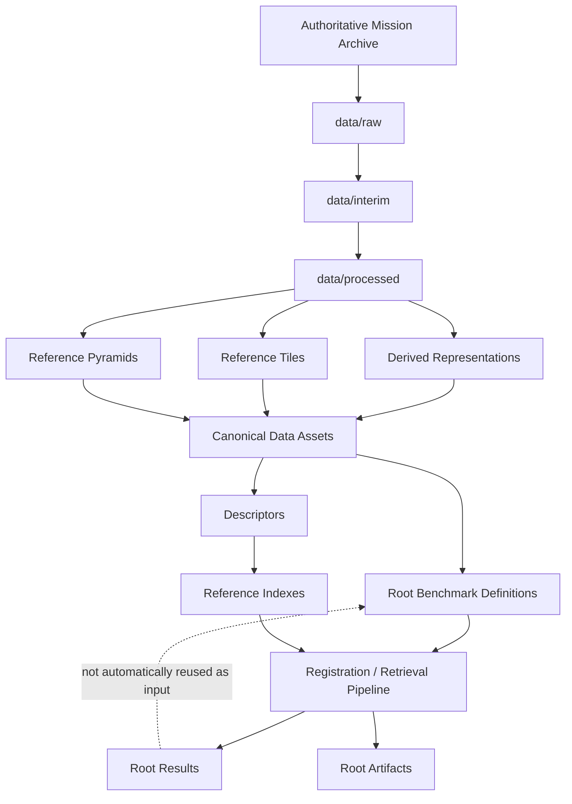
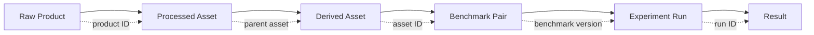

# Dataset Structure

ChandraMap organizes lunar datasets by **data lifecycle, mission, instrument, derived purpose, benchmark identity, and provenance** rather than as an unstructured collection of image files.

This separation is important because the project works with scientific products from multiple missions and sensors whose files may differ in spatial resolution, modality, projection, spectral structure, processing state, and acquisition geometry. An OHRC product, an IIRS hyperspectral cube, an LRO NAC reference tile, a pyramid level, a FAISS index, and a registered preview are not equivalent kinds of data and should not be stored as though they were.

A professional dataset structure must make it immediately clear whether an asset is:

- an original mission product;
- a temporary processing artifact;
- a processed scientific asset;
- a derived representation;
- a benchmark definition;
- a generated cache;
- an experiment result;
- a visualization artifact.

> **Raw mission products are immutable; every processed or derived asset must remain traceable to its source.**

The ChandraMap repository also already separates major concerns at the root level through areas such as `data/`, `benchmarks/`, `experiments/`, `results/`, and `artifacts/`. This document therefore avoids creating competing copies such as `data/results/` or a second independent benchmark system under `data/`.

Where the repository's actual canonical structure differs from an illustrative tree in this document, the **repository structure is authoritative**.

---

## 1. Design Goals

The dataset structure should be:

### Predictable

A contributor should be able to determine where a new file belongs without creating an arbitrary folder.

### Reproducible

Every benchmark input should be recoverable from identifiable source products and documented transformations.

### Sensor-Aware

OHRC, TMC-2, IIRS, LRO NAC, and LRO WAC should remain distinguishable.

### Mission-Aware

Mission provenance should remain visible in the hierarchy and manifests.

### Lifecycle-Aware

The structure must distinguish:

```text
raw
interim
processed
derived
```

rather than mixing them in one sensor directory.

### Scalable

The same principles should work for:

- one known-overlap V1 pair;
- larger V2 stress datasets;
- V3 tile/retrieval databases;
- V4 multi-mission research datasets.

### Git-Friendly

Large mission products and generated indexes should normally remain outside ordinary Git history.

### Benchmark-Friendly

Frozen benchmark definitions should reference stable assets rather than duplicate them.

### Machine-Readable

Manifests and identifiers should allow tools to find assets without scanning arbitrary folders.

### Human-Readable

The hierarchy should still make sense to a new contributor inspecting it directly.

### Compatible with External Storage

The logical structure should remain usable whether physical data lives on:

- a local disk;
- an external SSD;
- network storage;
- a research server;
- object storage.

---

## 2. High-Level Dataset Lifecycle

ChandraMap follows the conceptual lifecycle:

```text
Raw
 ↓
Interim
 ↓
Processed
 ↓
Derived
 ↓
Benchmark Definition
 ↓
Experiment
 ↓
Result
```

The flow is intentionally directional.

A registration result should **not** automatically flow back into the scientific input dataset.

For example:

```text
registered_output.tif
```

must not silently become a new benchmark reference merely because it looks aligned.

If a generated asset is intentionally promoted into a future benchmark, that requires an explicit process:

```text
experimental derived asset
        ↓
validation
        ↓
stable asset identity
        ↓
recorded provenance
        ↓
new dataset / benchmark version
```

Results become inputs only through deliberate dataset versioning.

---

## 3. Canonical Repository-Aware Dataset Model

ChandraMap already separates major research concerns at the repository root. The recommended organization should therefore preserve that separation.

A repository-aware structure is conceptually:

```text
ChandraMap/
│
├── data/
│   ├── README.md
│   │
│   ├── raw/
│   │   ├── chandrayaan2/
│   │   │   ├── ohrc/
│   │   │   ├── tmc2/
│   │   │   └── iirs/
│   │   │
│   │   ├── lro/
│   │   │   ├── nac/
│   │   │   └── wac/
│   │   │
│   │   └── kaguya/
│   │       └── terrain_camera/
│   │
│   ├── interim/
│   │   ├── chandrayaan2/
│   │   │   ├── ohrc/
│   │   │   ├── tmc2/
│   │   │   └── iirs/
│   │   │
│   │   └── lro/
│   │       ├── nac/
│   │       └── wac/
│   │
│   ├── processed/
│   │   ├── chandrayaan2/
│   │   │   ├── ohrc/
│   │   │   ├── tmc2/
│   │   │   └── iirs/
│   │   │
│   │   └── lro/
│   │       ├── nac/
│   │       └── wac/
│   │
│   ├── derived/
│   │   ├── representations/
│   │   │   ├── iirs/
│   │   │   ├── gradients/
│   │   │   ├── edges/
│   │   │   └── normalized/
│   │   │
│   │   ├── tiles/
│   │   │   ├── nac/
│   │   │   └── wac/
│   │   │
│   │   ├── pyramids/
│   │   │   ├── nac/
│   │   │   └── wac/
│   │   │
│   │   ├── descriptors/
│   │   │   ├── global/
│   │   │   └── local/
│   │   │
│   │   ├── indexes/
│   │   └── synthetic/
│   │
│   ├── manifests/
│   │   ├── products/
│   │   ├── tiles/
│   │   ├── representations/
│   │   └── datasets/
│   │
│   └── fixtures/
│       ├── unit/
│       └── integration/
│
├── benchmarks/
│   ├── pairs/
│   ├── splits/
│   ├── annotations/
│   ├── check_points/
│   ├── ground_truth/
│   └── manifests/
│
├── experiments/
│   └── ...
│
├── results/
│   └── ...
│
└── artifacts/
    └── ...
```

The important separation is:

| Area           | Responsibility                                                          |
| -------------- | ----------------------------------------------------------------------- |
| `data/`        | Canonical scientific assets and their derived reusable forms            |
| `benchmarks/`  | Frozen benchmark definitions and evaluation assets                      |
| `experiments/` | Experiment configurations, research runs, and experiment-specific logic |
| `results/`     | Scientific run outputs and metrics                                      |
| `artifacts/`   | Generated reports, visualizations, exported demos, presentation assets  |
| cache location | Regenerable implementation/runtime caches                               |

This avoids duplicate ownership.

> If the actual repository defines different canonical paths, follow the repository instead of creating a second architecture from this document.

---

## 4. Why Lifecycle Comes Before Mission

A weak structure might look like:

```text
data/
├── ohrc/
├── tmc2/
├── iirs/
├── nac/
└── wac/
```

This tells the user which sensor produced a file, but not whether the file is:

- original;
- projected;
- normalized;
- tiled;
- resampled;
- generated.

A stronger hierarchy begins with lifecycle:

```text
data/
├── raw/
├── interim/
├── processed/
└── derived/
```

and then organizes within each stage by:

```text
mission
   ↓
instrument
```

For example:

```text
data/raw/chandrayaan2/ohrc/
```

immediately communicates:

- lifecycle: raw;
- mission: Chandrayaan-2;
- instrument: OHRC.

That information is much harder to infer from:

```text
data/ohrc/final_image.tif
```

---

## 5. Source Data vs Reference Data

ChandraMap commonly uses the following experiment roles.

### Source Data

Typical source instruments:

- Chandrayaan-2 OHRC;
- Chandrayaan-2 TMC-2;
- Chandrayaan-2 IIRS.

These commonly represent the image ChandraMap attempts to locate or register.

### Reference Data

Typical reference datasets:

- LRO NAC;
- LRO WAC.

These commonly provide:

- candidate regions;
- geographic context;
- local registration targets;
- high-resolution reference imagery.

The filesystem should preserve **mission and instrument identity** rather than creating permanent `source/` and `reference/` copies of the same data.

This matters because source/reference are experiment roles.

A research experiment may reverse them.

Prefer:

```text
data/raw/chandrayaan2/ohrc/
data/raw/lro/nac/
```

with benchmark metadata stating:

```text
source = OHRC asset
reference = NAC asset
```

instead of duplicating products under separate source/reference folders.

---

## 6. `data/raw/`

`raw/` contains original scientific products obtained from authoritative providers.

Examples of provider categories include:

- ISRO;
- ISSDC;
- PRADAN;
- NASA;
- NASA Planetary Data System;
- LROC / Arizona State University;
- JAXA where applicable.

The raw layer is the most important preservation boundary in the dataset architecture.

### Raw Rules

Raw products should be:

- immutable;
- unnormalized;
- uncropped;
- unresampled;
- unwarped;
- preserved with associated metadata;
- traceable to an official product identifier.

Do not:

- modify the original raster in place;
- overwrite mission products;
- replace an IIRS cube with a 2D image;
- replace a NAC product with a tile;
- rename away provider identity without preserving it elsewhere.

---

## 7. Raw Chandrayaan-2 Organization

Conceptually:

```text
data/raw/chandrayaan2/
├── ohrc/
├── tmc2/
└── iirs/
```

### `ohrc/`

Contains authoritative OHRC products.

Project documentation commonly treats OHRC as approximately:

> ~0.25–0.32 m/pixel, product/documentation-dependent.

Actual product metadata is authoritative.

### `tmc2/`

Contains authoritative Terrain Mapping Camera-2 products.

Approximate project scale:

> ~5 m/pixel.

### `iirs/`

Contains authoritative IIRS scientific products.

Approximate project context:

- ~80 m/pixel spatial scale;
- ~0.8–5.0 µm spectral range;
- roughly ~250–256 bands depending on product/documentation.

IIRS raw data must not contain only PCA/selected-band derivatives in place of the original spectral product.

---

## 8. Raw LRO Organization

Conceptually:

```text
data/raw/lro/
├── nac/
└── wac/
```

### `nac/`

Contains authoritative LRO/LROC NAC products.

Current ChandraMap planning often uses approximately:

> ~0.5–2 m/pixel

depending on product and acquisition geometry.

### `wac/`

Contains authoritative LRO/LROC WAC products.

Do not assume one universal WAC GSD.

Actual product/mode metadata is authoritative.

---

## 9. Raw Product Sidecars

Scientific products may depend on logically associated files such as:

- labels;
- metadata files;
- auxiliary geometry;
- calibration information;
- provider documentation references.

These should remain associated with the corresponding product.

Conceptually:

```text
raw/
└── chandrayaan2/
    └── ohrc/
        └── PRODUCT_ID_FROM_PROVIDER/
            ├── original_product_file
            └── associated_metadata_or_sidecar_files
```

The names above are placeholders.

Do not invent mission-specific extensions.

The principle is:

> Do not separate a scientific raster from the files required to interpret it correctly.

---

## 10. Read-Only Raw Storage

`raw/` should be treated as logically read-only.

This does not require operating-system-level permissions, although environments may enforce them if useful.

The architectural rule is sufficient:

```text
raw asset
→ read
→ derive new asset elsewhere
```

Never:

```text
raw asset
→ modify
→ overwrite raw asset
```

---

## 11. `data/interim/`

`interim/` contains temporary or transitional scientific products created during preparation.

Possible examples include:

- decompressed working files;
- temporary format conversions;
- calibration intermediates;
- map-projection intermediates;
- orthorectification intermediates;
- temporary masks;
- conversion-stage outputs.

Conceptually:

```text
data/interim/
├── chandrayaan2/
│   ├── ohrc/
│   ├── tmc2/
│   └── iirs/
└── lro/
    ├── nac/
    └── wac/
```

Interim data is:

- derived from raw data;
- reproducible;
- potentially disposable;
- not authoritative source truth.

---

## 12. When to Retain Interim Data

Not every temporary processing file needs permanent storage.

Retention depends on:

- generation cost;
- debugging value;
- storage cost;
- external tool behavior;
- reproducibility requirements.

A useful rule is:

```text
cheap to regenerate
→ usually disposable

expensive or difficult to regenerate
→ may be retained with provenance
```

The source raw product and processing recipe should remain sufficient to rebuild the intermediate whenever practical.

---

## 13. `data/processed/`

`processed/` contains scientific observations prepared for direct algorithmic use while preserving their underlying scientific meaning.

Examples include:

- validated rasters;
- calibrated images;
- projected images;
- valid-data-masked products;
- registration-ready full images;
- prepared hyperspectral cubes.

Conceptually:

```text
data/processed/
├── chandrayaan2/
│   ├── ohrc/
│   ├── tmc2/
│   └── iirs/
└── lro/
    ├── nac/
    └── wac/
```

Processed assets should retain:

- parent product identity;
- GSD;
- projection where applicable;
- processing configuration;
- software/tool version where relevant;
- checksum where useful.

---

## 14. Processed vs Derived

This distinction should remain clear.

### Processed

A prepared form of the **same scientific observation**.

Examples:

```text
raw NAC
→ calibrated/projected NAC
```

```text
raw IIRS cube
→ calibrated/validated IIRS cube
```

### Derived

A new representation, subdivision, or computed artifact generated from the observation.

Examples:

```text
processed NAC
→ NAC tile
```

```text
processed NAC
→ NAC pyramid level
```

```text
processed IIRS cube
→ PCA registration image
```

```text
processed raster
→ global descriptor
```

A useful summary:

| Asset                    | Lifecycle |
| ------------------------ | --------- |
| Projected NAC image      | Processed |
| NAC tile                 | Derived   |
| Validated IIRS cube      | Processed |
| IIRS selected-band image | Derived   |
| IIRS PCA component       | Derived   |
| Global descriptor        | Derived   |
| FAISS index              | Derived   |

---

## 15. `data/derived/`

`derived/` contains reusable assets created from processed or raw scientific data for algorithmic purposes.

Possible groups include:

```text
data/derived/
├── representations/
├── tiles/
├── pyramids/
├── descriptors/
├── indexes/
└── synthetic/
```

Derived data must always retain parent provenance.

Conceptually:

```text
derived_asset.parent_id
→ canonical parent asset
```

An anonymous derived file should not enter a scientific benchmark.

---

## 16. `derived/representations/`

This area stores alternate representations created for matching or research.

Possible categories include:

- IIRS selected-band imagery;
- IIRS PCA components;
- spectral composites;
- gradient representations;
- edge maps;
- normalized structural images.

Conceptually:

```text
data/derived/representations/
├── iirs/
├── gradients/
├── edges/
└── normalized/
```

These assets are not original observations.

Their purpose should be explicit.

---

## 17. IIRS Representation Structure

A useful conceptual organization is:

```text
data/derived/representations/iirs/
└── PRODUCT_ID_FROM_PROVIDER/
    ├── selected_band/
    ├── pca/
    ├── composite/
    └── structural/
```

This naming is illustrative rather than mandatory.

Every IIRS representation should retain:

- representation ID;
- parent IIRS product ID;
- representation type;
- band/component information;
- processing version;
- processing parameters;
- output asset identity.

Do not hard-code one "best" IIRS band in the directory hierarchy.

Band selection belongs in experiment/representation metadata.

---

## 18. IIRS Raw vs Derived Separation

Correct:

```text
data/raw/chandrayaan2/iirs/
└── original spectral products

data/derived/representations/iirs/
└── matcher-oriented representations
```

Incorrect:

```text
data/raw/chandrayaan2/iirs/
├── original_cube
├── pca_final.png
├── selected_band.png
└── gradient_new.png
```

The second structure mixes scientific source truth with experiment-derived representations.

---

## 19. `derived/tiles/`

Large LRO references may be divided into reusable geographic or image-space tiles.

Typical hierarchy:

```text
data/derived/tiles/
├── nac/
└── wac/
```

Each tile should remain traceable to:

- tile ID;
- parent product or mosaic;
- pixel bounds;
- geographic bounds;
- effective GSD;
- projection;
- pyramid level where relevant;
- generation configuration.

A tile is a derived reference asset, not an original mission product.

---

## 20. Tile Dimensions

Tile size should be configuration-driven.

Do not hard-code arbitrary values such as:

```text
256 × 256
512 × 512
1024 × 1024
```

in dataset documentation unless repository configuration explicitly defines them.

Tile dimensions should be selected based on:

- expected terrain structures;
- matcher input requirements;
- retrieval architecture;
- memory constraints;
- reference scale;
- overlap strategy.

---

## 21. Tile Overlap

A feature may cross a tile boundary.

Conceptually:

```text
Tile A        Tile B
────────|────────
        ^
        crater or ridge crosses boundary
```

Overlap can reduce boundary-related failures.

If overlap is used, record it in:

- tile configuration;
- tile manifest;
- reference-database version.

Do not attempt to infer overlap later from filenames.

---

## 22. `derived/pyramids/`

Reference pyramids provide the same terrain at multiple effective sampling scales.

Typical uses include:

- LRO NAC;
- LRO WAC;
- future high-resolution references.

Conceptually:

```text
data/derived/pyramids/
├── nac/
└── wac/
```

Each level should retain:

- parent product;
- pyramid ID;
- level;
- scale factor;
- dimensions;
- effective GSD;
- resampling method;
- projection;
- geographic footprint.

---

## 23. Pyramid Directory Model

An illustrative structure is:

```text
data/derived/pyramids/nac/
└── PRODUCT_ID_FROM_PROVIDER/
    ├── level_0/
    ├── level_1/
    ├── level_2/
    └── ...
```

These names are examples.

They should not be interpreted as proof that the repository currently implements these exact directories.

The important relationship is:

```text
pyramid level
→ pyramid
→ parent reference product
```

---

## 24. Physical Scale Principle

Pyramids exist because ChandraMap compares sensors with dramatically different spatial scales.

Approximate project-level context:

| Sensor  |                    Approximate Scale |
| ------- | -----------------------------------: |
| OHRC    |                      ~0.25–0.32 m/px |
| TMC-2   |                              ~5 m/px |
| IIRS    |                             ~80 m/px |
| LRO NAC | Often ~0.5–2 m/px, product-dependent |
| LRO WAC |               Product/mode-dependent |

For example, native NAC imagery can contain fine structures that are not present in IIRS.

The correct strategy may therefore be:

```text
fine reference
        ↓
downsampled pyramid level
        ↓
coarse sensor-compatible information
```

rather than:

```text
coarse source
        ↓
aggressive enlargement
        ↓
pretend high-resolution detail exists
```

> **Compare information, not pixel count.**

Upsampling does not create missing lunar detail.

---

## 25. `derived/descriptors/`

Descriptors are computed numerical features, not source images.

Conceptually:

```text
data/derived/descriptors/
├── global/
└── local/
```

### Global Descriptors

May support:

- candidate-region retrieval;
- reference-tile search;
- global localization.

### Local Descriptors

May support:

- point correspondence;
- cached sparse-feature workflows.

Caching local descriptors should be optional when recomputation is cheap or benchmark reproducibility does not require persistence.

---

## 26. Descriptor Provenance

Every persisted descriptor should remain connected to:

- source asset;
- preprocessing;
- descriptor algorithm/model;
- model version;
- configuration;
- dimensionality;
- descriptor version.

Avoid anonymous files such as:

```text
array1.npy
vectors_final.npy
desc_new.npy
```

with no mapping to the source imagery.

---

## 27. `derived/indexes/`

Search indexes are derived infrastructure.

Possible examples include:

- FAISS index;
- vector-search index;
- geographic lookup structure;
- tile-search mapping.

Indexes are:

- regenerable;
- dependent on descriptors;
- dependent on reference-database version.

They are not raw datasets.

---

## 28. Index-to-Metadata Mapping

Every vector-index entry must be traceable through the chain:

```text
index entry
    ↓
descriptor
    ↓
reference tile
    ↓
parent LRO product
    ↓
geographic region
```

Without this mapping, a retrieval result cannot reliably become:

- a lunar candidate location;
- a local registration pair;
- a geospatial output.

The index binary alone is therefore incomplete.

---

## 29. Root-Level `benchmarks/`

ChandraMap already uses a root-level `benchmarks/` concern in its repository architecture.

Benchmark definitions should therefore live there rather than creating a competing `data/benchmarks/` system unless the repository explicitly changes that design.

Conceptually:

```text
benchmarks/
├── pairs/
├── splits/
├── annotations/
├── check_points/
├── ground_truth/
└── manifests/
```

The actual existing benchmark structure remains authoritative.

Benchmarks define **frozen evaluation**, not arbitrary working files.

---

## 30. Why Benchmark Definitions Are Separate from `data/`

`data/` answers:

> Which scientific assets exist?

`benchmarks/` answers:

> Which assets and evaluation rules define this benchmark?

This separation avoids copying large source/reference files into every benchmark version.

Prefer:

```text
benchmark pair
→ source asset ID
→ reference asset ID
```

not:

```text
benchmark_v1/
├── copied_source.tif
└── copied_reference.tif
```

when the same canonical products already exist.

---

## 31. `benchmarks/pairs/`

Pair definitions should reference canonical assets.

A known-overlap pair may conceptually identify:

- pair ID;
- source product;
- source asset;
- reference product/tile;
- source sensor;
- reference sensor;
- overlap region;
- benchmark category;
- reference scale/level where relevant.

The pair definition should remain lightweight compared with the raster assets it references.

---

## 32. Known-Overlap Pairs

V1 should primarily begin with known-overlap pairs.

This isolates:

- source preprocessing;
- local correspondence;
- geometric verification;
- transformation estimation;
- registration;
- independent evaluation.

It avoids requiring the same experiment to solve:

```text
whole-Moon retrieval
+
local registration
```

at once.

A pair definition might conceptually connect:

```text
OHRC_PRODUCT
        ↕
NAC_REFERENCE_ASSET
```

or:

```text
TMC2_PRODUCT
        ↕
NAC_PYRAMID_LEVEL
```

without physically duplicating those files.

---

## 33. `benchmarks/splits/`

Split definitions become important when training or model selection is introduced.

Possible split roles include:

- training;
- validation;
- test.

Split files should reference stable:

- product IDs;
- region IDs;
- pair IDs;
- asset IDs.

This helps prevent:

- geographic leakage;
- product leakage;
- pair leakage.

---

## 34. `benchmarks/annotations/`

Annotations may include:

- manually verified correspondences;
- benchmark tie points;
- region annotations;
- crater/terrain annotations where required by a specific study.

Automatically generated candidate matches should not be silently stored as independent truth.

The annotation source and verification status should remain explicit.

---

## 35. `benchmarks/check_points/`

Independent check points should be stored separately from fitting points where practical.

Correct evaluation concept:

```text
fit/control points
        ↓
estimate transformation

independent check points
        ↓
measure final registration error
```

This separation reduces the risk of reporting training/fit residuals as independent registration accuracy.

---

## 36. `benchmarks/ground_truth/`

Ground truth requires documented provenance.

Possible truth sources include:

- official challenge truth;
- authoritative geospatial truth;
- independently verified correspondences;
- manually validated check points.

Do not automatically classify:

```text
RANSAC inliers
```

as:

```text
ground truth
```

RANSAC inliers are model-consistent correspondences, not independently established truth.

---

## 37. `data/manifests/`

Manifests connect scientific files to structured identity and provenance.

Conceptually:

```text
data/manifests/
├── products/
├── tiles/
├── representations/
└── datasets/
```

The exact physical organization may differ.

The important requirement is logical separation of:

- product records;
- tile records;
- representation records;
- collection/dataset records.

---

## 38. Product Manifests

A product manifest may contain fields such as:

- mission;
- instrument;
- provider product ID;
- logical asset ID;
- file location;
- checksum;
- dimensions;
- GSD;
- projection;
- geographic footprint;
- processing state.

Detailed field meaning belongs in [`metadata.md`](metadata.md).

---

## 39. Tile Manifests

A tile manifest may contain:

- tile ID;
- parent product;
- source asset ID;
- pixel bounds;
- geographic bounds;
- effective scale;
- pyramid level;
- projection;
- checksum.

This prevents a directory full of tile rasters from becoming scientifically anonymous.

---

## 40. Representation Manifests

Representation manifests are especially important for IIRS.

They may define:

- representation ID;
- parent IIRS product;
- representation type;
- selected bands/components;
- processing method;
- processing version;
- output asset.

For example:

```text
IIRS_PRODUCT
    ↓
REPRESENTATION_ID
    ↓
PCA component
```

should remain reproducible without relying on filename guesses.

---

## 41. Dataset Manifests

A dataset manifest defines a logical collection of assets.

For example:

```text
V1 benchmark dataset
        ↓
required source assets
        ↓
required reference assets
        ↓
pair definitions
        ↓
benchmark version
```

A logical dataset should not be defined only by "whatever files happen to exist in this folder."

---

## 42. `data/fixtures/`

Fixtures contain deliberately small data used by automated tests.

Conceptually:

```text
data/fixtures/
├── unit/
└── integration/
```

Fixtures are **not** the research dataset.

Possible fixture types include:

- tiny raster;
- tiny geospatial raster;
- miniature multi-band array;
- tiny mask;
- minimal source/reference pair;
- intentionally invalid product for parser testing.

---

## 43. Unit-Test Fixtures

Unit fixtures should be:

- tiny;
- deterministic;
- fast to load;
- legally redistributable;
- independent of large external datasets.

They should test one specific behavior wherever possible.

Examples:

- dimension parsing;
- mask loading;
- manifest validation;
- axis-order handling.

---

## 44. Integration-Test Fixtures

Integration fixtures may contain slightly larger but still compact assets such as:

- one small known-overlap source/reference pair;
- one miniature hyperspectral-like product;
- one small geospatial reference crop;
- one transform/annotation set.

The goal is to verify pipeline integration without downloading full mission archives.

---

## 45. Cache Structure

Caches should normally remain separate from canonical scientific datasets.

Depending on repository conventions, cache may live under:

```text
cache/
```

or:

```text
artifacts/cache/
```

or another configured runtime cache location.

Possible cached assets include:

- feature detections;
- temporary resized images;
- temporary descriptors;
- model downloads;
- temporary retrieval assets.

Caches must be regenerable.

---

## 46. Why Cache Does Not Belong in `raw/`

Cache files describe implementation state rather than scientific source truth.

Putting them under `raw/` would make it unclear which files came from:

- ISRO;
- NASA;
- LROC;
- ChandraMap processing.

The raw layer should remain mission-authoritative.

---

## 47. Results Must Remain Separate

Experiment results should not be written into the canonical scientific input hierarchy.

ChandraMap already uses root-level output concerns such as:

```text
results/
artifacts/
experiments/
```

These should remain separate from:

```text
data/raw/
data/processed/
data/derived/
```

unless a generated asset is deliberately promoted into a new dataset version.

---

## 48. Root-Level `results/`

`results/` should contain scientific experiment outputs such as:

- correspondence records;
- registration metrics;
- transformations;
- run summaries;
- structured failure records;
- benchmark reports.

A conceptual organization may use:

```text
results/
└── RUN_ID/
```

or version-oriented grouping.

The actual repository result structure remains authoritative.

---

## 49. Root-Level `artifacts/`

`artifacts/` may contain generated outputs such as:

- figures;
- exported visualizations;
- reports;
- demonstration mosaics;
- presentation images;
- packaged research assets.

These should not be mixed with canonical input data.

A rendered overlay belongs in `artifacts/` or `results/`, not in:

```text
data/raw/
```

---

## 50. Root-Level `experiments/`

Experiment-specific configuration and research logic should remain under the repository experiment system.

Do not create:

```text
data/experiments/
```

merely because an experiment consumes data.

An experiment should **reference** canonical data assets.

It should not own private copies of them unless there is a documented reason.

---

## 51. Why Inputs and Results Must Not Mix

Mixing scientific inputs and outputs can create:

- dataset leakage;
- accidental circular evaluation;
- hidden preprocessing;
- duplicate data;
- unclear provenance;
- incorrect benchmark reuse.

A particularly dangerous pattern is:

```text
source
→ registered image
→ saved beside reference
→ later treated as independent reference
```

This can invalidate a benchmark.

---

## 52. Dataset Root Configuration

The physical data root does not need to live entirely inside the Git checkout.

A logical:

```text
ChandraMap/data/
```

may correspond to:

- a local directory;
- mounted external storage;
- external SSD;
- research filesystem;
- server-mounted location.

The software should locate data through configuration rather than one developer's absolute filesystem.

---

## 53. Configurable Data Root

Avoid paths such as:

```text
C:\Users\Name\Downloads\moon_data
```

or:

```text
/home/name/private/lunar-data
```

embedded directly in code or portable manifests.

Prefer:

- configuration;
- CLI arguments;
- environment settings;
- storage-independent asset IDs.

A name such as:

```text
CHANDRAMAP_DATA_ROOT
```

can illustrate the concept but should not be treated as an implemented environment variable unless repository configuration explicitly defines it.

---

## 54. External Storage

Large scientific datasets may live on:

- workstation disks;
- external SSDs;
- NAS;
- shared research servers;
- object storage.

The logical organization should remain stable.

For example:

```text
raw/lro/nac/
```

should mean the same thing regardless of whether the physical backing storage is:

```text
/local/storage/
```

or:

```text
/mounted/research/storage/
```

---

## 55. Portable Dataset Paths

Where practical, manifests should store:

- paths relative to the configured dataset root;

or:

- stable logical asset IDs.

Prefer:

```text
raw/lro/nac/<product-id>/...
```

over:

```text
/home/specific_user/Desktop/NAC/...
```

Portable references make collaboration and reproducibility much easier.

---

## 56. Git Policy

| Asset Type                       | Normal Git Policy |
| -------------------------------- | ----------------- |
| Documentation                    | Track             |
| Dataset manifests                | Track             |
| Benchmark definitions            | Track             |
| Metadata schemas                 | Track             |
| Checksums                        | Track             |
| Download scripts                 | Track             |
| Conversion/preparation scripts   | Track             |
| Tiny fixtures                    | Track             |
| Small permitted examples         | Track selectively |
| Raw mission imagery              | Usually ignore    |
| Large processed rasters          | Usually ignore    |
| Full IIRS hyperspectral products | Ignore            |
| Large mosaics                    | Ignore            |
| Pyramid assets                   | Usually ignore    |
| Descriptor caches                | Usually ignore    |
| Vector indexes                   | Usually ignore    |
| Temporary files                  | Ignore            |
| Large generated artifacts        | Usually ignore    |

The guiding principle is:

> Track the information required to reproduce large data, not necessarily the large binary data itself.

---

## 57. `.gitignore` Expectations

The repository `.gitignore` should protect against accidental commits of:

- downloaded mission products;
- temporary products;
- local data caches;
- large processed rasters;
- pyramid databases;
- vector indexes;
- model caches;
- run-local outputs.

Exact patterns should match the canonical repository structure.

This document should not invent glob rules that conflict with the actual project.

---

## 58. `.gitkeep`

Empty canonical directories may optionally contain `.gitkeep` when the repository intentionally wants an otherwise empty directory to exist in Git.

Do not use placeholder files to simulate scientific datasets.

Avoid fake content such as:

```text
sample_real_nac.tif
```

that is not actually a valid documented fixture.

---

## 59. Git LFS

Git LFS may be appropriate for a limited number of controlled binary assets, such as:

- small example fixtures;
- compact benchmark examples;
- legally redistributable binary test files.

It should not automatically become the storage system for:

- full Chandrayaan-2 archives;
- full LRO databases;
- global WAC mosaics;
- hyperspectral collections.

---

## 60. Product Naming

Retain official provider product identifiers whenever possible.

A useful organization is conceptually:

```text
mission/
└── instrument/
    └── PRODUCT_ID_FROM_PROVIDER/
```

rather than:

```text
image1/
image2/
good_image/
```

Stable product identity supports:

- deduplication;
- provenance;
- reproducibility;
- benchmark references.

---

## 61. Derived Asset Naming

Derived assets should use stable IDs connected to their parent.

Conceptual patterns may include:

```text
PRODUCT_ID + TILE_ID
```

```text
PRODUCT_ID + PYRAMID_LEVEL
```

```text
PRODUCT_ID + REPRESENTATION_ID
```

Do not encode every processing parameter into an excessively long filename.

Full details belong in structured metadata/manifests.

---

## 62. Naming Anti-Patterns

Avoid names such as:

```text
final.tif
final2.tif
latest.tif
new_final.png
good_pair.png
best.npy
```

These names fail to identify:

- parent product;
- sensor;
- processing stage;
- benchmark version;
- representation method.

They become impossible to interpret later without external memory.

---

## 63. Mission-Level Organization

Use one canonical filesystem-safe mission slug.

Examples include:

```text
chandrayaan2/
lro/
kaguya/
```

Avoid simultaneously creating:

```text
chandrayaan2/
chandrayaan-2/
ch2/
moon_data/
```

for the same mission.

Canonical naming should be documented once and reused consistently.

---

## 64. Instrument-Level Organization

Use stable filesystem slugs such as:

```text
ohrc/
tmc2/
iirs/
nac/
wac/
```

Avoid uncontrolled alternatives such as:

```text
tmc/
tmc_2/
terrain-camera/
TMC2data/
```

for the same instrument.

---

## 65. Canonical Naming vs Scientific Display Naming

Filesystem-safe slugs and scientific display names can differ.

For example:

| Filesystem Slug | Display Name |
| --------------- | ------------ |
| `tmc2`          | TMC-2        |
| `iirs`          | IIRS         |
| `ohrc`          | OHRC         |
| `nac`           | LRO NAC      |
| `wac`           | LRO WAC      |

This is acceptable as long as the mapping is documented.

Do not let filesystem naming change the scientific terminology used in documentation or results.

---

## 66. Source Product Structure Example

An illustrative raw OHRC organization is:

```text
data/raw/chandrayaan2/ohrc/
└── PRODUCT_ID_FROM_PROVIDER/
    ├── original_product_file
    └── associated_metadata_files
```

This example intentionally does not invent:

- native extension;
- archive layout;
- exact provider filenames.

Actual product organization should follow authoritative source documentation.

---

## 67. IIRS Product Structure Example

Raw IIRS:

```text
data/raw/chandrayaan2/iirs/
└── PRODUCT_ID_FROM_PROVIDER/
    ├── original_scientific_product
    └── associated_metadata
```

Derived registration representations:

```text
data/derived/representations/iirs/
└── PRODUCT_ID_FROM_PROVIDER/
    ├── selected_band/
    ├── pca/
    ├── composite/
    └── structural/
```

This makes one important fact obvious:

> The matcher-oriented representation is not the raw IIRS product.

---

## 68. LRO NAC Reference Structure Example

Processed reference:

```text
data/processed/lro/nac/
└── PRODUCT_ID_FROM_PROVIDER/
    └── prepared_reference_asset
```

Derived assets:

```text
data/derived/
├── tiles/
│   └── nac/
│       └── PRODUCT_ID_FROM_PROVIDER/
│
└── pyramids/
    └── nac/
        └── PRODUCT_ID_FROM_PROVIDER/
```

This preserves the distinction between:

- prepared full reference;
- reference subdivision;
- reference scale derivatives.

---

## 69. LRO WAC Structure Example

WAC may participate through:

- individual products;
- processed reference products;
- derived mosaics;
- tiles;
- pyramid levels.

Conceptually:

```text
data/raw/lro/wac/
└── authoritative_products/

data/processed/lro/wac/
└── prepared_products/

data/derived/tiles/wac/
└── derived_tiles/

data/derived/pyramids/wac/
└── derived_scale_levels/
```

Do not assume all WAC data is one global mosaic.

---

## 70. Dataset Data Flow



The dashed relationship emphasizes that results should not become benchmark inputs without explicit promotion and versioning.

---

## 71. Provenance Flow



Every arrow should correspond to recorded lineage rather than implicit filename assumptions.

---

## 72. Dataset Structure and Metadata

Directories provide **organization**.

Metadata provides **scientific meaning**.

For example:

```text
data/raw/chandrayaan2/ohrc/
```

suggests a lifecycle, mission, and sensor.

It does not prove:

- GSD;
- projection;
- acquisition time;
- geographic footprint;
- product processing state.

Those concepts belong in metadata.

See [`metadata.md`](metadata.md).

---

## 73. Dataset Structure and Data Formats

Dataset structure answers:

> **Where does this asset belong?**

Data-format documentation answers:

> **How is this asset represented or serialized?**

For example:

```text
data/derived/tiles/nac/
```

defines a logical location.

It does not dictate whether the raster is physically stored as:

- one particular TIFF variant;
- another geospatial representation;
- another scientific raster format.

See [`data-format.md`](data-format.md).

---

## 74. Dataset Structure and Dataset README

The overall dataset system is documented in:

- [`README.md`](README.md)

The distinction is:

```text
README.md
→ dataset architecture overview and governance

dataset-structure.md
→ physical/logical organization of dataset assets
```

---

## 75. Dataset Structure and Chandrayaan-2 Documentation

Chandrayaan-2 source-data organization is documented in:

- [`chandrayaan-2.md`](chandrayaan-2.md)

Mission-specific product handling should conform to the lifecycle boundaries described here.

For example:

```text
raw Chandrayaan-2
→ raw/

processed Chandrayaan-2
→ processed/

IIRS matcher representation
→ derived/
```

---

## 76. Dataset Structure and LRO Documentation

LRO reference-data handling is documented in:

- [`lro.md`](lro.md)

LRO preparation should use the same lifecycle rules for:

- raw NAC/WAC products;
- processed references;
- tiles;
- pyramids;
- descriptors;
- indexes.

---

## 77. Sensor Documentation Relationships

Relevant sensor documentation includes:

- [`../sensors/overview.md`](../sensors/overview.md)
- [`../sensors/ohrc.md`](../sensors/ohrc.md)
- [`../sensors/tmc2.md`](../sensors/tmc2.md)
- [`../sensors/iirs.md`](../sensors/iirs.md)
- [`../sensors/lro-nac.md`](../sensors/lro-nac.md)
- [`../sensors/lro-wac.md`](../sensors/lro-wac.md)

Sensor documentation explains:

> what the data physically represents.

This document explains:

> where those data products and their derivatives belong.

---

## 78. Architecture Relationships

Relevant architecture documentation includes:

- [`../architecture/system-overview.md`](../architecture/system-overview.md)
- [`../architecture/v1-pipeline.md`](../architecture/v1-pipeline.md)
- [`../architecture/core-engine-architecture.md`](../architecture/core-engine-architecture.md)
- [`../architecture/backend-architecture.md`](../architecture/backend-architecture.md)
- [`../architecture/module-map.md`](../architecture/module-map.md)
- [`../architecture/data-flow.md`](../architecture/data-flow.md)
- [`../architecture/output-flow.md`](../architecture/output-flow.md)

The data hierarchy should map cleanly to pipeline stages.

Conceptually:

```text
raw/
→ ingestion

interim/
→ preparation

processed/
→ algorithm-ready input

derived/
→ specialized representations/reference assets

benchmarks/
→ controlled evaluation definitions

results/
→ scientific outputs
```

---

## 79. V1 Dataset Structure

V1 should remain intentionally small.

A reasonable conceptual V1 requires only:

- a few raw Chandrayaan source products;
- a few suitable LRO references;
- processed matcher-ready assets;
- known-overlap benchmark pair definitions;
- independent check points where available;
- manifests.

V1 should not require:

- a whole-Moon tile database;
- large global vector indexes;
- a complex retrieval data lake;
- massive multi-mission storage.

The authoritative V1 scope remains defined by project/version documentation.

---

## 80. Example V1 Structure

A compact V1 may conceptually use:

```text
data/
├── raw/
│   ├── chandrayaan2/
│   └── lro/
│
├── processed/
│   ├── chandrayaan2/
│   └── lro/
│
├── manifests/
└── fixtures/

benchmarks/
├── pairs/
├── check_points/
└── manifests/

results/
└── ...
```

This remains simple while preserving:

- lifecycle boundaries;
- provenance;
- benchmark reproducibility.

---

## 81. V2 Dataset Growth

V2 may add:

- additional sensor pairs;
- scale-stress cases;
- illumination-stress cases;
- IIRS representation experiments;
- reference pyramids;
- structural representations.

These should extend the existing hierarchy.

Do not create an entirely separate:

```text
data_v2/
```

unless there is a strong documented reason.

---

## 82. V3 Dataset Growth

V3 may add:

- LRO tiling;
- global descriptors;
- reference indexes;
- WAC coarse/global data;
- retrieval queries;
- Recall@K labels;
- reference-database versions.

These additions primarily belong under:

```text
data/derived/
```

and:

```text
benchmarks/
```

not under `raw/`.

---

## 83. V4 Dataset Growth

V4 may introduce:

- additional lunar missions;
- DEM/elevation products;
- geometry-related assets;
- learned-training datasets;
- larger cross-sensor benchmarks;
- Kaguya / SELENE validation;
- richer multimodal representations.

The same lifecycle principles remain valid.

---

## 84. Do Not Duplicate Raw Products Across Versions

Avoid:

```text
data/v1/raw/
data/v2/raw/
data/v3/raw/
data/v4/raw/
```

when each contains duplicate copies of identical mission products.

Prefer:

```text
one canonical raw product
+
multiple benchmark versions
+
multiple experiment configurations
```

For example:

```text
data/raw/lro/nac/PRODUCT_X
```

may be referenced by:

```text
benchmark V1
benchmark V2
benchmark V3
```

without three copies of `PRODUCT_X`.

---

## 85. Benchmark Versioning Instead of Dataset Duplication

Version benchmark definitions rather than duplicating mission archives.

Conceptually:

```text
benchmarks/
└── benchmark_version/
    ├── pair_definitions
    ├── split_definitions
    └── evaluation_metadata
```

The exact directory names should follow repository benchmark conventions.

The principle is:

> Benchmark versions reference canonical data assets.

---

## 86. Dataset Structure for Experiments

Experiments should reference:

- asset IDs;
- manifests;
- benchmark pair IDs;
- benchmark versions.

Avoid experiment-local copies such as:

```text
experiments/test1/data/final_image.tif
```

when the same asset already exists canonically.

That pattern creates:

- hidden preprocessing;
- duplicate storage;
- dataset drift;
- unclear provenance.

---

## 87. Temporary Experiment Assets

Experiment-specific temporary data belongs in:

- experiment working directories;
- cache;
- results;
- artifacts;

depending on its role.

It should not be placed into canonical raw storage.

---

## 88. Promoting a Derived Asset Into a Benchmark

A useful process is:

```text
experimental derived asset
        ↓
validate scientific meaning
        ↓
validate provenance
        ↓
assign stable asset ID
        ↓
freeze representation/configuration
        ↓
add manifest record
        ↓
include in new benchmark version
```

Do not simply move:

```text
final_good.png
```

into a benchmark folder and call it a frozen scientific asset.

---

## 89. Adding a New Chandrayaan-2 Product

A contributor should:

1. identify the authoritative mission product;
2. place it under the correct raw mission/instrument area;
3. preserve the official product ID;
4. preserve associated metadata/sidecars;
5. verify integrity/checksum where practical;
6. add or update the product manifest;
7. validate metadata;
8. generate a processed derivative only if needed;
9. generate derived representations separately;
10. add benchmark linkage only after validation.

---

## 90. Adding a New LRO Product

A contributor should:

1. identify the authoritative NAC or WAC product;
2. add it to canonical raw storage;
3. preserve the official product ID;
4. validate metadata and projection;
5. create a processed reference if required;
6. generate tiles/pyramids only when needed;
7. update manifests;
8. update reference descriptors/indexes only if retrieval requires them;
9. link the asset from benchmark definitions.

---

## 91. Adding a New IIRS Representation

Process:

1. keep the raw IIRS product unchanged;
2. use a processed/validated spectral source;
3. generate the new representation;
4. store it under the derived representation area;
5. assign a representation ID;
6. record bands/components;
7. record processing configuration;
8. record representation version;
9. add a representation manifest;
10. reference the representation from benchmark/experiment configuration.

This supports clean ablation studies.

---

## 92. Adding a New Reference Pyramid

Process:

1. identify the parent reference;
2. define the pyramid configuration;
3. generate levels;
4. record the resampling method;
5. record each effective scale/GSD;
6. preserve projection/geospatial information;
7. create manifest entries;
8. version the pyramid configuration when needed.

Pyramid levels must never lose the identity of the parent reference.

---

## 93. Adding a New Reference Index

A retrieval index should be built from a frozen reference asset set.

Conceptually:

1. freeze tile/reference set;
2. freeze descriptor model and preprocessing;
3. generate descriptors;
4. build the index;
5. store descriptor-to-tile mapping;
6. assign an index version;
7. record reference-database version;
8. connect retrieval benchmarks to that version.

---

## 94. Dataset Integrity Checks

| Check                           | Expected              |
| ------------------------------- | --------------------- |
| File exists                     | Yes                   |
| Checksum matches where used     | Yes                   |
| Official product ID preserved   | Yes                   |
| Mission identity valid          | Yes                   |
| Sensor identity valid           | Yes                   |
| Raw product unchanged           | Yes                   |
| Parent asset exists             | For derived data      |
| Required metadata exists        | Yes                   |
| Derived lineage valid           | Yes                   |
| Benchmark references resolve    | Yes                   |
| Duplicate asset IDs absent      | Yes                   |
| Paths valid                     | Yes                   |
| Results absent from raw storage | Yes                   |
| Synthetic status explicit       | For synthetic data    |
| Pyramid scale lineage valid     | For pyramid data      |
| Tile parent exists              | For tiles             |
| Descriptor parent exists        | For descriptors       |
| Index mapping exists            | For retrieval indexes |

---

## 95. Directory Integrity Checks

Potential automated checks may verify that:

- raw products occur only in raw locations;
- processed products do not overwrite raw files;
- derived assets reference valid parents;
- benchmark pair IDs reference existing assets;
- result files are not located under raw data;
- cache files are not included as benchmark truth;
- synthetic data is clearly marked;
- mission/instrument slugs are valid;
- duplicate IDs are rejected.

These checks can eventually become repository tooling.

---

## 96. Duplicate Data Handling

Avoid storing multiple physical copies of the same product when one canonical copy can be referenced.

Prefer:

```text
one canonical NAC product
        ↓
many benchmark references
```

instead of:

```text
benchmark_1/copied_nac.tif
benchmark_2/copied_nac.tif
benchmark_3/copied_nac.tif
```

This reduces:

- storage usage;
- accidental divergence;
- checksum inconsistencies.

---

## 97. Deduplication

Useful signals include:

- official product ID;
- checksum;
- canonical asset ID.

Do not rely only on filename equality.

Two files may have:

- different names but identical data;
- identical names but different contents.

---

## 98. Symlinks

Symlinks can be useful locally to connect external storage to a working repository.

However, they should remain optional.

Portable project behavior should not depend on:

- operating-system-specific symlink behavior;
- one developer's mount path.

Stable manifests and configured data roots are more portable.

---

## 99. Dataset Structure for CI

Ordinary CI should not require multi-gigabyte lunar datasets.

CI should normally use:

- unit fixtures;
- miniature integration pairs;
- synthetic arrays;
- mocked manifests;
- tiny geospatial examples.

This keeps CI:

- fast;
- reproducible;
- inexpensive;
- accessible to external contributors.

Large scientific benchmark runs can execute separately.

---

## 100. Dataset Structure for Local Development

A developer should be able to work with:

- one or a few known-overlap pairs;
- a few reference tiles;
- a small IIRS sample;
- fixtures.

Basic development should not require downloading the entire lunar reference system.

---

## 101. Dataset Structure for Research Runs

Larger research environments may attach:

- large NAC collections;
- WAC reference mosaics;
- full reference pyramids;
- global descriptor databases;
- larger IIRS datasets;
- multi-mission benchmarks.

The logical structure should remain the same as local development.

Only the scale of the mounted dataset changes.

---

## 102. Dataset Structure for Backend / Deployment

Backend services should consume:

- configured data roots;
- manifests;
- prepared reference assets;
- benchmark/reference versions where relevant.

Backend code should not scan arbitrary personal folders and attempt to guess scientific meaning from filenames.

The storage backend may vary without changing the logical dataset contract.

---

## 103. Dataset Structure for Global Retrieval

Global retrieval conceptually uses:

```text
processed LRO reference
        ↓
derived tiles
        ↓
derived pyramids
        ↓
global descriptors
        ↓
vector index
        ↓
descriptor/tile/geography mapping
```

These assets belong primarily in:

```text
data/processed/
data/derived/
```

while retrieval benchmark definitions belong under:

```text
benchmarks/
```

---

## 104. Dataset Structure for Local Registration

Known-overlap local registration needs much less infrastructure.

Conceptually:

```text
processed source asset
        +
processed or derived reference asset
        +
benchmark pair definition
        ↓
local matcher
        ↓
registration
        ↓
results
```

No global reference index is required.

This is one reason V1 can remain small.

---

## 105. Dataset Structure for IIRS Experiments

IIRS experiments should support multiple derived representations without duplicating the original cube.

Conceptually:

```text
raw IIRS product
        ↓
processed IIRS spectral product
        ↓
┌───────────────────────────────┐
│ selected-band representation │
│ PCA representation           │
│ spectral composite           │
│ structural representation    │
└───────────────────────────────┘
        ↓
benchmark pairs
        ↓
results
```

All derived representations reference the same parent.

---

## 106. Dataset Structure for Ablation Studies

Ablation experiments should create separate **derived representations**, not separate "raw datasets."

For example:

```text
same IIRS parent
├── PCA representation
├── selected-band representation
└── structural representation
```

Then benchmark definitions can reference each representation while keeping:

- source product;
- reference product;
- evaluation points;

constant.

---

## 107. Dataset Structure for Synthetic Data

Persisted synthetic data should remain clearly separated.

A conceptual location may be:

```text
data/derived/synthetic/
```

if that matches the canonical repository structure.

Synthetic assets should identify:

- parent real asset or generator;
- transformation;
- parameters;
- random seed where relevant;
- generation version;
- synthetic flag.

Never mix synthetic data anonymously into raw mission folders.

---

## 108. Data Deletion Policy

At an engineering level, data classes have different regeneration value.

### Usually Safe to Regenerate

Depending on cost:

- caches;
- temporary interim data;
- descriptors;
- vector indexes;
- some pyramid levels;
- temporary matcher representations.

### Do Not Delete Casually

- original mission products;
- manifests;
- manually verified annotations;
- benchmark definitions;
- independent check points;
- ground-truth records;
- irreplaceable provenance.

A raw product may be redownloadable, but its product identity and benchmark linkage must still be preserved.

---

## 109. Backup Priorities

Highest-priority backup items often include:

- manifests;
- benchmark definitions;
- manually verified correspondences;
- independent check points;
- configuration;
- provenance records;
- product/checksum lists.

Mission products may sometimes be recoverable from authoritative providers.

Manually created benchmark truth may not be.

---

## 110. Structure Anti-Pattern: Everything in One Folder

Avoid:

```text
data/
├── ohrc.png
├── nac.tif
├── pca.png
├── result.png
├── index.bin
└── final2.npy
```

Problems:

- lifecycle unknown;
- mission provenance unclear;
- derived vs raw ambiguous;
- result may become input accidentally;
- reproducibility weak.

---

## 111. Structure Anti-Pattern: Version Duplication

Avoid:

```text
data/v1/
data/v2/
data/v3/
data/v4/
```

when each contains full duplicate copies of identical mission archives.

Problems:

- wasted storage;
- divergent copies;
- inconsistent checksums;
- unclear canonical source.

Prefer canonical raw data plus versioned benchmark definitions.

---

## 112. Structure Anti-Pattern: Experiment-Owned Datasets

Avoid:

```text
experiments/test1/data/final_image.png
experiments/test2/data/final_image2.png
```

with no connection to canonical products.

Problems:

- hidden preprocessing;
- no parent provenance;
- difficult comparison;
- impossible dataset-wide deduplication.

Experiments should reference canonical asset IDs.

---

## 113. Common Dataset-Structure Mistakes

Do not:

- mix raw and processed files;
- place results inside raw directories;
- overwrite original products;
- duplicate identical raw products across V1/V2/V3/V4;
- use filenames as the only provenance;
- create tiles with no parent product ID;
- create pyramid levels with no effective-scale metadata;
- place IIRS PCA/band images beside raw cubes without distinction;
- place FAISS/vector indexes under raw data;
- place model caches inside benchmark truth directories;
- commit large mission datasets into normal Git;
- create arbitrary `temp2/`, `new_data/`, or `final_data/` directories;
- use personal usernames in portable paths;
- mix synthetic and real data without labels;
- rely only on physical directory separation for train/test identity;
- duplicate benchmark raster assets unnecessarily;
- create a second benchmark system under `data/` when root `benchmarks/` already owns that responsibility;
- create `data/results/` when root `results/` already represents experiment output;
- place presentation exports in dataset directories.

---

## 114. Dataset Structure Limitations

### Mission Archives May Use Different Native Layouts

ChandraMap's logical organization does not imply that providers distribute products in the same structure.

### External Tools May Produce Fixed Layouts

Planetary or geospatial tools may create their own temporary directories.

Those outputs can be mapped into ChandraMap's lifecycle model after processing.

### Large Data May Live Externally

Not every canonical logical directory needs to contain physical files inside the Git checkout.

### Some Mosaics Have Complex Lineage

A reference mosaic may derive from many observations rather than one parent product.

### URI-Based Storage May Be Needed

Future object-storage systems may use logical identifiers or URIs instead of local filesystem paths.

### Multi-Mission Support May Expand the Hierarchy

New mission slugs can be added without changing lifecycle semantics.

### Structure Does Not Replace Metadata

Even a perfect folder hierarchy cannot encode every scientific property.

---

## 115. Structure Must Not Encode Scientific Meaning Alone

A path such as:

```text
data/raw/chandrayaan2/ohrc/
```

communicates useful organizational information.

It does not prove:

- exact GSD;
- map projection;
- acquisition time;
- geographic footprint;
- Sun angle;
- processing level.

Those properties must come from metadata.

> **Directories organize assets; manifests establish scientific identity and provenance.**

---

## 116. Dataset Structure and Reproducibility

A reproducible experiment should identify its inputs through stable records such as:

- dataset version;
- source product IDs;
- reference product IDs;
- derived asset IDs;
- benchmark pair IDs;
- benchmark version;
- reference database/index version where relevant.

The experiment should not depend on:

> whatever files happened to exist in a local directory when the run was performed.

---

## 117. Dataset Structure and Benchmarking

Stable canonical data allows multiple algorithm versions to run on identical benchmark inputs.

Conceptually:

```text
canonical data assets
        ↓
frozen benchmark B1
        ↓
├── V1 pipeline
├── V2 pipeline
├── V3 pipeline
└── V4 pipeline
```

This is preferable to:

```text
V1 has one dataset copy
V2 has another dataset copy
V3 has another dataset copy
```

because algorithm improvement can then be separated from dataset changes.

---

## 118. Dataset Structure and CI/CD

Ordinary automated testing should depend on:

- tiny fixtures;
- small deterministic samples;
- mocked manifests;
- generated synthetic arrays.

It should not require:

- full Chandrayaan-2 archives;
- full LRO NAC databases;
- global WAC mosaics;
- complete IIRS collections.

Large benchmark jobs can run in research or evaluation environments separately from ordinary CI.

---

## 119. Dataset Documentation Responsibilities

Each major logical dataset group should make clear:

- what belongs there;
- what must not go there;
- whether assets are authoritative;
- whether assets are regenerable;
- whether assets are normally committed;
- how lineage is recorded.

The directory tree should be understandable without requiring undocumented project-specific knowledge.

---

## 120. Canonical Structure vs Illustrative Structure

The trees in this document describe a **recommended logical organization aligned with the current ChandraMap repository architecture**.

They are not permission to create duplicate competing directories.

> **If the repository's actual file/folder structure defines a different canonical location, the repository structure takes precedence over illustrative examples in this document.**

Documentation must follow implementation, not create a second architecture beside it.

---

## 121. Root-Level Ownership Boundaries

The conceptual separation should remain:

```text
data/
→ scientific assets

benchmarks/
→ benchmark definitions and evaluation data

experiments/
→ experiment definitions/configuration

results/
→ scientific experiment outputs

artifacts/
→ generated reports, visualizations, demo assets

docs/
→ documentation
```

This separation is especially important as ChandraMap grows.

---

## 122. Avoid Duplicate `benchmarks/` Ownership

If root-level:

```text
benchmarks/
```

already defines benchmark organization, do not create an independent competing:

```text
data/benchmarks/
```

system.

Prefer:

```text
data/
→ canonical physical/scientific assets

benchmarks/
→ benchmark definitions referencing those assets
```

This keeps benchmark versioning lightweight and avoids raster duplication.

---

## 123. Avoid Duplicate `results/` Ownership

Do not create:

```text
data/results/
```

when root:

```text
results/
```

already represents scientific outputs.

Results are not canonical inputs.

They should only become dataset assets through explicit promotion and versioning.

---

## 124. Avoid Duplicate `artifacts/` Ownership

Presentation figures, exported overlays, demo mosaics, and reports should use the repository's artifact system.

Do not place them inside:

```text
data/raw/
data/processed/
```

merely because they contain lunar imagery.

---

## 125. Avoid Duplicate `experiments/` Ownership

Do not create:

```text
data/experiments/
```

when experiments already have a root-level home.

Experiment configuration should reference data assets.

Data assets should remain reusable across experiments.

---

## 126. Recommended Repository-Aware Responsibility Matrix

| Repository Area   | Owns                                                   | Does Not Own                                            |
| ----------------- | ------------------------------------------------------ | ------------------------------------------------------- |
| `data/raw/`       | Original mission products                              | Processed images, results                               |
| `data/interim/`   | Temporary scientific processing assets                 | Authoritative truth                                     |
| `data/processed/` | Algorithm-ready scientific products                    | Tiles/indexes unless intentionally classified otherwise |
| `data/derived/`   | Tiles, pyramids, representations, descriptors, indexes | Original mission products                               |
| `data/manifests/` | Asset identity and lineage records                     | Large raster binaries                                   |
| `data/fixtures/`  | Small automated-test data                              | Research benchmark archives                             |
| `benchmarks/`     | Pair/split/truth/evaluation definitions                | Duplicate full mission datasets                         |
| `experiments/`    | Experiment configuration and research organization     | Canonical raw data                                      |
| `results/`        | Metrics, transforms, run outputs                       | Canonical input datasets                                |
| `artifacts/`      | Visualizations, reports, demo/export assets            | Mission source truth                                    |

---

## 127. Contributor Checklist

Before adding any new dataset asset, verify:

- [ ] The correct lifecycle stage is known.
- [ ] The mission is known.
- [ ] The instrument is known.
- [ ] The provider product ID is preserved.
- [ ] Raw data will remain unchanged.
- [ ] Associated metadata/sidecars are retained.
- [ ] A manifest entry exists or will be created.
- [ ] The asset has a stable identifier.
- [ ] Any derived asset references a valid parent.
- [ ] GSD/projection information is preserved where required.
- [ ] IIRS-derived images are not stored as raw IIRS.
- [ ] Tiles contain parent and geographic lineage.
- [ ] Pyramid levels record effective scale.
- [ ] Descriptors identify their source/model/version.
- [ ] Indexes map back to descriptors/tiles/products.
- [ ] Benchmark definitions reference canonical assets.
- [ ] The asset does not duplicate an existing raw product unnecessarily.
- [ ] Large files are excluded from ordinary Git where appropriate.
- [ ] Paths are portable.
- [ ] The asset does not conflict with root-level `benchmarks/`, `results/`, `artifacts/`, or `experiments/`.

---

## 128. Dataset Integrity Principles

### Raw Means Original

Only authoritative source products belong in the raw layer.

### Raw Is Immutable

Processing always creates another asset.

### Lifecycle Must Be Visible

A contributor should immediately know whether a file is:

- raw;
- interim;
- processed;
- derived;
- benchmark-related;
- cached;
- output.

### Mission and Sensor Identity Must Survive

OHRC, TMC-2, IIRS, NAC, and WAC should never become anonymous generic image files.

### Derived Assets Require Parents

Every representation, tile, pyramid level, descriptor, and index must be traceable.

### Benchmarks Reference Canonical Assets

Do not duplicate large data for each benchmark version.

### Results Are Not Inputs

A generated output becomes a dataset input only through explicit validation and versioning.

### Caches Are Regenerable

Caches must not become authoritative truth.

### IIRS Representations Are Derived

The original hyperspectral product remains separate.

### Tiles Are Derived

Tiles retain product and geographic lineage.

### Pyramids Are Derived

Every level retains effective scale and resampling provenance.

### Indexes Are Derived

A vector index is infrastructure, not mission data.

### Large Data Stays Outside Normal Git

Track manifests, checksums, configuration, and reproducible scripts.

### Paths Must Be Portable

Do not build the scientific dataset around one developer's filesystem.

### Structure Is Not Metadata

Directory paths organize data but cannot replace metadata.

### Known-Overlap Comes First

V1 should remain small and measurable.

### Prevent Dataset Leakage

Derived variants of the same geography or parent product should not silently cross evaluation splits.

### Repository Architecture Is Authoritative

Do not create duplicate root responsibilities.

### Reproducibility Comes Before Convenience

> **A perfectly tidy directory tree is scientifically useless if derived assets cannot be traced to their parent products and benchmark inputs cannot be reproduced.**

---

## 129. Related Documentation

Dataset overview and governance:

- [`README.md`](README.md)

Mission-specific source datasets:

- [`chandrayaan-2.md`](chandrayaan-2.md)

LRO reference datasets:

- [`lro.md`](lro.md)

Metadata semantics:

- [`metadata.md`](metadata.md)

File/data representation conventions:

- [`data-format.md`](data-format.md)

Sensor documentation:

- [`../sensors/overview.md`](../sensors/overview.md)
- [`../sensors/ohrc.md`](../sensors/ohrc.md)
- [`../sensors/tmc2.md`](../sensors/tmc2.md)
- [`../sensors/iirs.md`](../sensors/iirs.md)
- [`../sensors/lro-nac.md`](../sensors/lro-nac.md)
- [`../sensors/lro-wac.md`](../sensors/lro-wac.md)

Architecture documentation:

- [`../architecture/system-overview.md`](../architecture/system-overview.md)
- [`../architecture/v1-pipeline.md`](../architecture/v1-pipeline.md)
- [`../architecture/core-engine-architecture.md`](../architecture/core-engine-architecture.md)
- [`../architecture/backend-architecture.md`](../architecture/backend-architecture.md)
- [`../architecture/module-map.md`](../architecture/module-map.md)
- [`../architecture/data-flow.md`](../architecture/data-flow.md)
- [`../architecture/output-flow.md`](../architecture/output-flow.md)

Project documentation:

- [`../project/goals.md`](../project/goals.md)
- [`../project/non-goals.md`](../project/non-goals.md)
- [`../project/v1-scope.md`](../project/v1-scope.md)
- [`../project/terminology.md`](../project/terminology.md)
- [`../project/assumptions.md`](../project/assumptions.md)
- [`../project/limitations.md`](../project/limitations.md)

The authoritative V1 scope remains responsible for deciding which dataset capabilities are actually required by the baseline implementation.

<!-- Documentation request and supplied dataset-structure specification: :contentReference[oaicite:0]{index=0} -->
