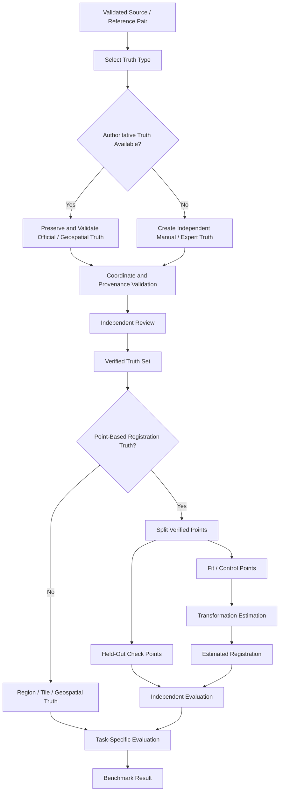
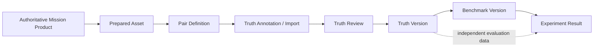

# Ground-Truth Preparation

Ground truth is the evidence ChandraMap uses to determine whether a correspondence, registration, retrieval result, or geolocation result is actually correct.

A visually convincing overlay is not sufficient evidence of accuracy. Likewise, an algorithm cannot validate itself simply because its own matches are internally consistent. A matcher can propose candidate correspondences, and RANSAC can identify correspondences consistent with a selected geometric model, but neither operation automatically creates independent truth.

ChandraMap therefore separates:

- algorithm-generated evidence;
- transformation-fitting data;
- independent evaluation data;
- authoritative or manually verified truth.

> **A registration result is only as trustworthy as the independent evidence used to evaluate it.**

The central ground-truth principle is:

> **Ground truth must be independent enough to evaluate the algorithm rather than merely repeat the algorithm's own assumptions.**

This document defines how ChandraMap prepares, validates, reviews, stores, versions, and uses independent truth for lunar correspondence, registration, retrieval, and geolocation evaluation.

It does not define a complete annotation application, matching algorithm, benchmark implementation, API, or geodesy system.

---

## 1. Why Ground Truth Matters

Ground truth provides the reference against which ChandraMap measures scientific performance.

It is required to support:

- registration-accuracy measurement;
- correspondence evaluation;
- V1/V2/V3/V4 comparison;
- classical-vs-learned matcher comparison;
- preprocessing ablations;
- IIRS representation comparison;
- retrieval evaluation;
- geolocation validation;
- overfitting detection;
- failure analysis;
- regression testing;
- reproducible benchmark reporting.

Without independent truth, ChandraMap may be able to produce:

- matched points;
- visually plausible overlays;
- RANSAC inliers;
- a transformation matrix;

but it cannot confidently establish how accurate those outputs are.

Ground truth allows the project to answer questions such as:

> How close is the estimated transformation to the real correspondence?

> Did the global retrieval system return the correct lunar region?

> Did an improved matcher actually improve registration on the same benchmark?

> Does a lower fit residual also result in lower independent check-point error?

> Is a geolocation result physically supported by the reference data?

---

## 2. What Ground Truth Is Not

Ground truth should not be confused with ordinary algorithm output.

| Item                                  | Meaning                                             | Ground Truth?                |
| ------------------------------------- | --------------------------------------------------- | ---------------------------- |
| Candidate match                       | Correspondence proposed by a matcher                | No                           |
| Matcher confidence                    | Algorithm-specific similarity/confidence value      | No                           |
| RANSAC inlier                         | Match consistent with a selected geometric model    | No                           |
| Fitted transformation                 | Model estimated from correspondences                | No                           |
| Registered preview                    | Visualization produced from the estimated model     | No                           |
| Reference image                       | Image used as registration target                   | Not automatically            |
| Independently verified correspondence | Verified same physical feature in both images       | Potentially                  |
| Held-out check point                  | Independent correspondence not used for fitting     | Yes, for evaluation          |
| Official benchmark truth              | Provider-defined evaluation truth                   | Yes, when applicable         |
| Known synthetic transform             | Exact transform used to construct a controlled test | Yes, for that synthetic test |

A strong ChandraMap evaluation must not become circular.

Bad logic:

```text
matcher produces points
        ↓
RANSAC accepts points
        ↓
same points are called ground truth
        ↓
algorithm is evaluated against itself
```

Preferred logic:

```text
algorithm produces result
        ↓
independent truth remains separate
        ↓
result is evaluated against independent truth
```

---

## 3. Ground Truth Is Task-Specific

There is no single universal ground-truth representation for every ChandraMap task.

### Retrieval

Truth answers:

> Which lunar region or reference tile should the query retrieve?

Typical truth:

- correct geographic region;
- acceptable WAC/NAC tile IDs;
- acceptable reference-product IDs.

### Point Correspondence

Truth answers:

> Which source point corresponds to the same physical lunar feature in the reference?

Typical truth:

- independently verified source/reference pixel pair.

### Registration

Truth answers:

> How accurately does the estimated transformation align independent points?

Typical truth:

- held-out check points;
- authoritative transform;
- validated geospatial relationship.

### Geolocation

Truth answers:

> Where is the source located in a trusted lunar coordinate system?

Typical truth:

- authoritative lunar coordinates;
- map/control coordinates;
- trusted product geometry.

### Synthetic Testing

Truth answers:

> What exact geometric relationship was intentionally applied?

Typical truth:

- known translation;
- known rotation;
- known scale;
- known affine transformation;
- known homography where appropriate.

The truth representation should match the task being evaluated.

---

## 4. Ground-Truth Types

| Truth Type                | Used For                      | Example                            |
| ------------------------- | ----------------------------- | ---------------------------------- |
| Region truth              | Retrieval                     | Correct lunar search region        |
| Tile truth                | Retrieval                     | Acceptable NAC/WAC tile IDs        |
| Product truth             | Retrieval/reference selection | Correct reference product          |
| Point truth               | Correspondence                | Verified source/reference point    |
| Check-point truth         | Registration                  | Held-out correspondence            |
| Transform truth           | Synthetic/controlled tests    | Known affine or homography         |
| Geospatial truth          | Localization                  | Trusted lunar coordinate           |
| Footprint truth           | Localization/retrieval        | Trusted geographic footprint       |
| Mask truth                | Evaluation validity           | Valid evaluation region            |
| Synthetic transform truth | Unit/regression testing       | Exact generated coordinate mapping |

These categories are conceptual.

The repository's final implementation schema may represent them differently.

---

# Ground-Truth Source Hierarchy

## 5. Preferred Ground-Truth Sources

ChandraMap should prefer truth sources in approximately the following order when they are applicable to the experiment:

1. **Official challenge or mission-provided truth**
2. **Authoritative geospatial relationships**
3. **Independently verified expert/manual correspondences**
4. **Held-out manually validated check points**
5. **Carefully constructed synthetic truth**

This is not a claim that every dataset provides official truth.

When suitable official or authoritative truth is unavailable, ChandraMap may need to create independent manual evaluation data.

Synthetic truth can be mathematically exact for the synthetic transformation used, but it does not replace evaluation on real lunar observations.

---

## 6. Official Ground Truth

Official truth should be preferred when all of the following are understood:

- provider;
- applicable mission/product;
- truth version;
- coordinate convention;
- units;
- evaluation protocol;
- relationship to the selected source/reference products.

Preserve where available:

- original truth file;
- original provider identifier;
- official version;
- accompanying documentation;
- coordinate-system information;
- checksum;
- ChandraMap import/normalization provenance.

Do not modify official truth silently.

Preferred handling:

```text
Official truth
      ↓
Preserve original
      ↓
Parse / normalize if required
      ↓
Store normalized derivative separately
      ↓
Reference both through provenance
```

If the official truth is incompatible with the current pair, coordinate convention, or benchmark protocol, document the limitation rather than forcing it into the evaluation.

---

## 7. Authoritative Geospatial Truth

Reliable map-projected products, control networks, or authoritative product geometry may support truth preparation.

Possible uses include:

- verifying pair overlap;
- deriving trusted ground positions;
- validating reference-tile regions;
- constructing independent geographic relationships.

However:

> **Reference imagery is not automatically perfect ground truth.**

LRO NAC and WAC are reference datasets in ChandraMap, but reference status does not imply zero geometric error or independent truth.

Geospatial truth should preserve where applicable:

- source product;
- reference product;
- projection;
- coordinate reference system;
- latitude/longitude convention;
- map units;
- geospatial source/provider;
- known uncertainty or accuracy information;
- processing provenance.

If uncertainty is unknown, leave it unknown.

Do not invent a geodetic accuracy value.

---

## 8. Manual Ground Truth

Manual annotation may be required when:

- official tie points are unavailable;
- cross-mission products need independent correspondences;
- cross-modal IIRS pairs need verified evaluation points;
- benchmark check points must be held out from fitting;
- difficult lunar terrain requires human confirmation.

Manual truth should be:

- traceable to one pair;
- created on identified assets;
- independent of the final algorithm where practical;
- reviewed;
- assigned stable point IDs;
- stored with coordinate conventions;
- versioned;
- accompanied by provenance.

A screenshot containing marks is not sufficient as the only truth record.

Machine-readable coordinates must also be preserved.

---

## 9. Synthetic Ground Truth

Synthetic geometric tests provide a useful source of exact controlled truth.

Conceptually:

```text
Real lunar image
      ↓
Apply known transformation
      ↓
Synthetic transformed image
      ↓
Exact coordinate mapping is known
```

Useful synthetic tests include:

- translation recovery;
- rotation recovery;
- scale recovery;
- affine-model tests;
- homography tests where appropriate;
- sub-pixel refinement regression tests;
- coordinate-convention tests;
- warp-direction tests.

Synthetic truth is especially useful for:

- unit testing;
- regression testing;
- implementation validation;
- transformation debugging.

It is not sufficient by itself to demonstrate:

- real cross-mission robustness;
- Sun-angle invariance;
- cross-modality robustness;
- real lunar geolocation accuracy.

---

# Retrieval Ground Truth

## 10. Retrieval Ground Truth

Retrieval truth answers:

> **Where should the query be found in the reference database?**

A retrieval truth record may identify:

- query asset;
- correct geographic region;
- acceptable reference products;
- acceptable reference tiles;
- reference-database version.

Unlike local registration, the correct reference is normally hidden from the retrieval algorithm during evaluation.

The algorithm returns:

```text
Top-K candidate references
```

and the truth defines which results should count as correct.

---

## 11. Multiple Correct Reference Tiles

Reference tiles may overlap.

A query footprint may therefore legitimately intersect more than one reference tile.

Conceptually:

```text
            Query footprint
          ┌───────────────┐
      ┌───┼──── Tile A ───┼───┐
      │   └───────────────┘   │
      │       Tile B          │
      └───────────────────────┘
```

Both tiles may be valid retrieval answers.

Therefore retrieval truth should be capable of representing:

```text
acceptable reference A
OR
acceptable reference B
```

rather than forcing one arbitrary tile to be the only correct answer.

---

## 12. Retrieval Truth vs Registration Truth

| Aspect                 | Retrieval Truth                        | Registration Truth                     |
| ---------------------- | -------------------------------------- | -------------------------------------- |
| Scientific question    | Where is the correct candidate region? | How accurately are two images aligned? |
| Truth unit             | Region/product/tile                    | Point/transform/geospatial relation    |
| Reference scope        | Database                               | Specific source/reference pair         |
| Primary metric         | Recall@K                               | Check-point error / RMSE               |
| Typical precision      | Coarse/regional                        | Local/fine                             |
| Multiple valid answers | Often possible                         | Point-specific                         |
| Geometric verification | Usually downstream                     | Core evaluation context                |

A successful retrieval does not prove accurate registration.

A successful local registration does not prove global retrieval works.

---

# Point-Level Ground Truth

## 13. Verified Point Correspondence

A verified point correspondence means:

> A location in the source asset and a location in the reference asset have been independently identified as representing the same physical lunar feature.

Conceptually:

```text
Source feature
(x_s, y_s)
      ↕
same physical lunar feature
      ↕
Reference feature
(x_r, y_r)
```

It does **not** mean:

> "The matcher returned these coordinates."

Matcher-generated correspondences may be useful suggestions, but they require independent review before becoming truth.

---

## 14. Stable Point Identity

Each truth point should have a stable identifier within its truth set.

Conceptual information may include:

```text
point_id
pair_id
source_x
source_y
reference_x
reference_y
point_role
verification_status
provenance
uncertainty
```

The repository's actual schema may use different field names.

Stable IDs are useful for:

- corrections;
- review history;
- deprecation;
- fit/check splitting;
- result diagnostics;
- benchmark reproducibility.

---

## 15. Pixel Coordinate Conventions

Point coordinates are unusable if their interpretation is ambiguous.

The authoritative coordinate contract should define:

- what `x` means;
- what `y` means;
- relationship to row/column indexing;
- image origin;
- zero-based or one-based indexing;
- pixel-center convention;
- coordinate direction.

For example, a project may choose:

```text
x = column
y = row
origin = top-left
```

but this should only become authoritative when defined in the repository's coordinate contract.

Do not infer conventions from a CSV column name alone.

---

## 16. Source Coordinate Space

Every truth record should identify the source asset whose coordinate system the source point uses.

Possible coordinate domains include:

- full raw product;
- processed source;
- cropped source;
- resized source;
- map-projected source;
- IIRS selected-band representation;
- IIRS PCA representation;
- IIRS structural representation.

These coordinate systems must not be mixed silently.

A point in:

```text
processed_source_crop
```

does not automatically have the same coordinates as a point in:

```text
full_parent_product
```

---

## 17. Reference Coordinate Space

Likewise, reference coordinates may refer to:

- full NAC product;
- processed NAC product;
- NAC crop;
- NAC tile;
- NAC pyramid level;
- WAC product;
- WAC mosaic;
- WAC tile;
- projected reference.

The truth record or referenced asset metadata should make that domain explicit.

---

## 18. Crop Offset Handling

If annotations are created on a crop, the relationship between crop and parent coordinates must be preserved.

Conceptually:

```text
parent_x = crop_x + crop_offset_x
parent_y = crop_y + crop_offset_y
```

The exact mapping may be more complex if the crop was additionally:

- resampled;
- warped;
- projected;
- rotated.

Record the real coordinate mapping rather than assuming a simple offset when one does not apply.

A forgotten crop offset can create a systematic error across every truth point.

---

## 19. Pyramid-Level Coordinates

Reference pyramids introduce different coordinate spaces.

A point annotated at:

```text
NAC pyramid level N
```

cannot automatically be interpreted as a level-0 coordinate.

Preserve:

- parent reference asset;
- pyramid ID;
- level;
- scale relationship;
- resampling provenance;
- coordinate mapping.

Do not mix:

```text
level_0 x/y
```

with:

```text
level_N x/y
```

inside one truth set unless the mapping is explicit.

---

# IIRS Ground Truth

## 20. IIRS Truth Requires Representation Identity

IIRS requires special care because conventional 2D registration normally operates on a derived spatial representation rather than the complete hyperspectral cube.

A truth point must therefore identify which representation its coordinates refer to.

Possible examples include:

- selected spectral band;
- PCA component;
- spectral composite;
- gradient/structural representation.

A record such as:

```text
sensor: IIRS
source_x: ...
source_y: ...
```

is incomplete if the actual matcher operated on a derived representation whose spatial grid is not identified.

---

## 21. IIRS Spatial Grid Preservation

Some IIRS-derived representations may preserve the original spatial grid.

Conceptually:

```text
IIRS cube
height × width × bands
        ↓
spectral reduction only
        ↓
2D representation
height × width
```

If the spatial coordinates remain unchanged, document that explicitly.

Do not simply assume it.

---

## 22. IIRS Resampled or Cropped Representations

If an IIRS representation is:

- cropped;
- resampled;
- projected;
- rotated;
- otherwise spatially transformed;

the truth set should preserve the mapping to:

- the derived representation;
- the parent IIRS spatial grid.

Conceptually:

```text
IIRS parent grid
      ↓
documented spatial transform
      ↓
registration representation grid
      ↓
truth coordinates
```

This prevents spectral-processing experiments from losing spatial provenance.

---

## 23. IIRS Truth Precision

Current ChandraMap planning uses approximately:

> **~80 m/pixel**

for IIRS spatial scale, with actual product metadata remaining authoritative.

An IIRS source generally cannot justify the same physical annotation precision as an OHRC source.

Truth preparation should favor large, mutually observable structures rather than fine NAC details that the IIRS observation cannot resolve.

---

# Lunar Ground Coordinates

## 24. Ground Coordinates

Where trusted lunar coordinates are available, truth records may include:

- latitude;
- longitude;
- projected coordinates;
- map-space coordinates.

These values require context.

A geographic coordinate without:

- coordinate convention;
- CRS/reference system;
- projection;
- units;

may be ambiguous.

---

## 25. Lunar Coordinate Conventions

Lunar products can use different cartographic conventions.

Record where applicable:

- target body;
- latitude convention;
- longitude convention;
- positive longitude direction;
- longitude domain/range;
- projection;
- reference model;
- units.

Do not invent one universal convention for all Chandrayaan-2 and LRO products.

Use:

1. actual product metadata;
2. authoritative product documentation;
3. authoritative lunar cartographic documentation.

---

# Fit and Evaluation Points

## 26. Control / Fit Points

**Fit points**, also called control or transformation-estimation points in some contexts, are points permitted to influence the estimated registration model.

They may originate from:

- manual annotation;
- official control data;
- verified matcher proposals;
- another documented source.

Their role must be explicit.

Fit points may be used to:

- estimate affine parameters;
- estimate a homography where appropriate;
- refine a transform;
- refit a final model.

They are not independent evaluation points.

---

## 27. Check / Evaluation Points

**Check points** are correspondences held out from transformation estimation and used to evaluate the final transformation.

They should not be used to:

- estimate the transform;
- refine the transform;
- choose model parameters;
- tune thresholds;

when they are intended to represent independent test evidence.

Check points are the preferred basis for independent registration RMSE.

---

## 28. Why Fit and Check Points Must Be Separate

A model is expected to fit data it was optimized against better than unseen data.

Therefore:

```text
fit residual
```

answers:

> How well does the transformation explain its fitting points?

while:

```text
check-point residual
```

answers:

> How well does the fitted transformation generalize to independent points?

Bad evaluation:

```text
same points
    ↓
estimate transform
    ↓
measure RMSE on same points
    ↓
report independent accuracy
```

Preferred evaluation:

```text
fit/control points
    ↓
estimate transform

independent check points
    ↓
measure registration error
```

> **Fit-point residuals are valuable diagnostics, but they are not automatically independent registration accuracy.**

---

## 29. Fit Residual vs Check-Point Error

| Metric               | Meaning                                                 | Independent?                  |
| -------------------- | ------------------------------------------------------- | ----------------------------- |
| Fit residual         | Error on points used to estimate/refine the model       | No                            |
| Check-point residual | Error on held-out evaluation points                     | Yes, when truly held out      |
| Source-pixel RMSE    | Aggregate registration error expressed in source pixels | Depends on point set          |
| Reference-pixel RMSE | Error expressed in reference-image pixels               | Depends on point set          |
| Ground error         | Physical/map-space error when conversion is justified   | Depends on truth and geometry |

Every reported error should identify:

- point set;
- coordinate domain;
- unit;
- number of evaluated points;
- whether those points participated in fitting.

---

## 30. Recommended Point Split

There is no universal split such as:

```text
80% fit
20% check
```

that should be applied blindly.

The allocation depends on:

- total verified-point count;
- chosen geometric model;
- point distribution;
- source/reference geometry;
- benchmark protocol.

The important requirement is independence.

Conceptually:

```text
Verified point set
       ↓
 ┌─────┴─────┐
 │           │
Fit subset  Check subset
```

A benchmark specification may later define exact selection rules.

---

## 31. Spatial Distribution of Check Points

Check points should represent the usable overlap rather than one convenient local area.

Prefer coverage across:

- different image regions;
- multiple terrain structures;
- central areas;
- edges/corners where valid and scientifically meaningful.

This helps reveal:

- projection mismatch;
- relief-related residuals;
- local warping;
- transform-model limitations.

A cluster of points around one crater may produce a good local error while hiding larger image-wide misregistration.

---

## 32. Spatial Coverage

Truth-set coverage may be described through metrics such as:

- grid occupancy;
- convex-hull coverage;
- region distribution;
- another documented spatial measure.

This document does not prescribe one universal threshold.

If a coverage score is reported, its definition and parameters must be documented.

---

# Manual Annotation

## 33. Selecting Ground-Truth Features

Prefer lunar features that are:

- visible in both assets;
- physically interpretable;
- sufficiently distinctive;
- meaningful at both sensors' spatial scales;
- reasonably stable under the observed modality/illumination differences.

Possible candidates include:

- distinctive crater-rim intersections;
- large crater centers when genuinely unambiguous;
- ridge intersections;
- major terrain junctions;
- stable morphological boundaries.

Feature selection should respect the lower-information sensor.

---

## 34. Avoid Ambiguous Features

Avoid or explicitly flag a point when:

- shadow hides the feature;
- shadow geometry moves the visible boundary substantially;
- the feature is unresolved in one sensor;
- several nearby craters look equally plausible;
- the modality changes the visible structure strongly;
- one image contains insufficient information for precise placement;
- terrain relief makes the point identity uncertain.

Do not force a truth point simply to increase annotation count.

---

## 35. Scale-Aware Annotation

A valid truth feature must be observable at the spatial scale of both pair assets.

Incorrect approach:

```text
tiny feature visible only in NAC
        ↓
assign exact matching coordinate in IIRS
```

Preferred approach:

```text
feature clearly observable in coarse source
        +
feature observable in fine reference
        ↓
truth correspondence
```

> **Fine reference detail must not create fake precision in a coarse source.**

---

# Sensor-Specific Truth Preparation

## 36. OHRC Truth Preparation

OHRC is visible/panchromatic and is approximately:

> **~0.25–0.32 m/pixel**, depending on product/documentation.

OHRC may support relatively fine point placement, but actual truth quality still depends on:

- reference resolution;
- illumination difference;
- viewing geometry;
- projection;
- terrain relief;
- feature clarity.

Do not claim arbitrary sub-pixel ground-truth precision merely because OHRC has a fine GSD.

Truth precision must be supported by the actual pair.

---

## 37. TMC-2 Truth Preparation

TMC-2 is approximately:

> **~5 m/pixel**

in current project planning.

Truth preparation should prefer structures clearly visible at TMC-2 scale, such as:

- medium/large crater structure;
- ridge systems;
- larger morphology;
- stable terrain junctions.

Do not define truth using tiny NAC features that TMC-2 cannot reliably resolve.

---

## 38. IIRS Truth Preparation

IIRS is hyperspectral/imaging infrared and is approximately:

> **~80 m/pixel**

with approximately:

> **~0.8–5.0 µm**

spectral coverage and roughly:

> **~250–256 bands**

depending on product/documentation.

Actual metadata remains authoritative.

Truth preparation should use structures observable at the IIRS spatial scale, such as:

- large crater morphology;
- major terrain boundaries;
- broad structural features.

The truth set must also identify the exact IIRS-derived 2D representation used for coordinates.

---

## 39. LRO NAC Truth Preparation

LRO NAC is commonly used as ChandraMap's fine/local reference.

Current project planning often treats NAC as approximately:

> **~0.5–2 m/pixel**, product-dependent.

NAC's greater detail can aid manual interpretation.

However:

> **Higher reference detail does not allow the source point to be placed more precisely than the source information supports.**

Truth precision should respect both sides of the pair.

---

## 40. LRO WAC Truth Preparation

LRO WAC is a broad/global/contextual reference whose scale is:

> **product-, mode-, and processing-dependent.**

Do not assign a universal WAC GSD.

WAC truth may be particularly suitable for:

- region truth;
- tile truth;
- coarse geographic confirmation;
- broad correspondence.

Do not assume WAC should support NAC-level point precision.

---

# Manual Annotation Workflow

## 41. Recommended Annotation Workflow

1. **Load a validated source/reference pair.**
   Confirm that both assets correspond to the intended pair definition.

2. **Confirm parent-product identity.**
   Verify the source and reference provenance.

3. **Confirm coordinate spaces.**
   Determine whether annotations refer to full products, crops, tiles, pyramid levels, or derived representations.

4. **Confirm coordinate conventions.**
   Establish `x/y`, row/column, origin, indexing, and pixel-center interpretation.

5. **Inspect the usable overlap.**
   Avoid invalid/NoData regions.

6. **Select a mutually observable lunar feature.**
   Choose a feature whose identity is defensible in both assets.

7. **Mark the source location.**

8. **Mark the reference location.**

9. **Assign a stable point ID.**

10. **Record annotation provenance.**

11. **Record uncertainty or review notes where needed.**

12. **Repeat across the overlap.**
    Aim for meaningful spatial distribution.

13. **Perform independent review where practical.**

14. **Resolve or flag disagreements.**

15. **Separate fit points from held-out check points.**

16. **Validate all coordinate mappings.**

17. **Freeze the truth version.**

18. **Attach the truth version to the benchmark definition.**

---

## 42. Do Not Annotate Only from a Registered Output

Showing an algorithm-generated warp before annotation can bias the annotator toward the algorithm's prediction.

For stronger truth:

- inspect original source/reference assets independently;
- avoid relying only on the final registered overlay;
- hide matcher predictions during initial annotation when practical.

If algorithm guidance was visible, record that fact as part of annotation provenance.

---

## 43. Blind or Independent Annotation

Where practical, annotation should be performed independently of:

- matcher correspondences;
- matcher confidence scores;
- RANSAC inliers;
- final transformation;
- algorithm-generated warp.

This reduces confirmation bias.

A personal research project may not always support fully blinded expert annotation, but the evaluation process should remain as independent as practical and document its limitations.

---

## 44. Annotation Tool Requirements

ChandraMap does not require one specific annotation application.

A suitable tool should ideally support:

- synchronized source/reference viewing;
- independent zooming;
- point placement;
- stable point IDs;
- precise coordinate export;
- crop/tile identification;
- review/edit history;
- optional map-coordinate display;
- provenance notes.

The tool should export machine-readable truth.

Screenshots alone are insufficient.

---

# Multiple Annotators and Review

## 45. Independent Review

Important truth points should ideally be reviewed independently.

A practical workflow is:

```text
Annotator A
     ↓
Initial correspondence
     ↓
Reviewer B
     ↓
Agree?
 ┌───┴───┐
Yes      No
 │        │
Accept  Adjudicate
```

V1 does not require a large annotation team.

A small, carefully reviewed truth set is preferable to a large unreviewed set.

---

## 46. Inter-Annotator Difference

Where multiple annotations exist, differences may be measured separately in:

- source coordinates;
- reference coordinates.

Large disagreement can indicate:

- ambiguous feature identity;
- inadequate spatial resolution;
- shadow-related uncertainty;
- cross-modal ambiguity;
- annotation error.

Do not invent a universal disagreement threshold.

Thresholds, if later used, should come from benchmark methodology.

---

## 47. Adjudication

If annotators disagree substantially:

- re-inspect both assets;
- verify parent/crop/pyramid identity;
- confirm coordinate conventions;
- assess whether the feature is actually the same physical structure;
- mark the point uncertain if ambiguity remains;
- replace the point if a better feature exists;
- preserve review history.

Do not simply average two annotations if they identify different physical features.

---

## 48. Reviewer Provenance

Truth provenance may distinguish:

- original annotator;
- reviewer;
- adjudicator;
- review status.

Public personal identity is not required if a stable contributor or role identifier is sufficient for repository governance.

The goal is traceability, not unnecessary personal information.

---

# Ground-Truth Uncertainty

## 49. Truth Is Not Always Exact

Ground truth can itself contain uncertainty.

This is especially true for:

- coarse spatial resolution;
- blurred terrain;
- cross-modal imagery;
- shadowed terrain;
- weakly defined crater centers;
- relief-rich surfaces;
- mosaics;
- manual annotation.

Do not describe every manual point as exact.

---

## 50. Point Uncertainty

Possible uncertainty representations may include:

- qualitative verification class;
- pixel-radius estimate;
- confidence interval;
- annotation note;
- reviewer agreement status.

ChandraMap should not invent a mandatory uncertainty model before the benchmark system defines one.

If no defensible uncertainty value exists, leave it unquantified and document the limitation.

---

## 51. Truth Precision vs Sensor Resolution

Truth precision should remain physically plausible.

A coarse sensor such as IIRS generally cannot support the same physical point-placement precision as a much finer OHRC or NAC observation.

Conceptually:

```text
fine reference feature precision
        ≠
coarse source feature precision
```

The lower-information side of the pair often limits defensible point precision.

---

## 52. Uncertain Points

Points with unresolved ambiguity should be:

- marked uncertain;
- excluded from strict evaluation;
- retained separately for research if useful;
- replaced when a better point can be identified.

Uncertainty should not be hidden merely to increase truth-set size.

---

# Ground-Truth Quality Control

## 53. Truth Validation Checklist

Before a truth set becomes benchmark-ready, verify:

- [ ] Pair ID is valid.
- [ ] Pair version is known.
- [ ] Source asset exists.
- [ ] Reference asset exists.
- [ ] Parent products resolve correctly.
- [ ] Source/reference roles are correct.
- [ ] Real overlap is confirmed.
- [ ] Coordinate spaces are identified.
- [ ] Pixel-coordinate convention is documented.
- [ ] Crop mapping is valid.
- [ ] Pyramid-level mapping is valid where applicable.
- [ ] IIRS representation identity is known where applicable.
- [ ] Point coordinates are within image bounds.
- [ ] Each point represents the same physical lunar feature.
- [ ] Selected feature is observable in both assets.
- [ ] Ambiguous points are flagged or excluded.
- [ ] Point IDs are unique.
- [ ] Duplicate annotations are checked.
- [ ] Point roles are assigned.
- [ ] Check points are excluded from transformation fitting.
- [ ] Spatial distribution is reviewed.
- [ ] Geospatial conventions are preserved where applicable.
- [ ] Provenance is complete.
- [ ] Review status is recorded.
- [ ] Uncertainty is recorded where needed.
- [ ] Truth version is assigned.
- [ ] Frozen benchmark truth is not modified in place.

---

## 54. Coordinate-Bounds Validation

Point coordinates should be validated against the actual asset dimensions.

For a zero-based convention, the conceptual validity rule is:

```text
0 <= x < width
0 <= y < height
```

If the repository adopts another indexing convention, validation must follow that convention.

Do not assume coordinates are valid because a CSV or YAML file parses successfully.

---

## 55. Duplicate Point Detection

Truth preparation should check for:

- duplicate point IDs;
- identical coordinate pairs;
- near-identical duplicate annotations;
- the same physical feature entered repeatedly.

Duplicates can distort:

- RMSE weighting;
- spatial coverage;
- point-count reporting.

A duplicated point should not silently count as additional independent evidence.

---

## 56. Feature Identity Validation

A point can be numerically valid yet scientifically incorrect.

For each correspondence, review whether:

> the source coordinate and reference coordinate identify the same physical lunar feature.

This is especially important in:

- repetitive crater fields;
- strongly shadowed regions;
- IIRS-visible vs visible-reference pairs.

---

## 57. Spatial Distribution Validation

Truth points should be reviewed for geographic/image-space spread.

Poor:

```text
all points clustered around one crater
```

Better:

```text
points distributed across usable overlap
```

when suitable unambiguous features exist.

Good distribution improves sensitivity to:

- local geometric errors;
- projection mismatch;
- relief effects;
- transform-model limitations.

---

## 58. Scale Consistency Validation

Verify that the selected feature is physically resolvable in both assets.

This is particularly important for:

- IIRS ↔ NAC;
- TMC-2 ↔ fine NAC;
- OHRC ↔ coarse WAC.

A feature visible only because one reference is much finer should not automatically become point truth.

---

## 59. Projection Consistency Validation

If truth coordinates are transformed through map space:

- confirm the source and destination CRS/reference systems;
- confirm projection parameters;
- confirm longitude/latitude conventions;
- confirm units;
- validate the coordinate transform.

Do not directly compare coordinates from incompatible lunar cartographic systems.

---

# Algorithm-Assisted Annotation

## 60. Algorithms May Assist Annotation

Algorithms may accelerate truth creation by proposing likely correspondences.

Possible workflow:

```text
matcher proposals
      ↓
human / independent review
      ↓
accepted verified correspondence
```

The review stage is essential.

Algorithmic suggestion alone does not create truth.

---

## 61. RANSAC-Assisted Review

RANSAC can identify a subset of candidate correspondences that are consistent with a selected geometric model.

That can help:

- prioritize points for inspection;
- detect obvious outliers;
- identify a plausible overlapping region.

However:

> **RANSAC inlier ≠ verified ground truth.**

A false group of matches can be internally consistent with an incorrect model.

Geometric consistency and independent truth are different concepts.

---

## 62. Automated Point Suggestion Bias

If ground truth is created only from one algorithm's detected features, the resulting benchmark may favor that algorithm's feature type.

For example:

```text
Algorithm A proposes all candidate points
        ↓
only those points are manually reviewed
        ↓
truth set overrepresents Algorithm A-detectable structure
```

Where practical, include independently identified correspondences or use multiple proposal methods.

Truth construction should not unintentionally encode one algorithm's feature-selection bias.

---

# Synthetic Ground Truth

## 63. Known-Transformation Truth

Synthetic geometric truth can be created by applying a known transformation to a real lunar image.

Possible controlled transformations include:

- translation;
- rotation;
- scale;
- affine transform;
- homography where appropriate.

Conceptually:

```text
Original image
     ↓
Known transformation T
     ↓
Synthetic image

Point p
     ↓ T
Known corresponding point p'
```

Because the generating transformation is known, expected coordinate relationships can be computed directly.

---

## 64. Synthetic Truth Provenance

A synthetic truth record should preserve:

- parent asset;
- transform type;
- transformation parameters;
- transformation matrix where applicable;
- transform direction;
- interpolation method;
- output dimensions;
- crop/valid region;
- random seed where randomness is used;
- generation software/version.

This information is necessary to reproduce the test.

---

## 65. Synthetic Illumination Caution

Simple transformations such as:

- brightness adjustment;
- contrast adjustment;
- gamma change;

may provide controlled radiometric variation.

They do **not** represent physically correct lunar Sun-angle changes.

Real illumination differences can change:

- shadow direction;
- shadow length;
- illuminated slopes;
- hidden terrain;
- crater-rim appearance.

Therefore:

> **Synthetic brightness truth is not real Sun-angle truth.**

---

## 66. Appropriate Uses of Synthetic Truth

Synthetic truth is useful for:

- coordinate-system tests;
- transformation recovery;
- regression tests;
- warp-direction verification;
- sub-pixel refinement tests;
- controlled algorithm debugging.

It should not replace real lunar truth for claims about:

- cross-mission robustness;
- real illumination changes;
- sensor-modality differences;
- real geolocation accuracy.

---

# Retrieval Ground Truth

## 67. Region Truth

For global/unknown-location retrieval, truth may be represented at geographic-region level.

Relevant information may include:

- query asset;
- query ID;
- correct lunar region;
- geographic bounds;
- coordinate convention;
- reference-database version.

This truth should be created independently of the retrieval system's output.

---

## 68. Tile Truth

Tile-level truth may contain one or more acceptable tile IDs.

Conceptually:

```yaml
acceptable_reference_tiles:
  - TILE_ID_A
  - TILE_ID_B
```

This is appropriate when both tiles genuinely contain the correct region.

The example uses placeholders only.

---

## 69. Recall@K Truth

Retrieval evaluation asks:

> Is at least one acceptable correct reference among the Top-K candidates?

This supports metrics such as:

- Recall@1;
- Recall@5;
- Recall@K.

Do not evaluate retrieval quality using only registration RMSE.

Registration error is measured after a candidate pair has been selected and aligned.

---

## 70. Coarse-to-Fine Truth

A WAC → NAC workflow may require two separate truth layers.

### Coarse Truth

Defines the correct:

- WAC region;
- WAC tile;
- broad lunar location.

### Fine Truth

Defines the correct:

- NAC product;
- NAC tile;
- local correspondence/check points.

Conceptually:

```text
Query
  ↓
Correct WAC Region
  ↓
Correct NAC Reference
  ↓
Independent Fine Check Points
```

These truth layers should not be conflated.

---

# Geolocation Ground Truth

## 71. Geolocation Truth

If ChandraMap reports lunar coordinates, evaluation requires trusted coordinate truth.

A geolocation truth record should identify where applicable:

- trusted coordinate;
- coordinate units;
- lunar CRS/reference system;
- projection;
- latitude convention;
- longitude convention;
- source/provider;
- uncertainty or accuracy where known;
- truth version.

A latitude/longitude pair without cartographic context is insufficient.

---

## 72. Pixel-to-Ground Conversion

Do not derive precise metre-level accuracy solely from an approximate generic sensor GSD.

A defensible conversion may require:

- source-product GSD;
- source pixel error;
- map/projection context;
- coordinate mapping;
- independent geographic truth;
- documented conversion method.

Approximate planning values should not be used as hidden substitutes for missing product metadata.

---

## 73. Source-Pixel Error Comes First

ChandraMap should normally report registration error in the source-image coordinate domain first.

Examples:

```text
OHRC source
→ error in OHRC pixels
```

```text
TMC-2 source
→ error in TMC-2 pixels
```

```text
IIRS source representation
→ error in IIRS source-grid pixels
```

Only after that should a physical ground-distance error be reported when the conversion is valid.

This prevents misleading comparisons between sensors with very different GSDs.

---

# Ground-Truth Storage

## 74. Ground Truth Should Be Machine-Readable

Truth should be stored in structured, reviewable formats.

Suitable possibilities include:

- CSV for straightforward point tables;
- JSON for structured records;
- YAML for human-readable benchmark definitions;
- other repository-defined open formats.

ChandraMap does not require every truth type to use the same serialization format.

The scientific semantics matter more than the file extension.

---

## 75. Conceptual Point-Truth Fields

A point-truth record may conceptually contain:

```text
truth_set_id
truth_version
pair_id
pair_version
point_id
source_asset_id
reference_asset_id
source_x
source_y
reference_x
reference_y
point_role
verification_status
uncertainty
provenance
```

Optional fields may include:

- geographic coordinates;
- reviewer status;
- annotation notes;
- coordinate-space IDs.

The exact implementation belongs in repository schemas/contracts.

---

## 76. Example Truth Record

The following is illustrative only.

```yaml
truth_set_id: "PLACEHOLDER_TRUTH_SET_ID"
truth_version: "PLACEHOLDER_TRUTH_VERSION"
pair_id: "PLACEHOLDER_PAIR_ID"

point:
  point_id: "PLACEHOLDER_POINT_ID"

  source:
    asset_id: "PLACEHOLDER_SOURCE_ASSET_ID"
    x: "PLACEHOLDER_SOURCE_X"
    y: "PLACEHOLDER_SOURCE_Y"

  reference:
    asset_id: "PLACEHOLDER_REFERENCE_ASSET_ID"
    x: "PLACEHOLDER_REFERENCE_X"
    y: "PLACEHOLDER_REFERENCE_Y"

  role: "fit_or_check"
  verification_status: "PLACEHOLDER_REVIEW_STATUS"
  uncertainty: null

provenance:
  method: "manual_or_authoritative_or_other_documented_method"
```

No real scientific coordinates or product IDs are implied by this example.

---

## 77. Ground-Truth Manifest

A larger truth collection may use a manifest describing:

- truth-set ID;
- truth version;
- covered pair IDs;
- pair versions;
- truth type;
- annotation method;
- review method;
- provenance;
- coordinate convention;
- number of points where useful;
- deprecated/replacement status;
- benchmark usage.

If example counts are shown in documentation, placeholders should be used rather than invented scientific counts.

---

## 78. Annotation File vs Ground-Truth Manifest

These serve different purposes.

### Annotation File

Contains the actual:

- points;
- regions;
- masks;
- coordinate observations.

### Ground-Truth Manifest

Describes the collection itself:

- identity;
- version;
- provenance;
- coordinate conventions;
- review status;
- pair relationships.

Conceptually:

```text
Ground-Truth Manifest
       ↓
references
       ↓
Annotation Files
```

This separation improves maintainability and reproducibility.

---

## 79. Ground Truth Must Remain Separate from Results

Truth should not be stored as though it were one of the algorithm's outputs.

Conceptually:

```text
benchmarks / truth
        ↓
used to evaluate
        ↓
results
```

not:

```text
results
   ↓
automatically become truth
```

An algorithm-generated result may later contribute to a new truth version only after independent validation and explicit dataset governance.

---

# Ground-Truth Versioning

## 80. Truth Version

Ground truth should have its own version identifier.

A new truth version may be justified when:

- a point is corrected;
- an ambiguous point is removed;
- new independent points are added;
- coordinate conventions are corrected;
- crop/pyramid mapping is corrected;
- projection interpretation changes;
- review status materially improves;
- uncertainty information is corrected.

Frozen truth used by a published benchmark should never change silently.

---

## 81. Pair Version vs Truth Version

These version types represent different scientific entities.

### Pair Version

Defines the source/reference scientific case.

For example:

- source asset;
- reference asset;
- representation;
- reference scale;
- overlap.

### Truth Version

Defines the independent evaluation evidence attached to that case.

The same pair version may potentially receive a corrected truth version later.

---

## 82. Truth Version vs Benchmark Version

A benchmark version may freeze:

```text
Benchmark Version
├── Pair Version A
│   └── Truth Version X
├── Pair Version B
│   └── Truth Version Y
└── Evaluation Protocol
```

Changing a truth version can therefore require a new benchmark version if it affects benchmark results.

---

## 83. Dataset, Pair, Truth, and Benchmark Versions

| Version                 | Defines                                            |
| ----------------------- | -------------------------------------------------- |
| Dataset version         | Available scientific products/assets               |
| Preparation version     | How assets were processed/derived                  |
| Pair version            | Exact source/reference relationship                |
| Truth version           | Evaluation evidence for the pair                   |
| Benchmark version       | Frozen pair + truth + split + protocol combination |
| Reference-index version | Retrieval database/index configuration             |

Keeping them distinct makes historical results reproducible.

---

## 84. Do Not Silently Change Truth

Never:

```text
edit old truth file
        ↓
keep same version
        ↓
rerun benchmark
```

because historical results would no longer refer to the same evaluation data.

Preferred:

```text
Truth v1
   ↓ correction
Truth v2
```

with documented change history.

---

## 85. Deprecating Incorrect Ground Truth

If a truth version is discovered to be invalid:

1. preserve the historical version;
2. mark it deprecated;
3. document the problem;
4. create a corrected version;
5. identify affected benchmark versions;
6. update benchmark definitions intentionally.

Do not erase historical truth when published or recorded results depend on it.

---

# Leakage Prevention

## 86. Truth Leakage

Test truth must not leak into training or parameter optimization when it is intended only for independent evaluation.

Examples of truth leakage include:

- training on test correspondences;
- using test check points as supervision;
- using hidden test region IDs during retrieval tuning;
- tuning thresholds repeatedly against final check-point RMSE.

Such practices make the evaluation less independent.

---

## 87. Check-Point Leakage

A check point ceases to be a fully untouched evaluation point if its error is repeatedly inspected while manually tuning:

- the transform;
- thresholds;
- preprocessing;
- model selection.

A practical research workflow may sometimes inspect validation error during development.

The important distinction is to reserve a final held-out evaluation set where the benchmark claims independent test performance.

Document benchmark-development practices accurately.

---

## 88. Geographic Leakage

Truth sets should preserve enough geography/provenance to support geographic split analysis.

Useful metadata includes:

- pair ID;
- parent product;
- lunar region;
- footprint;
- tile lineage.

This helps prevent nearly identical terrain from appearing in both:

- training;
- final test evaluation.

---

## 89. Synthetic Leakage

Synthetic derivatives of a test image should not enter training when the benchmark claims evaluation on unseen imagery.

Track:

```text
synthetic asset
      ↓
parent real asset
```

so split generation can detect this relationship.

---

# Ground-Truth Preparation Workflow

## 90. Recommended End-to-End Workflow

1. **Select a validated pair.**
   Use a pair whose source/reference assets and parent products are already known.

2. **Confirm source/reference identity.**
   Verify mission, sensor, asset ID, product ID, and pair version.

3. **Confirm real overlap.**
   Use authoritative geographic relationships when available.

4. **Confirm coordinate spaces.**
   Determine whether truth refers to full products, crops, tiles, pyramid levels, or derived representations.

5. **Confirm coordinate conventions.**
   Establish `x/y`, indexing, origin, units, and map conventions.

6. **Choose the appropriate truth type.**
   Region, tile, point, check-point, transform, geospatial, or synthetic truth.

7. **Search for authoritative truth first.**
   Preserve it unchanged when valid and applicable.

8. **Create independent manual truth when authoritative truth is unavailable.**

9. **Select mutually observable features.**

10. **Record stable point or region identity.**

11. **Record provenance.**

12. **Record uncertainty or review notes where appropriate.**

13. **Perform independent review where practical.**

14. **Reject or flag ambiguous truth.**

15. **Separate fit/control points from held-out check points.**

16. **Review spatial distribution.**

17. **Validate coordinate bounds and coordinate mappings.**

18. **Validate scale compatibility.**

19. **Validate projection/CRS context where geospatial truth is involved.**

20. **Freeze a truth version.**

21. **Attach that truth version to a benchmark version.**

22. **Keep canonical truth separate from algorithm-generated results.**

---

# Ground-Truth Preparation Flow

## 91. Ground-Truth Preparation Diagram



The diagram emphasizes that check points remain outside transformation estimation.

---

## 92. Truth Provenance Diagram



Truth remains linked to mission products and pair definitions throughout its lifecycle.

---

# Ground-Truth Quality Assurance

## 93. QA Levels

A project may conceptually distinguish review states such as:

- unreviewed;
- reviewed;
- independently verified;
- authoritative/provider-supplied.

These are conceptual categories.

The repository's final schema may use different names.

What matters is that review status is explicit.

---

## 94. Minimum V1 Truth Quality

V1 does not require a large annotation program.

A strong V1 truth set may contain:

- one or a few known-overlap pairs;
- carefully validated correspondences;
- clear coordinate conventions;
- explicit fit/check-point separation;
- adequate spatial spread;
- strong provenance;
- a frozen truth version.

Quality is more important than point count.

---

## 95. Do Not Chase Point Count

More truth points are not automatically better.

A large set can still be poor if points are:

- ambiguous;
- duplicated;
- clustered;
- algorithm-biased;
- incorrectly paired;
- unresolved at the source scale.

Prefer:

> **fewer reliable and well-distributed truth points**

over:

> **many questionable truth points.**

---

## 96. Truth Distribution

Truth should sample the usable overlap rather than only the easiest visual structure.

This increases sensitivity to:

- local deformation;
- projection differences;
- relief-related displacement;
- poor global transform behavior.

If only one small region can be annotated confidently, document that limitation.

---

# Ground-Truth Failure Modes

## 97. Common Failure Modes

| Problem                                                | Consequence                     | Correct Response                           |
| ------------------------------------------------------ | ------------------------------- | ------------------------------------------ |
| Wrong physical feature matched manually                | False error measurement         | Re-annotate                                |
| Point used for both fit and check                      | Optimistic evaluation           | Separate roles                             |
| RANSAC inlier labeled as truth                         | Circular evaluation             | Independently verify                       |
| Matcher proposal accepted without review               | Algorithm-biased truth          | Independent review                         |
| IIRS feature below resolvable scale                    | False precision                 | Replace with larger feature                |
| Fine NAC detail used as coarse-sensor truth            | Unrealistic source precision    | Use mutually observable feature            |
| Crop offset forgotten                                  | Systematic coordinate error     | Restore crop-parent mapping                |
| Pyramid level confused                                 | Scale/coordinate error          | Correct level metadata                     |
| IIRS representation changed silently                   | Coordinate/provenance ambiguity | Freeze representation identity             |
| Pixel origin convention ambiguous                      | Consistent coordinate shift     | Define convention explicitly               |
| Longitude convention mixed                             | Incorrect geolocation           | Normalize with provenance                  |
| Projection mismatch ignored                            | Invalid geographic comparison   | Validate CRS/projection                    |
| Truth file changed silently                            | Irreproducible benchmark        | Create new truth version                   |
| All points clustered                                   | Weak whole-image evaluation     | Improve distribution where possible        |
| Duplicate point repeated                               | Biased weighting                | Remove/merge duplicate                     |
| Algorithm-generated warp used as sole annotation basis | Confirmation bias               | Annotate independently                     |
| Test truth used for tuning                             | Evaluation leakage              | Reserve independent test truth             |
| Overlapping retrieval tile counted wrong               | Incorrect Recall@K              | Allow multiple valid tiles                 |
| Synthetic truth unlabeled                              | Misleading benchmark            | Mark synthetic provenance                  |
| Reference assumed perfect                              | Unsupported accuracy claim      | Preserve reference uncertainty/limitations |

---

# Common Ground-Truth Mistakes

## 98. Mistakes to Avoid

Do not:

- call SIFT matches ground truth;
- call ALIKED/LightGlue matches ground truth;
- call LoFTR correspondences ground truth;
- call RANSAC inliers ground truth;
- measure only fit-point residuals and call them independent accuracy;
- hide whether a point is fit or check;
- use coordinates without conventions;
- lose crop offsets;
- mix coordinate spaces;
- mix pyramid levels;
- create IIRS truth without representation identity;
- annotate features that one sensor cannot resolve;
- assume NAC pixels are perfect truth automatically;
- assume WAC supports NAC-level truth precision;
- invent metre-level accuracy from approximate GSD;
- trust a visually convincing overlay as quantitative truth;
- create truth only after inspecting the final algorithm warp without documenting that bias;
- accept ambiguous crater correspondences merely to increase point count;
- store truth only as annotated screenshots;
- silently edit frozen truth;
- leak test truth into training;
- tune on final check points;
- mix synthetic and real truth without labels;
- fabricate uncertainty values;
- fabricate official ground-truth availability;
- fabricate coordinates;
- fabricate product IDs;
- fabricate benchmark values.

---

# Ground-Truth Limitations

## 99. Limitations

### Official Truth May Not Exist

Suitable mission- or challenge-provided truth may be unavailable for many cross-mission pairs.

Independent manual truth may therefore need to be created.

### Manual Annotation Contains Uncertainty

Human point placement is not mathematically exact.

### Cross-Modal Correspondence Can Be Ambiguous

IIRS and visible/panchromatic imagery may emphasize different physical properties.

### Different GSDs Limit Precision

A coarse source cannot support the same spatial precision as a fine reference.

### Illumination Can Hide Features

Different Sun geometry may substantially alter feature visibility.

### Terrain Relief Can Complicate Identity

Projection and viewing differences may shift apparent terrain structure.

### Reference Products Have Their Own Uncertainty

A map-projected reference is not automatically error-free.

### Mosaics Have Complex Provenance

A mosaic may combine observations taken under different conditions.

### Small Truth Sets May Not Represent All Terrain

A few high-quality points provide useful evidence but not complete global generalization.

### Manual Review Is Time-Consuming

High-quality independent annotation requires careful inspection.

### Independent Expert Review May Be Limited

As an open-source personal/research project, ChandraMap may not always have access to multiple domain experts.

This should be documented rather than hidden.

### Truth Can Improve

Later project versions may correct or expand truth sets.

Versioning allows improvement without invalidating history.

---

# ChandraMap Version Progression

## 100. V1 Ground Truth

V1 should remain minimal and rigorous.

Recommended conceptual scope:

- one or a few known-overlap OHRC/TMC-2 ↔ LRO NAC pairs;
- authoritatively or manually verified correspondences;
- explicit coordinate conventions;
- clear fit/control vs check/evaluation separation;
- source-pixel RMSE;
- truth provenance;
- frozen truth version.

V1 does not require:

- thousands of annotations;
- global retrieval truth;
- a large multi-mission benchmark.

The goal is a credible independent baseline.

---

## 101. V2 Ground Truth

Possible V2 additions include:

- additional illumination-stress pairs;
- additional scale-stress pairs;
- improved check-point spatial coverage;
- initial IIRS truth sets;
- reused truth for preprocessing ablations;
- stronger review procedures.

The same truth should be reused across competing methods when scientifically appropriate.

---

## 102. V3 Ground Truth

Possible V3 additions include:

- retrieval-region truth;
- multiple acceptable reference tiles;
- WAC coarse-region truth;
- NAC fine-reference truth;
- larger independent check sets;
- retrieval/database versions;
- stronger train/validation/test separation.

Retrieval and registration truth should remain distinct.

---

## 103. V4 Ground Truth

Possible V4 additions include:

- multi-mission truth;
- Kaguya / SELENE validation;
- DEM/geometry-aware truth;
- geographically separated test regions;
- richer uncertainty modeling;
- larger independently reviewed benchmark sets;
- multi-reference truth relationships.

Existing version specifications remain authoritative.

---

# Relationship to Other Dataset Documentation

## 104. Relationship to [`pair-definition.md`](pair-definition.md)

`pair-definition.md` identifies the source/reference scientific case.

This file defines the independent evidence used to evaluate that case.

Conceptually:

```text
Pair Definition
      ↓
defines what is being compared

Ground Truth
      ↓
defines how correctness is evaluated
```

A truth set should reference a stable pair ID and pair version.

---

## 105. Relationship to [`dataset-preparation.md`](dataset-preparation.md)

`dataset-preparation.md` defines how valid scientific source/reference assets are created.

Ground-truth preparation begins only after those coordinate spaces and asset identities are understood.

The distinction is:

```text
dataset preparation
→ valid input assets

ground-truth preparation
→ trusted evaluation evidence
```

---

## 106. Relationship to [`metadata.md`](metadata.md)

Ground-truth records should follow shared metadata conventions for:

- coordinates;
- units;
- CRS/reference system;
- asset identity;
- provenance;
- versions;
- missing values.

Ground-truth files should not invent their own incompatible coordinate or unit rules.

---

## 107. Relationship to [`data-format.md`](data-format.md)

Truth assets such as:

- point tables;
- region definitions;
- masks;
- manifests;

should follow ChandraMap's shared data-format principles.

Machine-readable truth is preferred over screenshots or informal notes.

---

## 108. Relationship to [`dataset-structure.md`](dataset-structure.md)

`dataset-structure.md` defines where benchmark annotations, check points, and ground-truth assets belong in the repository architecture.

This file defines how those assets are prepared and validated scientifically.

If ChandraMap's root-level `benchmarks/` area owns evaluation truth, do not create a conflicting second truth system under `data/`.

---

## 109. Relationship to [`README.md`](README.md)

The dataset README describes the overall ChandraMap data system.

Ground-truth preparation focuses specifically on:

- independent truth;
- evaluation points;
- truth provenance;
- truth versioning;
- evaluation integrity.

---

## 110. Relationship to [`chandrayaan-2.md`](chandrayaan-2.md)

Chandrayaan-2 product identity, sensor metadata, and source provenance should remain consistent with the mission-specific dataset documentation.

Ground-truth records should reference those canonical source assets rather than create new anonymous copies.

---

## 111. Relationship to [`lro.md`](lro.md)

LRO truth preparation may reference:

- NAC products;
- WAC products;
- WAC/NAC tiles;
- reference mosaics;
- pyramid levels.

Their identity, geographic context, scale, and provenance should follow the LRO dataset documentation.

---

## 112. Relationship to Sensor Documentation

Relevant sensor documentation includes:

- [`../sensors/overview.md`](../sensors/overview.md)
- [`../sensors/ohrc.md`](../sensors/ohrc.md)
- [`../sensors/tmc2.md`](../sensors/tmc2.md)
- [`../sensors/iirs.md`](../sensors/iirs.md)
- [`../sensors/lro-nac.md`](../sensors/lro-nac.md)
- [`../sensors/lro-wac.md`](../sensors/lro-wac.md)

Sensor characteristics determine what is physically reasonable for truth preparation.

For example:

```text
sensor scale
+
modality
+
illumination
+
reference quality
```

help determine whether a feature is suitable for independent annotation.

---

## 113. Relationship to Architecture Documentation

Related architecture paths include:

- `../architecture/system-overview.md`
- `../architecture/v1-pipeline.md`
- `../architecture/core-engine-architecture.md`
- `../architecture/data-flow.md`
- `../architecture/output-flow.md`

Ground truth should normally be consumed by the **evaluation** stage.

It should not enter ordinary inference unless a specific training or controlled experiment explicitly uses truth as input.

Conceptually:

```text
Pair Input
    ↓
Algorithm
    ↓
Predicted Registration
    ↓
Evaluation
    ↑
Independent Ground Truth
```

---

## 114. Relationship to Root-Level `benchmarks/`

If the repository uses:

```text
benchmarks/
```

as the canonical benchmark area, ground-truth definitions and versions should integrate with that structure.

Conceptually:

```text
benchmarks/
├── pairs/
├── annotations/
├── check_points/
├── ground_truth/
└── manifests/
```

The actual repository structure remains authoritative.

Avoid incompatible truth definitions in multiple locations.

---

## 115. Relationship to Results

Scientific results should reference where applicable:

- pair ID;
- pair version;
- truth-set ID;
- truth version;
- benchmark version.

Truth must remain separate from:

- matcher output;
- registered images;
- metric files;
- experiment results.

Results evaluate against truth.

Results do not silently rewrite truth.

---

## 116. Relationship to Experiments

Experiments may select:

- fit/control points;
- check-point sets;
- truth versions;
- benchmark versions.

Experiment code must not modify canonical truth in place.

Any correction to the truth belongs in the ground-truth versioning process.

---

# Authoritative Source Categories

## 117. Chandrayaan-2 Resources

Relevant authoritative source categories include:

- ISRO Chandrayaan-2 documentation;
- ISRO Chandrayaan-2 payload documentation;
- ISRO / ISSDC;
- PRADAN;
- official Chandrayaan-2 product documentation.

These resources should be consulted for:

- product identity;
- spatial scale;
- coordinate information;
- product geometry;
- metadata conventions.

---

## 118. LRO Resources

Relevant authoritative source categories include:

- NASA Lunar Reconnaissance Orbiter documentation;
- LROC / Arizona State University;
- NASA Planetary Data System;
- official LROC NAC/WAC product documentation.

These resources should be consulted for:

- reference-product identity;
- projection;
- geographic context;
- NAC/WAC product interpretation;
- reference provenance.

---

## 119. Planetary Processing and Coordinate Resources

Relevant authoritative categories include:

- USGS ISIS documentation;
- official lunar cartographic documentation;
- authoritative planetary coordinate-system documentation.

These sources are especially important when truth includes:

- projected coordinates;
- geographic coordinates;
- coordinate transformations.

Do not fabricate URLs, coordinate conventions, or provider accuracy values.

---

# Ground-Truth Principles

## 120. Ground Truth Must Be Independent

> **Ground truth must evaluate the algorithm, not reproduce the algorithm's own output.**

---

## 121. Matcher Output Is Not Truth

Candidate correspondences require independent verification.

---

## 122. RANSAC Inliers Are Not Truth

Geometric consistency with a selected model does not establish independent correctness.

---

## 123. Fit and Check Points Must Be Distinct

Points used to estimate a transformation cannot simultaneously provide fully independent evaluation of that same transformation.

---

## 124. Official Truth Has Priority When Applicable

Preserve official truth and its coordinate/provenance context rather than silently modifying it.

---

## 125. Reference Imagery Is Not Automatically Perfect Truth

LRO NAC/WAC may be reference imagery without being independent zero-error truth.

---

## 126. Truth Must Respect Sensor Resolution

Do not annotate physical detail that one side of the pair cannot actually resolve.

---

## 127. IIRS Truth Requires Representation Identity

A truth point must identify the IIRS 2D representation coordinate space.

---

## 128. Coordinate Conventions Must Be Explicit

`x/y`, row/column, indexing, origin, crop offsets, and pyramid level must be unambiguous.

---

## 129. Geospatial Truth Requires CRS Context

Latitude/longitude values alone are insufficient.

---

## 130. Source-Pixel Error Comes First

Report image-domain error before converting it into metres.

---

## 131. Truth Has Uncertainty

Do not claim more precision than sensor information and annotation quality justify.

---

## 132. Ground Truth Requires Provenance

Every truth set should answer:

> Who or what established this truth, from which pair/assets, under which coordinate conventions, and in which version?

---

## 133. Truth Must Be Versioned

Frozen evaluation evidence must not change silently.

---

## 134. Synthetic Truth Must Be Labeled

Synthetic precision does not equal real lunar validation.

---

## 135. Retrieval Truth and Registration Truth Are Different

Use region/tile truth for retrieval and independent point/geospatial truth for registration.

---

## 136. Multiple Retrieval Tiles May Be Correct

Overlapping reference tiles must be handled fairly.

---

## 137. Prevent Truth Leakage

Held-out truth should not be used to train, tune, or repeatedly optimize the method being evaluated.

---

## 138. Truth and Results Stay Separate

Algorithm outputs may be compared with truth but do not overwrite it.

---

## 139. Quality Matters More Than Quantity

> **A small set of independent, well-distributed, carefully verified lunar correspondences is more scientifically valuable than a large truth set built from ambiguous or algorithm-biased points.**

<!-- Documentation request and supplied ground-truth-preparation specification: :contentReference[oaicite:0]{index=0} -->
