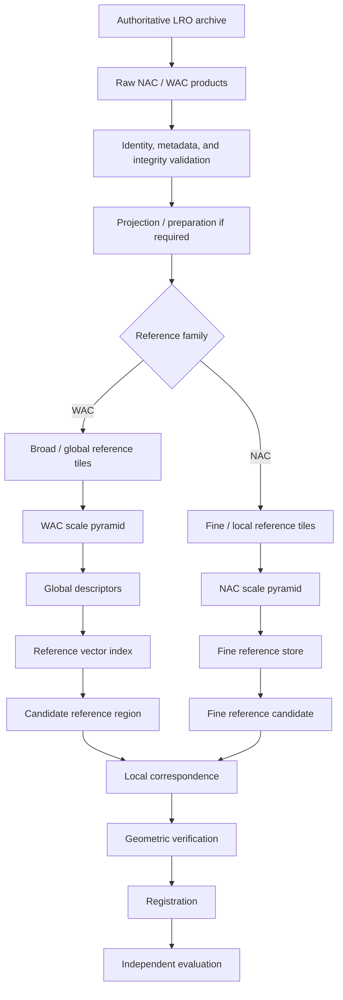
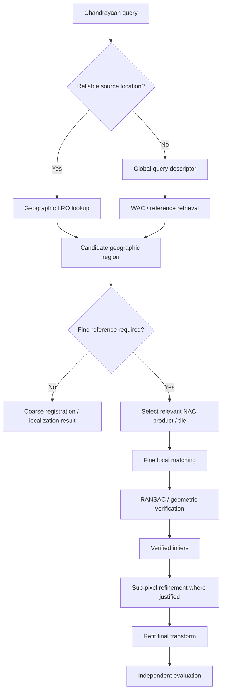

# Lunar Reconnaissance Orbiter Datasets

The **Lunar Reconnaissance Orbiter (LRO)** data family forms the primary **reference-data side** of ChandraMap. Chandrayaan-2 products from OHRC, TMC-2, and IIRS normally act as source/query imagery, while LRO reference products provide geographically meaningful lunar imagery against which those sources can be retrieved, matched, geometrically verified, registered, and evaluated.

ChandraMap primarily uses imagery from the **Lunar Reconnaissance Orbiter Camera (LROC)** system:

- **NAC — Narrow Angle Camera**, primarily for detailed/local reference imagery.
- **WAC — Wide Angle Camera**, primarily for broad/global/contextual reference imagery.

These roles are complementary rather than interchangeable.

Reference preparation must remain reproducible. Original archive products should be preserved, while map-projected derivatives, tiles, image pyramids, descriptors, indexes, crops, and benchmark references should remain traceable to the exact LRO products from which they were generated.

> **Core reference-data principle:** preserve authoritative LRO products and metadata, prepare reusable reference assets offline, compare source and reference imagery at physically meaningful scales, and keep every derived tile, pyramid level, descriptor, and benchmark pair traceable to its parent product.

| Dataset | Mission / System | Component           | Typical ChandraMap Role           | Spatial Scale                                                       |
| ------- | ---------------- | ------------------- | --------------------------------- | ------------------------------------------------------------------- |
| LRO NAC | LRO / LROC       | Narrow Angle Camera | Fine/local reference              | Product-dependent; often ~0.5–2 m/px in current ChandraMap planning |
| LRO WAC | LRO / LROC       | Wide Angle Camera   | Broad/global/contextual reference | Product/mode/processing-dependent                                   |

Actual product metadata takes precedence over approximate values in this document.

---

## 1. LRO Dataset Role in ChandraMap

LRO products primarily support the **reference side** of ChandraMap.

Typical uses include:

- source/reference benchmark pairs;
- geographic reference imagery;
- candidate-region retrieval;
- known-overlap registration;
- local feature correspondence;
- fine registration;
- broad lunar localization;
- reference database construction;
- geospatial localization;
- independent evaluation workflows where suitable truth exists.

The common project relationship is:

```text
Chandrayaan-2
source/query imagery
        ↓
LRO
reference imagery
        ↓
correspondence
        ↓
geometric verification
        ↓
registration
        ↓
evaluation
```

These roles are experiment-specific rather than permanent scientific classifications.

A controlled experiment may reverse source and reference roles when there is a clear reason to do so.

---

## 2. Dataset Documentation vs Sensor Documentation

Sensor documentation answers questions such as:

> What is NAC or WAC physically, and how do its imaging characteristics affect correspondence?

Dataset documentation answers:

> Which products are used, where do they come from, how are they stored, projected, tiled, indexed, paired, versioned, and reproduced?

Dedicated sensor pages include:

- [`../sensors/lro-nac.md`](../sensors/lro-nac.md)
- [`../sensors/lro-wac.md`](../sensors/lro-wac.md)

This file focuses on:

- data acquisition;
- storage;
- provenance;
- validation;
- reference preparation;
- tiling;
- scale pyramids;
- retrieval assets;
- benchmark pairing;
- versioning.

It intentionally avoids duplicating the complete instrument descriptions in the sensor documentation.

---

## 3. LRO, LROC, NAC, and WAC Terminology

The project should use these terms precisely.

### LRO

**Lunar Reconnaissance Orbiter**

The spacecraft and mission.

### LROC

**Lunar Reconnaissance Orbiter Camera**

The camera system associated with LRO.

### NAC

**Narrow Angle Camera**

The higher-detail local-reference component used by ChandraMap primarily for fine correspondence and registration.

### WAC

**Wide Angle Camera**

The wider-area component used by ChandraMap primarily for broad context, candidate localization, and global/coarse reference workflows.

Conceptually:

```text
LRO
│
└── LROC
    ├── NAC
    └── WAC
```

Do not use `LRO`, `LROC`, `NAC`, and `WAC` as interchangeable names.

---

## 4. LRO NAC Dataset

LRO NAC is the principal high-detail LRO reference family used by ChandraMap.

Current project planning often treats NAC imagery as approximately:

> **~0.5–2 m/pixel, depending on product, acquisition geometry, observation conditions, and processing.**

This is an approximate planning range rather than one universal NAC resolution.

Typical ChandraMap uses include:

- known-overlap reference imagery;
- fine local correspondence;
- detailed registration;
- reference tile generation;
- reference pyramid construction;
- candidate-region confirmation;
- source/reference training or evaluation pair construction where appropriate.

Important dataset properties include:

- product ID;
- original archive identity;
- acquisition time;
- image dimensions;
- GSD/pixel scale;
- processing state;
- projection;
- lunar coordinate system;
- geographic footprint;
- illumination geometry;
- viewing geometry;
- NoData/invalid regions.

Raw NAC products must remain traceable to the exact archive product from which they originated.

---

## 5. LRO WAC Dataset

LRO WAC provides broader lunar context than NAC and therefore serves a different dataset role.

Typical uses include:

- wide-area lunar reference imagery;
- global or regional context;
- coarse localization;
- candidate-region retrieval;
- reference mosaics;
- illumination/context experiments;
- global reference databases;
- WAC-to-NAC coarse-to-fine search.

ChandraMap does **not** define one universal WAC GSD.

The effective scale depends on the actual:

- product;
- acquisition mode;
- processing;
- projection;
- mosaic construction;
- observation geometry.

Actual LROC/PDS product metadata should control scale-aware processing.

---

## 6. NAC vs WAC Dataset Roles

| Aspect                 | LRO NAC                              | LRO WAC                                            |
| ---------------------- | ------------------------------------ | -------------------------------------------------- |
| Main role              | Fine/local reference                 | Broad/global/contextual reference                  |
| Typical use            | Detailed point correspondence        | Candidate localization and context                 |
| Relative detail        | Higher                               | Broader/coarser                                    |
| Typical pipeline stage | Fine registration                    | Coarse search/localization                         |
| Tiling purpose         | Fine local reference tiles           | Broad geographic/search tiles                      |
| Pyramid use            | Match source GSD during registration | Match query scale during retrieval/coarse matching |
| Reference strength     | Local terrain detail                 | Geographic context                                 |

WAC is not a "worse NAC."

NAC and WAC solve different reference problems.

---

## 7. Authoritative LRO Data Sources

LRO products should be obtained from authoritative mission and planetary-data providers.

Relevant source categories include:

- NASA Lunar Reconnaissance Orbiter documentation;
- LROC / Arizona State University;
- NASA Planetary Data System;
- LROC PDS archive/search resources;
- USGS ISIS documentation where planetary image preparation is required.

ChandraMap should avoid relying on undocumented re-hosted imagery when official mission products are available.

For each downloaded product, preserve where practical:

- provider/archive;
- original product ID;
- original filename;
- acquisition information;
- access/download date;
- checksum;
- provider documentation reference.

Exact download URLs should only be documented when verified.

---

## 8. Raw LRO Data

Raw LRO data means the original mission/archive product obtained from an authoritative provider.

A conceptual storage structure is:

```text
data/
└── raw/
    └── lro/
        ├── nac/
        └── wac/
```

Raw reference data should:

- remain unmodified;
- retain original product metadata;
- retain product identity;
- be recoverable from the authoritative provider;
- serve as the root of all derived-reference lineage.

If the repository defines another canonical structure elsewhere, that definition takes precedence.

---

## 9. Immutable Raw Reference Data

Raw LRO products should never be modified in place.

Do not:

- overwrite original NAC products;
- overwrite original WAC products;
- normalize them in place;
- resize them in place;
- rewrite original metadata;
- replace them with tiles;
- replace them with projected crops;
- save generated mosaics over the source product.

Use:

```text
raw
 ↓
interim
 ↓
processed
 ↓
derived
```

Keeping the raw reference immutable guarantees that later reference databases can be regenerated.

---

## 10. Interim LRO Data

Interim data represents temporary or transitional processing artifacts.

Examples may include:

- decompressed working files;
- format-converted products;
- calibration intermediates;
- temporary map-projection output;
- temporary planetary-processing artifacts;
- intermediate masks.

Conceptually:

```text
data/interim/lro/
```

Interim files should remain reproducible from raw data.

They are not authoritative mission products.

---

## 11. Processed LRO Data

Processed reference data may include:

- validated imagery;
- calibrated products;
- map-projected imagery;
- valid-pixel masks;
- geographically normalized reference products;
- registration-ready images.

A processed file should retain:

- parent product ID;
- processing software/version;
- projection;
- output scale;
- transformation parameters;
- output checksum where useful.

---

## 12. Derived LRO Data

Derived data includes reference assets generated specifically for ChandraMap.

Examples include:

- geographic tiles;
- overlapping tiles;
- multi-resolution pyramid levels;
- reference crops;
- global descriptors;
- local descriptor caches;
- structural representations;
- reference mosaics;
- geographic indexes;
- vector indexes;
- benchmark reference subsets.

Derived data is not mission truth.

It is a reproducible transformation of mission data.

---

## 13. Recommended LRO Data Layout

A conceptual layout is:

```text
data/
├── raw/
│   └── lro/
│       ├── nac/
│       └── wac/
│
├── interim/
│   └── lro/
│
├── processed/
│   └── lro/
│       ├── nac/
│       └── wac/
│
├── derived/
│   └── lro/
│       ├── tiles/
│       ├── pyramids/
│       ├── mosaics/
│       ├── descriptors/
│       └── indexes/
│
└── manifests/
    └── lro/
```

### `raw/`

Original archive products.

### `interim/`

Temporary processing artifacts.

### `processed/`

Validated/projected/registration-ready reference imagery.

### `derived/`

Tiles, pyramids, descriptors, mosaics, and indexes.

### `manifests/`

Machine-readable product and lineage metadata.

This structure is conceptual unless the repository declares it canonical elsewhere.

---

## 14. Do Not Commit Large LRO Products to Normal Git

Large reference imagery should normally remain outside ordinary Git history.

Reasons include:

- repository-size growth;
- slow clone/fetch operations;
- permanent binary history;
- duplicated derived assets;
- archive-update difficulty;
- reference pyramids multiplying storage requirements;
- indexes being regenerable.

Git should normally track:

- documentation;
- manifests;
- checksums;
- reference configuration;
- download scripts;
- preparation scripts;
- benchmark definitions;
- product identifiers;
- small test fixtures.

Git should usually not track:

- complete NAC archives;
- complete WAC archives;
- full lunar mosaics;
- large tile databases;
- large pyramid sets;
- descriptor databases;
- FAISS/vector indexes;
- temporary projected products.

---

## 15. Git LFS

Git LFS can be useful for:

- limited test fixtures;
- a small number of controlled binary examples;
- small benchmark assets when redistribution is appropriate.

It should not automatically replace proper scientific dataset storage.

A large lunar reference database should generally remain external to the source repository.

---

## 16. LRO Product Identity

Every reference product should remain tied to stable mission/archive identity.

Preserve:

- mission;
- LROC identity;
- NAC/WAC camera identity;
- official product ID;
- source archive;
- original filename;
- acquisition information;
- processing state.

Avoid relying only on names such as:

```text
moon_reference.tif
final_lro.png
nac_new2.tif
reference_final.tif
```

A stable product identifier is more reliable than an informal local filename.

---

## 17. LRO Dataset Manifest

A machine-readable manifest is recommended.

Possible fields include:

| Field                   | Purpose                         |
| ----------------------- | ------------------------------- |
| `dataset_id`            | Internal dataset identity       |
| `mission`               | Mission provenance              |
| `imaging_system`        | LROC identification             |
| `camera`                | NAC/WAC routing                 |
| `product_id`            | Exact product identity          |
| `source_archive`        | Provider/archive provenance     |
| `original_filename`     | Original archive/local filename |
| `local_path`            | Configurable local location     |
| `checksum`              | Integrity                       |
| `file_size`             | Storage/integrity information   |
| `product_type`          | Product interpretation          |
| `processing_state`      | Preparation state               |
| `acquisition_time`      | Observation provenance          |
| `width`                 | Image dimension                 |
| `height`                | Image dimension                 |
| `gsd`                   | Physical scale                  |
| `projection`            | Map interpretation              |
| `crs`                   | Coordinate reference            |
| `geographic_bounds`     | Geographic indexing             |
| `footprint`             | Overlap search                  |
| `latitude_bounds`       | Geographic search               |
| `longitude_bounds`      | Geographic search               |
| `illumination_metadata` | Sun-angle analysis              |
| `incidence_angle`       | Lighting geometry               |
| `emission_angle`        | Viewing geometry                |
| `phase_angle`           | Observation geometry            |
| `nodata`                | Valid-pixel masking             |
| `derived_from`          | Lineage                         |
| `notes`                 | Product-specific information    |

Fields unavailable for a product should remain explicitly missing.

They should never be invented.

---

## 18. Reference Tile Manifest

A derived tile may require additional metadata.

Possible conceptual fields include:

```text
tile_id
parent_product_id
camera
pixel_bounds
geographic_bounds
effective_gsd
projection
pyramid_level
tile_overlap
checksum
descriptor_id
reference_database_version
benchmark_usage
```

The exact schema should follow repository contracts when available.

The important principle is:

> **A tile must never lose its connection to the parent LRO product.**

---

## 19. Checksums

Checksums support:

- download validation;
- corruption detection;
- benchmark reproducibility;
- reference-database verification;
- cache validation.

A modern cryptographic checksum such as SHA-256 may be used where appropriate.

If another repository standard exists, follow that standard.

---

## 20. Product Metadata Validation

Before an LRO product is accepted into the reference system, validate where applicable:

- mission identity;
- LROC identity;
- NAC/WAC camera identity;
- product ID;
- product state/type;
- file readability;
- image dimensions;
- pixel data type;
- GSD;
- projection;
- lunar coordinate system;
- footprint;
- geographic bounds;
- acquisition time;
- NoData values;
- illumination metadata;
- viewing geometry.

Missing metadata should not be silently inferred.

---

## 21. Approximate Values vs Actual Metadata

ChandraMap should follow this authority order:

1. **actual product metadata**
2. **official product documentation**
3. **official NASA/LROC/PDS documentation**
4. **generic ChandraMap planning values**

For NAC, current planning may use:

> approximately **~0.5–2 m/pixel**

but this does not replace actual product GSD.

For WAC, ChandraMap intentionally avoids one generic universal resolution.

---

## 22. Product Processing State

LRO reference products may exist at different processing stages.

Conceptual examples include:

- raw/unprojected;
- calibrated;
- map-projected;
- mosaic;
- derived products.

Use the official product metadata and provider terminology.

Do not invent official processing-level names.

---

## 23. Map-Projected vs Unprojected Reference Data

Projection state affects how a reference can be used.

### Map-Projected Reference

May simplify:

- geographic lookup;
- source/reference overlap calculation;
- geographic tiling;
- coordinate conversion;
- coarse registration;
- benchmark construction.

### Unprojected Reference

May require additional handling involving:

- camera geometry;
- lunar shape model;
- spacecraft viewing geometry;
- projection;
- orthorectification;
- terrain information.

A V1 registration baseline does not need to use raw camera geometry if suitable projected reference products are available.

---

## 24. Projection Provenance

If ChandraMap creates its own projected reference product, record:

- source product ID;
- source checksum;
- output projection;
- coordinate reference system;
- output scale;
- processing tool;
- software version;
- parameters;
- output checksum.

Avoid anonymous projected files whose generation process cannot be reproduced.

---

## 25. Geographic Footprints

Geographic footprints are central to reference selection.

They may be used to:

- determine overlap;
- restrict candidate searches;
- identify relevant NAC products;
- identify relevant WAC tiles;
- connect WAC candidates to NAC coverage;
- avoid unnecessary whole-Moon retrieval.

When available, footprints should remain attached to product and tile manifests.

---

## 26. Known-Location Source Processing

When reliable Chandrayaan source metadata provides geographic information:

```text
source product
      ↓
source footprint
      ↓
geographic intersection
      ↓
relevant LRO products / tiles
      ↓
local registration
```

This should generally be preferred over full global retrieval.

Using valid mission metadata is correct engineering.

---

## 27. Unknown-Location Source Processing

When location is unknown, unreliable, or intentionally withheld for a retrieval benchmark:

```text
source query
     ↓
global representation
     ↓
reference search
     ↓
Top-K LRO candidates
     ↓
local verification
     ↓
registration
```

This is a distinct benchmark mode and should not be mixed silently with metadata-constrained registration.

---

## 28. Known-Overlap Dataset

A known-overlap pair should record:

- Chandrayaan source product;
- LRO reference product;
- reference tile if applicable;
- confirmed overlap;
- source instrument;
- NAC/WAC reference identity;
- source GSD;
- reference GSD/effective scale;
- source/reference projections;
- geographic region;
- independent check points where available;
- benchmark category;
- benchmark version.

Known-overlap pairs should be the preferred V1 dataset style.

---

## 29. Why Known-Overlap Comes First

Known-overlap evaluation isolates the registration problem.

It tests:

- source preprocessing;
- scale selection;
- local matching;
- geometric verification;
- transformation estimation;
- sub-pixel refinement;
- error measurement.

It removes:

- whole-Moon retrieval;
- global descriptor design;
- reference-index construction;
- Top-K candidate ranking;

from the initial experiment.

This makes failures easier to diagnose.

---

## 30. Reference Tiling

Large NAC/WAC products or mosaics may be split into smaller geographic tiles.

Benefits include:

- lower memory usage;
- local matching efficiency;
- parallel processing;
- geographic indexing;
- candidate retrieval;
- easier scale-pyramid construction.

Tile size should remain configurable.

No universal tile size is defined here.

---

## 31. Tile Overlap

Tile overlap can reduce boundary failures.

Without overlap:

```text
Tile A | Tile B
       ^
       crater/ridge crosses boundary
```

a useful structure can become fragmented.

Overlap should be:

- configurable;
- recorded;
- benchmarkable;
- included in reference-database versioning.

No universal overlap percentage is defined here.

---

## 32. Reference Tile Provenance

Every reference tile should retain:

- parent product/mosaic;
- pixel bounds;
- geographic bounds;
- projection;
- effective scale;
- pyramid level;
- tile-overlap configuration;
- preprocessing history.

An exported PNG/TIFF without parent provenance should not be treated as a scientifically reproducible reference asset.

---

## 33. Multi-Resolution Reference Pyramids

Multi-resolution reference handling is central to ChandraMap.

Conceptually:

```text
LRO reference
     ↓
Level 0 — native/prepared scale
     ↓
Level 1 — downsampled
     ↓
Level 2 — further downsampled
     ↓
Level 3
     ↓
...
```

The purpose is to expose terrain at scales compatible with different source sensors.

> **Compare physical information, not pixel count.**

A pyramid level should be selected based on source information content rather than arbitrary image dimensions.

---

## 34. Why Reference Downsampling Matters

A fine NAC product may contain structures that a coarse source never resolved.

For example:

```text
TMC-2
~5 m/px

IIRS
~80 m/px

NAC
often substantially finer
```

If the source is much coarser, reducing the reference can make correspondence more physically meaningful.

Preferred:

```text
fine reference
      ↓
downsample
      ↓
comparable structural scale
```

Not:

```text
coarse source
      ↓
upsample heavily
      ↓
pretend fine terrain detail exists
```

Upsampling cannot recover information that was never measured.

---

## 35. Source-Specific Reference Scale Selection

### OHRC Query

OHRC can potentially support relatively fine NAC reference levels.

Actual selection depends on:

- source GSD;
- NAC product GSD;
- illumination;
- viewing geometry;
- overlap.

### TMC-2 Query

TMC-2 may require a coarser NAC level before initial correspondence.

### IIRS Query

IIRS may require:

- a registration-friendly 2D representation;
- substantial NAC downsampling;
- coarse structural matching.

Do not define one fixed scale-ratio threshold without benchmark evidence.

---

## 36. LRO NAC Pairing with OHRC

OHRC ↔ NAC is a natural high-detail cross-mission experiment.

Potential shared information includes:

- crater rims;
- ridges;
- local terrain morphology;
- structural surface detail.

Primary challenges include:

- illumination differences;
- shadow geometry;
- viewing geometry;
- product GSD differences;
- acquisition conditions;
- projection.

Do not assume this pairing is automatically easy simply because both datasets are high-resolution.

---

## 37. LRO NAC Pairing with TMC-2

TMC-2 is approximately ~5 m/pixel in current ChandraMap planning, while NAC is commonly finer.

A typical strategy is:

```text
NAC
 ↓
reference pyramid
 ↓
select TMC-2-compatible level
 ↓
structural matching
```

Relevant shared structures may include:

- medium/large crater rims;
- ridge systems;
- broad morphology;
- larger terrain boundaries.

Fine NAC detail invisible to TMC-2 should not dominate the matcher.

---

## 38. LRO NAC Pairing with IIRS

IIRS ↔ NAC is one of the most difficult reference pairings because it combines:

- a very large scale difference;
- a modality difference.

The correct conceptual preparation is:

```text
IIRS
 ↓
derive documented 2D registration representation

NAC
 ↓
select strongly reduced pyramid level

        ↓

coarse structural correspondence
        ↓
geometric verification
```

Fine NAC-level physical accuracy should not be claimed from an IIRS source without independent evidence.

---

## 39. LRO WAC Pairing with OHRC

WAC can provide:

- broad context;
- global search;
- coarse localization.

OHRC may contain much finer terrain detail.

One possible flow is:

```text
OHRC
 ↓
coarse representation
 ↓
WAC localization
 ↓
candidate lunar region
 ↓
NAC selection
 ↓
fine registration
```

If reliable OHRC geolocation already exists, the WAC retrieval stage may be skipped.

---

## 40. LRO WAC Pairing with TMC-2

Possible uses include:

- wide-area localization;
- coarse terrain comparison;
- candidate-region search;
- contextual reference matching.

Compatibility depends on the specific WAC product's scale, projection, and processing state.

Do not assume direct one-to-one GSD compatibility.

---

## 41. LRO WAC Pairing with IIRS

Possible uses include:

- coarse cross-modal localization;
- broad terrain context;
- global candidate retrieval.

IIRS must still be converted into a documented registration-friendly representation.

The source and WAC reference should be compared at a physically meaningful scale.

---

## 42. WAC-to-NAC Coarse-to-Fine Reference Handoff

A possible reference hierarchy is:

```text
Source query
      ↓
WAC candidate retrieval
      ↓
candidate geographic region
      ↓
relevant NAC products / tiles
      ↓
fine local matching
      ↓
geometric verification
      ↓
fine registration
```

Possible handoff information includes:

- candidate geographic bounds;
- approximate center;
- WAC tile ID;
- retrieval score;
- estimated overlap;
- approximate transform;
- search window.

Exact API fields should be defined by repository contracts rather than this dataset overview.

---

## 43. Why WAC-to-NAC Handoff Is Useful

Potential advantages include:

- reduced fine-reference search space;
- fewer NAC products to examine;
- separation of retrieval from registration;
- lower compute cost;
- clearer reference responsibilities.

However, if accurate geolocation already exists, direct NAC selection may be preferable.

---

## 44. Reference Database Architecture

A conceptual LRO reference database may contain:

```text
reference database
├── products
├── tiles
├── pyramid levels
├── geographic metadata
├── product metadata
├── global descriptors
├── index mappings
├── provenance
└── version identifiers
```

This is an architectural design, not a claim that the entire database is already implemented.

---

## 45. Global Retrieval Dataset

Global retrieval requires a specifically designed reference dataset.

### Reference Side

May contain:

- geographically labeled LRO tiles;
- multiple relevant scale levels;
- global descriptors;
- product metadata;
- geographic metadata.

### Query Side

May contain:

- Chandrayaan source images;
- source representations;
- expected geographic/reference labels.

### Metrics

Use retrieval metrics such as:

- Recall@1;
- Recall@5;
- Recall@K.

These should not be confused with registration error.

---

## 46. Global Descriptor vs Local Matcher

Global and local representations solve different tasks.

### Global Descriptor

Answers:

> Which reference region is likely to contain this source?

Typical output:

- Top-K reference candidates.

### Local Matcher

Answers:

> Which specific image points correspond inside this candidate pair?

Typical output:

- candidate tie points.

The pipeline then applies geometric verification.

---

## 47. FAISS / Vector Index Role

FAISS or another vector-search system may support candidate retrieval.

Conceptually:

```text
LRO tile descriptors
       ↓
vector index
       ↓
Top-K candidate reference tiles
```

FAISS does not:

- understand lunar coordinates automatically;
- create tiles;
- extract local correspondences;
- perform RANSAC;
- estimate transformations;
- warp imagery;
- create ground truth.

Its role is vector search.

---

## 48. Offline Reference Preparation

LRO preparation should usually happen offline.

A conceptual build pipeline is:

1. obtain authoritative products;
2. verify product identity;
3. validate integrity;
4. parse metadata;
5. project where necessary;
6. generate valid-data masks;
7. tile reference imagery;
8. generate pyramid levels;
9. compute global descriptors where retrieval is required;
10. build searchable index;
11. save geographic/product mappings;
12. freeze a reference-database version.

This prevents rebuilding the same reference assets for every query.

---

## 49. Online Query Processing

A typical online query path is:

```text
Chandrayaan source
        ↓
sensor-specific preparation
        ↓
known-location lookup
        OR
global retrieval
        ↓
LRO candidate
        ↓
local matching
        ↓
geometric verification
        ↓
sub-pixel refinement where meaningful
        ↓
registration
        ↓
evaluation
```

Offline and online responsibilities should remain separate.

---

## 50. Retrieval vs Registration Dataset Tasks

| Task           | Reference Data                         | Output               | Main Metrics                       |
| -------------- | -------------------------------------- | -------------------- | ---------------------------------- |
| Retrieval      | LRO tile/index database                | Top-K regions        | Recall@K                           |
| Local matching | Candidate source/LRO pair              | Candidate tie points | Inlier count, inlier ratio         |
| Registration   | Verified source/LRO pair               | Transformation       | Check-point RMSE, spatial coverage |
| Geolocation    | Registered source + reference metadata | Lunar position       | Ground error when valid            |

Successful retrieval does not prove accurate registration.

Accurate local registration does not prove the global retrieval system can find the correct region.

---

## 51. Benchmark Pair Definitions

Each benchmark pair should conceptually record:

```text
pair_id
source_product_id
source_sensor
reference_product_id
reference_camera
reference_tile_id
source_gsd
reference_gsd
reference_pyramid_level
source_projection
reference_projection
geographic_bounds
overlap_region
benchmark_category
check_point_set
dataset_version
reference_database_version
notes
```

Exact field names should follow repository contracts where they exist.

---

## 52. Benchmark Stress Categories

### Known-Overlap / Baseline

Purpose:

- verify end-to-end registration.

### Scale Stress

Purpose:

- evaluate large GSD differences.

### Sun-Angle Stress

Purpose:

- measure robustness to illumination and shadow changes.

### Modality Stress

Purpose:

- test cross-modal cases such as IIRS-derived representations against visible LRO data.

### Geometry Stress

Purpose:

- test relief, projection, and viewpoint differences.

### Low-Feature Terrain

Purpose:

- expose limited-keypoint regions.

### Repetitive Crater Terrain

Purpose:

- measure false matches and retrieval ambiguity.

No arbitrary numerical difficulty score should be attached without evidence.

---

## 53. Reference Selection Bias

Benchmark designers should avoid selecting only easy LRO regions.

A useful evaluation set should include:

- successful pairs;
- difficult pairs;
- failure cases;
- varied terrain;
- varied illumination;
- varied scale differences;
- repetitive terrain;
- low-feature terrain.

Dataset selection should not be optimized to favor one algorithm.

---

## 54. Geographic Leakage

If learned retrieval or matching models are trained, heavily overlapping lunar regions can cause leakage.

Avoid placing neighboring or overlapping reference tiles from the same terrain in both training and testing unless the benchmark explicitly permits it.

Track:

- geographic footprint;
- parent product;
- tile lineage;
- overlap information.

Region-level splits may be necessary for meaningful generalization evaluation.

---

## 55. Product Leakage

Derived variants of the same parent product can also leak across splits.

Examples include:

- another crop;
- another pyramid level;
- an augmented variant;
- an overlapping neighboring tile;
- another normalization of the same source.

Split construction should use parent-product lineage rather than file names alone.

---

## 56. Query/Reference Leakage

Global retrieval can become artificially easy if a query is directly generated from the same exact reference product represented in the search database.

Cross-mission retrieval benchmarks should preserve the intended independence between:

- source/query imagery;
- reference imagery.

Any intentional same-product retrieval experiment should be clearly labeled.

---

## 57. Ground Truth and Reference Data

Reference imagery is not automatically independent ground truth.

Possible evaluation truth may come from:

- official challenge truth;
- trusted geospatial relationships;
- independently verified correspondences;
- held-out manually validated check points.

Matcher-generated correspondences and RANSAC inliers are not ground truth.

---

## 58. Control Points vs Check Points

### Control / Tie / Fit Points

Used to estimate a transformation.

### Check Points

Used only for independent evaluation.

Conceptually:

```text
control points
      ↓
fit transformation

independent check points
      ↓
measure registration accuracy
```

Do not mix them when reporting independent RMSE.

---

## 59. Coordinate Conventions

Benchmark annotations should explicitly define:

- source `x/y`;
- reference `x/y`;
- row/column convention;
- image origin;
- zero-based vs one-based indexing;
- pixel-center convention;
- map-coordinate convention.

Ambiguous coordinate annotations can invalidate otherwise correct benchmark results.

---

## 60. Lunar Coordinate Systems

LRO products may use lunar cartographic reference systems and projections.

Record where available:

- projection;
- lunar CRS/reference system;
- latitude convention;
- longitude convention;
- coordinate units;
- datum/reference model.

Use authoritative product metadata and planetary cartographic documentation.

Do not invent coordinate assumptions.

---

## 61. Reference Mosaic Handling

When a WAC or other LRO mosaic is used, preserve:

- mosaic ID/version;
- source/provider;
- projection;
- scale;
- geographic coverage;
- NoData information;
- processing provenance;
- source-product lineage where available.

A derived mosaic should not be treated as though it were one original observation.

---

## 62. Mosaic vs Individual Observation

### Individual Observation

May retain specific:

- acquisition time;
- illumination geometry;
- viewing geometry;
- spacecraft configuration.

### Mosaic

May combine:

- multiple observations;
- multiple acquisition times;
- reprojection;
- resampling;
- seam selection;
- different illumination conditions.

This distinction matters when interpreting illumination or geometry benchmarks.

---

## 63. Illumination Metadata

Where available, retain information such as:

- acquisition time;
- Sun geometry;
- incidence angle;
- phase angle;
- emission/viewing geometry.

This metadata can support controlled Sun-angle benchmark design.

Not every product exposes every field in the same form.

Missing values should remain explicit.

---

## 64. LRO Illumination Stress Dataset

A controlled illumination dataset may use overlapping lunar terrain observed under different lighting.

Purpose:

> Measure how correspondence and retrieval degrade when lunar shadow geometry changes.

Potential metrics include:

- Recall@K;
- candidate match count;
- inlier count;
- inlier ratio;
- spatial coverage;
- independent check-point RMSE.

The dataset should report measured degradation rather than assume illumination invariance.

---

## 65. Reference Data Integrity

Potential LRO quality checks include:

- file readable;
- product ID known;
- correct NAC/WAC identity;
- checksum valid;
- dimensions valid;
- GSD available when required;
- projection interpretable;
- footprint valid;
- NoData handled correctly;
- metadata parsable;
- geographic bounds valid;
- tile/pyramid lineage valid.

Not every check applies identically to every product.

---

## 66. Tile Quality Control

For each tile, verify where practical:

- parent link exists;
- pixel bounds are valid;
- geographic bounds are valid;
- projection is recorded;
- tile is not entirely NoData;
- effective scale is recorded;
- pyramid level is correct;
- overlap configuration is recorded;
- checksum is valid if used.

A tile with missing parent identity should not enter a frozen benchmark.

---

## 67. Pyramid Quality Control

Verify that:

- every level derives from the correct parent;
- resampling method is recorded;
- expected scale progression is known;
- projection remains interpretable;
- dimensions are consistent;
- NoData handling is correct;
- an upsampled product is not mislabeled as newly recovered detail.

---

## 68. Reference Database Versioning

A reference-database version may freeze:

- source LRO product list;
- product metadata;
- tiling configuration;
- tile overlap;
- pyramid levels;
- descriptor model/version;
- vector index build;
- geographic mappings;
- processing configuration.

The version should be recorded with retrieval and registration results.

---

## 69. Dataset Version vs Reference Index Version

These should remain separate concepts.

### Dataset Version

Defines scientific benchmark inputs such as:

- source products;
- reference products;
- pair definitions;
- truth/check points;
- splits.

### Reference Index Version

Defines retrieval infrastructure such as:

- tiling;
- pyramid construction;
- descriptor model;
- descriptor values;
- vector index.

A new descriptor model may require a new index version without changing the underlying benchmark dataset.

---

## 70. Benchmark Versioning

A benchmark version should freeze:

- pair list;
- Chandrayaan source products;
- LRO reference products;
- tile IDs;
- selected reference scales;
- ground truth/check points;
- split definitions;
- evaluation protocol.

This allows fair comparison across ChandraMap algorithm versions.

---

## 71. LRO Dataset Role Across ChandraMap Versions

Existing version specifications remain authoritative. The following is a conceptual progression.

### V1 — Known-Pair Reference

Use:

- a small number of known-overlap LRO NAC pairs;
- simple classical local matching;
- RANSAC;
- transformation estimation;
- independent metrics.

Global retrieval is not required.

### V2 — Multi-Scale Reference

Possible additions:

- NAC pyramids;
- scale-aware reference selection;
- illumination stress cases;
- WAC contextual experiments.

### V3 — Reference Retrieval System

Possible additions:

- NAC/WAC tiling;
- global descriptors;
- vector indexes;
- Top-K candidate retrieval;
- WAC-to-NAC handoff.

### V4 — Research-Grade Reference System

Possible additions:

- larger lunar reference database;
- DEM/sensor geometry;
- lunar-specific embeddings;
- advanced illumination-aware retrieval;
- additional lunar missions;
- stronger geographic split benchmarks.

These are conceptual roles, not implementation claims.

---

## 72. Reference Data Storage

Large LRO assets may reside on:

- local disk;
- external SSD;
- network storage;
- research server;
- object storage.

The repository should locate them using:

- manifests;
- configuration;
- environment settings;
- CLI arguments.

Code should not depend on one developer's filesystem layout.

---

## 73. Data Root Configuration

Avoid hard-coded paths such as:

```text
C:\Users\Name\MoonData\
```

or:

```text
/home/name/lro/
```

Prefer a configurable data root.

A conceptual setting such as:

```text
CHANDRAMAP_DATA_ROOT
```

may illustrate the pattern, but the final environment-variable/configuration contract should be defined elsewhere in the repository.

---

## 74. Download Automation

Future download tooling should ideally:

- use authoritative providers;
- accept product IDs or search criteria;
- preserve official product identifiers;
- avoid duplicate downloads;
- verify integrity where practical;
- record provenance;
- fail clearly;
- avoid silently modifying frozen benchmarks;
- keep secrets out of source code.

This document defines desired behavior, not an implementation.

---

## 75. Reference Preparation Automation

Future reference-preparation tools may automate:

- metadata extraction;
- validation;
- map projection;
- tile generation;
- pyramid generation;
- descriptor computation;
- index building;
- manifest updates.

Each transformation must remain reproducible from:

```text
source product
+
configuration
+
software version
```

---

## 76. Caching

Regenerable caches may include:

- local feature descriptors;
- global descriptors;
- temporary tiles;
- intermediate pyramid assets;
- retrieval indexes.

Caches are not authoritative reference data.

They should be reproducible from the underlying products and configuration.

---

## 77. Reproducibility Requirements

An LRO-based ChandraMap experiment should ideally record:

- Chandrayaan source product ID;
- LRO product ID;
- NAC/WAC identity;
- reference tile ID;
- pyramid level;
- source and reference GSD;
- projection;
- reference preprocessing;
- source representation;
- global descriptor version where applicable;
- matcher/version;
- geometric model;
- benchmark version;
- reference index version;
- evaluation/check-point version.

Without these fields, two nominally identical experiments may actually use different inputs.

---

## 78. Reference File Naming

Avoid names such as:

```text
final_ref.png
lro2.tif
moon_reference_final_final.tif
```

Prefer stable identifiers connected to:

- product ID;
- tile ID;
- camera;
- representation;
- pyramid level.

Full metadata belongs in manifests rather than filenames.

---

## 79. Reference Dataset IDs

Stable IDs are useful for:

- products;
- tiles;
- pyramid levels;
- descriptors;
- index builds;
- benchmark pairs;
- reference-database versions.

They connect:

- manifests;
- benchmark definitions;
- logs;
- experiment outputs;
- evaluation reports.

The exact ID syntax should follow repository conventions.

---

## 80. LRO Licensing, Access, and Attribution

ChandraMap should not invent legal or redistribution claims.

Contributors should follow authoritative provider guidance from:

- NASA;
- NASA Planetary Data System;
- LROC / Arizona State University.

Record where relevant:

- data source;
- attribution guidance;
- scientific citation guidance;
- redistribution terms.

If requirements are uncertain, defer to official provider documentation.

---

## 81. Scientific Citation

LRO data should be cited according to official provider guidance.

Record enough information to identify:

- mission;
- camera/instrument;
- product ID;
- archive;
- product documentation;
- official dataset citation where applicable.

Do not fabricate DOIs or citation requirements.

---

## 82. Adding a New NAC Product

A contributor adding an NAC product should:

1. identify the authoritative product;
2. record the product ID;
3. download it to raw reference storage;
4. verify integrity;
5. parse metadata;
6. confirm NAC identity;
7. determine processing/projection state;
8. record GSD and footprint;
9. create a processed copy if required;
10. add/update the manifest;
11. generate tile/pyramid derivatives if needed;
12. define a benchmark pair when useful;
13. preserve complete provenance.

---

## 83. Adding a New WAC Product

A contributor should additionally determine:

- whether the reference is an individual observation or mosaic;
- geographic coverage;
- product/mode-specific spatial scale;
- projection;
- intended use;
- suitability for global retrieval;
- suitability for illumination experiments;
- relationship to NAC coverage.

Not every WAC product should automatically enter the same pipeline role.

---

## 84. Adding a New LRO Mosaic

For a new mosaic, record:

- source/provider;
- mosaic identifier/version;
- projection;
- scale;
- geographic coverage;
- NoData definition;
- processing history;
- source-product lineage where available;
- intended ChandraMap role.

An undocumented mosaic should not be treated as independent ground truth.

---

## 85. LRO Dataset Limitations

### NAC Scale Varies

NAC GSD depends on the actual product and acquisition geometry.

### WAC Characteristics Vary

No single WAC scale should be assumed for every product.

### Illumination Can Differ Strongly

The same terrain may contain very different shadows across missions and acquisition times.

### Projection State Varies

Not every reference product should be assumed to be map-projected.

### Terrain Relief Can Affect Geometry

Simple planar transforms may leave spatially varying residuals.

### Reference Preparation Can Be Storage-Intensive

Tiles, pyramids, descriptors, and indexes can multiply reference storage.

### Cross-Mission Coverage May Be Uneven

Not every Chandrayaan product has an equally suitable LRO counterpart.

### IIRS Pairing Is Difficult

It combines modality and scale differences.

### Global Retrieval Can Be Ambiguous

Repeated crater terrain can produce false candidate regions.

### Reference Imagery Is Not Perfect Ground Truth

Independent check points or authoritative truth are still required.

### Mosaics May Combine Multiple Observations

Their interpretation differs from one raw acquisition.

### Metadata Quality Matters

Missing or misinterpreted metadata can invalidate scale and geolocation claims.

---

## 86. Common LRO Dataset Mistakes

Do not:

- use LRO, LROC, NAC, and WAC as interchangeable terms;
- hard-code one NAC GSD for every product;
- invent one universal WAC GSD;
- describe WAC simply as a worse NAC;
- modify archive products in place;
- discard official product IDs;
- create anonymous tiles;
- lose tile-to-parent lineage;
- compare source/reference scale only by pixel dimensions;
- upsample TMC-2/IIRS and claim recovered NAC detail;
- search the whole Moon when reliable source coordinates exist;
- confuse retrieval with local registration;
- describe FAISS as an image-registration algorithm;
- treat LRO imagery as automatic ground truth;
- report fit-point residuals as independent accuracy;
- mix overlapping lunar regions across train/test without review;
- commit a huge reference database into ordinary Git history;
- mix benchmark versions;
- invent licensing or access rules.

---

## 87. Example LRO Reference Data Flow



---

## 88. Coarse-to-Fine Reference Flow



The architecture supports both metadata-constrained and retrieval-driven reference selection.

---

## 89. Relationship to Dataset README

The overall dataset governance guide is:

- [`README.md`](README.md)

`docs/datasets/README.md` describes:

- all mission datasets;
- dataset lifecycle;
- manifests;
- Git/storage policy;
- benchmark governance;
- reproducibility.

This file focuses specifically on the LRO reference-data family.

---

## 90. Relationship to Chandrayaan-2 Dataset Documentation

The source-side dataset guide is:

- [`chandrayaan-2.md`](chandrayaan-2.md)

Together:

```text
chandrayaan-2.md
→ primary source/query dataset family

lro.md
→ primary reference dataset family
```

These documents describe the principal cross-mission data relationship used by ChandraMap.

---

## 91. Relationship to Sensor Documentation

Relevant sensor pages include:

- [`../sensors/overview.md`](../sensors/overview.md)
- [`../sensors/lro-nac.md`](../sensors/lro-nac.md)
- [`../sensors/lro-wac.md`](../sensors/lro-wac.md)
- [`../sensors/ohrc.md`](../sensors/ohrc.md)
- [`../sensors/tmc2.md`](../sensors/tmc2.md)
- [`../sensors/iirs.md`](../sensors/iirs.md)

Sensor documentation describes:

- sensor physics;
- spatial scale;
- modality;
- registration implications.

This file describes:

- LRO product organization;
- reference preparation;
- tiling;
- indexing;
- pairing;
- dataset governance.

---

## 92. Relationship to Architecture Documentation

Relevant architecture pages include:

- [`../architecture/system-overview.md`](../architecture/system-overview.md)
- [`../architecture/v1-pipeline.md`](../architecture/v1-pipeline.md)
- [`../architecture/core-engine-architecture.md`](../architecture/core-engine-architecture.md)
- [`../architecture/backend-architecture.md`](../architecture/backend-architecture.md)
- [`../architecture/module-map.md`](../architecture/module-map.md)
- [`../architecture/data-flow.md`](../architecture/data-flow.md)
- [`../architecture/output-flow.md`](../architecture/output-flow.md)

LRO reference preparation connects to architecture in two major phases:

### Offline

```text
reference ingestion
→ validation
→ projection
→ tiling
→ pyramids
→ descriptors
→ indexes
```

### Online

```text
source query
→ reference selection
→ local matching
→ verification
→ registration
→ evaluation
```

Dataset definitions and architecture contracts should remain consistent.

---

## 93. Relationship to Project Documentation

Relevant project pages include:

- [`../project/goals.md`](../project/goals.md)
- [`../project/non-goals.md`](../project/non-goals.md)
- [`../project/v1-scope.md`](../project/v1-scope.md)
- [`../project/terminology.md`](../project/terminology.md)
- [`../project/assumptions.md`](../project/assumptions.md)
- [`../project/limitations.md`](../project/limitations.md)

> **The authoritative V1 scope document determines which LRO capabilities belong in V1. This dataset document must not silently expand that scope.**

---

## 94. Authoritative References

LRO dataset engineering should prioritize official mission, archive, and planetary-processing documentation.

### NASA / LRO

Relevant authoritative resources include:

- NASA Lunar Reconnaissance Orbiter documentation
- NASA mission and science documentation for LRO

### LROC

Relevant authoritative resources include:

- LROC / Arizona State University documentation
- LROC NAC documentation
- LROC WAC documentation
- official LROC product documentation

### Planetary Data System

Relevant resources include:

- NASA Planetary Data System
- LROC PDS archive/search documentation

### Planetary Processing

Relevant resources include:

- USGS ISIS documentation
- USGS lunar/cartographic processing documentation
- relevant planetary image-processing documentation

### Chandrayaan-2 Pairing Context

Relevant resources include:

- ISRO Chandrayaan-2 documentation
- ISRO / ISSDC
- PRADAN

> **Actual product metadata and authoritative archive/product documentation take precedence over approximate ChandraMap descriptions.**

This document follows the supplied ChandraMap LRO dataset specification and reference-data requirements.

---

## LRO Reference Dataset Principles

### LRO Is the Primary Reference Dataset Family

Chandrayaan-2 generally provides source/query imagery, while LRO provides reference imagery.

### Use Correct Terminology

Keep `LRO`, `LROC`, `NAC`, and `WAC` distinct.

### Product Metadata Is Authoritative

Generic planning values never override actual product metadata.

### NAC Scale Is Product-Dependent

Do not treat the approximate planning range as a universal constant.

### Do Not Invent a Universal WAC Scale

Use the actual product/mosaic metadata.

### Raw Reference Data Is Immutable

Never overwrite mission/archive products.

### Provenance Must Survive Every Transformation

Tiles, pyramids, crops, mosaics, descriptors, and indexes must remain traceable.

### Known-Overlap Comes First

V1 should validate local registration before requiring global lunar retrieval.

### Metadata Should Restrict Search

If a reliable source footprint exists, use it.

### Retrieval and Registration Are Different

Top-K search identifies candidate regions.

Registration estimates precise geometric correspondence.

### Global Descriptors and Local Features Are Different

Use each representation for its intended task.

### FAISS Searches Vectors

It is not an image-registration engine.

### Compare Physical Information

Use GSD and effective information scale rather than equal pixel dimensions.

### Downsample Fine References When Necessary

A physically comparable reference can be more useful than native/full-resolution imagery.

### Upsampling Does Not Recover Missing Terrain Detail

Interpolation cannot recreate information a coarse sensor never measured.

### WAC and NAC Have Different Responsibilities

```text
WAC
→ broad/global/context

NAC
→ fine/local/detail
```

### Reference Imagery Is Not Automatically Ground Truth

Independent evaluation data remains necessary.

### Prevent Geographic Leakage

Highly overlapping reference regions can inflate learned-model results.

### Freeze Benchmark and Reference Versions

Fair algorithm comparison requires stable reference products, tiles, scales, and evaluation data.

### Keep Large Reference Assets Outside Normal Git

Track manifests, configuration, scripts, and product identifiers instead.

### Reproducibility Comes Before Reference-Database Size

> **A smaller, versioned, metadata-complete LRO reference set is more scientifically useful than a massive collection of tiles whose source products, projection, scale, and preprocessing cannot be reconstructed.**
