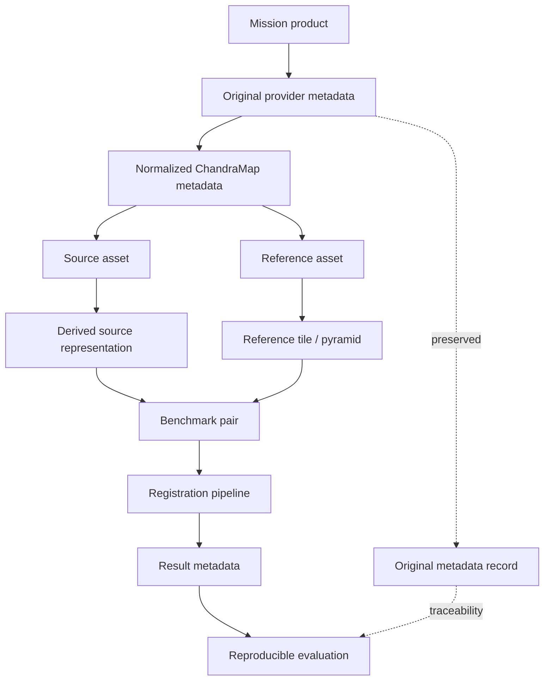
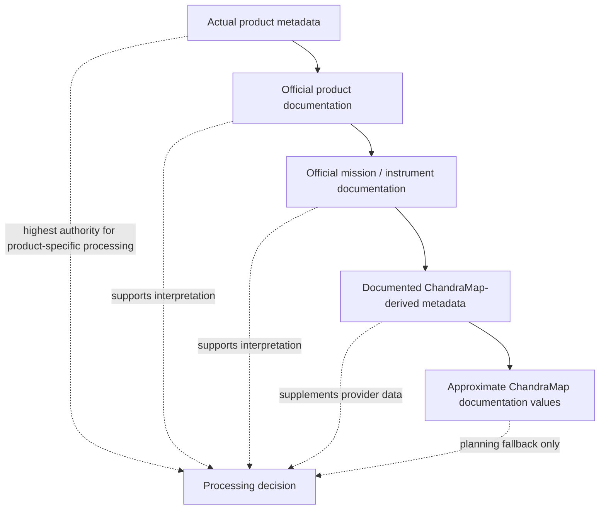

# Dataset Metadata

Metadata is part of the scientific meaning of every ChandraMap dataset. A lunar image without reliable information about its mission, sensor, physical scale, projection, geographic footprint, spectral content, observation geometry, and processing history cannot always be interpreted correctly for registration or benchmarking.

ChandraMap therefore treats metadata as a first-class dataset component rather than optional descriptive information.

Metadata influences:

- sensor-specific routing;
- product validation;
- physical scale selection;
- source/reference pairing;
- geographic search restriction;
- projection handling;
- illumination analysis;
- spectral representation;
- coordinate conversion;
- accuracy reporting;
- benchmark construction;
- reproducibility;
- failure diagnosis.

> **ChandraMap should never separate lunar imagery from the metadata required to interpret it physically.**

Actual mission-product metadata is authoritative. Approximate sensor values used throughout ChandraMap documentation are useful for architecture and planning, but they must never silently override product-specific information.

---

## 1. Why Metadata Matters

Image registration is not only a pixel-processing problem.

Two images with the same dimensions may represent completely different physical areas of the Moon. Two products covering the same lunar location may use different projections, spatial scales, illumination conditions, or sensor modalities.

Metadata provides the context required to understand those differences.

### Without GSD

ChandraMap may select an inappropriate reference-pyramid level and attempt to compare terrain at incompatible physical scales.

### Without Projection Information

Pixel coordinates may not be convertible into meaningful lunar map coordinates.

### Without a Geographic Footprint

The system may be unable to restrict reference search to the relevant lunar region.

### Without Product Identity

A result may not be reproducible because the exact mission product cannot be recovered.

### Without Illumination Metadata

A difficult registration failure may be incorrectly attributed to the matcher rather than substantially different Sun geometry.

### Without IIRS Band Metadata

A derived hyperspectral registration image may be impossible to reproduce.

### Without Provenance

A tile, crop, pyramid level, or descriptor may become disconnected from the mission data that generated it.

Metadata therefore participates directly in both algorithm correctness and scientific interpretation.

---

## 2. Metadata Categories

ChandraMap metadata can be grouped into the following conceptual categories.

| Category             | Purpose                                                             |
| -------------------- | ------------------------------------------------------------------- |
| Identity             | Identify mission, instrument, product, and asset                    |
| File                 | Describe local file integrity and storage                           |
| Spatial              | Describe dimensions, sampling, channels, and valid pixels           |
| Geospatial           | Describe footprint, projection, coordinates, and reference system   |
| Temporal             | Record acquisition/observation time                                 |
| Illumination         | Describe Sun and lighting geometry                                  |
| Observation geometry | Describe sensor/viewing geometry                                    |
| Spectral             | Describe bands and wavelengths                                      |
| Processing           | Describe calibration, projection, and processing state              |
| Provenance           | Connect assets to their source and transformations                  |
| Derived-data         | Describe tiles, pyramids, representations, descriptors, and indexes |
| Benchmark            | Describe pairs, splits, truth, stress categories, and versions      |
| Registration result  | Describe transformation, metrics, runtime, and failure state        |

Not every category applies equally to every sensor or asset.

---

## 3. Metadata Authority Hierarchy

When metadata sources disagree, ChandraMap should follow this conceptual authority order:

1. **Actual product metadata**
2. **Official product-specific documentation**
3. **Official mission/instrument documentation**
4. **Documented ChandraMap-derived metadata**
5. **Approximate values in ChandraMap documentation**

For example, ChandraMap documentation may describe TMC-2 as approximately:

```text
~5 m/pixel
```

If an actual product provides a validated product-specific pixel scale, the product value should control processing.

Likewise, documentation-level values such as:

```text
OHRC     ~0.25–0.32 m/px
TMC-2    ~5 m/px
IIRS     ~80 m/px
LRO NAC  often ~0.5–2 m/px
```

are planning aids rather than fixed constants.

LRO WAC should not be assigned one universal GSD.

---

## 4. Metadata Ownership

ChandraMap distinguishes between **provider metadata** and **ChandraMap-derived metadata**.

### Provider Metadata

Supplied directly or indirectly by the authoritative mission/data provider.

Examples include:

- mission;
- instrument;
- official product ID;
- acquisition time;
- product processing state;
- image dimensions;
- GSD;
- projection;
- geographic footprint;
- observation geometry;
- spectral information.

Potential providers include:

- ISRO;
- ISSDC;
- PRADAN;
- NASA;
- NASA Planetary Data System;
- LROC / Arizona State University.

### ChandraMap-Derived Metadata

Created by ChandraMap during preparation, benchmarking, or execution.

Examples include:

- internal asset ID;
- tile ID;
- representation ID;
- pyramid level;
- effective scale;
- descriptor ID;
- reference-index version;
- benchmark pair ID;
- split assignment;
- preprocessing version;
- registration-result ID.

Derived metadata should supplement provider metadata, not overwrite it.

---

## 5. Metadata Preservation Principle

Provider metadata should remain available even when ChandraMap converts it into normalized internal representations.

Preferred model:

```text
provider metadata
        +
normalized ChandraMap metadata
```

not:

```text
provider metadata
        ↓
discarded
        ↓
normalized values only
```

Preserving both forms helps diagnose:

- parser mistakes;
- unit-conversion errors;
- provider convention differences;
- normalization bugs;
- schema migrations;
- reproducibility problems.

Where practical, metadata records should distinguish between:

```text
original_value
original_unit

normalized_value
normalized_unit
```

---

## 6. Core Product Identity Metadata

Product identity is the minimum foundation for traceability.

| Field Concept       | Purpose                                       |
| ------------------- | --------------------------------------------- |
| Mission             | Identify the mission                          |
| Agency/provider     | Identify authoritative source                 |
| Instrument          | Select sensor-specific handling               |
| Camera/component    | Distinguish NAC/WAC or similar sub-components |
| Product ID          | Preserve exact provider identity              |
| Product type        | Interpret product structure                   |
| Product level/state | Understand processing assumptions             |
| Provider            | Record authoritative organization/archive     |
| Archive             | Record source collection/resource             |
| Original filename   | Preserve archive/file identity                |
| Internal asset ID   | Connect ChandraMap records                    |
| Dataset version     | Identify dataset release                      |

The official product ID should be preserved even if ChandraMap assigns an internal identifier.

---

## 7. File Metadata

File metadata describes the locally stored artifact rather than the lunar observation itself.

Possible fields include:

- local relative path;
- original filename;
- file size;
- checksum;
- checksum algorithm;
- file/container type;
- compression state;
- download/access date;
- local creation time for derived data.

For example:

```text
file checksum
```

describes file integrity.

It does not describe:

```text
observation geometry
```

These concepts should remain separate.

---

## 8. Image Geometry Metadata

Useful spatial/image metadata may include:

- width;
- height;
- channel count;
- band count;
- pixel data type;
- NoData value;
- valid-data mask reference;
- orientation;
- array shape;
- storage order where relevant.

For ordinary spatial imagery, an asset may be represented conceptually as:

```text
height × width
```

For hyperspectral data:

```text
height × width × spectral_bands
```

The file extension alone should not be used to infer scientific dimensions.

---

## 9. Ground Sampling Distance

**Ground Sampling Distance (GSD)** describes the approximate ground spacing represented by neighboring image samples.

GSD is central to ChandraMap because cross-sensor registration requires comparison at physically meaningful scales.

Approximate ChandraMap planning values include:

| Sensor  |            Approximate Project Value |
| ------- | -----------------------------------: |
| OHRC    |                      ~0.25–0.32 m/px |
| TMC-2   |                              ~5 m/px |
| IIRS    |                             ~80 m/px |
| LRO NAC | Often ~0.5–2 m/px, product-dependent |
| LRO WAC |               Product/mode-dependent |

These values must not replace product-specific metadata.

> **Actual product metadata is authoritative.**

---

## 10. GSD Metadata Representation

GSD metadata should ideally identify:

- numeric value;
- unit;
- source;
- whether it was directly supplied or derived;
- axis-specific values where relevant.

A conceptual representation may contain:

```text
gsd_x
gsd_y
unit
source
derived
```

Some products may reasonably use one scalar value.

Others may require distinct axis scales.

ChandraMap should not force every product into one scalar GSD when the authoritative geometry says otherwise.

---

## 11. Spatial Resolution vs GSD

GSD and spatial resolution are related but not identical.

### GSD

Describes sampling spacing on the lunar surface.

### Spatial Resolution

Describes the actual ability of the imaging system/product to distinguish physical surface structure.

Resampling can change digital sampling.

It does not improve the original physical resolving ability of the sensor.

Therefore:

```text
upsampled image
≠
new high-resolution measurement
```

Metadata should preserve the original sensor/product scale even when derived products use a different output sampling.

---

## 12. Image Dimensions vs Ground Scale

Image dimensions alone do not define physical lunar coverage.

For example:

```text
4096 × 4096 pixels
```

does not tell ChandraMap whether the image covers:

- hundreds of metres;
- kilometres;
- tens of kilometres.

The physical interpretation requires metadata such as:

- GSD;
- projection;
- footprint;
- observation geometry.

This is why multi-scale matching must not rely only on image width and height.

---

## 13. Geographic Footprint Metadata

A product footprint describes the lunar surface region represented by an asset.

Possible representations include:

- bounding box;
- polygon;
- corner coordinates;
- center point plus extent;
- provider-specific footprint geometry.

Footprints can support:

- reference search restriction;
- overlap detection;
- spatial indexing;
- candidate selection;
- WAC-to-NAC handoff;
- visualization.

A bounding box can be useful but may not perfectly represent irregular image geometry.

Where better footprint information exists, preserve it.

---

## 14. Geographic Bounds

Convenient geographic bounds may include:

```text
minimum_latitude
maximum_latitude
minimum_longitude
maximum_longitude
```

These values are incomplete without their coordinate interpretation.

A reproducible record should also identify relevant:

- longitude convention;
- latitude convention;
- reference system;
- coordinate units;
- projection context where applicable.

Do not interpret geographic bounds in isolation.

---

## 15. Lunar Coordinate Reference Metadata

Lunar geospatial metadata should record sufficient coordinate context to make positions unambiguous.

Where applicable, preserve:

- target body;
- coordinate/reference system;
- datum/reference model;
- CRS;
- map projection;
- latitude convention;
- longitude convention;
- coordinate units.

ChandraMap should not define one universal lunar CRS for all products without evidence that the products use it.

Product metadata and authoritative planetary cartographic documentation control interpretation.

---

## 16. Latitude / Longitude Conventions

Latitude and longitude values can be ambiguous if their convention is unknown.

Potential differences may include:

- longitude domain;
- positive-longitude direction;
- latitude definition;
- provider-specific cartographic conventions.

ChandraMap should never silently assume that coordinates from multiple providers use identical conventions.

If normalization is performed, record:

- original convention;
- normalized convention;
- transformation performed;
- software/version where relevant.

---

## 17. Map Projection Metadata

Map-projected products may require metadata such as:

- projection name;
- CRS identifier where available;
- map scale;
- central longitude;
- standard parallels where relevant;
- false easting/northing where relevant;
- reference body/model parameters;
- coordinate units.

These are conceptual metadata categories.

Not every projection uses every parameter.

ChandraMap should preserve whichever parameters are actually required to reconstruct the product's coordinate interpretation.

---

## 18. Map-Projected vs Unprojected Products

Metadata should distinguish whether an asset is:

- map-projected;
- unprojected;
- unknown.

### Map-Projected

May simplify:

- geographic lookup;
- footprint intersection;
- tiling;
- reference selection;
- image-to-map transformation.

### Unprojected

May require:

- sensor geometry;
- camera geometry;
- spacecraft geometry;
- lunar shape model;
- planetary reprojection.

If the state is unknown, ChandraMap should not assume the image is projected.

---

## 19. Acquisition Time Metadata

Acquisition/observation time supports:

- provenance;
- repeat-observation identification;
- illumination comparisons;
- temporal organization;
- product disambiguation.

Where possible, timestamps should use a clearly documented standard representation.

ChandraMap must not fabricate missing observation times.

---

## 20. Illumination Metadata

Illumination metadata can help explain why the same lunar terrain appears very different in two products.

Potential fields include, where provided:

| Metadata         | Relevance                               |
| ---------------- | --------------------------------------- |
| Incidence angle  | Surface illumination geometry           |
| Solar azimuth    | Direction of illumination               |
| Solar elevation  | Height of Sun relative to local horizon |
| Phase angle      | Source-target-observer geometry         |
| Sun direction    | More complete lighting context          |
| Acquisition time | Indirect illumination context           |

Not every provider or product exposes all fields in the same form.

Only actual available values should be recorded.

---

## 21. Incidence Angle

At a high level, incidence angle describes the relationship between incoming sunlight and the local surface normal.

It can influence:

- brightness;
- shadow length;
- visibility of slopes;
- crater-rim appearance;
- terrain contrast.

A registration pair with strongly different incidence geometry may be significantly harder than a similar-scale pair with comparable lighting.

---

## 22. Phase Angle

Phase angle provides additional context about illumination and observation geometry.

It can help characterize differences between acquisitions.

ChandraMap should treat it as useful when available rather than assume every product provides it.

---

## 23. Viewing Geometry Metadata

Possible viewing/observation metadata includes:

- emission angle;
- look angle;
- spacecraft position;
- observation direction;
- sensor orientation;
- viewing geometry parameters.

These values can help explain:

- perspective changes;
- relief displacement;
- local scale variation;
- spatially varying registration residuals.

Viewing geometry becomes especially important when working with unprojected products or relief-rich terrain.

---

## 24. Terrain / Elevation Metadata

Products may be associated with:

- digital elevation models;
- digital terrain models;
- stereo-derived terrain products;
- orthorectification sources.

ChandraMap should not assume:

- every TMC-2 product contains elevation;
- every LRO reference has DEM information embedded;
- every projected image used the same terrain source.

If a DEM contributes to processing, preserve:

- DEM/product identity;
- version;
- source/provider;
- processing role.

---

## 25. Spectral Metadata

Spectral metadata is particularly important for IIRS.

Possible fields include:

- number of bands;
- band indices;
- wavelength centers;
- wavelength ranges;
- spectral units;
- valid-band information;
- invalid/bad-band information;
- spectral calibration information.

Exact wavelengths should come from authoritative product metadata.

ChandraMap documentation must not invent spectral-center values.

---

## 26. IIRS Band Metadata

Every IIRS-derived representation should retain enough metadata to identify which spectral information was used.

Record where applicable:

- source IIRS product;
- selected bands;
- selected wavelengths;
- excluded bands;
- valid-band mask;
- representation algorithm.

An anonymous file such as:

```text
iirs_image.png
```

is insufficient for reproducible research if the source bands are unknown.

---

## 27. IIRS Cube Shape Metadata

An IIRS product may conceptually contain:

```text
spatial_width
×
spatial_height
×
spectral_bands
```

Useful metadata should therefore capture:

- spatial width;
- spatial height;
- spectral-band count;
- array/dimension interpretation.

Do not infer cube structure from file extension alone.

---

## 28. IIRS Representation Metadata

A derived IIRS registration representation may record:

- representation ID;
- source product ID;
- representation type;
- selected band indices;
- selected wavelengths;
- excluded bands;
- PCA configuration;
- PCA component;
- spectral-composite definition;
- normalization method;
- output dimensions;
- effective/output GSD;
- projection;
- generation pipeline/version.

This information is required to reproduce hyperspectral registration experiments.

---

## 29. Processing-Level Metadata

The processing state of a product affects how ChandraMap should interpret it.

Conceptual states may include:

- raw;
- calibrated;
- geometrically corrected;
- projected;
- orthorectified;
- mosaic;
- derived.

These are documentation-level concepts.

Actual provider processing labels should be preserved where available rather than being replaced with invented mission-specific level codes.

---

## 30. Calibration Metadata

If a product is calibrated or ChandraMap performs calibration-related processing, record enough information to understand that state.

Possible metadata includes:

- provider calibration state;
- local calibration performed;
- software/tool version;
- configuration;
- important parameters;
- parent product.

Different instruments may require different calibration workflows.

Do not define one generic calibration path for every sensor.

---

## 31. NoData and Valid-Pixel Metadata

Invalid regions must be represented explicitly.

Possible metadata includes:

- NoData value;
- invalid-pixel mask;
- valid-data mask;
- saturation mask;
- provider quality mask;
- valid footprint.

Invalid pixels should not participate in:

- feature extraction;
- descriptor generation;
- correspondence;
- metric calculation.

---

## 32. Provenance Metadata

Provenance answers:

> **What exact source and transformations produced this asset?**

Every derived asset should ideally record:

- parent product ID;
- parent asset ID;
- transformation type;
- processing configuration;
- software version;
- generation timestamp/version;
- checksum;
- output asset ID.

Provenance is central to ChandraMap reproducibility.

---

## 33. Lineage Graph

Typical LRO lineage:

```text
Raw NAC product
        ↓
map-projected NAC
        ↓
reference tile
        ↓
pyramid level
        ↓
global descriptor
        ↓
reference index
```

Typical IIRS lineage:

```text
Raw IIRS product
        ↓
validated spectral subset
        ↓
PCA / band / composite representation
        ↓
benchmark source asset
        ↓
registration experiment
```

Metadata should preserve every scientifically meaningful relationship between these stages.

---

## 34. Derived-Asset Metadata

| Derived Asset       | Metadata That Should Be Preserved                       |
| ------------------- | ------------------------------------------------------- |
| Crop                | Parent asset, pixel bounds, output dimensions           |
| Tile                | Parent product, pixel/geographic bounds, projection     |
| Pyramid level       | Parent asset, level, scale factor, effective GSD        |
| Normalized image    | Parent asset, normalization method, parameters          |
| IIRS representation | Parent product, bands/components, representation method |
| Structural image    | Parent asset, transformation method/config              |
| Descriptor          | Parent asset, algorithm/model/version                   |
| Benchmark sample    | Source/reference assets, pair ID, benchmark version     |
| Mosaic crop         | Parent mosaic, crop bounds, projection, scale           |

The exact field names belong in repository schemas/contracts.

---

## 35. Tile Metadata

A reference tile may conceptually store:

```text
tile_id
parent_product_id
pixel_bounds
geographic_bounds
width
height
effective_gsd
projection
overlap_configuration
pyramid_level
checksum
```

A tile without parent-product identity should not be considered a reliable scientific reference asset.

---

## 36. Tile Pixel Bounds

The project must use one documented convention for expressing tile pixel bounds.

Possible conventions include:

```text
x_min
y_min
x_max
y_max
```

or:

```text
row_start
row_end
column_start
column_end
```

Either can work.

The problem is mixing conventions silently.

The metadata contract should define:

- ordering;
- inclusivity/exclusivity of endpoints;
- origin;
- coordinate direction.

---

## 37. Tile Geographic Bounds

Geographically indexed tiles should retain enough information to map them to the Moon.

Useful information may include:

- geographic bounding box;
- footprint polygon;
- projection;
- lunar reference system;
- effective scale.

This supports:

- global retrieval;
- candidate geolocation;
- map visualization;
- WAC-to-NAC handoff;
- overlap queries.

---

## 38. Pyramid Metadata

A pyramid level may require:

- pyramid ID;
- parent asset ID;
- level number;
- scale factor;
- effective GSD;
- resampling method;
- width;
- height;
- checksum;
- generation configuration.

If each level represents a downsampled version of the parent, the effective sample spacing should change consistently.

---

## 39. Resampling Metadata

Whenever an image is resampled, record:

- parent asset;
- input dimensions;
- output dimensions;
- scale factor;
- resampling/interpolation method;
- purpose;
- output effective GSD where meaningful.

Important:

> **Resampling changes digital sampling, not the original sensor's physical information content.**

Metadata should preserve both:

- original sensor/product scale;
- derived output sampling.

---

## 40. Mosaic Metadata

A lunar mosaic should retain:

- mosaic ID;
- mosaic version;
- provider;
- source products where known;
- projection;
- effective scale;
- coverage;
- NoData information;
- processing notes;
- lineage;
- creation/build version.

A mosaic should not be interpreted as one raw observation.

It may combine multiple acquisitions with different geometry or illumination.

---

## 41. Descriptor Metadata

A descriptor vector is not reproducible without its generation context.

Useful metadata includes:

- descriptor ID;
- parent asset;
- algorithm/model;
- model version;
- preprocessing;
- descriptor dimensionality;
- normalization;
- configuration;
- generation version.

For example:

```text
vector values
```

without:

```text
descriptor model/version
```

are scientifically ambiguous.

---

## 42. Global Retrieval Metadata

Retrieval output metadata may include:

- query ID;
- query descriptor ID;
- reference index version;
- candidate tile IDs;
- rank;
- distance/similarity value;
- requested Top-K;
- candidate geographic bounds;
- retrieval runtime.

Retrieval metadata should remain distinct from registration metadata.

---

## 43. Vector Index Metadata

If FAISS or another vector-search engine is used, index metadata may include:

- index ID;
- index version;
- descriptor model;
- descriptor dimensionality;
- reference-database version;
- build configuration;
- indexed-item count;
- tile/product mapping;
- software version.

FAISS configuration belongs here only at the dataset/provenance level.

This file does not define the implementation of the index.

---

## 44. Benchmark Pair Metadata

Benchmark pairs are one of the most important metadata entities in ChandraMap.

A conceptual pair record may include:

```text
pair_id
source_product_id
source_asset_id
source_sensor
reference_product_id
reference_asset_id
reference_sensor
source_gsd
reference_gsd
source_projection
reference_projection
overlap_region
benchmark_category
ground_truth_id
split
benchmark_version
```

Additional fields may identify:

- representation version;
- reference pyramid level;
- pair difficulty/stress category;
- check-point set;
- reference-database version.

---

## 45. Benchmark Stress Metadata

Stress categories should be stored as metadata rather than only appearing in directory names or filenames.

Possible categories include:

- known-overlap;
- illumination stress;
- scale stress;
- modality stress;
- geometry stress;
- low-feature terrain;
- repetitive crater terrain.

A benchmark case can potentially belong to more than one documented stress category if the benchmark specification permits it.

---

## 46. Dataset Split Metadata

If learned models are introduced, records may include:

- split name;
- train/validation/test designation;
- geographic region ID;
- split version;
- split rationale;
- parent-product grouping.

Split metadata is required to detect data leakage.

---

## 47. Geographic Leakage Metadata

Useful lineage fields for leakage checks include:

- footprint;
- region ID;
- parent product;
- tile parent;
- geographic overlap;
- neighboring-tile relationships;
- augmentation parent.

This makes it possible to detect situations such as:

```text
training tile
and
test tile
```

covering nearly identical crater terrain.

---

## 48. Ground Truth Metadata

Ground truth must itself have provenance.

Useful fields may include:

- ground-truth ID;
- source;
- creation method;
- verification status;
- coordinate system;
- units;
- version;
- annotator/provider where appropriate;
- uncertainty where formally available.

Do not automatically label:

- matcher output;
- RANSAC inliers;
- fitted correspondences;

as ground truth.

---

## 49. Control Point Metadata

A tie/control-point record may conceptually include:

```text
point_id
pair_id
source_x
source_y
reference_x
reference_y
point_role
verification_status
annotation_source
```

The `point_role` should distinguish its use.

Examples:

- fit/control point;
- independent check point.

---

## 50. Check Point Metadata

Check points are intended for independent evaluation.

If a point is used to estimate the transformation, it should not simultaneously be treated as an independent evaluation point.

Metadata should therefore distinguish explicitly:

```text
fit_point
```

from:

```text
check_point
```

This distinction is essential for defensible RMSE reporting.

---

## 51. Pixel Coordinate Metadata

Image-coordinate conventions must be documented.

The metadata contract should define:

- meaning of `x`;
- meaning of `y`;
- row/column relationship;
- image origin;
- zero-based or one-based indexing;
- pixel-center convention;
- coordinate direction.

Do not assume all libraries use identical conventions.

---

## 52. Coordinate Unit Metadata

Units must be explicit.

Examples:

| Coordinate / Quantity         | Example Unit                            |
| ----------------------------- | --------------------------------------- |
| Image coordinate              | pixels                                  |
| Geographic latitude/longitude | degrees                                 |
| Projected coordinates         | metres or provider-defined units        |
| Distance                      | metres                                  |
| GSD                           | metres/pixel                            |
| Spectral wavelength           | micrometres or provider-defined units   |
| Angle                         | degrees or radians, explicitly declared |
| Runtime                       | seconds or another explicit unit        |

A numeric value without units can be scientifically ambiguous.

---

## 53. Registration Output Metadata

A registration result may conceptually include:

```text
result_id
pair_id
source_asset_id
reference_asset_id
matcher
matcher_version
matcher_configuration
geometric_model
transform
transform_direction
inlier_count
inlier_ratio
coverage
rmse
rmse_unit
evaluation_point_set
coordinate_system
runtime
status
failure_reason
```

The exact schema belongs elsewhere.

This documentation defines the information that makes the result interpretable.

---

## 54. Transform Metadata

A transformation matrix alone is ambiguous.

Record:

- geometric model type;
- source coordinate system;
- destination coordinate system;
- transform direction;
- units;
- transformation parameters/matrix;
- estimation method;
- fit-point set where appropriate.

Possible documented model types include:

- affine;
- homography;
- local/piecewise;
- another explicitly defined model.

Do not assume every registration transform is a homography.

---

## 55. RMSE Metadata

Every RMSE value should identify:

- numerical value;
- unit;
- coordinate system;
- evaluated point set;
- point count;
- whether points participated in fitting;
- evaluation method.

For example:

```text
rmse: 0.42
unit: source_pixels
```

is much more meaningful than:

```text
rmse: 0.42
```

alone.

---

## 56. Source-Pixel Accuracy Metadata

ChandraMap should normally report registration error in **source-image pixels first**.

Relevant metadata includes:

```text
source_sensor
source_gsd
error_value
error_unit
```

This is important because:

```text
0.2 OHRC pixels
```

and:

```text
0.2 IIRS pixels
```

do not represent the same physical displacement.

---

## 57. Ground Error Metadata

Ground-distance error should only be reported when the conversion is scientifically justified.

Metadata should record:

- ground-error value;
- unit;
- image-space error source;
- source GSD;
- projection/geometric context;
- conversion method;
- truth/reference coordinate system.

Do not convert pixel error to metres using an undocumented generic sensor value.

---

## 58. Spatial Coverage Metadata

Spatial coverage helps determine whether verified correspondences are distributed across the overlap.

If a coverage metric is used, record:

- metric method;
- metric parameters;
- numerical value;
- coordinate domain.

Possible methods include:

- grid occupancy;
- convex-hull coverage;
- another documented metric.

Do not store one unlabeled value such as:

```text
coverage_score: 0.7
```

without describing how it was computed.

---

## 59. Runtime Metadata

Runtime fields may include:

- retrieval runtime;
- local matching runtime;
- verification runtime;
- refinement runtime;
- total runtime.

Where hardware significantly affects interpretation, metadata may also include:

- CPU;
- GPU/device;
- major software/runtime version.

V1 should not require enterprise-level hardware inventory tracking.

Record enough information for meaningful comparison.

---

## 60. Failure Metadata

Failed experiments are useful scientific evidence.

Potential fields include:

- status;
- failure stage;
- failure/error type;
- human-readable reason;
- recoverability;
- missing dependency/metadata field where relevant.

Possible failure categories may include:

- no overlap;
- insufficient matches;
- geometric-verification failure;
- metadata missing;
- invalid projection;
- retrieval miss;
- invalid source/reference pair.

Exact enums should be defined by repository contracts.

---

## 61. Missing Metadata

Missing data should never be silently converted to a physically meaningful value.

For example:

```text
gsd: 0
```

must not be used to mean:

```text
unknown
```

unless zero is genuinely valid under the schema.

Prefer explicit representations appropriate to the serialization format, such as:

- `null`;
- unavailable;
- unknown.

Also distinguish:

### Unknown

A value should exist conceptually, but it is not known.

### Not Applicable

The metadata category does not apply to this asset.

These states are different.

---

## 62. Required vs Recommended vs Conditional Metadata

Not every metadata field can be universally required.

| Level       | Meaning                                        | Example                                                   |
| ----------- | ---------------------------------------------- | --------------------------------------------------------- |
| Required    | Needed to identify or process an asset safely  | Sensor, stable ID, dimensions, provenance                 |
| Recommended | Strongly useful for scientific interpretation  | GSD, footprint, projection, acquisition time              |
| Conditional | Required only for a particular sensor/task     | IIRS bands, retrieval index metadata, CRS for geolocation |
| Optional    | Helpful but not necessary for the current task | Additional descriptive notes                              |

A field may move between categories depending on the operation.

For example:

- projection may be optional for image-domain matching;
- projection becomes critical for map-coordinate output.

---

## 63. Sensor-Specific Metadata Requirements

| Metadata                  | OHRC                         | TMC-2                        | IIRS                                                 | LRO NAC                     | LRO WAC                  |
| ------------------------- | ---------------------------- | ---------------------------- | ---------------------------------------------------- | --------------------------- | ------------------------ |
| Product ID                | Important                    | Important                    | Important                                            | Important                   | Important                |
| GSD                       | Important                    | Important                    | Important                                            | Important/product-dependent | Product-dependent        |
| Dimensions                | Important                    | Important                    | Important                                            | Important                   | Important                |
| Footprint                 | Important when available     | Important when available     | Important when available                             | Important                   | Important                |
| Projection/CRS            | Important for geospatial use | Important for geospatial use | Important for geospatial use                         | Important                   | Important                |
| Acquisition time          | Recommended                  | Recommended                  | Recommended                                          | Recommended                 | Product/mosaic-dependent |
| Illumination metadata     | Recommended                  | Recommended                  | Recommended                                          | Recommended                 | Product-dependent        |
| Viewing geometry          | Recommended                  | Recommended                  | Recommended                                          | Recommended                 | Product-dependent        |
| Band count                | Not generally spectral       | Not generally spectral       | IIRS-specific                                        | Not IIRS-style spectral     | Product-dependent        |
| Wavelength metadata       | Not primary                  | Not primary                  | Required for spectral interpretation where available | Not primary                 | Product-dependent        |
| Representation provenance | Derived assets               | Derived assets               | Critical                                             | Derived assets              | Derived assets           |

The table describes ChandraMap needs rather than guarantees about what every provider product contains.

---

## 64. OHRC Metadata

Important OHRC metadata includes:

- product ID;
- product state;
- image dimensions;
- GSD;
- geographic footprint;
- projection;
- lunar coordinate information;
- illumination geometry;
- viewing geometry;
- NoData/valid-data information.

The approximate project-level GSD of ~0.25–0.32 m/pixel should not replace product metadata.

See [`../sensors/ohrc.md`](../sensors/ohrc.md).

---

## 65. TMC-2 Metadata

Important TMC-2 metadata includes:

- product ID;
- dimensions;
- GSD;
- projection;
- footprint;
- acquisition geometry;
- illumination;
- viewing geometry;
- terrain/DEM relationship where externally applicable.

Do not assume every TMC-2 image includes terrain/elevation values.

See [`../sensors/tmc2.md`](../sensors/tmc2.md).

---

## 66. IIRS Metadata

IIRS requires additional spectral metadata.

Important categories include:

- product ID;
- spatial dimensions;
- spectral dimension;
- band count;
- wavelength metadata;
- spectral units;
- valid/invalid bands;
- GSD;
- projection;
- geographic footprint;
- representation provenance.

A derived 2D representation is not reproducible without information about how the hyperspectral source was transformed.

See [`../sensors/iirs.md`](../sensors/iirs.md).

---

## 67. LRO NAC Metadata

Important NAC metadata includes:

- product ID;
- NAC identity;
- processing state;
- dimensions;
- product-specific GSD;
- projection;
- geographic footprint;
- acquisition time;
- illumination geometry;
- viewing geometry;
- NoData information.

The project-level ~0.5–2 m/pixel range is only an approximation.

See [`../sensors/lro-nac.md`](../sensors/lro-nac.md).

---

## 68. LRO WAC Metadata

Important WAC metadata may include:

- product or mosaic ID;
- WAC identity;
- product/mode;
- scale/GSD;
- projection;
- geographic coverage;
- processing/mosaic state;
- illumination/context metadata;
- acquisition information where meaningful;
- mosaic provenance where applicable.

ChandraMap should not invent one universal WAC resolution.

See [`../sensors/lro-wac.md`](../sensors/lro-wac.md).

---

## 69. Metadata Normalization

ChandraMap may normalize provider metadata into common internal representations.

Examples include:

- unit normalization;
- timestamp normalization;
- canonical sensor naming;
- coordinate-convention normalization;
- standardized missing-value handling.

However, the original provider values should remain recoverable.

Preferred conceptual model:

```text
original:
  value
  unit
  provider_field

normalized:
  value
  unit
  chandramap_field
```

---

## 70. Unit Normalization

A project may choose common internal units such as:

- metres;
- metres/pixel;
- degrees;
- micrometres;
- seconds.

These are examples rather than mandatory contracts.

The repository's actual schema should define final unit conventions.

Any conversion should preserve:

- original value;
- original unit;
- normalized value;
- normalized unit;
- transformation where non-trivial.

---

## 71. Sensor Naming Normalization

Canonical names should be used consistently.

Recommended project terminology includes:

- `OHRC`
- `TMC-2`
- `IIRS`
- `LRO NAC`
- `LRO WAC`

Avoid uncontrolled variation such as:

```text
TMC
TMC2
TMC-2
```

Canonical naming improves:

- sensor routing;
- manifests;
- filtering;
- benchmark grouping;
- logging.

Aliases may still be supported if explicitly normalized.

---

## 72. Product Identifier Normalization

The provider's original product ID should always be preserved.

If ChandraMap adds an internal ID:

```text
provider_product_id
internal_asset_id
```

should coexist.

Do not replace the official product ID with a repository-only identifier.

---

## 73. Metadata Serialization Formats

Different serialization formats serve different scales and workflows.

### YAML

Useful for:

- human-readable configuration;
- small metadata records;
- benchmark definitions.

### JSON

Useful for:

- structured machine-readable records;
- API-compatible metadata;
- nested provenance.

### CSV

Useful for:

- simple tabular manifests;
- compact indexes.

### Parquet

Potentially useful for:

- larger structured tabular datasets;
- efficient analytical access.

ChandraMap does not need to use every format.

Choose a format appropriate to the dataset and repository architecture.

---

## 74. Metadata Manifest Relationship

A **metadata record** describes an individual product, asset, tile, pair, or result.

A **manifest** organizes collections of these records.

This file defines:

> what metadata means and which concepts should be preserved.

The dataset overview explains broader manifest and dataset governance:

- [`README.md`](README.md)

Mission-specific organization is documented in:

- [`chandrayaan-2.md`](chandrayaan-2.md)
- [`lro.md`](lro.md)

---

## 75. Metadata Schema Version

Serialized metadata should ideally include a schema version.

Schema versioning matters because:

- field names evolve;
- field meaning can change;
- normalization rules improve;
- validation becomes stricter;
- new sensors introduce new requirements.

This document does not define a current schema-version number.

That value belongs in the actual schema/contract implementation.

---

## 76. Backward Compatibility

Metadata schema evolution should avoid silently reinterpreting historical records.

If field meaning changes:

1. introduce a new schema version;
2. document the change;
3. migrate deliberately where required;
4. preserve original data where practical.

A field that formerly meant:

```text
reference pixels
```

must not silently change to mean:

```text
source pixels
```

without a schema change.

---

## 77. Metadata Validation

Metadata validation should happen at multiple levels.

### Syntactic Validation

Examples:

- expected data type;
- required field present;
- valid structured value;
- recognized sensor name;
- valid field format.

### Semantic Validation

Examples:

- width > 0;
- height > 0;
- GSD > 0 when known;
- band count compatible with cube dimensions;
- parent asset exists;
- geographic values are interpretable under the declared convention;
- pyramid level is consistent with its lineage.

This document defines principles rather than validation code.

---

## 78. Cross-Field Validation

Some metadata fields only make sense in combination.

Conceptual examples:

### IIRS

If:

```text
sensor = IIRS
```

then spectral metadata should generally be expected for hyperspectral products.

### Projected Product

If:

```text
map_projected = true
```

then projection/coordinate metadata should generally exist.

### Ground Error

If:

```text
ground_error_m
```

is reported, the result should also identify how pixel-domain error was converted.

### Tile

If:

```text
tile_id
```

exists, a parent product/asset should exist.

### Pyramid Level

If:

```text
pyramid_level > 0
```

the parent scale and resampling lineage should be known.

---

## 79. Metadata Validation Failures

Incomplete metadata should produce explicit behavior.

Possible responses include:

### Reject the Asset

Appropriate when identity or essential geometry is invalid.

### Warn and Continue

Appropriate when optional metadata is missing but the requested image-domain task remains valid.

### Restrict Functionality

For example:

```text
projection unavailable
→ allow image-domain matching
→ disable geospatial coordinate output
```

### Mark Metadata Unknown

Useful when processing can continue safely.

The system should not guess missing values.

---

## 80. Metadata and Search-Space Reduction

Geographic metadata can dramatically reduce computational cost.

With valid location information:

```text
source footprint
      ↓
intersect LRO coverage
      ↓
candidate products / tiles
      ↓
local matching
```

Without location metadata:

```text
source image
      ↓
global descriptor
      ↓
whole/reference database search
```

Metadata-constrained search should be preferred when trustworthy information is available.

---

## 81. Metadata and Scale Selection

Source and reference GSD metadata can guide multi-resolution matching.

Conceptually:

```text
source GSD
       +
reference pyramid GSDs
       ↓
select physically compatible level
```

This is preferable to selecting a level based only on:

- source image width;
- reference image width;
- raw pixel counts.

> **Compare physical information, not pixel count.**

---

## 82. Metadata and Illumination Benchmarks

Illumination metadata can support controlled benchmark grouping.

Examples include:

- relatively similar illumination;
- strongly different illumination;
- specific geometry ranges where available.

The benchmark should store actual available metadata rather than assign arbitrary "easy" or "hard" labels based only on appearance.

No universal illumination thresholds are defined here.

---

## 83. Metadata and IIRS Representation Selection

Spectral metadata is required to explain how an IIRS representation was created.

For example:

```text
IIRS product
        ↓
selected bands
        ↓
PCA
        ↓
component
        ↓
registration image
```

Without the band/component lineage, the experiment cannot be reproduced accurately.

---

## 84. Metadata and Geolocation Output

Image matching alone does not automatically produce valid lunar coordinates.

To produce a defensible geospatial result, ChandraMap needs suitable metadata such as:

- reference projection;
- lunar coordinate system;
- source/reference transform;
- reference geospatial mapping;
- valid product geometry.

If this context is unavailable, report image-domain registration rather than unsupported precise coordinates.

---

## 85. Metadata and Error Conversion

Converting:

```text
pixel error
```

to:

```text
metre error
```

requires valid metadata.

Possible requirements include:

- source GSD;
- coordinate system;
- projection;
- local mapping;
- reference truth;
- clear definition of the measured residual.

The conversion method should itself be recorded.

---

## 86. Metadata and Reproducible Benchmarks

Each benchmark result should identify at minimum the relevant:

- source asset;
- reference asset;
- pair ID;
- metadata/schema version;
- benchmark version;
- processing configuration;
- coordinate system;
- error units;
- truth/check-point version.

This allows ChandraMap V1/V2/V3/V4 methods to be compared against identical scientific inputs.

---

## 87. Metadata Snapshotting

A frozen benchmark may need a snapshot of the metadata used during evaluation.

Why?

Metadata parsers and normalization rules can improve over time.

For example:

```text
Parser V1
→ interpreted field one way

Parser V2
→ corrected interpretation
```

Historical benchmark runs should remain reproducible.

A manifest or metadata snapshot can preserve the exact interpreted metadata associated with a benchmark version.

---

## 88. Metadata Version vs Dataset Version

These are different concepts.

### Dataset Version

Defines:

- products;
- assets;
- source/reference pairs;
- splits.

### Metadata Schema Version

Defines:

- field structure;
- field meaning;
- normalization rules.

### Benchmark Version

Defines:

- evaluation cases;
- truth/check points;
- metric protocol;
- evaluation conventions.

### Reference Index Version

May define:

- tiles;
- descriptors;
- vector index;
- geographic mappings.

They should not be treated as one version number.

---

## 89. Metadata Provenance for Automated Extraction

When metadata is automatically parsed from provider products, useful provenance may include:

- parser version;
- source product/file;
- provider field or label source;
- normalized field;
- unit conversion;
- coordinate normalization.

This does not require storing excessive diagnostics for every trivial field.

The goal is to preserve enough information to reproduce scientifically meaningful interpretation.

---

## 90. Original vs Normalized Metadata Example

The following example is illustrative only. It does **not** claim that any real provider uses these exact field names.

```yaml
original:
  provider_field: "pixel_resolution"
  value: "5"
  unit: "m/pixel"

normalized:
  field: "gsd_m_per_px"
  value: 5.0
  unit: "m/pixel"

provenance:
  source: "PRODUCT_METADATA_FROM_PROVIDER"
  parser_version: "PARSER_VERSION"
```

The original value remains available while ChandraMap exposes a normalized representation.

---

## 91. Suggested Conceptual Metadata Model

The following is a **recommended conceptual model**, not a claim about the current implementation.

```text
metadata
├── identity
│   ├── mission
│   ├── instrument
│   ├── product_id
│   └── provider
│
├── file
│   ├── path
│   ├── checksum
│   └── file_size
│
├── spatial
│   ├── width
│   ├── height
│   ├── channels
│   ├── bands
│   └── gsd
│
├── geospatial
│   ├── footprint
│   ├── projection
│   ├── crs
│   └── coordinate_convention
│
├── temporal
│   └── acquisition_time
│
├── illumination
│   ├── incidence
│   ├── phase
│   └── solar_geometry
│
├── viewing_geometry
│   ├── emission
│   └── observation_geometry
│
├── spectral
│   ├── wavelengths
│   ├── band_indices
│   └── valid_bands
│
├── processing
│   ├── provider_state
│   └── local_processing
│
├── provenance
│   ├── parent_asset
│   ├── transformation
│   └── software_version
│
├── derived
│   ├── tile
│   ├── pyramid
│   ├── representation
│   └── descriptor
│
└── benchmark
    ├── pair_id
    ├── split
    ├── truth
    └── benchmark_version
```

---

## 92. Example Product Metadata Record

The following is intentionally illustrative and uses placeholders.

```yaml
schema_version: "SCHEMA_VERSION"

identity:
  mission: "MISSION_NAME"
  instrument: "INSTRUMENT_NAME"
  product_id: "PRODUCT_ID_FROM_PROVIDER"
  provider: "AUTHORITATIVE_PROVIDER"

file:
  path: "relative/path/from/configured/data/root"
  checksum:
    algorithm: "CHECKSUM_ALGORITHM"
    value: "CHECKSUM_VALUE"

spatial:
  width_px: null
  height_px: null
  gsd:
    value: null
    unit: "m/pixel"
    source: "product_metadata"

geospatial:
  map_projected: null
  projection: null
  footprint: null

provenance:
  source_type: "provider_product"
```

`null` here means the value is unknown in this illustrative record, not zero.

---

## 93. Example Derived Tile Metadata

The following is illustrative rather than a real lunar tile.

```yaml
asset_type: "reference_tile"
tile_id: "TILE_ID"

parent:
  product_id: "PARENT_PRODUCT_ID"

pixel_bounds:
  x_min: "X_MIN"
  y_min: "Y_MIN"
  x_max: "X_MAX"
  y_max: "Y_MAX"

geographic_bounds: "GEOGRAPHIC_BOUNDS_FROM_PARENT_GEOMETRY"

pyramid:
  level: "LEVEL"
  effective_gsd_m_per_px: "DERIVED_VALUE"

processing:
  resampling_method: "RESAMPLING_METHOD"
  generation_version: "PROCESSING_VERSION"
```

The exact coordinate-boundary convention must be defined by the repository schema.

---

## 94. Example IIRS Representation Metadata

This example shows provenance structure only and does not recommend particular scientific bands.

```yaml
representation_id: "REPRESENTATION_ID"
representation_type: "pca_or_band_or_composite"

source:
  product_id: "IIRS_PRODUCT_ID_FROM_PROVIDER"

spectral_selection:
  selected_bands:
    - "BAND_INDEX_PLACEHOLDER"
  selected_wavelengths: null

processing:
  normalization: "NORMALIZATION_METHOD"
  component: "COMPONENT_PLACEHOLDER"
  pipeline_version: "PROCESSING_VERSION"

output:
  width_px: null
  height_px: null
  gsd_m_per_px: null
```

A real record should use the actual product's metadata.

---

## 95. Metadata Storage Principles

Metadata should be stored in formats that are easy to inspect, validate, and version.

General principles:

- keep important metadata machine-readable;
- avoid burying key information only inside filenames;
- do not rely solely on directory names;
- preserve provider identifiers;
- avoid duplicating values unnecessarily;
- define one authoritative normalized record where practical;
- keep large binary imagery separate from lightweight metadata records.

Scientific meaning should remain accessible even when the actual image data lives outside Git.

---

## 96. Avoid Metadata Duplication Drift

Duplicating the same metadata across multiple sources can create inconsistencies.

For example:

```text
filename says GSD = A
YAML says GSD = B
database says GSD = C
benchmark config says GSD = D
```

This makes it unclear which value is authoritative.

Prefer:

```text
authoritative normalized metadata record
        ↓
referenced by benchmark/configuration
```

rather than manually copying the same value everywhere.

---

## 97. Metadata Caching

Parsed metadata may be cached for performance.

A cache should remain reproducible from:

- original product metadata;
- parser version;
- normalization rules.

Cached metadata should not become an undocumented replacement for the mission product's authoritative metadata.

---

## 98. Metadata and Database Systems

Metadata may eventually live in different storage technologies, including:

- YAML/JSON files;
- tabular manifests;
- relational databases;
- geospatial databases;
- object-storage metadata;
- vector-index side metadata.

The logical meaning of metadata fields should remain independent of storage technology.

ChandraMap should not require a specific database such as PostgreSQL/PostGIS unless architecture documentation explicitly defines it.

---

## 99. Metadata for Reference Indexes

A reference-index item should remain traceable through the complete chain:

```text
vector-index item
        ↓
descriptor
        ↓
reference tile
        ↓
parent LRO product
        ↓
geographic footprint
```

Without this mapping, a retrieval result cannot reliably become:

- a lunar candidate region;
- a local reference pair;
- a geolocation result.

---

## 100. Metadata for WAC-to-NAC Handoff

If WAC is used for coarse candidate retrieval and NAC for finer registration, metadata may preserve:

- WAC candidate tile;
- candidate geographic bounds;
- retrieval rank/score;
- reference database version;
- candidate NAC product IDs;
- candidate NAC tile IDs;
- approximate overlap.

The final API representation belongs in repository contracts.

This documentation defines the information that should remain traceable.

---

## 101. Metadata for Registration Pipeline Stages

Metadata should survive every major pipeline stage.

Conceptually:

```text
Input product
      ↓
sensor/product metadata
      ↓
processed asset metadata
      ↓
candidate reference metadata
      ↓
correspondence metadata
      ↓
transform metadata
      ↓
evaluation metadata
```

Preprocessing should not strip information needed later for:

- geolocation;
- physical scale;
- error conversion;
- benchmark provenance.

---

## 102. Metadata Flow Diagram



---

## 103. Metadata Authority Diagram



Approximate project values should never silently replace validated product metadata.

---

## 104. Metadata Security

Scientific metadata should not contain credentials.

Never store:

- passwords;
- API tokens;
- cloud access keys;
- private signed URLs;
- secret environment values.

Scientific metadata and authentication secrets should remain separate systems.

---

## 105. Local Paths

Portable metadata should not contain developer-specific absolute paths.

Avoid:

```text
C:\Users\Developer\MoonData\...
```

or:

```text
/home/developer/chandramap-data/...
```

Prefer:

```text
configured_data_root
+
relative_asset_path
```

or another portable storage identifier.

---

## 106. Metadata Privacy

ChandraMap's scientific metadata generally does not require personal contributor information.

Avoid storing unnecessary:

- usernames;
- personal filesystem paths;
- private email addresses;
- device names;
- unrelated personal identifiers.

Formal authorship or annotation provenance should be handled through a documented repository process rather than incidental local-system metadata.

---

## 107. Metadata Contribution Guidelines

A contributor proposing a new metadata field should document:

- field name;
- meaning;
- data type;
- unit;
- allowed values;
- source;
- required/recommended/conditional status;
- sensor applicability;
- normalization rule;
- missing-value behavior;
- schema-version impact.

This prevents undocumented schema growth.

---

## 108. Adding Metadata for a New Sensor

A recommended process is:

1. review official product documentation;
2. identify provider identity fields;
3. identify spatial fields;
4. identify geospatial fields;
5. identify modality-specific fields;
6. map provider fields to ChandraMap concepts;
7. preserve original values;
8. define normalized forms;
9. add validation;
10. document unavailable or uncertain fields;
11. document sensor-specific limitations.

Do not force every sensor into metadata categories that do not apply.

---

## 109. Adding Metadata for a New Derived Asset

Derived assets should preserve at minimum enough information to reproduce them.

Typical requirements include:

- parent asset/product ID;
- transformation type;
- configuration reference;
- transformation parameters where needed;
- output dimensions;
- effective scale where relevant;
- checksum;
- generation software/version.

This principle applies to:

- crops;
- tiles;
- pyramids;
- IIRS representations;
- structural images;
- descriptors;
- indexes.

---

## 110. Adding Metadata for a New Benchmark

A new benchmark should identify:

- benchmark ID;
- benchmark version;
- pair IDs;
- dataset split;
- ground-truth/check-point version;
- coordinate conventions;
- error units;
- evaluation protocol;
- reference database version where relevant;
- metadata schema version.

This ensures that benchmark results can be compared later.

---

## 111. Metadata Quality Checklist

| Check                                      | Requirement                 |
| ------------------------------------------ | --------------------------- |
| Product identifiable                       | Yes                         |
| Mission/sensor identifiable                | Yes                         |
| Official product ID preserved              | Where available             |
| Units explicit                             | Yes                         |
| GSD known or explicitly unavailable        | Yes                         |
| Projection known or explicitly unavailable | Yes                         |
| Footprint known or explicitly unavailable  | Yes                         |
| Coordinate convention documented           | For geospatial use          |
| IIRS spectral metadata retained            | For spectral processing     |
| Provider metadata preserved                | Yes                         |
| Parent IDs valid                           | For derived assets          |
| Derived transformations documented         | Yes                         |
| Benchmark metadata frozen                  | For reproducible evaluation |
| Error units recorded                       | Yes                         |
| Transform direction recorded               | Yes                         |
| No secrets present                         | Yes                         |
| No invented values                         | Yes                         |

---

## 112. Metadata Failure Modes

| Problem                       | Consequence                       | Correct Response                                                         |
| ----------------------------- | --------------------------------- | ------------------------------------------------------------------------ |
| Missing GSD                   | Incorrect scale matching          | Disable GSD-dependent logic or recover value from authoritative metadata |
| Unknown projection            | Invalid geolocation               | Restrict output to image-domain registration                             |
| Lost product ID               | Broken reproducibility            | Recover/repair lineage before benchmark use                              |
| Lost parent tile/product link | Untraceable reference             | Reject or rebuild derived metadata                                       |
| Wrong IIRS band mapping       | Non-reproducible representation   | Revalidate spectral metadata                                             |
| Mixed longitude conventions   | Incorrect geographic search       | Normalize explicitly and retain original convention                      |
| Missing unit                  | Ambiguous numerical value         | Reject or require unit                                                   |
| Tile lacks geographic bounds  | Retrieval cannot geolocate result | Rebuild tile metadata                                                    |
| RMSE lacks unit               | Uninterpretable result            | Require unit and coordinate domain                                       |
| Transform lacks direction     | Ambiguous mapping                 | Record source and destination domains                                    |
| Unknown fit/check role        | Biased evaluation risk            | Correct annotation metadata                                              |
| Pyramid level missing lineage | Uncertain effective scale         | Reconstruct parent and scale metadata                                    |
| Mosaic provenance missing     | Unclear acquisition history       | Treat cautiously or exclude from controlled benchmark                    |

---

## 113. Common Metadata Mistakes to Avoid

Do not:

- hard-code approximate GSD over actual product metadata;
- invent missing values;
- use zero as a generic unknown value;
- mix metres and pixels without labels;
- mix degrees and radians silently;
- discard original provider metadata;
- use inconsistent sensor names such as `TMC`, `TMC2`, and `TMC-2` without normalization;
- treat IIRS band count as universally fixed;
- invent one universal WAC GSD;
- assume all NAC products have identical scale;
- store coordinates without their convention;
- store a transform without direction;
- store RMSE without units;
- create tiles without parent-product IDs;
- create IIRS representations without spectral provenance;
- mix fit and check points;
- call matcher inliers ground truth;
- store developer-specific absolute paths as portable metadata;
- place API credentials in scientific manifests;
- silently reinterpret fields without changing schema version.

---

## 114. Metadata Limitations

### Providers Use Different Metadata Models

ISRO, NASA, PDS, LROC, and future providers may represent equivalent concepts differently.

### Some Products May Omit Useful Fields

Not every desired field will be available for every product.

### Specialized Parsers May Be Required

Planetary-product labels can require mission/provider-specific interpretation.

### Projection Information Varies

Different products may use different projections or no map projection.

### Illumination Metadata May Be Incomplete

Not every product exposes all desired Sun-geometry fields.

### Viewing Geometry May Be Incomplete

Some products may require additional geometry sources or tooling.

### Mosaics Have More Complex Provenance

A mosaic may combine many observations.

### Derived Metadata Can Be Wrong

Parser bugs and normalization mistakes can introduce errors.

### Approximate Documentation Is Not Product Truth

Generic sensor values must remain secondary.

### New Sensors Will Expand Requirements

The metadata contract must remain extensible without forcing inappropriate fields onto every sensor.

---

## 115. Relationship to Dataset README

The overall dataset documentation is:

- [`README.md`](README.md)

`docs/datasets/README.md` describes:

- dataset families;
- storage;
- manifests;
- benchmarking;
- dataset governance.

This file defines the shared metadata meaning and conventions used throughout that system.

---

## 116. Relationship to Chandrayaan-2 Dataset Documentation

Mission-specific Chandrayaan-2 dataset organization is documented in:

- [`chandrayaan-2.md`](chandrayaan-2.md)

That document covers:

- OHRC/TMC-2/IIRS product organization;
- access;
- raw/processed data;
- benchmark pairing.

This file defines the metadata principles shared across those products.

---

## 117. Relationship to LRO Dataset Documentation

LRO reference-data organization is documented in:

- [`lro.md`](lro.md)

That document covers:

- NAC/WAC reference products;
- tiling;
- pyramids;
- indexing;
- reference database preparation.

This file defines the metadata requirements for those products, tiles, pyramids, descriptors, and indexes.

---

## 118. Relationship to Sensor Documentation

Relevant sensor documentation includes:

- [`../sensors/overview.md`](../sensors/overview.md)
- [`../sensors/ohrc.md`](../sensors/ohrc.md)
- [`../sensors/tmc2.md`](../sensors/tmc2.md)
- [`../sensors/iirs.md`](../sensors/iirs.md)
- [`../sensors/lro-nac.md`](../sensors/lro-nac.md)
- [`../sensors/lro-wac.md`](../sensors/lro-wac.md)

Sensor documentation explains:

- instrument physics;
- modality;
- scale;
- registration implications.

Metadata documentation defines how those properties are represented inside the dataset layer.

---

## 119. Relationship to Architecture Documentation

Relevant architecture documents include:

- [`../architecture/system-overview.md`](../architecture/system-overview.md)
- [`../architecture/v1-pipeline.md`](../architecture/v1-pipeline.md)
- [`../architecture/core-engine-architecture.md`](../architecture/core-engine-architecture.md)
- [`../architecture/backend-architecture.md`](../architecture/backend-architecture.md)
- [`../architecture/module-map.md`](../architecture/module-map.md)
- [`../architecture/data-flow.md`](../architecture/data-flow.md)
- [`../architecture/output-flow.md`](../architecture/output-flow.md)

Metadata should flow consistently across:

```text
dataset ingestion
→ preprocessing
→ reference selection
→ matching
→ geometric verification
→ registration
→ evaluation
→ result storage
```

No architecture layer should discard information required by later stages.

---

## 120. Relationship to Project Documentation

Relevant project documentation includes:

- [`../project/goals.md`](../project/goals.md)
- [`../project/non-goals.md`](../project/non-goals.md)
- [`../project/v1-scope.md`](../project/v1-scope.md)
- [`../project/terminology.md`](../project/terminology.md)
- [`../project/assumptions.md`](../project/assumptions.md)
- [`../project/limitations.md`](../project/limitations.md)

> **V1 metadata requirements must remain compatible with the authoritative V1 scope. Metadata rigor is important, but V1 should not be turned into an enterprise-scale data platform.**

---

## 121. Metadata Requirements Across ChandraMap Versions

Existing version specifications remain authoritative. The following progression is conceptual.

### V1 — Minimal Reproducible Metadata

Focus on:

- product ID;
- sensor;
- source/reference identity;
- image dimensions;
- GSD where available;
- projection/footprint where required;
- pair ID;
- fit/check-point distinction;
- transform direction;
- RMSE unit;
- provenance.

Keep the implementation simple and explicit.

### V2 — Sensor-Aware Metadata

Possible additions:

- richer illumination geometry;
- viewing geometry;
- preprocessing provenance;
- IIRS representation metadata;
- reference-pyramid metadata;
- stronger scale tracking.

### V3 — Retrieval Metadata

Possible additions:

- tile records;
- geographic indexes;
- global descriptors;
- vector-index versions;
- Top-K candidates;
- WAC-to-NAC handoff metadata;
- retrieval metrics.

### V4 — Research-Grade Metadata

Possible additions:

- DEM/sensor geometry;
- richer dependency/lineage graphs;
- learned-model provenance;
- larger multi-mission schemas;
- stronger benchmark/version controls;
- advanced uncertainty metadata where scientifically justified.

Do not claim that these capabilities are already implemented.

---

## 122. Authoritative References

Product-specific metadata interpretation should prioritize official mission and archive resources.

### Chandrayaan-2

Relevant authoritative resources include:

- ISRO Chandrayaan-2 documentation
- ISRO Chandrayaan-2 payload documentation
- ISRO Chandrayaan-2 science documentation
- ISRO / ISSDC
- PRADAN
- official Chandrayaan-2 product documentation

### Lunar Reconnaissance Orbiter

Relevant authoritative resources include:

- NASA Lunar Reconnaissance Orbiter documentation
- LROC / Arizona State University documentation
- NASA Planetary Data System
- official LROC product documentation

### Planetary Geospatial Processing

Relevant resources include:

- USGS ISIS documentation
- USGS planetary cartographic documentation

> **Actual mission-product metadata and authoritative provider documentation take precedence over examples, approximate values, and conceptual schemas in this file.**

---

## Metadata Contract Principles

### Never Invent Metadata

Unknown means unknown.

### Product Metadata Is Authoritative

Approximate ChandraMap values are secondary.

### Preserve Original Provider Values

Normalization should supplement rather than destroy provider metadata.

### Units Must Be Explicit

A value without a unit may be scientifically meaningless.

### Coordinate Conventions Must Be Explicit

Latitude, longitude, pixels, and map coordinates require context.

### Provenance Must Be Preserved

Every derived asset must identify its parent.

### GSD Drives Scale Reasoning

Pixel dimensions alone do not define comparable physical information.

### Resampling Does Not Create Resolution

Derived output sampling must not be confused with original sensor information.

### IIRS Requires Spectral Metadata

Every 2D representation must remain traceable to its spectral source.

### Reference Tiles Require Geographic Metadata

A reference tile without lineage or geospatial context is incomplete.

### Transform Direction Must Be Recorded

Source-to-reference and reference-to-source transforms are not interchangeable.

### Error Units Must Be Recorded

RMSE without a coordinate domain and unit is incomplete.

### Source-Pixel Error Comes First

Ground conversion is secondary and conditional.

### Reference Imagery Is Not Ground Truth

Reference products, fit points, and independent check points are different concepts.

### Missing Is Not Zero

Unknown values require explicit missing-value representation.

### Metadata Schemas Must Be Versioned

Field meaning must not change silently.

### Metadata Must Support Reproducibility

Another researcher should be able to reconstruct how an input, derived asset, and result were interpreted.

### Scientific Metadata Must Not Store Secrets

Credentials belong outside dataset metadata.

### Keep V1 Focused

Start with the smallest metadata contract that safely supports a reproducible baseline.

### Metadata Must Survive the Pipeline

> **If metadata is necessary to interpret an input scientifically, it must remain available when ChandraMap produces its final registration and benchmark result.**

<!-- Documentation request and supplied metadata specification: :contentReference[oaicite:0]{index=0} -->
