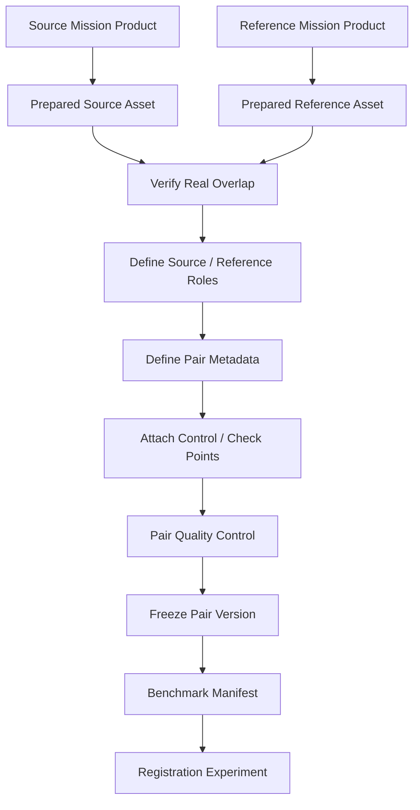
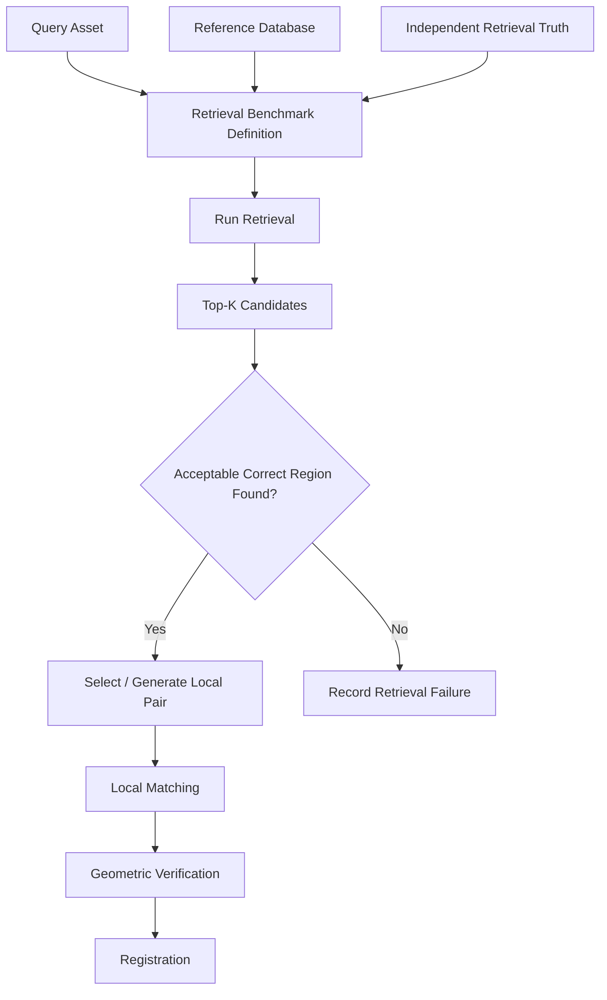

# Dataset Pair Definition

A **ChandraMap pair** is a reproducible scientific relationship between one **source/query asset** and one **reference asset** that represent the same, or intentionally related, lunar region for correspondence, registration, retrieval, or benchmark evaluation.

A pair is not simply:

```text
image_a.png
+
image_b.png
```

A valid pair must preserve enough information to determine:

- which original mission products produced the assets;
- which asset is the source and which is the reference;
- which sensors produced them;
- whether they genuinely overlap;
- their physical scales;
- their projection and coordinate context;
- any derived representation used;
- the benchmark condition being tested;
- the evaluation truth/check points associated with the pair;
- the dataset, preparation, pair, and benchmark versions involved.

> **A ChandraMap benchmark pair is a reproducible scientific relationship between a source asset and a reference asset, not merely two image files stored beside each other.**

Pair definitions are central to ChandraMap because fair comparison between algorithms requires the **same scientific case** to remain identifiable across V1, V2, V3, V4, preparation variants, matcher changes, and benchmark runs.

Known-overlap pairs are particularly important in early ChandraMap development because they isolate the local correspondence and registration problem before global lunar retrieval is introduced.

---

## 1. Why Pair Definitions Matter

A stable pair definition supports several research and engineering goals.

### Reproducibility

A future run should be able to recover the exact:

- source product;
- source representation;
- reference product;
- reference tile or crop;
- scale level;
- preparation version;
- evaluation data.

### Benchmark Fairness

Two methods should be compared on the same pair definition rather than on slightly different crops, pyramid levels, or truth points.

### Algorithm Comparison

A stable pair allows controlled comparison of:

- classical methods;
- learned sparse matchers;
- detector-free matchers;
- structural representations;
- normalization strategies;
- refinement methods.

### Sensor-Pair Analysis

Results can be grouped by combinations such as:

- OHRC ↔ LRO NAC;
- TMC-2 ↔ LRO NAC;
- IIRS ↔ LRO WAC.

### Error Reporting

An RMSE value is meaningful only when the source/reference coordinate context and evaluation-point set are known.

### Dataset Versioning

Pairs provide stable units that can be included, removed, deprecated, or revised through explicit dataset/benchmark versions.

### Leakage Prevention

Stable pair and parent-product identities help detect:

- pair duplication;
- geographic overlap leakage;
- product leakage;
- representation leakage;
- synthetic-data leakage.

### Debugging

When a run fails, the exact pair definition helps determine whether the problem is related to:

- data preparation;
- wrong overlap;
- scale selection;
- representation;
- geometry;
- matcher behavior;
- annotation errors.

---

## 2. Pair Terminology

ChandraMap uses the following terminology.

### Source / Query

The lunar asset ChandraMap is attempting to:

- locate;
- match;
- register;
- geolocate.

Typical source sensors include:

- Chandrayaan-2 OHRC;
- Chandrayaan-2 TMC-2;
- Chandrayaan-2 IIRS or a documented IIRS-derived representation.

### Reference

The lunar asset against which the source is compared.

Typical references include:

- LRO NAC product;
- NAC crop;
- NAC tile;
- NAC pyramid level;
- LRO WAC product;
- WAC mosaic tile;
- future reference products.

### Pair

A defined source/reference relationship used by a registration, retrieval, or benchmark experiment.

### Pair Asset

The actual prepared source or reference asset participating in the pair.

A pair asset may be:

- a full processed product;
- a crop;
- a tile;
- a pyramid level;
- a derived representation.

### Parent Product

The original mission product from which a prepared or derived pair asset was created.

### Overlap

The lunar surface region represented in both pair assets.

### Fit / Control Point

A point permitted to participate in transform estimation.

### Check Point

An independent point reserved for evaluating the fitted transformation.

### Ground Truth

Independent authoritative or verified information used for evaluation.

### Candidate Pair

A possible source/reference relationship that has not yet been fully validated.

### Validated Pair

A pair whose identity, overlap, metadata, role assignment, and intended benchmark use have been checked.

---

## 3. Source and Reference Roles

Typical ChandraMap roles are:

| Role                       | Common Data Sources                                   |
| -------------------------- | ----------------------------------------------------- |
| Source / query             | OHRC, TMC-2, IIRS-derived registration representation |
| Fine reference             | LRO NAC                                               |
| Broad/contextual reference | LRO WAC                                               |

These are project conventions, not universal scientific rules.

A controlled experiment may reverse source/reference roles when scientifically justified.

Therefore a pair must explicitly identify:

```text
source_asset
```

and:

```text
reference_asset
```

The role must never be inferred only from the sensor name.

---

## 4. Pair Lifecycle

A candidate relationship becomes a benchmark-ready pair through a validation process.

```text
Candidate
    ↓
Validate Source Product
    ↓
Validate Reference Product
    ↓
Verify Real Overlap
    ↓
Validate Metadata
    ↓
Define Source / Reference Roles
    ↓
Attach Preparation Provenance
    ↓
Attach Truth / Check Points
    ↓
Pair Quality Control
    ↓
Freeze Pair Version
    ↓
Add to Benchmark
```

Not every source/reference combination should become a benchmark pair.

A pair should enter a controlled benchmark only when its scientific relationship is understood well enough to support reproducible interpretation.

---

# Pair Types

## 5. Known-Overlap Pair

A **known-overlap pair** contains a source and reference asset whose overlapping lunar region has already been established.

This is the preferred early ChandraMap benchmark type.

It supports direct evaluation of:

- preprocessing;
- local feature detection;
- local matching;
- geometric verification;
- transformation estimation;
- refinement;
- registration error.

It deliberately removes the need to solve:

- whole-Moon retrieval;
- global descriptor design;
- large reference indexing;
- candidate-region ranking.

This makes known-overlap pairs especially appropriate for V1.

---

## 6. Known Overlap Does Not Mean Registered

Knowing that two assets overlap does **not** mean they are already aligned.

A known-overlap pair may still contain major differences in:

- translation;
- rotation;
- scale;
- illumination;
- shadow geometry;
- viewing geometry;
- projection;
- terrain relief;
- radiometric response;
- spatial resolution.

Known overlap means only that the assets represent at least one common lunar region.

It does not guarantee:

- pixel-to-pixel correspondence;
- equal scale;
- equal orientation;
- equal projection;
- successful matching;
- a valid global homography.

The correspondence problem still remains.

---

## 7. Retrieval Query Definition

A retrieval task differs from a fixed local-registration pair.

A retrieval query typically contains:

- one source/query asset;
- the correct geographic region;
- one or more acceptable reference tiles or regions;
- a reference-database version.

The retrieval system is expected to search the reference collection without being given the correct candidate in advance.

Typical retrieval metrics include:

- Recall@1;
- Recall@5;
- Recall@K.

The correct region is **evaluation truth**, not input to the retrieval algorithm.

---

## 8. Registration Pair vs Retrieval Query

| Property                              | Registration Pair                   | Retrieval Query                        |
| ------------------------------------- | ----------------------------------- | -------------------------------------- |
| Correct reference known to algorithm? | Yes                                 | Hidden during search                   |
| Primary purpose                       | Local correspondence / registration | Candidate localization                 |
| Main output                           | Tie points and transformation       | Top-K candidate regions                |
| Typical metrics                       | RMSE, inliers, coverage             | Recall@K                               |
| Reference granularity                 | Image, crop, tile, pyramid level    | Reference database / geographic region |
| Geometric verification                | Core stage                          | Usually follows retrieval              |
| Known overlap                         | Normally yes                        | Used only as evaluation truth          |

Retrieval and registration should not be treated as the same benchmark task.

---

## 9. Coarse-to-Fine Pair

A coarse-to-fine workflow may use related but distinct pair definitions.

Conceptually:

```text
Source
   ↓
WAC coarse pair
   ↓
candidate lunar region
   ↓
NAC fine pair
   ↓
local registration
```

The WAC pair answers:

> Which broad lunar region is relevant?

The NAC pair answers:

> Which precise local reference should be used for detailed correspondence?

These should remain separate scientific relationships.

---

## 10. Synthetic Pair

A synthetic pair contains one or more assets that have undergone documented artificial transformations.

Possible transformations include:

- rotation;
- scaling;
- brightness changes;
- noise;
- blur;
- cropping;
- controlled occlusion.

Synthetic pairs must be explicitly labeled.

They should never be indistinguishable from pairs made only from real mission observations.

---

# Pair Assets and Provenance

## 11. Source Asset Definition

A source asset may be:

- processed OHRC imagery;
- processed TMC-2 imagery;
- an IIRS-derived 2D registration representation;
- another future lunar source.

A source asset should reference:

- its asset ID;
- its parent mission product;
- sensor identity;
- preparation version;
- relevant scale/projection metadata.

The pair definition should not require the source to be the full original mission product.

A controlled crop or derived representation may be valid if its lineage remains reproducible.

---

## 12. Reference Asset Definition

A reference asset may be:

- full LRO NAC product;
- NAC crop;
- NAC geographic tile;
- NAC pyramid level;
- WAC observation;
- WAC mosaic;
- WAC tile;
- future lunar reference.

A reference asset should retain:

- parent product or mosaic;
- physical/effective scale;
- geographic context;
- projection;
- preparation lineage.

---

## 13. Parent Product vs Pair Asset

The parent product and pair asset are different entities.

Example:

```text
Parent Product
LRO NAC full product

        ↓ crop / tile

Pair Asset
Local NAC reference tile
```

The pair should therefore preserve both:

```text
reference_asset_id
```

and:

```text
reference_product_id
```

Likewise for the source.

This prevents cropping, tiling, resampling, or representation generation from destroying mission provenance.

---

## 14. Pair Crop Definition

If a source or reference is cropped, the pair should retain enough information to reconstruct that crop.

Relevant information may include:

- parent asset ID;
- crop pixel bounds;
- crop dimensions;
- geographic bounds where available;
- preparation version.

A crop should not become an anonymous standalone image.

Conceptually:

```text
pair crop
    ↓
parent prepared asset
    ↓
parent mission product
```

---

# Pair Identity and Versioning

## 15. Pair Identity

Every pair should have a stable pair ID.

The ID exists so that:

- benchmark manifests can reference the pair;
- experiment configurations can select it;
- results can cite it;
- historical pair versions remain traceable;
- duplicate cases can be detected.

Avoid relying on names such as:

```text
pair1
test2
good_pair
final_pair
```

A repository-defined stable ID convention should be used.

This document does not prescribe one mandatory naming syntax.

---

## 16. Pair Display Name vs Pair ID

A human-readable display name may differ from the machine identifier.

For example:

```text
Display:
OHRC ↔ LRO NAC — Illumination Stress
```

while the underlying machine identifier uses the repository's stable pair-ID convention.

The display name may change for readability.

The stable pair ID should not change merely because descriptive wording changes.

---

## 17. Pair Version

A pair version identifies one frozen scientific definition of the pair.

A new pair version may be required when a scientifically meaningful element changes, such as:

- source crop;
- reference crop;
- reference tile;
- pyramid level;
- IIRS representation;
- projection handling;
- overlap definition;
- check-point set;
- ground-truth correction.

Do not silently modify a pair that already belongs to a benchmark release.

---

## 18. Pair ID vs Pair Version

The distinction is:

### Pair ID

Represents the logical scientific case.

### Pair Version

Represents one specific frozen definition of that case.

Conceptually:

```text
Pair ID
    ├── Version 1
    └── Version 2
```

A corrected annotation set may justify a new version while retaining the same logical pair ID.

A completely different lunar region should usually be a different logical pair.

---

## 19. Dataset, Preparation, Pair, and Benchmark Versions

These version types should remain distinct.

| Version                 | Meaning                                                                  |
| ----------------------- | ------------------------------------------------------------------------ |
| Dataset version         | Which scientific products/assets belong to a dataset release             |
| Preparation version     | How raw products were transformed                                        |
| Pair version            | Exact source/reference relationship and pair-specific truth              |
| Benchmark version       | Which pair versions, splits, metrics, and evaluation protocol are frozen |
| Reference index version | Which retrieval tiles/descriptors/index build are used                   |

A benchmark result should record enough of these identifiers to reproduce the exact scientific setup.

---

# Pair Metadata

## 20. Minimum Pair Metadata

A valid pair definition should conceptually preserve at least:

| Field                  | Purpose                                 |
| ---------------------- | --------------------------------------- |
| `pair_id`              | Stable logical identity                 |
| `pair_version`         | Frozen pair definition                  |
| `source_asset_id`      | Prepared source asset                   |
| `source_product_id`    | Parent source mission product           |
| `source_sensor`        | Source sensor identity                  |
| `reference_asset_id`   | Prepared reference asset                |
| `reference_product_id` | Parent reference product                |
| `reference_sensor`     | Reference sensor identity               |
| `overlap_status`       | Whether geographic overlap is validated |
| `benchmark_category`   | Scientific purpose of the pair          |
| `dataset_version`      | Dataset membership/version context      |

Exact field names belong to repository schemas/contracts if they already exist.

---

## 21. Recommended Pair Metadata

Useful additional information may include:

- source GSD;
- reference GSD;
- effective reference GSD;
- source projection;
- reference projection;
- source footprint;
- reference footprint;
- overlap bounds;
- source acquisition time;
- reference acquisition time;
- illumination information;
- viewing geometry;
- representation ID;
- preparation version;
- ground-truth/check-point ID;
- train/validation/test split;
- benchmark version.

Not all fields need to be physically duplicated inside every pair file.

---

## 22. Conditional Pair Metadata

Some metadata is needed only for particular tasks.

### IIRS Pair

May require:

- representation ID;
- representation type;
- selected bands/components;
- representation preparation version.

### Retrieval Pair

May require:

- reference-database version;
- acceptable tile IDs;
- geographic truth region;
- retrieval truth definition.

### Synthetic Pair

May require:

- synthetic flag;
- parent asset;
- transformation;
- transformation parameters;
- random seed.

### Geometry-Aware Pair

May require:

- DEM asset ID;
- sensor-geometry reference;
- terrain-model version.

Avoid forcing irrelevant fields onto every pair.

---

## 23. Pair Metadata Authority

The pair definition should reference canonical asset metadata rather than manually duplicating every scientific field.

Preferred model:

```text
pair
 ↓
asset ID
 ↓
canonical asset metadata
 ↓
parent product metadata
```

This reduces duplication drift.

However, benchmark-critical values may be snapshotted when required for historical reproducibility.

For example, a benchmark release may preserve the exact interpreted:

- GSD;
- projection;
- reference level;

used when the benchmark was frozen.

---

# Overlap Definition

## 24. What Overlap Means

Overlap is the lunar surface region represented in both pair assets.

A pair can only support meaningful correspondence when some common physical region exists.

Overlap should be determined using the strongest evidence available.

Possible sources include:

- geographic footprints;
- map-projected intersection;
- authoritative mission coordinates;
- official benchmark/challenge pairing;
- independently verified manual/geospatial analysis.

Visual similarity alone is insufficient.

---

## 25. Overlap Status

Conceptually, a pair may have states such as:

- confirmed;
- probable;
- unknown;
- no overlap.

These are examples, not mandated schema enum names.

Benchmark-ready local-registration pairs should normally have **confirmed** overlap.

A probable/unknown pair may remain useful for exploratory retrieval research but should not silently enter a controlled known-overlap benchmark.

---

## 26. Overlap Region

Where practical, overlap may be represented by:

- geographic bounds;
- footprint intersection polygon;
- source crop bounds;
- reference crop bounds;
- another documented region representation.

No single overlap format is required for every sensor/product.

The representation must match the information actually available.

---

## 27. Confirm Real Overlap

Lunar terrain often contains repetitive crater patterns.

Two unrelated regions may look similar.

Therefore:

> **A visually plausible match is not proof of geographic overlap.**

Whenever possible, verify pair overlap using:

```text
source geographic metadata
        +
reference geographic metadata
        ↓
physical intersection
```

If authoritative metadata is unavailable and manual validation is used, document that limitation explicitly.

---

# Pair Scale Definition

## 28. Source and Reference GSD

Each pair should preserve the source and reference physical scale where known.

Approximate ChandraMap planning values include:

| Sensor  |            Approximate Project Scale |
| ------- | -----------------------------------: |
| OHRC    |   ~0.25–0.32 m/px, product-dependent |
| TMC-2   |                              ~5 m/px |
| IIRS    |                             ~80 m/px |
| LRO NAC | Often ~0.5–2 m/px, product-dependent |
| LRO WAC |               Product/mode-dependent |

Actual product metadata is authoritative.

Approximate project values should not replace real pair-specific metadata.

---

## 29. Effective Reference Scale

If a reference asset is a pyramid level, the pair should preserve:

- parent reference GSD;
- pyramid level;
- scale factor;
- effective GSD;
- resampling method/provenance where relevant.

Example conceptually:

```text
Native NAC
   ↓
Pyramid Level N
   ↓
Effective Reference Scale
```

This is essential for interpreting cross-resolution results.

---

## 30. Scale Ratio

A source/reference scale ratio may be useful descriptive metadata.

Conceptually:

```text
scale_ratio =
reference_effective_gsd / source_gsd
```

or another explicitly defined convention.

The convention must be documented.

Do not use a scale ratio as a universal difficulty score.

Registration difficulty also depends on:

- modality;
- illumination;
- terrain;
- geometry;
- noise;
- overlap;
- projection.

---

## 31. Compare Information, Not Pixel Count

> **Two images having the same width and height does not mean they represent the same physical scale.**

For example:

```text
1024 × 1024 TMC-2
```

and:

```text
1024 × 1024 NAC
```

may describe very different lunar ground extents.

Pair definitions should therefore preserve:

- GSD;
- effective reference scale;
- crop/footprint context.

---

## 32. Upsampling Caution

A coarse source should not be treated as high-resolution simply because it is enlarged.

For example:

```text
IIRS
~80 m/px
      ↓
upsample to NAC-sized array
```

does not produce NAC-level detail.

If a resampled source participates in a pair, record:

- original scale;
- derived sampling;
- resampling method;
- preparation version.

Do not hide the original physical scale.

---

# Core Sensor-Pair Combinations

## 33. Sensor-Pair Matrix

| Pair            | Typical ChandraMap Use                   | Main Challenges                           | Typical Preparation Need                              |
| --------------- | ---------------------------------------- | ----------------------------------------- | ----------------------------------------------------- |
| OHRC ↔ LRO NAC  | Fine local cross-mission registration    | Illumination, geometry, scale, projection | Fine-scale compatible NAC reference                   |
| OHRC ↔ LRO WAC  | Coarse localization / context            | Extreme detail difference                 | Coarse OHRC representation and suitable WAC reference |
| TMC-2 ↔ LRO NAC | Structural cross-resolution registration | GSD difference, illumination              | NAC pyramid/downsampling                              |
| TMC-2 ↔ LRO WAC | Broad structural/context matching        | Product-dependent scale                   | WAC scale validation                                  |
| IIRS ↔ LRO NAC  | Cross-modal coarse registration          | Extreme scale + modality gap              | IIRS 2D representation + strong NAC downsampling      |
| IIRS ↔ LRO WAC  | Coarse cross-modal localization          | Modality + reference scale                | IIRS representation + compatible WAC scale            |

This table describes research roles rather than expected performance.

---

## 34. OHRC ↔ LRO NAC Pair

Typical purposes include:

- fine cross-mission registration;
- high-resolution correspondence;
- illumination stress testing;
- geometry stress testing.

Important pair metadata includes:

- OHRC product/asset;
- NAC product/asset;
- source/reference GSD;
- illumination metadata;
- projections;
- overlap definition.

Challenges may include:

- different Sun angle;
- different viewing geometry;
- local terrain relief;
- different product sampling;
- projection differences.

High resolution does not automatically make the pair easy.

---

## 35. OHRC ↔ LRO WAC Pair

Typical uses include:

- coarse lunar localization;
- broad contextual matching;
- retrieval experiments.

OHRC may contain far more fine structure than a WAC product can represent.

Therefore the pair should not imply that WAC is capable of supporting final OHRC-level precision.

A common role is:

```text
OHRC query
    ↓
WAC coarse localization
    ↓
candidate region
```

followed by a finer reference when required.

---

## 36. TMC-2 ↔ LRO NAC Pair

Typical uses include:

- structural cross-resolution matching;
- medium-scale terrain registration;
- scale-stress evaluation.

Because NAC is commonly finer than TMC-2, the pair may reference an appropriate NAC pyramid level.

The pair definition should identify that level explicitly.

---

## 37. TMC-2 ↔ LRO WAC Pair

Potential uses include:

- coarse structural matching;
- broad localization;
- retrieval/context experiments.

Compatibility depends on the actual WAC product.

Do not assume:

- one WAC GSD;
- automatic physical scale compatibility;
- identical projection.

---

## 38. IIRS ↔ LRO NAC Pair

This is a challenging pair type because it combines:

- strong scale difference;
- modality difference.

The source pair asset should normally be:

> a documented IIRS-derived 2D registration representation

rather than an undefined hyperspectral cube passed directly to a conventional 2D matcher.

The NAC reference may require substantial downsampling.

The pair should preserve:

- original IIRS product ID;
- IIRS representation ID;
- representation method;
- relevant spectral provenance;
- NAC product/tile;
- reference pyramid level;
- effective scale.

---

## 39. IIRS ↔ LRO WAC Pair

Potential uses include:

- broad cross-modal localization;
- coarse structural correspondence;
- global/context retrieval.

The pair should identify:

- IIRS parent product;
- IIRS representation;
- WAC product/mosaic;
- WAC tile where relevant;
- effective source/reference scales.

Do not assume this combination is inherently easier simply because WAC is broader/coarser.

---

# IIRS Pair Representation

## 40. IIRS Representation Is Part of Pair Identity

An IIRS pair should not record only:

```text
source_sensor: IIRS
```

because the matcher may not use the full hyperspectral cube directly.

A reproducible IIRS pair should identify:

- original IIRS product;
- derived source asset;
- representation ID;
- representation type;
- selected bands/components where applicable;
- preparation version.

For example, these are scientifically different pair variants:

```text
IIRS selected-band representation
        ↔
same NAC reference
```

and:

```text
IIRS PCA representation
        ↔
same NAC reference
```

---

## 41. IIRS Representation Ablation Pairs

Controlled IIRS representation studies should keep constant:

- parent IIRS product;
- reference asset;
- reference scale;
- geometric truth;
- matcher;
- matcher configuration;
- evaluation protocol.

Change only:

```text
IIRS representation
```

Possible representations include:

- selected band;
- PCA component;
- composite;
- structural representation.

These may be represented as:

- distinct pair versions;
- pair variants;
- separate pair IDs;

depending on the benchmark architecture.

The chosen design should remain consistent and explicit.

---

# Projection and Coordinate Context

## 42. Pair Projection Metadata

Each pair should preserve whether source and reference assets are:

- map-projected;
- unprojected;
- projected differently.

Do not assume that two geospatial rasters are already on the same coordinate grid.

Projection metadata helps explain whether residual displacement may come from:

- registration error;
- projection differences;
- terrain effects;
- viewing geometry.

---

## 43. Lunar Coordinate Reference

Where geographic coordinates are used, preserve the relevant:

- source lunar CRS/reference convention;
- reference lunar CRS/reference convention;
- normalized comparison CRS, if one is created;
- latitude convention;
- longitude convention;
- units.

Do not silently assume different mission providers use identical coordinate conventions.

Detailed metadata semantics belong in [`metadata.md`](metadata.md).

---

## 44. Pixel Coordinate Convention

Pair annotations must use a documented image-coordinate convention.

The repository contract should define:

- meaning of `x`;
- meaning of `y`;
- row/column relationship;
- image origin;
- zero-based vs one-based indexing;
- pixel-center convention.

For example, if ChandraMap adopts:

```text
x = column
y = row
```

that rule must be explicit rather than assumed.

---

# Acquisition, Illumination, and Viewing Geometry

## 45. Acquisition Metadata

Where available, pair definitions may reference:

- source acquisition time;
- reference acquisition time.

This supports:

- provenance;
- repeated-observation analysis;
- illumination comparisons;
- observation disambiguation.

Do not invent missing timestamps.

---

## 46. Pair Illumination Metadata

Useful illumination context may include:

- incidence angle;
- phase angle;
- Sun geometry;
- acquisition time.

Not every product provides every field.

Pair definitions should reference authoritative asset metadata rather than invent pair-level approximations.

---

## 47. Illumination Difference

A pair may be categorized as illumination stress when the available data and benchmark design justify it.

Do not impose arbitrary universal thresholds such as:

```text
difference > X degrees = hard
```

unless the benchmark specification explicitly defines and validates such a rule.

Illumination difficulty is not determined by one angle alone.

---

## 48. Viewing Geometry

Where available, preserve viewing geometry because it can help explain:

- perspective differences;
- terrain displacement;
- edge residual patterns;
- transform-model limitations.

Relevant information may include:

- emission angle;
- look geometry;
- spacecraft/view direction.

The exact fields depend on the products.

---

## 49. Terrain / DEM Relationship

If a pair uses DEM/elevation information, reference it explicitly.

Potential metadata may include:

- DEM asset ID;
- DEM version;
- DEM provider;
- role in projection or registration.

A DEM is conditional.

Do not require it for every pair or for the simple baseline.

---

# Benchmark Categories

## 50. Pair Benchmark Category

Each pair should exist for a scientific reason.

Core categories may include:

- baseline / known-overlap;
- scale stress;
- illumination stress;
- modality stress;
- geometry stress;
- low-feature terrain;
- repetitive terrain;
- retrieval;
- synthetic stress.

A pair may potentially have multiple documented stress tags if the benchmark design permits it.

Avoid vague labels such as:

```text
easy2
hard4
best_case
```

without defined scientific meaning.

---

## 51. Baseline Pair

Purpose:

> Verify that the complete registration workflow can operate on a controlled real pair.

Prefer:

- confirmed overlap;
- valid product identity;
- manageable scale difference;
- interpretable geometry;
- independent evaluation points where possible.

A baseline is not intended to represent the hardest ChandraMap problem.

---

## 52. Scale Stress Pair

Purpose:

> Measure how registration changes as source/reference physical scale diverges.

The pair should preserve:

- source GSD;
- reference/effective GSD;
- reference pyramid level where used.

Do not define scale stress from image width/height alone.

---

## 53. Illumination Stress Pair

Purpose:

> Measure robustness when the same lunar region appears under different lighting conditions.

Preserve available:

- acquisition time;
- incidence geometry;
- phase geometry;
- other authoritative lighting context.

Brightness augmentation alone is not equivalent to a real Sun-angle stress pair.

---

## 54. Modality Stress Pair

This category is especially relevant to:

```text
IIRS-derived representation
        ↔
visible / panchromatic reference
```

The pair must preserve source representation provenance.

Otherwise the experiment cannot be reproduced.

---

## 55. Geometry Stress Pair

Purpose:

> Test registration under larger geometric differences.

Possible contributing factors include:

- relief;
- viewing geometry;
- projection mismatch;
- spatially varying residuals.

A geometry-stress label should describe an intentionally selected scientific condition, not an arbitrary difficulty ranking.

---

## 56. Low-Feature Pair

Purpose:

> Evaluate behavior where distinctive terrain structure is limited.

Such pairs are useful because successful lunar registration should not be evaluated only on highly distinctive crater scenes.

Failure on low-feature terrain is meaningful benchmark evidence.

---

## 57. Repetitive Terrain Pair

Purpose:

> Evaluate correspondence ambiguity in visually similar crater fields.

Relevant outcomes may include:

- false candidate matches;
- low inlier ratio;
- clustered inliers;
- incorrect reference selection.

Spatial coverage and independent accuracy are especially important in these cases.

---

## 58. Failure Pair

A benchmark may deliberately preserve pairs that are expected to be difficult or known to fail under some methods.

Possible uses include:

- regression testing;
- failure analysis;
- limitations documentation.

Do not curate only successful examples.

A benchmark that removes every failure case provides weak evidence of robustness.

---

# Pair Annotations

## 59. Correspondence Annotations

A pair may reference independently prepared point annotations.

Conceptual fields include:

```text
point_id
pair_id
source_x
source_y
reference_x
reference_y
point_role
verification_status
annotation_source
```

The exact schema belongs in repository contracts.

---

## 60. Fit / Control Points

Fit/control points may participate in:

- transform estimation;
- model refinement;
- final transformation fitting.

Their role should be explicit.

Do not call them independent check points.

---

## 61. Check Points

Check points should be held out from transform estimation when they are used to report independent registration accuracy.

Conceptually:

```text
Fit / Control Points
        ↓
Estimate Transformation

Independent Check Points
        ↓
Evaluate Transformation
```

This separation should be preserved in pair annotations and benchmark definitions.

---

## 62. Do Not Fit and Evaluate on the Same Points

A weak evaluation is:

```text
tie points
    ↓
fit transform
    ↓
measure error on same tie points
    ↓
claim independent accuracy
```

This measures model fit to the same observations used for estimation.

Preferred:

```text
fit points
    ↓
estimate model

held-out check points
    ↓
evaluate model
```

Fit residuals remain useful diagnostics, but they should not be presented as independent check-point accuracy.

---

## 63. Ground Truth

Ground truth may originate from:

- official challenge/benchmark truth;
- authoritative geospatial relationships;
- independently verified points;
- held-out manually validated correspondences.

Do not automatically classify:

- SIFT matches;
- LightGlue matches;
- LoFTR correspondences;
- RANSAC inliers;

as ground truth.

Algorithm output cannot validate itself.

---

## 64. Annotation Confidence

If confidence or verification fields are used, distinguish different concepts.

### Algorithmic Score

Produced by a matcher.

### Geometric Status

Indicates whether a match passed geometric verification.

### Human / Authoritative Verification

Indicates independent validation.

Do not combine these into one ambiguous field called `confidence` unless the schema clearly defines its meaning.

---

## 65. Geographic Annotations

If annotations include lunar coordinates, preserve:

- reference system;
- projection where relevant;
- latitude convention;
- longitude convention;
- units.

Bare numeric latitude/longitude fields are incomplete without cartographic context.

---

# Pair Preparation and Provenance

## 66. Pair Preparation Version

The pair should identify the preparation version associated with each prepared asset when that information affects scientific interpretation.

Examples include:

- normalization change;
- projection change;
- new reference pyramid;
- new IIRS representation;
- corrected mask.

Preparation changes should not silently mutate a frozen pair.

---

## 67. Source Preparation Provenance

A source asset should remain traceable through:

```text
pair
 ↓
source pair asset
 ↓
processed / derived source
 ↓
source parent product
 ↓
authoritative provider
```

This is particularly important for IIRS-derived representations.

---

## 68. Reference Preparation Provenance

A reference asset should remain traceable through:

```text
pair
 ↓
reference tile / crop / level
 ↓
processed reference
 ↓
reference parent product / mosaic
 ↓
authoritative provider
```

A reference tile without parent provenance should not become benchmark truth.

---

## 69. Pair Provenance Chain

A complete pair should support both branches:

```text
PAIR
├── Source Asset
│   └── Source Parent Product
│
└── Reference Asset
    └── Reference Parent Product
```

This relationship is fundamental to reproducible research.

---

## 70. Synthetic Pair Provenance

Synthetic pairs require additional provenance.

Record:

- synthetic status;
- parent asset;
- original pair where relevant;
- transformation type;
- transformation parameters;
- random seed where relevant;
- generation version.

Synthetic derivatives should never be confused with independent real acquisitions.

---

# Pair Quality Control

## 71. Pair Validation Checklist

| Check                                    | Expected                     |
| ---------------------------------------- | ---------------------------- |
| Pair ID unique                           | Yes                          |
| Pair version defined                     | Yes                          |
| Source asset exists                      | Yes                          |
| Reference asset exists                   | Yes                          |
| Source parent product resolves           | Yes                          |
| Reference parent product resolves        | Yes                          |
| Source sensor validated                  | Yes                          |
| Reference sensor validated               | Yes                          |
| Source/reference roles explicit          | Yes                          |
| Overlap confirmed for known-overlap pair | Yes                          |
| GSD known or explicitly unavailable      | Yes                          |
| Projection context documented            | Where relevant               |
| IIRS representation documented           | For IIRS source              |
| Effective reference level documented     | When pyramid used            |
| Benchmark category assigned              | Yes                          |
| Coordinate convention defined            | For annotations              |
| Truth/check-point provenance valid       | Where evaluation requires it |
| Split recorded                           | When applicable              |
| Preparation version recorded             | For frozen derived assets    |
| Benchmark/dataset version recorded       | Yes                          |
| Pair provenance complete                 | Yes                          |

---

## 72. Pair Visual Validation

Visual inspection may reveal:

- wrong lunar region;
- incorrect crop;
- image orientation problems;
- wrong IIRS representation/band;
- inappropriate reference level;
- NoData contamination;
- severe projection errors.

Visual validation is useful.

It is not sufficient proof of correct geographic overlap.

---

## 73. Pair Geospatial Validation

When reliable geospatial metadata exists, verify that:

```text
source footprint
∩
reference footprint
≠
empty
```

The exact geometry method depends on:

- projection;
- coordinate convention;
- footprint representation.

Do not accept a known-overlap pair solely because both images contain similar-looking craters.

---

## 74. Pair Scale Validation

Before freezing a pair, confirm:

- source GSD;
- reference native GSD;
- effective reference GSD;
- source/reference scale relationship;
- reference pyramid level where applicable.

This prevents accidental comparison against the wrong reference scale.

---

## 75. Pair Representation Validation

For derived source/reference assets, confirm that:

- asset identity is correct;
- parent product is correct;
- preparation version is correct;
- representation parameters are correct.

For IIRS, verify that the pair references the intended representation rather than another derived band/PCA/composite asset.

---

## 76. Pair Annotation Validation

Point annotations should be checked for:

- coordinates within image bounds;
- correct source dimensions;
- correct reference dimensions;
- valid point roles;
- duplicate annotations;
- obvious mismatches;
- check-point independence.

A correct pair can still produce invalid evaluation if the annotations are wrong.

---

# Dataset Splits and Leakage

## 77. Pair Split Assignment

When learned models are trained, a pair may be assigned to:

- training;
- validation;
- test.

Split assignment should be explicit and versioned.

Do not infer the split only from the folder in which a copied raster happens to exist.

---

## 78. Pair-Level Leakage

The same pair must not silently appear in:

```text
train
```

and:

```text
test
```

under different filenames or aliases.

Stable pair IDs help enforce this.

---

## 79. Parent-Product Leakage

Pair-level separation alone may still permit leakage.

For example:

```text
training source crop
    ↓
parent product X

test source crop
    ↓
same parent product X
```

may violate the intended generalization test.

Track parent products when constructing splits.

---

## 80. Geographic Leakage

Neighboring lunar tiles may contain nearly identical structures.

A training pair and test pair can therefore be technically different files while representing overlapping terrain.

Track where applicable:

- footprint;
- geographic region;
- tile lineage;
- parent product;
- overlap relationship.

If the claim is unseen-geography generalization, use geographically separated splits.

---

## 81. Representation Leakage

The same IIRS parent product may produce:

- selected-band representation;
- PCA representation;
- structural representation.

These are not automatically independent samples.

If one representation appears in training and another in testing, this may violate product/geographic independence.

The benchmark must define the intended rule explicitly.

---

## 82. Synthetic Leakage

An augmented version of a training source should not silently appear in the test set.

Track:

```text
synthetic asset
→ parent real asset
```

and use that lineage during split generation.

---

# Pair File and Manifest Representation

## 83. Pair Definitions Should Be Machine-Readable

Pair definitions should be stored in a structured representation.

Possible formats include:

- YAML;
- JSON;
- CSV for simple tabular indexes.

No requirement exists to use all formats.

A human-readable structured format is useful for small benchmark definitions, while large manifests may require a more compact tabular representation.

---

## 84. Conceptual Pair Record

The following example is illustrative only.

```yaml
pair_id: "PAIR_ID"
pair_version: "PAIR_VERSION"

source:
  asset_id: "SOURCE_ASSET_ID"
  product_id: "SOURCE_PRODUCT_ID"
  sensor: "SOURCE_SENSOR"

reference:
  asset_id: "REFERENCE_ASSET_ID"
  product_id: "REFERENCE_PRODUCT_ID"
  sensor: "REFERENCE_SENSOR"

overlap:
  status: "CONFIRMED_OR_OTHER_DOCUMENTED_STATE"

benchmark:
  category: "BENCHMARK_CATEGORY"
  split: "SPLIT_IF_APPLICABLE"
  version: "BENCHMARK_VERSION"

evaluation:
  check_points: "CHECK_POINT_SET_ID_IF_AVAILABLE"
```

Real pair definitions should use repository-defined schemas and actual identifiers.

---

## 85. Pair Files Reference Assets

A pair definition should reference scientific assets.

It should not embed:

- raster pixels;
- full hyperspectral cubes;
- large descriptor matrices;
- vector indexes.

Preferred:

```text
pair file
→ source asset ID
→ reference asset ID
```

The asset manifests resolve those IDs to data locations.

---

## 86. Pair File Naming

Pair-definition filenames should be based on stable pair identities.

Avoid:

```text
good_pair.yaml
test_pair_final.json
pair_new2.json
best_pair.yaml
```

Names should remain meaningful after the original contributor is no longer present.

---

## 87. Pair Directory Structure

If ChandraMap's dedicated root-level `benchmarks/` area owns benchmark definitions, a conceptual organization may be:

```text
benchmarks/
└── pairs/
    ├── PAIR_ID_001.yaml
    ├── PAIR_ID_002.yaml
    └── ...
```

or:

```text
benchmarks/
└── BENCHMARK_VERSION/
    └── pairs/
        └── ...
```

depending on the repository's canonical architecture.

Do not create competing pair-definition systems under both:

```text
data/
```

and:

```text
benchmarks/
```

unless the repository explicitly defines separate responsibilities.

---

## 88. Data Assets vs Pair Definitions

The responsibility boundary should remain:

```text
data/
→ scientific assets

benchmarks/
→ controlled definitions of how assets are evaluated
```

A benchmark pair should normally reference canonical data assets rather than duplicate them.

---

## 89. Pair Manifest

Larger benchmark collections may maintain a pair manifest containing fields such as:

- pair ID;
- pair version;
- benchmark category;
- source asset ID;
- reference asset ID;
- split;
- enabled/deprecated status.

This provides a machine-readable benchmark index without embedding the underlying imagery.

---

# Retrieval-Specific Pair Definitions

## 90. Retrieval Query Definition

A retrieval query should identify:

- query/source asset;
- query sensor;
- query representation;
- correct geographic region;
- acceptable reference tile IDs;
- reference-database version.

The correct reference should remain hidden from the retrieval algorithm during evaluation.

---

## 91. Multiple Correct Reference Tiles

Reference tiles may overlap.

Therefore one query may legitimately correspond to several tiles.

For example:

```text
Query footprint
      ↓
overlaps Tile A
and
overlaps Tile B
```

Both may be valid retrieval results.

Retrieval truth should therefore be able to represent:

```text
acceptable_reference_ids:
  - Tile A
  - Tile B
```

conceptually, rather than forcing one arbitrary tile to be the only correct answer.

---

## 92. Recall@K Truth

Retrieval evaluation should ask:

> Does at least one acceptable correct reference appear in the Top-K retrieved candidates?

Typical retrieval metrics include:

- Recall@1;
- Recall@5;
- Recall@K.

Do not use local registration RMSE as the primary retrieval metric.

These answer different questions.

---

## 93. Retrieval-to-Registration Handoff

After retrieval:

```text
Top-K candidate
        ↓
select candidate reference
        ↓
create/select local pair
        ↓
local matcher
        ↓
geometric verification
        ↓
registration
```

The local pair may be generated dynamically from a retrieved candidate.

However, retrieval truth remains independent of the algorithm's selected candidate.

---

# WAC-to-NAC Pairing

## 94. WAC Coarse Pair

A WAC coarse pair may define:

```text
source/query asset
        ↔
WAC candidate region
```

Primary purpose:

- coarse localization;
- regional retrieval;
- contextual correspondence.

The expected precision target should match the information content of the WAC product.

---

## 95. NAC Fine Pair

After a coarse region has been identified:

```text
source asset
        ↔
NAC reference asset
```

may define the fine-registration problem.

The NAC pair may support:

- local tie points;
- geometric verification;
- refinement;
- final accuracy evaluation.

---

## 96. Pair Hierarchy

A WAC coarse pair and NAC fine pair should be represented as distinct but related scientific cases.

Conceptually:

```text
Query
  ↓
Coarse Pair
Query ↔ WAC
  ↓
Candidate Region
  ↓
Fine Pair
Query ↔ NAC
```

Do not overwrite the coarse pair with the fine pair.

Their:

- purpose;
- reference;
- accuracy target;
- metrics;

may differ.

---

## 97. Handoff Metadata

A coarse-to-fine benchmark may preserve conceptual information such as:

- query ID;
- coarse pair ID;
- selected/correct coarse region;
- fine pair ID;
- reference-database version.

The exact API/schema fields belong in implementation contracts.

---

# Pair Versioning and History

## 98. Pair Versioning Rules

A scientifically meaningful change should normally create a new pair version.

Examples include:

- corrected source crop;
- different reference tile;
- new reference pyramid level;
- new IIRS representation;
- corrected coordinate interpretation;
- corrected overlap;
- revised check points;
- corrected truth region.

Do not silently overwrite historical pair definitions.

---

## 99. Dataset Version

The dataset version defines which scientific assets belong to a dataset release.

A dataset update may:

- add products;
- remove invalid products;
- update metadata;
- introduce new derived assets.

It is distinct from pair versioning.

---

## 100. Benchmark Version

A benchmark version may freeze:

- pair list;
- pair versions;
- splits;
- truth/check-point sets;
- metric definitions;
- reference database/index version;
- evaluation protocol.

This allows algorithm versions to be compared against the same benchmark.

---

## 101. Preparation Version

The preparation version identifies how pair assets were created.

For example:

```text
Same pair ID
Same parent products
Different preparation version
```

could indicate:

- revised normalization;
- corrected projection;
- different IIRS representation.

Pair and preparation versions should not be conflated.

---

# ChandraMap Version Progression

## 102. V1 Pair Definitions

V1 should remain deliberately small.

Recommended conceptual scope:

- a small number of known-overlap pairs;
- OHRC and/or TMC-2 sources;
- LRO NAC references;
- stable pair IDs;
- validated overlap;
- source/reference scale metadata;
- independent check points where available;
- reproducible pair definitions.

Global Moon retrieval should not be mandatory.

V1 should answer:

> Can ChandraMap reliably register known overlapping lunar imagery and measure the result?

---

## 103. V2 Pair Definitions

Possible V2 additions include:

- more illumination-stress pairs;
- larger scale differences;
- structural-representation variants;
- initial IIRS pairs;
- controlled failure cases;
- additional geometry cases.

V2 should extend rather than replace V1 baseline pairs.

---

## 104. V3 Pair Definitions

Possible V3 additions include:

- unknown-location queries;
- WAC retrieval truth;
- NAC/WAC tile relationships;
- Recall@K definitions;
- coarse-to-fine pair relationships;
- larger reference-database versions.

Retrieval and local-registration pair definitions should remain distinct.

---

## 105. V4 Pair Definitions

Possible V4 research extensions include:

- additional lunar missions;
- Kaguya / SELENE pairs;
- DEM/geometry-aware pairs;
- larger multimodal benchmarks;
- learned-model geographic splits;
- difficult/failure-focused cases;
- more advanced cross-mission relationships.

Existing ChandraMap version specifications remain authoritative.

---

# Pair Creation Workflow

## 106. Recommended Pair Creation Process

1. **Identify the research question.**
   Decide whether the pair tests baseline registration, scale, illumination, modality, geometry, retrieval, or another documented condition.

2. **Select the source mission product.**
   Preserve authoritative product identity.

3. **Select the reference product.**
   Choose NAC, WAC, or another justified reference.

4. **Validate both products.**
   Confirm identity, readability, and required metadata.

5. **Verify actual lunar overlap.**
   Prefer geospatial/product evidence.

6. **Prepare the source asset.**
   Use the documented sensor-specific preparation process.

7. **Prepare the reference asset.**
   Select crop/tile/pyramid level as required.

8. **Record parent products.**
   Preserve lineage for both pair assets.

9. **Record GSD and projection context.**
   Use authoritative asset metadata.

10. **Assign a stable pair ID.**

11. **Assign a benchmark category.**

12. **Attach control/check-point or retrieval truth.**

13. **Validate coordinate conventions.**

14. **Perform pair quality control.**

15. **Freeze the pair version.**

16. **Add the pair to the benchmark manifest.**

---

## 107. Do Not Create Pairs Without a Research Purpose

A new pair should answer a specific question.

Examples include:

- Does the baseline registration work?
- How does performance change under illumination difference?
- How does the matcher handle a large GSD gap?
- Can an IIRS-derived representation match a visible reference?
- Can the retrieval system find the correct lunar region?
- Where does the system fail?

Avoid accumulating random image pairs merely because data is available.

---

# Pair Flow

## 108. Registration Pair Flow



---

## 109. Retrieval Pair Flow



Retrieval success and registration success should be measured separately.

---

# Pair Failure Handling

## 110. Invalid Pair Reasons

A pair may be invalid because of:

- no real overlap;
- wrong source product;
- wrong reference product;
- corrupted asset;
- missing critical metadata;
- invalid IIRS representation;
- excessive NoData coverage;
- incorrect crop;
- annotation error;
- truth uncertainty;
- unresolved coordinate ambiguity.

Such pairs should not silently remain in a benchmark-ready state.

---

## 111. Pair Status

Conceptually useful statuses may include:

- candidate;
- validated;
- benchmark-ready;
- deprecated;
- invalid.

These are examples rather than mandatory final enum names.

Status should communicate whether the pair is safe for controlled benchmark use.

---

## 112. Pair Deprecation

A pair that has appeared in a recorded benchmark should not be silently deleted from history.

Possible reasons for deprecation include:

- incorrect overlap;
- wrong product identity;
- metadata correction;
- truth/check-point error;
- corrupted source;
- invalid preparation.

The deprecation reason should be documented.

---

## 113. Pair Replacement

If a pair is replaced, preserve the relationship between:

- old pair/version;
- replacement pair/version;
- reason for replacement.

This prevents historical benchmark results from becoming uninterpretable.

---

# Pair Definition Failure Modes

## 114. Common Pair Definition Failures

| Problem                              | Consequence                           | Correct Action                        |
| ------------------------------------ | ------------------------------------- | ------------------------------------- |
| Wrong lunar region                   | False benchmark relationship          | Reject or rebuild pair                |
| Overlap unverified                   | Correspondence claims unreliable      | Validate geography                    |
| Unknown GSD                          | Scale interpretation ambiguous        | Recover metadata or record limitation |
| Wrong pyramid level                  | Invalid physical comparison           | Correct reference level               |
| IIRS representation undocumented     | Experiment not reproducible           | Add representation provenance         |
| Parent product missing               | Broken scientific lineage             | Repair provenance                     |
| Projection ambiguous                 | Geographic interpretation unsafe      | Clarify or restrict evaluation        |
| Fit/check points mixed               | Optimistic accuracy                   | Separate roles                        |
| Pair duplicated across splits        | Data leakage                          | Correct split                         |
| Geographic overlap across train/test | Inflated generalization               | Redesign split                        |
| Synthetic asset unlabeled            | Misleading benchmark                  | Add synthetic provenance              |
| WAC/NAC roles conflated              | Coarse/fine purpose unclear           | Use related distinct pairs            |
| Retrieval truth forced to one tile   | Valid overlapping tiles counted wrong | Allow acceptable-reference set        |
| Pair silently modified               | Historical results unreproducible     | Create new version                    |

---

# Common Pair Definition Mistakes

## 115. Mistakes to Avoid

Do not:

- define a pair only by two filenames;
- infer source/reference roles solely from sensor names;
- lose parent-product identity;
- treat visually similar crater fields as confirmed overlap;
- ignore physical scale;
- compare only pixel dimensions;
- enlarge coarse imagery and describe it as recovered detail;
- create IIRS pairs without representation identity;
- ignore source/reference projection differences;
- store geographic coordinates without coordinate conventions;
- call matcher-generated correspondences ground truth;
- call RANSAC inliers independent truth;
- use fit points as independent check points;
- store pair truth without provenance;
- duplicate one logical pair under multiple arbitrary names;
- allow identical or overlapping pairs into both train and test;
- ignore parent-product leakage;
- mix synthetic and real pairs anonymously;
- modify frozen pair definitions in place;
- embed large raster files inside pair records;
- create competing benchmark-pair systems under multiple repository roots;
- evaluate retrieval using registration RMSE alone;
- treat the Top-1 retrieved tile as automatically correct;
- assume reference imagery itself is perfect ground truth;
- assign arbitrary numerical difficulty levels without evidence.

---

# Pair Limitations

## 116. Limitations

### Ground Truth May Be Limited

Independent truth may not exist for every lunar image pair.

### Some Overlap Requires Manual Verification

Product footprints may be incomplete, unavailable, or difficult to interpret.

### Footprints May Be Approximate

A bounding region may not perfectly represent valid image content.

### Projection Differences Complicate Annotation

Corresponding points may require careful coordinate interpretation.

### Large Scale Gaps Can Limit Fine Correspondence

Some physical structures simply do not exist in both sensors at comparable detail.

### IIRS Representations Reduce Spectral Information

Any 2D registration representation compresses or discards part of the original hyperspectral content.

### Illumination Can Dominate Appearance

The same terrain may appear substantially different under different Sun geometry.

### One Pair Does Not Demonstrate Generalization

A successful result on one pair is only evidence for that case.

### Pair Difficulty Is Multidimensional

Difficulty depends on:

- scale;
- modality;
- illumination;
- terrain;
- geometry;
- noise;
- overlap;
- feature uniqueness.

### Reference Imagery Is Not Automatic Ground Truth

A reference provides registration context, not necessarily independently known truth.

### Manual Annotation Can Contain Uncertainty

Manually verified points should preserve provenance and verification status.

### Pair Definitions May Evolve

As product understanding improves, corrected pair versions may be required.

---

# Relationship to Other Dataset Documentation

## 117. Relationship to `README.md`

See [`README.md`](README.md).

The dataset README describes the overall ChandraMap data system.

This document defines how two prepared scientific assets become one reproducible benchmark relationship.

---

## 118. Relationship to `dataset-preparation.md`

See [`dataset-preparation.md`](dataset-preparation.md).

The distinction is:

```text
dataset-preparation.md
→ creates validated assets

pair-definition.md
→ links validated assets into scientific cases
```

A pair should not compensate for poorly prepared data.

---

## 119. Relationship to `dataset-structure.md`

See [`dataset-structure.md`](dataset-structure.md).

`dataset-structure.md` defines where:

- scientific assets;
- manifests;
- benchmarks;
- results;

belong.

This document defines what a pair relationship means scientifically.

---

## 120. Relationship to `metadata.md`

See [`metadata.md`](metadata.md).

Pair definitions should use the shared conventions for:

- product identity;
- GSD;
- coordinate systems;
- units;
- provenance;
- preparation metadata.

Do not redefine CRS or unit semantics independently inside each pair.

---

## 121. Relationship to `data-format.md`

See [`data-format.md`](data-format.md).

Pair records reference assets represented according to ChandraMap's file/data-format conventions.

Pair files themselves should remain lightweight and machine-readable.

---

## 122. Relationship to `chandrayaan-2.md`

See [`chandrayaan-2.md`](chandrayaan-2.md).

Chandrayaan-2 source product identity, access, preparation, and mission context should remain consistent with that documentation.

Pair definitions reference those canonical source assets.

---

## 123. Relationship to `lro.md`

See [`lro.md`](lro.md).

LRO documentation defines:

- NAC/WAC reference products;
- tiles;
- pyramids;
- mosaics;
- retrieval assets.

Pair definitions reference those prepared reference assets.

---

## 124. Relationship to Sensor Documentation

Relevant sensor documentation includes:

- [`../sensors/overview.md`](../sensors/overview.md)
- [`../sensors/ohrc.md`](../sensors/ohrc.md)
- [`../sensors/tmc2.md`](../sensors/tmc2.md)
- [`../sensors/iirs.md`](../sensors/iirs.md)
- [`../sensors/lro-nac.md`](../sensors/lro-nac.md)
- [`../sensors/lro-wac.md`](../sensors/lro-wac.md)

Sensor documentation explains why:

- GSD differs;
- modality differs;
- representation differs;
- illumination/geometry sensitivity differs.

Pair definitions record which sensor combination is actually being evaluated.

---

## 125. Relationship to Architecture Documentation

Relevant architecture documentation includes:

- [`../architecture/system-overview.md`](../architecture/system-overview.md)
- [`../architecture/v1-pipeline.md`](../architecture/v1-pipeline.md)
- [`../architecture/core-engine-architecture.md`](../architecture/core-engine-architecture.md)
- [`../architecture/module-map.md`](../architecture/module-map.md)
- [`../architecture/data-flow.md`](../architecture/data-flow.md)
- [`../architecture/output-flow.md`](../architecture/output-flow.md)

Pair definitions are consumed by pipeline and benchmarking layers.

Conceptually:

```text
Pair Definition
      ↓
Load Source + Reference
      ↓
Matching
      ↓
Geometric Verification
      ↓
Refinement / Registration
      ↓
Independent Evaluation
      ↓
Result linked back to Pair ID
```

---

## 126. Relationship to Root-Level `benchmarks/`

If the repository uses a dedicated root-level:

```text
benchmarks/
```

it should remain the authoritative home for benchmark definitions according to the repository architecture.

The responsibility boundary should remain:

```text
data/
→ scientific assets

benchmarks/
→ pair definitions, splits, truth, evaluation definitions
```

Do not create a conflicting second pair-definition architecture under `data/` unless the repository explicitly changes its design.

---

## 127. Relationship to Experiments

Experiments should select:

- pair IDs;
- pair versions;
- benchmark manifests;

instead of creating untracked source/reference relationships inside experiment directories.

An experiment may choose:

- matcher;
- preprocessing variant;
- reference level;
- representation;

but the underlying pair identity should remain traceable.

---

## 128. Relationship to Results

Every scientific result should record where applicable:

- pair ID;
- pair version;
- benchmark version;
- preparation version;
- source/reference asset IDs.

This allows a result to be traced to the exact scientific input definition.

A registration image without the pair identity that produced it is incomplete as a benchmark result.

---

# Authoritative Source Categories

## 129. Chandrayaan-2

Relevant authoritative resources include:

- ISRO Chandrayaan-2 documentation;
- ISRO Chandrayaan-2 payload documentation;
- ISRO / ISSDC;
- PRADAN;
- official Chandrayaan-2 product documentation.

---

## 130. Lunar Reconnaissance Orbiter

Relevant authoritative resources include:

- NASA Lunar Reconnaissance Orbiter documentation;
- LROC / Arizona State University;
- NASA Planetary Data System;
- official LROC NAC/WAC product documentation.

---

## 131. Planetary Processing and Cartography

Relevant authoritative resources include:

- USGS ISIS documentation;
- official lunar/cartographic documentation;
- authoritative planetary coordinate-system guidance.

Actual mission-product metadata and authoritative product documentation take precedence over approximate values in this document.

---

# Pair Definition Principles

### A Pair Is a Scientific Relationship

It is not simply two files placed beside one another.

### Source and Reference Roles Are Explicit

Sensor identity alone does not define the role.

### Parent Products Must Remain Traceable

Every crop, tile, pyramid level, and representation needs lineage.

### Overlap Must Be Verified

Visual similarity is not enough.

### Physical Scale Must Be Preserved

GSD/effective scale matters more than equal image dimensions.

### Product Metadata Is Authoritative

Approximate project-level values are secondary.

### IIRS Pairs Need Representation Identity

An undefined hyperspectral cube is not a reproducible 2D registration input.

### Upsampling Does Not Create Detail

A resized coarse source remains physically coarse.

### Projection and Coordinate Context Matter

Especially for geolocation and independent evaluation.

### Matcher Output Is Not Ground Truth

Candidate correspondences and RANSAC inliers remain algorithm outputs.

### Fit Points and Check Points Have Different Roles

Independent accuracy requires independent evaluation points.

### Known-Overlap Registration and Retrieval Are Different Tasks

They require different pair definitions and metrics.

### Retrieval May Have Multiple Correct Tiles

Overlapping reference tiles can all be legitimate answers.

### Pair Versions Must Be Frozen

Scientific changes require explicit versioning.

### Pair Leakage Must Be Prevented

Track pair IDs, parent products, geography, and derived representations.

### Synthetic Pairs Must Be Explicit

Synthetic transformations require provenance.

### Benchmarks Should Preserve Failures

Failure cases are part of scientific evaluation.

### Pair Definitions Reference Scientific Assets

They should not duplicate large raster data.

### Root-Level Benchmark Architecture Remains Authoritative

Do not create competing pair-definition systems.

### Every Result Must Be Traceable

> **A ChandraMap result is reproducible only when it can be traced back to the exact pair ID, pair version, source/reference assets, preparation state, and benchmark definition that produced it.**

<!-- Documentation request and supplied pair-definition specification: :contentReference[oaicite:0]{index=0} -->
