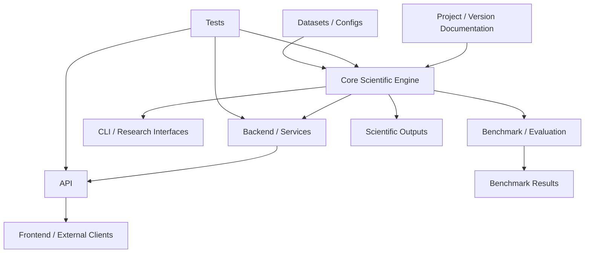
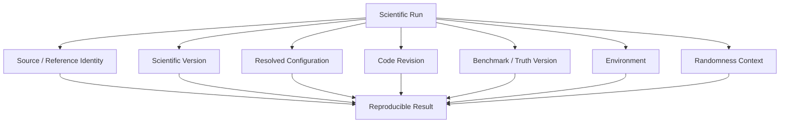
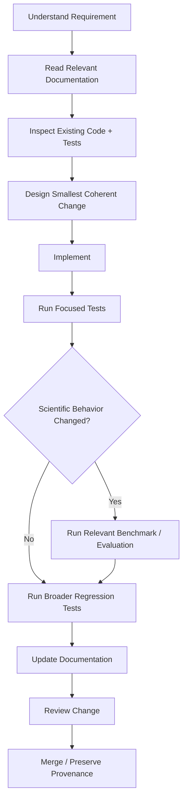
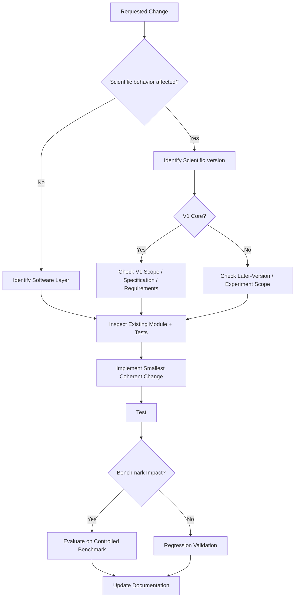

# Development Guide

> **Document role:** Main development documentation entry point
> **Project:** ChandraMap
> **Repository type:** Open-source scientific/research software
> **Primary domains:** Lunar image correspondence, registration, remote sensing, geospatial localization, benchmarking, and reproducible scientific computing
> **Development focus:** Correctness, scientific meaning, reproducibility, maintainability, testing, and controlled evolution
> **Implementation status:** This document describes development principles and navigation; it does not assert that every referenced subsystem or workflow is currently implemented.

ChandraMap is a scientific software project for aligning imagery of the same lunar region across differences in:

- sensor;
- spatial resolution;
- Sun angle;
- viewing geometry;
- processing history;
- imaging modality.

Relevant Chandrayaan-2 source instruments include:

- OHRC;
- TMC-2;
- IIRS.

Primary LRO reference imagery includes:

- LRO NAC;
- LRO WAC.

The core scientific deliverable is:

```text
Correspondence
    +
Registration
    +
Measured Evidence
```

not merely:

```text
Mosaic
Map UI
Registered Preview
```

A scientifically useful result may include:

- candidate correspondences;
- filtered correspondences;
- geometrically verified inliers;
- transformation model;
- registered output;
- residual diagnostics;
- spatial coverage;
- held-out check-point metrics where valid truth exists;
- failure information;
- runtime information;
- provenance;
- reproducibility metadata.

This guide explains how contributors should approach the repository without duplicating the more detailed contracts owned by project, architecture, version, dataset, algorithm, evaluation, API, or root-level documentation.

> **Develop ChandraMap by preserving scientific meaning first, repository consistency second, and implementation convenience third.**

> **Understand the relevant part of ChandraMap before modifying it.**

> **Correctness, scientific meaning, and reproducibility take priority over adding more complexity.**

> **Reuse existing architecture, conventions, dependencies, utilities, and data contracts before introducing new ones.**

> **Make the smallest coherent change that solves the documented problem.**

> **Scientific behavior belongs in the core engine; interfaces should expose that behavior without reimplementing it.**

> **Tests validate implementation behavior; benchmarks measure scientific performance. They are related, but they are not the same thing.**

> **A visually convincing registration is not enough; scientific outputs must remain measurable and reproducible.**

> **Do not change benchmark truth, metric definitions, or scientific semantics merely to make results look better.**

> **Development should preserve V1 as a trustworthy historical baseline while allowing later versions to improve on it measurably.**

> **Repository professionalism comes from clarity, reproducibility, testing, security, and maintainability—not from unnecessary files or infrastructure.**

---

## 1. Development Documentation Map

Use the smallest documentation set needed for the task.

| Area                | Purpose                                                 | Primary Documentation                      |
| ------------------- | ------------------------------------------------------- | ------------------------------------------ |
| Project context     | Goals, non-goals, assumptions, terminology, scope       | [`../project/`](../project/)               |
| Architecture        | System, module, layer, data, and output boundaries      | [`../architecture/`](../architecture/)     |
| Scientific versions | Benchmarkable research methodologies                    | [`../versions/`](../versions/)             |
| Sensors             | Instrument-specific scientific context                  | [`../sensors/`](../sensors/)               |
| Datasets            | Data identity, metadata, preparation, truth             | [`../datasets/`](../datasets/)             |
| Algorithms          | Scientific processing methods                           | `../algorithms/` where present             |
| Evaluation          | Metrics, truth, benchmarks, failures, reproducibility   | `../evaluation/` where present             |
| API                 | Programmatic interface and scientific contract exposure | [`../api/`](../api/)                       |
| Development         | Engineering orientation and workflow                    | `README.md` and confirmed development docs |

This file is the **development landing page**.

It is not intended to replace:

- root contribution policy;
- scientific specifications;
- architecture contracts;
- testing specifications;
- benchmark protocols;
- API references.

---

## 2. Root Repository Documentation

From `docs/development/README.md`, repository-root documentation is two levels above.

Where present, contributors should understand the roles of:

| Root File                  | Role                                                |
| -------------------------- | --------------------------------------------------- |
| `../../README.md`          | Project entry point and high-level orientation      |
| `../../CONTRIBUTING.md`    | Project-wide contribution policy                    |
| `../../CODE_OF_CONDUCT.md` | Contributor conduct expectations                    |
| `../../SECURITY.md`        | Security policy and reporting guidance              |
| `../../ROADMAP.md`         | Future project direction                            |
| `../../CHANGELOG.md`       | Recorded project changes                            |
| `../../LICENSE`            | Repository software license                         |
| `../../CITATION.cff`       | Citation metadata                                   |
| `../../AGENTS.md`          | Repository guidance for coding agents where present |

The distinction between this file and `CONTRIBUTING.md` is important:

```text
CONTRIBUTING.md
→ project-wide contribution policy

docs/development/README.md
→ technical development orientation, scientific-engineering rules,
  repository navigation, and workflow guidance
```

This document should not duplicate the complete contribution policy.

---

## 3. AI / Coding-Agent Guidance

Where `../../AGENTS.md` exists, coding agents should read and obey it together with the relevant scientific and architectural documentation.

AI coding agents are not exempt from repository rules.

They should follow the same expectations as human contributors regarding:

- scope;
- architecture;
- testing;
- scientific terminology;
- coordinate semantics;
- benchmark integrity;
- reproducibility;
- secrets;
- dependency discipline;
- documentation updates.

> **Start with the smallest relevant context and expand only when the task requires it.**

Do not scan or rewrite the entire repository merely because additional improvements are possible.

---

## 4. Before You Change Code

Before modifying ChandraMap:

1. Identify the requested behavior.
2. Identify the affected scientific or software subsystem.
3. Read the nearest authoritative documentation.
4. Inspect the existing implementation around the affected area.
5. Inspect nearby tests.
6. Identify affected inputs and outputs.
7. Identify the scientific version involved.
8. Determine whether benchmark semantics could change.
9. Determine whether reproducibility metadata could change.
10. Implement the smallest coherent solution.
11. Run focused validation first.
12. Expand to broader testing only when necessary.
13. Update authoritative documentation when behavior or contracts change.

> **Do not scan or rewrite unrelated parts of the repository merely because they could also be improved.**

---

## 5. Determine the Requirement

Before implementation, determine:

- expected behavior;
- expected inputs;
- expected outputs;
- behavior that must remain unchanged;
- applicable scientific version;
- affected sensors;
- affected coordinate spaces;
- affected units;
- affected transformations;
- affected metrics;
- failure behavior;
- testing requirements;
- benchmark impact;
- documentation impact.

A request such as:

```text
improve matching
```

is not precise enough by itself.

The actual requirement may concern:

- preprocessing;
- physical scale;
- feature extraction;
- descriptor matching;
- filtering;
- RANSAC;
- transform fitting;
- refinement;
- evaluation.

Determine the actual layer before changing code.

---

## 6. Source-of-Truth Order

A practical source-of-truth order is:

1. Explicit task requirements.
2. Scientific version specification and requirements.
3. Architecture documentation.
4. Input/output contracts.
5. Existing implementation.
6. Tests.
7. Supporting documentation.

This is not permission to ignore contradictions.

If implementation, tests, and documentation disagree:

> **Do not silently choose the version that is most convenient. Investigate the inconsistency and correct the appropriate source of truth.**

For scientific changes, especially inspect:

- [`../versions/v1/specification.md`](../versions/v1/specification.md)
- [`../versions/v1/requirements.md`](../versions/v1/requirements.md)
- [`../versions/v1/scope.md`](../versions/v1/scope.md)

where V1 is involved.

---

## 7. Project Context Before Architecture Changes

Before introducing major scientific or architectural behavior, review:

- [Project Goals](../project/goals.md)
- [Project Non-Goals](../project/non-goals.md)
- [Project-Level V1 Scope](../project/v1-scope.md)
- [Terminology](../project/terminology.md)
- [Assumptions](../project/assumptions.md)
- [Project Limitations](../project/limitations.md)

These documents help answer:

- Is this problem ChandraMap intends to solve?
- Is it part of V1?
- Is the terminology already defined?
- Is the proposed behavior already known to be limited?
- Does the feature belong to a later version or experiment?

---

## 8. Architecture Comes Before Restructuring

Relevant architecture documentation includes:

- [System Overview](../architecture/system-overview.md)
- [V1 Pipeline Architecture](../architecture/v1-pipeline.md)
- [Core Engine Architecture](../architecture/core-engine-architecture.md)
- [Backend Architecture](../architecture/backend-architecture.md)
- [Frontend Architecture](../architecture/frontend-architecture.md)
- [Module Map](../architecture/module-map.md)
- [Data Flow](../architecture/data-flow.md)
- [Output Flow](../architecture/output-flow.md)

> **Architecture documentation defines where behavior belongs before code structure is changed.**

Do not move scientific behavior into:

- API handlers;
- UI components;
- visualization utilities;

simply because those layers already have access to the required data.

---

## 9. Repository Orientation

Where present, major repository areas may include:

```text
src/chandramap/
services/
apps/
tests/
configs/
data/
scripts/
benchmarks/
experiments/
research/
results/
artifacts/
docs/
```

Their broad conceptual roles are:

| Area              | Intended Role                                             |
| ----------------- | --------------------------------------------------------- |
| `src/chandramap/` | Core project/scientific implementation where used         |
| `services/`       | Service/backend orchestration where present               |
| `apps/`           | User-facing applications where present                    |
| `tests/`          | Software and scientific correctness validation            |
| `configs/`        | Explicit reproducible configuration where present         |
| `data/`           | Data manifests, metadata, fixtures, or managed data areas |
| `scripts/`        | Repeatable project utilities                              |
| `benchmarks/`     | Frozen or controlled benchmark definitions                |
| `experiments/`    | Controlled research experiments                           |
| `research/`       | Exploratory research material                             |
| `results/`        | Formal measured results where used                        |
| `artifacts/`      | Larger generated scientific/visual outputs where used     |
| `docs/`           | Authoritative and supporting documentation                |

Exact subdirectory responsibilities must come from repository evidence rather than this conceptual overview.

---

## 10. Repository Layer Model

### Core Scientific Engine

Owns:

- scientific processing;
- domain logic;
- coordinate semantics;
- transformation logic;
- matching;
- evaluation calculations;
- scientific failures.

### Backend / Services

Owns, where implemented:

- orchestration;
- request handling;
- resource resolution;
- execution lifecycle;
- serialization;
- service-specific concerns.

### Frontend / Applications

Owns:

- presentation;
- interaction;
- visualization;
- exploration of authoritative scientific outputs.

### Benchmark / Evaluation

Owns:

- controlled comparison;
- truth;
- metrics;
- success criteria;
- benchmark categories;
- reproducibility.

### Tests

Own:

- implementation correctness;
- regression protection;
- contract verification;
- failure-path validation.

### Experiments / Research

Own:

- non-baseline exploration;
- ablations;
- alternative methods;
- research hypotheses.

### Documentation

Owns:

- human-readable contracts;
- scientific meaning;
- architectural guidance;
- contributor guidance.

---

## 11. Repository Architecture



This is a conceptual development model, not an assertion about exact implementation modules.

---

# 12. Core Scientific Engine Development

See [Core Engine Architecture](../architecture/core-engine-architecture.md).

Core scientific logic should be:

- modular;
- independently testable;
- deterministic where practical;
- explicit about coordinate spaces;
- explicit about units;
- explicit about transformations;
- explicit about scientific failure;
- reusable by multiple interfaces;
- reproducible.

The core engine should not require frontend rendering in order to determine whether a registration is scientifically valid.

Likewise, scientific metrics should not depend on HTTP transport semantics.

> **Scientific behavior belongs in the core engine; interfaces should expose that behavior without reimplementing it.**

---

## 13. Scientific Pipeline Development

Relevant pipeline references include:

- [Project V1 Pipeline Architecture](../architecture/v1-pipeline.md)
- `../versions/v1/pipeline.md` where present.

For V1, preserve the conceptual execution order:

```text
Input Validation
      ↓
Metadata Validation
      ↓
Sensor Routing
      ↓
Preprocessing
      ↓
Registration Representation
      ↓
Physical Scale Handling
      ↓
Reference Pyramid / Comparable Scale
      ↓
SIFT
      ↓
Descriptor Matching
      ↓
Candidate Filtering
      ↓
RANSAC / Geometric Verification
      ↓
Initial Transform
      ↓
Optional Sub-Pixel Refinement
      ↓
Final Transform Refit
      ↓
Registration
      ↓
Residual Analysis
      ↓
Held-Out Evaluation Where Available
      ↓
Spatial Coverage
      ↓
Result / Explicit Failure
```

Do not casually reorder stages whose order has scientific meaning.

---

## 14. Matching Terminology

Keep these concepts distinct.

```text
Keypoint
≠
Candidate Match
≠
Filtered Candidate
≠
Verified Inlier
≠
Ground Truth
```

Matcher output produces:

> **candidate correspondences**

After geometric verification, model-consistent candidates become:

> **verified inliers**

Do not label unverified matcher output:

```text
correct matches
```

because correctness has not yet been established.

---

## 15. Verify → Refine → Refit

The intended refinement ordering is:

```text
Candidate Matches
      ↓
Geometric Verification / RANSAC
      ↓
Verified Fit Points
      ↓
Optional Sub-Pixel Refinement
      ↓
Final Transform Refit
      ↓
Evaluation
```

> **Candidate Matches → RANSAC → Verified Inliers → Sub-Pixel Refinement → Refit Final Transform.**

Do not:

- refine every raw candidate before geometric verification;
- refine fitting coordinates and retain the stale pre-refinement transform;
- evaluate the initial transform while reporting the result as final refined geometry.

---

# 16. Coordinates Are Data

Coordinate handling is one of the most important scientific-development concerns.

> **Coordinates are data.**

A point may belong to:

- source-native space;
- source-prepared space;
- source crop space;
- source matching space;
- reference-native space;
- reference tile space;
- reference pyramid space;
- reference matching space;
- registered-output space;
- projected/map space.

A bare coordinate such as:

```text
(125.4, 87.3)
```

is scientifically ambiguous without knowing its coordinate system.

Do not pass anonymous `(x, y)` values across complex scientific stages without preserving their meaning.

---

## 17. Row / Column vs X / Y

Image arrays often use:

```text
row, column
```

while geometric transforms commonly use:

```text
x, y
```

These are related but not identical conventions.

A common conceptual relationship is:

```text
x ↔ column
y ↔ row
```

but actual conventions must follow the repository implementation and contracts.

Tests should explicitly validate:

- ordering;
- origin;
- crop offsets;
- tile offsets;
- pyramid scaling;
- transform direction.

---

## 18. Coordinate Mapping Across Derived Representations

If a point is extracted from:

- crop;
- tile;
- pyramid;
- derived representation;

the project should retain enough information to recover meaningful parent coordinates.

Conceptually:

```text
Pyramid Point
      ↓
Pyramid-Level Mapping
      ↓
Reference Tile
      ↓
Parent Reference Asset
```

Losing this lineage can invalidate:

- transforms;
- residuals;
- overlays;
- benchmark evaluation.

---

# 19. Physical Scale Development

> **Compare information, not pixel count.**

Approximate project context includes:

| Instrument | Approximate Spatial Context                                      |
| ---------- | ---------------------------------------------------------------- |
| OHRC       | `~0.25–0.32 m/pixel`, product/documentation dependent            |
| TMC-2      | `~5 m/pixel`                                                     |
| IIRS       | `~80 m/pixel`                                                    |
| LRO NAC    | Often roughly `~0.5–2 m/pixel`, depending on product/acquisition |
| LRO WAC    | Broader/coarser reference context; product dependent             |

Actual product metadata is authoritative.

Do not infer scientific comparability merely because two arrays have:

- similar width;
- similar height;
- the same resized dimensions.

Upsampling a coarse image increases sample count.

It does not create new lunar information.

---

## 20. Sensor-Aware Development

See:

- [Sensor Overview](../sensors/overview.md)
- `../algorithms/sensor-routing.md` where present.

Sensor-specific preparation should occur before shared matching logic where the scientific design requires it.

Do not force all source instruments through identical preprocessing merely for implementation convenience.

Shared utilities are useful.

Identical scientific treatment is not always justified.

---

## 21. OHRC Development Notes

OHRC is very-high-resolution optical/panchromatic imagery.

Development considerations may include:

- fine terrain detail;
- large raster size;
- substantial scale difference relative to some products;
- illumination differences;
- local geometric sensitivity.

Do not assume:

```text
higher resolution
=
easier registration
```

A very fine source can still be difficult to compare with a coarser or differently illuminated reference.

---

## 22. TMC-2 Development Notes

TMC-2 is medium-resolution panchromatic terrain imagery.

Approximate project context is:

```text
~5 m/pixel
```

Do not assume every TMC-2 product automatically contains:

- elevation;
- DEM;
- stereo reconstruction.

Distinguish:

```text
TMC-2 imagery
stereo-derived products
external elevation data
```

according to actual product metadata.

---

## 23. IIRS Development Notes

IIRS requires special treatment.

Approximate project context:

- spatial sampling around `~80 m/pixel`;
- wavelength coverage around `~0.8–5.0 µm`;
- roughly `~250–256` bands depending on product/documentation.

IIRS is:

> **hyperspectral / imaging infrared data**

not simply a low-resolution grayscale camera.

Do not feed the complete hyperspectral cube directly into ordinary:

- SIFT;
- LightGlue;
- LoFTR;

as though it were a single grayscale image.

For V1-compatible conventional 2D local matching, use a documented registration representation such as an appropriate:

- selected band;
- derived component;
- structural representation;

according to the authoritative scientific configuration.

Preserve lineage back to the parent IIRS product.

---

## 24. LRO Reference Development

Relevant sensor documentation may include:

- `../sensors/lro-nac.md`
- `../sensors/lro-wac.md`

LRO imagery may serve as a reference.

Do not automatically treat:

```text
reference image
```

as:

```text
independent ground truth
```

Those are different scientific roles.

A reference image can be the target coordinate/image frame while still having its own:

- geolocation uncertainty;
- projection history;
- processing uncertainty.

---

## 25. Reference Pyramid Development

Where source/reference scales differ materially, a physically meaningful reference scale may be required.

See `../algorithms/scale-pyramid.md` where present.

Preserve:

- selected pyramid level;
- effective scale;
- parent-reference identity;
- mapping from pyramid coordinates to parent coordinates.

Do not compare metrics in pyramid pixels as though they were automatically native-reference pixels.

---

## 26. Illumination Development

See `../algorithms/illumination-handling.md` where present.

Sun-angle changes affect:

- shadow location;
- shadow length;
- illuminated terrain;
- local gradients;
- feature visibility.

Contrast normalization may reduce some appearance differences.

It does not recreate the same physical illumination geometry.

Do not claim:

```text
contrast normalization
=
Sun-angle invariance
```

---

# 27. RANSAC Development

See `../algorithms/ransac.md` where present.

RANSAC or another robust estimator should operate on candidate correspondences to estimate model-consistent support.

Conceptually:

```text
Candidates
    ↓
RANSAC
    ↓
Verified Inlier Set
    +
Initial Model
```

Do not interpret RANSAC inliers as:

```text
independent ground truth
```

They are model-consistent algorithm outputs.

---

# 28. Transform Development

See `../algorithms/transforms.md` where present.

A useful transform contract includes:

- transform model;
- parameters;
- scientific direction;
- source coordinate space;
- reference coordinate space;
- fitting population;
- stage;
- validity.

The preferred scientific convention for V1 is:

```text
source → reference
```

A raster-warping library may internally use inverse sampling.

That implementation detail must not obscure the scientific transform direction.

Do not return anonymous matrices with no context.

---

## 29. The Moon Is Not a Flat Poster

> **The Moon is not a flat poster.**

Affine transforms and homographies can be useful local approximations.

They do not universally model:

- large terrain relief;
- wide-area lunar curvature;
- full sensor geometry;
- arbitrary perspective differences.

Do not extrapolate one local V1 transform to arbitrary lunar-scale geometry without evidence.

---

# 30. Evaluation Development

See `../evaluation/README.md` where present.

Evaluation code should remain conceptually separate from fitting.

A strong implementation keeps these concerns distinct:

```text
Model Estimation
        ↓
Final Transform
        ↓
Evaluation
```

Held-out evaluation truth should not influence the final model.

---

## 31. Fit Points vs Check Points

> **Fit points estimate the transform; check points evaluate it.**

These roles must remain distinct where independent truth exists.

Do not:

```text
fit transform using points
+
evaluate same points
+
call result independent accuracy
```

Fit residual remains useful.

It answers a different question.

---

## 32. Metric Development

See `../evaluation/metrics.md` where present.

Potential V1 metrics include:

- candidate count;
- filtered count;
- inlier count;
- inlier ratio;
- fit residual;
- held-out check RMSE;
- spatial coverage;
- runtime;
- ground-space error where scientifically valid.

Each metric should preserve:

- definition;
- evaluated population;
- coordinate space;
- units;
- count where relevant.

---

## 33. RMSE Development Rule

A bare value such as:

```text
RMSE = 1.2
```

is incomplete.

A scientifically interpretable RMSE needs context:

```text
population
+
coordinate space
+
units
+
N
```

For example:

```text
held-out check RMSE
in reference-parent pixel coordinates
over N check points
```

is much more meaningful.

Do not encode unavailable RMSE as zero.

---

## 34. Ground-Space Metric Rule

Do not blindly compute:

```text
pixel_error × approximate_GSD
```

and report the result as absolute lunar ground accuracy.

Ground-space conversion requires scientifically valid:

- coordinate mapping;
- spatial metadata;
- units;
- projection/geolocation context.

---

## 35. Spatial Coverage Development

See `../evaluation/spatial-coverage.md` where present.

Spatial coverage answers:

> Where are the supporting points distributed?

It does not answer:

> Are those points correct?

Coverage and correctness are separate concepts.

A useful evaluation often considers both.

---

# 36. Failure as a First-Class Scientific Output

> **A scientifically failed registration is a valid result when the pipeline handled the case correctly.**

A failed run should preserve where possible:

- failure stage;
- last successful stage;
- candidate count;
- filtered count;
- inlier count;
- warnings;
- partial scientific evidence;
- provenance.

Do not fabricate success using:

- identity transform;
- zero RMSE;
- zero coverage;
- fake preview;
- placeholder transform treated as valid.

---

## 37. Observed Failure Stage vs Root Cause

These are different.

Example:

```text
Observed failure stage:
RANSAC / geometric verification

Possible root cause:
poor physical-scale alignment
```

The observed stage tells you where the pipeline stopped.

It does not necessarily identify why.

Do not automatically assign root cause based only on the last stage.

---

# 38. Backend Development

See [Backend Architecture](../architecture/backend-architecture.md).

Backend/service code should primarily handle:

- orchestration;
- request handling;
- resource access;
- run lifecycle;
- serialization;
- service integration.

Scientific algorithms should remain in the scientific core.

Do not create a second implementation of:

- SIFT;
- RANSAC;
- transforms;
- RMSE;
- coverage;

inside backend handlers.

---

# 39. API Development

Confirmed API documentation includes:

- [API Endpoints](../api/endpoints.md)
- [API Schemas](../api/schemas.md)
- [API Versioning](../api/versioning.md)

Additional API documents may exist or be added for:

- overview;
- errors;
- request/response examples;
- authentication;
- generated API reference.

Only link them directly once their presence is confirmed.

The API layer should remain thin:

```text
API Request
    ↓
Validation / Resolution
    ↓
Core Scientific Engine
    ↓
Scientific Result
    ↓
Serialization
```

Do not calculate authoritative scientific metrics inside route handlers.

---

## 40. API Status vs Scientific Status

> **HTTP/API success is not scientific registration success.**

A request may be:

```text
accepted correctly
```

while the scientific result is:

```text
registration failed due to insufficient geometry
```

Likewise, a scientifically valid failure record does not imply a backend crash.

Keep these status layers separate.

---

# 41. Frontend Development

See [Frontend Architecture](../architecture/frontend-architecture.md).

Frontend code should consume authoritative scientific outputs.

It should not independently redefine:

- transform semantics;
- inlier ratio;
- RMSE;
- spatial coverage;
- benchmark success criteria.

Visualization may transform data for display.

It must not silently change the scientific result.

---

## 42. Visualization Rule

> **A registered preview is evidence for human inspection, not the complete scientific validation.**

A good-looking overlay can hide:

- local residuals;
- incorrect coordinate mapping;
- poorly distributed matches;
- over-flexible geometry.

Prioritize:

```text
correct transform
+
correct metrics
+
provenance
```

over cosmetic presentation.

---

# 43. Data Development

Relevant dataset documentation may include:

- `../datasets/README.md`
- `../datasets/dataset-preparation.md`
- `../datasets/metadata.md`
- `../datasets/pair-definition.md`
- `../datasets/ground-truth-preparation.md`

Prefer:

```text
immutable raw mission data
+
traceable derived representations
```

over destructive in-place processing.

Do not modify provider/native scientific data silently.

---

## 44. Data Identity

> **File path is storage location, not scientific identity.**

Where relevant, preserve:

- mission;
- instrument;
- product identifier;
- processing state;
- representation;
- derivation lineage;
- checksum/content identity where repository policy uses it.

For example:

```text
data/image.tif
```

alone may be insufficient to determine what scientific product produced a result.

---

## 45. Large Scientific Data

Lunar mission imagery can be large.

Do not assume large mission archives belong directly in ordinary Git history.

Where repository policy supports them, prefer:

- external scientific archives;
- manifests;
- product IDs;
- small test fixtures;
- reproducible preparation workflows.

Exact data-storage policy should come from the repository.

---

## 46. Data Licensing

Where present, `../data-licenses.md` defines mission-data and derived-data licensing considerations.

Before redistributing source or derived mission products, verify:

- provider terms;
- attribution requirements;
- redistribution permissions.

Public access to mission data does not automatically mean unrestricted redistribution.

---

# 47. Configuration Development

Scientific configuration should remain:

- explicit;
- inspectable;
- traceable;
- reproducible;
- version-aware.

Potential configuration concerns include:

- preprocessing;
- scale handling;
- matching;
- filtering;
- RANSAC;
- transforms;
- refinement;
- evaluation.

Do not create hidden defaults that materially change benchmark behavior without being recorded.

---

## 48. Configuration vs Code

Configuration is appropriate for scientifically meaningful tunable behavior when the architecture supports it.

Do not move fundamental domain behavior into opaque configuration merely to avoid writing clear code.

A good design distinguishes:

```text
scientific method
```

from:

```text
method configuration
```

---

## 49. Pair-Specific Tuning

> **Final benchmark pairs must not be manually rescued with undocumented pair-specific tuning after their outcomes are known.**

Adaptive logic should be:

- defined in advance;
- bounded;
- reproducible;
- recorded.

Do not introduce:

```text
if pair_id == difficult_case:
    use special hidden threshold
```

into the formal benchmark path after inspecting final results.

---

# 50. Testing Philosophy

> **Tests validate implementation behavior; benchmarks measure scientific performance.**

They overlap but answer different questions.

Tests ask:

> Does the implementation behave as intended?

Benchmarks ask:

> How well does the scientific method perform under defined conditions?

Passing tests does not prove strong benchmark performance.

Strong benchmark results do not prove implementation correctness.

Both are necessary.

---

## 51. Test Layers

### Unit Tests

Verify small deterministic components such as:

- coordinate conversions;
- residual calculations;
- transform application;
- metric calculations.

### Component Tests

Verify individual scientific stages such as:

- preprocessing;
- feature extraction;
- matching;
- filtering;
- RANSAC;
- registration.

### Integration Tests

Verify multiple stages together.

### Contract Tests

Verify:

- core input/output contracts;
- API contracts;
- serialization;
- version semantics.

### Regression Tests

Protect known corrected behavior from returning.

### Synthetic Geometry Tests

Use known mathematical transforms to test geometry.

### Failure-Path Tests

Verify expected scientific failures.

### Reproducibility Tests

Verify that configuration/provenance remains reconstructable.

---

## 52. Critical Test Areas

Prioritize tests for:

- x/y vs row/column conversions;
- crop offsets;
- tile offsets;
- pyramid coordinate mapping;
- source→reference transform direction;
- transform inversion where required;
- candidate vs inlier semantics;
- verify → refine → refit ordering;
- fit/check separation;
- RMSE population and units;
- spatial-coverage calculations;
- missing metric handling;
- scientific failure records;
- sensor routing;
- IIRS representation lineage;
- configuration resolution.

---

## 53. Synthetic-Test Limitation

> **Recovering a synthetic transform proves implementation behavior under that synthetic condition; it does not prove real lunar cross-sensor robustness.**

Synthetic tests are excellent for validating:

- translation;
- rotation;
- scaling;
- affine geometry;
- projective geometry where supported;
- coordinate mapping.

They do not reproduce every real effect from:

- illumination;
- optical systems;
- terrain;
- spectral response;
- modality differences.

---

# 54. Benchmark Development

Relevant documentation may include:

- `../versions/v1/benchmark.md`
- `../evaluation/benchmark-protocol.md`
- `../evaluation/benchmark-categories.md`

A benchmark should preserve:

- pair definitions;
- scientific version;
- input/data identity;
- truth;
- fit/check roles;
- metrics;
- configuration;
- success criteria;
- failure cases;
- benchmark version.

---

## 55. Benchmark Integrity

Do not:

- remove difficult valid pairs because they fail;
- silently change truth;
- silently change metrics;
- tune against held-out truth;
- report only successful pairs;
- manually rescue specific final test cases;
- overwrite historical V1 benchmark results.

Benchmark discipline is part of scientific correctness.

---

## 56. Experiments vs Benchmarks

### Experiment

Explores:

- a hypothesis;
- configuration;
- new algorithm;
- ablation.

### Benchmark

Measures methods under controlled, versioned conditions.

An experimental result is not automatically official benchmark evidence.

---

## 57. Experiments vs Scientific Versions

An experiment does not automatically become:

```text
V2
V3
V4
```

A scientific version should be:

- deliberately specified;
- benchmarkable;
- documented;
- reproducible;
- preserved historically.

> **Each ChandraMap version is a benchmarkable research milestone, not merely a software release number.**

---

# 58. Version Development Philosophy

See:

- [Version Architecture](../versions/README.md)
- [V1 README](../versions/v1/README.md)
- [V1 Specification](../versions/v1/specification.md)
- [V1 Scope](../versions/v1/scope.md)
- [V1 Requirements](../versions/v1/requirements.md)
- [V1 Architecture](../versions/v1/architecture.md)
- [V1 Outputs](../versions/v1/outputs.md)
- [V1 Acceptance Criteria](../versions/v1/acceptance-criteria.md)
- [V1 Limitations](../versions/v1/limitations.md)

Other V1 documents such as `pipeline.md`, `inputs.md`, `benchmark.md`, and `exclusions.md` should be consulted where present.

The version philosophy is approximately:

| Scientific Version | Role                                                                         |
| ------------------ | ---------------------------------------------------------------------------- |
| V1                 | Classical baseline / registration foundation                                 |
| V2                 | Likely stronger local-registration robustness                                |
| V3                 | Likely advanced matching and/or retrieval                                    |
| V4                 | Likely advanced multimodal, geometry, uncertainty, or multi-mission research |

Actual version specifications remain authoritative.

---

## 59. V1 Development Rule

> **V1 should remain the smallest scientifically defensible and reproducible classical baseline.**

V1 exists so later methods can be measured against a stable foundation.

Do not silently modernize V1 whenever a stronger method becomes available.

---

## 60. V1 Capabilities That Should Not Be Silently Removed

Where required by authoritative V1 documentation, preserve:

- source/reference identity;
- input validation;
- metadata handling;
- sensor-aware routing;
- physical scale handling;
- SIFT baseline;
- candidate correspondence generation;
- filtering;
- robust geometric verification;
- transform semantics;
- coordinate tracking;
- optional refinement ordering;
- final transform refit;
- registration;
- residual analysis;
- evaluation;
- spatial coverage;
- explicit failure;
- reproducibility.

Removing these can change what V1 means.

---

## 61. Capabilities That Should Not Be Silently Made Mandatory in V1

Do not introduce the following as mandatory V1 behavior without scope/version review:

- FAISS;
- global retrieval;
- learned global descriptors;
- mandatory LightGlue;
- mandatory LoFTR;
- DEM-aware geometry;
- bundle adjustment;
- full lunar control network;
- multi-mission expansion;
- Kaguya as a mandatory source;
- Mars/Venus support;
- full-Moon mosaic;
- advanced GIS;
- 3D globe;
- production cloud/distributed infrastructure.

Useful does not automatically mean V1.

---

# 62. Experimental Development

Advanced methods can be investigated without changing the official V1 baseline.

Examples may include:

- ALIKED + LightGlue;
- LoFTR;
- RIFT-style approaches;
- CFOG-style approaches;
- DEM-aware geometry;
- advanced IIRS representations.

Keep such work explicitly:

- experimental;
- research;
- later-version;

until a version specification adopts it.

---

# 63. Reproducibility Development

See `../evaluation/reproducibility.md` where present.

Formal scientific runs should preserve enough context to identify, where relevant:

- source asset;
- reference asset;
- pair version;
- scientific version;
- resolved configuration;
- benchmark version;
- truth version;
- code revision;
- derived representation;
- environment;
- random state.

---

## 64. Reproducibility Flow



---

## 65. Reproducibility vs Determinism

Scientific reproducibility and bitwise determinism are different.

### Bitwise Determinism

Produces exactly the same numerical/byte output.

### Scientific Reproducibility

Preserves enough information to reconstruct the experiment and obtain scientifically consistent behavior.

A fixed seed may improve repeatability.

It does not guarantee identical floating-point bytes across every:

- operating system;
- dependency version;
- hardware platform;
- numerical backend.

---

# 66. Development Environment

Use the repository's actual configuration files as the source of truth.

Where present, these may include:

```text
../../pyproject.toml
../../package.json
../../Makefile
../../docker-compose.yml
../../.env.example
../../.editorconfig
../../.gitignore
```

Do not copy guessed setup commands into documentation.

The authoritative tooling files should determine:

- supported language/runtime versions;
- dependencies;
- package scripts;
- test commands;
- formatting/linting tools;
- container workflows.

---

## 67. Setup Workflow

A safe conceptual setup workflow is:

1. Clone the repository using normal Git tooling.
2. Read the root README and this development guide.
3. Inspect the repository's dependency/configuration files.
4. Create the local development environment required by those files.
5. Install declared dependencies using repository-defined tooling.
6. Configure non-secret local environment values where required.
7. Acquire external scientific datasets separately where necessary.
8. Run the smallest relevant validation or test.
9. Expand to broader tests after the local change is understood.

Exact commands must come from repository configuration.

---

## 68. Environment Variables

Where `.env.example` exists, use it as the documentation source for required environment values.

Never commit actual:

- API keys;
- tokens;
- passwords;
- private credentials.

Do not invent environment-variable names in development documentation.

---

## 69. Python Development

Where Python is used, treat repository configuration such as `pyproject.toml` as authoritative for:

- supported Python version;
- dependencies;
- test tooling;
- formatting;
- linting;
- packaging.

Do not document a Python version unless the repository explicitly establishes it.

---

## 70. Frontend / JavaScript Development

Where frontend tooling exists, use the repository's `package.json` and related configuration as the source of truth.

Do not invent:

- Node version;
- npm/pnpm/yarn choice;
- build commands;
- dev-server command;
- framework.

---

## 71. Container Development

If container configuration exists, use it according to its documented role.

Do not assume:

- Docker is mandatory for every contributor;
- a particular service topology exists;
- specific ports exist.

Container configuration should complement, not obscure, the scientific workflow.

---

## 72. GPU Development

The V1 classical baseline should not automatically require GPU hardware.

Later research involving learned models may benefit from GPU acceleration.

Do not make GPU infrastructure a universal ChandraMap development dependency without scientific and architectural justification.

---

# 73. Development Commands

This guide intentionally does not invent:

- install commands;
- test commands;
- lint commands;
- format commands;
- build commands;
- Docker commands;
- Make targets.

When repository tooling establishes them, document the real commands in the appropriate development/setup documentation.

Possible sources of truth include:

- `pyproject.toml`;
- `package.json`;
- `Makefile`;
- CI workflow files;
- dedicated development documentation.

---

## 74. Makefile / Script Source of Truth

Where a `Makefile` exists, prefer its actual documented targets over duplicated guessed shell sequences.

Where `package.json` scripts exist, use actual package scripts.

Where project scripts exist, document those script entry points rather than inventing alternatives.

---

# 75. Code Style

If dedicated coding standards exist, follow them.

Otherwise prefer general scientific-software qualities such as:

- clear names;
- cohesive functions;
- minimal hidden state;
- explicit coordinate semantics;
- explicit units;
- meaningful failure handling;
- limited duplication;
- comments explaining _why_ non-obvious scientific behavior exists.

Do not invent formatter or linter names.

---

## 76. Scientific Naming

Prefer names that preserve domain meaning.

Useful examples include:

```text
source
reference
candidate_match
filtered_candidate
verified_inlier
fit_residual
check_residual
source_space
reference_space
```

Avoid overly generic names such as:

```text
img1
img2
points
error
score
```

when a more precise scientific concept exists.

---

# 77. Type Safety and Data Contracts

Where architecture permits, use data structures that reduce ambiguity around:

- coordinate spaces;
- units;
- scientific status;
- transform direction;
- version identity.

See [API Schemas](../api/schemas.md) for API-facing data-contract principles.

Do not assume a specific implementation framework such as:

- dataclasses;
- Pydantic;
- another validation system;

unless repository code establishes it.

---

# 78. Error Handling

Potentially relevant documentation includes:

- `../api/error-codes.md` where present;
- `../evaluation/failure-cases.md` where present.

Distinguish:

| Condition              | Meaning                                                       |
| ---------------------- | ------------------------------------------------------------- |
| Programming bug        | Implementation defect                                         |
| Invalid input          | Request/data does not satisfy required contract               |
| API/service error      | Interface/infrastructure problem                              |
| Scientific failure     | Valid run could not produce valid scientific geometry/result  |
| Evaluation unavailable | Registration may exist but required truth/evaluation does not |

Do not catch every exception and return generic scientific success.

---

# 79. Logging

Logging should support:

- debugging;
- traceability;
- observability.

Do not:

- log credentials;
- use logs as the only scientific result store;
- parse log messages as authoritative API contracts;
- hide structured failure information only inside console output.

Important scientific outputs should be structured where practical.

---

# 80. Caching

Caching can improve repeated development and benchmark workflows.

A cache must not silently reuse results produced from incompatible:

- data;
- configuration;
- code;
- representation.

Caches should be:

- disposable;
- rebuildable;
- correctly keyed;
- treated as derived data.

Do not introduce a caching technology unless the repository requires it.

---

# 81. Performance Development

Optimize after correctness is established and measured.

Do not claim a performance improvement without evidence.

Runtime comparisons should preserve relevant context such as:

- hardware;
- software environment;
- data dimensions;
- enabled pipeline stages.

Faster is not automatically scientifically better.

---

# 82. Large-Image / Memory Development

Lunar imagery can be large.

Potential strategies may include:

- crops;
- tiles;
- pyramids;
- caching;
- lazy loading.

Use only the complexity justified by repository architecture and measured needs.

Do not introduce distributed infrastructure simply because large images exist.

---

# 83. Security Development

Where present, root `SECURITY.md` is the repository-level security policy.

Core development expectations include:

- do not commit secrets;
- validate untrusted inputs;
- control filesystem access;
- validate uploads where implemented;
- avoid exposing sensitive internal information unnecessarily;
- review dependency additions carefully;
- keep scientific provenance separate from credentials.

> **Security validation and scientific validation protect different things; both matter.**

---

## 84. API Security

Do not invent:

- JWT;
- OAuth;
- API keys;
- CORS policy;
- rate limits;
- authentication roles.

Document actual API security behavior only after implementation establishes it.

---

# 85. Dependency Management

Before adding a dependency, ask:

1. Does the repository already provide this capability?
2. Can existing utilities solve the requirement?
3. Is the dependency necessary?
4. Does it increase maintenance burden?
5. Does it affect security?
6. Does it affect reproducibility?
7. Is it appropriate for the target layer?
8. Does it force unnecessary GPU/ML infrastructure into classical V1?

Do not add a large dependency for minor convenience.

---

## 86. Optional / Research Dependencies

Research-only dependencies should not automatically become core V1 dependencies.

Where project packaging supports optional groups, separation may be useful for:

- core runtime;
- development;
- research;
- frontend;
- optional learned methods.

This document does not define actual dependency-group names.

---

# 87. Generated Files and Local State

Do not commit local/generated material unless repository policy explicitly requires it.

Examples commonly excluded include:

- caches;
- temporary outputs;
- local environments;
- credentials;
- editor artifacts;
- large generated research data.

Treat `.gitignore` as authoritative where present.

---

## 88. Results and Artifacts

Where root areas such as:

```text
../../results/
../../artifacts/
```

exist, keep their roles distinct.

Conceptually:

```text
results/
→ structured scientific outcomes

artifacts/
→ larger generated files and visual/scientific products
```

Exact layouts and persistence rules should come from repository policy.

---

# 89. Documentation Development

A code change may require changes to:

- project docs;
- architecture docs;
- version docs;
- sensor docs;
- dataset docs;
- algorithm docs;
- evaluation docs;
- API docs;
- development docs;
- changelog.

Update the document that owns the affected contract.

Do not duplicate the same technical specification into many files.

---

## 90. Documentation Source of Truth

Each documentation file should have a narrow role.

Prefer:

```text
authoritative document
+
links from related documents
```

over:

```text
same detailed specification copied into five files
```

Duplication creates drift.

---

## 91. Relative Link Rule

From:

```text
docs/development/README.md
```

use:

```text
same development folder:
<file>.md

another docs folder:
../<folder>/<file>.md

repository root:
../../<file>
```

Do not knowingly add broken links.

---

## 92. Adding New Documentation

Before creating a new Markdown file, ask:

- Does an existing document already own this topic?
- Is the proposed file authoritative or supporting?
- Which existing documents should reference it?
- Would it duplicate another specification?
- Is the path consistent with the repository structure?
- Does it belong under project, architecture, versions, algorithms, evaluation, API, or development?

---

# 93. Pull Request Development Workflow

A healthy conceptual workflow is:

```text
Issue / Requirement
      ↓
Relevant Documentation
      ↓
Existing Code + Tests
      ↓
Small Coherent Change
      ↓
Focused Tests
      ↓
Scientific Evaluation Where Needed
      ↓
Documentation Update
      ↓
Review
```

Do not invent:

- branch naming rules;
- commit-message rules;
- reviewer counts;
- PR template requirements;

unless root contribution policy defines them.

---

## 94. Development Workflow



---

## 95. Pull Request Scope

Prefer focused pull requests.

Avoid mixing:

```text
scientific-method change
+
large unrelated refactor
+
frontend redesign
+
dependency replacement
```

unless those changes are genuinely inseparable.

Smaller coherent changes improve:

- review;
- testing;
- benchmark comparison;
- rollback;
- scientific traceability.

---

# 96. Code Review Questions

Reviewers should ask:

- Does the change satisfy the requirement?
- Is the change in the correct layer?
- Does it preserve scientific semantics?
- Are source/reference roles clear?
- Are coordinate spaces explicit?
- Are units explicit?
- Is transform direction preserved?
- Does it alter V1 meaning?
- Does it affect benchmark comparability?
- Does it leak held-out truth?
- Are failure paths explicit?
- Are tests sufficient?
- Is provenance preserved?
- Are relevant docs updated?
- Is new complexity justified?

---

## 97. Scientific Code Review

Scientific changes require additional attention to:

- algorithm assumptions;
- physical scale;
- sensor behavior;
- coordinate mapping;
- transform direction;
- metric population;
- truth leakage;
- benchmark fairness;
- modality handling;
- failure semantics.

A function can be syntactically correct while scientifically wrong.

---

# 98. Bug Fixes vs Methodology Changes

A bug fix restores intended behavior.

A methodology change changes the intended scientific method.

Examples:

| Change                                         | Classification                         |
| ---------------------------------------------- | -------------------------------------- |
| Correct reversed x/y conversion                | Bug fix                                |
| Correct stale transform after point refinement | Bug fix                                |
| Replace V1 SIFT baseline with learned matcher  | Methodology change                     |
| Add DEM-aware terrain warp                     | Methodology change                     |
| Change fit/check split after seeing results    | Benchmark/evaluation governance change |

See [API Versioning](../api/versioning.md) for versioning implications.

---

# 99. Version-Specific Development

Before changing scientific logic, identify the target scientific version.

Do not add V3-style retrieval behavior into V1 merely because it improves results.

A feature may belong to:

- V1 baseline;
- later version;
- experiment;
- research prototype.

Correct placement matters as much as implementation.

---

## 100. Scope-Creep Control

For V1, consult:

- [V1 Scope](../versions/v1/scope.md)
- [V1 Limitations](../versions/v1/limitations.md)
- `../versions/v1/exclusions.md` where present.

Useful research is not automatically required V1 functionality.

A stronger method may belong in:

- V2;
- V3;
- V4;
- experiment;
- research.

---

# 101. Development Decision Flow



---

# 102. CI and Local Validation

Where GitHub Actions or another CI system exists, CI can reveal required repository checks.

Do not invent:

- workflow names;
- job names;
- test commands.

Where practical:

> **Local developer validation should reproduce CI expectations rather than relying on hidden CI-only behavior.**

CI should protect:

- tests;
- contracts;
- quality checks;

according to repository policy.

---

# 103. Contributor Onboarding Path

A useful reading order for a new contributor is:

1. Root `README.md`.
2. Project goals and non-goals.
3. System architecture.
4. ChandraMap scientific-version overview.
5. The relevant V1 or later-version documentation.
6. Relevant sensor/data/algorithm/evaluation documentation.
7. This development guide.
8. The smallest relevant implementation area and its tests.

Do not require contributors to read the entire documentation tree for a small isolated change.

> **Start with the smallest relevant context and expand only when the task requires it.**

---

# 104. Development Anti-Patterns

Do **not**:

- rewrite unrelated modules during a small task;
- duplicate scientific logic across backend, API, and frontend;
- infer architecture without inspecting repository evidence;
- invent dependencies;
- invent setup commands;
- invent ports;
- invent environment variables;
- hide scientific failures;
- call candidate matches correct matches;
- call RANSAC inliers ground truth;
- calculate authoritative metrics differently in different layers;
- calculate authoritative RMSE in the frontend;
- silently change transform direction;
- pass coordinates without coordinate-space context;
- treat upsampling as information recovery;
- feed a raw IIRS cube into an ordinary grayscale matcher;
- fit and independently evaluate using the same truth points;
- remove failed benchmark cases because they lower results;
- tune individual final benchmark pairs after outcomes are known;
- overwrite historical benchmark evidence;
- promote experiments into V1 silently;
- introduce FAISS into V1 without scope/version review;
- require GPU infrastructure for classical V1 without justification;
- introduce distributed systems without demonstrated need;
- commit secrets;
- commit large mission data without repository policy;
- add dependencies for appearance rather than need;
- write documentation that contradicts implementation;
- treat visual overlays as sufficient validation;
- create new documentation files that duplicate existing authority.

---

# 105. Development Claims to Avoid

Do not claim without repository evidence:

> "Run `pip install ...`."

> "Use Python X.Y."

> "Use Node X."

> "Run `npm install`."

> "Run `make test`."

> "The backend uses FastAPI."

> "The frontend uses React."

> "The API runs on port 8000."

> "Docker is required."

> "PostgreSQL is required."

> "Redis is required."

> "GPU is required."

> "All tests pass."

> "CI is green."

> "V1 is complete."

> "V2 is implemented."

> "The repository is production-ready."

Development documentation should follow repository evidence, not fill unknowns with conventional guesses.

---

# 106. Development Limitations

This development guide has deliberate limitations.

### Tooling may evolve

Exact environment, build, test, lint, and packaging workflows are repository-defined.

### Some development documentation may be added later

This landing page should link to dedicated guides only when they exist.

### Mission data may require external acquisition

Large scientific datasets may not be bundled directly with the repository.

### Ground truth may be incomplete

Some research runs may not support independent accuracy evaluation.

### Later research may require optional dependencies

Learned or multimodal experimentation may have needs that do not belong to core V1.

### Frontend/backend architecture may evolve

Scientific behavior should remain protected through core contracts.

### External archives affect reproducibility

Long-term reproduction can depend on provider archive stability.

### Exact environment replication may be imperfect

Scientific reproducibility does not always imply universal bitwise identity.

---

# 107. Possible Future Development Documentation Areas

If dedicated files are later needed under `docs/development/`, possible topics include:

- environment setup;
- local development;
- coding standards;
- testing;
- debugging;
- configuration;
- data setup;
- benchmark development;
- API development;
- frontend development;
- backend development;
- release workflow.

Do not create links to these topics until corresponding files exist.

---

# 108. Development Checklist

The checklist is intentionally unchecked.

## Before Coding

- [ ] Requirement is understood
- [ ] Relevant project documentation has been read
- [ ] Relevant architecture documentation has been read
- [ ] Scientific version is identified
- [ ] Existing implementation is inspected
- [ ] Existing tests are inspected
- [ ] Inputs affected are identified
- [ ] Outputs affected are identified
- [ ] Coordinate spaces affected are identified
- [ ] Benchmark impact is identified
- [ ] Reproducibility impact is identified

## Scientific Correctness

- [ ] Source/reference roles remain explicit
- [ ] Sensor routing remains correct
- [ ] Physical scale semantics remain correct
- [ ] Candidate matches remain distinct from verified inliers
- [ ] RANSAC inliers are not treated as ground truth
- [ ] Transform direction remains explicit
- [ ] Transform model remains explicit
- [ ] Coordinate spaces remain explicit
- [ ] Fit/check evaluation remains separated
- [ ] Metric units remain explicit
- [ ] Metric populations remain explicit
- [ ] Missing metrics are not encoded as zero
- [ ] Scientific failures remain visible
- [ ] Ground-space metrics are reported only when scientifically valid

## Implementation

- [ ] Change is placed in the correct layer
- [ ] Existing utilities are reused where appropriate
- [ ] New dependency is justified
- [ ] No unnecessary infrastructure is added
- [ ] No unrelated refactor is introduced
- [ ] Configuration changes are traceable
- [ ] Failure paths are explicit
- [ ] Scientific logic is not duplicated in UI/API layers

## Testing

- [ ] Focused tests are added or updated
- [ ] Coordinate mappings are tested
- [ ] Transform direction is tested
- [ ] Failure behavior is tested
- [ ] Regression behavior is tested
- [ ] Verify → refine → refit behavior is tested where applicable
- [ ] Fit/check separation is tested where applicable
- [ ] Scientific behavior changes are benchmarked where appropriate
- [ ] Synthetic results are not overinterpreted as real lunar robustness

## Reproducibility

- [ ] Source identity is preserved
- [ ] Reference identity is preserved
- [ ] Pair version is preserved where relevant
- [ ] Resolved configuration is preserved
- [ ] Scientific version is preserved
- [ ] Code revision can be identified
- [ ] Benchmark version remains traceable
- [ ] Truth version remains traceable
- [ ] Derived representation lineage is traceable
- [ ] Randomness is controlled or recorded where relevant
- [ ] Environment context is available where relevant

## Benchmark Integrity

- [ ] Final benchmark data have not been silently changed
- [ ] Truth has not been tuned after observing results
- [ ] Failed valid pairs remain visible
- [ ] Pair-specific rescue logic has not been introduced
- [ ] Metric definitions remain stable
- [ ] Success criteria remain versioned
- [ ] Historical benchmark results remain preserved

## Security

- [ ] No secrets are committed
- [ ] Untrusted inputs are validated
- [ ] Unsafe paths are avoided
- [ ] Logs do not expose credentials
- [ ] Result metadata does not contain credentials
- [ ] New dependencies are reviewed appropriately

## Documentation

- [ ] Relevant authoritative docs are updated
- [ ] Links use correct relative paths
- [ ] No knowingly broken links are added
- [ ] Implementation status is not overstated
- [ ] Scientific limitations remain documented
- [ ] Versioning implications are documented
- [ ] Changelog is updated where repository policy requires it

---

# 109. Development Quality Standard

A professional ChandraMap change should be:

- scoped;
- traceable;
- tested;
- scientifically defensible;
- reproducible;
- documented;
- reviewable;
- secure;
- maintainable.

It should not merely:

```text
work on one developer's machine
```

A change is stronger when another contributor can determine:

```text
what changed
why it changed
which scientific version it affects
how it was tested
how its results were measured
how it can be reproduced
```

---

# 110. Related Documentation

## Project

- [Project Goals](../project/goals.md)
- [Project Non-Goals](../project/non-goals.md)
- [Project-Level V1 Scope](../project/v1-scope.md)
- [Terminology](../project/terminology.md)
- [Assumptions](../project/assumptions.md)
- [Project Limitations](../project/limitations.md)

---

## Architecture

- [System Overview](../architecture/system-overview.md)
- [V1 Pipeline Architecture](../architecture/v1-pipeline.md)
- [Core Engine Architecture](../architecture/core-engine-architecture.md)
- [Backend Architecture](../architecture/backend-architecture.md)
- [Frontend Architecture](../architecture/frontend-architecture.md)
- [Module Map](../architecture/module-map.md)
- [Data Flow](../architecture/data-flow.md)
- [Output Flow](../architecture/output-flow.md)

---

## Scientific Versions

- [Version Architecture](../versions/README.md)
- [V1 README](../versions/v1/README.md)
- [V1 Specification](../versions/v1/specification.md)
- [V1 Scope](../versions/v1/scope.md)
- [V1 Requirements](../versions/v1/requirements.md)
- [V1 Architecture](../versions/v1/architecture.md)
- [V1 Outputs](../versions/v1/outputs.md)
- [V1 Acceptance Criteria](../versions/v1/acceptance-criteria.md)
- [V1 Limitations](../versions/v1/limitations.md)

Where present, also consult:

```text
../versions/v1/pipeline.md
../versions/v1/inputs.md
../versions/v1/benchmark.md
../versions/v1/exclusions.md
```

---

## Sensors

- [Sensor Overview](../sensors/overview.md)

Where present:

```text
../sensors/ohrc.md
../sensors/tmc2.md
../sensors/iirs.md
../sensors/lro-nac.md
../sensors/lro-wac.md
```

---

## Datasets

Where present:

```text
../datasets/README.md
../datasets/chandrayaan-2.md
../datasets/lro.md
../datasets/metadata.md
../datasets/data-format.md
../datasets/dataset-structure.md
../datasets/dataset-preparation.md
../datasets/pair-definition.md
../datasets/ground-truth-preparation.md
```

---

## Algorithms

Where present:

```text
../algorithms/overview.md
../algorithms/sensor-routing.md
../algorithms/preprocessing.md
../algorithms/illumination-handling.md
../algorithms/scale-pyramid.md
../algorithms/sift.md
../algorithms/matching.md
../algorithms/match-filtering.md
../algorithms/ransac.md
../algorithms/transforms.md
../algorithms/residual-analysis.md
../algorithms/subpixel-refinement.md
../algorithms/registration.md
```

---

## Evaluation

Where present:

```text
../evaluation/README.md
../evaluation/benchmark-protocol.md
../evaluation/benchmark-categories.md
../evaluation/metrics.md
../evaluation/ground-truth.md
../evaluation/control-points.md
../evaluation/checkpoint-evaluation.md
../evaluation/spatial-coverage.md
../evaluation/stress-tests.md
../evaluation/success-criteria.md
../evaluation/failure-cases.md
../evaluation/reproducibility.md
```

The most important evaluation topics for development are:

- benchmark protocol;
- metrics;
- ground truth;
- fit/check separation;
- spatial coverage;
- failure cases;
- reproducibility.

---

## API

Confirmed API documentation includes:

- [API Endpoints](../api/endpoints.md)
- [API Schemas](../api/schemas.md)
- [API Versioning](../api/versioning.md)

Where present, also consult:

```text
../api/README.md
../api/overview.md
../api/error-codes.md
../api/request-response-examples.md
```

---

## Root Repository Documentation

Where present:

```text
../../README.md
../../CONTRIBUTING.md
../../CODE_OF_CONDUCT.md
../../SECURITY.md
../../ROADMAP.md
../../CHANGELOG.md
../../LICENSE
../../CITATION.cff
../../AGENTS.md
```

---

# 111. Final Development Principles

ChandraMap development can be summarized as:

```text
Understand Requirement
        ↓
Read Smallest Relevant Context
        ↓
Identify Scientific Version
        ↓
Identify Correct Architecture Layer
        ↓
Inspect Existing Code + Tests
        ↓
Preserve Scientific Contracts
        ↓
Implement Smallest Coherent Change
        ↓
Test Correctness
        ↓
Benchmark Scientific Changes Where Required
        ↓
Preserve Provenance
        ↓
Update Authoritative Documentation
```

The central rules are:

> **Understand before modifying.**

> **Start with the smallest relevant context.**

> **Correctness and reproducibility take priority over complexity.**

> **Core scientific behavior belongs in the core scientific engine.**

> **Scientific versions are benchmarkable research milestones, not ordinary software release numbers.**

> **V1 must remain a stable historical classical baseline.**

> **Sensor-specific preparation should precede common matching logic where scientifically required.**

> **Compare information, not pixel count.**

> **Upsampling does not create lunar detail.**

> **Candidate correspondence is not verified inlier.**

> **RANSAC inlier is not independent ground truth.**

> **Verify → refine → refit.**

> **Coordinates are data.**

> **Transform direction, coordinate spaces, and units must remain explicit.**

> **The Moon is not a flat poster.**

> **Fit points estimate; held-out check points evaluate.**

> **Missing evaluation is not zero error.**

> **Failure is a valid scientific result.**

> **Tests and benchmarks serve different purposes.**

> **Synthetic validation does not prove real lunar cross-sensor robustness.**

> **Reproducibility requires data, configuration, code, truth, and version provenance.**

> **Experiments are not automatically scientific versions.**

> **Final benchmark pairs must not be manually rescued after outcomes are known.**

> **Repository configuration—not convention or guesswork—defines development commands.**

> **Professional repository quality comes from clarity, reproducibility, testing, security, and maintainability.**

The purpose of this guide is to help every contributor—human or automated—make changes that keep ChandraMap scientifically interpretable, technically maintainable, and benchmarkable over time.

<!-- Source requirements: :contentReference[oaicite:0]{index=0} -->
