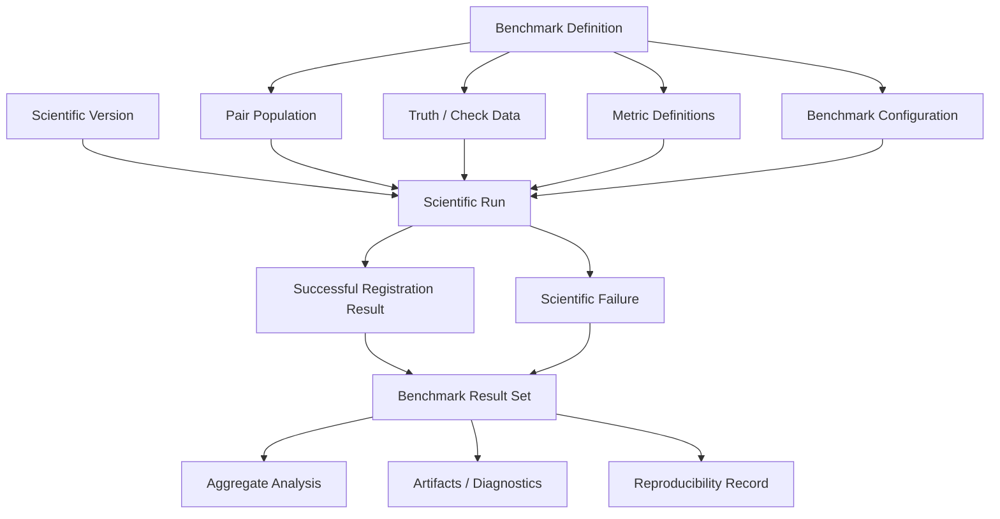
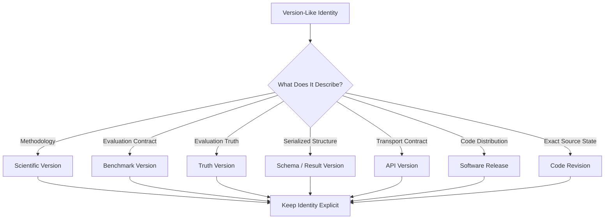
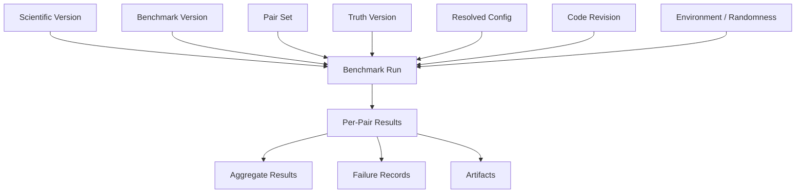
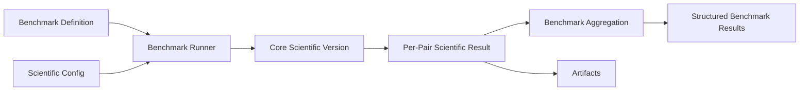
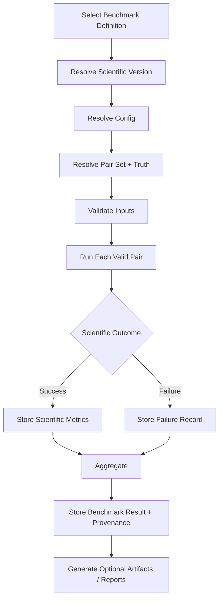
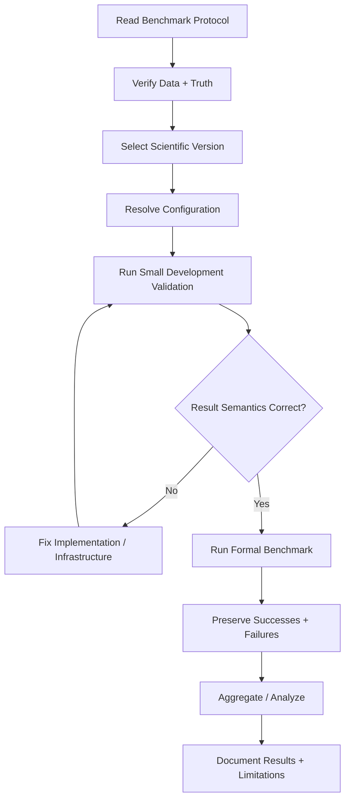
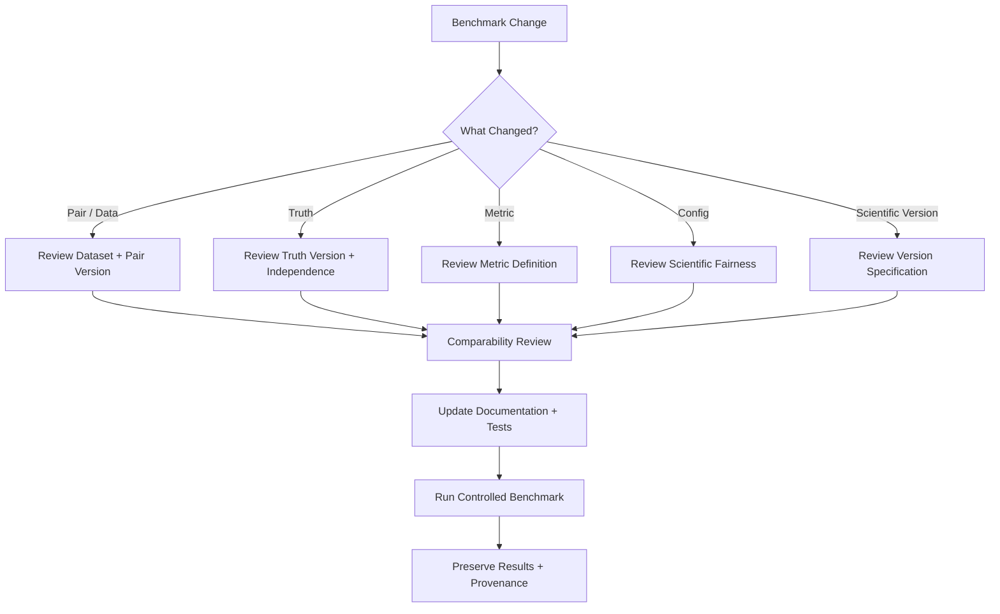

# Benchmarking

ChandraMap uses benchmarking to measure scientific behavior under controlled, reproducible conditions. This guide defines how contributors should implement, execute, preserve, compare, review, and extend ChandraMap benchmarks without changing the scientific meaning of the evaluation.

It is intended for:

- scientific-software contributors
- computer-vision and registration engineers
- remote-sensing researchers
- benchmark and evaluation maintainers
- backend/API engineers consuming benchmark results
- reviewers validating scientific changes
- AI coding agents modifying benchmark-related code

> **ChandraMap benchmarking exists to make scientific improvements measurable, reproducible, and comparable—not merely visually convincing.**

> **A benchmark is a controlled scientific comparison, not a convenient collection of successful examples.**

> **V1 establishes the trustworthy baseline; later versions earn their complexity by demonstrating measurable change under controlled evaluation.**

> **Fair comparison requires keeping data, truth, metric definitions, coordinate conventions, and evaluation populations fixed wherever scientifically possible.**

> **Failed valid pairs remain part of the benchmark population.**

> **Benchmark truth must evaluate the method, not secretly help fit or tune the method.**

> **A benchmark result without configuration, data identity, scientific version, and provenance is difficult to reproduce and should not be treated as strong evidence.**

> **Benchmark metrics must retain their units, coordinate space, population, and availability semantics.**

> **Benchmarks should compare methods, not hidden differences in preprocessing, truth, hardware, or data selection.**

> **Retrieval and registration are separate benchmark problems with separate metrics.**

> **Do not optimize for the benchmark by silently changing the benchmark.**

---

## 1. Purpose and Scope

This document is the developer-facing benchmarking guide for ChandraMap.

It explains how developers should work with benchmark definitions and evaluation contracts. It does **not** redefine the scientific benchmark itself.

The authoritative scientific meaning belongs in the evaluation and version documentation.

> **Evaluation documentation defines the scientific contract; this guide explains how developers should work with that contract.**

In particular:

- `../evaluation/benchmark-protocol.md` defines the evaluation protocol.
- `../evaluation/metrics.md` defines metric meaning.
- `../evaluation/ground-truth.md` defines truth requirements.
- `../evaluation/control-points.md` and `../evaluation/checkpoint-evaluation.md` define fit/check semantics.
- `../versions/v1/benchmark.md` defines the V1 benchmark contract.
- this file defines implementation, execution, reproducibility, governance, comparison, and contributor workflow.

This document must not become a duplicate of those specifications.

---

## 2. Source of Truth

The actual repository is authoritative for:

- benchmark definitions
- pair populations
- category assignments
- truth/check data
- benchmark versions
- scientific configurations
- result schemas
- supported commands
- CI jobs
- data locations
- serialization formats
- thresholds
- acceptance criteria
- version implementation status

Do not invent:

- benchmark commands
- benchmark IDs
- pair IDs
- category names
- dataset sizes
- number of pairs
- success thresholds
- RMSE thresholds
- coverage thresholds
- runtime limits
- random seeds
- benchmark version strings
- result filenames
- configuration keys
- CI benchmark behavior
- numerical benchmark results

When implementation details are not established, this guide describes the required concept without fabricating syntax or values.

---

# Benchmark Fundamentals

## 3. What Is a Benchmark?

A ChandraMap benchmark is a **controlled scientific evaluation procedure**.

A formal benchmark conceptually combines:

- defined scientific task
- defined pair population
- defined source/reference roles
- defined evaluation truth
- defined fit/check populations
- defined metric semantics
- defined scientific configuration policy
- defined scientific version
- defined benchmark version
- defined failure handling
- defined provenance requirements

Its purpose is to answer:

> **How does a particular scientific method perform under a controlled evaluation contract?**

A benchmark should produce evidence that can be compared across compatible scientific versions without changing the underlying evaluation conditions.

---

## 4. What a Benchmark Is Not

A benchmark is not:

- one successful source/reference pair
- one visually aligned image
- a screenshot
- a demo
- a unit test
- an integration test
- an exploratory notebook
- an arbitrary runtime measurement
- a hand-selected set of visually impressive results
- a collection from which failed pairs were removed
- a manually rescued set of final benchmark cases
- a leaderboard without a defined protocol
- a marketing comparison

A visually convincing registration can still be scientifically wrong.

A method that succeeds on one pair can still fail systematically on:

- another sensor
- a larger scale gap
- different illumination
- low-feature terrain
- another geometry
- another modality

---

# Tests, Experiments, Benchmarks, and Versions

## 5. Core Distinction

> **Tests prove implementation behavior, experiments explore ideas, and benchmarks provide controlled scientific comparison.**

These activities have different responsibilities.

### Tests

Tests answer questions such as:

- Does this function respect its contract?
- Does the coordinate conversion preserve expected semantics?
- Are failures returned correctly?
- Does result aggregation retain failed cases?
- Does the metric implementation calculate the specified quantity?

Tests verify **software correctness**.

### Experiments

Experiments answer questions such as:

- Does gradient preprocessing improve robustness under changed illumination?
- Should one matcher replace another?
- Does sub-pixel refinement improve held-out error?
- Which IIRS-derived representation preserves terrain structure better?

Experiments explore **hypotheses and alternatives**.

### Benchmarks

Benchmarks answer questions such as:

- How does scientific V1 perform under the benchmark contract?
- Did a later methodology change held-out registration performance?
- Which failure modes dominate under defined benchmark categories?
- Does a new method improve one metric while reducing another?

Benchmarks provide **controlled scientific evidence**.

### Scientific Versions

Scientific versions identify the methodology being evaluated.

For ChandraMap:

- V1 is the classical baseline/foundation.
- later versions represent benchmarkable research milestones.

A scientific version is not itself the benchmark.

---

## 6. Comparison Table

| Activity           | Question                                 | Typical Data                          | Stability            |
| ------------------ | ---------------------------------------- | ------------------------------------- | -------------------- |
| Test               | Does implementation follow its contract? | Small fixtures or synthetic data      | Stable               |
| Experiment         | What happens if we change X?             | Controlled research data              | Exploratory          |
| Benchmark          | How well does the method perform?        | Frozen/versioned benchmark population | Controlled/frozen    |
| Scientific Version | Which methodology is being evaluated?    | Defined by version specification      | Historical/versioned |

---

# Benchmark Components

## 7. Formal Benchmark Definition

A formal benchmark should conceptually identify:

- benchmark version
- scientific version under evaluation
- pair population
- benchmark categories
- source/reference identities
- truth/check data
- fit/control data
- metric definitions
- coordinate conventions
- resolved scientific configuration
- code revision
- runtime environment where relevant
- random context where relevant
- failure policy
- result representation
- artifact policy

Not every implementation must serialize these concepts identically, but their scientific identities must remain traceable.

---

## 8. Benchmark Architecture



---

# Version Axes

## 9. Benchmark Version

A benchmark version identifies a specific evaluation contract.

A benchmark revision may be required when changing scientifically meaningful elements such as:

- pair population
- truth/check data
- category definitions
- metric definitions
- coordinate conventions
- evaluation procedure
- failure treatment

Do not confuse benchmark version with scientific V1/V2/V3/V4.

---

## 10. Scientific Version

Scientific version identifies methodology.

For example, scientific V1 represents the baseline registration methodology.

A benchmark may evaluate several compatible scientific versions under one benchmark contract.

---

## 11. Other Version Axes

Keep the following concepts distinct:

- scientific version
- benchmark version
- truth version
- pair/dataset version
- result/schema version
- API contract version
- software release
- code revision

Do not collapse all of these into one ambiguous `version`.

See `../api/versioning.md` for API-version semantics where implemented.

---

## 12. Version Relationship



---

# Frozen Benchmark Principle

## 13. Freeze Comparable Conditions

> **Once a benchmark is used for formal comparison, its defining conditions should not change silently.**

Conditions that may require freezing include:

- pair identities
- source/reference roles
- truth/check points
- fit/check separation
- metric definitions
- category assignment rules
- coordinate conventions
- missing-value semantics
- success/failure treatment
- configuration policy

Without frozen conditions, apparent method improvement may actually come from benchmark drift.

---

## 14. When a Benchmark Must Change

A benchmark can contain mistakes.

Examples include:

- invalid pair association
- corrupt source data
- broken truth
- incorrect coordinate mapping
- inconsistent category assignment
- metric implementation defect

If a defect is discovered:

1. document the problem
2. identify which prior results may be affected
3. update the benchmark contract explicitly
4. version/revise the benchmark where scientifically necessary
5. rerun affected comparisons when appropriate
6. avoid presenting incompatible old and new results as directly comparable

Do not silently edit the benchmark and retain the same scientific identity.

---

# Benchmark Data and Pair Population

## 15. Dataset Requirements

Benchmark data should be:

- scientifically relevant
- traceable
- reproducible
- appropriately versioned
- representative of the intended task
- valid for the claimed comparison
- legally usable under applicable data licenses

See:

- `../datasets/README.md`
- `../datasets/pair-definition.md`
- `../datasets/ground-truth-preparation.md`

Benchmark validity must not be defined by whether V1 succeeds.

---

## 16. Benchmark Pair

A benchmark pair represents a defined source/reference relationship.

It should preserve enough context to identify:

- source product
- reference product
- source sensor
- reference sensor
- product/representation type
- known overlap/context
- relevant projection/coordinate metadata
- pair identity/version

Do not treat benchmark pairs as anonymous `image1` and `image2` files.

---

## 17. Known-Overlap V1 Benchmarking

V1 primarily evaluates **known-overlap local registration**.

Global retrieval must not become a hidden requirement of the V1 benchmark.

If later versions add global retrieval, that capability should receive its own compatible benchmark definition or benchmark dimension rather than silently rewriting the V1 task.

---

## 18. Valid Pair vs Invalid Benchmark Entry

This distinction is critical.

### Valid benchmark pair with scientific failure

The pair is scientifically valid, but the method fails.

Examples conceptually include:

- insufficient stable correspondences
- geometric verification failure
- transform estimation failure
- registration failure

This outcome must remain in the benchmark.

### Invalid benchmark entry

The benchmark data itself is invalid.

Examples conceptually include:

- wrong source/reference association
- corrupt required file
- invalid or broken truth
- incorrect benchmark metadata

An invalid benchmark entry may require benchmark correction.

> **Method failure is not the same thing as bad benchmark data.**

---

# Benchmark Categories

## 19. Purpose

Benchmark categories provide interpretable slices of scientific performance.

They may conceptually characterize dimensions such as:

- source instrument
- scale gap
- illumination difference
- terrain morphology
- modality difference
- geometry challenge
- feature richness

Actual category names and thresholds belong to the authoritative benchmark/evaluation specification.

See `../evaluation/benchmark-categories.md`.

---

## 20. Category Design

A benchmark category should be:

- scientifically interpretable
- consistently assignable
- reproducible
- useful for diagnosing behavior
- defined independently of desired outcome

Do not create categories only after viewing results in order to make one method look favorable.

---

## 21. Avoid Undefined Easy/Hard Labels

Avoid categories called:

- easy
- hard
- difficult
- best case
- worst case

unless objective criteria define those labels.

Prefer measurable or scientifically descriptive classification.

---

# Fit, Control, Check, and Truth

## 22. Fit / Control Points

Fit or control points are points used to estimate or support the transform according to the evaluation design.

They belong to the model-fitting population.

See `../evaluation/control-points.md`.

---

## 23. Held-Out Check Points

> **Check points exist to evaluate the transform independently and should not influence model fitting.**

Check points should remain outside transform fitting when the benchmark claims independent check-point evaluation.

See `../evaluation/checkpoint-evaluation.md`.

---

## 24. Fit Is Not Check

A low residual on fitting points does not automatically imply strong independent registration accuracy.

The same correspondences used to estimate a model are usually favorable to that model.

Therefore:

- fit residual measures model consistency on fitting data
- held-out check error measures performance on data not used to fit the model

These should remain separately named and interpreted.

---

# Truth Leakage

## 25. What Is Truth Leakage?

Truth leakage occurs when information intended only for evaluation affects fitting, configuration, model selection, or manual decisions.

Examples include:

- fitting the transform to held-out check points
- tuning thresholds using final check-point RMSE
- manually changing pair-specific settings after viewing final truth error
- selecting the transform model based on final held-out truth
- choosing which pairs to keep based on final benchmark performance
- repeatedly optimizing against a supposedly final benchmark until it effectively becomes development data

> **Benchmark truth must evaluate the method, not secretly help fit or tune the method.**

Truth leakage undermines the independence of the evaluation.

---

## 26. Pair-Specific Manual Rescue

> **Final benchmark pairs must not be manually rescued with undocumented pair-specific tuning after their outcomes are known.**

Invalid practices include conceptually:

- changing thresholds only for one failed benchmark pair
- selecting another preprocessing path after looking at its final truth RMSE
- manually excluding correspondences because the benchmark truth shows they are wrong
- switching transform model only after observing final held-out error

If sensor- or condition-specific routing is scientifically required, define the routing logic **before formal evaluation** and apply it as a reproducible rule.

---

## 27. Development Data vs Final Benchmark

Development or tuning data and final held-out benchmark data should remain distinct where the benchmark protocol defines such a separation.

Do not invent a split if the project does not currently define one.

The benchmark protocol is authoritative.

---

# Ground Truth

## 28. Truth Requirements

Evaluation truth should be:

- traceable
- documented
- scientifically justified
- versionable
- independent where required
- consistent with coordinate conventions

See `../evaluation/ground-truth.md`.

---

## 29. Reference Is Not Automatically Truth

> **The image used as the registration reference is not automatically an independent evaluation truth source.**

For example, LRO NAC or WAC imagery may be used as registration reference data without automatically becoming independent ground truth.

Keep these concepts separate:

- registration reference
- truth/control/check data
- provider metadata
- manually/independently validated evaluation truth

---

# Metric Semantics

## 30. Authoritative Metric Definitions

Metric definitions belong in the evaluation documentation.

See `../evaluation/metrics.md`.

Formal benchmark metrics must preserve:

- formula
- evaluation population
- coordinate space
- units
- missing-value behavior
- aggregation semantics

Changing any of these may change the meaning of the benchmark result.

---

## 31. Candidate Count

Candidate correspondence count is primarily a diagnostic.

More candidate correspondences do not automatically mean:

- better registration
- higher accuracy
- stronger geometry
- better spatial coverage

A matcher may produce many incorrect or highly clustered correspondences.

---

## 32. Filtered Candidate Count

Filtered candidate count records how many matcher outputs remain after the configured filtering stage.

It still does not represent independent truth.

---

## 33. Verified Inlier Count

Inlier count describes geometrically model-consistent support after verification.

RANSAC/model-consistent inliers are not automatically ground truth.

---

## 34. Inlier Ratio

Inlier ratio requires a defined denominator.

Do not call inlier ratio **accuracy**.

The benchmark contract must make the ratio population clear.

---

## 35. Fit Residual

Fit residual describes model consistency on data involved in transform estimation.

Do not present fit residual as independent registration accuracy.

---

## 36. Held-Out Check-Point RMSE

Held-out check-point RMSE can provide independent geometric evaluation when:

- check points are valid
- check points remain outside fitting
- coordinate semantics are known
- units are preserved

Where applicable, preserve:

- check-point population
- coordinate space
- units
- number of evaluated check points
- truth version

---

## 37. RMSE Definition

For two-dimensional residuals \(r_i\), a common RMSE form is:

$$
\mathrm{RMSE}
=
\sqrt{
\frac{1}{N}
\sum_{i=1}^{N}
\lVert r_i \rVert^2
}
$$

The equation alone is insufficient.

A valid benchmark definition must also state:

- what \(r_i\) represents
- which points are included
- which coordinate system is used
- what units apply
- what \(N\) counts
- how unavailable points are handled

---

## 38. Spatial Coverage

Spatial coverage describes how well useful correspondences support the valid overlap.

See `../evaluation/spatial-coverage.md`.

Coverage is not accuracy.

A method can have:

- low RMSE but poor spatial coverage
- broad coverage but worse geometric error

Both facts matter.

---

## 39. Ground-Space Error

> **Report source/reference image-space error first. Convert to metres only when valid GSD/projection/ground-reference context supports the conversion.**

Do not universally compute:

```text
metre error = pixel RMSE × approximate sensor GSD
```

without verifying the geometry and product context.

Approximate instrument summaries are not substitutes for product-specific metadata.

---

# Missing and Unavailable Metrics

## 40. Unavailable Is Not Zero

> **Unavailable is not zero.**

Examples:

- no independent check truth → check RMSE unavailable
- no valid transform → transform-dependent metric unavailable
- no ground-reference context → ground-space metric unavailable

Encoding unavailable metrics as `0` falsely suggests perfect performance.

Use repository-defined missing/unavailable representation.

---

## 41. Partial Scientific Results

A pair may fail after producing valid intermediate diagnostics.

Depending on the stage, a failure record may still retain:

- candidate count
- filtered candidate count
- inlier count
- runtime to failure
- failure stage
- diagnostics
- provenance

Do not fabricate later-stage metrics after a required stage fails.

---

# Success and Failure

## 42. Failure Is Benchmark Evidence

> **A valid benchmark includes successful registrations and valid scientific failures.**

A scientific failure describes method behavior.

Do not silently discard the pair.

---

## 43. Failure Stage

When possible, record the observed stage at which the run could not continue.

Potential conceptual stages include:

- input validation
- sensor preparation
- preprocessing
- feature extraction
- local matching
- match filtering
- geometric verification
- transform estimation
- sub-pixel refinement
- registration
- evaluation

Actual failure values should come from the implementation.

---

## 44. Observed Failure vs Root Cause

Do not confuse:

- observed failure stage
- diagnostic symptom
- suspected cause
- confirmed cause

For example, “geometric verification produced insufficient model support” may be observed.

“Sun angle caused the failure” may only be a hypothesis unless evidence supports it.

See `../evaluation/failure-cases.md`.

---

# Benchmark Aggregation

## 45. Population Must Be Explicit

Every aggregate must define the population over which it is computed.

Conceptual populations include:

- all valid benchmark pairs
- scientifically successful registrations only
- one sensor group
- one benchmark category
- one stress-test condition

Never assume the reader knows the denominator.

---

## 46. Denominator Transparency

> **Every percentage or aggregate should make its denominator population clear.**

For example:

```text
scientific success rate =
scientifically successful pairs / valid benchmark pairs
```

Exact success semantics belong to the benchmark/evaluation contract.

---

## 47. Success-Only Aggregates

A metric may be available only on successful registrations.

That is acceptable if clearly labeled.

For example, a report may distinguish:

- overall scientific success rate across all valid pairs
- check RMSE distribution among pairs where check RMSE is valid

Do not present success-only averages as though they describe the complete benchmark population.

---

## 48. Mean, Median, Percentiles, and Distribution

Different aggregate statistics reveal different behavior.

Where appropriate, reporting may include:

- mean
- median
- percentile summaries
- distribution plots
- failure counts

Do not prescribe a universal aggregation method here.

The evaluation specification is authoritative.

---

## 49. Outliers

Do not remove an outlier merely because it hurts performance.

If a pair is scientifically valid, retain the outcome.

If a pair is invalid, document why it is excluded and revise the benchmark appropriately.

> **Difficult valid examples are evidence, not clutter.**

---

# Benchmark Configuration

## 50. Scientific Configuration

Formal benchmark configuration should remain:

- explicit
- traceable
- reproducible
- compatible with the benchmark contract

Avoid hidden developer defaults in formal results.

---

## 51. Resolved Configuration

Preserve the actual configuration used by the run where practical.

A preset name alone may be insufficient if:

- overrides exist
- adaptive settings are resolved
- environment values affect behavior
- sensor routing selects different configured branches

The final evaluated configuration should be reconstructable.

---

## 52. Adaptive Logic

Adaptive behavior can be scientifically valid.

Examples conceptually include:

- sensor-aware preprocessing
- scale-aware reference selection
- model selection based on predefined input conditions

Adaptive behavior is not the same as manual pair-specific tuning.

The key requirements are:

- rule defined before formal evaluation
- deterministic/reproducible decision logic where feasible
- decision traceability
- no use of held-out truth

---

# Reproducibility

## 53. Required Provenance

A formal benchmark result should preserve, where relevant:

- scientific version
- benchmark version
- pair identity/version
- truth version
- source/reference identities
- resolved configuration
- code revision
- dependency/environment context
- hardware context for performance claims
- random state where applicable
- metric definitions/version context

See `../evaluation/reproducibility.md`.

---

## 54. Reproducibility Flow



---

## 55. Randomness

For stochastic algorithms:

- control randomness where supported
- record relevant random state where needed
- document unavoidable nondeterminism

Do not invent a universal seed for the project.

---

## 56. Determinism

Reproducible benchmark conditions do not necessarily imply bitwise-identical results across:

- hardware
- GPU architectures
- BLAS implementations
- library versions
- floating-point execution orders
- parallel execution

Do not promise cross-platform bitwise determinism unless it has been demonstrated.

---

# Repository Responsibilities

## 57. Benchmark Definitions vs Results

> **Benchmark definitions describe what to run; results describe what happened.**

Where the repository uses these root areas conceptually:

- `../../benchmarks/` — benchmark definitions/runners/configuration
- `../../results/` — structured scientific outcomes
- `../../artifacts/` — generated supporting evidence
- `../../experiments/` — exploratory research work
- `../../configs/` — scientific/runtime configuration
- `../../tests/` — software correctness verification

The actual repository structure remains authoritative.

---

## 58. Result vs Artifact

### Result

Structured scientific outcome.

May include:

- scientific status
- metrics
- failure information
- provenance

### Artifact

Generated supporting file.

May include:

- registered preview
- match visualization
- inlier visualization
- residual-vector visualization
- coverage visualization

> **A preview artifact is not the benchmark result itself.**

---

# Benchmark Code Boundaries

## 59. Benchmark Runner Responsibility

Benchmark tooling may:

- resolve benchmark definition
- resolve pair population
- resolve scientific version
- invoke the core pipeline
- collect scientific results
- aggregate benchmark outcomes
- persist benchmark records
- generate diagnostics/reports

It should not implement a hidden alternative scientific pipeline.

---

## 60. Core Dependency Direction

Preferred conceptual direction:

```text
Benchmark Runner
    ↓
Core Scientific Version
    ↓
Scientific Result
    ↓
Benchmark Aggregation
```

Core scientific logic should not depend on benchmark-report presentation logic.

---

## 61. Benchmark Dependency Flow



---

# Testing Benchmark Infrastructure

## 62. Benchmark Infrastructure Must Be Tested

Benchmark code is software and can contain bugs.

Tests should conceptually verify behavior such as:

- pair resolution
- benchmark definition loading
- configuration resolution
- fit/check separation
- truth selection
- metric aggregation
- missing-value handling
- failure retention
- provenance recording
- category grouping

See `testing.md`.

---

## 63. Infrastructure Test vs Benchmark Run

### Benchmark infrastructure test

Question:

> Does the benchmark machinery behave correctly?

### Benchmark run

Question:

> How does the scientific method perform?

Do not treat passing infrastructure tests as scientific benchmark evidence.

---

# Development Subsets and Formal Benchmarks

## 64. Development Benchmarking

A developer may use a smaller subset for fast iteration **if the repository defines one**.

Development subsets are useful for:

- debugging benchmark runners
- validating configuration
- confirming result semantics
- detecting obvious regressions
- reducing iteration cost

Do not invent a subset in this document.

---

## 65. Development Results Are Not Automatically Formal Results

Results from a development subset must not be presented as though they represent the complete formal benchmark.

Clearly identify the population used.

---

## 66. Formal Benchmark

Formal execution should use the authoritative frozen:

- benchmark version
- pair population
- truth/check data
- metric definitions
- configuration policy
- failure semantics

Do not silently replace the formal population with a development subset.

---

# Formal Benchmark Preparation

## 67. Before Running

- [ ] Correct scientific version is selected
- [ ] Correct benchmark definition/version is selected
- [ ] Correct pair population is available
- [ ] Correct truth/check data is available
- [ ] Fit and check populations remain separated
- [ ] Configuration resolves as intended
- [ ] Source/reference data are valid
- [ ] Output location/persistence is ready
- [ ] Code revision is identifiable
- [ ] Environment is identifiable where required
- [ ] Randomness is controlled or recorded where relevant
- [ ] No unintended pair-specific override exists
- [ ] Cached data, if used, correspond to the current scientific identity

---

## 68. Benchmark Commands

Only document commands that actually exist in the repository.

Do not invent commands such as:

```text
make benchmark
python benchmark.py
```

unless they are verified.

Use `local-development.md` to explain how contributors discover current repository-defined commands.

---

# Benchmark Execution

## 69. Execution Flow



---

## 70. Per-Pair Execution

Every valid pair should produce one of:

- scientific result
- structured scientific failure

Silent omission is not acceptable.

A pair disappearing from output makes aggregate denominators unreliable.

---

## 71. Resumable Runs

If resumable benchmark execution exists, use the actual repository implementation.

Resumption must not accidentally combine results from incompatible:

- code revisions
- scientific versions
- benchmark versions
- truth versions
- configurations

Do not claim resumability if it is not implemented.

---

## 72. Caching

If benchmark caching exists, cache identity should reflect scientifically relevant inputs such as:

- data identity
- prepared representation
- scientific version
- configuration
- preprocessing
- code where necessary

A stale cache must not masquerade as a result from another methodology.

---

## 73. Parallel Execution

Parallelism may reduce benchmark runtime where implemented.

Parallel execution must still preserve:

- per-pair identity
- failures
- configuration identity
- deterministic aggregation
- resource isolation where relevant

Do not claim parallel benchmark support unless implemented.

---

# Runtime Benchmarking

## 74. Runtime Requires Context

Runtime measurements are not meaningful without execution context.

Where relevant, record:

- CPU/GPU context
- accelerator usage
- software environment
- image dimensions/data scale
- scientific version
- configuration

> **Runtime comparisons require comparable conditions or explicit caveats.**

---

## 75. Hardware Fairness

Prefer equivalent hardware/environment when comparing runtime.

If hardware differs, disclose it.

Do not claim one methodology is faster when the measurements were obtained under materially different environments without qualification.

---

## 76. CPU and GPU

The classical V1 baseline should not automatically be described as GPU-dependent.

Later learned methods may use accelerators.

Runtime comparisons should make hardware requirements explicit.

---

## 77. Initialization, Warm-Up, and Cache State

Runtime may be affected by:

- model loading
- GPU initialization
- library initialization
- disk cache
- memory cache
- preprocessing reuse

If runtime methodology controls these factors, document the authoritative protocol.

Do not invent one here.

---

## 78. Runtime vs Scientific Quality

Scientific quality and computational performance are separate dimensions.

A method can be:

- more accurate but slower
- faster but less robust
- lower-error but lower-coverage
- higher-success but more resource-intensive

Do not collapse these trade-offs into one undocumented score.

---

# Scientific Input Fairness

## 79. Preprocessing

Fair comparison does not necessarily require byte-identical preprocessing for every method.

Different sensors and methods may require scientifically appropriate preparation.

However, preprocessing differences must be:

- documented
- reproducible
- consistent with the method definition
- included in runtime interpretation where applicable

Hidden preprocessing changes invalidate fair comparison.

---

## 80. Compare Information, Not Pixel Count

> **Compare information, not pixel count.**

A method must not receive an unfair advantage merely because one representation has been resized to a larger array.

---

## 81. Upsampling

Upsampling creates more samples.

It does not create missing lunar surface detail.

Do not benchmark a coarse product as if interpolation transformed it into native high-resolution imagery.

---

# Sensor-Aware Benchmarking

## 82. Preserve Sensor Identity

Sensor identity should remain visible in:

- pair metadata
- category analysis
- result interpretation
- failure analysis

Different sensors have different physical information content.

See `../sensors/overview.md`.

---

## 83. OHRC

OHRC provides very high-resolution panchromatic lunar imagery.

Published/project context may place typical spatial sampling around approximately 0.25–0.32 m/pixel depending on product/documentation.

Do not treat that approximate summary as fixed product GSD.

Product metadata is authoritative.

---

## 84. TMC-2

TMC-2 provides panchromatic terrain imagery at approximately metre-scale sampling commonly summarized around 5 m/pixel.

Do not assume every TMC-2 product automatically contains elevation/DEM data.

The image product and auxiliary terrain products are separate concepts.

---

## 85. IIRS

IIRS requires special benchmarking care.

IIRS is an imaging infrared/hyperspectral instrument, not merely a lower-resolution conventional camera.

Its scientific context includes approximately:

- ~80 m/pixel spatial sampling
- ~0.8–5.0 µm spectral coverage
- roughly ~250–256 bands depending on source/product description

A registration benchmark must identify which IIRS representation is being evaluated.

Examples conceptually may include:

- selected spectral band
- PCA-derived representation
- spectral composite
- structure-focused derived representation

Do not report an unspecified `IIRS grayscale` result without defining how that representation was generated.

---

## 86. LRO NAC

LRO NAC may provide high-resolution reference imagery.

NAC reference imagery is not automatically independent ground truth.

---

## 87. LRO WAC

LRO WAC may provide broader/coarser lunar context.

Do not assign one universal WAC GSD to all products without product-specific support.

---

# Illumination Fairness

## 88. Sun-Angle Effects

Different Sun geometry can change:

- shadow direction
- shadow extent
- local contrast
- visibility of terrain structures

A benchmark may categorize or stress illumination differences if the data supports such classification.

Do not assume histogram or contrast normalization makes different illumination conditions equivalent.

---

# Geometry Fairness

## 89. Model Assumptions

Affine or homography transforms may be appropriate for local, suitably prepared image pairs.

They are not universal lunar surface geometry models.

Wide areas, strong relief, sensor geometry, or viewing differences may violate a simple global transform assumption.

Benchmark interpretation should acknowledge this.

---

## 90. Local vs Wide-Area Registration

Do not silently mix:

- known-overlap local registration
- global localization
- global retrieval
- wide-area geospatial registration

These are different scientific tasks.

---

# Retrieval Benchmarking

## 91. Retrieval Is a Separate Benchmark Problem

Later ChandraMap versions may include retrieval.

Retrieval answers:

> Where should the system look?

Registration answers:

> How should the selected source and reference imagery geometrically align?

> **Retrieval determines where to look; registration determines how two images geometrically align.**

---

## 92. Retrieval Metrics

Retrieval evaluation may use metrics such as:

- Recall@1
- Recall@5
- Recall@K

where the authoritative benchmark defines them.

These evaluate whether the correct reference candidate appears within the retrieved ranking.

They do not measure geometric registration accuracy.

---

## 93. FAISS

FAISS may be used for vector indexing and similarity search.

FAISS is not an image-registration method.

A FAISS search result is a retrieval result, not a registration result.

---

## 94. Retrieval/Registration Flow


---

## 95. Retrieval Benchmark Data

A retrieval benchmark should independently define:

- searchable reference corpus
- query population
- correct-reference definition
- geographic/tile tolerance where applicable
- ranking metric semantics
- Recall@K computation

Do not use registration RMSE to evaluate the retrieval ranking itself.

---

# Scientific Version Benchmarking

## 96. ChandraMap V1–V4 Philosophy

> **Each ChandraMap version is a benchmarkable research milestone, not merely a software release number.**

High-level project direction:

### V1

Classical baseline/foundation.

Conceptual flow:

```text
Known Pair
→ Validate Inputs
→ Sensor Routing
→ Preprocessing
→ Physical Scale Handling
→ SIFT
→ Descriptor Matching
→ Match Filtering
→ RANSAC
→ Initial Transform
→ Optional Sub-Pixel Refinement
→ Final Refit
→ Registration
→ Evaluation
→ Result / Failure
```

> **V1 should remain the smallest scientifically defensible, reproducible, benchmarkable classical baseline.**

### V2

May investigate stronger local-registration robustness.

Do not claim completion or superiority unless repository implementation and measured benchmark results support it.

### V3

May expand into stronger matching, retrieval, or broader end-to-end workflows.

Retrieval metrics and registration metrics must remain separate.

### V4

May investigate advanced research directions such as:

- multimodal methods
- DEM/terrain-aware geometry
- uncertainty
- multi-mission methods
- maximum-accuracy research strategies

These are project directions, not assumed implementation status.

---

# Multi-Version Comparison

## 97. Controlled Comparison

When comparing V1, V2, V3, and V4, keep scientifically compatible conditions fixed wherever possible:

- same pair population
- same source/reference identity
- same truth
- same held-out check points
- same metric definitions
- same coordinate conventions
- same category definitions
- same failure treatment
- comparable runtime hardware when runtime is compared

---

## 98. Backward Comparability

> **Later versions should be compared against earlier versions on frozen, compatible benchmark data whenever scientifically possible.**

If one method changes the scientific task itself, do not force false direct comparison.

Document the incompatibility.

---

## 99. New Capabilities

A later version introducing global retrieval should not rewrite V1 local-registration benchmarking so that V1 suddenly fails because it does not perform retrieval.

Add the new task explicitly.

---

## 100. Preserve V1

Do not delete or replace V1 after stronger methods appear.

V1 provides:

- historical baseline
- classical reference method
- reproducibility target
- regression anchor
- evidence for whether later complexity produces measurable value

---

## 101. V2 Comparison

V2 should demonstrate specific measured differences relative to V1 on compatible benchmark conditions.

Do not call V2 `better` merely because it is newer or more complex.

---

## 102. V3 Comparison

If V3 introduces retrieval, report:

- retrieval metrics for retrieval
- registration metrics for registration

Do not merge Recall@K and registration RMSE into one ambiguous performance concept.

---

## 103. V4 Comparison

If V4 introduces new scientific outputs such as:

- uncertainty
- DEM-aware geometry
- multimodal fusion

add the necessary evaluation dimensions without redefining historical metrics silently.

---

# Benchmark Regression

## 104. Definition

A benchmark regression is a measurable deterioration or unexpected scientific behavior change under compatible controlled conditions.

It should trigger investigation.

It should not trigger immediate benchmark relaxation.

---

## 105. Regression Investigation Order

Before concluding that algorithm quality changed, inspect:

- code revision
- scientific configuration
- benchmark version
- pair/data version
- truth version
- metric definition
- coordinate conversion
- preprocessing
- environment
- dependency version
- random state
- cache validity

A benchmark regression may originate from infrastructure rather than the scientific method.

---

## 106. Refactoring Regression

A refactor intended to preserve behavior should not materially change V1 benchmark behavior.

If it does, investigate:

- coordinate semantics
- preprocessing
- matching
- transform fitting
- metric calculations
- missing-value handling
- serialization/aggregation

---

## 107. Numerical Drift

Do not invent a universal permitted tolerance.

Numerical tolerance should come from the relevant:

- test
- numerical algorithm
- benchmark specification
- evaluation documentation

---

# Benchmark Improvement Claims

## 108. Required Context

Any scientific-performance claim should identify enough context to interpret it.

Relevant context may include:

- benchmark version
- scientific versions compared
- metric
- population/category
- failures
- truth
- runtime environment for performance claims

---

## 109. Evidence-Based Wording

A valid claim may take a form such as:

> On benchmark version `PLACEHOLDER`, scientific version B produced lower held-out check-point RMSE than scientific version A over the specified benchmark population.

Only use such wording when actual measured data supports it.

Do not fabricate the result.

---

## 110. Avoid Generic Accuracy Claims

Avoid:

> V2 improved accuracy.

Prefer the actual measured concept, for example:

- lower check-point RMSE
- higher scientific success rate
- greater spatial coverage
- higher Recall@K

when those measurements exist.

---

# Multi-Metric Interpretation

## 111. No Automatic Single Winner

A scientific method may have:

- lower RMSE but lower coverage
- higher coverage but worse RMSE
- higher success rate but longer runtime
- lower runtime but more failures
- stronger retrieval but unchanged registration quality

Do not collapse these trade-offs into an arbitrary winner label unless the benchmark specification explicitly defines a composite score.

---

## 112. Visual Evidence

> **A visually aligned image is useful evidence for inspection, but it is not a replacement for quantitative benchmark metrics.**

Visual artifacts help identify:

- clustered correspondences
- warp artifacts
- obvious geometric errors
- spatial residual patterns

They do not independently establish accuracy.

---

# Failure Analysis

## 113. Analyze Patterns

Failure analysis may inspect relationships with:

- sensor
- modality
- scale gap
- illumination
- terrain morphology
- feature richness
- geometry

Do not infer causality merely because failures correlate with one category.

---

## 114. Stress Tests

See `../evaluation/stress-tests.md`.

Stress tests may target challenging conditions such as:

- large scale differences
- illumination changes
- modality differences
- geometry stress
- low-feature terrain

Do not redefine a stress-test category after viewing outcomes without appropriately versioning the benchmark definition.

---

# Benchmark Reports

## 115. Report Contents

A scientific benchmark report should identify:

- benchmark version
- scientific version(s)
- benchmark population
- categories where relevant
- configuration
- metric definitions
- scientific failures
- runtime context
- limitations
- provenance

---

## 116. Overall Result Table Template

**Template only — not benchmark results.**

| Scientific Version | Valid Pairs | Scientific Successes | Scientific Failures |  Check RMSE |    Coverage |     Runtime |
| ------------------ | ----------: | -------------------: | ------------------: | ----------: | ----------: | ----------: |
| V1                 | PLACEHOLDER |          PLACEHOLDER |         PLACEHOLDER | PLACEHOLDER | PLACEHOLDER | PLACEHOLDER |
| V2                 | PLACEHOLDER |          PLACEHOLDER |         PLACEHOLDER | PLACEHOLDER | PLACEHOLDER | PLACEHOLDER |

Actual metrics, units, aggregation, and available versions must come from the benchmark definition and measured results.

---

## 117. Category Result Template

**Template only — not benchmark results.**

| Category             |  Pair Count |   Successes |    Failures | Primary Metrics |
| -------------------- | ----------: | ----------: | ----------: | --------------- |
| PLACEHOLDER_CATEGORY | PLACEHOLDER | PLACEHOLDER | PLACEHOLDER | PLACEHOLDER     |

Do not invent real category names or counts.

---

## 118. Conceptual Per-Pair Fields

A per-pair record may conceptually preserve:

```text
pair_id
scientific_version
benchmark_version
scientific_status
candidate_count
filtered_candidate_count
inlier_count
inlier_ratio
fit_residual
check_rmse
spatial_coverage
runtime
failure_stage
provenance
```

These are conceptual semantics.

They are not assertions of the actual serialized field names.

---

# Result Storage

## 119. Machine-Readable Results

Use the repository-defined result format.

Do not invent a requirement that results must be:

- JSON
- CSV
- database rows
- Parquet
- YAML

unless the repository establishes it.

Structured machine-readable output is generally valuable because it supports reproducible aggregation, but the actual format is implementation-defined.

---

## 120. Human Reports

Human-readable reports may summarize structured benchmark outcomes.

Do not make a manually edited Markdown table the only authoritative result source if structured benchmark data exists.

---

# Benchmark Artifacts

## 121. Diagnostic Artifacts

Optional benchmark artifacts may include:

- registered preview
- correspondence visualization
- verified-inlier plot
- residual-vector plot
- spatial-coverage visualization
- failure diagnostic

Artifacts support:

- review
- debugging
- interpretation
- communication

They do not replace the result record.

---

## 122. Visualization Context

Where practical, benchmark visualizations should preserve:

- pair identity
- source/reference role
- scientific version
- coordinate context
- metric context

Avoid a generic image that cannot be traced back to the benchmark run that produced it.

---

# API, CLI, Notebook, and Frontend Boundaries

## 123. API

If benchmark execution or result access is exposed through an API, the API should use the same underlying scientific and evaluation logic.

Do not create API-specific benchmark science.

---

## 124. CLI and Scripts

CLI commands and scripts should invoke shared core/benchmark logic.

Do not duplicate:

- RMSE formula
- inlier classification
- coverage calculation
- success criteria

in one-off scripts.

---

## 125. Notebooks

Notebooks may:

- explore result distributions
- produce plots
- investigate failures
- compare versions

Do not make notebook-only manual calculations authoritative benchmark definitions.

---

## 126. Frontend

Frontend code may visualize benchmark outcomes.

It should not independently redefine:

- authoritative RMSE
- scientific success
- inlier classification
- benchmark category assignment

The frontend consumes benchmark semantics; it should not invent them.

---

## 127. API Result Semantics

Where benchmark results are serialized through API contracts, preserve:

- scientific metric identity
- units
- failure status
- version identity
- provenance

See API documentation where implemented.

---

# CI and Automation

## 128. Benchmarking in CI

CI may run, where configured:

- benchmark infrastructure tests
- smoke evaluation
- a small regression subset
- result-schema checks

Do not assume the complete scientific benchmark runs for every commit or pull request.

---

## 129. Full Benchmark Cost

Full benchmark execution may be expensive due to:

- large image files
- preprocessing
- feature extraction
- local matching
- learned inference
- repeated scientific versions
- external archive access

Formal scientific runs may therefore be separate from normal CI.

Use actual repository policy.

---

## 130. Automation

Automation improves repeatability only if it preserves:

- data identity
- truth identity
- scientific version
- benchmark version
- configuration
- environment
- result provenance

Do not claim benchmark automation exists unless implemented.

---

## 131. Result Immutability

Formal benchmark records should not be silently overwritten.

If a benchmark is rerun, preserve enough identity to distinguish executions.

Do not invent a run-ID format here.

---

# Benchmark Reproducibility Questions

## 132. A Reproducible Result Should Answer

- Which scientific version ran?
- Which code revision ran?
- Which benchmark definition applied?
- Which pair set was used?
- Which truth/check data were used?
- Which resolved configuration was used?
- Which environment was used where relevant?
- Which hardware produced runtime results?
- Which random context applied?
- Which metric definitions applied?

If these questions cannot be answered, the result is difficult to reproduce.

---

# Developer Workflow

## 133. Benchmark Development Workflow

```text
Understand Benchmark Contract
→ Verify Data and Truth
→ Select Scientific Version
→ Resolve Configuration
→ Run Small Development Validation
→ Validate Result Semantics
→ Run Formal Benchmark
→ Preserve Results and Failures
→ Analyze
→ Document
```

---

## 134. Development Workflow Diagram



---

# Adding a New Benchmark

## 135. Start With the Scientific Question

Do not begin a new benchmark by building a results table.

First define:

- scientific question
- scientific task
- valid data population
- applicable sensors/modalities
- source/reference roles
- pair validity
- independent truth
- fit/check separation
- benchmark categories
- metrics
- failure semantics
- configuration policy
- versioning
- reproducibility requirements

---

## 136. New Benchmark Decision Questions

Before creating a benchmark, answer:

1. What scientific question does the benchmark answer?
2. Is an existing benchmark sufficient?
3. Is the task registration, retrieval, localization, or another task?
4. Which scientific versions can run the benchmark?
5. What defines a valid pair?
6. What serves as the registration reference?
7. What serves as independent evaluation truth?
8. Which points may be used for fitting?
9. Which points are held out?
10. Which metrics are authoritative?
11. What are the units?
12. What are the coordinate spaces?
13. What constitutes scientific failure?
14. Are failed valid pairs retained?
15. Which categories are required?
16. What is frozen/versioned?
17. What is allowed to vary?
18. How is runtime contextualized?
19. What provenance is required?
20. Can the data legally be redistributed?
21. How will future versions remain comparable?

---

# Adding or Removing Pairs

## 137. Adding a Pair

Do not add a pair merely because the current method succeeds on it.

A pair should be added because it contributes to the scientific benchmark design.

Changing the formal pair population may require benchmark versioning.

---

## 138. Removing a Pair

A pair may be removed when:

- it is scientifically invalid
- its truth is invalid
- its source/reference association is wrong
- the benchmark definition intentionally changes

Document the reason.

Do not remove a valid pair because the method fails.

---

# Metric Governance

## 139. Adding a Metric

Before adding a metric, define:

- scientific meaning
- formula
- population
- units
- coordinate space
- missing-value semantics
- aggregation rules

Update authoritative evaluation documentation as part of the same scientific change.

---

## 140. Changing a Metric

Do not silently change metric semantics under the same name.

Changing any of the following may create a new metric meaning:

- formula
- population
- coordinate space
- unit
- check-vs-fit population
- aggregation

Version/document the change appropriately.

---

# Category Governance

## 141. Adding a Category

A category should have a reproducible assignment rule.

Define that rule before using results to interpret the category.

Avoid post-hoc categories designed solely to highlight favorable outcomes.

---

# Truth Governance

## 142. Changing Truth

Truth changes can invalidate direct comparison.

When truth changes:

- preserve truth identity/version
- explain why the change was needed
- identify affected historical results
- rerun compatible comparisons when necessary

Do not compare results generated against different truth as though the evaluation were identical.

---

# Documentation Governance

## 143. Benchmark Definition Changes

When a benchmark definition changes, review whether updates are required in:

- evaluation documentation
- scientific-version benchmark documentation
- development benchmarking guidance
- result metadata/schema
- tests
- changelog

---

# Benchmark Review

## 144. Reviewer Questions

A benchmark-related review should ask:

- Is the scientific question clear?
- Is the benchmark task well defined?
- Is the pair population valid?
- Are valid failures retained?
- Is the truth independent?
- Are fit and check populations separated?
- Are metric definitions fixed?
- Are units explicit?
- Are coordinate spaces explicit?
- Is configuration traceable?
- Is V1 still comparable?
- Is later-version behavior isolated?
- Is runtime comparison fair?
- Was any result cherry-picked?
- Was any final pair manually tuned?
- Are scientific claims supported by measured results?
- Is retrieval being confused with registration?
- Is reference imagery being confused with truth?

---

# Fairness Checklist

## 145. Controlled Comparison

- [ ] Same compatible pair population is used
- [ ] Same truth version is used
- [ ] Same held-out check points are used
- [ ] Same metric definitions are used
- [ ] Same coordinate conventions are used
- [ ] Failure handling is consistent
- [ ] Differences in preprocessing are disclosed
- [ ] Differences in hardware are disclosed
- [ ] Differences in dependencies/models are disclosed
- [ ] No pair-specific manual rescue occurred
- [ ] No failed valid pair was removed
- [ ] No held-out truth was used for tuning
- [ ] Retrieval metrics are separate from registration metrics

---

# Benchmark Checklist

## 146. Definition

- [ ] Benchmark question is clear
- [ ] Benchmark version is identified
- [ ] Scientific version is identified
- [ ] Pair population is defined
- [ ] Categories are defined
- [ ] Truth/check data are defined
- [ ] Metric definitions are authoritative
- [ ] Failure handling is defined

### Data

- [ ] Source/reference identities are traceable
- [ ] Product metadata is preserved
- [ ] Raw data remains immutable
- [ ] Prepared/derived representations preserve lineage
- [ ] IIRS representation is explicit where relevant
- [ ] Data licensing has been checked

### Truth

- [ ] Reference imagery is not automatically called truth
- [ ] Fit/control points are separate from held-out check points
- [ ] Truth version is preserved
- [ ] Held-out truth was not used for fitting
- [ ] Held-out truth was not used for pair-specific tuning

### Metrics

- [ ] Candidate count is treated as diagnostic
- [ ] Inlier count is not treated as truth
- [ ] Inlier-ratio denominator is clear
- [ ] Fit residual is distinct from check error
- [ ] RMSE units, coordinate space, and population are clear
- [ ] Coverage is distinct from accuracy
- [ ] Ground error uses valid scientific context
- [ ] Missing metrics are unavailable rather than zero
- [ ] Retrieval metrics remain separate from registration metrics

### Configuration

- [ ] Resolved configuration is traceable
- [ ] No hidden benchmark defaults are present
- [ ] No undocumented pair-specific overrides exist
- [ ] Adaptive logic is predefined and recorded

### Execution

- [ ] Code revision is recorded
- [ ] Environment is recorded where relevant
- [ ] Randomness is controlled or recorded where relevant
- [ ] Runtime context is recorded
- [ ] Caches are compatible with the current benchmark identity

### Results

- [ ] Every valid pair produces a result or failure record
- [ ] Failed pairs remain in the benchmark
- [ ] Success-rate denominator is clear
- [ ] Aggregates identify their population
- [ ] Success-only metrics are labeled as such
- [ ] Results are separate from artifacts
- [ ] Preview images are not treated as quantitative proof

### Version Comparison

- [ ] V1 remains reproducible
- [ ] Later versions do not silently rewrite V1
- [ ] Shared benchmark conditions remain frozen where compatible
- [ ] Incompatible tasks are not forced into false comparison
- [ ] New capabilities use additional metrics/protocols where needed

### Reporting

- [ ] No fabricated values are present
- [ ] Limitations are included
- [ ] Claims identify benchmark context
- [ ] Runtime claims identify hardware context
- [ ] No unsupported `best` or `SOTA` claim is made
- [ ] Failure behavior is discussed
- [ ] Provenance is preserved

---

# Benchmark Anti-Patterns

## 147. Do Not

Do not:

- benchmark only successful examples
- remove valid difficult pairs
- manually tune individual final benchmark pairs
- use held-out check points during fitting
- use held-out truth for model selection
- repeatedly optimize against final truth without acknowledging leakage
- silently change truth
- silently change pair population
- silently change metric definitions
- silently change coordinate conventions
- silently change success criteria
- compare success-only metrics without disclosure
- compare runtime across different hardware without disclosure
- call candidate count accuracy
- call inlier ratio accuracy
- call RANSAC inliers ground truth
- call reference imagery independent truth automatically
- encode missing RMSE as zero
- infer metre error blindly from approximate instrument GSD
- call a visual overlay benchmark proof
- compare Recall@K and RMSE as though they measure the same task
- call FAISS image registration
- make V3 retrieval mandatory in the V1 benchmark
- erase V1 after later versions exist
- overwrite historical formal benchmark records silently
- promote experiment output to official benchmark evidence without protocol
- hard-code benchmark results into scientific source code
- duplicate metric formulas in ad-hoc scripts
- make benchmark runners implement alternate scientific logic
- invent benchmark commands
- invent performance numbers
- invent thresholds
- invent pair counts
- claim later versions outperform V1 without measured evidence

---

# Claims to Avoid

## 148. Unsupported Claims

Do not claim without benchmark evidence:

- `V2 is more accurate than V1`
- `V3 is better than V2`
- `V4 is the best`
- `ChandraMap achieves sub-pixel accuracy`
- `ChandraMap is illumination invariant`
- `ChandraMap is scale invariant`
- `The system works on all lunar terrains`
- `Learned matching always outperforms SIFT`
- `IIRS registration is solved`
- `NAC is ground truth`
- `FAISS improves registration accuracy`
- `The benchmark contains N pairs`
- `The success rate is X%`
- `RMSE is X pixels`
- `Runtime is X seconds`
- `GPU is required`
- `The full benchmark runs in CI`

unless repository results explicitly support the statement.

---

# Benchmark Limitations

## 149. Scientific and Engineering Limitations

Benchmark interpretation may be limited by:

- limited independent lunar truth
- large sensor-resolution differences
- cross-modality differences
- illumination variation
- viewing geometry
- transform-model assumptions
- local terrain relief
- limited pair population
- external archive availability
- data redistribution restrictions
- benchmark runtime cost
- hardware differences
- stochastic learned methods
- incomplete later-version implementation
- long-term familiarity with benchmark data

These limitations should accompany scientific interpretation.

---

# Benchmark Overfitting

## 150. Saturation

A fixed benchmark can gradually become development data when contributors repeatedly inspect its failures and tune directly against them.

This can cause benchmark overfitting.

Potential future mitigations may include:

- new benchmark revisions
- additional stress tests
- external validation
- future held-out data
- cross-mission validation

Do not claim hidden evaluation sets currently exist unless they actually do.

---

# External Validation

## 151. Other Lunar Missions

Future research may use additional scientifically justified datasets or missions.

Potential examples may include Kaguya/SELENE.

Do not make such data a core V1 requirement unless the formal benchmark specification changes.

---

## 152. Planetary Scope

Do not mix Mars, Venus, or unrelated planetary imagery into the lunar benchmark merely to increase dataset size.

A different planetary task should receive a distinct scientific scope and benchmark definition.

---

# Benchmark Review Flow

## 153. Change Review



---

# Benchmark Contribution Review

## 154. Pull Requests

A benchmark-related pull request should explain:

- why the benchmark-related change is needed
- what changed
- what remains frozen
- compatibility impact
- versioning impact
- tests added or updated
- documentation changed
- whether historical comparisons remain valid

Where practical, avoid mixing major benchmark-definition changes with unrelated algorithm refactoring.

---

## 155. Data Review

Review benchmark-data changes for:

- corruption
- product identity
- source/reference role
- pair metadata
- coordinate/projection metadata
- truth validity
- lineage
- redistribution/license constraints

---

## 156. Metric Review

Every new or changed metric should specify:

- scientific meaning
- formula
- population
- units
- coordinate space
- missing-value semantics
- aggregation rule

---

## 157. Failure-Policy Review

Review whether:

- failures remain visible
- failed valid pairs remain countable
- exceptions cannot silently drop pairs
- failure stage is preserved
- unavailable metrics remain unavailable

---

# Result Interpretation

## 158. Ask More Than One Question

When reviewing benchmark results, ask:

- Did check RMSE change?
- Did spatial coverage change?
- Did success rate change?
- Did runtime change?
- Did resource requirements change?
- Did failure concentration shift across categories?
- Did one sensor improve while another regressed?
- Did retrieval improve while registration remain unchanged?
- Did changes affect only successful cases or the entire population?

Do not reduce the interpretation to a single `winner`.

---

# Related Repository Areas

## 159. Root Areas

Where present, benchmark work commonly interacts with:

- `../../benchmarks/`
- `../../experiments/`
- `../../results/`
- `../../artifacts/`
- `../../configs/`
- `../../tests/`
- `../../data/`
- `../../research/`

The actual repository tree is authoritative.

Do not invent undocumented subdirectories.

---

# Related Development Documentation

## 160. Development Guides

- [`README.md`](README.md)
- [`repository-structure.md`](repository-structure.md)
- [`local-development.md`](local-development.md)
- [`coding-standards.md`](coding-standards.md)
- [`naming-conventions.md`](naming-conventions.md)
- [`testing.md`](testing.md)
- [`documentation-guide.md`](documentation-guide.md)

Their responsibilities are different:

| Document                  | Responsibility                                                             |
| ------------------------- | -------------------------------------------------------------------------- |
| `README.md`               | Development documentation entry point                                      |
| `repository-structure.md` | Where benchmark/data/result/artifact code belongs                          |
| `local-development.md`    | Local setup and verified repository command discovery                      |
| `coding-standards.md`     | Engineering quality                                                        |
| `naming-conventions.md`   | Benchmark/version/metric/result naming semantics                           |
| `testing.md`              | Software correctness testing                                               |
| `documentation-guide.md`  | Documentation maintenance                                                  |
| `benchmarking.md`         | Benchmark development, execution, fairness, governance, and interpretation |

---

# Related Project Documentation

## 161. Project Context

- [`../project/goals.md`](../project/goals.md)
- [`../project/non-goals.md`](../project/non-goals.md)
- [`../project/v1-scope.md`](../project/v1-scope.md)
- [`../project/terminology.md`](../project/terminology.md)
- [`../project/assumptions.md`](../project/assumptions.md)
- [`../project/limitations.md`](../project/limitations.md)

---

# Related Architecture Documentation

## 162. Architecture

- [`../architecture/system-overview.md`](../architecture/system-overview.md)
- [`../architecture/v1-pipeline.md`](../architecture/v1-pipeline.md)
- [`../architecture/core-engine-architecture.md`](../architecture/core-engine-architecture.md)
- [`../architecture/backend-architecture.md`](../architecture/backend-architecture.md)
- [`../architecture/frontend-architecture.md`](../architecture/frontend-architecture.md)
- [`../architecture/module-map.md`](../architecture/module-map.md)
- [`../architecture/data-flow.md`](../architecture/data-flow.md)
- [`../architecture/output-flow.md`](../architecture/output-flow.md)

---

# Related Version Documentation

## 163. V1 and Version Contracts

Where present, use the version documentation as the authoritative description of scientific-version behavior:

- `../versions/README.md`
- `../versions/v1/README.md`
- `../versions/v1/specification.md`
- `../versions/v1/scope.md`
- `../versions/v1/requirements.md`
- `../versions/v1/architecture.md`
- `../versions/v1/pipeline.md`
- `../versions/v1/inputs.md`
- `../versions/v1/outputs.md`
- `../versions/v1/benchmark.md`
- `../versions/v1/acceptance-criteria.md`
- `../versions/v1/exclusions.md`
- `../versions/v1/limitations.md`

`../versions/v1/benchmark.md` defines the V1 benchmark contract.

This document does not redefine it.

---

# Related Sensor Documentation

## 164. Sensors

Use sensor documentation where present, including:

- `../sensors/overview.md`
- `../sensors/ohrc.md`
- `../sensors/tmc2.md`
- `../sensors/iirs.md`
- `../sensors/lro-nac.md`
- `../sensors/lro-wac.md`

Product-specific metadata remains authoritative over general sensor summaries.

---

# Related Dataset Documentation

## 165. Datasets

Use dataset documentation where present, including:

- `../datasets/README.md`
- `../datasets/chandrayaan-2.md`
- `../datasets/lro.md`
- `../datasets/metadata.md`
- `../datasets/data-format.md`
- `../datasets/dataset-structure.md`
- `../datasets/dataset-preparation.md`
- `../datasets/pair-definition.md`
- `../datasets/ground-truth-preparation.md`

---

# Related Algorithm Documentation

## 166. Algorithms

Where implemented and documented, benchmark behavior should remain consistent with algorithm documentation covering:

- sensor routing
- preprocessing
- illumination handling
- scale pyramids
- SIFT
- local matching
- match filtering
- RANSAC
- transforms
- residual analysis
- sub-pixel refinement
- registration

Benchmark runners must invoke the scientific implementation rather than duplicate it.

---

# Related Evaluation Documentation

## 167. Evaluation

Evaluation documentation is the primary scientific source of truth for benchmark meaning.

Relevant documents may include:

- `../evaluation/README.md`
- `../evaluation/benchmark-protocol.md`
- `../evaluation/benchmark-categories.md`
- `../evaluation/metrics.md`
- `../evaluation/ground-truth.md`
- `../evaluation/control-points.md`
- `../evaluation/checkpoint-evaluation.md`
- `../evaluation/spatial-coverage.md`
- `../evaluation/stress-tests.md`
- `../evaluation/success-criteria.md`
- `../evaluation/failure-cases.md`
- `../evaluation/reproducibility.md`

> **Evaluation documentation defines the scientific contract; this guide explains how developers should work with that contract.**

---

# Related API Documentation

## 168. API

Where present, benchmark-facing API behavior should align with:

- `../api/README.md`
- `../api/overview.md`
- `../api/endpoints.md`
- `../api/schemas.md`
- `../api/error-codes.md`
- `../api/versioning.md`
- `../api/request-response-examples.md`

API serialization must not redefine benchmark metric semantics.

---

# Data Licensing

## 169. Licensing

See `../data-licenses.md`.

Before committing benchmark imagery, tiles, fixtures, truth data, or derivatives, verify redistribution rights.

Scientific reproducibility does not override data-license restrictions.

---

# Root Repository Documentation

## 170. Repository-Level Governance

Relevant root documentation may include:

- [`../../README.md`](../../README.md)
- [`../../ROADMAP.md`](../../ROADMAP.md)
- [`../../CHANGELOG.md`](../../CHANGELOG.md)
- [`../../CONTRIBUTING.md`](../../CONTRIBUTING.md)
- [`../../SECURITY.md`](../../SECURITY.md)
- [`../../LICENSE`](../../LICENSE)
- [`../../CITATION.cff`](../../CITATION.cff)
- [`../../AGENTS.md`](../../AGENTS.md)

Use [`../../ROADMAP.md`](../../ROADMAP.md) for planned directions, not as evidence of implemented benchmark support.

Use [`../../CHANGELOG.md`](../../CHANGELOG.md) to document appropriate benchmark changes according to repository policy, not as the benchmark protocol.

Use [`../../SECURITY.md`](../../SECURITY.md) when benchmark configuration or result handling might expose:

- credentials
- private paths
- tokens
- restricted data locations

---

# Final Benchmarking Principles

## 171. Rules to Preserve

1. **Benchmark != test.**
2. **Benchmark != experiment.**
3. **Benchmark != scientific version.**
4. **V1 remains the baseline.**
5. **Freeze comparable benchmark conditions.**
6. **Failed valid pairs stay in the benchmark.**
7. **Truth must remain independent.**
8. **Fit points are not check points.**
9. **Candidate correspondences are not inliers, and inliers are not truth.**
10. **Unavailable metrics are not zero.**
11. **Coverage is not accuracy.**
12. **Runtime requires environment context.**
13. **Product metadata overrides approximate sensor summaries.**
14. **IIRS representation must be explicit.**
15. **Compare information, not pixel count.**
16. **Reference imagery is not automatically ground truth.**
17. **Retrieval and registration are separate tasks.**
18. **FAISS performs vector similarity search, not registration.**
19. **Provenance is part of scientific benchmark evidence.**
20. **No scientific improvement claim should exist without measured benchmark evidence.**

> **The purpose of ChandraMap benchmarking is not to produce the most impressive table. It is to preserve enough scientific control that a measured change can be trusted.**
