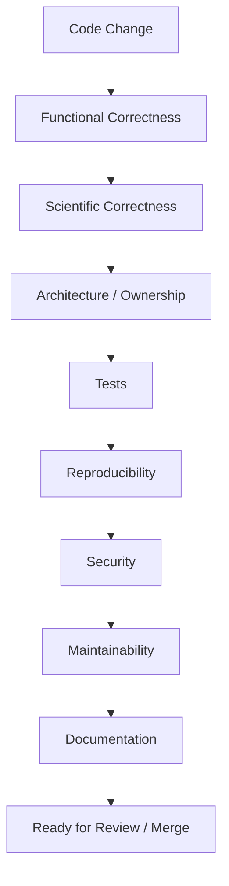
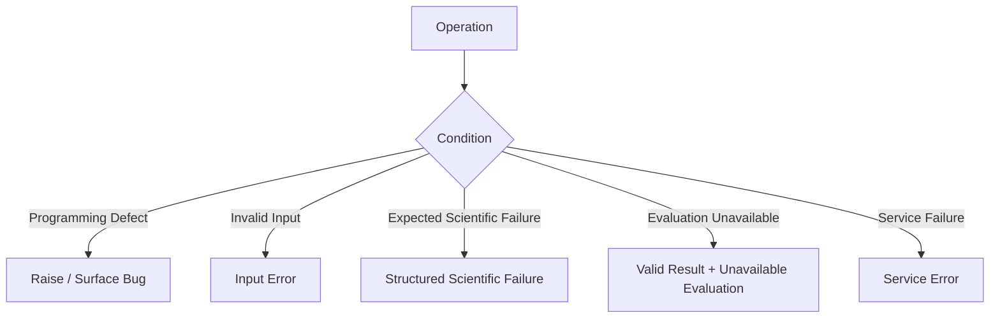

# Coding Standards

This document defines the engineering and scientific coding standards for ChandraMap.

It applies to production code, reusable research code, scientific algorithms, backend and API layers, frontend integrations, scripts, benchmark tooling, tests, and experimental implementations that may later become part of an official scientific version.

ChandraMap is scientific image-registration software. Code quality therefore includes more than syntax, formatting, and conventional software correctness. Implementations must preserve scientific meaning, coordinate semantics, sensor identity, units, transform direction, evaluation independence, reproducibility, and version boundaries.

> **ChandraMap code should be understandable to both a software engineer and a researcher reviewing how a scientific result was produced.**

> **Code should make scientific meaning explicit rather than forcing maintainers to infer it from implementation details.**

> **Correctness, readability, testability, and reproducibility take priority over cleverness.**

> **Prefer the smallest clear abstraction that matches an existing repository responsibility.**

> **Scientific logic belongs in the reusable core; interfaces should orchestrate and serialize rather than reimplement it.**

> **Coordinates, units, sensor identity, transform direction, and scientific version are data—not comments that can be forgotten.**

> **Candidate matches are not verified inliers, and verified inliers are not independent ground truth.**

> **A scientifically expected failure should be represented explicitly; it must not be disguised as a successful result.**

> **Avoid introducing complexity that cannot be justified by architecture, correctness, maintainability, or measured scientific benefit.**

> **Refactor duplicated implementation, not scientific definitions.**

> **Code review should evaluate both software correctness and scientific meaning.**

These standards complement:

- [`README.md`](README.md) — development documentation entry point.
- [`repository-structure.md`](repository-structure.md) — where repository responsibilities belong.
- [`local-development.md`](local-development.md) — how to prepare and run ChandraMap locally.
- [`../../CONTRIBUTING.md`](../../CONTRIBUTING.md) — repository-wide contribution process.
- [`../../AGENTS.md`](../../AGENTS.md) — repository-level guidance for coding agents where applicable.

Language-specific formatting, linting, typing, testing, and build behavior must come from the actual repository configuration.

Potential sources of truth include:

- [`../../pyproject.toml`](../../pyproject.toml)
- [`../../package.json`](../../package.json)
- [`../../.editorconfig`](../../.editorconfig)
- [`../../Makefile`](../../Makefile)
- CI workflows
- language-specific configuration
- existing maintained source code
- repository engineering instructions

This document does **not** assume a formatter, linter, type checker, import sorter, test framework, line-length limit, coverage threshold, or complexity threshold unless the repository explicitly establishes one.

---

## 1. Scope

These standards apply broadly to:

- core scientific code;
- image registration and correspondence code;
- sensor-processing code;
- geometry and coordinate code;
- evaluation and metrics;
- backend services;
- API handlers and schemas;
- frontend scientific-result integrations;
- benchmark tooling;
- command-line or automation scripts;
- reusable research modules;
- tests;
- experiments intended for promotion into maintained code.

Experimental notebooks may temporarily use lighter engineering structure, but any implementation used as authoritative scientific evidence or promoted into production/reusable code should move toward these standards.

Different areas may have language- or framework-specific conventions defined by their actual tooling.

Where these standards and language-specific tooling overlap, follow both unless they conflict with scientific correctness.

---

## 2. Engineering Priority Order

When engineering priorities conflict, prefer:

1. **Scientific correctness**
2. **Functional correctness**
3. **Reproducibility**
4. **Safety and security**
5. **Clarity and readability**
6. **Testability**
7. **Maintainability**
8. **Consistency with the repository**
9. **Performance where measured**
10. **Developer convenience**

This priority order is not permission to write obviously inefficient, insecure, or unmaintainable code.

Performance and convenience matter, but they should not silently weaken scientific semantics or reproducibility.

---

## 3. Follow Existing Repository Conventions

Before adding a new pattern, library, abstraction, naming style, type model, configuration mechanism, or execution layer, inspect nearby maintained code.

> **Consistency with a good existing project pattern is usually better than introducing a second equally valid pattern.**

Prefer reuse of:

- existing domain types;
- existing configuration models;
- existing result structures;
- existing error models;
- existing filesystem abstractions;
- existing coordinate-conversion utilities;
- existing service boundaries;
- existing test conventions.

Do not introduce a new architectural pattern simply because it is popular elsewhere.

A new pattern should solve a real repository problem.

---

## 4. Understand Before Editing

Before modifying implementation:

1. identify the requested behavior;
2. identify the owning module or subsystem;
3. read nearby documentation;
4. inspect nearby tests;
5. inspect the relevant inputs and outputs;
6. understand coordinate and unit semantics;
7. identify scientific-version implications;
8. determine whether benchmark comparability may change;
9. determine whether API/frontend contracts are affected;
10. change only the necessary area.

Do not rewrite unrelated modules while addressing a focused task.

A small scientific bug fix should not become an unrequested architectural migration.

---

## 5. Module Responsibility

Use [`repository-structure.md`](repository-structure.md) as the authority for where code belongs.

Each module should have a clear primary responsibility.

Avoid modules that simultaneously:

- read mission products;
- normalize images;
- construct scale pyramids;
- extract features;
- match descriptors;
- estimate geometry;
- evaluate metrics;
- save artifacts;
- construct API responses;
- render frontend output.

When a file becomes responsible for several scientific stages, it becomes harder to test, debug, version, and review.

Prefer composition of focused components.

---

## 6. Separation of Concerns

Keep these concerns distinguishable:

**Data access**
≠
**Scientific preprocessing**
≠
**Feature/matching logic**
≠
**Geometric estimation**
≠
**Registration**
≠
**Evaluation**
≠
**Serialization**
≠
**Visualization**

A file loader should not decide whether a correspondence is scientifically valid.

A visualization component should not calculate the authoritative RMSE.

An API route should not implement its own RANSAC.

An evaluation function should not modify the fitted transform.

Clear boundaries reduce accidental scientific coupling.

---

## 7. Core Scientific Boundary

See `../architecture/core-engine-architecture.md` where present.

The scientific core may own responsibilities such as:

- input scientific validation;
- sensor routing;
- sensor-specific preprocessing;
- representation construction;
- physical scale handling;
- feature extraction;
- descriptor matching;
- match filtering;
- geometric verification;
- transform estimation;
- sub-pixel refinement;
- final transform refitting;
- registration;
- residual analysis;
- metric calculation;
- scientific status;
- provenance construction.

Scientific algorithm modules should not depend directly on:

- HTTP requests;
- frontend components;
- deployment services;
- browser state;
- presentation-specific serialization.

The core should remain usable by multiple interfaces.

---

## 8. Backend Boundary

See `../architecture/backend-architecture.md` where present.

Backend code should focus on responsibilities such as:

- request orchestration;
- resource resolution;
- authentication/authorization where applicable;
- job/run initiation;
- lifecycle handling;
- storage access;
- service-level errors;
- serialization;
- execution coordination.

Backend code should delegate scientific calculations to the core.

Do not maintain a second implementation of:

- transform fitting;
- RANSAC;
- RMSE;
- coverage;
- image registration;
- sensor routing;

inside controllers, routes, or service handlers.

---

## 9. Frontend Boundary

See `../architecture/frontend-architecture.md` where present.

The frontend should consume authoritative result semantics.

It may:

- display correspondence points;
- visualize inliers/outliers;
- show transforms;
- display metric values;
- display failure information;
- render registered outputs;
- round values for display;
- provide filtering or inspection controls.

It should not become authoritative for:

- RANSAC inlier classification;
- transform estimation;
- RMSE calculation;
- spatial-coverage calculation;
- benchmark success;
- ground truth;
- sensor routing.

Presentation logic may format scientific values, but it should not redefine them.

---

## 10. API Boundary

Where present, consult:

- `../api/overview.md`
- `../api/schemas.md`
- `../api/error-codes.md`

API code should generally:

1. validate transport-level input;
2. resolve resources;
3. convert transport structures into internal structures;
4. invoke the scientific core;
5. convert internal results into documented wire schemas.

API transport must not silently change scientific meaning.

The same scientific version and resolved scientific configuration should represent the same method whether invoked directly or through an API.

---

# Scientific Naming

## 11. Name Scientific Roles Explicitly

Scientific code should prefer domain-specific names.

Examples of useful concepts include:

- `source`
- `reference`
- `candidate_matches`
- `verified_inliers`
- `fit_residual`
- `check_residual`
- `source_space`
- `reference_space`
- `transform_direction`
- `scientific_version`
- `pair_id`
- `sensor_id`
- `product_id`

Avoid names such as:

- `img1`
- `img2`
- `pts`
- `data`
- `stuff`
- `tmp`
- `output2`
- `score`
- `error`

when more precise meaning is available.

Generic names force reviewers to reconstruct semantics from control flow.

---

## 12. Source and Reference Naming

> **Use `source` and `reference` when those are the scientific roles.**

Do not use `image1` and `image2` in authoritative scientific logic when one image is the source and the other is the reference.

Legacy interfaces may require positional naming. If so, map those values into explicit scientific roles as early as practical.

The source/reference distinction affects:

- transform direction;
- coordinate conversion;
- metric units;
- registration output;
- pixel-to-ground interpretation;
- result serialization.

Treat the distinction as part of the data contract.

---

## 13. Candidate and Inlier Naming

Raw or filtered matcher output should be treated as candidate correspondence data.

After geometric verification, the subset consistent with the fitted model may be treated as verified or model-consistent inliers.

Do not name matcher output:

```text
correct_matches
```

unless correctness has actually been independently established.

A matcher confidence value is not geometric proof.

---

## 14. Ground Truth Naming

Use these terms according to their real scientific roles:

| Term              | Meaning                                                     |
| ----------------- | ----------------------------------------------------------- |
| Reference image   | Image used as the registration reference                    |
| Control/fit point | Point used to estimate a transform                          |
| Check point       | Independent point used for evaluation                       |
| Ground truth      | Independently established authoritative truth               |
| RANSAC inlier     | Candidate correspondence consistent with the selected model |

Do not call ordinary LRO reference imagery "ground truth" merely because it is the reference image.

Do not call RANSAC inliers ground truth.

Do not call fit points independent check points.

---

## 15. Function Naming

Function names should communicate an action and the relevant domain object.

Conceptually clearer names include:

```text
estimate_transform
evaluate_check_points
map_to_reference_space
validate_sensor_metadata
refine_correspondences
compute_spatial_coverage
```

Prefer such names over vague forms such as:

```text
process
handle
run_stuff
calculate
do_work
fix_data
```

These examples are illustrative, not mandatory function names.

Follow the language and repository naming conventions.

---

## 16. Boolean Naming

Boolean values should make their state or condition understandable.

Avoid meaningless names such as:

```text
flag
option2
check
mode
```

Prefer names whose interpretation is clear from the surrounding domain.

Do not introduce a project-wide boolean naming convention that conflicts with established language or repository conventions.

---

## 17. Classes and Domain Types

Use meaningful domain nouns for classes, records, or structured types.

Potential concepts include:

- correspondence collections;
- transform descriptions;
- coordinate spaces;
- sensor metadata;
- scientific run results;
- evaluation records;
- benchmark records;
- failure records.

Do not create domain types merely to make the code "look object-oriented."

A type should remove ambiguity, preserve invariants, or represent meaningful state.

---

## 18. Constants

Follow repository and language conventions for constant naming.

Scientifically meaningful constants should make clear, where relevant:

- what the value represents;
- which units it uses;
- where it came from;
- whether it is a true constant or configurable parameter.

Do not hard-code scientific tuning parameters as unexplained numeric literals.

---

## 19. Avoid Magic Numbers

Scientifically meaningful thresholds should normally come from:

- explicit configuration;
- a named parameter;
- a documented constant;
- a version-specific specification.

Avoid code such as:

```text
if score > 0.73:
```

when the meaning of `0.73` is not visible or traceable.

Do not invent default threshold values merely to avoid configuration work.

---

## 20. Units in Names and Types

Where units may be ambiguous, make them explicit.

Conceptually:

```text
rmse_px
runtime_s
gsd_m_per_px
distance_m
```

are clearer than:

```text
error
time
resolution
distance
```

Structured metric types may be better than unit suffixes where the architecture supports them.

The important rule is not the exact variable naming style.

The important rule is that the unit cannot be misunderstood.

---

# Coordinate and Transform Safety

## 21. Coordinates Are Scientific Data

> **A point without its coordinate-space meaning is incomplete scientific data.**

ChandraMap may operate in multiple coordinate spaces, including:

- source native image space;
- source prepared space;
- source crop space;
- reference native space;
- reference tile space;
- reference pyramid space;
- registered-output space;
- projected map space.

Passing a numeric pair without space context across multiple stages is dangerous.

Coordinate-space information should be preserved in contracts, structured records, function boundaries, or clearly documented types.

---

## 22. X/Y vs Row/Column

Image arrays frequently use:

```text
row, column
```

while geometric functions frequently use:

```text
x, y
```

These are not automatically interchangeable.

Typical relationships are often:

```text
x ↔ column
y ↔ row
```

but code must not rely on implicit understanding.

Conversions should be explicit and tested.

Many image-registration bugs are caused by valid numbers in the wrong ordering.

---

## 23. Coordinate Conversion Functions

Prefer centralized, dedicated, testable conversion logic for transformations such as:

- crop → parent image;
- pyramid → native reference;
- tile → global reference;
- prepared source → native source;
- image → projected map;
- source → registered output.

Avoid repeating handwritten offset and scale arithmetic throughout the codebase.

Stable coordinate formulas should have one authoritative implementation wherever practical.

---

## 24. Crop, Tile, and Pyramid Coordinates

When a representation is derived from a larger image, preserve the mapping required to return coordinates to its parent space.

Relevant mapping information may include:

- crop origin;
- tile origin;
- level index;
- level scale;
- downsampling factor;
- parent image identity;
- reference product identity.

Do not return a pyramid-level image while discarding the metadata needed to interpret its coordinates.

---

## 25. Transform Direction

> **Transform direction must be explicit.**

Where ChandraMap documentation defines the authoritative direction as:

```text
source → reference
```

preserve that convention consistently.

Do not infer direction from:

- matrix variable order;
- argument order;
- function name alone;
- which image happens to be displayed first.

A transform inverse is not interchangeable with the original transform.

---

## 26. Transform Representation

A transform passed across significant module boundaries should preserve enough context to answer:

- what model type is this?
- what are its parameters?
- which source coordinate space does it consume?
- which reference/output space does it produce?
- what is its direction?
- which pipeline stage produced it?
- is it valid?
- was it estimated before or after refinement?

Do not pass a bare numeric matrix through complex architecture when its meaning depends on hidden assumptions.

---

## 27. Physical Scale

> **Compare information, not pixel count.**

Image dimensions do not define ground resolution.

Upsampling does not create new physical terrain detail.

Where available, physical scale should come from product metadata rather than an approximate sensor summary.

Code should distinguish:

```text
array shape
```

from:

```text
physical ground sampling / effective scale
```

---

# Sensor-Aware Engineering

## 28. Sensor-Specific Behavior

Where present, consult:

- `../sensors/overview.md`
- `../algorithms/sensor-routing.md`

Sensor-specific behavior should be:

- isolated;
- explicit;
- testable;
- version-aware.

Avoid scattering repeated checks such as:

```text
if sensor == ...
```

through unrelated modules when a dedicated routing or strategy boundary already exists.

Sensor knowledge should have a clear owner.

---

## 29. OHRC

Project context commonly describes OHRC imagery at approximately **0.25–0.32 m/pixel**, depending on the product or source documentation.

Do not encode that approximate range as a universal scientific constant.

The actual product metadata is authoritative for the image being processed.

Code should preserve product-level scale and processing context where available.

---

## 30. TMC-2

Project context commonly describes TMC-2 imagery at approximately **5 m/pixel**.

Treat that value as contextual information, not a replacement for product metadata.

Do not assume every TMC-2 image directly contains elevation or DEM information merely because the instrument supports terrain/stereo applications.

Image imagery, stereo products, and derived terrain products are different data products.

---

## 31. IIRS

IIRS requires special care.

It is an imaging infrared/hyperspectral instrument rather than a normal single-band panchromatic camera.

Project context places it around:

- approximately **80 m/pixel** spatial resolution;
- approximately **0.8–5.0 µm** spectral range;
- roughly **250–256 spectral bands**, depending on product/documentation context.

Those approximate values must not replace product metadata.

Code should distinguish between:

1. the hyperspectral parent product; and
2. the derived 2D representation used for registration.

Possible experimental 2D representations may include selected bands, composites, dimensional reduction, or structural representations, but the chosen scientific method belongs to version/algorithm documentation.

> **Do not silently treat an entire IIRS hyperspectral cube as an ordinary grayscale image.**

Functions that accept "image" inputs should not accidentally accept fundamentally incompatible array semantics without validation.

---

## 32. LRO NAC and WAC References

Reference imagery should preserve:

- provider/product identity;
- processing state;
- scale;
- projection or coordinate context;
- derived-representation provenance.

"Reference" is not equivalent to "ground truth."

LRO imagery may be the registration target while independent control/check data provides accuracy truth.

Keep those roles separate in code and result schemas.

---

# Pipeline Stage Standards

## 33. Preprocessing

Where present, consult `../algorithms/preprocessing.md`.

Preprocessing functions should have clear input/output semantics.

Avoid a single function that:

1. reads an image;
2. selects a sensor representation;
3. normalizes contrast;
4. resizes it;
5. extracts SIFT;
6. saves a diagnostic;
7. returns matches.

Separate responsibilities make preprocessing independently testable and replaceable.

Derived output should retain sufficient metadata to interpret coordinates and scale.

---

## 34. Illumination Handling

Where present, consult `../algorithms/illumination-handling.md`.

Do not give a preprocessing step a scientifically stronger name than the evidence supports.

For example, ordinary contrast normalization should not be named:

```text
make_sun_angle_invariant
```

unless there is evidence demonstrating that property.

Prefer names describing what the implementation actually performs.

Avoid unsupported claims such as:

- illumination invariant;
- shadow invariant;
- always robust to Sun angle.

Scientific claims belong to evidence, not optimistic function names.

---

## 35. Scale-Pyramid Code

Where present, consult `../algorithms/scale-pyramid.md`.

Every derived pyramid level should remain traceable to its parent representation.

Code working at a pyramid level should retain enough information to map:

```text
level coordinates → parent/reference coordinates
```

Do not return only a resized image when downstream geometry depends on the level scale.

---

## 36. Matching Code

Where present, consult `../algorithms/matching.md`.

Matching code should return candidate correspondence information.

Candidate information may include implementation-defined data such as:

- source coordinates;
- reference coordinates;
- descriptor/matcher score;
- feature identity;
- representation identity.

Do not hide geometric verification inside a function documented as descriptor matching unless the architecture explicitly defines a combined operation.

Scientific stages should remain inspectable.

---

## 37. Match Filtering

Where present, consult `../algorithms/match-filtering.md`.

Filtering stages should remain conceptually distinguishable.

Examples include:

- descriptor-ratio filtering;
- reciprocal/cross-check filtering;
- confidence filtering;
- spatial filtering;
- geometric verification.

Avoid collapsing multiple independent criteria into one unexplained Boolean such as:

```text
is_good
```

when diagnostics need to identify why a correspondence was removed.

---

## 38. RANSAC and Geometric Verification

Where present, consult `../algorithms/ransac.md`.

RANSAC or another geometric verification stage should operate on candidate correspondences and produce model-consistent support according to the core contract.

Its outputs may include:

- an initial model;
- an inlier mask/set;
- diagnostic information;
- residual information.

> **RANSAC inliers are not independent ground truth.**

They are correspondences consistent with a model under the configured verification process.

---

## 39. Sub-Pixel Refinement

Where present, consult `../algorithms/subpixel-refinement.md`.

The intended scientific ordering is:

```text
Candidate Matches
→ RANSAC / Geometric Verification
→ Verified Inliers
→ Coordinate Refinement
→ Final Transform Refit
```

> **Verify first, refine second, refit third.**

Do not refine every raw candidate and then hope a transform filters errors afterward unless a version-specific method explicitly defines that alternative.

---

## 40. Stale Transform Anti-Pattern

If verified point coordinates are refined, the transform estimated from their pre-refinement positions is no longer the final transform.

Do not:

1. fit the transform;
2. refine the points;
3. return the old transform as the "refined" transform.

The final transform must correspond to the point population and coordinates from which it is claimed to have been fitted.

---

## 41. Registration

Where present, consult `../algorithms/registration.md`.

Model estimation and image warping/registration are conceptually different responsibilities.

A transform may be valid even before a full registered image is rendered.

Likewise, a visually smooth warp does not prove the correspondence set was valid.

Do not let flexible image warping hide poor geometric support.

---

# Evaluation Standards

## 42. Evaluation Boundary

Where present, consult `../evaluation/README.md`.

Evaluation code should consume scientific results without changing the fitted method.

Held-out evaluation information must not leak back into fitting unless a documented protocol intentionally defines that behavior.

Keep model construction and model evaluation separate.

---

## 43. Fit Points vs Check Points

> **Fit points estimate the transform; held-out check points evaluate it.**

A residual over the same points used to fit a transform is useful diagnostic information.

It is not automatically independent registration accuracy.

Code and metric names should distinguish:

- fit residual;
- check residual;
- independent check-point RMSE.

---

## 44. Metric Contracts

Where present, consult `../evaluation/metrics.md`.

Metric outputs should make their semantics explicit.

Where relevant, preserve:

- metric name;
- unit;
- coordinate space;
- evaluated population;
- sample count;
- availability;
- scientific version/configuration context.

A floating-point value alone is often not sufficient to describe a scientific metric.

---

## 45. RMSE

Avoid generic names such as:

```text
calculate_error
```

when the implementation computes a specific RMSE over a specific point population.

A reviewer should be able to determine:

- RMSE of which points?
- in which coordinate space?
- measured in which units?
- fit points or independent check points?
- before or after refinement?

Do not hide these distinctions behind one value named `error`.

---

## 46. Missing Values

> **Unavailable is not zero.**

Do not use:

- `0`;
- `0.0`;
- identity transforms;
- empty matrices;
- empty metrics;

as universal failure/missing-data placeholders.

For example, if check-point RMSE cannot be calculated because independent truth is unavailable, representing that as `0.0` incorrectly means perfect accuracy.

Use the project's explicit unavailable/optional/failure representation.

---

## 47. Spatial Coverage

Where present, consult `../evaluation/spatial-coverage.md`.

Coverage is not accuracy.

Coverage code should identify:

- which points are included;
- which region is being evaluated;
- which coverage definition is used.

A correspondence set may have good spatial coverage and poor geometric accuracy, or excellent local accuracy but poor coverage.

Do not collapse them into one "quality" metric without a defined methodology.

---

## 48. Ground-Space Error

Do not blindly compute:

```text
ground_error = pixel_error × approximate_sensor_gsd
```

from a generic sensor summary.

A valid ground-space conversion may depend on:

- product-specific scale;
- projection;
- reference geometry;
- coordinate space;
- location;
- registration representation.

Use ground-space error only where the scientific context makes the conversion meaningful.

---

# Functions, Classes, and Abstractions

## 49. Functions

Functions should generally be:

- focused;
- cohesive;
- explicit;
- testable;
- reasonably small;
- limited in side effects.

Do not impose an arbitrary line-count rule unless repository tooling does.

A long function is problematic when it combines unrelated responsibilities, not merely because it has many lines.

---

## 50. Function Inputs

Prefer meaningful parameters and structured domain inputs over large unvalidated dictionaries when scientific meaning matters.

Avoid interfaces where callers must know undocumented string keys such as:

```text
data["x2"]
data["m"]
data["thing"]
```

If mapping/dictionary inputs are necessary, define or validate their contract.

---

## 51. Function Outputs

Return values should carry enough meaning to be interpreted safely.

Avoid tuples such as:

```text
(a, b, c, d)
```

when each value has important scientific meaning.

Structured outputs can reduce errors involving:

- transform vs residual;
- source vs reference coordinates;
- fit vs check metrics;
- candidates vs inliers.

---

## 52. Side Effects

Where practical, separate scientific computation from:

- filesystem writes;
- visualization;
- logging;
- network access;
- database writes;
- UI state.

For example:

```text
compute_registration(...)
```

should ideally not require an HTTP request object or frontend state merely to execute scientific logic.

Separating effects improves reuse, testability, and reproducibility.

---

## 53. Pure and Deterministic Functions

Pure or deterministic functions are especially useful for:

- coordinate conversion;
- numerical geometry;
- metric calculation;
- configuration resolution;
- representation metadata.

Do not force purely functional design on components whose state or lifecycle genuinely matters.

The goal is controlled behavior, not ideological programming style.

---

## 54. Classes

Use classes when they provide meaningful value through:

- state;
- lifecycle;
- encapsulated invariants;
- domain abstraction;
- polymorphic behavior with real use cases.

Do not introduce a class solely to wrap one stateless function.

---

## 55. Abstractions

Create abstractions when stable common behavior has become clear.

Good abstractions should:

- reduce duplicated authoritative logic;
- make domain boundaries clearer;
- improve testing;
- support known implementations.

Avoid speculative abstractions for hypothetical future systems.

---

## 56. Premature Abstraction

> **Duplicate a small amount of obvious code temporarily rather than introducing the wrong abstraction too early—but remove genuine stable duplication once the shared responsibility is clear.**

Both extremes are harmful:

- excessive duplication creates divergent scientific definitions;
- premature abstraction hides distinctions that are not actually equivalent.

Wait until the shared responsibility is understood.

---

## 57. Generic Utility Modules

Avoid using directories or modules named:

```text
utils
common
helpers
misc
```

as dumping grounds.

Prefer clear domain ownership.

For example, coordinate conversion belongs with geometry/coordinate responsibilities rather than an arbitrary generic utility collection when the architecture supports that organization.

Use [`repository-structure.md`](repository-structure.md) for repository ownership rules.

---

# Types and Data Contracts

## 58. Type Information

Use type annotations or static types where supported by the repository language and conventions.

Types are especially valuable around:

- public scientific interfaces;
- coordinates;
- transforms;
- sensor metadata;
- metric records;
- scientific statuses;
- API contracts;
- configuration.

Do not claim a specific type checker is required unless repository tooling configures it.

---

## 59. Types Should Reduce Scientific Ambiguity

Where practical, types or structures should make it difficult to confuse concepts such as:

```text
source point
reference point
transform
metric
scientific status
```

with generic arrays, numbers, or mappings.

This does not require creating a class for everything.

Use structure where structure prevents meaningful mistakes.

---

## 60. Array and Shape Expectations

Scientific array interfaces should document or validate relevant properties such as:

- dimensionality;
- axis ordering;
- dtype;
- channel meaning;
- band meaning;
- coordinate ordering;
- expected contiguous/non-contiguous semantics where relevant.

Do not assume every "image" is a 2D grayscale array.

This is especially important for IIRS and other multispectral/hyperspectral products.

---

## 61. Array-Like Numerical Code

Where array libraries are used, prefer readable operations.

Implicit broadcasting or reshaping can hide serious scientific bugs.

At important boundaries, validate dimensions when incorrect shapes could silently produce valid-looking but wrong results.

Do not prescribe a particular numerical library API unless it is already part of the implementation.

---

## 62. Mutability

Avoid unexpected in-place mutation of:

- scientific input;
- metadata;
- configuration;
- benchmark definitions;
- provenance.

Raw mission products should be treated as immutable.

If an operation intentionally mutates data, make that behavior obvious to the caller.

---

## 63. Structured Scientific Records

Prefer structured records over multiple parallel collections when that improves correctness.

Conceptually, a correspondence record may be safer than unrelated structures containing:

- one array of source points;
- one array of reference points;
- another array of scores;
- another mask of inliers;

without validation that they remain aligned.

Do not over-model simple data, but prevent index-alignment bugs where the risk is significant.

---

## 64. API Schemas vs Internal Types

Where present, consult `../api/schemas.md`.

Internal scientific types and external API schemas may differ.

Do not make scientific algorithms depend directly on HTTP serialization models without architectural reason.

Use translation/adaptation at boundaries where necessary.

This keeps the core reusable outside the API.

---

# Error and Failure Handling

## 65. Error Categories

ChandraMap code should distinguish at least these conceptual categories:

| Category               | Meaning                                                                         |
| ---------------------- | ------------------------------------------------------------------------------- |
| Programming error      | Internal defect or violated invariant                                           |
| Input error            | Provided input is invalid or unusable                                           |
| Scientific failure     | Pipeline executed but required scientific result could not be established       |
| Evaluation unavailable | Scientific result exists, but a requested independent metric cannot be computed |
| Service error          | Backend/infrastructure/runtime problem                                          |

Where present, consult:

- `../api/error-codes.md`
- `../evaluation/failure-cases.md`

These categories should not be collapsed into one generic exception.

---

## 66. Expected Scientific Failure

Expected scientific failures may include conditions such as:

- insufficient usable features;
- too few candidate correspondences;
- insufficient geometrically valid support;
- RANSAC unable to establish a model;
- transform rejected by validity checks;
- unusable representation for the selected path.

If the core architecture defines a structured scientific-failure result, use it.

Do not convert ordinary scientific non-success into an unhandled crash.

---

## 67. Do Not Swallow Errors

Avoid broad exception handling that converts every failure into:

- `None`;
- success;
- empty arrays;
- identity transform;
- zero metrics.

Such behavior hides the actual failure and can generate scientifically misleading results.

---

## 68. Exception Handling

Catch exceptions where you can:

- add meaningful context;
- translate them into a documented domain/service error;
- recover safely;
- release resources;
- preserve diagnostics.

Do not catch everything merely to make the program appear robust.

Robustness means handling failures correctly, not hiding them.

---

## 69. Failure Stage vs Root Cause

Code should distinguish the **observed failure stage** from the **suspected cause**.

For example:

```text
observed stage: geometric verification
```

does not prove:

```text
root cause: illumination mismatch
```

Potential causes could include:

- scale mismatch;
- sensor representation problems;
- incorrect correspondence candidates;
- low-feature terrain;
- transform-model mismatch;
- input errors.

Do not encode speculation as a deterministic failure reason.

---

## 70. Error Messages

Messages should be:

- concise;
- specific;
- safe;
- useful for diagnosis.

Include relevant scientific or operational context where appropriate.

Do not include:

- passwords;
- tokens;
- secret environment values;
- unnecessary private filesystem paths;
- confidential credentials.

---

# Logging

## 71. Logging Purpose

Logging should support operation and diagnosis.

Useful context may include:

- run identifier;
- scientific version;
- current pipeline stage;
- selected sensor route;
- input identities;
- timing;
- candidate/inlier counts;
- failure stage;
- resource state.

Logs are not the authoritative scientific result format.

Structured result records should contain authoritative scientific state.

---

## 72. Logging Levels

Follow the project's configured logging framework and level conventions.

Do not create a parallel custom logging-level policy in this document.

Use the repository's established behavior where one exists.

---

## 73. Never Log Secrets

Never log:

- passwords;
- API keys;
- authentication tokens;
- private credentials;
- entire environment dumps.

Logs are frequently copied into bug reports and CI output.

Treat them as potentially shareable.

---

## 74. Avoid Logging Large Scientific Data

Do not dump entire:

- images;
- point clouds;
- feature arrays;
- correspondence sets;
- hyperspectral cubes;
- large matrices;

into ordinary logs.

Prefer compact diagnostics such as:

- shape;
- dtype;
- count;
- identifier;
- range/statistical summary;
- stage status.

---

# Comments and Documentation in Code

## 75. Comments

Comments should explain:

- why;
- scientific assumptions;
- non-obvious coordinate logic;
- implementation constraints;
- unusual trade-offs.

Do not comment obvious syntax.

Poor:

```text
increment count by one
```

Useful:

```text
conversion returns coordinates to the native reference level before transform fitting
```

---

## 76. Scientific Comments

Scientific comments are useful when explaining decisions such as:

- why source coordinates are preserved before preprocessing;
- why a pyramid scale must be inverted during coordinate recovery;
- why fit points cannot be reused as independent check points;
- why refinement occurs after geometric verification;
- why a transform is only valid within a local region;
- why a particular approximation is acceptable in a specific version.

Comments should describe real constraints, not unsupported claims.

---

## 77. Docstrings

Reusable/public scientific functions should document relevant aspects such as:

- purpose;
- input semantics;
- output semantics;
- units;
- coordinate spaces;
- important array shapes;
- failure behavior;
- assumptions;
- mutability;
- scientific limitations.

Use the repository-established docstring style if one exists.

Do not invent a requirement for Google, NumPy, Sphinx, or another format unless the repository adopts it.

---

## 78. Document Units and Coordinate Spaces

A docstring saying:

```text
points: point array
```

may be insufficient.

Where relevant, document whether the points are:

```text
source-native x/y pixels
```

or:

```text
reference-pyramid row/column indices
```

Likewise, avoid:

```text
returns error
```

when the result is specifically:

```text
held-out check-point RMSE in source pixels
```

---

## 79. TODO Comments

TODOs should describe a real unresolved task.

Avoid:

```text
TODO: fix later
```

Prefer enough information to understand what remains and why.

If the repository uses issue references for TODOs, follow that convention.

Do not invent an issue-linking requirement.

---

## 80. Dead Code

Remove unused implementation instead of leaving large commented blocks.

Version control already preserves history.

Commented-out scientific code is especially dangerous because maintainers may mistake it for supported alternative behavior.

---

# Configuration Standards

## 81. Scientific Configuration

Scientifically meaningful behavior that needs controlled variation should use the repository's configuration mechanisms where architecture supports it.

Examples may include:

- scale strategy;
- matching parameters;
- verification parameters;
- transform model;
- refinement behavior;
- evaluation settings.

Do not hard-code pair-specific values to rescue individual benchmark cases.

---

## 82. Hidden Defaults

Avoid scientifically meaningful defaults buried deep in code if they cannot be identified from the resulting run.

A default can be acceptable, but formal execution must still make the effective configuration traceable.

Hidden behavior damages reproducibility.

---

## 83. Resolved Configuration

Formal scientific runs should preserve the resolved configuration, or a traceable reference to it, according to project architecture.

That includes values after:

- defaults;
- version configuration;
- user overrides;
- environment-specific resolution where legitimately applicable.

Do not require reviewers to reconstruct final scientific settings from source code manually.

---

## 84. Environment Variables

Environment variables are appropriate for runtime/deployment concerns and secrets where the repository uses them.

They should not become invisible storage for benchmark-significant scientific parameters.

Keep:

```text
runtime configuration
```

separate from:

```text
scientific configuration
```

unless an explicit design decision defines otherwise.

---

# Dependency Management

## 85. Adding Dependencies

Before introducing a dependency, ask:

- Does the repository already provide the required capability?
- Is the dependency actively maintained?
- What security risk does it introduce?
- How large is it relative to its benefit?
- Does it add native/system requirements?
- Does it require accelerator support?
- Is it core or research-only?
- Does it affect reproducibility?
- Will it make V1 unnecessarily harder to install?
- Can the same goal be achieved using an existing dependency?

Dependencies are architectural decisions, not just import conveniences.

---

## 86. Core vs Optional Dependencies

V1 is a classical scientific baseline.

It should not automatically inherit every dependency used by later research.

Potential later methods may require substantially different tooling.

Where package architecture supports it, keep optional/research dependencies separated from core requirements.

Do not invent package-extra names in this documentation.

---

## 87. Optional Dependency Imports

An optional research dependency should not become an unconditional import in the V1 startup path unless V1 genuinely requires it.

Import boundaries should preserve the ability to work on lightweight scientific paths without installing unrelated research stacks.

---

## 88. Version Policy

Follow the repository's actual dependency version policy.

Do not invent whether dependencies must be:

- exactly pinned;
- bounded;
- locked;
- minimally constrained.

For formal benchmark reproducibility, dependency/environment identity should remain recordable.

---

# Security Standards

## 89. Security

Consult [`../../SECURITY.md`](../../SECURITY.md).

Code should:

- validate untrusted input;
- protect file access;
- avoid unsafe deserialization;
- avoid exposing secrets;
- avoid command injection;
- keep credentials outside source;
- treat uploaded/external data cautiously;
- limit unnecessary service exposure.

Security considerations apply to scientific software as well as public-facing services.

---

## 90. Path Handling

Use safe path operations and repository-defined data roots.

Do not concatenate untrusted user input into arbitrary paths.

Protect against situations where user-controlled paths could escape expected data locations.

Do not hard-code developer-specific filesystem locations.

---

## 91. Subprocess and Shell Invocation

If the project invokes external tools, construct subprocess calls safely using the language/platform mechanisms supported by the repository.

Avoid building shell commands through untrusted string concatenation.

Do not introduce new external command dependencies without architectural justification.

---

## 92. Serialization Safety

Treat serialized data from untrusted or external sources cautiously.

Avoid unsafe object deserialization mechanisms that can execute arbitrary code or construct unexpected objects.

Use project-approved serialization formats and validation.

---

## 93. Secrets

Never hard-code credentials in:

- source;
- tests;
- configuration;
- examples;
- documentation;
- notebooks.

Use repository-defined secret-management/environment mechanisms.

---

# Reproducibility Standards

## 94. Reproducibility Is a Coding Concern

Where present, consult `../evaluation/reproducibility.md`.

Scientific code should help preserve:

- scientific version;
- source identity;
- reference identity;
- pair identity/version;
- resolved configuration;
- benchmark/truth identity;
- code revision;
- environment context;
- randomness context;
- representation provenance.

A scientifically correct result that cannot be traced may still be unusable for research comparison.

---

## 95. Randomness

Where algorithms use randomness, use the repository-defined seed/random-state mechanism.

Do not invent one universal seed value.

Random-state handling should be deliberate and recordable where it affects scientific results.

---

## 96. Random State as an Input

Where randomness affects scientific output, avoid relying exclusively on hidden global state.

Prefer mechanisms where the stochastic context can be:

- supplied;
- controlled;
- recorded;
- reproduced where practical.

---

## 97. Determinism

Do not promise byte-for-byte deterministic behavior across every hardware/software environment unless it has been verified.

Scientific reproducibility and bitwise determinism are different concepts.

Differences may result from:

- floating-point implementation;
- dependency version;
- CPU/GPU behavior;
- parallelism;
- library kernels;
- platform differences.

Document guarantees conservatively.

---

# Testability

## 98. Design for Testing

Scientific components should be testable independently.

Avoid embedding unnecessary dependencies on:

- filesystem state;
- network services;
- user interfaces;
- global mutable state;
- external APIs;

inside mathematical functions.

Boundary adapters can handle those concerns around testable core logic.

---

## 99. Test Expectations for Changes

In general:

| Change                  | Expected Validation                                                       |
| ----------------------- | ------------------------------------------------------------------------- |
| Bug fix                 | Regression test where practical                                           |
| New scientific behavior | Unit/component/integration tests and benchmark evidence where appropriate |
| Coordinate conversion   | Explicit coordinate tests                                                 |
| API contract change     | Contract/schema tests                                                     |
| Failure-path change     | Failure-path tests                                                        |
| Metric change           | Metric-semantic and numerical tests                                       |
| Sensor-route change     | Sensor-routing tests                                                      |
| Configuration change    | Resolution/default/override tests where relevant                          |

Use actual repository testing documentation and tooling for commands.

---

## 100. Tests vs Benchmarks

> **Tests establish implementation confidence; benchmarks establish scientific performance evidence.**

A test can confirm that a function calculates a metric correctly.

A benchmark can determine whether a scientific method performs well across lunar data.

Do not use benchmark scores as substitutes for software tests.

Do not use unit tests as proof of real-world lunar robustness.

---

## 101. Synthetic Tests

Synthetic transformations are useful for validating:

- coordinate transforms;
- source/reference direction;
- known homographies/affine transforms;
- warping;
- pyramid coordinate recovery;
- residual calculations.

They do not prove robustness to:

- lunar illumination;
- sensor differences;
- hyperspectral-visible differences;
- real terrain;
- mission-product artifacts.

---

## 102. Important Regression Areas

Regression coverage is particularly valuable for:

- source/reference direction;
- x/y vs row/column;
- crop offsets;
- pyramid mapping;
- candidate/inlier distinction;
- verify → refine → refit ordering;
- fit/check separation;
- missing metric semantics;
- failure-record behavior;
- sensor routing;
- configuration resolution;
- transform inversion;
- metric units.

---

# Performance Engineering

## 103. Measure Before Optimizing

> **Measure before optimizing.**

Do not complicate scientific logic because something "looks slow."

Use profiling, benchmark measurements, or reproducible runtime evidence where performance changes matter.

---

## 104. Performance vs Correctness

Do not sacrifice scientific correctness for minor speed gains.

If an optimization changes approximation behavior, numerical precision, correspondence population, image representation, or transform quality, treat it as a scientific change requiring review.

---

## 105. Vectorization

Vectorized operations may improve performance.

They should still remain:

- readable;
- testable;
- numerically correct;
- shape-safe.

Do not replace a clear loop with an opaque expression solely because vectorization appears more sophisticated.

---

## 106. Memory

Lunar products can be large.

Avoid unnecessary:

- full-resolution copies;
- duplicate representations;
- full-cube materialization;
- large temporary arrays;
- retained diagnostic data;

when more efficient approaches are available without reducing correctness.

Memory optimization should preserve scientific semantics.

---

## 107. Caching

Caches can improve development and benchmark runtime.

Cache identity should include the factors required to prevent scientifically incompatible reuse.

Depending on the cache, this may include:

- source identity;
- reference identity;
- scientific version;
- configuration;
- representation parameters;
- product version;
- relevant code/tool version.

A stale cache must not silently contaminate a formal benchmark.

---

## 108. Parallelism

Do not introduce:

- threads;
- process pools;
- distributed execution;
- GPU parallelism;

without a demonstrated need.

Concurrency changes:

- determinism;
- error propagation;
- logging;
- memory use;
- resource contention;
- reproducibility.

Parallel code requires appropriate testing.

---

# Readability and Maintainability

## 109. Prefer Clear Intermediate Values

Use intermediate variables when they expose scientific meaning.

A few clear statements are often better than a dense one-liner containing:

- coordinate conversion;
- scaling;
- filtering;
- metric calculation;

all at once.

Readable code improves scientific review.

---

## 110. Long Functions

If a function performs several scientific pipeline stages, consider splitting it around responsibility boundaries.

Do not split functions mechanically by line count.

The goal is conceptual cohesion.

---

## 111. Nesting

Avoid deeply nested control flow where possible.

Use:

- early validation;
- explicit failure handling;
- small helpers;
- clear branches.

Excessive nesting often hides scientific failure semantics.

---

## 112. Duplication

Avoid duplicated authoritative implementations of:

- coordinate mappings;
- transform conversions;
- metric formulas;
- sensor metadata interpretation;
- scientific-status semantics;
- version-specific behavior.

Centralize stable scientific definitions.

Do not create competing formulas across core, backend, and frontend.

---

## 113. Avoid Over-Engineering

Avoid unnecessary:

- factories;
- abstract factories;
- provider chains;
- manager classes;
- plugin systems for a single implementation;
- deep inheritance;
- empty service layers;
- microservices without architectural need;
- generic abstractions that hide domain meaning.

Architecture should reduce complexity, not create ceremonial code.

---

## 114. Structured Domain Records

Where the language and repository support them, structured records can improve:

- clarity;
- validation;
- typing;
- serialization;
- invariant preservation.

Use them when they solve a real ambiguity.

Do not build large inheritance hierarchies solely to model simple data.

---

## 115. Immutability and Provenance

Where practical, prefer immutable or copy-safe handling for:

- raw metadata;
- formal configuration;
- benchmark definitions;
- source/reference identity;
- provenance.

A downstream function should not silently mutate shared provenance or benchmark configuration.

---

# Interface-Specific Standards

## 116. Backend Code

Good backend responsibilities include:

- request validation;
- orchestration;
- resource resolution;
- execution;
- serialization;
- service-level state.

Bad backend responsibilities include independent implementations of:

- RANSAC;
- transform fitting;
- RMSE;
- scientific coverage;
- registration algorithms.

Delegate reusable science to the core.

---

## 117. API Code

Where present, consult `../api/endpoints.md`.

Keep handlers/controllers thin.

An endpoint function should not contain the full correspondence pipeline.

Prefer:

```text
validate transport
→ construct internal request
→ invoke core/service
→ serialize result
```

rather than embedding scientific stages directly in the endpoint.

---

## 118. Frontend Code

Frontend code should display authoritative semantics faithfully.

Do not reinterpret:

- `unavailable` as `0`;
- scientific failure as success;
- fit residual as independent accuracy;
- reference coordinates as source coordinates;
- candidate correspondences as verified matches.

Scientific-result semantics should remain consistent across core, API, and frontend.

---

## 119. Frontend Numeric Display

Frontend presentation may round or format values for readability.

The authoritative stored value should remain unchanged.

For example, displaying an RMSE with fewer decimal places should not cause the rounded value to be written back as the scientific result.

---

## 120. Scripts

Use [`repository-structure.md`](repository-structure.md) for script placement.

Scripts should generally be thin entry points.

Move reusable scientific behavior into importable, testable modules.

A script may orchestrate:

```text
load config
→ resolve inputs
→ call core
→ save result
```

but should not become the only implementation of the scientific method.

---

## 121. Notebooks

Notebooks may support:

- exploration;
- visualization;
- data inspection;
- hypothesis development;
- prototype experiments.

Official reusable implementation should live outside notebooks.

Critical formulas or scientific behavior should not exist only in a notebook cell.

---

## 122. Experimental Code

Experiments can intentionally explore unstable ideas.

They may not initially meet every production-level abstraction standard.

However, experiment results used in scientific conclusions should still preserve enough information to identify:

- hypothesis;
- code revision;
- data;
- configuration;
- result;
- scientific version/baseline;
- environment where relevant.

Research flexibility is not permission for untraceable results.

---

# Scientific Versioning

## 123. V1 Coding Rules

V1 is the classical known-overlap lunar image-registration baseline.

Conceptually, V1 includes:

```text
Input Validation
→ Metadata / Sensor Routing
→ Preprocessing
→ Physical Scale Handling
→ SIFT
→ Descriptor Matching
→ Match Filtering
→ RANSAC
→ Initial Transform
→ Optional Sub-Pixel Refinement
→ Final Refit
→ Registration
→ Evaluation
→ Reproducible Result
```

> **Coding standards must preserve V1 as a reproducible scientific baseline; refactoring is not permission to change its methodology.**

For official V1, preserve the documented semantics of:

- SIFT baseline behavior;
- candidate matching;
- filtering;
- RANSAC;
- transform model;
- optional refinement;
- final refitting;
- evaluation independence;
- scientific failure;
- provenance.

A refactor that alters any of those may be a scientific-version change rather than a normal refactor.

---

## 124. Later-Version Methods

Future scientific versions may investigate methods such as:

- ALIKED + LightGlue;
- LoFTR;
- RIFT;
- CFOG-style approaches;
- learned global retrieval;
- FAISS-backed candidate search;
- DEM-aware geometry;
- more advanced multi-sensor processing.

These should become part of official versioned pipelines only when the relevant:

- scope;
- specification;
- configuration;
- architecture;
- benchmark;
- acceptance criteria;

support the change.

Do not quietly insert a stronger learned matcher into V1 while continuing to call the method V1.

---

## 125. FAISS and Retrieval

If FAISS is used in a later version, treat it as a vector similarity-search/indexing component.

FAISS can support:

```text
global descriptor
→ nearest candidate regions
```

It does not produce final image registration by itself.

Keep:

```text
retrieval
```

separate from:

```text
local correspondence + geometric registration
```

in both architecture and code semantics.

---

## 126. Version-Aware Execution

Formal scientific execution should identify the intended scientific version.

Do not infer the scientific version merely from whichever implementation happens to be newest.

Configuration, composition, outputs, and provenance should make the version explicit where architecture supports it.

---

## 127. Do Not Duplicate the Entire Codebase Per Version

Scientific-version isolation does not require copying every helper, geometry function, metric implementation, and data structure.

Reuse stable shared primitives.

Keep version-specific:

- pipeline composition;
- scientific configuration;
- algorithm selection;
- benchmark meaning;
- result interpretation;

explicit.

---

## 128. Version Regression

A code cleanup that changes historical V1 output semantics is not automatically a harmless refactor.

Ask:

- Did candidate filtering change?
- Did coordinate interpretation change?
- Did transform direction change?
- Did RANSAC behavior change?
- Did evaluation population change?
- Did default configuration change?
- Did failure semantics change?

If yes, review scientific-version impact.

---

## 129. API Version vs Scientific Version

Where present, consult `../api/versioning.md`.

API versions and scientific versions describe different things.

For example:

```text
API v1
```

may describe request/response compatibility, while:

```text
Scientific V1
```

describes a registration methodology.

Do not couple the two implicitly.

---

# Claims, Validation, and Numeric Safety

## 130. Unsupported Scientific Claims

Do not add comments, function names, UI labels, or documentation claims such as:

- "most accurate";
- "always robust";
- "sub-pixel accurate";
- "illumination invariant";
- "scale invariant";
- "sensor invariant";

without defined evidence supporting those claims.

Describe the implementation factually.

---

## 131. Assertions

Use assertions for internal invariants where appropriate under the repository's language conventions.

Do not rely on assertions as the only validation for external/user input if the language/runtime can disable or treat them differently.

---

## 132. Boundary Validation

Validate critical boundaries such as:

- image dimensionality;
- point-array shape;
- required metadata;
- transform validity;
- coordinate-space compatibility;
- contract-required fields.

Avoid duplicating expensive scientific validation at every internal step without reason.

---

## 133. Input Trust Boundaries

Treat the following as inputs requiring suitable validation:

- API payloads;
- external files;
- mission products;
- configuration files;
- uploaded data;
- cached scientific products;
- serialized results.

"Scientific file" does not mean "trusted file."

---

## 134. Output Contracts

Outputs should remain internally consistent.

For example, if a result indicates:

```text
failed before transform estimation
```

it should not contain a fabricated valid final transform.

Likewise, a successful final transform should identify relevant direction and coordinate context.

---

## 135. Result Consistency

Useful conceptual invariants include:

```text
inlier_count <= candidate_count
```

and:

```text
unavailable metric != zero-valued metric
```

and:

```text
refined final transform corresponds to refined fit points
```

and:

```text
failed run preserves failure stage
```

and:

```text
valid transform preserves source/reference spaces
```

Do not invent numerical acceptance thresholds in generic coding standards.

---

## 136. Serialization

Scientific serialization should preserve machine-readable meaning.

Where applicable, preserve:

- numeric precision;
- units;
- coordinate spaces;
- scientific status;
- transform direction;
- version;
- provenance.

Avoid serializing important semantics only inside human-readable strings.

Poor:

```text
"error": "0.42 pixels from source"
```

when structured fields could preserve the value, unit, and population independently.

---

## 137. Floating-Point Comparisons

Be cautious with exact floating-point equality.

Tests and numerical code should use algorithmically appropriate tolerance where required.

Do not invent one universal epsilon for the entire project.

Tolerance depends on:

- calculation;
- scale;
- representation;
- expected numerical behavior.

---

## 138. Numeric Stability

Geometric and metric code should handle:

- degenerate inputs;
- non-finite values;
- invalid matrices;
- singular/near-singular transforms;
- impossible coordinate mappings.

Do not allow `NaN` or infinity to flow into a successful scientific result without explicit handling.

---

# I/O and Storage Boundaries

## 139. File I/O

Separate file loading/saving from core mathematical logic where practical.

This makes the same scientific function usable with:

- local files;
- tests;
- API-backed storage;
- in-memory data;
- future storage systems.

---

## 140. Metadata I/O

Metadata parsers should preserve provider/product values where available.

Do not silently replace product values with project-level approximate sensor defaults.

Approximate documentation values are useful for context.

They are not a substitute for authoritative product metadata.

---

## 141. Paths

Prefer portable path handling.

Avoid shared code containing:

- developer home directories;
- hard-coded local usernames;
- Unix-only absolute paths;
- Windows-only path separators.

Repository/runtime configuration should resolve machine-specific locations.

---

## 142. Generated Outputs

Generated results and artifacts should not become required source imports.

Source packages should not depend on a developer's previous local benchmark output merely to import or execute basic functionality.

---

## 143. Temporary Files

Use safe temporary/output handling according to repository and platform tooling.

Temporary files should not become hidden scientific state.

If a later stage depends on a temporary derived product, its provenance and lifecycle should be clear.

---

## 144. Storage and Persistence

Do not introduce database- or storage-specific assumptions into the scientific core without architectural need.

Core scientific results should remain usable independently from any particular persistence backend where the architecture supports that separation.

---

# Documentation and Change Consistency

## 145. Documentation Updates

Update authoritative documentation when a code change modifies:

- public behavior;
- scientific behavior;
- architecture;
- configuration;
- API contracts;
- benchmark semantics;
- result semantics;
- local developer workflow.

Not every refactor requires documentation changes, but contract changes do.

---

## 146. Code and Documentation Must Agree

> **A code change is incomplete when it changes a documented contract but leaves the documentation describing the old behavior.**

This is especially important for:

- version specifications;
- coordinate semantics;
- metric definitions;
- API schemas;
- configuration;
- benchmark protocols.

---

## 147. Changelog

Where applicable, consult [`../../CHANGELOG.md`](../../CHANGELOG.md).

Follow the repository's actual changelog policy.

Do not invent a changelog format or require every internal refactor to appear there unless project policy says so.

---

# Code Review

## 148. Review Dimensions

Every meaningful code review should consider more than whether the code executes.

### Functional Correctness

Does the implementation perform the intended software behavior?

### Scientific Correctness

Are scientific roles, units, spaces, populations, transforms, and evaluation semantics correct?

### Architecture

Does the code live in the right layer and respect dependency boundaries?

### Tests

Are relevant behaviors, edge cases, and regressions validated?

### Reproducibility

Can important scientific results be traced to version, data, config, and environment context?

### Security

Are trust boundaries, paths, input validation, and secrets handled safely?

### Maintainability

Is the implementation understandable, focused, and appropriately simple?

---

## 149. Scientific Code-Review Questions

Reviewers should ask:

- Is source/reference direction correct?
- Are x/y and row/column distinguished correctly?
- Are coordinate spaces preserved?
- Are crop/tile/pyramid mappings reversible where required?
- Is physical scale interpreted correctly?
- Is upsampling being treated incorrectly as detail recovery?
- Are candidate correspondences distinguished from verified inliers?
- Are RANSAC inliers distinguished from independent truth?
- Is verification performed before optional refinement?
- Is the final transform refitted after coordinate refinement?
- Are fit and independent check data kept separate?
- Are RMSE units and evaluated populations clear?
- Are unavailable metrics represented honestly?
- Is spatial coverage distinguished from accuracy?
- Is ground-space conversion scientifically valid?
- Are expected scientific failures preserved?
- Has V1 methodology changed?
- Does the change affect benchmark comparability?
- Is sensor-specific behavior scientifically justified?
- Are product metadata values being preserved correctly?

---

## 150. Software Code-Review Questions

Reviewers should ask:

- Is the module responsibility clear?
- Is naming understandable?
- Is there avoidable duplication?
- Is a new abstraction justified?
- Are exceptions handled at the correct level?
- Are side effects controlled?
- Is a new dependency necessary?
- Is optional research tooling isolated appropriately?
- Are interfaces appropriately typed/structured?
- Are tests focused and meaningful?
- Are trust boundaries respected?
- Are secrets protected?
- Are docs updated?
- Is the code more complex than the problem requires?

---

## 151. Code Review Flow



A change should not advance merely because the syntax is correct.

Scientific behavior must remain reviewable.

---

## 152. Scientific Data-Flow Boundaries


These stages may be implemented through different modules or compositions, but code should preserve the semantic boundaries.

In particular:

- matching should not silently become evaluation;
- RANSAC output should not become ground truth;
- refinement should not bypass verification;
- evaluation should not influence held-out fitting.

---

## 153. Error and Failure Flow



Choosing the correct failure representation is part of implementation correctness.

---

# Coding Standards Checklist

## 154. Checklist

### Architecture

- [ ] Code is in the correct repository layer
- [ ] Core science is not duplicated in API/frontend
- [ ] Module responsibility is clear
- [ ] No unnecessary dependency direction is introduced

### Naming

- [ ] Source/reference roles are explicit
- [ ] Candidate/inlier terminology is correct
- [ ] Variables are domain-specific rather than generic
- [ ] Units are unambiguous
- [ ] Coordinate spaces are explicit where needed

### Scientific Correctness

- [ ] Product metadata is used appropriately
- [ ] Sensor-specific behavior is explicit
- [ ] Upsampling is not treated as information recovery
- [ ] RANSAC inliers are not treated as truth
- [ ] Verify→refine→refit order is preserved
- [ ] Fit/check data remain separate
- [ ] Missing metrics are not encoded as zero
- [ ] Ground error is only computed when scientifically valid
- [ ] V1 semantics remain unchanged unless intentionally versioned

### Functions / Modules

- [ ] Functions are focused
- [ ] Side effects are controlled
- [ ] Public interfaces are clear
- [ ] No unnecessary large unstructured dictionaries are introduced
- [ ] Reusable logic is not left only in scripts/notebooks

### Types / Contracts

- [ ] Type information is used where project conventions support it
- [ ] Shapes/axes are clear for scientific arrays
- [ ] Transform direction is explicit
- [ ] Coordinate-space conversions are testable
- [ ] API schema types do not leak into core unnecessarily

### Errors / Logging

- [ ] Expected scientific failures are structured
- [ ] Programming errors are not silently swallowed
- [ ] Failure stage is distinct from root cause
- [ ] Logs contain useful context
- [ ] Logs contain no secrets
- [ ] Large data is not dumped into logs

### Configuration / Dependencies

- [ ] Scientific configuration is traceable
- [ ] Pair-specific benchmark tuning was not hard-coded
- [ ] New dependency is justified
- [ ] Optional research dependency is not forced into core V1
- [ ] No secret is stored in scientific config

### Testing / Reproducibility

- [ ] Relevant tests are added/updated
- [ ] Regression test exists for bug fix where practical
- [ ] Coordinate behavior is tested
- [ ] Failure paths are tested
- [ ] Benchmark is used if scientific performance changed
- [ ] Code/config/data/version context remains reproducible

### Performance / Security

- [ ] Performance change is measured where claimed
- [ ] Memory use is reasonable for large imagery
- [ ] Cache does not alter scientific semantics
- [ ] Untrusted input is validated
- [ ] Paths are handled safely
- [ ] Secrets are not committed/exposed

### Documentation

- [ ] Relevant docs reflect the new behavior
- [ ] Comments explain non-obvious scientific decisions
- [ ] Docstrings preserve units/spaces/assumptions where needed
- [ ] Changelog is updated if repository policy requires it
- [ ] No unsupported scientific claim was added

---

# Coding Anti-Patterns

## 155. Avoid These Patterns

Do not:

- write one giant function for the entire scientific pipeline;
- place scientific algorithms inside API routes;
- calculate authoritative scientific metrics in the frontend;
- use `img1` / `img2` when source/reference roles matter;
- call candidate correspondences "correct matches";
- call RANSAC inliers ground truth;
- pass bare transform matrices through complex interfaces without context;
- pass bare coordinate pairs without known coordinate space across multiple stages;
- silently mix row/column with x/y;
- compute ground error blindly from approximate GSD;
- treat an IIRS cube as ordinary grayscale without an explicit representation step;
- refine raw candidate matches before geometric verification when following the V1 methodology;
- refine correspondence coordinates without refitting the final transform;
- fit and evaluate on the same points while claiming independent accuracy;
- encode unavailable evaluation metrics as zero;
- hide failure using an identity transform;
- catch broad exceptions and return success;
- add pair-specific final-benchmark hacks;
- introduce unnecessary global mutable scientific state;
- hard-code developer-specific filesystem paths;
- commit secrets;
- force research-only dependencies into V1;
- create generic manager/factory/provider abstractions without need;
- use `utils/` as an automatic dumping ground;
- duplicate scientific formulas across backend/frontend/core;
- optimize before measuring;
- add concurrency without a real need;
- leave authoritative algorithm implementations only in notebooks;
- duplicate the entire codebase for each scientific version;
- silently change V1 behavior during a refactor;
- introduce formatter/linter rules not established by repository tooling;
- add comments or names claiming unsupported accuracy, robustness, or invariance.

---

# Claims to Avoid

## 156. Tooling and Scientific Claims

Do not claim without repository evidence:

- "The project follows PEP 8 exactly."
- "Black is required."
- "Ruff is required."
- "Flake8 is required."
- "mypy is required."
- "pyright is required."
- "ESLint is required."
- "Prettier is required."
- "Biome is required."
- "All code must have 100% coverage."
- "Functions must remain below N lines."
- "Classes must follow pattern X."
- "Python uses strict typing."
- "The frontend uses strict TypeScript."
- "Every function requires a docstring."
- "All scientific functions are pure."
- "All outputs are deterministic."
- "V1 guarantees sub-pixel accuracy."
- "ChandraMap is illumination invariant."
- "ChandraMap is scale invariant."
- "ChandraMap supports all lunar sensors."

Use evidence-based wording.

---

# Limitations and Exceptions

## 157. Coding-Standards Limitations

These standards intentionally avoid prescribing implementation details that belong to repository tooling.

Limitations include:

- language/tool-specific conventions may evolve;
- experimental code may temporarily be less polished;
- legacy code may predate these standards;
- exact formatter/linter behavior depends on actual configuration;
- not every internal function needs the same documentation depth;
- performance work may justify specialized implementations;
- later scientific versions may require new abstractions;
- standards should evolve with architecture maturity.

Stylistic consistency must not override scientific correctness.

---

## 158. Exceptions to the Standard

Occasionally a rule may need to be violated.

Valid reasons may include:

- upstream API constraints;
- numerical-performance requirements;
- interoperability;
- migration compatibility;
- legacy behavior that cannot be changed immediately;
- isolated research experimentation.

An exception should have a clear technical reason.

Do not create exceptions simply because a contributor prefers a different style.

Where an exception affects scientific behavior or a public contract, document it appropriately.

---

# Maintaining This Document

## 159. Maintenance

Update this document when:

- repository-wide coding tooling changes;
- architecture boundaries change;
- coordinate/data-contract conventions change;
- a new language or framework becomes officially supported;
- API/core boundaries change;
- scientific-version development policy changes;
- security expectations change;
- reproducibility requirements change.

Do not update it for minor personal style preferences.

The goal is durable engineering guidance rather than frequent stylistic churn.

---

# Related Documentation

## 160. Development Documentation

Primary development references:

- [`README.md`](README.md)
- [`repository-structure.md`](repository-structure.md)
- [`local-development.md`](local-development.md)

Additional development documentation may cover testing, debugging, configuration, benchmarking, backend development, frontend development, Git workflow, or pull-request workflow where those files exist.

---

## 161. Project Documentation

Relevant project-level documentation may include:

- `../project/goals.md`
- `../project/non-goals.md`
- `../project/v1-scope.md`
- `../project/terminology.md`
- `../project/assumptions.md`
- `../project/limitations.md`

Use the files that exist in the current repository.

---

## 162. Architecture Documentation

Relevant architecture documentation may include:

- `../architecture/system-overview.md`
- `../architecture/v1-pipeline.md`
- `../architecture/core-engine-architecture.md`
- `../architecture/backend-architecture.md`
- `../architecture/frontend-architecture.md`
- `../architecture/module-map.md`
- `../architecture/data-flow.md`
- `../architecture/output-flow.md`

Architecture documentation defines system responsibilities.

This document defines implementation-quality standards within those responsibilities.

---

## 163. Version Documentation

Scientific-version documentation may include:

- `../versions/README.md`
- `../versions/v1/README.md`
- `../versions/v1/specification.md`
- `../versions/v1/scope.md`
- `../versions/v1/requirements.md`
- `../versions/v1/architecture.md`
- `../versions/v1/pipeline.md`
- `../versions/v1/inputs.md`
- `../versions/v1/outputs.md`
- `../versions/v1/benchmark.md`
- `../versions/v1/acceptance-criteria.md`
- `../versions/v1/exclusions.md`
- `../versions/v1/limitations.md`

Only rely on files present in the checked-out repository.

---

## 164. Sensor Documentation

Sensor documentation may include:

- `../sensors/overview.md`
- `../sensors/ohrc.md`
- `../sensors/tmc2.md`
- `../sensors/iirs.md`
- `../sensors/lro-nac.md`
- `../sensors/lro-wac.md`

Product-level metadata remains authoritative for actual scientific processing.

---

## 165. Dataset Documentation

Dataset documentation may include:

- `../datasets/README.md`
- `../datasets/chandrayaan-2.md`
- `../datasets/lro.md`
- `../datasets/metadata.md`
- `../datasets/data-format.md`
- `../datasets/dataset-structure.md`
- `../datasets/dataset-preparation.md`
- `../datasets/pair-definition.md`
- `../datasets/ground-truth-preparation.md`

---

## 166. Algorithm Documentation

Algorithm documentation may include:

- `../algorithms/overview.md`
- `../algorithms/sensor-routing.md`
- `../algorithms/preprocessing.md`
- `../algorithms/illumination-handling.md`
- `../algorithms/scale-pyramid.md`
- `../algorithms/sift.md`
- `../algorithms/matching.md`
- `../algorithms/match-filtering.md`
- `../algorithms/ransac.md`
- `../algorithms/transforms.md`
- `../algorithms/residual-analysis.md`
- `../algorithms/subpixel-refinement.md`
- `../algorithms/registration.md`

Do not assume every listed document exists in every repository revision.

---

## 167. Evaluation Documentation

Evaluation documentation may include:

- `../evaluation/README.md`
- `../evaluation/benchmark-protocol.md`
- `../evaluation/benchmark-categories.md`
- `../evaluation/metrics.md`
- `../evaluation/ground-truth.md`
- `../evaluation/control-points.md`
- `../evaluation/checkpoint-evaluation.md`
- `../evaluation/spatial-coverage.md`
- `../evaluation/stress-tests.md`
- `../evaluation/success-criteria.md`
- `../evaluation/failure-cases.md`
- `../evaluation/reproducibility.md`

---

## 168. API Documentation

API documentation may include:

- `../api/README.md`
- `../api/overview.md`
- `../api/endpoints.md`
- `../api/schemas.md`
- `../api/error-codes.md`
- `../api/versioning.md`
- `../api/request-response-examples.md`

---

## 169. Data Licenses

Consult:

`../data-licenses.md`

where present.

Scientific code and tests should respect applicable upstream data terms.

---

## 170. Root Repository Documentation

From `docs/development/coding-standards.md`, root files are two directory levels above.

Relevant repository files may include:

- [`../../README.md`](../../README.md)
- [`../../CONTRIBUTING.md`](../../CONTRIBUTING.md)
- [`../../CODE_OF_CONDUCT.md`](../../CODE_OF_CONDUCT.md)
- [`../../SECURITY.md`](../../SECURITY.md)
- [`../../ROADMAP.md`](../../ROADMAP.md)
- [`../../CHANGELOG.md`](../../CHANGELOG.md)
- [`../../LICENSE`](../../LICENSE)
- [`../../CITATION.cff`](../../CITATION.cff)
- [`../../AGENTS.md`](../../AGENTS.md)
- [`../../pyproject.toml`](../../pyproject.toml)
- [`../../package.json`](../../package.json)
- [`../../.editorconfig`](../../.editorconfig)

Repository-specific AI engineering instructions, if present elsewhere, should be referenced only using their confirmed current repository path.

AI-generated code is held to the same standards as human-written code.

It must follow the same:

- scientific semantics;
- architecture;
- testing expectations;
- security requirements;
- repository conventions;
- reproducibility requirements;
- review standards.

There is no reduced engineering standard for code produced by an AI coding agent.

---

# Final Engineering Principles

ChandraMap code should remain understandable, measurable, and scientifically defensible.

A maintainable implementation should make it possible for another contributor to determine:

- what scientific stage the code implements;
- which sensor/product context applies;
- which coordinate spaces are involved;
- which units are used;
- which direction a transform maps;
- which correspondences are candidates;
- which correspondences are geometrically verified;
- which points were used to fit the model;
- which points independently evaluated it;
- what happens when scientific registration fails;
- which configuration produced the result;
- which scientific version produced the result;
- whether the implementation changed benchmark meaning.

The central rule is simple:

> **Make scientific meaning visible in the code.**

When scientific meaning is explicit, software engineering practices such as testing, refactoring, review, reproducibility, API design, and future version development become significantly safer.

<!-- Source specification for this document: :contentReference[oaicite:0]{index=0} -->
