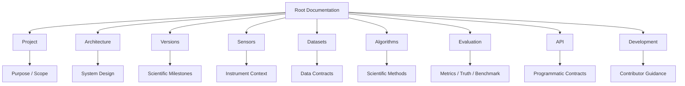
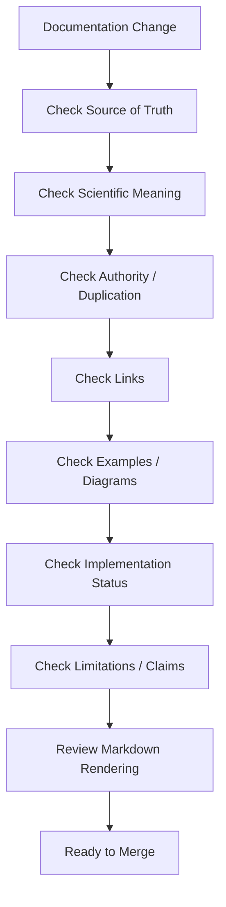
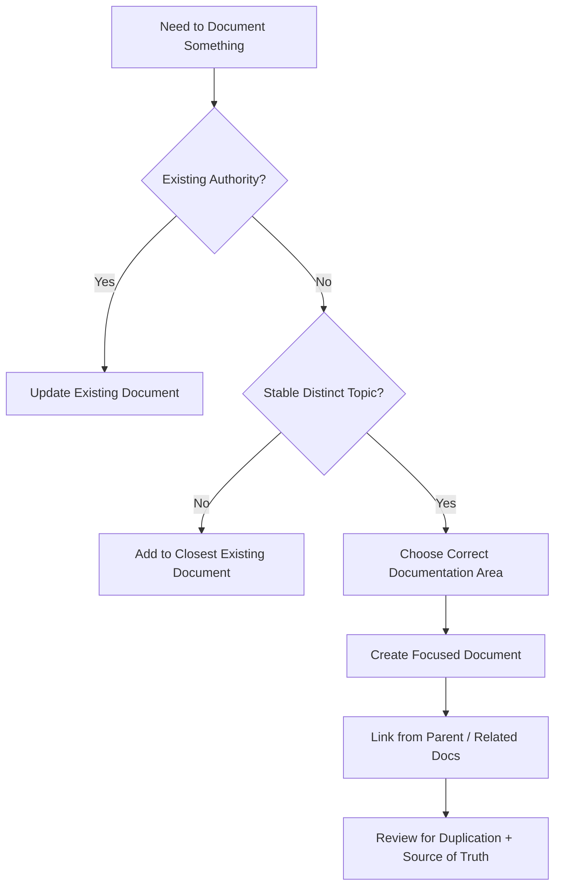
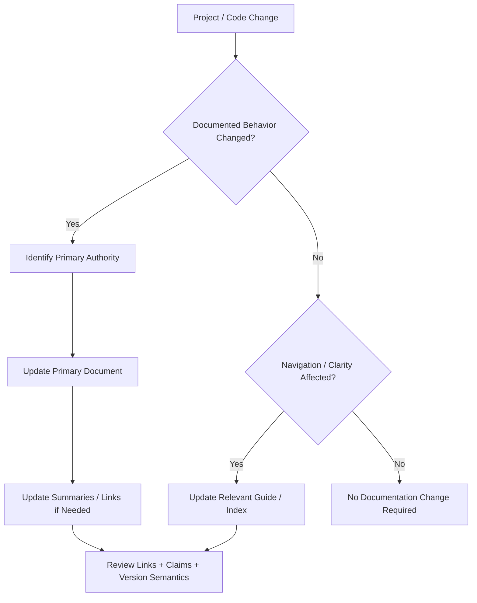

# Documentation Guide

This document defines the documentation-writing, organization, review, linking, and maintenance standards for ChandraMap.

It is intended for maintainers, researchers, software engineers, documentation contributors, reviewers, and AI coding/documentation agents working on the repository.

ChandraMap is a scientific lunar image correspondence and registration project. Its documentation must therefore describe not only software behavior, but also scientific assumptions, coordinate semantics, sensor context, evaluation methodology, version boundaries, limitations, and evidence.

> **ChandraMap documentation should make the project's scientific and engineering contracts easier to understand—not create a second, conflicting version of them.**

> **Documentation should describe what ChandraMap actually defines, implements, or intentionally plans—not what would merely make the repository look more complete.**

> **Every important topic should have one primary documentation authority; other files should link to that authority rather than duplicate it.**

> **Scientific claims must be more conservative than marketing claims: describe evidence, assumptions, units, coordinate spaces, and limitations explicitly.**

> **Documentation is part of the project contract. A code change that changes documented behavior should update the relevant documentation.**

> **Do not create documentation merely to increase file count; create it when a stable topic needs a clear source of truth.**

> **Documentation should help a new contributor understand what is true, what is implemented, what is experimental, and what is planned.**

> **Prefer precise relative links and stable terminology over copied paragraphs that become inconsistent later.**

> **Documentation should remain readable to both software engineers and researchers reviewing ChandraMap's scientific methodology.**

The repository, implementation, specifications, and maintained authoritative documentation are the sources of truth.

Do not invent implementation details to make a document appear complete.

---

## 1. Documentation Goals

ChandraMap documentation should make it possible for:

- a new contributor to understand what the project does and where to start;
- a researcher to understand scientific assumptions and methodological boundaries;
- a developer to find the authoritative definition of a behavior;
- a reviewer to verify architecture and algorithm intent;
- an API user to understand programmatic contracts;
- a user to interpret scientific outputs correctly;
- a maintainer to update behavior without creating conflicting documentation;
- future scientific versions to remain comparable with earlier versions;
- automated coding/documentation agents to locate authoritative context without guessing.

Documentation should reduce ambiguity.

A reader should not need to reverse-engineer source code merely to determine basic scientific concepts such as:

- which image is the source;
- which image is the reference;
- which coordinate space a metric belongs to;
- whether correspondences are candidates or verified inliers;
- whether a result is measured or illustrative;
- whether a feature is implemented or planned.

---

## 2. Documentation Non-Goals

Documentation should not:

- advertise unsupported capabilities;
- duplicate large technical sections across files;
- hide implementation gaps;
- convert planned features into current features;
- replace source code;
- replace tests;
- replace benchmark evidence;
- use screenshots as the only technical proof;
- create a second source of truth for an existing contract;
- optimize for documentation file count;
- become a historical dump of abandoned ideas;
- present architectural intention as implementation fact;
- present one successful example as general scientific evidence.

Documentation exists to clarify the project, not to make it look artificially complete.

---

# Documentation Architecture

## 3. Documentation Areas

ChandraMap documentation is organized conceptually by responsibility.

| Area                 | Primary Responsibility                                                                      |
| -------------------- | ------------------------------------------------------------------------------------------- |
| Root documentation   | Repository-wide orientation, governance, contribution, security, licensing, release history |
| `docs/project/`      | Project purpose, goals, scope, assumptions, limitations, terminology                        |
| `docs/architecture/` | System/component responsibilities, dependency direction, data flow                          |
| `docs/versions/`     | Scientific-version methodology and benchmarkable milestones                                 |
| `docs/sensors/`      | Instrument context and ChandraMap-specific sensor implications                              |
| `docs/datasets/`     | Data sources, structure, preparation, metadata, pair/truth definitions                      |
| `docs/algorithms/`   | Scientific algorithm behavior and stage-level methodology                                   |
| `docs/evaluation/`   | Metrics, truth, benchmarks, failure evaluation, reproducibility                             |
| `docs/api/`          | Programmatic contracts and API semantics                                                    |
| `docs/development/`  | Contributor workflow, standards, testing, documentation, development guidance               |

The areas are complementary rather than interchangeable.

---

## 4. Documentation Architecture



Each area should answer a different class of question.

Do not solve navigation problems by copying the same information into every area.

---

# Root Documentation

## 5. Root-Level Documentation

Root documentation should contain information that applies to the repository as a whole.

Confirmed repository-level documentation may include:

- [`../../README.md`](../../README.md)
- [`../../LICENSE`](../../LICENSE)
- [`../../CHANGELOG.md`](../../CHANGELOG.md)
- [`../../ROADMAP.md`](../../ROADMAP.md)
- [`../../CONTRIBUTING.md`](../../CONTRIBUTING.md)
- [`../../CODE_OF_CONDUCT.md`](../../CODE_OF_CONDUCT.md)
- [`../../SECURITY.md`](../../SECURITY.md)
- [`../../CITATION.cff`](../../CITATION.cff)
- [`../../AGENTS.md`](../../AGENTS.md)

Root documentation should not become the home for detailed scientific algorithms when dedicated documentation already exists.

---

## 6. Root README Role

The root [`README.md`](../../README.md) should generally provide:

- a concise explanation of ChandraMap;
- the scientific problem it addresses;
- major project capabilities or intended capabilities, with status described accurately;
- a high-level pipeline or architecture orientation;
- quick navigation;
- repository setup entry points where verified;
- development/testing/documentation links;
- contribution, security, license, and citation pointers.

The root README should orient readers.

It should not duplicate the complete:

- architecture specification;
- V1 specification;
- benchmark protocol;
- algorithm documentation;
- API reference;
- development manual.

---

# Project Documentation

## 7. Project-Level Documentation

Project documentation answers:

- What is ChandraMap?
- Why does it exist?
- What does it intend to solve?
- What is deliberately outside scope?
- What assumptions constrain the system?
- What limitations should readers know?
- What terminology does the project use?

Known project documents include:

- [`../project/goals.md`](../project/goals.md)
- [`../project/non-goals.md`](../project/non-goals.md)
- [`../project/v1-scope.md`](../project/v1-scope.md)
- [`../project/terminology.md`](../project/terminology.md)
- [`../project/assumptions.md`](../project/assumptions.md)
- [`../project/limitations.md`](../project/limitations.md)

Do not place implementation-specific API details or algorithm configuration inside project-goal documents.

---

## 8. Terminology Documentation

Use [`../project/terminology.md`](../project/terminology.md) as the primary vocabulary authority where applicable.

Important scientific terms should not acquire different definitions in different documents.

Documentation should preserve distinctions such as:

```text
Candidate Matches
!=
Verified Inliers
!=
Independent Ground Truth
```

and:

```text
Fit Residual
!=
Held-Out Check Error
```

and:

```text
Reference Imagery
!=
Ground Truth Automatically
```

and:

```text
Retrieval
!=
Registration
```

and:

```text
Spatial Coverage
!=
Accuracy
```

and:

```text
API Success
!=
Scientific Registration Success
```

and:

```text
Artifact
!=
Scientific Result
```

---

# Architecture Documentation

## 9. Architecture Documentation

Known architecture documents include:

- [`../architecture/system-overview.md`](../architecture/system-overview.md)
- [`../architecture/v1-pipeline.md`](../architecture/v1-pipeline.md)
- [`../architecture/core-engine-architecture.md`](../architecture/core-engine-architecture.md)
- [`../architecture/backend-architecture.md`](../architecture/backend-architecture.md)
- [`../architecture/frontend-architecture.md`](../architecture/frontend-architecture.md)
- [`../architecture/module-map.md`](../architecture/module-map.md)
- [`../architecture/data-flow.md`](../architecture/data-flow.md)
- [`../architecture/output-flow.md`](../architecture/output-flow.md)

Architecture documentation should explain:

- responsibility;
- boundaries;
- dependency direction;
- component interaction;
- data flow;
- output flow;
- separation between core science and interfaces.

Architecture documentation should not primarily be a directory listing.

---

## 10. Architecture vs Repository Structure

> **Architecture describes how responsibilities interact; repository structure describes where those responsibilities live.**

Use [`repository-structure.md`](repository-structure.md) for physical repository ownership and placement rules.

For example:

- architecture may define a reusable scientific core;
- repository structure identifies where that core lives.

Do not confuse file organization with system architecture.

---

# Scientific Version Documentation

## 11. Scientific Versions

> **Each ChandraMap scientific version is a benchmarkable research milestone, not merely a software release number.**

Scientific versions such as V1, V2, V3, and V4 should remain distinct from:

- software releases;
- API versions;
- schema versions;
- benchmark versions;
- truth-data versions.

Scientific-version documentation owns methodology boundaries.

---

## 12. V1 Documentation Authority

V1 is the classical known-overlap registration baseline.

Its conceptual flow is:

```text
Input Validation
→ Metadata / Sensor Routing
→ Preprocessing
→ Physical Scale Handling
→ SIFT
→ Descriptor Matching
→ Match Filtering
→ RANSAC
→ Initial Transform
→ Optional Sub-Pixel Refinement
→ Final Refit
→ Registration
→ Evaluation
→ Reproducible Result
```

Known V1 documents may include:

- `../versions/v1/README.md`
- `../versions/v1/specification.md`
- `../versions/v1/scope.md`
- `../versions/v1/requirements.md`
- `../versions/v1/architecture.md`
- `../versions/v1/pipeline.md`
- `../versions/v1/inputs.md`
- `../versions/v1/outputs.md`
- `../versions/v1/benchmark.md`
- `../versions/v1/acceptance-criteria.md`
- `../versions/v1/exclusions.md`
- `../versions/v1/limitations.md`

Do not duplicate their full contracts in unrelated documents.

Later versions must not silently redefine historical V1 methodology.

---

## 13. Version README vs Specification

Use version documents according to responsibility.

| Document            | Responsibility                                    |
| ------------------- | ------------------------------------------------- |
| Version README      | Orientation, summary, navigation                  |
| Specification       | Authoritative technical methodology               |
| Scope               | Included/deferred/out-of-scope boundary           |
| Requirements        | Testable normative requirements                   |
| Architecture        | Version-specific composition and responsibility   |
| Pipeline            | Scientific stage sequence                         |
| Inputs              | Version input contract                            |
| Outputs             | Version result/output contract                    |
| Benchmark           | Scientific comparison/evaluation contract         |
| Acceptance criteria | Conditions for considering requirements satisfied |
| Exclusions          | Deliberately unsupported behavior                 |
| Limitations         | Known methodological constraints                  |

Do not place the same authoritative requirement in several files unless one is clearly a summary linking back to the owner.

---

# Sensor Documentation

## 14. Sensor Documentation Responsibilities

Sensor documentation may include:

- `../sensors/overview.md`
- `../sensors/ohrc.md`
- `../sensors/tmc2.md`
- `../sensors/iirs.md`
- `../sensors/lro-nac.md`
- `../sensors/lro-wac.md`

A sensor document should explain, where relevant:

- official instrument name;
- mission;
- sensing modality;
- relevant spatial characteristics;
- relevant spectral characteristics;
- ChandraMap role;
- preprocessing implications;
- scale/modality challenges;
- relevant metadata;
- limitations;
- authoritative external references.

---

## 15. Approximate Sensor Facts

Documentation may use approximate mission context where useful, but must remain cautious.

Typical project context includes approximately:

| Instrument | Contextual Characteristics                                                          |
| ---------- | ----------------------------------------------------------------------------------- |
| OHRC       | ~0.25–0.32 m/pixel depending on product/documentation                               |
| TMC-2      | ~5 m/pixel                                                                          |
| IIRS       | ~80 m/pixel, ~0.8–5.0 µm, roughly ~250–256 bands depending on product/documentation |
| LRO NAC    | often ~0.5–2 m/pixel depending on product/acquisition                               |
| LRO WAC    | broader/coarser lunar context                                                       |

> **Product metadata wins over approximate documentation summaries.**

Do not turn approximate ranges into hard-coded universal facts.

---

## 16. Official Instrument Names

Use project-specific instrument names accurately.

Prefer:

- OHRC
- TMC-2
- IIRS
- LRO NAC
- LRO WAC

Do not casually replace **TMC-2** with **TMC** in ChandraMap-specific documentation when the intended instrument is TMC-2.

---

## 17. IIRS Documentation

> **IIRS is a hyperspectral/imaging-infrared instrument, not simply a low-resolution grayscale camera.**

Documentation should distinguish:

1. the hyperspectral parent product; and
2. any derived 2D registration representation.

A registration-friendly representation may be needed before ordinary 2D local correspondence methods are applied.

Do not imply that the complete hyperspectral cube is scientifically equivalent to a single grayscale image.

---

# Dataset Documentation

## 18. Dataset Documentation Responsibilities

Dataset documentation may include:

- `../datasets/README.md`
- `../datasets/chandrayaan-2.md`
- `../datasets/lro.md`
- `../datasets/metadata.md`
- `../datasets/data-format.md`
- `../datasets/dataset-structure.md`
- `../datasets/dataset-preparation.md`
- `../datasets/pair-definition.md`
- `../datasets/ground-truth-preparation.md`

Dataset documentation should own topics such as:

- acquisition/source;
- product identity;
- metadata;
- structure;
- format;
- preparation;
- pair definition;
- control/check data;
- ground-truth preparation;
- provenance;
- licensing constraints.

---

## 19. Data Provenance

Documentation should distinguish between:

```text
Raw Provider Product
→ Prepared Representation
→ Derived Scientific Product
→ Benchmark Pair
→ Truth / Check Data
```

A filename alone is not sufficient scientific identity.

Where relevant, documentation should describe identifiers, processing state, representation, product metadata, and preparation provenance.

---

## 20. Data Licensing

Use `../data-licenses.md` where present as the project authority for data-licensing guidance.

Do not claim redistribution rights without authoritative evidence.

Public availability does not automatically mean unrestricted redistribution through the ChandraMap repository.

---

# Algorithm Documentation

## 21. Algorithm Documentation Responsibilities

Algorithm documentation may include:

- `../algorithms/overview.md`
- `../algorithms/sensor-routing.md`
- `../algorithms/preprocessing.md`
- `../algorithms/illumination-handling.md`
- `../algorithms/scale-pyramid.md`
- `../algorithms/sift.md`
- `../algorithms/matching.md`
- `../algorithms/match-filtering.md`
- `../algorithms/ransac.md`
- `../algorithms/transforms.md`
- `../algorithms/residual-analysis.md`
- `../algorithms/subpixel-refinement.md`
- `../algorithms/registration.md`

An algorithm document should explain, where relevant:

- purpose;
- scientific role;
- input;
- output;
- assumptions;
- stage order;
- coordinate semantics;
- units;
- failure behavior;
- limitations;
- relationship to scientific versions;
- relevant external references.

Do not use algorithm documentation as a substitute for version composition.

---

## 22. Algorithm Claims

Do not write unsupported claims such as:

- illumination invariant;
- completely scale invariant;
- lunar invariant;
- highly accurate;
- universally robust;
- guaranteed sub-pixel accuracy.

Scientific claims require evidence with an identified population and evaluation context.

Prefer factual descriptions of the algorithm's intended role.

---

## 23. Matching Terminology

Use:

```text
Feature Matcher Output
→ Candidate Matches
```

and:

```text
Geometric Verification
→ Verified / Model-Consistent Inliers
```

Do not state that a feature matcher "finds correct matches" unless correctness has been independently established.

A matcher score is not automatically geometric validity.

---

## 24. Verify → Refine → Refit

For V1 documentation, preserve:

```text
Candidate Matches
→ RANSAC
→ Verified Inliers
→ Sub-Pixel Refinement
→ Final Refit
```

> **Verify first, refine second, refit third.**

Do not accidentally document refinement of all raw matcher candidates before geometric verification when describing the V1 baseline.

---

## 25. Physical Scale

> **Compare information, not pixel count.**

Upsampling does not create new physical lunar detail.

Documentation about scale handling should distinguish:

- image dimensions;
- physical ground sampling;
- effective comparison scale;
- pyramid/downsampling level.

Do not describe simple interpolation as resolution recovery.

---

## 26. Illumination

Sun-angle differences can affect:

- shadow direction;
- shadow extent;
- terrain visibility;
- feature appearance;
- local intensity.

Contrast normalization may alter intensity distribution.

It does not move shadows back into identical geometry.

Do not describe ordinary contrast normalization as a complete solution to Sun-angle variation.

---

## 27. Geometry

> **The Moon is not a flat poster.**

Affine transforms or homographies may be useful local approximations.

Do not document one global homography as a universal model for all lunar terrain, viewpoints, relief, raw sensor geometry, or map-projection conditions.

State the intended validity domain of the transform model.

---

# Evaluation and Benchmark Documentation

## 28. Evaluation Documentation

Evaluation documentation may include:

- `../evaluation/README.md`
- `../evaluation/benchmark-protocol.md`
- `../evaluation/benchmark-categories.md`
- `../evaluation/metrics.md`
- `../evaluation/ground-truth.md`
- `../evaluation/control-points.md`
- `../evaluation/checkpoint-evaluation.md`
- `../evaluation/spatial-coverage.md`
- `../evaluation/stress-tests.md`
- `../evaluation/success-criteria.md`
- `../evaluation/failure-cases.md`
- `../evaluation/reproducibility.md`

Evaluation documentation should explain how scientific evidence is produced and interpreted.

---

## 29. Fit vs Check Data

> **Fit points estimate the model; held-out check points evaluate it.**

Do not call residuals over model-fitting points independent registration accuracy.

Documentation should distinguish:

- model-fitting population;
- verification inliers;
- independent evaluation population.

---

## 30. Metric Documentation

Metric documentation should include, where relevant:

- definition;
- evaluated population;
- units;
- coordinate space;
- sample count;
- availability;
- interpretation;
- limitations.

Do not document a bare value such as "RMSE = X" without explaining what was measured.

---

## 31. Missing Metrics

> **Unavailable is not zero.**

Documentation examples should distinguish:

- measured zero;
- unavailable;
- not applicable;
- not evaluated;
- failure before measurement.

A zero-valued metric has scientific meaning.

Missing evidence does not.

---

## 32. Ground-Space Error

Do not document a generic rule such as:

```text
ground error = pixel error × approximate sensor GSD
```

as universally valid.

Ground-space conversion requires appropriate product, projection, scale, and coordinate context.

Use product-specific metadata and the documented evaluation method.

---

## 33. Spatial Coverage

Spatial coverage describes the distribution of correspondence support.

It does not automatically describe accuracy.

Documentation should state:

- which point population is used;
- which region is evaluated;
- which coverage definition applies.

Different coverage methods should have distinct names.

---

## 34. Benchmark Documentation

Benchmark documentation should define, where applicable:

- scientific version;
- benchmark version;
- pair population;
- categories;
- truth/check data;
- fit/check separation;
- configuration;
- metrics;
- success/failure handling;
- failure retention;
- reproducibility requirements.

Do not silently drop failed valid pairs from a reported benchmark population.

Failure rate is part of scientific performance.

---

## 35. Tests vs Benchmarks

Use the repository's testing documentation where present.

> **Tests validate implementation behavior; benchmarks evaluate scientific performance.**

Do not merge the two concepts.

A unit test can prove a metric implementation behaves as expected.

It cannot prove the scientific method performs well across real lunar image pairs.

---

# API Documentation

## 36. API Documentation Responsibilities

API documentation may include:

- `../api/README.md`
- `../api/overview.md`
- `../api/endpoints.md`
- `../api/schemas.md`
- `../api/error-codes.md`
- `../api/versioning.md`
- `../api/request-response-examples.md`

API documentation should describe programmatic contracts.

It should not duplicate complete scientific algorithm documentation.

---

## 37. API Source of Truth

Concrete API documentation must come from the actual implementation, schemas, or authoritative API contracts.

Do not invent:

- endpoints;
- HTTP methods;
- route paths;
- ports;
- request fields;
- response fields;
- error codes;
- authentication headers;
- API version numbers.

If the contract is not established, documentation should remain conceptual.

---

## 38. Conceptual API Examples

> **Conceptual API examples must never be presented as implemented wire contracts.**

Use clear labels such as:

> **Conceptual example**

or:

> **Illustrative only — not an implemented API contract**

Use obvious placeholders instead of realistic fabricated identifiers.

For example:

```json
{
  "run_id": "PLACEHOLDER_RUN_ID",
  "scientific_version": "PLACEHOLDER_SCIENTIFIC_VERSION"
}
```

Do not imply these fields exist unless verified.

---

## 39. API and Scientific Method

> **The API exposes ChandraMap science; it should not define a second version of that science.**

API documentation should link to version, algorithm, and evaluation documentation for scientific behavior.

The API layer should describe:

- transport semantics;
- contract fields;
- status/error behavior;
- versioning;

rather than redefining algorithm methodology.

---

# Development Documentation

## 40. Development Documentation Responsibilities

Development documentation explains how contributors understand, modify, test, document, and maintain the repository.

Confirmed development documents include:

- [`README.md`](README.md)
- [`repository-structure.md`](repository-structure.md)
- [`local-development.md`](local-development.md)
- [`coding-standards.md`](coding-standards.md)
- [`naming-conventions.md`](naming-conventions.md)

Additional development documents such as `testing.md` should be linked only once confirmed present.

Development documentation should not redefine scientific methodology.

---

# Documentation Ownership

## 41. One Topic, One Primary Authority

> **Every important topic should have one primary documentation authority.**

Examples:

| Topic                | Primary Authority                          |
| -------------------- | ------------------------------------------ |
| Project goals        | `docs/project/goals.md`                    |
| Project terminology  | `docs/project/terminology.md`              |
| V1 methodology       | `docs/versions/v1/`                        |
| RANSAC behavior      | `docs/algorithms/ransac.md`                |
| Metric definitions   | `docs/evaluation/metrics.md`               |
| API schemas          | `docs/api/schemas.md`                      |
| Repository placement | `docs/development/repository-structure.md` |
| Coding rules         | `docs/development/coding-standards.md`     |
| Documentation rules  | `docs/development/documentation-guide.md`  |

Other documents should provide a short contextual summary and link to the authority.

---

## 42. Duplication Anti-Pattern

Do not copy the complete V1 pipeline into:

- the root README;
- architecture documents;
- API documentation;
- development documentation;
- benchmark documentation;
- sensor documentation.

Instead:

```text
Contextual Summary
+
Link to Primary Authority
```

Duplication creates drift.

A correction applied to one copy but not another produces conflicting documentation.

---

## 43. Source-of-Truth Map

| Topic                         | Primary Documentation Area |
| ----------------------------- | -------------------------- |
| Project goals/non-goals       | `docs/project/`            |
| System/component architecture | `docs/architecture/`       |
| Scientific version definition | `docs/versions/`           |
| Sensor facts/roles            | `docs/sensors/`            |
| Dataset preparation/contracts | `docs/datasets/`           |
| Algorithm behavior            | `docs/algorithms/`         |
| Metrics/benchmark/truth       | `docs/evaluation/`         |
| API contracts                 | `docs/api/`                |
| Developer workflow/standards  | `docs/development/`        |

---

## 44. Documentation Discovery

A reader should be able to move logically between related documents.

Use:

- parent README/index pages;
- "Related Documentation" sections;
- concise navigation tables;
- descriptive relative links.

Avoid orphan documents that require repository-wide searching to discover.

---

# Document Structure and Writing

## 45. Typical Document Structure

Most substantial technical documents should generally contain:

1. one H1 title;
2. a short introduction;
3. purpose and scope;
4. key concepts;
5. primary technical content;
6. assumptions and limitations where relevant;
7. related documentation.

This is a guideline, not a mandatory template for every file.

Structure should match the topic.

---

## 46. Heading Hierarchy

Use one clear H1 for the document title.

Then use H2 and H3 hierarchically.

Prefer:

```text
# Page Title

## Major Section

### Subsection
```

Avoid skipping heading levels without a reason.

---

## 47. Page Titles

A page title should correspond directly to its topic.

Examples:

```text
spatial-coverage.md
# Spatial Coverage
```

```text
local-development.md
# Local Development
```

Avoid promotional titles such as:

```text
# The Ultimate Lunar Matching Solution
```

Technical documentation should be searchable and predictable.

---

## 48. Introductions

A strong introduction should quickly answer:

- What is this document?
- Why does it exist?
- What does it own?
- What does another document own instead, if ambiguity is likely?

Avoid long marketing openings.

---

## 49. Tables of Contents

Do not automatically add a manually maintained table of contents to every document.

GitHub already provides heading navigation.

Add a manual TOC only when document length or structure genuinely benefits from one and the repository maintains it reliably.

---

## 50. Paragraph Style

Prefer short, cohesive paragraphs.

Avoid large walls of text.

Also avoid turning every sentence into its own paragraph.

Lists are useful when the content is naturally scannable.

---

## 51. Lists

Use unordered lists for sets.

Use numbered lists when order, sequence, or priority matters.

Do not use numbered lists merely for decoration because numbering implies sequence or priority.

---

## 52. Tables

Tables are useful for structured comparisons such as:

- documentation ownership;
- sensor roles;
- version differences;
- metric semantics;
- responsibility boundaries;
- implementation-status categories.

Avoid tables containing long multi-paragraph text that becomes difficult to read on GitHub or mobile devices.

---

# Mermaid Diagrams

## 53. When to Use Mermaid

Mermaid diagrams are appropriate for:

- pipeline flow;
- architecture;
- decision flow;
- state flow;
- data flow;
- dependency relationships;
- documentation relationships;
- version relationships.

Use GitHub-compatible Mermaid syntax.

Do not create diagrams solely for decoration.

---

## 54. Diagram Principle

> **A diagram should explain a relationship that is harder to understand in prose, not repeat the paragraph immediately above it.**

A useful diagram reduces cognitive load.

A redundant diagram increases maintenance burden.

---

## 55. Diagram Source of Truth

A diagram must agree with the authoritative textual contract.

If diagram and prose conflict, the documentation is defective.

Do not allow an infographic to silently redefine:

- stage order;
- transform direction;
- evaluation semantics;
- dependency direction;
- version scope.

---

## 56. Pipeline Diagrams

For V1, preserve the intended ordering:

```text
Candidate Matches
→ RANSAC
→ Verified Inliers
→ Sub-Pixel Refinement
→ Final Refit
```

Do not show refinement before verification.

Do not label raw matcher candidates as final correspondences.

---

## 57. Diagram Labels

Use short, meaningful node labels.

Good:

```text
Verified Inliers
```

Poor:

```text
This stage takes all of the previously matched features and attempts to determine which ones are probably geometrically valid
```

Put detailed explanation in prose outside the node.

---

# Figures and Screenshots

## 58. Static Images and Figures

Static figures should explain scientific or architectural concepts that are difficult to communicate in plain text.

Do not use a screenshot as the sole specification of:

- pipeline stages;
- API fields;
- metrics;
- architecture;
- expected outputs.

Text remains the primary technical contract.

---

## 59. Image Accessibility

Use meaningful alt text when adding images through Markdown.

Prefer:

```text
V1 correspondence and registration pipeline
```

over:

```text
image1
```

Alt text should help readers understand the figure's purpose.

---

## 60. Screenshots

Screenshots can illustrate:

- frontend behavior;
- visual overlays;
- registered outputs;
- workflow examples.

They should not replace text explaining the scientific meaning of what is shown.

A UI screenshot can demonstrate presentation.

It cannot prove registration correctness.

---

# Equations

## 61. Equation Use

Use equations when they improve precision.

Useful contexts may include:

- RMSE definitions;
- coordinate transforms;
- coverage definitions;
- geometric mapping.

Do not add mathematics merely to make documentation appear advanced.

Every equation should define its important symbols.

---

## 62. RMSE Documentation

If RMSE is documented, explain:

- which residuals are used;
- which points are evaluated;
- which coordinate space applies;
- which units apply;
- whether the points were used to fit the model.

For example, a mathematically correct generic formula is still scientifically incomplete unless the population is defined.

---

# Code and Configuration Examples

## 63. Code Examples

Code examples should be:

- small;
- relevant;
- safe;
- accurate;
- verified against implementation, or clearly labeled conceptual.

Do not invent project APIs for examples.

---

## 64. Concrete vs Conceptual Examples

### Concrete

A concrete example has been verified against actual repository behavior.

It may be presented as executable or authoritative.

### Conceptual

A conceptual example illustrates a design or intended shape.

It must be labeled clearly.

Example:

> **Conceptual example — actual fields are implementation-defined.**

When specific values are unknown, use placeholders.

---

## 65. Shell Commands

Commands must come from actual repository tooling.

Do not invent:

- `pip` commands;
- npm/pnpm/Yarn commands;
- Makefile targets;
- Docker commands;
- CLI invocations.

Use [`local-development.md`](local-development.md) as the primary local-workflow guide.

---

## 66. JSON and YAML Examples

Concrete JSON/YAML examples must match real schemas or configurations.

Conceptual examples must be labeled.

Do not fabricate realistic:

- RMSE values;
- runtime values;
- product IDs;
- benchmark IDs;
- run IDs;
- API responses.

---

## 67. Placeholder Style

Prefer obvious placeholder values such as:

```text
PLACEHOLDER_RUN_ID
PLACEHOLDER_CONFIG_VERSION
PLACEHOLDER_RMSE_VALUE
PLACEHOLDER_SOURCE_ASSET
```

Avoid fabricated values that look official.

---

## 68. Code-Fence Language Tags

Use language tags only when the content matches the language.

Examples:

````text
```python
```

```json
```

```yaml
```

```bash
```

```mermaid
```
````

Do not label conceptual pseudocode as production Python if it is not valid Python.

Use `text` or a clearly labeled pseudocode block instead.

---

# Links

## 69. Repository Links

Prefer relative GitHub links for repository content.

Relative links remain portable across:

- forks;
- branches;
- repository renames;
- local clones.

Avoid absolute GitHub repository URLs when a relative link is sufficient.

---

## 70. Link Rules from This Folder

From `docs/development/documentation-guide.md`:

### Same development folder

Use:

```text
README.md
repository-structure.md
local-development.md
coding-standards.md
naming-conventions.md
```

### Other documentation areas

Use:

```text
../architecture/system-overview.md
../project/goals.md
../evaluation/metrics.md
```

### Repository root

Use:

```text
../../README.md
../../CONTRIBUTING.md
../../SECURITY.md
```

---

## 71. Link Validation

Do not knowingly create broken links.

If a document is not confirmed to exist:

- do not make it a Markdown link; or
- describe it as planned/possible documentation without creating the link.

When documents are added, moved, renamed, or deleted, review inbound and outbound links.

---

## 72. Link Text

Use descriptive link text.

Prefer:

```text
See the [system overview](../architecture/system-overview.md).
```

Avoid:

```text
Click here.
```

Descriptive links remain useful outside the surrounding sentence.

---

## 73. External Links

When external references are needed, prefer authoritative sources such as:

- ISRO;
- ISSDC/PRADAN;
- NASA;
- LROC/ASU;
- NASA PDS;
- USGS ISIS;
- JAXA/SELENE;
- official library documentation;
- official repositories;
- primary research papers.

Do not invent an external URL when the exact address is uncertain.

Name the authoritative source instead.

---

# Citations and Scientific References

## 74. Reference Quality

Technical and scientific claims may require external references, particularly for:

- instrument specifications;
- mission-product behavior;
- algorithm descriptions;
- external library capabilities;
- published scientific methods.

Prefer primary or official sources.

For example:

```text
Official mission documentation
>
Primary research paper
>
Official implementation/repository
>
Secondary technical source
```

where practical.

Do not rely on an informal blog when an authoritative mission document or primary paper exists.

---

## 75. Approximate Values

If a specification varies by:

- product;
- acquisition;
- processing level;
- geometry;
- documentation source;

use language such as:

- approximately;
- typical;
- often;
- depending on product;
- depending on acquisition.

Do not imply a universal constant where none exists.

---

## 76. Product Metadata Precedence

> **Product metadata is authoritative for a specific scientific product; documentation summaries provide context only.**

This principle applies especially to:

- pixel scale;
- projection;
- dimensions;
- acquisition geometry;
- sensor metadata;
- processing level.

---

# Scientific Writing Style

## 77. Scientific Claim Language

Prefer evidence-sensitive language such as:

- can;
- may;
- is intended to;
- under the tested benchmark;
- in the evaluated cases;
- conceptually;
- where supported.

Use stronger terms such as:

- always;
- guarantees;
- invariant;
- universally robust;
- perfect;

only where the evidence supports the exact claim.

---

# Implementation Status

## 78. Status Categories

Documentation should distinguish at least these conceptual states when status matters.

### Implemented

A working repository implementation has been verified.

### Partially Implemented

Some documented behavior exists, but the complete intended capability is not yet available.

### Planned

The capability is intended but not implemented.

### Experimental

Research or unstable implementation exists but is not an official stable capability.

### Conceptual / Architectural

The documentation defines a role or design direction without asserting implementation.

Do not label a feature implemented solely because its design document exists.

---

## 79. Specification vs Implementation

> **A specification defines intended behavior; it does not prove that the behavior is already implemented.**

For example:

```text
docs/versions/v2/specification.md exists
```

does not logically establish:

```text
V2 is implemented
```

Keep methodology definition and implementation status separate.

---

## 80. Future Work

Appropriate future-facing phrases include:

- planned direction;
- proposed capability;
- candidate research direction;
- possible later-version extension;
- intended architecture.

Avoid:

```text
will definitely support
```

unless an authoritative roadmap or project commitment actually establishes that guarantee.

---

# Limitations, Non-Goals, and Warnings

## 81. Limitations

Scientific and technical documents should include limitations where omission could mislead readers.

Examples may include:

- local transform assumptions;
- scale differences;
- illumination variation;
- IIRS modality differences;
- limited truth data;
- implementation incompleteness;
- external-data dependency.

A limitation is not necessarily a defect.

---

## 82. Non-Goals and Exclusions

Use non-goals or exclusions to define intentional scope boundaries.

Do not frame every excluded capability as a project failure.

For example, if global retrieval is excluded from V1 by design, its absence is not a V1 bug.

---

## 83. Important Notes and Warnings

Use blockquotes or bold labels for critical interpretation rules.

Example:

> **Important:** Reference imagery is not automatically independent ground truth.

Do not make every paragraph a warning.

Excessive emphasis makes truly important warnings harder to notice.

---

# Terminology Consistency

## 84. Preferred Vocabulary

Use [`../project/terminology.md`](../project/terminology.md) and [`naming-conventions.md`](naming-conventions.md) where applicable.

Important recurring terms include:

- source;
- reference;
- candidate match;
- verified inlier;
- fit residual;
- check error;
- spatial coverage;
- scientific version;
- benchmark version.

---

## 85. Avoid Synonym Drift

Do not casually interchange:

- match;
- tie point;
- correspondence;
- control point;
- check point;
- ground truth;

unless the document explicitly explains their relationships.

In scientific software, these terms can represent different populations and responsibilities.

---

## 86. Accuracy Language

Do not use "accuracy" as a generic synonym for:

- inlier ratio;
- match count;
- coverage;
- fit residual;
- retrieval success.

Prefer the actual metric name.

If "accuracy" is used, define what it means.

---

## 87. Confidence Language

Do not label an arbitrary matcher score as "confidence" unless the method or contract defines it that way.

Prefer terms such as:

- matcher score;
- similarity score;
- model score;

according to actual semantics.

---

## 88. Ground Truth Language

Use "ground truth" only for validated truth data.

LRO NAC or WAC used as the reference image is not automatically ground truth.

---

## 89. Baseline Language

"Baseline" should mean a controlled reference methodology used for comparison.

For ChandraMap, V1 may serve as such a scientific baseline.

Do not use "baseline" as an insult meaning "bad" or "weak."

---

## 90. Improved Language

Do not call a method "improved" without comparative evidence.

Prefer neutral labels such as:

- refinement-enabled configuration;
- learned-matcher variant;
- V2 method;
- retrieval-enabled pipeline.

Use "improved" only once an explicit comparison justifies it.

---

## 91. Best and State-of-the-Art Claims

Avoid claims such as:

- best;
- optimal;
- state-of-the-art;
- superior;

unless the exact comparison scope, benchmark, population, and evidence support them.

---

# Results and Evidence

## 92. Documentation Examples Are Not Benchmark Results

Never fabricate benchmark values merely to make a page appear complete.

Use:

- `PLACEHOLDER`;
- `TBD`;
- clearly labeled toy examples;
- clearly labeled synthetic examples.

Do not publish invented values that resemble measured ChandraMap performance.

---

## 93. Documenting Scientific Results

A scientific result description should include, where relevant:

- scientific version;
- source/reference identity;
- transform model;
- transform direction;
- coordinate spaces;
- candidate count;
- inlier count;
- metric definitions;
- units;
- evaluation availability;
- benchmark/truth context;
- provenance;
- failure state.

The exact fields depend on the result contract.

---

## 94. Registered Previews

> **A registered preview is a visualization artifact, not the complete scientific result.**

A preview can help inspect alignment.

It cannot replace measured evidence.

Do not use phrases such as:

```text
looks perfectly aligned
```

as scientific evaluation.

---

## 95. Failure Documentation

Scientific failure is a legitimate outcome.

Document:

- observed failure stage;
- available diagnostics;
- affected population;
- context.

Do not hide failure merely because successful screenshots are more visually appealing.

---

## 96. Observed Failure vs Root Cause

Prefer:

> Geometric verification could not establish a valid model.

over:

> Sun angle caused the failure.

unless evidence establishes the causal claim.

Observed failure and inferred cause are different kinds of information.

---

## 97. API Failure Documentation

Where present, use `../api/error-codes.md` as the authority.

Keep distinct:

- invalid request;
- service/infrastructure failure;
- scientific failure;
- evaluation unavailable.

HTTP success/failure and scientific success/failure may represent different state dimensions.

---

# Documentation, Code, Tests, and Benchmarks

## 98. Documentation and Tests

> **Tests should verify documented contracts; documentation should not be rewritten merely to match accidental test behavior.**

If:

```text
documentation
tests
implementation
```

disagree, investigate which contract is authoritative.

Do not automatically treat passing tests as proof that documentation is wrong.

---

## 99. Documentation and Benchmarks

Scientific claims should trace to controlled evaluation.

Do not update claims because one visually convincing run succeeded.

Benchmark claims should identify the relevant:

- scientific version;
- pair population;
- configuration;
- truth;
- metric definition.

---

## 100. Documentation During Code Review

Every meaningful code review should ask:

> Does this change alter documented behavior?

If yes, update the authoritative documentation as part of the same logical change where practical.

---

## 101. Documentation Change Triggers

Documentation may need revision when changing:

- project scope;
- architecture;
- public APIs;
- scientific methodology;
- configuration;
- sensor handling;
- dataset format;
- benchmark definition;
- truth data;
- metric definitions;
- developer commands;
- test workflow;
- security behavior;
- result schemas.

---

## 102. Documentation Change Matrix

| Code / Project Change    | Documentation Likely Affected                 |
| ------------------------ | --------------------------------------------- |
| New scientific algorithm | Algorithm + relevant version docs             |
| V1 pipeline change       | V1 specification/pipeline/requirements        |
| API schema change        | API schemas/examples/versioning               |
| New sensor support       | Sensor + dataset + routing docs               |
| Metric change            | Evaluation metrics + benchmark/version docs   |
| New developer command    | Local-development docs                        |
| Repository restructuring | Repository-structure docs                     |
| New test workflow        | Testing documentation                         |
| Security change          | `SECURITY.md` + relevant API/development docs |

"Likely" is intentional.

Documentation ownership should be determined by the actual change rather than a mechanical checklist alone.

---

# Documentation Review

## 103. Review Dimensions

Documentation review should evaluate:

- factual accuracy;
- source-of-truth alignment;
- scientific correctness;
- terminology;
- implementation status;
- version semantics;
- links;
- examples;
- diagrams;
- duplication;
- readability;
- limitations;
- reproducibility implications.

A grammatically polished document can still be technically wrong.

---

## 104. Documentation Review Flow



---

## 105. Reviewer Questions

Reviewers should ask:

1. Is this the correct file for this information?
2. Is the statement supported by the repository, specification, or external authority?
3. Is implementation status described accurately?
4. Is scientific terminology correct?
5. Is a duplicate authority being created?
6. Are relative links correct?
7. Are equations and metrics sufficiently defined?
8. Are units and coordinate spaces explicit where necessary?
9. Are conceptual examples labeled?
10. Are any values fabricated?
11. Are important limitations documented?
12. Does each diagram match the text?
13. Is V1 being redefined accidentally?
14. Are future capabilities presented cautiously?
15. Does the claim need an external reference?
16. Does this contradict another document?
17. Can a new contributor understand the page without guessing?

---

# Documentation Maintenance

## 106. Maintain Documentation With the Change

Contract-changing implementation work should not routinely defer documentation to an unspecified future task.

Where practical:

```text
Code / Specification Change
+
Documentation Update
+
Relevant Tests
```

should occur together.

---

## 107. Stale Documentation

When documentation becomes stale:

- update it; or
- mark its status clearly according to repository policy.

Do not leave conflicting instructions without explanation.

Stale setup commands are particularly dangerous because readers often assume they are executable.

---

## 108. Deprecated Documentation

Do not preserve obsolete content using ad hoc directories such as:

```text
old-docs/
backup-docs/
documentation-final-old/
```

merely for history.

Git already preserves historical revisions.

If historical documentation must remain visible, document why and clearly distinguish it from current guidance.

---

## 109. Renaming Documents

Before renaming a document, inspect:

- inbound links;
- parent README/index pages;
- architecture links;
- version docs;
- root navigation;
- issue/PR references where relevant.

Update known relative references.

---

## 110. Moving Documents

Moving a file changes relative paths.

Review all known inbound and outbound links after a move.

Do not assume relative repository links will automatically redirect.

---

# Broken-Link Prevention

## 111. Link Maintenance

After adding, renaming, moving, or deleting documentation:

- inspect related index pages;
- inspect local related-document sections;
- inspect root navigation where relevant;
- verify changed relative paths;
- review rendered Markdown.

If automated link checking exists in the repository, use it.

Do not invent a link-check command if none is configured.

---

## 112. Navigation

Important documentation should be reachable from a logical parent.

Examples:

```text
Root README
→ docs entry point
→ documentation area index
→ detailed document
```

Avoid orphan pages where practical.

---

## 113. Index Pages

README/index pages should:

- orient;
- summarize;
- navigate;
- identify authoritative child documents.

They should not copy the complete content of those child documents.

---

## 114. Documentation Depth

Avoid unnecessarily deep directory nesting.

Create hierarchy because responsibilities are genuinely different, not merely because more levels look organized.

Predictable navigation is more valuable than maximum categorization.

---

# Creating New Documentation

## 115. New-Document Decision Flow



---

## 116. When to Create a New File

Create a dedicated document when:

- the topic is stable enough to document;
- the topic has clear ownership;
- the topic is substantial enough to justify independent navigation;
- splitting materially improves clarity;
- the topic requires its own source of truth.

Examples include a distinct algorithm, sensor, benchmark contract, or architecture responsibility.

---

## 117. When Not to Create a New File

Do not create a new document for:

- duplicate explanation;
- personal notes;
- temporary brainstorming;
- tiny fragments better suited to an existing page;
- another overview of a topic already owned elsewhere;
- content whose only purpose is increasing repository size.

---

## 118. Document Length

Do not impose an arbitrary page-length limit.

A document should be long enough to explain its responsibility correctly and no longer than necessary.

For large topics, split by responsibility rather than random length.

---

## 119. File Naming

Use [`naming-conventions.md`](naming-conventions.md).

Documentation filenames should be:

- topic-oriented;
- stable;
- searchable;
- predictable.

Avoid names such as:

```text
final.md
final2.md
new.md
latest.md
updated.md
notes2.md
```

Those names describe editing history rather than document responsibility.

---

## 120. Status Labels

If the repository establishes document-status metadata or badges, follow that convention.

Do not independently invent status systems such as:

- Draft;
- Stable;
- Experimental;

unless the repository adopts them.

Use plain prose when necessary.

---

# Versioned Documentation

## 121. Version-Specific Documentation

Scientific-version-specific contracts belong under the appropriate version area.

Do not silently rewrite V1 documentation to describe V2, V3, or V4 behavior.

Historical baselines must remain interpretable.

---

## 122. Shared vs Version-Specific Documentation

Shared documentation should describe concepts common across versions.

Version-specific documentation should describe:

- composition;
- enabled methods;
- scientific constraints;
- requirements;
- configuration;
- benchmark meaning;
- exclusions.

Avoid copying shared algorithm descriptions into every version folder.

Link instead.

---

## 123. V2–V4 Language

Use cautious future-facing descriptions unless actual version specifications and implementations establish stronger claims.

Potential research progression may include concepts such as:

- V2 — stronger local registration robustness;
- V3 — advanced matching and/or retrieval;
- V4 — advanced multimodal, terrain-aware, uncertainty-aware, or multi-mission research.

These are contextual directions only.

Actual version specifications are authoritative.

Do not imply implementation completion.

---

# Retrieval Documentation

## 124. Retrieval vs Registration

If later versions include retrieval, keep its responsibility distinct.

For example:

```text
Global Descriptor
→ Vector Search
→ Candidate Region
```

is retrieval.

While:

```text
Candidate Region
→ Local Correspondence
→ Geometry
→ Registration
```

is registration.

FAISS is a vector similarity search/indexing system.

Do not document FAISS itself as image registration.

---

## 125. Retrieval Metrics

Recall@K and RMSE answer different questions.

| Metric               | Stage                         |
| -------------------- | ----------------------------- |
| Recall@K             | Retrieval                     |
| Inlier count / ratio | Local matching / verification |
| Check-point RMSE     | Registration evaluation       |

Do not call Recall@K "registration accuracy."

---

# Reproducibility Documentation

## 126. Reproducibility

Use `../evaluation/reproducibility.md` where present.

Documentation should help readers determine which:

- scientific version;
- source/reference data;
- pair definition;
- configuration;
- benchmark version;
- truth version;
- code revision;
- environment context;

produced a scientific result.

---

## 127. Reproducibility Claims

Do not claim:

> fully reproducible

without documenting enough information to actually reproduce the relevant result.

Reproducibility usually requires context around:

- data;
- configuration;
- implementation;
- dependencies/environment;
- procedure;
- randomness where relevant.

---

# Security in Documentation

## 128. Security Documentation

Use [`../../SECURITY.md`](../../SECURITY.md) as the primary repository security authority.

Never include real:

- secrets;
- API keys;
- passwords;
- tokens;
- private endpoints;
- private local paths;
- infrastructure credentials;

in documentation.

---

## 129. Environment Variable Examples

Use placeholder values.

Do not include real credentials.

Do not invent environment-variable names that the repository does not define.

---

## 130. File-Path Examples

Avoid developer-specific examples such as:

```text
/home/alice/project/data
C:\Users\alice\Desktop\moon
```

Use repository-relative or obvious placeholder paths where appropriate.

---

## 131. Command Security

Avoid documenting destructive commands unless they are genuinely required and their scope is clear.

Do not casually include broad deletion commands that could remove:

- raw data;
- benchmark truth;
- formal results;
- developer state.

---

# GitHub Markdown Style

## 132. Markdown Format

Use standard GitHub-flavored Markdown.

Prefer portable Markdown over renderer-specific hacks.

Documentation should remain useful in:

- GitHub;
- repository clones;
- common Markdown viewers.

---

## 133. Badges

Do not add badges to every documentation page.

The root README may contain useful verified badges where the project chooses.

Never fabricate:

- build badges;
- coverage badges;
- version badges;
- quality badges.

---

## 134. Emoji

Use emoji sparingly.

Scientific and engineering documentation should remain professional, searchable, and readable.

Do not use emoji as replacements for technical terminology or hierarchy.

---

## 135. Bold and Italics

Use emphasis for genuinely important concepts.

Avoid bolding nearly every sentence.

Excessive emphasis destroys visual hierarchy.

---

## 136. Blockquotes

Blockquotes are useful for:

- critical interpretation rules;
- warnings;
- concise principles.

Use them selectively.

---

## 137. Horizontal Rules

Horizontal rules may separate major document regions where useful.

Do not turn the entire document into disconnected visual cards.

---

## 138. Anchors

Prefer GitHub-generated heading anchors.

Avoid custom HTML anchors unless there is a specific need.

---

## 139. Raw HTML

Avoid unnecessary raw HTML.

Use standard Markdown where it provides equivalent behavior.

---

## 140. Table Width

Keep tables reasonably readable.

If cells require full paragraphs, prose sections may be a better format.

Do not create unnecessarily wide comparison tables that become unusable on smaller screens.

---

# Example Quality

## 141. Comments in Examples

Comments should explain non-obvious behavior.

Do not comment obvious syntax solely to increase apparent completeness.

---

## 142. Pseudocode

Label pseudocode clearly.

For example:

```text
Pseudocode:

validate input
route by sensor
prepare representation
match candidates
verify geometry
evaluate result
```

Do not present pseudocode as directly executable production code.

---

## 143. Placeholder Examples

Use consistent, obvious placeholder names.

Good:

```text
PLACEHOLDER_SOURCE_ASSET
PLACEHOLDER_REFERENCE_ASSET
PLACEHOLDER_RUN_ID
```

Avoid realistic invented values that may be mistaken for official project IDs.

---

## 144. Sample Metrics

Do not fabricate ChandraMap performance values.

If an educational numeric example is genuinely necessary, label it clearly:

> **Toy example — not a ChandraMap benchmark result.**

Do not allow synthetic values to be mistaken for measured performance.

---

# Scientific Figures

## 145. Figure Context

Scientific plots and figures should identify enough context to interpret them.

Depending on the figure, this may include:

- dataset/pair;
- scientific version;
- source/reference roles;
- coordinate space;
- units;
- metric;
- configuration.

A plot without scientific context can be misleading even if visually correct.

---

## 146. Result Screenshots

Do not present a screenshot as proof of measured accuracy.

A screenshot can show qualitative alignment.

Quantitative claims require appropriate metrics.

---

## 147. Failure Examples

Where useful, document failed examples as well as successful ones.

Scientific software becomes more trustworthy when limitations and failure modes are visible rather than hidden.

---

## 148. Failure-Case Language

Prefer precise statements such as:

> Geometric verification did not produce a valid model for this pair.

Avoid broad conclusions such as:

> The algorithm completely fails on difficult terrain.

unless evaluation evidence supports that generalization.

---

# Terminology for Limitations and Requirements

## 149. Limitation vs Exclusion vs Failure vs Bug

Use these terms distinctly.

| Term       | Meaning                                                          |
| ---------- | ---------------------------------------------------------------- |
| Limitation | Known constraint of the method/system                            |
| Exclusion  | Capability deliberately outside defined scope                    |
| Failure    | A specific run did not satisfy the required scientific condition |
| Bug        | Implementation violates intended behavior                        |

Do not use them interchangeably.

---

## 150. Normative Requirement Language

Use `MUST`, `SHOULD`, and `MAY` only in documents intended to define normative behavior.

Do not overuse normative wording in descriptive overviews.

---

## 151. MUST / SHOULD / MAY

Where used:

- **MUST** — required.
- **SHOULD** — strong recommendation; exceptions require justification.
- **MAY** — optional.

Avoid introducing normative requirements in non-authoritative summary documents.

---

# Root Governance Documents

## 152. Changelog

Use [`../../CHANGELOG.md`](../../CHANGELOG.md) for project change history according to repository policy.

The changelog records change history.

It is not a scientific or architectural specification.

---

## 153. Roadmap

Use [`../../ROADMAP.md`](../../ROADMAP.md) for future direction and planning.

Roadmap items do not imply implementation.

Do not cite a roadmap item as proof that a capability exists.

---

## 154. Citation Metadata

Use [`../../CITATION.cff`](../../CITATION.cff) for project citation metadata.

Citation metadata helps users cite ChandraMap.

It does not replace references for external algorithms, mission instruments, or scientific methodology.

---

## 155. Security

Use [`../../SECURITY.md`](../../SECURITY.md) for security reporting and repository security expectations.

Do not bury the primary security-disclosure process inside technical development documentation.

---

## 156. License

Use [`../../LICENSE`](../../LICENSE) as the legal authority for repository licensing.

Do not paraphrase license terms in a way that changes their meaning.

---

## 157. Code of Conduct

Use [`../../CODE_OF_CONDUCT.md`](../../CODE_OF_CONDUCT.md) for community conduct rules.

Do not duplicate community-governance text throughout technical documentation.

---

## 158. Contributing

Use [`../../CONTRIBUTING.md`](../../CONTRIBUTING.md) for repository-wide contribution process and collaboration policy.

This documentation guide defines how documentation should be authored and maintained.

It does not replace contribution policy.

---

# External Research References

## 159. Algorithm References

Algorithm documentation may reference authoritative sources for methods such as:

- SIFT;
- LightGlue;
- LoFTR;
- RIFT;
- CFOG-style methods;
- FAISS.

Prefer:

- original papers;
- official repositories;
- official project documentation.

Do not imply an external paper's reported performance has been reproduced by ChandraMap unless ChandraMap actually evaluated it.

---

# Documentation Quality

## 160. Quality Attributes

Good ChandraMap documentation should be:

- accurate;
- scoped;
- searchable;
- linked;
- maintainable;
- reproducibility-aware;
- scientifically conservative;
- version-aware;
- implementation-aware;
- accessible to new contributors;
- useful to experienced researchers and engineers.

---

# Documentation Anti-Patterns

## 161. Avoid These Practices

Do not:

- duplicate full technical content across multiple files;
- invent implementation status;
- invent endpoints;
- invent commands;
- invent file paths;
- invent sensor specifications;
- invent benchmark results;
- invent accuracy or runtime values;
- call candidate matches correct matches;
- call RANSAC inliers ground truth;
- call reference imagery ground truth automatically;
- call inlier ratio accuracy;
- call spatial coverage accuracy;
- call a registered preview proof of correctness;
- call FAISS image registration;
- call Recall@K registration accuracy;
- describe IIRS as ordinary grayscale imagery;
- claim upsampling recovers missing detail;
- claim one homography solves universal lunar geometry;
- fit and evaluate on the same points while claiming independent accuracy;
- represent unavailable metrics as zero;
- silently redefine V1;
- present future V2/V3/V4 plans as implemented;
- use "best", "perfect", "ultimate", or "fully invariant" without evidence;
- knowingly create broken links;
- prefer absolute repository URLs where relative links are sufficient;
- use screenshots as the only technical explanation;
- use realistic fake IDs in conceptual API examples;
- include secrets or private local paths;
- create documents merely to make the repository appear larger;
- copy content instead of linking to its authority;
- name files `final`, `latest`, `new`, or `updated`;
- create `old/` or `backup/` copies merely to preserve Git history.

---

# Claims to Avoid

## 162. Unsupported Project Claims

Do not claim without evidence:

- "ChandraMap is fully production ready."
- "V1 is complete."
- "V2 is implemented."
- "V3 supports global retrieval."
- "V4 supports DEM-aware registration."
- "The API is running."
- "The backend uses FastAPI."
- "The frontend uses React."
- "Docker is required in all environments."
- "The system guarantees sub-pixel accuracy."
- "ChandraMap is Sun-angle invariant."
- "ChandraMap is scale invariant."
- "ChandraMap works with all lunar imagery."
- "The benchmark proves superiority."
- "NAC is ground truth."
- "IIRS is a low-resolution camera."
- "All tests pass."
- "The project supports every operating system."

Such statements require repository evidence and, where scientific, appropriate evaluation evidence.

---

# Limitations and Documentation Debt

## 163. Documentation Limitations

Documentation itself has limitations.

Potential issues include:

- implementation moving faster than documentation;
- upstream mission archives changing;
- external links moving;
- scientific versions still evolving;
- architecture remaining partly conceptual;
- API contracts not yet stabilized;
- benchmark data being non-redistributable;
- scientific claims requiring future validation;
- local commands changing with tooling;
- legacy documents requiring migration.

These risks make maintenance necessary.

---

## 164. Documentation Debt

Documentation debt includes known:

- implementation/document mismatch;
- missing explanation;
- duplicate authority;
- broken navigation;
- stale instructions;
- outdated diagrams;
- misleading implementation status.

Documentation debt is real maintainability debt.

Do not solve documentation debt by creating more duplicate documentation.

---

# Documentation Review Checklist

## 165. Review Checklist

### Source of Truth

- [ ] Statement is supported by repository/docs/evidence
- [ ] Implementation status is accurate
- [ ] Planned work is labeled planned
- [ ] Conceptual design is labeled conceptual
- [ ] No unsupported command/path/API behavior is invented

### Scientific Correctness

- [ ] Source/reference roles are correct
- [ ] Candidate/inlier/truth terminology is correct
- [ ] Fit/check distinction is correct
- [ ] Coordinate spaces are clear
- [ ] Units are clear
- [ ] Scale vs GSD distinction is correct
- [ ] IIRS is described correctly
- [ ] Reference imagery is not mislabeled ground truth
- [ ] Missing metrics are not represented as zero
- [ ] Failure is represented honestly

### Versioning

- [ ] V1 meaning remains stable
- [ ] Later versions are described cautiously
- [ ] API/scientific/benchmark/schema versions are not conflated
- [ ] Roadmap/planned behavior is not presented as implemented

### Structure

- [ ] Document has one clear responsibility
- [ ] Information belongs in this file
- [ ] No duplicate authority was created
- [ ] H1/H2/H3 hierarchy is clear
- [ ] Sections are easy to scan
- [ ] Related docs are linked instead of duplicated

### Links

- [ ] Relative paths are correct
- [ ] Same-folder links are correct
- [ ] Root links use correct `../../`
- [ ] No knowingly broken links are present
- [ ] External links are authoritative where possible

### Examples

- [ ] Concrete examples match implementation
- [ ] Conceptual examples are labeled
- [ ] Placeholder values are obvious
- [ ] No fake benchmark results are shown
- [ ] No fake realistic API IDs are shown
- [ ] No secrets/private paths are shown

### Diagrams / Tables

- [ ] Diagram matches authoritative text
- [ ] Mermaid syntax is GitHub-compatible
- [ ] Diagram adds value
- [ ] Tables are readable
- [ ] No table silently changes scientific definitions

### Claims / Tone

- [ ] No marketing overclaim is present
- [ ] Accuracy/robustness claims have evidence
- [ ] Limitations are included where needed
- [ ] Language is professional
- [ ] Hackathon wording is avoided where no longer relevant

### Maintenance

- [ ] Code/config changes requiring documentation were reflected
- [ ] Renamed/moved docs have updated links
- [ ] Stale content was corrected instead of duplicated
- [ ] Parent/index docs link to the new document where appropriate

---

## 166. New Document Checklist

Before creating a new Markdown document:

- [ ] A stable distinct topic exists
- [ ] No existing document already owns the topic
- [ ] Correct documentation folder is identified
- [ ] Filename follows project naming conventions
- [ ] Primary audience is identified
- [ ] Scope/non-scope is clear
- [ ] Related source-of-truth docs are known
- [ ] Parent/index page will link to it
- [ ] No unsupported implementation claims are planned

---

# Documentation Update Decisions

## 167. Documentation Update Flow



---

# Documentation Source Priority

## 168. Verification Priority

When validating a documentation statement, prefer sources in roughly this order:

1. explicit project specifications and requirements;
2. actual repository implementation and configuration;
3. official project architecture documentation;
4. official mission/instrument documentation;
5. primary papers or official library documentation;
6. secondary sources only when necessary.

Do not silently replace project-established context with generic web knowledge.

---

## 169. Conflict Resolution

If:

```text
specification
implementation
tests
documentation
```

disagree, do not silently rewrite whichever file is easiest.

Determine the intended authoritative contract.

Then fix the inconsistency deliberately.

For example, a failing implementation may indicate a bug rather than an incorrect specification.

---

# Traceability

## 170. Documentation Traceability

Where valuable, documentation should help readers follow:

```text
Requirement
→ Algorithm
→ Implementation
→ Test
→ Benchmark / Result
```

without duplicating every detail at each step.

Links are preferable to copied contracts.

---

## 171. Requirement Traceability

Formal requirement identifiers may connect requirements to tests or acceptance criteria where the version specification defines them.

Do not invent requirement IDs outside the authoritative requirements document.

---

## 172. Benchmark Traceability

Benchmark documentation should preserve links among:

- scientific version;
- pair set;
- truth;
- configuration;
- metrics;
- results.

Mutable truth data should not be copied into general algorithm documentation.

---

## 173. Result Traceability

Result documentation should preserve, where applicable:

- scientific version;
- configuration;
- data identity;
- benchmark/truth context;
- code revision.

A screenshot alone is not sufficient provenance.

---

# Documenting New Capabilities

## 174. New Scientific Methods

Before documenting a new algorithm as official pipeline behavior, confirm:

- scientific-version scope;
- architecture role;
- implementation status;
- relevant tests;
- benchmark evidence if performance claims are made.

Otherwise describe the method as experimental, proposed, or a research candidate.

---

## 175. New Sensors

A new sensor document should explain:

- mission/instrument;
- sensing modality;
- relevant product characteristics;
- metadata;
- ChandraMap role;
- preprocessing implications;
- scale/modality challenges;
- known limitations;
- authoritative data source;
- licensing considerations.

Do not automatically declare complete support merely because a sensor page exists.

---

## 176. New API Features

Document concrete:

- routes;
- methods;
- request fields;
- response fields;
- status values;

only after the contract is established.

Before that point, use conceptual examples and visible placeholders.

---

## 177. New Benchmarks

A benchmark document should define:

- purpose;
- population;
- scientific version;
- truth;
- categories;
- metrics;
- success criteria;
- failure handling;
- reproducibility.

Do not publish benchmark performance claims before measured results exist.

---

## 178. Experiments

Experiment documentation should preserve:

- hypothesis;
- method;
- changed variable;
- data;
- configuration;
- results;
- limitations.

An experiment does not become an official scientific version merely because it produced promising results.

---

## 179. Result Interpretation

Separate:

```text
Measured Result
```

from:

```text
Interpretation
```

Do not infer causality from one example or simple correlation unless the evidence supports it.

---

# Audience-Specific Writing

## 180. New Contributors

Start with a plain-language explanation.

Then introduce precise technical detail.

Do not assume every reader already understands:

- GSD;
- RANSAC;
- photogrammetry;
- hyperspectral imagery;
- check points;
- geometric verification.

Link to terminology and algorithm documentation rather than repeatedly redefining everything.

---

## 181. Researchers

Preserve:

- scientific precision;
- assumptions;
- units;
- coordinate systems;
- method boundaries;
- evaluation populations;
- benchmark definitions.

Do not oversimplify scientific claims merely for readability.

---

## 182. Developers

Make implementation responsibilities clear.

Explain:

- inputs;
- outputs;
- ownership;
- failure behavior;
- boundaries;
- relevant contracts.

Avoid documentation that contains only scientific prose without engineering implications when the audience is developers.

---

## 183. API Users

API documentation should explain:

- contract semantics;
- versioning;
- error meaning;
- scientific-result interpretation.

Public API users should not need to read internal implementation code merely to understand documented contracts.

---

## 184. AI Coding and Documentation Agents

Documentation should help automated agents identify:

- authoritative files;
- correct terminology;
- architectural boundaries;
- implementation status;
- test expectations;
- documentation impacts.

AI-generated documentation must follow the same:

- source-of-truth requirements;
- scientific accuracy requirements;
- linking rules;
- formatting standards;
- review expectations;

as human-authored documentation.

Do not lower standards for generated content.

---

# Documentation Quality Table

## 185. Quality Attributes

| Quality       | What It Means                                  |
| ------------- | ---------------------------------------------- |
| Accurate      | Matches repository and scientific truth        |
| Scoped        | Covers one clear responsibility                |
| Traceable     | Links to relevant authority/evidence           |
| Conservative  | Avoids unsupported claims                      |
| Navigable     | Reader can find related docs                   |
| Maintainable  | Minimizes duplicated content                   |
| Reproducible  | Preserves relevant config/data/version context |
| Version-aware | Does not rewrite historical V1                 |
| Accessible    | Understandable to its intended audience        |

---

# Preventing Documentation Drift

## 186. Anti-Drift Strategy

The main strategy is:

1. assign one primary authority per topic;
2. link instead of duplicate;
3. update documentation in the same logical change as contract changes;
4. validate examples against implementation where possible;
5. review links after moving files;
6. compare diagrams against text;
7. keep implementation status explicit;
8. preserve scientific terminology centrally.

Do not claim automated protection exists unless the repository actually configures it.

---

# Documentation Tooling

## 187. Documentation Validation

Possible documentation tooling can include:

- Markdown linting;
- link checking;
- example validation;
- Mermaid validation;
- spelling checks.

Use these only if the repository actually configures them.

Do not invent commands or tools.

---

## 188. Markdown Linting

Do not claim a Markdown linter is required unless repository configuration establishes one.

If configured, follow the actual repository rules.

---

## 189. Link Checking

If link-check automation exists, use its documented workflow.

Otherwise validate changed links manually or through whatever repository-defined review process exists.

Do not invent a link checker.

---

## 190. Spell Checking

Do not require a particular spell checker unless the repository configures one.

Be careful not to "correct" legitimate technical names such as:

- Chandrayaan;
- OHRC;
- TMC-2;
- IIRS;
- LoFTR;
- LightGlue.

---

## 191. Mermaid Validation

Mermaid diagrams should render using GitHub-supported syntax.

Keep them simple and portable where possible.

Avoid renderer-specific extensions unless the repository explicitly supports them.

---

# Release and Historical Documentation

## 192. Release Documentation

Release notes and changelog entries should summarize what changed.

They should link to authoritative technical documentation rather than restating full specifications.

---

## 193. Historical Result Interpretation

Historical scientific results should remain interpretable even if:

- API schemas change;
- software releases change;
- scientific methods evolve;
- benchmark definitions evolve.

Preserve relevant version context.

API-version documentation and scientific-version documentation must remain distinct.

---

# Professionalism

## 194. Professional Documentation Principle

> **A professional documentation tree is not the one with the most files; it is the one where readers can quickly find the correct, current source of truth.**

File count is not a quality metric.

Accuracy, navigation, maintainability, and evidence are.

---

# Related Development Documentation

## 195. Development

Confirmed development references include:

- [`README.md`](README.md)
- [`repository-structure.md`](repository-structure.md)
- [`local-development.md`](local-development.md)
- [`coding-standards.md`](coding-standards.md)
- [`naming-conventions.md`](naming-conventions.md)

Other development documents should be linked once confirmed present.

---

# Related Project Documentation

## 196. Project

- [`../project/goals.md`](../project/goals.md)
- [`../project/non-goals.md`](../project/non-goals.md)
- [`../project/v1-scope.md`](../project/v1-scope.md)
- [`../project/terminology.md`](../project/terminology.md)
- [`../project/assumptions.md`](../project/assumptions.md)
- [`../project/limitations.md`](../project/limitations.md)

---

# Related Architecture Documentation

## 197. Architecture

- [`../architecture/system-overview.md`](../architecture/system-overview.md)
- [`../architecture/v1-pipeline.md`](../architecture/v1-pipeline.md)
- [`../architecture/core-engine-architecture.md`](../architecture/core-engine-architecture.md)
- [`../architecture/backend-architecture.md`](../architecture/backend-architecture.md)
- [`../architecture/frontend-architecture.md`](../architecture/frontend-architecture.md)
- [`../architecture/module-map.md`](../architecture/module-map.md)
- [`../architecture/data-flow.md`](../architecture/data-flow.md)
- [`../architecture/output-flow.md`](../architecture/output-flow.md)

---

# Related Version Documentation

## 198. Versions

Version documentation should be discovered through the version index and the appropriate version folder.

Known V1 paths may include:

- `../versions/README.md`
- `../versions/v1/README.md`
- `../versions/v1/specification.md`
- `../versions/v1/scope.md`
- `../versions/v1/requirements.md`
- `../versions/v1/architecture.md`
- `../versions/v1/pipeline.md`
- `../versions/v1/inputs.md`
- `../versions/v1/outputs.md`
- `../versions/v1/benchmark.md`
- `../versions/v1/acceptance-criteria.md`
- `../versions/v1/exclusions.md`
- `../versions/v1/limitations.md`

Create Markdown links only for files confirmed present in the current repository.

---

# Related Sensor Documentation

## 199. Sensors

Potential sensor documentation includes:

- `../sensors/overview.md`
- `../sensors/ohrc.md`
- `../sensors/tmc2.md`
- `../sensors/iirs.md`
- `../sensors/lro-nac.md`
- `../sensors/lro-wac.md`

Use confirmed files as links.

---

# Related Dataset Documentation

## 200. Datasets

Potential dataset documentation includes:

- `../datasets/README.md`
- `../datasets/chandrayaan-2.md`
- `../datasets/lro.md`
- `../datasets/metadata.md`
- `../datasets/data-format.md`
- `../datasets/dataset-structure.md`
- `../datasets/dataset-preparation.md`
- `../datasets/pair-definition.md`
- `../datasets/ground-truth-preparation.md`

---

# Related Algorithm Documentation

## 201. Algorithms

Potential algorithm documentation includes:

- `../algorithms/overview.md`
- `../algorithms/sensor-routing.md`
- `../algorithms/preprocessing.md`
- `../algorithms/illumination-handling.md`
- `../algorithms/scale-pyramid.md`
- `../algorithms/sift.md`
- `../algorithms/matching.md`
- `../algorithms/match-filtering.md`
- `../algorithms/ransac.md`
- `../algorithms/transforms.md`
- `../algorithms/residual-analysis.md`
- `../algorithms/subpixel-refinement.md`
- `../algorithms/registration.md`

Do not create links to files that do not exist.

---

# Related Evaluation Documentation

## 202. Evaluation

Potential evaluation documentation includes:

- `../evaluation/README.md`
- `../evaluation/benchmark-protocol.md`
- `../evaluation/benchmark-categories.md`
- `../evaluation/metrics.md`
- `../evaluation/ground-truth.md`
- `../evaluation/control-points.md`
- `../evaluation/checkpoint-evaluation.md`
- `../evaluation/spatial-coverage.md`
- `../evaluation/stress-tests.md`
- `../evaluation/success-criteria.md`
- `../evaluation/failure-cases.md`
- `../evaluation/reproducibility.md`

---

# Related API Documentation

## 203. API

Potential API documentation includes:

- `../api/README.md`
- `../api/overview.md`
- `../api/endpoints.md`
- `../api/schemas.md`
- `../api/error-codes.md`
- `../api/versioning.md`
- `../api/request-response-examples.md`

Concrete contract claims must be verified against the current implementation/schema.

---

# Data Licensing

## 204. Data Licenses

Use:

`../data-licenses.md`

where present.

Mission-data licensing and redistribution guidance should come from authoritative upstream sources and the repository's maintained data-license documentation.

---

# Root Repository References

## 205. Root Documentation

From `docs/development/documentation-guide.md`, repository-root references are two levels above.

Confirmed root files include:

- [`../../README.md`](../../README.md)
- [`../../CONTRIBUTING.md`](../../CONTRIBUTING.md)
- [`../../CODE_OF_CONDUCT.md`](../../CODE_OF_CONDUCT.md)
- [`../../SECURITY.md`](../../SECURITY.md)
- [`../../ROADMAP.md`](../../ROADMAP.md)
- [`../../CHANGELOG.md`](../../CHANGELOG.md)
- [`../../LICENSE`](../../LICENSE)
- [`../../CITATION.cff`](../../CITATION.cff)
- [`../../AGENTS.md`](../../AGENTS.md)

---

# Final Documentation Principles

ChandraMap documentation should make it possible to answer:

- What is authoritative?
- What is implemented?
- What is planned?
- What is experimental?
- Which scientific version is being described?
- Which data/sensor context applies?
- Which coordinate spaces and units apply?
- Which metric population is being evaluated?
- Is a value measured or illustrative?
- Is a limitation methodological, intentional, or a bug?
- Which document owns the full technical contract?
- Which evidence supports the claim?

The core rules are:

1. **One topic, one primary authority.**
2. **Repository evidence and specifications are the source of truth.**
3. **Specification does not prove implementation.**
4. **Planned does not mean implemented.**
5. **Scientific claims require evidence.**
6. **Product metadata takes precedence over approximate sensor summaries.**
7. **Candidate matches, verified inliers, and ground truth are different concepts.**
8. **Fit points and held-out check points have different roles.**
9. **Unavailable is not zero.**
10. **Reference imagery is not automatically ground truth.**
11. **A preview is not scientific proof.**
12. **Compare physical information, not only pixel counts.**
13. **IIRS is hyperspectral/imaging-infrared, not ordinary grayscale imagery.**
14. **Lunar geometry should not be reduced to one universal planar transform.**
15. **V1 documentation must preserve verify → refine → refit.**
16. **Tests and benchmarks answer different questions.**
17. **Retrieval and registration are separate stages.**
18. **Scientific versions and API versions are separate version axes.**
19. **Relative repository links are preferred.**
20. **Documentation should change when authoritative contracts change.**

The goal is not to produce the largest documentation tree.

The goal is to maintain a documentation system in which readers can find the correct source of truth, understand the scientific meaning of ChandraMap's behavior, distinguish evidence from intention, and follow the project's evolution without losing reproducibility or historical version meaning.

<!-- Source request specification: :contentReference[oaicite:0]{index=0} -->
