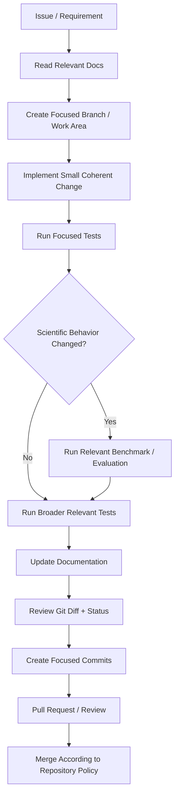
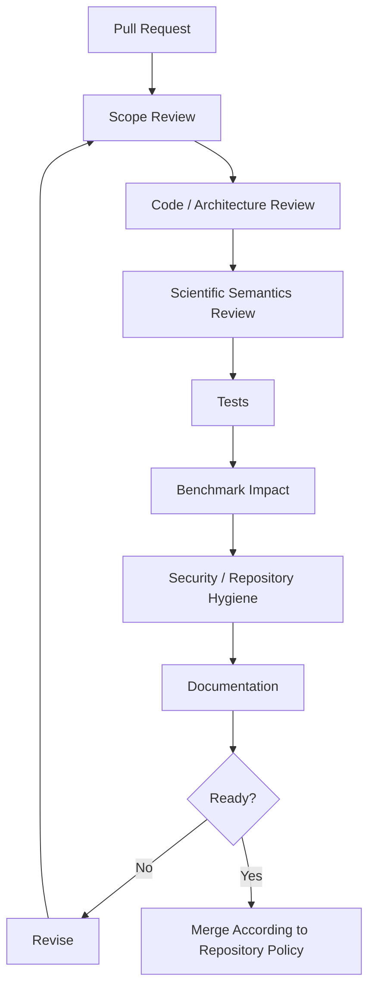
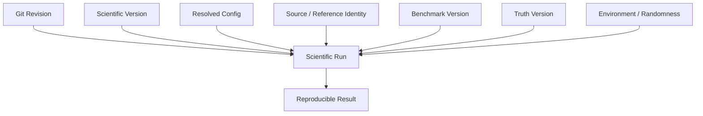
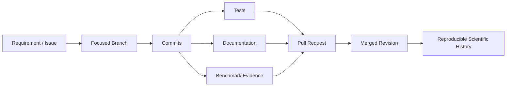
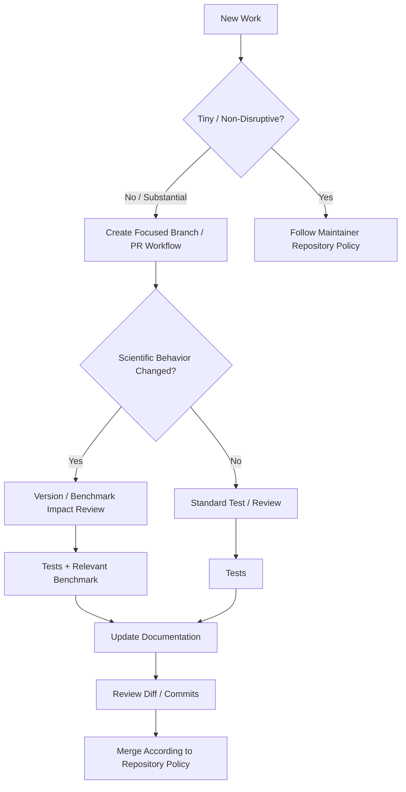

# Git Workflow

ChandraMap uses Git and GitHub to preserve not only source-code history, but also the evolution of scientific methodology, architecture, benchmark contracts, documentation, and reproducibility decisions.

This document is the development-oriented Git and GitHub workflow guide for ChandraMap. It is intended for the maintainer, future contributors, reviewers, and AI coding agents working on scientific code, backend services, APIs, frontend components, datasets, evaluation infrastructure, documentation, and supporting tooling.

> **Git history should explain how ChandraMap evolved, not merely record that files changed.**

> **Keep each branch, commit, and pull request focused on one coherent change whenever practical.**

> **Scientific methodology changes should be distinguishable from code cleanup, documentation updates, and infrastructure changes.**

> **V1 is a historical scientific baseline; Git refactoring must not silently rewrite what V1 means.**

> **Never commit secrets, private credentials, or large scientific data merely because they exist in the local working tree.**

> **A pull request should be reviewable: the reviewer should understand what changed, why, how it was tested, and whether scientific behavior changed.**

> **Documentation, tests, configuration, and benchmark contracts should be updated in the same logical change when their behavior changes.**

> **Do not rewrite shared or public history casually.**

> **Generated results and artifacts should not obscure the source-code change that produced them.**

> **Professional Git history comes from meaningful changes and traceability, not from having many branches or complicated workflows.**

> ChandraMap uses Git not only for source control, but also to preserve the history of scientific, architectural, benchmark, and documentation decisions.

---

## Source of Truth

The actual repository configuration is authoritative.

Before documenting or enforcing an exact Git or GitHub policy, inspect the repository itself, including where applicable:

- GitHub repository settings;
- `.github/` configuration;
- branch rules;
- workflow files;
- contribution documentation;
- repository metadata;
- root configuration files.

This guide intentionally does **not** assume any particular:

- default branch name;
- branch-prefix system;
- GitFlow or trunk-based strategy;
- merge strategy;
- approval count;
- required check;
- CODEOWNERS configuration;
- commit-signing requirement;
- Git LFS configuration;
- Conventional Commits policy;
- semantic-release system;
- tag format;
- release numbering scheme.

When such a policy becomes formally configured, the repository configuration and project governance documents take precedence over generic recommendations in this guide.

---

## Relationship to Other Development Documentation

| Document                                             | Responsibility                                                                              |
| ---------------------------------------------------- | ------------------------------------------------------------------------------------------- |
| [`README.md`](README.md)                             | Development documentation entry point                                                       |
| [`repository-structure.md`](repository-structure.md) | Defines where source, tests, benchmarks, results, artifacts, data, and documentation belong |
| [`local-development.md`](local-development.md)       | Explains how ChandraMap is prepared and run locally                                         |
| [`coding-standards.md`](coding-standards.md)         | Defines code-quality expectations                                                           |
| [`naming-conventions.md`](naming-conventions.md)     | Defines naming conventions                                                                  |
| [`testing.md`](testing.md)                           | Defines testing expectations                                                                |
| [`documentation-guide.md`](documentation-guide.md)   | Defines documentation creation and maintenance                                              |
| [`benchmarking.md`](benchmarking.md)                 | Defines the development-side benchmarking workflow                                          |
| `git-workflow.md`                                    | Defines how development changes move through Git and GitHub safely and traceably            |

This document does not replace [`../../CONTRIBUTING.md`](../../CONTRIBUTING.md). `CONTRIBUTING.md` defines repository-wide contribution expectations; this file focuses on Git mechanics, branch/commit quality, pull-request preparation, repository hygiene, scientific traceability, and history quality.

Security policy belongs to [`../../SECURITY.md`](../../SECURITY.md). Git workflow must support that policy by preventing accidental credential, secret, or sensitive-configuration commits.

AI coding agents should also follow [`../../AGENTS.md`](../../AGENTS.md). AI-generated work is subject to the same branch, commit, testing, documentation, benchmark, security, and review standards as human-authored work.

---

# 1. Workflow Goals

The Git workflow should optimize for:

- clear history;
- focused development;
- reviewability;
- reproducibility;
- scientific-version traceability;
- safe collaboration;
- low unnecessary process overhead;
- security;
- documentation consistency;
- reliable rollback;
- future contributor scalability.

A good workflow should make it possible for a future contributor to answer:

> What changed, why did it change, what scientific behavior was affected, and what evidence supported the change?

---

# 2. Workflow Non-Goals

The workflow should not:

- add bureaucracy without a clear benefit;
- adopt GitFlow merely because it is widely known;
- create a branch for every trivial edit;
- encourage giant pull requests;
- hide scientific changes inside refactoring;
- preserve meaningless commit noise for appearance;
- commit full mission datasets casually;
- make generated artifacts indistinguishable from source changes;
- require fake multi-person processes for a solo-maintained repository;
- introduce complicated branching models before the project needs them.

The simplest workflow that preserves reviewability, scientific traceability, security, and reproducibility is preferable.

---

# 3. High-Level Workflow

The conceptual development flow is:

```text
Issue / Requirement
        ↓
Understand Relevant Documentation
        ↓
Create Focused Work
        ↓
Implement
        ↓
Test
        ↓
Benchmark if Scientific Behavior Changed
        ↓
Update Documentation
        ↓
Review Diff
        ↓
Create Meaningful Commits
        ↓
Pull Request / Review
        ↓
Merge
        ↓
Preserve Traceability
```

An issue is useful when work benefits from explicit tracking, discussion, or planning, but this guide does not require an issue for every small change unless repository policy does.

---

# 4. Git Workflow



---

# 5. Default Branch

Do not assume the repository's default branch is named `main`, `master`, or anything else unless confirmed from the repository.

In this guide, **default branch** means the primary integrated branch configured by the repository.

The default branch should represent the primary repository state according to actual project policy.

---

# 6. Direct Commits to the Default Branch

This guide does not invent a blanket prohibition against direct commits when the repository does not enforce one.

For substantial changes, prefer isolated development work followed by a reviewable integration step because that improves:

- diff review;
- rollback;
- testing;
- documentation review;
- scientific-change visibility;
- CI visibility;
- future collaboration.

For tiny maintainer-only corrections, follow the repository's actual policy.

---

# 7. Branch Philosophy

Use short-lived, focused branches for meaningful development work where practical.

A branch should ideally represent one coherent objective, such as:

- one feature;
- one bug fix;
- one documentation task;
- one scientific change;
- one benchmark-policy change;
- one architecture refactor;
- one research experiment.

Avoid long-lived branches that accumulate unrelated changes.

A branch containing frontend work, API changes, scientific algorithm experiments, dependency upgrades, and documentation rewrites at the same time becomes difficult to test, review, merge, and reproduce.

---

# 8. Branch Names

ChandraMap should not invent an enforced branch-prefix policy unless the repository formally adopts one.

A useful branch name should communicate:

- topic;
- intent;
- scope.

Avoid vague names such as:

- `test`;
- `new`;
- `work`;
- `latest`;
- `update`;
- `final`;
- `final2`;
- names consisting only of a contributor's name.

---

# 9. Illustrative Branch-Name Examples

The following are **illustrative only — not repository-enforced naming**:

```text
feature / sensor-routing
fix / pyramid-coordinate-mapping
docs / benchmarking-guide
research / matcher-comparison
refactor / result-serialization
```

The exact syntax is intentionally not prescribed here.

---

# 10. Branch Scope

One branch should ideally represent one coherent change.

If work begins to include unrelated concerns, consider separating them.

For example, avoid combining all of the following in one branch unless they are genuinely inseparable:

```text
RANSAC behavior change
+
frontend redesign
+
dependency upgrade
+
repository restructure
+
benchmark truth change
```

Focused branches reduce both merge risk and scientific ambiguity.

---

# 11. Short-Lived Branches

Completed branches normally do not need to remain indefinitely once their changes are safely integrated, subject to repository policy.

Git history already preserves merged work.

Avoid using permanent branches named:

```text
old-*
backup-*
final-*
latest-*
```

as an informal backup system.

Git is already the history system.

---

# 12. Long-Lived Scientific-Version Branches

> **ChandraMap scientific versions should not depend solely on long-lived Git branches for their identity.**

V1, V2, V3, and V4 are scientific-methodology concepts.

Their identity should remain reconstructable through:

- version specifications;
- implementation composition;
- configuration;
- benchmark definitions;
- provenance;
- documented outputs;
- repository revisions;
- tags or releases where appropriate.

Do not assume Git branches named `v1`, `v2`, `v3`, or `v4` exist.

---

# 13. Scientific Version Is Not a Git Branch

A scientific version defines methodology.

A Git branch defines a line of development.

These are different.

For example:

```text
Scientific V1
= documented classical baseline methodology

Git branch
= temporary or persistent development history
```

The implementation of V1 may be maintained across many commits and software releases without requiring a permanent `v1` Git branch.

---

# 14. Software Release Is Not a Scientific Version

A software release packages or identifies a software state.

A scientific version identifies an algorithmic/evaluation methodology.

These axes must remain distinct.

See:

- [`../versions/README.md`](../versions/README.md)
- [`../api/versioning.md`](../api/versioning.md)

A software release may contain multiple scientific versions simultaneously.

---

# 15. Working-Tree Hygiene

Before beginning a new task, understand the state of the local repository.

Know:

- which branch or revision is checked out;
- whether tracked files are already modified;
- whether changes belong to another task;
- whether untracked files exist;
- whether generated files are present.

Do not accidentally combine yesterday's unfinished experiment with today's bug fix.

---

# 16. Review Repository State Before Committing

Useful standard Git inspection commands include:

```bash
git status
git diff
git diff --staged
```

These are generic Git commands, not ChandraMap-specific wrappers.

Use them to understand:

- unstaged tracked changes;
- staged changes;
- untracked files;
- the exact content of the intended commit.

---

# 17. Staging

Stage only files intended for the current logical commit.

Do not blindly stage the entire working tree when it may contain:

- unrelated edits;
- credentials;
- generated outputs;
- temporary data;
- local configuration;
- research artifacts.

The staging area is an opportunity for review, not just a step between editing and committing.

---

# 18. Review Before Staging

Pay particular attention to:

- `.env` files;
- local credentials;
- tokens;
- large lunar products;
- generated benchmark results;
- caches;
- logs;
- notebook outputs;
- temporary registration previews;
- IDE metadata;
- local machine paths.

A file existing locally does not mean it belongs in Git.

---

# 19. Atomic and Logical Commits

> **A commit should represent one understandable logical change.**

Atomic does not mean artificially tiny.

A good commit might contain:

```text
bug fix
+
regression test
+
small documentation correction
```

when all three are required to express one coherent correction.

Conversely, splitting a single scientific change into dozens of meaningless micro-commits may make the history harder to understand.

---

# 20. Commit Quality

A good commit should be:

- focused;
- internally coherent;
- understandable;
- reversible where practical;
- free of unrelated changes;
- testable where practical;
- scientifically interpretable when relevant.

A future reader should be able to understand why the commit exists.

---

# 21. Commit-Message Principle

> **A commit message should explain the intent of the change, not merely repeat that files were edited.**

Avoid long-lived commit subjects such as:

```text
update
fix
changes
final
final2
done
new
latest
working
misc
```

These descriptions lose almost all useful historical context.

---

# 22. Commit-Message Format

This document does not require Conventional Commits unless repository policy explicitly adopts them.

A useful commit normally has:

```text
short descriptive subject

optional explanatory body
```

A body is useful when the reason or scientific consequence is not obvious from the subject.

Do not write a long commit body merely to satisfy a format.

---

# 23. Good Commit Subjects

Examples only:

```text
Preserve source-to-reference coordinates during pyramid mapping

Add regression coverage for final transform refit

Document V1 benchmark failure-retention policy

Separate API scientific failure from request validation errors

Reject unavailable checkpoint RMSE instead of defaulting to zero

Preserve IIRS representation lineage in result metadata
```

These communicate intent rather than merely announcing activity.

---

# 24. Poor Commit Subjects

Poor examples include:

```text
Update files
Fix issue
Final changes
Work done
Improve project
New code
Latest version
```

They do not explain:

- what behavior changed;
- what problem was fixed;
- whether science changed;
- whether the commit affects reproducibility.

---

# 25. Commit Bodies

For a non-trivial scientific or architectural change, the commit body may explain:

- why the change was necessary;
- the previous incorrect assumption;
- scientific impact;
- compatibility implications;
- benchmark implications;
- migration context.

An obvious spelling correction or local documentation fix does not need an essay.

---

# 26. Scientific-Change Commits

Changes to any of the following may alter scientific behavior:

- preprocessing;
- sensor routing;
- physical-scale handling;
- feature extraction;
- matching;
- filtering;
- RANSAC;
- transform estimation;
- sub-pixel refinement;
- final refitting;
- registration;
- residual analysis;
- metric definitions;
- evaluation logic;
- pair definitions;
- truth definitions;
- scientific configuration.

Such changes should be easy to recognize from the diff, commit history, and pull request.

---

# 27. Do Not Hide Scientific Changes in Refactoring

> **A refactor should not silently change scientific methodology.**

If behavior changes, call it a behavioral change.

Do not describe a modification such as:

```text
SIFT → learned matcher
```

as merely:

```text
cleanup matching module
```

Likewise, changing transform estimation, refinement ordering, or metric population is not a cosmetic refactor.

---

# 28. Refactor Commits

A behavior-preserving refactor should preserve:

- documented contracts;
- tests;
- result semantics;
- V1 methodology;
- failure behavior.

If supposedly behavior-preserving refactoring materially changes benchmark outputs, investigate before assuming the difference is harmless.

Possible causes include:

- hidden algorithm change;
- changed numerical ordering;
- configuration drift;
- changed data flow;
- incorrect test coverage.

---

# 29. Bug-Fix Commits

A bug-fix commit should identify the intended behavior that was violated.

Scientifically important examples include:

- x/y coordinate swap;
- row/column confusion;
- inverted transform direction;
- pyramid-level coordinate offset;
- stale pre-refinement transform;
- fit/check leakage;
- missing metric converted to zero.

Where practical, the logical change should include a regression test.

See [`testing.md`](testing.md).

---

# 30. Bug Fix vs Methodology Change

These are not equivalent:

| Change                                              | Classification              |
| --------------------------------------------------- | --------------------------- |
| Correct an x/y swap                                 | Bug fix                     |
| Correct inverted source → reference transform       | Bug fix                     |
| Replace SIFT with a learned matcher                 | Methodology/version change  |
| Add global retrieval to a known-overlap baseline    | Methodology/version change  |
| Change benchmark truth definition                   | Benchmark governance change |
| Rename internal variable without changing semantics | Refactor                    |

Do not label all of these simply as `fix`.

---

# 31. V1 Change Control

V1 is the classical historical baseline and requires special care.

Before changing official V1 scientific behavior, review the relevant version documentation:

- [`../versions/v1/specification.md`](../versions/v1/specification.md)
- [`../versions/v1/scope.md`](../versions/v1/scope.md)
- [`../versions/v1/requirements.md`](../versions/v1/requirements.md)
- [`../versions/v1/pipeline.md`](../versions/v1/pipeline.md)
- [`../versions/v1/benchmark.md`](../versions/v1/benchmark.md)

Do not introduce later-version features into V1 merely because they appear more accurate.

---

# 32. Preserve V1 History

> **V1 should remain reproducible after V2/V3/V4 development begins.**

Repository history should make it possible to identify:

- when V1 changed;
- why it changed;
- whether the change was a bug fix;
- whether the scientific specification changed;
- what tests were added;
- whether benchmark comparability changed.

Later development must not erase the reason V1 exists as a baseline.

---

# 33. Later-Version Development

V2, V3, and V4 work should remain clearly identifiable.

Do not overwrite V1's behavior simply because a later method performs differently.

Shared abstractions may evolve, but version-specific semantics must remain protected.

---

# 34. Experimental Commits

Research and experiments may live in appropriate areas such as `research/`, `experiments/`, or `notebooks/` according to repository structure.

Experimental code should not silently migrate into stable V1 implementation.

Promotion into core code should involve appropriate:

- version ownership;
- tests;
- documentation;
- dependency review;
- benchmark evidence where relevant.

---

# 35. Benchmark-Impacting Commits

See [`benchmarking.md`](benchmarking.md).

A commit may affect benchmark comparability if it changes:

- scientific methodology;
- pair definitions;
- ground truth;
- metric definitions;
- benchmark categories;
- scientific configuration;
- failure semantics;
- evaluation populations;
- result fields used by evaluation.

Such impact should be disclosed explicitly.

---

# 36. Benchmark-Definition Changes

Do not hide changes to:

- pair selection;
- truth data;
- metric definitions;
- failure accounting;
- benchmark categories;

inside an unrelated algorithm change.

A benchmark-contract change may require a benchmark-version update according to the authoritative evaluation policy.

Algorithm improvement and benchmark redefinition are different changes.

---

# 37. Benchmark Results in Git

Whether benchmark results belong in Git is repository-policy dependent.

Do not assume every generated benchmark output should be committed.

If selected formal result records are tracked, they should preserve enough provenance to identify what produced them.

If benchmark outputs are external or ignored, follow that policy instead.

---

# 38. Results vs Artifacts

See [`repository-structure.md`](repository-structure.md).

A useful distinction is:

**Result**
Structured scientific outcome.

**Artifact**
Generated file, plot, image, visualization, report, or preview.

A registered preview created during debugging should not automatically become permanent repository content.

Generated artifacts must not obscure the source-code change that produced them.

---

# 39. Large Scientific Data

Chandrayaan-2 and LRO products can be large.

Do not casually commit full products such as:

- OHRC data;
- TMC-2 data;
- IIRS cubes;
- LRO NAC products;
- LRO WAC products;
- DEMs;
- large derived rasters.

Normal Git history is generally a poor storage system for large scientific datasets unless repository policy explicitly defines otherwise.

---

# 40. Raw-Data Principle

> **Raw mission data belongs to the scientific data workflow, not automatically to Git history.**

See:

- [`../datasets/README.md`](../datasets/README.md)
- [`../data-licenses.md`](../data-licenses.md)

Scientific data should remain governed by data provenance, licensing, storage, preparation, and reproducibility rules.

---

# 41. Small Test Fixtures

Small, stable, redistributable fixtures may be appropriate where allowed by the testing and licensing policies.

A small test fixture is different from committing an entire mission product.

See [`testing.md`](testing.md).

---

# 42. Git LFS

Do not assume Git LFS is configured.

If large-file support becomes part of the repository, document the actual configuration and ownership rules at that time.

Until then, avoid describing Git LFS as a ChandraMap requirement.

---

# 43. Generated Files

Generated files should normally stay out of commits unless they are intentionally version-controlled.

Common examples include:

- caches;
- build outputs;
- local logs;
- temporary images;
- virtual environments;
- IDE metadata;
- temporary registered previews;
- transient benchmark output.

Repository policy and [`../../.gitignore`](../../.gitignore) remain authoritative.

---

# 44. `.gitignore`

`.gitignore` helps prevent unwanted local/generated files from appearing in normal Git workflows.

It is **not** a security boundary.

A secret can still be committed if it is:

- explicitly staged;
- already tracked;
- stored in a file not ignored;
- copied into source code.

Always review staged content.

---

# 45. Secrets

Never commit:

- API keys;
- authentication tokens;
- passwords;
- private certificates;
- private keys;
- credentials embedded in URLs;
- real `.env` values;
- service-account credentials;
- local access tokens.

See [`../../SECURITY.md`](../../SECURITY.md).

Secrets should not appear in source files, tests, example files, notebooks, commit messages, or generated artifacts.

---

# 46. `.env.example`

Where [`../../.env.example`](../../.env.example) is used, it should document required environment-variable names or safe placeholders.

It must not contain real credentials.

Conceptually:

```text
SERVICE_TOKEN=<your-token-here>
```

is different from committing a real token value.

---

# 47. If a Secret Is Committed

If a secret enters Git history:

1. treat it as exposed;
2. revoke or rotate the credential promptly;
3. follow the security policy;
4. remove the secret from current tracked files;
5. assess whether repository-history remediation is required;
6. investigate how the secret bypassed normal safeguards.

Deleting only the current file or latest commit does **not** make an exposed credential trustworthy again.

Credential rotation is the primary containment action.

---

# 48. History Rewriting After Secret Exposure

Repository-history cleanup may sometimes be necessary after secret exposure.

However:

> **Credential rotation comes before history cleanup.**

History-remediation procedures should follow the project's security and maintainer process.

Do not improvise destructive repository-wide history rewriting without understanding:

- remote copies;
- forks;
- cached credentials;
- collaborator clones;
- release artifacts;
- CI logs.

---

# 49. Force Pushing

Do not force-push shared, public, or default-branch history casually.

Force-pushing a personal short-lived branch may be reasonable under repository policy after deliberate history cleanup or rebasing.

Remember:

```text
force push
= replace remote branch history
```

Other contributors may already depend on the previous commits.

---

# 50. Rebase vs Merge

This guide does not prescribe one mandatory strategy.

## Rebase

Rebase changes commit ancestry so work appears on top of another base.

It rewrites the rebased commits.

## Merge

Merge combines histories without rewriting existing commits.

Both can be valid.

Use the approach compatible with repository collaboration policy and the state of shared history.

---

# 51. Squashing

Squashing can simplify noisy local development history.

For example:

```text
WIP
fix typo
try again
actually fix
cleanup
```

may not all deserve permanent shared history.

However, meaningful intermediate scientific or architectural commits may be valuable for future investigation.

Do not squash valuable history merely for cosmetic simplicity.

---

# 52. Merge-Strategy Principle

> **The chosen merge strategy should preserve useful history without preserving meaningless noise.**

Repository configuration determines which merge strategies are actually available or required.

---

# 53. Public History

Avoid rewriting commits collaborators already depend on unless the rewrite is explicitly coordinated.

This applies especially to:

- default-branch history;
- shared integration branches;
- published release revisions;
- commits referenced by formal benchmark results.

---

# 54. Conflict Resolution

Conflict resolution is not merely a text-selection task.

Understand why both sides changed before resolving.

Do not blindly accept one side for conflicts involving:

- scientific configuration;
- benchmark definitions;
- metrics;
- schemas;
- pipelines;
- version documentation;
- dataset definitions.

A syntactically successful merge can still be scientifically incorrect.

---

# 55. Scientific Conflict Resolution

For conflicts involving:

- V1 specification;
- benchmark truth;
- metric definitions;
- sensor routing;
- pair definitions;
- scientific configuration;
- transform semantics;

compare both changes against authoritative project documentation.

Resolve scientific intent, not just Git markers.

---

# 56. Lockfiles

Where dependency lockfiles exist, treat them according to repository policy.

Do not:

- discard lockfile changes automatically;
- regenerate unrelated lockfiles without reason;
- hide meaningful dependency resolution changes.

Unexpected lockfile churn can make a small scientific PR much harder to review.

---

# 57. Generated Contract Files

If API schemas, client types, or other contract files are generated, follow their actual generation workflow.

Do not manually edit generated outputs when another file is their source of truth.

This guide does not invent generation commands or tools.

---

# 58. Pull Requests

Pull requests are one of the most useful tools for creating a reviewable scientific-development history.

A good pull request should explain:

- what changed;
- why it changed;
- scope;
- validation performed;
- scientific impact;
- benchmark impact;
- documentation impact;
- known limitations or follow-up work.

---

# 59. Pull-Request Size

Prefer reviewable pull requests.

Avoid combining, unless genuinely inseparable:

```text
architecture rewrite
+
algorithm replacement
+
frontend redesign
+
benchmark-definition change
+
documentation rewrite
+
dependency migration
```

Large mixed changes make both software and scientific review weaker.

---

# 60. One PR, One Coherent Purpose

> **A reviewer should be able to explain the purpose of a pull request in one clear sentence.**

This does not mean a PR can modify only one file.

A coherent scientific fix may legitimately touch:

- implementation;
- tests;
- documentation;
- configuration.

The important property is shared purpose.

---

# 61. PR Titles

Use specific titles.

Prefer:

```text
Preserve V1 transform direction during result serialization
```

over:

```text
Fixes
```

Avoid vague titles such as:

- `Update`;
- `Changes`;
- `Final`;
- `Big update`;
- `Fix stuff`.

Do not assume Conventional Commit syntax unless project policy requires it.

---

# 62. PR Descriptions

Where useful, a pull-request description can cover:

### Summary

What changed?

### Why

Why was the change necessary?

### What Changed

What implementation, configuration, test, or documentation areas changed?

### Tests

What relevant validation was performed?

### Scientific Impact

Can correspondences, transforms, metrics, failures, or results change?

### Benchmark Impact

Does benchmark comparability change?

### Documentation

Which authoritative documentation changed?

### Artifacts

Are screenshots or generated outputs included for review?

This is guidance, not a mandatory template unless repository policy defines one.

---

# 63. Scientific Impact in Pull Requests

A PR changing any of the following should explicitly consider scientific impact:

- preprocessing;
- scale handling;
- feature extraction;
- matching;
- filtering;
- RANSAC;
- transformation model;
- refinement;
- registration;
- sensor handling;
- evaluation.

State whether outputs may change.

Do not hide scientific behavior change behind implementation terminology.

---

# 64. Benchmark Impact in Pull Requests

Where relevant, identify benchmark impact as one of:

- unaffected;
- performance may change;
- benchmark must be rerun;
- benchmark contract changed;
- benchmark not applicable.

Use actual evidence.

Do not claim an improvement simply because a code path changed.

---

# 65. Test Evidence

See [`testing.md`](testing.md).

PR descriptions should state which relevant tests were actually run.

Do not report tests as passing if they were not run.

Do not copy expected CI names from documentation unless those checks really exist.

---

# 66. Benchmark Evidence

If a pull request claims scientific improvement, support the claim using the appropriate benchmark or evaluation process.

A single attractive overlay is not sufficient evidence of:

- improved registration accuracy;
- illumination robustness;
- scale invariance;
- cross-modality performance.

See [`benchmarking.md`](benchmarking.md).

---

# 67. Documentation Impact

See [`documentation-guide.md`](documentation-guide.md).

If implementation changes a documented contract, update the authoritative documentation in the same PR where practical.

Examples include changes to:

- input meaning;
- output meaning;
- pipeline ordering;
- scientific version behavior;
- configuration semantics;
- failure representation;
- API schema.

The merged repository should not knowingly contain code and documentation describing different behavior.

---

# 68. Screenshots

Screenshots are useful for:

- frontend review;
- visualization review;
- UI regressions;
- illustrating generated artifacts.

They are not scientific validation.

A screenshot cannot substitute for controlled numerical evaluation.

---

# 69. Draft Pull Requests

If GitHub draft pull requests are supported and useful in the repository workflow, they can help with:

- early design review;
- architecture discussion;
- work that is not merge-ready.

This guide does not make draft PRs mandatory.

---

# 70. Issue Linking

When an issue or tracked task exists, linking it to the relevant pull request improves traceability.

Do not require every tiny change to have an issue unless repository policy requires it.

---

# 71. Pull-Request Review

Review should consider more than syntax.

Relevant areas include:

- scope;
- correctness;
- scientific semantics;
- tests;
- architecture;
- reproducibility;
- benchmark fairness;
- security;
- repository hygiene;
- documentation.

---

# 72. Scientific Review Questions

For scientifically relevant changes, reviewers should ask:

- Did source/reference direction change?
- Did coordinate-space interpretation change?
- Is x/y vs row/column handling still correct?
- Did scale handling change?
- Did candidate/inlier semantics change?
- Did verify → refine → refit ordering change?
- Did fit/check separation change?
- Did metric meaning change?
- Did failure semantics change?
- Did V1 methodology change?
- Did benchmark comparability change?

These questions should be answered from actual code, tests, documentation, and evidence.

---

# 73. Software Review Questions

Reviewers should also ask:

- Is scope focused?
- Is the change located in the correct layer?
- Are tests sufficient?
- Are names clear?
- Are new dependencies justified?
- Are documentation changes included?
- Are secrets absent?
- Are large data or artifacts absent unless intentional?
- Is unrelated refactoring present?
- Is the history understandable?

---

# 74. Pull-Request Review Flow



---

# 75. CI and GitHub Actions

Where `.github/workflows/` is configured, CI may perform checks such as:

- testing;
- linting;
- building;
- validation;
- other repository-specific checks.

Only actual workflows are authoritative.

Do not invent:

- workflow names;
- required jobs;
- required platforms;
- status-check names.

---

# 76. Local Before Remote

Where practical, run relevant repository-defined local checks before pushing or requesting review.

See:

- [`local-development.md`](local-development.md)
- [`testing.md`](testing.md)

Local checks reduce avoidable CI feedback cycles.

---

# 77. CI Failures

Do not ignore required CI failures without understanding them.

A failure may indicate:

- real regression;
- environment problem;
- flaky test;
- dependency problem;
- outdated workflow;
- unrelated infrastructure failure.

Investigate the cause.

Blindly rerunning CI until it becomes green does not establish correctness.

---

# 78. Full Benchmarks in CI

Do not assume the entire lunar benchmark executes on every pull request.

Full evaluation may require:

- large datasets;
- substantial runtime;
- specific hardware;
- optional scientific dependencies.

See [`benchmarking.md`](benchmarking.md).

Ordinary CI and full scientific benchmarking have different purposes.

---

# 79. Pre-Merge Review

Before merge, verify conceptually:

- only intended files changed;
- no secrets are present;
- no accidental data dump is present;
- no unwanted generated artifacts are present;
- relevant tests were performed;
- benchmark impact is understood;
- documentation is consistent;
- conflicts were resolved correctly;
- PR purpose remains clear.

---

# 80. Pull-Request Merge

Use the merge strategy allowed and preferred by actual repository policy.

Do not assume:

- squash merge;
- rebase merge;
- merge commits;

are mandatory unless configured.

---

# 81. Post-Merge

After integration, where applicable:

- verify the expected default-branch state;
- verify relevant CI state;
- close or update related issues/tasks;
- remove completed short-lived branches according to policy;
- record follow-up tasks instead of hiding known limitations;
- preserve formal benchmark evidence in the appropriate system.

---

# 82. Rollback and Revert

If a merged change is incorrect, prefer a clear corrective action according to Git and repository context.

Do not erase shared history merely to create the appearance that a mistake never happened.

A visible correction is often more informative.

---

# 83. Scientific Reverts

A scientific-methodology revert should preserve useful context such as:

- what changed;
- why it was reverted;
- which test or benchmark revealed the problem;
- whether version or benchmark interpretation changed.

This is valuable research history.

---

# 84. Revert vs Forward Fix

A revert restores previous behavior.

A forward fix corrects the new implementation.

Neither is universally correct.

Choose according to:

- severity;
- confidence;
- release state;
- repository policy;
- ability to test the correction.

---

# 85. Tags

Git tags can identify important repository revisions.

This guide does not invent a tag format.

Do not assume tags use:

```text
v1.0.0
```

or that scientific versions map directly to tags.

---

# 86. Scientific Version vs Tag

> **A scientific version can span multiple software commits or releases; a Git tag identifies a specific repository revision.**

Scientific version and repository revision are related provenance dimensions, not interchangeable identifiers.

---

# 87. Releases

Software or GitHub releases describe packaged software states where the project uses them.

They remain distinct from scientific V1–V4.

See:

- [`../../CHANGELOG.md`](../../CHANGELOG.md)
- [`../../ROADMAP.md`](../../ROADMAP.md)

---

# 88. Semantic Versioning

Do not claim ChandraMap follows Semantic Versioning unless repository policy explicitly establishes it.

If semantic versioning is adopted later, document how software release numbers relate to scientific versions.

They should not be treated as the same axis automatically.

---

# 89. Changelog

[`../../CHANGELOG.md`](../../CHANGELOG.md) summarizes meaningful project changes.

Git history records detailed implementation history.

They should not be identical.

A changelog should not become a dump of every commit.

---

# 90. Roadmap

[`../../ROADMAP.md`](../../ROADMAP.md) describes future direction.

Branches and pull requests represent active development work.

Do not create permanent roadmap branches simply because a roadmap item exists.

---

# 91. Forks

External contributors may use forks depending on repository permissions and GitHub access.

This guide does not assume all contributors must use forks.

---

# 92. Internal Branches vs Forks

Both internal branches and forks can support pull-request collaboration.

Use the mechanism appropriate to contributor permissions.

The scientific and review standards should remain the same either way.

---

# 93. Solo-Maintainer Workflow

ChandraMap may be developed primarily by one maintainer.

That does not make Git discipline unnecessary.

A lightweight professional workflow can still use:

- focused branches for substantial work;
- meaningful commits;
- self-review;
- tests before integration;
- benchmark evaluation for scientific changes;
- documentation updates;
- pull requests where they improve reviewability or traceability.

Do not create fake approval requirements solely to imitate a large organization.

---

# 94. Self-Review

> **Solo development still benefits from reviewing your own diff as if you were reviewing another contributor's pull request.**

Before merging substantial work, inspect:

- unintended files;
- debug code;
- temporary logging;
- credentials;
- generated outputs;
- scientific behavior;
- tests;
- documentation;
- benchmark implications.

Self-review frequently catches issues that were invisible during implementation.

---

# 95. Future Contributors

The workflow should scale naturally when additional contributors join.

Avoid solo-only habits such as:

- unexplained commits;
- destructive shared-history rewrites;
- undocumented local setup;
- scientific decisions existing only in memory;
- large unexplained data files.

Today's history becomes tomorrow's collaboration interface.

---

# 96. Research Branches

Research branches can support experimental development.

They should remain clearly experimental until their behavior is promoted into a documented scientific version or stable subsystem.

Experimental assumptions should not enter the baseline accidentally.

---

# 97. Experiment History

Not every experiment belongs permanently in core source history.

A useful experiment may result in:

- documented research findings;
- reusable implementation;
- a later scientific version;
- a rejected hypothesis.

Failed experiments can still be scientifically useful, but their appropriate home may be experiment records rather than production code.

---

# 98. Notebook Commits

If notebooks are committed, minimize unnecessary output noise where repository conventions support it.

Large execution-output changes can obscure the code or analysis that actually changed.

Do not invent notebook-cleaning tools or mandatory notebook policies unless the repository defines them.

---

# 99. Binary Files

Binary files are difficult to diff and review.

Avoid committing large or generated binaries unless intentionally version-controlled.

Examples include:

- large imagery;
- raster outputs;
- model files;
- archives;
- generated videos;
- large plots.

---

# 100. Artifact Review

When a small artifact is intentionally committed, its purpose should be clear.

A reviewer should understand:

- why it belongs in Git;
- what generated it;
- whether it is authoritative;
- whether it is replaceable.

---

# 101. Data Licensing

See [`../data-licenses.md`](../data-licenses.md).

Do not commit mission-derived products until redistribution and attribution requirements are understood.

Availability from a public archive does not automatically mean unrestricted redistribution through a source repository.

---

# 102. Third-Party Code

Do not copy external source code into ChandraMap without understanding:

- license compatibility;
- attribution requirements;
- project need;
- maintenance implications.

Use dependencies according to repository policy when appropriate.

---

# 103. Dependency Changes

Dependency changes should be intentional.

A meaningful pull request should explain why a dependency is:

- added;
- removed;
- upgraded;
- replaced.

Dependencies affect:

- reproducibility;
- security;
- environment size;
- compatibility;
- maintenance burden.

---

# 104. Optional Research Dependencies

Do not make optional research technologies such as:

- LightGlue;
- LoFTR;
- FAISS;
- future learned models;

mandatory dependencies of classical V1 merely because an experiment uses them.

Version architecture should determine dependency ownership.

---

# 105. Lockfile Noise

Avoid unrelated dependency or lockfile churn inside scientific algorithm changes.

Unrelated dependency noise makes it harder to determine what actually influenced scientific behavior.

---

# 106. Formatting-Only Changes

Large formatting changes can hide behavioral modifications.

Where practical, separate mass formatting from:

- algorithm changes;
- geometry fixes;
- metric changes;
- scientific configuration changes.

---

# 107. File Moves

When moving many files, avoid mixing extensive path reorganization with extensive behavior changes when they can be separated.

This improves:

- review;
- Git history;
- blame usefulness;
- regression diagnosis.

---

# 108. Repository Restructure

See [`repository-structure.md`](repository-structure.md).

Large repository-structure changes should explain:

- architectural reason;
- path changes;
- import implications;
- build implications;
- CI implications;
- documentation-link updates;
- benchmark/result-path implications.

---

# 109. Documentation-Only Changes

Documentation-only changes still require review for:

- scientific correctness;
- broken links;
- source-of-truth duplication;
- unsupported claims;
- implementation-status accuracy.

Documentation is part of the scientific interface of the project.

---

# 110. Test-Only Changes

Test-only changes should explain what contract or regression they protect.

Do not weaken tests merely because the current implementation fails them.

First determine whether the implementation or test contradicts the documented contract.

See [`testing.md`](testing.md).

---

# 111. Benchmark-Only Changes

Benchmark-definition changes can alter historical comparability even without changing implementation code.

Review changes to:

- pairs;
- categories;
- truth;
- metric definitions;
- failure accounting;
- success classification;

as scientific governance changes.

---

# 112. Configuration-Only Changes

A scientific configuration change can alter outputs without changing source code.

Therefore:

> **Configuration-only does not necessarily mean behavior-neutral.**

Treat scientifically meaningful configuration changes as scientific changes where appropriate.

---

# 113. API Schema Changes

See:

- [`../api/schemas.md`](../api/schemas.md)
- [`../api/versioning.md`](../api/versioning.md)

API changes can affect compatibility even if the scientific core remains unchanged.

History should make schema and compatibility impact clear.

---

# 114. Result-Schema Changes

Changing the meaning of a result field can break historical reproducibility.

Do not silently reinterpret existing fields.

Changes involving:

- coordinate spaces;
- units;
- transform direction;
- metric population;
- failure status;
- version identity;

require particular care.

---

# 115. Committing Formal Benchmark Results

If repository policy tracks formal benchmark outputs, preserve enough context to identify the generating state.

Relevant provenance may include:

- Git revision;
- scientific version;
- benchmark version;
- configuration;
- data identity;
- truth identity.

Avoid anonymous formal files such as:

```text
results.csv
```

with no provenance or context.

---

# 116. Provenance and Git

Git revision is an important part of scientific provenance.

It is not the whole provenance record.

A reproducible scientific result may also require:

- source identity;
- reference identity;
- pair version;
- resolved configuration;
- scientific version;
- benchmark version;
- truth version;
- environment;
- randomness context.

---

# 117. Reproducibility Model



---

# 118. Commit Hash as Provenance

A Git commit hash can identify the code state.

It cannot by itself identify:

- data;
- config;
- environment;
- random seed/state;
- benchmark definition;
- truth version.

> **Git revision is one provenance field, not a complete reproducibility record.**

---

# 119. Dirty Working Trees

Formal results produced from uncommitted modifications can be harder to reproduce because the commit hash does not fully describe executed code.

Where project tooling records working-tree state, preserve that information.

This guide does not claim such tooling currently exists.

---

# 120. Benchmarking From Uncommitted Code

Exploratory development runs may legitimately use uncommitted code.

Formal scientific claims should ideally map to an identifiable code state.

That may mean creating a meaningful commit before producing a formal benchmark record.

---

# 121. Cherry-Picking

Cherry-picking can be useful for transferring a focused commit between development lines.

Use it deliberately.

Do not use cherry-picking as a substitute for clear scientific-version architecture.

---

# 122. Stashing

Git stash can be useful for temporary local context switching.

Do not treat long-lived unnamed stashes as the only copy of valuable research work.

Important work deserves an identifiable branch, commit, or research record.

---

# 123. Destructive Git Commands

Commands involving:

- hard reset;
- repository cleaning;
- aggressive history rewriting;

can destroy uncommitted or untracked work.

Scientific repositories require extra care because untracked files may include costly downloaded or generated data.

Always understand what a destructive command will affect before running it.

---

# 124. Do Not Clean Raw Data Blindly

Do not perform broad Git cleanup without checking whether valuable untracked scientific data exists locally.

A file being untracked does not mean it is disposable.

It may be:

- mission data;
- locally prepared imagery;
- long-running experiment output;
- manually created control points.

Repository cleanup and scientific-data lifecycle are different concerns.

---

# 125. Git Hooks

If the repository later uses pre-commit or other Git hooks, document the actual configuration and behavior.

Do not invent hook requirements.

---

# 126. Commit Signing

If signed commits or tags become required, document the real policy.

Until then, this guide does not claim signing is mandatory.

---

# 127. CODEOWNERS

If CODEOWNERS is configured, its actual repository contents determine ownership/review behavior.

Do not infer owners or required reviews when none are configured.

---

# 128. Branch Protection

If branch-protection or repository rules are configured, those settings become part of the workflow.

Possible rules may concern:

- direct pushes;
- reviews;
- required checks;
- history behavior.

Only the actual GitHub configuration is authoritative.

---

# 129. Required Checks

Do not invent CI check names.

Required checks, if any, come from GitHub configuration and repository workflows.

---

# 130. Release Branches

Do not create or recommend permanent release branches merely because enterprise projects often use them.

A research project may not need that overhead.

Adopt them only if project scale and release policy justify them.

---

# 131. Hotfix Branches

The same principle applies to dedicated hotfix branch structures.

Do not copy GitFlow terminology into ChandraMap without a real need.

---

# 132. Named Branch-Model Caution

> **Do not adopt GitFlow, trunk-based development, or another named branch model merely for appearance; use the simplest workflow that preserves clarity, reviewability, and reproducibility.**

Professional repository design is based on useful guarantees, not fashionable terminology.

---

# 133. Issue → Branch → PR Traceability

Where issues or tasks exist, linking them to development work can improve history:

```text
Issue / Requirement
        ↓
Branch
        ↓
Commits
        ↓
Pull Request
        ↓
Merged Revision
```

Do not require issue numbers in branch names unless repository policy defines such a rule.

---

# 134. Scientific-Change Traceability

For important scientific changes, repository history should allow a future maintainer to discover:

- motivation;
- specification;
- implementation;
- tests;
- benchmark evidence;
- documentation.

The scientific decision should not exist only in a chat, review comment, or developer memory.

---

# 135. Traceability Flow



---

# 136. Commit Order

Early local development does not require perfectly curated commit history.

Developers may need iterative commits while discovering the correct implementation.

Before review or merge, history may be cleaned according to repository policy when doing so materially improves understanding.

---

# 137. WIP Commits

Temporary work-in-progress commits can be useful during local development.

They do not automatically need to survive in final shared history.

Preserve them when they capture meaningful development steps; clean them when they are only local implementation noise.

---

# 138. History Cleanup

History cleanup should improve clarity without hiding meaningful scientific decisions.

Do not rewrite a sequence in a way that makes a methodology change look like an unrelated refactor.

---

# 139. Blame-Friendly Changes

Avoid unnecessary full-file rewrites.

Large meaningless whitespace or formatting churn makes future `git blame` and history investigation harder.

This matters when trying to determine when scientific semantics changed.

---

# 140. Generated Formatting Changes

Avoid combining mass auto-formatting with scientific behavior changes where practical.

Reviewers should be able to distinguish substantive code changes from mechanical formatting.

---

# 141. Documentation With Code

When implementation changes documented behavior, update documentation in the same logical pull request where practical.

The exact commit arrangement may vary.

The merged repository should remain internally consistent.

---

# 142. Tests With Bug Fixes

Where practical, regression coverage should accompany the bug fix that motivated it.

This creates a strong historical explanation:

```text
bug
→ regression test
→ correction
```

---

# 143. Benchmark Evidence Location

Do not place massive benchmark outputs directly into commit messages.

Use the project's appropriate:

- structured result records;
- pull-request summaries;
- linked artifacts;
- benchmark documentation.

Commit messages should remain readable.

---

# 144. PR Descriptions as Context

Commit history should remain useful independently.

PR descriptions can preserve broader information such as:

- motivation;
- architecture discussion;
- test evidence;
- benchmark evidence;
- trade-offs;
- limitations.

Both serve useful but different historical roles.

---

# 145. Review Comments

Important review conclusions affecting scientific design should become durable project state where appropriate.

Prefer capturing significant decisions in:

- code;
- tests;
- documentation;
- ADRs;
- specifications;

rather than leaving the only explanation in a review thread.

---

# 146. Merging Experiments Into Core

Before experimental code enters stable/core implementation, confirm:

- scientific-version ownership;
- architecture fit;
- tests;
- dependency impact;
- benchmark evidence where relevant;
- documentation;
- failure behavior;
- reproducibility implications.

An experiment becoming stable code is a design decision.

---

# 147. Abandoned Experiments

Do not merge every failed experiment into the production core merely to preserve it.

Useful failed experiments may be documented in:

- research notes;
- experiment records;
- benchmark reports;
- dedicated research directories.

Preserve evidence where it has scientific value without polluting stable implementation.

---

# 148. Scientific Language in Commit Messages

Prefer specific scientific language.

For example:

```text
Refit final affine transform after inlier refinement
```

is substantially better than:

```text
Improve matching
```

Specific terminology improves both reproducibility and future debugging.

---

# 149. Avoid Unsupported Performance Claims

Do not use commit subjects such as:

```text
Improve accuracy
Make matching robust
Fix illumination invariance
```

unless evidence actually supports those claims.

Prefer describing what changed:

```text
Add gradient representation to illumination experiment
```

Performance claims belong with measured evidence.

---

# 150. Changelog Impact

See [`../../CHANGELOG.md`](../../CHANGELOG.md).

A merged change may require changelog documentation according to project policy.

Do not assume every small commit needs a changelog entry.

---

# 151. Citation and Release Impact

Material scientific methodology changes may require considering updates to:

- scientific version documentation;
- release notes;
- citation metadata;
- benchmark documentation.

Do not automatically modify [`../../CITATION.cff`](../../CITATION.cff) for ordinary commits.

---

# 152. Git Workflow Decision Flow



---

# 153. Branch / Commit / PR Responsibilities

| Git Concept        | Responsibility                                                  |
| ------------------ | --------------------------------------------------------------- |
| Branch             | Isolate coherent work                                           |
| Commit             | Record one logical change                                       |
| Pull Request       | Review and integrate a coherent change                          |
| Tag                | Identify a specific repository revision where policy uses tags  |
| Release            | Package or communicate a software state where releases are used |
| Scientific Version | Define benchmarkable scientific methodology                     |
| Benchmark Version  | Define a controlled evaluation contract                         |

---

# 154. Change-Type Review Table

| Change Type                 | Git / Review Consideration                                      |
| --------------------------- | --------------------------------------------------------------- |
| Documentation-only          | Check links, claims, implementation status, and source of truth |
| Bug fix                     | Add regression test where practical                             |
| Refactor                    | Demonstrate intended behavior remains preserved                 |
| Scientific algorithm change | Identify scientific-version and benchmark impact                |
| Benchmark definition change | Review historical comparability and benchmark versioning        |
| Configuration change        | Treat scientific configuration as behavior where applicable     |
| API schema change           | Review compatibility and API-version implications               |
| Dependency change           | Review need, reproducibility, compatibility, and security       |
| Repository restructure      | Separate from unrelated behavior where practical                |
| Research experiment         | Keep isolated until promotion criteria are met                  |

---

# 155. Pre-Commit Checklist

## Scope

- [ ] Current change has one coherent purpose
- [ ] Unrelated local changes are excluded
- [ ] Scientific/version scope is understood
- [ ] Benchmark impact is understood

## Working Tree

- [ ] `git status` or equivalent state review has been performed
- [ ] Diff has been reviewed
- [ ] Staged diff contains intended files only
- [ ] No temporary/debug files are included

## Security

- [ ] No secrets are staged
- [ ] No real `.env` values are staged
- [ ] No private credentials or tokens are present
- [ ] No private machine paths are exposed unnecessarily

## Data / Artifacts

- [ ] No accidental mission-data products are staged
- [ ] No large generated artifacts are staged unintentionally
- [ ] No caches or build output are staged unnecessarily
- [ ] Data-license implications are understood

## Code / Science

- [ ] Scientific semantics are correct
- [ ] V1 behavior is not silently changed
- [ ] Candidate/inlier terminology remains correct
- [ ] Coordinate and transform semantics remain correct
- [ ] Fit/check separation remains correct
- [ ] Missing metrics are not fabricated

## Testing

- [ ] Focused relevant tests were run
- [ ] Regression test was added for a bug fix where practical
- [ ] Broader tests were run as appropriate
- [ ] Relevant benchmark was run if scientific performance changed

## Documentation

- [ ] Relevant documentation was updated
- [ ] Links remain valid
- [ ] Implementation status is not overstated
- [ ] CHANGELOG impact was considered where applicable

## Commit

- [ ] Commit subject explains intent
- [ ] Commit avoids vague terms such as `update` or `final`
- [ ] Commit is understandable independently
- [ ] Commit does not mix unrelated refactoring

---

# 156. Pull-Request Checklist

## Scope / Intent

- [ ] PR has one coherent purpose
- [ ] Title is descriptive
- [ ] Description explains why the change exists
- [ ] Unrelated changes are absent

## Validation

- [ ] Relevant tests are documented
- [ ] CI state is reviewed where configured
- [ ] Scientific benchmark evidence is included where applicable
- [ ] Failures and limitations are disclosed

## Scientific Integrity

- [ ] Scientific-version impact is stated
- [ ] Benchmark impact is stated
- [ ] V1 remains historically interpretable
- [ ] Truth, metric, and configuration changes are explicitly disclosed

## Repository Hygiene

- [ ] No secrets are present
- [ ] No accidental large data is present
- [ ] No unnecessary generated artifacts are present
- [ ] Dependency and lockfile changes are intentional

## Documentation

- [ ] Documentation reflects changed contracts
- [ ] Related documentation links are valid
- [ ] Planned behavior is not described as already implemented

## Reviewability

- [ ] Diff is reasonably focused
- [ ] Large formatting churn is avoided
- [ ] File moves are understandable
- [ ] Commit history is useful according to repository policy

---

# 157. Git Anti-Patterns

Do **not**:

- use vague commits such as `update`, `fix2`, or `final`;
- combine unrelated work in one giant commit;
- combine unrelated work in one giant pull request;
- perform all substantial development directly in one undifferentiated branch with no isolation;
- assume GitFlow is automatically professional;
- create permanent `final`, `backup`, `old`, or `latest` branches;
- equate scientific V1 with a Git branch;
- equate software version/tag with scientific version;
- hide methodology changes inside refactoring;
- hide benchmark-definition changes inside algorithm PRs;
- erase V1 semantics while developing V2/V3/V4;
- commit secrets;
- commit real `.env` files;
- rely on `.gitignore` as a security mechanism;
- commit full mission datasets casually;
- commit caches or temporary build outputs;
- commit large generated previews without a reason;
- commit benchmark results without provenance;
- force-push shared history casually;
- resolve scientific configuration conflicts blindly;
- discard lockfile changes without understanding them;
- regenerate unrelated lockfiles;
- combine mass formatting with scientific algorithm changes unnecessarily;
- weaken tests merely to merge;
- cherry-pick experimental behavior into V1 without version review;
- use screenshots as scientific benchmark evidence;
- invent required CI checks;
- invent branch naming rules;
- invent merge strategy;
- invent tag or release policy.

---

# 158. Claims to Avoid

Do not claim without repository evidence:

- “The default branch is `main`.”
- “Direct pushes are forbidden.”
- “All work must use `feature/*` branches.”
- “ChandraMap uses GitFlow.”
- “ChandraMap uses trunk-based development.”
- “Conventional Commits are required.”
- “Every PR requires two approvals.”
- “Every commit must be signed.”
- “Squash merge is required.”
- “Rebase merge is required.”
- “Merge commits are required.”
- “Git LFS is configured.”
- “Merged branches are automatically deleted.”
- “All pull requests run the complete lunar benchmark.”
- “CI must pass jobs named X/Y/Z.”
- “Semantic Versioning is used.”
- “Releases use `vX.Y.Z`.”
- “V1 lives on branch `v1`.”
- “V2 lives on branch `v2`.”
- “CODEOWNERS is configured.”
- “DCO or CLA acceptance is required.”

Repository configuration determines these facts.

---

# 159. Workflow Limitations

The Git workflow may evolve as ChandraMap matures.

Potential areas of change include:

- collaboration policy;
- branch protection;
- merge strategy;
- required CI;
- release and tag strategy;
- benchmark storage;
- large-data management;
- contributor permission models;
- scientific-version governance.

A workflow appropriate for a solo research project today may need stronger automation or review requirements later.

---

# 160. When the Workflow Should Evolve

More formal Git/GitHub policy may become useful when:

- contributor count increases;
- release cadence increases;
- branch protection is introduced;
- multiple maintainers review scientific changes;
- automated releases are introduced;
- API compatibility becomes externally important;
- benchmark governance becomes more formal;
- formal research releases require stronger provenance.

Do not add process complexity merely for appearance.

---

# 161. Professional Solo Workflow

> **Working alone is not a reason to use disposable Git history; clean commits and self-review make future debugging, portfolio review, and scientific reproducibility easier.**

A professional solo workflow remains lightweight while preserving the information that future maintainers—including the same maintainer months later—will need.

---

# 162. Professional Repository Principle

> **A professional GitHub repository is one where a future contributor can understand why a change happened, reproduce relevant behavior, and safely build on it.**

Git history is part of the project's technical documentation.

---

# 163. Maintaining This Guide

Update this document when repository policy materially changes, including:

- branch policy;
- merge strategy;
- branch protection;
- required CI checks;
- commit-message policy;
- pull-request policy;
- release/tag strategy;
- large-data policy;
- Git LFS adoption;
- commit/tag signing requirements;
- CODEOWNERS behavior;
- review rules.

Do not change the project workflow merely to reflect one contributor's personal Git preference.

---

# 164. Related Development Documentation

- [`README.md`](README.md)
- [`repository-structure.md`](repository-structure.md)
- [`local-development.md`](local-development.md)
- [`coding-standards.md`](coding-standards.md)
- [`naming-conventions.md`](naming-conventions.md)
- [`testing.md`](testing.md)
- [`documentation-guide.md`](documentation-guide.md)
- [`benchmarking.md`](benchmarking.md)

---

# 165. Related Project Documentation

- [`../project/goals.md`](../project/goals.md)
- [`../project/non-goals.md`](../project/non-goals.md)
- [`../project/v1-scope.md`](../project/v1-scope.md)
- [`../project/terminology.md`](../project/terminology.md)
- [`../project/assumptions.md`](../project/assumptions.md)
- [`../project/limitations.md`](../project/limitations.md)

---

# 166. Related Architecture Documentation

- [`../architecture/system-overview.md`](../architecture/system-overview.md)
- [`../architecture/v1-pipeline.md`](../architecture/v1-pipeline.md)
- [`../architecture/core-engine-architecture.md`](../architecture/core-engine-architecture.md)
- [`../architecture/backend-architecture.md`](../architecture/backend-architecture.md)
- [`../architecture/frontend-architecture.md`](../architecture/frontend-architecture.md)
- [`../architecture/module-map.md`](../architecture/module-map.md)
- [`../architecture/data-flow.md`](../architecture/data-flow.md)
- [`../architecture/output-flow.md`](../architecture/output-flow.md)

---

# 167. Related Version Documentation

- [`../versions/README.md`](../versions/README.md)
- [`../versions/v1/README.md`](../versions/v1/README.md)
- [`../versions/v1/specification.md`](../versions/v1/specification.md)
- [`../versions/v1/scope.md`](../versions/v1/scope.md)
- [`../versions/v1/requirements.md`](../versions/v1/requirements.md)
- [`../versions/v1/architecture.md`](../versions/v1/architecture.md)
- [`../versions/v1/pipeline.md`](../versions/v1/pipeline.md)
- [`../versions/v1/inputs.md`](../versions/v1/inputs.md)
- [`../versions/v1/outputs.md`](../versions/v1/outputs.md)
- [`../versions/v1/benchmark.md`](../versions/v1/benchmark.md)
- [`../versions/v1/acceptance-criteria.md`](../versions/v1/acceptance-criteria.md)
- [`../versions/v1/exclusions.md`](../versions/v1/exclusions.md)
- [`../versions/v1/limitations.md`](../versions/v1/limitations.md)

---

# 168. Related Dataset Documentation

- [`../datasets/README.md`](../datasets/README.md)
- [`../datasets/dataset-structure.md`](../datasets/dataset-structure.md)
- [`../datasets/dataset-preparation.md`](../datasets/dataset-preparation.md)
- [`../datasets/pair-definition.md`](../datasets/pair-definition.md)
- [`../datasets/ground-truth-preparation.md`](../datasets/ground-truth-preparation.md)
- [`../data-licenses.md`](../data-licenses.md)

---

# 169. Related Evaluation Documentation

- [`../evaluation/README.md`](../evaluation/README.md)
- [`../evaluation/benchmark-protocol.md`](../evaluation/benchmark-protocol.md)
- [`../evaluation/metrics.md`](../evaluation/metrics.md)
- [`../evaluation/checkpoint-evaluation.md`](../evaluation/checkpoint-evaluation.md)
- [`../evaluation/failure-cases.md`](../evaluation/failure-cases.md)
- [`../evaluation/reproducibility.md`](../evaluation/reproducibility.md)

---

# 170. Related API Documentation

- [`../api/README.md`](../api/README.md)
- [`../api/overview.md`](../api/overview.md)
- [`../api/schemas.md`](../api/schemas.md)
- [`../api/versioning.md`](../api/versioning.md)

---

# 171. Root Repository Documentation

Relevant root-level repository documentation and configuration include:

- [`../../README.md`](../../README.md)
- [`../../CONTRIBUTING.md`](../../CONTRIBUTING.md)
- [`../../CODE_OF_CONDUCT.md`](../../CODE_OF_CONDUCT.md)
- [`../../SECURITY.md`](../../SECURITY.md)
- [`../../ROADMAP.md`](../../ROADMAP.md)
- [`../../CHANGELOG.md`](../../CHANGELOG.md)
- [`../../LICENSE`](../../LICENSE)
- [`../../CITATION.cff`](../../CITATION.cff)
- [`../../AGENTS.md`](../../AGENTS.md)
- [`../../.gitignore`](../../.gitignore)
- [`../../.gitattributes`](../../.gitattributes)
- [`../../.env.example`](../../.env.example)

---

# Git Workflow Summary

A sustainable ChandraMap Git workflow follows a simple principle:

```text
Understand the change
        ↓
Isolate it
        ↓
Implement it
        ↓
Test it
        ↓
Benchmark it when science changes
        ↓
Document it
        ↓
Review the diff
        ↓
Record meaningful commits
        ↓
Review through GitHub where appropriate
        ↓
Merge according to repository policy
        ↓
Preserve provenance
```

The core rules are:

1. Git history should preserve intent.
2. Branches and pull requests should have coherent scope.
3. Commit messages should communicate meaning.
4. Scientific changes must be visible as scientific changes.
5. V1 must remain historically reproducible.
6. Scientific versions are not Git branches.
7. Scientific versions are not software release numbers.
8. Tests should accompany implementation changes.
9. Scientific behavior changes may require benchmark evidence.
10. Documentation should change with the contracts it describes.
11. Secrets must never enter normal Git history.
12. `.gitignore` is not a security mechanism.
13. Large mission products do not automatically belong in Git.
14. Source, structured results, and generated artifacts have different lifecycles.
15. Shared history should not be rewritten casually.
16. Scientific merge conflicts require semantic understanding.
17. Merge strategy comes from repository policy.
18. Required CI checks come from actual GitHub configuration.
19. Git revision is only one part of scientific reproducibility.
20. Workflow complexity should remain proportional to the project's actual needs.
