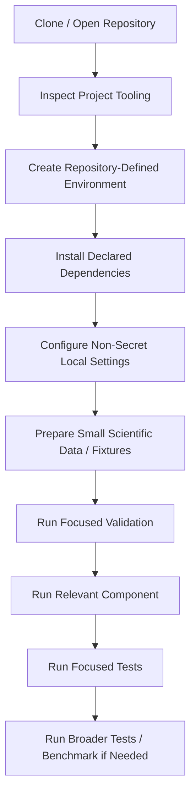
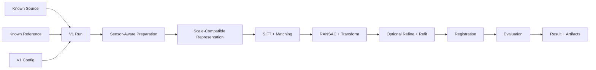
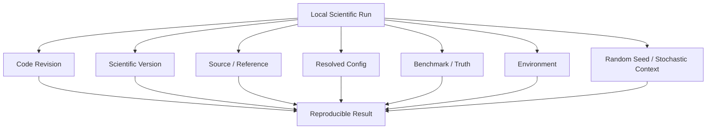
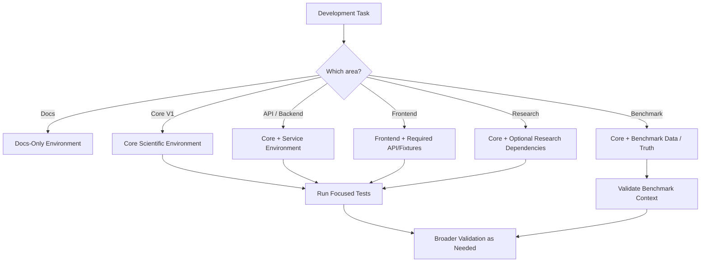

# Local Development

This document is the authoritative guide for preparing and operating a local development environment for ChandraMap.

It is intended to help contributors move from a fresh working tree to a minimal, safe, reproducible environment for documentation, core scientific development, API/backend work, frontend work, testing, evaluation, and research experiments.

ChandraMap is scientific software for lunar image correspondence and registration. Local development must therefore protect both software correctness and scientific correctness.

> **Primary principle:** Start with the smallest local environment needed for the task and add optional components only when the work actually requires them.

> **Source-of-truth principle:** Repository configuration files—not guessed commands—define the local development environment.

> **Command rule:** Every project-specific command in this guide must come from the repository's actual tooling or be clearly identified as a generic example that must be replaced with the repository-defined command.

> **Scientific isolation principle:** A local development setup should allow the same scientific behavior to be tested without depending on the frontend, API, or production infrastructure.

> **Reproducibility principle:** Local convenience must not silently change scientific configuration or benchmark conditions.

> **Data principle:** Raw mission data, derived data, source code, results, and artifacts have different lifecycles and should remain distinguishable locally.

> **Validation principle:** Test first with the smallest relevant input before running large lunar datasets or complete benchmarks.

> **Scientific evidence principle:** A successful local preview is not proof that scientific registration is correct.

> **Provenance principle:** A meaningful local scientific result should make it possible to identify which code, data, configuration, and scientific version produced it.

This guide complements:

- [`README.md`](README.md) — development-documentation entry point.
- [`repository-structure.md`](repository-structure.md) — explains where repository responsibilities belong.
- `local-development.md` — explains how to prepare and operate the local environment.
- [`../../CONTRIBUTING.md`](../../CONTRIBUTING.md) — project-wide contribution and collaboration policy.

Do not use this document as a substitute for architecture, version specifications, benchmark definitions, API contracts, or contribution policy.

---

## 1. Who This Guide Is For

This guide is relevant to:

| Contributor                    | Typical Local Need                                                                     |
| ------------------------------ | -------------------------------------------------------------------------------------- |
| Core scientific developer      | Registration package, configuration, small lunar fixtures, focused tests               |
| Research engineer              | Core environment plus experiment-specific dependencies                                 |
| Benchmark/evaluation developer | Core environment, controlled benchmark data, truth/check points, evaluation tooling    |
| Backend/API developer          | Core package plus the implemented service/API environment                              |
| Frontend developer             | Frontend tooling plus whichever API or fixtures the repository defines                 |
| Documentation contributor      | Documentation files and only the validation tooling required for docs                  |
| QA/test developer              | Relevant runtime plus focused testing and regression tooling                           |
| AI coding agent                | Repository instructions, local source of truth, focused context, and verified commands |
| New contributor                | Minimal profile required for the first assigned task                                   |

Not every contributor needs every subsystem running.

A documentation change should not require a scientific benchmark environment. A V1 algorithm change should not automatically require the frontend. Frontend work should not automatically require complete mission datasets. Optional research models should not become universal dependencies merely because they exist elsewhere in the repository.

---

## 2. Local Development Profiles

The profiles below describe useful ways to think about local setup. They are conceptual profiles, not necessarily package extras or installer targets.

| Profile                        | Typical Need                                                               | Usually Avoid                                        |
| ------------------------------ | -------------------------------------------------------------------------- | ---------------------------------------------------- |
| Documentation-only             | Markdown/docs editing and applicable validation                            | Mission data, ML models, full backend/frontend stack |
| Core V1 scientific development | Core scientific package, V1 configuration, small controlled fixtures       | Later-version research dependencies                  |
| Benchmark development          | Core package, benchmark definitions, test pairs, truth/check data, metrics | Uncontrolled configuration changes                   |
| Backend/API development        | Core package plus implemented service dependencies                         | Frontend unless integration testing requires it      |
| Frontend development           | Frontend tooling plus repository-defined API/fixtures                      | Full scientific datasets unless needed               |
| Research/experimental          | Core package plus experiment-specific optional dependencies                | Silent changes to frozen baselines                   |
| Full-stack local development   | Multiple implemented components                                            | Starting every subsystem when only one is needed     |

> Local setup for V1 should remain as small and reproducible as possible; later-version research dependencies should not automatically become V1 requirements.

---

## 3. Before You Begin

Before configuring the repository, determine what your task actually requires.

Conceptual prerequisites may include Git, repository access, the repository-supported language runtimes, enough storage for the data you actually need, and access to scientific inputs where the task requires them.

GPU or accelerator access is not a universal ChandraMap prerequisite.

Containers are not a universal prerequisite unless the checked-out repository explicitly makes them part of the required development workflow.

Do not infer runtime versions from memory, another project, an old screenshot, or a developer's machine. Obtain them from the checked-out repository configuration and CI.

---

## 4. Check the Repository First

Before installing anything, inspect the authoritative files in the current revision.

Where present, these are especially important:

| Source                                                 | What It May Define                                               |
| ------------------------------------------------------ | ---------------------------------------------------------------- |
| [`../../README.md`](../../README.md)                   | Repository-level setup and project entry points                  |
| [`README.md`](README.md)                               | Development documentation entry point                            |
| [`repository-structure.md`](repository-structure.md)   | Responsibility and file-placement rules                          |
| [`../../pyproject.toml`](../../pyproject.toml)         | Python metadata, supported Python range, dependencies, tooling   |
| [`../../package.json`](../../package.json)             | JavaScript/frontend runtime scripts and package metadata         |
| [`../../Makefile`](../../Makefile)                     | Repository-defined developer targets                             |
| [`../../docker-compose.yml`](../../docker-compose.yml) | Containerized local services where implemented                   |
| [`../../.env.example`](../../.env.example)             | Declared non-secret environment configuration                    |
| `../../.github/workflows/`                             | CI setup and verification sequence                               |
| Application/service configuration                      | Component-specific startup behavior                              |
| Repository scripts                                     | Supported setup, validation, execution, or maintenance workflows |

> Use the repository's declared tools and configuration as the authority for local setup. Do not substitute guessed commands or hidden local defaults.

If documentation and executable tooling disagree, investigate the discrepancy before continuing. Do not silently choose whichever instructions are more convenient.

---

## 5. Recommended Reading Order

For a normal development task, a useful reading order is:

1. [`../../README.md`](../../README.md)
2. [`README.md`](README.md)
3. [`repository-structure.md`](repository-structure.md)
4. [`../architecture/system-overview.md`](../architecture/system-overview.md)
5. relevant scientific-version documentation
6. relevant sensor, dataset, algorithm, API, or evaluation documentation for the task

You do not need to read the entire documentation tree before making a small, isolated change.

The goal is sufficient context, not maximum context.

---

## 6. Clone and Worktree Setup

Use the repository URL and clone procedure published by the project or hosting platform.

This guide intentionally does not invent a repository URL, submodule requirement, Git LFS workflow, or clone option.

After obtaining the working tree:

- enter the repository root;
- identify the branch or revision you are working from;
- inspect the repository configuration before installing dependencies;
- check whether the repository documents submodules, large-file storage, generated assets, or additional setup steps.

The following are generic Git inspection commands, not ChandraMap-specific tooling:

```text
git status
git rev-parse --show-toplevel
git rev-parse HEAD
```

Use them only where Git is available and appropriate.

---

## 7. Verify the Worktree

Before environment setup, confirm that the working tree represents the revision you intend to modify.

Check that:

- expected root configuration files are present;
- the branch/revision is known;
- no private credentials have already been placed in tracked files;
- source code is distinguishable from local scientific data;
- generated results are distinguishable from repository source;
- temporary caches are not being mistaken for required project files.

Scientific debugging becomes much harder when the code revision or data state is unclear.

---

## 8. Language and Runtime Requirements

Runtime requirements come from the repository.

### Python

Where [`../../pyproject.toml`](../../pyproject.toml) exists, inspect it for the supported Python range, dependency metadata, package layout, optional groups, and configured developer tools.

CI configuration may further show which Python versions are actually exercised by automated checks.

Do not write or assume a Python version that is not supported by current repository evidence.

### JavaScript / Frontend Runtime

Where [`../../package.json`](../../package.json) exists, inspect it together with the repository's lockfiles and frontend documentation.

Do not assume npm, pnpm, Yarn, Bun, or another package manager merely because `package.json` exists.

The lockfile, package-manager declaration, scripts, CI, and component documentation should agree.

---

## 9. Python Environment

ChandraMap's Python environment should use the dependency and environment mechanism established by the checked-out repository.

Possible Python projects may use mechanisms such as virtual environments, `uv`, `pip`, Poetry, Conda, or another tool, but this guide does not select one without repository evidence.

Before creating an environment, determine:

| Question                            | Authoritative Evidence                     |
| ----------------------------------- | ------------------------------------------ |
| Which Python version?               | `pyproject.toml`, CI, repository docs      |
| Which environment/dependency tool?  | Project configuration, lockfiles, docs, CI |
| Which package groups are needed?    | Dependency metadata and task requirements  |
| Is editable development supported?  | Repository installation docs/configuration |
| Are native dependencies needed?     | Project docs, CI, package metadata         |
| Are research dependencies optional? | Version/research documentation             |

Do not copy environment commands from unrelated Python repositories.

---

## 10. Python Version

The supported Python version is implementation-defined and may change.

Determine it from the current repository revision, especially:

- `pyproject.toml`;
- CI workflows;
- development documentation;
- container images where they are an authoritative supported environment.

If those sources disagree, treat the disagreement as a maintenance issue rather than guessing.

---

## 11. Python Dependencies

Install only the dependency groups required by your development profile.

Examples of dependency categories include:

| Category             | Purpose                                      |
| -------------------- | -------------------------------------------- |
| Runtime              | Required by the scientific/core package      |
| Development          | Local engineering utilities                  |
| Testing              | Automated tests and test support             |
| API/backend          | Service-specific dependencies                |
| Frontend             | Separate JavaScript/application dependencies |
| Benchmark/evaluation | Controlled evaluation tooling                |
| Research             | Optional experimental methods or models      |

Do not invent extras such as `dev`, `test`, `gpu`, or `research` unless the repository actually defines them.

> V1 dependency scope should remain independent of later learned-matcher or accelerator requirements unless the V1 specification itself changes.

---

## 12. Frontend and JavaScript Environment

Where frontend code exists, use the package manager and scripts established by the repository.

Inspect:

- `package.json`;
- the checked-in lockfile;
- package-manager declarations;
- application-specific documentation;
- CI workflows;
- frontend configuration.

Do not automatically run `npm install`, `npm run dev`, or any equivalent command unless that exact workflow is established by the repository.

Do not mix package managers casually. A different package manager can resolve a different dependency graph and create lockfile drift.

---

## 13. Lockfiles

Lockfiles are part of reproducibility.

Where a lockfile exists:

- use the package manager it belongs to;
- avoid regenerating it unintentionally;
- review dependency changes before committing;
- do not create competing lockfiles from another package manager.

For Python, use any repository-defined lock or resolution mechanism consistently.

For JavaScript, follow the package-manager evidence in the repository rather than personal preference.

---

## 14. Development Tooling Files

The following root files may participate in local development when present:

| File                                                   | Role                                                                           |
| ------------------------------------------------------ | ------------------------------------------------------------------------------ |
| [`../../pyproject.toml`](../../pyproject.toml)         | Python packaging, runtime constraints, dependencies, Python tool configuration |
| [`../../package.json`](../../package.json)             | JavaScript/frontend dependencies and scripts                                   |
| [`../../Makefile`](../../Makefile)                     | Project-defined task shortcuts where configured                                |
| [`../../.editorconfig`](../../.editorconfig)           | Editor-independent formatting conventions                                      |
| [`../../.env.example`](../../.env.example)             | Declared environment-variable template                                         |
| [`../../docker-compose.yml`](../../docker-compose.yml) | Local container orchestration where implemented                                |

Presence of a file does not by itself mean every developer must use it.

For example, the existence of container configuration does not automatically mean native development is unsupported.

---

## 15. Environment Variables

Environment variables are runtime configuration, not a replacement for scientific configuration.

Where [`../../.env.example`](../../.env.example) exists, use it to understand the names and purpose of supported non-secret configuration.

Do not invent new environment-variable names merely to make local code run.

Do not silently depend on undeclared variables that only exist on one developer's machine.

If the project uses a local environment file, follow the exact naming and loading convention established by repository tooling.

This guide does not assume `.env`, `.env.local`, `.env.dev`, or any other filename unless repository configuration establishes it.

---

## 16. Secret Handling

> **Never commit real API keys, passwords, tokens, private credentials, or other secrets.**

Consult [`../../SECURITY.md`](../../SECURITY.md) for repository security expectations.

Environment templates should contain names, descriptions, and safe examples—not real credentials.

Before sharing logs, configurations, screenshots, archives, or bug reports, inspect them for secrets and machine-specific information.

---

## 17. Scientific Configuration vs Environment Configuration

These are different categories and should remain different.

### Scientific configuration

Scientific configuration changes the behavior or interpretation of the registration method.

Conceptual examples include:

| Scientific Concern | Examples                                        |
| ------------------ | ----------------------------------------------- |
| Sensor handling    | sensor route, representation selection          |
| Scale              | scale strategy, reference pyramid level         |
| Feature extraction | feature settings                                |
| Matching           | descriptor/matcher configuration                |
| Filtering          | match acceptance/filter settings                |
| Geometry           | transform model, RANSAC settings                |
| Refinement         | refinement method and settings                  |
| Evaluation         | metric definitions, truth/check-point selection |

### Environment configuration

Environment configuration determines how software operates on a machine.

Conceptual examples include:

| Runtime Concern   | Examples                                   |
| ----------------- | ------------------------------------------ |
| Filesystem        | local data root, output root               |
| Service operation | service host/binding where implemented     |
| Infrastructure    | local external-service connection settings |
| Caching           | cache path where supported                 |
| Credentials       | secret tokens where genuinely required     |

> Scientific parameters must not disappear into developer-specific environment variables or shell history if they affect benchmark meaning.

Formal scientific runs should preserve the resolved scientific configuration.

---

## 18. Local Data Requirements

Scientific development may require lunar imagery, metadata, prepared fixtures, or truth/check-point information.

Potential ChandraMap data sources include:

- Chandrayaan-2 OHRC imagery;
- Chandrayaan-2 TMC-2 imagery;
- Chandrayaan-2 IIRS products;
- LRO NAC reference imagery;
- LRO WAC reference imagery;
- prepared benchmark examples;
- manually or independently validated control/check data;
- synthetic fixtures for mathematical and software tests.

Not all of these are needed for every task.

A documentation change may require no lunar imagery.

A unit test may require only a tiny controlled fixture.

A V1 development run may require a known source/reference pair.

A formal benchmark may require frozen pair definitions, truth data, and a particular scientific configuration.

---

## 19. Dataset Documentation Is the Authority

Where present, use the dataset documentation rather than duplicating acquisition procedures here.

Relevant documentation may include:

- `../datasets/README.md`
- `../datasets/chandrayaan-2.md`
- `../datasets/lro.md`
- `../datasets/metadata.md`
- `../datasets/data-format.md`
- `../datasets/dataset-structure.md`
- `../datasets/dataset-preparation.md`
- `../datasets/pair-definition.md`
- `../datasets/ground-truth-preparation.md`

Use the current dataset documentation as the authority for product acquisition, preparation, identity, metadata, and organization.

---

## 20. Raw Mission Data

> **Raw mission products should be treated as immutable scientific input.**

Do not modify raw products in place merely to make an experiment easier.

Derived forms—such as converted representations, normalized images, pyramids, crops, projections, or registration products—should be written to repository-defined derived-data, cache, result, or artifact locations.

Preserving the raw input makes it possible to reproduce or audit later processing.

---

## 21. Large Data and Git

Lunar mission data can be much larger than normal source files.

Do not commit large mission products casually.

Before adding scientific data to Git, determine the repository's actual data policy.

Do not assume the project uses Git LFS, DVC, object storage, cloud drives, or automated download scripts unless those mechanisms are explicitly configured.

A public upstream dataset does not automatically mean that copying it into the repository is an appropriate distribution strategy.

---

## 22. Data Directory

If the repository contains a top-level `data/` area, use it according to [`repository-structure.md`](repository-structure.md) and the dataset documentation.

Do not invent new `raw/`, `prepared/`, `cache/`, or other subdirectories unless the current repository structure defines them or the change intentionally introduces them with documentation.

Do not place mission images inside source-package directories for convenience.

---

## 23. Data Licenses and Upstream Terms

Consult `../data-licenses.md` where present.

Developers are responsible for respecting the terms associated with upstream lunar mission products.

Public accessibility should not be interpreted automatically as permission to redistribute every original product through the ChandraMap repository.

Where redistribution is inappropriate, store references, identifiers, preparation instructions, checksums, or other repository-approved metadata instead.

---

## 24. Small Development Fixtures

Prefer small controlled fixtures for focused software tests where the repository provides them.

Small fixtures are useful for:

- image-reading behavior;
- coordinate conversion;
- transform estimation;
- pipeline-stage integration;
- failure-path handling;
- API serialization;
- frontend result rendering;
- regression tests.

Do not require complete mission products for every unit test.

Full-resolution or large-scale data should be used when the scientific question actually requires them.

---

## 25. Validate Data Before Running the Pipeline

Before debugging feature matching, verify the input contract.

Conceptually check:

1. source data exists;
2. reference data exists;
3. expected sensor/product identity is known;
4. required metadata is available;
5. the representation can be read by the current implementation;
6. the pair relationship is valid;
7. coordinate/projection assumptions are understood;
8. any truth/check data belongs to the same pair and version.

Do not compensate for invalid inputs by changing matching thresholds.

---

## 26. IIRS Local Development

IIRS is hyperspectral/imaging-infrared data and should not automatically be treated like a normal single-band grayscale camera image.

Registration development should first use the documented 2D representation strategy for the product being tested.

Depending on the scientific design, a representation might be based on a selected band, derived composite, dimensional reduction, or another structure-preserving conversion—but the specific method belongs in the relevant sensor/version/algorithm documentation.

Consult `../sensors/iirs.md` where present.

> Do not feed an entire hyperspectral cube into a normal 2D registration matcher merely because the matcher accepts an array.

Any derived IIRS registration representation should preserve enough provenance to identify how it was produced.

---

## 27. Reference Scale and Pyramid Handling

Cross-resolution registration is not solved by increasing pixel count.

Consult `../algorithms/scale-pyramid.md` where present.

Local runs should preserve which reference representation or pyramid level was used.

> Upsampling does not create missing physical terrain information.

A finer reference may need to be compared at a scale compatible with the source sensor before fine matching is attempted.

Fine claims should stop where the source product no longer contains sufficient physical information.

---

## 28. Local Setup Flow



The diagram describes the order, not a universal command sequence.

The exact environment, install, validation, and execution commands must come from the current repository.

---

## 29. Verify the Installation Incrementally

After dependency setup, verify the smallest repository-defined action that exercises the environment.

Depending on implemented tooling, this may be a package import, configuration check, small unit test, command help output, backend health check, frontend build check, or another minimal action.

Only use the verification mechanism actually established by the repository.

> Validate the environment with the smallest representative task before running expensive lunar datasets or complete benchmarks.

If a minimal check fails, resolve that problem first.

A complete benchmark is a poor environment diagnostic because many unrelated scientific and data problems can fail at once.

---

## 30. Core Scientific Development

The core scientific engine should be usable independently of visualization or service layers wherever the architecture supports that separation.

See:

- [`../architecture/core-engine-architecture.md`](../architecture/core-engine-architecture.md)
- [`../architecture/v1-pipeline.md`](../architecture/v1-pipeline.md)

Core development commonly needs:

- scientific input data or small fixtures;
- scientific configuration;
- relevant algorithm modules;
- output/result handling;
- focused tests.

It should not require the frontend merely to test image registration.

It should not require an HTTP request merely to test transform estimation.

---

## 31. Running the Core

Use the execution entry point defined by the current implementation.

The authoritative entry point may live in a CLI, package module, script, service, benchmark runner, or version-specific workflow.

This guide intentionally does not invent commands such as:

```text
python -m chandramap
```

unless the repository itself defines them.

Determine the real command from current code, scripts, configuration, version documentation, and CI.

---

## 32. Running V1 Locally

V1 is the classical known-overlap registration baseline.

Conceptually, a V1 run requires:

| Input                             | Purpose                                         |
| --------------------------------- | ----------------------------------------------- |
| Known source image                | Image being registered                          |
| Known reference image             | Corresponding reference region                  |
| Product metadata                  | Sensor/product/scale/geometry context           |
| V1 scientific configuration       | Baseline method settings                        |
| Output/result context             | Destination for structured result and artifacts |
| Truth/check data, when evaluating | Independent accuracy measurement                |

The conceptual V1 flow is:

Known Source / Reference Pair
→ Input Validation
→ Metadata
→ Sensor Routing
→ Preprocessing
→ Physical Scale Handling
→ SIFT
→ Descriptor Matching
→ Match Filtering
→ RANSAC
→ Initial Transform
→ Optional Sub-Pixel Refinement
→ Final Refit
→ Registration
→ Evaluation
→ Reproducible Result

The exact local invocation must come from the implemented V1 entry point.

> Local setup for V1 should remain as small and reproducible as possible; later-version research dependencies should not automatically become V1 requirements.

---

## 33. V1 Local Run Flow



RANSAC determines geometrically verified inliers for the initial model.

When sub-pixel refinement is enabled, refine verified inliers and then refit the final transform.

Do not silently reverse this order.

---

## 34. Interpreting a Local Scientific Result

A local run is not scientifically correct merely because the registered preview looks plausible.

Where available, inspect:

| Evidence              | Question                                                            |
| --------------------- | ------------------------------------------------------------------- |
| Candidate-match count | Did feature matching produce enough candidate support?              |
| Verified inlier count | How many candidates survived geometry?                              |
| Inlier ratio          | How contaminated were candidate matches?                            |
| Spatial coverage      | Are verified correspondences distributed across the overlap?        |
| Final transform       | What mapping was actually estimated?                                |
| Fit residual          | How well do fitted points agree with the model?                     |
| Check-point RMSE      | How well does the transform perform on independent points?          |
| Coordinate units      | Are errors reported in the correct coordinate space?                |
| Status/failure        | Did the pipeline succeed scientifically or fail explicitly?         |
| Provenance            | Can the result be traced to code, data, configuration, and version? |

Do not encode missing evaluation as zero. Zero is a measured value; missing evidence is not.

Do not report evaluation on only the same points used to estimate the transform as if it were independent registration accuracy.

---

## 35. Results and Artifacts

Where the repository uses `results/` and `artifacts/`, keep their concepts distinct.

### Result

A result is the structured scientific outcome of a run.

It may contain scientific status, correspondence statistics, transforms, metrics, provenance, and other machine-readable outputs defined by the project.

### Artifact

An artifact is a generated supporting file.

Examples can conceptually include visualizations, registered previews, plots, diagnostic images, exported tables, or intermediate inspection products.

Artifacts should support interpretation of a result, not replace the structured result.

Do not invent output filenames in code or documentation when the result contract already defines them.

---

## 36. Protect Historical and Formal Results

Do not silently overwrite formal benchmark results, frozen reference results, or important historical outputs with local development runs.

Use the repository-defined run/result organization.

Development outputs should be distinguishable from official benchmark outputs.

A convenient local rerun should never mutate frozen truth or benchmark definitions.

---

## 37. Backend Local Development

Consult [`../architecture/backend-architecture.md`](../architecture/backend-architecture.md).

If a backend/service implementation exists, derive its local setup from:

- its dependency metadata;
- its service configuration;
- repository scripts;
- environment templates;
- CI;
- component documentation.

Do not assume FastAPI, Flask, Django, or another framework without repository evidence.

Do not invent ports, hostnames, databases, queues, workers, or service names.

---

## 38. API Local Development

Where present, relevant documentation may include:

- `../api/README.md`
- `../api/overview.md`
- `../api/endpoints.md`
- `../api/schemas.md`
- `../api/error-codes.md`
- `../api/versioning.md`
- `../api/request-response-examples.md`

If a runnable API is implemented, use its verified repository-defined startup mechanism.

If API documentation currently defines contracts without a running service, do not document a fake startup command.

> Running through the local API should not intentionally change the scientific method compared with invoking the same core configuration directly.

The API should orchestrate or expose the scientific core rather than maintaining a second implementation of the registration method.

---

## 39. API Errors and Scientific Failures

A service error and a scientific registration failure are different conditions.

Examples conceptually include:

| Condition                                                          | Category                          |
| ------------------------------------------------------------------ | --------------------------------- |
| Service cannot start                                               | Runtime/configuration failure     |
| Invalid request schema                                             | API contract failure              |
| Input file cannot be located                                       | Input/configuration failure       |
| Registration runs but insufficient reliable correspondences remain | Scientific failure                |
| Evaluation truth unavailable                                       | Evaluation availability condition |
| Internal unhandled exception                                       | Software failure                  |

Consult `../api/error-codes.md` where present.

Do not convert every scientific failure into a generic server error if the API contract supports explicit scientific status.

---

## 40. API Versioning vs Scientific Versioning

Consult `../api/versioning.md` where present.

API contract versions and scientific V1/V2/V3/V4 are different dimensions.

An API version describes request/response compatibility.

A scientific version describes the registration/research method and evaluation boundary.

Do not infer one from the other.

---

## 41. API Schemas

Consult `../api/schemas.md` where present.

When changing locally implemented API contracts, keep the relevant implementation, schemas, documentation, and tests synchronized.

Scientific result semantics should remain authoritative across the core, API, and frontend.

Do not create frontend-only or API-only meanings for metrics that contradict the core result model.

---

## 42. Frontend Local Development

Consult [`../architecture/frontend-architecture.md`](../architecture/frontend-architecture.md).

If frontend implementation exists, use the actual repository-defined:

- package manager;
- lockfile;
- scripts;
- environment configuration;
- API integration strategy;
- result fixture strategy.

Do not assume React, Next.js, Vite, or any other framework without repository evidence.

Do not invent a development-server port.

---

## 43. Frontend Dependency on the Backend

The frontend may use a real local backend, development backend, mock layer, static result fixtures, or another repository-defined strategy.

Use the actual architecture.

Do not manufacture a fake local API merely because the real service is inconvenient to run.

If frontend fixtures exist, they should preserve genuine scientific result semantics, including failure cases and missing metrics.

A success-only mock model can hide important integration defects.

---

## 44. Full-Stack Local Development

Use a combined local workflow only if the repository defines one.

Possible orchestration mechanisms include a Makefile, container orchestration, repository scripts, or another developer tool, but this document does not assume any of them.

Do not invent a "start everything" command.

Running all components is often unnecessary for core scientific work and can make debugging harder by adding unrelated failure modes.

---

## 45. Docker and Container Development

If [`../../docker-compose.yml`](../../docker-compose.yml) or other container definitions exist, inspect what they actually provide.

Containerization may support:

- reproducible services;
- local infrastructure;
- application development;
- integration testing;
- controlled environment setup.

Its exact purpose is implementation-defined.

> Containers are optional unless the repository makes them required.

Do not invent Compose service names such as `backend`, `frontend`, `redis`, `postgres`, or `worker`.

Do not document `docker compose up` as the project workflow unless current repository documentation/tooling establishes it.

---

## 46. Native vs Container Development

If the repository supports both native and containerized workflows, use the one appropriate for the task.

A native scientific environment may be convenient for rapid debugging, while containers may provide consistent service integration.

Do not claim both are supported unless they are documented and maintained.

The scientific configuration should remain explicit in either workflow.

---

## 47. GPU and Accelerator Development

V1 is a classical registration baseline and should not automatically require GPU hardware.

Later research may investigate learned or computationally expensive methods such as:

- ALIKED + LightGlue;
- LoFTR;
- RIFT;
- CFOG-style approaches;
- learned retrieval models.

Those methods may have accelerator-specific requirements, but such requirements belong to their actual implementation and research documentation.

Do not invent a CUDA version, driver requirement, GPU model, or framework combination.

> GPU is optional unless the actual task and current implementation require it.

---

## 48. Optional Research Dependencies

Optional research dependencies must not silently become core/V1 dependencies.

A researcher experimenting with a learned matcher may need a larger environment than a developer fixing V1 coordinate conversion.

Keep that separation visible in:

- dependency declarations;
- documentation;
- tests;
- CI;
- benchmark definitions.

Experimental methods should earn inclusion through measured evidence, not through dependency availability.

---

## 49. Testing Locally

Use the test command defined by the repository.

Possible authorities include:

- development documentation;
- `pyproject.toml`;
- package scripts;
- Makefile targets;
- repository scripts;
- CI workflows.

This guide intentionally does not assume `pytest`, even though ChandraMap contains Python code.

Do not substitute a familiar testing command for the repository-defined workflow.

> Run the smallest relevant test before running the entire suite.

---

## 50. Test Levels

### Unit Tests

Validate small isolated logic.

Examples may include mathematical helpers, validation logic, coordinate operations, or configuration parsing.

### Component Tests

Exercise an individual pipeline stage such as preprocessing, matching, geometry, or result construction.

### Integration Tests

Exercise multiple repository modules working together.

### Contract Tests

Validate API, data, configuration, or serialization contracts.

### Regression Tests

Protect behavior that previously failed or must remain stable.

### Synthetic Tests

Validate known mathematical behavior under controlled transformations or generated inputs.

### Failure-Path Tests

Verify explicit handling of expected scientific or input failures.

> Passing a synthetic transform test does not prove real lunar cross-sensor robustness.

---

## 51. Tests vs Benchmarks

> **Tests validate implementation behavior; benchmarks evaluate scientific performance.**

Tests answer questions such as:

- does a transform conversion work correctly?
- does invalid metadata fail safely?
- is a result schema stable?
- does a regression remain fixed?

Benchmarks answer questions such as:

- how accurate is V1 on the frozen evaluation set?
- how robust is matching under scale or illumination stress?
- how often does a method fail?
- does a proposed improvement outperform a baseline under the same protocol?

Do not replace software tests with benchmark scores.

Do not treat a passing test suite as evidence that the scientific method is accurate on lunar imagery.

---

## 52. Linting, Formatting, and Type Checking

Only document and run tools configured by the repository.

Do not assume:

- Ruff;
- Flake8;
- Black;
- Prettier;
- ESLint;
- mypy;
- pyright;
- TypeScript compiler checks;
- pre-commit.

Where such tools exist, their authoritative commands should come from project configuration, scripts, Makefile targets, or CI.

Do not create a local-only lint workflow that disagrees with CI.

---

## 53. CI Parity

Local validation should align with automated CI wherever practical.

Inspect the workflows under `../../.github/workflows/` to determine:

- supported runtime setup;
- dependency installation sequence;
- test invocation;
- lint/format/type checks;
- frontend checks;
- build steps;
- platform coverage.

Do not claim CI is currently passing without current evidence.

> When local documentation is unclear, inspect executable CI configuration before inventing a command.

If local and CI behavior differ intentionally, document why.

---

## 54. Benchmarking Locally

Relevant documentation may include:

- `../versions/v1/benchmark.md`
- `../evaluation/benchmark-protocol.md`
- `../evaluation/metrics.md`
- `../evaluation/ground-truth.md`
- `../evaluation/checkpoint-evaluation.md`
- `../evaluation/reproducibility.md`

Formal benchmark execution requires stronger control than ordinary local experimentation.

Before treating a run as benchmark evidence, identify:

| Context              | What Must Be Known                        |
| -------------------- | ----------------------------------------- |
| Scientific version   | Which method is being evaluated           |
| Benchmark definition | Which frozen protocol applies             |
| Pair set             | Which source/reference pairs are included |
| Truth version        | Which truth/check data is authoritative   |
| Resolved config      | Exact scientific settings                 |
| Code revision        | Exact implementation revision             |
| Metric definitions   | What each reported number means           |
| Environment context  | Relevant runtime/hardware conditions      |

Use the actual benchmark entry point defined by the repository.

Do not invent `make benchmark` or a script path.

---

## 55. Development Benchmark vs Formal Benchmark

A small development subset may be useful for rapid iteration.

A formal frozen benchmark is used for controlled comparison.

Do not assume the repository currently has both unless the evaluation documentation defines them.

The key distinction is methodological:

- development examples can support debugging and iteration;
- final benchmark data must remain controlled enough to prevent manual pair-specific rescue.

> Local development must not use held-out final benchmark outcomes to manually rescue individual pairs.

---

## 56. Benchmark Safety

A local benchmark run must not modify:

- frozen pair definitions;
- ground truth;
- independent check points;
- official benchmark configuration;
- historical formal results.

Do not tune thresholds differently for individual final benchmark pairs unless a predefined scientifically justified routing rule explicitly permits it.

Failure on a valid benchmark pair is evidence. Preserve it.

---

## 57. Experimental Development

Use the repository structure to keep experimental work separate from frozen baselines.

Potential experimental areas may include `experiments/`, `research/`, or `notebooks/` where those locations are defined by the repository.

Do not silently turn V1 into a different method while still calling the output V1.

An experiment should preserve enough context to identify:

- hypothesis;
- scientific version/baseline;
- code revision;
- configuration;
- input data;
- output results;
- evaluation context.

---

## 58. Notebook Development

Notebooks are useful for exploratory analysis, visualization, diagnostics, and research.

They should not become the only implementation of critical pipeline logic.

If an experiment proves useful, move reusable scientific behavior into tested project modules where appropriate.

A notebook should call authoritative project code rather than maintaining a hidden divergent implementation.

---

## 59. Debugging Locally

Debug scientific pipelines in execution order.

A useful diagnostic order is:

1. input/readability;
2. metadata and sensor identity;
3. sensor-specific representation;
4. physical scale compatibility;
5. feature extraction;
6. candidate matching;
7. match filtering;
8. RANSAC/geometric verification;
9. initial transform;
10. optional refinement;
11. final refit;
12. image registration;
13. evaluation;
14. result serialization/artifact generation.

> Diagnose the earliest stage that violates its contract instead of changing later thresholds blindly.

For example, poor RANSAC behavior may actually originate from incompatible scale representations or incorrect sensor routing.

---

## 60. Scientific Failures

Not every failed registration is a programming defect.

A method can execute correctly and still fail scientifically because a pair lacks sufficient repeatable structure, scale compatibility, usable illumination structure, or geometric support.

Consult `../evaluation/failure-cases.md` where present.

Where supported, preserve:

- failure stage;
- diagnostic counts;
- partial outputs;
- configuration;
- source/reference identities;
- provenance.

Scientific failures are important benchmark evidence and should not be hidden by wrapper scripts.

---

## 61. Common Local-Development Problem Classes

| Problem Class             | What to Check                                                       |
| ------------------------- | ------------------------------------------------------------------- |
| Dependency/import issue   | Repository-defined environment, runtime, dependency installation    |
| File not found            | Data root or asset configuration                                    |
| Image cannot load         | Product format, path, product validity                              |
| Wrong sensor route        | Metadata and sensor identity                                        |
| No useful features        | Preprocessing, scale compatibility, terrain content                 |
| Very few matches          | Scale, illumination, modality, representation, descriptor behavior  |
| RANSAC failure            | Candidate quality, geometric support, model assumptions             |
| Wrong overlay             | Transform direction, coordinate spaces, mapping order               |
| RMSE suspicious           | Units, evaluation population, coordinate space, fit-vs-check points |
| Benchmark mismatch        | Scientific version, config, truth, pair identity, data version      |
| Frontend cannot connect   | Actual API/backend configuration                                    |
| Service fails to start    | Repository-defined local runtime/configuration                      |
| Results vary unexpectedly | Config, randomness, cache state, dependency/environment differences |
| Formal result overwritten | Result/run organization and benchmark-state handling                |

---

## 62. Import and Module Problems

If local imports fail, investigate:

- whether the correct environment is active;
- whether dependencies were installed using repository-defined tooling;
- whether the package itself must be installed;
- whether editable development is supported;
- whether the current working directory is relevant;
- whether package layout/configuration changed.

Do not prescribe an editable-install command unless the repository explicitly supports it.

---

## 63. Native Library Problems

Scientific, image-processing, or geospatial dependencies may rely on native libraries.

Only document such requirements when the repository or dependency configuration establishes them.

Do not invent requirements for GDAL, ISIS, OpenCV system packages, compilers, or other native components solely because they are common in related projects.

If a native dependency is required, document its purpose and supported installation path in the appropriate setup documentation.

---

## 64. Data Path Problems

Prefer repository-defined data roots, asset references, configuration paths, and path abstractions.

Avoid hard-coded developer-specific absolute paths.

Do not commit configurations containing:

- personal home directories;
- local usernames;
- temporary mount locations;
- private network paths.

Scientific result provenance may record stable dataset identity without exposing private machine layout.

---

## 65. Platform Support

Do not claim universal Windows, macOS, or Linux support unless the repository actively supports or tests those environments.

CI and maintained documentation are the best evidence for supported environments.

If behavior is platform-specific, label instructions clearly.

Avoid embedding platform-specific path semantics into scientific configuration where portable paths are expected.

Prefer repository tooling that abstracts shell differences when such tooling exists.

---

## 66. Local Cache

If ChandraMap implements caching, use the documented cache configuration and lifecycle.

Caches must not silently change scientific meaning.

A cached item may depend on:

- source data;
- reference data;
- preprocessing representation;
- sensor route;
- scientific configuration;
- code version.

Do not reuse cached outputs across incompatible states merely because a filename matches.

---

## 67. Cleaning Generated Local State

Use a repository-defined clean/reset command only if one exists and its scope is understood.

This guide intentionally does not invent `make clean`, broad recursive deletion commands, or data-removal scripts.

If no clean mechanism exists, remove only files that are known to be generated and safe to recreate.

> Cleaning must distinguish caches, temporary artifacts, development results, prepared data, formal results, and raw mission inputs.

Never run an unknown cleanup command against a directory containing raw or manually curated scientific data.

---

## 68. Reproducibility Locally

Consult `../evaluation/reproducibility.md` where present.

A meaningful local scientific result should be traceable to:

- code revision;
- scientific version;
- source identity;
- reference identity;
- derived-representation provenance;
- resolved scientific configuration;
- benchmark/truth context where relevant;
- environment information;
- randomness/stochastic context where relevant.



Reproducibility is not achieved merely by saving the final registered image.

---

## 69. Randomness and Determinism

Where an implementation uses randomness, control and record it according to the project's actual mechanism.

Do not invent a universal seed value.

A reproducible scientific setup and bit-for-bit identical output are not the same guarantee.

Differences can arise from:

- dependency versions;
- hardware;
- floating-point implementation;
- parallel execution;
- accelerator kernels;
- platform-specific libraries.

Do not promise cross-platform bitwise determinism unless it is explicitly tested and guaranteed.

---

## 70. Performance Measurement

Runtime measurements require environment context.

When comparing performance, preserve relevant information such as hardware, runtime environment, implementation version, input size, and configuration where the project supports recording them.

Do not compare runtime values from different machines as if hardware and environment were irrelevant.

Scientific accuracy and computational performance should be reported separately.

---

## 71. Security in Local Development

See [`../../SECURITY.md`](../../SECURITY.md).

Local development should follow these principles:

- keep secrets outside tracked source;
- use environment templates safely;
- validate external/downloaded input data;
- avoid arbitrary file access through local services;
- do not expose development services publicly without need;
- review logs before sharing them;
- avoid logging credentials;
- keep private machine paths out of shared configuration;
- understand what local service endpoints can access.

A development server should not automatically be treated as safe for internet exposure.

---

## 72. Developing Without Full Mission Data

Many software changes do not require full-resolution mission products.

Where available, use:

- small prepared fixtures;
- synthetic geometry tests;
- controlled image crops;
- representative test products;
- stored result fixtures.

Full mission data should be reserved for tasks that genuinely require its scale or scientific content.

This reduces storage needs, iteration time, and accidental data changes.

---

## 73. Synthetic Data

Synthetic images and known transformations are useful for testing:

- coordinate conventions;
- transform direction;
- warping logic;
- residual calculations;
- interpolation;
- pipeline plumbing;
- deterministic failure cases.

> Synthetic success is not evidence of real lunar cross-sensor robustness.

Real lunar data remains necessary for claims about illumination, sensor modality, terrain content, and actual registration performance.

---

## 74. Developing Without Backend, Frontend, or GPU

Core scientific work should be testable without the API wherever the architecture supports direct core execution.

Backend and core work should not require a frontend unless integrated behavior is being tested.

Classical V1 work should remain possible without learned-model accelerator requirements unless the implementation or specification explicitly changes.

This separation reduces unnecessary setup and protects the core from infrastructure coupling.

---

## 75. Development Decision Flow



Choose the smallest branch that satisfies the task.

Do not default to the full-stack environment.

---

## 76. Local Change Workflow

A disciplined local workflow is:

Understand Task
→ Set Up Only Required Components
→ Reproduce Current Behavior
→ Make Focused Change
→ Run Focused Test
→ Inspect Scientific Output
→ Run Broader Relevant Tests
→ Benchmark if Scientific Behavior Changed
→ Update Documentation

> Reproduce the existing problem before changing implementation whenever practical.

This helps distinguish:

- environment problems;
- invalid data assumptions;
- configuration differences;
- genuine implementation defects;
- expected scientific failure.

---

## 77. Configuration Overrides

If the repository provides configuration overrides, use only the documented mechanism.

Formal scientific runs should preserve the resolved configuration after all overrides are applied.

Do not depend on undocumented shell history, developer-specific defaults, or hidden environment variables for benchmark-significant settings.

If the same named run can resolve to different scientific behavior depending on invisible local state, reproducibility has been lost.

---

## 78. Logging Locally

Logs are diagnostic evidence, not the authoritative scientific result.

Useful logs may describe:

- stage execution;
- runtime events;
- service state;
- warnings;
- errors;
- diagnostic counts.

Do not log credentials or sensitive configuration.

Do not treat a log statement such as "registration successful" as a substitute for structured status, metrics, and result provenance.

If debug/verbosity controls exist, document only the actual supported flags or settings.

---

## 79. Local File Placement

Use [`repository-structure.md`](repository-structure.md) to determine where files belong.

Keep responsibilities separate:

| Concern                      | Repository Area               |
| ---------------------------- | ----------------------------- |
| Application/source code      | Source/application areas      |
| Scientific configuration     | Configuration areas           |
| Mission/prepared data        | Repository-defined data areas |
| Tests                        | Test areas                    |
| Experiments                  | Experiment/research areas     |
| Results                      | Result areas                  |
| Generated supporting outputs | Artifact areas                |
| Documentation                | `docs/`                       |

Do not scatter temporary images, JSON outputs, notebooks, or benchmark artifacts through source directories.

---

## 80. Editor and IDE Configuration

If [`../../.editorconfig`](../../.editorconfig) exists, configure your editor to respect it.

Do not require a particular IDE unless repository tooling genuinely depends on one.

VS Code, PyCharm, terminal editors, or other environments are developer choices unless the project explicitly states otherwise.

Where IDE-specific configuration exists, it should supplement—not redefine—the repository's canonical build and test process.

---

## 81. Pre-Commit Hooks

Only use pre-commit hooks if the repository actually configures them.

Do not invent a hook setup merely because hooks are common in professional repositories.

If hooks are configured, ensure their behavior remains consistent with the corresponding CI checks.

A hook is a developer convenience, not the sole enforcement mechanism for critical project guarantees.

---

## 82. Local Checks Before Commit

Before committing a change, verify the checks relevant to the files and behavior you modified.

At minimum, consider whether:

- focused tests were run;
- broader affected tests were run;
- configured lint/format/type checks were run;
- documentation links remain valid;
- scientific semantics changed;
- benchmark behavior may have changed;
- generated data or artifacts are accidentally staged;
- credentials are accidentally staged;
- large mission products are accidentally staged;
- machine-specific paths entered shared files.

For pull-request policy, use [`../../CONTRIBUTING.md`](../../CONTRIBUTING.md).

---

## 83. Local Development Checklist

### Environment

- [ ] Repository tooling has been inspected
- [ ] Correct runtime version is known from repository configuration
- [ ] Correct dependency manager is being used
- [ ] Only required development profile is installed
- [ ] No command was guessed from unrelated projects

### Configuration

- [ ] Non-secret environment configuration is set
- [ ] No credentials are committed
- [ ] Scientific config is separate from runtime config
- [ ] Resolved scientific settings can be identified

### Data

- [ ] Correct source/reference data is available
- [ ] Raw mission products remain unchanged
- [ ] Derived representation provenance is preserved
- [ ] IIRS representation is handled correctly where relevant
- [ ] Large data is not committed accidentally
- [ ] Data licensing requirements are understood

### Core Scientific Development

- [ ] Scientific version is identified
- [ ] Sensor route is correct
- [ ] Scale handling is correct
- [ ] Candidate/inlier semantics remain correct
- [ ] Transform direction is explicit
- [ ] Coordinate spaces are explicit
- [ ] Verify→refine→refit order is preserved
- [ ] Failure behavior remains explicit

### Testing

- [ ] Smallest relevant test was run first
- [ ] Relevant regression tests pass locally
- [ ] Coordinate conversions are tested
- [ ] Failure paths are tested
- [ ] Synthetic tests are not overinterpreted

### API / Frontend

- [ ] API uses the core rather than duplicate science
- [ ] API status is separate from scientific status
- [ ] Frontend uses authoritative result semantics
- [ ] No fake result shape was introduced

### Benchmarking

- [ ] Correct benchmark version is known
- [ ] Correct truth version is known
- [ ] Correct resolved config is known
- [ ] Final benchmark pairs were not manually tuned
- [ ] Failed valid pairs are preserved

### Reproducibility

- [ ] Code revision is identifiable
- [ ] Source/reference identities are preserved
- [ ] Scientific version is preserved
- [ ] Config is preserved
- [ ] Benchmark/truth context is preserved where applicable
- [ ] Environment context is recorded where relevant
- [ ] Randomness is controlled/recorded where relevant

### Security / Git Hygiene

- [ ] No secrets are tracked
- [ ] No private machine paths are committed
- [ ] No accidental mission-data dump is staged
- [ ] No temporary caches are staged
- [ ] No unnecessary generated artifacts are staged

### Documentation

- [ ] Local setup instructions still match repository tooling
- [ ] Related docs are updated where needed
- [ ] Relative links are correct
- [ ] No unsupported implementation claim was added

---

## 84. Common Local-Development Anti-Patterns

Do not:

- guess the Python version;
- guess the Node.js version;
- choose a package manager by personal preference when the repository defines one;
- mix package managers;
- invent `pip install` commands;
- invent npm/pnpm/Yarn commands;
- invent Makefile targets;
- invent Docker service names;
- invent local ports;
- hard-code personal filesystem paths;
- commit secret environment files;
- commit large lunar imagery casually;
- modify raw mission products in place;
- run the full benchmark before validating the environment;
- interpret a good-looking overlay as scientific validation;
- use hidden local defaults for formal scientific runs;
- manually rescue individual final benchmark pairs;
- overwrite frozen benchmark results;
- introduce research dependencies into V1 without a version decision;
- require GPU hardware for V1 without scientific/implementation need;
- use full mission products in every unit test;
- hide scientific failures inside wrapper scripts;
- encode unavailable metrics as zero;
- equate HTTP/API success with scientific registration success;
- store generated scientific results beside source code;
- maintain critical official pipeline logic only inside notebooks;
- run unknown cleanup commands over data directories;
- expose development servers publicly without a specific need.

---

## 85. Claims to Avoid Without Repository Evidence

Do not write statements such as:

- "ChandraMap requires Python X.Y."
- "Run `pip install ...`."
- "Use `uv sync`."
- "Use `poetry install`."
- "Use Conda."
- "Use npm."
- "Use pnpm."
- "Run `npm run dev`."
- "Run `make test`."
- "Run `pytest`."
- "Run `ruff check`."
- "Run `black`."
- "Run `docker compose up`."
- "The backend runs on port 8000."
- "The frontend runs on port 3000."
- "PostgreSQL is required."
- "Redis is required."
- "CUDA is required."
- "Docker is required."
- "All tests pass."
- "V1 is complete."
- "The API is implemented."
- "The frontend is implemented."
- "Every major operating system is supported."

Replace unsupported claims with repository-grounded wording.

---

## 86. Local Development Limitations

Local development conditions can change as the repository evolves.

Current or future limitations may include:

- runtime and dependency requirements changing over time;
- different support levels across operating systems;
- external mission-data acquisition requiring manual steps;
- significant local storage requirements for large datasets;
- optional research methods requiring accelerators;
- backend/frontend components being unnecessary for core work;
- container workflows not covering every research scenario;
- reproducibility depending on external mission archives;
- environment-dependent floating-point behavior;
- external data products changing location or availability.

This guide should describe supported workflows without promising more than the repository verifies.

---

## 87. Maintaining This Guide

Update `local-development.md` when local setup behavior changes, including changes to:

- supported runtimes;
- dependency managers;
- installation procedure;
- environment-variable conventions;
- scientific-data preparation workflow;
- local service startup;
- test commands;
- lint/format/type checks;
- frontend build/start workflow;
- container workflow;
- benchmark execution;
- result/artifact organization;
- required native dependencies.

Do not update this guide merely because an internal module moves if the local developer workflow remains unchanged.

> Local development documentation should be updated whenever repository tooling changes so that documented commands remain executable rather than becoming historical guesses.

Where practical, derive documented commands from executable sources such as package scripts, Makefile targets, CI, or maintained repository scripts.

---

## 88. Related Development Documentation

Core development documentation includes:

- [`README.md`](README.md)
- [`repository-structure.md`](repository-structure.md)

Other development documentation should be consulted where present, especially for testing, coding standards, debugging, configuration, benchmarking, backend development, frontend development, Git workflow, or pull-request workflow.

Do not duplicate those documents here.

---

## 89. Related Project Documentation

Relevant project-level context includes:

- [`../project/goals.md`](../project/goals.md)
- [`../project/non-goals.md`](../project/non-goals.md)
- [`../project/v1-scope.md`](../project/v1-scope.md)
- [`../project/terminology.md`](../project/terminology.md)
- [`../project/assumptions.md`](../project/assumptions.md)
- [`../project/limitations.md`](../project/limitations.md)

These documents define what ChandraMap is intended to achieve and what belongs outside particular scopes.

---

## 90. Related Architecture Documentation

Relevant architecture documentation includes:

- [`../architecture/system-overview.md`](../architecture/system-overview.md)
- [`../architecture/v1-pipeline.md`](../architecture/v1-pipeline.md)
- [`../architecture/core-engine-architecture.md`](../architecture/core-engine-architecture.md)
- [`../architecture/backend-architecture.md`](../architecture/backend-architecture.md)
- [`../architecture/frontend-architecture.md`](../architecture/frontend-architecture.md)
- [`../architecture/module-map.md`](../architecture/module-map.md)
- [`../architecture/data-flow.md`](../architecture/data-flow.md)
- [`../architecture/output-flow.md`](../architecture/output-flow.md)

Use architecture documentation to understand component boundaries. Use this document to understand local operation.

---

## 91. Related Version Documentation

Version-specific documentation should define scientific scope, requirements, pipeline behavior, outputs, exclusions, acceptance criteria, and benchmark expectations.

Relevant V1 paths may include:

- `../versions/README.md`
- `../versions/v1/README.md`
- `../versions/v1/specification.md`
- `../versions/v1/scope.md`
- `../versions/v1/requirements.md`
- `../versions/v1/architecture.md`
- `../versions/v1/pipeline.md`
- `../versions/v1/inputs.md`
- `../versions/v1/outputs.md`
- `../versions/v1/benchmark.md`
- `../versions/v1/acceptance-criteria.md`
- `../versions/v1/exclusions.md`
- `../versions/v1/limitations.md`

Use only files that exist in the checked-out repository.

---

## 92. Related Sensor Documentation

Sensor-specific documentation may include:

- `../sensors/overview.md`
- `../sensors/ohrc.md`
- `../sensors/tmc2.md`
- `../sensors/iirs.md`
- `../sensors/lro-nac.md`
- `../sensors/lro-wac.md`

Product metadata should remain the authority for the specific image being processed.

Do not replace product metadata with approximate sensor values copied into local scripts.

---

## 93. Related Dataset Documentation

Dataset documentation may include:

- `../datasets/README.md`
- `../datasets/chandrayaan-2.md`
- `../datasets/lro.md`
- `../datasets/metadata.md`
- `../datasets/data-format.md`
- `../datasets/dataset-structure.md`
- `../datasets/dataset-preparation.md`
- `../datasets/pair-definition.md`
- `../datasets/ground-truth-preparation.md`

Use those documents for acquisition, preparation, pair identity, and truth handling rather than duplicating complete procedures here.

---

## 94. Related Algorithm Documentation

Algorithm documentation may include:

- `../algorithms/overview.md`
- `../algorithms/sensor-routing.md`
- `../algorithms/preprocessing.md`
- `../algorithms/illumination-handling.md`
- `../algorithms/scale-pyramid.md`
- `../algorithms/sift.md`
- `../algorithms/matching.md`
- `../algorithms/match-filtering.md`
- `../algorithms/ransac.md`
- `../algorithms/transforms.md`
- `../algorithms/residual-analysis.md`
- `../algorithms/subpixel-refinement.md`
- `../algorithms/registration.md`

Use the algorithm documents to understand the method. This guide should not become a second algorithm specification.

---

## 95. Related Evaluation Documentation

Evaluation documentation may include:

- `../evaluation/README.md`
- `../evaluation/benchmark-protocol.md`
- `../evaluation/benchmark-categories.md`
- `../evaluation/metrics.md`
- `../evaluation/ground-truth.md`
- `../evaluation/control-points.md`
- `../evaluation/checkpoint-evaluation.md`
- `../evaluation/spatial-coverage.md`
- `../evaluation/stress-tests.md`
- `../evaluation/success-criteria.md`
- `../evaluation/failure-cases.md`
- `../evaluation/reproducibility.md`

Evaluation documentation defines what the reported evidence means.

Local-development convenience must not redefine those metrics.

---

## 96. Related API Documentation

API documentation may include:

- `../api/README.md`
- `../api/overview.md`
- `../api/endpoints.md`
- `../api/schemas.md`
- `../api/error-codes.md`
- `../api/versioning.md`
- `../api/request-response-examples.md`

API documentation should describe the contract. This guide should only explain local operation of the API when the implementation exists.

---

## 97. Root Repository Documentation

From `docs/development/local-development.md`, repository-root documentation and configuration are two levels above.

Relevant files include:

- [`../../README.md`](../../README.md)
- [`../../CONTRIBUTING.md`](../../CONTRIBUTING.md)
- [`../../CODE_OF_CONDUCT.md`](../../CODE_OF_CONDUCT.md)
- [`../../SECURITY.md`](../../SECURITY.md)
- [`../../ROADMAP.md`](../../ROADMAP.md)
- [`../../CHANGELOG.md`](../../CHANGELOG.md)
- [`../../LICENSE`](../../LICENSE)
- [`../../CITATION.cff`](../../CITATION.cff)
- [`../../AGENTS.md`](../../AGENTS.md)
- [`../../.env.example`](../../.env.example)
- [`../../pyproject.toml`](../../pyproject.toml)
- [`../../package.json`](../../package.json)
- [`../../Makefile`](../../Makefile)
- [`../../docker-compose.yml`](../../docker-compose.yml)

Treat executable repository configuration as the source of truth for commands and runtime behavior.

---

## 98. Final Local-Development Principles

A reliable ChandraMap local environment follows a few durable rules:

1. Inspect the repository before installing anything.
2. Use the smallest development profile required by the task.
3. Derive commands from repository tooling instead of guessing.
4. Keep scientific configuration separate from machine/runtime configuration.
5. Preserve raw mission data as immutable input.
6. Preserve provenance for derived representations.
7. Keep V1 independent of unnecessary later-version research dependencies.
8. Do not require UI or services to test reusable scientific logic.
9. Do not let API transport change the scientific method.
10. Run focused tests before broad suites or benchmarks.
11. Keep tests and scientific benchmarks conceptually separate.
12. Do not interpret synthetic success as lunar-performance evidence.
13. Diagnose pipeline failures from the earliest broken stage.
14. Preserve explicit scientific failures rather than hiding them.
15. Protect frozen benchmark data, truth, and results from local mutation.
16. Record enough code/data/configuration context to reproduce meaningful scientific outputs.
17. Keep credentials and machine-specific state out of Git.
18. Do not use dangerous cleanup commands around scientific data.
19. Do not treat visual alignment as sufficient accuracy evidence.
20. Update this guide whenever the repository's actual local-development workflow changes.

A good local ChandraMap setup is not the environment with the most tools installed. It is the smallest environment that can reproduce the relevant behavior, preserve scientific meaning, and make the resulting evidence understandable to another developer.
