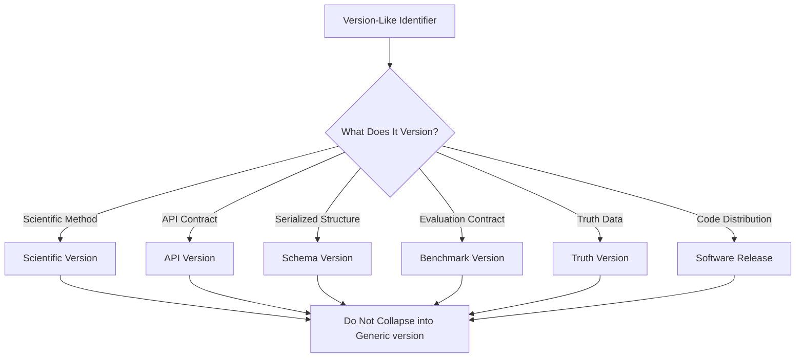
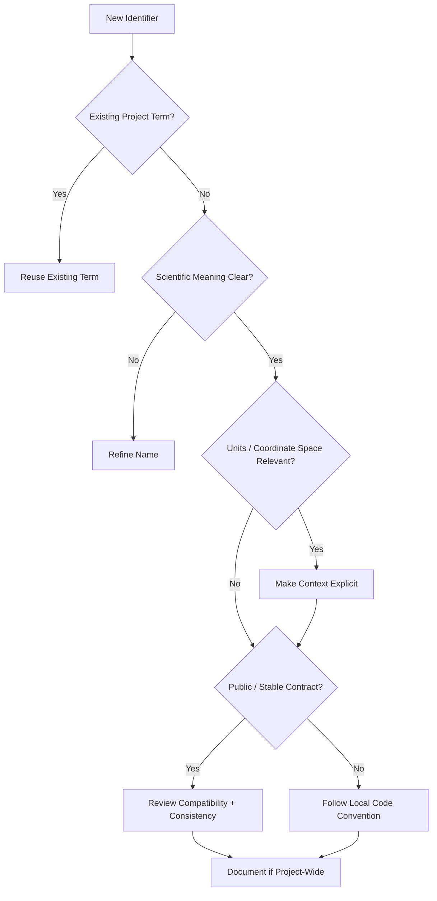

# Naming Conventions

ChandraMap is a scientific lunar image correspondence and registration system. Naming is therefore not only a matter of style: names carry assumptions about sensor roles, coordinate systems, geometric models, evaluation populations, units, versions, and scientific meaning.

This document defines the authoritative naming conventions for files, modules, identifiers, configuration concepts, benchmarks, experiments, results, artifacts, APIs, and scientific terminology used throughout ChandraMap.

> **In ChandraMap, naming is part of correctness: a precise identifier should make source/reference roles, coordinate meaning, units, and scientific stage harder to misunderstand.**

> **Prefer names that reveal scientific meaning over names that merely describe data type or implementation detail.**

> **If two concepts have different scientific meanings, they should not share an ambiguous name.**

> **Source, reference, candidate, inlier, fit, check, metric, coordinate space, and version names should remain explicit throughout the repository.**

> **Names should make incorrect coordinate, unit, sensor, or transform assumptions harder to introduce.**

> **Avoid abbreviations unless they are standard in the project/domain and remain unambiguous.**

> **File and directory names should describe stable responsibility rather than temporary implementation state.**

> **Version identifiers should describe methodology or contract boundaries, not imply quality or superiority.**

> **Names used in code, configuration, results, documentation, and APIs should align wherever the same scientific concept is represented.**

---

## 1. Scope

These conventions apply to:

- directories
- filenames
- modules
- packages
- functions
- classes and domain types
- variables
- constants
- configuration concepts
- benchmark definitions
- benchmark categories
- experiments
- tests
- fixtures
- run metadata
- results
- artifacts
- API resources
- API fields and schemas
- serialized scientific metadata
- documentation filenames and headings

The rules in this document primarily define **semantic naming**.

Exact casing and syntax may vary by:

- programming language
- framework
- file type
- external schema
- toolchain
- established local repository convention

This document does not replace language-specific style guides or formatter/linter configuration.

---

## 2. Relationship to Other Documentation

Within the development documentation:

- [`README.md`](README.md) is the development-documentation entry point.
- [`repository-structure.md`](repository-structure.md) explains where repository components belong.
- [`local-development.md`](local-development.md) explains how to work with ChandraMap locally.
- [`coding-standards.md`](coding-standards.md) defines broader engineering and code-quality expectations.
- `naming-conventions.md` defines the authoritative rules for names, identifiers, scientific semantics, consistency, and terminology representation.

The most important relationship is with [`../project/terminology.md`](../project/terminology.md).

> **Terminology defines what a concept means; naming conventions define how that concept should be represented consistently in the repository.**

If terminology and an identifier disagree, the identifier should normally be corrected rather than silently creating a second project meaning.

---

## 3. Source of Truth

The actual repository is the source of truth for existing language-specific naming syntax.

Before introducing or enforcing a style such as:

- `snake_case`
- `camelCase`
- `PascalCase`
- `kebab-case`
- `SCREAMING_SNAKE_CASE`

inspect the implementation area in which the name will be used.

Do not invent repository-wide rules for:

- test prefixes
- enum casing
- API wire values
- configuration filenames
- environment-variable prefixes
- pair IDs
- benchmark IDs
- run IDs
- artifact IDs
- timestamp formats
- UUID requirements
- database names
- storage keys
- API route syntax

unless those conventions are established by the repository.

Where multiple languages or frameworks use different conventions, each area may follow its appropriate local style while preserving the **same scientific semantics**.

> Semantic correctness is stronger than any particular casing convention.

---

## 4. Naming Priorities

When selecting a name, prefer the following order:

1. Scientific correctness
2. Clarity
3. Unambiguity
4. Consistency with established project terminology
5. Consistency with nearby code
6. Searchability
7. Stability over time
8. Brevity only when clarity is preserved

> **A longer precise name is better than a short ambiguous scientific name.**

Brevity becomes more important inside very small local mathematical scopes. Precision becomes more important at boundaries.

---

# Repository Naming

## 5. Directory Names

Directory names should communicate stable responsibility.

Conceptually strong responsibilities include:

- algorithms
- evaluation
- benchmarks
- experiments
- results
- artifacts
- preprocessing
- registration
- transforms

Avoid long-lived directories such as:

- `misc`
- `stuff`
- `temp`
- `new`
- `old`
- `backup`
- `final`
- `final2`

A temporary working directory may exist locally, but temporary workflow state should not become permanent architecture.

See [`repository-structure.md`](repository-structure.md) for where repository components belong.

---

## 6. File Names

A filename should describe the responsibility of the file rather than its editing history.

Conceptual examples:

| Prefer                   | Avoid                |
| ------------------------ | -------------------- |
| `benchmark-protocol.md`  | `benchmark-final.md` |
| `spatial-coverage.md`    | `new-metric.md`      |
| `subpixel-refinement.md` | `updated-algo.md`    |
| `failure-cases.md`       | `bad-results.md`     |
| `registration.md`        | `final-code.py`      |

Avoid using:

- contributor names
- `final`
- `latest`
- `new`
- `updated`
- `best`
- dates that are not part of the document's identity

Do not prescribe a casing pattern here unless the repository already establishes one.

---

## 7. Documentation File Names

Documentation filenames should describe the stable topic they own.

Prefer topic-oriented identities such as:

- architecture
- preprocessing
- matching
- evaluation
- versioning
- benchmarking
- reproducibility

Avoid:

- duplicate synonyms for the same subject
- contributor names
- arbitrary dates
- temporary-state labels
- `final`
- `latest`
- `v2-new`

A document's revision history belongs in version control, not its filename.

---

## 8. Module and Package Names

Modules and packages should represent a clear domain responsibility.

Prefer domain concepts such as:

- preprocessing
- matching
- transforms
- registration
- evaluation
- sensor handling

over generic labels such as:

- processor
- manager
- helper
- misc

when a more specific responsibility can be stated.

This document does not assert concrete ChandraMap module names unless they already exist.

---

## 9. Generic Module Names

Use caution with:

- `utils`
- `common`
- `helpers`
- `core`
- `base`
- `manager`

These names often become dumping grounds for unrelated behavior.

If such a module is justified, its responsibility should be narrow enough that another contributor can explain:

- what belongs there
- what does not belong there
- which subsystem owns it

A generic name should not hide missing architecture.

---

# Code Identifier Naming

## 10. Function Names

Function names should describe the operation and, where useful, the scientific object being operated on.

Conceptually stronger operations include:

- validate input
- prepare sensor representation
- estimate transform
- refine correspondences
- refit transform
- evaluate check points
- map coordinates
- compute spatial coverage

Avoid vague public names such as:

- `process`
- `handle`
- `do`
- `run`
- `execute`
- `calculate`

when the operation can be stated more precisely.

For example, a name equivalent to `calculate_error` is weaker than a name that makes clear:

- which error
- over which population
- in which coordinate space
- in which units

---

## 11. Class and Domain-Type Names

Classes and types should describe domain concepts rather than vague implementation containers.

Relevant domain concepts may include:

- registration result
- correspondence
- transform
- coordinate space
- sensor metadata
- benchmark case
- run record
- metric record

Concrete type names must come from the implementation.

Do not document speculative class names as though they already exist.

---

## 12. Variable Names

Variables should communicate meaning rather than only storage type.

Conceptually prefer:

- `source_points`
- `reference_points`
- `candidate_matches`
- `verified_inliers`

over:

- `arr1`
- `arr2`
- `pts`
- `m`
- `res`

Short names remain acceptable in tightly scoped mathematical expressions where their meaning is obvious.

---

## 13. Constants

Constant naming syntax should follow the local language convention.

The semantic name should still identify:

- what the constant controls
- its scientific meaning
- its unit where useful

Avoid an ambiguous concept such as:

`DEFAULT_THRESHOLD`

when several scientifically different thresholds exist.

---

# Source and Reference Roles

## 14. Source

**Source** means the image or product being transformed, aligned, or registered.

The source role should remain explicit wherever confusion is possible.

Conceptual names include:

- source image
- source points
- source coordinate space
- source metadata
- source pixel scale

---

## 15. Reference

**Reference** means the target frame or image against which the source is aligned.

Conceptual names include:

- reference image
- reference points
- reference coordinate space
- reference tile
- reference metadata

> **Source and reference are directional roles, not arbitrary image labels.**

Avoid authoritative scientific interfaces based on:

- `image1`
- `image2`
- `a`
- `b`
- `left`
- `right`

unless the subsystem has a different, explicitly defined meaning.

---

## 16. Source/Reference Example

Conceptually clear:

```text
source_image
reference_image

source_points
reference_points

source_space
reference_space
```

Conceptually weak for long-lived interfaces:

```text
img1
img2

pts1
pts2
```

---

## 17. Query Is Not Automatically Source

Later retrieval workflows may use **query** for imagery being searched against a reference index.

That does not mean registration code should automatically replace **source** with **query**.

Keep these concepts distinct:

### Retrieval

- query
- candidate reference
- retrieval score
- Top-K candidates
- selected reference

### Registration

- source
- reference
- candidate correspondences
- verified inliers
- transform
- residuals

---

# Correspondence Stages

## 18. Candidate Correspondence

Raw output from a local matcher should be treated as a **candidate correspondence** or **candidate match**.

Do not call an unverified matcher output:

- correct match
- true match
- verified match
- ground-truth match

A descriptor score, learned matcher score, or nearest-neighbor relationship does not itself establish geometric correctness.

---

## 19. Filtered Candidate

If candidate matches have passed descriptor-level or matcher-level filtering such as:

- ratio filtering
- mutual/cross checking
- score thresholding

they may be described as **filtered candidates**.

Filtering still does not make them independent truth.

---

## 20. Verified Inlier

After geometric verification such as RANSAC, model-consistent matches may be described as:

- verified inliers
- geometric inliers
- model-consistent inliers

Use one project-preferred term consistently.

Do not call geometric inliers:

- ground truth
- independent check points
- guaranteed-correct matches

---

## 21. Ground Truth

Use `ground truth` or `truth` only for data genuinely defined as an evaluation reference.

Reference imagery is not automatically ground truth.

> **Reference imagery is not automatically independent truth.**

An LRO NAC or WAC image may serve as a reference image while still not constituting an independently validated correspondence truth set.

---

## 22. Correspondence Terminology Flow


Names should reflect the stage in which an object exists.

A variable should not continue to be called `candidate_matches` after the code has replaced it with verified inliers unless its meaning genuinely remains candidate-level.

---

# Control, Check, and Residual Naming

## 23. Control or Fit Points

Points used to estimate a transform are part of the fitting population.

Use terminology such as:

- control points
- fit points

according to the project's established evaluation vocabulary.

See:

- [`../evaluation/control-points.md`](../evaluation/control-points.md)
- [`../evaluation/checkpoint-evaluation.md`](../evaluation/checkpoint-evaluation.md)

---

## 24. Check Points

Check points are held out from model fitting and used for evaluation.

Do not use one generic term such as `validation_points` for both fit and check populations if the distinction exists.

The distinction is scientifically important because evaluating a transform on the same points used to fit it can produce optimistic error estimates.

---

## 25. Fit Residual vs Check Residual

Use:

- **fit residual** for residuals computed on the fitting population
- **check residual** for residuals computed on independent or held-out evaluation points

Avoid using `error` alone when the population matters.

---

## 26. RMSE Naming

`RMSE` by itself may be insufficient in a complex registration pipeline.

Where ambiguity exists, identify:

- fit or check population
- coordinate space
- unit

Conceptually distinct quantities include:

- fit RMSE in source pixels
- check RMSE in source pixels
- check RMSE in reference pixels
- ground-space RMSE where scientifically valid

Do not silently change the meaning of a persisted field named `rmse`.

---

## 27. Inlier Ratio

An inlier ratio must have a defined denominator.

For example, it may conceptually mean:

```text
verified inliers / candidate correspondences
```

but the exact contract should define this.

Do not rename an inlier ratio to **accuracy**.

---

## 28. Spatial Coverage

Spatial coverage measures how well useful correspondences span the overlap.

If multiple coverage definitions are supported, distinguish them explicitly.

Examples include:

- grid coverage
- convex-hull coverage

Do not use one generic `coverage` field if multiple incompatible definitions coexist.

See [`../evaluation/spatial-coverage.md`](../evaluation/spatial-coverage.md).

---

# Transform Naming

## 29. Transform Names

Transform-related names should distinguish:

- transform stage
- transform direction
- transform model
- transform parameters
- coordinate spaces

Avoid `matrix` as the only semantic identifier in core or public interfaces.

A matrix is an implementation representation. The scientific concept is a transform.

---

## 30. Transform Direction

> **Names involving transforms should make direction obvious where confusion is possible.**

Source-to-reference and reference-to-source transformations are not interchangeable.

Conceptually distinguish:

```text
source → reference
```

from:

```text
reference → source
```

This matters for:

- point transformation
- image warping
- inverse mapping
- residual calculation
- serialization
- API contracts

---

## 31. Initial vs Final Transform

The pipeline may produce different transform stages.

### Initial transform

Estimated during geometric verification, often before sub-pixel refinement.

### Final transform

Estimated or refit after the selected verified correspondences have been refined.

Do not call a pre-refinement transform `final_transform` if another refit occurs later.

A scientifically clear pipeline is:

```text
candidate correspondences
→ geometric verification
→ initial model
→ verified inliers
→ optional sub-pixel refinement
→ final transform refit
→ registration
```

---

## 32. Transform Model Names

Use established scientific model terms when appropriate, such as:

- affine
- homography
- projective transform

Do not invent custom names for standard geometric models.

Do not imply that a local homography models global lunar geometry.

---

# Coordinate-Space Naming

## 33. Coordinate Space Must Be Identifiable

ChandraMap may involve several coordinate spaces simultaneously.

Potential spaces include:

- source native
- source prepared
- source crop
- reference native
- reference tile
- reference pyramid
- registered output
- map/projection space

Names should make those spaces identifiable whenever values could otherwise be confused.

---

## 34. Avoid Generic `points`

A variable called only `points` is usually insufficient once more than one coordinate space exists.

Conceptually better names include:

- source points
- reference points
- source native points
- source crop points
- reference tile points
- reference pyramid points

Use only as much qualification as the surrounding context requires.

---

## 35. X/Y vs Row/Column

Use:

- `x`, `y` for defined geometric/image-coordinate semantics
- `row`, `column` for array indexing semantics

Do not use:

- `x` and `row`
- `y` and `column`

as interchangeable terms without an explicit convention.

A large number of registration bugs originate from treating array indexing and Cartesian/image coordinates as though they were identical.

---

## 36. Pixel Coordinates

Pixel coordinates do not automatically imply metres or map coordinates.

When multiple pixel spaces exist, context should make clear whether the value belongs to:

- source pixels
- reference pixels
- crop pixels
- tile pixels
- pyramid-level pixels

---

## 37. Crop and Tile Offsets

Offsets should communicate their parent space when more than one origin exists.

A generic `offset_x` becomes risky when the system also has:

- source crop offsets
- reference tile offsets
- pyramid offsets
- registered-output offsets

The parent coordinate space should be evident from the type, context, or name.

---

## 38. Pyramid Level

A pyramid level is not the same thing as physical ground resolution.

See [`../algorithms/scale-pyramid.md`](../algorithms/scale-pyramid.md).

Do not use one ambiguous `resolution` variable for both:

- image-pyramid scaling
- physical metres-per-pixel sampling

---

# Scale and Resolution

## 39. Scale

`Scale` may mean a geometric resizing factor or relationship between image representations.

Examples conceptually include:

- resize scale
- pyramid scale
- scale factor

---

## 40. GSD

Ground Sample Distance (GSD) describes physical spatial sampling, commonly expressed in metres per pixel.

Where GSD is relevant, its unit should remain explicit through:

- field naming
- type
- schema
- documentation

Do not encode a fixed summary GSD into a sensor's identity.

Product metadata is authoritative for the actual product being processed.

---

## 41. Scale Is Not GSD

> **Scale and GSD are related in some workflows, but they are not interchangeable concepts.**

A resize factor changes representation scale.

It does not create new physical spatial information.

This distinction is particularly important when comparing imagery such as:

- OHRC
- TMC-2
- IIRS
- LRO NAC
- LRO WAC

---

# Sensor and Mission Naming

## 42. Official Human-Readable Names

Use official project terminology consistently in documentation:

- OHRC
- TMC-2
- IIRS
- LRO NAC
- LRO WAC

Use the actual repository's established machine representation for code, serialized fields, and enums.

Do not invent a wire representation such as `tmc2`, `TMC2`, or `tmc_2` unless the implementation establishes it.

---

## 43. OHRC

Where expansion is useful:

**Orbiter High Resolution Camera (OHRC)**

Avoid multiple competing aliases.

---

## 44. TMC-2

Use **TMC-2** in scientific and human-readable documentation.

Avoid casually using **TMC** when the Chandrayaan-2 Terrain Mapping Camera-2 is the intended instrument.

Machine-safe identifiers may omit the hyphen depending on local language or schema rules, but that syntax must come from implementation convention.

---

## 45. IIRS

Use:

**Imaging Infrared Spectrometer (IIRS)**

IIRS is a hyperspectral/infrared instrument and should not be named primarily as a "low-resolution camera."

When a 2D registration representation is derived from IIRS data, distinguish the representation from the native product where needed.

Avoid an ambiguous name equivalent to `iirs_image` if the object actually represents:

- a selected band
- a PCA image
- a spectral composite
- another derived structural representation

---

## 46. LRO, LROC, NAC, and WAC

Preserve these distinctions:

- **LRO** — Lunar Reconnaissance Orbiter mission
- **LROC** — Lunar Reconnaissance Orbiter Camera system
- **NAC** — Narrow Angle Camera
- **WAC** — Wide Angle Camera

Avoid `lro_camera` when the NAC/WAC distinction matters.

---

## 47. Mission vs Instrument vs Product

Do not combine these into one ambiguous concept.

For example:

- mission
- instrument
- product type
- product identifier
- derived registration representation

should remain separable where the system requires them.

---

# Data Naming

## 48. Raw, Prepared, and Derived

Use these lifecycle terms consistently.

### Raw

Provider/original mission product or data kept in provider form.

### Prepared

Data processed into a pipeline-compatible representation.

### Derived

A product generated from another scientific data product.

Do not label prepared or derived data as `raw`.

---

## 49. Representation Names

Relevant data-representation terms may include:

- native product
- registration representation
- reference pyramid
- tile
- crop
- mask
- registered raster
- visualization

Each should have a stable meaning.

---

## 50. Dataset Names

Dataset names should communicate:

- source
- domain
- purpose

without implying ground truth unless the dataset actually provides evaluation truth.

See [`../datasets/README.md`](../datasets/README.md).

---

## 51. Pair

Use **pair** for a defined source/reference relationship.

If direction matters, a pair is not merely an unordered set of two images.

See [`../datasets/pair-definition.md`](../datasets/pair-definition.md).

---

## 52. Pair Identifiers

Do not invent a pair-ID syntax in this document.

A pair identifier should be:

- stable
- traceable
- unambiguous
- reproducible

according to repository-defined conventions.

---

# Configuration Naming

## 53. Configuration Purpose

Configuration names should communicate their scope and purpose where necessary.

Conceptual configuration categories may include:

- baseline configuration
- experiment configuration
- benchmark configuration
- sensor-specific configuration
- version-specific configuration

This document does not define concrete configuration filenames.

---

## 54. Template, Preset, and Resolved Configuration

Distinguish where relevant:

### Template or preset

An author-defined starting configuration.

### Resolved configuration

The complete settings actually used in a run after defaults, overrides, environment inputs, or composition have been resolved.

Do not call both `config` if the distinction affects reproducibility.

---

## 55. Configuration Keys

Configuration-key syntax should follow the actual schema and repository conventions.

Semantically, keys should describe scientific meaning rather than internal plumbing.

Avoid names such as:

- `value`
- `threshold`
- `threshold2`
- `mode2`

when a scientifically precise concept exists.

---

## 56. Thresholds

A threshold should indicate what it controls.

Conceptually clearer examples include:

- RANSAC residual threshold
- matcher ratio threshold
- minimum spatial-coverage threshold

These are semantic examples, not assertions about existing configuration keys.

---

## 57. Boolean Configuration Names

A Boolean should make the meaning of `true` understandable.

Avoid vague names such as:

- `enable`
- `flag`
- `mode`

without a subject.

Conceptually clearer meanings include:

- refinement enabled
- retrieval enabled
- evaluation available

Exact syntax remains language/schema-specific.

---

# Benchmark Naming

## 58. Benchmark Definition

A benchmark represents an evaluation contract.

Its identity should remain separate from:

- scientific version
- software release
- dataset version
- schema version

See:

- [`../versions/v1/benchmark.md`](../versions/v1/benchmark.md)
- [`../evaluation/benchmark-protocol.md`](../evaluation/benchmark-protocol.md)

---

## 59. Scientific Version vs Benchmark Version

A **scientific version** identifies methodology.

A **benchmark version** identifies a frozen evaluation contract.

Do not automatically call a benchmark `v1` merely because it evaluates scientific V1.

---

## 60. Benchmark Categories

Benchmark categories should describe the controlled property.

See [`../evaluation/benchmark-categories.md`](../evaluation/benchmark-categories.md).

Prefer scientifically interpretable categories such as concepts based on:

- illumination difference
- scale difference
- modality difference
- geometry difficulty
- terrain texture

Avoid subjective categories such as:

- easy
- hard
- best
- worst

unless the project formally defines them using objective criteria.

---

# Results, Artifacts, Runs, and Jobs

## 61. Result

Use **result** for a structured scientific outcome.

A result can represent:

- success
- failure
- partial evaluation
- unavailable evaluation

Do not reserve the word `result` only for successful registrations.

---

## 62. Artifact

Use **artifact** for a generated supporting file.

Examples conceptually include:

- registered raster
- preview
- match visualization
- residual visualization
- spatial-coverage visualization

A scientific result record and a generated image file are not the same concept.

> **Result != artifact.**

---

## 63. Preview

A **preview** is a human-oriented visualization.

Do not name a preview:

- `ground_truth`
- `proof`
- `validated_registration`

unless it genuinely has that documented status.

---

## 64. Run, Job, and Result

Keep these concepts separate:

### Run

A scientific execution.

### Job

An orchestration or scheduling unit, if such infrastructure exists.

### Result

The scientific outcome of the execution.

Do not assume they share the same identity.

---

## 65. Failure Naming

Failure-related fields should distinguish where needed:

- failure stage
- observed diagnostic
- suspected cause
- confirmed cause

Avoid using one generic `reason` field for all of them if separate semantics matter.

See [`../evaluation/failure-cases.md`](../evaluation/failure-cases.md).

---

## 66. Status

`status` can mean different things:

- API/transport status
- execution status
- scientific registration status
- evaluation status
- artifact-generation status

Avoid an unqualified generic status field across boundaries where these meanings coexist.

---

## 67. Success

A generic `success` Boolean may be ambiguous.

Success may mean:

- API request completed
- job completed
- scientific transform estimated
- benchmark criterion passed

Use a scoped name or type when more than one interpretation is possible.

---

# API Naming

## 68. API Resources

Potential domain resources may include:

- asset
- pair
- configuration
- run
- result
- artifact
- benchmark

Concrete route and resource names must come from the implemented API.

See [`../api/README.md`](../api/README.md).

---

## 69. API Schema Names

Concrete schema names must match the actual implementation.

Do not invent names such as:

- `RegistrationRequest`
- `RegistrationResponse`

and document them as implemented unless they actually exist.

See [`../api/schemas.md`](../api/schemas.md).

---

## 70. API Fields

Transport-field casing follows the real API/schema convention.

Scientific meaning must remain consistent with core ChandraMap terminology.

For example, changing a field from "candidate" meaning matcher output to "candidate" meaning retrieval result without qualification would create semantic ambiguity even if the wire syntax remains valid.

---

## 71. API Version

> **API contract version and ChandraMap scientific version must not share ambiguous naming.**

API versioning concerns transport and contract evolution.

Scientific versions concern research methodology.

See [`../api/versioning.md`](../api/versioning.md).

---

# Scientific Versions

## 72. V1–V4

ChandraMap scientific versions:

- V1
- V2
- V3
- V4

represent benchmarkable research milestones.

They should not be renamed to labels such as:

- Basic
- Better
- Best
- Ultimate

because those names imply quality ranking rather than methodology.

---

## 73. Version-Specific Modules

If code has version-specific pipelines, modules, or configurations, their ownership should be clear.

Do not duplicate the entire codebase into four independent version trees merely to make version labels visible unless architecture actually requires that separation.

Prefer explicit methodology boundaries over duplication.

---

## 74. Scientific-Version Stability

> **Once V1 terminology is frozen with the baseline, later versions should extend it rather than silently redefine it.**

A field should not keep the same name while changing scientific meaning between versions.

---

# Experiment and Research Naming

## 75. Experiments

Experiment names should communicate at least one of:

- hypothesis
- method
- variable under study
- ablation dimension

Avoid permanent tracked experiment names such as:

- `test1`
- `exp2`
- `final_exp`
- `best_run`

---

## 76. Experiment Is Not Scientific Version

Do not call an experiment `v2` unless it actually represents the formally defined scientific V2 methodology.

Experiments are exploratory.

Scientific versions are governed methodological contracts.

---

## 77. Ablation Naming

Ablation names should identify what changes.

Conceptual examples include:

- refinement enabled vs disabled
- matcher comparison
- illumination representation comparison
- scale-strategy comparison

Do not encode the expected result into the name.

---

## 78. Research Prototypes

Avoid prototype names such as:

- `new_model`
- `best_matcher`
- `final_research`

Prefer the technique or question being investigated.

---

## 79. Learned Matchers

Where used, preserve established method names such as:

- ALIKED
- LightGlue
- LoFTR

Do not rename them generically as `AI matcher` when the method distinction matters.

---

## 80. RIFT and CFOG

If used later, preserve their established research names.

Do not rename them with unsupported project-specific claims such as:

- cross-modal magic
- invariant matcher
- lunar-proof matcher

---

# Test Naming

## 81. Test Syntax

Actual test filename and function syntax should follow the configured testing framework.

This document defines semantics rather than framework-specific naming rules.

---

## 82. Test Meaning

A test name should communicate:

- unit under test
- condition
- expected behavior

Avoid names such as:

- `test1`
- `test_basic`
- `test_final`

---

## 83. Scientific Tests

When relevant to the behavior under test, include concepts such as:

- coordinate space
- transform direction
- metric population
- failure condition

A geometry test that checks source-to-reference transformation should not be named so vaguely that direction is invisible.

---

## 84. Regression Tests

Regression tests should describe the behavior being protected.

Issue numbers may be included as metadata, but the test should remain understandable after the issue is no longer familiar.

---

## 85. Expected-Failure Tests

Name the expected scientific or validation condition rather than only the exception mechanism.

Prefer semantics equivalent to:

- insufficient correspondences
- degenerate transform
- missing reference metadata

over a generic `test_exception`.

---

## 86. Fixtures

Fixtures should indicate scientific role.

Conceptually prefer:

- source fixture
- reference fixture
- pair fixture
- truth fixture

over:

- file1
- file2
- sample

where ambiguity exists.

---

## 87. Mock, Stub, Fake, and Fixture

Use these terms according to their testing semantics.

Do not use **ground truth** merely because synthetic data were generated with known parameters unless the generated dataset is intentionally serving as known truth for that test.

---

## 88. Synthetic Data

Synthetic or generated lunar data should be named so that they cannot be confused with real mission data.

That distinction matters for:

- benchmarking
- provenance
- scientific claims
- data licensing
- reproducibility

---

# File Format Naming

## 89. Format vs Domain Meaning

Do not embed file format into domain identity unless the format matters.

Inside scientific logic, a concept equivalent to:

`reference_image`

may be better than:

`tiff_file`

At I/O boundaries, format-specific identifiers may be appropriate.

---

# Abbreviations and Acronyms

## 90. Accepted Domain Abbreviations

Standard domain abbreviations may be used where their meaning is well established, including:

- OHRC
- TMC-2
- IIRS
- LRO
- LROC
- NAC
- WAC
- RMSE
- GSD
- DEM

Avoid introducing project-specific abbreviations that are not documented or searchable.

---

## 91. Expansion

In public-facing documentation, expand less-common abbreviations on first use where useful.

In code, consistency may be preferable to repeatedly spelling out very long mission or instrument names.

---

## 92. Acronym Casing

Do not invent a repository-wide machine casing rule such as:

- `lroNAC`
- `LroNac`
- `lro_nac`

unless repository convention establishes one.

Human-readable documentation should use official forms.

---

# High-Risk Ambiguous Terms

## 93. Error

`error` can mean:

- geometric residual
- evaluation metric
- software exception
- API error
- validation failure

Prefer specific names such as:

- residual
- RMSE
- validation error
- service error

when more than one meaning is possible.

---

## 94. Accuracy

Do not use **accuracy** as a generic name for:

- inlier ratio
- match count
- fit residual
- spatial coverage
- visual quality

Use the actual metric name.

---

## 95. Confidence

Do not call an arbitrary matcher score **confidence** unless the algorithm or contract genuinely defines it that way.

Depending on context, clearer terms may include:

- matcher score
- retrieval similarity
- geometric support

---

## 96. Match

Use:

- candidate match before geometric verification
- verified/model-consistent inlier after geometric verification

Avoid `good_match` in scientific contracts unless **good** has a documented objective definition.

---

## 97. Correspondence vs Registration

**Correspondence** refers to relationships between points or features.

**Registration** refers to geometrically aligning one image/product with another using a model or transform.

Do not use these words interchangeably.

---

## 98. Localization vs Registration

**Registration** aligns source and reference imagery.

**Geospatial localization** relates imagery to known geographic or map context.

Image registration does not automatically establish absolute geolocation.

---

## 99. Reference vs Truth

> **Reference imagery is not automatically independent truth.**

Do not name a reference tile `truth_image` solely because it comes from LRO NAC or WAC.

---

## 100. Baseline

Use **baseline** for a controlled reference methodology or configuration.

For ChandraMap, V1 represents the classical baseline methodology.

Do not use baseline as a synonym for:

- bad
- weak
- primitive
- inaccurate

---

## 101. Improved

Avoid permanent names such as `improved_matcher`.

A method may improve one benchmark and regress another.

Prefer method-specific or version-specific names.

---

## 102. Best, SOTA, Ultimate, Perfect

Avoid these terms in:

- filenames
- modules
- experiments
- configuration names
- branch-independent scientific identifiers

unless the claim is rigorously defined and justified.

Descriptive names are more stable.

---

## 103. Final

Avoid:

- `final`
- `final2`
- `final_latest`

for permanent source files, configurations, experiments, or documentation.

Version control already records temporal progression.

---

# Time and Version-Like Identifiers

## 104. Timestamps

Use timestamps where they are useful for:

- run identity
- artifact identity
- execution metadata

Do not use a timestamp as the only scientific identity.

A date does not communicate:

- methodology
- benchmark
- pair
- configuration
- truth source

---

## 105. Version Names

Use established scientific labels such as:

- V1
- V2
- V3
- V4

Do not invent:

- V1-final
- V1-new
- V1.5

unless project governance explicitly defines them.

---

## 106. Software Releases

A software release number is not automatically a scientific version.

A release may contain:

- bug fixes
- API changes
- documentation updates
- infrastructure changes

without changing the research methodology.

---

## 107. Version Axes

Keep version axes distinct.

Potential axes include:

- scientific version
- API version
- schema version
- benchmark version
- truth version
- pair version
- dataset version
- software release

Avoid one unqualified field named only:

`version`

when several axes coexist.

---

## 108. Version-Naming Flow



---

# Result and Artifact File Naming

## 109. Benchmark Result Files

If the repository defines a result filename convention, follow it.

Otherwise, preserve semantic information through metadata rather than inventing an overloaded filename convention.

A result may conceptually need to be associated with:

- scientific version
- benchmark
- pair
- run
- configuration

but this document does not define an exact syntax.

---

## 110. Artifact Files

Generated artifacts should describe their role.

Conceptually:

- registered output
- preview
- match visualization
- residual visualization
- coverage visualization

Avoid naming every generated file:

`output.png`

---

## 111. Checkpoints and Learned Models

If learned models are added later, checkpoint names should reflect the real model/version/training conventions established by the implementation.

Do not define speculative checkpoint naming rules now.

---

# Retrieval Naming

## 112. Retrieval vs Registration

Retrieval concepts include:

- query
- candidate reference
- retrieval similarity
- Top-K candidate
- selected reference

Registration concepts include:

- source/reference points
- candidate correspondences
- inliers
- transform
- residuals

Do not reuse one term for both domains when it changes meaning.

---

## 113. FAISS

If FAISS is used, it represents vector indexing and similarity search.

A FAISS search result is not a registration result.

Do not name retrieval output as though geometric alignment has already been established.

---

## 114. Recall@K

Recall@K is a retrieval metric.

Do not replace its meaning with a generic `accuracy` field.

Likewise, Recall@K and registration RMSE measure different stages of the system and should remain separately named.

---

# Provenance Naming

## 115. Provenance

Provenance identifiers should distinguish, where relevant:

- scientific version
- software revision
- configuration identity
- benchmark version
- truth version
- pair identity/version
- source product identity
- reference product identity

Do not collapse all provenance information into one `version` value.

---

## 116. Provider vs Normalized Metadata

External provider metadata may use terminology different from ChandraMap's normalized domain model.

Preserve traceability.

Where necessary, distinguish:

- provider/native metadata
- normalized ChandraMap metadata

Do not present a ChandraMap-derived interpretation as though it came directly from the mission provider.

---

## 117. Derived Metadata

Derived values should be named so they are not mistaken for directly measured/provider-authored values when the distinction matters.

For example, an estimated ground sampling value should not silently appear as though it were official product GSD.

---

# Unit Naming

## 118. Explicit Units

Where ambiguity exists, units should be explicit through:

- identifier
- schema
- type
- documentation
- adjacent metadata

Relevant units may include:

- px
- m
- m/px
- s
- ms
- dimensionless ratio

Do not infer scientific unit from numeric type.

---

## 119. Pixel Units

`px` may still be insufficient when several pixel spaces coexist.

Distinguish as needed:

- source pixels
- reference pixels
- crop pixels
- tile pixels
- pyramid pixels

---

## 120. Ground Units

Use metres only when the value has a scientifically valid ground-space interpretation.

Do not name a value conceptually equivalent to `error_m` merely because a pixel residual was multiplied by an approximate GSD without the necessary geometric justification.

---

## 121. Runtime

Runtime fields should distinguish:

- total runtime
- stage runtime

and expose units.

Avoid an unqualified `time` field.

---

## 122. Counts

A count should identify what is counted.

Conceptually clearer counts include:

- candidate count
- filtered-candidate count
- inlier count
- check-point count

Avoid `count1` or `n` in long-lived public contracts.

Local mathematical use of `n` remains acceptable.

---

# Boolean, Optional, and Status Naming

## 123. Boolean State

Booleans should read as clear states.

Conceptually:

- refinement applied
- evaluation available
- transform valid

are clearer than:

- `flag1`
- `enabled2`
- `ok`

Exact syntax remains language-dependent.

---

## 124. Missing vs Unavailable vs Not Applicable

Keep these states conceptually distinct:

- unavailable
- missing
- not applicable
- not evaluated
- null transport representation

Do not collapse them into one generic `missing` state when the difference matters scientifically or operationally.

---

## 125. Enum and Status Values

Actual enum and string values must come from the implementation or schema.

Semantic requirements are:

- stable
- descriptive
- non-overlapping
- scoped to their domain

Do not invent exact enum values in documentation before the implementation establishes them.

---

# Internal and Public Naming

## 126. Internal Names

Internal variables may be more concise than public contract names.

For example, a small mathematical transform function may use conventional notation where the meaning is immediately clear.

Scientific meaning must not disappear when values cross into:

- public functions
- API schemas
- configuration
- persisted results
- benchmark definitions

---

## 127. Public Names

Names exposed through public contracts require greater stability.

This includes:

- API fields
- serialized results
- configuration keys
- benchmark fields
- CLI parameters
- persisted metadata

Changing these names may affect compatibility and reproducibility.

---

# Renaming Existing Code

## 128. When to Rename

Rename when the existing name is:

- scientifically misleading
- ambiguous
- inconsistent with project terminology
- hiding coordinate semantics
- hiding units
- claiming something the data do not support
- confusing source/reference roles
- conflating candidate/inlier/truth stages

Do not rename broad areas of the repository solely for stylistic preference.

---

## 129. Rename as Breaking Change

A rename may affect:

- imports
- API contracts
- configuration files
- CLI commands
- tests
- documentation
- scripts
- serialized results
- historical experiments

Review compatibility before changing public names.

---

## 130. Scientific Renaming

Some renames are more than cosmetic.

For example, changing a concept from:

`correct_matches`

to:

`candidate_matches`

or:

`verified_inliers`

may correct an inaccurate scientific claim.

Such changes should be documented because they change how the pipeline is interpreted.

---

## 131. Legacy Names

If a legacy name must remain for compatibility:

- document its preferred modern meaning
- document the mapping
- avoid introducing both terms in new interfaces

Do not silently maintain competing vocabulary.

---

## 132. Deprecated Names

Follow the project's actual deprecation policy where one exists.

Do not invent deprecation windows in this document.

---

# Filesystem, Environment, Storage, and Logging

## 133. Case Sensitivity

Do not assume externally visible identifiers are case-insensitive.

Where case sensitivity matters for:

- filenames
- enum values
- IDs
- API fields

the relevant contract should document it.

---

## 134. Filename Portability

Avoid platform-problematic characters for long-lived repository files where practical.

This document does not define a complete cross-platform filename matrix.

---

## 135. Spaces and Special Characters

Follow established repository conventions.

Human-readable scientific names may contain characters such as:

`TMC-2`

Machine identifiers may require a different representation.

Do not assume the machine representation without implementation evidence.

---

## 136. URL and API Paths

Do not define new route naming rules here.

Actual endpoint naming belongs to API documentation and implementation.

---

## 137. Database and Storage Names

Do not invent conventions for:

- tables
- collections
- buckets
- object keys
- database schemas

If persistence conventions are introduced, document the actual implementation elsewhere.

---

## 138. Environment Variables

Environment-variable syntax should follow actual project conventions.

Do not assume a prefix such as `CHANDRAMAP_*` unless the repository uses it.

---

## 139. Secrets

Documentation must not expose real secret values.

Only established public configuration variable names should appear in examples.

---

## 140. Log Fields

If structured logging is used, follow the implemented schema.

Semantically useful fields may distinguish:

- run identity
- stage
- execution status
- scientific status
- failure category

but exact field names must not be invented here.

---

# Naming Decision Process

## 141. Naming Decision Questions

Before introducing a significant new identifier, ask:

1. What scientific concept does this name represent?
2. Does a project term already exist?
3. Could it be confused with source/reference?
4. Could it be confused with candidate/inlier/truth?
5. Does coordinate space matter?
6. Do units matter?
7. Is this input, metadata, result, artifact, or execution state?
8. Is this API status, scientific status, or evaluation status?
9. Is this scientific version, API version, benchmark version, schema version, or software version?
10. Is the name stable enough for long-term use?
11. Is the abbreviation necessary?
12. Would another contributor understand it without opening the implementation?
13. Does the name make a scientific claim it cannot support?
14. Does the repository already use another name for the same concept?
15. Will this name cross API/configuration/result boundaries?

---

## 142. Naming Review Flow



---

# Good vs Poor Naming

## 143. Conceptual Examples

| Poor / Ambiguous   | Better Concept                                | Why                                                        |
| ------------------ | --------------------------------------------- | ---------------------------------------------------------- |
| `img1`             | source image                                  | Scientific role is explicit                                |
| `img2`             | reference image                               | Registration direction becomes clearer                     |
| `matches`          | candidate correspondences                     | Stage is explicit before verification                      |
| `matches`          | verified inliers                              | Stage is explicit after geometric verification             |
| `correct_matches`  | verified inliers                              | Avoids claiming truth                                      |
| `points`           | source native points                          | Coordinate role and space are clearer                      |
| `points`           | reference pyramid points                      | Prevents coordinate-space confusion                        |
| `matrix`           | source-to-reference final transform           | Meaning, direction, and stage are explicit                 |
| `error`            | fit residual                                  | Metric type and population are clearer                     |
| `error`            | check RMSE                                    | Held-out evaluation is explicit                            |
| `error`            | service error                                 | Software failure is distinguished from geometry            |
| `accuracy`         | inlier ratio                                  | Uses the actual metric                                     |
| `accuracy`         | check RMSE                                    | Uses the actual registration metric                        |
| `accuracy`         | Recall@K                                      | Uses the actual retrieval metric                           |
| `confidence`       | matcher score                                 | Avoids unsupported confidence semantics                    |
| `resolution`       | pyramid scale                                 | Distinguishes representation scale                         |
| `resolution`       | GSD in m/px                                   | Distinguishes physical sampling                            |
| `status`           | execution status                              | Scope is explicit                                          |
| `status`           | scientific registration status                | Scientific meaning is explicit                             |
| `result.png`       | registered preview artifact                   | Generated role is identifiable                             |
| `output.png`       | residual visualization artifact               | Artifact meaning is searchable                             |
| `v1`               | scientific V1                                 | Version axis is explicit                                   |
| `v1`               | API version 1                                 | Transport version is explicit                              |
| `final.py`         | domain-specific module name                   | Responsibility survives future revisions                   |
| `best_config.yaml` | method/version/purpose-specific configuration | Avoids unsupported quality claim                           |
| `test1`            | behavior-oriented test name                   | Test intent remains understandable                         |
| `exp2`             | hypothesis/method-oriented experiment name    | Experiment purpose remains traceable                       |
| `truth_image`      | reference image                               | Avoids misrepresenting reference imagery                   |
| `iirs_image`       | IIRS-derived registration representation      | Distinguishes derived 2D data from native spectral product |

These examples are semantic guidance. They do not define concrete implementation syntax.

---

# Naming Anti-Patterns

## 144. Avoid

Do not:

- use `img1` / `img2` in authoritative scientific contracts
- call candidate matches correct matches
- call RANSAC inliers ground truth
- call reference imagery ground truth automatically
- use `error` where residual, RMSE, and service error differ
- use `accuracy` for unrelated metrics
- use `confidence` for arbitrary scores
- use `resolution` ambiguously for image scale and GSD
- use one `version` field for every version axis
- use `status` without scope in complex contracts
- use `result` only for successful runs
- use `output.png` for every artifact
- use `final`, `final2`, `latest`, or `new`
- use `best`, `ultimate`, or `perfect`
- use personal names in long-lived scientific filenames
- use `test1`, `exp1`, or `script2`
- create unexplained acronyms
- create `misc` or `stuff` modules
- create ambiguous `utils` dumping grounds
- use timestamps as the only scientific identity
- use software releases as benchmark versions
- name an experiment `v2` before V2 is formally defined
- rename established terminology only for style preference
- hide unit or coordinate semantics only in comments
- treat query and source as automatically synonymous
- treat candidate retrieval regions and candidate local correspondences as the same concept
- treat registration and localization as interchangeable
- treat reference and truth as interchangeable
- treat row/column and x/y as interchangeable
- treat pyramid scale and GSD as interchangeable

---

# Claims to Avoid in Names

## 145. Unsupported Scientific Claims

Do not use names that claim:

- invariant
- robust
- perfect
- accurate
- best
- optimal
- ground truth
- verified
- calibrated
- subpixel
- global
- geolocated
- uncertainty-aware

unless the object or method satisfies the documented meaning.

For example:

- `subpixel_matches` should not exist merely because coordinates use floating-point numbers.
- `geolocated_result` should not exist merely because a source image was registered to another image.
- `robust_matcher` should not be used merely because RANSAC is present.
- `ground_truth_reference` should not be used merely because a reference product is high resolution.

---

# Naming and Reproducibility

## 146. Stable Naming

Stable naming helps connect:

- data
- pair
- configuration
- run
- benchmark
- truth
- result
- artifact

However, names alone do not establish complete scientific identity.

Use appropriate:

- stable IDs
- version fields
- provenance
- metadata
- revision identifiers

alongside human-readable names.

---

## 147. Filename Is Not Scientific Identity

> **A filename is a storage label, not a complete scientific identity.**

Do not encode all provenance only in a filename.

Scientific identity may require metadata such as:

- mission
- instrument
- product identifier
- pair identity
- scientific version
- benchmark
- configuration
- source revision
- truth version

---

## 148. Human-Readable Name vs Machine Identifier

Human-readable labels and machine identifiers serve different purposes.

Conceptual example:

```text
Display name:
OHRC → NAC benchmark pair

Machine identifier:
repository-defined stable pair identifier
```

This document does not define the machine-ID format.

---

# Compatibility

## 149. API Compatibility

Renaming public API:

- fields
- resources
- schemas
- enum values

may be a breaking change.

Review [`../api/versioning.md`](../api/versioning.md) before public contract changes.

---

## 150. Configuration Compatibility

Configuration-key renames can break:

- historical runs
- reproducibility scripts
- experiment definitions
- deployment configuration
- user presets

Treat scientific configuration names as stable contracts once published.

---

## 151. Result Compatibility

Metric and result fields must not change meaning silently.

For example, a field named `rmse` must not silently change from:

- fit RMSE

to:

- held-out check-point RMSE

between releases.

Introduce a correctly named field or explicit schema/version change instead.

---

# Searchability

## 152. Consistent Terms Across Boundaries

Use the same preferred term across:

- code
- documentation
- configuration
- APIs
- results
- benchmarks
- tests

where practical.

This improves:

- repository search
- code review
- maintenance
- onboarding
- debugging
- reproducibility

A project-wide concept should not have four unrelated names unless a real subsystem distinction exists.

---

# Future Versions

## 153. Extending Terminology

Later versions may introduce concepts such as:

- retrieval candidate
- retrieval similarity
- DEM-aware geometry
- uncertainty estimate
- learned feature representation

New concepts should receive specific names.

Do not repurpose an existing V1 field with a new scientific meaning.

---

## 154. Experimental Methods

Experimental methods should be named for:

- matcher family
- representation strategy
- geometric method
- preprocessing method
- ablation dimension

without implying official version status.

---

## 155. Lunar-Specific Claims

Avoid names such as:

- `lunar_invariant`
- `moon_robust`
- `illumination_proof`

unless benchmark evidence and project definitions support those claims.

---

# Naming Checklist

## 156. General

- [ ] Name reflects responsibility or meaning
- [ ] Existing project terminology was reused where possible
- [ ] Name is searchable and stable
- [ ] No unnecessary abbreviation was introduced
- [ ] Name does not make unsupported scientific claims

### Scientific Roles

- [ ] Source/reference roles are explicit
- [ ] Candidate/filtered/inlier stages are distinct
- [ ] Ground truth is used only for actual evaluation truth
- [ ] Fit/check terminology is correct
- [ ] Registration/correspondence/localization are not conflated

### Coordinates / Geometry

- [ ] Coordinate space is identifiable
- [ ] x/y vs row/column is unambiguous
- [ ] Crop/tile/pyramid context is clear
- [ ] Transform direction is identifiable
- [ ] Initial/final transform semantics are distinct
- [ ] Scale vs GSD terminology is not ambiguous

### Metrics / Units

- [ ] Metric name states what is measured
- [ ] Units are clear
- [ ] Evaluation population is clear where needed
- [ ] Inlier ratio is not called accuracy
- [ ] Coverage is not called accuracy
- [ ] Retrieval metrics are not mixed with registration metrics
- [ ] Ground-space metrics are not implied without valid geometric context

### Sensors / Data

- [ ] TMC-2 is named correctly
- [ ] IIRS is treated as hyperspectral/infrared data
- [ ] NAC/WAC distinction is preserved
- [ ] Reference imagery is not mislabeled as truth
- [ ] Raw/prepared/derived data are named distinctly
- [ ] Data-representation lineage is clear

### Versions / Benchmarking

- [ ] Scientific version is distinct from API version
- [ ] Benchmark version is distinct from scientific version
- [ ] Schema/truth/software versions are distinct where needed
- [ ] Experiment is not mislabeled as a formal scientific version
- [ ] `best`, `final`, and `latest` names are avoided
- [ ] Historical V1 terminology remains semantically stable

### Code / Repository

- [ ] Module/file name has clear ownership
- [ ] Generic `utils`, `common`, `misc`, or `helpers` naming is justified
- [ ] Test names describe behavior
- [ ] Experiment names describe hypothesis or method
- [ ] Artifact names describe generated role
- [ ] Result names are not limited to successful runs

### Public Contracts

- [ ] API/schema names match actual implementation
- [ ] Public renames consider compatibility
- [ ] Config-key renames consider reproducibility
- [ ] Result-field names do not change meaning silently
- [ ] Enum/status names have clear scope

---

# Naming Limitations

## 157. Limitations

This naming standard has deliberate limits.

- Multiple implementation languages may use different casing conventions.
- Legacy names may remain for compatibility.
- Scientific terminology may evolve as the project matures.
- Some provider field names cannot be changed.
- Public API names may be frozen by compatibility requirements.
- Experimental work may temporarily use provisional names.
- Not every local variable needs full domain qualification.
- Excessive verbosity can reduce readability.
- Mathematical code may benefit from conventional short notation.
- External libraries may impose naming that differs from ChandraMap's preferred terminology.
- Serialized historical data may preserve older field names.

Naming should remain proportional to scope.

---

## 158. When Short Names Are Acceptable

Short names may be appropriate for:

- loop indices
- local mathematical notation
- local matrix variables
- conventional `x` and `y`
- immediately obvious temporary expressions

A small transform calculation does not need every symbol expanded into a sentence.

---

## 159. When Longer Names Are Required

Prefer explicit names at:

- module boundaries
- public functions
- API boundaries
- configuration files
- benchmark definitions
- result records
- persisted metadata
- reusable geometry utilities
- coordinate transformations
- serialized scientific contracts

because ambiguity becomes more expensive at boundaries.

---

# Maintaining This Document

## 160. Update Conditions

Update this document when:

- project terminology changes
- API naming conventions change
- configuration naming strategy changes
- scientific-version semantics change
- benchmark/result concepts are added
- new implementation languages establish additional conventions
- sensor naming policy changes
- dataset naming policy changes
- new coordinate or provenance concepts become project-wide

Do not update it for minor personal style preferences.

---

# Related Development Documentation

- [`README.md`](README.md)
- [`repository-structure.md`](repository-structure.md)
- [`local-development.md`](local-development.md)
- [`coding-standards.md`](coding-standards.md)
- [`testing.md`](testing.md)

Potential future development documentation may cover topics such as:

- debugging
- configuration development
- benchmark development
- API development
- backend development
- frontend development

These areas should only be linked here once corresponding files exist.

---

# Related Project Documentation

- [`../project/goals.md`](../project/goals.md)
- [`../project/non-goals.md`](../project/non-goals.md)
- [`../project/v1-scope.md`](../project/v1-scope.md)
- [`../project/terminology.md`](../project/terminology.md)
- [`../project/assumptions.md`](../project/assumptions.md)
- [`../project/limitations.md`](../project/limitations.md)

[`../project/terminology.md`](../project/terminology.md) is especially important when introducing new project-wide scientific vocabulary.

---

# Related Architecture Documentation

- [`../architecture/system-overview.md`](../architecture/system-overview.md)
- [`../architecture/v1-pipeline.md`](../architecture/v1-pipeline.md)
- [`../architecture/core-engine-architecture.md`](../architecture/core-engine-architecture.md)
- [`../architecture/backend-architecture.md`](../architecture/backend-architecture.md)
- [`../architecture/frontend-architecture.md`](../architecture/frontend-architecture.md)
- [`../architecture/module-map.md`](../architecture/module-map.md)
- [`../architecture/data-flow.md`](../architecture/data-flow.md)
- [`../architecture/output-flow.md`](../architecture/output-flow.md)

---

# Related Version Documentation

- [`../versions/README.md`](../versions/README.md)
- [`../versions/v1/README.md`](../versions/v1/README.md)
- [`../versions/v1/specification.md`](../versions/v1/specification.md)
- [`../versions/v1/scope.md`](../versions/v1/scope.md)
- [`../versions/v1/requirements.md`](../versions/v1/requirements.md)
- [`../versions/v1/architecture.md`](../versions/v1/architecture.md)
- [`../versions/v1/pipeline.md`](../versions/v1/pipeline.md)
- [`../versions/v1/inputs.md`](../versions/v1/inputs.md)
- [`../versions/v1/outputs.md`](../versions/v1/outputs.md)
- [`../versions/v1/benchmark.md`](../versions/v1/benchmark.md)
- [`../versions/v1/acceptance-criteria.md`](../versions/v1/acceptance-criteria.md)
- [`../versions/v1/exclusions.md`](../versions/v1/exclusions.md)
- [`../versions/v1/limitations.md`](../versions/v1/limitations.md)

---

# Related Sensor Documentation

- [`../sensors/overview.md`](../sensors/overview.md)

Additional sensor-specific documentation should be linked here once the corresponding files are confirmed in the repository.

---

# Related Dataset Documentation

- [`../datasets/README.md`](../datasets/README.md)
- [`../datasets/pair-definition.md`](../datasets/pair-definition.md)

Additional dataset documentation should be linked only when its repository path is confirmed.

---

# Related Algorithm Documentation

Where present, naming should remain consistent with algorithm documentation covering:

- sensor routing
- preprocessing
- illumination handling
- scale pyramids
- matching
- match filtering
- RANSAC
- transforms
- residual analysis
- sub-pixel refinement
- registration

Do not create duplicate terminology in development documentation when an algorithm concept already has an established project term.

---

# Related Evaluation Documentation

Where present, evaluation terminology should align with documentation covering:

- benchmark protocol
- benchmark categories
- metrics
- ground truth
- control points
- check-point evaluation
- spatial coverage
- stress tests
- success criteria
- failure cases
- reproducibility

The naming rules in this file should reinforce those scientific distinctions rather than replacing the evaluation specifications.

---

# Related API Documentation

Where implemented, use the API documentation as the source of truth for concrete route, schema, and field syntax.

Relevant areas include:

- API overview
- endpoints
- schemas
- error codes
- API versioning
- request/response examples

Scientific semantics must remain aligned with this naming standard even when transport naming follows a framework-specific convention.

---

# Data Licensing

See [`../data-licenses.md`](../data-licenses.md) for data-license responsibilities where that file is present in the repository.

---

# Root Repository Documentation

Relevant root-level project documents may include:

- [`../../README.md`](../../README.md)
- [`../../CONTRIBUTING.md`](../../CONTRIBUTING.md)
- [`../../CODE_OF_CONDUCT.md`](../../CODE_OF_CONDUCT.md)
- [`../../SECURITY.md`](../../SECURITY.md)
- [`../../ROADMAP.md`](../../ROADMAP.md)
- [`../../CHANGELOG.md`](../../CHANGELOG.md)
- [`../../LICENSE`](../../LICENSE)
- [`../../CITATION.cff`](../../CITATION.cff)
- [`../../AGENTS.md`](../../AGENTS.md)
- [`../../pyproject.toml`](../../pyproject.toml)
- [`../../package.json`](../../package.json)
- [`../../.editorconfig`](../../.editorconfig)

Repository configuration files remain authoritative for language-, formatter-, package-, or editor-specific syntax where applicable.

---

# Final Naming Principles

1. **Meaning before brevity.**
2. **Source is not reference.**
3. **Candidate is not inlier, and inlier is not truth.**
4. **Fit points are not check points.**
5. **Registration, correspondence, and localization are different concepts.**
6. **Reference imagery is not automatically ground truth.**
7. **Coordinate names need coordinate-space context.**
8. **Row/column and x/y must not be mixed casually.**
9. **Transform direction matters.**
10. **Scale and GSD are not automatically the same concept.**
11. **Units matter.**
12. **Sensor names should follow official terminology.**
13. **Raw, prepared, and derived data are different lifecycle stages.**
14. **Result and artifact are different concepts.**
15. **Run, job, and result are different execution layers.**
16. **Scientific version and API version are different axes.**
17. **Experiment and scientific version are different identities.**
18. **Accuracy and confidence are strong terms and require defined meanings.**
19. **Avoid temporary-quality labels such as `final`, `best`, `new`, and `latest`.**
20. **Concrete casing, ID syntax, schema syntax, and wire values come from actual repository conventions.**

> **The goal of naming in ChandraMap is not to make identifiers longer. It is to make incorrect scientific interpretation harder.**
