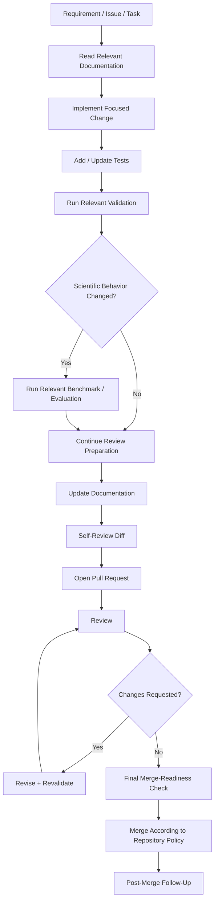
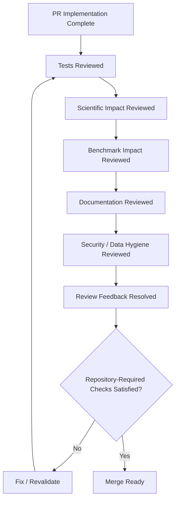
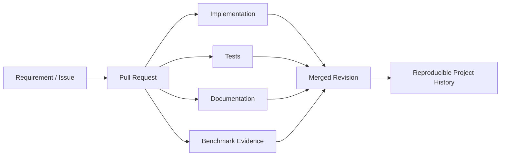

# Pull Request Process

This document defines the pull-request preparation, review, validation, scientific-impact assessment, merge-readiness, and post-merge process for ChandraMap.

It is intended for maintainers, contributors, reviewers, researchers, and AI-assisted development workflows working on the repository.

ChandraMap is scientific software for lunar image correspondence and registration. A pull request therefore needs to be reviewed not only as a software change, but also as a possible change to scientific meaning, benchmark comparability, reproducibility, data contracts, coordinate semantics, and historical scientific versions.

> **A ChandraMap pull request is not only a code-integration unit; it is a review point for software correctness, scientific meaning, reproducibility, documentation, and benchmark comparability.**

> **A pull request should make it easy to understand what changed, why it changed, how it was validated, and whether scientific behavior changed.**

> **One pull request should have one coherent purpose whenever practical.**

> **Scientific methodology changes must be disclosed explicitly; they should never be hidden inside refactoring or cleanup.**

> **Tests establish implementation confidence; benchmark evidence supports scientific-performance claims.**

> **A pull request that changes a documented contract should update the authoritative documentation in the same logical change.**

> **V1 is a historical scientific baseline. A pull request must not silently turn V1 into V2/V3/V4 behavior.**

> **Review scientific meaning as carefully as syntax and software correctness.**

> **A green CI status does not automatically prove scientific correctness.**

> **Screenshots and overlays are useful review artifacts, but they are not substitutes for scientific metrics.**

> **Pull requests should preserve enough context that future maintainers can understand the decision without reconstructing it from commit archaeology.**

This guide is intentionally compatible with both a solo-maintainer workflow and a future multi-contributor repository.

Repository configuration and documented repository policy remain authoritative for exact GitHub requirements such as approvals, status checks, labels, branch protection, merge strategy, templates, or reviewer assignment.

---

## 1. When to Open a Pull Request

A pull request is useful for changes such as:

- feature development;
- bug fixes;
- scientific-method changes;
- architecture changes;
- API or schema changes;
- benchmark changes;
- documentation changes;
- dependency changes;
- repository restructuring;
- substantial refactors;
- research work being promoted into stable project areas.

Pull requests provide a review boundary around a coherent change.

For extremely small maintainer-only changes, the repository's actual contribution and Git policy remains authoritative.

This document does not require a separate pull request for every typo unless project policy explicitly requires that workflow.

---

## 2. Avoid Giant Unrelated Pull Requests

Avoid combining unrelated work such as:

- a new matcher;
- an API redesign;
- a frontend redesign;
- a documentation rewrite;
- a dependency overhaul;
- a benchmark redefinition;

into one pull request merely because the work happened at the same time.

Large unrelated changes make it harder to determine:

- which change caused a regression;
- which scientific behavior changed;
- which tests validate which behavior;
- whether benchmark differences are attributable;
- what should be reverted if something fails.

Combine changes only when they form one genuinely inseparable unit.

---

## 3. One PR, One Coherent Purpose

> **A reviewer should be able to summarize the purpose of a PR in one clear sentence.**

A coherent PR might:

- correct one geometry bug;
- introduce one scientific method into a later version;
- reorganize one architectural responsibility;
- update one API contract;
- revise one benchmark definition.

If the PR requires several unrelated explanations, consider splitting it.

Do not split one naturally atomic change into artificial fragments that cannot be reviewed or used independently.

---

# Pull Request Lifecycle

## 4. Conceptual Lifecycle

A typical ChandraMap pull-request lifecycle is:

```text
Define Change
→ Read Relevant Contracts
→ Implement
→ Add / Update Tests
→ Run Validation
→ Benchmark if Scientific Behavior Changed
→ Update Documentation
→ Self-Review
→ Open PR
→ Review
→ Resolve Feedback
→ Final Validation
→ Merge
→ Post-Merge Follow-Up
```

The exact Git branch and merge mechanics belong to the repository's Git workflow and policy.

---

## 5. Pull Request Lifecycle Diagram



---

# Before Implementation

## 6. Identify the Change Context

Before beginning significant work, identify:

- affected scientific version;
- relevant architecture;
- nearby tests;
- benchmark implications;
- configuration impact;
- API/schema impact;
- data/truth impact;
- documentation authority;
- compatibility risk;
- dependency implications.

Doing this before implementation makes both development and review easier.

---

## 7. Read Relevant Documentation

Depending on the task, relevant documentation may include:

- `../versions/`
- `../algorithms/`
- `../evaluation/`
- `../api/`
- `../architecture/`
- `../sensors/`
- `../datasets/`
- development documentation in this folder.

Do not require contributors to read the entire repository for every small change.

Read the smallest set of documents needed to understand the affected contract.

---

# Pull Request Scope

## 8. Scope Must Be Explicit

A meaningful pull request should make clear:

- what is being changed;
- why it is being changed;
- what adjacent behavior is intentionally not being changed.

Explicit scope reduces review drift and accidental redesign.

---

## 9. In Scope / Out of Scope

For larger pull requests, consider sections such as:

### In Scope

Describe what the PR intentionally changes.

### Out of Scope

Describe related changes intentionally deferred.

These headings are optional for small pull requests.

Do not add ceremony where a two-line description is sufficient.

---

# Pull Request Titles

## 10. Title Quality

A good PR title should be:

- concise;
- specific;
- meaningful;
- understandable without opening the diff;
- action-oriented where appropriate.

Avoid titles such as:

```text
Update project
Fix things
Final changes
New implementation
Improvements
Latest update
```

These are poor long-term history.

---

## 11. Title Convention

Do not require Conventional Commits-style prefixes such as:

```text
feat:
fix:
docs:
refactor:
```

unless the repository explicitly establishes that convention.

The actual repository naming policy remains authoritative.

---

## 12. Illustrative PR Titles

The following are conceptual examples only:

- `Preserve source-to-reference coordinates through pyramid mapping`
- `Refit final transform after sub-pixel inlier refinement`
- `Add V1 benchmark failure-retention documentation`
- `Separate API validation errors from scientific registration failures`
- `Document TMC-2 dataset preparation requirements`

These examples demonstrate clarity, not a mandatory title syntax.

---

# Pull Request Description

## 13. Description Requirements

A substantial PR description should make clear:

- why the change exists;
- what changed;
- what did not change where relevant;
- how the change was validated;
- whether scientific behavior changed;
- whether benchmark semantics changed;
- which documentation changed;
- known limitations;
- compatibility impact where applicable.

A description should summarize behavior rather than merely reproduce the file list.

---

## 14. Recommended Conceptual Structure

If the repository does not define an actual PR template, the following structure is a recommended conceptual format:

```text
## Summary

## Motivation

## Changes

## Validation

## Scientific Impact

## Benchmark Impact

## Documentation

## Compatibility / Migration

## Limitations / Follow-Up
```

This is not an assertion that the repository has or enforces such a GitHub template.

If a real PR template exists, that template is authoritative.

---

## 15. Summary

The summary should explain what the PR does in a few clear sentences.

Avoid copying commit messages into the description.

A reader should understand the overall change without first reading every diff.

---

## 16. Motivation

Explain why the change is needed.

Possible motivations include:

- implementation bug;
- missing requirement;
- scientific correction;
- later-version capability;
- API contract requirement;
- documentation drift;
- benchmark infrastructure improvement;
- maintainability problem;
- security issue.

The motivation helps reviewers judge whether the chosen implementation solves the actual problem.

---

## 17. What Changed

Describe important behavioral or structural changes.

Focus on responsibilities such as:

- changed coordinate conversion;
- new scientific stage;
- revised error semantics;
- updated result schema;
- moved responsibility into the scientific core;
- benchmark configuration change.

Do not turn the section into a raw list of edited files.

---

## 18. What Did Not Change

For sensitive changes, explicitly state important preserved behavior when verified.

Examples might include:

- V1 methodology unchanged;
- benchmark truth unchanged;
- API schema unchanged;
- scientific outputs unchanged;
- documentation-only change.

Do not include these claims unless they are actually true.

---

# Validation and Testing

## 19. Testing Information

Use the repository's testing guide where present.

A pull request should state which relevant tests were:

- added;
- updated;
- run.

Do not write:

> All tests pass.

unless that is actually known from the executed validation.

---

## 20. Test Evidence

Useful test evidence can include:

- regression test added;
- focused component tests run;
- integration tests run;
- full suite run where appropriate;
- coordinate conversion tests;
- failure-path tests;
- contract/schema tests.

Use actual commands and results only when known.

Do not invent repository commands.

---

# Bug Fixes

## 21. Bug-Fix Pull Requests

A bug-fix PR should ideally explain:

- intended behavior;
- observed incorrect behavior;
- root implementation defect where known;
- implemented correction;
- regression test where practical.

A bug fix should restore intended behavior.

It should not be used to disguise a methodological redesign.

---

## 22. Bug vs Scientific Method Change

Examples:

| Change                                                  | Classification                        |
| ------------------------------------------------------- | ------------------------------------- |
| Incorrect x/y conversion                                | Implementation bug                    |
| Wrong source/reference transform direction              | Implementation bug                    |
| Refined points used with stale pre-refinement transform | Implementation bug                    |
| Replace V1 SIFT baseline with a learned matcher         | Scientific methodology/version change |
| Change held-out truth set                               | Benchmark contract change             |
| Change RMSE definition                                  | Evaluation contract change            |

The classification affects the review evidence required.

---

# Scientific Impact Review

## 23. Scientific Impact

Every scientifically relevant PR should consider whether it changes:

- preprocessing;
- sensor routing;
- physical-scale handling;
- feature extraction;
- candidate matching;
- filtering;
- RANSAC/geometric verification;
- transform estimation;
- refinement;
- final refit;
- registration;
- evaluation;
- failure semantics;
- provenance.

Do not assume a small code diff has small scientific impact.

---

## 24. Conceptual Scientific Impact Categories

A PR description may describe its scientific impact using concepts such as:

- **No Scientific Behavior Change**
- **Scientific Bug Fix**
- **Scientific Methodology Change**
- **Evaluation Contract Change**
- **Benchmark Contract Change**
- **Experimental / Research Change**

These are descriptive categories.

They are not asserted to be configured GitHub labels.

---

## 25. Scientific Semantics

Review scientific changes for:

- source/reference direction;
- candidate/inlier distinction;
- fit/check distinction;
- coordinate spaces;
- units;
- transform direction;
- metric population;
- missing-value semantics;
- failure state;
- provenance.

Correct syntax with incorrect scientific semantics is still incorrect.

---

## 26. Candidate vs Verified Inlier

> **A matcher returns candidate correspondences; geometric verification determines model-consistent inliers.**

A PR should not rename matcher output as:

```text
correct_matches
```

without independent justification.

Matcher confidence is not the same as geometric validity.

---

## 27. Verify → Refine → Refit

For V1, preserve:

```text
Candidate Matches
→ RANSAC
→ Verified Inliers
→ Sub-Pixel Refinement
→ Final Refit
```

Review should detect:

- refinement of unverified raw candidates;
- final output using the stale pre-refinement transform;
- documentation diagrams that reverse this order.

> **Verify first, refine second, refit third.**

---

## 28. Fit vs Check

> **Fit data estimate the model; held-out check data evaluate it.**

Review should prevent independent evaluation data from leaking into:

- transform fitting;
- pair-specific tuning;
- model selection;
- manual rescue decisions.

---

# Scientific Domain Review

## 29. Physical Scale

> **Compare information, not pixel count.**

Review resampling and pyramid changes for physical-scale correctness.

Do not accept claims that upsampling reconstructs missing lunar surface detail.

---

## 30. Illumination

Different Sun angles can alter:

- shadow direction;
- shadow extent;
- visible feature structure;
- local terrain appearance.

Do not approve unsupported statements such as:

> Contrast normalization makes the method Sun-angle invariant.

A normalization operation and actual illumination invariance are different claims.

---

## 31. Geometry

> **The Moon is not a flat poster.**

Affine transforms and homographies can be useful local approximations.

Review should confirm that documentation and implementation do not treat one planar transform as a universal model for all lunar terrain and viewing geometry.

---

# Sensor Impact Review

## 32. Sensor Scope

A scientifically relevant PR should identify which sensors or reference products are affected where applicable.

Important ChandraMap contexts include:

- OHRC;
- TMC-2;
- IIRS;
- LRO NAC;
- LRO WAC.

---

## 33. IIRS Review

IIRS is hyperspectral / imaging-infrared data.

PRs affecting IIRS should preserve distinctions among:

- parent hyperspectral product;
- selected/derived representation;
- derived 2D registration representation;
- representation provenance;
- scale limitations;
- modality limitations.

Do not implicitly feed an entire IIRS cube into code that assumes ordinary grayscale imagery.

---

## 34. Product Metadata

> **Product metadata wins over approximate sensor summaries.**

Review scientifically relevant changes for hard-coded approximations such as generic sensor GSD when product-specific metadata should be used.

Approximate project-level values are useful context.

They are not replacements for authoritative product metadata.

---

# Scientific Version Review

## 35. V1 Impact

V1 is the classical known-overlap registration baseline.

Relevant V1 documentation may include:

- `../versions/v1/specification.md`
- `../versions/v1/scope.md`
- `../versions/v1/requirements.md`
- `../versions/v1/pipeline.md`
- `../versions/v1/benchmark.md`
- `../versions/v1/acceptance-criteria.md`

A PR affecting official V1 behavior should identify whether it is primarily:

- implementation correction;
- documentation correction;
- requirement clarification;
- methodology change.

These are not equivalent.

---

## 36. V1 Baseline Protection

> **Later-version improvements should not silently redefine the historical V1 baseline.**

V1 exists partly to provide reproducible comparison against later scientific versions.

Historical meaning is therefore part of the scientific contract.

---

## 37. V2 / V3 / V4 Changes

Later-version work should remain version-aware.

Do not silently insert capabilities such as:

- learned matching;
- global retrieval;
- FAISS-based candidate search;
- DEM-aware geometry;
- additional multimodal logic;

into V1 unless an explicit version/specification decision changes V1.

---

## 38. Version Impact

Where relevant, a PR should distinguish:

- scientific version impact;
- API version impact;
- schema version impact;
- benchmark version impact;
- truth version impact.

Do not summarize all of these as:

> version changed.

They represent different compatibility dimensions.

---

# Benchmark Impact

## 39. Benchmark Review

Use `benchmarking.md` where present.

A PR should state whether it:

- does not affect benchmark semantics;
- changes scientific outputs while keeping the benchmark contract unchanged;
- changes benchmark infrastructure;
- changes benchmark definition;
- changes truth;
- changes metrics;
- changes pair population;
- changes evaluation categories.

Benchmark changes can alter the meaning of comparisons even when no core algorithm changes.

---

## 40. Benchmark Evidence

If a PR claims scientific improvement, provide relevant benchmark evidence.

Do not support claims such as:

> accuracy improved

with only:

- one screenshot;
- a prettier overlay;
- candidate match count;
- one manually selected pair.

Tests and visual evidence have different roles from benchmarking.

---

## 41. Benchmark Fairness

Review benchmark comparisons for consistency in:

- compatible pair population;
- truth data;
- check points;
- metrics;
- coordinate conventions;
- failure handling;
- configuration;
- preprocessing assumptions;
- hardware context for runtime claims.

Differences must be disclosed rather than hidden.

---

## 42. No Benchmark Leakage

Held-out evaluation truth should not be used for:

- model fitting;
- pair-specific threshold tuning;
- algorithm selection using final benchmark outcomes;
- manual rescue of individual final pairs.

A PR introducing such leakage undermines benchmark validity.

---

## 43. Failed Pairs

> **Failed valid benchmark pairs must not disappear merely because a PR performs poorly on them.**

Failure rate is part of scientific performance.

Filtering benchmark populations after observing outcomes can create misleading results.

---

## 44. Benchmark Claims

Avoid claims such as:

- best;
- most accurate;
- superior;
- robust;
- invariant;
- state-of-the-art;
- sub-pixel accurate;

without evidence supporting the exact statement.

---

# Metric Review

## 45. Metric Changes

Where present, use `../evaluation/metrics.md`.

A metric-related PR should consider:

- definition;
- units;
- population;
- coordinate space;
- missing-value semantics;
- aggregation;
- backwards compatibility.

A field retaining the same name but acquiring a different definition is a breaking scientific change.

---

## 46. RMSE

Distinguish:

```text
fit residual / fit RMSE
```

from:

```text
held-out check-point RMSE
```

Do not describe fit RMSE as independent accuracy.

---

## 47. Ground-Space Error

Do not approve metre-error conversion derived blindly from approximate sensor GSD.

Valid ground-space conversion requires appropriate geospatial/product context.

---

## 48. Spatial Coverage

Spatial coverage measures support distribution.

It does not directly measure registration accuracy.

A PR should not rename or describe coverage as accuracy.

---

# Retrieval Changes

## 49. Retrieval Pull Requests

For later-version retrieval work, preserve separation between:

```text
Global Retrieval
```

and:

```text
Local Registration
```

Potential later retrieval components may include:

- global descriptors;
- Top-K candidate retrieval;
- vector indexes.

---

## 50. FAISS

FAISS performs vector similarity search/indexing.

Do not describe FAISS as image registration.

The conceptual distinction is:

```text
Embedding
→ FAISS Search
→ Candidate Region
```

followed separately by local correspondence and registration.

---

## 51. Retrieval Metrics

Metrics such as:

- Recall@1;
- Recall@5;
- Recall@K;

evaluate retrieval.

They are not the same as:

- registration RMSE;
- inlier count;
- inlier ratio;
- check-point error.

Keep their interpretation separate.

---

# API Review

## 52. API Impact

Relevant API documentation may include:

- `../api/README.md`
- `../api/endpoints.md`
- `../api/schemas.md`
- `../api/error-codes.md`
- `../api/versioning.md`

A PR changing an API contract should identify, where applicable:

- request changes;
- response changes;
- field semantics;
- error behavior;
- compatibility impact;
- schema/version impact.

Concrete API details must come from the actual contract.

---

## 53. API and Scientific Core

> **API code should transport and orchestrate scientific behavior, not implement a second scientific pipeline.**

Review API PRs for duplicated scientific logic.

---

## 54. API Success vs Scientific Success

Preserve distinctions among:

- request/transport status;
- execution status;
- scientific registration status;
- evaluation availability.

A successfully processed API request can legitimately return a scientific failure result.

Do not collapse those states.

---

# Backend and Frontend Review

## 55. Backend Impact

Use `../architecture/backend-architecture.md` where present.

Backend code should generally focus on:

- orchestration;
- resource resolution;
- execution;
- serialization;
- service behavior.

Do not duplicate the scientific core inside backend handlers or service wrappers.

---

## 56. Frontend Impact

Use `../architecture/frontend-architecture.md` where present.

Frontend PRs should preserve authoritative:

- units;
- metric semantics;
- scientific failure states;
- source/reference identity;
- version semantics.

Do not calculate authoritative:

- RMSE;
- RANSAC;
- transforms;
- benchmark success criteria;

in the frontend when these belong to the scientific core.

---

# Configuration Review

## 57. Configuration Can Change Science

A configuration-only PR can materially change scientific behavior.

Review configuration changes for:

- threshold changes;
- matcher changes;
- transform-model changes;
- preprocessing changes;
- evaluation changes;
- sensor-route changes.

Do not treat configuration-only PRs as automatically low-risk.

---

## 58. Hidden Defaults

Scientifically meaningful parameters should not move into hidden defaults without appropriate traceability and documentation.

A formal result should remain understandable from its resolved configuration.

---

# Dependency Review

## 59. Dependency Changes

A PR adding or upgrading a dependency should explain, where relevant:

- why it is needed;
- whether existing dependencies already solve the problem;
- whether it is core or optional/research-only;
- security implications;
- reproducibility implications;
- platform/system requirements;
- GPU/accelerator requirements;
- V1 impact.

Dependency changes are architectural changes when they alter installation or execution requirements.

---

## 60. Optional Research Dependencies

Do not make later-version tools such as learned matchers or retrieval libraries mandatory for V1 without an explicit scientific/architectural reason.

Examples of possible later research dependencies include:

- LightGlue;
- LoFTR;
- FAISS.

Their mere existence in the project does not make them V1 requirements.

---

## 61. Lockfile Changes

Review lockfile changes for intentionality.

Avoid unrelated dependency churn.

Use the package manager and dependency policy actually defined by the repository.

---

# Security Review

## 62. Security-Sensitive Changes

Use [`../../SECURITY.md`](../../SECURITY.md).

Where relevant, review PRs for:

- secrets;
- unsafe path handling;
- unsafe deserialization;
- arbitrary file access;
- shell injection;
- unnecessary network/service exposure;
- sensitive logging;
- unvalidated external or uploaded data.

---

## 63. Manual Secret Review

Even where automated security tooling may exist, contributors and reviewers should avoid exposing:

- API tokens;
- passwords;
- credentials;
- private certificates;
- private keys;
- real `.env` values.

Do not claim automated secret scanning is configured unless verified.

---

# Data and Artifact Review

## 64. Large Scientific Data

Mission products should not enter Git casually.

Review for accidental inclusion of large assets such as:

- OHRC imagery;
- TMC-2 imagery;
- IIRS cubes;
- LRO NAC/WAC imagery;
- terrain products;
- large rasters.

Data handling should follow actual repository policy.

---

## 65. Data Licensing

Use `../data-licenses.md` where present.

Before accepting mission-derived fixtures or other data files, verify:

- redistribution terms;
- attribution needs;
- repository data policy.

Do not assume publicly accessible scientific data can automatically be redistributed through Git.

---

## 66. Results and Artifacts

Use [`repository-structure.md`](repository-structure.md).

Review whether generated:

- result files;
- registered previews;
- plots;
- debug images;
- logs;
- caches;
- temporary exports;

actually belong in Git.

Do not commit generated output merely because it was useful during development.

---

## 67. Visual Artifacts

Small screenshots or visualizations can help review UI or registration behavior.

> **A visually convincing registered preview is not quantitative benchmark evidence.**

Visual review and scientific evaluation should remain separate.

---

# Documentation Impact

## 68. Contract Changes Require Documentation Review

Use [`documentation-guide.md`](documentation-guide.md).

A change affecting documented behavior should update the relevant authoritative documentation.

Examples include changes to:

- scientific pipeline;
- metric semantics;
- result schema;
- API contracts;
- configuration;
- architecture;
- benchmark definitions.

---

## 69. Documentation Authority

Do not resolve inconsistency by copying the corrected explanation into multiple files.

Update the primary documentation authority and update summaries/links where needed.

---

## 70. Documentation-Only Pull Requests

Documentation-only PRs still require review for:

- factual correctness;
- scientific terminology;
- implementation status;
- relative links;
- duplicate authority;
- unsupported claims;
- version semantics.

A docs-only PR can still introduce scientific misinformation.

---

## 71. Test-Only Pull Requests

A test-only PR should explain which behavior, invariant, or regression the test protects.

Do not weaken a valid test merely because the current implementation does not pass it.

First determine whether:

- implementation is wrong;
- test is wrong;
- specification has changed.

---

## 72. Benchmark-Only Pull Requests

Benchmark-definition changes deserve scientific review even when no production code changes.

Changes to:

- truth;
- pair population;
- metrics;
- categories;
- failure policy;

can materially change future conclusions.

---

# Repository Structure and Refactoring

## 73. Repository-Structure Pull Requests

Use [`repository-structure.md`](repository-structure.md).

Substantial structure PRs should explain:

- why the move is needed;
- import effects;
- configuration effects;
- CI/build effects;
- documentation-link effects;
- benchmark/result path effects.

File movement is not automatically architecture improvement.

---

## 74. Refactor Pull Requests

A refactor PR may state:

> No intended scientific behavior change.

only when that is actually the intent and evidence supports it.

If scientifically relevant outputs change materially after the refactor, investigate before merging.

A refactor can expose or introduce scientific behavior differences even when interfaces remain unchanged.

---

## 75. Formatting Pull Requests

Large formatting changes should generally be separated from scientific behavior changes when doing so improves reviewability.

Mixing both can hide meaningful changes inside large mechanical diffs.

---

## 76. File Moves

Separate large file moves from algorithm changes where practical.

This improves:

- diff readability;
- history tracing;
- review confidence.

---

# Reviewer Responsibilities

## 77. Review Dimensions

Reviewers should evaluate the PR across several dimensions.

### Scope

Is the PR coherent and appropriately focused?

### Functional Correctness

Does it implement the intended behavior?

### Scientific Meaning

Are scientific roles, units, coordinate spaces, metrics, and failure semantics correct?

### Architecture

Does the implementation live in the correct layer?

### Tests

Are important behaviors and regressions covered?

### Benchmarks

Are scientific-performance claims supported?

### Reproducibility

Can significant results be traced to appropriate context?

### Security

Are input, path, secret, dependency, and data concerns handled safely?

### Documentation

Are affected contracts documented?

### Maintainability

Is the implementation understandable and appropriately simple?

---

## 78. Practical Review Order

A useful review order is:

1. read title and description;
2. understand intended behavior;
3. inspect relevant specification/docs;
4. review scope and architecture;
5. review tests;
6. inspect implementation;
7. verify scientific semantics;
8. inspect benchmark impact;
9. inspect documentation/security/dependency changes;
10. review final diff holistically.

This order is recommended, not mandatory.

---

## 79. Scientific Review Questions

Reviewers should ask:

1. Which scientific version is affected?
2. Are source and reference roles preserved?
3. Are coordinate spaces explicit?
4. Is x/y vs row/column handled correctly?
5. Is transform direction correct?
6. Is physical scale interpreted correctly?
7. Are candidate matches distinct from verified inliers?
8. Are verified inliers distinct from independent truth?
9. Is verify → refine → refit preserved?
10. Are fit and check data separated?
11. Are metric units and populations explicit?
12. Are unavailable metrics handled honestly?
13. Is ground-space conversion scientifically valid?
14. Are failure states explicit?
15. Is V1 being redefined?
16. Does benchmark comparability change?

---

## 80. Software Review Questions

Reviewers should ask:

1. Is responsibility in the correct layer?
2. Is the code understandable?
3. Is naming consistent with repository terminology?
4. Is duplication justified?
5. Are dependencies necessary?
6. Are exceptions handled appropriately?
7. Are tests meaningful?
8. Is configuration traceable?
9. Are docs updated?
10. Is security preserved?

---

## 81. Benchmark Review Questions

Reviewers should ask:

1. Did the pair population change?
2. Did truth change?
3. Did check points change?
4. Did metric definitions change?
5. Did configuration policy change?
6. Are failures retained?
7. Was any pair tuned manually?
8. Is runtime comparison fair?
9. Is retrieval being confused with registration?
10. Are claims supported by evidence?

---

## 82. API Review Questions

Where relevant, review:

- request/response field semantics;
- unavailable/null behavior;
- API errors vs scientific failure;
- version fields;
- transform direction;
- units;
- coordinate spaces;
- compatibility.

---

## 83. Security Review Questions

Review:

- secret exposure;
- path safety;
- untrusted input;
- serialization;
- logs;
- credentials;
- dependency risk;
- arbitrary file access.

---

# Review Comments

## 84. Comment Quality

Review comments should be:

- specific;
- respectful;
- actionable;
- tied to behavior, contracts, or maintainability.

Avoid long arguments about personal style when repository conventions already resolve the matter.

---

## 85. Blocking vs Non-Blocking

Do not invent formal GitHub labels unless the repository uses them.

Conceptually:

### Blocking

Must be resolved before merge.

### Non-Blocking

Suggestion or follow-up that does not prevent correctness.

---

## 86. Scientific Blockers

Examples of issues that should normally block merge include:

- held-out truth leakage;
- incorrect transform direction;
- stale transform after refinement;
- invalid metric semantics;
- hidden V1 methodology changes;
- dropped benchmark failures;
- fabricated accuracy claims;
- incorrect source/reference mapping.

These are scientific correctness defects, not stylistic preferences.

---

## 87. Addressing Review Feedback

The PR author should:

- understand the review concern;
- update code/docs/tests where necessary;
- explain disagreements using evidence;
- rerun relevant validation;
- avoid resolving important scientific comments without addressing the underlying problem.

---

## 88. Review Discussion as Design History

Important conclusions should ideally be encoded into durable project artifacts such as:

- code;
- tests;
- documentation;
- specification;
- ADR where appropriate.

Do not rely on a PR comment thread as the only permanent explanation of an important design decision.

---

# Self-Review

## 89. Self-Review Principle

For a solo-maintained repository, self-review is especially important.

> **Review your own pull request as if it were submitted by someone who will not be available to explain it later.**

A fresh diff review often catches:

- debug code;
- accidental files;
- confusing naming;
- undocumented scientific changes;
- weak tests;
- unrelated edits.

---

## 90. Self-Review Checks

Before requesting review or merging, inspect:

- final diff;
- changed-file list;
- tests;
- documentation;
- generated files;
- dependency changes;
- configuration changes;
- benchmark impact;
- secrets;
- debug code;
- commented-out code;
- temporary artifacts.

---

## 91. Solo-Maintainer Workflow

ChandraMap can use a professional PR process without pretending that multiple reviewers exist.

A lightweight solo workflow may include:

```text
Focused Branch
→ Focused Change
→ Tests
→ Benchmark Evidence if Needed
→ Documentation
→ Pull Request
→ Self-Review
→ Merge-Readiness Check
→ Merge
```

Do not invent multi-person approval requirements for a repository that does not have them.

---

## 92. Why Use Pull Requests When Working Alone?

Pull requests remain useful because they provide:

- a structured self-review point;
- readable change history;
- recorded motivation;
- validation evidence;
- benchmark context;
- documentation context;
- portfolio-quality repository history;
- easier future collaboration;
- easier investigation and rollback.

A PR is useful even when the author and maintainer are the same person.

---

# Draft and Review State

## 93. Draft Pull Requests

Where GitHub draft PRs are available and useful, they can support:

- early feedback;
- architecture discussion;
- visible work in progress;
- automated checks before final review.

Draft PRs are not asserted as mandatory.

---

## 94. Ready for Review

A PR is generally ready for serious review when:

- its purpose is clear;
- major implementation is complete;
- relevant tests exist;
- obvious debug artifacts are removed;
- documentation is updated where needed;
- known blockers are disclosed.

Draft discussions do not require the same final polish.

---

# Continuous Integration

## 95. CI and Automated Checks

Where GitHub Actions or another CI system is configured, use the actual repository checks as authoritative.

CI may validate areas such as:

- tests;
- linting;
- build;
- type checking;
- documentation;
- contracts;

depending on current configuration.

Do not invent CI job names or required checks.

---

## 96. Green CI

> **Green CI is necessary evidence when required by repository policy, but it is not sufficient evidence of scientific correctness.**

CI can prove automated checks passed.

It does not automatically prove:

- benchmark fairness;
- correct scientific semantics;
- valid metric interpretation;
- absence of truth leakage;
- correct scientific-version behavior.

---

## 97. Red CI

Investigate why a check failed.

Possible causes include:

- implementation defect;
- regression;
- test defect;
- environment issue;
- build failure;
- workflow problem;
- intermittent/flaky behavior.

Do not repeatedly rerun failing checks without understanding the failure.

---

## 98. Full Scientific Benchmarks and CI

Do not assume the complete lunar benchmark runs on every pull request.

Large scientific evaluations may be too expensive for ordinary CI.

Use the actual benchmark workflow described by the repository.

---

## 99. CI Logs

Review the relevant failure output.

Do not expose:

- secrets;
- private credentials;
- sensitive data;
- unnecessary private paths;

when copying CI logs into PR discussions.

---

# Merge Readiness

## 100. Merge-Ready State

A pull request is conceptually merge-ready when:

- scope is understood;
- intended behavior is implemented;
- blocking review concerns are resolved;
- relevant tests pass;
- scientific impact is understood;
- benchmark impact is understood;
- documentation is aligned;
- security concerns are resolved;
- no accidental files remain;
- compatibility implications are understood.

Actual required checks and approvals come from repository configuration.

---

## 101. Merge-Readiness Flow



---

# Merge Strategy

## 102. Repository Policy Is Authoritative

Use the merge strategy defined by actual repository policy.

Possible GitHub strategies can include:

- merge commit;
- squash merge;
- rebase merge.

This document does not impose one.

Use `git-workflow.md` where present for Git-history conventions.

---

## 103. Squash Merge

Conceptually, squash merging may reduce noisy commit history.

However, it can also remove meaningful intermediate history.

Use it according to project policy and the nature of the change.

---

## 104. Merge Commit

A merge commit may preserve branch history and the PR boundary.

This document does not require it.

---

## 105. Rebase Merge

A rebase merge may preserve a linear history.

This document does not require it.

---

## 106. History Principle

> **Preserve useful history without preserving meaningless noise.**

History should help future maintainers understand why the project changed.

---

# Scientific Merge Blockers

## 107. Do Not Merge Known Scientific Corruption

Examples include:

- wrong transform direction;
- held-out check-point leakage;
- unavailable metrics encoded as zero;
- silent removal of benchmark failures;
- candidate/inlier confusion;
- stale transform after refinement;
- accidental replacement of V1 methodology.

These should not be postponed as cosmetic follow-up work.

---

## 108. Deferred Follow-Up

Non-blocking improvements may be documented for future work.

Do not use future follow-up as justification for merging known:

- correctness defects;
- scientific-integrity defects;
- security defects.

---

# Post-Merge Process

## 109. After Merge

Where appropriate:

- verify integrated branch/CI state;
- close or resolve linked tasks;
- remove short-lived branches according to repository policy;
- record follow-up work;
- preserve formal benchmark evidence;
- update roadmap or changelog where policy requires.

---

## 110. Post-Merge Scientific Verification

For major scientific changes, ensure the formal benchmark evidence corresponds to the merged code state or clearly records the exact revision that produced the results.

Do not report benchmark evidence from an undocumented intermediate state as though it came from the final merged revision.

---

# Reverts

## 111. Reverting a Merged PR

Use `git-workflow.md` where present.

If a merged PR creates a serious regression, a revert or corrective PR may be appropriate.

Do not rewrite shared history casually.

---

## 112. Scientific Reverts

When reverting a scientific methodology change, document why.

Where relevant, include:

- regression evidence;
- benchmark evidence;
- compatibility impact.

This preserves scientific decision history.

---

# Compatibility Review

## 113. Compatibility Dimensions

Review compatibility across relevant areas such as:

- public Python/module interfaces;
- API contracts;
- result schemas;
- scientific configuration;
- benchmark definitions;
- file paths;
- stored results;
- documentation links.

A change can be backwards-compatible in one dimension and incompatible in another.

---

## 114. API Breaking Changes

Use `../api/versioning.md` where present.

Do not silently rename or redefine:

- API fields;
- error semantics;
- version fields;
- status semantics.

Review compatibility explicitly.

---

## 115. Scientific Compatibility

A change can be software-compatible while scientifically incompatible.

Example:

```text
same function signature
```

but:

```text
RMSE now evaluates a different point population
```

This is a scientific contract change despite identical syntax.

---

## 116. Configuration Compatibility

Renaming or changing scientific configuration fields can affect historical reproducibility.

Treat configuration schemas as part of scientific traceability.

---

## 117. Result Compatibility

Do not reuse an existing result field name with a materially different meaning.

Prefer an explicit schema/version evolution over semantic reuse.

---

## 118. Benchmark Compatibility

Changing:

- pair population;
- truth;
- metrics;
- categories;
- failure policy;

may require a new benchmark version according to evaluation governance.

---

# Reproducibility Review

## 119. Reproducibility

Use `../evaluation/reproducibility.md` where present.

Scientifically significant PRs should preserve traceability to:

- code revision;
- scientific version;
- configuration;
- source/reference identity;
- benchmark;
- truth;
- environment where relevant;
- randomness where relevant.

---

## 120. Git Revision Is Not Enough

A Git revision identifies code state.

It does not automatically identify:

- scientific input data;
- configuration;
- benchmark truth;
- dependency environment;
- randomness.

Do not treat the commit hash as complete scientific provenance.

---

# Pull Request Traceability

## 121. Traceability Goal

A mature PR should help connect:

```text
Requirement / Issue
→ Implementation
→ Tests
→ Documentation
→ Benchmark Evidence
→ Merged Revision
```

This improves debugging, review, research reproducibility, and long-term maintenance.

---

## 122. Traceability Diagram



---

## 123. Issue Linking

Where a relevant issue or task exists, linking it can provide useful context.

Do not require an issue for every PR unless repository policy explicitly does so.

---

## 124. Commits Inside the PR

Use `git-workflow.md` where present.

Commits should be meaningful enough for review and history.

Do not prioritize perfect commit aesthetics over correctness and coherent PR scope.

---

# Pull Request Size

## 125. No Arbitrary Line Limit

Do not impose an arbitrary PR line-count limit unless repository policy defines one.

A PR is too large when reviewers cannot reasonably understand its purpose, architecture, and correctness because unrelated concerns are mixed together.

---

## 126. Large Necessary Pull Requests

Some migrations or refactors may legitimately be large.

Improve reviewability using:

- clear scope;
- architecture explanation;
- separated logical commits where useful;
- tests;
- diagrams;
- migration notes;
- explicit follow-up boundaries.

---

## 127. Small Pull Requests

Small PRs are useful when they remain meaningful.

Do not split one coherent change into multiple artificial PRs that are individually broken or impossible to evaluate.

---

## 128. Dependent Pull Requests

If one PR depends on another, state the dependency and expected order explicitly.

Do not assume stacked-PR tooling unless the repository actually uses it.

---

# Repository-Specific GitHub Features

## 129. Labels

If GitHub labels are used, use the actual repository labels.

Do not invent existing labels such as:

- `scientific-change`
- `benchmark-impact`
- `breaking-change`

unless they actually exist.

Such phrases may still be used descriptively in PR prose.

---

## 130. Milestones

Do not require GitHub milestones unless the repository uses them.

---

## 131. Reviewer Assignment

Do not invent required reviewer roles.

If the project later develops specialized reviewers, scientific, security, architecture, or API changes may benefit from relevant expertise.

Current repository policy remains authoritative.

---

## 132. CODEOWNERS

If a `CODEOWNERS` configuration exists, follow its actual rules.

Do not assume it exists.

---

## 133. Approval Count

Do not invent mandatory approval counts.

Use branch-protection and repository policy as the source of truth.

---

## 134. Solo Maintainer and Approval

Do not invent GitHub permission rules or imaginary reviewers.

A solo maintainer may rely on structured self-review until additional maintainers exist.

---

# AI-Generated Pull Requests

## 135. AI-Generated Changes

AI-generated code and documentation must meet the same standards as human-authored changes.

A human maintainer or reviewer should independently verify:

- scope;
- implementation;
- tests;
- scientific semantics;
- benchmark impact;
- documentation;
- security;
- dependency changes.

Do not merge solely because an AI-generated summary claims validation succeeded.

---

## 136. AI-Generated Documentation

Review generated documentation carefully for fabricated:

- file paths;
- commands;
- implementation status;
- benchmark values;
- APIs;
- URLs;
- scientific claims;
- configuration fields.

Generated prose can sound authoritative while being wrong.

---

## 137. AI-Generated Scientific Code

Review especially carefully for:

- x/y vs row/column mistakes;
- transform-direction mistakes;
- scale assumptions;
- fit/check leakage;
- metric implementation errors;
- missing-value misuse;
- identity-transform fallback;
- candidate/inlier confusion;
- stale transform after refinement.

---

## 138. AI-Generated Tests

Ensure generated tests validate independent intended behavior.

A test that simply reproduces the implementation's own assumptions may pass while failing to detect the underlying bug.

---

# Visual and Performance Evidence

## 139. Screenshots

Screenshots and overlays may support:

- UI review;
- qualitative registration inspection;
- visualization comparison.

Always distinguish:

```text
Visual Review Artifact
```

from:

```text
Scientific Benchmark Evidence
```

---

## 140. Performance Claims

A PR claiming improved runtime should provide comparable environment context where possible.

Relevant context can include:

- hardware;
- input size;
- scientific configuration;
- code revision;
- dependency environment.

Do not compare runtime across different hardware without disclosure.

---

## 141. Accuracy Claims

Do not write:

> accuracy improved

without identifying:

- metric;
- evaluation population;
- benchmark;
- scientific version;
- failure handling.

Accuracy is not synonymous with:

- match count;
- inlier ratio;
- coverage;
- retrieval score.

---

## 142. Failure Disclosure

If a method improves one class of cases but introduces new failures elsewhere, disclose the trade-off.

Do not report only favorable pairs.

---

## 143. Known Limitations

Substantial PRs should disclose known limitations where they materially affect interpretation or future maintenance.

Clear limitations improve review quality.

---

## 144. Completion Claims

Do not write:

- "V2 complete";
- "API finished";
- "all sensors supported";
- "registration solved";

unless authoritative scope and acceptance evidence support the claim.

---

# Repository-Wide Metadata Impact

## 145. Changelog

Use [`../../CHANGELOG.md`](../../CHANGELOG.md) according to repository policy.

A PR may require a changelog entry when appropriate.

Do not require one for every small change unless policy says so.

---

## 146. Roadmap

Use [`../../ROADMAP.md`](../../ROADMAP.md).

If a PR genuinely completes or changes a roadmap item, update the roadmap where appropriate.

Do not mark a roadmap goal complete because only one part of the work landed.

---

## 147. Citation Metadata

Use [`../../CITATION.cff`](../../CITATION.cff).

Ordinary PRs should not modify citation metadata unless citation/release information actually changed.

---

## 148. License

Use [`../../LICENSE`](../../LICENSE).

PRs adding third-party code or dependencies should respect applicable licenses.

Do not treat this guide as legal advice.

---

## 149. Third-Party Code

Where external code is added directly, identify as appropriate:

- original source;
- license;
- reason for inclusion;
- modifications.

Prefer normal dependency mechanisms over copy-pasting external source when appropriate and permitted.

---

# Research Code Promotion

## 150. Promoting Research Work

Before research code moves into a stable scientific pipeline, the PR should address:

- architecture;
- tests;
- dependencies;
- scientific-version ownership;
- benchmark evidence;
- documentation;
- failure semantics;
- reproducibility.

Research success alone does not make an experiment production-ready.

---

## 151. Research vs Stable PRs

Experimental PRs inside dedicated research areas may have different maturity expectations.

However, experimental behavior must not silently become official V1 behavior.

Keep the boundary explicit.

---

# PR Classification

## 152. Review Focus by PR Type

| PR Type                  | Primary Review Focus                             |
| ------------------------ | ------------------------------------------------ |
| Documentation            | Accuracy, links, claims, source of truth         |
| Bug Fix                  | Regression test, intended behavior               |
| Refactor                 | Behavior preservation                            |
| Scientific Method Change | Version impact, tests, benchmark evidence        |
| Benchmark Change         | Comparability, truth, metrics, failure policy    |
| API / Schema Change      | Compatibility, semantics, versioning             |
| Dependency Change        | Need, security, reproducibility                  |
| Repository Structure     | Ownership, imports, CI, links                    |
| Research / Experiment    | Isolation, reproducibility, promotion boundaries |

---

## 153. Scientific Impact Review Table

| Change Area    | Review Concern                        |
| -------------- | ------------------------------------- |
| Preprocessing  | Representation and scientific meaning |
| Scale handling | GSD, resampling, coordinate mapping   |
| Matching       | Candidate semantics                   |
| RANSAC         | Verification and model support        |
| Transform      | Direction, model, coordinate space    |
| Refinement     | Verify → refine → refit               |
| Evaluation     | Fit/check independence                |
| Metrics        | Units, population, availability       |
| Sensor routing | Correct representation path           |
| Benchmark      | Frozen comparability                  |
| Retrieval      | Separation from registration          |

---

# PR Author Checklist

## 154. Author Checklist

### Scope

- [ ] PR has one coherent purpose
- [ ] In-scope behavior is clear
- [ ] Out-of-scope work is clear where useful
- [ ] Unrelated changes are excluded

### Description

- [ ] Summary explains what changed
- [ ] Motivation explains why
- [ ] Important preserved behavior is stated where relevant
- [ ] Limitations/follow-up are disclosed where relevant

### Code / Architecture

- [ ] Code lives in the correct repository layer
- [ ] Core scientific logic is not duplicated in API/frontend
- [ ] No unnecessary abstraction/dependency was introduced
- [ ] No unrelated formatting/restructure noise is included

### Scientific Integrity

- [ ] Scientific version impact is identified
- [ ] Source/reference semantics remain explicit
- [ ] Coordinate spaces remain correct
- [ ] Transform direction remains correct
- [ ] Candidate/inlier terminology remains correct
- [ ] Verify→refine→refit ordering remains correct
- [ ] Fit/check separation remains correct
- [ ] Missing metrics are not encoded as zero
- [ ] Failure behavior remains explicit
- [ ] V1 is not silently redefined

### Testing

- [ ] Relevant tests were run
- [ ] New behavior has tests where appropriate
- [ ] Bug fix has regression coverage where practical
- [ ] Failure paths are covered where relevant
- [ ] No test was weakened merely to pass the PR

### Benchmarking

- [ ] Benchmark impact is stated
- [ ] Relevant benchmark was run if performance claims are made
- [ ] Same compatible truth/metrics/population were used
- [ ] Failed valid pairs remain included
- [ ] No held-out truth was used for tuning
- [ ] Runtime claims include environment context

### API / Contracts

- [ ] API/schema impact is identified
- [ ] Scientific status remains distinct from API status
- [ ] Null/unavailable semantics remain correct
- [ ] Breaking changes are disclosed

### Data / Security

- [ ] No secrets are present
- [ ] No real `.env` values are present
- [ ] No accidental large mission data is committed
- [ ] Data licensing has been considered
- [ ] Path/input handling is safe where relevant

### Documentation

- [ ] Authoritative docs were updated
- [ ] Related links remain valid
- [ ] Planned features are not presented as implemented
- [ ] No unsupported scientific claims were introduced
- [ ] CHANGELOG/ROADMAP impact was considered

### Repository Hygiene

- [ ] No unnecessary caches/build files are included
- [ ] No accidental generated artifacts are included
- [ ] Dependency/lockfile changes are intentional
- [ ] PR diff was self-reviewed

---

# Reviewer Checklist

## 155. Reviewer Checklist

### Intent

- [ ] PR purpose is understandable
- [ ] Scope is coherent
- [ ] Description matches implementation

### Software Correctness

- [ ] Implementation follows intended contract
- [ ] Architecture boundaries are preserved
- [ ] Error handling is appropriate
- [ ] Dependencies are justified

### Scientific Correctness

- [ ] Source/reference direction is correct
- [ ] Coordinates/units are explicit
- [ ] Scale assumptions are valid
- [ ] Candidate/inlier semantics are correct
- [ ] RANSAC inliers are not treated as truth
- [ ] Verify→refine→refit order is correct
- [ ] Fit/check separation is preserved
- [ ] Metrics retain correct population/units/space
- [ ] Missing metrics remain unavailable
- [ ] Failure state is honest

### Versioning / Benchmarking

- [ ] V1 behavior remains historically understandable
- [ ] Later-version behavior is isolated appropriately
- [ ] Benchmark-definition changes are explicit
- [ ] Truth/metric/config changes are disclosed
- [ ] Performance claims have evidence
- [ ] Retrieval and registration are not conflated

### Validation

- [ ] Tests are meaningful
- [ ] Regression tests exist where appropriate
- [ ] CI results are reviewed where configured
- [ ] Benchmark evidence is reviewed where applicable

### Security / Data

- [ ] No secrets are exposed
- [ ] No unsafe file/path behavior is introduced
- [ ] No accidental large data is added
- [ ] Third-party/dependency changes are appropriate

### Documentation

- [ ] Relevant docs are updated
- [ ] Links are correct
- [ ] Implementation status is accurate
- [ ] Limitations are disclosed where necessary

### Merge Readiness

- [ ] Blocking review concerns are resolved
- [ ] No unresolved scientific correctness issue remains
- [ ] Repository-required checks are satisfied
- [ ] Final diff remains focused

---

# Merge-Readiness Checklist

## 156. Final Check

- [ ] PR purpose remains clear after review
- [ ] Requested changes are addressed
- [ ] Relevant tests pass
- [ ] Required repository checks pass where configured
- [ ] Scientific impact is understood
- [ ] Benchmark impact is understood
- [ ] Documentation is aligned
- [ ] No security issue remains
- [ ] No accidental data/artifact remains
- [ ] Compatibility impact is understood
- [ ] Merge strategy follows repository policy

---

# Pull Request Anti-Patterns

## 157. Avoid These Practices

Do not:

- open giant unrelated PRs;
- use vague PR titles;
- leave empty descriptions for substantial changes;
- hide scientific methodology changes as refactoring;
- describe benchmark changes as cleanup;
- claim accuracy improvement without benchmark evidence;
- use one successful overlay as proof;
- remove failed benchmark pairs because they look bad;
- use held-out truth for tuning;
- call candidate matches correct matches;
- call RANSAC inliers ground truth;
- call inlier ratio accuracy;
- call coverage accuracy;
- encode unavailable metrics as zero;
- silently redefine V1;
- silently add later-version dependencies to V1;
- mix API success with scientific success;
- calculate authoritative scientific metrics in the frontend;
- add undocumented pair-specific benchmark hacks;
- commit secrets;
- commit large mission data accidentally;
- commit unnecessary generated artifacts;
- add dependencies without justification;
- regenerate lockfiles without reason;
- mix mass formatting with scientific changes when it hides the diff;
- weaken tests just to make the PR green;
- ignore CI failures without investigation;
- assume green CI proves scientific correctness;
- invent reviewer counts;
- invent required labels;
- invent merge strategy;
- invent branch-protection rules;
- invent PR-template requirements;
- merge known correctness/security defects as "follow-up";
- present planned features as completed features.

---

# Claims to Avoid

## 158. Repository-Policy Claims

Do not claim without repository evidence:

- "Every PR requires two reviewers."
- "CODEOWNERS approval is mandatory."
- "Every PR must link an issue."
- "Conventional Commit titles are mandatory."
- "Every PR needs a changelog entry."
- "Every PR must run the full lunar benchmark."
- "The full benchmark runs in CI."
- "Squash merging is mandatory."
- "Rebase merging is mandatory."
- "Merge commits are mandatory."
- "Draft PRs are required."
- "The PR template requires specific fields."
- "Branch protection requires specific checks."
- "Auto-merge is enabled."
- "Reviewers are automatically assigned."
- "Security scans run on every PR."
- "All tests pass."
- "V1 is complete."
- "V2/V3/V4 are implemented."

Use current repository policy as the source of truth.

---

# Process Limitations

## 159. Current and Future Limitations

The PR process may evolve because:

- the project may currently have one maintainer;
- formal reviewer roles may not yet exist;
- branch protection can change;
- CI requirements can change;
- PR templates can change;
- merge strategy can change;
- benchmark automation can mature;
- API compatibility rules can become stricter;
- scientific-version governance can become more formal;
- external-contributor needs can differ from maintainer workflows.

The process should describe current responsibilities without pretending future governance already exists.

---

## 160. When the Process Should Become More Formal

Additional process may become useful when:

- contributor count grows;
- maintainers specialize;
- public APIs stabilize;
- regular releases begin;
- branch protection becomes important;
- benchmark governance expands;
- security requirements increase;
- automated deployment/release processes appear.

Do not add process bureaucracy before it provides practical value.

---

## 161. Solo-Maintainer Principle

> **A solo maintainer can still use pull requests as structured self-review, documentation, and scientific traceability checkpoints.**

Professional engineering does not require pretending that a larger team exists.

---

## 162. Future-Contributor Principle

> **The workflow should be lightweight enough for one maintainer today and explicit enough for new contributors to use without guessing later.**

---

# Maintaining This Guide

## 163. Maintenance Triggers

Update this document when actual repository policy changes in areas such as:

- PR template;
- required checks;
- branch protection;
- reviewer requirements;
- merge strategy;
- CODEOWNERS;
- benchmark-review policy;
- API compatibility policy;
- dependency-review policy;
- security-review policy.

Do not rewrite project-wide process based solely on one reviewer's personal preference.

---

# Related Development Documentation

## 164. Development Documentation

Confirmed development guides include:

- [`README.md`](README.md)
- [`repository-structure.md`](repository-structure.md)
- [`local-development.md`](local-development.md)
- [`coding-standards.md`](coding-standards.md)
- [`naming-conventions.md`](naming-conventions.md)
- [`documentation-guide.md`](documentation-guide.md)

Other development guides such as `testing.md`, `benchmarking.md`, and `git-workflow.md` should be linked once confirmed present.

> **Git workflow explains how changes move through source control; the pull request process explains how a proposed change is reviewed before it becomes part of the integrated repository.**

---

# Related Project Documentation

## 165. Project

Relevant project documentation includes:

- [`../project/goals.md`](../project/goals.md)
- [`../project/non-goals.md`](../project/non-goals.md)
- [`../project/v1-scope.md`](../project/v1-scope.md)
- [`../project/terminology.md`](../project/terminology.md)
- [`../project/assumptions.md`](../project/assumptions.md)
- [`../project/limitations.md`](../project/limitations.md)

---

# Related Architecture Documentation

## 166. Architecture

Relevant architecture documents include:

- [`../architecture/system-overview.md`](../architecture/system-overview.md)
- [`../architecture/v1-pipeline.md`](../architecture/v1-pipeline.md)
- [`../architecture/core-engine-architecture.md`](../architecture/core-engine-architecture.md)
- [`../architecture/backend-architecture.md`](../architecture/backend-architecture.md)
- [`../architecture/frontend-architecture.md`](../architecture/frontend-architecture.md)
- [`../architecture/module-map.md`](../architecture/module-map.md)
- [`../architecture/data-flow.md`](../architecture/data-flow.md)
- [`../architecture/output-flow.md`](../architecture/output-flow.md)

---

# Related Version Documentation

## 167. Versions

Potential version documentation includes:

- `../versions/README.md`
- `../versions/v1/README.md`
- `../versions/v1/specification.md`
- `../versions/v1/scope.md`
- `../versions/v1/requirements.md`
- `../versions/v1/architecture.md`
- `../versions/v1/pipeline.md`
- `../versions/v1/inputs.md`
- `../versions/v1/outputs.md`
- `../versions/v1/benchmark.md`
- `../versions/v1/acceptance-criteria.md`
- `../versions/v1/exclusions.md`
- `../versions/v1/limitations.md`

Create direct links only to files confirmed present in the repository.

---

# Related Sensor Documentation

## 168. Sensors

Where relevant:

- `../sensors/overview.md`
- `../sensors/ohrc.md`
- `../sensors/tmc2.md`
- `../sensors/iirs.md`
- `../sensors/lro-nac.md`
- `../sensors/lro-wac.md`

Sensor-specific PRs should consult the appropriate authoritative sensor documentation.

---

# Related Dataset Documentation

## 169. Datasets

Potential relevant documents include:

- `../datasets/README.md`
- `../datasets/metadata.md`
- `../datasets/dataset-preparation.md`
- `../datasets/pair-definition.md`
- `../datasets/ground-truth-preparation.md`
- `../data-licenses.md`

---

# Related Algorithm Documentation

## 170. Algorithms

Potential relevant algorithm documents include:

- `../algorithms/overview.md`
- `../algorithms/sensor-routing.md`
- `../algorithms/preprocessing.md`
- `../algorithms/illumination-handling.md`
- `../algorithms/scale-pyramid.md`
- `../algorithms/matching.md`
- `../algorithms/match-filtering.md`
- `../algorithms/ransac.md`
- `../algorithms/transforms.md`
- `../algorithms/residual-analysis.md`
- `../algorithms/subpixel-refinement.md`
- `../algorithms/registration.md`

Use `../algorithms/sift.md` as a link only if that file exists.

---

# Related Evaluation Documentation

## 171. Evaluation

Potential evaluation references include:

- `../evaluation/README.md`
- `../evaluation/benchmark-protocol.md`
- `../evaluation/benchmark-categories.md`
- `../evaluation/metrics.md`
- `../evaluation/ground-truth.md`
- `../evaluation/control-points.md`
- `../evaluation/checkpoint-evaluation.md`
- `../evaluation/spatial-coverage.md`
- `../evaluation/stress-tests.md`
- `../evaluation/success-criteria.md`
- `../evaluation/failure-cases.md`
- `../evaluation/reproducibility.md`

These documents define scientific evidence and benchmark meaning.

---

# Related API Documentation

## 172. API

Potential API documentation includes:

- `../api/README.md`
- `../api/overview.md`
- `../api/endpoints.md`
- `../api/schemas.md`
- `../api/error-codes.md`
- `../api/versioning.md`
- `../api/request-response-examples.md`

Only concrete repository contracts should be treated as implemented API behavior.

---

# Root Repository Documentation

## 173. Root References

From `docs/development/pull-request-process.md`, root files are two levels above.

Confirmed root documentation includes:

- [`../../README.md`](../../README.md)
- [`../../CONTRIBUTING.md`](../../CONTRIBUTING.md)
- [`../../CODE_OF_CONDUCT.md`](../../CODE_OF_CONDUCT.md)
- [`../../SECURITY.md`](../../SECURITY.md)
- [`../../ROADMAP.md`](../../ROADMAP.md)
- [`../../CHANGELOG.md`](../../CHANGELOG.md)
- [`../../LICENSE`](../../LICENSE)
- [`../../CITATION.cff`](../../CITATION.cff)
- [`../../AGENTS.md`](../../AGENTS.md)

Repository configuration files such as `.gitignore`, `.gitattributes`, or `.env.example` should be referenced only according to their actual role and presence.

---

# Final Pull Request Principles

A strong ChandraMap pull request should make the following questions easy to answer:

1. What changed?
2. Why did it change?
3. Which behavior is intentionally preserved?
4. Which scientific version is affected?
5. Does scientific methodology change?
6. Does benchmark meaning change?
7. Which tests validate the implementation?
8. Is benchmark evidence needed?
9. Are source/reference semantics preserved?
10. Are coordinate spaces and units correct?
11. Are candidate matches distinguished from verified inliers?
12. Are verified inliers distinguished from independent truth?
13. Is verify → refine → refit preserved?
14. Are fit and held-out check data separate?
15. Are unavailable metrics represented honestly?
16. Is physical scale handled correctly?
17. Are sensor-specific assumptions valid?
18. Does the API preserve scientific semantics?
19. Are dependency and configuration changes justified?
20. Are data, artifacts, and secrets handled safely?
21. Are documentation contracts updated?
22. Is the change reproducible enough to investigate later?
23. Are scientific-performance claims backed by evidence?
24. Are unresolved correctness or security issues blocking merge?
25. Will a future maintainer understand this change from the PR history?

The goal is not to create a heavy enterprise approval process.

The goal is to make every important ChandraMap change reviewable, scientifically defensible, traceable, and maintainable—whether the repository is currently maintained by one person or eventually by a larger community.

<!-- Source request specification: :contentReference[oaicite:0]{index=0} -->
