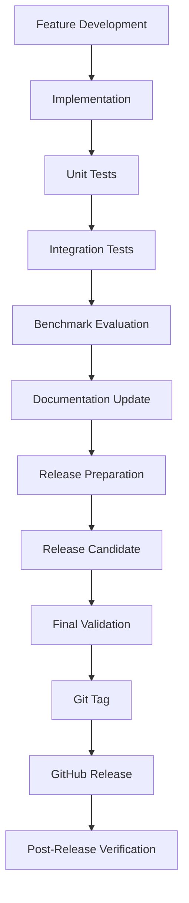
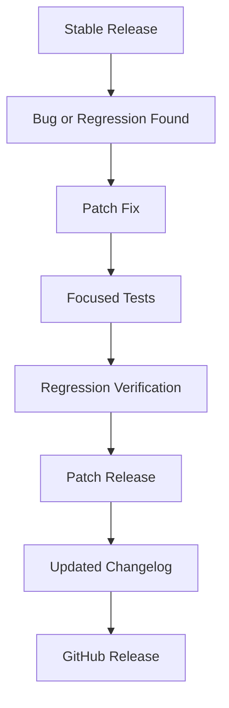

# Release Process

ChandraMap uses a formal release process because it is both an open-source software project and a research-oriented lunar image correspondence and registration system.

A release must therefore communicate more than whether the code executes successfully. It should identify the implementation state, supported functionality, benchmark protocol, measured evidence, reproducibility information, and known limitations.

The release process is designed to support ChandraMap's incremental V1/V2/V3/V4 benchmark architecture without assuming that every version contains the same functionality.

> [!IMPORTANT]
> A Git tag alone is not a meaningful research release. A meaningful release should contain a validated project state with appropriate software tests, benchmark evidence, documentation, and known limitations.

The guiding principle is:

> **Build small. Measure honestly. Keep the failures.**

---

## 1. What Counts as a Release?

A ChandraMap release is:

> A versioned, reproducible project state containing code, documentation, configuration, tests, benchmark evidence, and known limitations appropriate to its scope.

Different development states should be distinguished clearly.

### Development State

An actively changing implementation state.

It may contain incomplete features, experimental code, changing interfaces, or incomplete benchmark coverage.

Development state should not be presented as stable functionality.

### Experimental Build

A build intended to investigate a specific research idea, algorithm, sensor path, preprocessing method, or benchmark hypothesis.

Experimental results should identify their configuration and limitations.

### Milestone

A measurable project stage representing a completed pipeline capability or research objective.

For example, a milestone may establish an end-to-end result on one known image pair:

```text
Known source/reference pair
        ↓
SIFT
        ↓
RANSAC
        ↓
Transform
        ↓
Independent evaluation
```

### Release Candidate

A candidate version that has completed the applicable implementation, testing, benchmarking, documentation, and reproducibility checks and is undergoing final validation.

### Stable Release

A validated version intended for general use within its documented scope.

Stable does not mean that every research problem has been solved. It means that the functionality claimed by the release has been appropriately validated.

### Benchmark Release

A version specifically associated with a reproducible evaluation.

A benchmark release should identify:

- dataset
- image pairs
- sensors
- preprocessing
- matcher
- configuration
- evaluation protocol
- software environment
- hardware where relevant
- measured metrics
- known failures

> [!NOTE]
> A software release and a benchmark release can refer to the same project state, but they answer different questions. A software release describes what the implementation provides; a benchmark release documents what was measured under a defined evaluation protocol.

---

## 2. Release Types

The following is the recommended release model. These labels should not be interpreted as already-existing repository automation unless explicitly established elsewhere.

| Release Type      | Purpose                      | Required Evidence                             |
| ----------------- | ---------------------------- | --------------------------------------------- |
| Development       | Active implementation        | Applicable tests                              |
| Experimental      | Research investigation       | Experiment configuration and results          |
| Alpha             | Early integrated version     | Basic tests and known limitations             |
| Beta              | Broader testing              | Tests and benchmark evidence                  |
| Release Candidate | Final pre-release validation | Applicable release checklist                  |
| Stable            | Supported version            | Tests, benchmark evidence, and documentation  |
| Benchmark Release | Reproducible evaluation      | Dataset, protocol, configuration, and results |

The exact release types used by the repository should remain documented and consistent once adopted.

---

## 3. Versioning Strategy

ChandraMap should use Semantic Versioning as the conceptual reference:

```text
MAJOR.MINOR.PATCH
```

### MAJOR

Use a major version when changes may break established compatibility, such as:

- public API changes
- incompatible configuration contracts
- incompatible output schemas
- incompatible data formats
- major architectural changes
- removal of supported functionality

### MINOR

Use a minor version for backward-compatible functionality or significant new capabilities.

Examples may include:

- a new supported processing capability
- an additional compatible matcher
- an additional supported workflow
- a significant backward-compatible feature

### PATCH

Use a patch version for backward-compatible corrections.

Examples include:

- bug fixes
- regression fixes
- documentation corrections
- small implementation corrections
- reproducibility fixes
- output-format corrections

### Benchmark Versions vs Software Versions

ChandraMap uses a versioned benchmark architecture involving:

- V1
- V2
- V3
- V4

These benchmark generations should not automatically be treated as:

```text
V1 = 1.0.0
V2 = 2.0.0
V3 = 3.0.0
V4 = 4.0.0
```

unless that mapping is explicitly adopted by the repository.

Benchmark generations and software versions serve different purposes.

A software version describes the state of the implementation. A benchmark generation describes the maturity or scope of the evaluated research pipeline.

> [!IMPORTANT]
> When a benchmark protocol changes, document the change even when the software version remains compatible. Results obtained under materially different protocols should not be presented as directly comparable without explanation.

---

## 4. Release Branch and Tag Strategy

A professional GitHub release workflow may conceptually contain:

- development work
- feature branches
- release preparation
- release candidate validation
- a release tag
- a GitHub Release

Illustrative branch concepts include:

```text
feature/*
release/*
```

and illustrative version tags include:

```text
vX.Y.Z
```

These are examples only and do not establish repository branch names.

The repository's actual branch protection, branch naming, pull-request, and workflow configuration is the source of truth.

A release tag should identify the exact commit from which the release was validated.

> [!WARNING]
> Do not introduce a parallel release process when the repository already has configured GitHub Actions, branch protection, or release automation. Follow the repository's existing configuration.

---

## 5. Development → Release Lifecycle



### Feature Development

Define the problem, scope, expected behavior, and evaluation requirements.

### Implementation

Implement only the functionality included in the defined release scope.

### Unit Tests

Verify individual components.

### Integration Tests

Verify that components interact correctly.

### Benchmark Evaluation

Measure research-oriented functionality using a defined dataset and protocol.

### Documentation Update

Ensure documentation reflects actual implementation behavior.

### Release Preparation

Freeze scope, update version-related metadata where applicable, update changelog and release documentation, and collect evidence.

### Release Candidate

Validate the complete candidate before publication.

### Final Validation

Verify code, tests, benchmarks, documentation, licensing, reproducibility, and release metadata.

### Git Tag

Create the release tag on the validated commit.

### GitHub Release

Publish the validated release with appropriate release notes and assets.

### Post-Release Verification

Verify that the published release actually corresponds to the validated state.

---

## 6. Release Scope Definition

Before preparing a release, define:

- version
- release objective
- included features
- excluded features
- supported sensors
- supported matchers
- supported data products
- benchmark scope
- known limitations

The scope should be frozen before final release validation.

### Scope Control

A release should not become an opportunity to introduce unrelated changes.

Changes discovered during release preparation should be evaluated against the defined release objective.

If a change materially expands the scope, the release scope should be reconsidered before proceeding.

> [!IMPORTANT]
> Every release should make it possible to answer: **What exactly is this release claiming to support?**

---

## 7. Feature Completion Requirements

A feature is not release-ready merely because its implementation executes.

Where applicable, release readiness should include:

- implementation
- tests
- documentation
- configuration
- error handling
- benchmark evidence
- known limitations

For research-oriented ChandraMap functionality, relevant evidence may include:

- sensor-aware preprocessing
- multi-scale handling
- global retrieval
- local matching
- geometric verification
- RANSAC
- sub-pixel refinement
- quantitative metrics

These requirements apply only when the functionality is part of the release scope.

The release process must not imply that every release contains the complete ChandraMap pipeline.

---

## 8. Code Quality Gate

Before release, verify the repository's configured quality checks.

Where configured, these may include:

- formatting
- linting
- static analysis
- type checking
- unit tests
- integration tests
- regression tests
- dependency consistency
- configuration validation
- error handling

Do not invent specific tools or commands.

Use the repository's configured quality checks.

> [!NOTE]
> If repository automation changes, this documentation should be updated to reflect the actual configuration rather than assuming a particular CI tool or package manager.

---

## 9. Test Requirements

ChandraMap releases should use testing appropriate to their scope.

### Unit Tests

Validate individual components independently.

Examples include:

- preprocessing behavior
- configuration parsing
- coordinate conversions
- metric calculations
- matcher wrappers
- data validation

### Integration Tests

Validate interactions between components.

Examples include:

```text
Sensor Input
    ↓
Preprocessing
    ↓
Representation
    ↓
Matching
    ↓
Geometric Verification
    ↓
Registration
    ↓
Metrics
```

### Regression Tests

Verify that previously supported functionality has not unintentionally broken.

### End-to-End Tests

Where applicable, validate the complete pipeline:

```text
Input
→ preprocessing
→ matching
→ RANSAC
→ refinement
→ final transform
→ metrics
```

The first meaningful project milestone is a real, measurable end-to-end result. A release does not need to implement the complete whole-Moon system to establish a valid milestone.

---

## 10. Sensor Compatibility Gate

Changes affecting sensor processing should be evaluated against the applicable sensor paths.

Relevant sensors include:

- Chandrayaan-2 OHRC
- Chandrayaan-2 TMC-2
- Chandrayaan-2 IIRS

Reference imagery may include:

- LRO NAC
- LRO WAC

Additional datasets may include:

- Kaguya / SELENE TC
- synthetic lunar augmentations

Where applicable, verify:

- sensor behavior
- reference-image compatibility
- metadata preservation
- GSD handling
- projection handling
- illumination metadata
- viewing geometry metadata

### Sensor-Aware Processing

OHRC, TMC-2, and IIRS should not automatically be treated as identical inputs.

Sensor-specific preprocessing should remain sensor-aware.

### IIRS

IIRS requires particular care because it represents spectral information rather than simply an ordinary 2D camera image.

Before ordinary 2D matching, verify that:

- the spectral representation is appropriate
- bands or derived representations are handled correctly
- the resulting image representation is suitable for registration
- assumptions about 2D matching are explicitly documented

> [!WARNING]
> Do not claim IIRS support merely because a file can be loaded. Verify that its representation and preprocessing are appropriate for the registration task.

---

## 11. Matcher Compatibility Gate

Known ChandraMap matcher paths include:

- SIFT baseline
- ALIKED + LightGlue
- LoFTR
- RIFT/CFOG-style research directions

Not every release must support every matcher.

For a matcher-related release, verify the applicable pipeline:

```text
Candidate Matches
        ↓
Geometric Verification
        ↓
RANSAC
        ↓
Verified Inliers
        ↓
Sub-Pixel Refinement
        ↓
Final Transform
        ↓
Independent Evaluation
```

Where applicable, verify:

- candidate match generation
- geometric verification
- RANSAC behavior
- verified inlier count
- spatial coverage
- sub-pixel refinement compatibility
- final transform
- independent evaluation

### Candidate vs Verified Matches

Candidate matches must not be described as verified matches.

A matcher produces candidate correspondences. Geometric verification determines which candidates are consistent with the selected geometric model.

### Baseline Comparison

When introducing a stronger matcher, compare it against the established SIFT baseline under a consistent benchmark protocol where applicable.

---

## 12. Benchmark Gate

Every research-oriented release should define its benchmark scope.

Document:

- dataset
- source sensor
- reference sensor or product
- image pairs
- preprocessing
- matcher
- parameters
- evaluation protocol
- hardware
- software environment
- metrics

Benchmark comparisons should use consistent protocols.

> [!WARNING]
> Results obtained from different datasets, image pairs, preprocessing configurations, matcher parameters, or evaluation protocols should not be presented as directly comparable without explaining the differences.

---

## 13. Required Metrics

Metrics should be selected according to the release scope.

### Retrieval

Where retrieval is part of the release:

- Recall@1
- Recall@5

### Matching

Where local matching is evaluated:

- candidate match count
- verified inlier count
- inlier ratio

### Spatial Distribution

Matching quality should not be judged only by the number of matches.

Where applicable:

- grid coverage
- convex-hull coverage

### Registration

Where independent check points are available:

- independent check-point RMSE in source-image pixels

### Geospatial Error

Ground error in metres may be reported when:

- GSD is known
- projection is understood
- reference truth supports the conversion

### System Metrics

Where applicable:

- runtime
- failure rate

Do not substitute measured metrics with:

- star ratings
- decorative percentages
- arbitrary confidence scores
- unsupported accuracy claims

> [!IMPORTANT]
> A matcher confidence score is not equivalent to registration correctness.

---

## 14. Independent Evaluation

Independent evaluation is a mandatory scientific consideration for ChandraMap releases.

A transformation should not be fitted and evaluated using exactly the same points whenever independent evaluation is possible.

Preferred evaluation sources include:

- challenge ground truth
- independently checked tie points
- held-out check points

The basic distinction is:

```text
Points used for fitting
        ≠
Points used for final evaluation
```

This matters because fitting points can appear accurate even when the resulting transformation generalizes poorly.

A release must not claim improved registration accuracy solely from performance measured on the points used to fit the transformation.

---

## 15. Stress-Test Gate

A release should include stress testing appropriate to its scope.

### Easy Pair

A known overlapping pair with:

- similar illumination
- moderate scale difference
- manageable geometry

### Sun-Angle Stress

The same region under significantly different illumination.

Lunar illumination changes can alter shadow geometry, not merely image brightness.

### Scale Stress

A substantial difference in effective GSD or image scale.

### Modality Stress

Cross-sensor matching or an IIRS-derived representation.

### Geometry Stress

Terrain with:

- significant relief
- stronger viewpoint differences
- more difficult geometric relationships

### Low-Feature Stress

Terrain that is:

- smooth
- repetitive
- weakly textured

Release notes should preserve meaningful failure cases rather than reporting only successful examples.

---

## 16. Reproducibility Requirements

A benchmark release should record, where applicable:

- ChandraMap version
- Git commit
- release tag
- dataset version or source
- image pair identifiers
- preprocessing configuration
- matcher configuration
- model/checkpoint version
- dependency versions
- operating system
- hardware
- CPU/GPU information
- random seed
- evaluation protocol
- benchmark results

Not every field will apply to every experiment.

The objective is to allow another developer or researcher to reconstruct the reported evaluation from the documented release state.

> [!IMPORTANT]
> Reproducibility information is part of the evidence, not optional metadata added after the research result.

---

## 17. Dependency and Environment Freeze

Before a stable release:

- verify dependency versions
- verify lockfiles where used
- verify model/checkpoint versions
- verify environment configuration
- verify installation instructions
- verify optional dependencies

Do not assume a specific package manager, lockfile format, or environment-management system unless the repository already establishes one.

The repository's actual environment configuration is the source of truth.

---

## 18. Documentation Gate

Before release, review all documentation affected by the change.

Potential documentation includes:

- `README.md`
- `CHANGELOG.md`
- `ROADMAP.md`
- architecture documentation
- development documentation
- sensor documentation
- matcher documentation
- benchmark documentation
- metrics documentation
- stress-test documentation
- acceptance criteria
- configuration documentation
- API/reference documentation where applicable

Documentation must describe actual implementation behavior.

> [!WARNING]
> Experimental functionality must not be documented as stable support.

---

## 19. Changelog Requirements

`CHANGELOG.md` should describe meaningful changes introduced by the release.

Where appropriate, organize changes under:

### Added

New functionality.

### Changed

Changes to existing behavior.

### Fixed

Bug fixes and corrections.

### Removed

Removed functionality.

### Deprecated

Functionality that is planned for later removal.

### Benchmark

New or changed benchmark evidence.

### Documentation

Documentation changes.

### Breaking Changes

Changes requiring user action or migration.

Do not fabricate release notes or benchmark results.

---

## 20. Release Notes Requirements

Each GitHub Release should explain:

- release version
- release date
- release scope
- major changes
- supported functionality
- benchmark evidence
- known limitations
- breaking changes
- upgrade notes
- reproducibility information

For research-oriented releases, also include where applicable:

- benchmark dataset
- test conditions
- key measured metrics
- important failure cases

Release notes should represent the complete evidence rather than only favorable results.

> [!IMPORTANT]
> A release note should help a researcher understand not only where ChandraMap worked, but also the conditions under which it failed or remains experimental.

---

## 21. Release Candidate Process

The recommended release candidate process is:

1. Freeze the release scope.
2. Update version metadata where applicable.
3. Update `CHANGELOG.md`.
4. Update relevant documentation.
5. Run the repository's configured tests.
6. Run relevant benchmarks.
7. Run applicable stress tests.
8. Verify reproducibility information.
9. Review known limitations.
10. Prepare release notes.
11. Create a release-candidate tag if the repository uses one.
12. Perform final review.
13. Promote to stable release when applicable acceptance criteria are satisfied.

Do not invent exact commands.

Use the repository's configured test and release automation.

---

## 22. Final Release Checklist

### Scope

- [ ] Release scope defined
- [ ] Included features documented
- [ ] Excluded features documented
- [ ] Supported sensors documented
- [ ] Supported matchers documented

### Code

- [ ] Code quality checks pass
- [ ] Unit tests pass
- [ ] Integration tests pass
- [ ] Regression tests pass
- [ ] End-to-end test passes where applicable

### Research

- [ ] Benchmark dataset documented
- [ ] Evaluation protocol documented
- [ ] Metrics measured
- [ ] Independent check points used where possible
- [ ] Stress tests completed
- [ ] Failure cases documented

### Sensors

- [ ] OHRC compatibility verified where applicable
- [ ] TMC-2 compatibility verified where applicable
- [ ] IIRS compatibility verified where applicable
- [ ] Metadata preserved
- [ ] GSD handling verified
- [ ] Projection handling verified

### Matching

- [ ] SIFT baseline verified where applicable
- [ ] New matcher verified where applicable
- [ ] Candidate matches recorded
- [ ] RANSAC verified
- [ ] Inliers recorded
- [ ] Spatial coverage evaluated
- [ ] Sub-pixel refinement verified where applicable

### Documentation

- [ ] README checked
- [ ] CHANGELOG updated
- [ ] Relevant development documentation updated
- [ ] Benchmark documentation updated
- [ ] Known limitations documented
- [ ] Release notes prepared

### Reproducibility

- [ ] Commit identified
- [ ] Dataset identified
- [ ] Configuration captured
- [ ] Dependencies captured
- [ ] Model/checkpoint versions captured
- [ ] Hardware/environment captured

### GitHub

- [ ] Release version finalized
- [ ] Tag created
- [ ] Release notes prepared
- [ ] Release assets verified where applicable
- [ ] Repository status checked
- [ ] Post-release verification completed

---

## 23. Release Tagging

The conceptual release tag format is:

```text
vMAJOR.MINOR.PATCH
```

Illustrative examples:

```text
v0.1.0
v0.2.0
v1.0.0
```

These examples do not establish an existing repository tag convention.

Release tags should:

- point to the exact validated release commit
- identify the release version
- remain stable after publication under normal release practice
- be referenced by release notes
- correspond to the commit identified by benchmark evidence

> [!CAUTION]
> Avoid silently moving or rewriting a published release tag. If a serious problem is discovered, prefer a transparent correction and a new release where appropriate.

---

## 24. GitHub Release Creation

The conceptual GitHub Release workflow is:

1. Select the validated release tag.
2. Create a GitHub Release.
3. Add the release title.
4. Add release notes.
5. Link benchmark evidence where appropriate.
6. Attach release assets where appropriate.
7. Mark the release as a prerelease when applicable.
8. Publish only after final verification.

Do not assume a particular GitHub Actions workflow.

> [!NOTE]
> Use the repository's configured GitHub Actions/workflows and release automation rather than introducing a parallel process.

---

## 25. Release Assets

Possible release assets include:

- source archives
- benchmark configuration
- benchmark metadata
- evaluation reports
- example outputs
- documentation snapshots
- model metadata
- checksums
- reproducibility information

Not every release needs every asset.

Large datasets and model weights should not automatically be bundled with every release.

Where external assets are used, follow their licensing, access, attribution, and distribution requirements.

---

## 26. Data and Model Licensing

Before release, verify:

- source-data licensing
- dataset terms
- model/checkpoint licensing
- third-party dependency licenses
- attribution requirements
- redistribution restrictions

Do not bundle restricted data merely for convenience.

Public availability of a dataset does not automatically mean unrestricted redistribution rights.

Where a dataset or model cannot legally be redistributed, provide appropriate identification or acquisition information rather than copying the restricted asset into the repository.

---

## 27. Security and Supply Chain Checks

Before a release:

- review dependency changes
- check for unexpected dependency additions
- review generated artifacts
- avoid committing secrets
- verify release assets
- verify model/checkpoint sources
- review third-party code licenses

Coordinate security-related release handling with the repository's `SECURITY.md` where relevant.

Do not invent security tooling or claim that a specific scanner has been run unless it is actually configured and executed.

> [!WARNING]
> Never include credentials, access tokens, private keys, or other secrets in release commits or release assets.

---

## 28. Breaking Changes

Changes that may require major-version consideration include:

- public API changes
- configuration contract changes
- output schema changes
- incompatible data format changes
- incompatible benchmark protocol changes
- removal of supported functionality

Research improvements may also require documentation of a changed benchmark methodology even when the software API remains compatible.

For example, changing preprocessing or evaluation methodology can affect result comparability without technically breaking an API.

---

## 29. Deprecation Process

The recommended deprecation process is:

1. Identify functionality for deprecation.
2. Document the reason.
3. Mark the functionality as deprecated.
4. Provide migration guidance.
5. Keep it available for the documented transition period where practical.
6. Remove it in a later breaking release when appropriate.
7. Update the changelog and release notes.

Do not invent a fixed deprecation timeline unless the repository establishes one.

---

## 30. Hotfix / Patch Release Process

Urgent backward-compatible fixes should follow a focused patch process:



Appropriate patch-release examples include:

- incorrect metadata handling
- broken configuration parsing
- reproducibility bugs
- regressions
- documentation issues affecting installation
- incorrect output formatting

A patch release should not silently introduce breaking behavior.

---

## 31. Post-Release Verification

After publishing a release, verify:

- GitHub Release exists
- tag points to the correct commit
- release notes are correct
- installation instructions work
- documented examples work
- benchmark configuration matches the release
- benchmark artifacts are accessible
- important assets are valid
- no accidental files or secrets were published

Where practical, perform a clean-environment installation test.

Post-release verification should be performed against the published release rather than only against the local development environment.

---

## 32. Post-Release Issue Handling

Contributors should report issues such as:

- installation failures
- regression bugs
- benchmark inconsistencies
- documentation problems
- reproducibility failures
- sensor-specific failures
- matcher-specific failures

Useful issue information includes:

- version
- commit/tag
- environment
- input type
- sensor
- matcher
- configuration
- error message
- reproduction steps

The more precisely the issue identifies the release state, the easier it is to reproduce and investigate.

---

## 33. Release Rollback / Withdrawal

If a published release contains a serious problem:

1. Document the issue.
2. Identify the affected release.
3. Assess the impact.
4. Communicate the impact where appropriate.
5. Publish a corrected patch or subsequent release when appropriate.
6. Update release notes.
7. Preserve the historical record of what was published.

Do not silently rewrite historical release artifacts as the default response.

> [!CAUTION]
> Release corrections should be transparent. Researchers and users may have already based results on the affected release.

---

## 34. Research Result Integrity

ChandraMap release documentation must distinguish different types of evidence.

### Measured Result

A value produced by the documented benchmark protocol.

Example:

```text
Independent check-point RMSE = measured value
```

### Experimental Observation

A result observed during development but not yet part of a controlled benchmark.

### Hypothesis

A proposed explanation or future improvement that has not yet been established experimentally.

### Demonstration

A visual or qualitative example that demonstrates behavior but is not sufficient as quantitative evidence.

> [!IMPORTANT]
> A visual registration overlay is not, by itself, proof of sub-pixel registration accuracy.

Similarly:

- matcher confidence is not proof of correctness
- a successful example is not proof of general performance
- a placeholder percentage is not a benchmark result
- a fitting-point error is not independent validation

---

## 35. Benchmark Result Reporting

Benchmark results should contain enough context to interpret the numbers.

A reporting structure may use:

| Metric       | Value | Dataset | Sensor Pair | Matcher | Conditions |
| ------------ | ----: | ------- | ----------- | ------- | ---------- |
| Recall@1     |     — | —       | —           | —       | —          |
| Inlier Ratio |     — | —       | —           | —       | —          |
| Coverage     |     — | —       | —           | —       | —          |
| Check RMSE   |     — | —       | —           | —       | —          |
| Runtime      |     — | —       | —           | —       | —          |

The values above are intentionally not populated.

Numbers without dataset and protocol context can be misleading.

Where results are reported, identify:

- dataset
- image pairs
- source sensor
- reference product
- preprocessing
- matcher
- parameters
- evaluation method
- relevant environmental conditions
- hardware/software environment

---

## 36. Release Evidence Directory

If the repository has a designated benchmark or evidence location, follow that existing structure.

If no exact location has been established, do not invent one solely for this documentation.

Possible evidence categories include:

- benchmark configuration
- metrics
- plots
- match visualizations
- rejected outliers
- registered overlays
- check-point errors
- runtime measurements
- stress-test results

For incremental development milestones, useful evidence includes:

- match plot
- rejected outliers
- registered overlay
- inlier statistics
- independent check-point error
- runtime
- spatial coverage

Evidence should remain associated with the configuration that produced it.

---

## 37. Release Documentation Matrix

The exact documentation set depends on the change.

| Release Change     | README      | CHANGELOG | Development Docs | Benchmark Docs | Release Notes |
| ------------------ | ----------- | --------- | ---------------- | -------------- | ------------- |
| Bug fix            | If relevant | Yes       | If relevant      | If relevant    | Yes           |
| New sensor         | Usually     | Yes       | Yes              | Yes            | Yes           |
| New matcher        | Usually     | Yes       | Yes              | Yes            | Yes           |
| Benchmark change   | If relevant | Yes       | Yes              | Yes            | Yes           |
| Documentation-only | If relevant | Yes       | Yes              | No/if relevant | Yes           |

Documentation should be updated whenever implementation behavior, benchmark methodology, supported functionality, or contributor workflow changes.

---

## 38. Recommended Release Workflow for ChandraMap

The recommended ChandraMap-specific workflow is:

```text
Define Scope
    ↓
Lock Dataset / Benchmark
    ↓
Implement
    ↓
Unit Tests
    ↓
Integration Tests
    ↓
End-to-End Result
    ↓
Benchmark
    ↓
Stress Tests
    ↓
Review Metrics
    ↓
Update Documentation
    ↓
Release Candidate
    ↓
Final Validation
    ↓
Git Tag
    ↓
GitHub Release
    ↓
Post-Release Verification
```

This workflow is appropriate for ChandraMap because the project combines:

- computer vision
- remote sensing
- geospatial processing
- machine learning
- research benchmarking
- reproducibility requirements

A working implementation is therefore only one part of release readiness.

---

## 39. Example Release Milestones

The following milestones represent the documented incremental build direction. They are examples of measurable development stages and must not be interpreted as claims that they have already been completed.

### Milestone A — One Known Pair

```text
Known source/reference pair
        ↓
SIFT
        ↓
RANSAC
        ↓
Transform
```

Evidence should include where applicable:

- match plot
- rejected outliers
- registered overlay
- inlier statistics
- independent check-point error

The purpose is to establish the first real end-to-end measurable result.

---

### Milestone B — Scale + Illumination

```text
Reference Pyramid
        +
Structure-Focused Preprocessing
```

Evidence should include:

- harder image pair
- before/after metrics
- illumination conditions
- scale conditions
- known failure cases

Upsampling should not be interpreted as recovering missing physical spatial detail.

---

### Milestone C — Small Retrieval Database

```text
Reference Tiles
        ↓
Global Descriptors
        ↓
FAISS
        ↓
Top-K
```

Evidence may include:

- Recall@1
- Recall@5
- correct candidates
- incorrect candidates
- retrieval conditions

Global retrieval is not necessarily required when reliable geospatial metadata already restricts the search sufficiently.

---

### Milestone D — Stronger Matcher

Compare a stronger local matcher against SIFT:

```text
SIFT
    vs
ALIKED + LightGlue
    or
LoFTR
```

Evidence should use the same benchmark conditions where possible.

Results should identify:

- sensor pair
- preprocessing
- matcher
- configuration
- candidate matches
- verified inliers
- spatial coverage
- independent registration error
- runtime

---

### Milestone E — Sub-Pixel Refinement

```text
Verified Inliers
        ↓
Sub-Pixel Refinement
        ↓
Final Transform
```

The final transformation should be refit after refinement.

Evidence should include, where applicable:

- check-point RMSE before refinement
- check-point RMSE after refinement
- refinement configuration
- independent evaluation

A visual overlay alone is insufficient evidence of sub-pixel accuracy.

---

### Milestone F — Additional Sensors

The documented progression is:

```text
OHRC / TMC-2
        ↓
IIRS as a separate experiment
```

Evidence should include:

- separate sensor results
- sensor-specific preprocessing
- modality-specific limitations
- benchmark conditions
- failure analysis

IIRS should not be treated as simply another ordinary 2D image source without an appropriate representation.

---

## 40. Common Release Mistakes

Avoid the following:

- releasing without applicable tests
- releasing without benchmark evidence for research claims
- tagging an unvalidated commit
- changing benchmark protocols without documentation
- comparing results from incompatible datasets
- hiding failed test cases
- reporting only successful image pairs
- using decorative accuracy percentages
- evaluating transformations only on fitting points
- changing preprocessing between benchmark runs without documenting it
- mixing sensor results into a misleading average
- silently changing matcher parameters
- bundling restricted datasets
- committing model weights without checking licensing
- forgetting dependency versions
- forgetting model/checkpoint versions
- documenting unsupported functionality
- treating a visual overlay as scientific proof
- publishing secrets or credentials
- deleting or rewriting release history instead of correcting it transparently

---

## 41. Maintainer Responsibilities

Before release, maintainers should verify:

- release scope
- code changes
- tests
- benchmark evidence
- documentation
- licensing
- release metadata
- known limitations
- release notes
- release publication
- post-release state

Maintainers should not make unsupported performance claims on behalf of the project.

No individual maintainer should be assumed to have a particular role unless the repository explicitly defines that responsibility.

---

## 42. Contributor Responsibilities

Contributors should:

- keep changes scoped
- add appropriate tests
- document behavior
- provide benchmark evidence for research changes
- record limitations
- avoid unsupported claims
- update relevant documentation
- make reproduction possible
- identify breaking changes
- preserve failed cases when they provide useful research evidence

For research contributions, contributors should make it possible to distinguish experimental observations from controlled benchmark results.

---

## 43. Release Acceptance Criteria

A release should not be published as stable until the applicable criteria are satisfied.

### Software

- [ ] Code quality checks pass
- [ ] Unit tests pass
- [ ] Integration tests pass
- [ ] Regression tests pass
- [ ] Installation path verified

### Research

- [ ] Benchmark protocol documented
- [ ] Metrics measured
- [ ] Independent evaluation used where possible
- [ ] Stress tests completed
- [ ] Failures documented

### Scientific Integrity

- [ ] No unsupported performance claims
- [ ] No placeholder metrics presented as results
- [ ] Sensor limitations documented
- [ ] GSD interpretation documented
- [ ] Sub-pixel metric units documented correctly
- [ ] Candidate matches distinguished from verified inliers
- [ ] Benchmark conditions identified

### Documentation

- [ ] README checked
- [ ] CHANGELOG updated
- [ ] Relevant development documentation updated
- [ ] Benchmark documentation updated
- [ ] Known limitations documented
- [ ] Release notes prepared

### GitHub

- [ ] Correct commit selected
- [ ] Correct tag created
- [ ] Release assets verified
- [ ] Release notes reviewed
- [ ] Post-release verification completed

---

## 44. Quick Release Checklist

### Release

- [ ] Scope frozen
- [ ] Version decided
- [ ] Changelog updated
- [ ] Documentation updated
- [ ] Tests passed
- [ ] Benchmark completed where applicable
- [ ] Stress tests completed where applicable
- [ ] Known limitations documented
- [ ] Reproducibility information captured
- [ ] Release candidate reviewed
- [ ] Final commit verified
- [ ] Git tag created
- [ ] GitHub Release created
- [ ] Release assets verified
- [ ] Post-release verification completed

### Benchmark

- [ ] Dataset identified
- [ ] Image pairs identified
- [ ] Source sensor identified
- [ ] Reference product identified
- [ ] Matcher identified
- [ ] Configuration captured
- [ ] Preprocessing captured
- [ ] Inlier statistics captured
- [ ] Spatial coverage captured
- [ ] Independent check-point RMSE captured where possible
- [ ] Runtime captured
- [ ] Failure cases captured

---

## Release Quality Principle

ChandraMap releases should communicate an evidence-based project state rather than an idealized one.

A release should make it possible for another engineer or researcher to determine:

- what ChandraMap can actually do at that version
- what was experimentally demonstrated
- what remains experimental
- where it fails
- how the reported results were measured
- how the result can be reproduced

The project should preserve the distinction between:

```text
Implemented
    ↓
Tested
    ↓
Benchmarked
    ↓
Reproduced
    ↓
Released
```

Not every implemented feature is benchmarked.

Not every benchmarked feature is stable.

Not every successful demonstration establishes general performance.

The release documentation should make these distinctions explicit.

> [!IMPORTANT]
> ChandraMap should optimize its release process for reproducibility, measured evidence, and scientific honesty—not for making the project appear more mature than the available evidence supports.

---

## Release Philosophy

> **Build small. Measure honestly. Keep the failures.**

A professional ChandraMap release is not simply a new version number or GitHub tag.

It is a documented project state in which:

- the implementation is identified
- the scope is explicit
- applicable tests have been performed
- benchmark conditions are documented
- results are measured
- independent evaluation is used where possible
- failures are preserved
- sensor-specific limitations are documented
- dependencies and models are identified
- licensing has been reviewed
- reproducibility information is available
- release artifacts correspond to the validated commit
- users can understand what is supported and what remains experimental

The final release should allow the community to evaluate ChandraMap from evidence rather than assumptions.
