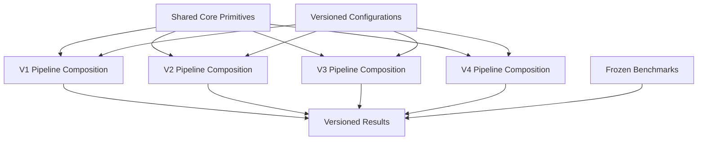
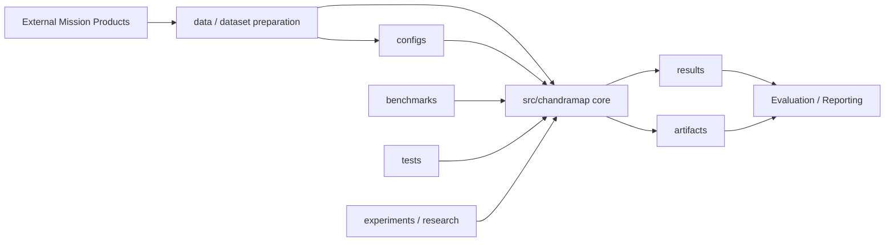
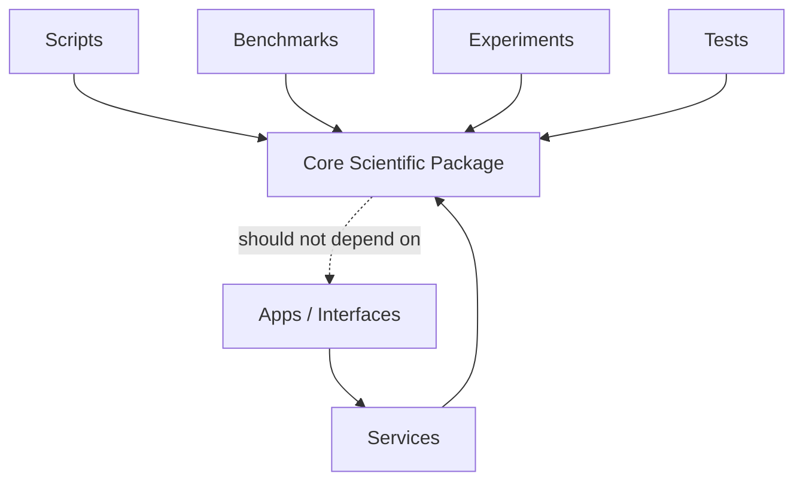
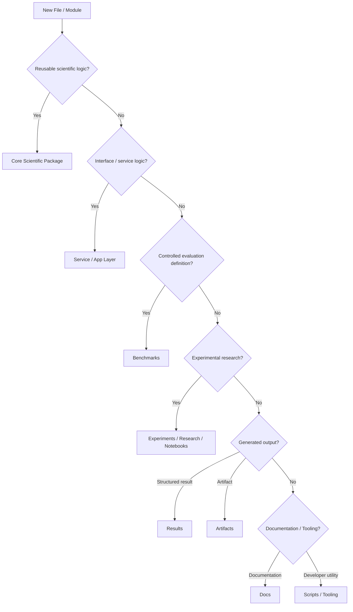
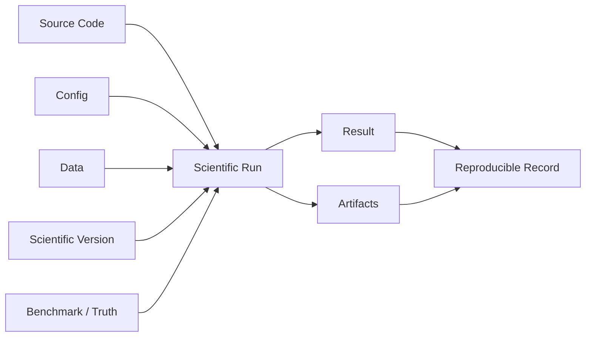

# Repository Structure

> **ChandraMap — Development-Oriented Repository Organization Guide**

ChandraMap is organized as a scientific software repository rather than as a collection of unrelated scripts, notebooks, web components, and generated outputs. The repository structure should make it possible to identify where scientific behavior lives, where interfaces live, how benchmarks are defined, how experiments remain isolated from stable baselines, and how a result can be traced back to the code, configuration, data, and evaluation context that produced it.

> **Repository structure should reflect responsibility, not merely file type.**

> **Scientific algorithms belong in the reusable core engine, not inside API routes, frontend components, notebooks, or benchmark scripts.**

> **Experiments may explore new ideas without silently changing the official scientific baseline.**

> **Benchmarks define controlled evaluation; results record outcomes; artifacts store generated evidence. These are different repository responsibilities.**

> **V1 must remain reproducible as a historical baseline while later versions evolve independently.**

This file is the development-oriented repository map for ChandraMap. It explains where major responsibilities belong and how contributors should decide where new work should be placed.

The repository itself remains the authoritative inventory of individual files. This guide documents stable responsibilities and the repository areas established or referenced by the current project structure; it should not be treated as a substitute for inspecting the repository before making structural changes.

For the broader development documentation entry point, see [`README.md`](README.md).

> **Architecture explains the system; repository structure explains where that system is organized in source control.**

Relevant architecture documentation includes:

- [`../architecture/system-overview.md`](../architecture/system-overview.md)
- [`../architecture/module-map.md`](../architecture/module-map.md)
- [`../architecture/core-engine-architecture.md`](../architecture/core-engine-architecture.md)
- [`../architecture/backend-architecture.md`](../architecture/backend-architecture.md)
- [`../architecture/frontend-architecture.md`](../architecture/frontend-architecture.md)
- [`../architecture/data-flow.md`](../architecture/data-flow.md)
- [`../architecture/output-flow.md`](../architecture/output-flow.md)

---

## 1. Repository at a Glance

ChandraMap's repository can be understood as several cooperating responsibility layers:

| Layer                         | Responsibility                                                                                         |
| ----------------------------- | ------------------------------------------------------------------------------------------------------ |
| **Core Science**              | Reusable lunar correspondence, registration, geometry, and evaluation logic                            |
| **Applications / Interfaces** | Backend services, APIs, frontends, and user-facing integrations                                        |
| **Configuration**             | Versioned scientific and execution configuration                                                       |
| **Data**                      | Scientific inputs, prepared representations, metadata, and manifests                                   |
| **Evaluation**                | Benchmarks, truth definitions, tests, and reproducibility                                              |
| **Research**                  | Experiments, prototypes, notebooks, and candidate methods                                              |
| **Outputs**                   | Structured results and generated artifacts                                                             |
| **Infrastructure**            | Deployment, automation, CI, and repository tooling                                                     |
| **Documentation**             | Project, architecture, sensor, dataset, algorithm, API, evaluation, version, and development knowledge |

Conceptually:

```text
Core Science
    +
Applications / Interfaces
    +
Configuration
    +
Data
    +
Evaluation
    +
Research
    +
Generated Outputs
    +
Infrastructure
    +
Documentation
```

A professional repository does not need the maximum possible number of directories. It needs boundaries that make scientific behavior understandable and reproducible.

> **A professional repository is one that a new contributor can navigate, run, test, understand, and trust without guessing where code belongs.**

---

## 2. Representative Top-Level Structure

The following tree represents the major repository areas established or referenced by the current ChandraMap project structure. It intentionally avoids enumerating every internal file.

```text
ChandraMap/
├── README.md
├── LICENSE
├── CHANGELOG.md
├── ROADMAP.md
├── CONTRIBUTING.md
├── CODE_OF_CONDUCT.md
├── SECURITY.md
├── CITATION.cff
├── AGENTS.md
│
├── .gitignore
├── .gitattributes
├── .editorconfig
├── .env.example
├── pyproject.toml
├── package.json
├── Makefile
├── docker-compose.yml
│
├── .github/
│   └── workflows/
│
├── apps/
├── artifacts/
├── benchmarks/
├── configs/
├── contracts/
├── data/
├── deploy/
├── docs/
├── experiments/
├── notebooks/
├── research/
├── results/
├── scripts/
├── services/
├── tests/
│
└── src/
    └── chandramap/
```

The tree above is intentionally structural rather than exhaustive.

> **Document stable structural responsibilities; let the repository itself remain the authoritative inventory of individual files.**

---

## 3. Repository Responsibility Map

| Path              | Primary Responsibility                                                     | Lifecycle             |
| ----------------- | -------------------------------------------------------------------------- | --------------------- |
| `src/chandramap/` | Reusable ChandraMap scientific/domain implementation                       | Stable source         |
| `services/`       | Service/backend orchestration around the core                              | Interface source      |
| `apps/`           | User-facing applications and interfaces                                    | Interface source      |
| `contracts/`      | Shared serialization/interface contracts where used                        | Stable contract       |
| `configs/`        | Versioned scientific/runtime configurations                                | Configuration         |
| `data/`           | Scientific data, prepared inputs, metadata, manifests                      | Input data            |
| `benchmarks/`     | Controlled benchmark definitions and benchmark execution support           | Stable evaluation     |
| `experiments/`    | Controlled experimental investigations                                     | Experimental          |
| `research/`       | Research prototypes and longer-lived exploratory work                      | Experimental research |
| `notebooks/`      | Interactive exploration, analysis, and prototyping                         | Research tooling      |
| `scripts/`        | Thin developer/scientific operational entry points                         | Tooling               |
| `tests/`          | Software, contract, integration, regression, and failure-path verification | Stable testing        |
| `results/`        | Structured outputs from runs, experiments, and benchmarks                  | Generated result      |
| `artifacts/`      | Generated rasters, previews, plots, visual evidence, exports               | Generated artifact    |
| `deploy/`         | Deployment and infrastructure configuration                                | Infrastructure        |
| `.github/`        | GitHub automation and repository metadata                                  | Repository automation |
| `docs/`           | Human-readable project documentation                                       | Documentation         |

Some directories may contain scaffolding before their complete implementation exists. Their documented responsibility should remain stable even as contents evolve.

---

## 4. Stable Code vs. Research Work

One of the most important ChandraMap boundaries is between reusable scientific implementation and exploratory research.

### Stable / Reusable Code

Stable code belongs in locations intended to be imported, tested, and reused by multiple interfaces.

The principal scientific location is:

```text
src/chandramap/
```

Service and application code belongs in their corresponding interface areas where present.

Stable code should generally have:

- clear ownership;
- tests;
- defined inputs and outputs;
- predictable behavior;
- compatibility with documented scientific versions;
- limited dependence on interactive research state.

### Experimental Code

Experimental work belongs in areas such as:

```text
experiments/
research/
notebooks/
```

depending on the maturity and purpose of the work.

Experiments may investigate:

- alternative matchers;
- preprocessing variants;
- illumination handling;
- scale strategies;
- filtering methods;
- refinement approaches;
- learned correspondence methods;
- multimodal techniques;
- retrieval research;
- DEM-aware geometry.

> **An experiment should earn its way into the core through evidence, tests, and architecture review.**

Experimental success does not automatically redefine the official V1 baseline.

---

## 5. Root Files

The repository root should contain repository-wide metadata, configuration, and project entry points rather than feature-specific implementation.

### `README.md`

Primary repository entry point.

It should help a new reader understand:

- what ChandraMap is;
- what problem it solves;
- where documentation lives;
- how to begin using or contributing to the project.

### `LICENSE`

Defines the software licensing terms for repository source code.

Mission data and external datasets may have separate provider terms; repository licensing does not automatically replace those requirements.

### `CHANGELOG.md`

Records meaningful project changes across releases or development milestones.

### `ROADMAP.md`

Describes planned scientific and engineering evolution.

It should not be treated as proof that a planned capability is already implemented.

### `CONTRIBUTING.md`

Defines contribution expectations and repository contribution workflow.

### `CODE_OF_CONDUCT.md`

Defines community participation standards.

### `SECURITY.md`

Defines repository-level security guidance and vulnerability reporting expectations.

### `CITATION.cff`

Provides machine-readable project citation metadata.

### `AGENTS.md`

Where present, provides repository-level instructions for coding or software-engineering agents.

It should support repository understanding rather than replace human-readable architecture or development documentation.

### `pyproject.toml`

Where present, owns Python packaging, tooling, dependency, or project configuration according to the repository's Python setup.

### `package.json`

Where present, owns JavaScript/TypeScript tooling or application dependencies.

Its presence does not imply that scientific algorithms belong in JavaScript application code.

### `Makefile`

Where present, may provide convenient developer workflow commands.

Complex scientific logic should not be implemented directly in Make targets.

### `docker-compose.yml`

Where present, may support local container orchestration.

It is infrastructure configuration, not scientific pipeline definition.

### `.env.example`

Where present, documents non-secret environment configuration.

It must never contain real credentials.

### `.gitignore`

Defines repository-specific exclusions from Git tracking.

It should help keep secrets, caches, temporary files, local environments, and generated state out of normal source history.

---

## 6. Root File Principle

> **The repository root should contain repository-wide files, not miscellaneous implementation.**

Avoid placing:

- scientific algorithms;
- API handlers;
- frontend components;
- benchmark outputs;
- exploratory notebooks;
- generated images;

directly in the repository root simply because they do not yet have an obvious home.

If a file represents a stable responsibility, place it with that responsibility.

---

## 7. `src/`

`src/` contains importable, reusable project source.

The primary ChandraMap scientific package is organized under:

```text
src/chandramap/
```

Using a source-package boundary helps separate:

- installed/importable code;
- repository tooling;
- scripts;
- experiments;
- generated outputs.

---

## 8. `src/chandramap/` — Core Scientific Package

`src/chandramap/` represents the reusable scientific and domain core of ChandraMap.

Depending on the actual module structure, responsibilities may include:

- sensor-aware processing;
- preprocessing;
- illumination handling;
- physical-scale handling;
- local feature extraction;
- descriptor matching;
- correspondence filtering;
- geometric verification;
- transformation estimation;
- residual analysis;
- sub-pixel refinement;
- registration;
- scientific evaluation helpers;
- reusable domain models.

These are responsibility categories, not claims about exact current module names.

> **If code implements reusable ChandraMap science and should work without a web server or notebook, it probably belongs in the core package.**

For core architecture, see [`../architecture/core-engine-architecture.md`](../architecture/core-engine-architecture.md).

---

## 9. What Should Not Live in the Core Package

Avoid placing the following responsibilities inside the reusable scientific core:

- HTTP request handlers;
- route definitions;
- UI components;
- web-specific serialization;
- deployment configuration;
- authentication code;
- notebook-only visualizations;
- temporary research experiments;
- benchmark report formatting;
- generated result files;
- generated plots;
- credentials;
- local machine state.

The scientific core should remain usable independently of presentation and deployment layers where practical.

---

## 10. `services/`

`services/` is the architectural location for backend/service applications that orchestrate reusable ChandraMap functionality.

Depending on repository implementation, service responsibilities may include:

- API/backend orchestration;
- request handling;
- run coordination;
- artifact/result access;
- background execution where supported;
- application-level workflow coordination.

This guide intentionally does not invent service names.

> **Services may call the core engine; the core engine should not depend on service-layer HTTP or deployment concerns.**

Conceptually:

```text
Service
   ↓
Core Engine
```

not:

```text
Core Engine
   ↓
HTTP Service
```

---

## 11. `apps/`

`apps/` is the architectural location for user-facing applications where present.

Possible responsibilities include:

- web interfaces;
- visualization applications;
- research-facing UI;
- interactive result exploration.

Applications should consume authoritative scientific outputs.

They should not independently implement:

- RANSAC;
- transformation fitting;
- inlier classification;
- authoritative RMSE;
- benchmark success criteria.

> **Presentation should consume science, not redefine it.**

See [`../architecture/frontend-architecture.md`](../architecture/frontend-architecture.md).

---

## 12. `contracts/`

Where present, `contracts/` owns shared interface/data contracts that cross component boundaries.

Potential responsibilities may include:

- serialized result contracts;
- request/response contracts;
- shared interface types;
- machine-readable inter-component contracts.

This does not imply a specific technology such as:

- OpenAPI;
- Pydantic;
- JSON Schema;
- generated TypeScript types.

Actual contract technology remains implementation-defined.

### Domain Models vs. Transport Contracts

These concepts should remain distinguishable.

**Domain model**

Represents scientific concepts used by the core.

**Transport contract**

Represents how those concepts cross process/API/application boundaries.

They may correspond closely, but they should not automatically be treated as the same object.

---

## 13. `configs/`

`configs/` owns versioned configuration that controls reproducible project behavior.

Potential configuration categories include:

- scientific pipelines;
- benchmark runs;
- sensor-specific preparation;
- experiments;
- application/runtime behavior where appropriate.

The repository should avoid hiding scientific behavior exclusively inside:

- hard-coded values;
- developer-local settings;
- undocumented environment variables.

> **Configuration belongs in `configs/` when it represents reusable, reviewable, versionable behavior.**

Secrets do not belong in scientific configuration.

---

## 14. Configuration Template vs. Resolved Configuration

A configuration file may describe a reusable template.

A formal run should preserve the actual values that affected the run.

Conceptually:

```text
Configuration Template
        +
Overrides / Resolution
        ↓
Resolved Scientific Configuration
        ↓
Scientific Run
```

Reproducibility depends on the resolved behavior, not merely the original filename.

---

## 15. Scientific Configuration vs. Environment Configuration

These are different concerns.

| Configuration Type        | Meaning                                    |
| ------------------------- | ------------------------------------------ |
| Scientific configuration  | Changes pipeline behavior or evaluation    |
| Environment configuration | Changes machine/deployment/runtime context |

Examples of scientific configuration may include methodology-related settings.

Environment configuration may include:

- runtime addresses;
- non-scientific deployment settings;
- local service configuration.

Credentials must remain secret regardless of configuration category.

---

## 16. `data/`

`data/` is the repository area for scientific data organization where data is stored or referenced locally.

Its internal organization should follow the authoritative dataset documentation rather than this file.

Scientific data may conceptually include:

- raw mission products;
- prepared products;
- derived registration representations;
- metadata;
- manifests;
- small test assets.

Do not infer unverified subdirectories from these conceptual categories.

For data-specific structure, see the dataset documentation referenced later in this file.

---

## 17. Raw Data Principle

> **Raw mission data should be treated as immutable scientific input.**

Preprocessing should produce:

```text
Raw Product
    ↓
Prepared / Derived Product
```

rather than:

```text
Raw Product
    ↓
Overwrite Original File
```

Preserving raw input supports:

- provenance;
- reproducibility;
- reprocessing;
- validation;
- comparison between preprocessing methods.

---

## 18. Large Data and Git

Large Chandrayaan-2 and LRO products may be inappropriate for ordinary Git history.

Where appropriate, use repository-defined mechanisms such as:

- manifests;
- setup/download procedures;
- external mission archives;
- local data directories excluded from Git.

Do not assume Git LFS or another storage system unless the repository explicitly adopts it.

Small fixtures necessary for tests may be handled differently from full mission datasets.

---

## 19. Scientific Data Identity

> **A filesystem path identifies storage; it does not fully identify a scientific product.**

Where scientifically relevant, preserve:

- mission;
- instrument;
- provider/product identity;
- processing state;
- representation identity;
- product version;
- lineage;
- coordinate context.

For example:

```text
/data/local/image.tif
```

is not enough by itself to establish scientific identity.

---

## 20. `benchmarks/`

`benchmarks/` owns controlled evaluation definitions and benchmark execution support where the repository architecture places them.

Benchmark-related content may include:

- frozen pair definitions;
- benchmark categories;
- benchmark configurations;
- truth references;
- benchmark manifests;
- benchmark execution tooling.

The exact filenames and internal layout remain repository-defined.

> **Benchmarks are frozen comparison contracts, not convenient collections of successful examples.**

A benchmark directory should not become a storage area for arbitrary exploratory output.

---

## 21. Tests vs. Benchmarks

> **Tests answer “does the implementation behave correctly?” Benchmarks answer “how well does the scientific method perform?”**

Examples:

### Test

```text
Does transform application produce the expected coordinates for a known synthetic case?
```

### Benchmark

```text
How reliably does V1 register this controlled lunar pair set?
```

Tests should support correctness.

Benchmarks support scientific comparison.

---

## 22. `experiments/`

`experiments/` contains controlled investigations that are not automatically part of the official scientific baseline.

Potential examples include:

- matcher comparisons;
- preprocessing ablations;
- illumination-handling studies;
- scale experiments;
- refinement studies;
- learned-method comparisons;
- retrieval experiments.

> **Experimental code may be temporary; scientific conclusions should still remain reproducible.**

Where practical, an experiment should preserve:

- hypothesis;
- method;
- data;
- configuration;
- code/version context;
- measured result.

---

## 23. Experiments vs. Official Versions

Code under `experiments/` does not automatically become V1, V2, V3, or V4.

For promotion into an official version, contributors should consider:

- scientific scope;
- repeatability;
- tests;
- architecture;
- benchmark evidence;
- documentation;
- configuration;
- failure handling.

> **Experiments may explore new ideas without silently changing the official scientific baseline.**

---

## 24. `research/`

`research/` is intended for longer-lived research exploration that is not yet part of the stable scientific product.

Depending on project usage, it may contain:

- candidate methods;
- prototype implementations;
- exploratory analysis;
- research notes;
- proof-of-concept code.

A practical conceptual distinction is:

```text
research/
    → longer-lived exploratory research

experiments/
    → controlled runnable comparisons/ablations
```

The repository's actual usage remains authoritative.

---

## 25. Research vs. Core

Research code should not silently become a dependency of the official V1 pipeline.

Promotion into stable core should normally involve:

- explicit scope decision;
- reusable implementation;
- tests;
- documentation;
- integration design;
- benchmark evidence where appropriate.

---

## 26. `notebooks/`

`notebooks/` supports interactive scientific work.

Appropriate uses include:

- dataset inspection;
- exploratory visualization;
- debugging;
- prototype analysis;
- result exploration;
- research demonstrations.

> **If an algorithm is required for the official pipeline, its authoritative implementation should not live only in a notebook.**

Notebooks should import reusable scientific code rather than becoming the only implementation of it.

---

## 27. `scripts/`

`scripts/` contains reusable operational or developer entry points that do not naturally belong inside a library API.

Possible responsibilities include:

- data-preparation launchers;
- benchmark launch helpers;
- repository maintenance tools;
- controlled batch-entry scripts.

These are conceptual examples only.

> **Scripts should stay thin.**

If a script accumulates reusable scientific logic, that logic should normally move into an importable module.

Conceptually:

```text
Script
   ↓
Reusable Core Function
```

rather than:

```text
Script
   ↓
Hundreds of lines of authoritative algorithm logic
```

---

## 28. `tests/`

`tests/` owns automated verification.

Potential logical test types include:

- unit tests;
- component tests;
- integration tests;
- contract tests;
- regression tests;
- synthetic geometry tests;
- failure-path tests.

This document does not prescribe a specific subdirectory layout.

Tests should reflect repository responsibilities rather than becoming one undifferentiated collection.

---

## 29. Test Location Principle

Tests should be organized so that contributors can understand what responsibility they verify.

For example, tests may conceptually correspond to:

- core scientific behavior;
- service/backend behavior;
- application integration;
- API contracts;
- benchmark infrastructure.

The exact layout should follow the repository's test architecture.

---

## 30. Test Fixtures

Small deterministic fixtures may be appropriate for testing.

Do not use full mission datasets as ordinary unit-test fixtures unless there is a deliberate repository policy for doing so.

Synthetic fixtures are especially useful for validating:

- coordinate transforms;
- residual calculations;
- known correspondences;
- failure conditions.

---

## 31. `results/`

`results/` stores structured outcomes produced by scientific execution.

Potential result content includes:

- run result records;
- benchmark summaries;
- experiment metrics;
- failure summaries;
- evaluation manifests.

> **Results record scientific outcomes; they are not source code.**

Formal result records should remain traceable to:

```text
Data
+
Configuration
+
Scientific Version
+
Truth / Benchmark
+
Code Revision
```

---

## 32. `artifacts/`

`artifacts/` stores generated files that support scientific results.

Possible artifact types include:

- registered rasters;
- registered previews;
- correspondence visualizations;
- residual plots;
- spatial-coverage plots;
- exported reports.

Exact formats and internal directory organization remain repository-defined.

---

## 33. Results vs. Artifacts

This distinction is important.

| Example                    | Classification         |
| -------------------------- | ---------------------- |
| Final transform parameters | Result / domain output |
| Check RMSE                 | Result                 |
| Inlier ratio               | Result                 |
| Failure stage              | Result                 |
| Registered raster          | Artifact               |
| Match visualization        | Artifact               |
| Residual plot              | Artifact               |
| Coverage visualization     | Artifact               |

> **A result records scientific meaning; an artifact is a generated file that represents or supports that meaning.**

Generated files should not replace structured result records.

---

## 34. Benchmark Definitions vs. Results vs. Artifacts

The three responsibilities should remain separate:

```text
benchmarks/
    ↓
What is evaluated and under which frozen conditions

results/
    ↓
What happened when the method ran

artifacts/
    ↓
Generated files supporting that outcome
```

> **Benchmark definitions should not be overwritten by benchmark results.**

For example:

- pair definition → benchmark;
- measured RMSE → result;
- registered preview → artifact.

---

## 35. Generated Artifact Rule

Generated artifacts should not be mistaken for authoritative source.

Avoid:

- manually editing generated scientific outputs;
- presenting edited artifacts as direct pipeline output;
- storing generated files alongside core algorithms without reason.

Generated artifacts should be reproducible where practical.

---

## 36. `deploy/`

`deploy/` owns deployment and infrastructure configuration where present.

Potential responsibilities may include:

- container deployment;
- environment-specific service configuration;
- operational deployment definitions.

This guide does not assume:

- Kubernetes;
- Terraform;
- a specific cloud provider;
- a particular hosting platform.

> **Deployment configuration should not contain scientific algorithm implementation.**

---

## 37. `.github/`

`.github/` owns GitHub-specific repository automation and collaboration configuration.

Potential responsibilities include:

- CI workflows;
- issue templates;
- pull-request templates;
- dependency automation.

Only actual repository contents should be treated as implemented.

---

## 38. `.github/workflows/`

Where present, workflows may automate checks such as:

- tests;
- linting;
- backend validation;
- frontend validation;
- builds.

Specific workflow filenames should be documented from the repository rather than invented here.

> **CI automates verification; CI does not define scientific truth.**

Benchmark methodology belongs in benchmark/evaluation documentation, not solely in a CI file.

---

## 39. `docs/`

`docs/` contains authoritative human-readable documentation organized by responsibility.

Current project documentation areas include or have been defined around:

```text
docs/
├── project/
├── architecture/
├── versions/
├── sensors/
├── datasets/
├── algorithms/
├── evaluation/
├── api/
└── development/
```

Each area should own a distinct class of knowledge.

---

## 40. Documentation Ownership Map

| Documentation Area   | Owns                                                                 |
| -------------------- | -------------------------------------------------------------------- |
| `docs/project/`      | Goals, non-goals, terminology, assumptions, limitations              |
| `docs/architecture/` | System structure, components, module relationships, data flow        |
| `docs/versions/`     | Scientific version definitions and benchmarkable scope               |
| `docs/sensors/`      | Instrument-specific scientific context                               |
| `docs/datasets/`     | Dataset structure, metadata, preparation, pair/truth definitions     |
| `docs/algorithms/`   | Algorithm behavior and scientific processing                         |
| `docs/evaluation/`   | Metrics, truth, benchmark protocol, success/failure, reproducibility |
| `docs/api/`          | Programmatic interface contracts and semantics                       |
| `docs/development/`  | Developer and contributor guidance                                   |

> **One topic should have one primary authoritative document; other documents should link to it rather than duplicating it.**

---

## 41. `docs/project/`

`docs/project/` explains why ChandraMap exists and which broad project constraints apply.

Relevant documentation includes:

- [`../project/goals.md`](../project/goals.md)
- [`../project/non-goals.md`](../project/non-goals.md)
- [`../project/v1-scope.md`](../project/v1-scope.md)
- [`../project/terminology.md`](../project/terminology.md)
- [`../project/assumptions.md`](../project/assumptions.md)
- [`../project/limitations.md`](../project/limitations.md)

This area owns project-wide intent rather than version-specific implementation details.

---

## 42. `docs/architecture/`

`docs/architecture/` describes how ChandraMap components behave and interact.

Relevant files include:

- [`../architecture/system-overview.md`](../architecture/system-overview.md)
- [`../architecture/v1-pipeline.md`](../architecture/v1-pipeline.md)
- [`../architecture/core-engine-architecture.md`](../architecture/core-engine-architecture.md)
- [`../architecture/backend-architecture.md`](../architecture/backend-architecture.md)
- [`../architecture/frontend-architecture.md`](../architecture/frontend-architecture.md)
- [`../architecture/module-map.md`](../architecture/module-map.md)
- [`../architecture/data-flow.md`](../architecture/data-flow.md)
- [`../architecture/output-flow.md`](../architecture/output-flow.md)

`repository-structure.md` should explain where responsibilities live, while architecture documentation explains how they interact.

---

## 43. `docs/versions/`

`docs/versions/` defines benchmarkable scientific versions.

See:

- [`../versions/README.md`](../versions/README.md)
- [`../versions/v1/README.md`](../versions/v1/README.md)

ChandraMap's scientific versions are research/engineering milestones, not merely software release directories.

V1 establishes the classical baseline.

Later versions may progressively introduce additional capabilities while remaining comparable where scientifically valid.

---

## 44. V1 Documentation

Known V1 documentation includes:

- [`../versions/v1/README.md`](../versions/v1/README.md)
- [`../versions/v1/specification.md`](../versions/v1/specification.md)
- [`../versions/v1/scope.md`](../versions/v1/scope.md)
- [`../versions/v1/requirements.md`](../versions/v1/requirements.md)
- [`../versions/v1/architecture.md`](../versions/v1/architecture.md)
- [`../versions/v1/pipeline.md`](../versions/v1/pipeline.md)
- [`../versions/v1/inputs.md`](../versions/v1/inputs.md)
- [`../versions/v1/benchmark.md`](../versions/v1/benchmark.md)
- [`../versions/v1/exclusions.md`](../versions/v1/exclusions.md)

Where files such as `outputs.md`, `acceptance-criteria.md`, or `limitations.md` exist, they should also remain part of the V1 documentation contract.

---

## 45. Versioned Code Strategy

Scientific versions do not necessarily require duplicating the entire codebase into:

```text
v1/
v2/
v3/
v4/
```

copies.

A more maintainable approach, where compatible with actual architecture, is:

```text
Shared Reusable Primitives
        +
Explicit Version Pipeline Composition
        +
Versioned Configuration
        +
Frozen Benchmark Definitions
```

This preserves reuse while keeping methodological differences explicit.

> **Version isolation should preserve benchmark behavior without forcing four copies of the same underlying utility code.**

However, later refactoring must not silently change historical V1 behavior.

---

## 46. Version Ownership Model

Conceptually:

| Responsibility              | Role                                     |
| --------------------------- | ---------------------------------------- |
| Shared primitives           | Reusable algorithms and domain utilities |
| Version pipeline definition | Scientific composition for V1/V2/V3/V4   |
| Version configuration       | Parameters and feature choices           |
| Benchmark                   | Frozen evaluation definition             |
| Result                      | Version-tagged measured outcome          |
| Documentation               | Normative version scope and behavior     |

This separation makes cross-version comparison possible without copying every implementation detail.

---

## 47. Version Structure

Later versions in this diagram are conceptual where not yet implemented.



> **V1 must remain reproducible as a historical baseline while later versions evolve independently.**

---

## 48. API Documentation Area

API documentation is organized under `docs/api/`.

Known API documentation includes:

- [`../api/README.md`](../api/README.md)
- [`../api/overview.md`](../api/overview.md)
- [`../api/endpoints.md`](../api/endpoints.md)
- [`../api/schemas.md`](../api/schemas.md)
- [`../api/error-codes.md`](../api/error-codes.md)
- [`../api/versioning.md`](../api/versioning.md)
- [`../api/request-response-examples.md`](../api/request-response-examples.md)

API documentation describes programmatic interfaces.

It should not redefine scientific algorithms that belong to the core engine.

---

## 49. Scientific Data Flow Through the Repository

A conceptual scientific lifecycle is:

```text
External Mission Data
        ↓
Data Preparation
        ↓
Configured Scientific Pipeline
        ↓
Scientific Result
        ↓
Artifacts
        ↓
Evaluation / Analysis
```

Repository areas should reflect those different stages rather than mixing them in one directory.

---

## 50. Repository Data Flow



This diagram is conceptual. Exact runtime data flow is defined by architecture and version-specific documentation.

---

## 51. Preferred Code Dependency Direction

The preferred conceptual direction is:

```text
Services ───────┐
Apps ───────────┤
Scripts ────────┤
Benchmarks ─────┤
Experiments ────┤──→ Core Scientific Package
Tests ──────────┘
```

The reusable core should avoid depending on:

- frontend frameworks;
- HTTP;
- service routes;
- deployment infrastructure;
- benchmark-report presentation.

> **Interfaces depend on the core; the core should not depend on interfaces.**

---

## 52. Dependency Direction



This is an architectural rule, not a statement about every current import relationship.

---

## 53. Where Should New Code Go?

| New Work                               | Likely Location                                    |
| -------------------------------------- | -------------------------------------------------- |
| Reusable lunar matching algorithm      | `src/chandramap/`                                  |
| Reusable geometry/refinement logic     | `src/chandramap/`                                  |
| HTTP/API endpoint implementation       | `services/` or repository-defined backend/API area |
| Web visualization                      | `apps/`                                            |
| Shared transport contract              | `contracts/` where used                            |
| Pipeline parameters                    | `configs/`                                         |
| Benchmark definition                   | `benchmarks/`                                      |
| Research-only matcher comparison       | `experiments/`                                     |
| Early research prototype               | `research/` or `notebooks/`                        |
| Interactive analysis                   | `notebooks/`                                       |
| Thin launch/helper utility             | `scripts/`                                         |
| Unit/integration/regression test       | `tests/`                                           |
| Formal metric/result record            | `results/`                                         |
| Registered preview/raster/plot         | `artifacts/`                                       |
| Deployment configuration               | `deploy/`                                          |
| Human-readable technical documentation | `docs/`                                            |

---

## 54. File-Placement Decision Flow



When uncertain, inspect neighboring modules and architecture documentation before creating a new top-level responsibility.

---

## 55. When to Create a New Directory

Create a new directory when:

- it represents a stable responsibility;
- several related files are expected;
- the content has a different lifecycle from neighboring files;
- ownership becomes clearer;
- navigation materially improves.

> **New directories should be created because they represent a stable responsibility, not because one new file needs a folder.**

---

## 56. When Not to Create a New Directory

Avoid creating a directory merely because:

- one file exists;
- a temporary experiment needs somewhere to go;
- it makes the tree appear more sophisticated;
- an existing responsibility could already own the file.

Avoid unnecessary structures such as:

```text
feature/
└── implementation/
    └── code/
        └── module/
```

when the depth adds no architectural value.

---

## 57. The `utils/` Problem

Generic `utils/`, `helpers/`, `common/`, or `shared/` directories can become dumping grounds for code whose ownership is unclear.

Prefer putting reusable logic near the domain it serves.

For example, a reusable transformation utility conceptually belongs with geometry/registration rather than a global miscellaneous directory when that domain owns it.

This does not mean utilities are forbidden.

It means their ownership should be clear.

---

## 58. Domain-First Organization

Prefer names that describe scientific or system responsibility.

Examples of clearer conceptual ownership include:

```text
matching
registration
evaluation
preprocessing
```

rather than ambiguous categories such as:

```text
helpers
managers
processors
misc
stuff
```

The actual package/module names should follow the implemented repository architecture.

---

## 59. Shared Code

Do not introduce `common/` or `shared/` solely because two modules happen to use similar code once.

Shared code should exist because multiple stable components genuinely require the same abstraction.

Premature sharing can:

- weaken ownership;
- create generic dependencies;
- make refactoring harder.

---

## 60. Code vs. Config vs. Data

| Concern                        | Location Type         |
| ------------------------------ | --------------------- |
| Algorithm implementation       | Source                |
| Scientific parameters          | Configuration         |
| Mission observation/product    | Data                  |
| Benchmark case definition      | Benchmark             |
| Measured scientific outcome    | Result                |
| Visualization/generated raster | Artifact              |
| Research hypothesis or trial   | Experiment / Research |
| Explanation/specification      | Documentation         |

Mixing these lifecycles makes reproducibility and cleanup harder.

---

## 61. Immutable Input / Generated Output Principle

> **Inputs, source code, results, and generated artifacts should have distinct lifecycles.**

Conceptually:

```text
Immutable / Versioned Input
        ↓
Source + Config
        ↓
Scientific Run
        ↓
Structured Result
        +
Generated Artifact
```

This separation improves:

- Git history;
- reproducibility;
- cleanup;
- review;
- failure diagnosis.

---

## 62. Caches

Caches are temporary implementation aids.

They should not be confused with:

- scientific input;
- benchmark truth;
- formal result;
- generated artifact.

Cache location and lifecycle should follow implementation policy.

This document does not invent cache paths.

---

## 63. Secrets and Local State

Do not store real secrets in:

- `src/`;
- `configs/`;
- `docs/`;
- `results/`;
- committed environment files.

Potentially sensitive values include:

- passwords;
- API keys;
- tokens;
- private service credentials.

Where used, `.env.example` should contain placeholders only.

For security guidance, see [`../../SECURITY.md`](../../SECURITY.md).

---

## 64. Package and Module Naming

Prefer clear, stable names that communicate responsibility.

Avoid long-lived directories or modules named:

```text
misc
temp
new
final
final2
old
stuff
backup
```

Such names do not explain ownership.

---

## 65. Legacy Code

Git already preserves history.

Do not create:

```text
old/
backup/
previous/
deprecated-copy/
```

simply to avoid deleting obsolete code.

If legacy code must remain in the active tree for a real compatibility reason, document that reason explicitly.

---

## 66. Version-Control Hygiene

Do not commit, unless repository policy specifically requires them:

- virtual environments;
- caches;
- IDE state;
- secrets;
- temporary debug images;
- generated build output;
- large local mission products;
- throwaway experiment output.

See [`../../.gitignore`](../../.gitignore) for repository-specific exclusions where applicable.

---

## 67. Backend / API / Core Boundary

API and service code should orchestrate the core scientific system.

Conceptually:

```text
API Request
    ↓
Service / Backend
    ↓
Core Engine
    ↓
Scientific Result
```

Do not implement a second version of:

- matching;
- filtering;
- RANSAC;
- transform fitting;
- residual calculation;
- scientific evaluation;

inside endpoint/controller modules.

> **Scientific algorithms belong in the reusable core engine, not inside API routes.**

---

## 68. Frontend / Science Boundary

Frontend/application code should display and interact with authoritative scientific outputs.

It should not become the authoritative place for:

- RMSE;
- inlier classification;
- transformation estimation;
- spatial coverage;
- benchmark pass/fail logic.

If these calculations matter scientifically, they belong in scientific/evaluation code.

---

## 69. Notebook / Science Boundary

Notebooks may:

- import core code;
- visualize results;
- prototype methods;
- inspect data.

They should not become the only implementation of official V1 behavior.

> **Exploration belongs in notebooks; authoritative reusable science belongs in source modules.**

---

## 70. Benchmark / Core Boundary

Benchmark runners should invoke the official scientific pipeline under frozen conditions.

Avoid benchmark-specific scientific logic that differs silently from normal core execution.

If a method differs scientifically, it should be:

- a documented experiment;
- a version-specific pipeline;
- another explicitly named method.

---

## 71. Script / Core Boundary

Scripts should orchestrate reusable functions.

A script is appropriate for:

```text
parse arguments
→ call reusable function
→ write/report output
```

It should not become the permanent home of algorithm internals.

---

## 72. Repository Structure and V1

V1 is the historical classical baseline.

Repository refactoring must not silently alter its scientific meaning.

Stable V1 execution should remain traceable to:

- version-specific pipeline behavior;
- configuration;
- benchmark definition;
- result provenance.

> **V1 must remain reproducible even when shared implementation is improved or reorganized.**

A refactor that changes scientific output is not merely a structural refactor.

It may require a version/benchmark decision.

---

## 73. Repository Structure and V2–V4

Later scientific versions should reuse stable infrastructure where scientifically safe.

They should make methodological changes explicit rather than:

- copying the whole repository;
- silently modifying V1;
- scattering version-specific conditions across unrelated code.

Conceptually:

```text
Shared Infrastructure
        +
Version-Specific Scientific Composition
```

is preferable to four complete duplicated systems when the architecture permits it.

---

## 74. Benchmarkability Principle

> **Repository organization should make it possible to run and compare scientific versions without guessing which implementation or configuration produced a result.**

That requires clear relationships between:

```text
Scientific Version
+
Code
+
Configuration
+
Data
+
Benchmark / Truth
+
Result
```

---

## 75. Reproducibility Structure

See `../evaluation/reproducibility.md` where present.

A formal scientific run should conceptually connect:

```text
Code
+
Config
+
Data
+
Scientific Version
+
Benchmark / Truth
        ↓
Scientific Run
        ↓
Result
+
Artifacts
```

---

## 76. Reproducibility Flow



Repository structure should make these relationships easier to preserve rather than harder.

---

## 77. Directory Ownership

| Directory         | Owns                                            | Must Not Own                             |
| ----------------- | ----------------------------------------------- | ---------------------------------------- |
| `src/chandramap/` | Reusable scientific/domain code                 | HTTP/UI/deployment concerns              |
| `services/`       | Backend/service orchestration                   | Duplicated scientific algorithms         |
| `apps/`           | User-facing applications                        | Authoritative scientific evaluation      |
| `contracts/`      | Shared interface/serialization contracts        | Core algorithm implementation            |
| `configs/`        | Versioned configuration                         | Secrets                                  |
| `data/`           | Scientific input and prepared-data organization | Source implementation                    |
| `benchmarks/`     | Controlled evaluation definitions               | Random exploratory trials                |
| `experiments/`    | Controlled research experiments                 | Official baseline by default             |
| `research/`       | Exploratory prototypes/research work            | Silent V1 runtime dependency             |
| `notebooks/`      | Interactive exploration and analysis            | Sole authoritative pipeline logic        |
| `scripts/`        | Thin operational entry points                   | Large reusable algorithm implementations |
| `tests/`          | Correctness/regression verification             | Benchmark-performance claims             |
| `results/`        | Structured measured outcomes                    | Source algorithms                        |
| `artifacts/`      | Generated scientific/visual files               | Authoritative source code                |
| `deploy/`         | Deployment/infrastructure configuration         | Scientific algorithms                    |
| `.github/`        | GitHub automation/community config              | Scientific methodology                   |
| `docs/`           | Human-readable documentation                    | Generated runtime outputs                |

---

## 78. Directory Lifecycle Classification

| Lifecycle Class                | Typical Repository Areas                             |
| ------------------------------ | ---------------------------------------------------- |
| Source-controlled stable       | `src/`, `services/`, `apps/`, `contracts/`, `tests/` |
| Source-controlled experimental | `experiments/`, `research/`, selected notebooks      |
| Configuration                  | `configs/`                                           |
| Scientific input               | `data/`                                              |
| Controlled evaluation          | `benchmarks/`                                        |
| Generated result               | `results/`                                           |
| Generated artifact             | `artifacts/`                                         |
| Documentation                  | `docs/`                                              |
| Infrastructure                 | `deploy/`, `.github/`                                |

Different lifecycles should not be mixed casually.

---

## 79. What Belongs in Git?

Generally appropriate for Git:

- source code;
- tests;
- configuration;
- documentation;
- benchmark definitions;
- small deterministic fixtures;
- manifests;
- scripts;
- infrastructure configuration.

Potentially inappropriate for ordinary Git history:

- large raw mission products;
- caches;
- generated local outputs;
- temporary files;
- credentials;
- virtual environments.

Actual repository policy remains authoritative.

---

## 80. Dataset Documentation

Dataset-specific internal organization should be documented in the dataset documentation rather than duplicated here.

Relevant documentation includes or may include:

- `../datasets/README.md`
- `../datasets/dataset-structure.md`
- `../datasets/data-format.md`
- `../datasets/dataset-preparation.md`
- `../datasets/pair-definition.md`

The repository-structure guide defines ownership boundaries; dataset docs define scientific data layout and contracts.

---

## 81. Common File-Placement Mistakes

Avoid:

- putting scientific algorithms in `scripts/`;
- putting API handlers inside the core package;
- calculating authoritative metrics in frontend code;
- putting exploratory code directly into V1;
- writing benchmark output into benchmark-definition files;
- storing generated images beside source modules;
- putting raw mission products under `results/`;
- putting results into raw-data locations;
- storing credentials in `configs/`;
- scattering documentation across source directories without reason;
- using `utils/` as the default location for unclear code.

---

## 82. New File Decision Table

| I am adding...                          | Put it...                                      | Why                                     |
| --------------------------------------- | ---------------------------------------------- | --------------------------------------- |
| Reusable image matcher                  | `src/chandramap/`                              | Stable scientific logic                 |
| Reusable transform/refinement algorithm | `src/chandramap/`                              | Core geometry responsibility            |
| One-off matcher study                   | `experiments/`                                 | Experimental comparison                 |
| Early research prototype                | `research/`                                    | Not stable core                         |
| Research notebook                       | `notebooks/`                                   | Interactive exploration                 |
| Benchmark pair manifest                 | `benchmarks/`                                  | Controlled evaluation definition        |
| Benchmark metric output                 | `results/`                                     | Measured scientific outcome             |
| Registered preview                      | `artifacts/`                                   | Generated visualization                 |
| API/backend handler                     | `services/` or repository-defined backend area | Interface/orchestration concern         |
| Shared transport schema                 | `contracts/` where appropriate                 | Cross-boundary contract                 |
| Frontend component                      | `apps/`                                        | Presentation/application responsibility |
| Scientific pipeline parameters          | `configs/`                                     | Reproducible configuration              |
| Unit/integration test                   | `tests/`                                       | Verification                            |
| Sensor explanation                      | `docs/sensors/`                                | Human-readable instrument knowledge     |
| Version specification                   | `docs/versions/`                               | Scientific version authority            |
| Developer guide                         | `docs/development/`                            | Contributor guidance                    |

---

## 83. Structural Change Process

Before moving or introducing major repository areas:

1. Identify the architectural reason.
2. Confirm whether an existing responsibility already owns the content.
3. Identify import/package impact.
4. Identify test impact.
5. Identify build/tooling impact.
6. Identify CI impact.
7. Identify documentation-link impact.
8. Identify benchmark/result path impact.
9. Update references and configuration.
10. Preserve V1 reproducibility.
11. Preserve Git history where practical.
12. Avoid combining unrelated scientific behavior changes with structural changes.

Do not reorganize the entire repository to solve one local problem.

---

## 84. Moving Files Safely

When files move, review all affected references:

- Python/JavaScript imports;
- package configuration;
- tests;
- scripts;
- configs;
- documentation links;
- CI paths;
- build configuration;
- benchmark manifests;
- generated-report references.

A file move that breaks historical benchmark execution is not merely cosmetic.

---

## 85. Structural Refactoring

Large repository-structure changes should be focused separately from scientific algorithm changes where practical.

This makes code review clearer:

```text
Structural Refactor
    → ownership/path changes

Scientific Change
    → method/behavior changes
```

Combining both can make it difficult to tell whether benchmark changes came from architecture or science.

---

## 86. Documentation Link Maintenance

From this file:

```text
docs/development/repository-structure.md
```

use:

### Same development directory

```text
README.md
```

### Another documentation area

```text
../<area>/<file>.md
```

### Repository root

```text
../../<file>
```

Links should be updated whenever documentation is moved.

---

## 87. Structure Decision Questions

Before creating or moving a file/directory, ask:

1. What responsibility does it represent?
2. Does an existing directory already own that responsibility?
3. Is it stable, experimental, generated, configuration, data, or documentation?
4. Is it reusable scientific code?
5. Is it interface-specific?
6. Is it a benchmark definition or benchmark output?
7. Is it source data or generated output?
8. Is it one-off exploration or reusable implementation?
9. Is it V1 core or later-version research?
10. Does a new directory reduce ambiguity?
11. Will it create duplicate utilities?
12. Does it affect imports or packaging?
13. Does it affect CI?
14. Does it affect documentation links?
15. Does it affect benchmark reproducibility?
16. Does it need migration guidance?

---

## 88. Structure Anti-Patterns

Do **not**:

- create unnecessary directory depth;
- create a folder for every trivial file;
- duplicate whole modules across versions without scientific need;
- create `final/`, `final2/`, `backup/`, or `old/`;
- commit secrets into configuration;
- place raw mission data inside source packages;
- place generated results under `src/`;
- place experiment notebooks inside the core package;
- duplicate scientific algorithms in services;
- duplicate API contracts manually across multiple interfaces without clear authority;
- place benchmark truth inside mutable experiment output;
- introduce V3 retrieval behavior into V1 silently;
- place deployment code inside scientific algorithms;
- place UI components inside the scientific core;
- create competing documentation authorities;
- reorganize the entire repository for one minor feature;
- present a planned directory as implemented without evidence;
- document caches/build output in the primary repository tree.

---

## 89. Claims to Avoid

Do not state without repository evidence:

- an exact file count;
- an exact directory count;
- exact internal `src/chandramap/` module names;
- exact service names;
- exact application names;
- exact benchmark filenames;
- exact experiment names;
- exact notebook names;
- exact deployment target;
- exact database architecture;
- exact storage backend;
- exact V2/V3/V4 code locations;
- exact CI status;
- exact generated artifact format.

When uncertain, use wording such as:

- **where present**;
- **if implemented**;
- **architectural location**;
- **repository-defined**;
- **conceptual responsibility**.

---

## 90. Repository Structure Limitations

### Structure Will Evolve

Scientific and application responsibilities may mature over time.

### Some Areas May Begin as Scaffolding

A directory can represent an intended architectural responsibility before it contains complete implementation.

### Research Code May Move

A prototype may move from:

```text
research/
```

to:

```text
experiments/
```

and eventually into:

```text
src/chandramap/
```

as it matures.

### Output Storage May Evolve

The exact persistence strategy for large data, results, and artifacts may change.

### Frontend and Backend Structure May Evolve

Interface architecture can evolve without changing the scientific-core ownership principle.

### This Guide Is Not an Exhaustive Inventory

It documents responsibilities, not every transient file.

---

## 91. Maintaining This Document

Update this file when:

- a major root directory is added or removed;
- a stable responsibility moves between directories;
- version organization changes materially;
- benchmark/result/artifact boundaries change;
- core/service/app ownership changes;
- a major documentation category is introduced.

Do not update it for every routine source-file addition.

> **Document stable structural responsibilities; let the repository itself remain the authoritative inventory of individual files.**

---

## 92. Professional Structure Principle

> **More folders do not make a repository more professional; clear responsibility and reproducibility do.**

A repository is easier to maintain when contributors can answer:

- Where does scientific logic go?
- Where do experiments go?
- Where are benchmarks defined?
- Where are results stored?
- What is generated?
- What is authoritative?
- What may change?
- What must remain reproducible?

without inventing their own structure.

---

## 93. Repository Structure Checklist

### Root

- [ ] Root contains repository-wide files only
- [ ] No feature-specific code is placed at root unnecessarily
- [ ] Secrets are not committed
- [ ] Environment templates contain no real credentials

### Core

- [ ] Reusable scientific logic lives in core source
- [ ] Core does not depend on frontend
- [ ] Core does not depend on HTTP
- [ ] Scientific metrics are not duplicated in interface layers
- [ ] Coordinate-space semantics remain explicit

### Services / Apps

- [ ] Services orchestrate rather than duplicate science
- [ ] Apps consume authoritative scientific outputs
- [ ] UI does not redefine scientific success
- [ ] API contracts remain separate from domain models where appropriate

### Data

- [ ] Raw data is treated as immutable
- [ ] Derived data remains traceable
- [ ] Large mission products are not casually committed
- [ ] Scientific identity is not reduced to filename

### Benchmark / Experiment / Research

- [ ] Benchmarks remain controlled and versioned
- [ ] Experiments remain separate from the official baseline
- [ ] Research prototypes do not silently become core dependencies
- [ ] Version-specific scientific behavior remains identifiable

### Results / Artifacts

- [ ] Results remain separate from benchmark definitions
- [ ] Artifacts remain separate from structured results
- [ ] Generated outputs do not live in the source package
- [ ] Formal results preserve provenance

### Tests

- [ ] Tests remain separate from benchmarks
- [ ] Tests reflect module responsibilities
- [ ] Large mission data is not used casually as an ordinary unit-test fixture
- [ ] Failure paths are testable

### Documentation

- [ ] Documentation responsibilities are separated clearly
- [ ] One topic has one primary authority
- [ ] Relative links are correct
- [ ] No planned path is presented as existing
- [ ] Repository tree is representative rather than unnecessarily exhaustive

### Repository Growth

- [ ] Every new directory has a stable responsibility
- [ ] No unnecessary folder depth is introduced
- [ ] No duplicate `utils`/`common` dumping ground is introduced
- [ ] No `old/final/final2/backup` directories are added
- [ ] Structural refactors are justified independently from feature work

---

## 94. Related Development Documentation

- [`README.md`](README.md) — development documentation entry point.
- **`repository-structure.md`** — repository ownership and file-placement guide.

Future development documentation may cover areas such as:

- local setup;
- coding standards;
- testing;
- debugging;
- configuration;
- benchmark development.

Only confirmed files should be linked as existing documentation.

---

## 95. Related Project Documentation

- [`../project/goals.md`](../project/goals.md)
- [`../project/non-goals.md`](../project/non-goals.md)
- [`../project/v1-scope.md`](../project/v1-scope.md)
- [`../project/terminology.md`](../project/terminology.md)
- [`../project/assumptions.md`](../project/assumptions.md)
- [`../project/limitations.md`](../project/limitations.md)

---

## 96. Related Architecture Documentation

- [`../architecture/system-overview.md`](../architecture/system-overview.md)
- [`../architecture/v1-pipeline.md`](../architecture/v1-pipeline.md)
- [`../architecture/core-engine-architecture.md`](../architecture/core-engine-architecture.md)
- [`../architecture/backend-architecture.md`](../architecture/backend-architecture.md)
- [`../architecture/frontend-architecture.md`](../architecture/frontend-architecture.md)
- [`../architecture/module-map.md`](../architecture/module-map.md)
- [`../architecture/data-flow.md`](../architecture/data-flow.md)
- [`../architecture/output-flow.md`](../architecture/output-flow.md)

[`../architecture/module-map.md`](../architecture/module-map.md) is particularly relevant when deciding which code responsibility owns a new module.

---

## 97. Related Version Documentation

- [`../versions/README.md`](../versions/README.md)
- [`../versions/v1/README.md`](../versions/v1/README.md)
- [`../versions/v1/specification.md`](../versions/v1/specification.md)
- [`../versions/v1/scope.md`](../versions/v1/scope.md)
- [`../versions/v1/requirements.md`](../versions/v1/requirements.md)
- [`../versions/v1/architecture.md`](../versions/v1/architecture.md)
- [`../versions/v1/pipeline.md`](../versions/v1/pipeline.md)
- [`../versions/v1/inputs.md`](../versions/v1/inputs.md)
- [`../versions/v1/benchmark.md`](../versions/v1/benchmark.md)
- [`../versions/v1/exclusions.md`](../versions/v1/exclusions.md)

Where `outputs.md`, `acceptance-criteria.md`, or `limitations.md` exist, they should also be consulted for V1-specific repository decisions.

---

## 98. Related Sensor Documentation

Where present:

- [`../sensors/overview.md`](../sensors/overview.md)
- `../sensors/ohrc.md`
- `../sensors/tmc2.md`
- `../sensors/iirs.md`
- `../sensors/lro-nac.md`
- `../sensors/lro-wac.md`

Instrument-specific scientific knowledge belongs in sensor documentation rather than being duplicated inside repository-development guidance.

---

## 99. Related Dataset Documentation

Where present:

- `../datasets/README.md`
- `../datasets/chandrayaan-2.md`
- `../datasets/lro.md`
- `../datasets/metadata.md`
- `../datasets/data-format.md`
- `../datasets/dataset-structure.md`
- `../datasets/dataset-preparation.md`
- `../datasets/pair-definition.md`
- `../datasets/ground-truth-preparation.md`

---

## 100. Related Algorithm Documentation

Where corresponding files exist:

- `../algorithms/overview.md`
- `../algorithms/sensor-routing.md`
- `../algorithms/preprocessing.md`
- `../algorithms/illumination-handling.md`
- `../algorithms/scale-pyramid.md`
- `../algorithms/sift.md`
- `../algorithms/matching.md`
- `../algorithms/match-filtering.md`
- `../algorithms/ransac.md`
- `../algorithms/transforms.md`
- `../algorithms/residual-analysis.md`
- `../algorithms/subpixel-refinement.md`
- `../algorithms/registration.md`

Algorithm documentation explains scientific behavior; core source contains the authoritative reusable implementation.

---

## 101. Related Evaluation Documentation

Where present:

- `../evaluation/README.md`
- `../evaluation/benchmark-protocol.md`
- `../evaluation/benchmark-categories.md`
- `../evaluation/metrics.md`
- `../evaluation/ground-truth.md`
- `../evaluation/control-points.md`
- `../evaluation/checkpoint-evaluation.md`
- `../evaluation/spatial-coverage.md`
- `../evaluation/stress-tests.md`
- `../evaluation/success-criteria.md`
- `../evaluation/failure-cases.md`
- `../evaluation/reproducibility.md`

These documents define evaluation semantics that should remain separate from repository-layout mechanics.

---

## 102. Related API Documentation

- [`../api/README.md`](../api/README.md)
- [`../api/overview.md`](../api/overview.md)
- [`../api/endpoints.md`](../api/endpoints.md)
- [`../api/schemas.md`](../api/schemas.md)
- [`../api/error-codes.md`](../api/error-codes.md)
- [`../api/versioning.md`](../api/versioning.md)
- [`../api/request-response-examples.md`](../api/request-response-examples.md)

API documentation defines interface semantics; API/backend code should continue to rely on the reusable core scientific implementation.

---

## 103. Data Licenses

Where present:

`../data-licenses.md`

Repository organization must not imply that third-party or mission data may be redistributed merely because it can be referenced or processed locally.

---

## 104. Root Repository Documentation

From `docs/development/repository-structure.md`, repository-root documentation is two levels above.

Where present:

- [`../../README.md`](../../README.md)
- [`../../CONTRIBUTING.md`](../../CONTRIBUTING.md)
- [`../../CODE_OF_CONDUCT.md`](../../CODE_OF_CONDUCT.md)
- [`../../SECURITY.md`](../../SECURITY.md)
- [`../../ROADMAP.md`](../../ROADMAP.md)
- [`../../CHANGELOG.md`](../../CHANGELOG.md)
- [`../../LICENSE`](../../LICENSE)
- [`../../CITATION.cff`](../../CITATION.cff)
- [`../../AGENTS.md`](../../AGENTS.md)

---

## 105. Repository Structure Summary

ChandraMap's repository organization should preserve the following conceptual boundaries:

```text
src/chandramap/
    → reusable scientific implementation

services/
    → backend/service orchestration

apps/
    → user-facing applications

contracts/
    → shared interface contracts

configs/
    → versioned reproducible configuration

data/
    → scientific inputs and prepared data

benchmarks/
    → controlled evaluation definitions

experiments/
    → controlled exploratory trials

research/
    → research prototypes and investigations

notebooks/
    → interactive exploration

scripts/
    → thin operational entry points

tests/
    → software correctness

results/
    → structured scientific outcomes

artifacts/
    → generated scientific/visual files

deploy/
    → deployment/infrastructure

.github/
    → repository automation

docs/
    → authoritative human-readable documentation
```

The governing principles are:

1. **Responsibility drives structure.**
2. **Reusable science belongs in the core.**
3. **Interfaces depend on the core, not the reverse.**
4. **Tests and benchmarks answer different questions.**
5. **Benchmarks and benchmark results are separate artifacts.**
6. **Results and generated artifacts are separate responsibilities.**
7. **Experiments do not silently redefine scientific versions.**
8. **Notebooks do not own authoritative pipeline implementation.**
9. **Scripts should remain thin.**
10. **Raw data should be treated as immutable scientific input.**
11. **Scientific identity is richer than a filesystem path.**
12. **Configuration is not a place for secrets.**
13. **V1 must remain reproducible.**
14. **Later versions should reuse stable primitives where scientifically safe.**
15. **Full code duplication per version should be avoided unless scientifically necessary.**
16. **One topic should have one documentation authority.**
17. **Generated files should have different lifecycles from source.**
18. **Structure changes require import, test, CI, config, benchmark, and documentation review.**
19. **Planned infrastructure should not be documented as implemented.**
20. **More folders do not make the repository more professional; clarity and reproducibility do.**

> **ChandraMap separates reusable scientific code, interfaces, benchmarks, experiments, data, results, and documentation so that improvements remain testable and scientifically comparable.**

<!-- Source request: :contentReference[oaicite:0]{index=0} -->
