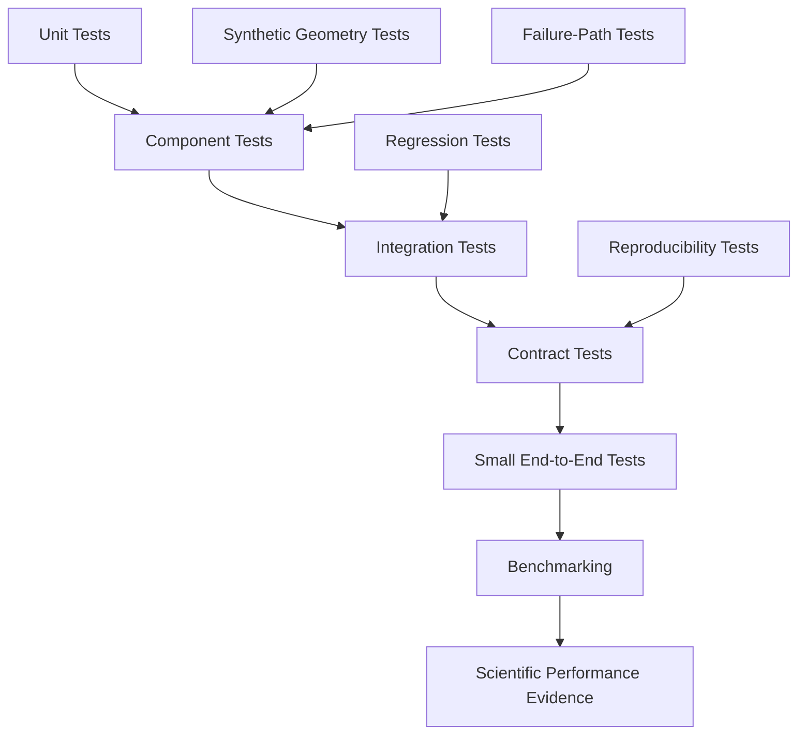
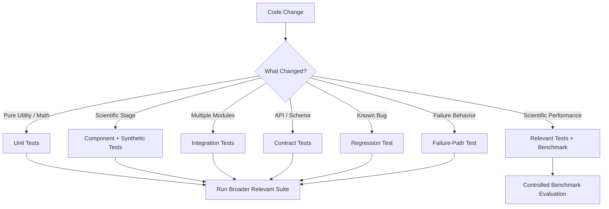

# Testing

ChandraMap is a scientific lunar image correspondence and registration system. Its tests must protect both ordinary software correctness and the scientific meaning of the system's outputs.

This document defines the development testing policy for ChandraMap. It is intended for contributors working on the scientific core, sensor processing, geometry, evaluation, backend, API, frontend, benchmarking infrastructure, reproducibility tooling, and supporting utilities.

> **Tests answer whether the implementation behaves according to its contracts. Benchmarks answer how well the scientific method performs on controlled lunar data.**

> **A test should protect an explicit contract, invariant, or failure mode; it should not merely prove that code executes without crashing.**

> **Tests verify software and scientific semantics; benchmarks measure scientific performance.**

> **Synthetic tests are powerful for verifying geometry and implementation, but they are not proof of real lunar robustness.**

> **A failed scientific registration may be the correct expected output of a test.**

> **Coordinate spaces, units, transform direction, and scientific stage should be tested explicitly wherever mistakes could remain visually plausible.**

> **Regression tests should protect scientific meaning, not freeze accidental implementation details.**

> **Tests must not use held-out benchmark truth to improve or tune the algorithm they are supposed to evaluate independently.**

> **Missing scientific evidence must be tested as unavailable, not encoded as a convenient zero.**

> **V1 tests should preserve the historical V1 methodology even when later versions add stronger algorithms.**

> **A small deterministic test that isolates one scientific invariant is usually more valuable than a large opaque end-to-end test that fails without diagnosis.**

> ChandraMap tests should make scientifically dangerous regressions—such as coordinate swaps, transform-direction changes, fit/check leakage, or hidden failure fallbacks—difficult to introduce silently.

---

## Source of Truth for Test Tooling

This document defines **what must be tested and why**. It does not independently define which testing framework, runner, marker system, coverage tool, or command the repository uses.

Before documenting, running, or modifying a concrete test command, inspect the authoritative repository configuration, including where present:

- [`../../pyproject.toml`](../../pyproject.toml)
- [`../../package.json`](../../package.json)
- [`../../Makefile`](../../Makefile)
- `.github/workflows/`
- repository test configuration
- existing test directories
- application-specific scripts
- CI configuration
- development documentation

> **Do not guess a test command. Use the repository-defined test command from project configuration, scripts, Makefile targets, or CI.**

Do not assume commands such as `pytest`, `npm test`, `make test`, or any coverage command unless the repository actually defines or uses them.

Similarly, this guide does not invent:

- testing frameworks
- marker names
- fixture APIs
- coverage percentages
- timeout values
- test directory layouts
- CI job names
- platform matrices
- benchmark commands
- service dependencies
- GPU requirements
- Docker requirements

When the repository does not define a concrete implementation detail, the policy in this file remains conceptual.

---

## Relationship to Development Documentation

The development documentation has distinct responsibilities:

| Document                                             | Responsibility                                                                                                                   |
| ---------------------------------------------------- | -------------------------------------------------------------------------------------------------------------------------------- |
| [`README.md`](README.md)                             | Development-documentation entry point                                                                                            |
| [`repository-structure.md`](repository-structure.md) | Where development and test code belongs                                                                                          |
| [`local-development.md`](local-development.md)       | How repository-defined local commands are discovered and run                                                                     |
| [`coding-standards.md`](coding-standards.md)         | Broader code-quality expectations                                                                                                |
| [`naming-conventions.md`](naming-conventions.md)     | Naming rules for tests, fixtures, files, and scientific concepts                                                                 |
| `testing.md`                                         | Testing philosophy, architecture, scientific regression rules, fixtures, contracts, failure behavior, and test-quality standards |

This file must not become a duplicate of the local-development guide or coding standards.

---

# 1. Testing Goals

Testing should provide confidence that:

- implementations satisfy documented contracts;
- scientific pipeline stages behave according to their intended semantics;
- source and reference roles remain distinct;
- coordinate mappings remain correct across native, crop, tile, pyramid, registration, and evaluation spaces;
- transforms preserve their documented direction and model semantics;
- candidate correspondences, filtered candidates, and verified inliers remain distinct;
- scientific failures remain explicit instead of being converted into false success;
- interfaces preserve the meaning of scientific results;
- historical V1 behavior does not drift accidentally;
- refactors do not silently alter scientific contracts;
- unavailable metrics remain unavailable;
- provenance and reproducibility metadata survive execution and serialization;
- configuration and version identities remain traceable;
- failure paths are testable and diagnosable;
- benchmark infrastructure preserves scientific separation between fitting and evaluation.

Testing should make incorrect scientific behavior difficult to introduce without a visible failure.

---

# 2. Testing Non-Goals

Passing software tests does **not** by itself prove:

- robustness across lunar terrain;
- Sun-angle invariance;
- illumination invariance;
- cross-sensor superiority;
- cross-modality superiority;
- benchmark accuracy;
- generalization to unseen regions;
- universal sub-pixel accuracy;
- metre-level geolocation accuracy;
- superiority of one scientific version over another;
- production readiness;
- performance on full-resolution mission archives.

Those claims require appropriate evidence from controlled evaluation and benchmarking.

A unit test that successfully recovers a known synthetic homography proves that the implementation behaved correctly for that controlled case. It does not prove that OHRC, TMC-2, IIRS, LRO NAC, or LRO WAC imagery will register reliably in real lunar conditions.

---

# 3. Tests vs Benchmarks vs Experiments

This distinction is fundamental to ChandraMap.

## Tests

Tests answer:

> **Does the implementation behave according to its specification?**

Examples include:

- whether coordinate conversion is correct;
- whether an invalid transform is rejected;
- whether RANSAC inlier indices remain aligned;
- whether the final transform is refitted after coordinate refinement;
- whether unavailable RMSE remains unavailable;
- whether held-out check points are excluded from fitting.

## Benchmarks

Benchmarks answer:

> **How well does the scientific method perform under frozen evaluation conditions?**

Examples include:

- registration success rate across controlled lunar pairs;
- check-point error;
- inlier statistics;
- spatial coverage;
- failure rate;
- runtime;
- retrieval Recall@K when retrieval is part of the tested scientific version.

Benchmark definitions belong in the evaluation and version documentation, including:

- [`../evaluation/README.md`](../evaluation/README.md)
- [`../evaluation/benchmark-protocol.md`](../evaluation/benchmark-protocol.md)
- [`../evaluation/metrics.md`](../evaluation/metrics.md)
- [`../versions/v1/benchmark.md`](../versions/v1/benchmark.md)

## Experiments

Experiments answer:

> **What happens when a method, configuration, representation, or hypothesis changes?**

Examples include comparing:

- raw intensity vs structural representations;
- one scale-pyramid policy vs another;
- different IIRS-derived 2D representations;
- different matchers;
- different refinement techniques.

Experimental results may motivate later design decisions, but exploratory experiments are not automatically tests and are not automatically benchmarks.

---

# 4. Test / Benchmark / Experiment Comparison

| Activity            | Primary Question                         | Typical Data                        | Expected Stability |
| ------------------- | ---------------------------------------- | ----------------------------------- | ------------------ |
| Unit/component test | Is implementation behavior correct?      | Small, synthetic, or fixture data   | High               |
| Integration test    | Do components interact correctly?        | Small representative fixtures       | High               |
| Regression test     | Did known behavior drift?                | Stable fixtures or stored contracts | High               |
| Benchmark           | How well does the method perform?        | Frozen controlled lunar pairs       | Frozen/versioned   |
| Experiment          | Does a hypothesis or method change help? | Controlled research data            | Exploratory        |

Software tests must not be presented as benchmark evidence.

Benchmark scores must not replace software correctness tests.

---

# 5. Test Layers

ChandraMap should use multiple conceptual testing layers. The repository's actual file structure and tooling determine how these layers are implemented.

## Unit Tests

Small tests for isolated deterministic behavior.

Typical targets include:

- coordinate conversions;
- numerical helpers;
- residual calculations;
- transformation helpers;
- metadata normalization;
- unit conversion;
- configuration validation;
- pair validation;
- mask logic.

## Component Tests

Tests for one scientific stage or subsystem.

Typical examples include:

- sensor routing;
- preprocessing;
- scale handling;
- feature extraction;
- descriptor matching;
- match filtering;
- RANSAC;
- transform fitting;
- refinement;
- registration;
- residual analysis;
- spatial coverage;
- result construction.

## Integration Tests

Tests verifying interactions among multiple components.

Examples:

- preprocessing → feature extraction;
- matching → filtering → RANSAC;
- verification → refinement → final refit;
- scientific core → backend;
- core result → API serialization;
- result schema → frontend interpretation.

## Contract Tests

Tests that protect stable boundaries such as:

- scientific input structures;
- result structures;
- transform serialization;
- API request/response schemas;
- version fields;
- provenance fields;
- scientific failure records;
- metric semantics.

## Regression Tests

Tests preserving behavior known to be correct or preventing recurrence of a known bug.

Scientific regressions deserve particularly strong protection when a bug could produce visually plausible but incorrect output.

## Synthetic Geometry Tests

Tests based on known generated geometry such as:

- translation;
- rotation;
- affine transforms;
- homographies.

These are especially useful for coordinate conventions, transform direction, fitting, warping, and residual calculations.

## Failure-Path Tests

Tests ensuring expected invalid or scientifically unsuccessful cases are represented correctly.

A correct failure is a successful test outcome when failure is the contractually correct behavior.

## Reproducibility Tests

Tests protecting:

- version identity;
- configuration resolution;
- data identity;
- randomness behavior;
- provenance preservation.

## End-to-End Tests

Small complete flows covering major system stages using compact controlled fixtures.

These should remain diagnosable and should not require entire mission archives unless explicitly designed as external integration tests.

---

# 6. Test Architecture



Benchmarking is downstream from and separate from software testing.

A passing software test suite does not remove the need for scientific benchmarking, and a strong benchmark result does not excuse missing correctness tests.

---

# 7. Unit-Test Design

Unit tests should isolate one small behavior and establish an independently understandable expectation.

Good targets include:

- converting between coordinate conventions;
- mapping coordinates between image levels;
- applying a known transform;
- computing a residual vector;
- computing a metric from a small known set;
- validating metadata;
- determining a supported configuration;
- validating pair roles;
- preserving mask alignment.

Avoid unit tests whose only assertion is effectively:

> “The function returned something.”

A meaningful unit test should demonstrate what specific contract was satisfied.

---

# 8. Good Unit-Test Characteristics

Good unit tests are:

- small;
- deterministic where practical;
- fast;
- isolated;
- explicit about expected behavior;
- independently understandable;
- easy to diagnose;
- based on minimal fixtures.

Ordinary unit tests should avoid unnecessary dependency on:

- network access;
- full lunar archives;
- external services;
- frontend systems;
- developer-specific files;
- persistent caches.

Such dependencies belong only where the unit genuinely requires them.

---

# 9. Scientific Component Testing

Component tests should verify one scientific subsystem at a time without confusing implementation behavior with benchmark performance.

Potential component boundaries include:

- sensor routing;
- preprocessing;
- scale-pyramid selection;
- feature extraction;
- descriptor matching;
- match filtering;
- RANSAC;
- transform estimation;
- sub-pixel refinement;
- final refit;
- registration;
- residual analysis;
- spatial coverage;
- result assembly.

Component tests should verify scientific semantics as well as software structure.

---

# 10. Pipeline Stage Contracts

Each important pipeline stage should be tested, where relevant, for:

- accepted inputs;
- rejected inputs;
- output type and shape;
- source/reference identity;
- coordinate space;
- units;
- metadata preservation;
- ordering constraints;
- failure behavior;
- provenance preservation.

A stage should not silently change coordinate spaces, units, sensor identity, or scientific status.

For example, a filtered candidate set must not become a verified-inlier set merely because it crossed a module boundary.

---

# 11. Sensor-Routing Tests

Sensor routing should follow the definitions in [`../algorithms/sensor-routing.md`](../algorithms/sensor-routing.md).

Tests should verify that the correct sensor/product representation reaches the correct preparation path.

Sensor identity should not be inferred solely from approximate GSD.

Two products can have similar nominal scale while having different:

- spectral characteristics;
- calibration states;
- projection states;
- processing histories;
- metadata;
- intended scientific roles.

Sensor routing should therefore rely on authoritative product or metadata identity according to repository contracts.

---

# 12. OHRC Testing

OHRC-related tests may protect:

- correct sensor routing;
- high-resolution representation metadata;
- mapping between working and native coordinates;
- scale comparison against coarser reference representations;
- mask and metadata preservation.

A real full-resolution OHRC mission product should not be required for every unit test.

Use the smallest fixture that preserves the behavior being tested.

---

# 13. TMC-2 Testing

TMC-2-related tests may protect:

- correct sensor routing;
- medium-scale representation handling;
- scale metadata;
- coordinate mapping;
- handling of product metadata.

Tests must not assume every TMC-2 product automatically includes terrain or DEM information merely because TMC-2 supports terrain mapping workflows.

---

# 14. IIRS Testing

IIRS requires stronger modality-specific tests because it is not simply another ordinary grayscale camera input.

Tests should verify that:

- a hyperspectral source is not silently treated as a normal single-band image;
- a registration-compatible 2D representation is explicit;
- the representation type is recorded;
- lineage to the parent IIRS product is preserved;
- unsupported representations fail clearly;
- band/channel interpretation remains explicit;
- spatial axes remain correct;
- conversion does not fabricate fine spatial detail.

> **Do not test or document “a full IIRS cube works directly with SIFT” unless the architecture explicitly defines and supports such behavior.**

A selected band, derived structural image, PCA representation, composite, or other representation must remain distinguishable from the original hyperspectral source.

---

# 15. LRO NAC / WAC Testing

Where applicable, tests should protect:

- reference sensor identity;
- NAC/WAC distinction;
- product metadata;
- pyramid or tile mapping;
- source/reference roles;
- coordinate lineage;
- reference representation selection.

Reference imagery is not automatically independent truth.

An LRO image may serve as the registration reference while independent check points or another truth definition provide evaluation evidence.

---

# 16. Preprocessing Tests

See [`../algorithms/preprocessing.md`](../algorithms/preprocessing.md).

Potential invariants include:

- output has the expected shape and representation;
- metadata remains traceable;
- valid-data masks remain aligned;
- coordinate mapping back to parent/native space remains available;
- input data is not unexpectedly mutated;
- data type conversion is intentional;
- source/reference identity is preserved.

Preprocessing tests should focus on what the implemented operation does, not on unproven claims about downstream robustness.

---

# 17. Illumination-Handling Tests

See [`../algorithms/illumination-handling.md`](../algorithms/illumination-handling.md).

Tests may verify implementation behavior such as:

- contrast normalization;
- structural representation generation;
- gradient or edge conversion;
- mask creation;
- metadata preservation.

They must not infer physical Sun-angle invariance from a passing normalization test.

Different lunar illumination can alter shadow geometry, not merely intensity. A normalization unit test cannot prove that registration is robust to those changes.

That question belongs to controlled benchmark stress tests.

---

# 18. Scale-Pyramid Tests

See [`../algorithms/scale-pyramid.md`](../algorithms/scale-pyramid.md).

Tests should protect:

- pyramid-level selection logic;
- scale metadata;
- level identity;
- native-to-level mapping;
- level-to-native mapping;
- parent relationships;
- coordinate conversion;
- off-by-one errors;
- appropriate failure for unsupported levels.

Upsampling should never be interpreted in tests as recovering missing physical detail.

---

# 19. Feature-Extraction Tests

Feature-extraction tests may verify that:

- supported input produces structurally valid output;
- empty or low-feature input is handled;
- keypoint and descriptor populations remain aligned;
- point coordinates remain associated with the correct image;
- coordinate spaces are recorded correctly;
- invalid masks or representations fail appropriately.

Do not require a fixed feature count unless the documented implementation contract guarantees one.

Feature count is often data- and implementation-dependent.

---

# 20. Matching Tests

See [`../algorithms/matching.md`](../algorithms/matching.md).

Matcher output should be represented as **candidate correspondences**.

A test should not interpret matcher confidence as proof of geometric correctness.

Important distinctions are:

```text
candidate correspondences
        ↓
filtered candidate correspondences
        ↓
geometrically verified inliers
```

Candidate matches are hypotheses.

They become verified inliers only after the configured geometric verification stage accepts them.

---

# 21. Match-Filtering Tests

See [`../algorithms/match-filtering.md`](../algorithms/match-filtering.md).

Tests should protect:

- candidate identity;
- source/reference point alignment;
- index association;
- score association;
- metadata association;
- order or identity where the contract requires it.

Filtering must not silently redefine surviving candidates as verified inliers.

---

# 22. RANSAC Tests

See [`../algorithms/ransac.md`](../algorithms/ransac.md).

Controlled component tests should verify that:

- valid geometric correspondences can support the expected model;
- deliberate outliers are rejected in appropriate synthetic cases;
- insufficient support fails clearly;
- degenerate geometry fails clearly;
- returned inlier masks or indices align with input candidates;
- transform direction remains correct;
- coordinate-space context remains correct;
- non-finite inputs are rejected or handled according to contract.

> **RANSAC inliers are not ground truth.**

RANSAC tells the system which candidate correspondences are consistent with a fitted geometric model under the configured verification process. It does not make those points independent truth.

---

# 23. Synthetic Geometry Tests

Synthetic geometry is one of the strongest tools for testing image-registration implementations because the true mapping can be known exactly by construction.

Appropriate synthetic cases may include:

- translation;
- rotation;
- isotropic or anisotropic scaling where supported;
- affine transformation;
- projective homography where supported.

Synthetic tests can verify:

- coordinate convention;
- x/y handling;
- row/column conversion;
- source/reference direction;
- transform fitting;
- transform application;
- inverse handling;
- warping;
- residual calculations;
- refinement;
- final refit.

For point-based tests, generate known source coordinates, transform them using known geometry, and verify that the tested implementation recovers or applies the correct relationship within an algorithmically justified tolerance.

---

# 24. Synthetic-Test Limitation

> **Recovering a synthetic transform verifies implementation behavior under that controlled synthetic condition; it does not demonstrate real Chandrayaan-2 ↔ LRO robustness.**

Synthetic data cannot reproduce all combinations of:

- lunar illumination;
- terrain relief;
- sensor response;
- radiometric differences;
- spatial-resolution differences;
- optical distortions;
- projection history;
- viewing geometry;
- missing spatial information.

Real scientific performance belongs to benchmarking.

---

# 25. Transform-Direction Tests

Transform direction deserves dedicated regression protection.

Where ChandraMap defines the mapping as:

```text
source → reference
```

a test should explicitly verify that direction.

A strong test should fail if the transform is accidentally inverted.

Do not rely only on visually inspecting a warped image. An inverted or misinterpreted transform can sometimes produce plausible-looking output on symmetric or low-information fixtures.

Transform direction should be represented explicitly in:

- internal data structures where supported;
- serialization;
- API output;
- documentation;
- tests.

---

# 26. Affine and Homography Tests

Where supported, synthetic affine or homography tests should verify:

- expected matrix or model representation;
- finite coefficients;
- correct source/reference application direction;
- correct transformed coordinates;
- valid shape;
- appropriate rejection of invalid models.

Do not invent project-wide numerical tolerances in this document.

Tolerance must come from:

- the numerical method;
- the operation under test;
- existing repository conventions;
- documented scientific requirements.

---

# 27. Degenerate-Geometry Tests

Expected failure cases should include relevant forms of invalid geometry such as:

- insufficient points;
- duplicated support points;
- collinear support where the model requires stronger geometry;
- non-finite point coordinates;
- singular or unusable matrices;
- invalid parameter shapes;
- unsupported transformation models.

> Invalid geometry must not silently become a successful identity transform.

Identity may be a valid scientific transform in a real identity case, but it must never be used merely as a convenient fallback after estimation failure.

---

# 28. Refinement Tests

See [`../algorithms/subpixel-refinement.md`](../algorithms/subpixel-refinement.md).

The scientific ordering should be protected:

```text
candidate matches
        ↓
geometric verification
        ↓
verified inliers
        ↓
sub-pixel/local refinement
```

Raw outliers should not be refined as part of the official refined-inlier population unless the scientific specification explicitly defines such behavior.

Tests should verify:

- only appropriate verified points reach official refinement;
- point identity remains traceable;
- refined coordinates remain in a defined coordinate space;
- failed refinement is represented explicitly.

---

# 29. Final-Refit Tests

Refining tie-point coordinates without recomputing the transformation would leave the final model inconsistent with the final control points.

Tests should therefore protect the contract:

```text
verified inliers
    ↓
refined coordinates
    ↓
final transform refit
```

A regression test should detect implementations that:

1. estimate an initial transform;
2. refine point coordinates;
3. accidentally return the original pre-refinement transform.

The final transform must represent the final accepted geometry when the pipeline specification requires a refit.

---

# 30. Verify → Refine → Refit

> **One regression test should protect the ordering: verify → refine → refit.**

The test should target the scientific ordering, not a specific function name or module path.

Refactoring internal code must not invalidate the scientific invariant.

---

# 31. Registration and Warp Tests

See [`../algorithms/registration.md`](../algorithms/registration.md).

Where registration or image warping is implemented, tests should verify:

- transform application direction;
- source/reference grid semantics;
- output shape or bounds according to contract;
- valid-data masks;
- nodata handling;
- coordinate alignment;
- invalid-transform failure.

A visually appealing warped output is insufficient evidence of correct geometry.

---

# 32. Residual-Analysis Tests

See [`../algorithms/residual-analysis.md`](../algorithms/residual-analysis.md).

Residual tests should use small known point sets to verify:

- residual vector direction;
- residual magnitude;
- coordinate space;
- units;
- population identity;
- expected count.

The residual population must be explicit.

Residuals on fitting points must not silently become independent registration error.

---

# 33. Fit Residual vs Check Error

> **A test must preserve the distinction between residuals on fitting points and error on independent held-out check points.**

These answer different questions.

### Fit residual

Measures consistency of points used, directly or indirectly, to estimate the transformation.

### Check-point error

Measures final transformation error on points excluded from fitting.

Do not allow a generic field, variable, schema entry, or metric implementation to silently substitute one for the other.

---

# 34. Check-Point Evaluation Tests

See [`../evaluation/checkpoint-evaluation.md`](../evaluation/checkpoint-evaluation.md).

Where check-point evaluation exists, tests should verify:

- check points are excluded from fitting;
- check points are excluded from refinement when they are evaluation-only;
- predicted coordinates are evaluated in the correct space;
- truth identities remain traceable;
- point counts are preserved;
- units are preserved;
- source/reference roles remain correct;
- check-point error is not replaced by fit residual.

A failure in this area can produce apparently excellent numerical results while invalidating the evaluation.

---

# 35. Truth-Leakage Tests

Truth leakage is a critical scientific failure.

Tests should detect accidental use of held-out truth or check data during:

- transform fitting;
- parameter tuning;
- point refinement;
- model selection;
- candidate ranking;
- scientific configuration selection;

when those data are defined as evaluation-only.

One useful design principle is to make fitting inputs and evaluation inputs structurally distinguishable so misuse is easier to detect.

> **Evaluation truth must not improve the method that it is supposed to evaluate independently.**

---

# 36. Ground-Truth Testing

See [`../evaluation/ground-truth.md`](../evaluation/ground-truth.md).

Tests should protect:

- truth-data identity;
- truth version;
- association with the correct pair;
- separation from fitting data;
- provenance;
- coordinate reference or image space;
- serialization into results where required.

Do not treat ordinary LRO reference imagery as independent ground truth unless the benchmark definition explicitly assigns it that role.

---

# 37. RMSE Tests

See [`../evaluation/metrics.md`](../evaluation/metrics.md).

RMSE implementations should be tested with small known coordinate sets whose expected value can be independently calculated.

Tests should verify where represented:

- mathematical value;
- units;
- coordinate space;
- evaluated population;
- point count.

Avoid assertions such as:

```text
RMSE < some arbitrary good-looking number
```

unless a specification or benchmark explicitly defines that threshold.

A metric unit test should verify the metric definition, not manufacture a scientific performance target.

---

# 38. Ground-Space Error Tests

Conversion from image-space error to ground-space error should be tested only when valid geospatial context exists.

Tests should verify that required information is available, such as:

- valid map projection;
- meaningful ground scale;
- appropriate coordinate model;
- authoritative product metadata;
- compatible reference truth.

Do not encode:

```text
metres = pixels × approximate sensor GSD
```

as universal scientific truth.

That simplification can be invalid depending on projection, product geometry, location, and how the pixel-space metric was defined.

---

# 39. Spatial-Coverage Tests

See [`../evaluation/spatial-coverage.md`](../evaluation/spatial-coverage.md).

Tests should validate the actual configured coverage method, including:

- valid image or overlap region;
- evaluated point population;
- coordinate space;
- bin/grid/hull behavior where applicable;
- known synthetic cases.

Coverage and accuracy must remain separate.

A correspondence set can have:

- high coverage and poor accuracy;
- low coverage and high local accuracy.

Both properties matter for different reasons.

---

# 40. Inlier-Ratio Tests

Inlier-ratio tests should verify:

- numerator;
- denominator;
- point populations;
- mathematical ratio;
- empty/undefined cases.

The denominator must match the documented definition.

For example, a ratio defined over filtered candidate correspondences must not silently change to use all extracted features.

---

# 41. Missing and Unavailable Metrics

Scientific result schemas must distinguish among states such as:

- measured zero;
- unavailable;
- not applicable;
- not evaluated;
- failed before measurement.

> **A missing metric should never pass a test merely because the code defaulted to `0`.**

Examples:

- zero residual is a measurement;
- unavailable check-point RMSE means evaluation evidence was absent;
- not-applicable retrieval metrics may be correct when global retrieval is not part of the version;
- failed-before-evaluation means the pipeline did not reach metric computation.

These states must not collapse into the same value.

---

# 42. Scientific Failure Tests

See [`../evaluation/failure-cases.md`](../evaluation/failure-cases.md).

Expected scientific failures may include, where supported:

- insufficient features;
- insufficient candidate correspondences;
- filtering removes usable support;
- geometric verification cannot establish a valid model;
- degenerate transform;
- refinement failure;
- final-refit failure;
- registration failure;
- evaluation unavailable.

Tests should assert that the failure is explicit and semantically correct.

---

# 43. Failure Is Valid Behavior

A scientifically unsuccessful registration can still represent correct software behavior.

For example:

```text
valid request
    ↓
valid pipeline execution
    ↓
insufficient geometric support
    ↓
structured scientific failure
```

That is not necessarily an API error or software crash.

> **Do not require every valid request to end in scientific registration success.**

---

# 44. Failure-Stage Tests

Where the result model records an observed failure stage, tests should verify that the stage corresponds to what the software actually observed.

Examples may include:

- preprocessing;
- feature extraction;
- matching;
- geometric verification;
- refinement;
- final refit;
- registration;
- evaluation.

Do not automatically assert a root-cause explanation unless the system truly diagnoses that cause.

Observed stage and inferred cause are different concepts.

---

# 45. Partial-Result Tests

A failed run can still preserve useful evidence, such as:

- feature counts;
- candidate count;
- filtered-candidate count;
- diagnostic statistics;
- masks;
- provenance;
- failure stage.

Tests should verify that partial evidence remains available where the contract allows it.

However, partial evidence must not be promoted to a final successful result.

---

# 46. No Fake Fallbacks

Regression coverage should prevent scientifically misleading fallback behavior such as:

- identity transform after estimation failure;
- zero RMSE when evaluation did not occur;
- empty correspondence set reported as success;
- fake registered image after failed geometry;
- stale initial transform after refinement;
- stale metrics computed from the wrong point population.

Fallback behavior must be explicit and scientifically justified.

---

# 47. API Error vs Scientific Failure

See [`../api/error-codes.md`](../api/error-codes.md).

Tests should preserve three broad categories.

## API / Input Error

The request cannot validly proceed.

Examples may include malformed structures, invalid identifiers, or unsupported transport-level values.

## Scientific Failure

The request is valid and execution occurs, but the scientific method cannot produce a valid registration.

## Service / Internal Failure

Unexpected infrastructure or software failure prevents correct processing.

These states must remain distinguishable.

A successful HTTP-level request must not automatically imply scientific registration success.

---

# 48. Contract Tests

Contract tests may protect:

- core input structures;
- core output structures;
- scientific result semantics;
- transform serialization;
- metric fields;
- failure records;
- coordinate spaces;
- units;
- provenance;
- version fields;
- API schema boundaries.

Contract tests should focus on stable meaning rather than incidental implementation layout.

Do not invent schema tooling in this guide.

Use the repository-defined tooling where implemented.

---

# 49. API Contract Tests

See:

- [`../api/endpoints.md`](../api/endpoints.md)
- [`../api/schemas.md`](../api/schemas.md)
- [`../api/request-response-examples.md`](../api/request-response-examples.md)

If concrete API routes exist, tests should exercise actual documented behavior.

If parts of the API remain conceptual, do not invent endpoint tests merely to make the test suite look complete.

---

# 50. API Result-Semantics Tests

Where scientific results are serialized through an API, tests should ensure:

- candidate remains candidate;
- filtered candidate remains filtered candidate;
- inlier remains inlier;
- transform direction survives serialization;
- coordinate spaces survive serialization;
- units survive serialization;
- unavailable remains unavailable;
- scientific failure remains distinguishable from API error;
- provenance survives serialization;
- scientific version survives serialization.

Serialization must not erase scientific meaning.

---

# 51. API Versioning Tests

See [`../api/versioning.md`](../api/versioning.md).

Where applicable, tests should verify:

- API version does not overwrite scientific algorithm version;
- schema version remains distinct;
- historical V1 result semantics remain interpretable;
- additive fields do not redefine existing fields;
- scientific version identity survives request/response boundaries.

Different kinds of versioning must not be collapsed into one ambiguous value.

---

# 52. Backend Tests

See [`../architecture/backend-architecture.md`](../architecture/backend-architecture.md).

Backend tests should focus on backend responsibilities such as:

- orchestration;
- input/resource resolution;
- invoking the scientific core correctly;
- status propagation;
- serialization;
- expected service failures;
- artifact coordination.

Backend tests should not duplicate every scientific algorithm test.

The scientific core should remain the authority for scientific logic.

---

# 53. Frontend Tests

See [`../architecture/frontend-architecture.md`](../architecture/frontend-architecture.md).

Frontend tests should protect interpretation of authoritative results.

Examples include ensuring that:

- unavailable values are not displayed as zero;
- scientific failures are visibly distinct from success;
- units remain visible;
- source/reference roles remain clear;
- candidate and inlier counts are not conflated;
- preview imagery is not mislabeled as accuracy evidence;
- artifact absence is not confused with scientific failure.

The frontend must not become the authority for metric formulas.

---

# 54. Result and Artifact Tests

ChandraMap should distinguish:

**Result**
Structured scientific information.

**Artifact**
A generated file, image, visualization, report, or other material representation.

Where the contract allows it, tests should verify that artifact-generation failure does not automatically erase a scientifically valid result.

Likewise, successful artifact generation does not prove scientific validity.

---

# 55. Provenance Tests

See [`../evaluation/reproducibility.md`](../evaluation/reproducibility.md).

Formal scientific results should preserve required provenance such as:

- scientific version;
- source identity;
- reference identity;
- pair identity;
- pair version;
- resolved configuration identity;
- benchmark version;
- truth version;
- code revision;
- environment metadata where required;
- randomness context where required.

Tests should verify preservation through relevant boundaries, including storage or serialization when implemented.

---

# 56. Reproducibility Tests

Reproducibility tests may verify that the same controlled setup resolves to the same:

- scientific version;
- pair identity;
- representation identity;
- configuration identity;
- benchmark definition;
- truth definition.

Do not require bit-for-bit identical floating-point output across every environment unless the repository explicitly promises that level of determinism.

Scientific reproducibility and byte-for-byte reproducibility are not always the same requirement.

---

# 57. Determinism Tests

Where behavior is intended to be deterministic, test that guarantee.

Where behavior is stochastic, test the repository-defined control mechanism for randomness.

Do not invent a universal seed.

Deterministic expectations must come from actual implementation contracts.

---

# 58. Randomness Tests

Stochastic components may include geometric robust estimation or later learned/retrieval methods.

Where reproducibility requires it, tests should verify that randomness can be:

- controlled;
- recorded;
- associated with the result;
- reproduced within the limits promised by the implementation.

Avoid fragile tests that pass only because one random realization happened to succeed.

---

# 59. V1 Regression Tests

V1 is the classical known-overlap registration baseline.

Its conceptual flow is:

```text
Input Validation
→ Metadata / Sensor Routing
→ Preprocessing
→ Physical Scale Handling
→ SIFT
→ Descriptor Matching
→ Match Filtering
→ RANSAC
→ Initial Transform
→ Optional Sub-Pixel Refinement
→ Final Refit
→ Registration
→ Evaluation
→ Reproducible Result
```

V1 regression tests should protect:

- known-pair local workflow;
- sensor-aware preprocessing;
- physical scale handling;
- SIFT baseline semantics;
- candidate-match semantics;
- filtering semantics;
- RANSAC verification;
- transform direction;
- coordinate spaces;
- optional refine/refit ordering;
- evaluation separation;
- structured scientific failure;
- provenance.

Relevant V1 documentation includes:

- [`../versions/v1/README.md`](../versions/v1/README.md)
- [`../versions/v1/specification.md`](../versions/v1/specification.md)
- [`../versions/v1/requirements.md`](../versions/v1/requirements.md)
- [`../versions/v1/pipeline.md`](../versions/v1/pipeline.md)
- [`../versions/v1/acceptance-criteria.md`](../versions/v1/acceptance-criteria.md)

---

# 60. V1 Historical Stability

> **A refactor should not make V1 silently behave like V2/V3/V4.**

V1 is useful partly because it remains a stable baseline.

Later improvements must not silently introduce into V1:

- retrieval requirements;
- learned matcher requirements;
- new geometry assumptions;
- later-version dependencies;
- changed metric semantics;
- changed failure semantics.

If V1 intentionally changes, that should be an explicit version/specification decision rather than accidental drift.

---

# 61. Version-Aware Testing

Scientific-version tests should verify that requesting a particular scientific version selects the methodology defined by that version.

Shared contracts may be reused.

Version-specific contracts should remain separate.

For example:

```text
shared result semantics
        ↑
V1-specific behavior
V2-specific behavior
V3-specific behavior
V4-specific behavior
```

Later versions should extend testing rather than retroactively redefining V1.

---

# 62. V2 Testing

If V2 introduces stronger local-registration behavior, its tests should cover the new V2-specific behavior while preserving shared scientific contracts.

Do not invent V2 requirements before they are formally specified.

Where semantics remain shared—for example transform direction, unavailable metrics, and provenance—the same conceptual contract should continue to apply.

---

# 63. V3 Testing

If V3 introduces global retrieval, add separate retrieval tests for concepts such as:

- retrieval representation;
- global descriptor generation;
- candidate ranking;
- selected reference candidate;
- Recall@K where defined by evaluation.

Retrieval testing must remain separate from registration testing.

A correctly retrieved reference candidate may still fail registration.

A correct local registration does not prove that global retrieval works.

---

# 64. FAISS Testing

If FAISS is later used, tests should verify only the role FAISS actually performs, such as:

- vector indexing;
- vector retrieval;
- ordering or candidate lookup according to configured behavior;
- metadata association with retrieved vectors.

FAISS output is not a verified geometric registration.

Do not label a retrieved tile as a correct correspondence merely because it was returned by the vector index.

---

# 65. Retrieval vs Registration

> **Retrieval asks “which reference candidate?” Registration asks “how do these two images geometrically align?”**

They require different tests and different metrics.

Conceptually:

```text
Global Retrieval
    ↓
candidate reference regions
    ↓
Local Registration
    ↓
candidate correspondences
    ↓
verified geometry
```

Do not merge these scientific stages in tests.

---

# 66. V4 Testing

If V4 later includes capabilities such as:

- DEM-aware geometry;
- uncertainty modeling;
- multi-mission support;
- advanced multimodal processing;

those capabilities should receive explicit V4-specific tests.

Future V4 expectations must not become V1 test requirements.

---

# 67. Test Fixtures

Good test fixtures should be:

- small;
- stable;
- traceable;
- representative of the contract under test;
- deterministic where practical;
- redistributable where licensing permits;
- easy to understand.

A test fixture should exist because it exposes a behavior, not simply because it is available.

---

# 68. Fixture Provenance

Where relevant, fixture documentation should record:

- source;
- synthetic or real status;
- parent product;
- representation;
- transformation or preparation history;
- scientific role;
- license or redistribution status;
- expected coordinate space.

This is especially important when a fixture was derived from mission data.

---

# 69. Real vs Synthetic Fixtures

## Real Fixture

Derived from an actual mission or project product.

Its provenance should remain traceable.

## Synthetic Fixture

Generated specifically for controlled testing.

Its generated nature should be explicit.

> Synthetic lunar-like data must not be presented as real lunar evidence.

---

# 70. Test Fixtures vs Benchmark Data

> **Test fixtures are chosen for deterministic software validation; benchmark data are chosen for controlled scientific evaluation.**

A tiny fixture that always passes may be ideal for a unit test.

It may be useless as benchmark evidence.

Conversely, a scientifically difficult benchmark pair may be too large or expensive for ordinary unit testing.

Keep the responsibilities separate.

---

# 71. Fixture Size

Prefer the smallest fixture that preserves the behavior under test.

Large fixtures increase:

- runtime;
- storage;
- repository size;
- fragility;
- debugging cost;
- licensing complexity.

They do not automatically increase test quality.

---

# 72. External Data in Tests

Ordinary tests should avoid live network downloads.

External archive access may be appropriate for explicitly designed external/integration workflows, but such behavior must follow repository-defined tooling.

Do not invent test markers or categories for this purpose.

Network dependence makes tests vulnerable to:

- outages;
- authentication changes;
- archive restructuring;
- rate limits;
- nondeterministic availability.

---

# 73. Data Licenses

Before committing mission-derived fixture data, verify redistribution and attribution requirements.

See [`../data-licenses.md`](../data-licenses.md).

Tests must not bypass data-license constraints for convenience.

---

# 74. Golden Files and Snapshots

If the repository uses golden files or snapshots, follow its actual policy.

Otherwise, treat the concept cautiously.

Scientific outputs may contain legitimate numerical differences due to:

- platform;
- library versions;
- floating-point behavior;
- stochastic methods;
- algorithm implementation.

Avoid freezing large opaque scientific outputs when a smaller semantic assertion would provide stronger protection.

---

# 75. Golden Tests Should Protect Meaning

Prefer assertions such as:

- transform direction is correct;
- coordinate-space fields are preserved;
- failure status remains failure;
- unavailable metric remains unavailable;
- point counts remain consistent;

over byte-for-byte comparison of an entire opaque result object when exact serialization is not the contract.

---

# 76. Image Comparison Tests

Image-output tests should not rely solely on exact pixel equality unless exact equality is intentionally guaranteed.

Depending on the contract, meaningful image assertions may include:

- shape;
- valid-data mask;
- bounds;
- coordinate alignment;
- known synthetic warp geometry;
- preservation of nodata.

Do not invent a universal image tolerance.

---

# 77. Floating-Point Tests

Use appropriate numerical tolerances for floating-point calculations.

Do not define a universal epsilon for all scientific calculations.

Tolerance should be justified by:

- numerical scale;
- operation;
- solver;
- transformation model;
- existing project conventions.

A failing regression is not a sufficient reason by itself to increase tolerance.

---

# 78. Property and Invariant Testing

Useful invariants can be tested even without a dedicated property-testing framework.

Examples include:

- coordinate round trips approximately recover the original coordinate;
- inlier count cannot exceed candidate count;
- filtered count cannot exceed input candidate count;
- final transform requires valid geometric support;
- missing evaluation never becomes numeric zero by default;
- source/reference reversal changes transform direction appropriately;
- pair roles remain ordered;
- valid masks remain spatially aligned.

The invariant matters more than the framework used to test it.

---

# 79. Coordinate Round-Trip Tests

Where coordinate mappings are reversible, test chains such as:

```text
native
→ crop/tile
→ pyramid
→ native
```

The recovered coordinate should approximately match the original within an appropriate numerical tolerance.

This is especially important because a one-level offset or x/y swap can still produce visually plausible matches.

---

# 80. Transform Round-Trip Tests

Where mathematically and numerically appropriate:

```text
source → reference
```

followed by inverse mapping may be tested on controlled coordinates.

Do not assume every transform or warp has a stable or meaningful inverse.

The test should follow the actual model contract.

---

# 81. Shape and Axis Tests

Important boundaries should explicitly test:

- array shape;
- point-array shape;
- axis ordering;
- x/y interpretation;
- row/column interpretation;
- channel ordering;
- spectral-band interpretation.

This is especially important for:

- IIRS;
- multi-band products;
- point arrays;
- image libraries with different axis conventions.

---

# 82. Nodata and Mask Tests

Where supported, tests should verify:

- valid-data mask alignment;
- nodata propagation;
- masked feature exclusion;
- warp behavior near invalid regions.

Invalid pixels must not silently become valid scientific evidence.

---

# 83. Metadata Tests

Tests should protect metadata such as:

- product identity;
- sensor identity;
- spatial scale;
- representation type;
- projection or coordinate context;
- parent lineage.

Do not replace authoritative mission/product metadata with convenient project approximations.

Derived values should remain identifiable as derived values.

---

# 84. Configuration Tests

Configuration tests should verify where applicable:

- configuration parses;
- required scientific settings resolve;
- overrides are applied correctly;
- incompatible version/configuration combinations fail;
- resolved configuration can be recorded for reproducibility.

Do not invent configuration keys in this document.

Tests should use the configuration model that actually exists.

---

# 85. Hidden-Default Regression Tests

Scientifically significant defaults can silently change behavior.

Where such defaults exist, regression tests should help detect unintentional changes.

Examples of scientifically significant concepts may include:

- transformation model;
- preprocessing route;
- sensor representation;
- matcher selection;
- scale handling;
- refinement enablement.

The exact settings belong to project configuration, not this guide.

---

# 86. Pair Tests

See [`../datasets/pair-definition.md`](../datasets/pair-definition.md).

Tests should protect:

- source identity;
- reference identity;
- ordered source/reference roles;
- pair identity;
- known-overlap relationship where required;
- pair metadata;
- benchmark association where applicable;
- truth linkage where applicable.

> A pair is not automatically unordered.

Reversing source and reference can change transform direction, coordinate interpretation, and metric meaning.

---

# 87. Dataset-Preparation Tests

See [`../datasets/dataset-preparation.md`](../datasets/dataset-preparation.md).

Where appropriate, tests should verify:

- raw input is not unexpectedly modified;
- derived output remains linked to its source;
- metadata is preserved;
- representation identity is recorded;
- coordinate mapping remains recoverable;
- masks remain aligned.

Prepared data should never lose the provenance necessary to interpret later results.

---

# 88. Test Isolation

Tests should not silently depend on:

- execution order;
- previous test outputs;
- developer home directories;
- machine-specific paths;
- undeclared environment variables;
- external network;
- stale caches;
- mutable global state.

If integration requires such state, it should be explicit and controlled.

---

# 89. Temporary Outputs

Tests that create files or artifacts should use repository/test-framework-approved temporary locations.

Do not write temporary test output into permanent data or results directories unless the test contract explicitly requires it.

Tests must not use dangerous recursive deletion behavior.

---

# 90. Cache Testing

If caching exists, tests should verify that cached results are not reused across incompatible identities such as:

- different source data;
- different reference data;
- different representation;
- different configuration;
- different scientific version.

Incorrect cache reuse can create extremely difficult-to-detect scientific contamination.

---

# 91. Parallel-Test Safety

If repository tooling supports parallel test execution, tests should avoid conflicts caused by:

- shared mutable state;
- fixed temporary filenames;
- shared output directories;
- fixed ports;
- global caches.

Do not claim parallel support unless actual repository tooling establishes it.

---

# 92. Security Testing

See [`../../SECURITY.md`](../../SECURITY.md).

Where relevant, tests may protect:

- unsafe path rejection;
- path traversal protection;
- malformed input handling;
- unsupported file handling;
- secret redaction;
- safe error responses;
- prevention of raw stack traces or credentials in API responses.

Do not invent security tooling.

Security behavior should be tested using the same repository-defined infrastructure as other software contracts.

---

# 93. API Input-Validation Tests

If an API exists, transport/schema validation tests should verify invalid request structures according to real API contracts.

These tests should remain distinct from scientific input validation.

A structurally valid request can still contain scientifically unsupported data.

---

# 94. Scientific Input-Validation Tests

Scientific validation should test cases that are structurally valid but unsupported scientifically.

Conceptual example:

```text
validly structured IIRS input
+
no supported registration representation
→ explicit scientific/input-validation failure
```

The exact failure class depends on the implemented architecture.

---

# 95. Service-Failure Tests

Where backend or service layers exist, tests should verify that unexpected internal failure remains distinguishable from a valid scientific registration failure.

For example:

```text
scientific no-solution
≠
service unavailable
≠
serialization bug
```

These states should not collapse into one generic failure record.

---

# 96. Frontend Failure-Display Tests

Where a frontend exists, test that it does not collapse:

- scientific failure;
- evaluation unavailable;
- artifact unavailable;
- API error;
- service error;

into one misleading success/error state.

The user should be able to distinguish what failed.

---

# 97. Documentation and Example Tests

Where repository tooling supports it, examples may be validated against real contracts, for example:

- API payload examples;
- schemas;
- command snippets;
- configuration examples.

Do not claim such validation already exists unless implemented.

---

# 98. Test Naming

See [`naming-conventions.md`](naming-conventions.md).

A test name should communicate:

- behavior under test;
- condition;
- expected result.

Avoid long-lived names such as:

- `test1`;
- `test_basic`;
- `test_final`;
- `test_new`.

Scientific tests benefit particularly from descriptive naming because their assertions often encode subtle invariants.

---

# 99. Failure Messages

A failing test should make the violated invariant understandable.

Avoid combining unrelated scientific assertions into one enormous test because the first failure may hide the real cause.

Where the framework allows explanatory assertion context, use it judiciously.

---

# 100. One Primary Reason to Fail

> **A good test may contain several related assertions, but it should have one clear behavioral reason for existing.**

For example, a coordinate round-trip test may check both x and y components because both belong to the same invariant.

It should not also test API serialization, caching, and frontend formatting in the same case.

---

# 101. Test Duplication

Do not repeat the same scientific invariant at every layer without reason.

A useful pattern is:

```text
precise unit test
+
selected component/integration protection
+
contract or end-to-end coverage where boundary behavior matters
```

Duplication is justified when different layers protect genuinely different failure modes.

---

# 102. Mocking

Mocks, stubs, and fakes can be useful at external boundaries.

Potential uses include:

- backend orchestration;
- network boundaries;
- storage boundaries;
- expensive external services.

Do not mock the scientific algorithm under test and then claim that the scientific algorithm was validated.

---

# 103. Mocking the Scientific Core

Backend or API tests may replace core execution with a controlled fake when testing orchestration or serialization.

Separate integration tests should verify real core ↔ backend behavior where the architecture supports it.

These tests answer different questions.

---

# 104. End-to-End Tests

A small end-to-end test may cover:

```text
Input
→ preprocessing
→ matching
→ geometric verification
→ transform
→ result
```

using compact controlled fixtures.

Good end-to-end tests should remain:

- stable;
- understandable;
- reasonably fast;
- diagnosable.

If the test fails, contributors should still be able to determine which major stage broke.

---

# 105. End-to-End Limitation

Passing one small lunar image pair does not prove general scientific performance.

It proves that one controlled end-to-end path behaved according to its test contract.

General robustness belongs to benchmark evaluation.

---

# 106. Smoke Tests

If the repository defines smoke tests, follow its actual tooling and definition.

Conceptually, a smoke test verifies that a basic execution path is operational.

It does not prove:

- registration accuracy;
- illumination robustness;
- cross-sensor performance;
- scientific correctness of all results.

---

# 107. Performance Tests

Performance tests may measure:

- runtime;
- memory use;
- throughput;

under controlled conditions.

Performance regression and scientific accuracy are separate concerns.

A faster implementation is not necessarily scientifically better.

---

# 108. Performance-Test Environment

Meaningful runtime comparisons should record relevant hardware and software context.

Avoid fragile exact runtime assertions across unrelated machines unless the project uses controlled runners and explicitly defines that contract.

---

# 109. Memory Testing

Lunar imagery can be large, so memory behavior may matter.

Add memory-specific tests only where:

- memory requirements are defined;
- appropriate tooling exists;
- the execution environment is controlled enough for useful assertions.

Do not invent memory limits.

---

# 110. CI Testing

CI behavior should be documented from the repository's actual workflow configuration.

Do not invent:

- workflow names;
- jobs;
- matrices;
- commands;
- triggers.

CI should ideally exercise repository-required checks in a clean environment.

Full scientific benchmark evaluation may remain separate because of data size, runtime, or external-resource requirements.

---

# 111. Local vs CI

> **A test that passes only because of undeclared local state is not a reliable test.**

Where practical, contributors should be able to reproduce relevant CI checks locally using repository-defined commands.

Differences between local and CI environments should be explicit.

---

# 112. CI Is Not Benchmark Truth

CI may reasonably execute:

- unit tests;
- component tests;
- contract tests;
- selected regressions;
- small end-to-end tests;
- lightweight smoke tests.

Do not assume every pull request should execute the entire lunar benchmark corpus.

Scientific benchmark runs may require:

- larger datasets;
- longer runtime;
- controlled environments;
- optional dependencies.

---

# 113. Test Speed

Fast feedback matters.

Use small, targeted tests for common development work.

Use larger integration or end-to-end tests only where they add meaningful confidence.

Do not make every test a full-resolution mission-data run.

---

# 114. Test Selection

For a code change:

1. run the smallest relevant tests first;
2. run broader related tests;
3. run the repository-defined full suite according to project policy;
4. if scientific behavior changed, run the relevant benchmark separately.

Do not use a benchmark run as a substitute for unit or regression tests.

---

# 115. Test-Selection Decision Flow



---

# 116. Bug-Fix Testing

For a bug fix, add a regression test where practical that:

- fails before the fix;
- passes after the fix;
- protects the intended contract.

Do not freeze the old implementation if the documented contract says the implementation was wrong.

---

# 117. Scientific Bug Fixes

Scientific bugs deserving strong regression coverage include:

- x/y swap;
- row/column confusion;
- wrong transform direction;
- pyramid-level offset;
- coordinate mapping error;
- fit/check leakage;
- stale transform after refinement;
- unavailable metric encoded as zero;
- candidate/inlier semantic collapse;
- identity fallback after failed geometry.

These can produce apparently reasonable outputs and are therefore particularly dangerous.

---

# 118. Refactor Testing

A refactor should preserve intended scientific behavior.

Run relevant:

- unit tests;
- component tests;
- regression tests;
- integration tests.

If benchmark outputs materially change after a supposedly behavior-preserving refactor, investigate the difference rather than assuming it is harmless.

---

# 119. Architecture-Change Testing

When responsibilities move between modules or services, tests should continue to prove the scientific contract.

Do not replace meaningful tests with assertions that merely verify a new import path.

Architecture changes should preserve:

- semantics;
- stage ordering;
- version behavior;
- failure meaning;
- provenance.

---

# 120. API-Change Testing

When API or schema behavior changes, test as applicable:

- request compatibility;
- response semantics;
- scientific failure semantics;
- version fields;
- unavailable fields;
- units;
- coordinate spaces;
- provenance.

A transport change must not silently redefine scientific meaning.

---

# 121. Scientific-Version Changes

See:

- [`../api/versioning.md`](../api/versioning.md)
- [`../versions/README.md`](../versions/README.md)

A new scientific version should add new tests without rewriting historical V1 behavior.

Historical tests should change only when:

- the specification itself is formally corrected; or
- a test is proven to encode the wrong contract.

---

# 122. Historical Result Fixtures

Where practical, representative historical V1 result contracts may be retained to detect:

- schema drift;
- semantic drift;
- version loss;
- transform-direction changes;
- failure-representation changes.

Do not invent fixture filenames here.

---

# 123. Result-Schema Regression Tests

Protect result meaning, including:

- transform direction;
- coordinate spaces;
- units;
- candidate semantics;
- inlier semantics;
- failure semantics;
- version fields;
- provenance fields;
- null/unavailable meaning.

A schema can remain syntactically valid while becoming scientifically wrong.

---

# 124. Benchmark-Safety Tests

Testing can protect benchmark infrastructure without hard-coding scientific benchmark scores.

Useful checks may include:

- benchmark pair definitions resolve;
- truth remains excluded from fitting;
- scientifically failed pairs remain recorded;
- metric definitions resolve;
- benchmark version is preserved;
- pair identity remains stable.

These tests protect the evaluation machinery.

They do not state how well the algorithm performs.

---

# 125. Benchmark Test vs Benchmark Run

## Benchmark Infrastructure Test

Asks:

> Does the benchmark runner/configuration/evaluation machinery behave correctly?

## Benchmark Run

Asks:

> What scientific performance did this method achieve on the controlled benchmark?

These should not be confused.

---

# 126. Failure Retention in Evaluation

Evaluation integration tests should verify that scientifically failed valid pairs remain represented as failures rather than disappearing from summaries.

Dropping difficult failures can artificially improve:

- success rate;
- average error;
- coverage statistics;
- runtime summaries.

Failure retention is part of evaluation integrity.

---

# 127. Success-Criteria Tests

See [`../evaluation/success-criteria.md`](../evaluation/success-criteria.md).

Where success classification exists, test the implemented classifier against the actual documented definition.

Do not invent thresholds in this guide.

---

# 128. Acceptance-Criteria Tests

See [`../versions/v1/acceptance-criteria.md`](../versions/v1/acceptance-criteria.md).

Version-level acceptance criteria are not necessarily equivalent to per-run success criteria.

Tests may verify that acceptance logic implements actual requirements, but they must not create new acceptance thresholds.

---

# 129. Traceability

Where useful, ChandraMap should support traceability such as:

```text
requirement
→ implementation
→ test
→ benchmark/evidence
```

Do not invent test or requirement IDs if the repository does not define them.

The objective is to make it possible to answer:

> Which test proves this requirement is implemented correctly?

and separately:

> Which benchmark evidence evaluates how well it performs?

---

# 130. Requirement-to-Test Matrix

| Requirement / Contract      | Test Level                        | Test Purpose                    | Benchmark Needed? |
| --------------------------- | --------------------------------- | ------------------------------- | ----------------- |
| Coordinate-space mapping    | Unit / component                  | Prevent geometry mapping errors | No                |
| V1 RANSAC ordering          | Integration / regression          | Protect pipeline semantics      | No                |
| Held-out check independence | Integration / evaluation contract | Prevent truth leakage           | No                |
| Scientific robustness       | Benchmark                         | Measure performance             | Yes               |
| API result semantics        | Contract                          | Preserve scientific meaning     | No                |

---

# 131. Test Documentation

Tests should ideally be understandable from:

- their names;
- setup;
- fixtures;
- assertions.

For scientifically non-obvious invariants, concise comments or docstrings are appropriate.

The comment should explain **why** the invariant matters.

---

# 132. Test Comments

Useful comment:

> Source and reference are intentionally asymmetric here because transform direction must remain source → reference.

Poor comment:

> Check result is not None.

Comments should add context, not restate code.

---

# 133. Failure Diagnosis

When a test fails, identify the earliest violated contract.

Do not immediately:

- loosen tolerance;
- increase thresholds;
- remove an assertion;
- regenerate a golden result;

merely to restore a green test suite.

A changed result may be revealing a real regression.

---

# 134. Fix the Code or Fix the Test?

> **If implementation and test disagree, first determine which one contradicts the documented contract.**

Possible outcomes are:

- implementation bug;
- test bug;
- outdated documentation;
- intentional contract change.

Do not silently modify implementation, test, and documentation together until they agree.

That destroys evidence of what changed.

---

# 135. Flaky Tests

Common sources of flakiness include:

- randomness;
- timing;
- concurrency;
- external network;
- floating-point instability;
- shared state;
- environment dependence.

Flaky tests should be diagnosed.

Repeated retry is not a substitute for understanding the cause.

---

# 136. Stochastic Scientific Tests

For stochastic algorithms, control random state where project architecture supports it.

Avoid assertions that depend on one lucky stochastic outcome.

Prefer stable properties such as:

- valid result structure;
- controlled seed reproducibility;
- correct failure semantics;
- invariant preservation.

---

# 137. Tolerances

Numerical tolerances should be scientifically and numerically justified.

Do not increase tolerance merely because a previously passing regression test now fails.

Investigate first:

- algorithm change;
- coordinate-space change;
- library update;
- platform effect;
- true numerical instability.

---

# 138. Platform Differences

Do not assume identical floating-point output on every supported or unsupported platform.

If CI actually tests specific platforms, document those facts in the appropriate tooling documentation.

This guide makes no unsupported compatibility claims.

---

# 139. Test Cleanup

Tests should clean their controlled temporary state without deleting:

- raw data;
- formal scientific results;
- developer files;
- unrelated caches;
- repository content outside test scope.

Do not use dangerous broad deletion patterns.

---

# 140. Security and Secret Fixtures

Test credentials, where needed, must be:

- clearly fake;
- non-sensitive;
- safe to commit.

Never place real:

- API keys;
- tokens;
- passwords;
- personal credentials;

in tests or fixtures.

---

# 141. Test-Data Privacy

Avoid machine-specific, personal, or private information in:

- test fixtures;
- logs;
- snapshots;
- expected output.

Tests should be portable and safe to publish.

---

# 142. Test Logging

Failure output should contain enough information to diagnose the violated contract.

Avoid dumping unnecessarily large data such as:

- full-resolution images;
- hyperspectral cubes;
- massive correspondence arrays;
- raw binary content.

Prefer concise diagnostics.

---

# 143. Documentation Testing

Where tooling supports it, documentation examples can be checked against actual implementation to reduce drift.

This may apply to:

- payloads;
- schemas;
- configuration examples;
- code snippets.

This document does not claim that such validation currently exists.

---

# 144. AI-Generated Code

AI-generated contributions must meet the same testing standard as human contributions.

AI-generated tests should not merely mirror implementation line by line.

They should test independently understandable:

- contracts;
- invariants;
- failure modes;
- scientific semantics.

An AI agent should inspect relevant documentation before creating or modifying scientific tests.

---

# 145. Testing Anti-Patterns

Do **not**:

- treat benchmark scores as unit tests;
- claim scientific robustness from synthetic tests;
- depend on full mission data for every test;
- use candidate matches as ground truth;
- use RANSAC inliers as ground truth;
- fit and evaluate on the same held-out points;
- encode missing metrics as zero;
- accept identity transform as a hidden failure fallback;
- accept stale transforms after refinement;
- compare transformation matrices without considering direction or coordinate spaces;
- use one generic error concept for fit residual, check error, scientific failure, and service failure;
- hard-code arbitrary scientific thresholds;
- weaken tolerances merely to obtain green CI;
- drop difficult benchmark failures;
- interpret an API 2xx response as scientific success;
- mock the scientific algorithm and call it algorithm validation;
- require network downloads for ordinary unit tests;
- depend on test execution order;
- use developer-specific absolute paths;
- leave temporary outputs in source directories;
- commit huge mission products as ordinary fixtures without need;
- invent test commands or test frameworks;
- require V3/V4 behavior in V1;
- make optional learned-model dependencies mandatory for classical V1;
- snapshot huge opaque scientific results when semantic assertions are better;
- confuse code coverage with spatial correspondence coverage;
- confuse code coverage with scientific quality.

---

# 146. Code Coverage Caution

Three different concepts must remain distinct.

## Code Coverage

Which implementation lines or branches were exercised by tests.

## Spatial Coverage

How well verified correspondences are distributed across the valid image or overlap region.

## Scientific Performance

How well the method performs under controlled evaluation.

> **High code coverage does not imply high registration accuracy, and spatial correspondence coverage is not software test coverage.**

This guide defines no minimum code-coverage percentage.

---

# 147. Claims to Avoid

Do not claim without repository evidence:

- “The project uses pytest.”
- “Run pytest.”
- “The project uses Jest.”
- “Tests require Docker.”
- “The suite has 100% coverage.”
- “Coverage must exceed 90%.”
- “All tests run on every pull request.”
- “All benchmarks run in CI.”
- “The suite completes in a particular duration.”
- “All tests are deterministic.”
- “Every sensor has end-to-end fixtures.”
- “GPU execution is required for tests.”
- “V2/V3/V4 are fully tested.”
- “The test suite proves sub-pixel accuracy.”
- “The test suite proves illumination invariance.”

Concrete claims must come from current repository evidence.

---

# 148. Testing Limitations

No testing strategy removes all scientific uncertainty.

Relevant limitations include:

- not all mission products can reasonably be included as fixtures;
- cross-platform numerical differences may exist;
- learned methods may require optional heavyweight dependencies;
- full benchmark datasets may be unsuitable for ordinary CI;
- synthetic data cannot reproduce all lunar conditions;
- external archive availability can affect reproducibility;
- later-version features may remain unimplemented;
- tests cannot prove generalization;
- tests cannot substitute for independent scientific evaluation.

The testing system should expose these limitations rather than hiding them.

---

# 149. Test Maintenance

Update tests when:

- a documented contract changes;
- intended algorithm behavior changes;
- API/schema contracts change;
- a bug is fixed;
- a sensor route is introduced or changed;
- coordinate mapping changes;
- metric definitions change;
- scientific versions add behavior.

Do not update an existing test merely because an implementation changed if the original contract is still correct.

---

# 150. Deleting Tests

Before deleting a test, determine:

- which contract it protects;
- whether that contract still exists;
- whether replacement coverage exists;
- whether it protects historical V1 behavior;
- whether the apparent redundancy actually covers a different boundary.

Do not delete a failing test simply because a refactor broke it.

---

# 151. Test Review Questions

Reviewers should ask:

1. What contract does this test protect?
2. Is this actually a test, or is it a benchmark?
3. Is the fixture minimal?
4. Is the expected value independently derived?
5. Are coordinate spaces explicit?
6. Is transform direction explicit?
7. Are units explicit?
8. Does the test preserve candidate/inlier distinctions?
9. Is evaluation truth kept out of fitting?
10. Is failure behavior tested?
11. Are unavailable values handled correctly?
12. Does the test rely on local machine state?
13. Does it depend on network unnecessarily?
14. Is randomness controlled where needed?
15. Does it preserve V1 behavior?
16. Does it accidentally require a later-version dependency?
17. Can the test fail for one clear behavioral reason?
18. Is the assertion scientifically meaningful?
19. Does the test duplicate another test unnecessarily?
20. Does a scientific-performance change also require benchmark evaluation?

---

# 152. Testing Checklist

## Test Purpose

- [ ] Test protects a clear contract, invariant, or failure mode
- [ ] Test is not being used as benchmark evidence
- [ ] Expected behavior comes from documentation or specification
- [ ] Test name describes the behavior under test

## Fixtures

- [ ] Fixture is as small as practical
- [ ] Synthetic/real status is clear
- [ ] Fixture provenance is known where relevant
- [ ] Large mission data is not included unnecessarily
- [ ] Data-license constraints are respected

## Coordinates / Geometry

- [ ] Source/reference roles are explicit
- [ ] x/y vs row/column is explicit
- [ ] Coordinate spaces are explicit
- [ ] Crop/tile/pyramid mappings are tested where relevant
- [ ] Transform direction is tested
- [ ] Degenerate geometry is tested where relevant

## Matching / Verification

- [ ] Candidate matches are not treated as truth
- [ ] Filtering semantics are tested
- [ ] RANSAC inlier indices remain aligned
- [ ] RANSAC inliers are not treated as independent truth
- [ ] Verify → refine → refit ordering is protected
- [ ] Final transform reflects refined coordinates where applicable

## Evaluation

- [ ] Fit/check populations remain distinct
- [ ] Held-out truth is not used for fitting
- [ ] RMSE units, space, and population are tested
- [ ] Coverage definition is tested
- [ ] Missing evaluation is not encoded as zero
- [ ] Ground-space error is tested only with valid context

## Failures

- [ ] Expected scientific failure is represented explicitly
- [ ] Failure stage is preserved where supported
- [ ] Partial results do not become final results
- [ ] Identity-transform fallback is not hiding failure
- [ ] API, service, and scientific failures remain distinct

## Versioning / Reproducibility

- [ ] Scientific version is preserved
- [ ] V1 behavior is protected
- [ ] Later-version behavior is not silently required by V1
- [ ] Configuration identity/resolution is tested
- [ ] Pair/data identity is preserved
- [ ] Benchmark/truth version is preserved where relevant
- [ ] Randomness is controlled or recorded where needed

## Interfaces

- [ ] API serialization preserves scientific meaning
- [ ] Backend does not duplicate core science unnecessarily
- [ ] Frontend does not redefine metrics
- [ ] Unavailable/failure status survives interface boundaries

## Test Quality

- [ ] Test has one clear behavioral purpose
- [ ] Test does not depend on execution order
- [ ] Test does not rely on developer-specific paths
- [ ] Test does not rely on network unnecessarily
- [ ] Floating-point tolerances are justified
- [ ] Flakiness has been addressed rather than hidden

## Security / Hygiene

- [ ] No real secrets are present
- [ ] Temporary files stay in controlled test locations
- [ ] Tests do not delete raw or formal data
- [ ] Failure output does not expose sensitive information

---

# 153. Testing Decision Table

| Change                      | Minimum Testing Consideration             |
| --------------------------- | ----------------------------------------- |
| Coordinate conversion       | Unit + round-trip regression test         |
| Transform estimation        | Synthetic geometry + degenerate case      |
| RANSAC behavior             | Component + failure-path tests            |
| Sub-pixel refinement        | Verify/refine/refit regression            |
| Metric implementation       | Known-value unit tests                    |
| Check-point evaluation      | Truth-leakage + held-out evaluation tests |
| Sensor routing              | Sensor-specific component tests           |
| API schema                  | Contract + serialization tests            |
| Backend orchestration       | Service/integration tests                 |
| Frontend result display     | Result/failure/unavailable-state tests    |
| Bug fix                     | Regression test where practical           |
| Scientific algorithm change | Tests + relevant benchmark evaluation     |

---

# 154. Related Development Documentation

- [`README.md`](README.md)
- [`repository-structure.md`](repository-structure.md)
- [`local-development.md`](local-development.md)
- [`coding-standards.md`](coding-standards.md)
- [`naming-conventions.md`](naming-conventions.md)

Possible future development documentation may separately cover areas such as debugging, configuration, benchmark development, backend development, frontend development, or release workflow.

---

# 155. Related Project Documentation

- [`../project/goals.md`](../project/goals.md)
- [`../project/non-goals.md`](../project/non-goals.md)
- [`../project/v1-scope.md`](../project/v1-scope.md)
- [`../project/terminology.md`](../project/terminology.md)
- [`../project/assumptions.md`](../project/assumptions.md)
- [`../project/limitations.md`](../project/limitations.md)

---

# 156. Related Architecture Documentation

- [`../architecture/system-overview.md`](../architecture/system-overview.md)
- [`../architecture/v1-pipeline.md`](../architecture/v1-pipeline.md)
- [`../architecture/core-engine-architecture.md`](../architecture/core-engine-architecture.md)
- [`../architecture/backend-architecture.md`](../architecture/backend-architecture.md)
- [`../architecture/frontend-architecture.md`](../architecture/frontend-architecture.md)
- [`../architecture/module-map.md`](../architecture/module-map.md)
- [`../architecture/data-flow.md`](../architecture/data-flow.md)
- [`../architecture/output-flow.md`](../architecture/output-flow.md)

---

# 157. Related Version Documentation

- [`../versions/README.md`](../versions/README.md)
- [`../versions/v1/README.md`](../versions/v1/README.md)
- [`../versions/v1/specification.md`](../versions/v1/specification.md)
- [`../versions/v1/scope.md`](../versions/v1/scope.md)
- [`../versions/v1/requirements.md`](../versions/v1/requirements.md)
- [`../versions/v1/architecture.md`](../versions/v1/architecture.md)
- [`../versions/v1/pipeline.md`](../versions/v1/pipeline.md)
- [`../versions/v1/inputs.md`](../versions/v1/inputs.md)
- [`../versions/v1/outputs.md`](../versions/v1/outputs.md)
- [`../versions/v1/benchmark.md`](../versions/v1/benchmark.md)
- [`../versions/v1/acceptance-criteria.md`](../versions/v1/acceptance-criteria.md)
- [`../versions/v1/exclusions.md`](../versions/v1/exclusions.md)
- [`../versions/v1/limitations.md`](../versions/v1/limitations.md)

---

# 158. Related Sensor Documentation

- [`../sensors/overview.md`](../sensors/overview.md)
- [`../sensors/ohrc.md`](../sensors/ohrc.md)
- [`../sensors/tmc2.md`](../sensors/tmc2.md)
- [`../sensors/iirs.md`](../sensors/iirs.md)
- [`../sensors/lro-nac.md`](../sensors/lro-nac.md)
- [`../sensors/lro-wac.md`](../sensors/lro-wac.md)

---

# 159. Related Dataset Documentation

- [`../datasets/README.md`](../datasets/README.md)
- [`../datasets/chandrayaan-2.md`](../datasets/chandrayaan-2.md)
- [`../datasets/lro.md`](../datasets/lro.md)
- [`../datasets/metadata.md`](../datasets/metadata.md)
- [`../datasets/data-format.md`](../datasets/data-format.md)
- [`../datasets/dataset-structure.md`](../datasets/dataset-structure.md)
- [`../datasets/dataset-preparation.md`](../datasets/dataset-preparation.md)
- [`../datasets/pair-definition.md`](../datasets/pair-definition.md)
- [`../datasets/ground-truth-preparation.md`](../datasets/ground-truth-preparation.md)

---

# 160. Related Algorithm Documentation

- [`../algorithms/overview.md`](../algorithms/overview.md)
- [`../algorithms/sensor-routing.md`](../algorithms/sensor-routing.md)
- [`../algorithms/preprocessing.md`](../algorithms/preprocessing.md)
- [`../algorithms/illumination-handling.md`](../algorithms/illumination-handling.md)
- [`../algorithms/scale-pyramid.md`](../algorithms/scale-pyramid.md)
- [`../algorithms/sift.md`](../algorithms/sift.md)
- [`../algorithms/matching.md`](../algorithms/matching.md)
- [`../algorithms/match-filtering.md`](../algorithms/match-filtering.md)
- [`../algorithms/ransac.md`](../algorithms/ransac.md)
- [`../algorithms/transforms.md`](../algorithms/transforms.md)
- [`../algorithms/residual-analysis.md`](../algorithms/residual-analysis.md)
- [`../algorithms/subpixel-refinement.md`](../algorithms/subpixel-refinement.md)
- [`../algorithms/registration.md`](../algorithms/registration.md)

---

# 161. Related Evaluation Documentation

- [`../evaluation/README.md`](../evaluation/README.md)
- [`../evaluation/benchmark-protocol.md`](../evaluation/benchmark-protocol.md)
- [`../evaluation/benchmark-categories.md`](../evaluation/benchmark-categories.md)
- [`../evaluation/metrics.md`](../evaluation/metrics.md)
- [`../evaluation/ground-truth.md`](../evaluation/ground-truth.md)
- [`../evaluation/control-points.md`](../evaluation/control-points.md)
- [`../evaluation/checkpoint-evaluation.md`](../evaluation/checkpoint-evaluation.md)
- [`../evaluation/spatial-coverage.md`](../evaluation/spatial-coverage.md)
- [`../evaluation/stress-tests.md`](../evaluation/stress-tests.md)
- [`../evaluation/success-criteria.md`](../evaluation/success-criteria.md)
- [`../evaluation/failure-cases.md`](../evaluation/failure-cases.md)
- [`../evaluation/reproducibility.md`](../evaluation/reproducibility.md)

For testing work, pay particular attention to:

- [`../evaluation/benchmark-protocol.md`](../evaluation/benchmark-protocol.md)
- [`../evaluation/checkpoint-evaluation.md`](../evaluation/checkpoint-evaluation.md)
- [`../evaluation/failure-cases.md`](../evaluation/failure-cases.md)
- [`../evaluation/reproducibility.md`](../evaluation/reproducibility.md)

---

# 162. Related API Documentation

- [`../api/README.md`](../api/README.md)
- [`../api/overview.md`](../api/overview.md)
- [`../api/endpoints.md`](../api/endpoints.md)
- [`../api/schemas.md`](../api/schemas.md)
- [`../api/error-codes.md`](../api/error-codes.md)
- [`../api/versioning.md`](../api/versioning.md)
- [`../api/request-response-examples.md`](../api/request-response-examples.md)

---

# 163. Data Licenses

See:

- [`../data-licenses.md`](../data-licenses.md)

Test fixtures derived from mission data must respect redistribution and attribution requirements.

---

# 164. Root Repository Documentation

Relevant root-level repository documents include:

- [`../../README.md`](../../README.md)
- [`../../CONTRIBUTING.md`](../../CONTRIBUTING.md)
- [`../../CODE_OF_CONDUCT.md`](../../CODE_OF_CONDUCT.md)
- [`../../SECURITY.md`](../../SECURITY.md)
- [`../../ROADMAP.md`](../../ROADMAP.md)
- [`../../CHANGELOG.md`](../../CHANGELOG.md)
- [`../../LICENSE`](../../LICENSE)
- [`../../CITATION.cff`](../../CITATION.cff)
- [`../../AGENTS.md`](../../AGENTS.md)
- [`../../pyproject.toml`](../../pyproject.toml)
- [`../../package.json`](../../package.json)
- [`../../Makefile`](../../Makefile)

Repository configuration—not this document—is the authority for actual test commands, dependencies, and tooling.

---

# Testing Principles Summary

The testing model for ChandraMap can be summarized as:

```text
Protect software contracts
        +
Protect scientific semantics
        +
Protect failure behavior
        +
Protect reproducibility
        +
Protect historical version behavior
        ↓
Reliable implementation

Reliable implementation
        +
Frozen controlled evaluation
        ↓
Scientific evidence
```

The most important rules are:

1. **Tests are not benchmarks.**
2. **Tests protect contracts, not just execution.**
3. **Synthetic geometry verifies implementation, not lunar robustness.**
4. **Source and reference roles are not interchangeable.**
5. **Candidate, filtered candidate, and inlier are different states.**
6. **RANSAC inliers are not ground truth.**
7. **Coordinate spaces must be explicit and testable.**
8. **x/y and row/column must not be assumed equivalent.**
9. **Transform direction must be protected.**
10. **Verification must precede official refinement.**
11. **Refined points require final refitting where specified.**
12. **Fit points and check points must remain separate.**
13. **Missing values are not zero.**
14. **Coverage and accuracy are different metrics.**
15. **Ground-space error requires valid geospatial context.**
16. **Scientific failure can be a correct test outcome.**
17. **API errors and scientific failures are different.**
18. **Provenance and version identity are testable contracts.**
19. **V1 must remain historically stable.**
20. **Test tools and commands must come from repository evidence.**

The objective is not to create the largest possible test suite. The objective is to create a test suite that makes incorrect software behavior, invalid scientific semantics, hidden failure fallbacks, evaluation leakage, and historical version drift difficult to introduce without detection.
