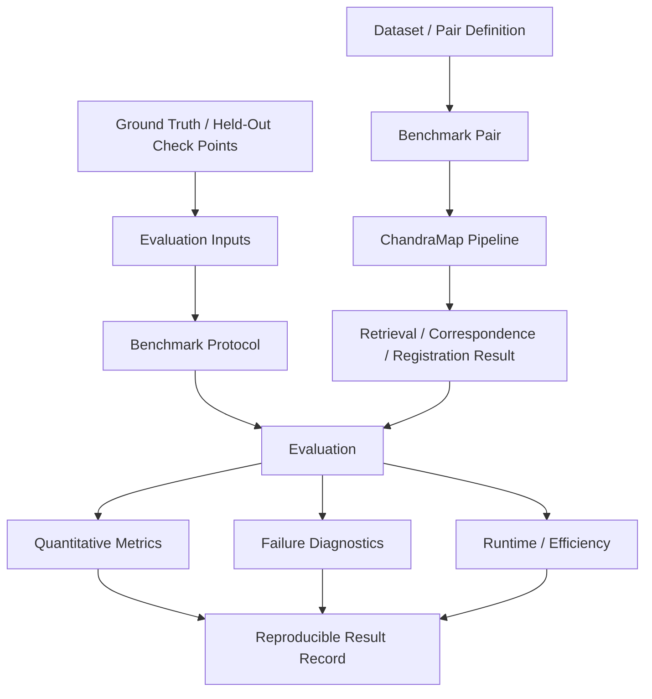
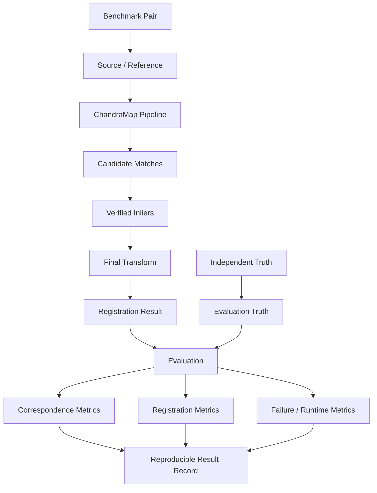
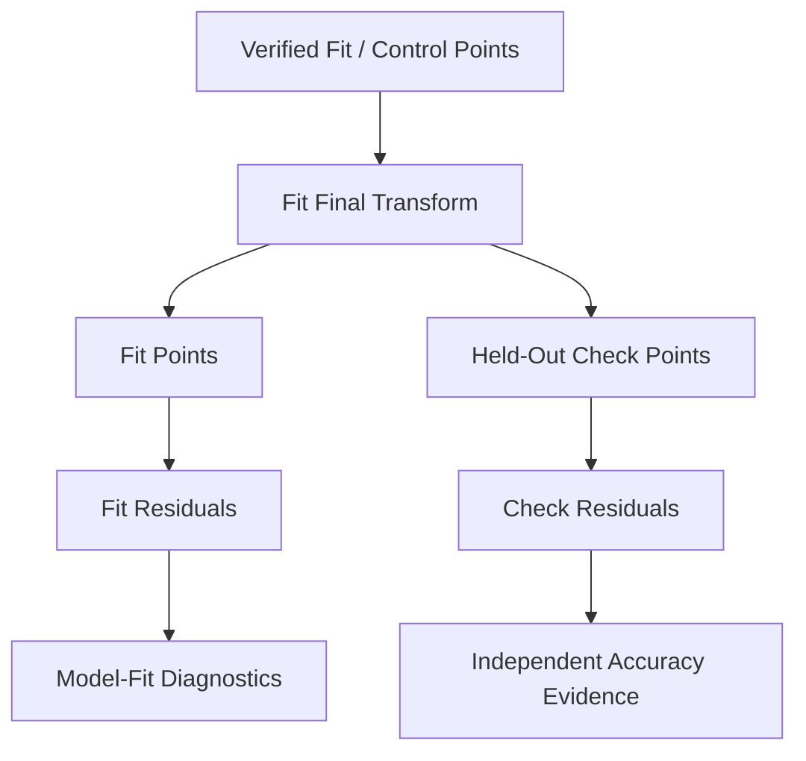

# Evaluation

ChandraMap treats evaluation as a first-class scientific component of the project, not as a final screenshot or leaderboard step.

The purpose of evaluation is to determine whether lunar correspondence, retrieval, and registration results are:

- geometrically meaningful;
- independently supported;
- reproducible;
- comparable across methods;
- interpretable across sensors and scales;
- robust to difficult lunar imaging conditions.

> **ChandraMap evaluates what the algorithm can prove, not what a registered overlay merely appears to show.**

A visually convincing overlay can still contain:

- systematic geometric error;
- poor alignment outside one local region;
- incorrect geolocation;
- an overfit transformation;
- incorrect reference retrieval;
- weak spatial support.

For this reason, ChandraMap emphasizes independent geometric evidence.

> **ChandraMap evaluates registration using independent geometric evidence, not only the correspondences used to estimate the model.**

A second core rule is:

> **The points used to fit a transformation should not also be the only points used to judge its accuracy.**

Conceptually:

```text
Fit / Control Points
→ estimate the transformation

Held-Out Check / Evaluation Points
→ independently evaluate the transformation
```

A third principle governs correspondence metrics:

> **More matches do not automatically mean better registration.**

Candidate count, verified inlier count, and inlier ratio are useful diagnostics, but they must be interpreted together with:

- independent residual error;
- spatial coverage;
- failure behavior;
- runtime;
- sensor and scale context.

Retrieval and registration must also remain separate:

> **Retrieval quality and registration quality are different evaluation problems.**

Retrieval asks:

> Did the system return the correct lunar region or reference tile among the retrieved candidates?

Registration asks:

> Given a candidate reference region, how accurately was the source aligned to it?

Metrics such as `Recall@K` and registration RMSE therefore answer different questions.

A fifth principle concerns units:

> **Report source-image pixel error first; convert to lunar ground distance only when the coordinate system and product metadata support that conversion.**

Finally:

> **Failure is a benchmark result.**

A difficult pair on which a method produces no valid transformation must remain visible in evaluation rather than disappearing from the results.

---

## 1. Evaluation Goals

ChandraMap evaluation should help answer questions such as:

- Did retrieval find a correct lunar region?
- Did the matcher produce usable candidate correspondences?
- How many candidates survived matcher-level filtering?
- How many correspondences survived geometric verification?
- Are verified inliers spatially distributed?
- Does the final transformation generalize to held-out points?
- What is the final registration error?
- Did sub-pixel refinement improve independent accuracy?
- Does performance degrade under scale differences?
- Does performance degrade under illumination differences?
- Does performance degrade under cross-modality conditions?
- Which stages fail on difficult sensor pairs?
- What computational cost was required?
- Are results reproducible under the same benchmark definition?

Evaluation should measure both:

- successful behavior;
- failure behavior.

A method that performs extremely well on a small subset but fails frequently elsewhere may not be stronger overall.

---

## 2. What Evaluation Is Not

ChandraMap evaluation is not defined by:

- screenshot inspection alone;
- mosaic appearance;
- raw candidate-match count;
- RANSAC inlier count alone;
- inlier ratio alone;
- fit residual alone;
- matcher confidence alone;
- one hand-selected successful image pair;
- manually chosen "best-looking" output;
- undocumented accuracy percentages.

These can be useful diagnostics, but they are not sufficient evidence of reliable registration.

---

# Evaluation Terminology

## 3. Benchmark

A **benchmark** is a controlled evaluation protocol used to measure or compare methods on defined data.

A benchmark should specify enough information to make the evaluation reproducible.

---

## 4. Benchmark Pair

A **benchmark pair** is a frozen source/reference scientific case used for evaluation.

Its identity should remain stable within a benchmark version.

---

## 5. Benchmark Suite

A **benchmark suite** is a collection of benchmark pairs evaluated under a shared protocol.

A suite may later contain categories such as:

- scale stress;
- illumination stress;
- modality stress;
- geometry stress;
- low-feature terrain;
- repetitive terrain.

Categories should only be assigned when they are supported by metadata or documented benchmark curation.

---

## 6. Ground Truth

**Ground truth** is independent reference information used to evaluate algorithm output.

Possible sources include:

- trusted geospatial reference information;
- independently verified manual correspondences;
- held-out check points;
- synthetic transformations with known geometry;
- official/challenge truth where scientifically appropriate.

Algorithm-generated correspondences are not automatically ground truth.

---

## 7. Fit / Control Point

A **fit point** or **control point** is a correspondence used to estimate a transformation.

It contributes directly to model fitting.

---

## 8. Check / Evaluation Point

A **check point** or **evaluation point** is a held-out correspondence used to evaluate a fitted transformation.

It should not participate in the transformation fit for the run in which it is used as independent evaluation evidence.

---

## 9. Candidate Match

A **candidate match** is a matcher-proposed source/reference correspondence before geometric verification.

---

## 10. Verified Inlier

A **verified inlier** is a candidate correspondence accepted as geometrically consistent under the selected verification model.

Verified inliers are algorithm outputs.

They are not automatically independent truth.

---

## 11. Fit Residual

A **fit residual** is measured on a point used to estimate the transformation.

It describes how well the model explains its fitting data.

---

## 12. Check-Point Residual

A **check-point residual** is measured on a held-out evaluation point.

This provides stronger evidence of model generalization.

---

## 13. RMSE

**Root Mean Square Error (RMSE)** summarizes a clearly defined residual quantity.

For scalar errors \(e_i\):

$$
\mathrm{RMSE}
=
\sqrt{
\frac{1}{N}
\sum_{i=1}^{N} e_i^2
}
$$

A reported RMSE is incomplete unless its:

- coordinate space;
- units;
- residual definition;
- point role;

are known.

---

## 14. Spatial Coverage

**Spatial coverage** describes how broadly verified or evaluation points span the usable overlap.

Coverage is distinct from point count.

---

## 15. Success Rate

**Success rate** is the fraction of benchmark cases satisfying the success definition established by a benchmark protocol.

This README does not define one universal ChandraMap success threshold.

---

## 16. Failure Rate

**Failure rate** is the fraction of benchmark cases that fail according to the protocol's defined conditions.

The benchmark must define what counts as failure.

---

## 17. Recall@K

**Recall@K** is a retrieval metric describing whether at least one acceptable correct reference candidate appears among the first \(K\) retrieval results.

The value of \(K\) must be defined by the benchmark.

---

## 18. Runtime

**Runtime** is measured execution time for a clearly defined pipeline stage or complete workflow.

Runtime should not be reported without enough context to understand what was timed.

---

## 19. Ablation

An **ablation** is a controlled experiment that changes one targeted component while holding relevant alternatives constant.

Its purpose is to isolate the effect of that component.

---

# Evaluation Architecture

## 20. Position in the ChandraMap Workflow



Evaluation is downstream of algorithm output but depends on benchmark and truth definitions prepared independently of the evaluated method.

---

## 21. Evaluation Layers

ChandraMap separates evaluation into several layers.

### Retrieval Evaluation

Measures whether the correct reference region appears among retrieved candidates.

### Correspondence Diagnostics

Measures properties of:

- candidate matches;
- filtered candidates;
- verified inliers;
- spatial support.

### Registration Evaluation

Measures the accuracy of the final geometric alignment.

### Robustness Evaluation

Measures behavior under difficult:

- scale;
- illumination;
- modality;
- geometry;
- terrain;

conditions.

### Efficiency Evaluation

Measures computational cost where meaningful.

### Failure Analysis

Records:

- unsuccessful runs;
- failure stage;
- observed reason;
- diagnostic context.

These layers answer different questions and should not be collapsed into one score.

---

# Ground Truth

## 22. Ground Truth Is Independent Evidence

Ground truth should remain conceptually separate from algorithm output.

Relevant documentation:

[`../datasets/ground-truth-preparation.md`](../datasets/ground-truth-preparation.md)

Ground truth may include:

- independently prepared control/check correspondences;
- trusted geospatial reference information;
- synthetic known-transform cases;
- other benchmark-approved truth sources.

---

## 23. RANSAC Inliers Are Not Ground Truth

RANSAC evaluates matcher-generated candidates against an estimated geometric model.

Therefore:

```text
RANSAC inlier
=
geometrically consistent algorithmic correspondence
```

not:

```text
RANSAC inlier
=
independent ground truth
```

A false correspondence can occasionally be geometrically consistent with other false correspondences, especially in repetitive terrain.

---

## 24. Fit vs Check Points

| Point Type              |       Used to Fit Transform? | Used for Independent Evaluation? |
| ----------------------- | ---------------------------: | -------------------------------: |
| Fit / control point     |                          Yes |         Not as independent truth |
| Held-out check point    |                           No |                              Yes |
| RANSAC inlier           | Usually eligible for fitting |                Not automatically |
| Ground-truth annotation |     Depends on assigned role |    Depends on benchmark protocol |

The point's **role** matters as much as its origin.

---

## 25. Check Points Must Stay Held Out

A point used to estimate or refine the final transform cannot simultaneously be described as independent evidence for that same model.

Correct:

```text
fit points
→ final transform

separate check points
→ evaluate final transform
```

Incorrect:

```text
same points
→ fit model
→ compute error
→ call that independent accuracy
```

---

## 26. Truth Versioning

Evaluation results should record where applicable:

- truth version;
- pair version;
- benchmark version.

If truth is corrected or re-annotated, the change should not silently alter the interpretation of previously published results.

---

# Correspondence Metrics

## 27. Candidate Match Count

The candidate count measures how many matcher-proposed correspondences were generated.

It can help diagnose:

- feature density;
- matcher behavior;
- computational load.

It is not a registration-accuracy metric.

---

## 28. Filtered Candidate Count

The filtered candidate count records how many candidates remain after matcher-level filtering.

This can help evaluate:

- ratio filtering;
- confidence filtering;
- duplicate handling;
- other pre-geometric filtering.

---

## 29. Verified Inlier Count

The verified inlier count records how many filtered candidates were accepted by geometric verification.

A larger number may provide more support, but count alone is insufficient.

---

## 30. Inlier Ratio

A recommended conceptual definition is:

$$
\text{Inlier Ratio}
=
\frac{
N_{\text{verified inliers}}
}{
N_{\text{filtered candidates}}
}
$$

when the filtered candidate set is the input to RANSAC.

If another denominator is used, it must be stated explicitly.

Do not silently compare:

```text
inliers / raw candidates
```

against:

```text
inliers / filtered candidates
```

as though they were the same metric.

---

# Spatial Coverage

## 31. Why Coverage Matters

Consider two results:

```text
50 verified matches
→ concentrated around one crater
```

and:

```text
30 verified matches
→ distributed across the overlap
```

The first result has more points, but the second may provide stronger global geometric support.

Therefore:

> **Match count and spatial support must be evaluated separately.**

---

## 32. Grid Coverage

A candidate coverage metric may divide the usable overlap into coarse regions and determine how many contain verified correspondences.

The grid definition should be documented.

This README does not prescribe a universal grid size.

---

## 33. Convex-Hull Coverage

Another possible metric compares the area spanned by verified points with the valid overlap area.

This can indicate how much of the usable registration region is geometrically supported.

---

## 34. Coverage Is Not Correctness

Broadly distributed matches can still be wrong.

Coverage should therefore complement:

- geometric verification;
- independent residual error.

---

# Residual Metrics

## 35. Fit Residual

A fit residual evaluates correspondence points that participated in transformation fitting.

Fit residual is useful for:

- model diagnostics;
- detecting poor fitting behavior;
- comparing residual structure.

It should not be presented as fully independent registration accuracy.

See [`../algorithms/residual-analysis.md`](../algorithms/residual-analysis.md).

---

## 36. Check-Point Residual

A check-point residual measures error on held-out points.

Where reliable independent truth exists, this is preferred evidence of final registration accuracy.

---

## 37. RMSE

For two-dimensional residual magnitudes:

$$
e_i
=
\sqrt{
(\Delta x_i)^2
+
(\Delta y_i)^2
}
$$

one possible RMSE definition is:

$$
\mathrm{RMSE}
=
\sqrt{
\frac{1}{N}
\sum_{i=1}^{N}
e_i^2
}
$$

A benchmark must define precisely what quantity is being summarized.

---

## 38. RMSE Must Include Context

A complete RMSE report should identify:

- point role — fit or check;
- coordinate space;
- pixel grid;
- pyramid level where applicable;
- units;
- residual convention.

Avoid ambiguous output such as:

```text
RMSE = X pixels
```

without coordinate context.

---

## 39. Median Error

Median residual can complement RMSE by providing a statistic less dominated by extreme values.

It should not be used to hide severe failures.

---

## 40. Error Percentiles

Optional percentile statistics may help characterize the error distribution.

No fixed percentile reporting scheme is required unless the benchmark protocol defines one.

---

## 41. Maximum Error

Maximum residual may expose severe local failures.

It is a useful diagnostic but should not be used as the only accuracy measure.

---

## 42. Residual Components

Where useful, preserve:

- \(x\)-component;
- \(y\)-component;
- residual magnitude.

Directional residuals can expose systematic geometric problems hidden by scalar RMSE.

---

# Source-Space Error

## 43. Source Pixels First

> **Report source-image pixel error first where it can be computed correctly.**

The source sensor is the instrument that captured the information being registered.

Therefore source-space error provides useful interpretation relative to that sensor's sampling.

---

## 44. Sensor Pixels Are Not Physically Equivalent

Conceptually:

```text
1 OHRC pixel
≠
1 TMC-2 pixel
≠
1 IIRS pixel
```

in lunar ground distance.

Raw pixel RMSE values across different sensors therefore require sensor context.

---

## 45. Reference-Space Error

Reference-space error may also be reported.

Always identify:

- reference product;
- reference coordinate system;
- pyramid level;
- units.

A NAC level-0 pixel and a coarse NAC-pyramid pixel do not have equivalent physical meaning.

---

# Physical and Ground Error

## 46. When Ground Error Is Valid

Conversion to metres or another lunar ground-distance unit is appropriate only when:

- the residual coordinate space is known;
- relevant product metadata are valid;
- map geometry or GSD interpretation is valid;
- truth supports physical-distance interpretation.

---

## 47. Do Not Multiply Blindly by Approximate GSD

Avoid:

```text
reference-space RMSE
×
generic source GSD
```

unless those quantities genuinely refer to compatible coordinate spaces.

Likewise, avoid using project-level approximate sensor resolution as though it were exact product metadata.

---

## 48. Geospatial Error

Where trusted map coordinates exist, physical error can be evaluated from those coordinates.

Such reporting should identify:

- coordinate system;
- lunar reference/datum convention where relevant;
- units;
- source of geospatial truth.

Do not fabricate geospatial precision.

---

# Retrieval Evaluation

## 49. Retrieval Is a Separate Task

For an unknown-location workflow:

```text
source query
→ global descriptor
→ reference search
→ Top-K reference candidates
```

retrieval evaluation determines whether an acceptable reference region appears among the returned candidates.

---

## 50. Recall@1

`Recall@1` asks:

> Did a correct reference candidate appear first?

---

## 51. Recall@K

`Recall@K` asks:

> Did at least one acceptable correct reference candidate appear among the first \(K\) results?

The benchmark must define \(K\).

---

## 52. Multiple Correct Reference Tiles

Reference tiles may overlap.

Therefore a source region can legitimately correspond to multiple acceptable tiles.

Retrieval truth should support:

- acceptable tile sets;
- overlap-aware correctness;

rather than assuming exactly one tile is always correct.

Relevant documentation:

[`../datasets/pair-definition.md`](../datasets/pair-definition.md)

---

## 53. Retrieval Ranking Is Not Registration Accuracy

A tile ranked first globally can still fail:

- local matching;
- RANSAC;
- final registration.

A lower-ranked tile may support better local geometry.

Therefore retain separate:

- retrieval similarity/rank;
- geometric registration evidence.

---

## 54. FAISS Role

If FAISS is used, its role is vector similarity search.

FAISS does not:

- generate local feature correspondences;
- classify RANSAC inliers;
- estimate transformations;
- compute registration RMSE;
- validate lunar geolocation.

---

# Registration Success

## 55. Success Should Not Depend on One Number Alone

A valid registration result may need several forms of evidence:

- transformation estimated successfully;
- sufficient verified geometric support;
- useful spatial coverage;
- valid coordinate provenance;
- independent error where truth exists.

---

## 56. Success Criteria Belong to the Benchmark Protocol

A benchmark may eventually define thresholds such as:

- minimum support;
- maximum error;
- minimum coverage.

Those values should be:

- explicit;
- versioned;
- task-aware;
- sensor-aware.

This README does not invent them.

---

# Failure Evaluation

## 57. Failure Is Part of the Benchmark

Possible failure stages include:

- input validation;
- preprocessing;
- scale selection;
- retrieval;
- matching;
- match filtering;
- RANSAC;
- sub-pixel refinement;
- transform fitting;
- registration warping;
- evaluation.

A method's inability to produce a valid result is scientifically meaningful.

---

## 58. Failure Rate

Conceptually:

$$
\text{Failure Rate}
=
\frac{
N_{\text{failed benchmark cases}}
}{
N_{\text{evaluated benchmark cases}}
}
$$

The definition of **failed** must come from the benchmark protocol.

---

## 59. Failure Categories

Conceptual failure categories may include:

- no candidate matches;
- insufficient filtered candidates;
- geometric verification failure;
- unstable transform;
- incorrect reference candidate;
- invalid registered output;
- evaluation truth unavailable.

Exact implementation status values should come from repository contracts, not this README.

---

## 60. Do Not Remove Failed Pairs

Failed cases should remain visible in:

- per-pair reports;
- benchmark denominators;
- failure analysis.

A pair should be removed only when the benchmark protocol determines that the pair itself is invalid.

---

# Robustness Evaluation

## 61. Scale Stress

Scale robustness should be evaluated using physical image scale such as:

- product GSD;
- effective pyramid GSD.

Do not define scale difficulty only by image dimensions.

---

## 62. Illumination Stress

Illumination evaluation should consider meaningful differences in:

- Sun geometry;
- shadow geometry;
- visibility of terrain structure;

where suitable metadata or curated categories exist.

Brightness difference alone is not a sufficient illumination-difficulty definition.

See [`../algorithms/illumination-handling.md`](../algorithms/illumination-handling.md).

---

## 63. Modality Stress

Cross-modality evaluation should be reported separately where appropriate.

Important examples include:

```text
IIRS-derived representation
↔
NAC
```

and:

```text
IIRS-derived representation
↔
WAC
```

These should not be treated as ordinary panchromatic matching.

---

## 64. Geometry Stress

Potential geometry stress cases include:

- terrain relief;
- viewing-angle difference;
- projection difference;
- larger geographic extent.

Not every geometry-related failure should be attributed to the matcher.

---

## 65. Low-Feature Terrain

Smooth or low-texture lunar regions can stress:

- detector repeatability;
- descriptor uniqueness;
- geometric model support.

These should be included when scientifically appropriate.

---

## 66. Repetitive Terrain

Dense crater fields or repetitive structures can produce:

- descriptor ambiguity;
- false candidate correspondences;
- false geometric consensus.

These are important robustness cases.

---

## 67. Difficult Cases Should Remain Deliberate

A meaningful benchmark should not contain only easy pairs that already produce attractive results.

Failure-producing or challenging cases are useful when their scientific context is valid.

---

# Sensor-Specific Evaluation

## 68. OHRC

OHRC is the Chandrayaan-2 **Orbiter High Resolution Camera**.

Current project documentation commonly uses approximately:

> **~0.25–0.32 m/pixel**

depending on product/documentation.

Actual product metadata remains authoritative.

Evaluation considerations include:

- fine source-pixel error;
- high-detail correspondence;
- illumination sensitivity;
- terrain-relief visibility;
- spatial support.

Small OHRC-pixel error may correspond to relatively small ground displacement, but ground conversion still requires valid product metadata.

---

## 69. TMC-2

TMC-2 is the Chandrayaan-2 **Terrain Mapping Camera-2**.

Current project planning commonly uses approximately:

> **~5 m/pixel**

with actual product metadata remaining authoritative.

Evaluation should emphasize:

- physically appropriate reference scale;
- medium-scale terrain structure;
- coverage;
- TMC-2-space residual interpretation.

One TMC-2 pixel is not physically equivalent to one OHRC pixel.

---

## 70. IIRS

IIRS is the Chandrayaan-2 **Imaging Infrared Spectrometer**.

Current project-level approximations include:

- approximately ~80 m/pixel;
- approximately ~0.8–5.0 µm;
- roughly ~250–256 bands depending on product/documentation.

Actual product metadata remains authoritative.

Evaluation should record:

- parent IIRS product;
- 2D registration representation;
- representation method;
- selected bands/components where relevant;
- source representation scale;
- reference representation/scale;
- matcher.

Fine NAC-grid residuals must not be interpreted as fine physical IIRS resolution.

---

## 71. LRO NAC

LRO NAC is a fine/local reference family.

Current ChandraMap planning often treats NAC as approximately:

> **~0.5–2 m/pixel**

depending on product/acquisition geometry.

Evaluation should preserve:

- NAC product identity;
- pyramid level;
- effective scale where available.

---

## 72. LRO WAC

LRO WAC provides broader/coarser lunar context.

Its spatial scale depends on:

- product;
- mode;
- processing.

Do not use one universal WAC GSD.

Evaluation should distinguish:

- WAC retrieval/localization behavior;
- WAC local-registration behavior;
- WAC-to-NAC handoff behavior.

---

# Sub-Pixel Refinement Evaluation

## 73. Ask the Correct Question

The key question is not:

> Did the fit residual decrease?

It is:

> **Did the final refined/refit model improve independent held-out error?**

---

## 74. Before / After Evaluation

A controlled refinement experiment should compare:

### Before Refinement

- fit residual;
- independent check-point RMSE.

### After Refinement and Refit

- fit residual;
- independent check-point RMSE.

Use the same:

- pair;
- model family;
- check-point set;
- metric definition.

See [`../algorithms/subpixel-refinement.md`](../algorithms/subpixel-refinement.md).

---

# Transform Model Evaluation

## 75. Affine vs Homography

A controlled model comparison should use, where technically valid:

- same source/reference pair;
- same prepared representations;
- same correspondence set;
- same truth/check points.

Compare:

- independent error;
- residual structure;
- spatial coverage;
- stability;
- failure rate.

---

## 76. More Flexible Is Not Automatically Better

A homography may reduce fit residual because it has greater flexibility.

That does not prove better generalization.

See [`../algorithms/transforms.md`](../algorithms/transforms.md).

---

# Scale-Pyramid Evaluation

## 77. Compare Scale Strategies Fairly

Possible scale strategies may include:

- native/full-resolution reference;
- GSD-aware selected level;
- neighboring-level search;
- coarse-to-fine registration.

When testing scale handling, keep other important variables controlled where practical.

---

## 78. Pixel Metrics Across Levels

Do not directly compare:

```text
1 pixel error at NAC level 0
```

with:

```text
1 pixel error at NAC level 3
```

without accounting for their different effective scales.

See [`../algorithms/scale-pyramid.md`](../algorithms/scale-pyramid.md).

---

# Matcher Evaluation

## 79. Classical Baseline

SIFT provides an interpretable classical baseline.

Conceptually:

```text
SIFT
→ descriptor matching
→ match filtering
→ RANSAC
→ transform
→ evaluation
```

See [`../algorithms/sift.md`](../algorithms/sift.md).

---

## 80. ALIKED + LightGlue

Correct terminology:

```text
ALIKED
→ sparse feature detection / description

LightGlue
→ feature matching
```

Evaluation should measure final geometric performance rather than matcher score alone.

---

## 81. LoFTR

LoFTR is detector-free local correspondence estimation.

Its output still requires:

- geometric verification;
- registration evaluation.

---

## 82. RIFT / CFOG-Style Methods

Remote-sensing-oriented approaches may be useful research candidates for multimodal matching.

This README does not rank them.

Their suitability must be established empirically.

---

## 83. Fair Matcher Comparison

When comparing matchers, keep constant where technically appropriate:

- benchmark pair;
- preprocessing;
- physical scale;
- geometric model;
- robust-estimation configuration;
- check points.

Change:

> matcher.

---

# Preprocessing Evaluation

## 84. Controlled Preprocessing Ablation

Conceptually:

```text
same pair
same scale
same matcher
same geometry
same truth
```

compare different preprocessing representations.

Examples may include:

- minimally prepared intensity;
- normalized intensity;
- structural representation.

---

## 85. Visual Improvement Is Not Enough

An image that looks clearer to a human does not automatically produce better registration.

Evaluate downstream geometry.

See [`../algorithms/preprocessing.md`](../algorithms/preprocessing.md).

---

# Illumination Ablations

## 86. Controlled Illumination Experiments

Candidate comparisons may include:

- baseline prepared intensity;
- global normalization;
- local contrast processing;
- gradient/structural representation.

Hold other major variables constant.

Do not claim illumination invariance from one successful example.

---

# Match-Filtering Evaluation

## 87. Filter Ablations

Possible controlled variants include:

- nearest-neighbor associations;
- ratio filtering;
- mutual consistency;
- duplicate handling.

Evaluate downstream effects on:

- filtered candidate count;
- inliers;
- spatial coverage;
- independent RMSE;
- failure rate.

See [`../algorithms/match-filtering.md`](../algorithms/match-filtering.md).

---

# RANSAC Evaluation

## 88. Robust-Estimation Experiments

Possible studies include:

- configured residual-threshold comparisons;
- affine vs homography;
- future robust-estimator variants.

Use the same candidate set and truth where possible.

See [`../algorithms/ransac.md`](../algorithms/ransac.md).

---

# Runtime and Efficiency

## 89. Runtime Matters

Accuracy remains central, but computational cost is also relevant for a reproducible engineering benchmark.

---

## 90. Stage-Level Runtime

Where supported, runtime may be separated into:

- preprocessing;
- feature extraction;
- matching;
- match filtering;
- RANSAC;
- refinement;
- transform fitting;
- registration warping;
- retrieval;
- complete pipeline.

Do not require stage timings that the implementation cannot measure reliably.

---

## 91. Hardware Context

Runtime comparisons should record relevant execution context where it materially affects results, such as:

- CPU;
- GPU;
- memory;
- operating environment;
- software/library versions.

Do not fabricate hardware information.

---

## 92. Cold vs Cached Runs

If caching or prebuilt retrieval indexes significantly affect timing, distinguish:

- cold runs;
- warm/cached runs.

Do not mix them silently in one runtime comparison.

---

# Resource Usage

## 93. Optional Resource Metrics

Later benchmarks may report:

- peak system memory;
- peak GPU memory;
- retrieval-index size;
- generated-artifact size.

These remain secondary unless benchmark scope makes them required.

---

# Controlled Ablations

## 94. One Intended Variable at a Time

A strong component ablation changes one targeted factor.

Examples:

```text
matcher only
```

or:

```text
reference-scale policy only
```

or:

```text
sub-pixel refinement only
```

---

## 95. Confounded Comparison

Consider:

```text
Pipeline A
SIFT
+ baseline preprocessing
+ one scale
+ affine
+ no refinement
```

versus:

```text
Pipeline B
LightGlue
+ different preprocessing
+ different scale
+ homography
+ refinement
```

This can be a valid **system comparison**.

It is not a clean experiment proving that one matcher caused the difference.

---

## 96. System Benchmark vs Component Ablation

### System Benchmark

Compares complete pipeline configurations.

### Component Ablation

Changes one targeted component to isolate its effect.

Both are useful.

They answer different research questions.

---

# Dataset Splits and Leakage

## 97. Evaluation Leakage

Potential leakage includes:

- tuning thresholds on final test pairs;
- using test check points during fitting;
- using final benchmark results to repeatedly adjust preprocessing;
- placing nearly identical overlapping imagery in supposedly independent splits.

---

## 98. Geographic Leakage

Lunar image tiles can overlap heavily.

Random tile-level splitting may place nearly identical terrain in:

- training;
- validation;
- testing.

Where independence matters, grouped or geographic splitting may be more appropriate.

---

## 99. Parent-Product Leakage

Different crops from the same parent product may contain strongly related terrain.

A benchmark should consider whether such samples are genuinely independent for its intended claim.

---

## 100. Representation Leakage

Several IIRS representations derived from the same parent product remain related observations.

They should not automatically be treated as independent examples.

---

## 101. Synthetic Leakage

Synthetic variants derived from one source should not be split across training and evaluation in a way that makes the final benchmark artificially easy.

---

# Benchmark Versioning

## 102. Freeze Released Benchmarks

Once a benchmark version is established, its:

- pair identities;
- truth;
- splits;
- metric definitions;
- success/failure protocol;

should not silently change.

---

## 103. New Benchmark Versions

Changes such as:

- corrected truth;
- added pairs;
- changed splits;
- changed success definitions;
- changed metric semantics;

should create a new benchmark version or equivalent traceable revision.

---

# Metric Versioning

## 104. Metric Definitions Are Part of Reproducibility

A metric called `RMSE` is not fully reproducible without knowing:

- fit or check role;
- coordinate space;
- residual definition;
- units;
- pyramid level;
- transform/evaluation direction where relevant.

---

## 105. Metric Schema Evolution

If a metric definition changes, document the new definition/version.

Do not silently compare incompatible old and new values as though their semantics were identical.

---

# Result Provenance

## 106. Minimum Result Identity

A benchmark result should be traceable to:

- benchmark version;
- pair version;
- dataset/preparation version;
- truth version;
- source representation;
- reference representation;
- algorithm version;
- configuration;
- code revision where available;
- learned-model/checkpoint version where applicable.

---

## 107. Avoid Hand-Edited Results

Benchmark summaries should ideally be generated from machine-readable run outputs.

Manual edits to:

- JSON;
- CSV;
- metrics summaries;

should not become an undocumented part of the scientific process.

---

# Conceptual Evaluation Result

## 108. Result Fields

A conceptual evaluation result may contain:

- run ID;
- benchmark version;
- pair ID;
- method/configuration identity;
- status;
- candidate count;
- filtered candidate count;
- verified inlier count;
- inlier ratio;
- coverage;
- fit residual;
- check-point RMSE;
- runtime;
- failure reason.

The exact implemented schema belongs to repository contracts.

---

## 109. Illustrative Evaluation Record

The following is an **illustrative conceptual structure — not an implemented schema**:

```yaml
run_id: "PLACEHOLDER_RUN_ID"
benchmark_version: "PLACEHOLDER_BENCHMARK"
pair_id: "PLACEHOLDER_PAIR"

method:
  matcher: "PLACEHOLDER_MATCHER"
  transform: "PLACEHOLDER_TRANSFORM"

metrics:
  candidate_count: "PLACEHOLDER_COUNT"
  verified_inliers: "PLACEHOLDER_COUNT"
  inlier_ratio: "PLACEHOLDER_VALUE"
  coverage: "PLACEHOLDER_VALUE"

evaluation:
  coordinate_space: "PLACEHOLDER_SOURCE_SPACE"
  units: "pixels"
  check_rmse: "PLACEHOLDER_VALUE"

runtime:
  total: "PLACEHOLDER_VALUE"

status: "PLACEHOLDER_STATUS"
```

No real benchmark values, thresholds, or exact repository field names are implied.

---

# Benchmark Table Templates

## 110. Registration Benchmark Table

| Pair      | Sensor Pair          | Method   | Candidates | Inliers | Inlier Ratio | Coverage | Check RMSE | Units | Runtime | Status |
| --------- | -------------------- | -------- | ---------: | ------: | -----------: | -------: | ---------: | ----- | ------: | ------ |
| `PAIR_ID` | `SOURCE → REFERENCE` | `METHOD` |          — |       — |            — |        — |          — | —     |       — | —      |

Only measured results should populate this table.

---

## 111. Retrieval Benchmark Table

| Query      | Reference Database | Recall@1 | Recall@5 | Recall@K | Local Verification | Status |
| ---------- | ------------------ | -------: | -------: | -------: | ------------------ | ------ |
| `QUERY_ID` | `REFERENCE_SET`    |        — |        — |        — | —                  | —      |

`K` must be defined by the benchmark protocol.

Do not populate the table with invented values.

---

# Aggregate Reporting

## 112. Preserve Per-Pair Results

Per-pair results should remain available even when aggregate statistics are reported.

Aggregates can hide:

- catastrophic failures;
- sensor-specific weaknesses;
- difficult terrain;
- retrieval errors.

---

## 113. Aggregate Metrics

Where scientifically useful, aggregate reporting may include:

- mean;
- median;
- success rate;
- failure rate;
- error distribution.

Per-case visibility should remain available.

---

## 114. Sensor-Stratified Reporting

Consider reporting separately for:

- OHRC;
- TMC-2;
- IIRS;

or for explicit sensor pairs such as:

- OHRC → NAC;
- TMC-2 → NAC;
- IIRS → NAC;
- IIRS → WAC.

Do not combine fundamentally different physical tasks into one unexplained average.

---

## 115. Stress-Category Reporting

Where valid benchmark categories exist, results may be stratified by:

- scale stress;
- illumination stress;
- modality stress;
- geometry stress;
- low-feature terrain;
- repetitive terrain.

Category assignment should be documented.

---

# Statistical Caution

## 116. Small Benchmark Suites

Do not make broad generalization claims from a very small benchmark.

Always preserve basic context such as:

- number of evaluated pairs;
- number of successful cases;
- number of failed cases.

---

## 117. Stochastic Variability

For stochastic methods or RANSAC-sensitive cases, repeated runs may be useful.

Possible summaries may include:

- mean;
- spread;
- confidence interval;

when enough data support them.

---

## 118. Do Not Invent Statistical Significance

A small number of pairs or runs may not support meaningful confidence intervals or statistical conclusions.

Report limitations rather than adding formal-looking but weak statistics.

---

# Evaluation Visualizations

## 119. Useful Diagnostic Artifacts

Evaluation may use:

- candidate-match visualizations;
- filtered-match visualizations;
- inlier/outlier plots;
- registered overlays;
- checkerboards;
- residual-vector plots;
- residual histograms;
- coverage plots;
- retrieval examples.

---

## 120. Visualizations Are Supporting Evidence

Visualizations are useful for:

- debugging;
- explanation;
- qualitative inspection.

They do not replace:

- held-out residual metrics;
- coverage;
- failure reporting;
- retrieval metrics.

---

# Failure Analysis

## 121. Record the Observed Failure Stage

A failed run should ideally identify where failure became observable:

```text
Input
→ Preprocessing
→ Retrieval
→ Matching
→ Filtering
→ RANSAC
→ Refinement
→ Transform
→ Registration Warp
→ Evaluation
```

---

## 122. Failure Stage Is Not Always Root Cause

For example:

> `RANSAC produced insufficient verified inliers`

is an observed failure.

> `The Sun-angle difference caused the failure`

is a causal hypothesis unless supported by controlled evidence.

Keep observed behavior separate from inferred cause.

---

# Evaluation Outputs

## 123. Typical Artifacts

Evaluation may conceptually generate:

- machine-readable metrics;
- per-pair result records;
- benchmark summary tables;
- residual reports;
- failure reports;
- visualization artifacts;
- environment/configuration snapshots;
- run manifests.

Exact filenames and storage schemas belong to repository architecture.

---

# Evaluation Documentation Area

## 124. Purpose of `docs/evaluation/`

This directory should explain:

- benchmark concepts;
- evaluation methodology;
- metric definitions;
- ground-truth interpretation;
- controlled benchmark procedures;
- reproducibility requirements.

This README acts as the entry point.

---

## 125. Evaluation Topics

The evaluation documentation area should cover topics such as:

- benchmark protocol;
- benchmark categories;
- metrics;
- ground-truth interpretation;
- control/check-point roles;
- registration evaluation;
- retrieval evaluation;
- robustness testing;
- failure analysis;
- reproducibility.

Where dedicated files are not yet established, these should be treated as planned or recommended documentation topics rather than assumed existing files.

---

# Repository-Level Benchmark Assets

## 126. Root `benchmarks/`

If the repository uses a root-level `benchmarks/` directory, it should contain executable or frozen benchmark definitions according to repository architecture.

The evaluation documentation explains how those benchmark definitions should be interpreted.

Mission imagery should not be duplicated unnecessarily merely to create benchmark folders.

---

## 127. Root `experiments/`

If the repository uses `experiments/`, experiments may describe:

- configurations;
- controlled ablations;
- research runs.

Experiments should consume benchmark truth rather than silently redefine it.

---

## 128. Root `results/`

If the repository uses `results/`, generated evaluation outputs belong downstream of:

- datasets;
- benchmark definitions;
- algorithms.

Algorithm results must not silently become new ground truth.

---

# Versioned Evaluation Strategy

## 129. V1 — Small but Rigorous

V1 should establish a trustworthy baseline.

A conceptual minimum includes:

- known-overlap benchmark pairs;
- suitable OHRC and/or TMC-2 cases where available;
- appropriate LRO reference imagery;
- SIFT baseline;
- match filtering;
- RANSAC;
- configured affine/homography model according to authoritative V1 scope;
- candidate count;
- filtered candidate count;
- verified inlier count;
- inlier ratio;
- spatial coverage;
- independent check-point RMSE where available;
- source-image pixel error;
- runtime;
- explicit failure records.

The objective is not benchmark size.

The objective is trustworthy, reproducible baseline evidence.

---

## 130. V2 — Stronger Stress Evaluation

Possible V2 additions include:

- stronger scale-stress coverage;
- illumination stress;
- IIRS-derived representations;
- preprocessing ablations;
- refinement before/after analysis;
- richer residual diagnostics;
- larger benchmark suite.

---

## 131. V3 — Retrieval and Learned Matching Evaluation

Possible V3 additions include:

- global reference retrieval;
- Recall@K;
- WAC/NAC coarse-to-fine workflows;
- ALIKED + LightGlue;
- LoFTR;
- multi-scale search;
- Top-K local verification;
- combined retrieval-and-registration reporting.

Retrieval and registration metrics should still remain distinct.

---

## 132. V4 — Research-Grade Evaluation

Possible V4 research directions include:

- RIFT/CFOG-style methods;
- lunar-specific learned representations;
- DEM-aware geometry;
- larger multi-mission datasets;
- uncertainty-aware metrics;
- terrain-conditioned analysis;
- statistically meaningful larger benchmark suites;
- cross-mission generalization tests.

These are future/research directions unless authoritative project documentation states otherwise.

---

# Main Evaluation Flow

## 133. Benchmark-to-Result Flow



---

# Retrieval vs Registration Evaluation

## 134. Separate Metric Paths

```mermaid
flowchart TD
    A[Unknown Source] --> B[Global Retrieval]
    B --> C[Top-K Reference Candidates]

    C --> D[Retrieval Evaluation]
    D --> E[Recall@K]

    C --> F[Local Matching]
    F --> G[Geometric Verification]
    G --> H[Final Registration]

    H --> I[Registration Evaluation]
    I --> J[Check RMSE / Coverage / Failure]

    E --> K[Retrieval Result]
    J --> L[Registration Result]
```

`Recall@K` and registration RMSE measure different tasks.

---

# Fit vs Check Evaluation

## 135. Independent Evaluation Flow



---

# V1 Minimum Evaluation Contract

## 136. Minimum Run Output

A practical conceptual V1 result should record:

- pair ID;
- source sensor;
- reference sensor/product;
- source representation;
- reference representation;
- reference pyramid level;
- matcher;
- candidate count;
- filtered candidate count where applicable;
- verified inlier count;
- inlier ratio;
- inlier-ratio denominator;
- spatial coverage;
- transform model;
- fit residual;
- independent check RMSE where available;
- residual coordinate space;
- units;
- runtime;
- status;
- failure reason where applicable;
- configuration/run identity.

No values are prescribed here.

---

# First Scientific Milestone

## 137. One Fully Traceable Pair

A strong first evaluation milestone is:

```text
Known Real Overlapping Pair
        ↓
Matcher
        ↓
Candidate Correspondences
        ↓
RANSAC
        ↓
Verified Inliers
        ↓
Final Transform
        ↓
Registered Overlay
        ↓
Independent Numerical Error
```

The goal is not an impressive screenshot.

The goal is:

> **one fully traceable result whose accuracy, limitations, and provenance can be explained and reproduced.**

---

# Conceptual Evaluation Maturity

## 138. Level 1 — Diagnostic

Conceptual capabilities:

- candidate count;
- inlier count;
- registered overlay;
- visible failure diagnostics.

---

## 139. Level 2 — Quantitative

Adds:

- RMSE;
- spatial coverage;
- explicit failure rate;
- source-space interpretation.

---

## 140. Level 3 — Controlled Benchmark

Adds:

- frozen pairs;
- held-out truth;
- controlled ablations;
- versioned metrics;
- reproducible run records.

---

## 141. Level 4 — Research Benchmark

Adds:

- multi-sensor evaluation;
- retrieval;
- robustness categories;
- statistical reporting;
- multi-mission generalization.

These levels are a conceptual maturity model, not official project release levels.

---

# General Evaluation Checklist

## 142. Benchmark Run Checklist

Before treating a result as benchmark-ready, verify:

- [ ] Pair version is recorded.
- [ ] Benchmark version is recorded.
- [ ] Source identity is recorded.
- [ ] Reference identity is recorded.
- [ ] Source representation is recorded.
- [ ] Reference representation is recorded.
- [ ] Reference scale/pyramid level is recorded.
- [ ] Matcher is recorded.
- [ ] Filtering configuration is recorded.
- [ ] RANSAC/robust-estimation configuration is recorded.
- [ ] Transform model is recorded.
- [ ] Refinement state is recorded.
- [ ] Fit and check-point roles remain separate.
- [ ] Truth version is recorded.
- [ ] Metric definitions are known.
- [ ] Residual coordinate space is known.
- [ ] Residual units are known.
- [ ] Candidate count is recorded.
- [ ] Filtered count is recorded where applicable.
- [ ] Inlier count is recorded.
- [ ] Inlier-ratio denominator is explicit.
- [ ] Spatial coverage is recorded.
- [ ] Independent RMSE is used where truth exists.
- [ ] Failure status is recorded.
- [ ] Failed cases remain visible.
- [ ] Runtime context is recorded where meaningful.
- [ ] Final-test threshold tuning has not contaminated the benchmark.
- [ ] Software/configuration provenance is preserved.

---

# Evaluation Anti-Patterns

## 143. Practices to Avoid

Do not:

- report only the best image pair;
- show only screenshots;
- report only candidate match count;
- call ratio-test matches correct matches;
- call RANSAC inliers ground truth;
- fit and judge a transform only on the exact same points while claiming independent accuracy;
- call fit residual independent RMSE;
- report `pixel error` without naming the coordinate space;
- compare OHRC and IIRS pixel errors as physically equivalent;
- compare raw pixel errors from different pyramid levels without context;
- multiply residuals by generic approximate GSD blindly;
- use `Recall@K` as a registration metric;
- use RMSE as a retrieval metric;
- remove failed pairs from aggregate reporting;
- cherry-pick different test pairs for different algorithms;
- change preprocessing while claiming a matcher-only ablation;
- change transform model while claiming a refinement-only ablation;
- tune thresholds on final test data;
- ignore overlapping-terrain leakage;
- manually alter result files without provenance;
- report undefined "accuracy percentages";
- use a mosaic as proof of registration accuracy;
- assign causes to residual patterns without supporting evidence.

---

# Claims ChandraMap Should Avoid

## 144. Unsupported Evaluation Claims

Do not claim without appropriate evidence:

- "95% registration accuracy."
- "99% matching accuracy."
- "Sub-pixel accuracy" without defining coordinate space and truth.
- "Sub-metre accuracy" from approximate GSD multiplication.
- "LightGlue is better" without controlled benchmark evidence.
- "LoFTR is better" without controlled benchmark evidence.
- "RIFT is best for lunar imagery."
- "Homography is better because fit RMSE is smaller."
- "More matches means more accurate registration."
- "High inlier ratio proves correct geolocation."
- "Retrieval rank 1 proves final registration."
- "Zero visible offset means zero geometric error."
- "One successful pair demonstrates invariance."
- "Synthetic experiments prove real lunar robustness."

---

# Relationship to Algorithm Documentation

## 145. [`../algorithms/overview.md`](../algorithms/overview.md)

Algorithm documentation explains how ChandraMap produces outputs.

Evaluation documentation explains how those outputs are measured and interpreted.

---

## 146. [`../algorithms/sensor-routing.md`](../algorithms/sensor-routing.md)

Evaluation provenance should preserve which sensor route was used because routing can affect:

- representation;
- scale;
- reference family;
- matcher.

---

## 147. [`../algorithms/preprocessing.md`](../algorithms/preprocessing.md)

Preprocessing changes should be evaluated through controlled experiments rather than visual preference alone.

---

## 148. [`../algorithms/illumination-handling.md`](../algorithms/illumination-handling.md)

Illumination robustness should be demonstrated using controlled lunar stress cases rather than assumed from preprocessing design.

---

## 149. [`../algorithms/scale-pyramid.md`](../algorithms/scale-pyramid.md)

Scale selection changes:

- correspondence behavior;
- reference coordinate space;
- interpretation of pixel residuals.

The selected level should therefore be part of result provenance.

---

## 150. [`../algorithms/sift.md`](../algorithms/sift.md)

SIFT provides the primary interpretable classical baseline for early ChandraMap benchmarks.

---

## 151. [`../algorithms/matching.md`](../algorithms/matching.md)

Matching documentation explains how candidate correspondences are generated.

Candidate-match metrics originate from that stage.

---

## 152. [`../algorithms/match-filtering.md`](../algorithms/match-filtering.md)

Evaluation should distinguish:

- raw candidates;
- filtered candidates;
- verified inliers.

---

## 153. [`../algorithms/ransac.md`](../algorithms/ransac.md)

RANSAC identifies geometrically consistent correspondences.

It does not create independent ground truth.

---

## 154. [`../algorithms/transforms.md`](../algorithms/transforms.md)

Transform-model evaluation should use independent points where possible.

Fit residual alone is not sufficient to choose model complexity.

---

## 155. [`../algorithms/subpixel-refinement.md`](../algorithms/subpixel-refinement.md)

Refinement should be evaluated before vs after using the same held-out truth.

---

## 156. [`../algorithms/residual-analysis.md`](../algorithms/residual-analysis.md)

Residual analysis defines:

- fit residuals;
- check residuals;
- vector patterns;
- RMSE interpretation;
- coordinate-space meaning.

This README summarizes those concepts rather than replacing that documentation.

---

## 157. [`../algorithms/registration.md`](../algorithms/registration.md)

Registration documentation defines the meaning and provenance of the final aligned result.

Evaluation determines how trustworthy that result is.

---

# Relationship to Dataset Documentation

## 158. [`../datasets/README.md`](../datasets/README.md)

Dataset documentation defines the data lifecycle.

Evaluation should consume frozen, validated benchmark inputs rather than modifying source data implicitly.

---

## 159. [`../datasets/metadata.md`](../datasets/metadata.md)

Evaluation requires metadata such as:

- sensor;
- product identity;
- GSD;
- projection;
- representation;
- scale.

---

## 160. [`../datasets/data-format.md`](../datasets/data-format.md)

Evaluation artifacts and machine-readable outputs should remain compatible with repository data-format conventions.

---

## 161. [`../datasets/dataset-structure.md`](../datasets/dataset-structure.md)

Generated evaluation results should not be mixed back into:

- raw data;
- prepared data;
- ground truth;

without an explicit documented workflow.

---

## 162. [`../datasets/dataset-preparation.md`](../datasets/dataset-preparation.md)

Evaluation should operate on reproducibly prepared source/reference assets.

---

## 163. [`../datasets/pair-definition.md`](../datasets/pair-definition.md)

Benchmark results should reference stable pair identities rather than duplicate imagery unnecessarily.

---

## 164. [`../datasets/ground-truth-preparation.md`](../datasets/ground-truth-preparation.md)

This is one of the most important relationships.

Ground-truth preparation defines:

- fit/control points;
- check points;
- truth provenance;
- annotation quality.

Evaluation must preserve those roles.

---

# Relationship to Sensor Documentation

## 165. Sensor References

Relevant sensor documentation includes:

- [`../sensors/overview.md`](../sensors/overview.md)
- [`../sensors/ohrc.md`](../sensors/ohrc.md)
- [`../sensors/tmc2.md`](../sensors/tmc2.md)
- [`../sensors/iirs.md`](../sensors/iirs.md)
- [`../sensors/lro-nac.md`](../sensors/lro-nac.md)
- [`../sensors/lro-wac.md`](../sensors/lro-wac.md)

Sensor documentation defines:

> what the imagery physically represents.

Evaluation determines:

> how algorithmic error should be interpreted in that sensor context.

---

# Relationship to Architecture

## 166. Architecture Documentation

Related architecture paths to consult when present include:

- `../architecture/system-overview.md`
- `../architecture/v1-pipeline.md`
- `../architecture/core-engine-architecture.md`
- `../architecture/backend-architecture.md`
- `../architecture/frontend-architecture.md`
- `../architecture/module-map.md`
- `../architecture/data-flow.md`
- `../architecture/output-flow.md`

Architecture documentation defines where:

- evaluation runs;
- metrics are serialized;
- result artifacts flow;
- benchmark outputs are exposed.

This README defines their scientific interpretation.

---

# Relationship to Project Documentation

## 167. Project Scope

Related project paths to consult when present include:

- `../project/goals.md`
- `../project/non-goals.md`
- `../project/v1-scope.md`
- `../project/terminology.md`
- `../project/assumptions.md`
- `../project/limitations.md`

Version and scope documentation remains authoritative.

Do not make V3/V4 evaluation requirements mandatory in V1 unless the authoritative scope explicitly requires them.

---

# Relationship to Data Licensing

## 168. [`../data-licenses.md`](../data-licenses.md)

Evaluation artifacts derived from third-party mission data may remain subject to upstream:

- redistribution terms;
- attribution requirements;
- data-use conditions.

An open-source software license does not automatically grant permission to redistribute all benchmark imagery or derived mission products.

---

# Evaluation Limitations

## 169. Independent Truth May Be Scarce

High-quality held-out lunar correspondence truth can be expensive to prepare.

Some pairs may support only limited independent evaluation.

---

## 170. Manual Truth Has Uncertainty

Human-annotated lunar control/check points may be affected by:

- low source resolution;
- illumination differences;
- modality differences;
- ambiguous terrain.

Ground truth should not be treated as infinitely precise.

---

## 171. Small Benchmarks Limit Generalization

Strong results on a small benchmark do not establish broad robustness across all lunar terrain and sensor conditions.

---

## 172. Sensor Pixels Have Different Physical Meaning

OHRC, TMC-2, and IIRS pixel-domain errors cannot be compared directly without scale context.

---

## 173. Product GSD May Vary

Project-level sensor values are approximations.

Actual product metadata should be used for product-specific physical interpretation.

---

## 174. Pyramid Level Changes Pixel Meaning

A pixel residual at one reference pyramid level is not physically equivalent to the same numeric residual at another level.

---

## 175. IIRS Is a Strong Cross-Modality Case

IIRS introduces both:

- spectral modality differences;
- large spatial-scale differences.

Its evaluation should remain distinct from ordinary panchromatic registration.

---

## 176. Illumination Difficulty Is Complex

Illumination robustness cannot be summarized by brightness difference alone.

Sun direction and terrain shadow geometry matter.

---

## 177. Residual Patterns Do Not Always Reveal Root Cause

A structured error field may suggest:

- scale mismatch;
- projection mismatch;
- model inadequacy;
- terrain relief.

Additional evidence is required to identify the actual cause.

---

## 178. Retrieval and Registration Metrics Answer Different Questions

A system can retrieve correctly and register poorly.

It can also retrieve several valid candidates, some of which register better than others.

---

## 179. Runtime Is Environment-Dependent

Timing depends on:

- hardware;
- software libraries;
- model execution backend;
- caching;
- I/O.

Runtime results should remain attached to their environment context.

---

## 180. Failure Taxonomy May Evolve

As ChandraMap gains additional:

- matchers;
- retrieval systems;
- geometry models;
- sensors;

failure categories may need refinement.

Changes should remain versioned.

---

## 181. Results Are Protocol-Specific

A benchmark result is meaningful only relative to its documented:

- dataset;
- truth;
- algorithm version;
- configuration;
- metric definition;
- benchmark protocol.

---

# Authoritative and Primary Reference Categories

## 182. Mission and Sensor Context

Prioritize authoritative resources such as:

- ISRO Chandrayaan-2 documentation;
- ISRO / ISSDC / PRADAN;
- NASA Lunar Reconnaissance Orbiter documentation;
- LROC / Arizona State University;
- NASA Planetary Data System.

---

## 183. Computer Vision and Registration

Relevant primary or authoritative resource categories include:

- OpenCV documentation;
- primary RANSAC research;
- geometric-transformation literature;
- image-registration literature.

---

## 184. Learned Matching

Relevant primary resources include:

- official LightGlue repository/documentation;
- ALIKED publication/repository;
- LoFTR publication/repository.

These resources define the methods.

They do not by themselves establish performance on lunar imagery.

---

## 185. Remote-Sensing Matching

Relevant primary research categories include:

- RIFT primary literature;
- CFOG-related primary literature;
- multimodal remote-sensing image-registration literature.

---

## 186. Planetary and Geospatial Evaluation

Relevant resources include:

- USGS ISIS;
- planetary image-coregistration resources;
- planetary control-network resources;
- planetary cartography references;
- planetary photogrammetry references;
- GDAL documentation where applicable.

---

# Evaluation Principles

## 187. Evaluate Independently Where Possible

Do not judge a transformation only on the correspondences used to fit it.

---

## 188. RANSAC Inliers Are Not Ground Truth

Keep algorithm outputs and independent truth separate.

---

## 189. Fit Residual Is Not Independent Accuracy

Label fitting metrics correctly.

---

## 190. Keep Check Points Held Out

If a point participates in fitting, it is no longer an independent check point for that run.

---

## 191. Source-Image Pixel Error Comes First

Use source-space interpretation where mathematically valid.

---

## 192. Pixel Units Need Sensor Context

OHRC, TMC-2, IIRS, NAC, WAC, and pyramid pixels represent different physical scales.

---

## 193. Record Pyramid Level

Reference-space residuals are level-dependent.

---

## 194. Ground Error Is Conditional

Do not attach metre-level precision without valid geospatial support.

---

## 195. Match Count Is Diagnostic

More matches do not automatically mean better registration.

---

## 196. Inlier Ratio Is Not Enough

Always consider:

- count;
- coverage;
- independent error;
- failures.

---

## 197. Spatial Coverage Matters

Avoid claiming scene-wide registration from a tiny localized point cluster.

---

## 198. Retrieval and Registration Stay Separate

`Recall@K` is not registration RMSE.

---

## 199. Failures Stay in the Benchmark

Do not silently remove difficult unsuccessful cases.

---

## 200. Controlled Comparisons Matter

Change one intended variable for clean component ablations.

---

## 201. Avoid Benchmark Leakage

Do not tune the final algorithm against held-out test truth.

---

## 202. Metric Definitions Must Be Stable

Version metric semantics when they change.

---

## 203. Results Need Full Provenance

Preserve:

- data;
- truth;
- method;
- configuration;
- software;
- benchmark;

identity.

---

## 204. Visualizations Are Supporting Evidence

Overlays and match plots aid interpretation but do not prove accuracy.

---

## 205. Keep V1 Small but Rigorous

A small benchmark with:

- clear truth;
- independent error;
- honest failures;
- complete provenance;

is more scientifically useful than many unverified examples.

---

## 206. Never Fabricate Performance

If measurements do not yet exist, leave tables empty.

> **The purpose of ChandraMap evaluation is not to produce impressive numbers. It is to establish, under controlled and reproducible conditions, whether lunar correspondence, retrieval, and registration outputs are geometrically supported, independently accurate, physically interpretable, and robust enough to justify the claims made about them.**

<!-- ChandraMap evaluation README documentation specification and supplied project context: :contentReference[oaicite:0]{index=0} -->
