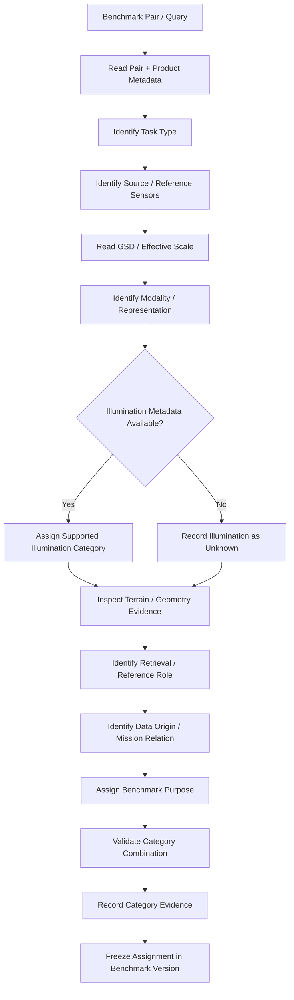
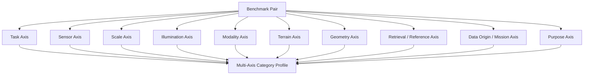

# Benchmark Categories

ChandraMap uses benchmark categories to describe the **scientific properties, sensor relationships, and stress conditions** represented by each benchmark case.

The category system exists because lunar correspondence and registration cases can differ simultaneously in:

- source and reference sensors;
- physical image scale;
- illumination geometry;
- sensor modality;
- terrain structure;
- feature availability;
- viewing geometry;
- projection;
- retrieval context;
- reference hierarchy;
- data origin;
- mission relationship;
- experimental purpose.

Reducing all of these dimensions to a single label such as `easy`, `medium`, or `hard` would hide the reason a case is challenging and would make scientific interpretation weaker.

> **A benchmark category describes the challenge presented by the data, not the quality of the algorithm that processes it.**

ChandraMap therefore uses a **multi-axis taxonomy**.

> **A benchmark pair may belong to multiple categories at the same time.**

For example, one pair may simultaneously represent:

- TMC-2 → NAC;
- known-overlap local registration;
- significant scale mismatch;
- illumination stress;
- repetitive crater terrain;
- a regression case.

These labels describe different properties of the same scientific case.

Category assignment must also remain evidence-based.

> **Category assignment should be based on documented evidence, not only visual intuition.**

Relevant evidence may include:

- instrument identity;
- mission/product metadata;
- actual or effective GSD;
- acquisition metadata;
- illumination geometry;
- projection information;
- derived-representation metadata;
- scale-pyramid metadata;
- independently reviewed terrain characterization;
- benchmark-manifest metadata.

For example, an image pair should not be labeled as having a strong Sun-angle difference only because one image appears darker.

Category definitions are part of benchmark reproducibility.

> **Category definitions must remain stable within a benchmark version.**

If category meaning changes materially, the taxonomy and affected benchmark definition should be versioned rather than silently reinterpreted.

Finally:

> **Categories and splits solve different problems.**

A category describes **what scientific conditions the case represents**.

A split describes **whether that case belongs to development, validation, or test data**.

---

## 1. Why Benchmark Categories Matter

ChandraMap works across imagery with substantially different:

- spatial scales;
- sensing modalities;
- illumination conditions;
- terrain structures;
- geometric relationships.

A single overall benchmark average can hide important weaknesses.

For example, a method could perform well on:

- fine panchromatic OHRC ↔ NAC cases;

while performing poorly on:

- IIRS-derived multimodal cases.

Without categories, those differences may disappear inside one aggregate statistic.

Benchmark categories support:

- organized benchmark design;
- sensor-specific reporting;
- stress testing;
- robustness analysis;
- controlled ablations;
- failure diagnosis;
- balanced case selection;
- regression analysis;
- reproducible research;
- V1 → V4 benchmark growth.

Categories make it possible to ask questions such as:

- Does performance degrade with physical scale mismatch?
- Are failures concentrated in IIRS cases?
- Does illumination handling help only under documented illumination variation?
- Are repetitive crater fields causing correspondence ambiguity?
- Does a transform model fail more often on relief-sensitive cases?
- Does global retrieval behave differently from known-overlap registration?

---

## 2. What Categories Are Not

Benchmark categories are **not**:

- algorithm rankings;
- result labels;
- success/failure outcomes;
- accuracy values;
- confidence scores;
- star ratings;
- leaderboards;
- arbitrary `easy / medium / hard` labels;
- development/validation/test splits;
- replacements for raw metadata;
- replacements for pair definitions;
- replacements for benchmark protocol.

A pair categorized as `scale stress` may succeed.

A nominal case may fail.

A method performing poorly on one category does not change the category itself.

---

# Core Terminology

## 3. Benchmark Category

A **benchmark category** is a label describing one scientifically relevant property, relationship, or stress condition of a benchmark case.

Examples include concepts such as:

- known-overlap registration;
- TMC-2 → NAC;
- cross-modality;
- scale stress;
- repetitive terrain.

---

## 4. Category Axis

A **category axis** is one scientific dimension along which benchmark cases are classified.

Examples include:

- task axis;
- sensor axis;
- scale axis;
- illumination axis;
- modality axis;
- terrain axis.

---

## 5. Category Value

A **category value** is one classification within an axis.

Conceptually:

```text
Axis:
Task

Possible value:
Known-overlap local registration
```

The exact implemented enum names, if any, belong to repository contracts rather than this document.

---

## 6. Multi-Label Classification

ChandraMap categories are expected to be **multi-label**.

One benchmark pair can simultaneously belong to several category axes.

For example:

```text
Task:
Known-overlap local registration

Sensor pair:
TMC-2 → NAC

Scale:
Large physical scale mismatch

Terrain:
Repetitive crater terrain

Purpose:
Regression + scale stress
```

These labels do not conflict because they describe different aspects of the same case.

---

## 7. Primary Category

A **primary category** is an optional experimental label indicating the scientific property most directly targeted by a specific experiment.

For example, a study focused on scale handling may identify:

> scale stress

as its primary category.

A primary category is not mandatory.

---

## 8. Secondary Categories

**Secondary categories** describe other relevant properties of the same case.

A scale-stress pair may also contain:

- illumination variation;
- repetitive terrain;
- cross-mission imagery.

These properties should remain visible because they can affect interpretation.

---

## 9. Benchmark Suite

A **benchmark suite** is a frozen collection of benchmark cases.

A suite can contain cases from many categories.

Category and suite are therefore different concepts.

---

## 10. Benchmark Split

A **benchmark split** assigns cases to roles such as:

- development;
- validation;
- test.

A category may appear in more than one split.

---

## 11. Stress Category

A **stress category** represents a deliberately challenging scientific condition used for robustness evaluation.

Examples may include:

- scale stress;
- illumination stress;
- modality stress;
- geometry stress.

Stress does not imply failure.

---

## 12. Nominal Case

A **nominal case** is a relatively controlled benchmark case intended to test ordinary pipeline behavior.

Nominal does not mean:

- trivial;
- guaranteed success;
- objectively easy.

---

## 13. Category Evidence

**Category evidence** is the metadata, measurement, or reviewed information supporting a category assignment.

---

## 14. Category Version

A **category version** or **taxonomy version** identifies one specific definition of the category system.

Changing category semantics materially should create a traceable new version.

---

# Multi-Axis Taxonomy

## 15. Category Model

ChandraMap should treat benchmark categorization as a multi-axis taxonomy rather than one flat list.

| Axis              | Describes                      | Example Concepts                                     |
| ----------------- | ------------------------------ | ---------------------------------------------------- |
| Task              | What problem is evaluated      | Local registration, retrieval, end-to-end            |
| Sensor Pair       | Which instruments are compared | OHRC → NAC, IIRS → WAC                               |
| Scale             | Physical sampling relationship | Comparable scale, large mismatch                     |
| Illumination      | Lighting-related condition     | Similar context, illumination change                 |
| Modality          | Sensor-domain relationship     | Panchromatic ↔ panchromatic, cross-modality          |
| Terrain / Feature | Visible terrain character      | Low-feature, repetitive crater terrain               |
| Geometry          | Spatial-model difficulty       | Relief, projection, viewing-geometry stress          |
| Retrieval         | Search context                 | Known location, regional retrieval, global retrieval |
| Reference Role    | Reference hierarchy            | NAC fine, WAC coarse/context                         |
| Data Origin       | Provenance type                | Mission data, synthetic, augmented real              |
| Mission           | Mission relationship           | Same mission, cross-mission                          |
| Purpose           | Why the case is included       | Baseline, stress, ablation, regression               |

Not every axis must have a meaningful value for every pair.

Conceptual states such as:

- unknown;
- unavailable;
- not applicable;

are preferable to guessing.

---

# Task Axis

## 16. Known-Overlap Local Registration

A known-overlap case has independently established source/reference overlap.

The algorithm receives the defined source/reference relationship directly.

The purpose is to test:

- preprocessing;
- scale handling;
- matching;
- filtering;
- RANSAC;
- transforms;
- refinement;
- registration;

without adding global retrieval as a confounding factor.

This is central to V1.

Known overlap does **not** mean the images are already registered.

See [`benchmark-protocol.md`](benchmark-protocol.md).

---

## 17. Global / Regional Retrieval

A retrieval case does not directly supply the exact local reference answer to the retrieval system.

The task is to determine whether a scientifically acceptable reference region appears among returned candidates.

Typical retrieval metrics include:

- `Recall@1`;
- `Recall@K`;

where `K` is benchmark-defined.

Registration RMSE is not a retrieval metric.

---

## 18. Retrieval + Registration

This category represents an end-to-end task:

```text
Source Query
→ Retrieval
→ Candidate References
→ Local Registration
→ Evaluation
```

The case should still preserve separate:

- retrieval metrics;
- registration metrics.

---

## 19. Representation / Preprocessing Ablation

This is primarily a **benchmark-purpose category**, not a physical property of the source data.

It may identify cases selected specifically to compare:

- preprocessing;
- illumination representation;
- IIRS representation;
- structural representation.

The underlying scientific categories should still be recorded separately.

---

# Sensor-Pair Axis

## 20. Why Sensor-Pair Categories Matter

Sensor-pair categories are fundamental because:

- pixel size differs;
- spectral response differs;
- image texture differs;
- available structures differ;
- preprocessing requirements differ;
- reference-scale requirements differ.

One pixel from OHRC is not physically equivalent to one pixel from TMC-2 or IIRS.

Results should therefore be stratified by sensor pair where the benchmark contains enough cases.

---

## 21. OHRC → NAC

OHRC is the Chandrayaan-2 **Orbiter High Resolution Camera**.

Project documentation commonly uses approximately:

> **~0.25–0.32 m/pixel**

depending on product/documentation.

LRO NAC is a fine/local reference, often treated in current project planning as approximately:

> **~0.5–2 m/pixel**

depending on product/acquisition geometry.

Actual metadata remains authoritative.

OHRC → NAC cases may contain:

- fine terrain detail;
- different illumination geometry;
- strong crater/ridge structure;
- non-identical spectral responses;
- terrain-relief effects.

Do not classify OHRC → NAC as universally easy.

---

## 22. OHRC → WAC

OHRC → WAC may be relevant for:

- broad context;
- retrieval;
- coarse localization;
- coarse registration.

Because WAC is generally a broader/coarser reference family, it should not automatically be interpreted as supporting OHRC-level final registration precision.

Actual WAC product metadata is required.

---

## 23. TMC-2 → NAC

TMC-2 is the Chandrayaan-2 **Terrain Mapping Camera-2**.

Current project planning commonly uses approximately:

> **~5 m/pixel**

with product metadata remaining authoritative.

TMC-2 → NAC commonly emphasizes:

- physical scale handling;
- reference-pyramid selection;
- crater/ridge morphology;
- medium-scale terrain structure.

This category is especially useful for scale-handling evaluation.

---

## 24. TMC-2 → WAC

TMC-2 → WAC may represent a medium/coarse structural comparison.

The actual scale relationship depends on the specific products.

Do not assume TMC-2 and WAC are automatically scale-compatible.

---

## 25. IIRS → NAC

IIRS is the Chandrayaan-2 **Imaging Infrared Spectrometer**.

Project-level approximations include:

- approximately ~80 m/pixel;
- approximately ~0.8–5.0 µm;
- roughly ~250–256 bands depending on product/documentation.

Actual metadata remains authoritative.

IIRS → NAC is an important ChandraMap category because it can combine:

- strong physical scale mismatch;
- hyperspectral/infrared-to-panchromatic modality difference;
- limited common fine spatial information;
- representation-generation requirements.

Every such benchmark should identify the IIRS-derived 2D registration representation.

---

## 26. IIRS → WAC

IIRS → WAC may provide:

- broader structural comparison;
- coarse localization;
- multimodal registration.

It still requires:

- representation provenance;
- product-specific scale information;
- careful modality interpretation.

---

# Scale Axis

## 27. Physical Scale, Not Pixel Dimensions

Scale categorization should use:

- actual source GSD;
- reference GSD;
- effective pyramid-level GSD;
- product metadata.

It should not be derived only from:

- raster width;
- raster height;
- model-input dimensions.

See [`../algorithms/scale-pyramid.md`](../algorithms/scale-pyramid.md).

---

## 28. Comparable-Scale Case

A **comparable-scale** case conceptually describes source/reference representations whose effective sampling is sufficiently similar for the intended benchmark.

No universal ratio threshold is defined here.

The benchmark version may define criteria when necessary.

---

## 29. Moderate Scale Mismatch

This conceptual category describes cases where physical sampling differs enough that scale handling matters but substantial shared terrain structure remains.

No exact numerical boundary is prescribed.

---

## 30. Large Scale Mismatch

This describes cases with substantial physical resolution difference.

Some IIRS → NAC cases may fall into this category depending on actual product metadata and selected reference level.

Do not assign the category solely from instrument names.

---

## 31. Very Large / Extreme Scale Difference

If a benchmark later introduces such a label, it should be quantitatively defined.

Avoid subjective use of words such as:

- extreme;
- severe;
- huge;

without benchmark-defined criteria.

Prefer reporting the actual scale metadata.

---

## 32. Pyramid-Dependent Case

A pair may receive a scale-related tag when meaningful correspondence requires careful reference-pyramid selection.

This can support:

- scale stress testing;
- coarse-to-fine experiments;
- failure diagnosis.

---

# Scale Metadata

## 33. Preserve Numeric Scale Evidence

A scale label must not replace actual metadata.

Where available, preserve:

- source GSD;
- reference base GSD;
- selected reference effective GSD;
- pyramid level;
- scale-ratio convention.

For example:

```text
Scale category:
Large mismatch

Supporting evidence:
Source GSD + selected reference effective GSD
```

The second part is required for scientific interpretation.

---

# Illumination Axis

## 34. Why Illumination Categories Matter

Lunar appearance depends strongly on:

- solar incidence geometry;
- shadow direction;
- shadow length;
- terrain slope;
- local relief.

Illumination difference is therefore more complex than brightness or contrast.

---

## 35. Similar Illumination Context

A pair may be categorized as having broadly similar illumination context when supported by:

- acquisition metadata;
- illumination geometry;
- documented review.

No universal angle threshold is defined here.

---

## 36. Illumination-Change Case

A pair may be labeled as an illumination-change case when metadata or reviewed evidence indicates a meaningful lighting difference.

Do not assign this category solely because:

> one image looks darker.

---

## 37. Strong Shadow-Geometry Stress

A dedicated shadow-geometry category may be useful when major changes in:

- shadow direction;
- shadow length;
- illuminated crater rim;

are central to the challenge.

Assignment should be supported by:

- metadata;
- documented acquisition geometry;
- expert/reviewer evidence.

No numeric threshold is prescribed here.

---

## 38. Unknown Illumination

If sufficient metadata are unavailable, preserve an explicit unknown state.

Do not infer precise illumination geometry from appearance alone.

---

# Modality Axis

## 39. Similar-Modality Case

A pair may conceptually be categorized as similar-modality when both representations are broadly comparable in sensing type.

For example:

```text
panchromatic
↔
panchromatic
```

This does not mean:

- identical bandpass;
- identical radiometry;
- identical spatial resolution.

---

## 40. Cross-Sensor Panchromatic

Examples include:

- OHRC ↔ NAC;
- TMC-2 ↔ NAC.

Even when both sides are panchromatic, they may differ in:

- spectral response;
- resolution;
- processing;
- viewing geometry.

---

## 41. Cross-Modality Case

IIRS-derived imagery matched against NAC or WAC is a primary cross-modality example.

This should remain distinct from standard panchromatic matching.

---

## 42. IIRS Representation Category

Every IIRS benchmark should preserve the representation actually used.

Conceptual representation classes may include:

- selected band;
- multi-band composite;
- PCA-derived component;
- gradient/structural representation;
- future learned spectral-spatial representation.

No representation is declared universally best.

---

# Terrain and Feature Axis

## 43. Terrain Categories Should Remain Benchmark-Oriented

ChandraMap does not need to invent a complete lunar geological taxonomy for registration benchmarking.

Terrain labels should describe image-registration-relevant characteristics.

---

## 44. Feature-Rich Terrain

A feature-rich case conceptually contains many potentially distinctive visible structures.

Possible examples may include combinations of:

- crater rims;
- ridges;
- texture;
- structural boundaries.

Do not define feature-rich solely using one algorithm's detected keypoint count.

That would make the category method-dependent.

---

## 45. Low-Feature Terrain

A low-feature case contains comparatively few distinctive structures useful for correspondence.

Potential examples may include smoother terrain regions.

Assignment should rely on:

- reviewed terrain characterization;
- independent image properties;
- documented benchmark curation;

rather than one detector's failure.

---

## 46. Repetitive Crater Terrain

Repetitive crater terrain is especially important for correspondence research.

It may contain many visually similar:

- craters;
- crater rims;
- ridge fragments.

This can lead to:

- descriptor ambiguity;
- false candidate matches;
- false local consensus;
- clustered correspondences.

---

## 47. Mixed Terrain

Some regions contain a mixture of:

- smooth plains;
- craters;
- ridges;
- complex structures.

A mixed/general terrain category may be more scientifically appropriate than forcing the case into one extreme label.

---

# Structural-Scale Axis

## 48. Large-Structure-Dominant Case

A case may be dominated by broad morphological information such as:

- large craters;
- broad ridges;
- terrain shape.

This can be especially relevant for:

- TMC-2;
- IIRS;
- coarse reference imagery.

---

## 49. Fine-Structure-Dominant Case

A fine-structure case may rely strongly on small-scale features visible in both source and reference.

This may apply to some:

- OHRC;
- NAC;

comparisons.

Do not classify a pair as fine-structure dominant solely because the reference contains fine detail if the source cannot observe it.

---

# Geometry Axis

## 50. Geometry Stress

Geometry stress describes cases where a simple local global transform may be challenged by:

- terrain relief;
- viewing differences;
- projection differences;
- wider spatial extent;
- coordinate-grid differences.

The category should describe known or reviewed geometric conditions, not merely poor algorithm output.

---

## 51. Local Planar Approximation Case

A benchmark may identify cases where a local:

- affine;
- homography;

approximation is expected to be reasonably useful.

This does not imply that the lunar surface itself is planar.

---

## 52. Relief-Sensitive Case

A relief-sensitive case is one where topography may contribute to spatially varying registration behavior.

Assignment should ideally be supported by:

- topographic evidence;
- viewing geometry;
- DEM information;
- documented expert review.

Do not infer relief sensitivity solely from large residuals.

---

## 53. Projection-Stress Case

A projection-stress case intentionally includes meaningful differences in:

- map projection;
- coordinate grid;
- processing geometry.

Do not confuse an accidental preprocessing error with an intentionally defined projection-stress benchmark.

---

## 54. Viewing-Geometry Stress

This category may be used where source/reference viewing geometry differs meaningfully and supporting metadata are available.

Do not invent missing angles.

---

# Feature-Ambiguity Axis

## 55. Descriptor-Ambiguity Case

A descriptor-ambiguity case contains structures likely to create multiple locally similar correspondence candidates.

This may overlap with:

- repetitive crater terrain.

The distinction is useful because:

- terrain category describes the scene;
- ambiguity category describes the correspondence challenge.

---

## 56. Sparse-Correspondence Case

A sparse-correspondence case is expected, based on data characteristics, to provide relatively few stable cross-image correspondence opportunities.

Do not define the category retrospectively because one matcher produced few matches.

---

# Retrieval Context Axis

## 57. Known Location

A known-location case provides enough geographic metadata to constrain the reference region.

Global retrieval may not be necessary.

---

## 58. Unknown Location

An unknown-location case intentionally withholds the exact local reference region from the algorithm.

This category is relevant for retrieval benchmarking.

---

## 59. Regional Retrieval

Regional retrieval constrains search to a defined lunar region rather than the full configured reference database.

This can be useful when some coarse geospatial information is known.

---

## 60. Global Retrieval

Global retrieval searches the configured broad/global lunar reference database.

No specific database size is assumed here.

---

# Reference-Role Axis

## 61. NAC Fine Reference

NAC commonly serves as a fine/local reference.

Actual:

- product scale;
- acquisition geometry;
- processing state;

remain product-specific.

---

## 62. NAC Coarsened Reference

A NAC pyramid level may be used to produce a scale-compatible reference for a coarser source.

Record:

- parent NAC product;
- pyramid level;
- effective GSD.

---

## 63. WAC Coarse / Context Reference

WAC may serve as:

- regional context;
- retrieval reference;
- coarse registration reference.

The role depends on the experiment.

---

## 64. WAC → NAC Coarse-to-Fine Role

A future or advanced ChandraMap workflow may use:

```text
WAC
→ broad localization

NAC
→ fine/local registration
```

Treat this as a conceptual V3/later category unless current authoritative scope defines it as implemented.

---

# Scale-Search Strategy Axis

## 65. Single-Scale Registration

Only one prepared reference scale is used.

---

## 66. Multi-Scale Search

Several reference scales or pyramid levels are evaluated.

---

## 67. Coarse-to-Fine Registration

Registration begins at a coarser level and progresses toward finer compatible scales.

This does **not** imply that the process must eventually reach native/fine NAC resolution.

Refinement should stop where the source no longer supports finer physical information.

---

# Data-Origin Axis

## 68. Real Mission Data

Real mission data should form the primary scientific evidence for ChandraMap.

Examples include data from:

- Chandrayaan-2;
- LRO.

Mission and product provenance should remain traceable.

---

## 69. Synthetic Data

Fully synthetic images or geometries can support:

- controlled transform tests;
- known-truth validation;
- algorithm unit/stress testing.

Synthetic success does not automatically establish real lunar performance.

---

## 70. Augmented Real Data

An augmented-real case begins with mission imagery and applies controlled synthetic modifications such as:

- rotation;
- scaling;
- contrast change;
- noise;
- geometric perturbation.

Parent-product lineage should be preserved.

---

## 71. Photometric Augmentation vs Physical Illumination Simulation

This distinction is important.

Operations such as:

- brightness adjustment;
- contrast adjustment;
- gamma adjustment;

are photometric augmentations.

They are **not equivalent** to physically accurate changes in lunar Sun geometry.

A synthetic brightness change should not automatically receive a physical illumination-stress label.

---

# Mission Axis

## 72. Same-Mission Case

A same-mission category may be used where source/reference imagery originate from the same mission.

This category may become more important as ChandraMap expands.

---

## 73. Cross-Mission Case

Cross-mission matching is central to current ChandraMap goals.

A primary example is:

```text
Chandrayaan-2
↔
Lunar Reconnaissance Orbiter
```

---

## 74. Future Multi-Mission Cases

Future datasets may include:

- Kaguya / SELENE;
- additional lunar missions.

Do not claim current implementation or benchmark availability unless confirmed by authoritative repository scope/data.

---

# Benchmark-Purpose Axis

## 75. Baseline Case

A baseline case helps establish reproducible ordinary pipeline behavior.

---

## 76. Regression Case

A regression case is retained across software revisions to detect changes in:

- accuracy;
- failure behavior;
- runtime;
- routing;
- output consistency.

---

## 77. Stress Case

A stress case intentionally represents one or more difficult conditions.

Its stress categories should identify those conditions explicitly.

---

## 78. Ablation Case

An ablation case is selected because it supports a controlled component experiment.

Examples include:

- preprocessing ablation;
- matcher ablation;
- scale ablation;
- refinement ablation.

---

## 79. Failure-Analysis Case

A benchmark may intentionally retain a case known to expose:

- ambiguity;
- geometry limitations;
- modality limitations;
- insufficient features;
- pipeline failure.

Such cases are scientifically useful.

---

# Category Overlap

## 80. Categories Are Non-Mutually Exclusive

A conceptual benchmark pair may be described as:

| Axis         | Classification                   |
| ------------ | -------------------------------- |
| Task         | Known-overlap local registration |
| Source       | TMC-2                            |
| Reference    | NAC                              |
| Scale        | Large mismatch                   |
| Modality     | Cross-sensor panchromatic        |
| Terrain      | Repetitive crater terrain        |
| Illumination | Illumination change              |
| Purpose      | Scale-stress regression          |

This combination is valid because the labels describe different dimensions.

---

## 81. Primary and Secondary Conditions

For one experiment, the primary research question might be:

> scale stress.

The same pair may still have secondary properties such as:

- illumination variation;
- repetitive terrain.

These should remain visible.

---

## 82. Do Not Hide Confounders

A pair should not be described as a pure scale experiment if it also contains major uncontrolled differences in:

- modality;
- illumination;
- geometry.

The categories help expose these confounders.

---

# Category Assignment

## 83. Recommended Assignment Procedure

A benchmark case can be categorized conceptually using the following process:

1. Load the pair definition.
2. Load source/reference product metadata.
3. Identify the benchmark task.
4. Identify source and reference sensors.
5. Identify source/reference mission relationship.
6. Read source GSD and reference/effective GSD.
7. Identify the selected reference level.
8. Identify sensor modality and derived representations.
9. Read available illumination metadata.
10. Read projection and viewing metadata.
11. Review terrain/feature evidence where required.
12. Identify retrieval context.
13. Identify reference role.
14. Identify data origin.
15. Identify benchmark purpose.
16. Review potentially conflicting labels.
17. Record category evidence.
18. Freeze the category record within the benchmark version.

---

# Category Evidence

## 84. Evidence Sources

Category evidence may come from:

- official mission/product metadata;
- [`../datasets/metadata.md`](../datasets/metadata.md);
- pair definitions;
- scale-pyramid metadata;
- representation provenance;
- acquisition metadata;
- ground-truth records;
- independently reviewed benchmark annotations;
- experiment design.

---

## 85. Evidence Should Be Traceable

A useful assignment should answer:

> Why does this pair have this category?

For example:

```text
Category:
Scale stress

Evidence:
Source product GSD
+
selected reference effective GSD
```

is stronger than:

```text
Category:
Scale stress

Evidence:
Images look very different in size
```

---

# Category Confidence

## 86. Avoid Fake Confidence Scores

Do not assign values such as:

```text
92% confidence that this is an illumination-stress case
```

unless ChandraMap later defines and validates a formal classification-confidence methodology.

Prefer evidence states conceptually such as:

- metadata-supported;
- reviewed;
- unknown.

Exact enum names are not defined here.

---

# Unknown and Not Applicable

## 87. Unknown

Use an unknown state when the category would be meaningful but evidence is unavailable.

Example:

```text
Illumination geometry:
Unknown
```

because the required metadata are missing.

---

## 88. Not Applicable

Use a not-applicable state when an axis does not apply to the task.

For example, detailed retrieval scope may not apply to a benchmark designed solely as a fixed known-overlap registration task.

Unknown and not applicable are conceptually different.

---

# Category Validation

## 89. Automatically Derivable Categories

Some categories can often be derived directly from trusted metadata, such as:

- source sensor;
- reference sensor;
- mission pair;
- source GSD;
- reference GSD;
- pyramid level;
- data origin;
- benchmark task.

---

## 90. Reviewed Categories

Other categories may require scientific/manual review, such as:

- feature-rich terrain;
- low-feature terrain;
- repetitive terrain;
- relief-sensitive geometry.

Where review is required, preserve review provenance when practical.

---

# Taxonomy Versioning

## 91. Taxonomy Version

Category definitions should have a traceable version.

A material semantic change should create a new taxonomy revision.

---

## 92. Relationship to Benchmark Version

A benchmark version should record or otherwise imply which taxonomy version was used to classify its cases.

Conceptually:

```text
Benchmark Version
        ↓
Category Taxonomy Version
        ↓
Frozen Category Assignments
```

---

## 93. Do Not Reclassify Historical Benchmarks Silently

Suppose an older benchmark defined a particular pair as:

```text
Scale stress
```

and a later taxonomy changes the scale-category definition.

Do not silently reinterpret the historical result.

Preserve the old benchmark's category semantics and introduce a new benchmark/taxonomy version where needed.

---

# Benchmark Balance

## 94. Category Balance

A benchmark intended to evaluate broad ChandraMap behavior should avoid being unintentionally dominated by:

- one sensor;
- one terrain type;
- one scale condition.

However, do not fabricate artificial balance when data availability does not support it.

---

## 95. Report Category Counts

Benchmark reports should state how many cases belong to important categories where such reporting is useful.

Counts should come from actual benchmark manifests.

Do not hard-code invented counts in documentation.

---

## 96. Multi-Label Counting Caution

Because one pair may belong to several categories:

> the sum of category counts may exceed the number of unique benchmark pairs.

This is expected in a multi-label taxonomy.

---

# Category Coverage Matrix

## 97. Conceptual Coverage Matrix

A benchmark report may use a matrix to show whether important sensor/stress combinations are represented.

| Sensor Pair | Nominal | Scale Stress | Illumination Stress | Repetitive Terrain | Low Feature | Geometry Stress |
| ----------- | ------: | -----------: | ------------------: | -----------------: | ----------: | --------------: |
| OHRC → NAC  |       — |            — |                   — |                  — |           — |               — |
| TMC-2 → NAC |       — |            — |                   — |                  — |           — |               — |
| IIRS → NAC  |       — |            — |                   — |                  — |           — |               — |

The table intentionally contains no fabricated counts.

Actual values should be generated from benchmark manifests.

---

# Category-Stratified Reporting

## 98. Why Stratification Matters

An overall benchmark average can hide:

- strong performance in one category;
- systematic failure in another.

Stratified reporting helps reveal these differences.

---

## 99. Sensor-Stratified Results

Where data volume permits, report separately for:

- OHRC;
- TMC-2;
- IIRS.

Sensor-pair reporting can provide even more useful context.

---

## 100. Scale-Stratified Results

Report benchmark performance across documented scale categories while retaining actual:

- GSD;
- effective GSD;
- pyramid-level context.

---

## 101. Illumination-Stratified Results

Where category evidence is reliable, compare results across:

- similar illumination;
- illumination-change;
- stronger shadow-geometry stress;

or other benchmark-defined classes.

Do not use guessed labels.

---

## 102. Terrain-Stratified Results

Terrain categories can reveal weaknesses such as:

- poor performance in low-feature regions;
- high ambiguity in repetitive crater terrain.

---

## 103. Modality-Stratified Results

IIRS/multimodal results should remain identifiable rather than disappearing into one general panchromatic average.

---

# Categories and Metrics

## 104. Categories Must Not Redefine Metrics Silently

A metric such as check-point RMSE should retain the same formal definition across category reports.

Do not redefine RMSE because the category changes.

---

## 105. Interpretation Can Be Category-Specific

The metric definition remains stable, but interpretation may differ.

For example:

```text
1 OHRC pixel
≠
1 TMC-2 pixel
≠
1 IIRS pixel
```

in physical lunar distance.

Therefore category context helps explain what the same type of pixel-domain metric means physically.

---

# Categories and Failure Analysis

## 106. Failure Distribution by Category

Failures may be grouped by:

- sensor pair;
- scale category;
- illumination category;
- modality;
- terrain;
- geometry.

This can reveal systematic patterns.

---

## 107. Correlation Is Not Causation

Suppose most failures occur in illumination-stress cases.

That does not prove:

> illumination is the sole cause.

Those cases may also contain:

- scale mismatch;
- repetitive terrain;
- modality differences.

Multi-axis categories help expose these confounders.

---

# Categories and Controlled Ablations

## 108. Categories Help Select Cases

For an illumination-handling ablation, choose pairs with documented illumination differences.

For a scale-handling ablation, choose cases with documented scale relationships.

---

## 109. Category Membership Is Not Experimental Control

Two pairs may both be labeled:

```text
Illumination stress
```

while differing in:

- sensor pair;
- GSD;
- terrain;
- geometry.

Ablation design must still control these other variables where possible.

See [`benchmark-protocol.md`](benchmark-protocol.md).

---

# Difficulty Labels

## 110. Avoid Subjective Easy / Medium / Hard

ChandraMap should not casually classify cases as:

- easy;
- medium;
- hard;
- extreme;

based on visual judgment.

Such labels hide the scientific cause of difficulty.

---

## 111. If Difficulty Is Added Later

A difficulty field should be:

- benchmark-defined;
- measurable;
- versioned;
- reproducible.

Possible future inputs might include:

- scale ratio;
- illumination difference;
- modality relationship;
- feature availability;
- geometry complexity.

This document intentionally does not define a composite formula.

---

## 112. Prefer Scientific Dimensions

Prefer:

```text
Large scale mismatch
+
Illumination change
+
Repetitive terrain
```

over:

```text
Difficulty = 8/10
```

The multi-axis description is scientifically more informative.

---

# Conceptual Category Record

## 113. Illustrative Pair Record

The following is an **illustrative conceptual structure — not an implemented schema**:

```yaml
pair_id: "PLACEHOLDER_PAIR_ID"

categories:
  task:
    - "PLACEHOLDER_TASK"

  sensor_pair:
    source: "PLACEHOLDER_SOURCE_SENSOR"
    reference: "PLACEHOLDER_REFERENCE_SENSOR"

  scale:
    class: "PLACEHOLDER_SCALE_CATEGORY"
    source_gsd: "PLACEHOLDER"
    reference_effective_gsd: "PLACEHOLDER"

  modality:
    - "PLACEHOLDER_MODALITY_CATEGORY"

  illumination:
    - "PLACEHOLDER_ILLUMINATION_CATEGORY"

  terrain:
    - "PLACEHOLDER_TERRAIN_CATEGORY"

  geometry:
    - "PLACEHOLDER_GEOMETRY_CATEGORY"

  purpose:
    - "PLACEHOLDER_PURPOSE"

taxonomy_version: "PLACEHOLDER_VERSION"
```

No real GSD value, category identifier, enum, or repository schema is implied.

---

# Conceptual Evidence Record

## 114. Illustrative Evidence

The following is also conceptual:

```yaml
category: "PLACEHOLDER_CATEGORY"

basis:
  - "product_metadata"
  - "pair_metadata"

review_status: "PLACEHOLDER_STATUS"
notes: "PLACEHOLDER_EXPLANATION"
```

These field names are not claims about an implemented repository format.

---

# Category Reference Table

## 115. Taxonomy Summary

| Axis         | Category Concept              | Meaning                                          | Typical Evidence                  | Version Relevance     |
| ------------ | ----------------------------- | ------------------------------------------------ | --------------------------------- | --------------------- |
| Task         | Known-overlap registration    | Local registration without retrieval uncertainty | Pair definition / overlap truth   | V1+                   |
| Task         | Retrieval                     | Reference region must be located                 | Retrieval manifest/truth          | V3+ conceptually      |
| Task         | Retrieval + registration      | Complete end-to-end localization                 | Retrieval + registration protocol | V3+ conceptually      |
| Sensor       | OHRC → NAC                    | Fine cross-sensor lunar registration             | Product metadata                  | V1+ where data exists |
| Sensor       | TMC-2 → NAC                   | Medium-to-fine cross-resolution registration     | Product metadata                  | V1+ where data exists |
| Sensor       | IIRS → NAC/WAC                | Multimodal hyperspectral-derived registration    | Product + representation metadata | V2+ conceptually      |
| Scale        | Comparable scale              | Effective physical sampling broadly compatible   | GSD/effective GSD                 | V1+                   |
| Scale        | Scale mismatch                | Physical sampling difference affects matching    | GSD/effective GSD                 | V1+                   |
| Illumination | Illumination change           | Documented lighting geometry differs             | Acquisition/illumination metadata | V2+ conceptually      |
| Modality     | Cross-modality                | Different sensing domain                         | Sensor + representation metadata  | V2+ conceptually      |
| Terrain      | Low feature                   | Few stable/distinct structures                   | Reviewed characterization         | V2+ conceptually      |
| Terrain      | Repetitive terrain            | Many similar local structures                    | Reviewed characterization         | V1/V2+                |
| Geometry     | Relief/projection/view stress | Spatial geometry challenges global model         | Geometry/topography metadata      | V2/V4+                |
| Retrieval    | Known location                | Search constrained by metadata                   | Pair/query metadata               | V1+                   |
| Retrieval    | Unknown/global                | Search region deliberately hidden                | Retrieval protocol                | V3+                   |
| Reference    | NAC fine                      | Local/fine reference role                        | Reference metadata                | V1+                   |
| Reference    | WAC coarse/context            | Broad reference role                             | Reference metadata                | V3+ conceptually      |
| Data Origin  | Real mission data             | Authentic lunar observation                      | Mission provenance                | V1+                   |
| Data Origin  | Synthetic                     | Fully generated test data                        | Generation provenance             | Optional              |
| Data Origin  | Augmented real                | Mission data with synthetic transformation       | Parent lineage                    | Optional              |
| Purpose      | Baseline                      | Establish reproducible starting behavior         | Benchmark manifest                | V1+                   |
| Purpose      | Regression                    | Detect software/algorithm changes                | Benchmark manifest                | V1+                   |
| Purpose      | Stress                        | Deliberately challenge robustness                | Benchmark design                  | V1+ where appropriate |
| Purpose      | Ablation                      | Isolate one component                            | Experiment definition             | V1+                   |

Existing authoritative version documents take precedence over the conceptual V1/V2/V3/V4 mapping shown here.

---

# V1 Category Scope

## 116. Minimal Useful V1 Taxonomy

V1 should not attempt to populate every category defined in this document.

A practical minimal V1 taxonomy should distinguish at least where data support it:

### Task

- known-overlap local registration.

### Sensor Pair

- OHRC → NAC;
- TMC-2 → NAC;

where validated pairs exist.

### Scale

Record:

- source product/effective GSD;
- reference effective GSD;
- selected pyramid level;
- descriptive mismatch category where justified.

### Data Origin

- real mission data.

### Purpose

- baseline;
- regression;
- selected stress/failure cases where useful.

### Terrain

Record reviewed terrain/feature categories only when supported.

IIRS does not need to be forced into V1 if validated data or authoritative V1 scope does not yet support it.

---

# V2 Category Expansion

## 117. Possible V2 Additions

V2 may expand category coverage toward:

- stronger scale stress;
- illumination stress;
- IIRS-derived representations;
- modality stress;
- low-feature terrain;
- repetitive terrain;
- transform-model stress;
- sub-pixel refinement studies.

These are conceptual directions.

---

# V3 Category Expansion

## 118. Possible V3 Additions

V3 may introduce:

- regional/global retrieval;
- unknown-location queries;
- WAC/NAC hierarchy;
- multi-scale search;
- coarse-to-fine registration;
- learned matcher benchmark categories;
- retrieval + registration cases.

---

# V4 Category Expansion

## 119. Possible V4 Additions

Future research may introduce:

- additional lunar missions;
- Kaguya / SELENE cases;
- DEM-aware geometry;
- terrain-conditioned evaluation;
- physical sensor-model stress;
- lunar-specific learned representations;
- cross-mission generalization;
- uncertainty-aware benchmark categories.

These are not claims of current implementation.

---

# Category Assignment Workflow

## 120. Assignment Flow



---

# Multi-Axis Profile

## 121. Taxonomy Flow



---

# Human-Readable Category Profile Example

## 122. Illustrative Example

The following example is conceptual rather than a real benchmark record:

- **Task:** known-overlap local registration
- **Source:** TMC-2
- **Reference:** NAC
- **Scale:** reference coarsening required
- **Modality:** cross-sensor panchromatic
- **Terrain:** repetitive structure
- **Illumination:** unknown
- **Reference role:** NAC local reference
- **Data origin:** real mission data
- **Mission relation:** Chandrayaan-2 ↔ LRO
- **Purpose:** scale-stress benchmark

The example demonstrates multi-axis labeling only.

It does not claim that any specific repository pair has these properties.

---

# Category Quality Control

## 123. QC Checklist

Before freezing category assignments, verify:

- [ ] Pair/query ID exists.
- [ ] Task category is assigned.
- [ ] Source sensor identity is valid.
- [ ] Reference sensor identity is valid.
- [ ] Mission identities are known where applicable.
- [ ] Source GSD is recorded where available.
- [ ] Reference/effective GSD is recorded where available.
- [ ] Scale category is supported by physical metadata.
- [ ] Reference pyramid level is known where applicable.
- [ ] Modality category is supported.
- [ ] IIRS representation is recorded where applicable.
- [ ] Illumination category is supported or explicitly unknown.
- [ ] Terrain category has supporting evidence.
- [ ] Geometry category has supporting evidence.
- [ ] Retrieval context is known.
- [ ] Reference role is known.
- [ ] Data-origin category is known.
- [ ] Benchmark-purpose category is known.
- [ ] Conflicting labels have been reviewed.
- [ ] Category evidence is traceable.
- [ ] Taxonomy version is recorded.
- [ ] Benchmark version freezes the assignment.

---

# Category Consistency

## 124. Conflicting Categories

Some category combinations may conflict for the same benchmark task.

For example, a single task definition should not simultaneously claim:

```text
Exact local reference is supplied
```

and:

```text
The algorithm must globally retrieve the unknown reference
```

unless the benchmark explicitly represents these as separate tasks.

---

## 125. Compatible Overlaps

The following can coexist:

```text
Scale stress
+
Illumination stress
+
Repetitive terrain
+
Cross-mission
```

because they describe different scientific dimensions.

---

# Category Auditing

## 126. Periodic Review

As ChandraMap data improve, category assignments may be audited for:

- missing metadata;
- incorrect labels;
- inconsistent review;
- taxonomy gaps;
- newly available product information.

Auditing must not silently modify historical benchmark semantics.

---

## 127. Correcting a Category

If a category assignment is demonstrated to be wrong:

1. document the problem;
2. preserve the original historical record;
3. correct the category in a new benchmark/taxonomy revision where needed;
4. document the reason for the change.

---

# Categories vs Algorithm Results

## 128. Categories Must Not Depend on Method Performance

Do not define a case as:

```text
hard
```

because:

```text
SIFT failed
```

or as:

```text
feature rich
```

because:

```text
one detector produced many keypoints
```

Categories should describe the data/task conditions independently of a particular algorithm.

---

## 129. Results Can Be Grouped by Category

After benchmark runs are completed, results may be summarized by category.

Examples include:

- failure rate on scale-stress cases;
- IIRS check-point error;
- repetitive-terrain inlier ratio;
- retrieval performance by search context.

Category assignment should already exist before these result summaries are calculated.

---

# Categories vs Failure Labels

## 130. Stress Does Not Mean Failure

A scale-stress pair can succeed.

A nominal pair can fail.

Therefore:

```text
category
≠
outcome
```

---

# Categories vs Splits

## 131. Independent Concepts

A pair may simultaneously have:

```text
Category:
Scale stress

Split:
Test
```

Category describes the scientific condition.

Split describes the experimental role.

---

# Categories vs Pair Definition

## 132. [`../datasets/pair-definition.md`](../datasets/pair-definition.md)

Pair definition answers:

> What are the source and reference assets, and what is their scientific relationship?

Benchmark category answers:

> What scientific conditions or challenges does this pair represent?

---

# Categories vs Benchmark Protocol

## 133. [`benchmark-protocol.md`](benchmark-protocol.md)

This distinction is fundamental:

```text
benchmark-categories.md
→ WHAT KIND of benchmark case is this?

benchmark-protocol.md
→ HOW is that benchmark case evaluated?
```

The taxonomy must not duplicate the complete execution procedure.

---

# Relationship to Evaluation Overview

## 134. [`README.md`](README.md)

`docs/evaluation/README.md` defines:

- evaluation philosophy;
- core metric concepts;
- independent-truth principles.

This document defines:

- benchmark taxonomy;
- category semantics;
- category assignment rules.

---

# Relationship to Ground Truth

## 135. [`../datasets/ground-truth-preparation.md`](../datasets/ground-truth-preparation.md)

Ground-truth role is independent of category assignment.

A geometry-stress pair still requires correct separation of:

- fit/control points;
- independent check points.

---

# Relationship to Metadata

## 136. [`../datasets/metadata.md`](../datasets/metadata.md)

Category assignment should reuse authoritative metadata whenever possible.

Do not duplicate mission metadata manually if it is already available through the dataset metadata layer.

---

# Relationship to Dataset Preparation

## 137. [`../datasets/dataset-preparation.md`](../datasets/dataset-preparation.md)

Dataset preparation creates validated scientific assets and representations.

Categories describe the benchmark conditions represented by those prepared assets.

---

# Relationship to Scale Handling

## 138. [`../algorithms/scale-pyramid.md`](../algorithms/scale-pyramid.md)

Scale categories should use:

- product GSD;
- effective pyramid GSD;
- scale provenance.

Do not classify scale using image dimensions alone.

---

# Relationship to Illumination Handling

## 139. [`../algorithms/illumination-handling.md`](../algorithms/illumination-handling.md)

Illumination categories describe the benchmark condition.

Illumination-handling algorithms describe how ChandraMap attempts to process that condition.

The category should not be defined by whether the illumination algorithm succeeds.

---

# Relationship to Preprocessing

## 140. [`../algorithms/preprocessing.md`](../algorithms/preprocessing.md)

Representation/preprocessing ablation categories should remain separate from preprocessing results.

---

# Relationship to Matching

## 141. [`../algorithms/matching.md`](../algorithms/matching.md)

Do not define terrain feature richness solely from:

- match count;
- candidate count.

Those are algorithm outputs.

---

# Relationship to RANSAC

## 142. [`../algorithms/ransac.md`](../algorithms/ransac.md)

Do not classify a pair as geometry stress merely because:

- RANSAC failed;
- inlier count was low.

Geometry categories require independent evidence.

---

# Relationship to Transforms

## 143. [`../algorithms/transforms.md`](../algorithms/transforms.md)

Geometry categories can provide context when comparing:

- affine;
- homography;
- future local/DEM-aware models.

They do not predetermine which model should perform best.

---

# Relationship to Residual Analysis

## 144. [`../algorithms/residual-analysis.md`](../algorithms/residual-analysis.md)

Residual patterns may help identify hypotheses for future taxonomy review.

They should not retroactively redefine published benchmark categories without versioning.

---

# Relationship to Registration

## 145. [`../algorithms/registration.md`](../algorithms/registration.md)

Registration outputs may later be aggregated and analyzed by benchmark category.

The category record should remain independent from the registration result.

---

# Relationship to Sensor Documentation

## 146. Sensor References

Relevant known files include:

- [`../sensors/overview.md`](../sensors/overview.md)
- [`../sensors/ohrc.md`](../sensors/ohrc.md)
- [`../sensors/tmc2.md`](../sensors/tmc2.md)
- [`../sensors/iirs.md`](../sensors/iirs.md)
- [`../sensors/lro-nac.md`](../sensors/lro-nac.md)
- [`../sensors/lro-wac.md`](../sensors/lro-wac.md)

Sensor documentation defines the physical properties of each instrument.

This taxonomy should not redefine sensor specifications.

---

# Relationship to Project Scope

## 147. Project Documentation

Related project paths to consult when present include:

- `../project/goals.md`
- `../project/non-goals.md`
- `../project/v1-scope.md`
- `../project/terminology.md`
- `../project/assumptions.md`
- `../project/limitations.md`

Authoritative project/version scope remains definitive.

Advanced categories should not automatically become mandatory in V1.

---

# Relationship to Architecture

## 148. Architecture Documentation

Related architecture paths to consult when present include:

- `../architecture/system-overview.md`
- `../architecture/v1-pipeline.md`
- `../architecture/core-engine-architecture.md`
- `../architecture/module-map.md`
- `../architecture/data-flow.md`
- `../architecture/output-flow.md`

Architecture determines:

- where category records are stored;
- how benchmark manifests consume them;
- how result aggregation uses them.

This file defines their scientific semantics.

---

# Repository-Level Benchmark Infrastructure

## 149. Root `benchmarks/`

If a root-level `benchmarks/` directory exists, its frozen benchmark manifests should reference or contain the category assignments required for reproducibility.

Large mission imagery should not be duplicated there unnecessarily.

---

## 150. Root `experiments/`

If a root-level `experiments/` directory exists, experiments may select:

- specific category subsets;
- category-controlled ablations.

Experiments should not silently redefine category meaning.

---

## 151. Root `results/`

If a root-level `results/` directory exists, result summaries may aggregate by category.

Results must not determine category membership after the fact.

---

# Data Licensing

## 152. [`../data-licenses.md`](../data-licenses.md)

Category membership does not alter:

- provider terms;
- attribution requirements;
- redistribution permissions.

A mission-data pair does not become freely redistributable merely because it belongs to a public benchmark category.

---

# Category Anti-Patterns

## 153. Do Not

Do not:

- assign categories from algorithm performance;
- label a pair difficult because one method failed;
- use subjective easy/medium/hard labels without defined criteria;
- infer Sun-angle stress from brightness alone;
- infer geometry stress from RMSE alone;
- infer low-feature terrain from one detector's keypoint count alone;
- treat IIRS as ordinary grayscale imagery;
- classify brightness augmentation as physical Sun-angle simulation;
- hide overlapping categories;
- force one category per pair;
- use category labels as development/test split labels;
- use category names as algorithm scores;
- silently redefine taxonomy terms;
- overwrite historical assignments without versioning;
- duplicate existing product metadata unnecessarily;
- invent scale-ratio thresholds;
- invent illumination-angle thresholds;
- invent benchmark counts;
- invent terrain classes not supported by evidence;
- use result metrics as retrospective category evidence.

---

# Claims ChandraMap Should Avoid

## 154. Unsupported Category Claims

Do not claim without evidence:

- "OHRC → NAC is always easy."
- "IIRS → NAC is impossible."
- "WAC cases are always coarse."
- "NAC is always higher resolution than OHRC."
- "Scale stress begins at exactly X×."
- "Sun-angle stress begins at exactly X degrees."
- "Repetitive terrain is always hard."
- "Low-feature terrain always fails."
- "Category X means algorithm Y should win."
- "Difficulty is 9/10."
- "A pair is multimodal because brightness differs."
- "All IIRS representations have the same difficulty."
- "One category completely describes a benchmark pair."

---

# Limitations

## 155. Incomplete Metadata

Some mission products may not expose every field needed for ideal categorization.

Unknown states may therefore remain necessary.

---

## 156. Illumination Metadata May Be Missing

Not all pairs will have enough information to characterize illumination geometry precisely.

Do not infer missing values.

---

## 157. GSD Is Product-Dependent

Generic sensor-level resolution values are useful for context but should not replace actual product metadata.

---

## 158. Terrain Labels May Require Review

Categories such as:

- low feature;
- repetitive terrain;
- relief sensitive;

may require documented human/scientific review.

---

## 159. Categories Can Overlap

A pair can contain multiple stress conditions simultaneously.

This can complicate causal interpretation.

---

## 160. Category Balance Depends on Available Data

Real mission-data availability may prevent perfectly balanced benchmark categories.

Do not fabricate equal representation.

---

## 161. Categories Do Not Measure Absolute Difficulty

The taxonomy explains **what conditions exist**, not exactly how difficult they will be for every algorithm.

---

## 162. Categories Do Not Predict Algorithm Success

A method may succeed on a stress case and fail on a nominal case.

---

## 163. Taxonomy Will Evolve

New:

- sensors;
- missions;
- retrieval architectures;
- geometry models;

may require additional categories.

---

## 164. Cross-Mission Categories May Initially Be Sparse

Early project versions may contain only a limited number of validated multi-mission cases.

---

## 165. DEM-Aware Categories Require Reliable Terrain Data

Topography-aware labels should not be introduced without suitable:

- DEM;
- alignment;
- provenance;
- geometric evidence.

---

## 166. Conclusions Are Version-Specific

Category-stratified benchmark conclusions apply only to the taxonomy and benchmark version under which the cases were classified.

---

# Authoritative and Primary Reference Categories

## 167. Chandrayaan-2

Prefer authoritative resources such as:

- ISRO Chandrayaan-2 documentation;
- ISRO / ISSDC / PRADAN;
- official OHRC documentation;
- official TMC-2 documentation;
- official IIRS documentation;
- actual mission-product metadata.

---

## 168. Lunar Reconnaissance Orbiter

Prefer:

- NASA Lunar Reconnaissance Orbiter documentation;
- LROC / Arizona State University;
- NASA Planetary Data System;
- official NAC/WAC product metadata.

---

## 169. Planetary and Geospatial Context

Relevant authoritative resource categories include:

- USGS ISIS;
- planetary cartography references;
- planetary photogrammetry references;
- trusted lunar DEM/topography resources where relevant.

---

## 170. Computer Vision and Remote Sensing

Relevant resource categories include:

- OpenCV documentation;
- image-registration literature;
- official LightGlue resources;
- ALIKED primary resources;
- LoFTR primary resources;
- RIFT primary research;
- CFOG-related primary research.

These resources describe methods and processing concepts.

They do not determine benchmark-category assignment automatically.

---

# Benchmark Category Principles

## 171. Categories Describe Scientific Conditions

They do not describe algorithm quality.

---

## 172. Multi-Label Classification Is Expected

One benchmark pair may belong to many scientifically meaningful categories.

---

## 173. Evidence Comes Before Labels

Use metadata and documented review rather than intuition.

---

## 174. Actual Product Metadata Wins

Especially for:

- GSD;
- geometry;
- illumination;
- mission/product identity.

---

## 175. Categories and Splits Are Different

Category:

> scientific condition.

Split:

> experimental role.

---

## 176. Categories and Outcomes Are Different

Stress does not mean failure.

Nominal does not guarantee success.

---

## 177. Avoid Subjective Difficulty Scores

Describe the actual scientific dimensions instead.

---

## 178. Preserve Numeric Metadata

A scale-category label does not replace actual GSD/effective GSD.

---

## 179. Preserve IIRS Representation Identity

Cross-modality interpretation depends on the representation used.

---

## 180. Brightness Is Not Sun Geometry

Do not classify illumination stress from intensity appearance alone.

---

## 181. Feature Count Is Algorithm-Dependent

Do not build terrain categories from one detector's output.

---

## 182. Unknown Is Better Than Guessing

Missing evidence should remain unknown.

---

## 183. Version the Taxonomy

Category definitions must not silently change.

---

## 184. Freeze Category Assignments with Benchmarks

Published benchmark versions should preserve the taxonomy used at the time.

---

## 185. Use Categories for Stratified Reporting

They supplement, rather than replace, per-pair results.

---

## 186. Keep Category Overlap Visible

Do not hide confounding stress conditions.

---

## 187. Results Must Not Define Categories After the Fact

Avoid circular classification.

---

## 188. Report Category Balance Honestly

Do not fabricate equal category coverage.

---

## 189. Keep V1 Minimal

V1 needs a useful taxonomy, not every possible future category.

---

## 190. Keep Future Categories Explicitly Future

Do not describe planned V4 data or capabilities as already implemented.

> **ChandraMap benchmark categories provide a reproducible scientific description of what each benchmark case represents—its task, sensors, scale, modality, illumination, terrain, geometry, retrieval context, provenance, and experimental purpose—without turning those properties into algorithm rankings or subjective difficulty scores.**

<!-- ChandraMap benchmark-categories documentation specification and supplied project context: :contentReference[oaicite:0]{index=0} -->
