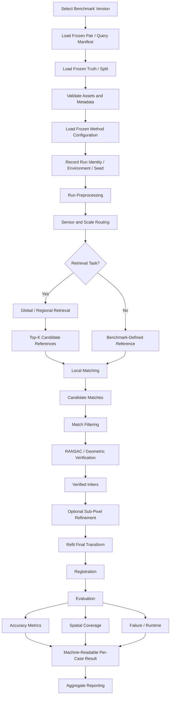
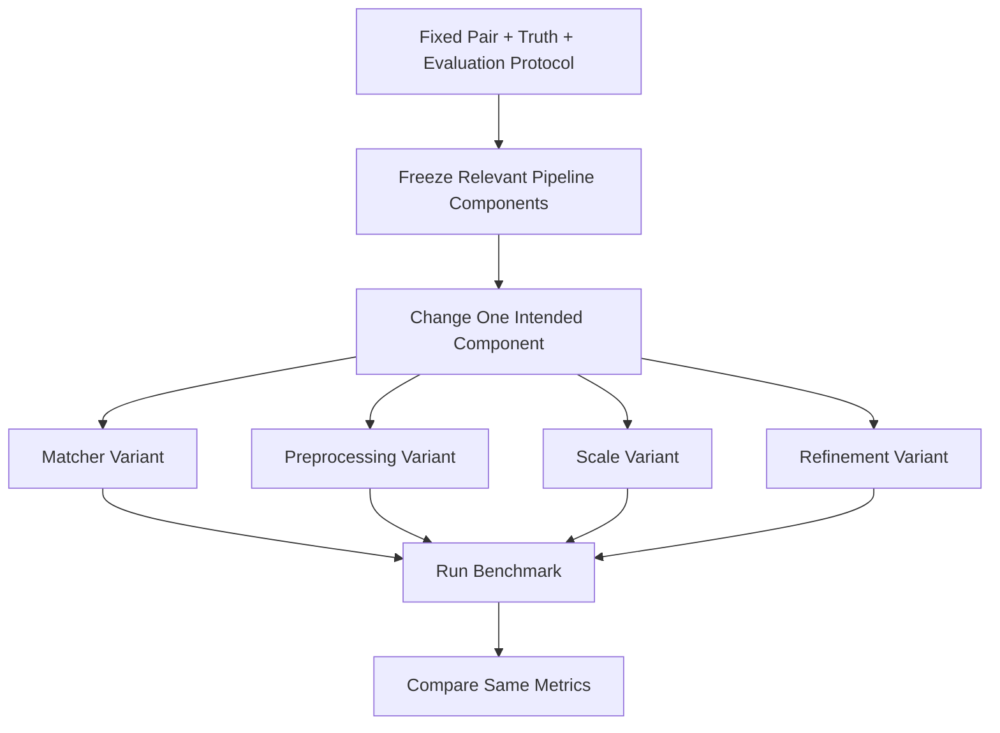

# Benchmark Protocol

ChandraMap uses a formal benchmark protocol so that changes to image correspondence, retrieval, registration, preprocessing, scale handling, geometric verification, and refinement can be compared under controlled scientific conditions.

The benchmark protocol defines **how experiments are run**, not merely which metrics are displayed afterward.

> **A benchmark is not a collection of impressive examples; it is a frozen experiment whose rules remain constant while the method under test changes.**

The core fairness rule is:

> **Compare methods on the same scientific problem, with the same data, truth, coordinate conventions, and evaluation protocol.**

For component-level experiments:

> **Change one intended variable at a time when performing a component ablation.**

For geometric evaluation:

> **The points used to fit the transformation must not be the only points used to evaluate it.**

For failures:

> **Failure remains part of the benchmark.**

For retrieval:

> **Retrieval and registration must be benchmarked separately before combined end-to-end evaluation.**

For reproducibility:

> **A benchmark version is immutable once published or used for reproducible comparison.**

For development discipline:

> **Do not optimize the final test benchmark during development.**

A valid ChandraMap benchmark should make it possible for another contributor to determine:

- exactly which lunar data were used;
- which benchmark version was used;
- which source/reference pair or retrieval query was evaluated;
- which truth was used;
- which algorithm configuration was used;
- which variables were held constant;
- which variable was changed;
- which metrics were computed;
- which units and coordinate spaces those metrics use;
- which cases failed;
- how runtime was measured;
- whether the result can be reproduced.

---

## 1. Protocol Objectives

The benchmark protocol exists to provide:

- fair method comparison;
- reproducible experiments;
- controlled ablations;
- scientifically valid accuracy measurement;
- regression detection;
- version-to-version comparison;
- explicit failure reporting;
- sensor-aware interpretation;
- research traceability;
- long-term comparability.

The protocol should prevent common evaluation failures such as:

- comparing algorithms on different image pairs;
- tuning each method independently on the final test cases;
- evaluating a transformation only on the points used to fit it;
- dropping failed pairs;
- changing metric definitions between runs;
- comparing pixel errors from incompatible image scales;
- mixing retrieval and registration metrics;
- treating visually attractive overlays as quantitative evidence.

---

## 2. Scope

This protocol covers the scientific procedure for evaluating:

- known-overlap local registration;
- regional/global reference retrieval;
- end-to-end retrieval plus local registration;
- preprocessing ablations;
- illumination-handling ablations;
- scale-pyramid ablations;
- matcher ablations;
- match-filtering ablations;
- robust-estimation and transform-model ablations;
- sub-pixel-refinement ablations;
- sensor-specific stress cases;
- runtime and efficiency;
- failure behavior;
- benchmark versioning;
- result provenance.

This protocol does **not** completely define:

- mission-data acquisition;
- data licensing;
- dataset preparation;
- ground-truth annotation procedure;
- algorithm implementation internals;
- software APIs;
- storage schemas.

Those responsibilities are documented elsewhere in ChandraMap.

---

# Benchmark Terminology

## 3. Benchmark Protocol

A **benchmark protocol** is the documented set of rules governing:

- benchmark data;
- truth;
- splits;
- execution;
- metrics;
- failure handling;
- comparison procedure.

---

## 4. Benchmark Run

A **benchmark run** is one execution of a defined method and configuration against:

- one benchmark pair;
- one query;
- or an entire benchmark suite.

A run should have a distinct identity whenever scientifically relevant configuration changes.

---

## 5. Benchmark Pair

A **benchmark pair** is a frozen source/reference case with associated:

- asset identities;
- metadata;
- sensor identities;
- representations;
- overlap information;
- scale information;
- truth;
- benchmark categories;
- pair version.

---

## 6. Benchmark Suite

A **benchmark suite** is a defined collection of benchmark pairs or retrieval queries evaluated under one protocol.

---

## 7. Benchmark Version

A **benchmark version** identifies one immutable definition of:

- pair/query set;
- truth version;
- category assignments;
- split definitions;
- metric semantics;
- success/failure rules;
- protocol version.

---

## 8. Baseline

A **baseline** is a simple, reproducible comparison method.

A conceptual early ChandraMap baseline may be:

```text
Prepared Pair
→ SIFT
→ Descriptor Matching
→ Match Filtering
→ RANSAC
→ Affine or Homography
→ Residual Evaluation
```

The authoritative V1 scope determines exact baseline implementation details.

A baseline should be reasonable and reproducible. It should not be intentionally weakened.

---

## 9. System Benchmark

A **system benchmark** compares complete pipelines.

Multiple components may differ simultaneously.

For example:

```text
Baseline Pipeline
vs.
Improved ChandraMap Pipeline
```

A system benchmark measures complete-system behavior but cannot by itself identify which individual component caused the difference.

---

## 10. Component Ablation

A **component ablation** changes one intended component while keeping other relevant variables fixed.

Examples:

- matcher only;
- scale strategy only;
- illumination representation only;
- transform model only;
- refinement only.

---

## 11. Development Set

The **development set** is used for:

- implementation work;
- debugging;
- threshold exploration;
- preliminary experiments.

---

## 12. Validation Set

The **validation set** is used for:

- configuration selection;
- model selection;
- preprocessing selection;
- threshold selection.

---

## 13. Test Set

The **test set** is held out for final reporting.

It should not become an iterative tuning set.

---

## 14. Fit / Control Point

A **fit point** or **control point** participates in transformation estimation.

---

## 15. Check / Evaluation Point

A **check point** or **evaluation point** is held out from transformation estimation and used for independent evaluation.

---

## 16. Failure

A **failure** is a benchmark case where the configured pipeline cannot produce the valid output required by the benchmark protocol.

Failure criteria must be benchmark-defined.

---

## 17. Stress Case

A **stress case** is a benchmark case deliberately selected to evaluate a difficult condition such as:

- large scale difference;
- strong illumination difference;
- cross-modality matching;
- weak texture;
- repetitive terrain;
- difficult geometry.

---

# Benchmark Task Families

## 18. Task A — Known-Overlap Local Registration

In this task, source and reference imagery are independently known to overlap.

The purpose is to evaluate:

- preprocessing;
- scale handling;
- local matching;
- match filtering;
- RANSAC;
- transformation estimation;
- sub-pixel refinement;
- registration;
- residual error;

without confounding the result with global retrieval.

This should be the preferred first benchmark family for V1.

Conceptually:

```text
Known Source / Reference Pair
        ↓
Preprocessing
        ↓
Scale Handling
        ↓
Local Matching
        ↓
Filtering
        ↓
RANSAC
        ↓
Transform
        ↓
Registration
        ↓
Independent Evaluation
```

---

## 19. Task B — Global / Regional Retrieval

The exact reference tile is not directly supplied.

The system returns:

```text
Top-K candidate reference regions
```

Retrieval may be evaluated using:

- `Recall@1`;
- `Recall@K`;
- retrieval latency;
- retrieval failure rate.

`K` is benchmark-defined.

Registration RMSE is not itself a retrieval metric.

---

## 20. Task C — Retrieval + Local Registration

This is an end-to-end task:

```text
Source Query
→ Retrieval
→ Top-K Candidates
→ Local Correspondence
→ Geometric Verification
→ Registration
→ Evaluation
```

This measures whole-system behavior.

It should not replace separate:

- retrieval benchmarks;
- known-overlap local-registration benchmarks.

Those isolated tasks are required to diagnose where end-to-end failures occur.

---

## 21. Task D — Representation / Preprocessing Ablation

Use the same:

- parent pair;
- reference scale;
- matcher;
- geometry;
- truth;

where technically valid.

Change only the targeted representation or preprocessing choice.

Examples include:

- minimally prepared intensity;
- normalized representation;
- structural representation;
- IIRS selected-band representation;
- IIRS PCA-derived representation.

---

## 22. Task E — Scale Ablation

Use the same pair and downstream method while changing reference-scale strategy.

Potential variants include:

- native reference;
- GSD-aware selected level;
- neighboring levels;
- multi-level search;
- coarse-to-fine strategy.

Only implemented/configured variants should be benchmarked.

---

## 23. Task F — Matcher Ablation

Possible methods include:

- SIFT;
- ALIKED + LightGlue;
- LoFTR;
- RIFT;
- CFOG-style methods.

Only compare methods on cases where their input assumptions are appropriately satisfied.

Do not rank these methods in documentation before benchmark evidence exists.

---

## 24. Task G — Geometric Model Ablation

A controlled experiment may compare:

```text
Affine
vs.
Homography
```

using equivalent correspondence inputs and truth where technically valid.

Model comparison should emphasize independent check-point error rather than fit residual alone.

---

## 25. Task H — Sub-Pixel Refinement Ablation

Compare:

```text
No Explicit Refinement
```

against:

```text
Verified-Inlier Refinement
→ Final Transform Refit
```

using the same independent check points.

---

# Benchmark Hierarchy

## 26. Conceptual Hierarchy

```text
Benchmark Protocol
        ↓
Benchmark Version
        ↓
Benchmark Suite
        ↓
Benchmark Category
        ↓
Benchmark Pair / Query
        ↓
Run Configuration
        ↓
Benchmark Run
        ↓
Result Record
```

Each level has a different responsibility.

---

## 27. Benchmark Version

A benchmark version should identify:

- pair/query set;
- truth version;
- split definitions;
- benchmark categories;
- metric definitions;
- protocol version.

Exact naming syntax belongs to repository conventions.

---

## 28. Benchmark Suite

Conceptual suites may eventually include:

- local-registration suite;
- scale-stress suite;
- illumination-stress suite;
- multimodal/IIRS suite;
- retrieval suite.

These names are conceptual unless explicitly established elsewhere in the repository.

---

## 29. Benchmark Category

A category groups cases sharing a scientifically meaningful evaluation characteristic.

Examples may include:

- scale stress;
- illumination stress;
- modality stress;
- geometry stress;
- low-feature terrain;
- repetitive terrain.

A pair may belong to more than one category when justified.

---

## 30. Run Configuration

A run configuration defines the algorithm settings used for one experiment.

Relevant configuration may include:

- preprocessing;
- representation;
- reference level;
- matcher;
- filter policy;
- RANSAC settings;
- transform model;
- refinement;
- retrieval model/index configuration.

---

# Benchmark Pair Definition

## 31. Pair Documentation

Benchmark pairs should use the definitions in:

[`../datasets/pair-definition.md`](../datasets/pair-definition.md)

A pair should reference:

- source asset;
- reference asset;
- pair version;
- sensor pair;
- overlap status;
- source representation;
- reference representation;
- source/reference scale metadata;
- truth/check-point version;
- benchmark categories.

Large raster data should not be duplicated unnecessarily in the pair definition.

---

## 32. Known-Overlap Pair

For local registration, overlap must be independently established.

Known overlap means:

> the images cover at least part of the same lunar region.

It does **not** mean:

- they are already aligned;
- their projections are identical;
- their scale is identical;
- registration is guaranteed to succeed.

---

## 33. Retrieval Query

A retrieval benchmark should define:

- query/source asset;
- valid correct reference region or regions;
- reference database version.

The exact answer should not be passed directly to the retrieval algorithm.

---

## 34. Multiple Valid References

Overlapping reference tiles can make several retrieval outputs scientifically acceptable.

The benchmark truth should encode the acceptable set rather than forcing one arbitrary tile.

This is particularly important for:

- overlapping NAC tiles;
- multi-scale reference tiling;
- broad WAC context.

---

# Pair Selection

## 35. Representative Pair Selection

Benchmark suites should include diversity across:

- source sensors;
- reference sensors;
- GSD;
- terrain type;
- illumination;
- modality;
- scale ratio;
- viewing geometry;
- projection state.

Avoid constructing a benchmark from only visually easy cases.

---

## 36. Nominal Cases

Nominal cases help verify basic pipeline behavior.

They may contain:

- clearly established overlap;
- recognizable terrain structure;
- manageable scale difference;
- valid metadata;
- usable truth.

---

## 37. Stress Cases

Difficult cases should be intentionally represented when scientifically valid.

Potential stress dimensions include:

- large scale difference;
- strong illumination difference;
- cross-modality matching;
- weak texture;
- repetitive craters;
- relief;
- projection differences.

---

## 38. Failure-Oriented Cases

A strong benchmark should include cases expected to challenge the system.

A benchmark containing only known successful examples provides weak evidence about robustness.

---

# Benchmark Categories

## 39. Baseline Registration Category

Purpose:

> measure basic known-overlap local registration under controlled conditions.

Typical emphasis may include:

- SIFT;
- matcher filtering;
- RANSAC;
- simple global transform;
- independent check-point evaluation.

---

## 40. Scale Stress Category

Scale stress should use physical scale information rather than image dimensions alone.

Record where available:

- source GSD;
- reference effective GSD;
- selected pyramid level;
- scale-ratio definition.

See [`../algorithms/scale-pyramid.md`](../algorithms/scale-pyramid.md).

---

## 41. Illumination Stress Category

Pairs may be categorized by meaningful lighting differences when supported by metadata or controlled curation.

Potential metadata include:

- acquisition time;
- incidence angle;
- phase angle;
- solar direction.

Do not infer exact illumination geometry from image brightness alone.

See [`../algorithms/illumination-handling.md`](../algorithms/illumination-handling.md).

---

## 42. Modality Stress Category

This is especially important for:

```text
IIRS-derived 2D representation
↔
LRO reference imagery
```

Record:

- parent IIRS product;
- representation ID;
- representation method;
- relevant bands/components;
- preprocessing version.

---

## 43. Geometry Stress Category

Potential geometry challenges include:

- strong terrain relief;
- wider geographic extent;
- viewing-geometry differences;
- projection differences.

Do not classify a pair as geometry stress solely because its final residual is high.

---

## 44. Low-Feature Category

Smooth or weakly textured lunar regions may be included to stress:

- detector repeatability;
- descriptor distinctiveness;
- geometric support.

---

## 45. Repetitive-Terrain Category

Crater-rich or repetitive terrain is useful for testing:

- descriptor ambiguity;
- false candidate rejection;
- RANSAC robustness;
- false-consensus behavior.

---

# Sensor Context

## 46. OHRC

The Chandrayaan-2 **Orbiter High Resolution Camera (OHRC)** is a visible/panchromatic high-resolution source.

Project documentation commonly uses approximately:

> **~0.25–0.32 m/pixel**

depending on product/documentation.

Actual product metadata remains authoritative.

Benchmark interpretation should recognize that:

- a small OHRC pixel residual may correspond to relatively small physical displacement;
- illumination and terrain-geometry effects can become highly visible at fine sampling.

---

## 47. TMC-2

The Chandrayaan-2 **Terrain Mapping Camera-2 (TMC-2)** is commonly treated in current project planning as approximately:

> **~5 m/pixel**

Actual product metadata remains authoritative.

A TMC-2 pixel and an OHRC pixel do not represent the same physical lunar distance.

---

## 48. IIRS

The Chandrayaan-2 **Imaging Infrared Spectrometer (IIRS)** is a hyperspectral/imaging-infrared instrument.

Project-level approximations include:

- approximately ~80 m/pixel;
- approximately ~0.8–5.0 µm;
- roughly ~250–256 bands depending on product/documentation.

Actual product metadata remains authoritative.

Every IIRS benchmark must preserve the identity of the 2D registration representation being tested.

---

## 49. LRO NAC

The LROC **Narrow Angle Camera (NAC)** is a fine/local lunar reference.

Current project planning often treats NAC imagery as approximately:

> **~0.5–2 m/pixel**

depending on product/acquisition geometry.

Actual product metadata remains authoritative.

---

## 50. LRO WAC

The LROC **Wide Angle Camera (WAC)** provides broad/coarse lunar reference context.

Its scale is:

- product-dependent;
- mode-dependent;
- processing-dependent.

Do not assign one universal WAC GSD.

---

# Benchmark Splits

## 51. Why Splits Matter

If algorithm decisions are repeatedly optimized using the same pairs later reported as final benchmark results, performance can become optimistic.

Separate development roles whenever dataset size and research goals allow.

---

## 52. Development Split

The development split may be used for:

- coding;
- debugging;
- exploratory threshold selection;
- qualitative inspection.

---

## 53. Validation Split

The validation split may be used for:

- configuration selection;
- matcher selection;
- preprocessing selection;
- threshold tuning.

---

## 54. Test Split

The test split is reserved for final evaluation.

Once test evaluation begins, avoid iterative pair-specific tuning based on test outcomes.

---

## 55. No Universal Split Ratio

This protocol does not prescribe:

- `70/15/15`;
- `80/10/10`;
- any other fixed ratio.

Split design depends on:

- dataset size;
- geographic structure;
- parent-product relationships;
- benchmark objective.

---

# Leakage Prevention

## 56. Geographic Leakage

Lunar tiles can overlap heavily.

A random tile split can place nearly identical terrain in:

- development;
- validation;
- test.

Where independence is important, consider grouping by:

- geographic region;
- parent image;
- acquisition;
- other scientifically meaningful grouping.

---

## 57. Parent-Product Leakage

Multiple crops from the same mission product may be strongly correlated.

If the benchmark claims generalization beyond known products, those crops should not automatically be distributed across independent splits.

---

## 58. Synthetic Leakage

Synthetic transformations or augmentations derived from the same parent image remain related.

Do not automatically treat synthetic siblings as independent benchmark samples.

---

## 59. IIRS Representation Leakage

Different 2D representations derived from the same IIRS cube share one parent observation.

They should not be treated as unrelated samples unless the experiment explicitly tests representation choice.

---

## 60. Truth Leakage

Held-out check points must not be used to choose:

- matcher threshold;
- RANSAC threshold;
- transform model;
- refinement parameters;
- preprocessing settings;

for the final test benchmark.

---

# Ground Truth

## 61. Ground-Truth Preparation

Ground-truth preparation is defined in:

[`../datasets/ground-truth-preparation.md`](../datasets/ground-truth-preparation.md)

Potential truth sources include:

- official/challenge truth where scientifically appropriate;
- trusted geospatial information;
- independently verified manual correspondences;
- held-out check points;
- synthetic known transformations.

---

## 62. Algorithm Output Is Not Independent Truth

Do not use the following as independent truth:

- matcher output;
- match-filter output;
- RANSAC inliers;
- estimated transform;
- algorithm-generated registered output.

---

# Fit / Check Separation

## 63. Fit Points

Fit/control points are used to:

- estimate;
- refine;
- refit;

the transformation.

---

## 64. Check Points

Check/evaluation points are used to:

> independently test the final transformation.

They should not participate in the final fitting process.

---

## 65. Fundamental Separation Rule

> **A check point that participates in fitting is no longer independent for that run.**

---

## 66. No Universal Fit/Check Ratio

This protocol does not prescribe one numerical split.

The scientific objective is to obtain:

- enough fit points for stable transformation estimation;
- enough independent and spatially useful check points for meaningful evaluation.

---

# Spatial Distribution of Truth

## 67. Truth Coverage

Evaluation points should ideally cover the usable overlap rather than cluster in one small region.

---

## 68. Clustered Truth Limitation

A benchmark whose check points all surround one crater may measure that region well while providing weak evidence about:

- image edges;
- other terrain;
- scene-wide transformation behavior.

Truth coverage should therefore accompany error interpretation.

---

# Pre-Run Validation

## 69. Pair Validation

Before formal execution, verify:

- source asset is available;
- reference asset is available;
- pair version is valid;
- intended overlap is valid;
- required representations exist;
- required metadata exist;
- category assignments are valid;
- truth is available where required.

---

## 70. Truth Validation

Verify:

- coordinates are finite;
- points are in bounds;
- fit/check roles are explicit;
- coordinate spaces are known;
- crop/pyramid relationships are known;
- invalid truth points have been handled through a traceable truth revision.

---

## 71. Configuration Validation

Verify:

- method configuration can be loaded;
- required model weights exist;
- selected sensor route is supported;
- scale strategy is available;
- benchmark version is known;
- metric definitions are available.

---

# Test Run Freeze

## 72. Freeze Configuration Before Formal Test Execution

Once final test execution begins:

- do not change parameters per pair;
- do not swap algorithms after seeing individual failures;
- do not alter truth;
- do not alter metrics.

If configuration changes materially, create a new run/configuration identity.

---

## 73. No Manual Rescue

Do not manually:

- loosen a ratio threshold for one failed pair;
- change RANSAC threshold for one difficult pair;
- switch affine to homography after observing failure;
- select a different reference scale by hand;
- manually adjust the registered overlay.

An adaptive strategy is acceptable only when its rule is predefined and reproducible.

---

# Baseline Protocol

## 74. V1 Classical Baseline

A conceptual baseline is:

```text
Prepared Known-Overlap Pair
        ↓
Physical Scale Selection
        ↓
SIFT
        ↓
Descriptor Matching
        ↓
Match Filtering
        ↓
RANSAC
        ↓
Configured Affine / Homography Model
        ↓
Optional Refinement if Baseline Defines It
        ↓
Final Transform
        ↓
Independent Evaluation
```

No exact thresholds are prescribed here.

---

## 75. Why the Baseline Matters

The baseline provides:

- a reproducible starting point;
- debugging reference;
- regression reference;
- evidence for whether added complexity provides value.

---

## 76. Baseline Should Be Reasonable

Do not artificially weaken the baseline to make an improved method appear stronger.

A baseline should use:

- sensible implementation;
- documented configuration;
- fair input preparation.

---

# Improved-Pipeline Comparison

## 77. Improved System

An improved ChandraMap pipeline may eventually include:

- stronger sensor-specific preprocessing;
- GSD-aware pyramids;
- illumination-aware representations;
- ALIKED + LightGlue;
- LoFTR;
- remote-sensing matchers;
- sub-pixel refinement;
- retrieval;
- advanced geometry.

System-level comparisons may combine these components.

Component ablations should isolate them where possible.

---

## 78. Same-Pair Rule

> **Baseline and improved methods must be evaluated on the same benchmark pairs.**

Do not use:

- easier pairs for one algorithm;
- harder pairs for another.

---

## 79. Same-Truth Rule

Use the same:

- truth version;
- fit/check roles;
- check points;

for compared methods.

---

## 80. Same-Metric Rule

Use the same:

- metric definitions;
- coordinate spaces;
- units;
- success/failure semantics.

---

# System Benchmarks vs Component Ablations

## 81. System Comparison

A system comparison intentionally allows multiple components to differ.

For example:

```text
Classical V1 Pipeline
vs.
Advanced Multi-Stage Pipeline
```

It answers:

> How do the complete systems differ?

---

## 82. Component Ablation

A component ablation asks:

> What changes when this one component changes?

That requires tighter control.

---

# Matcher Ablation

## 83. Controlled Matcher Comparison

Change:

> matcher.

Hold constant where technically appropriate:

- benchmark pair;
- source/reference representations;
- scale strategy;
- geometric model;
- independent truth;
- metric definitions.

Filtering semantics may differ across matcher families because score definitions differ. Preserve scientifically equivalent intent rather than forcing incompatible score thresholds.

---

## 84. SIFT

SIFT is the classical baseline feature detector/descriptor.

Do not claim that it is inherently:

- Sun-angle invariant;
- multimodal invariant;
- lunar-specific.

See [`../algorithms/sift.md`](../algorithms/sift.md).

---

## 85. ALIKED + LightGlue

Correct roles:

```text
ALIKED
→ sparse feature detection and description

LightGlue
→ feature matching
```

LightGlue output remains candidate correspondence evidence until geometric verification.

---

## 86. LoFTR

LoFTR is detector-free correspondence estimation.

Its matches still require:

- geometric verification;
- independent registration evaluation.

---

## 87. RIFT / CFOG-Style Methods

These are research candidates relevant to multimodal/remote-sensing correspondence.

Their suitability for ChandraMap must come from benchmark evidence.

---

# Scale Ablation

## 88. Change the Scale Strategy

Possible variants may include:

- native reference;
- GSD-aware level;
- neighboring-level search;
- multi-level search;
- coarse-to-fine strategy.

Hold matcher, truth, and evaluation protocol constant where possible.

---

## 89. Use Physical Scale

Scale benchmarking should use:

- actual source GSD;
- actual or effective reference GSD.

Do not define scale from:

- image width;
- image height;
- model-input tensor dimensions;

alone.

---

## 90. Reference Pyramid Provenance

Record:

- reference product;
- pyramid level;
- effective GSD;
- parent representation;
- scale strategy.

---

## 91. Upsampling Does Not Improve Physical Resolution

If a coarse source is resized to larger dimensions for model compatibility:

> that does not increase its physical spatial resolution.

Model-input resizing and physical scale matching are different concepts.

---

# Illumination Ablation

## 92. Controlled Illumination Experiment

Change only the targeted illumination representation where possible.

Keep constant:

- pair;
- reference level;
- matcher;
- geometry;
- truth.

Candidate variants may include:

- baseline intensity;
- global normalization;
- local contrast processing;
- gradient/structural representation.

---

## 93. Illumination Metadata

Preserve available information such as:

- acquisition time;
- incidence angle;
- phase angle;
- solar direction.

Do not invent missing metadata.

---

## 94. Brightness Is Not Sun Geometry

A brighter image does not necessarily mean the same or different illumination geometry in a scientifically defined sense.

Shadow direction and surface relief matter.

---

# Preprocessing Ablation

## 95. Controlled Preprocessing Comparison

Keep constant:

```text
Pair
+ Scale
+ Matcher
+ Geometry
+ Truth
```

and change:

```text
Target Preprocessing Variable
```

Visual appearance alone is not sufficient evidence of improvement.

---

# Match-Filtering Ablation

## 96. Controlled Filtering Comparison

Possible variants may include:

- nearest-neighbor candidates;
- ratio filtering;
- mutual consistency;
- duplicate handling.

Hold constant where possible:

- matcher;
- pair;
- scale;
- transform model;
- truth.

Evaluate downstream:

- candidate retention;
- verified inliers;
- coverage;
- check RMSE;
- failure rate.

See [`../algorithms/match-filtering.md`](../algorithms/match-filtering.md).

---

# RANSAC and Transform Ablation

## 97. Controlled Robust-Estimation Comparison

Change:

- robust-estimation configuration;
- or geometric model.

Keep the candidate correspondence set constant where possible.

---

## 98. Geometric Model

Record whether the model is:

- affine;
- homography;
- another explicitly configured model.

Do not silently change model family across pairs.

---

## 99. RANSAC Threshold Context

A RANSAC residual threshold is incomplete without:

- numerical value;
- coordinate system;
- units;
- pyramid level.

The same numeric threshold means something different at different image scales.

See [`../algorithms/ransac.md`](../algorithms/ransac.md).

---

# Sub-Pixel Refinement Ablation

## 100. Correct Ordering

The benchmarked order should be:

```text
Candidate Matches
→ Match Filtering
→ RANSAC
→ Verified Inliers
→ Sub-Pixel Refinement
→ Final Transform Refit
→ Evaluation
```

---

## 101. Correct Evaluation Question

Do not evaluate refinement only by asking:

> Did fit residual decrease?

Instead ask:

> Did the final refined/refit transformation improve performance on the same held-out check points?

See [`../algorithms/subpixel-refinement.md`](../algorithms/subpixel-refinement.md).

---

# IIRS Benchmark Protocol

## 102. Representation Identity Is Mandatory

Every IIRS benchmark should record:

- parent IIRS product;
- 2D registration representation ID;
- representation method;
- selected bands/components where applicable;
- preprocessing version;
- source representation scale.

---

## 103. Representation Ablation

When comparing:

- selected band;
- PCA-derived representation;
- structural representation;

keep the following constant where technically valid:

- parent IIRS observation;
- reference;
- scale strategy;
- matcher;
- geometry;
- truth.

---

## 104. Do Not Treat the Full Cube as Ordinary Grayscale

An IIRS hyperspectral cube requires a documented 2D representation before ordinary 2D matching.

The full cube should remain preserved separately.

---

# Retrieval Benchmark Protocol

## 105. Freeze the Reference Database

A retrieval benchmark should identify the exact reference database definition, including where applicable:

- reference assets;
- tile set;
- pyramid levels;
- global descriptor method/version;
- vector-index version;
- metadata filters.

---

## 106. Freeze the Query Set

The retrieval query set must remain fixed within a benchmark version.

---

## 107. Retrieval Truth

For every query, define:

- acceptable correct region;
- or acceptable set of reference tiles.

Multiple overlapping reference tiles may be valid.

---

## 108. Recall@K

Conceptually:

$$
\mathrm{Recall@K}
=
\frac{
\text{queries with at least one correct result in Top-K}
}{
\text{evaluated retrieval queries}
}
$$

`K` is benchmark-defined.

Do not invent a universal value.

---

## 109. Recall@1

`Recall@1` is the special case where correctness is evaluated only at rank 1.

---

## 110. Retrieval Failure

If no acceptable reference appears within the benchmark's evaluated result set, record retrieval failure according to the protocol.

---

## 111. Retrieval Runtime

Where supported, distinguish:

- query descriptor generation;
- vector search;
- metadata filtering;
- candidate handoff;
- total online retrieval latency.

---

# Offline vs Online Retrieval Cost

## 112. Offline Cost

Potential offline work includes:

- reference preparation;
- tiling;
- global descriptor generation;
- vector-index construction.

---

## 113. Online Cost

Potential online work includes:

- query preprocessing;
- query descriptor generation;
- vector search;
- candidate ranking;
- local verification.

Do not silently mix offline preparation and online query latency.

---

# Local Registration Protocol

## 114. Input

For a known-overlap benchmark, supply:

- benchmark-defined source;
- benchmark-defined reference;
- required metadata;
- configured representations;
- independent truth.

Global retrieval should not run unless that task explicitly includes it.

---

## 115. Expected Outputs

A local registration run may produce:

- raw candidate matches;
- filtered candidates;
- verified inliers;
- transformation;
- refined correspondences where enabled;
- registered preview/raster where configured;
- residual metrics;
- coverage;
- runtime;
- status/failure information.

---

# End-to-End Protocol

## 116. Retrieval + Registration Execution

Conceptually:

```text
Query
→ Retrieval
→ Top-K Candidate References
→ Local Matching
→ Match Filtering
→ Geometric Verification
→ Final Transform
→ Registration
→ Independent Evaluation
```

---

## 117. Separate Failure Stages

End-to-end evaluation should distinguish:

- retrieval failure;
- local matching failure;
- RANSAC failure;
- transform failure;
- registration failure;
- evaluation unavailability.

Do not collapse all of these into:

```text
matching failed
```

---

# Metric Definitions

## 118. Candidate Count

Number of matcher-proposed correspondences before geometric verification.

---

## 119. Filtered Candidate Count

Number of candidates remaining after configured matcher-level filtering.

---

## 120. Verified Inlier Count

Number of correspondences accepted by geometric verification.

---

## 121. Inlier Ratio

A recommended conceptual definition is:

$$
\text{Inlier Ratio}
=
\frac{
N_{\text{verified inliers}}
}{
N_{\text{filtered candidates}}
}
$$

when filtered candidates are the RANSAC input.

If another denominator is used, label it explicitly.

---

## 122. Spatial Coverage

Coverage should use one clearly defined metric.

Possible approaches include:

- grid occupancy;
- convex-hull coverage.

Do not compare different coverage definitions under one unlabeled metric.

---

## 123. Fit RMSE

Fit RMSE is computed from correspondences used in transformation estimation.

It is a diagnostic metric.

It is not independent accuracy.

---

## 124. Check RMSE

Check RMSE is computed using independent held-out check points.

Where reliable truth exists, it is the preferred geometric registration metric.

---

## 125. Source-Pixel Error

Where mathematically valid, report final registration error first in the source image's pixel coordinate system.

This makes the error interpretable relative to the information captured by the source sensor.

---

## 126. Reference-Pixel Error

Reference-space error may also be reported.

Always identify:

- reference product;
- reference pyramid level;
- coordinate space;
- units.

---

## 127. Physical Ground Error

Ground-distance error may be reported only when supported by valid:

- product metadata;
- coordinate mapping;
- projection/geospatial geometry;
- truth.

Do not blindly multiply pixel RMSE by a generic approximate GSD.

---

## 128. Retrieval Recall

`Recall@K` applies to retrieval.

It should not be used as a registration-accuracy metric.

---

## 129. Runtime

A runtime metric must identify which pipeline stages it includes.

---

# Metric Units

## 130. Units Must Be Explicit

Valid examples include:

- OHRC pixels;
- TMC-2 pixels;
- IIRS representation pixels;
- NAC level-\(N\) pixels;
- metres where geospatially valid;
- seconds.

Avoid:

```text
RMSE = 0.8
```

without unit and coordinate context.

---

# Spatial Coverage

## 131. Why Coverage Matters

A high inlier count concentrated around one small crater can provide weaker scene-wide support than fewer well-distributed correspondences.

Therefore evaluate:

- count;
- geometry;
- coverage;

separately.

---

## 132. Truth Coverage

Independent check points should also be spatially useful.

Low check RMSE from one small cluster should not be generalized automatically to the entire overlap.

---

# Success Criteria

## 133. Benchmark-Defined Success

Success criteria belong to the benchmark version.

Potential concepts include:

- valid transform;
- sufficient geometric support;
- required coverage;
- independent error within benchmark-defined bounds.

No numeric thresholds are invented here.

---

## 134. No Universal Success Rule

Different tasks may require different definitions:

- OHRC registration;
- TMC-2 registration;
- IIRS registration;
- retrieval;
- end-to-end localization.

---

# Failure Policy

## 135. Failure Stages

Record the earliest or most informative observed failure stage, such as:

- input;
- preprocessing;
- representation;
- scale selection;
- retrieval;
- matching;
- filtering;
- geometric verification;
- transform estimation;
- refinement;
- registration;
- evaluation.

---

## 136. No Silent Fallback

Do not silently:

- switch matcher;
- switch transform model;
- loosen threshold;
- change reference scale;
- drop a difficult pair.

Any fallback must be preconfigured and reproducible.

---

## 137. Adaptive Pipelines

Adaptive behavior is allowed when the rule is defined before formal testing.

For example:

```text
Try Configured Reference Level
        ↓
Configured Failure Condition?
        ↓
Try Defined Neighboring Level
```

The algorithm must make the decision deterministically or according to a documented rule rather than manual intervention.

---

## 138. Failed Pairs Remain Visible

A failed pair should remain:

- in the per-pair result set;
- in the failure count;
- in the benchmark denominator where applicable.

Do not replace it with an easier pair.

---

# Randomness and Repeated Runs

## 139. Random Seeds

Record seeds where applicable for:

- RANSAC;
- stochastic sampling;
- neural inference/training where nondeterministic behavior matters;
- other randomized components.

If exact deterministic behavior is unavailable, document the limitation.

---

## 140. Repeated Runs

Stochastic methods may be evaluated using repeated runs where scientifically useful.

This protocol does not prescribe a universal repetition count.

---

## 141. Reporting Variation

When repeated runs exist, possible summaries include:

- mean;
- median;
- standard deviation;
- range.

Use only statistics justified by the data and experiment design.

---

# Hardware and Software Environment

## 142. Environment Recording

Where relevant, preserve:

- operating system;
- Python version;
- important dependency versions;
- CPU;
- GPU;
- accelerator/runtime;
- model version.

Do not fabricate unavailable environment data.

---

## 143. Runtime Fairness

A learned matcher executed on GPU and a classical matcher executed on CPU should not be compared as pure algorithmic runtime without clearly documenting the hardware difference.

---

## 144. Cold vs Warm Runs

If runtime depends heavily on:

- model loading;
- index loading;
- file cache;
- precomputed descriptors;

state whether timing reflects:

- cold execution;
- warm/cached execution.

---

# Benchmark Execution Procedure

## 145. Formal Run Sequence

A formal ChandraMap benchmark should conceptually follow this sequence:

1. Select the benchmark version.
2. Load the frozen pair/query manifest.
3. Validate source/reference assets.
4. Load the frozen truth/check-point version.
5. Validate coordinate conventions and scale metadata.
6. Load the method configuration.
7. Record algorithm/model/software versions.
8. Record environment/runtime context.
9. Set random seed where applicable.
10. Execute preprocessing.
11. Execute sensor/reference routing.
12. Execute physical scale preparation.
13. Execute retrieval if required by the task.
14. Execute local matching.
15. Record raw candidate count.
16. Execute match filtering.
17. Record filtered candidate count.
18. Execute RANSAC/geometric verification.
19. Record verified inliers and geometric status.
20. Perform optional verified-inlier sub-pixel refinement.
21. Refit the final transformation when refinement changes fit coordinates.
22. Produce registered output if required.
23. Compute fit diagnostics.
24. Evaluate held-out check points.
25. Compute spatial coverage.
26. Compute retrieval metrics where applicable.
27. Record runtime.
28. Record success or failure status.
29. Write a machine-readable per-case result.
30. Generate optional visual diagnostics.
31. Aggregate only after all expected per-case results are present.

This sequence may be implemented differently in software, but the scientific stage boundaries should remain traceable.

---

# No Manual Intervention

## 146. Formal Benchmark Runs

During formal benchmark execution, avoid:

- manually deleting matches;
- manually moving an overlay;
- manually selecting a better transform after seeing results;
- manually changing threshold values for one pair;
- manually replacing one retrieval result.

---

## 147. Debug and Exploratory Runs

Manual intervention is acceptable during:

- development;
- debugging;
- exploratory research.

Those results should be clearly labeled:

- debug;
- exploratory;
- non-benchmark.

Do not mix them into official benchmark summaries.

---

# Benchmark Manifest

## 148. Conceptual Manifest Responsibilities

A benchmark manifest should conceptually identify:

- benchmark ID;
- benchmark version;
- task;
- pair/query IDs;
- categories;
- split labels;
- truth versions;
- metric protocol;
- provenance.

The exact implemented schema belongs to repository contracts.

---

## 149. Illustrative Benchmark Definition

The following is an **illustrative conceptual structure — not an implemented schema**:

```yaml
benchmark:
  id: "PLACEHOLDER_BENCHMARK"
  version: "PLACEHOLDER_VERSION"

task: "local_registration"

pairs:
  - "PLACEHOLDER_PAIR_ID"

truth:
  version: "PLACEHOLDER_TRUTH_VERSION"

protocol:
  metrics:
    - "candidate_count"
    - "inlier_count"
    - "inlier_ratio"
    - "spatial_coverage"
    - "check_rmse"

  coordinate_space: "PLACEHOLDER_SPACE"
```

No exact benchmark schema, pair count, threshold, or scientific result is implied.

---

# Run Record

## 150. Conceptual Run Record

The following is also illustrative:

```yaml
run_id: "PLACEHOLDER_RUN"
benchmark_version: "PLACEHOLDER_BENCHMARK_VERSION"
pair_id: "PLACEHOLDER_PAIR"

method:
  matcher: "PLACEHOLDER_MATCHER"
  transform: "PLACEHOLDER_TRANSFORM"

configuration:
  id: "PLACEHOLDER_CONFIG"

result:
  status: "PLACEHOLDER_STATUS"
  candidate_count: "PLACEHOLDER_COUNT"
  inlier_count: "PLACEHOLDER_COUNT"
  check_rmse: "PLACEHOLDER_VALUE"
  units: "PLACEHOLDER_UNITS"
```

This is not a claim about the repository's implemented schema.

---

# Run Identity

## 151. What Creates a Distinct Run?

Material changes should normally produce a new run/configuration identity.

Examples include changes to:

- algorithm version;
- matcher;
- preprocessing;
- IIRS representation;
- scale strategy;
- filtering thresholds;
- RANSAC settings;
- transform model;
- refinement strategy;
- model weights.

---

# Result Immutability

## 152. Preserve Raw Run Outputs

Machine-generated benchmark results should preferably remain immutable.

Derived summaries may be regenerated from them.

Do not overwrite a failed or inferior run under the same run identity with a later improved result.

---

# Per-Pair Outputs

## 153. Required Scientific Visibility

Each benchmark case should preserve where applicable:

- pair/query identity;
- run status;
- candidate count;
- filtered count;
- inlier count;
- inlier ratio;
- coverage;
- error metrics;
- units;
- failure stage;
- runtime;
- warnings;
- diagnostic artifact references.

---

# Aggregate Reporting

## 154. Aggregate Only After Per-Case Results

Per-case results are the scientific source for aggregate statistics.

Do not keep only a final average.

---

## 155. Possible Aggregate Metrics

Where appropriate:

- success rate;
- failure rate;
- mean error;
- median error;
- runtime distribution;
- sensor-stratified metrics;
- category-stratified metrics.

---

# Failed Pairs in Aggregates

## 156. Successful-Pair Error

An average RMSE over successful cases can be reported if labeled clearly, for example:

> successful-case check RMSE

It must be accompanied by:

- success count/rate;
- failure count/rate.

---

## 157. Do Not Hide Failures in Error Aggregates

A method with:

- low RMSE on a few successful cases;
- many failures;

must not be represented only by its successful-case RMSE.

---

## 158. End-to-End Success Decomposition

For retrieval + registration, useful reporting may distinguish:

- retrieval success;
- local-registration success given acceptable retrieval;
- end-to-end success.

This helps identify the failing stage.

---

# Sensor-Stratified Reporting

## 159. Separate Sensor Results

Where enough cases exist, preserve separate results for:

- OHRC;
- TMC-2;
- IIRS.

Their pixel units and task difficulty differ substantially.

---

## 160. Pair-Type Stratification

Possible pair types include:

- OHRC ↔ NAC;
- OHRC ↔ WAC;
- TMC-2 ↔ NAC;
- TMC-2 ↔ WAC;
- IIRS ↔ NAC;
- IIRS ↔ WAC.

Do not force fundamentally different tasks into one unexplained aggregate metric.

---

# Stress-Stratified Reporting

## 161. Scale Stress

Report benchmark-defined scale-stress cases separately where useful.

---

## 162. Illumination Stress

Report valid illumination-stress cases separately.

Do not invent illumination labels where supporting metadata or curation does not exist.

---

## 163. Modality Stress

Keep IIRS and other multimodal cases identifiable.

---

## 164. Geometry Stress

Keep high-relief, projection-difficult, or viewing-difference cases identifiable when categories are supported.

---

# Regression Testing

## 165. Benchmark as Regression Guard

A stable benchmark version can reveal:

- increased registration error;
- decreased coverage;
- increased failure rate;
- runtime regression;
- sensor-route regression.

---

## 166. Regression Requires Context

A changed result is not automatically a software bug.

The difference may result from an intentional change to:

- algorithm;
- preprocessing;
- benchmark definition;
- truth;
- metric semantics.

Version provenance is required to interpret the change.

---

# Statistical Reporting

## 167. Sample Size

Aggregate statistics should identify the number of:

- benchmark pairs;
- retrieval queries;
- successful cases;
- failed cases.

---

## 168. Small Samples

When the benchmark is small:

- avoid strong generalization claims;
- emphasize per-case behavior;
- describe limitations.

---

## 169. Confidence Intervals

Confidence intervals or similar statistical summaries should only be used when:

- sample size;
- repeated measurements;
- assumptions;

make them meaningful.

Do not add statistical decoration unsupported by the data.

---

# Benchmark Table Templates

## 170. Local Registration

| Pair      | Sensor Pair          | Matcher  | Scale Strategy | Transform | Candidates | Inliers | Inlier Ratio | Coverage | Check RMSE | Units | Runtime | Status |
| --------- | -------------------- | -------- | -------------- | --------- | ---------: | ------: | -----------: | -------: | ---------: | ----- | ------: | ------ |
| `PAIR_ID` | `SOURCE ↔ REFERENCE` | `METHOD` | `SCALE`        | `MODEL`   |          — |       — |            — |        — |          — | —     |       — | —      |

Only measured values should populate the table.

---

## 171. Retrieval

| Query      | Source Sensor | Reference Set   | Recall@1 | Recall@K | Retrieval Runtime | Local Verification | Status |
| ---------- | ------------- | --------------- | -------: | -------: | ----------------: | ------------------ | ------ |
| `QUERY_ID` | `SENSOR`      | `REFERENCE_SET` |        — |        — |                 — | —                  | —      |

`K` must be defined by the benchmark.

---

## 172. Component Ablation

| Pair      | Variant   | Changed Component | Check RMSE | Coverage | Runtime | Status |
| --------- | --------- | ----------------- | ---------: | -------: | ------: | ------ |
| `PAIR_ID` | `VARIANT` | `COMPONENT`       |          — |        — |       — | —      |

No benchmark values should be invented.

---

# Visual Diagnostics

## 173. Optional Artifacts

Formal runs may generate:

- candidate-match visualization;
- filtered-match visualization;
- inlier/outlier visualization;
- registered overlay;
- residual-vector plot;
- residual histogram;
- coverage plot;
- Top-K retrieval preview.

---

## 174. Visuals Are Supporting Evidence

Do not choose a preferred method because:

> its overlay looks best.

Visual outputs support:

- debugging;
- interpretation;
- communication.

The benchmark comparison should remain based on defined metrics and failure policy.

---

# Versioning Model

## 175. Distinguish Version Types

Keep the following concepts separate:

| Version                  | Meaning                                     |
| ------------------------ | ------------------------------------------- |
| Dataset version          | Prepared scientific data state              |
| Pair version             | Source/reference pair definition            |
| Truth version            | Independent evaluation truth                |
| Benchmark version        | Frozen suite, splits, metrics, and protocol |
| Algorithm version        | Method implementation                       |
| Model version            | Learned weights/checkpoint where applicable |
| Configuration ID/version | Parameter selection                         |
| Run ID                   | One execution                               |

These identities should not be treated as interchangeable.

---

# Benchmark Change Policy

## 176. Published Benchmark Immutability

Once a benchmark version has been used for reproducible comparison, materially changing its:

- pair list;
- truth;
- splits;
- metric semantics;
- success criteria;

should produce a new version.

---

## 177. Corrections

If an error is discovered in:

- pair definition;
- truth;
- metadata;
- metric implementation;
- category assignment;

document:

- what changed;
- why;
- which benchmark versions are affected.

Do not silently rewrite previous benchmark history.

---

# Versioned Benchmark Scope

## 178. V1 Benchmark Protocol

V1 should remain small, controlled, and rigorous.

A conceptual V1 scope is:

- known-overlap local registration;
- a small real benchmark suite;
- OHRC and/or TMC-2 source cases where validated data exist;
- suitable LRO reference imagery;
- SIFT baseline;
- match filtering;
- RANSAC;
- simple configured transformation;
- registered preview;
- independent check-point evaluation where truth exists;
- candidate count;
- filtered candidate count;
- inlier count;
- inlier ratio;
- spatial coverage;
- source-space error where valid;
- runtime;
- explicit failure status.

The primary goal is:

> **prove one complete and reproducible scientific registration pipeline before increasing benchmark complexity.**

Global retrieval does not need to be mandatory in V1.

---

## 179. V2 Benchmark Protocol

Possible V2 additions include:

- larger known-overlap suite;
- stronger scale stress;
- illumination stress;
- IIRS-derived representation benchmarks;
- preprocessing ablations;
- transform-model ablations;
- sub-pixel-refinement ablations;
- stronger residual analysis.

---

## 180. V3 Benchmark Protocol

Possible V3 additions include:

- global retrieval;
- `Recall@K`;
- WAC/NAC coarse-to-fine search;
- ALIKED + LightGlue;
- LoFTR;
- multi-scale reference search;
- Top-K local verification;
- end-to-end retrieval + registration;
- richer runtime/resource reporting.

---

## 181. V4 Benchmark Protocol

Possible research additions include:

- RIFT/CFOG-style multimodal methods;
- lunar-specific learned models;
- Kaguya/SELENE and other missions;
- DEM-aware geometry;
- terrain-conditioned evaluation;
- uncertainty-aware evaluation;
- cross-mission generalization;
- larger statistically meaningful research suites.

These are research directions, not claims of current implementation.

Authoritative version specifications remain definitive.

---

# Main Benchmark Workflow

## 182. End-to-End Protocol Flow



---

# Controlled Ablation Flow

## 183. One-Variable-at-a-Time Principle



Not every experiment must use every branch. The principle is to isolate the intended variable.

---

# Retrieval / Registration Separation

## 184. Separate Metric Paths

```mermaid
flowchart TD
    A[Query] --> B[Retrieval]
    B --> C[Top-K Candidates]

    C --> D[Retrieval Evaluation]
    D --> E[Recall@K]

    C --> F[Candidate Reference]
    F --> G[Local Registration]
    G --> H[Registration Evaluation]
    H --> I[Check RMSE / Coverage / Failure]
```

> **Recall@K is not registration RMSE, and registration RMSE is not a retrieval metric.**

---

# Benchmark Quality-Control Checklist

## 185. Before Running

- [ ] Benchmark version is frozen.
- [ ] Pair/query manifest is frozen.
- [ ] Truth version is frozen.
- [ ] Split labels are frozen.
- [ ] Source/reference identities are valid.
- [ ] Representation identities are valid.
- [ ] Coordinate conventions are known.
- [ ] Reference scale/pyramid levels are known.
- [ ] Algorithm configuration is frozen.
- [ ] Model/checkpoint version is known where applicable.
- [ ] Metric definitions are frozen.
- [ ] Success/failure protocol is known.
- [ ] Random-seed policy is known.
- [ ] Runtime/hardware policy is recorded.
- [ ] No final-test tuning is planned.

---

## 186. During Running

- [ ] No undocumented manual intervention occurs.
- [ ] Failures are recorded.
- [ ] Adaptive fallback follows predefined rules.
- [ ] Candidate counts are preserved.
- [ ] Filtered counts are preserved.
- [ ] Inlier counts are preserved.
- [ ] Timing boundaries remain consistent.
- [ ] Warnings are preserved.
- [ ] Transform direction and coordinate spaces remain known.
- [ ] Check points remain outside fitting.

---

## 187. After Running

- [ ] Every expected case has a result record.
- [ ] Failed cases remain present.
- [ ] Metric units are present.
- [ ] Coordinate spaces are recorded.
- [ ] Fit/check metrics remain separate.
- [ ] Inlier-ratio denominator is known.
- [ ] Coverage is recorded where required.
- [ ] Invalid metrics are not silently averaged.
- [ ] Aggregate counts agree with per-case results.
- [ ] Artifact references correspond to the correct run.
- [ ] Run/configuration identity is preserved.
- [ ] Environment context is available where required.

---

# Relationship to Evaluation Overview

## 188. [`README.md`](README.md)

`docs/evaluation/README.md` defines the broader:

- evaluation philosophy;
- metric landscape;
- interpretation rules;
- scientific evidence model.

This document defines:

> **the controlled procedure used to execute fair and reproducible benchmark comparisons.**

The two documents should complement rather than duplicate one another.

---

# Relationship to Dataset Documentation

## 189. [`../datasets/README.md`](../datasets/README.md)

Datasets provide validated scientific assets used by benchmark definitions.

---

## 190. [`../datasets/metadata.md`](../datasets/metadata.md)

Benchmark interpretation depends on metadata such as:

- mission/instrument;
- GSD;
- projection;
- acquisition context;
- product identity;
- representation identity.

---

## 191. [`../datasets/dataset-preparation.md`](../datasets/dataset-preparation.md)

Benchmarks should consume prepared and validated assets rather than silently modifying raw mission data during evaluation.

---

## 192. [`../datasets/pair-definition.md`](../datasets/pair-definition.md)

Pair definitions establish the scientific source/reference relationship used by the benchmark.

---

## 193. [`../datasets/ground-truth-preparation.md`](../datasets/ground-truth-preparation.md)

This is a critical dependency.

The benchmark protocol must respect:

- truth provenance;
- fit/check roles;
- coordinate conventions;
- truth version.

---

# Relationship to Algorithm Documentation

## 194. [`../algorithms/overview.md`](../algorithms/overview.md)

Defines the overall ChandraMap algorithm stack.

The benchmark protocol controls how that stack is evaluated rather than redefining its internals.

---

## 195. [`../algorithms/sensor-routing.md`](../algorithms/sensor-routing.md)

Benchmark records should retain which sensor-processing route was used.

---

## 196. [`../algorithms/preprocessing.md`](../algorithms/preprocessing.md)

Changes to preprocessing should be evaluated through controlled ablations.

---

## 197. [`../algorithms/illumination-handling.md`](../algorithms/illumination-handling.md)

Illumination robustness should be measured on controlled stress cases rather than assumed.

---

## 198. [`../algorithms/scale-pyramid.md`](../algorithms/scale-pyramid.md)

Reference-scale selection must remain part of benchmark provenance.

---

## 199. [`../algorithms/sift.md`](../algorithms/sift.md)

Defines the classical SIFT baseline path.

---

## 200. [`../algorithms/matching.md`](../algorithms/matching.md)

Defines candidate correspondence generation.

---

## 201. [`../algorithms/match-filtering.md`](../algorithms/match-filtering.md)

Defines pre-geometric candidate filtering.

Benchmark reporting should distinguish raw candidates from filtered candidates.

---

## 202. [`../algorithms/ransac.md`](../algorithms/ransac.md)

Defines robust geometric verification.

RANSAC inliers remain algorithm outputs, not independent truth.

---

## 203. [`../algorithms/transforms.md`](../algorithms/transforms.md)

Defines transform models and coordinate semantics.

Benchmark model comparison should use independent evaluation where available.

---

## 204. [`../algorithms/subpixel-refinement.md`](../algorithms/subpixel-refinement.md)

Refinement should be evaluated before/after on the same held-out truth.

---

## 205. [`../algorithms/residual-analysis.md`](../algorithms/residual-analysis.md)

Defines fit/check residual semantics and error interpretation.

---

## 206. [`../algorithms/registration.md`](../algorithms/registration.md)

Defines the final registered output and its provenance.

This protocol defines how that output is benchmarked.

---

# Relationship to Sensor Documentation

## 207. Sensor References

Relevant documentation includes:

- [`../sensors/overview.md`](../sensors/overview.md)
- [`../sensors/ohrc.md`](../sensors/ohrc.md)
- [`../sensors/tmc2.md`](../sensors/tmc2.md)
- [`../sensors/iirs.md`](../sensors/iirs.md)
- [`../sensors/lro-nac.md`](../sensors/lro-nac.md)
- [`../sensors/lro-wac.md`](../sensors/lro-wac.md)

Benchmark interpretation must respect what each sensor physically measures.

---

# Relationship to Project Documentation

## 208. Project Scope

Related project paths to consult when present include:

- `../project/goals.md`
- `../project/non-goals.md`
- `../project/v1-scope.md`
- `../project/terminology.md`
- `../project/assumptions.md`
- `../project/limitations.md`

Authoritative scope/version documentation remains definitive.

---

# Relationship to Architecture

## 209. Architecture Documentation

Related architecture paths to consult when present include:

- `../architecture/system-overview.md`
- `../architecture/v1-pipeline.md`
- `../architecture/core-engine-architecture.md`
- `../architecture/module-map.md`
- `../architecture/data-flow.md`
- `../architecture/output-flow.md`

Architecture defines:

- how benchmark execution is wired;
- where manifests/configurations live;
- where results flow.

This document defines the scientific benchmark procedure.

---

# Repository-Level Benchmark Infrastructure

## 210. Root `benchmarks/`

If a root-level `benchmarks/` directory exists, it should hold frozen/executable benchmark definitions according to repository architecture.

Large mission imagery should not be duplicated there unnecessarily.

---

## 211. Root `experiments/`

If a root-level `experiments/` directory exists, it may contain:

- run configurations;
- component ablations;
- research experiment definitions.

Experiments should consume frozen benchmark definitions rather than silently redefine truth.

---

## 212. Root `results/`

If a root-level `results/` directory exists, it should contain generated benchmark outputs.

Results remain downstream artifacts.

Previous algorithm predictions must not silently become new ground truth.

---

# Data Licensing

## 213. [`../data-licenses.md`](../data-licenses.md)

Benchmark definitions can be open source while underlying mission data remain governed by external provider terms.

Do not assume mission imagery can be redistributed merely because ChandraMap software is open source.

Benchmark manifests should prefer references/provenance over unnecessary duplication of externally governed imagery.

---

# Reproducibility Standard

## 214. A Reproducible Benchmark Run Should Answer

A future contributor should be able to determine:

- Which benchmark version was used?
- Which pair or query was evaluated?
- Which source/reference assets were used?
- Which representations were used?
- Which truth version was used?
- Which split was used?
- Which preprocessing configuration was used?
- Which reference scale was used?
- Which matcher was used?
- Which filtering policy was used?
- Which RANSAC settings were used?
- Which transform model was used?
- Was sub-pixel refinement enabled?
- Which model/checkpoint version was used?
- Which software revision was used?
- Which random seed policy applied?
- Which hardware/runtime environment was used?
- Which metrics were calculated?
- What coordinate spaces and units were used?
- Did the run succeed or fail?
- Which artifacts were generated?

---

# Benchmark Anti-Patterns

## 215. Do Not

Do not:

- compare algorithms on different image pairs;
- use easy cases for one method and difficult cases for another;
- tune thresholds on the final test set;
- manually modify a failed pair after seeing the result;
- exclude failures silently;
- use RANSAC inliers as ground truth;
- evaluate only on fit points while claiming independent accuracy;
- report fit RMSE as independent test RMSE;
- change truth between comparable runs;
- change metric definitions without versioning;
- compare raw pixel RMSE across sensors without context;
- compare raw pyramid-level pixels as equivalent;
- use approximate generic GSD blindly for metre conversion;
- treat model-input resizing as physical scale normalization;
- feed an IIRS cube directly to an ordinary 2D matcher without representation;
- use `Recall@K` as registration error;
- use registration RMSE as retrieval recall;
- rank algorithms from one example;
- tune every test pair manually;
- manually adjust registered output;
- hide randomness or configuration;
- mix cached and uncached runtime silently;
- report undefined accuracy percentages;
- overwrite benchmark history silently.

---

# Claims ChandraMap Should Avoid

## 216. Unsupported Benchmark Claims

Do not claim without appropriate benchmark evidence:

- "95% accurate."
- "99% matching accuracy."
- "Illumination invariant."
- "Scale invariant."
- "Sub-pixel accurate."
- "Sub-metre accurate."
- "LightGlue is better than SIFT."
- "LoFTR is better than LightGlue."
- "RIFT is best for lunar imagery."
- "Homography is the best transform."
- "Our method never fails."
- "More matches mean better registration."
- "Higher inlier ratio means better geolocation."
- "Top-1 retrieval means correct registration."
- "One benchmark pair proves generalization."
- "Synthetic performance proves real lunar performance."

---

# Limitations

## 217. Real Lunar Truth Can Be Limited

High-quality independent correspondence truth may be difficult to create for some lunar sensor combinations.

---

## 218. Manual Truth Has Uncertainty

Manual correspondence identification can be affected by:

- resolution;
- illumination;
- modality;
- terrain ambiguity.

Ground truth is not infinitely precise.

---

## 219. Small Suites Limit Statistical Power

Early ChandraMap versions may contain relatively small benchmark suites.

Their conclusions should be correspondingly cautious.

---

## 220. Sensor Availability Can Affect Balance

Available OHRC, TMC-2, IIRS, NAC, and WAC products may not permit perfectly balanced benchmark categories.

---

## 221. Sensor Scales Differ Strongly

OHRC, TMC-2, and IIRS represent very different physical sampling scales.

Raw pixel metrics should not be interpreted as directly equivalent.

---

## 222. IIRS Adds Modality Complexity

IIRS evaluation depends on the chosen 2D representation and remains a cross-modality problem.

---

## 223. Illumination Metadata May Be Incomplete

Some benchmark pairs may not provide every desired illumination-geometry field.

Do not invent missing values.

---

## 224. Benchmark Categories Can Overlap

A pair may simultaneously exhibit:

- scale stress;
- illumination stress;
- repetitive terrain.

Category-level conclusions should account for this overlap.

---

## 225. No Benchmark Represents All Lunar Terrain

Benchmark conclusions apply to the evaluated data distribution.

Do not generalize beyond the documented scope without additional evidence.

---

## 226. Runtime Depends on Environment

CPU, GPU, software versions, caching, and I/O can materially affect timing.

---

## 227. Retrieval Database Size Matters

Retrieval metrics and latency can depend on:

- tile count;
- scale count;
- index design;
- geographic coverage.

Record retrieval database version/context.

---

## 228. Advanced Physical Truth May Not Exist Yet

DEM-aware or sensor-model-level truth may not be available for early benchmarks.

Do not fabricate advanced geometric validation.

---

## 229. Protocol Maturity Will Evolve

As ChandraMap expands into:

- learned retrieval;
- additional sensors;
- DEM-aware geometry;
- multi-mission benchmarks;

the protocol may require new versions.

---

## 230. Conclusions Are Version-Specific

Every benchmark claim applies only to its documented:

- benchmark version;
- data;
- truth;
- algorithm/configuration;
- evaluation protocol.

---

# Authoritative and Primary Reference Categories

## 231. Mission and Sensor Context

Prefer authoritative resources including:

- ISRO Chandrayaan-2 documentation;
- ISRO / ISSDC / PRADAN;
- NASA Lunar Reconnaissance Orbiter documentation;
- LROC / Arizona State University;
- NASA Planetary Data System.

---

## 232. Computer Vision

Relevant authoritative or primary categories include:

- OpenCV documentation;
- primary RANSAC literature;
- feature-matching literature;
- image-registration literature;
- geometric-transformation literature.

---

## 233. Learned Matching

Relevant primary resources include:

- official LightGlue repository/documentation;
- ALIKED publication/repository;
- LoFTR publication/repository.

These describe the methods.

They do not establish ChandraMap lunar performance by themselves.

---

## 234. Remote Sensing

Relevant primary research categories include:

- RIFT literature;
- CFOG-related literature;
- multimodal remote-sensing registration literature.

---

## 235. Planetary and Geospatial Processing

Relevant authoritative resource categories include:

- USGS ISIS;
- planetary image-coregistration resources;
- planetary control-network resources;
- planetary photogrammetry/cartography references;
- GDAL documentation where relevant.

---

# Benchmark Protocol Principles

## 236. Same Scientific Problem

Use the same data and truth when comparing methods.

---

## 237. Change One Intended Variable for Ablations

Avoid confounded conclusions.

---

## 238. System Comparisons May Change Multiple Components

Label them clearly as system comparisons.

---

## 239. Fit and Check Points Stay Separate

Independent evaluation requires held-out evidence.

---

## 240. RANSAC Inliers Are Not Truth

They are algorithm-generated geometric consensus.

---

## 241. Failures Remain Visible

Do not remove difficult unsuccessful cases.

---

## 242. Source-Space Error Comes First

Physical conversion remains conditional.

---

## 243. Sensor Pixels Are Not Equivalent

Always preserve sensor and scale context.

---

## 244. Record Pyramid Level

Reference-pixel metrics depend on reference level.

---

## 245. Retrieval and Registration Stay Separate

`Recall@K` and RMSE answer different questions.

---

## 246. Freeze the Test Configuration

No pair-specific manual rescue during formal benchmark execution.

---

## 247. Prevent Leakage

Pay special attention to:

- overlapping lunar terrain;
- parent products;
- synthetic siblings;
- IIRS representations;
- check-point truth.

---

## 248. Freeze Benchmark Versions

Do not silently modify benchmark contents after publication or reproducible use.

---

## 249. Record Randomness

Preserve seeds or nondeterminism context where applicable.

---

## 250. Runtime Needs Environment Context

Timing without hardware/software context can be misleading.

---

## 251. Preserve Per-Pair Results

Aggregate statistics must not hide individual failures.

---

## 252. Empty Tables Are Better Than Fake Results

Never invent performance values.

---

## 253. Keep V1 Small but Rigorous

The first goal is not a huge benchmark.

It is a benchmark that another researcher can understand, reproduce, and trust.

> **A ChandraMap benchmark is scientifically useful only when its data, truth, configuration, coordinate spaces, metrics, failures, and execution rules are frozen clearly enough that changing the method—not changing the experiment—is what changes the result.**

<!-- ChandraMap benchmark-protocol documentation specification and supplied project context: :contentReference[oaicite:0]{index=0} -->
