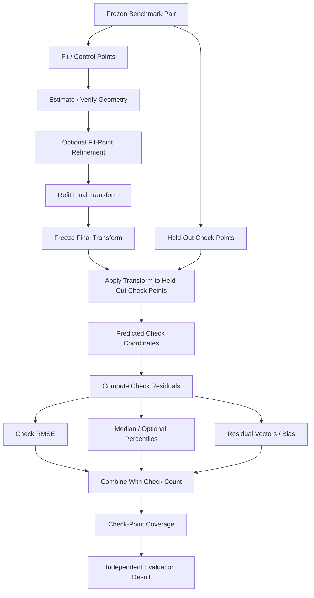
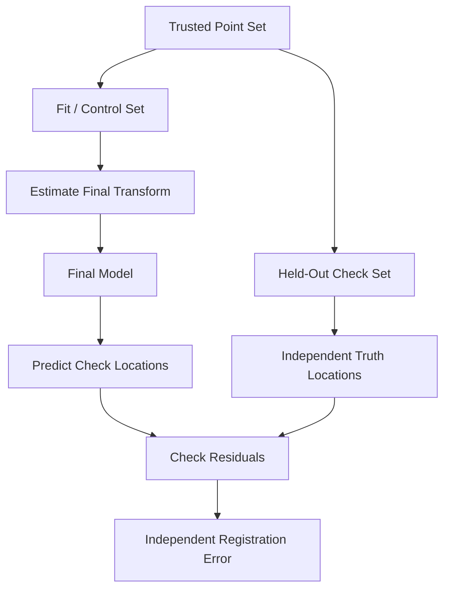
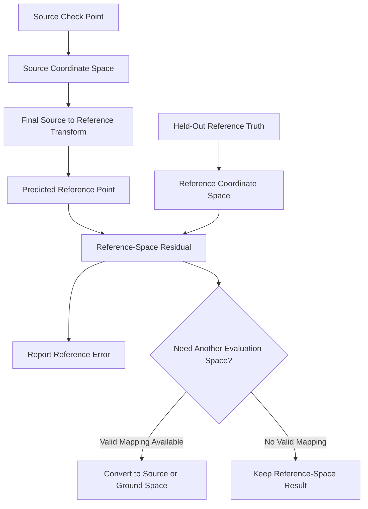

# Check-Point Evaluation

ChandraMap uses **held-out geometric check points** to measure whether a final lunar image registration model generalizes beyond the points used to estimate it.

> **A check point is useful for independent evaluation only when it did not influence the final transformation being evaluated.**

Check-point evaluation is therefore fundamentally different from measuring residuals on the same correspondences used to fit a model.

> **Fit error measures how well a model explains the points used to build it; check-point error measures how well that model generalizes to held-out geometry.**

This distinction is central to trustworthy ChandraMap benchmarking.

A visually convincing overlay, high inlier ratio, or low RANSAC fit residual does not by itself establish independent registration accuracy.

> **RANSAC inliers are not independent check points unless they were independently prepared, held out from fitting, and assigned that role by the benchmark protocol.**

Fair method comparison also requires stable evaluation truth.

> **The same held-out check points should be reused when comparing methods on the same benchmark pair.**

A reported check-point error is scientifically meaningful only when its geometric context is known.

> **Check-point RMSE is meaningful only when the coordinate space, units, transform direction, check-point count, and truth version are known.**

Where possible, ChandraMap should interpret error relative to the source sensor.

> **Check-point evaluation should report source-image pixel error first where correctly defined; physical lunar-ground error should be reported only when valid geospatial information supports it.**

Spatial support matters as much as a compact numerical error.

> **Low check-point error on a small, clustered set does not prove image-wide registration accuracy.**

Finally, evaluation must remain honest when truth or geometry is unavailable.

> **Check-point failure or insufficient truth must be reported honestly.**

If no valid independent check points exist, ChandraMap must not invent:

- check RMSE;
- an accuracy percentage;
- lunar ground error;
- sub-pixel accuracy.

---

## 1. Naming Clarification

The filename is:

`checkpoint-evaluation.md`

In this document, **check point** means:

> a held-out geometric evaluation point used to measure image-registration accuracy.

It does **not** mean:

- neural-network checkpoint;
- saved model weights;
- training checkpoint;
- optimizer checkpoint;
- saved ML state;
- Git checkpoint.

This distinction matters because future ChandraMap versions may use learned models whose model checkpoints are unrelated to geometric check points.

---

## 2. Why Check-Point Evaluation Matters

Held-out evaluation helps answer questions that fit residuals alone cannot answer:

- Does the final transformation generalize to geometry it did not fit?
- Does sub-pixel refinement improve independent accuracy?
- Does affine or homography produce lower held-out error?
- Does preprocessing improve registration rather than only increase match count?
- Does a better scale-pyramid choice reduce true registration error?
- Are residuals spatially biased?
- Does a method behave consistently across OHRC, TMC-2, and IIRS?
- Does a visually convincing overlay correspond to numerically accurate alignment?
- Are improvements stable across benchmark pairs?
- Are failures localized or systematic?

A strong registration evaluation therefore needs both:

- fitting diagnostics;
- independent held-out evidence.

---

## 3. What Check-Point Evaluation Is Not

Check-point evaluation is not:

- fit-residual analysis alone;
- RANSAC scoring;
- inlier counting;
- matcher-confidence analysis;
- visual overlay inspection;
- mosaic inspection;
- retrieval evaluation;
- ground-truth preparation;
- control-point annotation;
- neural-network checkpoint evaluation.

Those may support the broader evaluation process, but they answer different questions.

---

# Core Terminology

## 4. Check Point

A **check point** is a trusted source/reference or geospatial point excluded from final transformation fitting and used to evaluate the resulting model.

---

## 5. Held-Out Check Point

A **held-out check point** emphasizes that the point did not participate in:

- initial model fitting;
- final refitting;
- final test-time model selection.

This is the preferred term when independence matters.

---

## 6. Fit Point

A **fit point** contributes to transformation estimation or final refitting.

A residual measured on a fit point is a **fit residual**.

---

## 7. Control Point

A **control point** is a point used to constrain or estimate geometry according to the conventions in [`control-points.md`](control-points.md).

In ChandraMap evaluation documentation, the phrase **fit/control point** is often clearer when the point directly participates in fitting.

---

## 8. Check-Point Set

A **check-point set** is the frozen collection of held-out points used to evaluate one benchmark pair or run.

A set should remain associated with its:

- pair;
- truth version;
- coordinate spaces;
- benchmark version.

---

## 9. Check-Point Count

The **check-point count** is the number of valid held-out points contributing to a reported metric.

A check RMSE without its supporting count is incomplete.

---

## 10. Predicted Point

A **predicted point** is the location produced by applying the final registration transform to a held-out point in the transform's input coordinate space.

---

## 11. Observed / Truth Point

The **observed** or **truth point** is the independently trusted held-out coordinate against which a prediction is compared.

---

## 12. Check Residual

A **check residual** is the coordinate difference between:

- the trusted held-out point;
- the point predicted by the final transformation.

---

## 13. Check Residual Vector

A **check residual vector** is the two-dimensional displacement:

$$
r_i =
\begin{bmatrix}
r_{x,i} \\
r_{y,i}
\end{bmatrix}
$$

between predicted and truth coordinates.

---

## 14. Check Residual Magnitude

For a two-dimensional residual:

$$
e_i =
\sqrt{
r_{x,i}^{2}
+
r_{y,i}^{2}
}
$$

The magnitude provides a scalar geometric error for one held-out point.

---

## 15. Check RMSE

**Check RMSE** is Root Mean Square Error computed only from valid held-out check-point residuals.

---

## 16. Fit RMSE

**Fit RMSE** is computed from points that participated in transformation fitting.

It is useful for model diagnostics but is not independent evaluation.

---

## 17. Source-Space Check Error

A **source-space check error** is a check-point error expressed in the source image's coordinate system.

Examples include:

- OHRC pixels;
- TMC-2 pixels;
- IIRS representation pixels.

---

## 18. Reference-Space Check Error

A **reference-space check error** is measured in the reference image/grid.

Examples include:

- NAC tile pixels;
- NAC pyramid-level pixels;
- WAC pixels.

---

## 19. Ground-Distance Check Error

A **ground-distance check error** expresses displacement in a physical lunar-surface unit, such as metres, when valid geospatial mapping supports that calculation.

---

## 20. Check-Point Coverage

**Check-point coverage** describes how broadly held-out points span the valid overlap.

Coverage is separate from:

- point count;
- RMSE;
- correctness.

---

## 21. Truth Uncertainty

**Truth uncertainty** is uncertainty associated with the held-out evaluation reference itself.

Possible sources include:

- annotation localization;
- sensor sampling;
- ambiguous morphology;
- reference geolocation;
- projection;
- terrain relief.

---

## 22. Invalid Check Point

A check point may be considered invalid only for independently supported reasons such as:

- wrong physical feature;
- coordinate-mapping error;
- duplicate truth record;
- invalid image region;
- unresolved scientific ambiguity.

Algorithm disagreement alone is not sufficient reason to invalidate a point.

---

# Fit Points vs Held-Out Check Points

## 23. Fit Point

A fit/control point contributes directly to estimating the transformation.

---

## 24. Check Point

A held-out check point is excluded from fitting and used only after the final model has been fixed.

---

## 25. Independence Requirement

For final benchmark evidence, check points should not influence:

- RANSAC fitting;
- transformation estimation;
- final refit;
- transform-family selection;
- matcher selection;
- threshold selection;
- refinement-parameter tuning.

---

## 26. Fit vs Check Comparison

| Property                                | Fit / Control Point |    Held-Out Check Point |
| --------------------------------------- | ------------------: | ----------------------: |
| Used to fit transformation              |                 Yes |                      No |
| Used during final refit                 |                 Yes |                      No |
| Fit residual available                  |                 Yes | Not its primary purpose |
| Independent check residual              |                  No |                     Yes |
| Used to claim held-out accuracy         |        No by itself |                     Yes |
| May guide final-test tuning             |                  No |                      No |
| Must preserve coordinate provenance     |                 Yes |                     Yes |
| Should have useful spatial distribution |                 Yes |                     Yes |

---

# Why Fit Error Is Optimistic

## 27. The Model Was Built From Fit Points

Transformation estimation explicitly tries to reduce disagreement on the fitting observations.

Therefore:

$$
\text{fit error}
$$

is naturally optimistic relative to unseen geometry.

A model can fit its training geometry well while generalizing poorly elsewhere.

---

## 28. Held-Out Generalization

Check-point evaluation asks:

> Does the final model correctly predict geometric relationships that were not used to estimate it?

That is the primary scientific value of held-out evaluation.

---

# Check-Point Sources

## 29. Where Check Points May Come From

Depending on the benchmark, held-out check truth may come from:

- independently annotated correspondences;
- authoritative control information;
- trusted geospatial references;
- controlled synthetic known transformations.

See:

- [`ground-truth.md`](ground-truth.md)
- [`../datasets/ground-truth-preparation.md`](../datasets/ground-truth-preparation.md)

---

## 30. Algorithm Output Is Not Automatically Check Truth

The following are not independent held-out check points merely because they exist:

- SIFT matches;
- ratio-test survivors;
- ALIKED + LightGlue matches;
- LoFTR correspondences;
- filtered candidates;
- RANSAC inliers;
- refined algorithmic correspondences.

They are algorithm outputs.

---

# Freezing the Check Set

## 31. Freeze Before Formal Test Evaluation

The check-point set should be established before the final test configuration is evaluated.

Freeze:

- check-point identities;
- coordinate values;
- roles;
- truth version;
- benchmark version.

---

## 32. No Post-Hoc Point Selection

Invalid evaluation practice:

1. run the method;
2. inspect large residuals;
3. remove difficult check points;
4. recompute a lower RMSE.

A point should only be corrected or invalidated when independent review demonstrates that the truth itself was wrong.

Such a correction requires versioned change control.

---

# Evaluation Stage in the Pipeline

## 33. Correct Stage Order

Conceptually:

1. generate candidate correspondences;
2. perform match filtering;
3. run RANSAC/geometric verification;
4. obtain verified inliers;
5. perform optional fit-point sub-pixel refinement;
6. refit the final transformation;
7. freeze the final transformation;
8. apply it to held-out check points;
9. compute check residuals;
10. summarize error and coverage.

The final model must be fixed before formal check-point evaluation begins.

---

# Applying the Final Transform

## 34. Final Model Requirement

Evaluate the model actually used by the final registration pipeline.

If the workflow performs:

- RANSAC;
- refinement;
- model refitting;

then check-point evaluation should use the post-refit final model rather than an earlier RANSAC hypothesis.

---

## 35. Transform Direction

Suppose the final transform is:

$$
T:
\text{source}
\rightarrow
\text{reference}
$$

For source check point:

$$
p_{s,i}
$$

the predicted reference position is:

$$
\hat{p}_{r,i}
=
T(p_{s,i})
$$

This is compared with trusted held-out reference coordinate:

$$
p_{r,i}
$$

---

## 36. Transform Direction Must Be Explicit

A matrix alone is not enough.

Record whether it represents:

- source → reference;
- reference → source.

Never apply a reverse mapping as though it were the forward mapping.

See [`../algorithms/transforms.md`](../algorithms/transforms.md).

---

# Forward Check Residual

## 37. Residual Definition

Using the documented convention:

$$
r_i
=
p_{r,i}
-
\hat{p}_{r,i}
$$

or:

$$
r_i
=
p_{r,i}
-
T(p_{s,i})
$$

This is:

> observed truth − predicted position.

If an implementation uses the opposite sign, that convention must remain explicit and versioned.

---

## 38. Residual Components

For:

$$
p_{r,i} =
(x_{r,i},y_{r,i})
$$

and:

$$
\hat{p}_{r,i} =
(\hat{x}_{r,i},\hat{y}_{r,i})
$$

the components are:

$$
r_{x,i}
=
x_{r,i}
-
\hat{x}_{r,i}
$$

$$
r_{y,i}
=
y_{r,i}
-
\hat{y}_{r,i}
$$

---

## 39. Residual Magnitude

The Euclidean check error is:

$$
e_i
=
\sqrt{
r_{x,i}^{2}
+
r_{y,i}^{2}
}
$$

If \(T\) maps source → reference, this residual naturally lives in the **reference coordinate space**.

---

# Source-Space Evaluation

## 40. Why Source-Space Error Matters

The source sensor defines the information actually observed by ChandraMap.

Source-space error therefore provides an important interpretation of registration accuracy relative to source sampling.

Examples:

- OHRC source error in OHRC pixels;
- TMC-2 source error in TMC-2 pixels;
- IIRS representation error in IIRS representation pixels.

---

## 41. Do Not Relabel Reference Error

If residuals were computed on a NAC pyramid grid, they are:

> NAC pyramid-level pixels.

They are not automatically:

> source-image pixels.

A correct source-space metric requires a valid coordinate transformation into source space.

---

## 42. Inverse Evaluation

If the final model is:

$$
T:
\text{source}
\rightarrow
\text{reference}
$$

source-space evaluation may require:

$$
T^{-1}
$$

to predict the source coordinate from the reference truth point.

Only use inverse evaluation when the transformation is:

- mathematically invertible;
- numerically stable;
- valid under the applicable model.

Do not blindly invert:

- singular;
- near-singular;
- unstable;

models.

---

# Symmetric Evaluation

## 43. Optional Advanced Evaluation

An advanced protocol may consider both:

- source → reference error;
- reference → source error.

This can reduce dependence on one evaluation direction.

However, ChandraMap should not define a specific symmetric-transfer metric as the current standard unless an authoritative benchmark or implementation does so.

Treat symmetric evaluation as:

- optional;
- advanced;
- research-oriented.

---

# Check RMSE

## 44. Definition

For \(N\) valid held-out residual magnitudes:

$$
e_1,e_2,\ldots,e_N
$$

check RMSE is:

$$
\mathrm{RMSE}_{\text{check}}
=
\sqrt{
\frac{1}{N}
\sum_{i=1}^{N}
e_i^2
}
$$

The definition of \(e_i\) and its coordinate space must remain explicit.

---

## 45. Required Check-RMSE Context

Every check-RMSE result should identify, directly or through associated metadata:

- benchmark pair;
- run/configuration;
- transformation model;
- transform direction;
- check-point set;
- check-point set version;
- truth version;
- number of valid check points;
- residual coordinate space;
- units;
- benchmark version.

Without this context, the numerical value is incomplete.

---

## 46. Fit RMSE vs Check RMSE

| Metric     | Point Population                | Primary Meaning                                        |
| ---------- | ------------------------------- | ------------------------------------------------------ |
| Fit RMSE   | Points used in model estimation | How well the model explains its fitting geometry       |
| Check RMSE | Held-out check points           | How well the model generalizes to independent geometry |

> **Fit RMSE is a fitting diagnostic; check RMSE is independent evaluation evidence when truth is valid.**

---

## 47. Compare RMSE Only Under Comparable Conditions

A lower numerical RMSE is meaningful only when methods use the same:

- benchmark pair;
- held-out point set;
- truth version;
- coordinate space;
- units;
- metric definition.

---

# Complementary Check-Point Statistics

## 48. Median Check Error

The median residual magnitude is:

$$
\operatorname{median}
(e_1,\ldots,e_N)
$$

It is less sensitive than RMSE to extreme residuals.

---

## 49. Median Does Not Replace RMSE

A method may have:

- low median error;
- one or more severe local failures.

Median and RMSE describe different properties of the error distribution.

---

## 50. Percentile Error

Optional benchmark-defined percentiles may summarize upper-tail behavior.

Examples might conceptually include:

- median/P50;
- upper percentiles.

No fixed percentile set is required by this document.

---

## 51. Maximum Check Error

Maximum residual magnitude is:

$$
e_{\max}
=
\max_i(e_i)
$$

This can expose severe local failures.

A large maximum should be investigated, not automatically removed.

---

# Directional Bias

## 52. Mean X Residual

Conceptually:

$$
\overline{r_x}
=
\frac{1}{N}
\sum_{i=1}^{N}
r_{x,i}
$$

---

## 53. Mean Y Residual

Similarly:

$$
\overline{r_y}
=
\frac{1}{N}
\sum_{i=1}^{N}
r_{y,i}
$$

---

## 54. Bias Interpretation

Persistent directional bias may suggest:

- remaining translation;
- crop/tile offset error;
- coordinate-origin mismatch;
- projection mismatch;
- model limitation.

Residual direction alone does not prove one particular root cause.

See [`../algorithms/residual-analysis.md`](../algorithms/residual-analysis.md).

---

# Check-Point Count

## 55. Always Report the Count

A reported check RMSE should be accompanied by:

$$
N_{\text{check}}
$$

or equivalent result metadata.

---

## 56. No Universal Minimum

ChandraMap does not define one universal required number of check points.

Adequacy depends on:

- truth availability;
- overlap extent;
- terrain;
- sensor;
- model;
- intended claim.

---

## 57. Small Check Sets

A small held-out set may still provide useful independent evidence.

However, conclusions should acknowledge that it provides limited sampling of:

- spatial variation;
- failure modes;
- whole-overlap accuracy.

---

# Check-Point Coverage

## 58. Why Coverage Matters

Suppose all held-out points occur around one crater.

Low RMSE there demonstrates good performance near that feature.

It does not prove equally accurate registration:

- near image edges;
- on distant terrain;
- across the complete overlap.

---

## 59. Coverage Metrics

Supporting coverage metrics may include:

- grid occupancy;
- convex-hull coverage;
- regional distribution.

See [`metrics.md`](metrics.md).

No universal coverage threshold is prescribed here.

---

## 60. Fit Coverage vs Check Coverage

These describe different evidence.

### Fit Coverage

How broadly transformation estimation is geometrically constrained.

### Check Coverage

How broadly independent evaluation samples the resulting registration.

Both should remain visible where useful.

---

## 61. Low Error With Low Coverage

A result such as:

- low check RMSE;
- very localized check coverage;

must be interpreted cautiously.

Do not combine these automatically into an arbitrary composite score.

---

# Check-Point Distribution

## 62. Prefer Broad Distribution

Where reliable truth exists, check points should preferably span multiple parts of the usable overlap.

---

## 63. Avoid Only Easy Points

Do not intentionally select only:

- high-contrast;
- central;
- obvious;

features if other reliable held-out truth is available.

Such selection can make evaluation unrepresentative.

---

## 64. Do Not Force Coverage

A broader but ambiguous check set may be worse than a smaller reliable one.

Do not create points in:

- unresolvable terrain;
- ambiguous structures;
- invalid pixels;

merely to improve coverage statistics.

---

# Coordinate Spaces

## 65. Source Spaces

Examples include:

- full OHRC product;
- TMC-2 crop;
- IIRS-derived representation;
- prepared source raster;
- source pyramid or model-input space where explicitly defined.

---

## 66. Reference Spaces

Examples include:

- NAC parent raster;
- NAC tile;
- NAC pyramid level;
- WAC raster;
- projected LRO product.

---

## 67. Coordinates Without Grid Identity Are Incomplete

The coordinate:

`(x, y)`

has no reproducible geometric meaning unless its image/grid is known.

Every point must remain associated with:

- asset identity;
- coordinate space;
- relevant preprocessing lineage.

---

# Crop and Tile Handling

## 68. Crop Offsets

If a check point is represented in crop coordinates, preserve the mapping back to its parent image.

For a simple crop, this may conceptually involve:

$$
x_{\text{parent}}
=
x_{\text{crop}}
+
x_{\text{offset}}
$$

$$
y_{\text{parent}}
=
y_{\text{crop}}
+
y_{\text{offset}}
$$

subject to project coordinate conventions.

---

## 69. Reference Tile Offsets

For tiled reference imagery, retain:

- tile identity;
- tile origin;
- parent product;
- local-to-parent mapping.

---

## 70. Coordinate-Lineage Errors

A correct registration model can appear wrong if:

- crop offsets;
- tile origins;
- resize mappings;

are applied incorrectly.

Coordinate lineage should be checked before attributing error to:

- matching;
- RANSAC;
- transformation estimation.

---

# Pyramid-Level Evaluation

## 71. Pyramid Context

If a held-out reference point is evaluated in:

> NAC pyramid level \(L\)

its residual is measured in:

> level-\(L\) pixels.

---

## 72. Cross-Level Comparison

One pixel at a fine reference level and one pixel at a coarse level represent different spatial displacement.

Do not compare raw level-specific pixel errors directly without accounting for their scale relationship.

---

## 73. Canonical Truth Mapping

Where practical, preserve canonical truth in a stable parent coordinate system and derive level-specific check points deterministically.

See [`../algorithms/scale-pyramid.md`](../algorithms/scale-pyramid.md).

---

# Sensor-Specific Interpretation

## 74. OHRC

OHRC is the Chandrayaan-2 **Orbiter High Resolution Camera**, a visible/panchromatic instrument.

Current project context commonly uses approximately:

> **~0.25–0.32 m/pixel**

depending on product/documentation.

Actual product metadata remains authoritative.

Check-point implications include:

- source-pixel error can represent fine image-coordinate displacement;
- fine annotations can still contain uncertainty;
- physical distance conversion requires valid product/geospatial information;
- small numerical pixel error should not be interpreted beyond truth precision.

See [`../sensors/ohrc.md`](../sensors/ohrc.md).

---

## 75. TMC-2

TMC-2 is the Chandrayaan-2 **Terrain Mapping Camera-2**, a panchromatic terrain-imaging instrument.

Current project planning commonly uses approximately:

> **~5 m/pixel**

with product metadata remaining authoritative.

A TMC-2-pixel error has very different physical meaning from an OHRC-pixel error.

Truth features should remain meaningful at TMC-2's spatial scale.

See [`../sensors/tmc2.md`](../sensors/tmc2.md).

---

## 76. IIRS

IIRS is the Chandrayaan-2 **Imaging Infrared Spectrometer**.

Current project context includes approximately:

- ~80 m/pixel;
- ~0.8–5.0 µm;
- roughly ~250–256 bands depending on product/documentation.

Actual product metadata remains authoritative.

IIRS requires a documented registration-friendly 2D representation.

Check-point evaluation must preserve:

- parent IIRS product;
- representation identity;
- representation spatial grid;
- source coordinate space.

A small residual on a fine NAC grid does **not** imply NAC-scale physical localization from IIRS.

The final interpretation must respect:

- IIRS sampling;
- feature visibility;
- cross-modality uncertainty.

See [`../sensors/iirs.md`](../sensors/iirs.md).

---

# Reference-Sensor Interpretation

## 77. LRO NAC

LROC NAC provides fine/local lunar reference imagery.

Current project planning often treats NAC imagery as approximately:

> **~0.5–2 m/pixel**

depending on product/acquisition geometry.

Actual metadata remains authoritative.

A NAC-space residual should identify where relevant:

- NAC product;
- tile;
- pyramid level;
- effective GSD.

See [`../sensors/lro-nac.md`](../sensors/lro-nac.md).

---

## 78. LRO WAC

LROC WAC provides broader/coarser lunar reference context.

Its effective scale is product/mode/processing dependent.

Do not assign one universal WAC GSD.

WAC-space error must remain distinguishable from NAC-space error.

See [`../sensors/lro-wac.md`](../sensors/lro-wac.md).

---

# Physical Ground-Distance Error

## 79. When Ground Error Is Valid

A physical lunar-distance error may be computed when:

- check truth has trusted geospatial mapping;
- coordinate systems are known;
- projection/reference geometry is valid;
- the transform chain is valid;
- compatible ground coordinates can be produced.

---

## 80. Avoid Blind GSD Multiplication

Do not automatically compute:

$$
\text{check RMSE pixels}
\times
\text{approximate sensor GSD}
$$

and label the result:

> ground accuracy.

This may be wrong because of:

- wrong residual coordinate space;
- pyramid scaling;
- variable product GSD;
- map projection;
- unprojected sensor geometry;
- truth uncertainty.

---

## 81. Prefer Valid Geospatial Mapping

Where possible:

1. map prediction into trusted lunar map/ground coordinates;
2. map held-out truth into the same system;
3. compute physical displacement there.

Do not claim physical error when that chain is unavailable.

---

# Geolocation Check-Point Evaluation

## 82. Geolocation Check Point

A check point with independently trusted lunar ground coordinates may support absolute geolocation evaluation.

---

## 83. Coordinate-Reference Context

Ground-coordinate evaluation should identify where applicable:

- lunar reference system;
- longitude convention;
- projection;
- units;
- datum/reference model.

Do not invent repository conventions that have not been established.

---

## 84. Registration Error vs Geolocation Error

Image-to-image check RMSE and absolute geolocation error are different.

A source image can align accurately to a reference image while the reference itself contains geolocation uncertainty.

---

# Truth Uncertainty

## 85. Check Points Are Not Infinitely Precise

Truth uncertainty may arise from:

- manual annotation;
- coarse source sampling;
- ambiguous terrain feature centers;
- cross-modality interpretation;
- reference geolocation;
- projection;
- relief.

---

## 86. Differences Below Truth Uncertainty

If two methods differ by less than the uncertainty supported by the truth, avoid strong conclusions about one being meaningfully more accurate.

---

## 87. No Fake Precision

Do not print excessive decimal places merely because calculations use floating-point numbers.

Reported precision should reflect:

- source sampling;
- reference sampling;
- truth quality;
- metric meaning.

---

# Invalid Check Points

## 88. Legitimate Invalidation Reasons

A held-out point may be corrected or invalidated if independent evidence demonstrates:

- annotation error;
- wrong feature identity;
- duplicate record;
- coordinate-conversion bug;
- invalid image region;
- unresolved ambiguity.

---

## 89. Large Residual Is Not Enough

A point is not invalid merely because:

$$
e_i
$$

is large.

That large residual may expose a real algorithmic failure.

---

## 90. Version Corrections

If check truth changes materially:

- update the truth/check-point version;
- update affected benchmark definitions where required;
- preserve historical interpretation.

Do not silently rewrite an old benchmark's truth.

---

# Check-Point Leakage

## 91. Definition

Check-point leakage occurs when held-out evaluation evidence influences the system being evaluated.

This can happen through:

- threshold tuning;
- model-family selection;
- matcher selection;
- refinement tuning;
- learned-model training;
- manual pipeline adjustment.

---

## 92. Transform Selection Leakage

If final test check points are repeatedly used to decide whether:

- affine;
- homography;

should be used, those points have contributed to model selection.

They are no longer untouched final-test evidence for that selection decision.

Use development or validation truth instead.

---

## 93. Matcher Selection Leakage

Do not repeatedly compare final test check error for:

- SIFT;
- ALIKED + LightGlue;
- LoFTR;

and then present the selected method's result as though the test set had never influenced method selection.

---

## 94. Refinement Leakage

Do not tune:

- refinement search radius;
- patch size;
- validation thresholds;

on final test check-point error.

---

## 95. Training Leakage

Learned methods should not use final held-out test truth during:

- training;
- fine-tuning;
- hyperparameter selection.

---

# Development, Validation, and Test Truth

## 96. Development Check Points

Development check truth may be used for:

- debugging;
- implementation verification;
- exploratory analysis.

---

## 97. Validation Check Points

Validation truth may support:

- configuration selection;
- model comparison;
- threshold tuning.

---

## 98. Test Check Points

Test check truth should remain reserved for final evaluation when intended to support independent claims.

---

## 99. Be Honest About Split Roles

If a point set has repeatedly influenced algorithm design, it should not later be described as a fully untouched final test set.

---

# Sub-Pixel Refinement Evaluation

## 100. Correct Evaluation Question

Do not ask only:

> Did fit residual decrease after refinement?

Ask:

> Did the refined and refitted final model improve held-out check-point error?

---

## 101. Reuse the Same Check Points

Compare before vs after refinement using exactly the same held-out check set.

See [`../algorithms/subpixel-refinement.md`](../algorithms/subpixel-refinement.md).

---

## 102. Possible Refinement Outcomes

Refinement may:

- reduce independent error;
- produce negligible change;
- increase independent error;
- fail on certain pairs.

No improvement should be assumed in advance.

---

# Transform-Model Comparison

## 103. Affine vs Homography

A controlled transform comparison should use, where technically valid, the same:

- benchmark pair;
- fitting correspondence source;
- held-out check set;
- coordinate space;
- metric definition.

---

## 104. Fit Error Is Not Enough

A homography may fit the fitting points more tightly than an affine transform while producing worse held-out check accuracy.

Therefore use independent evaluation.

See [`../algorithms/transforms.md`](../algorithms/transforms.md).

---

# Matcher Comparison

## 105. Same Check Set

When comparing methods such as:

- SIFT;
- ALIKED + LightGlue;
- LoFTR;
- remote-sensing approaches;

reuse the same frozen held-out truth.

---

## 106. More Matches Can Still Mean Worse Registration

One method may produce:

- more verified inliers;
- higher check error.

Another may produce:

- fewer inliers;
- better spatial support;
- lower check error.

Report multiple metrics rather than treating match count as final accuracy.

---

# Preprocessing Comparison

## 107. Stable Evaluation Truth

When comparing representations such as:

- minimally processed;
- normalized;
- structural;

reuse the same check-point truth.

See [`../algorithms/preprocessing.md`](../algorithms/preprocessing.md).

---

# Illumination-Handling Comparison

## 108. Same Pair and Check Truth

Illumination-handling strategies should be compared using the same:

- benchmark pair;
- held-out check points.

See [`../algorithms/illumination-handling.md`](../algorithms/illumination-handling.md).

---

## 109. Do Not Move Difficult Points

A point that becomes difficult under one representation should not be removed merely to improve that method's metric.

Only independently invalid truth should be removed.

---

# Scale-Pyramid Comparison

## 110. Canonical Check Truth

Prefer one canonical truth definition mapped consistently into each evaluated scale.

---

## 111. Compare in a Common Space

When comparing pyramid levels, prefer an evaluation space such as:

- source-image space;
- canonical reference space;
- valid common ground coordinate space.

Do not compare incompatible raw level-pixel errors directly.

---

# Retrieval and Check-Point Evaluation

## 112. Retrieval Truth Is Different

Retrieval asks:

> Did the system find an acceptable reference region?

Check-point evaluation asks:

> Once a final local transform exists, how accurately does it align held-out geometry?

`Recall@K` and check RMSE therefore measure different tasks.

---

## 113. End-to-End Evaluation

Conceptually:

`query → retrieval → candidate reference → local registration → final transform → check-point evaluation`

If retrieval fails, local check-point evaluation may not be possible.

Record the actual failure stage.

---

# Failure Handling

## 114. No Valid Transform

If no valid final transformation exists, check residuals are unavailable.

Record:

- registration failure;
- evaluation unavailable as appropriate.

Do not assign:

`RMSE = 0`.

---

## 115. No Independent Check Points

If no held-out truth exists:

> independent check-point evaluation is unavailable.

Do not replace it with:

- fit RMSE;
- RANSAC residual;
- visual inspection;

while labeling the result check RMSE.

---

## 116. Very Small Valid Check Set

If only a small set remains valid:

- report the count;
- report the limitation;
- compute metrics only if the benchmark permits.

Do not overstate statistical strength.

---

## 117. Coordinate-Mapping Failure

If truth cannot be mapped reliably into the evaluation space:

- mark the metric invalid/unavailable;
- record the mapping failure.

Do not calculate a misleading residual.

---

# Pair-Level Reporting

## 118. Minimum Pair-Level Context

A pair-level check-point result should preserve conceptually:

- pair ID;
- run ID;
- transform model;
- transform direction;
- check-point set ID/version;
- truth version;
- valid check-point count;
- coordinate space;
- units;
- check RMSE;
- median error where used;
- maximum error where used;
- directional bias where used;
- coverage;
- status;
- warnings or failure reason.

---

# Point-Level Reporting

## 119. Point-Level Residual Record

Each held-out point may conceptually preserve:

- check-point ID;
- source truth coordinate;
- reference truth coordinate;
- predicted coordinate;
- residual x;
- residual y;
- residual magnitude;
- coordinate space;
- units;
- validity/status.

Exact serialization belongs to repository schemas.

---

# Conceptual Check-Point Record

## 120. Illustrative Structure

The following is an **illustrative conceptual structure — not an implemented schema**:

```yaml
checkpoint_id: "PLACEHOLDER_CHECKPOINT_ID"
pair_id: "PLACEHOLDER_PAIR_ID"
checkpoint_set_version: "PLACEHOLDER_VERSION"

source:
  coordinate_space: "PLACEHOLDER_SOURCE_SPACE"
  x: "PLACEHOLDER"
  y: "PLACEHOLDER"

reference_truth:
  coordinate_space: "PLACEHOLDER_REFERENCE_SPACE"
  x: "PLACEHOLDER"
  y: "PLACEHOLDER"

prediction:
  x: "PLACEHOLDER"
  y: "PLACEHOLDER"

residual:
  dx: "PLACEHOLDER"
  dy: "PLACEHOLDER"
  magnitude: "PLACEHOLDER"
  units: "PLACEHOLDER_UNITS"

status: "PLACEHOLDER_STATUS"
```

No real measurements or exact repository field names are implied.

---

# Conceptual Evaluation Summary

## 121. Illustrative Pair Summary

The following is also **illustrative only**:

```yaml
pair_id: "PLACEHOLDER_PAIR"
run_id: "PLACEHOLDER_RUN"

checkpoint_evaluation:
  checkpoint_set_version: "PLACEHOLDER_VERSION"
  valid_checkpoints: "PLACEHOLDER_COUNT"
  coordinate_space: "PLACEHOLDER_SPACE"
  units: "PLACEHOLDER_UNITS"
  rmse: "PLACEHOLDER_VALUE"
  median_error: "PLACEHOLDER_VALUE"
  max_error: "PLACEHOLDER_VALUE"

coverage:
  metric: "PLACEHOLDER_COVERAGE_METRIC"
  value: "PLACEHOLDER_VALUE"

status: "PLACEHOLDER_STATUS"
```

No fake benchmark values are implied.

---

# Reporting Tables

## 122. Point-Level Template

| Check Point | Source X | Source Y | Truth X | Truth Y | Predicted X | Predicted Y |  dX |  dY | Error | Status |
| ----------- | -------: | -------: | ------: | ------: | ----------: | ----------: | --: | --: | ----: | ------ |

---

## 123. Pair-Level Template

| Pair | Transform | Check Points | Check RMSE | Median Error | Max Error | Check Coverage | Units | Status |
| ---- | --------- | -----------: | ---------: | -----------: | --------: | -------------: | ----- | ------ |

---

## 124. Controlled Method Comparison

| Pair | Method | Transform | Same Check Set? | Check RMSE | Coverage | Runtime | Status |
| ---- | ------ | --------- | --------------- | ---------: | -------: | ------: | ------ |

Only measured results should populate these tables.

---

# Aggregation

## 125. Preserve Pair-Level Results

Aggregate reporting should never replace the underlying per-pair results.

Pair-level visibility preserves:

- difficult cases;
- failures;
- unusual residual patterns.

---

## 126. Mean Pair Check RMSE

If each pair \(j\) has check RMSE:

$$
R_j
$$

a pair-level mean is:

$$
\overline{R}_{\text{pair}}
=
\frac{1}{M}
\sum_{j=1}^{M}
R_j
$$

Each pair contributes equally.

---

## 127. Pooled Check-Point RMSE

Alternatively, residuals may be pooled:

$$
R_{\text{pooled}}
=
\sqrt{
\frac{
\sum_j \sum_i e_{j,i}^{2}
}{
\sum_j N_j
}
}
$$

Pairs with more check points contribute more weight.

---

## 128. Do Not Confuse Aggregations

These are different quantities:

- mean pair check RMSE;
- pooled check-point RMSE.

Do not call both simply:

> average RMSE.

See [`metrics.md`](metrics.md).

---

# Failed Pairs in Aggregates

## 129. Failed Pair Has No Valid Check RMSE

If no valid transform exists, do not fabricate an error value.

Preserve the failure status.

---

## 130. Success-Only Error Summaries

An error summary over successful pairs is valid if explicitly labeled, for example:

> successful-pair check RMSE.

It should be accompanied by:

- total cases;
- successes;
- failures.

---

## 131. Failure Rate Remains Important

A method with excellent successful-case RMSE but frequent failure should not be represented only by its successful-case error.

---

# Visualization

## 132. Truth vs Prediction

Useful visualizations may show:

- held-out truth location;
- predicted location;
- residual vector.

These support diagnosis.

They do not replace numerical evaluation.

---

## 133. Residual-Vector Scaling

If residual arrows are magnified for visibility, the visualization should state that scaling.

Do not imply that a visually enlarged arrow represents literal image displacement.

---

## 134. Check-Point Distribution

Plotting check-point locations over the overlap can reveal:

- clustering;
- missing regions;
- limited spatial support.

---

## 135. Fit vs Check Visualization

Use distinct:

- shapes;
- labels;
- markers;
- legends;

for fit and check points.

Do not rely on color alone.

---

# Residual Spatial Patterns

## 136. Systematic Direction

Residuals pointing similarly may suggest:

- coordinate offset;
- remaining translation;
- projection mismatch;
- model bias.

These are diagnostic hypotheses, not automatic conclusions.

---

## 137. Increasing Error Toward Edges

Possible explanations include:

- insufficient model flexibility;
- projection mismatch;
- terrain relief;
- poor fit-point distribution.

Further analysis is required.

---

## 138. Terrain-Dependent Residuals

Errors concentrated around:

- crater rims;
- ridges;
- strong relief;

may indicate view- or terrain-dependent geometry.

See [`../algorithms/residual-analysis.md`](../algorithms/residual-analysis.md).

---

# Check-Point Quality Control

## 139. Pre-Evaluation QC

Before metric computation, verify:

- check-point set version is known;
- point role is check;
- point was excluded from fitting;
- source/reference assets match the run;
- source coordinate space is known;
- reference coordinate space is known;
- coordinates are finite;
- points are in bounds;
- crop/tile mapping is valid;
- pyramid mapping is valid;
- physical feature identity remains valid;
- ambiguity status is acceptable.

---

## 140. Post-Evaluation QC

After evaluation, verify:

- predicted coordinates are finite;
- transform direction was correct;
- valid check count is recorded;
- residual units are known;
- coverage is recorded where required;
- invalid points were not silently dropped;
- aggregate metrics agree with point-level residuals;
- no held-out points entered final fitting.

---

## 141. Detailed QC Checklist

- [ ] Pair ID matches the truth record.
- [ ] Run ID is available.
- [ ] Transform model is known.
- [ ] Transform direction is known.
- [ ] Final transform, not a stale intermediate model, was evaluated.
- [ ] Check-point set/version is known.
- [ ] Truth version is known.
- [ ] Benchmark version is known.
- [ ] Source coordinate space is known.
- [ ] Reference coordinate space is known.
- [ ] Pyramid level is known where applicable.
- [ ] Crop offsets are known where applicable.
- [ ] Tile offsets are known where applicable.
- [ ] x/y convention is known.
- [ ] Pixel-origin convention is known.
- [ ] Pixel-center/corner convention is known where required.
- [ ] Check points were excluded from initial fitting.
- [ ] Check points were excluded from final refitting.
- [ ] Final test check error was not used for tuning.
- [ ] Check-point count is recorded.
- [ ] Check-point coverage is recorded where required.
- [ ] Residual formula is known.
- [ ] Residual sign convention is known.
- [ ] Units are recorded.
- [ ] Source/reference error labels match actual coordinate spaces.
- [ ] Ground-distance conversion is scientifically justified if reported.
- [ ] Invalid-point exclusions are documented.
- [ ] Truth uncertainty is acknowledged.
- [ ] Registration failures remain visible.
- [ ] Missing truth is not replaced with fit residual.
- [ ] Same check set was used for fair method comparisons.

---

# Failure Modes

## 142. Diagnostic Table

| Symptom                                               | Possible Cause                                            | Diagnostic / Response                                       |
| ----------------------------------------------------- | --------------------------------------------------------- | ----------------------------------------------------------- |
| Fit RMSE low, check RMSE high                         | Overfitting or weak geometric support                     | Inspect held-out residuals, fit coverage, and model choice  |
| Most check residuals point similarly                  | Coordinate offset or transform bias                       | Inspect coordinate chain and transform direction            |
| Error increases near image edge                       | Model, projection, relief, or fit-distribution limitation | Inspect spatial residual field                              |
| Error changes strongly across pyramid levels          | Scale/unit mapping issue                                  | Convert results to a common evaluation space                |
| One point dominates RMSE                              | Local registration failure or truth issue                 | Independently review the point; do not remove automatically |
| All check points are near one crater                  | Poor evaluation coverage                                  | Add valid distributed truth where available                 |
| No check RMSE exists                                  | No valid transform or independent check set               | Report failure/unavailable evaluation                       |
| Fine NAC-space error appears extremely small for IIRS | Incorrect physical interpretation                         | Report source/IIRS context and avoid false precision        |
| Error drops after moving check points into fit set    | Evaluation leakage                                        | Restore held-out separation                                 |
| Ground-distance error is implausible                  | Invalid GSD/projection conversion                         | Return to correctly defined pixel error                     |

---

# Statistical Interpretation

## 143. Small Sample Size

With few held-out points:

- preserve per-point residuals;
- report \(N\);
- avoid strong distributional claims.

---

## 144. Pair Variability

Some lunar pairs may be substantially more difficult than others.

Do not hide pair-level behavior behind one overall average.

---

## 145. Confidence Intervals

Confidence intervals may be appropriate when:

- enough independent observations exist;
- assumptions are reasonable.

Do not add statistical decoration to tiny benchmark suites.

---

## 146. Repeated Runs

Stochastic pipelines may be run repeatedly where useful.

Check-point metrics may then report:

- central tendency;
- run-to-run variation.

No universal repetition count is prescribed.

---

# Truth Uncertainty and Observed Error

## 147. Residual Contains More Than Algorithm Error

An observed check residual may contain contributions from:

- registration algorithm error;
- manual annotation uncertainty;
- reference uncertainty;
- coordinate mapping;
- geospatial uncertainty.

Do not treat every residual as pure algorithm error with perfect truth.

---

## 148. Future Uncertainty-Aware Evaluation

Advanced research may explicitly model:

- point covariance;
- annotation uncertainty;
- geospatial uncertainty.

These are future/research directions unless implementation documentation confirms otherwise.

---

# Check-Point Weighting

## 149. Equal Weighting

Ordinary RMSE conceptually gives each valid point equal contribution before averaging squared errors.

---

## 150. Weighted Evaluation

Future protocols may weight check points using:

- uncertainty;
- quality;
- another scientifically justified factor.

Any weighting must be:

- documented;
- reproducible;
- versioned.

This document defines no universal weighting scheme.

---

# No Cherry-Picking

## 151. Evaluate the Frozen Set

Formal benchmark evaluation uses the frozen benchmark-defined check-point set.

---

## 152. Difficult Points Stay

A large residual is not a valid reason to remove a point.

---

## 153. Truth Corrections Are Different

If independent review establishes that a point is scientifically invalid, correct it through versioned truth governance.

Do not rewrite the benchmark retrospectively without traceability.

---

# Versioned Evaluation Strategy

## 154. V1

V1 should remain simple and rigorous.

A conceptual V1 check-point evaluation includes:

- real known-overlap lunar pairs;
- separate fit/control and check sets;
- frozen roles;
- SIFT/matching/RANSAC baseline;
- configured affine or homography according to scope;
- optional refinement followed by refit;
- held-out check RMSE;
- correctly defined source-pixel error;
- check-point count;
- basic check coverage;
- residual-vector diagnostics;
- runtime/failure status.

Primary objective:

> **demonstrate that ChandraMap can estimate a transformation and evaluate it using independent geometry.**

V1 does not need:

- DEM-aware evaluation;
- sophisticated uncertainty models;
- global retrieval;
- large statistical suites.

---

## 155. V2

Possible V2 additions include:

- median check error;
- percentile diagnostics;
- stronger coverage analysis;
- directional bias;
- refinement ablations;
- affine vs homography comparisons;
- scale-stratified evaluation;
- illumination-stratified evaluation;
- IIRS-specific check evaluation.

---

## 156. V3

Possible V3 additions include:

- retrieval + registration evaluation;
- learned matcher comparisons;
- WAC/NAC coarse-to-fine evaluation;
- larger benchmark sets;
- automated residual diagnostics;
- richer runtime and failure reporting.

---

## 157. V4

Possible research additions include:

- DEM-aware ground error;
- terrain-conditioned residual analysis;
- uncertainty-aware evaluation;
- multi-mission check sets;
- lunar control-network integration;
- physical sensor-model geolocation validation;
- statistically stronger confidence analysis.

These are research directions, not implementation claims.

Authoritative version specifications remain definitive.

---

# Main Check-Point Evaluation Flow

## 158. End-to-End Evaluation



The check-point set does not enter the transformation-estimation branch.

---

# Fit vs Check Flow

## 159. Independence Structure



---

# Coordinate-Space Flow

## 160. Evaluation Direction



Never relabel one coordinate space as another without a valid transformation.

---

# Relationship to Evaluation Overview

## 161. [`README.md`](README.md)

`README.md` defines the overall evaluation philosophy.

This file defines the detailed procedure for:

> independent final-registration evaluation using held-out geometric points.

---

# Relationship to Metrics

## 162. [`metrics.md`](metrics.md)

The distinction is:

- `checkpoint-evaluation.md` — defines how held-out check points are consumed;
- `metrics.md` — defines metric formulas, units, populations, and aggregation semantics.

This document intentionally avoids duplicating the complete metric registry.

---

# Relationship to Ground Truth

## 163. [`ground-truth.md`](ground-truth.md)

`ground-truth.md` defines:

> what qualifies as independent evaluation truth.

This file defines:

> how that held-out truth is used after the final transformation has been fixed.

---

# Relationship to Control Points

## 164. [`control-points.md`](control-points.md)

The distinction is fundamental:

**Fit/control points**

→ estimate or constrain geometry.

**Held-out check points**

→ evaluate that geometry independently.

Do not use these terms interchangeably.

---

# Relationship to Benchmark Protocol

## 165. [`benchmark-protocol.md`](benchmark-protocol.md)

The benchmark protocol freezes:

- benchmark version;
- pair set;
- point-set roles;
- test split;
- formal execution rules.

This file defines the check-point evaluation stage within that protocol.

---

# Relationship to Benchmark Categories

## 166. [`benchmark-categories.md`](benchmark-categories.md)

Check-point results may be stratified by:

- sensor pair;
- scale stress;
- illumination stress;
- modality stress;
- terrain category;
- geometry stress.

Category assignment must remain independent of algorithm outcome.

---

# Relationship to Dataset Documentation

## 167. Ground-Truth Preparation

See [`../datasets/ground-truth-preparation.md`](../datasets/ground-truth-preparation.md).

That document defines how check truth is:

- created;
- reviewed;
- prepared.

This document defines how it is used for evaluation.

---

## 168. Pair Definition

See [`../datasets/pair-definition.md`](../datasets/pair-definition.md).

Each check-point set should belong to a specific source/reference pair and pair version.

---

## 169. Metadata

See [`../datasets/metadata.md`](../datasets/metadata.md).

Check error interpretation depends on:

- sensor;
- product;
- GSD;
- projection;
- representation;
- pyramid level;
- coordinate spaces.

---

## 170. Data Format

See [`../datasets/data-format.md`](../datasets/data-format.md).

Check-point and evaluation-result serialization should follow repository coordinate/data conventions.

---

## 171. Dataset Structure

See [`../datasets/dataset-structure.md`](../datasets/dataset-structure.md).

Independent truth should remain logically separate from algorithm-generated results.

---

# Relationship to Algorithm Documentation

## 172. Matching

See [`../algorithms/matching.md`](../algorithms/matching.md).

Matching generates candidate correspondences.

It does not define independent check truth.

---

## 173. Match Filtering

See [`../algorithms/match-filtering.md`](../algorithms/match-filtering.md).

Filtered candidates remain algorithm-generated.

---

## 174. RANSAC

See [`../algorithms/ransac.md`](../algorithms/ransac.md).

RANSAC identifies model-consistent fit candidates.

Held-out check points remain outside the RANSAC fitting process.

---

## 175. Transforms

See [`../algorithms/transforms.md`](../algorithms/transforms.md).

Check-point evaluation must use the final transform with explicit:

- model type;
- direction;
- coordinate spaces.

---

## 176. Sub-Pixel Refinement

See [`../algorithms/subpixel-refinement.md`](../algorithms/subpixel-refinement.md).

Refinement should be judged before and after using the same held-out check set.

---

## 177. Residual Analysis

See [`../algorithms/residual-analysis.md`](../algorithms/residual-analysis.md).

The distinction is:

- this file — which independent points are evaluated and how the evaluation is staged;
- `residual-analysis.md` — interpretation of residual vectors, magnitudes, spatial patterns, and model diagnostics.

---

## 178. Registration

See [`../algorithms/registration.md`](../algorithms/registration.md).

The final registered result should be validated numerically through held-out evaluation where truth exists.

A visual overlay alone is insufficient.

---

## 179. Scale Pyramid

See [`../algorithms/scale-pyramid.md`](../algorithms/scale-pyramid.md).

Check-point mappings must preserve:

- reference level;
- scale relationship;
- parent coordinate context.

---

## 180. Preprocessing

See [`../algorithms/preprocessing.md`](../algorithms/preprocessing.md).

Any geometry-changing preprocessing step must preserve check-point coordinate mapping.

---

## 181. Illumination Handling

See [`../algorithms/illumination-handling.md`](../algorithms/illumination-handling.md).

Check truth should preferably represent stable physical terrain rather than moving illumination boundaries.

---

## 182. Sensor Routing

See [`../algorithms/sensor-routing.md`](../algorithms/sensor-routing.md).

Evaluation must know which:

- source representation;
- reference representation;
- sensor route;

produced the final model.

---

# Relationship to Sensor Documentation

## 183. Sensor References

Relevant known documentation includes:

- [`../sensors/overview.md`](../sensors/overview.md)
- [`../sensors/ohrc.md`](../sensors/ohrc.md)
- [`../sensors/tmc2.md`](../sensors/tmc2.md)
- [`../sensors/iirs.md`](../sensors/iirs.md)
- [`../sensors/lro-nac.md`](../sensors/lro-nac.md)
- [`../sensors/lro-wac.md`](../sensors/lro-wac.md)

Sensor documentation defines the physical meaning of pixel-domain errors.

---

# Relationship to Project Scope

## 184. Project Documentation

Related paths to consult when present include:

- `../project/goals.md`
- `../project/non-goals.md`
- `../project/v1-scope.md`
- `../project/terminology.md`
- `../project/assumptions.md`
- `../project/limitations.md`

Authoritative project/version scope remains definitive.

---

# Relationship to Architecture

## 185. Architecture Documentation

Related paths to consult when present include:

- `../architecture/system-overview.md`
- `../architecture/v1-pipeline.md`
- `../architecture/core-engine-architecture.md`
- `../architecture/module-map.md`
- `../architecture/data-flow.md`
- `../architecture/output-flow.md`

Architecture determines how:

- final transforms;
- held-out truth;
- point-level residuals;
- pair-level summaries;

move through the software system.

This file defines their scientific evaluation semantics.

---

# Repository-Level Benchmark Infrastructure

## 186. Root `benchmarks/`

If the repository uses a root-level `benchmarks/` directory, benchmark definitions should reference frozen:

- truth versions;
- check-point versions;
- evaluation protocol.

---

## 187. Root `experiments/`

If `experiments/` is used, experiments may compare:

- matchers;
- preprocessing;
- scale strategies;
- transform models;
- refinement methods;

using the same frozen held-out check set.

---

## 188. Root `results/`

If `results/` is used, generated artifacts may include:

- point-level residuals;
- pair-level RMSE;
- coverage statistics;
- plots;
- aggregate reports.

Algorithm predictions must not automatically become future check truth.

---

# Data Licensing

## 189. [`../data-licenses.md`](../data-licenses.md)

Check-point annotations may be project-generated.

Underlying mission imagery may remain subject to external:

- licensing;
- attribution;
- redistribution;

requirements.

An annotation or benchmark license does not automatically grant redistribution rights for the source imagery.

---

# Check-Point Anti-Patterns

## 190. Do Not

Do not:

- use fit points as the only supposedly independent check points;
- use RANSAC inliers as independent check truth;
- use matcher output as check truth;
- tune on final test check RMSE;
- repeatedly choose affine or homography using final test truth;
- remove points merely because residuals are large;
- omit check-point count;
- omit check-point coverage;
- report check RMSE without units;
- report check RMSE without coordinate space;
- relabel reference-space error as source-space error;
- compare pyramid-level pixel errors without scale context;
- compare OHRC, TMC-2, and IIRS pixel errors as physically equivalent;
- convert pixel RMSE to metres using generic approximate GSD blindly;
- ignore truth uncertainty;
- hide coordinate-mapping failures;
- assign zero RMSE to registration failures;
- silently exclude failed pairs;
- call fit residual check RMSE;
- reuse validation truth as supposedly untouched test truth after repeated tuning;
- move difficult check points into the fit set;
- change check sets between methods without documenting it;
- compare different truth versions as though the experiment were controlled;
- report excessive numerical precision;
- call a visual overlay independent evaluation.

---

# Claims ChandraMap Should Avoid

## 191. Unsupported Claims

Do not claim without valid evidence:

- "sub-pixel accuracy" from fit residual alone;
- "sub-metre accuracy" from approximate GSD multiplication;
- "0.5-pixel accuracy" without naming the pixel coordinate space;
- "99% registration accuracy" without a defined metric;
- "check RMSE proves exact geolocation";
- "homography is better because fit RMSE is lower";
- "more matches mean lower check error";
- "more check points automatically guarantee correct evaluation";
- "low RMSE on clustered points proves whole-image accuracy";
- "all check points are exact";
- "all LRO coordinates are perfect truth";
- "IIRS achieves NAC-scale physical precision because NAC-space error is small";
- "one method is more accurate when the compared methods used different check sets."

---

# Limitations

## 192. Independent Truth May Be Scarce

Reliable cross-sensor lunar held-out truth can be difficult to prepare.

---

## 193. Manual Annotation Contains Uncertainty

Even carefully reviewed points may contain localization error.

---

## 194. Small Check Sets Limit Confidence

A small \(N\) provides limited information about spatial and statistical variability.

---

## 195. Clustered Check Points Limit Scene-Wide Claims

Low error in one region may not represent the complete overlap.

---

## 196. Sensor Pixels Are Not Physically Equivalent

OHRC, TMC-2, IIRS, NAC, and WAC pixels represent different spatial scales.

---

## 197. IIRS Requires Special Caution

IIRS's coarse spatial scale and modality differences limit fine-feature interpretation.

---

## 198. Projection and Terrain Can Produce Spatially Varying Error

A simple global transform may not model every relief- or projection-dependent displacement.

---

## 199. Reference Products Have Uncertainty

A reference image's geometry and geolocation are not infinitely precise.

---

## 200. Ground-Distance Conversion May Be Unavailable

Some benchmarks may support only image-space evaluation.

That remains scientifically valid when clearly stated.

---

## 201. RMSE Is Sensitive to Large Residuals

This can expose severe errors but may also make RMSE sensitive to a single problematic truth point.

---

## 202. Median Error Can Hide Severe Local Failures

Use complementary statistics where useful.

---

## 203. Truth Uncertainty Limits Fine Comparisons

Very small differences between methods may not be meaningful if they are below the precision supported by the truth.

---

## 204. No Check Set Samples Every Part of an Image

Held-out points provide finite spatial sampling of registration quality.

---

## 205. Statistical Conclusions Require Enough Independent Evidence

A small number of pairs cannot support strong claims about all lunar terrain or sensor conditions.

---

## 206. Benchmark Results Are Scope-Specific

Check-point evaluation measures performance on the documented benchmark.

It does not prove universal lunar registration robustness.

---

# Authoritative and Primary Reference Categories

## 207. Image Registration and Geometry

Relevant authoritative or primary source categories include:

- OpenCV geometric-transformation documentation;
- OpenCV robust-estimation documentation;
- primary image-registration literature;
- photogrammetric control/check-point references.

---

## 208. Planetary and Geospatial Evaluation

Relevant sources include:

- USGS ISIS;
- planetary control-network documentation;
- planetary photogrammetry references;
- lunar cartography/geodesy/control resources where relevant.

---

## 209. Chandrayaan-2

Prefer authoritative sources including:

- ISRO Chandrayaan-2 documentation;
- ISRO / ISSDC / PRADAN;
- official OHRC documentation;
- official TMC-2 documentation;
- official IIRS documentation;
- actual mission-product metadata.

---

## 210. Lunar Reconnaissance Orbiter

Prefer:

- NASA Lunar Reconnaissance Orbiter documentation;
- LROC / Arizona State University;
- NASA Planetary Data System;
- official NAC/WAC product metadata.

---

## 211. Statistical and Benchmark Concepts

Use established scientific/statistical references where actual citations are required for:

- RMSE;
- residual analysis;
- held-out evaluation;
- uncertainty.

Do not fabricate:

- URLs;
- DOIs;
- acceptable-error thresholds;
- truth uncertainty values;
- sensor accuracy;
- benchmark performance;
- statistical significance.

---

# Check-Point Evaluation Principles

## 212. Check Points Stay Held Out

A point used for final fitting is not an independent check point for that run.

---

## 213. Freeze the Final Transform First

Then perform formal check evaluation.

---

## 214. RANSAC Inliers Are Not Independent Check Points

Geometric consistency is not independent truth.

---

## 215. Fit RMSE and Check RMSE Are Different

Never merge their interpretations.

---

## 216. Reuse the Same Check Set

Fair method comparison requires consistent held-out truth.

---

## 217. Every Error Needs a Coordinate Space

There is no meaningful generic `pixel error`.

---

## 218. Every Error Needs Units

Examples include:

- source pixels;
- reference pixels;
- metres where scientifically valid.

---

## 219. Transform Direction Must Be Known

Prediction must be performed in the intended coordinate direction.

---

## 220. Source-Space Error Must Be Computed, Not Renamed

Reference-grid residuals cannot simply be relabeled source pixels.

---

## 221. Pyramid Level Matters

Reference-level pixel errors are level-specific.

---

## 222. Preserve Crop and Tile Offsets

Coordinate lineage is part of evaluation correctness.

---

## 223. Report Check Count

RMSE without \(N\) is incomplete.

---

## 224. Report Check Coverage

Low error over a tiny region provides limited scene-wide evidence.

---

## 225. Do Not Remove Large-Error Points Post Hoc

Truth correction requires independent justification.

---

## 226. Truth Uncertainty Limits Interpretation

Avoid false precision.

---

## 227. Ground Error Requires Valid Geospatial Mapping

Do not use blind approximate-GSD multiplication.

---

## 228. Failures Stay Visible

Failed registration does not equal zero error.

---

## 229. Final Test Truth Must Not Drive Tuning

Protect benchmark independence.

---

## 230. Before/After Comparisons Use the Same Check Set

Especially for:

- refinement;
- preprocessing;
- scale;
- transform-model;
- matcher;

comparisons.

---

## 231. Keep V1 Simple and Independent

A small trustworthy held-out set is more scientifically useful than a large pseudo-truth set.

> **ChandraMap check-point evaluation measures the final registration model against geometry that was deliberately kept outside fitting. Its value comes from independence, stable truth, explicit coordinate spaces, honest failure handling, and reproducible comparison—not from producing the smallest possible number on the points used to build the model.**

<!-- ChandraMap checkpoint-evaluation documentation specification and supplied project context: :contentReference[oaicite:0]{index=0} -->
