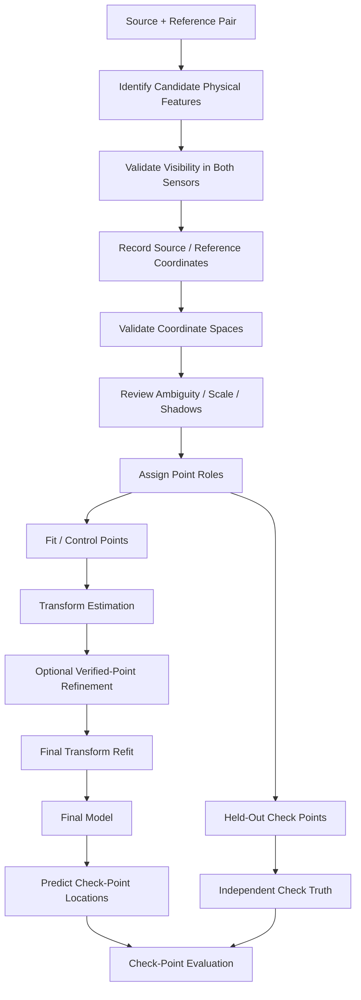
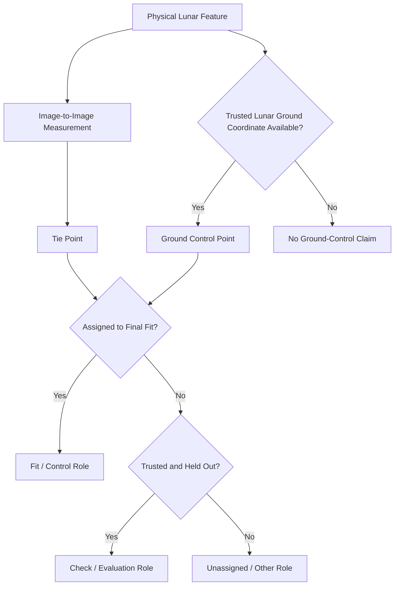
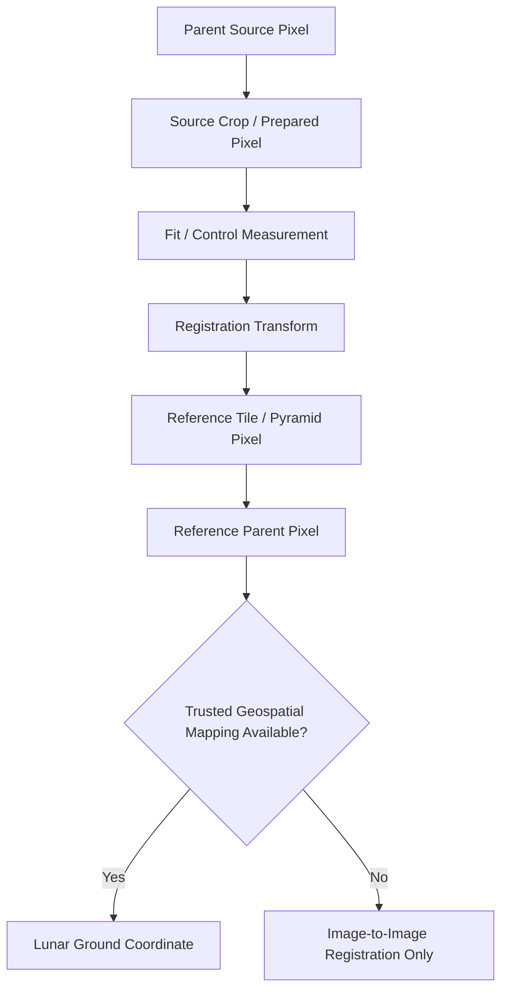

# Control Points

Control points are the geometric measurements used to constrain or estimate the relationship between lunar images in ChandraMap.

Because the terms **control point**, **tie point**, **ground control point**, and **check point** have different meanings across computer vision, remote sensing, GIS, photogrammetry, and planetary mapping, ChandraMap uses them carefully and records the role of every point explicitly.

> **Control points constrain or estimate the registration model; check points evaluate that model independently.**

A point used in transformation fitting contributes information to the estimated geometry. It therefore cannot simultaneously provide fully independent evidence that the fitted geometry generalizes.

> **A point used to fit the final transform is not an independent check point for that same run.**

Control-point usefulness also depends on more than quantity.

> **Control-point quality and spatial distribution matter more than raw point count alone.**

A large cluster of points around one crater may provide weaker whole-image geometric support than fewer reliable points distributed across the valid overlap.

Every point must also remain attached to the image or map grid in which its coordinates are defined.

> **Every control point belongs to a defined coordinate space.**

A coordinate such as `(450.2, 180.6)` is incomplete unless ChandraMap knows whether it refers to:

* a source parent product;
* a prepared source image;
* a crop;
* an IIRS-derived representation;
* an LRO NAC tile;
* a NAC pyramid level;
* a WAC product;
* a map-projected raster.

A further distinction is essential:

> **Image-to-image tie points and geospatial ground control points are not the same thing.**

A tie point links the same physical feature between images.

A ground control point additionally links an image measurement to independently trusted lunar ground or map coordinates.

Finally:

> **RANSAC inliers are algorithmically verified correspondences, not automatically independent control or ground-truth points.**

They can support transformation fitting, but their algorithmic provenance must remain explicit.

Point coordinates may also contain decimal values without possessing equivalent physical accuracy.

> **Point precision is limited by feature visibility, sensor information content, geometry, and truth uncertainty.**

This document defines how ChandraMap interprets and uses:

* fit/control points;
* tie points;
* ground control points;
* held-out check points;
* point sets;
* point coordinate lineage;
* point quality;
* point uncertainty;
* point-set versioning.

It complements, rather than duplicates:

* [`ground-truth.md`](ground-truth.md);
* [`../datasets/ground-truth-preparation.md`](../datasets/ground-truth-preparation.md);
* [`../algorithms/ransac.md`](../algorithms/ransac.md);
* [`../algorithms/residual-analysis.md`](../algorithms/residual-analysis.md).

---

## 1. Why Control Points Matter

Control/fit points provide the geometric evidence used to estimate relationships between source and reference imagery.

Depending on the experiment, they may support:

* translation estimation;
* affine estimation;
* homography estimation where appropriate;
* model refitting after sub-pixel refinement;
* local registration;
* relative image alignment;
* absolute geolocation where trusted ground control exists;
* residual analysis;
* geometric model diagnostics;
* benchmark reproducibility.

The fitted transformation depends directly on:

* point identity;
* point coordinates;
* point distribution;
* point uncertainty;
* coordinate-system interpretation.

A point-set mistake can therefore propagate into the entire registration result.

---

## 2. What Control Points Do Not Prove

A control-point set by itself does **not** establish:

* independent registration accuracy;
* absolute geolocation accuracy;
* correct global retrieval;
* scene-wide geometric correctness;
* physical correctness of every point;
* correctness outside the region supported by the points.

Those claims require additional evidence such as:

* held-out check points;
* independent geographic truth;
* retrieval truth;
* residual analysis;
* spatial-coverage diagnostics.

A transform may fit its control points very well while still performing poorly on unseen locations.

---

# Terminology

## 3. Control Point

In this document, a **control point** is a trusted or accepted point correspondence intentionally used to constrain or estimate registration geometry.

Because terminology differs across disciplines, ChandraMap often uses the clearer phrase:

> **fit/control point**

when the point contributes directly to transformation estimation.

A control point does not necessarily have independently known lunar geographic coordinates.

---

## 4. Fit Point

A **fit point** is any point used during:

* transformation estimation;
* transformation refitting.

Its defining property is its role in fitting.

A fit point can originate from:

* independently annotated correspondence;
* validated benchmark control;
* algorithmically generated verified inlier;

depending on the experiment.

Its provenance must remain explicit.

---

## 5. Control-Point Set

A **control-point set** is the collection of points assigned to constrain or fit a transformation for a defined:

* source/reference pair;
* coordinate context;
* benchmark;
* point-set version.

---

## 6. Tie Point

A **tie point** identifies the same physical feature in two or more images.

Conceptually:

$$
p_A \leftrightarrow p_B
$$

A tie point constrains **relative image geometry**.

It does not necessarily have independently known lunar coordinates.

---

## 7. Ground Control Point

A **Ground Control Point (GCP)** links an image measurement to independently trusted ground or map coordinates.

In a lunar context, a GCP requires appropriate:

* lunar coordinates;
* reference-system context;
* provenance;
* uncertainty information.

An ordinary image match is not automatically a GCP.

---

## 8. Check Point

A **check point** is trusted truth that remains outside final model fitting and is used to evaluate the resulting transformation.

Check points support independent quantities such as:

* check residual;
* check RMSE.

---

## 9. Evaluation Point

An **evaluation point** is a general point used during evaluation.

For registration-accuracy reporting, ChandraMap prefers the more precise term:

> **held-out check point**

when the point is independently withheld from fitting.

---

## 10. Candidate Match

A **candidate match** is a matcher-proposed source/reference correspondence before geometric verification.

It is not yet a control point, truth point, or verified inlier by definition.

---

## 11. Verified Inlier

A **verified inlier** is a candidate match accepted as geometrically consistent with the selected model under the configured robust-estimation rule.

Verified inliers may be used as algorithmic fit support.

They are not automatically:

* independent annotations;
* ground truth;
* GCPs.

---

## 12. Truth Point

A **truth point** is an independently prepared or otherwise validated point used for evaluation.

See [`ground-truth.md`](ground-truth.md).

---

## 13. Control Network

A **control network** is a connected network of image measurements and potentially controlled object/ground relationships used to constrain geometry.

This is an advanced photogrammetric concept.

ChandraMap documentation should not imply that a full planetary control-network system is currently implemented unless repository implementation and scope explicitly establish it.

---

## 14. Point ID

A **point ID** is a stable identifier for a point record.

Stable point identity supports:

* review;
* correction history;
* residual tracking;
* version comparison;
* benchmark reproducibility.

---

## 15. Point Role

A **point role** describes how the point is used in a particular benchmark or run.

Conceptual roles may include:

* fit;
* check;
* tie;
* ground control.

These are conceptual descriptions, not claims about implemented enum values.

---

# Point-Type Overview

## 16. Point-Type Comparison

| Point Type           | Image-to-Image Relationship         | Used for Fitting? | Independently Known Ground Coordinates? |    Independent Evaluation? |
| -------------------- | ----------------------------------- | ----------------: | --------------------------------------: | -------------------------: |
| Candidate match      | Proposed                            |  No by definition |                                      No |                         No |
| Verified inlier      | Model-consistent                    |             Often |                         Not necessarily |          Not automatically |
| Fit / control point  | Yes                                 |               Yes |                                   Maybe | No for the same fitted run |
| Tie point            | Yes                                 |             Maybe |                            Not required |   Depends on assigned role |
| Ground control point | Image ↔ trusted ground relationship |            May be |                                     Yes |   Depends on assigned role |
| Check point          | Trusted relationship                |                No |                                   Maybe |                        Yes |

This table describes scientific roles, not a required software schema.

---

# Tie Points and Control Points

## 17. Tie Points

A tie point expresses that two image measurements correspond to the same physical feature.

For example:

$$
p_{\text{OHRC}}
\leftrightarrow
p_{\text{NAC}}
$$

Tie points can support:

* relative registration;
* multi-image geometry;
* transformation estimation.

---

## 18. Control Points

A tie point becomes a **fit/control point** when it is intentionally used to constrain the model being estimated.

Therefore:

> every fit/control point used in image-to-image registration may be a tie relationship, but not every tie point needs to participate in fitting.

---

## 19. Tie Point Does Not Mean Ground Control

A tie point can establish:

> these two image locations represent the same feature.

It does not automatically establish:

> this feature is at an independently known lunar latitude, longitude, elevation, or map coordinate.

---

# Ground Control Points

## 20. Ground Control Point Definition

A lunar GCP combines an image measurement with trusted object/ground coordinates.

Conceptually:

$$
p_{\text{image}}
\leftrightarrow
P_{\text{lunar ground}}
$$

where \(P_{\text{lunar ground}}\) is defined in a documented lunar reference system.

---

## 21. Lunar GCP Requirements

A scientifically meaningful lunar GCP requires, as applicable:

* image measurement;
* trusted lunar coordinate;
* coordinate-reference information;
* lunar body/reference model;
* longitude convention;
* units;
* map/projection context;
* provenance;
* uncertainty information.

Do not invent missing geospatial metadata.

---

## 22. Image Control vs Ground Control

| Property                                    | Image Tie / Fit Point |       Ground Control Point |
| ------------------------------------------- | --------------------: | -------------------------: |
| Source image coordinate                     |                   Yes |                        Yes |
| Reference image coordinate                  |               Usually | Optional/context-dependent |
| Independently known lunar ground coordinate |          Not required |                   Required |
| Supports relative image registration        |                   Yes |                        Yes |
| Supports absolute geolocation by itself     |                    No |                Potentially |
| Requires geospatial reference definition    |                    No |                        Yes |
| May be used as a fit point                  |                   Yes |                        Yes |
| Automatically independent evaluation truth  |                    No |     No; role still matters |

---

## 23. GCP Does Not Guarantee Perfect Geolocation

Ground control itself may contain uncertainty from:

* coordinate-source accuracy;
* reference-product geometry;
* terrain model;
* coordinate conversion;
* image-measurement localization.

GCP-supported geolocation is therefore not infinitely precise.

---

# Fit Points and Check Points

## 24. Fit / Control Point

A fit point contributes to:

$$
\text{point observations}
\rightarrow
\text{estimated transform}
$$

Its residual after fitting is a **fit residual**.

---

## 25. Check Point

A check point contributes to:

$$
\text{final transform}
+
\text{held-out truth}
\rightarrow
\text{independent error}
$$

It remains outside the final model fit.

---

## 26. Why They Must Stay Separate

If a point influenced the transform, the fitted model has already been optimized in part to explain that point.

Its residual therefore measures model fit, not fully independent generalization.

> **A point used to fit the final transform is not an independent check point for that same run.**

---

## 27. Fit / Check Comparison

| Property                               | Fit / Control Point |             Check Point |
| -------------------------------------- | ------------------: | ----------------------: |
| Used in transform estimation           |                 Yes |                      No |
| Used in final refit                    |                 Yes |                      No |
| Produces fit residual                  |                 Yes | Not as its primary role |
| Provides independent accuracy evidence |        No by itself |                     Yes |
| Should be spatially distributed        |          Preferably |              Preferably |
| Role should be frozen by benchmark     |                 Yes |                     Yes |
| Can be moved after seeing test results |                  No |                      No |

---

# Point Provenance

## 28. Potential Sources of Fit Points

Fit/control points may originate from:

* independently annotated truth;
* authoritative control information;
* benchmark-specific control annotations;
* algorithm-generated verified inliers;
* other validated correspondence sources.

These origins are not equivalent.

---

## 29. Algorithmic Fit Support

A point produced by:

* SIFT;
* ALIKED + LightGlue;
* LoFTR;
* RIFT/CFOG-style methods;

and subsequently accepted by RANSAC is:

> an algorithmically generated verified inlier.

It may legitimately support transformation fitting.

It must not be mislabeled as:

* independent truth;
* independently surveyed control;
* GCP.

---

## 30. Independently Prepared Fit Points

A benchmark may also use predefined trusted points directly for model fitting.

If so, their independent provenance should be recorded.

This is an evaluation design choice and should not be assumed to be the default inference path.

---

# Control-Point Selection

## 31. Suitable Physical Features

Useful points are generally:

* identifiable;
* stable;
* visible in both representations;
* appropriately scaled;
* minimally ambiguous;
* spatially useful.

Potential feature examples include:

* crater centers where well defined;
* crater-rim intersections;
* ridge intersections;
* distinctive terrain junctions;
* other persistent morphology.

No universal feature family is mandated.

---

## 32. Ambiguous Features

Avoid or explicitly flag:

* repetitive indistinguishable small craters;
* poorly defined smooth terrain;
* partially obscured structures;
* features visible only in one sensor;
* uncertain crater centers;
* illumination-dependent boundaries.

Quality is more important than point count.

---

# Shadows and Illumination

## 33. Shadow Boundaries Require Caution

A shadow edge is affected by:

* Sun direction;
* Sun elevation;
* local terrain relief.

The terrain does not move when the shadow moves.

Therefore:

> **shadow-edge coordinates are not automatically stable physical control points.**

---

## 34. Physical Structure vs Appearance Structure

Prefer a stable physical terrain feature over a transient illumination boundary where possible.

See [`../algorithms/illumination-handling.md`](../algorithms/illumination-handling.md).

---

# Sensor-Aware Point Selection

## 35. Feature Must Exist at Source Scale

A reference image may contain detail the source sensor never resolved.

Such detail cannot automatically define a precise source point.

> **Reference resolution does not create source-sensor information.**

---

## 36. OHRC

OHRC is the Chandrayaan-2 **Orbiter High Resolution Camera**, a visible/panchromatic instrument.

Current project context commonly uses approximately:

> **~0.25–0.32 m/pixel**

depending on product/documentation.

Actual product metadata remains authoritative.

Control-point implications include:

* fine terrain features may be visible;
* repeated small craters may create ambiguity;
* illumination can move shadows across fine detail;
* fractional-pixel coordinates do not automatically provide equally fine lunar-ground accuracy.

See [`../sensors/ohrc.md`](../sensors/ohrc.md).

---

## 37. TMC-2

TMC-2 is the Chandrayaan-2 **Terrain Mapping Camera-2**.

Current project planning commonly uses approximately:

> **~5 m/pixel**

with actual product metadata authoritative.

Useful points should emphasize structures physically visible at TMC-2 scale, such as appropriate:

* crater morphology;
* ridge structures;
* broad terrain junctions.

Do not rely on tiny NAC-only details absent from TMC-2.

See [`../sensors/tmc2.md`](../sensors/tmc2.md).

---

## 38. IIRS

IIRS is the Chandrayaan-2 **Imaging Infrared Spectrometer**.

Project-level context includes approximately:

* ~80 m/pixel;
* ~0.8–5.0 µm;
* roughly ~250–256 bands depending on product/documentation.

Actual metadata remains authoritative.

IIRS requires a documented registration-friendly 2D representation.

A point used with IIRS should identify:

* parent IIRS product;
* selected/derived 2D representation;
* spatial grid;
* coordinate space.

Suitable point features should exist at IIRS's spatial information scale.

Do **not** assign precise IIRS control to tiny NAC-only terrain structures that are not observable in the IIRS representation.

See [`../sensors/iirs.md`](../sensors/iirs.md).

---

## 39. LRO NAC

LROC NAC is a fine/local lunar reference family.

Current project planning often treats NAC imagery as approximately:

> **~0.5–2 m/pixel**

depending on product/acquisition geometry.

Actual product metadata remains authoritative.

NAC can provide a precise reference grid, but its fine detail should not be confused with source-sensor information.

See [`../sensors/lro-nac.md`](../sensors/lro-nac.md).

---

## 40. LRO WAC

LROC WAC provides broader/coarser lunar context.

Its effective scale depends on:

* product;
* mode;
* processing.

Do not assume a universal WAC GSD.

See [`../sensors/lro-wac.md`](../sensors/lro-wac.md).

---

# Spatial Distribution

## 41. Why Distribution Matters

A transform supported only by one small image region may extrapolate poorly elsewhere.

For example:

* many points around one crater;
* no points near other overlap regions;

can make whole-scene interpretation weak.

> **Control-point quality and spatial distribution matter more than raw point count alone.**

---

## 42. Spread Across the Overlap

Where valid features exist, fit points should ideally span:

* different horizontal positions;
* different vertical positions;
* multiple terrain regions;
* meaningful portions of the overlap.

Uniformity should not be forced into areas where no reliable correspondence exists.

---

## 43. Collinearity and Degeneracy

Point configurations concentrated along one line or narrow structure can provide poor geometric support for some models.

Other problematic configurations include:

* duplicate points;
* nearly identical point locations;
* extremely small spatial clusters.

Exact degeneracy thresholds depend on the model and implementation.

---

## 44. Spatial Coverage Metrics

Useful diagnostics may include:

* grid occupancy;
* convex-hull coverage.

See [`metrics.md`](metrics.md).

Coverage measures should not be treated as proof that the points are physically correct.

---

## 45. More Points Are Not Automatically Better

A point set containing many:

* duplicates;
* ambiguous points;
* clustered points;
* low-quality matches;

may be worse than a smaller set of:

* reliable;
* well-distributed;
* physically meaningful;

points.

---

# Transform-Model Requirements

## 46. Model Family Influences Point Geometry

Different transformation families require different geometric support.

Examples include:

* translation;
* similarity;
* affine;
* homography.

See [`../algorithms/transforms.md`](../algorithms/transforms.md).

---

## 47. Mathematical Minimum vs Reliable Support

The theoretical minimum number of point correspondences required to solve a model is not the same as a reliable operational point set.

Practical fitting may need additional points to support:

* robustness;
* outlier rejection;
* coverage;
* uncertainty reduction.

ChandraMap does not define one universal operational minimum in this document.

---

## 48. Degenerate Configurations

Even when point count is mathematically sufficient, geometry may still be weak because of:

* duplicate coordinates;
* near-collinearity;
* tight clustering;
* poor spatial extent.

Model validation should therefore consider configuration, not only count.

---

# Control Points and RANSAC

## 49. Candidate Matches

The matcher produces candidate correspondences.

See [`../algorithms/matching.md`](../algorithms/matching.md).

---

## 50. Match Filtering

Filtering may remove:

* descriptor ambiguity;
* weak candidate relationships;
* duplicates;

before geometric verification.

See [`../algorithms/match-filtering.md`](../algorithms/match-filtering.md).

Filtered candidates remain algorithm-generated.

---

## 51. RANSAC Verification

RANSAC uses candidate correspondences to identify geometric consensus.

Conceptually:

$$
\text{candidate matches}
\rightarrow
\text{model hypotheses}
\rightarrow
\text{verified inliers}
$$

See [`../algorithms/ransac.md`](../algorithms/ransac.md).

---

## 52. RANSAC Inliers as Fit Support

Verified inliers can become the algorithm's fit set.

This is legitimate.

Their scientific role should be recorded as:

> algorithmically verified fit support.

Do not silently relabel them as independently prepared truth.

---

## 53. Independent Control Points

A benchmark can instead use independently prepared control points to fit a transformation directly.

That is a different experimental design.

Its provenance should remain explicit.

---

# Control Points and Sub-Pixel Refinement

## 54. Correct Processing Order

The preferred algorithmic order is:

1. generate candidate matches;
2. perform configured match filtering;
3. run RANSAC/geometric verification;
4. obtain verified inliers;
5. refine fit-suitable inlier coordinates where supported;
6. refit the final transformation;
7. evaluate on held-out check points.

See [`../algorithms/subpixel-refinement.md`](../algorithms/subpixel-refinement.md).

---

## 55. Preserve Original and Refined Coordinates

Where refinement is used, a point record may conceptually preserve:

* original source coordinate;
* original reference coordinate;
* refined coordinate;
* refinement offset;
* refinement status.

This improves reproducibility and diagnostics.

---

## 56. Refit After Refinement

If fit coordinates change, the transformation should be refitted using the updated coordinates.

Do not apply an old transform estimated from obsolete point positions as though it represented the refined set.

---

## 57. Floating Point Does Not Equal Ground Accuracy

A coordinate such as:

`x = 123.42`

is numerically fractional.

It does not establish that the corresponding lunar position is physically known to:

* `0.01` pixel;
* a comparable fraction of the sensor GSD.

Numeric precision and physical accuracy are different concepts.

---

# Coordinate Spaces

## 58. Source Coordinate Space

Possible source spaces include:

* parent mission-product pixels;
* prepared source pixels;
* crop pixels;
* model-input pixels;
* IIRS-derived representation pixels;
* map-projected source raster.

---

## 59. Reference Coordinate Space

Possible reference spaces include:

* NAC parent-product pixels;
* NAC tile pixels;
* NAC pyramid-level pixels;
* WAC pixels;
* map-projected reference coordinates.

---

## 60. Coordinate-Space Metadata Is Mandatory

A point record containing only:

```yaml
x: "PLACEHOLDER"
y: "PLACEHOLDER"
```

is incomplete.

It must also identify the raster/grid those coordinates belong to.

---

## 61. x/y vs Row/Column

In many image-processing conventions:

* `x` corresponds to the horizontal/column direction;
* `y` corresponds to the vertical/row direction.

However, ChandraMap should use the repository's explicitly documented convention rather than assuming one.

See [`../datasets/data-format.md`](../datasets/data-format.md).

---

## 62. Pixel Origin

Point interpretation may depend on whether indexing is:

* zero-based;
* one-based.

The repository's actual convention must remain authoritative.

---

## 63. Pixel Center vs Pixel Corner

High-precision coordinate interpretation may also depend on whether integer coordinates refer to:

* pixel centers;
* pixel corners.

The convention must remain explicit.

---

# Crop and Tile Coordinates

## 64. Crop Offset

For a simple crop with origin:

$$
(x_0, y_0)
$$

a conceptual mapping is:

$$
x_{\text{parent}}
=
x_{\text{crop}} + x_0
$$

$$
y_{\text{parent}}
=
y_{\text{crop}} + y_0
$$

subject to the project's coordinate convention and any additional preprocessing transforms.

---

## 65. Reference Tile Offset

A reference-tile point should remain traceable to:

* tile identity;
* parent reference;
* tile origin;
* tile coordinate system.

---

## 66. Offset Loss

A point can be locally correct and globally wrong if:

* crop offset;
* tile offset;

is lost.

Coordinate lineage is therefore part of point provenance.

---

# Pyramid Coordinates

## 67. Pyramid Level Identity

If a point is measured in:

> NAC pyramid level \(L\)

the point belongs to that level's grid.

Record the level explicitly.

---

## 68. Mapping Between Levels

Mapping a point to another level may require:

* level scaling;
* crop/tile offset;
* pixel-center convention;
* parent-image lineage.

See [`../algorithms/scale-pyramid.md`](../algorithms/scale-pyramid.md).

---

## 69. Prefer Canonical Coordinates

Where practical, preserve one canonical point definition in a stable parent coordinate system and derive:

* crop;
* tile;
* pyramid;

coordinates deterministically.

This reduces duplicate hand-edited truth.

---

# Image Coordinates and Ground Coordinates

## 70. Image Coordinates

Image points are defined relative to a raster grid.

For example:

$$
p=(x,y)
$$

in:

* OHRC pixels;
* NAC tile pixels;
* IIRS representation pixels.

---

## 71. Lunar Ground Coordinates

Ground coordinates may include:

* latitude;
* longitude;
* projected map coordinates;
* elevation where available and relevant.

They require independent geospatial context.

---

## 72. Lunar Reference Context

Ground control should identify where applicable:

* planetary body/reference;
* coordinate system;
* projection;
* longitude convention;
* units;
* datum/reference model.

Do not invent conventions that the repository has not established.

---

# Geolocation

## 73. Tie Points Do Not Automatically Geolocate the Source

An image-to-image tie relationship provides:

$$
\text{source pixel}
\rightarrow
\text{reference pixel}
$$

Geolocation additionally requires:

$$
\text{reference pixel}
\rightarrow
\text{trusted lunar coordinate}
$$

---

## 74. GCP-Supported Geolocation

Where valid GCPs exist, they may support:

* absolute geolocation;
* map alignment;
* sensor-geometry validation.

This is distinct from ordinary relative registration.

---

# Point Identity and Roles

## 75. Stable Point IDs

Stable IDs allow ChandraMap to track:

* coordinate revisions;
* reviewer decisions;
* residual history;
* benchmark usage;
* deprecation.

---

## 76. Keep IDs Stable and Metadata Structured

Prefer:

* stable point ID;
* structured metadata;

rather than encoding every property into an excessively complex identifier.

---

## 77. Point Role Is Benchmark-Specific

A physical annotated point could theoretically be assigned as:

* fit;

in one experiment and:

* check;

in another independent protocol.

Within a given benchmark/run, the role must remain frozen.

---

## 78. Do Not Change Roles After Seeing Results

Invalid behavior includes:

> moving a difficult check point into the fit set because it increases check error.

Role changes require:

* protocol change;
* new benchmark/run definition;

not post-hoc performance tuning.

---

# Control-Point Uncertainty

## 79. Sources of Uncertainty

Point uncertainty may arise from:

* human localization;
* sensor sampling;
* point-spread behavior;
* cross-modality appearance;
* illumination;
* shadows;
* resampling;
* reference geolocation;
* terrain relief;
* projection.

---

## 80. Record Uncertainty Where Practical

Conceptual metadata may include:

* review quality;
* uncertainty status;
* annotator agreement;
* ambiguity notes.

No universal uncertainty equation or threshold is prescribed here.

---

## 81. Precision vs Accuracy

A point can be represented numerically with many decimal digits and still be physically uncertain.

> **Numeric precision is not the same as scientific accuracy.**

---

# Point Quality

## 82. Strong Control-Point Characteristics

A useful control point is generally:

* identifiable;
* stable;
* visible in both images;
* sufficiently distinctive;
* appropriately scaled;
* away from invalid data where possible;
* geometrically useful;
* minimally ambiguous.

---

## 83. Weak Control-Point Characteristics

Potential warning signs include:

* repetitive crater ambiguity;
* moving shadow boundary;
* reference-only fine detail;
* location near NoData;
* uncertain feature center;
* untracked coordinate conversion;
* duplicate physical point;
* unresolved disagreement.

---

# Multiple Annotators and Review

## 84. Independent Review

Manually prepared points can benefit from independent review.

See [`../datasets/ground-truth-preparation.md`](../datasets/ground-truth-preparation.md).

---

## 85. Agreement Diagnostics

Conceptual diagnostics may include:

* coordinate displacement;
* feature-identity agreement;
* accept/reject disagreement.

No universal threshold is prescribed.

---

## 86. Adjudication

Disagreements may be reviewed before benchmark freeze.

Possible conceptual outcomes include:

* accept;
* revise;
* reject;
* ambiguous.

Exact status values should come from repository schemas if implemented.

---

# Control-Point Quality Control

## 87. Coordinate Validation

Check:

* finite coordinates;
* correct asset;
* correct coordinate space;
* image bounds;
* indexing convention.

---

## 88. Feature Validation

Confirm that source and reference positions represent the same physical feature as reliably as the point's intended use requires.

---

## 89. Duplicate Detection

Duplicate points can unintentionally overweight one feature or image region.

Review:

* exact duplicates;
* near-duplicates;
* multiple measurements of the same physical feature.

---

## 90. Spatial Distribution QC

Review:

* clustering;
* overlap coverage;
* extreme localization;
* collinearity risk.

---

## 91. Sensor Compatibility QC

Verify that the selected feature is meaningful at the source sensor's physical scale.

This is especially important for:

* TMC-2;
* IIRS.

---

## 92. Role QC

For independent evaluation:

$$
\text{fit set}
\cap
\text{check set}
=
\varnothing
$$

for the evaluated run.

---

## 93. Crop / Tile / Pyramid QC

Verify all transformations between:

* local coordinates;
* parent-product coordinates;
* pyramid coordinates;
* map coordinates.

---

# Control-Point Set

## 94. Point-Set Identity

A point set should have a stable conceptual identity and version.

It may be associated with:

* pair ID;
* truth version;
* role assignment;
* coordinate definitions;
* review provenance.

---

## 95. Set-Level Metadata

Useful conceptual set metadata include:

* fit-point count;
* check-point count;
* source coordinate space;
* reference coordinate space;
* coverage diagnostics;
* intended transform context;
* review/provenance;
* point-set version.

---

# Conceptual Control-Point Record

## 96. Illustrative Structure

The following is an **illustrative conceptual structure — not an implemented schema**:

```yaml
point_id: "PLACEHOLDER_POINT_ID"
pair_id: "PLACEHOLDER_PAIR_ID"
role: "PLACEHOLDER_ROLE"

source:
  asset_id: "PLACEHOLDER_SOURCE_ID"
  coordinate_space: "PLACEHOLDER_SOURCE_SPACE"
  x: "PLACEHOLDER"
  y: "PLACEHOLDER"

reference:
  asset_id: "PLACEHOLDER_REFERENCE_ID"
  coordinate_space: "PLACEHOLDER_REFERENCE_SPACE"
  x: "PLACEHOLDER"
  y: "PLACEHOLDER"

provenance:
  type: "PLACEHOLDER_PROVENANCE"
  review_status: "PLACEHOLDER_STATUS"

uncertainty:
  status: "PLACEHOLDER_UNCERTAINTY"

point_set_version: "PLACEHOLDER_VERSION"
```

No real scientific measurement or exact repository field is implied.

---

# Conceptual GCP Record

## 97. Illustrative Ground-Control Structure

The following is **illustrative only** and does not imply that ChandraMap currently contains such GCP records:

```yaml
point_id: "PLACEHOLDER_GCP_ID"

image_measurement:
  asset_id: "PLACEHOLDER_ASSET"
  coordinate_space: "PLACEHOLDER_IMAGE_SPACE"
  x: "PLACEHOLDER"
  y: "PLACEHOLDER"

ground_coordinate:
  coordinate_system: "PLACEHOLDER_LUNAR_COORDINATE_SYSTEM"
  latitude_or_y: "PLACEHOLDER"
  longitude_or_x: "PLACEHOLDER"
  elevation: "PLACEHOLDER_OPTIONAL"

provenance:
  source: "PLACEHOLDER_AUTHORITY"
  uncertainty: "PLACEHOLDER"
```

A valid implementation would need clearly defined lunar-coordinate semantics.

---

# Conceptual Point-Set Record

## 98. Illustrative Set Structure

The following is also conceptual:

```yaml
point_set_id: "PLACEHOLDER_SET_ID"
pair_id: "PLACEHOLDER_PAIR"

roles:
  fit_points: "PLACEHOLDER_COUNT"
  check_points: "PLACEHOLDER_COUNT"

coordinate_spaces:
  source: "PLACEHOLDER_SOURCE_SPACE"
  reference: "PLACEHOLDER_REFERENCE_SPACE"

coverage:
  metric: "PLACEHOLDER_METRIC"
  value: "PLACEHOLDER_VALUE"

version: "PLACEHOLDER_VERSION"
```

No project counts or implementation schema are implied.

---

# Point Metrics

## 99. Fit-Point Count

The number of points used in final model fitting is a diagnostic.

It should not be interpreted as an accuracy score.

---

## 100. Check-Point Count

The number of independent evaluation points should accompany check-point error reporting.

The evidential strength of an RMSE depends partly on how many independent observations support it.

No universal required count is defined here.

---

## 101. Fit-Point Coverage

Fit-point spatial coverage describes the geometric support available to transformation estimation.

---

## 102. Check-Point Coverage

Check-point coverage describes how broadly independent evaluation samples the valid overlap.

---

## 103. Fit Residual

Fit residuals are measured on points used for model estimation.

They are diagnostics.

---

## 104. Check RMSE

Check RMSE is measured on held-out check points.

Where reliable truth exists, it provides stronger evidence of registration accuracy than fit residual alone.

See:

* [`metrics.md`](metrics.md);
* [`../algorithms/residual-analysis.md`](../algorithms/residual-analysis.md).

---

# Residual Analysis

## 105. Fit Residual Patterns

Fit residuals may reveal:

* one poor fitting point;
* unstable model behavior;
* clustered support;
* model mismatch.

They do not independently establish generalization.

---

## 106. Check Residual Patterns

Check residuals may reveal:

* spatial bias;
* extrapolation weakness;
* projection mismatch;
* transform-model limitation;
* terrain-dependent error.

---

# Transform Estimation

## 107. Control Points Constrain the Transform

See [`../algorithms/transforms.md`](../algorithms/transforms.md).

The fitted transformation is determined by:

* point coordinates;
* model family;
* fitting procedure;
* weighting/uncertainty strategy where applicable.

---

## 108. More Flexible Models Need Care

A homography may fit a control set more tightly than an affine model.

That does not automatically imply lower held-out error.

Model choice should consider:

* independent evaluation;
* physical appropriateness;
* stability.

---

## 109. Do Not Select Models Using Final Test Check Points

Transformation-model selection should occur through:

* development;
* validation;

rather than repeated optimization against final held-out test truth.

---

# Registration

## 110. Final Model Use

See [`../algorithms/registration.md`](../algorithms/registration.md).

Fit/control points support the final model.

The final model is then evaluated against:

* held-out check points;
* other valid independent truth.

---

# Retrieval

## 111. Retrieval Is a Different Task

Global retrieval asks:

> where should the system look?

Its primary truth concerns:

* geographic region;
* reference tile;
* reference observation.

It does not normally use local control points as the retrieval truth itself.

---

## 112. Local Geometry After Retrieval

Once a candidate reference is retrieved, local correspondences may support:

* RANSAC;
* transform fitting;
* registration.

Keep:

* retrieval truth;
* fit/control points;
* check points;

semantically separate.

---

# Ground Truth Relationship

## 113. Control Points and Ground Truth

See [`ground-truth.md`](ground-truth.md).

Ground truth may provide:

* trusted fit/control points;
* held-out check points;
* GCPs.

However:

> not every fit/control point is independent ground truth.

Algorithm-generated verified inliers are a major example.

---

## 114. Ground-Truth Preparation

See [`../datasets/ground-truth-preparation.md`](../datasets/ground-truth-preparation.md).

That file defines how trusted annotations are:

* created;
* reviewed;
* prepared.

This file defines how those points are used in geometric estimation and evaluation.

---

# Pair Definition and Metadata

## 115. Pair Definition

See [`../datasets/pair-definition.md`](../datasets/pair-definition.md).

Every point set should belong to a defined:

* source;
* reference;
* pair/version.

---

## 116. Parent Lineage

If a benchmark pair uses:

* crops;
* tiles;
* derived representations;

point records should still preserve parent-product lineage.

---

## 117. Metadata

See [`../datasets/metadata.md`](../datasets/metadata.md).

Point interpretation may depend on:

* sensor;
* product identity;
* GSD;
* projection;
* dimensions;
* representation;
* pyramid level.

---

## 118. Data Format

See [`../datasets/data-format.md`](../datasets/data-format.md).

Point serialization should follow the repository's documented coordinate/data-format conventions rather than inventing a competing convention.

---

## 119. Dataset Structure

See [`../datasets/dataset-structure.md`](../datasets/dataset-structure.md).

Trusted control/check annotations should remain logically separate from:

* raw mission data;
* temporary caches;
* algorithm-generated results.

---

# Algorithm Relationships

## 120. Sensor Routing

See [`../algorithms/sensor-routing.md`](../algorithms/sensor-routing.md).

The selected route determines which representation reaches matching and registration.

Point coordinates must map correctly into that representation.

---

## 121. Preprocessing

See [`../algorithms/preprocessing.md`](../algorithms/preprocessing.md).

If preprocessing applies:

* cropping;
* resizing;
* resampling;
* map projection;

point coordinates must be transformed consistently.

---

## 122. Avoid Manual Point Recreation

Prefer deterministic coordinate transformation from canonical points rather than manually re-annotating points after each resize or pyramid operation.

---

## 123. Illumination Handling

See [`../algorithms/illumination-handling.md`](../algorithms/illumination-handling.md).

Moving shadow boundaries should not automatically be used as stable control features.

---

## 124. Scale Pyramid

See [`../algorithms/scale-pyramid.md`](../algorithms/scale-pyramid.md).

Point coordinates must retain reference-level identity.

---

## 125. Matching

See [`../algorithms/matching.md`](../algorithms/matching.md).

Matcher output is:

> candidate correspondence.

It is not automatically trusted control truth.

---

## 126. Match Filtering

See [`../algorithms/match-filtering.md`](../algorithms/match-filtering.md).

Filtered candidates remain algorithm-generated.

---

## 127. RANSAC

See [`../algorithms/ransac.md`](../algorithms/ransac.md).

RANSAC inliers may become fit support.

They do not automatically become independent truth or GCPs.

---

## 128. Sub-Pixel Refinement

See [`../algorithms/subpixel-refinement.md`](../algorithms/subpixel-refinement.md).

Preserve:

* original coordinate;
* refined coordinate.

Refit geometry after fit-point refinement.

---

## 129. Residual Analysis

See [`../algorithms/residual-analysis.md`](../algorithms/residual-analysis.md).

Fit points produce fit residuals.

Held-out check points produce independent evaluation residuals.

---

# Benchmark Protocol

## 130. Frozen Point Roles

See [`benchmark-protocol.md`](benchmark-protocol.md).

Before a formal test run, freeze:

* point-set version;
* fit/check assignment;
* truth version;
* coordinate spaces;
* evaluation rules.

---

## 131. No Role Switching During Test Execution

Do not move a difficult check point into the fit set after observing poor evaluation performance.

That compromises independence.

---

# Benchmark Categories

## 132. Categories and Point Sets

See [`benchmark-categories.md`](benchmark-categories.md).

Point density and quality may vary with:

* sensor;
* scale;
* modality;
* terrain.

Those properties do not determine benchmark categories from algorithm performance.

---

# Point-Set Versioning

## 133. Why Versioning Matters

Point sets may change because of:

* feature-identity correction;
* coordinate correction;
* role correction;
* ambiguity review;
* improved annotation;
* coordinate-mapping correction.

These changes can alter benchmark results.

---

## 134. Immutable Published Versions

Once a benchmark uses a particular point-set version, do not silently modify it.

Material corrections should produce a traceable new version.

---

## 135. Historical Reproducibility

Historical benchmark results should remain traceable to:

* exact pair version;
* exact point-set version;
* exact truth version;
* exact benchmark version.

---

# Point Deprecation

## 136. Invalid Point

A point may later be found invalid because it is:

* the wrong feature;
* duplicated;
* ambiguous;
* mis-mapped;
* outside the valid region.

Such correction should occur through versioned truth governance.

---

## 137. Difficult Is Not Invalid

A point should not be removed merely because:

* one algorithm fails on it;
* it increases check RMSE.

Removal requires independent scientific justification.

---

# Leakage Prevention

## 138. Fit/Check Leakage

Held-out check points must not enter final transformation fitting.

---

## 139. Threshold-Tuning Leakage

Do not repeatedly tune:

* matcher thresholds;
* RANSAC thresholds;
* refinement parameters;
* transformation-model choices;

against final test check error.

---

## 140. Learned-Model Leakage

For learned methods, final test truth should remain outside:

* training;
* fine-tuning;
* test-specific model selection.

---

# Distribution Diagnostics

## 141. Point Count

Point count is contextual.

It is not a quality score.

---

## 142. Grid Occupancy

Grid occupancy can describe how many defined overlap regions contain points.

No universal grid size is prescribed.

---

## 143. Convex-Hull Coverage

Convex-hull coverage can summarize the spatial extent spanned by points.

It may overstate interior support.

---

## 144. Nearest-Neighbor Spacing

Point-to-point spacing may be used as an optional clustering diagnostic.

No universal spacing threshold is defined.

---

## 145. Edge Coverage

It may sometimes be useful to inspect whether geometric support extends toward the overlap boundary.

Do not force unsafe or ambiguous edge points merely to improve this diagnostic.

---

# Point Visualizations

## 146. Control-Point Overlay

A useful diagnostic visualization can show:

* source image;
* reference image;
* fit points;
* check points;
* point identities where needed.

---

## 147. Role Visualization

Fit and check points should use visibly distinct:

* markers;
* labels;
* legend entries.

Do not rely only on color because color may be inaccessible or ambiguous.

---

## 148. Point-ID Labels

Point IDs can help debugging but may clutter dense plots.

Use them where they improve diagnosis.

---

# Failure Modes

## 149. Diagnostic Table

| Symptom                                                 | Possible Cause                         | Diagnostic / Response                          |
| ------------------------------------------------------- | -------------------------------------- | ---------------------------------------------- |
| Transform unstable                                      | Points clustered or degenerate         | Improve point distribution where valid         |
| Good fit but poor check RMSE                            | Overfitting or weak generalization     | Inspect held-out residuals and model choice    |
| One point has large error                               | Wrong feature or annotation ambiguity  | Review point provenance and feature identity   |
| Fine NAC point absent in TMC-2                          | Scale incompatibility                  | Choose a physically observable broader feature |
| IIRS point is ambiguous                                 | Coarse sampling or modality difference | Use a larger stable structure                  |
| Most points lie near image center                       | Weak coverage                          | Add distributed points where reliable          |
| Points shift after pyramid mapping                      | Coordinate conversion error            | Verify level scaling and pixel convention      |
| Ground coordinates disagree                             | CRS/reference mismatch                 | Review geospatial metadata                     |
| Duplicate points overweight one feature                 | Annotation duplication                 | Deduplicate through versioned correction       |
| Check error improves only after checks are added to fit | Evaluation leakage                     | Restore held-out separation                    |

These are diagnostic hypotheses, not automatic causal conclusions.

---

# Control-Point QC Checklist

## 150. Quality-Control Checklist

Before using a point set in a formal benchmark, verify:

* [ ] Point ID is present.
* [ ] Pair ID/version is known.
* [ ] Source asset is known.
* [ ] Reference asset is known.
* [ ] Point role is explicit.
* [ ] Point provenance is known.
* [ ] Source coordinate space is known.
* [ ] Reference coordinate space is known.
* [ ] Coordinates are finite.
* [ ] Coordinates are within valid image bounds.
* [ ] x/y versus row/column convention is known.
* [ ] Pixel-origin convention is known.
* [ ] Pixel-center/corner convention is known where required.
* [ ] Crop offsets are handled.
* [ ] Tile offsets are handled.
* [ ] Pyramid level is handled.
* [ ] Source feature is physically observable.
* [ ] Reference feature is physically observable.
* [ ] Cross-sensor feature identity is defensible.
* [ ] Ambiguous features are rejected or flagged.
* [ ] Shadow-only points are treated cautiously.
* [ ] Duplicate physical points are checked.
* [ ] Spatial clustering is reviewed.
* [ ] Geometric degeneracy risk is considered.
* [ ] IIRS representation is recorded where applicable.
* [ ] Uncertainty/review status is recorded where practical.
* [ ] Fit and check sets are disjoint for the formal run.
* [ ] Original and refined fit coordinates are distinguishable.
* [ ] Point-set version is recorded.
* [ ] Truth version is recorded where applicable.
* [ ] Benchmark-version compatibility is verified.

---

# Benchmark Reporting

## 151. Minimum Point-Set Context

A benchmark result should report or preserve conceptually:

* fit-point count;
* check-point count;
* fit-point coverage;
* check-point coverage;
* point-set version;
* truth version;
* source coordinate space;
* reference coordinate space.

---

## 152. Report Check Count With Check RMSE

A check RMSE without the number of held-out observations supporting it is incomplete.

Always report the check-point count alongside the metric or make it readily available in the associated result record.

No universal minimum is defined here.

---

# Point Table Template

## 153. Conceptual Point Table

| Point ID | Role | Source X | Source Y | Reference X | Reference Y | Source Space | Reference Space | Review Status |
| -------- | ---- | -------: | -------: | ----------: | ----------: | ------------ | --------------- | ------------- |
| —        | —    |        — |        — |           — |           — | —            | —               | —             |

No fake point records are implied.

---

# Point-Set Summary Template

## 154. Conceptual Summary

| Pair | Point Set Version | Fit Points | Check Points | Fit Coverage | Check Coverage | Coordinate Context | Status |
| ---- | ----------------- | ---------: | -----------: | -----------: | -------------: | ------------------ | ------ |
| —    | —                 |          — |            — |            — |              — | —                  | —      |

---

# Fit / Check Evaluation Template

## 155. Conceptual Evaluation Table

| Pair | Transform | Fit Points | Check Points | Fit RMSE | Check RMSE | Units | Check Coverage | Status |
| ---- | --------- | ---------: | -----------: | -------: | ---------: | ----- | -------------: | ------ |
| —    | —         |          — |            — |        — |          — | —     |              — | —      |

Only measured benchmark values should populate this table.

---

# Versioned Control-Point Strategy

## 156. V1

V1 should remain small and rigorous.

A practical conceptual V1 point strategy may include:

* real known-overlap pair;
* independently validated source/reference relationship;
* reliable fit/control correspondences where needed;
* separate held-out check points;
* clear source/reference pixel coordinate spaces;
* stable point identities;
* point-set version;
* basic spatial-coverage diagnostics;
* simple affine/homography fitting according to authoritative V1 scope;
* source-space check error.

The primary goal is:

> **prove that fitting and independent evaluation are genuinely separate.**

V1 does not require:

* full planetary control networks;
* DEM-linked GCP systems;
* bundle adjustment;
* advanced lunar geodesy infrastructure.

---

## 157. V2

Possible V2 additions include:

* more spatially distributed points;
* stronger independent review;
* improved adjudication;
* stronger QC;
* IIRS representation-specific control points;
* illumination/scale stress point sets;
* sub-pixel-refinement comparisons.

---

## 158. V3

Possible V3 additions include:

* retrieval-candidate local point sets;
* WAC/NAC coarse-to-fine point relationships;
* larger point libraries;
* standardized annotation tooling;
* learned-matcher-assisted proposals followed by independent validation.

---

## 159. V4

Possible research directions include:

* multi-mission control networks;
* Kaguya/SELENE tie points;
* DEM-linked GCPs;
* lunar geospatial control;
* physical sensor-model constraints;
* bundle-adjustment-style research;
* uncertainty-aware point weighting;
* terrain-aware control selection.

These are research directions, not implementation claims.

Authoritative version specifications remain definitive.

---

# Main Control-Point Flow

## 160. Control / Check Separation



The check-point path remains outside transformation fitting.

---

# Point-Type Relationship

## 161. Tie, Control, Ground Control, and Check Roles



Not every tie point has a ground coordinate, and fit/check roles describe benchmark use.

---

# Coordinate-Lineage Flow

## 162. Point Coordinate Provenance



Every conversion should remain traceable.

---

# Relationship to Evaluation Overview

## 163. [`README.md`](README.md)

`docs/evaluation/README.md` defines overall evaluation philosophy.

This document defines:

> point-role semantics and geometric control usage.

---

# Relationship to Ground Truth

## 164. [`ground-truth.md`](ground-truth.md)

The distinction is:

* `ground-truth.md` — what qualifies as independent evaluation truth;
* `control-points.md` — how image measurements are assigned and used as fit/control, tie, ground-control, or held-out check points.

A control point can come from independent truth.

A control point can also be an algorithm-generated verified inlier.

Those origins must not be confused.

---

# Relationship to Benchmark Protocol

## 165. [`benchmark-protocol.md`](benchmark-protocol.md)

The benchmark protocol freezes:

* point-set version;
* fit/check assignment;
* truth version;
* evaluation rules;

before formal test execution.

---

# Relationship to Benchmark Categories

## 166. [`benchmark-categories.md`](benchmark-categories.md)

Benchmark categories describe:

* sensor;
* scale;
* illumination;
* modality;
* terrain;
* task.

Point count or point quality should not retroactively define benchmark categories from algorithm performance.

---

# Relationship to Metrics

## 167. [`metrics.md`](metrics.md)

Control/check points support metrics such as:

* fit-point count;
* check-point count;
* fit coverage;
* check coverage;
* fit RMSE;
* check RMSE;
* residual components.

---

# Relationship to Dataset Documentation

## 168. Ground-Truth Preparation

See [`../datasets/ground-truth-preparation.md`](../datasets/ground-truth-preparation.md).

That document defines point creation and review.

This document defines point use.

---

## 169. Pair Definition

See [`../datasets/pair-definition.md`](../datasets/pair-definition.md).

Each point set belongs to a defined source/reference pair.

---

## 170. Metadata

See [`../datasets/metadata.md`](../datasets/metadata.md).

Point interpretation depends on metadata including:

* product identity;
* sensor;
* GSD;
* projection;
* dimensions;
* representation;
* pyramid information.

---

## 171. Data Format

See [`../datasets/data-format.md`](../datasets/data-format.md).

Coordinate serialization should follow repository data-format conventions.

---

## 172. Dataset Structure

See [`../datasets/dataset-structure.md`](../datasets/dataset-structure.md).

Control/check truth should remain logically separate from:

* raw mission products;
* temporary processing artifacts;
* algorithm results.

---

# Relationship to Sensor Documentation

## 173. Sensor References

Relevant known documentation includes:

* [`../sensors/overview.md`](../sensors/overview.md)
* [`../sensors/ohrc.md`](../sensors/ohrc.md)
* [`../sensors/tmc2.md`](../sensors/tmc2.md)
* [`../sensors/iirs.md`](../sensors/iirs.md)
* [`../sensors/lro-nac.md`](../sensors/lro-nac.md)
* [`../sensors/lro-wac.md`](../sensors/lro-wac.md)

Sensor documentation defines the physical information available for meaningful point selection.

---

# Relationship to Project Scope

## 174. Project Documentation

Related paths to consult when present include:

* `../project/goals.md`
* `../project/non-goals.md`
* `../project/v1-scope.md`
* `../project/terminology.md`
* `../project/assumptions.md`
* `../project/limitations.md`

Authoritative project/version scope remains definitive.

---

# Relationship to Architecture

## 175. Architecture Documentation

Related paths to consult when present include:

* `../architecture/system-overview.md`
* `../architecture/v1-pipeline.md`
* `../architecture/core-engine-architecture.md`
* `../architecture/module-map.md`
* `../architecture/data-flow.md`
* `../architecture/output-flow.md`

Architecture determines where point records are:

* loaded;
* transformed;
* fitted;
* passed to evaluation.

This document defines their scientific meaning.

---

# Repository-Level Benchmark Infrastructure

## 176. Root `benchmarks/`

If a root-level `benchmarks/` directory is used, benchmark manifests should reference frozen:

* point-set versions;
* truth versions;
* fit/check assignments.

Mission imagery should not be duplicated there unnecessarily.

---

## 177. Root `experiments/`

If `experiments/` is used, experiments may compare:

* fit subsets;
* model types;
* refinement strategies.

They must not silently alter official held-out check truth.

---

## 178. Root `results/`

If `results/` is used, results may contain:

* residuals;
* point-set metrics;
* visualizations.

Those algorithm outputs do not automatically become new control or ground truth.

Independent review is required before any prediction can be promoted into future truth.

---

# Data Licensing

## 179. [`../data-licenses.md`](../data-licenses.md)

Control-point annotations may be project-generated.

The imagery on which they are based may remain subject to external provider:

* licensing;
* attribution;
* redistribution;

conditions.

Publishing point coordinates does not automatically grant permission to redistribute the associated mission imagery.

---

# Control-Point Anti-Patterns

## 180. Do Not

Do not:

* call every matcher correspondence a control point;
* call every RANSAC inlier ground truth;
* call every image tie point a GCP;
* use fit/control points as the only evidence of independent accuracy;
* move check points into fitting after seeing poor results;
* select control points on structures invisible in the source sensor;
* use tiny NAC-only details as precise IIRS control;
* treat moving shadow edges as stable terrain points without justification;
* omit coordinate-space information;
* omit crop offsets;
* omit tile offsets;
* omit pyramid-level identity;
* confuse x/y with row/column;
* ignore pixel-origin or pixel-center conventions;
* use duplicate points to inflate point count;
* ignore severe clustering;
* compare point counts as though they were accuracy metrics;
* assume more points automatically improve geometry;
* silently modify point coordinates;
* discard original coordinates after sub-pixel refinement;
* silently modify a published point set;
* delete difficult points merely because they worsen check RMSE;
* use lunar ground coordinates without reference-system context;
* claim absolute geolocation from image tie points alone;
* manually alter registered imagery and treat resulting points as algorithmic output;
* tune final test configuration against held-out check truth.

---

# Claims ChandraMap Should Avoid

## 181. Unsupported Control-Point Claims

Do not claim without appropriate evidence:

* "All RANSAC inliers are control points."
* "All control points are ground truth."
* "All control points are GCPs."
* "More control points always improve accuracy."
* "A fixed number of control points is always sufficient."
* "The mathematical minimum is always operationally sufficient."
* "Sub-pixel control points guarantee sub-pixel lunar accuracy."
* "NAC features provide exact IIRS control."
* "Ground control automatically gives perfect geolocation."
* "Low fit residual proves the control points are correct."
* "Well-distributed points guarantee a correct transform."
* "One point set can be used unchanged at every pyramid level."
* "Point coordinates have scientific meaning without coordinate-space metadata."

---

# Limitations

## 182. Manual Localization Uncertainty

Human-selected points contain localization uncertainty.

---

## 183. Cross-Sensor Feature Ambiguity

A feature that looks distinctive in one sensor may be unclear in another.

---

## 184. Illumination Changes Appearance

Sun-angle variation can substantially change:

* shadows;
* rim appearance;
* local contrast.

---

## 185. Shadows Move

Shadow boundaries should not be assumed to identify fixed surface coordinates.

---

## 186. Sensor Resolution Differs Strongly

OHRC, TMC-2, and IIRS expose very different spatial information.

---

## 187. IIRS Supports Coarser Spatial Control

Reliable IIRS points may need to represent broad terrain structures rather than fine reference details.

---

## 188. Fine Reference Detail Cannot Create Source Detail

A fine NAC reference cannot add physical information absent from TMC-2 or IIRS.

---

## 189. Clustered Points Weaken Support

Strong local fitting does not necessarily imply strong whole-image geometry.

---

## 190. Theoretical Minimums Do Not Guarantee Stability

Mathematical solvability is not equivalent to robust estimation.

---

## 191. Coordinate Errors Can Dominate

A wrong:

* crop offset;
* tile origin;
* pyramid scale;
* coordinate convention;

can invalidate otherwise good points.

---

## 192. GCP Quality Depends on Geospatial Reference

Absolute control is only as reliable as its ground-coordinate source and coordinate interpretation.

---

## 193. GCPs May Be Unavailable

Some ChandraMap workflows may only support relative image-to-image registration.

That is scientifically valid when described correctly.

---

## 194. Check-Point Scarcity Limits Evaluation

A small held-out set can still be useful but provides limited evidence about the entire overlap.

---

## 195. No Point Set Represents Every Terrain Condition

Finite point sets sample only part of the scene's geometric behavior.

---

## 196. Advanced Control Networks May Exceed Current Scope

Bundle adjustment, DEM-linked control, and mission-scale planetary networks are advanced research directions unless explicitly implemented and scoped.

---

# Authoritative and Primary Reference Categories

## 197. Planetary Control and Photogrammetry

Relevant authoritative and primary resource categories include:

* USGS ISIS;
* planetary control-network documentation;
* planetary photogrammetry references;
* lunar cartography/geodesy resources where relevant.

---

## 198. Computer Vision and Registration

Relevant sources include:

* OpenCV feature-matching documentation;
* OpenCV geometric-transformation documentation;
* robust-estimation/RANSAC literature;
* image-registration literature.

---

## 199. Chandrayaan-2

Prefer authoritative sources including:

* ISRO Chandrayaan-2 documentation;
* ISRO / ISSDC / PRADAN;
* official OHRC documentation;
* official TMC-2 documentation;
* official IIRS documentation;
* actual mission-product metadata.

---

## 200. Lunar Reconnaissance Orbiter

Prefer:

* NASA Lunar Reconnaissance Orbiter documentation;
* LROC / Arizona State University;
* NASA Planetary Data System;
* official NAC/WAC product metadata.

---

# Control-Point Principles

## 201. Define Terminology Explicitly

Computer-vision and photogrammetric terminology differs.

ChandraMap should state the intended role rather than assuming one universal definition.

---

## 202. Fit Points Estimate Geometry

They do not automatically provide independent accuracy evidence.

---

## 203. Check Points Stay Held Out

Independent evaluation requires separation from final fitting.

---

## 204. Tie Point Does Not Mean GCP

Image correspondence does not automatically establish lunar ground coordinates.

---

## 205. RANSAC Inliers Are Not Ground Truth

They are algorithmically verified geometric correspondences.

---

## 206. Coordinate Space Is Mandatory

Coordinates without grid identity are incomplete.

---

## 207. Preserve Crop, Tile, and Pyramid Context

Coordinate lineage is part of point identity.

---

## 208. Features Must Be Physically Observable

Do not force cross-resolution correspondence to information absent from the source sensor.

---

## 209. Treat IIRS Conservatively

IIRS requires representation-aware, scale-aware control.

---

## 210. Treat Shadows Conservatively

Prefer stable physical terrain over illumination-dependent boundaries.

---

## 211. Spatial Distribution Matters

A point set should support the spatial extent being interpreted.

---

## 212. More Points Are Not Automatically Better

Quality, independence, and distribution matter.

---

## 213. Refit After Refinement

Updated fit coordinates require updated geometry.

---

## 214. Preserve Original and Refined Measurements

This supports reproducibility and diagnostics.

---

## 215. Ground Coordinates Require Lunar Reference Context

Do not invent a CRS or datum convention.

---

## 216. Version Point Sets

Published point definitions should not silently change.

---

## 217. Do Not Remove Difficult Points Based on Performance

Corrections require independent evidence.

---

## 218. Prevent Check-Point Leakage

Held-out test truth must remain outside fitting and final test tuning.

---

## 219. Report Counts With Coverage

Point count without spatial context is incomplete.

---

## 220. Keep V1 Simple

A small, reliable fit/check set is preferable to a large pseudo-ground-truth set.

> **ChandraMap uses points not merely as coordinates, but as versioned geometric evidence with explicit roles, provenance, coordinate spaces, sensor context, and uncertainty. Fit/control points estimate geometry; held-out check points evaluate it; tie points establish image relationships; and ground control points add independently trusted lunar-coordinate information when such control genuinely exists.**

<!-- ChandraMap control-points documentation specification and supplied project context: :contentReference[oaicite:0]{index=0} -->
