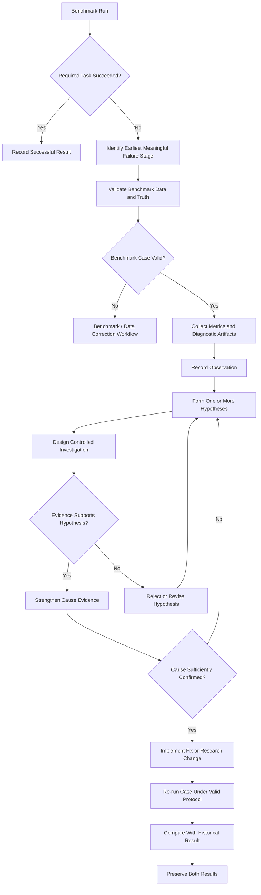
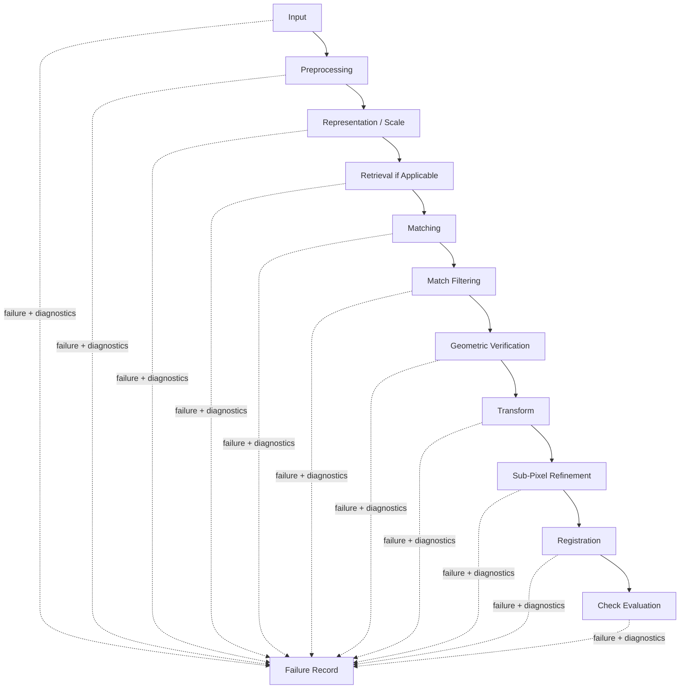
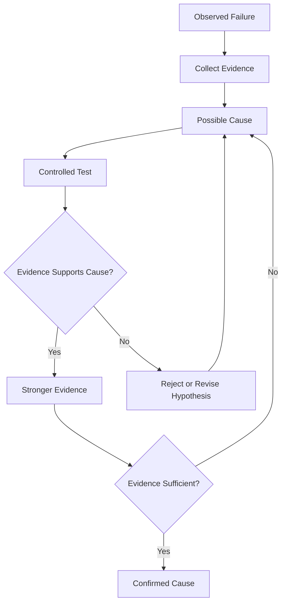

# Failure Cases

ChandraMap treats failure cases as first-class scientific results. A failed registration, retrieval, geometric-verification stage, or evaluation step can reveal limitations that successful examples cannot expose.

> **A failure case is a scientific result and must remain visible in benchmark reporting.**

Failure analysis is not simply a record of software errors. ChandraMap can fail scientifically even when every software component executes successfully. For example, a finite transformation matrix may be produced while the system:

- aligns the wrong lunar region;
- has severely clustered geometric support;
- produces poor held-out check-point accuracy;
- uses an inappropriate geometric model;
- produces scientifically implausible registration.

Conversely, a software exception may interrupt a run without revealing anything about the underlying scientific registration capability.

> **A trustworthy benchmark records where the system fails as carefully as where it succeeds.**

A central principle is that the stage where a failure becomes visible is not necessarily the underlying cause.

> **The stage where a failure becomes visible is not necessarily the root cause of that failure.**

For example, RANSAC may fail because the matcher supplied mostly incorrect correspondences. In that case:

- observed failure stage: geometric verification;
- possible upstream cause: correspondence failure.

ChandraMap therefore separates:

- observation;
- evidence;
- hypothesis;
- confirmed cause.

> **Failure analysis should distinguish observation, evidence, hypothesis, and confirmed cause.**

A difficult valid benchmark case must not disappear simply because the current system cannot solve it.

> **Do not remove difficult benchmark pairs simply because they fail.**

Removal or correction is justified only when independent evidence establishes a problem with the benchmark itself, such as:

- invalid data;
- incorrect truth;
- wrong pair definition;
- incorrect metadata;
- invalid coordinate mapping.

Failure values must also remain semantically correct.

> **Failure should not be encoded as fake metric values.**

If no final transform exists, check RMSE is usually unavailable. That does not mean:

- `RMSE = 0`;
- `accuracy = 0%`;
- a fabricated numerical error should be inserted.

Finally:

> **Failure analysis must preserve the exact configuration that produced the failure.**

Without reproducible configuration and provenance, root-cause investigation quickly becomes guesswork.

---

## 1. Why Failure Cases Matter

Failure cases help ChandraMap:

- identify real operating limits;
- expose weak pipeline stages;
- reveal sensor-specific weaknesses;
- support robustness analysis;
- guide debugging;
- test scientific assumptions;
- discover coordinate and metadata problems;
- detect software regressions;
- prevent success-only reporting;
- motivate future research;
- preserve scientific transparency.

A benchmark containing only successful examples cannot characterize reliability.

---

## 2. What Failure Analysis Is Not

Failure analysis is not:

- deleting difficult pairs;
- guessing causes from one metric;
- blaming the final stage automatically;
- changing thresholds until a case succeeds;
- reporting only visually convincing runs;
- treating every exception as a scientific limitation;
- treating every scientific limitation as a software bug;
- rewriting ground truth after poor results;
- tuning final test cases individually;
- inventing numerical failure values.

---

# Core Terminology

## 3. Failure Case

A **failure case** is a benchmark case or run that does not satisfy the mandatory success criteria for the defined task.

The exact success criteria are benchmark-defined.

---

## 4. Failure Stage

A **failure stage** is the earliest meaningful pipeline stage where the failure becomes observable.

Examples include:

- input validation;
- preprocessing;
- retrieval;
- matching;
- geometric verification;
- transformation estimation;
- registration;
- evaluation.

Failure stage is not automatically root cause.

---

## 5. Root Cause

A **root cause** is an underlying reason for failure supported by sufficient evidence.

A root-cause claim should normally require more than one observation.

---

## 6. Suspected Cause

A **suspected cause** is a plausible explanation that has not yet been demonstrated sufficiently.

Examples might include:

- scale mismatch;
- illumination difference;
- wrong reference level;
- coordinate-mapping error.

Suspected causes must remain labeled as hypotheses.

---

## 7. Failure Symptom

A **failure symptom** is an observed indicator of a problem.

Examples include:

- zero candidate matches;
- few verified inliers;
- invalid transform;
- high held-out error;
- collapsed spatial coverage.

---

## 8. Partial Result

A **partial result** is a run that produced some useful outputs but did not satisfy the complete task.

Example:

- retrieval succeeds;
- local registration fails.

The overall end-to-end task still failed.

---

## 9. Invalid Benchmark Case

An **invalid benchmark case** is unsuitable for algorithm evaluation because the benchmark itself contains a defect such as:

- incorrect source/reference relationship;
- invalid truth;
- corrupted data;
- invalid coordinate mapping;
- incorrect metadata.

This is fundamentally different from a valid difficult case that the algorithm cannot solve.

---

## 10. Evaluation Failure

An **evaluation failure** occurs when an algorithm result exists but the evaluation cannot be completed correctly.

For example:

- check-point coordinate mapping is invalid;
- required truth is unavailable;
- a truth version is incompatible with the evaluated pair.

---

## 11. Algorithm Failure

An **algorithm failure** occurs when the scientific pipeline cannot produce the required valid output for an otherwise valid benchmark case.

---

## 12. Data Failure

A **data failure** may include:

- missing product;
- corrupt raster;
- invalid dimensions;
- unsupported representation;
- unusable data.

---

## 13. Configuration Failure

A **configuration failure** occurs when the run configuration is internally inconsistent or invalid.

Examples may include:

- incompatible matcher/representation combination;
- missing required scale configuration;
- invalid transform request.

---

## 14. Retrieval Failure

A **retrieval failure** occurs when no benchmark-approved reference candidate appears within the benchmark-defined evaluated ranking or candidate set.

---

## 15. Matching Failure

A **matching failure** occurs when local matching does not provide sufficient usable correspondence support for downstream geometry.

---

## 16. Geometric-Verification Failure

A **geometric-verification failure** occurs when robust estimation cannot identify a valid, sufficiently supported geometric model.

---

## 17. Transform Failure

A **transform failure** occurs when the requested transformation:

- cannot be estimated;
- cannot be validated;
- is numerically invalid;
- is geometrically unacceptable under the benchmark protocol.

---

## 18. Refinement Failure

A **refinement failure** occurs when optional refinement:

- cannot produce valid refined points;
- removes too much usable support;
- causes downstream degradation;
- cannot complete safely.

---

## 19. Registration Failure

A **registration failure** occurs when the final registration does not satisfy the benchmark-defined registration requirements.

A transformation matrix may still exist.

---

## 20. Check-Evaluation Failure

A **check-evaluation failure** occurs when independent held-out evaluation cannot be completed validly.

---

## 21. Wrong-Region Failure

A **wrong-region failure** occurs when retrieval or local correspondence aligns the source with a geographically incorrect but visually similar lunar region.

---

## 22. Abstention / No-Result

An **abstention** or **no-result** is an intentional refusal to produce registration under a predefined validity policy.

This is a useful future/research concept unless current implementation explicitly supports it.

An abstention is not necessarily equivalent to an unexpected crash.

---

# Failure vs Related Concepts

## 23. Failure vs Limitation

A **limitation** is a known boundary or restriction of the data or method.

For example:

> IIRS has much coarser spatial sampling than NAC.

That is a sensor/data limitation.

A particular IIRS → NAC registration not satisfying benchmark criteria is a failure case.

---

## 24. Failure vs Invalid Benchmark

These must remain separate.

### Algorithm Failure

Valid benchmark:

- data valid;
- pair valid;
- truth valid;

but the algorithm does not meet task criteria.

### Invalid Benchmark

The evaluation case itself contains a scientific or technical defect.

> **Do not hide difficult algorithm failures by reclassifying valid cases as invalid.**

---

## 25. Failure vs Unavailable Metric

Conceptually:

`RANSAC failure → no final transform → check RMSE unavailable`

This does not imply:

`check RMSE = 0`.

Preserve:

- failure stage;
- status;
- available diagnostics;
- unavailable metric state.

---

## 26. Failure vs Partial Completion

A pipeline may partially succeed.

For example:

- retrieval: success;
- candidate matching: success;
- local registration: failure.

Stage-specific statuses should be preserved while the overall task is reported correctly.

---

# Failure Analysis Model

## 27. Observation → Evidence → Hypothesis → Confirmation

ChandraMap failure analysis should follow a disciplined evidence hierarchy.

| Level        | Meaning                        | Example                                                                             |
| ------------ | ------------------------------ | ----------------------------------------------------------------------------------- |
| Observation  | What occurred                  | No valid transform was produced                                                     |
| Evidence     | Recorded facts                 | Few verified inliers and low spatial coverage                                       |
| Hypothesis   | Plausible explanation          | Reference scale may be inappropriate                                                |
| Confirmation | Controlled supporting evidence | Comparable runs with a GSD-aware reference level consistently restore valid support |

Do not jump directly from:

> observation

to:

> confirmed cause.

---

## 28. Multiple Hypotheses Are Acceptable

One failure may support several plausible explanations.

For example, low verified-inlier count may be consistent with:

- scale mismatch;
- illumination difference;
- poor preprocessing;
- weak terrain structure;
- wrong reference region.

Preserve competing hypotheses until evidence distinguishes them.

---

## 29. Cause May Remain Unknown

A scientifically valid failure record can state:

> root cause unconfirmed.

It is better to preserve uncertainty than invent a confident explanation.

---

# Sensor Context

## 30. OHRC

The Chandrayaan-2 **Orbiter High Resolution Camera (OHRC)** is visible/panchromatic imagery.

Current project context commonly uses approximately:

> **~0.25–0.32 m/pixel**

depending on product/documentation.

Actual metadata remains authoritative.

Possible failure contributors include:

- illumination changes;
- shadow displacement;
- repeated fine crater structure;
- reference-scale difference;
- viewing geometry;
- local feature clustering.

None should be assumed to be the cause without evidence.

See [`../sensors/ohrc.md`](../sensors/ohrc.md).

---

## 31. TMC-2

The Chandrayaan-2 **Terrain Mapping Camera-2 (TMC-2)** provides panchromatic terrain imagery.

Current project planning commonly uses approximately:

> **~5 m/pixel**

with actual product metadata authoritative.

Possible contributors include:

- fine-reference scale mismatch;
- limited shared fine detail;
- low-feature terrain;
- illumination differences;
- projection/view geometry.

See [`../sensors/tmc2.md`](../sensors/tmc2.md).

---

## 32. IIRS

The Chandrayaan-2 **Imaging Infrared Spectrometer (IIRS)** is a hyperspectral/imaging-infrared instrument.

Current project context includes approximately:

- ~80 m/pixel;
- ~0.8–5.0 µm;
- roughly ~250–256 bands depending on product/documentation.

Actual metadata remains authoritative.

IIRS requires a documented registration-friendly 2D representation.

Possible contributors include:

- strong physical scale difference;
- modality difference;
- representation choice;
- limited shared fine structure;
- inappropriate reference scale.

> **Upsampling does not recover missing spatial information.**

See [`../sensors/iirs.md`](../sensors/iirs.md).

---

## 33. LRO NAC

LROC **Narrow Angle Camera (NAC)** imagery is a fine/local lunar reference.

Current project planning commonly uses approximately:

> **~0.5–2 m/pixel**

depending on product/acquisition geometry.

Fine NAC detail may exceed the physically available information in TMC-2 or IIRS.

A meaningful reference pyramid may therefore be important.

See [`../sensors/lro-nac.md`](../sensors/lro-nac.md).

---

## 34. LRO WAC

LROC **Wide Angle Camera (WAC)** provides broad/coarse lunar context.

Its scale is product/mode/processing dependent.

Possible failure contexts include:

- coarse retrieval ambiguity;
- insufficient detail for fine local registration;
- coarse-to-fine hierarchy issues.

Do not invent one universal WAC GSD.

See [`../sensors/lro-wac.md`](../sensors/lro-wac.md).

---

# Failure Taxonomy

## 35. Top-Level Failure Stages

ChandraMap may classify observed failures into:

1. input/data validation;
2. metadata/pair definition;
3. preprocessing;
4. representation generation;
5. scale selection;
6. retrieval;
7. local matching;
8. match filtering;
9. geometric verification;
10. transform fitting/validation;
11. sub-pixel refinement;
12. registration/warping;
13. check-point evaluation;
14. geolocation;
15. runtime/resource;
16. reproducibility/configuration;
17. benchmark/truth issues.

These identify **where failure becomes visible**.

They do not automatically identify **why it happened**.

---

# Input and Data Failures

## 36. Input / Data Validation Failure

Possible symptoms include:

- unreadable file;
- missing product;
- unsupported format;
- corrupt raster;
- invalid dimensions;
- missing required bands;
- missing required representation.

Recommended behavior:

- stop early;
- record failure explicitly;
- preserve diagnostic information;
- do not fabricate replacement data.

---

## 37. Missing vs Invalid Input

These should be distinguishable.

### Missing

Expected asset cannot be found.

### Invalid

Asset exists but cannot satisfy required validation.

---

# Metadata and Pair Failures

## 38. Metadata Failure

Possible symptoms include:

- unknown sensor;
- inconsistent GSD;
- missing product identity;
- conflicting projection metadata;
- missing IIRS representation lineage.

Distinguish optional metadata from metadata required for the current task.

---

## 39. Pair-Definition Failure

See [`../datasets/pair-definition.md`](../datasets/pair-definition.md).

Possible defects include:

- incorrect source/reference pairing;
- no actual overlap in a known-overlap benchmark;
- mismatched pair version;
- wrong reference product;
- invalid expected relationship.

This may indicate an invalid benchmark case rather than algorithm failure.

---

# Preprocessing Failures

## 40. Preprocessing Failure

See [`../algorithms/preprocessing.md`](../algorithms/preprocessing.md).

Possible symptoms include:

- all pixels become invalid;
- normalization produces unusable values;
- masks remove usable terrain;
- output dimensions are corrupted;
- coordinate lineage is lost;
- sensor representation is unsupported.

---

## 41. Prepared Raster Is Not Registration Success

Successful preprocessing only means a usable intermediate representation was produced.

It does not establish:

- valid correspondence;
- valid geometry;
- correct registration.

---

# IIRS Representation Failures

## 42. IIRS 2D Representation Failure

Possible failure modes include:

- no valid band/derived representation;
- invalid values in the representation;
- parent-cube spatial mapping lost;
- representation contains insufficient shared spatial structure.

Do not treat the full hyperspectral cube as one ordinary grayscale image.

---

## 43. Representation Failure Can Look Like Matcher Failure

If an unsuitable representation is passed into a matcher, the observable symptom may appear at matching.

The underlying problem may be upstream representation selection.

---

# Scale-Selection Failures

## 44. Reference Too Fine

Fine NAC imagery can contain structures unavailable in:

- TMC-2;
- IIRS.

Possible symptoms include:

- unstable local matches;
- repetitive fine-feature confusion;
- low verified support.

---

## 45. Reference Too Coarse

An excessively coarse reference can remove useful shared structures.

---

## 46. Source Upsampling Is Not a Physical Fix

Upsampling a source:

- changes raster sampling;
- does not create new lunar information.

See [`../algorithms/scale-pyramid.md`](../algorithms/scale-pyramid.md).

---

## 47. Scale Failure Evidence

Useful evidence may include:

- source GSD;
- effective reference GSD;
- selected pyramid level;
- candidate count across controlled levels;
- inlier count across levels;
- coverage across levels;
- held-out error across levels.

Do not attribute failure to scale without supporting evidence.

---

# Retrieval Failures

## 48. Retrieval Miss

A retrieval miss occurs when no benchmark-approved reference appears in the evaluated Top-K set.

`K` is benchmark-defined.

See [`metrics.md`](metrics.md).

---

## 49. Wrong-Region Retrieval

Repeated lunar morphology may produce plausible but geographically incorrect retrieval results.

---

## 50. Correct Region at Lower Rank

Whether a correct region at a lower rank counts as retrieval success depends on the benchmark-defined `K`.

Do not invent the value.

---

## 51. Retrieval Success but Registration Failure

Preserve both stage outcomes:

- retrieval: success;
- local registration: failure.

---

## 52. Registration After Non-Top1 Retrieval

A valid candidate may appear later in Top-K and register successfully.

Keep:

- retrieval rank;
- retrieval metric;
- local registration metric;

separate.

---

# Matching Failures

## 53. Zero Candidate Matches

Potential contributors include:

- low-feature terrain;
- modality difference;
- scale mismatch;
- mask error;
- preprocessing error;
- matcher/representation incompatibility.

Do not automatically select one cause.

---

## 54. Too Few Usable Candidates

Some correspondences may exist without providing enough reliable geometric support.

No universal required count is defined here.

---

## 55. Many Candidates, Poor Quality

A high candidate count can coexist with:

- heavy ambiguity;
- many false correspondences;
- poor geometry.

Evaluate downstream:

- filtering;
- RANSAC;
- spatial coverage;
- held-out error.

See [`../algorithms/matching.md`](../algorithms/matching.md).

---

## 56. Spatially Clustered Candidates

Candidate matches may concentrate around one:

- crater;
- ridge;
- high-contrast region.

This weakens scene-wide geometric support.

Related spatial-coverage guidance should be consulted in `spatial-coverage.md` when present.

---

# Match-Filtering Failures

## 57. Over-Filtering

Possible symptoms include:

- too few candidates survive;
- coverage collapses;
- whole image regions lose support.

---

## 58. Under-Filtering

Possible symptoms include:

- many outliers enter RANSAC;
- robust estimation becomes unstable;
- runtime increases;
- false consensus risk increases.

---

## 59. Threshold Sensitivity

A filtering configuration that performs well on OHRC → NAC may behave differently on IIRS → NAC.

Do not assume universal cross-sensor thresholds.

See [`../algorithms/match-filtering.md`](../algorithms/match-filtering.md).

---

# Geometric-Verification Failures

## 60. No Valid RANSAC Model

Possible contributors include:

- excessive outliers;
- too few candidates;
- degenerate geometry;
- inappropriate model;
- wrong reference region;
- coordinate error.

See [`../algorithms/ransac.md`](../algorithms/ransac.md).

---

## 61. Too Few Verified Inliers

This is a useful diagnostic.

No universal minimum is defined here.

---

## 62. High Inlier Ratio Can Still Be Weak

For example:

- very few candidates;
- most happen to agree.

A high ratio alone does not establish strong registration.

Report:

- count;
- ratio;
- spatial coverage;
- independent error.

---

## 63. Clustered Consensus

A large number of inliers concentrated in a small area can still provide weak support for the complete overlap.

---

## 64. False Consensus

Repeated crater geometry can sometimes produce a coherent but geographically incorrect match set.

> **RANSAC inlier does not mean independent ground truth.**

---

# Transform Failures

## 65. No Transform

Transformation estimation may fail mathematically or because the required support is unavailable.

---

## 66. Non-Finite Transform

Examples include:

- `NaN`;
- infinity;
- invalid matrix components.

This is an immediate technical failure.

---

## 67. Singular or Non-Invertible Transform

This becomes a failure when:

- inversion is required;
- the transformation cannot be inverted safely.

---

## 68. Finite but Scientifically Wrong Transform

A numerically valid transform can still represent scientific failure.

Examples include:

- wrong lunar region;
- poor check RMSE;
- severe support clustering;
- geometrically implausible mapping.

> **A numerically valid transform can still represent a scientific registration failure.**

---

## 69. Implausible Transform

Transform plausibility criteria must be:

- benchmark-defined;
- task-specific;
- scientifically justified.

Do not invent universal:

- rotation limits;
- scale limits;
- shear limits.

---

## 70. Over-Flexible Transform

A homography may fit the control geometry closely while generalizing poorly.

Use held-out evaluation rather than fit error alone.

See [`../algorithms/transforms.md`](../algorithms/transforms.md).

---

# Sub-Pixel Refinement Failures

## 71. Refinement Cannot Produce Valid Coordinates

Possible symptoms include:

- refinement does not converge;
- refined position leaves valid bounds;
- patch becomes invalid;
- local optimum is ambiguous;
- refined displacement is suspicious.

Threshold semantics are implementation/configuration specific.

---

## 72. Fit Improves but Check Error Worsens

This is an important failure mode.

A refinement method may:

- reduce fit residual;
- worsen held-out check RMSE.

That indicates poorer independent registration performance for that case.

---

## 73. Coverage Loss After Refinement

If many refined points are rejected, the remaining fit geometry may become:

- sparse;
- clustered;
- unstable.

Track:

- retained point count;
- spatial coverage;
- held-out error.

See [`../algorithms/subpixel-refinement.md`](../algorithms/subpixel-refinement.md).

---

# Registration and Warp Failures

## 74. Warp Cannot Be Produced

Possible contributors include:

- invalid transform;
- incompatible grid;
- software/runtime failure.

---

## 75. Registered Output Mostly Invalid

Possible explanations include:

- incorrect transform;
- wrong coordinate chain;
- legitimately small overlap.

Further diagnosis is required.

---

## 76. Visually Wrong Overlay

A visibly incorrect overlay is useful evidence that something is wrong.

It is not sufficient evidence of the root cause.

---

## 77. Visually Convincing Overlay, Poor Check Accuracy

A locally convincing preview may still have high independent error.

See [`../algorithms/registration.md`](../algorithms/registration.md).

Visual quality does not replace quantitative evaluation.

---

# Check-Point Evaluation Failures

## 78. No Independent Check Points

If no valid held-out truth exists:

> independent registration accuracy is unavailable.

Do not substitute:

- fit RMSE;
- RANSAC residual.

See [`checkpoint-evaluation.md`](checkpoint-evaluation.md).

---

## 79. Invalid Truth Coordinate Mapping

Possible issues include:

- missing crop offset;
- wrong tile origin;
- incorrect pyramid level;
- coordinate-convention mismatch.

This may be an evaluation failure rather than algorithm failure.

---

## 80. High Check RMSE

A valid run may produce a transform but fail benchmark-defined accuracy criteria.

Do not remove high-error check points merely because they worsen the result.

---

## 81. Low Check-Point Coverage

Low check RMSE over strongly clustered check points provides limited whole-image evidence.

---

# Spatial-Coverage Failure Patterns

## 82. High Count, Low Coverage

Many verified points can occupy one small region.

This is weak global support even if the count appears large.

---

## 83. Large Convex Hull, Poor Interior Support

Convex-hull coverage may appear high even when point support is concentrated around the perimeter.

A grid-based diagnostic can reveal interior gaps.

---

## 84. Candidate Coverage High, Inlier Coverage Low

This may indicate:

- matching is spatially broad;
- only one local region survives geometry.

Coverage describes the pattern.

It does not automatically establish the cause.

---

# Ground-Truth and Benchmark Failures

## 85. Incorrect Ground Truth

Possible defects include:

- wrong physical feature;
- ambiguous annotation;
- incorrect coordinate;
- wrong asset;
- coordinate-conversion error.

See [`ground-truth.md`](ground-truth.md).

---

## 86. Excessive Truth Uncertainty

Truth may exist but be too uncertain to support very precise accuracy claims.

Do not force:

- sub-pixel claims;
- fine physical-distance claims;

beyond the truth's reliability.

---

## 87. Truth Leakage

Independent evaluation is compromised if final test truth influences:

- fitting;
- threshold tuning;
- matcher selection;
- transform selection.

This is an evaluation/protocol failure.

---

# Control-Point Failures

## 88. Poor Fit-Point Distribution

Clustered or nearly degenerate fit geometry may produce unstable transformation estimation.

See [`control-points.md`](control-points.md).

---

## 89. Fit / Check Mixing

A point mistakenly assigned to both sets invalidates independence.

For a formal run:

$$
\text{fit set} \cap \text{check set} = \varnothing
$$

---

## 90. Incorrect Point Role

Incorrect role metadata can invalidate evaluation semantics even when coordinates are otherwise correct.

---

# Illumination-Related Failures

## 91. Shadow Movement

Changing illumination geometry can move:

- shadow boundaries;
- illuminated rim regions;
- visible terrain structures.

This may create appearance-driven false correspondences.

---

## 92. Contrast Normalization Is Not Full Illumination Correction

Histogram or contrast normalization can alter intensity statistics.

It cannot physically move displaced shadows back to their original locations.

See [`../algorithms/illumination-handling.md`](../algorithms/illumination-handling.md).

---

## 93. Physical Terrain vs Shadow Structure

Match visualization and residual patterns may help determine whether correspondence follows:

- stable terrain;
- moving illumination boundaries.

Do not state certainty without sufficient evidence.

---

# Repetitive-Terrain Failures

## 94. Similar Craters

Repeated crater patterns can create descriptor ambiguity.

---

## 95. Plausible but Wrong Correspondence Network

A set of locally convincing matches can still represent the wrong terrain locations.

---

## 96. Wrong but Coherent Geometry

False correspondences may sometimes form a model-consistent geometric group.

Independent truth is required to expose this failure.

---

# Low-Feature Terrain Failures

## 97. Few Distinctive Structures

Low-feature terrain may produce very few meaningful candidates.

---

## 98. Sparse Geometric Support

Even correct sparse correspondences may be insufficient for robust transformation estimation.

---

## 99. Enhancement Does Not Create Physical Structure

Upsampling or contrast enhancement may make pixels visually easier to inspect.

It does not create new lunar detail absent from the observation.

---

# Geometry and Relief Failures

## 100. Local Success, Global Failure

A transform may align the central region while error increases toward image boundaries.

Possible contributors include:

- model limitation;
- projection differences;
- viewing geometry;
- terrain relief.

---

## 101. Relief-Sensitive Residuals

Terrain relief can produce spatially varying displacement that a single global model cannot represent perfectly.

The Moon is not a flat poster.

---

## 102. Homography Has Limits

A homography is a planar projective model.

It may be useful locally but should not automatically be assumed sufficient for:

- wide terrain extent;
- strong relief;
- projection mismatch.

See [`../algorithms/residual-analysis.md`](../algorithms/residual-analysis.md).

---

# Projection and Coordinate Failures

## 103. Projection Mismatch

Projection or map-grid differences may create systematic residual patterns.

---

## 104. x/y vs Row/Column Error

Mixing coordinate conventions can create severe registration errors.

---

## 105. Pixel-Origin Error

A zero-based vs one-based indexing mismatch can create systematic offset.

---

## 106. Pixel-Center vs Pixel-Corner Error

High-precision registration can be affected by different pixel-coordinate conventions.

---

## 107. Crop or Tile Offset Error

A locally correct match can become globally incorrect if crop/tile offsets are lost or applied incorrectly.

---

## 108. Pyramid-Level Error

Coordinates measured at one reference level must not be interpreted as coordinates from another level.

For example:

> pyramid-level coordinates interpreted as base-level coordinates

can create large apparent registration error.

---

# Wrong-Region Failures

## 109. Why Wrong-Region Failure Matters

The lunar surface contains repeated morphology.

A visually similar region can therefore appear locally plausible while being geographically incorrect.

---

## 110. Retrieval Wrong Region

A wrong reference tile may be retrieved because another region looks locally similar.

---

## 111. Local Wrong Region

Even within a broader correct search area, a local matcher may lock onto the wrong repeated feature pattern.

---

## 112. Evidence for Wrong-Region Failure

Useful evidence may include:

- independent truth mismatch;
- incompatible geographic footprint;
- large check error;
- inconsistent metadata;
- retrieval-truth mismatch.

Do not rely only on visual appearance.

---

# Runtime and Resource Failures

## 113. Timeout

A benchmark may define a runtime limit.

This file does not invent one.

---

## 114. Out of Memory

Large imagery, reference pyramids, or learned matchers may exceed available memory.

Record relevant hardware/environment context.

---

## 115. Resource Failure vs Scientific Failure

If registration logic is scientifically valid but execution cannot complete because of insufficient resources, classify that distinction explicitly.

Resource failure and registration-accuracy failure answer different questions.

---

# Software and Exception Failures

## 116. Unhandled Exception

A software exception should preserve information such as:

- stage;
- exception type;
- run/configuration;
- relevant software version.

---

## 117. Graceful Scientific Failure

A robust scientific pipeline should ideally be capable of returning:

> no valid transform

without crashing.

Graceful failure handling is an engineering-quality property.

---

# Failure Evidence

## 118. Evidence to Preserve

Where applicable, a failed run should retain:

- pair ID;
- benchmark version;
- run/configuration ID;
- source/reference sensors;
- source/reference products;
- source representation;
- GSD/effective GSD;
- selected reference/pyramid level;
- retrieval ranking;
- raw candidate count;
- filtered candidate count;
- verified inlier count;
- inlier ratio;
- spatial coverage;
- transform status;
- fit residuals where available;
- check-point count;
- check RMSE where valid;
- failure stage;
- suspected causes;
- runtime;
- logs/errors;
- diagnostic visualizations;
- software revision;
- random seed where relevant.

---

# Conceptual Failure Record

## 119. Illustrative Structure

The following is an **illustrative conceptual structure — not an implemented schema**:

```yaml
run_id: "PLACEHOLDER_RUN_ID"
pair_id: "PLACEHOLDER_PAIR_ID"
benchmark_version: "PLACEHOLDER_VERSION"

status: "failure"
failure_stage: "PLACEHOLDER_STAGE"

observations:
  - "PLACEHOLDER_OBSERVATION"

metrics:
  candidate_count: "PLACEHOLDER"
  inlier_count: "PLACEHOLDER"
  spatial_coverage: "PLACEHOLDER"
  check_rmse: "PLACEHOLDER_OR_UNAVAILABLE"

suspected_causes:
  - "PLACEHOLDER_HYPOTHESIS"

confirmed_cause:
  status: "PLACEHOLDER_CONFIRMATION_STATUS"

artifacts:
  - "PLACEHOLDER_DIAGNOSTIC_ARTIFACT"
```

No real result values or current repository schema are implied.

---

# Failure Classification Record

## 120. Observed Stage vs Cause

The following conceptual structure keeps observed failure separate from root cause:

```yaml
failure:
  observed_stage: "PLACEHOLDER_STAGE"

  symptom:
    type: "PLACEHOLDER_SYMPTOM"

  evidence:
    - "PLACEHOLDER_EVIDENCE"

  hypotheses:
    - "PLACEHOLDER_HYPOTHESIS"

  root_cause:
    status: "unconfirmed"
    value: null
```

Root cause should remain unconfirmed until the evidence supports a stronger conclusion.

---

# Failure Reporting Templates

## 121. Pair-Level Failure Table

| Pair | Sensor Pair | Failure Stage | Candidates | Inliers | Coverage | Check RMSE | Suspected Cause | Status |
| ---- | ----------- | ------------- | ---------: | ------: | -------: | ---------: | --------------- | ------ |

No fake results should be inserted.

---

## 122. Failure-Stage Summary

| Failure Stage | Cases | Percentage of Benchmark | Common Symptoms | Notes |
| ------------- | ----: | ----------------------: | --------------- | ----- |

Populate only from actual benchmark results.

---

## 123. Sensor-Stratified Failure Summary

| Source Sensor | Reference Sensor | Cases | Successes | Failures | Most Frequent Observed Stage | Notes |
| ------------- | ---------------- | ----: | --------: | -------: | ---------------------------- | ----- |

No values are implied by this template.

---

# Failure Investigation Workflow

## 124. Recommended Process

For a failed benchmark run:

1. confirm the benchmark case itself is valid;
2. reproduce the failure with the frozen configuration;
3. identify the earliest meaningful observable failure stage;
4. preserve preceding-stage metrics and artifacts;
5. verify source/reference data integrity;
6. verify metadata and pair definition;
7. verify coordinate conventions and mappings;
8. compare with a scientifically similar successful/control case where useful;
9. formulate one or more hypotheses;
10. design a controlled experiment;
11. confirm, reject, or refine each hypothesis;
12. document the outcome;
13. add regression coverage where appropriate;
14. preserve the original failure in benchmark history.

---

# Reproducibility

## 125. Reproduce Before Diagnosing

Where possible, rerun the failure using the same:

- data;
- benchmark version;
- configuration;
- random seed;
- software revision;
- environment/hardware context where material.

> **Reproduction should precede confident root-cause analysis.**

---

## 126. Non-Deterministic Failures

If a failure is intermittent:

- record repeated behavior;
- preserve relevant random state;
- avoid claiming a deterministic root cause prematurely.

No universal rerun count is prescribed.

---

## 127. Random Seeds

Record seeds where relevant for:

- RANSAC;
- synthetic tests;
- stochastic learned components;
- randomized preprocessing.

---

# Comparison With Successful Cases

## 128. Paired Diagnosis

A useful diagnostic strategy is to compare:

- a failed pair;
- a scientifically similar successful pair.

Relevant differences may include:

- GSD;
- illumination;
- feature distribution;
- modality;
- geometry;
- retrieval context.

Correlation alone does not establish causation.

---

# Controlled Failure Experiments

## 129. One Factor at a Time

When practical, change one primary variable while holding the rest fixed.

Example:

- same source/reference pair;
- same matcher;
- same truth;
- different reference pyramid level.

This can test a scale-selection hypothesis.

---

## 130. Illumination Hypothesis

Compare:

- baseline representation;
- illumination-handled representation;

on the same pair and truth.

Do not infer universal illumination robustness from one case.

---

## 131. Filtering Hypothesis

Filtering configurations should be studied on:

- development;
- validation;

data rather than tuned repeatedly on final test cases.

---

## 132. Transform Hypothesis

Compare affine and homography, where appropriate, using the same held-out check set.

A lower fit residual does not automatically imply a better model.

---

# Relationship to Stress Tests

## 133. [`stress-tests.md`](stress-tests.md)

Stress testing deliberately introduces or selects difficult conditions.

Failure analysis examines the resulting failures.

A stress test may therefore help map:

- sensitivity;
- robustness limits;
- potential failure envelope.

Not every stress-induced failure is a software defect.

---

# Relationship to Success Criteria

## 134. Success Criteria

Related success-criteria documentation should be consulted in `success-criteria.md` when present.

Formal failure occurs when a run does not satisfy benchmark-defined mandatory criteria.

Those criteria must be frozen before test execution.

Do not define failure after inspecting the results.

---

# Relationship to Metrics

## 135. [`metrics.md`](metrics.md)

Metrics describe how the system behaved before and during failure.

Unavailable metrics should remain unavailable rather than receiving fabricated numerical values.

---

## 136. Success-Only Error Reporting

If RMSE is calculated only for successful registrations, benchmark reporting should also include:

- total cases;
- successes;
- failures;
- failure rate.

Otherwise, an apparently good error average can hide poor reliability.

---

# Relationship to Check-Point Evaluation

## 137. [`checkpoint-evaluation.md`](checkpoint-evaluation.md)

High independent check error may represent registration failure when benchmark-defined criteria are not met.

Missing check error can have several different causes:

- no valid transform;
- no independent truth;
- invalid evaluation mapping.

These should not be collapsed into one state.

---

# Relationship to Spatial Coverage

## 138. Spatial Coverage

Related coverage documentation should be consulted in `spatial-coverage.md` when present.

Coverage can reveal weak geometric support before complete failure.

Low coverage is diagnostic evidence.

It is not automatically the root cause.

---

# Relationship to Ground Truth

## 139. [`ground-truth.md`](ground-truth.md)

A large residual can result from:

- algorithm error;
- truth error;
- coordinate-mapping error.

Truth should be reviewed independently.

Do not edit truth merely to improve performance.

---

# Relationship to Control Points

## 140. [`control-points.md`](control-points.md)

Poor fit/control-point geometry can contribute to transformation instability.

Fit/check leakage is an evaluation failure.

---

# Relationship to Benchmark Categories

## 141. [`benchmark-categories.md`](benchmark-categories.md)

Failure results can be stratified by:

- sensor pair;
- scale stress;
- illumination stress;
- modality;
- terrain;
- geometry;
- retrieval context.

If one category fails more often, do not automatically treat that category as the sole cause.

---

# Relationship to Benchmark Protocol

## 142. [`benchmark-protocol.md`](benchmark-protocol.md)

The protocol should define how failed runs enter:

- aggregate metrics;
- success/failure reporting;
- reproducibility records.

Do not silently retry failed test cases with different configurations.

---

# Relationship to Dataset Documentation

## 143. Dataset Preparation

See [`../datasets/dataset-preparation.md`](../datasets/dataset-preparation.md).

Data-preparation failures should be detected before formal algorithm benchmarking where possible.

---

## 144. Metadata

See [`../datasets/metadata.md`](../datasets/metadata.md).

Incorrect metadata can mimic an algorithmic problem.

---

## 145. Data Format

See [`../datasets/data-format.md`](../datasets/data-format.md).

Incorrect assumptions about:

- coordinate layout;
- array shape;
- data type;

can cause technical failures.

---

## 146. Dataset Structure

See [`../datasets/dataset-structure.md`](../datasets/dataset-structure.md).

Failure outputs and logs should remain separate from immutable/raw mission data.

---

# Relationship to Algorithm Documentation

## 147. Matching

See [`../algorithms/matching.md`](../algorithms/matching.md).

Preserve:

- candidate counts;
- distribution;
- matcher-specific score semantics.

Do not directly compare incompatible confidence values across matchers.

---

## 148. Match Filtering

See [`../algorithms/match-filtering.md`](../algorithms/match-filtering.md).

Failure analysis may ask whether filtering:

- removed too much valid support;
- retained too many outliers.

---

## 149. RANSAC

See [`../algorithms/ransac.md`](../algorithms/ransac.md).

Separate:

> RANSAC failed to find a model

from:

> RANSAC itself was the root cause.

Poor upstream correspondences may be responsible.

---

## 150. Transforms

See [`../algorithms/transforms.md`](../algorithms/transforms.md).

Model mismatch may produce:

- systematic residuals;
- poor held-out accuracy.

---

## 151. Sub-Pixel Refinement

See [`../algorithms/subpixel-refinement.md`](../algorithms/subpixel-refinement.md).

A more precise wrong correspondence remains wrong.

Refinement may worsen independent accuracy.

---

## 152. Residual Analysis

See [`../algorithms/residual-analysis.md`](../algorithms/residual-analysis.md).

Residual vectors may reveal:

- bias;
- edge growth;
- local deformation;
- terrain-related patterns.

These patterns support hypotheses rather than proving cause.

---

## 153. Registration

See [`../algorithms/registration.md`](../algorithms/registration.md).

Registered previews are diagnostic artifacts.

They are not proof of success.

---

## 154. Scale Pyramid

See [`../algorithms/scale-pyramid.md`](../algorithms/scale-pyramid.md).

Controlled level comparisons can test whether source/reference information mismatch contributes to failure.

---

## 155. Illumination Handling

See [`../algorithms/illumination-handling.md`](../algorithms/illumination-handling.md).

Changes in Sun geometry may alter correspondence appearance and distribution.

---

## 156. Sensor Routing

See [`../algorithms/sensor-routing.md`](../algorithms/sensor-routing.md).

Incorrect route or representation selection can create downstream symptoms.

---

# Failure Visualizations

## 157. Useful Diagnostic Artifacts

Potential artifacts include:

- source/reference image pair;
- raw candidate-match plot;
- filtered-match plot;
- RANSAC inlier/outlier plot;
- spatial coverage map;
- residual-vector field;
- check-point prediction plot;
- registered overlay;
- retrieval Top-K preview;
- valid-data mask.

---

## 158. Visual Evidence Is Supporting Evidence

Do not diagnose root cause from visualization alone.

Combine visual evidence with:

- metrics;
- metadata;
- coordinate checks;
- controlled experiments.

---

# Generic Failure Classes

## 159. Common Classes to Track

Generic failure classes may include:

- no matches;
- too few usable matches;
- false correspondence cluster;
- wrong-region retrieval;
- degenerate geometry;
- invalid transformation;
- overfit transformation;
- low verified-inlier coverage;
- high held-out error;
- IIRS representation failure;
- scale-selection failure;
- illumination/shadow mismatch;
- projection/relief limitation.

These are generic failure classes.

They are not claims that each has already occurred in the current repository.

---

# Future Failure Registry

## 160. Conceptual Registry

A future failure registry may track:

- failure ID;
- pair/run ID;
- first observed version;
- current reproduction status;
- observed failure stage;
- suspected cause;
- confirmed cause where available;
- linked issue;
- regression test;
- resolution status.

Treat this as recommended architecture unless implementation confirms such a registry exists.

---

# Regression Testing

## 161. Convert Confirmed Software Bugs Into Tests

When a failure is caused by a reproducible:

- coordinate bug;
- parsing bug;
- software defect;

add a regression test where practical.

---

## 162. Preserve Scientific Failure Cases

Not every scientifically difficult case should become a unit test expecting success.

Some cases should remain benchmark failures used to monitor research progress.

---

# Failure Resolution

## 163. When a Failure Can Be Considered Resolved

A failure may be considered resolved when appropriate evidence shows that:

- the cause is understood sufficiently;
- the relevant change is implemented;
- the case is rerun under a valid compatible protocol;
- mandatory success criteria are satisfied.

---

## 164. Preserve Historical Failure Results

Do not delete the earlier failed result.

Preserve:

- original failure;
- later improved result;
- version/configuration differences.

This maintains reproducibility.

---

# New Failures and Regressions

## 165. Regression

If a previously successful case begins to fail under a compatible benchmark and configuration context, record it as a regression candidate.

---

## 166. Establishing a Regression

Use compatible:

- pair;
- truth;
- benchmark criteria;
- metric definitions;

when comparing versions.

Do not infer regression from incompatible experiments.

---

# Aggregate Failure Reporting

## 167. Failure Rate

For a clearly defined benchmark population:

$$
\text{Failure Rate}
=
\frac{
N_{\text{failed}}
}{
N_{\text{total}}
}
$$

See [`metrics.md`](metrics.md).

---

## 168. Failure-Stage Distribution

Report how many failures become observable at each pipeline stage.

This describes failure distribution.

It does not prove stage-specific causality.

---

## 169. Sensor-Stratified Failure Reporting

Useful groupings may include:

- OHRC → NAC;
- TMC-2 → NAC;
- IIRS → NAC.

Always retain sample-size context.

---

## 170. Category-Stratified Failure Reporting

Useful categories may include:

- scale stress;
- illumination stress;
- cross-modality;
- repetitive terrain;
- low-feature terrain;
- geometry stress.

Frequency alone does not establish cause.

---

# No Success-Only Benchmarking

## 171. Keep Failed Cases in Aggregates

Do not compute error over successful cases and silently omit all failed registrations.

If error metrics are available only for successful cases, report both:

- successful-case error;
- overall success/failure statistics.

---

# Failure Severity

## 172. Avoid Arbitrary Severity Scores

Do not create unsupported scores such as:

`failure severity = 8/10`

Prefer explicit descriptions of:

- observed stage;
- impact;
- available outputs;
- benchmark consequence.

---

## 173. Impact Description

Possible conceptual impact descriptions include:

- retrieval unavailable;
- no valid transform;
- inaccurate registration;
- geolocation unavailable;
- evaluation unavailable;
- visualization available but scientific criteria unmet.

Exact enum values are not defined here.

---

# Failure Status

## 174. Conceptual Investigation States

Possible concepts include:

- open;
- reproduced;
- under investigation;
- cause supported;
- cause confirmed;
- resolved;
- benchmark limitation.

These are conceptual only.

Do not assume they are implemented schema values.

---

# Versioned Failure-Analysis Strategy

## 175. V1

V1 should keep failure analysis simple and useful.

Recommended conceptual V1 tracking includes:

- invalid input;
- zero/too-few candidates;
- RANSAC failure;
- invalid transform;
- low spatial support;
- check-evaluation failure;
- high independent error;
- runtime exception;
- explicit failure stage;
- basic diagnostic artifacts.

Primary V1 objective:

> **Every known-overlap benchmark pair should either produce a scientifically evaluated registration result or a clear, reproducible failure record.**

V1 does not need:

- automated root-cause classification;
- planetary control-network diagnosis;
- advanced uncertainty models;
- large learned failure taxonomies.

---

## 176. V2

Possible V2 additions include:

- refinement-specific failures;
- IIRS representation failure analysis;
- scale/illumination failure categories;
- richer residual diagnostics;
- automated coverage diagnostics;
- stronger regression tracking.

---

## 177. V3

Possible V3 additions include:

- retrieval failures;
- learned-matcher failures;
- Top-K verification failures;
- WAC/NAC coarse-to-fine failures;
- resource/runtime failures;
- richer end-to-end stage attribution.

---

## 178. V4

Possible research directions include:

- DEM/relief failure analysis;
- multi-mission failure analysis;
- uncertainty-aware failure reasoning;
- sensor-model geometry;
- calibrated abstention;
- automated failure clustering;
- learned failure prediction;
- planetary control-network diagnostics.

These are future/research directions unless implementation explicitly establishes them.

---

# Main Failure-Analysis Flow

## 179. Investigation Workflow



---

# Pipeline Failure Flow

## 180. Stage-Oriented View



---

# Cause-Evidence Flow

## 181. Hypothesis Discipline



---

# Failure-Case Quality Control

## 182. Failed-Run Checklist

For every failed run, verify:

- [ ] Benchmark version is known.
- [ ] Pair/query ID is known.
- [ ] Source sensor is known.
- [ ] Reference sensor/product is known.
- [ ] Source representation is known.
- [ ] Selected reference/pyramid level is known.
- [ ] Matcher/configuration is known.
- [ ] Filtering configuration is known.
- [ ] RANSAC configuration is known where applicable.
- [ ] Transform model is known.
- [ ] Refinement configuration is known where applicable.
- [ ] Failure stage is recorded.
- [ ] Previous-stage outputs are preserved where possible.
- [ ] Candidate count is recorded where available.
- [ ] Filtered count is recorded where available.
- [ ] Inlier count is recorded where available.
- [ ] Inlier ratio denominator is clear where available.
- [ ] Spatial coverage is recorded where available.
- [ ] Transform status is recorded.
- [ ] Check-point status is recorded.
- [ ] Available RMSE values are correctly labeled.
- [ ] Unavailable metrics are not replaced with fake values.
- [ ] Pair validity has been checked.
- [ ] Truth validity has been checked.
- [ ] Coordinate mappings have been checked.
- [ ] Suspected causes are labeled as hypotheses.
- [ ] Root cause is not asserted without evidence.
- [ ] Logs/errors are retained where appropriate.
- [ ] Useful diagnostic visualizations are preserved.
- [ ] Software/configuration version is retained.
- [ ] Random seed is preserved where relevant.
- [ ] Failure remains visible in benchmark statistics.

---

# Failure Investigation Checklist

## 183. Investigation Checklist

When investigating a failure:

- [ ] Reproduce the run first.
- [ ] Validate source/reference data.
- [ ] Validate product metadata.
- [ ] Validate pair definition.
- [ ] Validate source/reference coordinate spaces.
- [ ] Validate crop and tile offsets.
- [ ] Validate pyramid-level mapping.
- [ ] Inspect GSD/effective-scale relationship.
- [ ] Inspect raw match distribution.
- [ ] Inspect filtering effects.
- [ ] Inspect RANSAC support.
- [ ] Inspect transform validity.
- [ ] Inspect fit residuals.
- [ ] Inspect held-out residual vectors.
- [ ] Inspect check-point truth.
- [ ] Compare a similar successful/control case where useful.
- [ ] Change one hypothesis-relevant factor at a time.
- [ ] Document whether evidence supported each hypothesis.
- [ ] Add regression coverage when appropriate.
- [ ] Preserve unresolved uncertainty.

---

# Failure Anti-Patterns

## 184. Do Not

Do not:

- remove a valid pair because it fails;
- call the final failing stage the root cause automatically;
- assign `RMSE = 0` to failed registration;
- fabricate accuracy values;
- hide failed runs from aggregate reporting;
- manually retry until one successful run appears and report only that run;
- switch matcher per test pair after seeing failure;
- modify RANSAC thresholds per pair after failure;
- change transform family after seeing test check error unless a predefined policy allows it;
- move held-out check points into fitting;
- delete difficult check points;
- call RANSAC inliers ground truth;
- treat a finite matrix as proof of correct registration;
- treat a visually good overlay as proof of success;
- treat low fit RMSE as independent accuracy;
- infer illumination failure from brightness alone;
- infer scale failure from image dimensions alone;
- blame IIRS solely because it is hyperspectral;
- assume upsampling fixes coarse source resolution;
- assume homography solves all lunar geometry;
- call every exception a scientific failure;
- call every scientific failure a software bug;
- silently modify benchmark truth;
- silently modify pair definitions;
- claim root cause without controlled evidence;
- invent arbitrary failure-severity scores;
- overwrite historical failures after a fix.

---

# Claims ChandraMap Should Avoid

## 185. Unsupported Failure Claims

Do not claim without evidence:

- "RANSAC caused the failure because RANSAC failed."
- "SIFT cannot work on lunar imagery."
- "LightGlue fixes every failure."
- "LoFTR is always more robust."
- "IIRS cannot be registered."
- "Scale mismatch caused the failure."
- "Illumination caused the failure."
- "Homography failed because the Moon is curved."
- "Low coverage proves the matches are wrong."
- "High RMSE proves the ground truth is wrong."
- "Wrong matches prove retrieval is wrong."
- "All failures are caused by poor features."
- "The system has 100% reliability" after excluding failed cases.
- "The system is robust" based only on successful cases.

---

# Limitations

## 186. Multiple Factors Can Produce One Failure

Real lunar image pairs often combine:

- scale;
- modality;
- illumination;
- geometry;
- terrain differences.

One failure may therefore have several contributing mechanisms.

---

## 187. Real Lunar Conditions Are Confounded

Controlled causal diagnosis may be difficult using real mission data alone.

---

## 188. Metadata May Be Incomplete

Missing:

- illumination geometry;
- viewing information;
- projection details;

can limit diagnosis.

---

## 189. Small Benchmark Sets Limit Causal Conclusions

A failure pattern observed on a few pairs should not automatically be generalized to all lunar imagery.

---

## 190. Ground Truth Contains Uncertainty

Large residuals can reflect both:

- algorithm error;
- truth uncertainty.

---

## 191. Residual Patterns Are Not Definitive Proof

A spatial pattern may support several possible explanations.

---

## 192. Scale and Modality Can Overlap

This is especially important for IIRS.

A real IIRS → NAC failure may involve:

- scale difference;
- modality difference;
- representation choice;

simultaneously.

---

## 193. Wrong-Region Failure Can Look Convincing

Repeated lunar morphology can make an incorrect alignment visually plausible.

---

## 194. Retrieval and Registration Failures Can Interact

A retrieval error can create downstream local-registration failure.

A local-registration failure can occur even after correct retrieval.

---

## 195. Engineering Failures Can Hide Scientific Behavior

Runtime exceptions or resource exhaustion may prevent assessment of the underlying scientific method.

---

## 196. Root Cause May Remain Unknown

Not every failure will be fully explained.

Preserving an unresolved but reproducible failure is scientifically acceptable.

---

## 197. Fixes Can Introduce New Regressions

Improving one sensor or stress category may affect another.

Regression benchmarking remains necessary.

---

## 198. Failure Taxonomy Will Evolve

New:

- sensors;
- retrieval methods;
- geometric models;
- learned components;

may introduce new failure classes.

---

# Authoritative and Primary Reference Categories

## 199. Image Registration and Computer Vision

Relevant authoritative or primary resources include:

- OpenCV documentation;
- primary RANSAC literature;
- image-registration literature;
- geometric model-estimation references.

---

## 200. Learned Matching

Relevant primary resources include:

- ALIKED primary publication/repository;
- official LightGlue repository/documentation;
- LoFTR primary publication/repository.

---

## 201. Remote Sensing

Relevant primary research categories include:

- RIFT literature;
- CFOG-related research;
- multimodal remote-sensing registration literature.

---

## 202. Planetary and Geospatial Processing

Relevant resources include:

- USGS ISIS;
- planetary control-network documentation;
- planetary photogrammetry references;
- planetary cartography references;
- lunar geodesy/topography resources where relevant.

---

## 203. Mission and Sensor Sources

Prefer authoritative resources including:

- ISRO Chandrayaan-2 documentation;
- ISRO / ISSDC / PRADAN;
- official OHRC documentation;
- official TMC-2 documentation;
- official IIRS documentation;
- NASA Lunar Reconnaissance Orbiter documentation;
- LROC / Arizona State University;
- NASA Planetary Data System.

Do not fabricate:

- URLs;
- DOIs;
- failure counts;
- failure percentages;
- exact thresholds;
- current root causes;
- benchmark results;
- sensor accuracy values.

---

# Failure-Analysis Principles

## 204. Failure Is a Valid Benchmark Result

Never hide it.

---

## 205. Failure Stage Is Not Root Cause

Record them separately.

---

## 206. Evidence Comes Before Causal Claims

Use:

> observation → evidence → hypothesis → confirmation.

---

## 207. Difficult Valid Cases Stay

Algorithm failure is not a reason to delete a benchmark pair.

---

## 208. Invalid Benchmark Is Different From Algorithm Failure

Preserve that distinction explicitly.

---

## 209. Unavailable Metric Is Not Zero

Never fabricate metric values to represent failure.

---

## 210. A Transform Matrix Can Still Be Wrong

Independent evaluation remains necessary.

---

## 211. RANSAC Inliers Are Not Truth

False consensus is possible.

---

## 212. Coverage Is Diagnostic

Spatial support helps interpret geometry but does not prove correctness.

---

## 213. Check Points Remain Independent

Do not rescue a failed run by fitting to held-out truth.

---

## 214. Coordinate Bugs Can Mimic Algorithm Failure

Always verify:

- axis convention;
- indexing;
- crop offsets;
- tile offsets;
- pyramid mappings.

---

## 215. Scale Requires Physical Context

Use GSD and effective GSD rather than raster dimensions alone.

---

## 216. Upsampling Does Not Recover Detail

This is especially important for:

- IIRS;
- TMC-2.

---

## 217. Illumination Attribution Requires Evidence

Brightness alone is not sufficient.

---

## 218. Wrong-Region Matching Is a Critical Failure Mode

Repeated lunar terrain can create convincing false correspondences.

---

## 219. Partial Results Stay Partial

Do not relabel partial pipeline completion as complete success.

---

## 220. Reproduce Before Diagnosing

Preserve configuration and provenance.

---

## 221. Controlled Experiments Test Hypotheses

Change one primary factor where practical.

---

## 222. Historical Failures Remain in History

Fixes produce new results rather than erasing old ones.

---

## 223. Keep V1 Failure Analysis Simple

Reliable stage/status/diagnostics are more valuable than premature automated root-cause inference.

> **When ChandraMap fails, the scientific objective is not to hide the case or guess a convenient explanation. The objective is to preserve the failed result, identify where failure became observable, collect reproducible evidence, separate hypotheses from confirmed causes, and use controlled investigation to improve both the system and the benchmark.**

<!-- ChandraMap failure-cases documentation specification and supplied project context: :contentReference[oaicite:0]{index=0} -->
